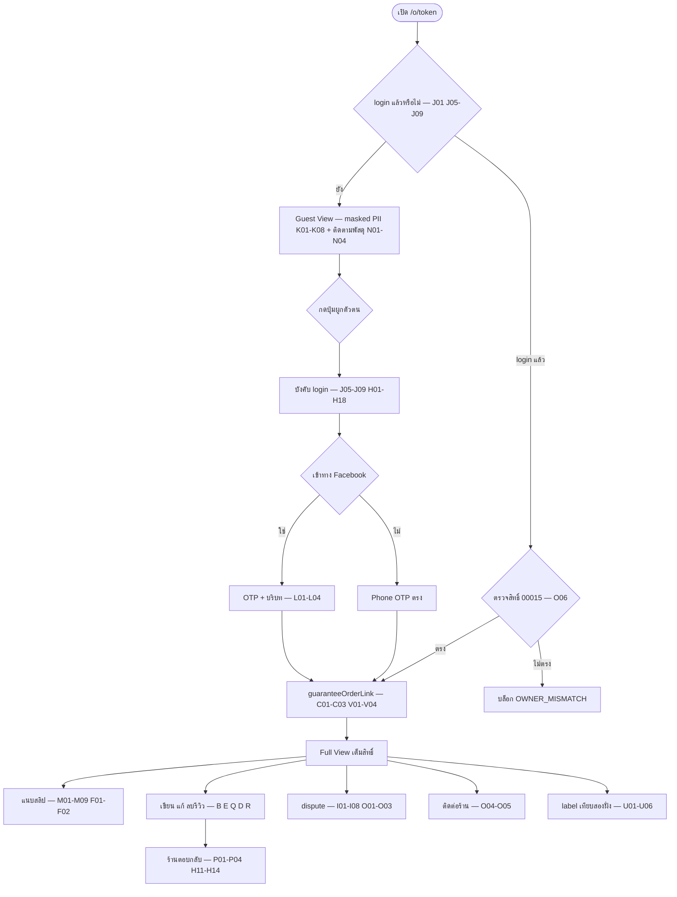
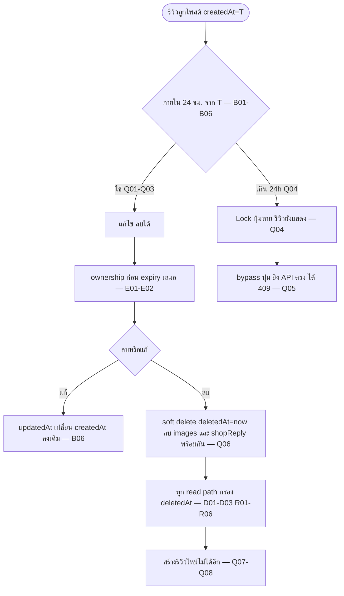

# Test Case: ประสบการณ์ผู้ซื้อบนหน้าออเดอร์ (Buyer Order Experience)

> **โมดูล:** M00041-BuyerOrderExperience
> **ประเภทเอกสาร:** Test Case
> **เวอร์ชัน:** 1.0
> **วันที่จัดทำ:** 2026-08-10 (เขียนก่อน implement ตาม Hard Rule 11 — ไม่ใช่ backfill)
> **สถานะ:** Draft — ทุกเคสยังไม่เคยรัน เพราะยังไม่มีโค้ด (`order-pii-mask.ts`, `o/layout.tsx`, endpoint ใหม่ 5 ตัว, migration ทั้ง 2 ตัว ยังไม่ถูกสร้าง)
> **เจ้าของเอกสาร:** safepay-qa (ดู [[Feature-Docs-Ownership]])

---

## 1. Overview

ชุดทดสอบนี้ครอบ feature 00041 ทั้งฟีเจอร์ตามที่ล็อกไว้ใน [[BRD]] (FR-001..022, BR-BOE-01..25), [[SRS]] (TFR-001..014, §4.5 Error mapping, §8 ความเสี่ยง) และ [[SDS]] (TD-001..006) — ครอบทั้ง unit (pure function), integration (service/route ยิงลง DB จริงแบบ scoped-seed/scoped-cleanup) และ browser QA

- **In-scope:** `GuestOrderView.tsx` (ใหม่), `order-pii-mask.ts` (ใหม่), `o/layout.tsx` (ใหม่), `order.service.ts` (`getOrderByToken` select เพิ่ม), `review.service.ts` (ฟังก์ชันใหม่ 4 ตัว + `canEditReview`), `order-event.service.ts` (instrumentation exclusion), `order-access.service.ts` (`guaranteeOrderLink` แยก transaction), endpoint ใหม่ 5 ตัว, การรวม SSOT ป้ายสถานะ, `seller/(dashboard)/reviews/page.tsx`, `scripts/metrics/00041-*.sql`
- **Out-of-scope:** `BookingGuestView.tsx`/`Order.type='BOOKING'` (คง redirect login เดิม — SRS §1.2), Trust Score v2 (00040), รีวิวรายสินค้า, การส่งลิงก์อัตโนมัติเข้าแชท, แอปมือถือฝั่งผู้ขาย, การแก้ logic ภายในของ `order-dispute.service.ts`/`resolveOrderAccess()`

**สภาพแวดล้อม:**
- **Unit `[blocker]`:** Vitest local ไม่แตะ DB — ฉีดเวลา/ค่าเข้าฟังก์ชันเป็นพารามิเตอร์เสมอ (`canEditReview(createdAt, now)`) **ห้ามรอเวลาจริง 24 ชม.**
- **Integration `[blocker]`:** Vitest ยิงลง dev DB ผ่าน Prisma จริง (localhost เท่านั้นตาม Hard Rule 14) — seed แล้วเก็บ id ที่สร้างเองไว้ แล้ว **cleanup ด้วย `where: { id: { in: [...] } }` เท่านั้น** ห้าม `deleteMany()` ที่ไม่มี `where` (Hard Rule 13)
- **Browser QA:** `http://deepth.local:4000` (ผู้ซื้อ) คู่กับ `http://seller.deepth.local:4000` (ร้าน) — ห้าม `localhost` · user เป็นคนรัน dev server เอง
- **24 ชม. window:** ทุกเคสระดับ browser/API ให้ **seed `Review.createdAt` ย้อนหลังผ่าน Prisma โดยตรง** ห้ามรอเวลาจริง/แก้เวลาเครื่อง

---

## 2. Test Scenarios

### กลุ่ม A — Unit `[blocker]`: `order-pii-mask.ts`

| # | เคส | Steps | Expected |
|---|-----|-------|----------|
| A01 | `maskLast3` มาตรฐาน | `maskLast3('12345')` | `'••345'` |
| A02 | ข้อความไทยยาว | `maskLast3('บางปูใหม่')` (9 ตัว) | `'••••••ใหม่'` |
| A03 | boundary length = 3 พอดี | `maskLast3('บาง')` | `'•••'` — **ไม่ใช่** `'บาง'` (สูตร `len<=3 → mask ทั้งหมด`) |
| A04 | length < 3 | `maskLast3('อู่')`, `maskLast3('ก')` | mask เต็มความยาวเดิม ไม่ throw |
| A05 | string ว่าง | `maskLast3('')` | `''` ไม่ throw |
| A06 | เบอร์ไทย 10 หลัก | `maskPhoneForGuest('0812345891')` | `'•••-•••-891'` ตรงตาม BRD §8.1 |
| A07 | ค่าที่ไม่ใช่เบอร์ (อีเมล) | `maskPhoneForGuest('buyer@example.com')` | `null` (ไม่พยายาม mask รูปแบบที่ไม่รู้จัก) |
| A08 | `null` | `maskPhoneForGuest(null)` | `null` |
| A10 | `note` ไม่อยู่ในผลลัพธ์ | เรียกด้วย input ที่มี `note` ปน แล้วตรวจ key | `'note' in result === false` — ไม่มี key นี้เลย ไม่ใช่แค่ค่าว่าง |
| A11 | `null` address (NO_SHIPPING) | `maskShippingAddressForGuest(null)` | `null` |

#### TC-BOE-A09 `[blocker]`: `province` ไม่ถูก mask, ฟิลด์อื่นถูก mask ทั้งหมด

- **Linked to:** FR-003; BR-BOE-03
- **Precondition:** input `{ province: 'สมุทรปราการ', line1: '45 ถ.สุขุมวิท', subdistrict: 'บางปูใหม่', district: 'เมืองสมุทรปราการ', postcode: '10280' }`
- **Expected:** `result.province === 'สมุทรปราการ'` (เต็ม ไม่มีจุดมาสก์เลย) · `line1`/`subdistrict`/`district`/`postcode` แต่ละตัวผ่าน `maskLast3`
- 🛑 **Mutation ที่ต้องทำให้แดง:** สลับ implementation ให้ `province` ผ่าน `maskLast3` ด้วย (ลบ special-case) → assertion `province === 'สมุทรปราการ'` ต้อง fail — พิสูจน์ว่าเทสจับความต่างระหว่าง "province ไม่ mask" กับ "field อื่น mask" ได้จริง

---

### กลุ่ม B — Unit `[blocker]`: `canEditReview` (หน้าต่าง 24 ชม.)

| # | เคส | Steps | Expected |
|---|-----|-------|----------|
| B01 | เพิ่งโพสต์ (diff = 0) | `canEditReview(T, T)` | `true` |
| B02 | ในเวลา 23h59m59s | `canEditReview(T, T + 86399000)` | `true` |
| B05 | เกินเวลามาก (25h) | `canEditReview(T, T + 90000000)` | `false` |

#### TC-BOE-B03 `[blocker]`: ขอบเขตพอดี 24 ชม. (86400000ms เป๊ะ) — ต้อง `true` เพราะกฎ inclusive

- **Linked to:** FR-016; BR-BOE-17
- **Expected:** `true`
- 🛑 **Mutation:** แก้ `<=` เป็น `<` → เคสนี้พลิกเป็น `false` และ assertion ต้อง fail — เคสหลักที่พิสูจน์ว่า SSOT ใช้ `<=` จริง

#### TC-BOE-B04 `[blocker]`: เกินขอบเขต 1ms (86400001ms) — ต้อง `false`

- **Expected:** `false`
- 🛑 **หมายเหตุ:** ต้องมี **ทั้ง B03+B04 ประกบขอบเขต** — ถ้ามีแค่ B04 อย่างเดียว mutation `<=`↔`<` จะจับไม่ได้ (B04 ยังผ่านเหมือนเดิม)

#### TC-BOE-B06: หน้าต่างไม่รีเซ็ตเมื่อแก้ไข

- **Linked to:** FR-016 AC ข้อ 2; BR-BOE-17
- **Steps:** ตรวจ signature ว่าไม่มีพารามิเตอร์ `updatedAt` → เรียกด้วย `createdAt` เดิมแม้จำลองว่ามีการแก้ไปแล้วที่ `T+1h` → `canEditReview(T, T + 90000000)`
- **Expected:** `false` — ยืนยันว่าเวลาที่ใช้คำนวณคือ `createdAt` ดั้งเดิมเท่านั้น

---

### กลุ่ม C — Integration `[blocker]`: `guaranteeOrderLink()` ทนต่อ instrumentation ล้ม

#### TC-BOE-C01: path ปกติ — claim สำเร็จ + event ถูกบันทึก

- **Precondition:** test order `buyerUserId=null`, test user `userA`
- **Steps:** เรียก `guaranteeOrderLink(orderId, userA.id)`
- **Expected:** `Order.buyerUserId === userA.id` (query DB ยืนยัน) · มี `OrderEvent` แถวใหม่ `type='AUTH_FLOW_COMPLETED'`

#### TC-BOE-C02 `[blocker]`: event write ล้ม ต้องไม่ทำให้ claim ล้มตาม

- **Linked to:** FR-021; SRS TFR-013; SDS TD-004
- **Steps:** mock `recordOrderEvent` ให้ throw เสมอ → เรียก `guaranteeOrderLink(orderId, userB.id)`
- **Expected:** ฟังก์ชันไม่ throw ให้ caller เห็น · query DB ยืนยัน `Order.buyerUserId === userB.id` (claim สำเร็จ แม้ event เขียนล้ม)
- 🛑 **Mutation:** ย้าย event write กลับเข้าไปอยู่ใน transaction เดียวกับ `tx.order.updateMany(...)` → เคสนี้ต้อง fail เพราะ transaction จะ rollback การ claim ไปด้วย

#### TC-BOE-C03: dedupe โดยธรรมชาติ — เรียกซ้ำไม่สร้าง event ซ้ำ

- **Steps:** ต่อจาก C01 เรียก `guaranteeOrderLink` ซ้ำ
- **Expected:** จำนวน `AUTH_FLOW_COMPLETED` ของ order นี้ยังเป็น 1 แถว

---

### กลุ่ม D — Integration `[blocker]`: soft-delete ต้องหายจากทุก read path

#### TC-BOE-D01 `[blocker]`: source scan — ทุก query บน `prisma.review.*` ต้องมี `deletedAt: null`

- **Linked to:** FR-016; SRS §8; [[DATABASE]] §8.1 (22 จุด)
- **Steps:** เทสสแกนซอร์ส `src/` หา call site ของ `prisma.review.findMany`/`findFirst`/`count`/`aggregate`/`groupBy` (**ไม่ hardcode รายชื่อไฟล์** ตามแพตเทิร์นของ `upload-no-multipart-callers.test.ts`) แล้วยืนยันว่าแต่ละจุดมี `deletedAt` ในเงื่อนไข **ยกเว้น** 2 จุดใน allow-list ที่ต้องไม่กรองโดยตั้งใจ (`createReview` guard, `linkBuyerHistory` — ดู [[DATABASE]] §8.2)
- **Expected:** สแกนผ่านครบ 100%
- 🛑 **Mutation:** ลบ `deletedAt: null` ออกจาก 1 จุด (เช่น `getReviewsByShopUser`) → เทสต้อง fail ทันทีพร้อมระบุไฟล์/บรรทัด

#### TC-BOE-D02: ค่าเฉลี่ยคะแนนร้านไม่รวมรีวิวที่ถูกลบ

- **Precondition:** shop ทดสอบมี 2 รีวิว (5★ active, 1★ soft-deleted)
- **Steps:** เรียก `getAvgRatingByUsername(shopUsername)`
- **Expected:** ได้ 5.0 — **ไม่ใช่** 3.0

#### TC-BOE-D03: `getOrderByToken` ของออเดอร์ที่รีวิวถูกลบ คืน `review: null`

- **Expected:** `result.review === null` (ไม่คืนแถว tombstone ให้ UI เห็น)

---

### กลุ่ม E — Integration `[blocker]`: ตรวจสิทธิ์ก่อนตรวจหมดเวลา (กัน oracle)

#### TC-BOE-E01 `[blocker]`: non-owner PATCH รีวิวที่หมดเวลาแล้ว ต้องได้ 403 ไม่ใช่ 409

- **Linked to:** SRS TFR-007 ("ต้องเช็ค forbidden ก่อน expired เสมอ")
- **Precondition:** review `createdAt = now - 25h`, เจ้าของจริง `userA`; login เป็น `userB`
- **Expected:** HTTP 403 (`ReviewForbiddenError`) — **ไม่ใช่** 409 (ถ้าได้ 409 แปลว่า service บอก non-owner ว่า "รีวิวนี้หมดเวลาแล้ว" = oracle leak)
- 🛑 **Mutation:** สลับลำดับให้เช็ค `canEditReview()` ก่อน ownership → เคสนี้เปลี่ยนผลเป็น 409 และต้อง fail

#### TC-BOE-E02: non-owner PATCH รีวิวที่ยังอยู่ในเวลา ได้ 403 เหมือนกัน

- **Expected:** 403 เหมือน E01 เป๊ะ (status + error shape เดียวกัน) — พิสูจน์ว่า non-owner แยกแยะ "หมดเวลาหรือยัง" จาก response ไม่ได้เลย

---

### กลุ่ม F — Integration `[blocker]`: อัปโหลดต้องผ่าน direct-upload

#### TC-BOE-F01 `[blocker]`: `upload-no-multipart-callers.test.ts` ครอบไฟล์ใหม่โดยไม่ต้องแก้รายชื่อ

- **Linked to:** FR-008, FR-015; BR-BOE-11/20
- **Expected:** 0 call site ที่ใช้ `FormData`/`multipart` สำหรับสลิปหรือรูปรีวิว
- 🛑 **Mutation:** เพิ่มโค้ดจำลองใน `ReviewForm.tsx` ที่เรียก `fetch(url, {body: formData})` → เทสสแกนต้อง fail ระบุไฟล์นี้

#### TC-BOE-F02: payload ของ PATCH/POST review เป็น JSON `{images: string[]}` ไม่ใช่ raw bytes

- **Expected:** route ใช้ Valibot schema ที่ validate `images` เป็น array ของ string — ไม่มี `req.formData()` ใน route เหล่านี้

---

### กลุ่ม G — Integration `[blocker]`: SSOT ป้ายสถานะออเดอร์ (HR16, TFR-012)

#### TC-BOE-G01 `[blocker]`: SHIPPED label ตรงกันทั้ง 4 จุดที่เคยไม่ตรง

- **Steps:** อ่านค่า label ของ `SHIPPED` จาก `ORDER_STATUS_META`, `OrderDetailMobile.tsx` (หลังแก้), `orders/list/index.tsx`, `dashboard/Orders.tsx`
- **Expected:** ทั้ง 4 จุดได้ `'กำลังจัดส่ง'` เท่ากันหมด
- 🛑 **Mutation:** เปลี่ยนค่าใน `dashboard/Orders.tsx` กลับเป็น `'จัดส่งแล้ว'` → เทสต้อง fail

#### TC-BOE-G02 / G03

- **G02:** label ของ PENDING/CONFIRMED/CANCELLED ตรงกันทั้ง 4 จุด (กัน regression ในอนาคต)
- **G03:** `rg "getStatusPill" src/` = 0 hit หลัง implement (dead export ถูกลบสะอาด)

---

### กลุ่ม H — API ตรง (curl ไม่ผ่าน UI): guard ต้องอยู่ที่ server (BR-BOE-06/07)

**Precondition ร่วม:** test order `buyerUserId = userA.id` สถานะ `SHIPPED`, `userB` = login แล้วแต่ไม่ใช่เจ้าของ/ไม่ใช่ shop member, review ของออเดอร์นี้เขียนโดย `userA`

| # | Endpoint | สภาพ | Expected |
|---|----------|------|----------|
| H01 | `POST .../confirm` | ไม่มี cookie | 401 |
| H02 | `POST .../confirm` | cookie `userB` | 403 |
| H03 | `POST .../slip` | ไม่มี cookie | 401 |
| H04 | `POST .../slip` | cookie `userB` | 403 |
| H05 | `POST .../review` | ไม่มี cookie | 401 |
| H06 | `POST .../review` | cookie `userB` | 403 |
| H07 | `PATCH .../review` | ไม่มี cookie | 401 |
| H08 | `PATCH .../review` | cookie `userB` | 403 (`ReviewForbiddenError`) |
| H09 | `DELETE .../review` | ไม่มี cookie | 401 |
| H10 | `DELETE .../review` | cookie `userB` | 403 |
| H11 | `POST .../review/reply` | ไม่มี cookie | 401 |
| H12 | `POST .../review/reply` | cookie `userB` (ผู้ซื้อทั่วไป) | 403 (`ReviewReplyForbiddenError`) |
| H13 | `DELETE .../review/reply` | ไม่มี cookie | 401 |
| H14 | `DELETE .../review/reply` | cookie `userB` | 403 |
| H15 | `POST .../dispute` | ไม่มี cookie | 401 |
| H16 | `POST .../dispute` | cookie `userB` | 403 |

#### TC-BOE-H17: `POST .../auth-flow/start` ไม่มี session — **เคสควบคุม (ต้องเปิดโดยตั้งใจ)**

- **Expected:** HTTP **204** — ยืนยันว่า endpoint นี้เปิดให้ guest ได้โดยตั้งใจ (ตัดกับ H01-H16 ที่ต้อง 401 ทั้งหมด — ถ้าเคสนี้ได้ 401 ด้วยแปลว่า instrumentation พังเงียบ ๆ)

#### TC-BOE-H18: หน้าจอซ่อนปุ่ม + endpoint บล็อก เป็นอิสระจากกัน (cross-check)

- **Linked to:** BR-BOE-07 ("ซ่อนปุ่มที่ client ไม่ถือเป็นการป้องกันที่เพียงพอ")
- **Steps:** 1) screenshot guest view ยืนยันไม่มีปุ่มที่กดทำ action ได้ทันที 2) ยิง curl ตรงไป endpoint เดียวกันทั้ง 6 ตัวโดยไม่มี cookie
- **Expected:** ทั้ง 2 ช่องทางสอดคล้อง — UI ไม่ให้กด + endpoint ตอบ 401 ทุกตัว

---

### กลุ่ม I — API: Dispute state machine + idempotency (BR-BOE-13/14/15)

| # | Precondition | Steps | Expected |
|---|--------------|-------|----------|
| I01 | `status=SHIPPED`, `disputeOpenedAt=null` | `POST .../dispute` (session เจ้าของ) | 200 · `disputeOpenedAt` ไม่ null · `OrderEvent ORDER_DISPUTE_OPENED` ใหม่ · `Order.status` ยังคง `SHIPPED` |
| I02 | `status=PENDING` | เหมือน I01 | 200 (PENDING ไม่ใช่สถานะปิดจบ — **เคสนี้เดิมทำไม่ได้เพราะปุ่มไม่แสดง ดู SDS TD-001**) |
| I03 | `status=CONFIRMED` | `POST .../dispute` | error ข้อความ **"คำสั่งซื้อนี้ปิดจบไปแล้ว แจ้งปัญหาไม่ได้"** (ไม่ใช่ error กลาง ๆ) · status ไม่เปลี่ยน |
| I04 | `status=CANCELLED` | เหมือน I03 | ข้อความเดียวกับ I03 |
| I05 | ต่อจาก I01 | `POST .../dispute` ซ้ำ | 200 คืน `disputeOpenedAt` **เดิม** · จำนวน `ORDER_DISPUTE_OPENED` ยังเป็น 1 แถว |
| I06 | ต่อจาก I05 | query `Order.status` ก่อน I01 และหลัง I05 | เท่ากันทุกจุด (BR-BOE-15) |
| I07 | — | `note` 500 ตัวอักษร → ผ่าน; 501 ตัวอักษร → 400 | boundary test |
| I08 | เปิด dispute พร้อม note เฉพาะเจาะจง | หา note นี้บนหน้าจอ/HTML source ทั้ง guest และ authenticated | ไม่พบที่ไหนเลย (เก็บใน `meta` เท่านั้น) |

---

### กลุ่ม J — Browser QA: Guest View (FR-001, FR-002, FR-004)

| # | เคส | Expected |
|---|-----|----------|
| J01 | guest เปิดออเดอร์ PENDING | เห็นสถานะ/สินค้า/ยอดเงิน/ชื่อร้าน/trust score · URL ยังเป็น `/o/{token}` ไม่ redirect |
| J02 | guest เปิดออเดอร์ SHIPPED | เห็นข้อมูลพื้นฐาน + timeline สถานะพัสดุ |
| J03 | guest เปิด CONFIRMED / CANCELLED | แสดงสอดคล้องกับสถานะปิดจบ ไม่ error |
| J04 | token ไม่มีจริง / สตริงมั่ว | ทั้ง 2 กรณีขึ้น not-found **แบบเดียวกัน** (ไม่มีข้อความที่แยกว่า "รูปแบบถูกแต่ไม่พบ" vs "รูปแบบผิด") |
| J05–J09 | guest กด "ยืนยันรับของ"/"แนบสลิป"/"เขียนรีวิว"/"ยังไม่ได้รับสินค้า"/"ติดต่อร้านค้า" | ทุกปุ่มพาไป `/auth/sign-in?callbackUrl=/o/{token}` ไม่มีปุ่มไหนทำ action สำเร็จจาก guest view |
| J10 | `Order.type='BOOKING'` + guest | ถูก redirect ไป sign-in เหมือนเดิม (ยืนยัน carve-out ของ SRS §1.2 ทำงานถูกจุด) |

---

### กลุ่ม K — Browser QA: PII masking บนจอ **และระดับ payload**

| # | เคส | Expected |
|---|-----|----------|
| K01 | guest เห็นเบอร์ | `•••-•••-{3 หลักท้ายที่ seed}` ตรงตัว |
| K02 | guest เห็นที่อยู่ | จังหวัดเต็มไม่มีจุดมาสก์ · ท่อนอื่นมีจุดมาสก์นำหน้า + เปิด 3 ตัวท้าย |
| K03 | `buyerContact = null` | ไม่มี element แถวเบอร์ปรากฏเลย (ไม่ใช่แถวว่างที่โชว์ mask กับค่าว่าง) |
| K04 | `shippingAddress = null` (NO_SHIPPING) | ไม่มี section ที่อยู่ปรากฏเลย |
| K06 | authenticated เจ้าของออเดอร์ | เห็นเบอร์เต็ม 10 หลัก + ที่อยู่เต็มทุกท่อน |
| K07 | `buyerContact` เป็นอีเมล | ไม่มีแถวเบอร์ (เหมือน K03) |

#### TC-BOE-K05 (payload-level) 🛑 เกณฑ์ที่เข้มกว่าการดูหน้าจอ

- **Linked to:** BR-BOE-04; `feedback_rsc_pii_neutralize_at_source`; SRS TFR-002 postcondition
- **Precondition:** ทราบเบอร์เต็ม/ที่อยู่เต็มที่ seed ไว้
- **Steps:** `curl -s http://deepth.local:4000/o/{token}` (ไม่แนบ cookie) → บันทึก response body ทั้งหมด (HTML + RSC flight chunk) → `grep` หาสตริงเบอร์เต็ม/บ้านเลขที่/ชื่อถนนเต็ม
- **Expected:** **0 match ของค่าดิบทั้งหมด** — เจอเฉพาะรูปแบบที่ mask แล้ว · พิสูจน์ว่าไม่ได้ mask ด้วย CSS/JS ที่ client (ค่าดิบไม่เคยถูกส่งมาตั้งแต่ต้น)

#### TC-BOE-K08 (payload-level): `o/layout.tsx` ไม่เพิ่ม PII leak

- **Steps:** ทำซ้ำ K05 หลังเพิ่ม layout — เทียบ payload ก่อน/หลัง
- **Expected:** ไม่มี field ใหม่ที่หลุด PII เพิ่มจากการมี layout

---

### กลุ่ม L — Browser QA: เส้นทาง Facebook (FR-005/006/007)

| # | Precondition | Expected |
|---|--------------|----------|
| L01 | บัญชี FB ใหม่ ไม่เคยมีเบอร์ในระบบ | หน้าขอ OTP มีข้อความอ้างอิงถึงออเดอร์ (เช่นเลขออเดอร์) ไม่ใช่ข้อความทั่วไป · นับได้ ≤4 หน้าจอ / ≤8 การกระทำ |
| L02 | เบอร์เคยสมัครไว้ก่อนแล้ว | หลัง OTP ผ่าน **ไม่ถูกพาไป Facebook OAuth อีกรอบ** ภายใน session เดียวกัน |
| L03 | เบอร์เดียวกับที่เคย claim ออเดอร์นี้ | auth flow สำเร็จปกติ ไม่มี error/identity-switch |
| L04 | — | ข้อความบนหน้า OTP อธิบายว่าทำไมต้องยืนยันเบอร์ และเชื่อมโยงกับออเดอร์ (ไม่ใช่แค่ "กรอก OTP") |

---

### กลุ่ม M — Browser QA: สลิป (FR-008/009/010)

| # | เคส | Expected |
|---|-----|----------|
| M01 | แนบ jpg 2MB (order PENDING) | สำเร็จ · สลิปแสดงทันที (ไม่ใช่ 500/"แนบสลิปไม่สำเร็จ") |
| M02 | แนบ pdf 8MB | สำเร็จ (อยู่ในเพดาน ≤10MB, ชนิดที่อนุญาต) |
| M03 | แนบไฟล์ 11MB | ปฏิเสธพร้อมข้อความระบุเพดานชัดเจน ไม่ใช่ "ลองใหม่อีกครั้ง" |
| M04 | แนบ `.exe` | ปฏิเสธพร้อมข้อความระบุชนิดที่รองรับ |
| M05 | ดู Network tab ตอนแนบ | เห็น ticket → `PUT` ตรงเข้า storage → commit · สุดท้าย `POST .../slip` body เป็น JSON `{fileId}` ไม่มี multipart |
| M06 | reload หน้า | สลิปเดิมยังแสดง |
| M07 | ร้านเปลี่ยนสถานะเป็น SHIPPED/CONFIRMED แล้ว reload | สลิปเดิมยังแสดงครบ |
| M08 | ลำดับ section | section แนบสลิปอยู่เหนือ section รีวิวเสมอ (เทียบตำแหน่ง Y) |
| M09 | แนบสลิปบนออเดอร์ที่ไม่ใช่ PENDING | 400 "แนบสลิปได้เฉพาะคำสั่งซื้อที่รอดำเนินการ" |

---

### กลุ่ม N — Browser QA: สถานะพัสดุสอดคล้องสองฝั่ง (FR-002, FR-011)

| # | เคส | Expected |
|---|-----|----------|
| N01 | เทียบ `/o/{token}` กับ `/seller/orders/{token}` | ป้ายสถานะพัสดุ (label/tone) ตรงกันทุกจุด |
| N02 | order ไม่มี shipment เลย | หน้าเรนเดอร์ปกติ มี fallback สมเหตุสมผล ไม่มี error boundary/หน้าขาว |
| N03 | หาลิงก์ "ติดตามพัสดุ" ทุกสถานะ | **ไม่มี element ลิงก์นี้ปรากฏเลย** (ระบบไม่มี `trackingUrl` — ต้องไม่มีลิงก์เปล่า/ลิงก์พัง) |
| N04 | guest vs authenticated | badge สถานะพัสดุเหมือนกันทุกประการ |

---

### กลุ่ม O — Browser QA: Dispute + ติดต่อร้านค้า UI (FR-012/013) — **ครอบ SDS TD-001**

| # | Precondition | Expected |
|---|--------------|----------|
| O01 | order SHIPPED, `disputeOpenedAt=null` | ปุ่ม "ยังไม่ได้รับสินค้า" แสดงและไม่ disabled |
| **O01b** | **order PENDING** | 🛑 **ปุ่มต้องแสดงด้วย** — เดิมไม่แสดงเพราะเงื่อนไข `status==='SHIPPED'` ซ้อนอยู่ (SDS TD-001) |
| O02 | จาก O01 กดปุ่ม + กรอก note | สำเร็จ · ปุ่มเปลี่ยนเป็น "แจ้งปัญหาแล้ว" (ไม่ใช่ปุ่มเดิมที่กดซ้ำได้โดยไม่มีข้อบ่งชี้) |
| O03 | order CONFIRMED | ปุ่มซ่อนหรือ disabled **พร้อมคำอธิบาย** ที่มองเห็นได้ ไม่ใช่หายไปเงียบ ๆ |
| O04 | login เจ้าของ กด "ติดต่อร้านค้า" | ไปที่ `/messages/{order.shopId}` และหน้านั้นโหลดสำเร็จ (**ไม่ใช่ not-found** — ยืนยัน SDS TD-006 ว่าใช้ `Shop.id`) |
| **O04b** | **order PENDING / SHIPPED / CONFIRMED** | 🛑 **ปุ่ม "ติดต่อร้านค้า" ต้องแสดงทั้ง 4 สถานะ** — เดิมแสดงเฉพาะ CANCELLED (SDS TD-001) |
| O05 | guest กด "ติดต่อร้านค้า" | พาไปหน้า login ไม่ใช่หน้าแชทตรง ๆ |
| O06 | `userB` เปิด `/o/{token}` ของคนอื่น | เข้าไม่ถึง full view เลย (บล็อกตาม 00015) — ไม่ใช่เข้าได้แต่ปุ่มหาย |

---

### กลุ่ม P — Browser QA: รีวิว — ตอบกลับ + แนบรูป (FR-014, FR-015)

| # | เคส | Expected |
|---|-----|----------|
| P01 | เจ้าของร้านตอบกลับรีวิว | คำตอบแสดงคู่กับรีวิวทันที · เห็นเหมือนกันทั้ง guest view และ authenticated view |
| P02 | ส่งคำตอบซ้ำ | เหลือคำตอบเดียว (ข้อความใหม่) ไม่มีคำตอบที่ 2 ซ้อน |
| P03 | `ShopMember(role='ADMIN')` ตอบกลับ | สำเร็จเหมือน P01 |
| P04 | ผู้ใช้ทั่วไปเปิดหน้าที่มีรีวิวนี้ | ไม่มีปุ่ม/ช่องตอบกลับปรากฏเลย |
| P05 | แนบรูป 4 รูป | รีวิวแสดงครบ 4 รูปถูกต้อง |
| P06 | ลองแนบรูปที่ 5 | UI ปฏิเสธ/แจ้งว่าครบเพดานแล้ว |
| P07 | แนบรูป 11MB | ปฏิเสธพร้อมข้อความชัดเจน (จาก `checkUploadPolicy`) |
| P08 | แนบ `.exe` เป็นรูป | ปฏิเสธพร้อมข้อความ |
| P09 | Network tab ตอนแนบรูปรีวิว | ticket → PUT → commit · ไม่มี multipart ไป route ของรีวิว |

---

### กลุ่ม Q — Browser QA: หน้าต่างแก้ไข/ลบรีวิว 24 ชม. (seed `createdAt` ย้อนหลัง)

| # | Precondition | Expected |
|---|--------------|----------|
| Q01 | `createdAt = now - 1h` | แก้ดาว 2→4 สำเร็จ แสดงผลทันที |
| Q02 | `createdAt = now - 23h59m` | สำเร็จ |
| Q03 | `createdAt = now - (24h - 5s)` | สำเร็จ (เสริม B03 ที่ระดับ browser) |
| Q04 | `createdAt = now - 24h - 1min` | ปุ่มแก้ไข/ลบหายหรือ disabled พร้อมคำอธิบาย · **เนื้อหารีวิวยังแสดงปกติ ไม่ถูกซ่อน** |
| Q05 | ต่อจาก Q04 ยิง PATCH ตรง (bypass ปุ่ม) | HTTP 409 พร้อมข้อความอ่านเข้าใจได้ |
| Q06 | review มีรูป 2 รูป + คำตอบร้าน, `createdAt = now - 1h` | ลบสำเร็จ → รีวิว/รูป/คำตอบร้านหายพร้อมกันทั้งหมด (BR-BOE-23) |

#### TC-BOE-Q07 🛑 พิสูจน์ว่ารูรั่วถูกปิดจริง: ลบแล้วเขียนรีวิวใหม่ไม่ได้

- **Linked to:** SRS §8 แถวแรก
- **Precondition:** ต่อจาก Q06 (ยังอยู่ในกรอบ 24h เดิม)
- **Expected:** ไม่มีทางเขียนรีวิวใหม่สำหรับออเดอร์นี้อีก — เพราะ `order.review` ยังมีแถว tombstone ทำให้ guard เดิมของ `createReview` ยังทำงาน
- **หมายเหตุ:** ถ้า user เปลี่ยนมติเรื่อง "ลบแล้วลบเลย" ต้องปรับเคสทั้งกลุ่ม Q

#### TC-BOE-Q08: ยิง `POST .../review` ตรงหลังลบ (bypass UI)

- **Expected:** ไม่สำเร็จ (error สื่อว่ามีรีวิวอยู่แล้วสำหรับออเดอร์นี้) — ยืนยันว่าไม่ใช่แค่ UI ซ่อนปุ่ม

---

### กลุ่ม R — Browser QA: รีวิวที่ลบแล้วต้องหายจากทุกที่ + คะแนนเฉลี่ยขยับตาม

| # | Surface | Expected |
|---|---------|----------|
| R01 | หน้าออเดอร์ของผู้ซื้อเอง | ไม่มีรีวิวแสดง |
| R02 | `/seller/reviews` ฝั่งร้าน | รีวิวที่ลบไม่อยู่ในรายการ |
| R03 | `/u/{username}` | ไม่ปรากฏ |
| R04 | `/b/{slug}` (ร้าน BUSINESS) | ไม่ปรากฏ |
| **R05** | **คะแนนเฉลี่ยของร้าน** | 🛑 **จุดที่ลืมกรองแล้วไม่มีใครเห็นจนคะแนนไม่ตรง** — ร้านมี 5★+1★ เฉลี่ย 3.0 → ลบ 1★ → ต้องเป็น **5.0** ไม่ใช่ 3.0 ค้าง |
| R06 | ตัวนับ "X รีวิว" | ลดลง 1 หลังลบสำเร็จ |

---

### กลุ่ม S — Browser QA: ฝั่งร้านเห็นชื่อผู้รีวิวมีความหมาย (FR-017)

| # | Precondition | Expected |
|---|--------------|----------|
| S01 | reviewer มี `displayName` | เห็นชื่อจริง — **ไม่มีข้อความ `'ผู้ใช้ที่ลงทะเบียน'` ปรากฏอีก** |
| S02 | reviewer มีแค่ `username` | เห็น `username` แทน |
| S03 | reviewer เป็น guest (`reviewerUserId=null`, มี `reviewerContact`) | เห็น contact แบบ mask ไม่ใช่เบอร์/อีเมลเต็ม |
| S04 | reviewer ที่มีบัญชี — ตรวจหน้าจอ + HTML source | ไม่พบเบอร์/อีเมลเต็มของ reviewer ที่ไหนเลย |

---

### กลุ่ม T — Browser QA: Responsive 3 ขนาดจอ (FR-018, FR-019)

| # | Viewport | Expected |
|---|----------|----------|
| T01 | Mobile 375×667 | ไม่มี horizontal scroll · stack แนวตั้งอ่านง่าย · tap target ≥44px |
| T02 | Tablet 1024×768 | เลย์เอาต์ปรับตาม breakpoint กลาง (ไม่ใช่ mobile stack ล้วน ไม่ใช่ desktop เต็ม) |
| T03 | Desktop 1440×900 | ไม่มี `maxWidth` ตายตัวแบบเดิม (640/420px) |
| T04 | ทั้ง 3 breakpoint (authenticated) | มี nav/header ที่กดไปหน้า "ประวัติออเดอร์"/"โปรไฟล์" ได้จริง |
| T05 | ทั้ง 3 breakpoint (guest) | header มีแค่โลโก้ + ปุ่ม "เข้าสู่ระบบ" ไม่มีเมนูบัญชี/avatar |
| T06 | ตรวจ computed `font-family` ทุก section ใหม่ | ได้ `Anuphan` เสมอ (Hard Rule 5) |

---

### กลุ่ม U — Browser QA: เปิดออเดอร์ใบเดียวกันสองฝั่ง เทียบ label ตัวต่อตัว (HR16, FR-020)

| # | สถานะ | Expected (ทั้ง `/seller/orders/{token}` และ `/o/{token}`) |
|---|-------|------------------------------------------------------------|
| U01 | PENDING | **"รอดำเนินการ"** ตรงกันทุกตัวอักษร |
| U02 | SHIPPED | **"กำลังจัดส่ง"** ตรงกัน (ไม่มีฝั่งไหนเหลือ "จัดส่งแล้ว") |
| U03 | CONFIRMED | **"สำเร็จ"** ตรงกัน |
| U04 | CANCELLED | **"ยกเลิก"** ตรงกัน |
| U05 | `(buyer-app)/orders` | label ตรงกับหน้ารายละเอียดทุกสถานะ |
| U06 | `(buyer-app)/dashboard` widget | label ตรงกับหน้ารายละเอียดทุกสถานะ |

---

### กลุ่ม V — Browser QA + Query: Instrumentation (FR-021, FR-022)

| # | เคส | Expected |
|---|-----|----------|
| V01 | guest กดปุ่ม login จาก order link (ไม่ต้องกรอกจนจบ) | มีแถว `OrderEvent type='AUTH_FLOW_STARTED'` ผูกกับ `orderId` นี้ |
| V02 | ทำ auth flow จนจบ (claim สำเร็จ) | มี `AUTH_FLOW_COMPLETED` 1 แถว · `Order.buyerUserId` ตรงกับผู้ใช้ที่ login |
| V03 | reload หน้า authenticated ซ้ำ 3 ครั้ง | ยังมี `AUTH_FLOW_COMPLETED` แค่ 1 แถว |
| V04 | เปิด order detail ฝั่งร้าน ดูไทม์ไลน์ | **ไม่พบ** `AUTH_FLOW_STARTED`/`AUTH_FLOW_COMPLETED` ในรายการที่แสดง |
| V05 | รัน 4 query ใน `scripts/metrics/00041-*.sql` | รันผ่านไม่มี syntax/type error · คืนตัวเลขสอดคล้องกับข้อมูลที่ seed |

---

### กลุ่ม W — Cross-cutting / Hard Rule compliance

| # | เคส | คำสั่ง/วิธี | Expected |
|---|-----|-------------|----------|
| W01 | ไม่มีคำสั่งลบข้อมูลแบบไม่ scope ในไฟล์เทสของฟีเจอร์นี้ | `rg -n "deleteMany\(\)\|TRUNCATE\|cleanDatabase\|migrate reset\|--force-reset"` ในไฟล์เทสที่เพิ่มรอบนี้ | 0 บรรทัด — ทุกการล้างใช้ `where: { id: { in: [...] } }` (Hard Rule 13) |
| W02 | commit UI ใหม่มี `Base:` อ้าง theme file | `git log --oneline -p -- 'src/app/(marketing)/o/**'` | ทุก commit ที่แตะ UI มี `Base: theme/vuexy/...` (Hard Rule 1/3) |
| W03 | ไม่มี emoji ใน UI ใหม่ | `grep -rnP '[\x{1F000}-\x{1FAFF}\x{2600}-\x{27BF}\x{2B00}-\x{2BFF}]' "src/app/(marketing)/o/"` | 0 บรรทัด (Hard Rule 12) |
| W04 | ไม่มี `component={Link}` ใน server component ใหม่ | ตรวจ `o/layout.tsx`/`page.tsx` | 0 จุด — ใช้ `LinkButton`/`LinkChip` (Hard Rule 2) |
| W05 | `tsc` + `build` ผ่าน | ตัดสินด้วย **exit code** เท่านั้น ไม่ใช่ข้อความ "✓ Compiled" | `tsc_exit=0`, `build_exit=0` |
| W06 | `docs/SRS.md` sync ครบ | ตรวจ §6.2 (`OrderEvent` 17 ค่า, `WalletTransaction.reason`, `Review` field ใหม่), §7.5 (endpoint ใหม่ 5 ตัว), §9.1, §8.1b | ทุกจุดตรงกับ implementation จริง (Hard Rule 11 — "ครบ 7 ไฟล์ ≠ เอกสารเสร็จ") |

---

## 3. Traceability Matrix

| BRD FR-ID | Test Case | ครอบคลุม |
|---|---|---|
| FR-001 | J01–J04 | Yes |
| FR-002 | J02, N01–N04 | Yes |
| FR-003 | A01–A11, K01–K08 | Yes |
| FR-004 | J05–J09, H01–H18 | Yes |
| FR-005 | L01, L04 | Yes |
| FR-006 | L02 | Yes |
| FR-007 | L01–L03 | Yes |
| FR-008 | M01–M05, F01–F02 | Yes |
| FR-009 | M06–M07 | Yes |
| FR-010 | M08 | Yes |
| FR-011 | N01, N04, G01–G03 | Yes |
| FR-012 | I01–I08, O01–O03 (+O01b) | Yes |
| FR-013 | O04–O06 (+O04b), J09 | Yes |
| FR-014 | P01–P04, H11–H14 | Yes |
| FR-015 | P05–P09, F01–F02 | Yes |
| FR-016 | B01–B06, E01–E02, Q01–Q08, D01–D03, R01–R06, H07–H10 | Yes |
| FR-017 | S01–S04 | Yes |
| FR-018 | T01–T03, T06 | Yes |
| FR-019 | T04–T05, K08 | Yes |
| FR-020 | G01–G03, U01–U06 | Yes |
| FR-021 | C01–C03, V01–V04 | Yes |
| FR-022 | V05 | Yes |
| Cross-cutting (HR 1/2/3/5/11/12/13) | W01–W06 | Yes |

> ทุก FR ใน [[BRD]] §2 มี TC ครอบอย่างน้อย 1 รายการ — ไม่มี FR ที่ไม่ถูกทดสอบ

---

## 4. Flow

---

## 5. ผลล่าสุด

| Run | วันที่ | ผล | ผู้ทดสอบ |
|-----|--------|-----|----------|
| — | 2026-08-10 | **ยังไม่รัน** — เอกสารนี้เขียนก่อน implement ตาม Hard Rule 11 | safepay-qa |

รอบทดสอบจริงครั้งแรกต้องเกิด **หลัง** implementation ของ TFR-001..014 เสร็จ — เริ่มจากกลุ่ม A–G (unit/integration `[blocker]`) ก่อนเสมอ เพราะเป็น dependency ของกลุ่ม H–W ทั้งหมด (โดยเฉพาะกลุ่ม G ที่ต้องผ่านก่อนกลุ่ม U ถึงจะมีความหมาย — ถ้า SSOT ยังไม่รวม การเทียบ label สองฝั่งจะ fail แน่นอนโดยไม่ต้องรอ)

---

## 6. สรุป (Summary)

เอกสารนี้กำหนดเคสทดสอบของฟีเจอร์ 00041 แบ่งเป็น unit `[blocker]` (กลุ่ม A–B), integration `[blocker]` (กลุ่ม C–G), API ตรงไม่ผ่าน UI (กลุ่ม H–I), และ browser QA (กลุ่ม J–W)

ทุกเคส `[blocker]` ระบุ **mutation ที่ต้องพิสูจน์ว่าทำให้เทสแดงได้จริง** (ไม่ใช่แค่เขียนเทสให้เขียว) ตาม `docs/conventions/ui-boolean-needs-a-testable-home.md` — จุดที่เข้มที่สุดคือ **TC-BOE-B03/B04** (ขอบเขต 24 ชม. แบบ inclusive ต้องมีทั้งคู่ประกบถึงจะจับ mutation ได้), **TC-BOE-E01** (ownership ต้องเช็คก่อน expiry กัน oracle), **TC-BOE-C02** (instrumentation ล้มต้องไม่ rollback claim) และ **TC-BOE-K05** (ตรวจ PII ถึงระดับ payload ไม่ใช่แค่หน้าจอ)

**Open Questions (สืบทอดจาก [[SRS]] §10 / [[SDS]] §10):**
- "ลบรีวิวแล้วเขียนใหม่ไม่ได้อีกเลย" — user ยังไม่ได้ยืนยัน (Q07/Q08 ทดสอบตามที่ SRS ล็อกไว้ตอนนี้ ถ้าเปลี่ยนมติต้องปรับทั้งกลุ่ม Q)
- `ReplyToReviewSchema` maxLength 1000 — เป็นตัวเลขที่ SRS ตั้งเอง **ยังไม่มีเคส boundary ในรอบนี้ (carry)**

**ยังไม่ได้เทส (carry สำหรับรอบถัดไป):**
- boundary ของ maxLength คำตอบร้าน (1000 ตัวอักษร)
- Load/perf ของ Guest View ภายใต้ traffic จริง (เอกสารนี้ทดสอบ correctness ไม่ทดสอบ performance)
- Dark mode ของหน้า `/o/{token}` ใหม่ — ต้องเพิ่มถ้า `safepay-ux` กำหนดให้รองรับ
