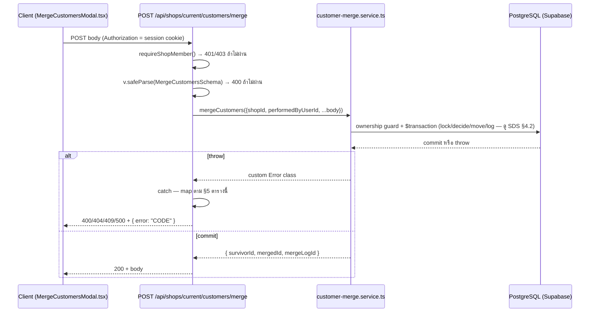

> **โมดูล:** M00042-CustomerMultiPhoneMerge
> **ประเภทเอกสาร:** API Contract
> **เวอร์ชัน:** 1.0
> **วันที่จัดทำ:** 2026-08-10
> **สถานะ:** Draft — [[SDS]]/[[SRS]] ผ่านแล้ว
> **เจ้าของเอกสาร:** SA (ดู [[Feature-Docs-Ownership]])

# API Contract: ลูกค้าหลายเบอร์และการรวมลูกค้า (Customer Multi-Phone & Merge)

---

## 1. Overview

API ชุดนี้รองรับ 2 การกระทำของ feature 00042: เพิ่มเบอร์รองให้ลูกค้าที่มีอยู่แล้ว (FR-CM-001) และรวมลูกค้า
2 แถวเป็นแถวเดียว (FR-CM-005/006/007) — provider คือ `src/app/api/shops/current/customers/**` (Next.js 16
App Router Route Handlers, TypeScript). ผู้บริโภคคือ frontend ภายในระบบเดียวกันเท่านั้น (`CustomerTable.tsx`,
`MergeCustomersModal.tsx`, `AddPhoneModal.tsx`, `CustomerPanel.tsx`) — **ไม่มี 3rd-party consumer**

- **เอกสารออกแบบต้นทาง:** [[SDS]] §3 Component Design, §4.1/§4.2 Data Flow (ทุก endpoint trace กลับ [[SRS]] TFR-003/TFR-006)
- **Base URL:** `https://seller.deepthailand.app/api` (prod) / `https://seller.deepth.local/api` (dev) — เส้นทางสัมพัทธ์ที่ใช้ในเอกสารนี้คือ `/api/shops/current/customers/...`
- **Content-Type:** `application/json`
- **Convention:** ตาม `src/lib/shop-api-guard.ts` — response envelope แบบ **flat** (`{ error: "CODE", ...detail }`
  ไม่ใช่ nested `{error:{code,message}}`) เหมือน `GET /api/shops/current/customers/lookup` (endpoint พี่น้อง
  ในโฟลเดอร์เดียวกัน — verified จากไฟล์จริง) ทุก response ผ่าน `jsonNoStore()` (header `cache-control:
  private, no-store` ตาม `docs/conventions/feedback_auth_api_cache_control` — กัน response ที่มี PII/สิทธิ์
  ต่างผู้ใช้ถูก cache ข้ามคน)

---

## 2. Authentication

| รายการ | ค่า |
|--------|-----|
| **วิธี (Auth Method)** | NextAuth session cookie (seller subdomain) |
| **Guard function** | 🛑 **`requireShopMember()` จาก `@/lib/shop-api-guard`** — **ไม่ใช่** `requireLodgingShop()`/`requireGeneralShop()` (endpoint นี้ใช้ได้ทุก `Shop.vertical` ตาม PRD ไม่ล็อก vertical) และ **ไม่ใช่**เรียก `requireActiveShop()` ตรง ๆ ตามที่ [[SRS]] §4.1 เขียนกำกับไว้แบบสั้น ("Seller session + `requireActiveShop`") — `requireShopMember()` เป็น wrapper ที่เรียก `requireActiveShop()` ภายในอยู่แล้วและเป็น convention จริงของทุก route พี่น้องใต้ `/api/shops/current/**` (verified: `rooms/route.ts`, `bookings/route.ts` ใช้ pattern นี้ทั้งคู่) — **ปรับจาก SRS ให้ตรงกับโค้ดจริง** |
| **Token / Scope** | ไม่มี role gate เพิ่ม (PRD OD-8 มติ (b) — ทุกคนที่ `requireShopMember()` ผ่านคือ `OWNER` หรือ `ADMIN` ของ shop ปัจจุบัน กดได้เท่ากัน ไม่มี STAFF ในระบบ) |
| **กรณีไม่ผ่าน** | ไม่มี session → `401 {"error":"unauthorized"}`; มี session แต่ resolve active shop ไม่ได้ → `403 {"error":"FORBIDDEN"}` (ทั้งคู่มาจาก `requireShopMember()` เดิม ไม่ต้องเขียน guard ใหม่) |

---

## 3. Endpoint List

| Method | Path | คำอธิบาย |
|--------|------|----------|
| `POST` | `/api/shops/current/customers/[customerId]/phones` | เพิ่มเบอร์รองให้ลูกค้าที่มีอยู่แล้ว (FR-CM-001) |
| `POST` | `/api/shops/current/customers/merge` | รวมลูกค้า 2 แถวเป็นแถวเดียว (FR-CM-005/006/007) |

> ไม่มี GET endpoint ใหม่ — ข้อมูลที่ต้องแสดง (เบอร์ทั้งหมด/ข้อมูลเปรียบเทียบก่อนรวม) ถูก query ผ่าน RSC ที่
> มีอยู่แล้ว ([[SRS]] TFR-004/005) ไม่ยิง API แยก เพื่อลด attack surface (ไม่มี endpoint ให้เดา `customerId`
> แล้วดึงข้อมูลเปรียบเทียบข้ามสิทธิ์)

---

## 4. Endpoint Detail

### 4.1 `POST /api/shops/current/customers/[customerId]/phones`

ผูกเบอร์ใหม่เข้ากับลูกค้า (`Customer`) ที่มีอยู่แล้วในระบบ เป็นเบอร์รอง — ไม่ idempotent (ยิงซ้ำด้วยเบอร์เดิม
ที่ผูกกับ `customerId` เดียวกันแล้วได้ `409` `sameCustomer:true`) ไม่มี timeout/retry policy พิเศษ (internal
call เดียว, mutation ต่ำ)

**Request**

| ส่วน | ฟิลด์ | ชนิด | บังคับ | คำอธิบาย |
|------|-------|------|--------|----------|
| Path Param | `customerId` | `string` (uuid/cuid) | yes | id ของ `Customer` แถวที่จะผูกเบอร์ใหม่เข้าไป — ownership ตรวจใน service ไม่ใช่แค่ path param |
| Body | `phone` | `string` | yes | เบอร์ดิบตามที่ผู้ใช้กรอก — route normalize ด้วย `normalizePhone()` (`/^0[0-9]{9}$/`) ก่อนส่งต่อ service (ไม่รับ digits ที่ normalize มาแล้วจาก client — client ส่งดิบ ให้ server เป็นจุดเดียวที่ normalize เสมอเหมือนทุก endpoint อื่นของระบบ) |

**Valibot schema** (`src/lib/validations.ts`, เพิ่มใหม่):
```ts
export const AddCustomerPhoneSchema = v.object({
  phone: v.pipe(v.string(), v.regex(/^0[0-9]{9}$/)),
})
```
(regex ตรงกับ `normalizePhone()` — route validate **ก่อน** normalize เพราะ input จาก client เป็นเบอร์ที่
พิมพ์ตรง ๆ ไม่มี separator; ถ้าต้องรับเบอร์ที่มีขีด/เว้นวรรค ให้ route เรียก `normalizePhone(raw)` ก่อนแล้ว
`v.safeParse` กับผลลัพธ์ที่ normalize แล้วแทน — **ตัดสินใจ:** ทำแบบหลัง เพื่อ UX ที่ผู้ใช้พิมพ์เบอร์แบบมีขีด
ได้โดยไม่ต้อง client-side format เอง)

**Response — Success (201)**

| ฟิลด์ | ชนิด | คำอธิบาย |
|-------|------|----------|
| `phone` | `string` | เบอร์ mask แล้ว (`••••••5432`) — **ห้ามส่งเบอร์เต็มกลับ** (PII, ตาม `docs/conventions/rsc_pii_neutralize_at_source` แม้เป็น API response ไม่ใช่ RSC prop ก็ยึดหลักเดียวกัน) |
| `customerId` | `string` | id ของลูกค้าที่เพิ่งผูกเบอร์เข้าไป (ยืนยัน echo กลับ — เผื่อ client ต้อง refetch/invalidate) |

**Response — Error**

ดูตารางข้อ 5 — เฉพาะ endpoint นี้คืนได้: `400` (Valibot / `CustomerMergeSameRowError` ไม่เกี่ยวข้องกับ
endpoint นี้), `401`, `403` (ไม่ผ่าน `requireShopMember`), `404` (`CustomerNotOwnedByShopError`), `409`
(`PhoneAlreadyLinkedError`), `429` (rate-limit), `500`

**ตัวอย่าง JSON**

```json
// Request
POST /api/shops/current/customers/c_9f1a2b3c/phones
{ "phone": "089-876-5432" }

// Response 201
{ "phone": "••••••5432", "customerId": "c_9f1a2b3c" }

// Response 409 (เบอร์ผูกกับคนอื่นที่ร้านนี้เคยขายให้ด้วย)
{
  "error": "PHONE_ALREADY_LINKED",
  "sameCustomer": false,
  "ownerVisibleToShop": true,
  "ownerCustomerId": "c_7e88c1d0"
}

// Response 409 (เบอร์ผูกกับคนอื่นที่ร้านนี้ไม่เคยเห็นเลย — ไม่คืน ownerCustomerId, ตาม BR-CM-23 ห้ามเปิดเผยเกินที่เคยเปิดเผย)
{ "error": "PHONE_ALREADY_LINKED", "sameCustomer": false, "ownerVisibleToShop": false, "ownerCustomerId": null }
```

---

### 4.2 `POST /api/shops/current/customers/merge`

รวมลูกค้า 2 แถว (`customerIdA`, `customerIdB`) เข้าเป็นแถวเดียว โดยผู้เรียกระบุ `survivorCustomerId` ที่ต้องการ
ให้เป็นแถวหลัก — ธุรกรรม all-or-nothing, ไม่ idempotent (ยิงซ้ำด้วยคู่เดิม = `409` เพราะ `CustomerMergeLog.
mergedCustomerId` เป็น `@unique`)

**Request**

| ส่วน | ฟิลด์ | ชนิด | บังคับ | คำอธิบาย |
|------|-------|------|--------|----------|
| Body | `customerIdA` | `string` | yes | id แถวที่ 1 |
| Body | `customerIdB` | `string` | yes | id แถวที่ 2 (ต้องต่างจาก `customerIdA` — validate ที่ Valibot ระดับรูปแบบไม่ได้ เพราะเทียบค่ากันเอง ต้องเช็คใน `decideMerge()` → `CustomerMergeSameRowError`) |
| Body | `survivorCustomerId` | `string` | yes | ต้องเท่ากับ `customerIdA` หรือ `customerIdB` เท่านั้น — ระบุแถวที่ผู้ขายเลือกให้เป็นแถวหลัก (ถ้าฝั่งใดฝั่งหนึ่งมี `userId` ต้องตรงกับแถวนั้นเสมอ ตาม BR-CM-12 — client ควร pre-select/lock ค่านี้ตาม TFR-005 ข้อ 4 แต่ server re-validate เสมอ ห้าม trust client) |

**Valibot schema** (`src/lib/validations.ts`, เพิ่มใหม่):
```ts
export const MergeCustomersSchema = v.object({
  customerIdA: v.pipe(v.string(), v.minLength(1)),
  customerIdB: v.pipe(v.string(), v.minLength(1)),
  survivorCustomerId: v.pipe(v.string(), v.minLength(1)),
})
```
(เช็ค `customerIdA !== customerIdB` และ `survivorCustomerId ∈ {customerIdA, customerIdB}` อยู่ที่
`decideMerge()` — pure function, ไม่ใช่ Valibot — เพราะเป็น cross-field validation ที่ผูกกับ business rule
ไม่ใช่แค่รูปแบบข้อมูล)

**Response — Success (200)**

| ฟิลด์ | ชนิด | คำอธิบาย |
|-------|------|----------|
| `survivorCustomerId` | `string` | id แถวที่เหลืออยู่ (เหมือนที่ request ส่งมา — echo กลับเพื่อ confirm) |
| `mergedCustomerId` | `string` | id แถวที่ถูกรวมไป (ตอนนี้ `mergedIntoId` ชี้ไป survivor แล้ว) |
| `mergeLogId` | `string` | id ของ `CustomerMergeLog` ที่สร้างขึ้น — ไม่มี UI แสดงใน MVP นี้ (Ops เข้าถึงผ่าน DB) แต่ echo กลับเผื่อ client ต้อง log/debug |

**Response — Error**

ดูตารางข้อ 5 — เฉพาะ endpoint นี้คืนได้: `400` (Valibot / `CustomerMergeSameRowError` /
`CustomerMergeSurvivorMismatchError`), `401`, `403`, `404` (`CustomerNotOwnedByShopError`), `409`
(`CustomerMergeAlreadyMergedError` / `CustomerMergeUserIdConflictError`), `429`, `500`

**ตัวอย่าง JSON**

```json
// Request
POST /api/shops/current/customers/merge
{ "customerIdA": "c_9f1a2b3c", "customerIdB": "c_7e88c1d0", "survivorCustomerId": "c_9f1a2b3c" }

// Response 200
{ "survivorCustomerId": "c_9f1a2b3c", "mergedCustomerId": "c_7e88c1d0", "mergeLogId": "log_a1b2c3" }

// Response 409 (ทั้งสองแถวมี userId ต่างกัน — BR-CM-11)
{ "error": "CUSTOMER_MERGE_USERID_CONFLICT" }

// Response 400 (เลือกแถวหลักผิดฝั่ง — BR-CM-12 บังคับให้แถวที่มี userId เป็นหลักเสมอ)
{ "error": "CUSTOMER_MERGE_SURVIVOR_MISMATCH" }
```

---

## 5. Error Code Table

🛑 **Cross-file Error-Mapping (บังคับตาม CLAUDE.md — ทุก custom Error ต้องมี route catch → HTTP status ระบุ
ในเอกสารคนละไฟล์กับ service ที่ throw)** — ตารางนี้เหมือนกับ [[SRS]] §4.5 ทุกประการ (คัดลอกมาไว้ที่นี่ตาม
โครงสร้างบังคับของ template API.md ข้อ 5 — SSOT ที่แท้จริงคือ [[SRS]] §4.5, **ถ้าแก้ต้องแก้ทั้งสองที่พร้อมกัน**)

| Error Code (response `error` field) | Error class ที่โยน (service) | Route ที่ต้อง catch | HTTP Status | เงื่อนไข |
|---|---|---|---|---|
| `unauthorized` | — (ไม่มี session) | ทั้ง 2 route (`requireShopMember()`) | **401** | ไม่มี NextAuth session |
| `FORBIDDEN` | — (`requireShopMember()` resolve active shop ไม่ได้) | ทั้ง 2 route | **403** | session มีแต่ resolve shop ไม่ได้ |
| `VALIDATION_ERROR` | — (Valibot `safeParse` ล้ม) | ทั้ง 2 route (ก่อนเรียก service) | **400** | body ไม่ตรง `AddCustomerPhoneSchema`/`MergeCustomersSchema` |
| `CUSTOMER_NOT_OWNED_BY_SHOP` | `CustomerNotOwnedByShopError` — `customer-phone.service.ts::addSecondaryPhone`, `customer-merge.service.ts::mergeCustomers` | `POST .../phones`, `POST .../merge` | **404** | `customerId` ที่ระบุไม่มี `Order` ร่วมกับร้านที่เรียก (IDOR guard) |
| `PHONE_ALREADY_LINKED` | `PhoneAlreadyLinkedError` — `customer-phone.service.ts::addSecondaryPhone` | `POST .../phones` | **409** | เบอร์ที่จะเพิ่มมีเจ้าของอยู่แล้ว (BR-CM-02/03) — body แนบ `sameCustomer`/`ownerVisibleToShop`/`ownerCustomerId` |
| `CUSTOMER_MERGE_SAME_ROW` | `CustomerMergeSameRowError` — `customer-merge.service.ts::mergeCustomers` | `POST .../merge` | **400** | `customerIdA === customerIdB` |
| `CUSTOMER_MERGE_ALREADY_MERGED` | `CustomerMergeAlreadyMergedError` — `customer-merge.service.ts::mergeCustomers` | `POST .../merge` | **409** | แถวใดแถวหนึ่งมี `mergedIntoId != null` อยู่แล้ว (stale client state — ถูกรวมไปโดยคำขออื่นก่อนหน้า) |
| `CUSTOMER_MERGE_USERID_CONFLICT` | `CustomerMergeUserIdConflictError` — `customer-merge.service.ts::mergeCustomers` | `POST .../merge` | **409** | ทั้งสองแถวมี `userId` ไม่ null และไม่เท่ากัน (BR-CM-11) |
| `CUSTOMER_MERGE_SURVIVOR_MISMATCH` | `CustomerMergeSurvivorMismatchError` — `customer-merge.service.ts::mergeCustomers` | `POST .../merge` | **400** | `survivorCustomerId` ไม่ตรงกับแถวที่มี `userId` (BR-CM-12) หรือไม่ใช่ 1 ใน 2 id ที่ส่งมา |
| `Rate limit exceeded` | — (`guardApi`, `src/proxy.ts`) | ทั้ง 2 route (ครอบระดับ proxy ก่อนถึง route handler) | **429** | mutation bucket มาตรฐาน authed 30/นาที (ไม่มี bucket แยก — ดูเหตุผลด้านล่าง) |
| `INTERNAL_ERROR` | `Prisma.PrismaClientKnownRequestError` ที่ไม่ถูกดักไว้แล้ว (รวม `P2028` transaction timeout — ดู [[SDS]] §4.2) / error อื่นที่ไม่คาดคิด | ทั้ง 2 route (catch-all ท้ายสุด, `console.error` ก่อนคืน) | **500** | fallback สุดท้าย |

**โครง error response มาตรฐาน** (flat, ตรงกับ `customers/lookup/route.ts` เดิม — ไม่ใช่ nested):

```json
{ "error": "CUSTOMER_MERGE_USERID_CONFLICT" }
```

หรือกรณีมี detail เพิ่ม (เฉพาะ `PHONE_ALREADY_LINKED`):
```json
{ "error": "PHONE_ALREADY_LINKED", "sameCustomer": false, "ownerVisibleToShop": true, "ownerCustomerId": "c_..." }
```

> **Gate สำหรับ reviewer:** `rg "instanceof (CustomerNotOwnedByShopError|PhoneAlreadyLinkedError|CustomerMerge\w+Error)"`
> ใน `src/app/api/shops/current/customers/[customerId]/phones/route.ts` และ `.../merge/route.ts` ต้องเจอครบ
> ทุกตัวที่ตารางนี้ระบุว่า route นั้นต้อง catch — ก่อน merge (ป้องกันคลาส 00003 P2 `OutOfStockError` ที่ตกหล่น
> จน route คืน 500 แทน 400/404/409 ที่ตั้งใจ)

**Rate-limit — ไม่ต้องเพิ่ม bucket ใหม่:** `src/proxy.ts::guardApi` แบ่ง bucket ตาม `isFileAsset`/`isUploadAsset`
เท่านั้น (verified จากโค้ดจริง) — POST อื่นที่ไม่เข้าเงื่อนไขพิเศษทั้งสองตกเข้า bucket `mut` มาตรฐาน (authed
30/นาที ต่อ IP+session) โดยอัตโนมัติ ทั้งสอง endpoint ของฟีเจอร์นี้เป็น action ความถี่ต่ำมาก (BRD §6.2 "ไม่ใช่
hot path") — 30/นาทีเพียงพอ ไม่มีเหตุผลให้ยกเพดานเหมือน `/api/uploads/*`

---

## 6. Sequence

ดู [[SDS]] §4.1/§4.2 สำหรับ sequence diagram เต็ม (รวม pure-function decision layer) — ที่นี่แสดงเฉพาะมุมมอง
HTTP contract (request/response เท่านั้น ไม่ลง detail ของ lock/snapshot ภายใน service):



---

## 7. Traceability

| Endpoint | SDS Component / Decision | BRD FR |
|----------|--------------------------|--------|
| `POST .../[customerId]/phones` | `customer-phone.service.ts` (SDS §3), `decidePhoneConflict` (SDS TD-001), Data Flow §4.1 | FR-CM-001, FR-CM-003 |
| `POST .../merge` | `customer-merge.service.ts` (SDS §3), `decideMerge` (SDS TD-001), lock ordering (SDS TD-002), Data Flow §4.2 | FR-CM-004, FR-CM-005, FR-CM-006, FR-CM-007 |

---

## 8. สรุป (Summary)

เอกสารนี้กำหนดสัญญาการเชื่อมต่อของ 2 endpoint ใหม่ในฟีเจอร์ 00042 — ทั้งคู่ผ่าน `requireShopMember()`
(ปรับจากคำอธิบายสั้นใน [[SRS]] ให้ตรงกับ helper จริงที่ใช้ทั้งระบบ), ไม่มี role gate เพิ่มตาม PRD OD-8 มติ
(b), ไม่มี rate-limit bucket ใหม่ (ใช้ bucket `mut` มาตรฐาน), และ error-mapping ครบทุกตัวที่ [[SRS]] §4.5
enumerate ไว้ — response envelope เป็น flat `{error:"CODE"}` ให้ตรงกับ endpoint พี่น้อง (`lookup/route.ts`)
ในโฟลเดอร์เดียวกัน

**Open Questions:**
- ไม่มี — ทุก endpoint/error/auth ยืนยันกับโค้ดจริงแล้ว ไม่มีจุดที่ต้องเดา
