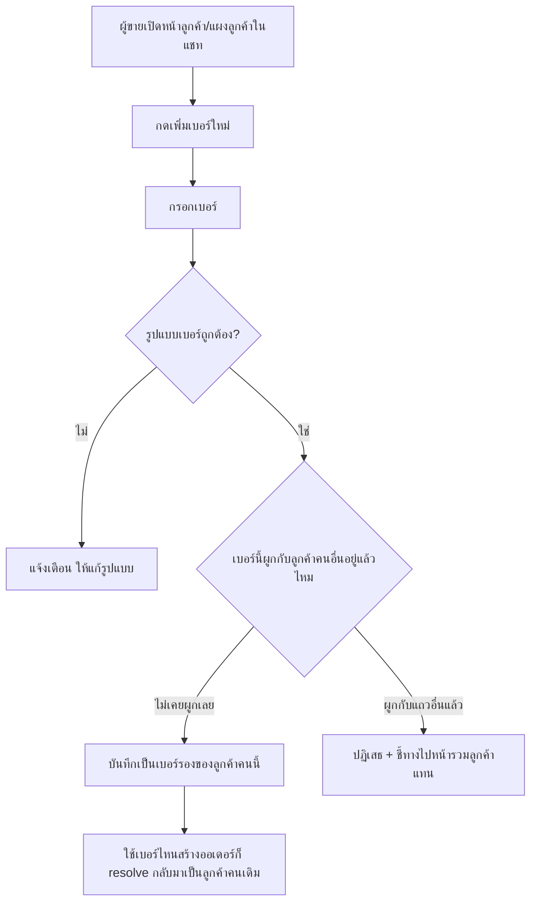
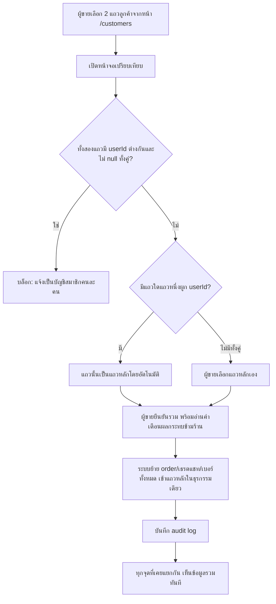

> **โมดูล:** M00042-CustomerMultiPhoneMerge
> **ประเภทเอกสาร:** Business Requirements Document (BRD) - NON-TECHNICAL
> **เวอร์ชัน:** 1.0
> **วันที่จัดทำ:** 2026-08-10
> **สถานะ:** Approved — Open Decisions §4.3 ของ PRD ถูกเคาะครบทั้ง 8 ข้อแล้ว 2026-08-10 (ตัวเลือก (a) ทั้งหมด)
> **เจ้าของเอกสาร:** BA (ดู [[Feature-Docs-Ownership]])

# BRD: ลูกค้าหลายเบอร์และการรวมลูกค้า (Business Requirements Document)

---

## 1. บทนำ

### 1.1 วัตถุประสงค์ของเอกสาร

เอกสารนี้มีวัตถุประสงค์เพื่อ:
1. กำหนด Functional Requirements ระดับ non-technical สำหรับการผูกหลายเบอร์เข้ากับลูกค้ากลาง (`Customer`) คนเดียวกัน และการรวมลูกค้า 2 แถวที่พิสูจน์แล้วว่าเป็นคนเดียวกันเข้าเป็นแถวเดียว
2. กำหนดขอบเขตการทำงาน ลำดับขั้นตอน และกฎที่ระบบต้องบังคับ โดยเฉพาะด่านป้องกันการรวมผิดคน
3. ระบุ Acceptance Criteria ที่ทีม QA นำไปสร้าง Test Case ได้โดยตรง
4. สร้างความเข้าใจร่วมกันระหว่างทีมธุรกิจและทีมพัฒนา ก่อน implement — ทุก FR ในเอกสารนี้ผูกกับ Open Decision อย่างน้อย 1 ข้อใน PRD §4.3 ซึ่ง **ถูกเคาะครบทุกข้อแล้ว 2026-08-10 (ตัวเลือก (a) ทั้งหมด)** จึงเข้าสู่ SRS/SDS ได้

### 1.2 ขอบเขตของระบบ

**ระบบลูกค้าหลายเบอร์และการรวมลูกค้า** คือส่วนขยายของ Customer Directory (feature 00014) ที่แก้ข้อจำกัดเดิม "1 เบอร์ = 1 ลูกค้าเสมอ" ให้รองรับกรณีที่ลูกค้าคนเดียวใช้มากกว่า 1 เบอร์ ผ่าน 2 กลไก: **เพิ่มเบอร์** (ผูกเบอร์ใหม่เข้ากับลูกค้าที่มีอยู่แล้วโดยตรง — ป้องกันไม่ให้เกิดแถวซ้ำ) และ **รวมลูกค้า** (รวม 2 แถวที่เกิดแยกกันไปแล้วเข้าเป็นแถวเดียว พร้อมย้ายประวัติทั้งหมด) ทั้งสองกลไกทำงานบนสมมติฐานว่า `Customer` เป็นตัวตน**ข้ามร้าน** — ผลของการเพิ่ม/รวมจึงมีผลกับทุกร้านที่เคยมีปฏิสัมพันธ์กับลูกค้าคนนั้น ไม่ใช่แค่ร้านที่กดปุ่ม

**เข้าสู่ระบบ (Input):**
- เบอร์โทรใหม่ที่ผู้ขายกรอกเพื่อผูกกับลูกค้าที่มีอยู่แล้ว (จากหน้าลูกค้า/แผงลูกค้าในห้องแชท)
- การเลือก 2 แถวลูกค้าจากหน้า `/customers` เพื่อเปิดหน้าจอเปรียบเทียบ
- การยืนยันรวมจากผู้ขาย (หลังอ่านคำเตือนผลกระทบข้ามร้าน)

**ออกจากระบบ (Output):**
- `Customer` ที่มีมากกว่า 1 เบอร์ผูกกัน ใช้เบอร์ไหนสร้างออเดอร์ก็ resolve กลับมาเป็นคนเดิม
- แถวลูกค้าซ้ำที่ถูกรวมเป็นแถวเดียว พร้อมประวัติ (ออเดอร์ทุกร้าน, การผูกเธรดแชท) ย้ายตามไปครบ
- Audit log การรวม (ผู้กระทำ, เวลา, แถวที่ถูกรวม/แถวที่เหลือ, สแนปช็อตก่อนรวม)
- ข้อความปฏิเสธพร้อมเหตุผล เมื่อการเพิ่มเบอร์/การรวมเข้าเงื่อนไขบล็อก

**ระบบที่เกี่ยวข้อง:**
- `customer.service.ts` — `findOrCreateCustomer` (feature 00014, เจ้าของกฎ "1 เบอร์ = 1 ลูกค้า")
- หน้า `/customers` (`src/app/(paces)/seller/(dashboard)/customers/`) — จุดที่ปัญหาแถวซ้ำแสดงผลชัดที่สุด (group by `customerId` ผ่าน `makeCustomerRowKey`)
- `CustomerPanel.tsx` (แผงลูกค้าในห้องแชท, feature 00018) — จุดที่สถิติ/ประวัติออเดอร์แสดงแค่ของเบอร์เดียวที่เธรดผูกอยู่
- `getCancellationSummary` (feature 00017, BR-LODG-38/39) — จุดที่ผลกระทบข้ามร้านของการรวมชัดเจนที่สุด
- `linkBuyerHistory` (`user.service.ts`) — ผูกประวัติตอนสมัครสมาชิกภายหลัง ทีละเบอร์
- `ai-context.service.ts` — บริบทที่ AI ใช้ร่างคำตอบ query ด้วย `customerId` เดี่ยว
- `customer-phone-edit.ts` / `thread-customer-link.ts` (ปิดวันเดียวกัน 2026-08-10) — กลไกข้างเคียงสำหรับเคส "คีย์เบอร์ผิด" (คนละเงื่อนไขกับ merge — ดู §8.5)

### 1.3 กลุ่มผู้ใช้งาน

| กลุ่มผู้ใช้ | บทบาท | สิทธิ์การใช้งาน |
|-----------|--------|----------------|
| **เจ้าของร้าน/แอดมินร้าน (OWNER/ADMIN)** | ตัดสินใจว่าลูกค้า 2 แถวเป็นคนเดียวกันจริงหรือไม่ | เพิ่มเบอร์ + รวมลูกค้าได้เต็มสิทธิ์ (ตาม OD-8 ที่เสนอ) |
| **พนักงานร้าน (STAFF)** | ให้บริการลูกค้าประจำวัน | เห็นเบอร์ทั้งหมดของลูกค้า แต่กด "รวมลูกค้า" ไม่ได้ (ตาม OD-8 ที่เสนอ — รอเคาะ) |

---

## 2. ความต้องการหลัก (Functional Requirements)

### 2.1 เพิ่มเบอร์ให้ลูกค้าเดิม (Multi-Phone)

#### FR-CM-001: เพิ่มเบอร์ให้ลูกค้าที่มีอยู่แล้ว

**User Story:**
> ในฐานะผู้ขาย ฉันต้องการผูกเบอร์ที่สองเข้ากับลูกค้าคนเดิมที่ฉันรู้จักอยู่แล้ว เพื่อไม่ให้ระบบสร้างลูกค้าซ้ำเมื่อเขาสั่งซื้อด้วยเบอร์ที่ต่างไปจากเดิม

**Acceptance Criteria:**
- [ ] กดเพิ่มเบอร์จากหน้าลูกค้า หรือแผงลูกค้าในห้องแชท กรอกเบอร์ใหม่ → ระบบตรวจรูปแบบเบอร์ (ไทย 10 หลัก ขึ้นต้น 0) ก่อนบันทึกเสมอ
- [ ] เบอร์ที่กรอกไม่ผ่านรูปแบบ → แจ้งเตือน ไม่บันทึก
- [ ] เบอร์ที่กรอกยังไม่เคยผูกกับลูกค้าคนไหนในระบบเลย → บันทึกสำเร็จ ลูกค้าคนนี้มี ≥2 เบอร์
- [ ] เบอร์ที่กรอกเป็นเบอร์ของลูกค้าแถวอื่นอยู่แล้ว (ไม่ว่าเป็นเบอร์หลักหรือเบอร์รองของแถวนั้น) → ปฏิเสธการเพิ่มตรง ๆ พร้อมข้อความชี้ทางไปหน้าจอ "รวมลูกค้า" แทน

**Business Flow:**
1. ผู้ขายเปิดหน้าลูกค้า/แผงลูกค้าในแชท
2. กด "เพิ่มเบอร์" กรอกเบอร์ใหม่
3. ระบบตรวจรูปแบบ → ตรวจว่าเบอร์นี้ผูกกับลูกค้าคนอื่นอยู่แล้วหรือไม่
4. ไม่ผูกกับใครเลย → บันทึกเป็นเบอร์รอง
5. ผูกกับแถวอื่นแล้ว → ปฏิเสธ ชี้ทางไปหน้ารวมลูกค้า

**Example:**
```
ร้าน beauty_x มีลูกค้า "คุณอร" เบอร์หลัก 08x-xxx-1111
คุณอรสั่งซื้อผ่านเบอร์ที่ทำงาน 08x-xxx-2222 ครั้งแรก
ผู้ขายรู้จักหน้าลูกค้าดี กดเพิ่มเบอร์ 2222 เป็นเบอร์รองของแถวเดิม
→ ครั้งถัดไปสั่งด้วยเบอร์ไหนก็ resolve กลับมาเป็นลูกค้าคนเดียวกัน
```

#### FR-CM-002: มองเห็นเบอร์ทั้งหมดของลูกค้าคนหนึ่ง

**User Story:**
> ในฐานะผู้ขาย ฉันต้องการเห็นเบอร์ทั้งหมดที่ผูกกับลูกค้าคนหนึ่ง เพื่อรู้ว่าเขาอาจติดต่อร้านผ่านเบอร์ไหนได้อีก

**Acceptance Criteria:**
- [ ] หน้าลูกค้า/แผงลูกค้าในแชท แสดงรายการเบอร์ทั้งหมดที่ผูกกับลูกค้าคนนั้น (ไม่ใช่แค่เบอร์หลัก)
- [ ] เบอร์แสดงผลแบบ mask ตามกฎ PDPA เดิมของระบบ (แสดงบางส่วน ไม่ใช่เบอร์เต็มดิบ) — สอดคล้องกับ `maskContact`/`maskPhone` ที่ใช้อยู่แล้วทุกจุด

### 2.2 dedupe ด้วยเบอร์ใดก็ได้ในชุด

#### FR-CM-003: สร้างออเดอร์ด้วยเบอร์ใดก็ได้ในชุด → resolve เป็นลูกค้าเดิม

**User Story:**
> ในฐานะระบบ เมื่อสร้างออเดอร์ใหม่ด้วยเบอร์ที่เป็นเบอร์รองของลูกค้าที่มีอยู่แล้ว ฉันต้องผูกออเดอร์นั้นกับลูกค้าคนเดิม ไม่ใช่สร้างลูกค้าใหม่

**Acceptance Criteria:**
- [ ] `findOrCreateCustomer` (หรือกลไกเทียบเท่าหลัง implement) resolve เบอร์หลักและเบอร์รองทั้งหมดของลูกค้าคนหนึ่งให้กลับมาเป็น `customerId` เดียวกันเสมอ
- [ ] สร้างออเดอร์ด้วยเบอร์รอง → `Order.customerId` ชี้ไปแถวลูกค้าเดิม ไม่ใช่แถวใหม่

### 2.3 รวมลูกค้า 2 แถวเป็นคนเดียว (Merge)

#### FR-CM-004: เลือกลูกค้า 2 แถวมาเปรียบเทียบก่อนรวม

**User Story:**
> ในฐานะผู้ขาย ฉันต้องการเห็นข้อมูลของทั้ง 2 แถวเทียบกันก่อนตัดสินใจรวม เพื่อไม่ให้รวมผิดคน

**Acceptance Criteria:**
- [ ] เลือก 2 แถวจากหน้า `/customers` → เปิดหน้าจอเปรียบเทียบแสดง: ชื่อ, เบอร์ที่มีอยู่ทั้งหมด, จำนวนออเดอร์ (เฉพาะร้านตัวเอง), ยอดซื้อสะสม (เฉพาะร้านตัวเอง), วันที่เป็นลูกค้ามา ของทั้งสองแถว
- [ ] ไม่มีทาง "รวมได้ใน 1 คลิก" โดยไม่ผ่านหน้าจอเปรียบเทียบนี้

#### FR-CM-005: บล็อกการรวมที่เสี่ยง

**User Story:**
> ในฐานะระบบ ฉันต้องปฏิเสธการรวมเมื่อมีหลักฐานชัดว่าทั้งสองแถวเป็นคนละคนจริง เพื่อป้องกันความเสียหายที่กู้คืนไม่ได้

**Acceptance Criteria:**
- [ ] ทั้งสองแถวมี `Customer.userId` ที่ไม่ null และไม่เท่ากัน → บล็อกทันที พร้อมข้อความอธิบายเหตุผล ("ทั้งสองเบอร์เป็นบัญชีสมาชิกที่ยืนยันตัวตนแล้วคนละคน ไม่สามารถรวมได้")
- [ ] แถวใดแถวหนึ่งมี `userId` (อีกแถวไม่มี) → อนุญาตให้รวมได้ โดยแถวที่มี `userId` ต้องเป็นแถวหลักที่เหลืออยู่เสมอ (ไม่ให้ผู้ขายเลือกสลับ)
- [ ] ทั้งสองแถวไม่มี `userId` เลย → อนุญาตให้รวมได้ โดยให้ผู้ขายเลือกว่าแถวไหนเป็นแถวหลัก

#### FR-CM-006: ยืนยันรวมแล้วรวมประวัติทันที

**User Story:**
> ในฐานะผู้ขาย เมื่อฉันยืนยันการรวมแล้ว ฉันต้องการให้ประวัติทั้งหมดของทั้งสองแถวย้ายมารวมกันทันที ไม่ใช่ค่อย ๆ ทยอยอัปเดต

**Acceptance Criteria:**
- [ ] หลังยืนยัน: ออเดอร์ทุกใบของแถวที่ถูกรวม (ทุกร้าน) ย้ายไปชี้แถวหลัก
- [ ] หลังยืนยัน: การผูกเธรดแชททุกช่องทางของแถวที่ถูกรวม ย้ายไปชี้แถวหลัก
- [ ] หลังยืนยัน: เบอร์ทั้งหมดของทั้งสองแถว (หลัก+รอง) กลายเป็นเบอร์ของแถวหลักทั้งหมด
- [ ] การย้ายทั้งหมดสำเร็จหรือไม่สำเร็จพร้อมกันทั้งชุด (ห้ามย้ายสำเร็จบางส่วนแล้วเหลือค้าง)
- [ ] แถวที่ถูกรวม ไม่สามารถใช้งานต่อในฐานะตัวตนอิสระได้อีก

#### FR-CM-007: บันทึกร่องรอยการรวม

**User Story:**
> ในฐานะทีม Ops ฉันต้องการเห็นร่องรอยของทุกการรวมที่เกิดขึ้น เพื่อสืบสวน/แก้ไขด้วยมือได้หากมีข้อร้องเรียนว่ารวมผิดคน

**Acceptance Criteria:**
- [ ] ทุกการรวมที่สำเร็จ บันทึก: ผู้กระทำ (ผู้ขาย/ร้าน), เวลา, id ของแถวที่ถูกรวมและแถวที่เหลือ, สแนปช็อตข้อมูลสำคัญของทั้งสองแถวก่อนรวม (อย่างน้อยเบอร์ที่มีทั้งหมด และ `userId` ถ้ามี)
- [ ] ร่องรอยนี้อยู่ถาวร ไม่ถูกลบแม้แถวที่ถูกรวมจะไม่ใช้งานแล้ว

### 2.4 ผลกระทบต่อจุดที่มีอยู่ก่อนแล้ว (sync อัตโนมัติ)

#### FR-CM-008: ทุกจุดที่เคยแยกกัน เห็นข้อมูลรวมทันทีหลัง merge

**User Story:**
> ในฐานะผู้ขาย หลังรวมลูกค้าสำเร็จ ฉันต้องการเห็นผลลัพธ์ที่ถูกต้องในทุกหน้าจอที่เกี่ยวกับลูกค้าคนนี้ทันที โดยไม่ต้องรอ/ไม่ต้องแก้ทีละที่

**Acceptance Criteria:**
- [ ] หน้า `/customers` แสดงลูกค้าคนนี้เป็น **1 แถว** (ไม่ใช่ 2 แถว) พร้อมยอดซื้อ/จำนวนออเดอร์รวมกัน
- [ ] แผงลูกค้าในห้องแชท (ทุกเธรดของลูกค้าคนนี้ ไม่ว่าผูกกับเบอร์ไหน) แสดงสถิติและรายการออเดอร์รวมทั้งหมด
- [ ] ประวัติยกเลิกข้ามร้าน (`getCancellationSummary`) นับรวมจากทั้งสองแถวเดิม
- [ ] เมื่อลูกค้าคนนี้สมัครสมาชิกภายหลังด้วยเบอร์ใดเบอร์หนึ่งในชุด → `linkBuyerHistory` ผูกออเดอร์เก่าที่ใช้เบอร์ **ทุกเบอร์ในชุด** ไม่ใช่แค่เบอร์ที่สมัคร
- [ ] บริบทที่ AI ใช้ร่างคำตอบ (`ai-context.service.ts`) เห็นประวัติออเดอร์ที่รวมแล้ว ไม่ใช่แค่ของเบอร์ที่เธรดนั้นผูกอยู่

---

## 3. Acceptance Criteria สรุป

### 3.1 เพิ่มเบอร์

**เมื่อระบบทำงานถูกต้อง:**
- ✅ เบอร์ใหม่ที่ไม่เคยมีเจ้าของ ผูกกับลูกค้าที่เลือกได้สำเร็จ
- ✅ เบอร์ใหม่ที่มีเจ้าของอยู่แล้ว ถูกปฏิเสธพร้อมชี้ทางไปหน้ารวมลูกค้า
- ✅ ทุกเบอร์ที่ผูกแล้ว ใช้ dedupe ตอนสร้างออเดอร์ได้เท่ากันหมด

### 3.2 รวมลูกค้า

**เมื่อระบบทำงานถูกต้อง:**
- ✅ ทุกการรวมผ่านหน้าจอเปรียบเทียบก่อนเสมอ
- ✅ รวมสำเร็จ → ประวัติทั้งหมด (ออเดอร์/เธรดแชท/เบอร์) ย้ายมาแถวเดียวครบ ไม่มีตกหล่น
- ✅ มี audit log ทุกครั้งที่รวมสำเร็จ

**เมื่อเข้าเงื่อนไขบล็อก (ทั้งสองแถวมี `userId` ต่างกัน):**
- ✅ ระบบปฏิเสธทันที ไม่มีทางข้าม
- ✅ ผู้ขายเห็นเหตุผลที่ถูกปฏิเสธชัดเจน

---

## 4. Business Flows (กระบวนการทำงาน)

### 4.1 Flow หลัก: เพิ่มเบอร์ให้ลูกค้าเดิม



### 4.2 Flow รวมลูกค้า 2 แถวเป็นคนเดียว



---

## 5. Use Case Scenarios (สถานการณ์การใช้งานจริง)

### Scenario 1: Best Case — ลูกค้าคนเดียวใช้ 2 เบอร์สั่งซื้อคนละครั้ง

**ผู้เกี่ยวข้อง:** เจ้าของร้าน beauty_x

**เงื่อนไขเริ่มต้น:**
- ลูกค้า "คุณอร" มี 2 แถวในระบบ (เบอร์ 1111 และเบอร์ 2222) เพราะสั่งซื้อคนละครั้งด้วยคนละเบอร์ ก่อนที่ผู้ขายจะรู้ตัว
- ทั้งสองแถวไม่มี `userId` (guest ทั้งคู่)

**ขั้นตอน:**
1. ผู้ขายเปิดหน้า `/customers` เห็น "คุณอร" 2 แถว สังเกตชื่อ/ที่อยู่คล้ายกัน
2. เลือกทั้ง 2 แถว กด "รวมลูกค้า"
3. เห็นหน้าจอเปรียบเทียบ เลือกแถวเบอร์ 1111 เป็นแถวหลัก (เพราะมีประวัติยาวกว่า)
4. กดยืนยัน

**ผลลัพธ์:**
- ลูกค้าเหลือ 1 แถว มีเบอร์ 1111 (หลัก) และ 2222 (รอง) ยอดซื้อ/จำนวนออเดอร์รวมกัน

### Scenario 2: Blocked — พยายามรวมบัญชีสมาชิก 2 คนที่ต่างกัน

**ผู้เกี่ยวข้อง:** เจ้าของร้าน

**เงื่อนไขเริ่มต้น:**
- แถว A ชื่อ "สมชาย" มี `userId` ของบัญชี X (login ยืนยันตัวตนแล้ว)
- แถว B ก็ชื่อ "สมชาย" เช่นกัน (คนละคน โดยบังเอิญชื่อซ้ำ) มี `userId` ของบัญชี Y

**ขั้นตอน:**
1. ผู้ขายเห็นชื่อซ้ำกัน เข้าใจผิดว่าเป็นคนเดียวกัน เลือก 2 แถวนี้ กด "รวมลูกค้า"
2. เปิดหน้าจอเปรียบเทียบ กดยืนยัน

**ผลลัพธ์:**
- ระบบปฏิเสธทันทีตั้งแต่ตรวจเงื่อนไข ไม่ให้รวม พร้อมข้อความอธิบายว่าเป็นบัญชีสมาชิกคนละคน — ไม่มีข้อมูลใดถูกย้าย

### Scenario 3: เพิ่มเบอร์เชิงป้องกัน (ก่อนเกิดปัญหา)

**ผู้เกี่ยวข้อง:** พนักงานร้าน

**เงื่อนไขเริ่มต้น:**
- ลูกค้าประจำเบอร์ 1111 อยู่หน้าร้าน แจ้งว่า "ครั้งหน้าจะให้แฟนโอนให้แล้วใช้เบอร์แฟนสั่ง" (เบอร์ 3333)

**ขั้นตอน:**
1. ผู้ขายเปิดหน้าลูกค้าเบอร์ 1111 กด "เพิ่มเบอร์" กรอก 3333
2. ระบบตรวจว่าเบอร์ 3333 ยังไม่เคยผูกกับใคร → บันทึกสำเร็จ

**ผลลัพธ์:**
- ครั้งหน้าที่สั่งด้วยเบอร์ 3333 ระบบรู้จักเป็นลูกค้าคนเดิมทันที ไม่ต้องรอให้เกิดแถวซ้ำแล้วมารวมทีหลัง

---

## 6. ความต้องการด้านคุณภาพ (Quality Requirements)

### 6.1 ความถูกต้องของข้อมูล
- การรวมต้องเป็น all-or-nothing — ห้ามเกิดสถานะที่ FK บางส่วนย้ายไปแถวหลักแต่บางส่วนยังชี้แถวเดิม

### 6.2 ความรวดเร็ว
- การเพิ่มเบอร์/การรวม เป็น action ที่ไม่บ่อย (ไม่ใช่ hot path) — ไม่มีข้อกำหนดด้าน performance พิเศษเกินมาตรฐานทั่วไปของระบบ

### 6.3 ความน่าเชื่อถือ
- ทุกการรวมต้องมี audit log ที่กู้อ่านย้อนหลังได้เสมอ แม้แถวที่ถูกรวมจะไม่ใช้งานต่อแล้ว

### 6.4 ความปลอดภัย
- ห้ามรวมข้ามบัญชีสมาชิก 2 คนที่ยืนยันตัวตนแล้วเด็ดขาด (fail-closed — ค่าที่พิสูจน์ไม่ได้ต้องถือว่าไม่ปลอดภัย ตามหลักการเดียวกับ `canRenameCustomerPhone`)
- สิทธิ์กดรวมจำกัดตาม OD-8 (เสนอ OWNER/ADMIN เท่านั้น)

### 6.5 ความสะดวกในการใช้งาน (Usability)
- หน้าจอเปรียบเทียบก่อนรวมต้องอ่านเข้าใจได้โดยไม่ต้องรู้ศัพท์เทคนิค (ไม่โชว์ id ดิบของฐานข้อมูล — ตามแนวทางเดียวกับที่ `CustomerPanel.tsx` แก้ไปแล้วสำหรับ "รหัสลูกค้า")

---

## 7. ข้อจำกัด (Constraints)

### 7.1 ข้อจำกัดทางธุรกิจ
- ไม่มี self-service unmerge (OD-2)
- ไม่มี auto-detect ลูกค้าซ้ำ (OD-6)
- สิทธิ์กดรวมจำกัดเฉพาะ OWNER/ADMIN (OD-8, เสนอ)

### 7.2 ข้อจำกัดทางเทคนิค
- โครงสร้างข้อมูลที่เก็บเบอร์รอง (ตารางใหม่/schema) เป็นการตัดสินใจของ SRS/SDS/DATABASE — เอกสารนี้ระบุแค่กฎเชิงธุรกิจ
- `resolveOrderAccess`/`/o/{token}` ไม่เปลี่ยนพฤติกรรมเว้นแต่ OD-3 เคาะเป็นอย่างอื่น

---

## 8. กฎทางธุรกิจ (Business Rules)

### 8.1 กฎการเพิ่มเบอร์ (Multi-Phone)

| รหัส | กฎ |
|------|-----|
| **BR-CM-01** | เบอร์ที่เพิ่มต้องผ่าน validate รูปแบบเดียวกับเบอร์หลัก (เบอร์ไทย 10 หลัก ขึ้นต้น 0) ก่อนบันทึกเสมอ |
| **BR-CM-02** | เบอร์หนึ่งเบอร์ผูกกับลูกค้ากลางได้สูงสุด 1 คนในระบบเสมอ — ห้ามเบอร์เดียวกันเป็นเบอร์รองของลูกค้า 2 คน |
| **BR-CM-03** | เบอร์ที่จะเพิ่มเป็นเบอร์รอง ถ้าเป็นเบอร์หลักหรือเบอร์รองของ `Customer` แถวอื่นอยู่แล้ว ระบบต้องปฏิเสธการเพิ่มตรง ๆ และเสนอ "รวมลูกค้า" แทน (มิฉะนั้นขัด BR-CM-02) |
| **BR-CM-04** | เบอร์แรกที่ `Customer` ถูกสร้างด้วย (`Customer.phone` เดิม) เป็น "เบอร์หลัก" เสมอ — ไม่มี UI สลับเบอร์หลักในเฟสนี้ (ผูกกับ OD-3/OD-4 — ต้อง sync กับผลการตัดสินใจ) |
| **BR-CM-05** | ทุกเบอร์ในชุด (หลัก+รอง) ใช้ dedupe ตอนสร้างออเดอร์ใหม่ได้เท่ากัน (พิมพ์เบอร์ไหนในชุดก็ resolve กลับมาเป็น `customerId` เดิม) |

### 8.2 กฎการรวมลูกค้า

| รหัส | กฎ |
|------|-----|
| **BR-CM-10** | การรวมต้องผ่านหน้าจอเปรียบเทียบที่แสดงข้อมูลทั้งสองแถว (ชื่อ/เบอร์ที่มี/จำนวนออเดอร์/ยอดซื้อ — เฉพาะร้านตัวเอง) ก่อนยืนยันเสมอ |
| **BR-CM-11** | ห้ามรวม ถ้าทั้งสองแถวมี `Customer.userId` ที่ไม่ null และไม่เท่ากัน (ทั้งคู่เป็นบัญชีสมาชิกจริงคนละคน) — fail-closed พร้อมแสดงเหตุผล |
| **BR-CM-12** | ถ้าแถวใดแถวหนึ่งมี `userId` (อีกแถวไม่มี) → รวมได้ โดยแถวที่มี `userId` ต้องเป็นแถวหลักเสมอ (ระบบไม่ให้เลือกสลับ) — คงตัวตนที่ยืนยันแล้วไว้เป็นหลัก ถ้าทั้งสองแถวไม่มี `userId` เลย ให้ผู้ขายเลือกแถวหลักเอง |
| **BR-CM-13** | การรวมย้าย FK ทุกจุดที่ชี้ไปแถวที่ถูกรวม (ออเดอร์ทุกร้าน, การผูกเธรดแชททุกช่องทาง, และจุดอื่นใดที่อ้าง `customerId` ในอนาคต) ไปยังแถวหลัก ภายในธุรกรรมเดียว (all-or-nothing) |
| **BR-CM-14** | เบอร์ทั้งหมดของทั้งสองแถว (หลัก+รอง) กลายเป็นเบอร์ของแถวหลักทั้งหมดหลังรวม |
| **BR-CM-15** | การรวมต้องถูกบันทึกเป็น audit log แบบกู้คืนไม่ได้ด้วยตัวผู้ขายเอง (irreversible self-service) แต่มีสแนปช็อตพอให้ทีม Ops สืบสวน/แก้ไขด้วยมือได้กรณีจำเป็น (OD-2) |
| **BR-CM-16** | การรวมไม่มีผลย้อนหลังกับ Trust Score/Badge ของผู้ใช้ใด ๆ (คำนวณจาก `User` ไม่ใช่ `Customer` อยู่แล้ว) |

### 8.3 ผลกระทบข้ามร้านและความเป็นส่วนตัว

| รหัส | กฎ |
|------|-----|
| **BR-CM-20** | การรวมมีผลทันทีกับทุกร้านที่เคยมีออเดอร์กับ `Customer` ทั้งสองแถว (เพราะ `Customer` เป็นตัวตนข้ามร้าน) — หน้าจอยืนยันต้องเตือนผู้ขายเรื่องนี้ชัดเจนก่อนกด (OD-1) |
| **BR-CM-21** | ยอดซื้อ/จำนวนออเดอร์ที่ร้านอื่นเห็น ไม่เปลี่ยนแปลงจากการรวม เพราะ scope ด้วย `shopId` อยู่แล้ว (การรวมไม่เปิดเผยยอดขาย/ออเดอร์ของร้านอื่นให้ร้านที่กดรวมเห็นเพิ่มขึ้น) |
| **BR-CM-22** | ตัวเลขเดียวที่เปลี่ยนข้ามร้านทันทีคือ "จำนวนครั้งยกเลิกสะสม" (BR-LODG-38/39) ซึ่งเป็นค่ารวมที่ไม่เปิดเผยรายละเอียดร้านอยู่แล้ว — คงกติกาเดิม (คำเตือนไม่บล็อก ไม่หัก Trust Score) |
| **BR-CM-23** | ห้ามให้การรวมเปิดเผยข้อมูลใหม่ที่ระบบไม่เคยเปิดเผยมาก่อน (เช่น ชื่อร้านอื่นที่ลูกค้าเคยซื้อ) แม้จะรวมสำเร็จแล้ว |

### 8.4 การรวมกับข้อมูลเดิมบน production (Backfill)

| รหัส | กฎ |
|------|-----|
| **BR-CM-30** | ฟีเจอร์นี้ไม่รันการรวมอัตโนมัติ และไม่เสนอคู่ที่ "น่าจะเป็นคนเดียวกัน" ให้ผู้ขาย — การรวมทุกครั้งเป็น manual action ที่ผู้ขายเป็นคนเริ่มเท่านั้น (MVP; OD-6) |

### 8.5 ความสัมพันธ์กับกฎที่มีอยู่ก่อนแล้ว (คีย์เบอร์ผิด)

| รหัส | กฎ |
|------|-----|
| **BR-CM-40** | `canRenameCustomerPhone`/`shouldRelinkThreadCustomer` (กลไกเดิมสำหรับ "คีย์เบอร์ผิด") ยังทำงานเหมือนเดิมสำหรับกรณีที่พิสูจน์ได้ว่าแถวเดิมไม่มีเจ้าของจริง — ฟีเจอร์นี้ไม่แทนที่กลไกนั้น เป็นทางเลือกที่สองสำหรับกรณี "มีเจ้าของจริงทั้งสองแถว" ซึ่งกลไกเดิมตั้งใจปฏิเสธ (fail-closed) |
| **BR-CM-41** | สิทธิ์กดรวมลูกค้าจำกัดเฉพาะ role OWNER/ADMIN ของร้าน (หน้า `/customers` เดิมไม่มี role gate พิเศษ — นี่คือเงื่อนไขใหม่ที่เพิ่มเฉพาะ action รวม เพราะเป็น action ที่ย้อนกลับเองไม่ได้) — รอ OD-8 ยืนยัน |

---

## 9. อภิธานศัพท์ (Glossary)

| คำศัพท์ | ความหมาย |
|---------|----------|
| **ลูกค้ากลาง (Customer)** | ตัวตนของลูกค้า 1 คนในระบบ ตัวตนข้ามร้าน (feature 00014) |
| **เบอร์หลัก / เบอร์รอง** | เบอร์แรกที่สร้างแถว / เบอร์เพิ่มเติมที่ผูกภายหลัง |
| **แถวหลัก (Surviving Row)** | แถว `Customer` ที่เหลืออยู่หลังการรวม |
| **การรวมลูกค้า** | คนละเรื่องกับ "การรวมบัญชี" (`account-merge-ticket.ts`, feature 00015) — ดูรายละเอียดที่ PRD §7 Glossary |

---

## 10. สรุป

เอกสาร BRD นี้อธิบายความต้องการหลักของ **ลูกค้าหลายเบอร์และการรวมลูกค้า** แบบไม่ใช่เทคนิค

**จุดเด่นของระบบ:**
- แก้ปัญหาที่ต้นตอเดียว (ระดับ `Customer`) ทำให้ทุกจุดที่เคยแยกกัน (list/แผงแชท/ประวัติยกเลิก/AI context/buyer history linking) ถูกไปพร้อมกันโดยอัตโนมัติ
- มีด่านป้องกันการรวมผิดคนที่ fail-closed จริง ไม่ใช่แค่คำเตือน

**ผลลัพธ์ที่คาดหวัง:**
- จำนวนแถวลูกค้าซ้ำในร้านที่ใช้ฟีเจอร์ลดลงอย่างวัดผลได้จริงจาก DB
- ไม่มีเคสรวมผิดคนที่ต้องให้ทีม Ops เข้าไปแก้มือ

---

**หมายเหตุ:**
สำหรับความต้องการทางธุรกิจระดับภาพรวม/personas/KPI ดู [[PRD]] ของโมดูลนี้ (รวมตารางมติ §4.3 ที่เคาะครบแล้ว)
สำหรับ technical specification (architecture/API/data/NFR) ดู [[SRS]] ของโมดูลนี้ (ยังไม่เขียน)
