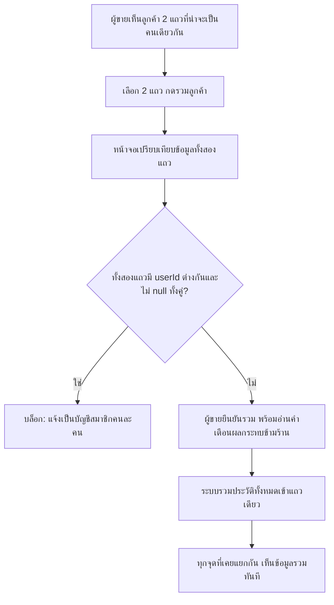

> **โมดูล:** M00042-CustomerMultiPhoneMerge
> **ประเภทเอกสาร:** Product Requirements Document (PRD)
> **เวอร์ชัน:** 1.0
> **วันที่จัดทำ:** 2026-08-10
> **สถานะ:** Approved — user เคาะ Open Decisions ครบทั้ง 8 ข้อแล้ว 2026-08-10 (เลือกตัวเลือก (a) ทั้งหมดตามที่ PM เสนอ) พร้อมเข้าสู่ SRS/SDS/DATABASE
> **เจ้าของเอกสาร:** BA + PO + PM (ดู [[Feature-Docs-Ownership]])

# PRD: ลูกค้าหลายเบอร์และการรวมลูกค้า (Customer Multi-Phone & Merge)

---

## Executive Summary

ระบบเก็บ "ลูกค้ากลาง" (`Customer`) เป็นตัวตนเดียวที่ผูกกับ **เบอร์โทรเดียว** ทั้งระบบมาตั้งแต่ feature 00014 (Customer Directory) — เบอร์เป็น `@unique` ทั้งฐานข้อมูล และ `findOrCreateCustomer()` ยึดหลัก "1 เบอร์ = 1 ลูกค้า" มาโดยตลอด สมมติฐานนี้ใช้ได้ดีตราบใดที่ลูกค้าคนหนึ่งใช้เบอร์เดียวตลอด แต่ในความเป็นจริงลูกค้าจำนวนหนึ่งมีมากกว่า 1 เบอร์ (เบอร์ส่วนตัว/เบอร์ที่ทำงาน/เบอร์สำรอง) — เมื่อสั่งซื้อด้วยคนละเบอร์ในคนละครั้ง ระบบสร้าง `Customer` แยกกัน 2 แถวโดยไม่รู้ตัวว่าเป็นคนเดียวกัน ผลคือผู้ขายเห็นลูกค้าคนเดิมเป็น "ลูกค้าใหม่" ซ้ำ ๆ ยอดซื้อ/จำนวนออเดอร์/ประวัติแตกกระจาย และระบบป้องกันการยกเลิกซ้ำซาก (feature 00017, BR-LODG-38/39) เลี่ยงได้ง่าย ๆ ด้วยการเปลี่ยนเบอร์

จุดเริ่มของฟีเจอร์นี้คือ user เจอเคส "แอดมินคีย์เบอร์ผิดในโมดัลแก้ไขออเดอร์กลางห้องแชท" (แก้ไปแล้วด้วยฟีเจอร์เล็ก `customer-phone-edit`/`thread-customer-link` วันเดียวกัน — ปิดเฉพาะเคส "คีย์ผิด/แถวเดิมไม่มีเจ้าของจริง") แล้วถามต่อว่า "ถ้าลูกค้าคนเดิมมี 2 เบอร์จริง ๆ ล่ะ" ซึ่งเป็นคนละปัญหา: ไม่ใช่การแก้ไขข้อมูลผิด แต่คือ**ข้อมูลถูกทั้งคู่ แค่ระบบไม่รู้ว่าเป็นคนเดียวกัน**

ฟีเจอร์นี้แก้ปัญหาด้วย 2 กลไกที่ทำงานคู่กัน: (1) **หลายเบอร์ต่อลูกค้าหนึ่งคน** — ให้ผู้ขายผูกเบอร์ที่สองเข้ากับลูกค้าคนเดิมได้โดยตรง ป้องกันไม่ให้เกิดแถวซ้ำใหม่อีกในอนาคต และ (2) **การรวมลูกค้า** — ให้ผู้ขายรวม 2 แถวที่เกิดขึ้นแล้ว (ก่อนรู้ว่าเป็นคนเดียวกัน) เข้าเป็นแถวเดียว พร้อมย้ายประวัติทั้งหมดตามไปด้วย เพราะ `Customer` เป็นตัวตน**ข้ามร้าน**ตามสถาปัตยกรรมเดิม การแก้ที่ระดับนี้ระดับเดียวจะทำให้ทุกจุดที่เคยแยกกัน (หน้าลูกค้า, แผงลูกค้าในห้องแชท, ประวัติยกเลิกข้ามร้าน, ประวัติที่ผูกตอนสมัครสมาชิกภายหลัง, บริบทที่ AI ใช้ร่างคำตอบ) เห็นข้อมูลรวมกันโดยอัตโนมัติ โดยไม่ต้องไปแก้ทีละจุด

Open Decisions ทั้ง 8 ข้อ (§4.3) **ถูกเคาะแล้ว 2026-08-10** — user เลือกตัวเลือก (a) ทั้งหมดตามที่ PM เสนอ รวมถึงสองข้อที่กระทบผู้ใช้ชัดที่สุด: การรวม**ย้อนกลับไม่ได้** (OD-2) และ**เฉพาะเจ้าของร้าน/แอดมินกดรวมได้ ไม่รวม staff** (OD-8) ทั้งที่วันนี้ staff เข้าหน้า `/customers` ได้ตามปกติ

---

## 1. Business Goals & KPIs

### 1.1 เป้าหมายทางธุรกิจ

| เป้าหมาย | รายละเอียด |
|----------|-----------|
| **ลูกค้าคนเดียวกัน = แถวเดียวกันเสมอ** | ผู้ขายไม่เห็นลูกค้าประจำคนเดิมโผล่เป็น "ลูกค้าใหม่" ซ้ำ ๆ เพราะเปลี่ยนเบอร์คนละครั้งที่สั่งซื้อ |
| **รักษาความถูกต้องของระบบ Trust ข้ามร้าน** | ประวัติการยกเลิก (BR-LODG-38/39) และกลไกอื่นที่อิง `customerId` เป็นตัวตัดสิน ต้องนับจากตัวตนที่แท้จริง ไม่ใช่นับจากเบอร์ที่บังเอิญพิมพ์ในครั้งนั้น |
| **แก้ของเก่าได้โดยไม่ต้องพึ่งทีม Ops** | ผู้ขายที่เจอลูกค้า 2 แถวซ้ำ กดรวมเองได้ในหน้าจอ ไม่ต้องขอให้ทีม Deep เข้าไปรัน SQL แก้มือ |
| **ไม่เปิดความเสี่ยงใหม่จากการรวมผิดคน** | การรวมที่ผิดพลาดสร้างความเสียหายที่แก้คืนยาก (ประวัติของคน 2 คนปนกัน) — ต้องมีด่านป้องกันที่พิสูจน์ได้ ไม่ใช่แค่ปุ่มกดมั่ว ๆ |

### 1.2 ตัวชี้วัดความสำเร็จ (KPIs)

| KPI | คำอธิบาย/วิธีวัด | เป้าหมาย |
|-----|----------|---------|
| **อัตราการใช้ฟีเจอร์เพิ่มเบอร์** | จำนวนครั้งที่กด "เพิ่มเบอร์" สำเร็จ ต่อเดือน (นับจาก DB จริง) | มีการใช้งานต่อเนื่องหลังปล่อยฟีเจอร์ (baseline เทียบเดือนแรก) |
| **จำนวนแถวลูกค้าซ้ำที่ลดลง** | เทียบจำนวนแถวใน `/customers` ของร้านที่เคยกด "รวมลูกค้า" ก่อน/หลัง (นับจาก DB จริง ไม่ใช่ความรู้สึก) | ลดลงจริงในทุกร้านที่ใช้ฟีเจอร์ |
| **เคสรวมผิดคนที่กู้คืนไม่ได้ด้วยมือ** | จำนวนครั้งที่ทีม Ops ต้องเข้าไปแก้ข้อมูลด้วย SQL เพราะรวมผิด | 0 ครั้งใน 90 วันแรกหลัง release |
| **Self-service rate** | สัดส่วนของการรวมที่สำเร็จโดยไม่ต้องติดต่อทีม support | ไม่มีตัวเลขฐานอ้างอิง (ฟีเจอร์ใหม่) — วัดผลได้จริงหลังปล่อยเดือนแรก ตั้งเป้าหลังมีข้อมูล |

---

## 2. User Personas (กลุ่มผู้ใช้งาน)

### 2.1 เจ้าของร้าน/แอดมินร้าน (Shop Owner / Admin)

**ข้อมูลพื้นฐาน:**
- ผู้ใช้หลักของหน้า `/customers` และแผงลูกค้าในห้องแชท ปัจจุบันเข้าถึงได้โดยไม่มีเงื่อนไข role พิเศษ (แค่ `requireActiveShop` — verified จาก `src/app/(paces)/seller/(dashboard)/customers/page.tsx`)
- คุ้นเคยกับลูกค้าประจำในเชิงตัวตนจริง (จำหน้า/จำชื่อได้) มากกว่าที่ระบบรู้จากข้อมูลดิบ

**เป้าหมาย:**
- เห็นภาพรวมลูกค้าที่ถูกต้อง — ยอดซื้อสะสม/จำนวนออเดอร์ต้องสะท้อนลูกค้าคนจริง ไม่แตกตามเบอร์ที่บังเอิญพิมพ์
- แก้ไขข้อมูลที่ผิดได้เองโดยไม่ต้องรอทีม support

**ความต้องการ:**
- เพิ่มเบอร์ที่สองให้ลูกค้าคนที่รู้จักอยู่แล้ว ก่อนที่จะเกิดปัญหา (เชิงป้องกัน)
- รวมลูกค้า 2 แถวที่รู้ว่าเป็นคนเดียวกันแล้ว (เชิงแก้ไข) โดยมั่นใจว่าจะไม่รวมผิดคน

**จุดปวด (Pain Points):**
- ลูกค้าประจำคนเดิมโผล่เป็น "ลูกค้าใหม่" ทุกครั้งที่ใช้เบอร์ต่างกัน — ยอดซื้อ/ประวัติกระจายจนดูไม่ออกว่าใครคือลูกค้า VIP ตัวจริง
- แผงลูกค้าในห้องแชทเห็นแค่ออเดอร์ของเบอร์ที่เธรดนั้นผูกอยู่ ทั้งที่ลูกค้าคนนี้เคยสั่งด้วยอีกเบอร์มาก่อน

### 2.2 พนักงานร้าน (Shop Staff)

**ข้อมูลพื้นฐาน:**
- เข้าหน้า `/customers` และแผงลูกค้าในแชทได้เหมือนเจ้าของร้าน (ไม่มี role gate แยกในปัจจุบัน — verified)
- ไม่ใช่ผู้ตัดสินใจระดับร้าน ความเสี่ยงจากการกระทำผิดพลาดของกลุ่มนี้สูงกว่ากลุ่ม Owner/Admin

**เป้าหมาย:**
- ดูข้อมูลลูกค้าเพื่อให้บริการได้ถูกต้อง (ไม่ใช่กลุ่มที่ต้องตัดสินใจเชิงโครงสร้างข้อมูล)

**ความต้องการ:**
- เห็นเบอร์ทั้งหมดของลูกค้าคนหนึ่งเวลาให้บริการ

**จุดปวด (Pain Points):**
- ถ้าให้กด "รวมลูกค้า" ได้อย่างอิสระเหมือน Owner — ความเสี่ยงรวมผิดคนสูงขึ้นจากคนที่ไม่ได้เป็นเจ้าของการตัดสินใจระดับร้าน (ดู Open Decision OD-8)

---

## 3. Business Requirements

### 3.1 เก็บหลายเบอร์ต่อลูกค้าหนึ่งคน (Multi-Phone)

**ความต้องการ:**
- ผู้ขายต้องผูกเบอร์เพิ่มเติมเข้ากับลูกค้าที่มีอยู่แล้วในระบบได้ โดยไม่ต้องรอให้เกิดแถวซ้ำก่อน
- เบอร์ทุกเบอร์ที่ผูกกับลูกค้าคนหนึ่ง (เบอร์แรก + เบอร์ที่เพิ่มภายหลัง) ต้องใช้สร้างออเดอร์ใหม่แล้ว resolve กลับมาเป็นลูกค้าคนเดิมได้เท่ากันหมด

**Business Rules:**
- เบอร์ที่เพิ่มต้องผ่าน validate รูปแบบเดียวกับเบอร์หลัก (เบอร์ไทย 10 หลัก ขึ้นต้นด้วย 0)
- เบอร์หนึ่งเบอร์ผูกกับลูกค้ากลางได้สูงสุด 1 คนในระบบเสมอ — ถ้าเบอร์ที่จะเพิ่มเป็นของลูกค้าแถวอื่นอยู่แล้ว ต้องปฏิเสธการเพิ่มตรง ๆ แล้วชี้ไปที่ "รวมลูกค้า" แทน (มิฉะนั้นขัดกับกฎ "1 เบอร์ = 1 ตัวตน" ที่ระบบยึดมาตั้งแต่ feature 00014)

**เหตุผล:**
- นี่คือกลไก**เชิงป้องกัน** — ถ้าผู้ขายรู้ตัวตั้งแต่ต้นว่าลูกค้าคนนี้มี 2 เบอร์ ให้ผูกไว้ก่อนเลย ไม่ต้องรอให้เกิดแถวซ้ำแล้วมาแก้ทีหลัง (ซึ่งต้องพึ่งกลไก merge ที่หนักกว่า)

### 3.2 รวมลูกค้าสองแถวเป็นคนเดียว (Merge)

**ความต้องการ:**
- ผู้ขายต้องรวมลูกค้า 2 แถวที่ระบบสร้างแยกกัน (เพราะใช้เบอร์คนละเบอร์คนละครั้ง) เข้าเป็นแถวเดียวได้ พร้อมย้ายประวัติทั้งหมด (ออเดอร์ทุกร้าน, การผูกเธรดแชททุกช่องทาง, เบอร์ทั้งหมด) ไปแถวเดียว

**Business Rules:**
- การรวมทำผ่านหน้าจอเปรียบเทียบที่แสดงข้อมูลทั้งสองแถวก่อนยืนยันเสมอ (ห้ามรวมแบบ 1 คลิกไม่เห็นข้อมูล)
- ย้าย FK ทุกจุดที่ชี้ไปแถวที่ถูกรวม ไปยังแถวที่เหลือ ภายในธุรกรรมเดียว (all-or-nothing — ห้ามย้ายสำเร็จบางส่วน)

**เหตุผล:**
- นี่คือกลไก**เชิงแก้ไข** — สำหรับกรณีที่แถวซ้ำเกิดขึ้นไปแล้วก่อนที่ผู้ขายจะรู้ตัว (รวมถึงข้อมูลเก่าที่มีอยู่แล้วบน production ก่อนฟีเจอร์นี้)
- `Customer` เป็นตัวตนข้ามร้านตามสถาปัตยกรรมเดิม (`findOrCreateCustomer` คอมเมนต์ระบุไว้เอง) — การรวมที่ระดับนี้ทำให้ทุกจุดที่อิง `customerId` เห็นผลลัพธ์ที่ถูกต้องพร้อมกันโดยอัตโนมัติ

### 3.3 ป้องกันการรวมผิดคน

**ความต้องการ:**
- ระบบต้องปฏิเสธการรวมในกรณีที่มีหลักฐานชัดว่าทั้งสองแถวเป็นคนละคนจริง ๆ
- ทุกการรวมที่สำเร็จต้องมีร่องรอยให้สืบสวนย้อนหลังได้

**Business Rules:**
- ห้ามรวม ถ้าทั้งสองแถวมี `Customer.userId` (บัญชีสมาชิกที่ยืนยันแล้ว) ที่ไม่ใช่ null และไม่เท่ากัน — เพราะแปลว่าเป็นบัญชีจริงคนละคนที่ต่างก็ login ยืนยันตัวตนของตัวเองไปแล้ว
- ทุกการรวมที่สำเร็จต้องบันทึก audit log (ใครกด/เมื่อไหร่/รวมแถวไหนเข้าแถวไหน/สแนปช็อตข้อมูลก่อนรวม) แม้จะไม่เปิดให้ผู้ขายกด "ยกเลิกการรวม" เองก็ตาม

**เหตุผล:**
- บัญชีสมาชิกที่ login ยืนยันตัวตนแล้วคือ "หลักฐานระดับสูงสุด" ที่ระบบมี (เทียบเท่าหลักการเดียวกับที่ `resolveOrderAccess`/`account-merge-ticket.ts` ใช้ตัดสิน — เบอร์ = single source of truth ของตัวตน) การอนุญาตให้รวมทับกรณีนี้เท่ากับให้ผู้ขายคนหนึ่งเปลี่ยนตัวตนของสมาชิก 2 คนโดยพลการ
- ผลของการรวมผิดคือข้อมูลของคน 2 คนปนกันถาวรในระดับที่กู้คืนยาก — audit log คือด่านสุดท้ายที่ทำให้สืบสวนได้ ไม่ใช่ตัวป้องกัน

### 3.4 ผลกระทบข้ามร้านและความเป็นส่วนตัว

**ความต้องการ:**
- ผู้ขายที่กดรวมต้องรู้ล่วงหน้าว่าการรวมมีผลกับข้อมูลที่ร้านอื่นเห็นด้วยหรือไม่ ก่อนกดยืนยัน
- การรวมต้องไม่เปิดเผยข้อมูลของร้านอื่นเกินกว่าที่ระบบเคยยอมให้เห็นอยู่แล้ว

**Business Rules:**
- ยอดซื้อ/จำนวนออเดอร์ที่ร้านหนึ่งเห็น scope ด้วย `shopId` เสมออยู่แล้ว (ไม่เปลี่ยนพฤติกรรมเดิม) — การรวมไม่ทำให้ร้าน A เห็นยอดขายของร้าน B เพิ่มขึ้น
- ตัวเลขเดียวที่เปลี่ยนข้ามร้านทันทีคือ "จำนวนครั้งยกเลิกสะสม" (`getCancellationSummary`, BR-LODG-38/39) ซึ่งออกแบบมาให้เป็นค่ารวมที่ไม่เปิดเผยรายละเอียดร้านอยู่แล้ว (คำเตือนเท่านั้น ไม่บล็อก ไม่หัก Trust Score)

**เหตุผล:**
- `Customer` เป็นตัวตนข้ามร้าน การรวมจึงมีผลข้ามร้านโดยธรรมชาติของสถาปัตยกรรม ไม่ใช่บั๊ก — แต่ผู้ขายต้องถูกบอกอย่างตรงไปตรงมา ไม่ใช่ค้นพบทีหลังว่าการกดปุ่มในร้านตัวเองมีผลกับข้อมูลของร้านอื่น

### 3.5 sync ทุกจุดที่เคยแยกกันวันนี้

**ความต้องการ:**
- หลังรวมสำเร็จ ทุกหน้าจอ/กลไกที่เคยเห็นข้อมูลแยกกัน (เพราะอิงคนละ `customerId`) ต้องเห็นข้อมูลรวมทันที โดยไม่ต้องแก้โค้ดเพิ่มทีละจุด

**Business Rules:**
- จุดที่ยืนยันแล้วว่าอิง `customerId` เดี่ยวและต้องได้ผลลัพธ์รวมทันทีหลัง merge: หน้า `/customers` (group by `customerId`), แผงลูกค้าในห้องแชท (สถิติ+รายการออเดอร์), ประวัติยกเลิกข้ามร้าน (`getCancellationSummary`), การผูกประวัติตอนสมัครสมาชิกภายหลัง (`linkBuyerHistory` — ผูกจาก `Order.buyerContact` ทีละเบอร์ ต้องผูกได้ครบทุกเบอร์ในชุดหลัง merge), บริบทที่ AI ใช้ร่างคำตอบ (`ai-context.service.ts`)

**เหตุผล:**
- นี่คือเหตุผลที่ทำ merge ที่ระดับ `Customer` (ตัวตนกลาง) แทนที่จะแก้ทีละหน้าจอ — ถ้าแก้ถูกจุด ทุกจุดที่อ่านจาก `customerId` จะถูกไปด้วยพร้อมกันโดยอัตโนมัติ (บทเรียนจาก `thread-customer-link.ts` ที่ระบุไว้เองว่าทางเขียน `Order.customerId` มี 2 ทาง — สะท้อนว่าฟีเจอร์นี้ต้องรวมที่ "ข้อมูล" ไม่ใช่ไล่แก้ทีละจุดที่ "อ่าน" ข้อมูล)

---

## 4. Business Rules & Constraints

### 4.1 กฎทางธุรกิจหลัก

| กฎ | คำอธิบาย |
|----|----------|
| **1 เบอร์ = 1 ลูกค้าเสมอ** | เบอร์หนึ่งเบอร์ผูกกับ `Customer` ได้แค่ 1 แถวในระบบ ไม่ว่าจะเป็นเบอร์แรกหรือเบอร์ที่เพิ่มภายหลัง |
| **บัญชีสมาชิกที่ยืนยันแล้วคือหลักฐานสูงสุด** | ห้ามรวมข้ามบัญชีสมาชิก 2 คนที่ต่าง `userId` กัน ไม่ว่ากรณีใด |
| **การรวมมีผลข้ามร้านเสมอ** | เพราะ `Customer` เป็นตัวตนข้ามร้าน — ผู้ขายต้องเห็นคำเตือนนี้ก่อนยืนยันทุกครั้ง |
| **ทุกการรวมต้องมีร่องรอย** | audit log บันทึกทุกครั้ง แม้จะไม่มี self-service undo |

### 4.2 ข้อจำกัดทางธุรกิจ

| ข้อจำกัด | รายละเอียด |
|---------|-----------|
| **ไม่มี auto-detect ลูกค้าซ้ำ** | MVP นี้เป็น manual action ล้วน — ผู้ขายต้องเป็นคนสังเกตเห็นว่ามี 2 แถวซ้ำเอง (ดู OD-6) |
| **ไม่มี self-service unmerge** | เมื่อรวมสำเร็จแล้ว ผู้ขายเรียกคืนสภาพเดิมเองในหน้าจอไม่ได้ (ดู OD-2) |
| **ไม่ใช่กลไกยืนยันตัวตนใหม่** | ฟีเจอร์นี้ไม่เปลี่ยนวิธีที่ `/o/{token}` ตัดสินว่าใครมีสิทธิ์เข้าถึงออเดอร์ (`resolveOrderAccess` ยังเทียบกับ `Order.buyerContact` ต่อใบเหมือนเดิม) เว้นแต่ OD-3 จะถูกเคาะเป็นอย่างอื่น |

### 4.3 การตัดสินใจ (Open Decisions — เคาะแล้วครบทุกข้อ 2026-08-10)

> ✅ **มติ: user เลือกตัวเลือก (a) ทั้ง 8 ข้อ ตามที่ PM เสนอ (2026-08-10)** — คอลัมน์ขวาคือมติที่ล็อกแล้ว ไม่ใช่ข้อเสนออีกต่อไป
>
> เริ่ม SRS/SDS/DATABASE ได้ (Doc-First, HR11) · การเปลี่ยนมติข้อใดข้อหนึ่งภายหลังต้องแก้ที่ตารางนี้ก่อนเสมอ ไม่ใช่แก้ที่ SRS

| # | หัวข้อ | ตัวเลือก | มติ (เคาะ 2026-08-10) + เหตุผล |
|---|--------|---------|----------------------|
| **OD-1** | ขอบเขตผลกระทบของการรวม | (a) ยอมรับผลข้ามร้านตามสถาปัตยกรรมเดิม (b) จำกัดผลแค่ในร้านตัวเอง (ต้องสร้างโมเดล "ลูกค้าของร้าน" แยกจากตัวตนกลาง — งานใหญ่กว่ามาก) | มติ **(a)** — ผลกระทบจริงจำกัดอยู่แค่ "จำนวนครั้งยกเลิกสะสม" (ค่ารวมที่ไม่เปิดเผยรายละเอียดร้านอยู่แล้ว) ยอดขาย/จำนวนออเดอร์ไม่กระทบเพราะ scope ด้วย `shopId` อยู่แล้วทุกจุด (verified) — effort ต่ำกว่ามาก และสอดคล้องกับสถาปัตยกรรม cross-shop identity ที่มีมาตั้งแต่ feature 00014 |
| **OD-2** | การรวมย้อนกลับได้ไหม | (a) Irreversible + audit log ให้ Ops กู้มือ (b) Soft-merge มีปุ่ม unmerge ในหน้าต่างเวลาจำกัด | มติ **(a)** — unmerge ที่ต้องแยกประวัติ (order/thread) กลับไปแถวเดิมมีความซับซ้อน/ความเสี่ยงบั๊กพอ ๆ กับ merge เอง จะทำให้ MVP ใหญ่ขึ้นมาก audit log พอให้ทีม Ops สืบสวน/แก้มือกรณีฉุกเฉินได้ |
| **OD-3** | เบอร์หลักมีผลกับกลไกยืนยันตัวตน (`/o/{token}`) ไหม | (a) ไม่แตะ — ยังเทียบกับ `Order.buyerContact` ต่อใบเหมือนเดิม (b) ขยายให้เบอร์ไหนในชุดก็ยืนยันได้ | มติ **(a)** — verified ว่า `resolveOrderAccess` เทียบ `session.phone === contactPhone` ต่อใบ ไม่ใช่ต่อ `Customer` การขยายให้ทุกเบอร์ในชุดปลดล็อกได้จะเพิ่มพื้นที่โจมตี (ใครรู้เบอร์ใดเบอร์หนึ่งในชุด ปลดล็อกได้ทุกใบของลูกค้าคนนั้น) โดยไม่มี use case เร่งด่วนรองรับ |
| **OD-4** | ทางเข้าของ "เพิ่มเบอร์" | (a) manual เท่านั้น จากหน้าลูกค้า/แผงลูกค้าในแชท (b) auto-suggest ตอนสร้างออเดอร์ใหม่ให้ลูกค้าเดิมด้วยเบอร์ใหม่ (c) ทั้งคู่ | มติ **(a)** สำหรับ MVP — verified ว่าฟอร์มสร้างออเดอร์วันนี้ไม่มี UI "เลือกลูกค้าเดิมจากรายการ" เลย (`createOrder` resolve customerId จากเบอร์ที่พิมพ์เท่านั้นเสมอ) การทำ (b) ต้องสร้าง UI ใหม่ทั้งชุด เป็นงานคนละก้อน เสนอเป็น Phase 2 |
| **OD-5** | ชะตากรรมของ `ExternalContact.phones` (list เบอร์อิสระที่มีอยู่แล้วใน CRM ของเธรดแชท) | (a) คงไว้แยกต่างหาก ปรับ label กันชนชื่อ (b) ยุบรวมเข้าโมเดลใหม่ | มติ **(a)** — verified ว่าฟิลด์นี้เป็น "โน้ตอิสระที่แอดมินพิมพ์เอง ไม่ validate ไม่ unique ไม่ผูกกับ `customerId`" (คอมเมนต์ในโค้ดยืนยันเอง ว่า "คนละเรื่องกับ Customer.phone") ต่างวัตถุประสงค์กับเบอร์ที่ใช้ dedupe ตัวตน การยุบรวมจะทำให้ต้อง validate ย้อนหลังข้อมูลเก่าที่อาจไม่ใช่เบอร์ที่ถูกต้องด้วยซ้ำ |
| **OD-6** | Backfill ข้อมูลเก่าบน production | (a) ไม่ทำอะไร ปล่อยให้ค้นพบ/รวมเองทีละคู่ (b) รันสคริปต์เสนอคู่ที่น่าจะเป็นคนละแถวของคนเดียวกัน ให้ผู้ขายยืนยัน | มติ **(a)** สำหรับ MVP — (b) เสี่ยง false positive สูงมาก (ชื่อซ้ำกันได้บ่อยในไทย) ต้องออกแบบ criteria ที่รัดกุมมากถึงจะปลอดภัย เป็นงานแยกที่ควรทำหลังฟีเจอร์หลักพิสูจน์ตัวเองแล้วว่าใช้ได้จริง |
| **OD-7** | ตำแหน่ง UI ของการรวม | (a) modal บนหน้า `/customers` เดิม (เลือก 2 แถว → เปรียบเทียบ → ยืนยัน) (b) สร้างหน้า `/customers/[id]` แบบเต็มรูปใหม่ | มติ **(a)** — verified ว่า `/customers/[id]` **ไม่มีอยู่จริง** ในโปรเจกต์ตอนนี้ (คอมเมนต์ใน `CustomerPanel.tsx` ยืนยันเอง: "หน้านี้ยังไม่มีอยู่จริงในโปรเจกต์") การสร้างหน้า detail เต็มรูปเป็นงานอีกก้อนที่ไม่จำเป็นสำหรับ flow เปรียบเทียบก่อนรวม |
| **OD-8** | สิทธิ์ที่กดรวมได้ | (a) เฉพาะ OWNER/ADMIN ของร้าน (b) ทุกคนที่เข้าหน้า `/customers` ได้ (รวม STAFF) | มติ **(a)** — verified ว่าหน้า `/customers` วันนี้ไม่มี role gate พิเศษ (แค่ `requireActiveShop`) แต่การรวมเป็น action ที่ย้อนกลับเองไม่ได้ (ตาม OD-2) จึงควรจำกัดสิทธิ์แคบกว่าการดูข้อมูลเฉย ๆ |

---

## 5. Out of Scope (นอกขอบเขต)

| หัวข้อ | คำอธิบาย/ขอบเขต |
|--------|----------|
| **หน้า `/customers/[id]` แบบเต็มรูป** | ตาม OD-7 (ถ้าเคาะเป็น (b) ต้องย้ายเข้า scope และเพิ่ม effort อย่างมีนัยสำคัญ) |
| **Suggestion engine ตรวจจับคู่ลูกค้าซ้ำอัตโนมัติ** | ตาม OD-6 — Phase 2 |
| **Self-service unmerge** | ตาม OD-2 — ไม่มีปุ่ม "ยกเลิกการรวม" ให้ผู้ขายกดเอง |
| **ขยายกลไกยืนยันตัวตนที่ `/o/{token}` ให้รับได้ทุกเบอร์ในชุด** | ตาม OD-3 — คงพฤติกรรมเดิม (เทียบ `buyerContact` ต่อใบ) |
| **แก้ไข/ลบเบอร์ที่ผูกอยู่แล้ว** | เฟสนี้ทำแค่ "เพิ่มเบอร์" และ "รวมลูกค้า" — การแก้ไข/ลบเบอร์รองที่ผูกไปแล้ว (เช่น เบอร์ผิดที่เพิ่มพลาด) ไม่อยู่ใน scope (ใช้กลไกเดิม `customer-phone-edit.ts` สำหรับเคส "คีย์ผิด" ตามเงื่อนไขที่มีอยู่) |
| **Cross-channel merge (Messenger+IG+DEEP → โปรไฟล์เดียว)** | คนละกลไกกับการรวม `Customer` — เป็น Phase 2 ที่ระบุไว้แล้วในคอมเมนต์ schema (`ExternalContact.note`) แยกเรื่องกันชัดเจน |
| **เปลี่ยนสูตร Trust Score/Badge จากผลของการรวม** | ค่าพวกนี้คำนวณจาก `User` ไม่ใช่ `Customer` อยู่แล้ว — ไม่มีอะไรต้องเปลี่ยน |
| **การแจ้งเตือน/ขอความยินยอมจากตัวลูกค้าปลายทางก่อนรวม** | ระบบเดิมไม่มีกลไกนี้สำหรับ cross-shop identity อยู่แล้ว (สมมติฐานเดิมของ feature 00014) — ฟีเจอร์นี้ไม่เปลี่ยนหลักการนี้ |

---

## 6. Risks & Mitigation (ความเสี่ยงและแนวทางแก้ไข)

### 6.1 ความเสี่ยงทางธุรกิจ

| ความเสี่ยง | ผลกระทบ | ระดับความรุนแรง | แนวทางแก้ไข |
|-----------|---------|-----------------|-------------|
| **รวมผิดคน** | ประวัติของคน 2 คนปนกันถาวรในมุมมองที่ผู้ขายเห็น | สูง | บล็อกกรณีมี `userId` ต่างกันทั้งคู่ (fail-closed) + หน้าจอเปรียบเทียบบังคับก่อนยืนยัน + audit log ทุกครั้ง |
| **ผู้ขายไม่รู้ว่าการรวมมีผลข้ามร้าน** | ความไม่พอใจ/ความไม่เข้าใจเมื่อพบว่าตัวเลข "จำนวนครั้งยกเลิก" เปลี่ยนโดยไม่คาดคิด | กลาง | คำเตือนชัดเจนในหน้าจอยืนยันก่อนรวม (ตาม OD-1) |
| **ข้อมูลเก่าบน production ที่ซ้ำอยู่แล้วไม่ถูกแก้** | ปัญหาเดิมยังคงอยู่จนกว่าผู้ขายจะสังเกตเห็นเอง | ต่ำ-กลาง | ยอมรับเป็น known-gap ของ MVP (ตาม OD-6) — เสนอ auto-detect เป็น Phase 2 |

### 6.2 ความเสี่ยงทางเทคนิค

| ความเสี่ยง | ผลกระทบ | แนวทางแก้ไข |
|-----------|---------|-------------|
| **ย้าย FK ไม่ครบทุกจุด (จุดใหม่ที่จะเพิ่มในอนาคตด้วย)** | แถวที่ถูกรวมยังมีข้อมูลบางส่วนค้างอยู่ที่เดิม — เกิดปัญหาเดิมซ้ำในรูปแบบใหม่ (บทเรียนจาก `thread-customer-link.ts` ที่พบว่าทางเขียน `Order.customerId` มี 2 ทางพร้อมกัน) | ต้องมีฟังก์ชันกลางจุดเดียวที่ย้าย FK ทั้งหมดในธุรกรรมเดียว ไม่ใช่ไล่แก้ทีละจุดที่เรียก — SDS ต้องระบุ "ทุกจุดที่เขียน/อ่าน `customerId`" ให้ครบก่อน implement |
| **Race condition ระหว่างรวมกับการสร้างออเดอร์ใหม่พร้อมกัน** | ออเดอร์ใหม่อาจถูกสร้างชี้ไปแถวที่กำลังจะถูกรวมทิ้งพอดี | ต้องออกแบบระดับ transaction/locking ใน SDS — เอกสารนี้ระบุเป็นความเสี่ยงที่ต้องปิดในเฟสถัดไป ไม่ใช่ตัดสินใจ ณ ระดับ PRD |

---

## 7. Glossary (อภิธานศัพท์)

| คำศัพท์ | ความหมาย |
|---------|----------|
| **ลูกค้ากลาง (Customer)** | ตัวตนของลูกค้า 1 คนในระบบ (ตาราง `Customer`) — เดิมผูกกับเบอร์เดียว, เป็นตัวตน**ข้ามร้าน** (feature 00014) |
| **เบอร์หลัก (Primary Phone)** | เบอร์แรกที่ทำให้เกิดแถว `Customer` (`Customer.phone` เดิม) |
| **เบอร์รอง (Secondary/Linked Phone)** | เบอร์เพิ่มเติมที่ผูกเข้ากับลูกค้าคนเดิมภายหลัง ผ่านฟีเจอร์นี้ |
| **การรวมลูกค้า (Customer Merge)** | การรวม `Customer` 2 แถวที่พิสูจน์แล้วว่าเป็นคนเดียวกันเข้าเป็นแถวเดียว — **คนละเรื่องกับ "การรวมบัญชี" (`account-merge-ticket.ts`, feature 00015)** ซึ่งเป็นการย้าย OAuth provider (เช่น Facebook) ไปผูกกับบัญชี `User` เดิมที่ถือเบอร์นั้นอยู่ — คนละตาราง คนละกลไก คนละปัญหา |
| **แถวหลัก (Surviving Row)** | แถว `Customer` ที่เหลืออยู่หลังการรวม (แถวอีกฝั่งถูกรวมเข้ามา ไม่มีตัวตนอิสระอีกต่อไป) |
| **การคีย์เบอร์ผิด (Phone Typo)** | เคสที่ต่างจากการรวม — แถวเดิมพิสูจน์ได้ว่าไม่มีเจ้าของจริง (เศษจากการพิมพ์ผิด) แก้ด้วยกลไกเดิม `canRenameCustomerPhone`/`shouldRelinkThreadCustomer` ไม่ใช่ merge |
| **ตัวตนข้ามร้าน (Cross-shop Identity)** | หลักการที่ `Customer` คนเดียวกันถูกจดจำและใช้ร่วมกันได้ทุกร้านในระบบ (ตรงข้ามกับ "ลูกค้าเฉพาะร้าน") |

---

## 8. Success Metrics (ตัวชี้วัดความสำเร็จ)

| ตัวชี้วัด | ค่าที่คาดหวัง | วิธีวัด |
|----------|---------------|--------|
| **จำนวนแถวลูกค้าซ้ำลดลง** | ลดลงจริงในร้านที่ใช้ฟีเจอร์ | นับจำนวนแถวใน `/customers` ก่อน/หลัง merge จาก DB จริง |
| **ไม่มีเคสรวมผิดที่ต้องแก้มือ** | 0 ครั้งใน 90 วันแรก | ติดตามจาก audit log + ช่องทาง support |
| **ฟีเจอร์เพิ่มเบอร์ถูกใช้จริง** | มีการใช้งานต่อเนื่อง | นับจำนวนครั้งที่เพิ่มเบอร์สำเร็จต่อเดือนจาก DB จริง |

---

## 9. Dependencies & Assumptions

### 9.1 สิ่งที่ต้องพึ่งพา (Dependencies)

| ระบบ/ส่วนประกอบ | ความสัมพันธ์ |
|-----------------|-------------|
| **Customer Directory (feature 00014)** | เจ้าของโมเดล `Customer` เดิม (`findOrCreateCustomer`, `phone @unique`) — ฟีเจอร์นี้ต่อยอด ไม่แทนที่ |
| **Order Claim & Forced Login (feature 00015)** | เจ้าของกลไก `resolveOrderAccess` ที่ OD-3 ตัดสินใจว่าจะแตะหรือไม่ + precedent `account-merge-ticket.ts` (คนละกลไกแต่หลักการเดียวกัน — เบอร์ = single source of truth) |
| **Facebook/Instagram Chat Integration (feature 00018)** | เจ้าของ `ExternalContact` (`phones` list, `customerId` link) — CustomerPanel และ `thread-customer-link.ts`/`customer-phone-edit.ts` ที่เพิ่งปิดวันนี้ (2026-08-10) เป็นกลไกข้างเคียงที่ต้องไม่ชนกัน (ดู §4.2/OD-5) |
| **Lodging Vertical (feature 00017)** | เจ้าของ `getCancellationSummary`/BR-LODG-38/39 ที่เป็นจุดที่กระทบข้ามร้านทันทีเมื่อ merge (ดู OD-1) |
| **AI Reply Assistant (feature 00019)** | `ai-context.service.ts` query ประวัติออเดอร์ด้วย `customerId` เดี่ยวเช่นกัน — ได้ประโยชน์อัตโนมัติจากการ merge โดยไม่ต้องแก้เพิ่ม |

### 9.2 สมมติฐาน (Assumptions)

- `Customer.phone` ยังคง `@unique` ในระดับ schema เดิม — วิธีเก็บเบอร์รอง (ตารางใหม่/โครงสร้างอื่น) เป็นการตัดสินใจของ SRS/SDS/DATABASE ไม่ใช่ของเอกสารนี้
- จำนวนเบอร์ต่อลูกค้าอยู่ในหลักหน่วย (ไม่ต้องออกแบบ pagination ของรายการเบอร์)
- Trust Score/Badge ไม่ได้รับผลกระทบจากการรวม (คำนวณจาก `User` ไม่ใช่ `Customer`)
- สิทธิ์การเข้าถึงหน้า `/customers` วันนี้ไม่มี role gate พิเศษ (แค่ `requireActiveShop`) — ถ้า OD-8 เคาะเป็น "เฉพาะ OWNER/ADMIN" ต้องเพิ่มเงื่อนไขใหม่ที่ไม่เคยมีมาก่อน

---

## 10. Appendix

### 10.1 ตัวอย่าง User Journey

**Scenario: ร้าน "beauty_x" มีลูกค้าประจำที่ใช้ 2 เบอร์**

1. คุณอรเคยสั่งซื้อกับร้าน beauty_x ด้วยเบอร์ 08x-xxx-1111 มาหลายครั้ง (Customer แถว A)
2. วันหนึ่งคุณอรสั่งซื้อผ่านเบอร์ที่ทำงาน 08x-xxx-2222 แทน (ระบบสร้าง Customer แถว B ใหม่เพราะไม่รู้ว่าเป็นคนเดียวกัน)
3. ผู้ขายเข้าหน้า `/customers` เห็น "คุณอร" 2 แถว ยอดซื้อแยกกัน — สังเกตว่าชื่อ/ที่อยู่เหมือนกัน
4. ผู้ขายเลือก 2 แถวนี้ กดรวม → เห็นหน้าจอเปรียบเทียบ (ชื่อ/เบอร์/ยอดซื้อ/จำนวนออเดอร์ของทั้งสองแถว)
5. ยืนยันรวม → ระบบย้ายออเดอร์ทั้งหมดและเบอร์ 2222 ไปอยู่แถวเดียวกับ 1111
6. ครั้งถัดไปที่คุณอรสั่งซื้อด้วยเบอร์ไหนก็ตาม ระบบรู้จักเป็นลูกค้าคนเดิมทันที

### 10.2 ตัวอย่างเคสที่ถูกบล็อก

ผู้ขายพยายามรวมลูกค้า 2 แถวที่หน้าตาคล้ายกัน (ชื่อ "สมชาย" เหมือนกัน) แต่ทั้งสองแถวมี `userId` ผูกอยู่ (ทั้งคู่เคย login ยืนยันตัวตนของตัวเองแล้ว) และเป็นคนละ `userId` — ระบบปฏิเสธการรวมทันที พร้อมข้อความอธิบายว่า "ทั้งสองเบอร์เป็นบัญชีสมาชิกที่ยืนยันตัวตนแล้วคนละคน ไม่สามารถรวมได้"

---

**หมายเหตุ:**
เอกสารนี้เป็นการบันทึกความต้องการทางธุรกิจ (Business Requirements) โดยไม่มีรายละเอียดทางเทคนิค
สำหรับ Functional Requirements / User Story / Acceptance Criteria ดู [[BRD]] ของโมดูลนี้
สำหรับ technical specification ดู [[SRS]] ของโมดูลนี้ (ยังไม่เขียน — Open Decisions §4.3 เคาะครบแล้ว เริ่มได้)
