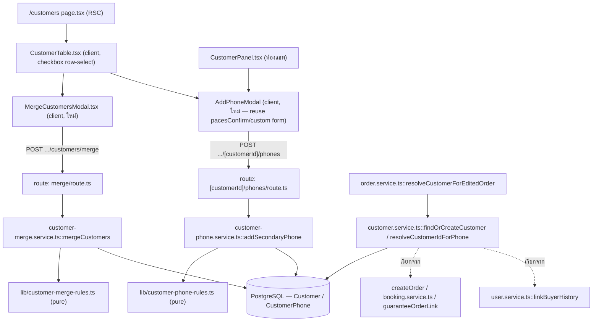
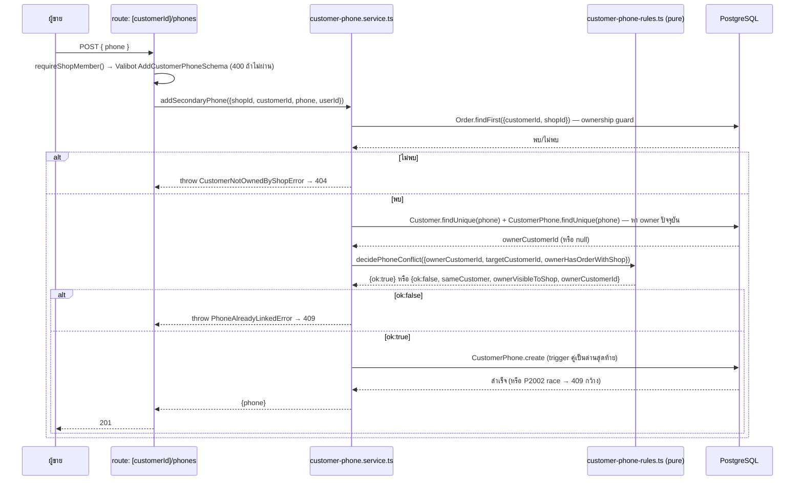
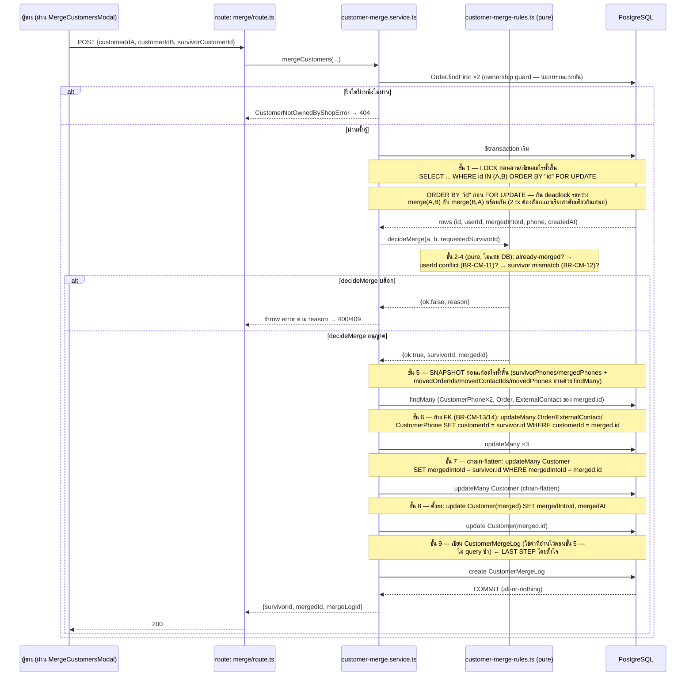

> **โมดูล:** M00042-CustomerMultiPhoneMerge
> **ประเภทเอกสาร:** System Design Spec (SDS)
> **เวอร์ชัน:** 1.0
> **วันที่จัดทำ:** 2026-08-10
> **สถานะ:** Draft — [[SRS]] ผ่านแล้ว (TFR-001..010 ครบ), [[DATABASE]] schema ล็อกแล้ว
> **เจ้าของเอกสาร:** SA (ดู [[Feature-Docs-Ownership]])

# SDS: ลูกค้าหลายเบอร์และการรวมลูกค้า (Customer Multi-Phone & Merge — System Design Spec)

---

## 1. บทนำ & References

### 1.1 วัตถุประสงค์

เอกสารนี้ **ไม่เล่าซ้ำ** [[SRS]] (ซึ่งมีอัลกอริทึม `resolveCustomerIdForPhone`/`findOrCreateCustomer` v2/`mergeCustomers`
เต็มรูปแบบอยู่แล้วที่ TFR-001/002/006) แต่ตอบคำถามเชิงออกแบบระบบที่ SRS ยังไม่ปิด: (1) ลำดับขั้นของ merge
transaction พร้อมพิสูจน์ความถูกต้องของแต่ละลำดับ (2) การแยก decision-logic ออกเป็น pure function ที่เทสได้จริง
(ไม่ใช่ฝังอยู่ใน async DB code) (3) การ reuse UI component ที่มีอยู่จริงในโปรเจกต์ (verified จากโค้ด ไม่ใช่เดา)
(4) ลำดับการ deploy ที่ปลอดภัยเมื่อ schema ใหม่ต้องขึ้นก่อนโค้ดที่ใช้มัน

ผู้อ่านหลัก: `safepay-developer` (implement ตาม component design), `safepay-ux` (ต้องอ่านหัวข้อ 5 ก่อนออกแบบ
modal เปรียบเทียบ — SDS นี้กำหนดแค่ data contract ไม่ออกแบบ layout เอง ตาม Hard Rule 8), `safepay-qa` (หัวข้อ 6
ระบุ pure function ที่ต้องมีเทส `[blocker]`)

### 1.2 ขอบเขตการออกแบบ

**อยู่ในขอบเขต:** component ใหม่/แก้ไขทั้งหมดที่ [[SRS]] §1.2/§2.2 ระบุ (service layer, 3 จุด critical ที่มีอยู่แล้ว,
API 2 endpoint, UI). **เพิ่มจาก SRS:** 2 ไฟล์ pure-function ใหม่ (`src/lib/customer-merge-rules.ts`,
`src/lib/customer-phone-rules.ts`) ที่แยก decision-logic ออกจาก transaction code — เหตุผลใน §6 TD-001

**นอกขอบเขต:** เหมือน [[SRS]] §1.2 ทุกประการ — ไม่ทำซ้ำที่นี่

### 1.3 เอกสารอ้างอิง

| เอกสาร | ความสัมพันธ์ |
|--------|-------------|
| [[SRS]] ของโมดูลนี้ | ที่มาของ TFR-001..010 ทั้งหมด — SDS นี้ realize เป็น component design + ตอบคำถามที่ SRS เปิดไว้ |
| [[DATABASE]] ของโมดูลนี้ | schema ล็อกแล้ว (`CustomerPhone`, `CustomerMergeLog`, `Customer.mergedIntoId/mergedAt`, trigger 2 ตัว) — SDS ไม่ออกแบบ schema ใหม่ |
| [[BRD]] ของโมดูลนี้ | FR-CM-001..008 — 🛑 **§1.3/§2.2/§6.4/§7.1/§8.5 (BR-CM-41) ยังไม่ sync กับมติ OD-8 รอบสอง** (ยังเขียนว่าจำกัด OWNER/ADMIN หรือ "รอเคาะ") SDS นี้ยึด [[PRD]] §4.3 OD-8 (b) ที่ล็อกแล้ว = **ไม่มี authorization check ใหม่** — ต้องแจ้ง Controller ให้ sync BRD แยกต่างหาก |
| [[PRD]] ของโมดูลนี้ | Open Decisions §4.3 (เคาะครบ 8/8, รวม OD-8 รอบสอง) |

---

## 2. Architecture Overview

### 2.1 มุมมองสถาปัตยกรรม

Monolith เดิม (ไม่มี component ใหม่ระดับ infra) — service layer เพิ่ม 2 ไฟล์ + pure-function เพิ่ม 2 ไฟล์
บน Next.js 16 App Router (API Route Handlers) + PostgreSQL เดียวกับทั้งระบบผ่าน Prisma Client เดิม
ไม่มี queue/background job (merge synchronous จบใน 1 HTTP request ตาม [[SRS]] §2.3)



### 2.2 มุมมองการ Deploy

ไม่มี runtime topology ใหม่ — deploy เดียวกับทั้งระบบ (Vercel, `vercel.json` รัน `prisma migrate deploy &&
prisma generate && next build` อัตโนมัติทุกครั้งที่ push `main`, ดู Hard Rule 15). ลำดับ rollout ที่ปลอดภัย
อยู่ที่ §6 TD-005 (ไม่ใช่เรื่อง infra แต่เป็นเรื่องลำดับ PR/commit)

---

## 3. Component Design

| Component | หน้าที่ (Responsibility) | Dependency (Submodule / Stack / Store) |
|-----------|--------------------------|-----------------------------------------|
| `src/lib/customer-merge-rules.ts` (**ใหม่**) | pure decision function `decideMerge()` — ตัดสิน block/allow + survivor ตาม BR-CM-11/12 **ไม่แตะ DB เลย** | `src/lib/`, TypeScript ล้วน ไม่ import Prisma |
| `src/lib/customer-phone-rules.ts` (**ใหม่**) | pure decision function `decidePhoneConflict()` — ตัดสิน reject/allow + privacy gate ของ error message ตาม BR-CM-03 | `src/lib/`, TypeScript ล้วน |
| `src/services/customer-phone.service.ts` (**ใหม่**) | I/O layer: ownership guard → lock/read → เรียก `decidePhoneConflict` → เขียน `CustomerPhone` | `src/services/`, Prisma |
| `src/services/customer-merge.service.ts` (**ใหม่**) | I/O layer: ownership guard → `FOR UPDATE` lock → เรียก `decideMerge` → snapshot → ย้าย FK → chain-flatten → เขียน log | `src/services/`, Prisma `$queryRaw` (locking) |
| `src/services/customer.service.ts::findOrCreateCustomer`/`resolveCustomerIdForPhone` (**แก้/ใหม่**) | dedupe จากเบอร์ (หลัก+รอง) + resolve `mergedIntoId` — ตาม [[SRS]] TFR-001/002 | `src/services/` |
| `src/services/order.service.ts::resolveCustomerForEditedOrder` (**แก้**) | ปิด cross-feature gap กับ `customer-phone-edit.ts` — TFR-007 | `src/services/` |
| `src/services/user.service.ts::linkBuyerHistory` (**แก้**) | resolve `customerId` แทน string-match เดี่ยว — TFR-009 | `src/services/` |
| `src/app/api/shops/current/customers/[customerId]/phones/route.ts` (**ใหม่**) | HTTP boundary: `requireShopMember()` (ไม่ใช่ `requireLodgingShop`/`requireGeneralShop` — endpoint นี้ใช้ได้ทุก vertical) + Valibot + error-mapping | `src/app/api/`, guard จาก `@/lib/shop-api-guard` |
| `src/app/api/shops/current/customers/merge/route.ts` (**ใหม่**) | เหมือนแถวบน สำหรับ merge | `src/app/api/` |
| `src/app/api/shops/current/customers/lookup/route.ts` (**แก้**) | resolve `mergedIntoId` ก่อนเรียก `getCancellationSummary` — TFR-008 (endpoint นี้คงใช้ `requireLodgingShop` เดิม ไม่เปลี่ยน guard) | `src/app/api/` |
| `.../customers/components/data.ts` (**แก้**) | ขยาย `CustomerRow` type — TFR-005 | client |
| `.../customers/components/CustomerTable.tsx` (**แก้**) | checkbox row-select (**max 2**) + bulk bar + เปิด `MergeCustomersModal` — Base: pattern จาก `OrdersTable.tsx`/`BulkActionBar.tsx` (verified มีอยู่จริง ดู §5) | client |
| `.../customers/components/MergeCustomersModal.tsx` (**ใหม่**) | หน้าจอเปรียบเทียบ+ยืนยัน (TFR-005) — **ต้องผ่าน `safepay-ux` gate ก่อน implement (Hard Rule 8)** | client, `useLockBodyScroll` |
| `.../customers/components/AddPhoneModal.tsx` (**ใหม่**, ใช้ร่วม 2 surface) | ฟอร์มเพิ่มเบอร์ — เรียกจากทั้ง `/customers` และ `CustomerPanel.tsx` | client |
| `CustomerPanel.tsx` (**แก้เล็กน้อย**) | เพิ่มปุ่ม "เพิ่มเบอร์" + แสดง `secondaryPhonesMasked` | client (ห้องแชท) |
| `src/lib/validations.ts` (**แก้**) | เพิ่ม `AddCustomerPhoneSchema`/`MergeCustomersSchema` | `src/lib/` |

---

## 4. Data Flow

### 4.1 Flow หลัก: เพิ่มเบอร์รอง (FR-CM-001)



### 4.2 Flow รวมลูกค้า (FR-CM-005/006/007) — ลำดับขั้นตอนเต็มพร้อมเหตุผล

**คำถามที่ต้องตอบ: "lock อะไรก่อน · ย้าย FK ตอนไหน · เขียน `CustomerMergeLog` ตอนไหน (snapshot ยังถูกไหม) ·
ตั้ง `mergedIntoId` ตอนไหน · chain-flatten ทำที่จุดไหน"** — ลำดับจริงตาม [[SRS]] TFR-006 (โค้ดอ้างอิงเดียวกัน)
พร้อมคำอธิบายว่าทำไมต้องเรียงแบบนี้:



**คำตอบตรงคำถาม (ทวนให้ชัดเป็นข้อ ๆ เพราะเป็นจุดที่เอกสารต้องพิสูจน์ได้ ไม่ใช่แค่บรรยาย):**

1. **lock อะไรก่อน** — ล็อกแถว `Customer` ทั้งสองด้วย `FOR UPDATE` เป็นสเต็ปแรกสุด ก่อนอ่านอะไรอื่นเลย (ไม่ล็อก
   `CustomerPhone`/`Order`/`ExternalContact` โดยตรง — ดูข้อ "ทำไมไม่ต้องล็อกตารางลูก" ด้านล่าง)
2. **ย้าย FK ตอนไหน** — หลัง `decideMerge` อนุญาตแล้วเท่านั้น (ขั้น 6) — เป็น `updateMany` 3 คำสั่งใน
   transaction เดียว ไม่มีจุดใดที่ FK ย้ายไปครึ่งเดียว (all-or-nothing โดยธรรมชาติของ `$transaction`)
3. **เขียน `CustomerMergeLog` ตอนไหน — snapshot ยังถูกไหม** — เขียน**หลังสุด** (ขั้น 9, หลังทุกการย้ายและ
   ตั้งธงเสร็จแล้ว) **แต่ข้อมูลที่เขียนลง log ถูก *อ่าน* ไว้ตั้งแต่ขั้น 5** (ก่อนมี `UPDATE` ใด ๆ เกิดขึ้นเลย)
   — ดังนั้น snapshot/movedIds ที่บันทึกคือค่า ณ "ก่อนรวม" จริง ไม่ใช่ค่าหลังรวม แม้ statement `INSERT` จะรันทีหลัง
   ก็ตาม เพราะสิ่งที่กำหนดความถูกต้องของข้อมูลคือ**ลำดับการอ่าน** ไม่ใช่ลำดับการเขียนลง log — และเพราะทุกอย่าง
   อยู่ใน transaction เดียวกัน ไม่มี connection อื่นมองเห็นสถานะกลางทางได้เลย (Postgres READ COMMITTED
   ยังคง isolate การเปลี่ยนแปลงที่ยังไม่ commit จาก connection อื่น) ถ้า transaction ล้มระหว่างขั้น 6-9
   ทั้งก้อน rollback รวมถึง log ที่ยังไม่ถูกสร้างด้วย — สอดคล้องกับ "audit log มีเฉพาะการรวมที่**สำเร็จ**"
4. **ตั้ง `mergedIntoId` ตอนไหน** — ขั้น 8 (หลังย้าย FK และ chain-flatten แล้ว, ก่อนเขียน log) เหตุผลที่ต้อง
   *หลัง* ขั้น 6-7: ขั้น 6 ใช้ `merged.id` เป็นเงื่อนไข `WHERE customerId = merged.id` — ถ้าตั้ง `mergedIntoId`
   ก่อน ไม่กระทบ query นี้เลย (คนละคอลัมน์) แต่การเรียงแบบ "ย้ายข้อมูลจริงก่อน แล้วค่อยติดป้ายว่าถูกรวมแล้ว"
   สื่อเจตนาได้ตรงกว่า (ป้ายควรสะท้อนความจริงหลังงานเสร็จ ไม่ใช่ก่อน) — ไม่ใช่ requirement เชิง correctness
   (ลำดับภายใน tx เดียวกันไม่กระทบผลลัพธ์สุดท้าย) แต่เป็น convention การอ่านโค้ดที่ชัดเจนกว่า
5. **chain-flatten ทำที่จุดไหน** — ขั้น 7 (ระหว่างย้าย FK กับตั้งธง) — `UPDATE Customer SET mergedIntoId =
   survivor.id WHERE mergedIntoId = merged.id` จับทุกแถวที่เคยเป็น "แถวที่ถูกรวม" ของ `merged` (กรณี `merged`
   เคยเป็น survivor ของการรวมเก่ามาก่อน) ให้ชี้ไป `survivor.id` โดยตรงในทรานแซกชันเดียวกัน — รับประกัน
   `mergedIntoId` เดินไม่เกิน 1 hop เสมอ (invariant ที่ [[DATABASE]] §3.1 กำหนด)

**ทำไมไม่ต้องล็อกตารางลูก (`CustomerPhone`/`Order`/`ExternalContact`) ด้วย `FOR UPDATE` แยก:**
`updateMany` ของ Postgres ยึด row-level lock แบบเดียวกับ `FOR UPDATE` โดยอัตโนมัติกับทุกแถวที่มันแก้ — ถ้ามี
transaction อื่น (เช่น `findOrCreateCustomer` ที่ถือ `FOR SHARE` บน `CustomerPhone.phone` ระหว่างสร้างออเดอร์)
กำลังอ่านแถวเดียวกันอยู่ `updateMany` ของ merge จะ**บล็อกรอ**จนกว่า transaction นั้น commit ก่อน — ไม่ต้องล็อก
เพิ่มเอง เพราะ `FOR SHARE`/`UPDATE`/implicit row lock ทำงานร่วมกันถูกต้องตามกลไก Postgres มาตรฐาน

**ความเสี่ยงที่ยังไม่มีใน [[SRS]] (เพิ่มที่นี่):** Prisma `$transaction` interactive มี timeout ค่าเริ่มต้น
5000ms (`maxWait` 2000ms) — ถ้า `FOR UPDATE` ของ merge ต้องรอ transaction สร้างออเดอร์ที่ถือ `FOR SHARE`
ค้างนานผิดปกติ (แทบไม่เกิดในทางปฏิบัติ — order creation ปกติจบใน <100ms) จะได้ `P2028` (Prisma transaction
API error) ซึ่งไม่ใช่ error class ที่ [[SRS]] §4.5 enumerate ไว้ — **ตกไปที่ catch-all ท้าย route (500)**
ตามที่ตารางกำหนดไว้แล้วสำหรับ error ที่ไม่รู้จัก จึงไม่ต้องเพิ่ม error class ใหม่ (ความน่าจะเป็นต่ำเกินกว่าจะ
คุ้มค่าความซับซ้อนเพิ่ม) — บันทึกเป็น known risk ใน §7

### 4.3 Flow กรณีล้มเหลว / ชดเชย

ไม่มี compensating action แบบ async — ทุก failure path คือ `throw` ภายใน `$transaction` callback ซึ่ง Prisma
rollback ให้อัตโนมัติ (all-or-nothing ตาม BR-CM-13) ไม่มีสถานะค้างกลางทางที่ต้องเขียนโค้ด cleanup แยก

---

## 5. Integration Points

| จุดเชื่อม | ประเภท | Contract | ความเสี่ยงเมื่อ "ล่ม" (คือ throw/error) |
|-----------|--------|----------|------------------------------------------|
| `createOrder` / `booking.service.ts` / `guaranteeOrderLink` → `findOrCreateCustomer` | internal | function call ใน `$transaction` เดียวกับการสร้างออเดอร์ | ถ้า `findOrCreateCustomer` throw (P2002 ที่ resolve ซ้ำไม่เจอ) ทั้ง order creation ล้มด้วย (ยอมรับได้ — พฤติกรรมเดิมตั้งแต่ feature 00014) |
| `linkBuyerHistory` → `resolveCustomerIdForPhone` | internal | function call, best-effort (ไม่ throw ไปบล็อก signup) | คืน `null` → ถอยไป string-match เดิม (TFR-009 ระบุไว้แล้ว) |
| `resolveCustomerForEditedOrder` → `resolveCustomerIdForPhone` | internal | function call | ไม่มี error ใหม่ (TFR-007) |
| **UI reuse — checkbox row-select** | internal (ไม่ใช่จุดเชื่อมข้าม service แต่เป็น UI pattern reuse ที่ verified) | `OrdersTable.tsx` มี column `id:'select'` ด้วย `table.getIsAllRowsSelected()`/`row.getToggleSelectedHandler()` + class `form-checkbox form-checkbox-light size-4.5`; `BulkActionBar.tsx` (component แยก) โผล่เมื่อ `table.getSelectedRowModel().rows.length > 0` | ต้อง**จำกัดที่ 2 แถว** ต่างจาก orders ที่เลือกได้ไม่จำกัด — CustomerTable ต้อง disable checkbox แถวอื่นเมื่อเลือกครบ 2 แล้ว (logic ใหม่ ไม่มีใน OrdersTable ให้ copy ตรง ๆ) |
| **UI reuse — compare state machine** | internal | `PriceCompareSheet.tsx` (00022-ext) มี state union `idle/loading/data/incomplete/error` + `onPick(value)` callback — โครงสร้าง state คล้ายกับที่ `MergeCustomersModal` ต้องมี (`idle→confirm-blocked-by-userid / confirm-need-survivor-pick / ready-to-submit`) — **reuse แนวคิด state machine เท่านั้น ไม่ reuse JSX/layout** (คนละบริบท: อันนั้นเป็น view-swap ในโมดัลเดิม อันนี้เป็น standalone modal ใหม่) |

**ยืนยันแล้ว (grep):** ไม่มี component "เปรียบเทียบ 2 แถวข้อมูลลูกค้า/entity" อยู่ในโปรเจกต์นี้มาก่อน —
`MergeCustomersModal.tsx` ต้องออกแบบใหม่ทั้งหมดผ่าน `safepay-ux` (Hard Rule 8) โดยยึด Paces primitive
(`.modal`/`.card`) ตาม `docs/system/ui-guideline/paces-component-reference.md` — SDS นี้กำหนดแค่ **data ที่ modal
ต้องรับ** (มาจาก `CustomerRow` ที่ TFR-005 ขยายแล้ว: `displayName`, `secondaryPhonesMasked`, `totalOrders`,
`totalSpent`, `customerSinceISO`, `hasLinkedAccount`) ไม่ล็อก layout

---

## 6. Technical Decisions

### TD-001: แยก decision-logic ของ merge/add-phone ออกเป็น pure function

- **ตัดสินใจ:** สร้าง `src/lib/customer-merge-rules.ts::decideMerge()` และ `src/lib/customer-phone-rules.ts::decidePhoneConflict()`
  เป็นฟังก์ชันบริสุทธิ์ (รับ input ที่เป็น plain object, ไม่ import Prisma, ไม่ throw — คืน discriminated union)
  แล้วให้ `customer-merge.service.ts`/`customer-phone.service.ts` เรียกฟังก์ชันเหล่านี้แทนการฝัง `if`
  หลายชั้นไว้ในตัว `$transaction` callback ตรง ๆ ตามที่ [[SRS]] TFR-003/006 ร่างไว้
- **เหตุผล:** [[SRS]] TFR-006 ข้อ 2-4 มีเงื่อนไข boolean ที่ตัดสินผลลัพธ์ถาวร/ย้อนกลับไม่ได้ (BR-CM-11/12) —
  ถ้าเขียนกลับด้าน (เช่น `!==` เป็น `===`, สลับ `a`/`b`) จะไม่มี `tsc`/build/grep ตัวไหนจับได้เลยเพราะ
  ยังเป็น boolean expression ที่ valid ตามชนิดทุกประการ (คลาสเดียวกับที่ `docs/conventions/ui-boolean-needs-a-testable-home.md`
  เตือนไว้ — แม้เอกสารนั้นพูดถึง UI boolean แต่หลักการเดียวกันใช้ได้กับ decision-logic ฝั่ง service ที่ผลของ
  การเขียนผิดคือ "รวมบัญชีสมาชิก 2 คนที่ไม่ควรรวมกันสำเร็จ" ซึ่งกู้คืนไม่ได้ตาม OD-2) การฝัง logic ไว้ใน
  async function ที่ต้อง mock Prisma/`$transaction` ทั้งชุดถึงจะเทสได้ ทำให้ทีมมักข้ามการเทส branch พวกนี้ไป
  แยกเป็น pure function ทำให้เทสได้โดยไม่ต้องแตะ DB เลย และพิสูจน์ด้วย **mutation testing** ได้ตรงไปตรงมา
  (สลับเงื่อนไขแล้วต้องแดง)
- **ทางเลือกที่ตัดทิ้ง:** เขียน branch ไว้ใน service function ตรง ๆ ตามที่ [[SRS]] ร่างโค้ดตัวอย่างไว้ — ตัดทิ้ง
  เพราะแม้โค้ดตัวอย่างของ SRS จะถูกต้อง แต่รูปแบบนั้นบังคับให้เทสทุกเคสต้องผ่าน mock ของ `tx.$queryRaw`
  (locking) ร่วมด้วย ซึ่งเพิ่มโอกาส false-negative (เทสอาจเขียวเพราะ mock ผิด ไม่ใช่เพราะ logic ถูก)
- **ผลกระทบ:** `safepay-qa`/`safepay-developer` ต้องเขียนเทส `[blocker]` ให้ `decideMerge`/`decidePhoneConflict`
  ครบทุก branch พร้อม mutation-proof (คืนค่าผิดด้านแล้วต้องแดง) — ไม่กระทบ HTTP contract ใน [[API]] เลย
  (เป็น internal refactor ของ implementation, response shape เหมือนเดิมทุกประการ)

```ts
// src/lib/customer-merge-rules.ts (โครงสร้างที่ service ต้องเรียก)
export type MergeParticipant = { id: string; userId: string | null; mergedIntoId: string | null }
export type MergeDecision =
  | { ok: true; survivorId: string; mergedId: string }
  | { ok: false; reason: 'SAME_ROW' | 'ALREADY_MERGED' | 'USERID_CONFLICT' | 'SURVIVOR_MISMATCH' }

export function decideMerge(
  a: MergeParticipant,
  b: MergeParticipant,
  requestedSurvivorId: string,
): MergeDecision {
  if (a.id === b.id) return { ok: false, reason: 'SAME_ROW' }
  if (a.mergedIntoId || b.mergedIntoId) return { ok: false, reason: 'ALREADY_MERGED' }
  if (a.userId != null && b.userId != null && a.userId !== b.userId) {
    return { ok: false, reason: 'USERID_CONFLICT' }
  }
  const forcedSurvivorId = a.userId != null ? a.id : b.userId != null ? b.id : null
  if (forcedSurvivorId && forcedSurvivorId !== requestedSurvivorId) {
    return { ok: false, reason: 'SURVIVOR_MISMATCH' }
  }
  if (requestedSurvivorId !== a.id && requestedSurvivorId !== b.id) {
    return { ok: false, reason: 'SURVIVOR_MISMATCH' }
  }
  const survivor = requestedSurvivorId === a.id ? a : b
  const merged = requestedSurvivorId === a.id ? b : a
  return { ok: true, survivorId: survivor.id, mergedId: merged.id }
}
```

```ts
// src/lib/customer-phone-rules.ts
export function decidePhoneConflict(input: {
  ownerCustomerId: string | null
  targetCustomerId: string
  ownerHasOrderWithShop: boolean
}): { ok: true } | { ok: false; sameCustomer: boolean; ownerVisibleToShop: boolean; ownerCustomerId: string | null } {
  if (!input.ownerCustomerId) return { ok: true }
  const sameCustomer = input.ownerCustomerId === input.targetCustomerId
  const visibleToShop = sameCustomer || input.ownerHasOrderWithShop
  return {
    ok: false,
    sameCustomer,
    ownerVisibleToShop: visibleToShop,
    ownerCustomerId: visibleToShop ? input.ownerCustomerId : null,
  }
}
```

### TD-002: `ORDER BY "id"` ก่อน `FOR UPDATE` ใน merge lock (ปรับเพิ่มจาก SRS TFR-006)

- **ตัดสินใจ:** SQL ที่ SRS ร่างไว้ (`SELECT ... WHERE id IN (A,B) FOR UPDATE`) ต้องเพิ่ม `ORDER BY "id" ASC`
  ก่อน `FOR UPDATE` — `SELECT ... WHERE "id" IN (${a}, ${b}) ORDER BY "id" FOR UPDATE`
- **เหตุผล:** ป้องกัน deadlock แบบ ABBA — ถ้าผู้ขาย 2 คนกด merge พร้อมกันด้วยคู่แถวเดียวกันแต่ order ต่างกัน
  (คนหนึ่งส่ง `{A,B}` อีกคนส่ง `{B,A}` เพราะ UI เลือกแถวคนละลำดับ) การล็อกที่ไม่รับประกันลำดับจะเสี่ยง
  deadlock ตามทฤษฎี (แม้ในทางปฏิบัติ Postgres มักสแกนตาม physical/index order อยู่แล้วซึ่งบังเอิญสอดคล้อง
  กันในกรณีส่วนใหญ่ — แต่ "บังเอิญสอดคล้อง" ไม่ใช่ guarantee) `ORDER BY` ทำให้ทั้งสอง transaction ล็อกแถว
  ตามลำดับ id เดียวกันเสมอไม่ว่า client จะส่งคู่มาลำดับไหน — ตัดโอกาส deadlock ทิ้งไปเลยแทนที่จะพึ่งพฤติกรรม
  โดยบังเอิญของ query planner
- **ทางเลือกที่ตัดทิ้ง:** ปล่อยตามที่ SRS ร่างไว้ (ไม่มี `ORDER BY`) — ตัดทิ้งเพราะต้นทุนของการเพิ่ม `ORDER BY`
  คือศูนย์ (SQL เดิมมี column เดียวให้ sort อยู่แล้ว) แต่ความเสี่ยง deadlock ที่ตัดได้มีค่ามากกว่า โดยเฉพาะ
  เมื่อ deadlock (Postgres error 40P01) ไม่ได้อยู่ใน error-mapping table ของ [[SRS]] §4.5 เลย — จะตกไป 500
  ที่ผู้ใช้ไม่รู้ว่าเกิดจากอะไร
- **ผลกระทบ:** เปลี่ยน 1 บรรทัด SQL ใน `customer-merge.service.ts` เทียบกับที่ SRS ร่างไว้ — ไม่กระทบ contract อื่น

### TD-003: UI reuse — checkbox row-select (max 2) + bulk bar

- **ตัดสินใจ:** `CustomerTable.tsx` เพิ่ม column `id:'select'` แบบเดียวกับ `OrdersTable.tsx` (verified:
  `table.getIsAllRowsSelected()`/`row.getToggleSelectedHandler()`, class `form-checkbox form-checkbox-light
  size-4.5`) **แต่ต้องเพิ่มเงื่อนไขที่ OrdersTable ไม่มี**: เมื่อ `table.getSelectedRowModel().rows.length >= 2`
  ต้อง disable checkbox ของแถวที่ยังไม่ถูกเลือก (`onChange` ไม่ทำงาน + `disabled` prop) — ป้องกันเลือกเกิน 2
  ตั้งแต่ระดับ UI (server ยัง validate `customerIdA !== customerIdB` ซ้ำเสมอตาม `decideMerge`) และ**ไม่แสดง
  checkbox "เลือกทั้งหมด" ที่หัวตาราง** (ต่างจาก OrdersTable ที่มี `getToggleAllRowsSelectedHandler()` — merge
  ไม่มีความหมายกับ "ทั้งหมด")
  - checkbox ต้อง disabled ด้วยถ้า `row.original.customerId == null` (ตาม TFR-005 ข้อ 1 — แถวที่ยังไม่มี
    `Customer` กลาง merge ไม่ได้)
  - แทน `BulkActionBar.tsx` เต็มรูป (ซึ่งออกแบบมาสำหรับ action หลายแบบของ orders) ด้วยแถบเรียบง่ายกว่า:
    "เลือกแล้ว N/2 ราย" + ปุ่ม "รวมลูกค้า" (active เมื่อ `N === 2` เท่านั้น) — **รายละเอียด markup ให้ ux ออกแบบ**
    ตาม Paces primitive จริง ไม่ก็อป `BulkActionBar.tsx` ทั้งไฟล์ (ฟังก์ชันของมันผูกกับ iShip bulk-create
    ที่ไม่เกี่ยวกับ merge)
- **เหตุผล:** เป็น pattern เดียวที่มีอยู่จริงในโปรเจกต์สำหรับ "เลือกหลายแถวในตาราง Paces" — verified ด้วยการ
  เปิดไฟล์จริง (`src/app/(paces)/seller/(dashboard)/orders/components/OrdersTable.tsx:260-276,898-914`,
  `BulkActionBar.tsx`) ไม่ใช่เดาจากชื่อไฟล์
- **ทางเลือกที่ตัดทิ้ง:** modal "เลือกลูกค้า" แบบ search-and-pick 2 ครั้ง (ไม่ใช้ checkbox ในตาราง) — ตัดทิ้ง
  เพราะ PRD OD-7 เคาะแล้วว่าใช้ modal บนหน้า `/customers` เดิม (ซึ่งมีตารางอยู่แล้ว) การเพิ่ม flow ค้นหาแยก
  เป็นงานคนละก้อนที่ PRD ไม่ได้ขอ
- **ผลกระทบ:** DEV ต้องดู `getSelectedRowModel()` behavior ของ TanStack table เมื่อ pagination เปลี่ยนหน้า —
  ต้อง**คง selection ข้ามหน้า** (ผู้ขายอาจเลือกแถวแรกในหน้า 1 แล้วเลือกแถวที่สองในหน้า 2) TanStack row
  selection state เป็น global ต่อ table instance อยู่แล้ว (ไม่ reset ตอนเปลี่ยน page) — ตรวจสอบว่า
  `OrdersTable.tsx` ใช้ pattern เดียวกันถูกหรือไม่ก่อน copy (ยืนยัน: `rowSelection` เป็น state แยกจาก
  `pagination` state — ปลอดภัย)

### TD-004: `AddPhoneModal.tsx` ใช้ร่วม 2 surface แทนแยกไฟล์ตาม page

- **ตัดสินใจ:** สร้าง component เดียว `AddPhoneModal.tsx` วางไว้ที่ `.../customers/components/` แล้ว import
  ไปใช้ทั้งจาก `CustomerTable.tsx` (ต่อแถว) และ `CustomerPanel.tsx` (ห้องแชท) แทนที่จะเขียนฟอร์มซ้ำ 2 ที่
- **เหตุผล:** ฟอร์มมีแค่ 1 ช่อง (`phone`) + validate เดียวกันทั้งสองที่ (TFR-003) — การแยกไฟล์จะพา validation/
  error-message drift (สอดคล้องกับ `docs/conventions/sibling-surface-parity.md` — ตัวเลข/ฟอร์มเดียวกันที่
  โผล่ >1 ที่ต้องมาจาก symbol เดียว)
- **ทางเลือกที่ตัดทิ้ง:** ใช้ `pacesConfirm` (Swal) แบบเดียวกับ `pacesConfirmWithReason` (มี precedent ใน
  `CustomerPanel.tsx` อยู่แล้วสำหรับกล่องยืนยันแบบมีตัวเลือก) — พิจารณาแล้วไม่เลือกเพราะฟอร์มนี้ต้อง handle
  409 (`PhoneAlreadyLinkedError`) ที่มีข้อมูลแตกสาขา (`sameCustomer`/`ownerVisibleToShop`) ซึ่งต้องแสดงผลต่าง
  กัน 3 แบบ (ผูกกับคนนี้แล้ว / ผูกกับคนอื่นที่ร้านนี้เห็น / ผูกกับคนอื่นที่ร้านนี้ไม่เห็น) — ซับซ้อนเกินกว่า
  ที่ Swal-based confirm จะแสดงได้เรียบร้อย ต้องเป็น controlled component ที่คุม state เอง
- **ผลกระทบ:** `MergeCustomersModal.tsx`/`AddPhoneModal.tsx` ทั้งคู่เป็น custom overlay (ไม่ใช่ Preline
  `HSOverlay`) → **ต้องเรียก `useLockBodyScroll(open)`** (`src/hooks/useLockBodyScroll.ts`) ตาม
  `docs/conventions/overlay-scroll-lock.md` — เป็นข้อบังคับของโปรเจกต์ที่พลาดมาแล้วหลายรอบ (2026-08-07)
  ต้องระบุไว้ชัดใน spec ที่ส่งให้ ux/dev

### TD-005: ลำดับ deploy — schema ก่อนโค้ดที่ใช้มันเสมอ (2 PR แยก)

- **ตัดสินใจ:** แยก implementation เป็น **2 รอบ push** ไม่ใช่ 1 commit เดียว:
  1. **รอบที่ 1 (`safepay-database` dispatch ก่อน):** apply migration `20260810120000_customer_multiphone_merge`
     เท่านั้น (ตาราง `CustomerPhone`/`CustomerMergeLog` + คอลัมน์ `Customer.mergedIntoId`/`mergedAt` + trigger
     2 ตัว) — **ไม่มีโค้ด service/API/UI ใหม่ในรอบนี้** เพราะ [[DATABASE]] §5.3 ยืนยันแล้วว่าเป็น additive
     ล้วน ไม่กระทบ backward-compat แม้แต่จุดเดียว จนกว่าจะมีโค้ดมาเรียกตาราง/คอลัมน์ใหม่
  2. **รอบที่ 2:** service layer (TFR-001..010) + API 2 endpoint + UI — commit นี้ `prisma generate` จะ
     เห็น `CustomerPhone`/`CustomerMergeLog` model ในสคีมาแล้ว (เพราะ migration ขึ้น prod ไปแล้วในรอบ 1
     ตาม build command `prisma migrate deploy && prisma generate && next build`)
- **เหตุผล:** แม้ในทางเทคนิค 1 commit เดียวก็ deploy ได้ปลอดภัย (migration รันก่อน build เสมอในทุก deploy
  ตาม Hard Rule 15 — ไม่มีหน้าต่างที่โค้ดใหม่รันกับ schema เก่า) แต่การแยก 2 รอบลด **blast radius ของ
  rollback**: ถ้ารอบ 2 (service/API/UI) มีบั๊กต้อง revert เฉพาะโค้ด — ตาราง/trigger ที่ apply ไปแล้วในรอบ 1
  ยังอยู่ครบไม่ต้องแตะ (สอดคล้องกับ [[DATABASE]] §5.2 "แผนจริงถ้าต้องถอย feature นี้หลัง deploย: revert
  เฉพาะโค้ดชั้นแอปพลิเคชัน คงตาราง/trigger ไว้ถาวร") — การแยกรอบทำให้ revert รอบ 2 เป็นการ revert โค้ดล้วน ๆ
  ไม่ต้องคิดเรื่อง data migration ปนมาด้วย
- **ทางเลือกที่ตัดทิ้ง:** commit เดียวทั้งหมด — ไม่ผิดหลักการ (migration ก่อน build เสมออยู่แล้ว) แต่เพิ่ม
  ความเสี่ยงตอน rollback โดยไม่จำเป็น
- **ผลกระทบ:** Controller ต้องแจ้ง user ครบ 3 ข้อของ Hard Rule 15 **ทั้ง 2 รอบ push** (ไม่ใช่แค่รอบแรก) —
  โดยเฉพาะ "ฐาน local ต้อง apply เอง" (`prisma migrate deploy` ปักหมุด localhost ตาม [[DATABASE]] §5.1)
  ก่อนเริ่มเขียน service layer ในรอบ 2 ไม่งั้น `tsc`/dev server จะไม่เห็น Prisma Client type ของตารางใหม่

---

## 7. ความเสี่ยงเชิงออกแบบเพิ่มเติม (นอกเหนือจาก [[SRS]] §8)

| ความเสี่ยง | ผลกระทบ | แนวทางลด |
|-----------|---------|----------|
| `P2028` (Prisma tx timeout) ถ้า `FOR UPDATE` รอนานผิดปกติ | ตกไป 500 generic แทน error ที่ระบุสาเหตุ | ยอมรับเป็น known risk (ความน่าจะเป็นต่ำมาก — merge ไม่ใช่ hot path, order creation tx ปกติจบเร็ว) ไม่เพิ่ม error class ใหม่ |
| deadlock ระหว่าง merge(A,B) กับ merge(B,A) พร้อมกัน | transaction หนึ่งถูก Postgres ยกเลิกเอง (40P01) → 500 | ปิดด้วย TD-002 (`ORDER BY "id"`) — ลดโอกาสเหลือใกล้ศูนย์ |
| TanStack row-selection state ไม่ reset เมื่อ filter/search เปลี่ยน (ถ้า `CustomerTable` เพิ่ม global filter ในอนาคต) | ผู้ขายอาจเห็นแถวที่เลือกไว้หายไปจากมุมมองปัจจุบันแต่ยัง "เลือกอยู่" ใน state | นอกขอบเขต MVP (ตารางปัจจุบันมี `globalFilter` อยู่แล้วจริง — ต้อง verify ตอน implement ว่า filter ที่ซ่อนแถวที่เลือกไว้ทำให้ UI สับสนไหม เช่น "เลือกแล้ว 2/2" แต่มองไม่เห็นว่าเลือกอะไร ux ต้องออกแบบ indicator) |

---

## 8. Traceability

| SRS Requirement (TFR/NFR) | SDS Element (component / decision / flow) | สถานะ |
|---------------------------|-------------------------------------------|-------|
| TFR-001 (`resolveCustomerIdForPhone`) | Component Design §3 แถว `customer.service.ts` | Draft |
| TFR-002 (`findOrCreateCustomer` v2) | Component Design §3 + Integration Points §5 | Draft |
| TFR-003 (`addSecondaryPhone`) | Component Design §3, Data Flow §4.1, TD-001 (`decidePhoneConflict`) | Draft |
| TFR-005 (หน้าจอเปรียบเทียบ) | TD-003, TD-004, §5 (data contract ของ modal) | Draft |
| TFR-006 (`mergeCustomers`) | Data Flow §4.2 (ลำดับขั้นเต็ม), TD-001 (`decideMerge`), TD-002 (lock ordering) | Draft |
| TFR-007 (`resolveCustomerForEditedOrder`) | Component Design §3 | Draft |
| TFR-008 (`customers/lookup`) | Component Design §3 (คง guard เดิม `requireLodgingShop`) | Draft |
| TFR-009 (`linkBuyerHistory`) | Component Design §3 | Draft |
| NFR "Maintainability" ([[SRS]] §6) | TD-001 | Draft |
| [[DATABASE]] §5 Migration Plan | TD-005 (ลำดับ deploy) | Draft |

---

## 9. สรุป (Summary)

เอกสาร SDS นี้ **ไม่ทำซ้ำ** อัลกอริทึมที่ [[SRS]] เขียนไว้แล้ว (TFR-001..010) แต่เพิ่ม 3 อย่างที่ SRS ยังไม่ปิด:
(1) การพิสูจน์ทีละสเต็ปว่าลำดับ lock→decide→snapshot→move→flatten→flag→log ของ merge transaction ถูกต้อง
โดยเฉพาะจุดที่ snapshot ถูกเขียนหลังย้าย FK แต่ยังถูกต้อง (2) แยก decision-logic ที่ตัดสินผลย้อนกลับไม่ได้
ออกเป็น pure function ที่เทสด้วย mutation ได้จริง (3) ระบุ UI component ที่มีอยู่จริงให้ reuse (checkbox
row-select ของ `OrdersTable.tsx`) แทนการเดา/ให้ dev ไปหาเอง

**ลำดับการ build ที่แนะนำ:**
1. **`safepay-database`**: apply migration ตาม [[DATABASE]] §5.1 (รอบ push แยกตาม TD-005) — verify ด้วย
   `prisma migrate status` ที่ local ก่อนส่งต่อ
2. **`safepay-developer`**: `src/lib/customer-merge-rules.ts` + `customer-phone-rules.ts` (pure, เทสก่อน)
   → `customer.service.ts` (TFR-001/002) → `customer-phone.service.ts`/`customer-merge.service.ts` →
   `order.service.ts`/`user.service.ts` (TFR-007/009) → API routes 2 ตัว + `lookup/route.ts` (TFR-008)
   → Valibot schemas
3. **`safepay-ux`** (ขนานกับข้อ 2 ได้ แต่ block ก่อน implement UI จริง): design spec ของ `MergeCustomersModal.tsx`/
   `AddPhoneModal.tsx`/checkbox row-select บน `CustomerTable.tsx`
4. **`safepay-developer`**: UI ตาม spec ของ ux
5. sync `docs/SRS.md` ตาม [[SRS]] §11

**Open Questions (สืบทอดจาก [[SRS]]/[[DATABASE]], ยังไม่ปิด):**
- Trigger `customer_merge_userid_guard` เก็บไว้เป็น defense ชั้นสองหรือตัดออก ([[DATABASE]] Open Question #2)
- `BRD.md` ต้อง sync กับมติ OD-8 รอบสอง (§1.3/§2.2/§6.4/§7.1/§8.5) — ไม่ใช่ blocker ของ implementation
  (SRS/DATABASE/SDS นี้ยึด PRD ที่ล็อกแล้วถูกต้อง) แต่ทิ้งไว้จะทำให้คนอ่าน BRD ย้อนหลังเข้าใจผิด
