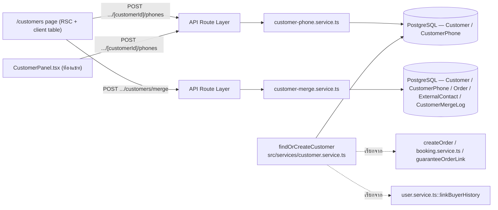
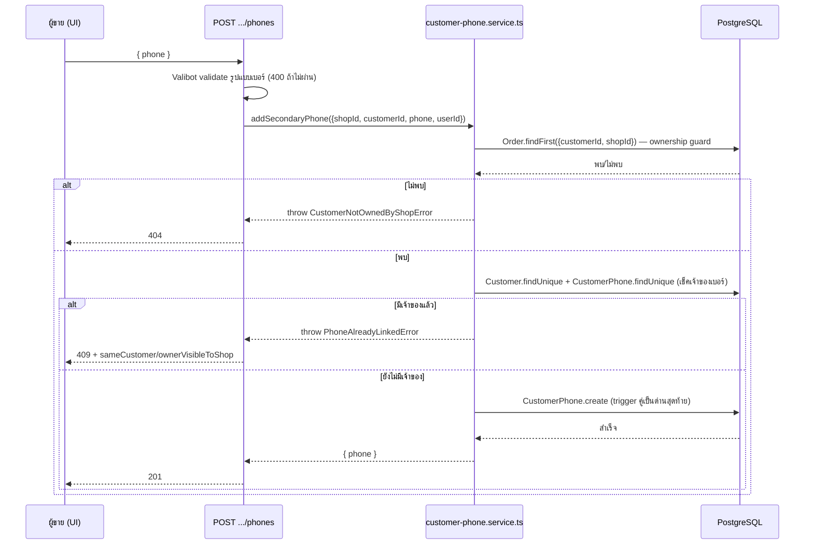
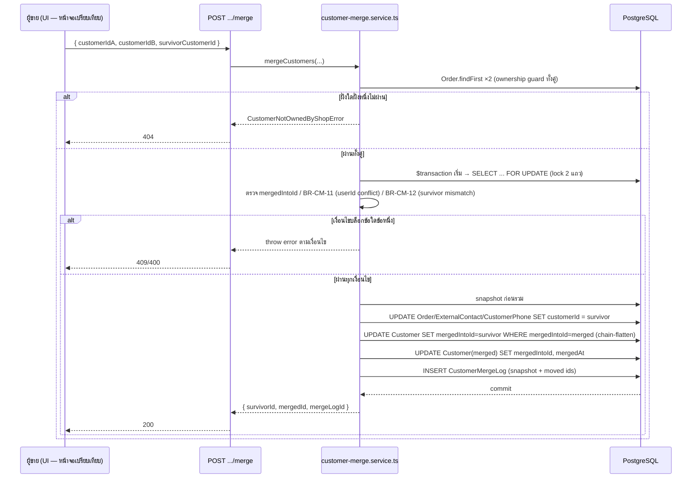
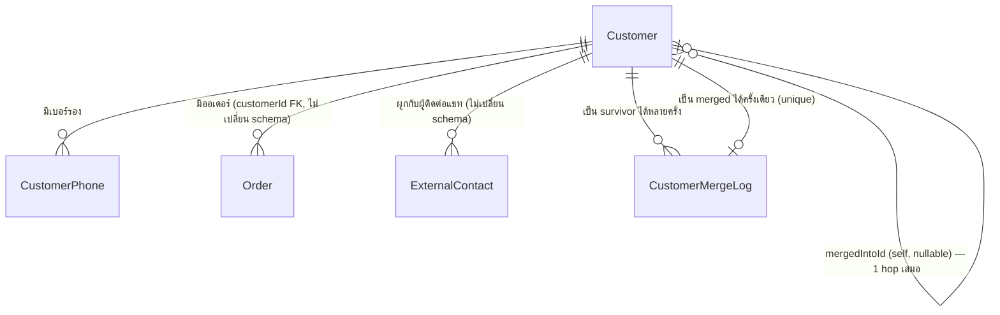

> **โมดูล:** M00042-CustomerMultiPhoneMerge
> **ประเภทเอกสาร:** Software Requirements Specification (SRS) - TECHNICAL
> **เวอร์ชัน:** 1.0
> **วันที่จัดทำ:** 2026-08-10
> **สถานะ:** Draft — PRD/BRD/DATABASE ผ่านแล้ว (Open Decisions §4.3 ของ PRD เคาะครบ 8/8 ข้อ 2026-08-10)
> **เจ้าของเอกสาร:** SA (ดู [[Feature-Docs-Ownership]])

# SRS: ลูกค้าหลายเบอร์และการรวมลูกค้า (Customer Multi-Phone & Merge — Software Requirements Specification)

---

## 1. บทนำ (Introduction)

### 1.1 วัตถุประสงค์ของเอกสาร

เอกสารนี้แปลความต้องการทางธุรกิจใน [[PRD]]/[[BRD]] ให้เป็นสเปกเชิงเทคนิคที่ `safepay-developer` นำไป implement ได้ทันที
โดยไม่ต้องเดา ครอบคลุม: (1) อัลกอริทึม resolve ตัวตนลูกค้าจากเบอร์ (dedupe ข้ามเบอร์หลัก/เบอร์รอง/แถวที่ถูกรวม)
(2) ธุรกรรมการรวมลูกค้าแบบ all-or-nothing พร้อม race-condition guard (3) API ใหม่ 2 endpoint (4) จุดที่ต้องแก้ไข
ในโค้ดที่มีอยู่แล้ว 3 จุด critical (5) การ sync กลับ `docs/SRS.md` (เอกสารระบบ) ตาม Hard Rule 11

ผู้อ่านหลัก: `safepay-developer` (implement), `safepay-qa` (เขียน test case จาก TFR/AC), `safepay-reviewer` (ตรวจ diff
เทียบกับ TFR) — ไม่ใช่ผู้อ่านสายธุรกิจ (ดู [[PRD]]/[[BRD]] แทน)

### 1.2 ขอบเขตเชิงระบบ (System Scope)

**อยู่ในขอบเขต:**
- Service layer ใหม่: `src/services/customer-phone.service.ts` (เพิ่มเบอร์รอง) และ `src/services/customer-merge.service.ts` (รวมลูกค้า)
- แก้ resolve algorithm ใน `src/services/customer.service.ts::findOrCreateCustomer` (dedupe ต้องเดินตามเบอร์รอง + `mergedIntoId`)
- แก้ 3 จุดที่มีอยู่แล้วซึ่งพังถ้าไม่แก้ (`resolveCustomerForEditedOrder`, `customers/lookup/route.ts`, `linkBuyerHistory`)
- API ใหม่: `POST /api/shops/current/customers/[customerId]/phones`, `POST /api/shops/current/customers/merge`
- UI: ปุ่ม "เพิ่มเบอร์" (หน้า `/customers` + `CustomerPanel.tsx`), การเลือก 2 แถว + หน้าจอเปรียบเทียบ + ยืนยันรวม (หน้า `/customers`)
- Data model: ดู [[DATABASE]] — **ล็อกแล้ว ห้ามออกแบบใหม่** เอกสารนี้อ้างอิงเฉยๆ

**นอกขอบเขต (ตาม PRD §5):** หน้า `/customers/[id]` เต็มรูป, auto-detect ลูกค้าซ้ำ, self-service unmerge, ขยาย `/o/{token}`
ให้รับได้ทุกเบอร์ในชุด, แก้ไข/ลบเบอร์รองที่ผูกไปแล้ว, cross-channel merge, role-based permission (ดู PRD OD-8)

### 1.3 เอกสารอ้างอิง (References)

| เอกสาร | ความสัมพันธ์ |
|--------|-------------|
| [[PRD]] ของโมดูลนี้ | เป้าหมายธุรกิจ, personas, Open Decisions §4.3 (เคาะครบ 8/8) |
| [[BRD]] ของโมดูลนี้ | FR-CM-001..008, BR-CM-01..41 — ทุก TFR ในเอกสารนี้ trace กลับมาที่นี่ |
| [[DATABASE]] ของโมดูลนี้ | schema ที่ล็อกแล้ว (`CustomerPhone`, `CustomerMergeLog`, `Customer.mergedIntoId/mergedAt`, trigger 2 ตัว) — **contract ที่เอกสารนี้ต้องเขียนโค้ดให้ตรง** |
| `docs/SRS.md` (เอกสารระบบ) | ต้อง sync หลัง implement (ดู §11 ของเอกสารนี้) — ปัจจุบัน**ไม่มี**รายการ `Customer` model เลยด้วยซ้ำ (หนี้เดิมก่อนฟีเจอร์นี้ — verified: grep `Customer` ใน `docs/SRS.md` §6.2 Models ไม่เจอ) |
| `src/services/customer.service.ts` | เจ้าของ `findOrCreateCustomer`/`getCancellationSummary`/`getCustomerSummary` เดิม (feature 00014/00017) — เอกสารนี้แก้ไฟล์นี้ |
| `src/lib/customer-phone-edit.ts` / `src/lib/thread-customer-link.ts` | กลไก "คีย์เบอร์ผิด" ที่ ship ไปแล้วก่อนหน้า (วันเดียวกัน 2026-08-10) — §7.1 อธิบายความสัมพันธ์ |

### 1.4 นิยามและตัวย่อ (Definitions & Acronyms)

| คำ/ตัวย่อ | ความหมาย |
|-----------|----------|
| **เบอร์หลัก** | `Customer.phone` — เบอร์แรกที่สร้างแถว `Customer` |
| **เบอร์รอง** | แถวใน `CustomerPhone` — เบอร์เพิ่มเติมที่ผูกภายหลัง |
| **survivor / แถวหลัก** | แถว `Customer` ที่เหลืออยู่หลังการรวม (`mergedIntoId IS NULL`) |
| **merged / แถวที่ถูกรวม** | แถว `Customer` ที่ถูกรวมไปแล้ว (`mergedIntoId IS NOT NULL`) — ยังมีอยู่จริงในฐาน (soft-pointer) |
| **resolve** | การแปล "เบอร์" หรือ "customerId ที่อาจเก่า/ถูกรวมไปแล้ว" ให้เป็น customerId ที่ใช้งานได้จริงปัจจุบัน (เดินตาม `mergedIntoId` ไม่เกิน 1 hop เสมอ ตาม chain-flatten invariant ใน DATABASE.md §3.1) |
| **chain-flatten** | ขั้นตอนใน merge transaction ที่ปรับทุกแถวซึ่ง `mergedIntoId` เคยชี้มาที่แถว "ที่กำลังจะถูกรวม" ให้ชี้ไปแถวหลักใหม่โดยตรง กัน `mergedIntoId` เป็น chain หลายชั้น |
| **FOR SHARE / FOR UPDATE** | Postgres locking clause — ใช้ปิด race condition ระหว่าง merge กับสร้างออเดอร์พร้อมกัน (ดู TFR-006) |

---

## 2. ภาพรวมสถาปัตยกรรม (Architecture Overview)

### 2.1 บริบทระบบ (System Context)



### 2.2 องค์ประกอบหลัก (Components)

| Component | หน้าที่ | Submodule / Stack |
|-----------|---------|-------------------|
| **`customer-phone.service.ts`** (ใหม่) | เพิ่มเบอร์รองให้ลูกค้าที่มีอยู่แล้ว + ตรวจกันชนกับ BR-CM-02/03 | `src/services/`, Prisma |
| **`customer-merge.service.ts`** (ใหม่) | ธุรกรรมรวมลูกค้า all-or-nothing: validate → lock → ย้าย FK → chain-flatten → เขียน `CustomerMergeLog` | `src/services/`, Prisma raw query (locking) |
| **`customer.service.ts::findOrCreateCustomer`** (แก้) | dedupe ลูกค้าตอนสร้างออเดอร์ — ต้องรู้จักเบอร์รอง + เดินตาม `mergedIntoId` | `src/services/` |
| **`customer.service.ts::resolveCustomerIdForPhone`** (ใหม่, helper) | ตรรกะ resolve กลาง — ใช้ร่วมโดย `findOrCreateCustomer`/`linkBuyerHistory`/routes อื่นในอนาคต | `src/services/` |
| **`order.service.ts::resolveCustomerForEditedOrder`** (แก้) | ต้องเช็ค `CustomerPhone.phone` ด้วย ไม่ใช่แค่ `Customer.phone` (gap ข้าม feature 00042↔วันนี้) | `src/services/` |
| **`user.service.ts::linkBuyerHistory`** (แก้) | เปลี่ยนจาก string-match เป็น resolve `customerId` แล้ว match `Order.customerId` | `src/services/` |
| **`api/shops/current/customers/lookup/route.ts`** (แก้) | resolve `mergedIntoId` ก่อนเรียก `getCancellationSummary` | `src/app/api/` |
| **`/customers` page.tsx** (แก้) | ขยาย query ให้มี `customerId`/`hasLinkedAccount`/`secondaryPhonesMasked`/`customerSinceISO` ต่อแถว | `src/app/(paces)/seller/(dashboard)/customers/` |
| **`CustomerTable.tsx`/`CustomerRow`** (แก้) | multi-select 2 แถวที่มี `customerId` + ปุ่ม "รวมลูกค้า" + ปุ่ม "เพิ่มเบอร์" ต่อแถว | client component |
| **`CustomerPanel.tsx`** (แก้เล็กน้อย) | เพิ่ม UI "เพิ่มเบอร์" + แสดงเบอร์รองใต้แถว "การเชื่อมกับลูกค้าในระบบ" | client component (ห้องแชท) |

### 2.3 มุมมองการ Deploy (Deployment View)

ไม่มี component ใหม่ระดับ infra — ทำงานบน Next.js 16 App Router (API routes + RSC) + PostgreSQL เดียวกับทั้งระบบ
ไม่มี background job/queue (merge เป็น synchronous transaction เดียวจบในคำขอ HTTP เดียว — merge ไม่ใช่ hot path
ตาม BRD §6.2 จึงไม่ต้องทำ async/queue)

---

## 3. ข้อกำหนดเชิงฟังก์ชันเชิงเทคนิค (Technical Functional Requirements)

### TFR-001: `resolveCustomerIdForPhone` — ตรรกะ resolve กลาง (ใหม่)

- **Trace to:** FR-CM-003 (BRD), BR-CM-05
- **ที่ตั้งไฟล์:** `src/services/customer.service.ts` (export ใหม่ ข้าง `findOrCreateCustomer`)
- **คำอธิบายเชิงเทคนิค:**

```ts
/** resolveCustomerIdForPhone — แปลเบอร์ (หลักหรือรอง) ให้เป็น customerId ที่ resolve แล้ว (ไม่เกิน 1 hop)
 *  - ไม่สร้างแถวใหม่ (อ่านอย่างเดียว) — ใช้ทั้งใน findOrCreateCustomer (ก่อนตัดสินใจสร้าง) และ linkBuyerHistory
 *  - รับได้ทั้ง PrismaClient ปกติ (read-only, นอกทรานแซกชัน) และ Prisma.TransactionClient
 */
async function resolveCustomerIdForPhone(
  client: Prisma.TransactionClient | PrismaClient,
  phone: string,
): Promise<string | null> {
  const c = await client.customer.findUnique({
    where: { phone },
    select: { id: true, mergedIntoId: true },
  });
  if (c) return c.mergedIntoId ?? c.id; // 1-hop resolve — chain-flatten invariant การันตีไม่เกิน 1 hop เสมอ

  const cp = await client.customerPhone.findUnique({
    where: { phone },
    select: { customerId: true },
  });
  // invariant: CustomerPhone.customerId ต้องชี้แถวที่ยังไม่ถูกรวมเสมอ (merge ต้องย้ายแถวนี้ไปด้วยทุกครั้ง — TFR-006 ข้อ 3)
  // จึงไม่ต้องเดินตาม mergedIntoId ซ้ำที่นี่
  return cp?.customerId ?? null;
}
```

- **Precondition:** `phone` ผ่าน `normalizePhone` มาแล้ว (caller รับผิดชอบ — ตรงกับ contract เดิมของ `findOrCreateCustomer`)
- **Postcondition:** คืน `customerId` ของแถวที่ **ยังไม่ถูกรวม** เสมอ (ไม่มีทางคืน id ของแถวที่ `mergedIntoId != null`) หรือ `null` ถ้าไม่เคยมีใครใช้เบอร์นี้เลย
- **Error / Edge cases:** ไม่ throw — read-only, ไม่มี side effect. ถ้าทั้ง `Customer` และ `CustomerPhone` ไม่เจอ → `null` (ผู้เรียกตัดสินใจเองว่าจะสร้างใหม่หรือไม่)

### TFR-002: `findOrCreateCustomer` v2 — dedupe ต้องรู้จักเบอร์รอง + แถวที่ถูกรวม

- **Trace to:** FR-CM-003, BR-CM-05 (BRD); DB-4 (DATABASE.md — soft-pointer)
- **ที่ตั้งไฟล์:** `src/services/customer.service.ts` (แก้ฟังก์ชันเดิม)
- **คำอธิบายเชิงเทคนิค:**

```ts
export async function findOrCreateCustomer(
  tx: Prisma.TransactionClient,
  phone: string,
): Promise<string> {
  // TFR-006 race guard: FOR SHARE lock กัน merge วิ่งแซงระหว่างอ่าน-เขียนในทรานแซกชันนี้
  // (ต้องใช้ $queryRaw เพราะ Prisma fluent API ไม่มี locking clause)
  const existingRows = await tx.$queryRaw<{ id: string; mergedIntoId: string | null }[]>`
    SELECT "id", "mergedIntoId" FROM "Customer" WHERE "phone" = ${phone} FOR SHARE
  `;
  const existing = existingRows[0];
  if (existing) return existing.mergedIntoId ?? existing.id;

  const cpRows = await tx.$queryRaw<{ customerId: string }[]>`
    SELECT "customerId" FROM "CustomerPhone" WHERE "phone" = ${phone} FOR SHARE
  `;
  if (cpRows[0]) return cpRows[0].customerId;

  try {
    const created = await tx.customer.create({ data: { phone }, select: { id: true } })
    return created.id
  } catch (e) {
    if (e instanceof Prisma.PrismaClientKnownRequestError && e.code === 'P2002') {
      // แข่งกับ insert อื่น (เดิมมีอยู่แล้ว) — re-find ด้วย logic เดียวกับข้างบน (เบอร์อาจกลายเป็นเบอร์รองไปแล้วก็ได้)
      const resolved = await resolveCustomerIdForPhone(tx, phone)
      if (resolved) return resolved
    }
    throw e
  }
}
```

- **Precondition:** เรียกใน `$transaction` เสมอ (คงพฤติกรรมเดิม — comment หัวไฟล์เดิมยืนยันไว้แล้ว)
- **Postcondition:** คืน `customerId` ที่ไม่มีทางเป็นแถวที่ถูกรวม — caller ทุกตัว (createOrder/booking.service.ts/guaranteeOrderLink) **ไม่ต้องแก้อะไรเพิ่ม** (auto-correct ตาม DATABASE.md §9)
- **Error / Edge cases:** P2002 race ตอน insert ใหม่ — เดิม re-find เฉพาะ `Customer.phone`; ตอนนี้ต้อง re-find ผ่าน `resolveCustomerIdForPhone` เพราะแถวที่ชนอาจเป็นเบอร์รองที่เพิ่งถูกเพิ่มพร้อมกันก็ได้ (แม้ความน่าจะเป็นต่ำมาก — ยึด fail-closed)

### TFR-003: เพิ่มเบอร์รอง (FR-CM-001)

- **Trace to:** FR-CM-001, BR-CM-01/02/03/04
- **ที่ตั้งไฟล์ใหม่:** `src/services/customer-phone.service.ts`
- **คำอธิบายเชิงเทคนิค:**

```ts
export class CustomerNotOwnedByShopError extends Error {}
export class PhoneAlreadyLinkedError extends Error {
  constructor(
    message: string,
    public readonly sameCustomer: boolean,
    public readonly ownerVisibleToShop: boolean,
    public readonly ownerCustomerId: string | null, // ส่งกลับเฉพาะเมื่อ ownerVisibleToShop=true (privacy)
  ) { super(message) }
}

export async function addSecondaryPhone(params: {
  shopId: string;
  customerId: string;
  phone: string; // normalize มาแล้ว (route ทำก่อนเรียก)
  createdByUserId: string;
}): Promise<{ phone: string }> {
  // 1) ownership/visibility guard — customerId ต้องมี Order กับร้านนี้อย่างน้อย 1 ใบ
  //    (ป้องกัน IDOR: seller คนใดก็ตามยิง customerId เดามาไม่ได้ — feedback_rsc_dal_authz)
  const owns = await prisma.order.findFirst({ where: { customerId: params.customerId, shopId: params.shopId }, select: { id: true } });
  if (!owns) throw new CustomerNotOwnedByShopError();

  return prisma.$transaction(async (tx) => {
    // 2) เช็คว่าเบอร์นี้มีเจ้าของอยู่แล้วหรือยัง (Customer.phone หรือ CustomerPhone.phone ใดก็ได้)
    //    ด่านแรก (UX 400 อ่านง่าย) — trigger คู่ (DATABASE.md §5.1 ข้อ 4) เป็นด่านสุดท้าย
    const [ownerPrimary, ownerSecondary] = await Promise.all([
      tx.customer.findUnique({ where: { phone: params.phone }, select: { id: true } }),
      tx.customerPhone.findUnique({ where: { phone: params.phone }, select: { customerId: true } }),
    ]);
    const ownerCustomerId = ownerPrimary?.id ?? ownerSecondary?.customerId ?? null;
    if (ownerCustomerId) {
      const sameCustomer = ownerCustomerId === params.customerId;
      const visibleToShop = sameCustomer || !!(await tx.order.findFirst({
        where: { customerId: ownerCustomerId, shopId: params.shopId }, select: { id: true },
      }));
      throw new PhoneAlreadyLinkedError(
        sameCustomer ? 'เบอร์นี้เป็นเบอร์ของลูกค้ารายนี้อยู่แล้ว' : 'เบอร์นี้ผูกกับลูกค้าอีกรายในระบบแล้ว',
        sameCustomer, visibleToShop, visibleToShop ? ownerCustomerId : null,
      );
    }

    try {
      await tx.customerPhone.create({
        data: { customerId: params.customerId, phone: params.phone, createdByUserId: params.createdByUserId, addedByShopId: params.shopId },
      });
    } catch (e) {
      if (e instanceof Prisma.PrismaClientKnownRequestError && e.code === 'P2002') {
        // แข่งกับ insert อื่น (เช็คข้างบนไม่ใช่ล็อก) — ไม่รู้ owner ใหม่ชัวร์ ให้ error กว้าง ๆ พอ (ไม่ throw ค้าง)
        throw new PhoneAlreadyLinkedError('เบอร์นี้เพิ่งถูกผูกไปโดยรายการอื่น ลองใหม่อีกครั้ง', false, false, null);
      }
      throw e;
    }
    return { phone: params.phone };
  });
}
```

- **Precondition:** `phone` ผ่าน `normalizePhone` แล้ว (route validate ด้วย Valibot ก่อนเรียก — 400 ถ้าไม่ผ่าน, ไม่ throw จาก service)
- **Postcondition:** มีแถวใหม่ใน `CustomerPhone` ที่ `customerId = params.customerId`; เบอร์นี้ resolve ผ่าน `resolveCustomerIdForPhone` ได้ทันทีในคำขอถัดไป
- **Error / Edge cases:** ดูตาราง error-mapping §4.5 — `CustomerNotOwnedByShopError`/`PhoneAlreadyLinkedError` (รวมกรณี race P2002)

### TFR-004: แสดงเบอร์ทั้งหมด (FR-CM-002) — read-only, ไม่มี endpoint ใหม่

- **Trace to:** FR-CM-002
- **คำอธิบายเชิงเทคนิค:** **ไม่สร้าง GET endpoint แยก** — ทั้งสอง surface อ่านผ่าน RSC query ที่มีอยู่แล้ว:
  1. `/customers/page.tsx` — เพิ่ม batch query `CustomerPhone.findMany({ where: { customerId: { in: [...distinct customerIds ที่พบใน orders] } } })` แล้ว group เข้า `CustomerRow.secondaryPhonesMasked: string[]` (mask ด้วย `maskContact`/`maskPhone` เหมือนเบอร์หลัก — บังคับตาม DATABASE.md §6 PII)
  2. `CustomerPanel` server-side data builder (page.tsx ของ `/inbox/[conversationId]`) — เพิ่ม query เดียวกันแบบ single-customer แล้วส่งเป็น `CustomerPanelData.customer.secondaryPhonesMasked: string[]`
- **หลัง `addSecondaryPhone` สำเร็จ** — client เติมเบอร์ใหม่ (masked, คำนวณ mask ฝั่ง client จาก response หรือรับ masked string ตรงจาก route) เข้า local state (optimistic) ไม่ต้อง refetch/GET เพิ่ม
- **Postcondition:** ผู้ขายเห็นเบอร์หลัก + เบอร์รองทั้งหมดในทั้ง 2 surface โดยไม่มี raw phone หลุดไป client เกินกว่าที่ mask ไว้แล้ว

### TFR-005: หน้าจอเปรียบเทียบก่อนรวม (FR-CM-004) — client-side ล้วน ไม่มี GET endpoint

- **Trace to:** FR-CM-004, BR-CM-10
- **คำอธิบายเชิงเทคนิค:** ข้อมูลที่ BR-CM-10 ต้องแสดง (ชื่อ/เบอร์ที่มี/จำนวนออเดอร์ร้านตัวเอง/ยอดซื้อร้านตัวเอง/วันที่เป็นลูกค้ามา)
  **มีอยู่ครบแล้วที่ client** หลังขยาย `CustomerRow` (TFR-004 + เพิ่ม `hasLinkedAccount: boolean`, `customerSinceISO: string`)
  — ไม่ต้องยิง API รอบสองเพื่อเปรียบเทียบ ลด attack surface (ไม่มี endpoint ให้เดา `customerId` แล้วดึงข้อมูลเปรียบเทียบข้ามสิทธิ์)

  **`CustomerRow` (แก้ type เดิม, `data.ts`):**
  ```ts
  export type CustomerRow = {
    // ...เดิมทั้งหมดคงไว้...
    customerId: string | null              // null = แถวนี้ยังไม่มี Customer กลาง (key เป็น "u-"/"g-") — merge ไม่ได้
    hasLinkedAccount: boolean              // Customer.userId != null — ใช้บอก UI ล่วงหน้าว่าจะโดนบล็อกไหม (server ยัง re-validate เสมอ)
    customerSinceISO: string | null        // Customer.createdAt (ISO) — null ถ้า customerId เป็น null
    secondaryPhonesMasked: string[]        // TFR-004
  }
  ```

  **UI flow (client, `CustomerTable.tsx`):**
  1. checkbox ต่อแถว **enabled เฉพาะแถวที่ `customerId != null`** (แถวอื่น disabled + tooltip "ยังไม่ผูกกับลูกค้าในระบบ")
  2. เลือกครบ 2 แถว → ปุ่ม "รวมลูกค้า" active → เปิด modal เปรียบเทียบ 2 คอลัมน์ (ชื่อ/เบอร์ทั้งหมด mask แล้ว/จำนวนออเดอร์/ยอดซื้อ/เป็นลูกค้ามาตั้งแต่)
  3. ถ้า `hasLinkedAccount` ทั้งคู่ = true → banner บล็อกทันที (client-side early exit) "ทั้งสองเบอร์เป็นบัญชีสมาชิกที่ยืนยันตัวตนแล้วคนละคน ไม่สามารถรวมได้" — **ไม่ยิง POST** (server ยัง validate ซ้ำถ้ามีคนพยายามยิงตรง)
  4. ถ้ามีฝั่งเดียวที่ `hasLinkedAccount=true` → radio เลือกแถวหลัก **ถูก pre-select ล็อกไว้ที่แถวนั้น** (ตาม BR-CM-12, ผู้ขายสลับไม่ได้)
  5. ถ้าไม่มีฝั่งไหน `hasLinkedAccount` → radio ให้ผู้ขายเลือกแถวหลักเอง (ต้องเลือกก่อนปุ่มยืนยัน active)
  6. คำเตือนผลกระทบข้ามร้าน (BR-CM-20) แสดงถาวรในหน้าจอนี้ (ไม่ใช่ dismiss ครั้งเดียว)
  7. กดยืนยัน → `POST /api/shops/current/customers/merge`
- **Postcondition:** ไม่มี state เปลี่ยนแปลงใด ๆ จนกว่าจะกดยืนยัน (read-only จนถึงขั้นตอนสุดท้าย)

### TFR-006: ธุรกรรมรวมลูกค้า (FR-CM-005/006/007)

- **Trace to:** FR-CM-005, FR-CM-006, FR-CM-007, BR-CM-11/12/13/14/15
- **ที่ตั้งไฟล์ใหม่:** `src/services/customer-merge.service.ts`
- **คำอธิบายเชิงเทคนิค — ลำดับขั้นตอนในทรานแซกชันเดียว:**

```ts
export class CustomerMergeSameRowError extends Error {}
export class CustomerMergeAlreadyMergedError extends Error {}
export class CustomerMergeUserIdConflictError extends Error {}
export class CustomerMergeSurvivorMismatchError extends Error {}

export async function mergeCustomers(params: {
  shopId: string;
  performedByUserId: string;
  customerIdA: string;
  customerIdB: string;
  requestedSurvivorId: string;
}): Promise<{ survivorId: string; mergedId: string; mergeLogId: string }> {
  const { customerIdA, customerIdB, requestedSurvivorId } = params;
  if (customerIdA === customerIdB) throw new CustomerMergeSameRowError();

  // 0) ownership/visibility guard — ทั้งสองแถวต้องมี Order กับร้านที่กดรวม (ทั้งคู่)
  const [ownsA, ownsB] = await Promise.all([
    prisma.order.findFirst({ where: { customerId: customerIdA, shopId: params.shopId }, select: { id: true } }),
    prisma.order.findFirst({ where: { customerId: customerIdB, shopId: params.shopId }, select: { id: true } }),
  ]);
  if (!ownsA || !ownsB) throw new CustomerNotOwnedByShopError();

  return prisma.$transaction(async (tx) => {
    // 1) TFR-006 race guard — FOR UPDATE lock ทั้ง 2 แถวก่อนอ่าน/เขียนอะไรทั้งสิ้น
    //    บล็อกจนกว่า order-creation ที่ถือ FOR SHARE (TFR-002) จะ commit ก่อน แล้วอ่านค่าล่าสุดหลังได้ล็อก
    //    (Postgres: statement ที่ตามหลังการได้ FOR UPDATE เห็นข้อมูล committed ล่าสุดเสมอภายใต้ READ COMMITTED)
    const rows = await tx.$queryRaw<{ id: string; userId: string | null; mergedIntoId: string | null; phone: string; createdAt: Date }[]>`
      SELECT "id", "userId", "mergedIntoId", "phone", "createdAt" FROM "Customer"
      WHERE "id" IN (${customerIdA}, ${customerIdB}) FOR UPDATE
    `;
    const a = rows.find((r) => r.id === customerIdA);
    const b = rows.find((r) => r.id === customerIdB);
    if (!a || !b) throw new CustomerNotOwnedByShopError(); // ถูกลบ/ไม่มีจริง (ไม่ควรเกิด — defense)

    // 2) กันรวมซ้ำ (stale preview — client เก็บ id ค้างจากก่อนมีคน merge ไปแล้ว)
    if (a.mergedIntoId || b.mergedIntoId) throw new CustomerMergeAlreadyMergedError();

    // 3) BR-CM-11 — ทั้งคู่มี userId ไม่ null (Customer.userId @unique การันตีว่าถ้าไม่ null ทั้งคู่ ต้องต่างค่ากันเสมอ
    //    ในทางโครงสร้าง — เขียนเช็ค != ไว้เต็มเพื่อความชัดเจนของเจตนา ไม่ใช่เพราะพึ่งพา DB invariant อย่างเดียว)
    if (a.userId != null && b.userId != null && a.userId !== b.userId) {
      throw new CustomerMergeUserIdConflictError();
    }

    // 4) BR-CM-12 — ถ้ามีฝั่งเดียวมี userId ต้องเป็น survivor เท่านั้น
    const forcedSurvivorId = a.userId != null ? a.id : b.userId != null ? b.id : null;
    if (forcedSurvivorId && forcedSurvivorId !== requestedSurvivorId) {
      throw new CustomerMergeSurvivorMismatchError();
    }
    if (requestedSurvivorId !== customerIdA && requestedSurvivorId !== customerIdB) {
      throw new CustomerMergeSurvivorMismatchError();
    }
    const survivor = requestedSurvivorId === a.id ? a : b;
    const merged = requestedSurvivorId === a.id ? b : a;

    // 5) สแนปช็อตก่อนแก้อะไร (DB-5 — ต้อง capture ก่อน UPDATE)
    const [survivorPhones, mergedPhones] = await Promise.all([
      tx.customerPhone.findMany({ where: { customerId: survivor.id }, select: { phone: true } }),
      tx.customerPhone.findMany({ where: { customerId: merged.id }, select: { phone: true } }),
    ]);
    const snapshot = (c: typeof survivor, phones: { phone: string }[]) => ({
      id: c.id, phone: c.phone, secondaryPhones: phones.map((p) => p.phone),
      userId: c.userId, createdAt: c.createdAt.toISOString(),
    });

    // 6) ย้าย FK ทั้งหมด (BR-CM-13/14) — ทุกจุดที่ customerId=merged.id ย้ายไป survivor.id
    const [movedOrders, movedContacts, movedPhones] = await Promise.all([
      tx.order.findMany({ where: { customerId: merged.id }, select: { id: true } }),
      tx.externalContact.findMany({ where: { customerId: merged.id }, select: { id: true } }),
      tx.customerPhone.findMany({ where: { customerId: merged.id }, select: { phone: true } }),
    ]);
    await tx.order.updateMany({ where: { customerId: merged.id }, data: { customerId: survivor.id } });
    await tx.externalContact.updateMany({ where: { customerId: merged.id }, data: { customerId: survivor.id } });
    await tx.customerPhone.updateMany({ where: { customerId: merged.id }, data: { customerId: survivor.id } });

    // 7) chain-flatten (DATABASE.md §3.1) — แถวอื่นที่เคยชี้มาที่ merged (ถ้า merged เคยเป็น survivor ของการรวมเก่า)
    await tx.customer.updateMany({ where: { mergedIntoId: merged.id }, data: { mergedIntoId: survivor.id } });

    // 8) ตั้งธง (DB-4) — trigger customer_merge_userid_guard (DATABASE.md §5.1 ข้อ 5) ยิงตอนนี้เป็นด่านสำรอง
    await tx.customer.update({ where: { id: merged.id }, data: { mergedIntoId: survivor.id, mergedAt: new Date() } });

    // 9) audit log (FR-CM-007, BR-CM-15)
    const log = await tx.customerMergeLog.create({
      data: {
        survivorCustomerId: survivor.id,
        mergedCustomerId: merged.id,
        performedByUserId: params.performedByUserId,
        performedByShopId: params.shopId,
        survivorSnapshot: snapshot(survivor, survivorPhones),
        mergedSnapshot: snapshot(merged, mergedPhones),
        movedOrderIds: movedOrders.map((o) => o.id),
        movedContactIds: movedContacts.map((c) => c.id),
        movedPhones: movedPhones.map((p) => p.phone),
      },
      select: { id: true },
    });

    return { survivorId: survivor.id, mergedId: merged.id, mergeLogId: log.id };
  });
}
```

- **Precondition:** ผู้เรียกยืนยันแล้วผ่านหน้าจอเปรียบเทียบ (TFR-005) — API ยัง re-validate ทุกเงื่อนไขซ้ำเสมอ (ห้าม trust client)
- **Postcondition:**
  - `Order`/`ExternalContact`/`CustomerPhone` ทุกแถวที่เคยชี้ `merged.id` ชี้ `survivor.id` แล้ว
  - `Customer` แถวอื่นที่เคย `mergedIntoId = merged.id` (ถ้ามี) ตอนนี้ `mergedIntoId = survivor.id` (chain-flatten)
  - `merged.id` มี `mergedIntoId = survivor.id`, `mergedAt` ตั้งแล้ว
  - `CustomerMergeLog` 1 แถวใหม่ พร้อม snapshot + รายการ id ที่ถูกย้ายจริงครบ
  - all-or-nothing: ทุกอย่างข้างบนอยู่ใน `$transaction` เดียว — ล้มระหว่างทาง = rollback ทั้งหมด
- **Error / Edge cases:** ดูตาราง error-mapping §4.5 — `CustomerMergeSameRowError`/`CustomerMergeAlreadyMergedError`/`CustomerMergeUserIdConflictError`/`CustomerMergeSurvivorMismatchError`/`CustomerNotOwnedByShopError`. Race กับสร้างออเดอร์พร้อมกัน: ปิดด้วย `FOR UPDATE`(merge)/`FOR SHARE`(order creation, TFR-002) — คู่ล็อกนี้บังคับให้ transaction ที่มาทีหลังเห็นผลของอีกฝั่งที่ commit ก่อนเสมอ (ไม่มี lost update)

### TFR-007: `resolveCustomerForEditedOrder` ต้องเช็ค `CustomerPhone` ด้วย (แก้ gap ที่มีอยู่ก่อนฟีเจอร์นี้)

- **Trace to:** BR-CM-02 (เบอร์หนึ่งเบอร์ผูกได้ 1 คนเสมอ) — cross-feature กับ `customer-phone-edit.ts` (ship 2026-08-10 ก่อนฟีเจอร์นี้)
- **ที่ตั้งไฟล์:** `src/services/order.service.ts::resolveCustomerForEditedOrder` (บรรทัด ~173-217 ปัจจุบัน)
- **คำอธิบายเชิงเทคนิค:** โค้ดปัจจุบันเช็คแค่ `tx.customer.findUnique({ where: { phone: newPhone } })` เพื่อตัดสิน `newPhoneTaken`
  — ต้องเปลี่ยนเป็นเรียก `resolveCustomerIdForPhone(tx, newPhone)` (TFR-001) แล้วเทียบว่า resolve ได้ id ที่ไม่ใช่ `current.id`
  ถ้าเช่นนั้น = `newPhoneTaken = true` (ไม่ว่าเบอร์นั้นจะเป็นเบอร์หลักหรือเบอร์รองของแถวอื่น) — ส่งต่อให้ `canRenameCustomerPhone`
  (`src/lib/customer-phone-edit.ts`) เหมือนเดิม (ฟังก์ชันนั้นเป็น pure function ไม่ต้องแก้ — รับ `newPhoneTaken: boolean` แบบเดิม)
- **Precondition/Postcondition:** เหมือนพฤติกรรมเดิมทุกประการ ยกเว้นนิยาม "เบอร์ใหม่มีเจ้าของแล้วหรือยัง" ที่ครอบคลุมเบอร์รองด้วย
- **Error / Edge cases:** ถ้าไม่แก้จุดนี้ — แอดมินจะ **rename เบอร์บนออเดอร์ไปชนเบอร์รองของลูกค้าอีกคนสำเร็จ** (`Customer.phone` unique constraint ไม่จับ เพราะ conflict อยู่ที่ `CustomerPhone` คนละตาราง) ขัด BR-CM-02 ตรง ๆ — **นี่คือ critical gap ที่ DATABASE.md §9 ระบุไว้แล้ว เอกสารนี้ปิดด้วยอัลกอริทึมข้างต้น**

### TFR-008: `customers/lookup/route.ts` ต้อง resolve `mergedIntoId` ก่อนเรียก `getCancellationSummary`

- **Trace to:** FR-CM-008 AC3 (BRD), BR-LODG-38/39
- **ที่ตั้งไฟล์:** `src/app/api/shops/current/customers/lookup/route.ts`
- **คำอธิบายเชิงเทคนิค:** โค้ดปัจจุบัน `prisma.customer.findUnique({ where: { phone } })` แล้วใช้ `customer.id` ตรง ๆ เรียก
  `getCancellationSummary`/`order.findFirst` — ถ้าเบอร์ที่ค้นเป็นเบอร์หลักของแถวที่ถูกรวมไปแล้ว (`mergedIntoId != null`)
  จะได้ `customer.id` ของแถวเก่าที่ไม่มี `Order` ใหม่ชี้มาแล้ว (ทุกใบถูกย้ายไป survivor ตอน merge) → `getCancellationSummary`
  นับได้ 0 เสมอ ทั้งที่ประวัติจริงย้ายไปอยู่ survivor แล้ว — ขัด FR-CM-008 AC3 ตรง ๆ
- **แก้:** หลัง `prisma.customer.findUnique({where:{phone}, select:{id:true, mergedIntoId:true}})` เพิ่มบรรทัด
  `const customerId = customer.mergedIntoId ?? customer.id` แล้วใช้ `customerId` (ไม่ใช่ `customer.id`) กับทุก query ถัดไปในไฟล์นี้
- **Precondition/Postcondition:** endpoint คืนประวัติยกเลิกที่ถูกต้องแม้เบอร์ที่ค้นเป็นเบอร์ของแถวที่ถูกรวมไปแล้ว
- **Error / Edge cases:** ไม่มี error ใหม่ — เป็นการแก้ query ให้ resolve ถูกจุดเท่านั้น

### TFR-009: `linkBuyerHistory` — resolve ผ่าน `customerId` แทน string-match เดี่ยว

- **Trace to:** FR-CM-008 AC4, BR-CM-13
- **ที่ตั้งไฟล์:** `src/services/user.service.ts::linkBuyerHistory` (บรรทัด 90-105 ปัจจุบัน)
- **คำอธิบายเชิงเทคนิค:**

```ts
export async function linkBuyerHistory(userId: string, phone?: string, email?: string) {
  const conditions = [];
  if (phone) conditions.push({ buyerContact: phone });
  if (email) conditions.push({ buyerContact: email });

  // ใหม่ (TFR-009): resolve customerId จากเบอร์ที่สมัคร — ครอบคลุมทุกเบอร์ในชุด (หลัก+รอง+เบอร์ของแถว
  // ที่เคยถูกรวมมาก่อน) โดยอัตโนมัติ เพราะ Order.customerId ทุกแถวถูก sync ไปที่ survivor แล้วตอน merge
  // (ไม่ต้อง enumerate รายเบอร์เอง — resolve จุดเดียวพอ)
  const customerId = phone ? await resolveCustomerIdForPhone(prisma, phone) : null;

  const orderConditions = customerId ? [...conditions, { customerId }] : conditions;
  if (orderConditions.length === 0) return;

  await prisma.order.updateMany({
    where: { buyerUserId: null, OR: orderConditions },
    data: { buyerUserId: userId },
  });

  // Review ไม่มีคอลัมน์ customerId (verified: prisma/schema.prisma:896-907 — reviewerContact/reviewerUserId
  // เท่านั้น) — คงพฤติกรรมเดิม (string-match ด้วย conditions เดิม ไม่รวม customerId) ตาม scope ของ FR-CM-008
  // AC4 ซึ่งพูดถึง "Order" เท่านั้น ไม่ใช่ known-gap ที่ต้องปิดในเฟสนี้
  await prisma.review.updateMany({
    where: { reviewerUserId: null, OR: conditions.map(c => ({ reviewerContact: c.buyerContact })) },
    data: { reviewerUserId: userId },
  });
}
```

- **Precondition:** เรียกตอน signup (phone-OTP หรือ FB) — ตำแหน่งเรียกเดิมใน `lib/auth.ts` ไม่เปลี่ยน
- **Postcondition:** ออเดอร์เก่าทุกใบที่ `customerId` ตรงกับลูกค้าที่เพิ่งสมัคร (ไม่ว่าจะสั่งด้วยเบอร์ไหนในชุด ก่อนหรือหลัง merge)
  ถูก `buyerUserId` set ครบ — ตอบ FR-CM-008 AC4 โดยไม่ต้องเก็บ/enumerate รายเบอร์เอง
- **Error / Edge cases:** ถ้า `resolveCustomerIdForPhone` คืน `null` (เบอร์นี้ไม่เคยมีออเดอร์เลย) → `orderConditions` ยุบเหลือ string-match เดิม (ไม่ throw ไม่ block signup — ฟังก์ชันนี้เป็น best-effort อยู่แล้วตามคอมเมนต์เดิม)

### TFR-010: จุดที่ไม่ต้องแก้ (auto-correct) — ยืนยันซ้ำจากโค้ดจริง

| ไฟล์/ฟังก์ชัน | เหตุผลที่ไม่ต้องแก้ (verified) |
|---|---|
| `order-access.service.ts::guaranteeOrderLink` | เรียก `findOrCreateCustomer` (TFR-002 แก้แล้ว) ได้ `customerId` ที่ resolve แล้วเสมอ → `tx.customer.update({where:{id:customerId}, data:{userId}})` target แถวที่ถูกต้องเองอัตโนมัติ |
| `customer.service.ts::getCancellationSummary(customerId)` / `getCustomerSummary(customerId, shopId)` | รับ `customerId` ที่ resolve แล้วจากผู้เรียก — ไม่ query `Customer.phone` เอง ไม่มีจุดให้พลาด |
| `/customers/page.tsx` core grouping logic (`makeCustomerRowKey`) | group ด้วย `Order.customerId` โดยตรง (ไม่ query `Customer`) — หลัง merge ทุกแถว `Order.customerId` ชี้ survivor เดียวกันแล้ว จึงเห็น 1 แถวอัตโนมัติ (มีแค่ query เสริมสำหรับ TFR-004/005 ที่ต้องเพิ่ม ไม่ใช่แก้ core logic) |
| `inbox/[conversationId]/page.tsx` (`linkedCustomer`) + `CustomerPanel.tsx` resolve | resolve ผ่าน `ExternalContact.customerId` (sync แล้วตอน merge) หรือ `Customer.findUnique({userId})` (BR-CM-12 การันตี userId อยู่กับ survivor เสมอ) |
| `ai-context.service.ts::buildCustomerBlock` | เหตุผลเดียวกับแถวบน |
| `chat.service.ts` DISTINCT ON + `order-stage.service.ts` DISTINCT ON | อ่านจาก `Order.customerId`/`shopId` ตรง ๆ ไม่มี logic แยกที่ต้อง sync กับ `mergedIntoId` |
| `lib/customer-phone-edit.ts::canRenameCustomerPhone` | pure function รับ `newPhoneTaken: boolean` ที่ resolve มาแล้วจาก TFR-007 — ไม่ query DB เอง ไม่ต้องแก้ |
| `lib/thread-customer-link.ts::shouldRelinkThreadCustomer` | pure function รับ `newCustomerId` ที่ resolve มาแล้วจาก caller — เหมือนกัน |
| `resolveOrderAccess`/`/o/{token}` | ตาม PRD OD-3 (มติ a) — ยังเทียบ `Order.buyerContact` ต่อใบเหมือนเดิม ไม่แตะ |

---

## 4. ข้อกำหนดส่วนต่อประสาน (Interface / API Specification)

### 4.1 API Endpoints

| Method | Path | คำอธิบาย | Auth |
|--------|------|----------|------|
| POST | `/api/shops/current/customers/[customerId]/phones` | เพิ่มเบอร์รอง (FR-CM-001) | Seller session + `requireActiveShop` |
| POST | `/api/shops/current/customers/merge` | รวมลูกค้า 2 แถว (FR-CM-005/006/007) | Seller session + `requireActiveShop` |

> ไม่มี GET endpoint ใหม่ — ดู TFR-004/TFR-005 (ข้อมูลอ่านผ่าน RSC query ที่มีอยู่แล้ว ไม่ยิง API แยก)

### 4.2 รายละเอียดต่อ Endpoint

#### POST `/api/shops/current/customers/[customerId]/phones`

- **Request:**
```json
{ "phone": "0898765432" }
```
- **Response (success, 201):**
```json
{ "phone": "••••••5432", "customerId": "uuid" }
```
- **Error codes:** `400` (Valibot รูปแบบเบอร์ผิด — `AddCustomerPhoneSchema`, `src/lib/validations.ts`), `404` (`CustomerNotOwnedByShopError`), `409` (`PhoneAlreadyLinkedError`), `401` (ไม่มี session), `500` (unexpected)
- **Idempotency / Rate limit:** ไม่ idempotent โดยตัวมันเอง (POST ซ้ำด้วยเบอร์เดิม = 409 sameCustomer:true) — อยู่ใต้ `guardApi` rate-limit มาตรฐานของระบบ (mutation, authed 30/นาที) เหมือน route อื่นทั้งหมด ไม่ต้องเพิ่ม bucket แยก (ความถี่การใช้งานต่ำมาก ตาม BRD §6.2)

#### POST `/api/shops/current/customers/merge`

- **Request:**
```json
{ "customerIdA": "uuid", "customerIdB": "uuid", "survivorCustomerId": "uuid" }
```
- **Response (success, 200):**
```json
{ "survivorCustomerId": "uuid", "mergedCustomerId": "uuid", "mergeLogId": "uuid" }
```
- **Error codes:** `400` (`CustomerMergeSameRowError` / `CustomerMergeSurvivorMismatchError` / Valibot schema), `404` (`CustomerNotOwnedByShopError`), `409` (`CustomerMergeAlreadyMergedError` / `CustomerMergeUserIdConflictError`), `401`, `500`
- **Idempotency / Rate limit:** ไม่ idempotent (กด 2 ครั้งติดกันด้วยคู่เดิม = ครั้งที่ 2 ได้ `409 CustomerMergeAlreadyMergedError` เพราะ `mergedCustomerId` เป็น `@unique` ใน `CustomerMergeLog` — ปุ่ม UI ต้อง disable ระหว่างรอ response กันกดซ้ำ) — rate-limit มาตรฐานเดียวกับข้างบน

### 4.3 Events / Messaging

ไม่มี — ธุรกรรม synchronous ทั้งหมด ไม่มี queue/event ใหม่

### 4.4 Sequence ของ flow สำคัญ

**เพิ่มเบอร์รอง:**


**รวมลูกค้า:**


### 4.5 🛑 Cross-file Error-Mapping (บังคับ enumerate — ทุก custom Error ต้องมี route catch → HTTP status)

| Error class | ที่โยน (service) | Route ที่ต้อง catch | HTTP status |
|---|---|---|---|
| `CustomerNotOwnedByShopError` | `customer-phone.service.ts::addSecondaryPhone`, `customer-merge.service.ts::mergeCustomers` | `POST .../phones`, `POST .../merge` | **404** |
| `PhoneAlreadyLinkedError` | `customer-phone.service.ts::addSecondaryPhone` | `POST .../phones` | **409** (body คืน `sameCustomer`/`ownerVisibleToShop`/`ownerCustomerId`) |
| `CustomerMergeSameRowError` | `customer-merge.service.ts::mergeCustomers` | `POST .../merge` | **400** |
| `CustomerMergeAlreadyMergedError` | `customer-merge.service.ts::mergeCustomers` | `POST .../merge` | **409** |
| `CustomerMergeUserIdConflictError` | `customer-merge.service.ts::mergeCustomers` | `POST .../merge` | **409** |
| `CustomerMergeSurvivorMismatchError` | `customer-merge.service.ts::mergeCustomers` | `POST .../merge` | **400** |
| Valibot schema failure (`AddCustomerPhoneSchema`/`MergeCustomersSchema`) | route-level (ก่อนเรียก service) | ทั้งสอง route | **400** |
| `Prisma.PrismaClientKnownRequestError` (P2002 ที่ไม่ถูก service ดักไว้แล้ว — ไม่ควรเกิดถ้า service ครบตามด้านบน) | — | ทั้งสอง route (catch-all ท้ายสุด) | **500** + log |
| อื่น ๆ ที่ไม่ใช่ error ข้างต้น | — | ทั้งสอง route (catch-all) | **500** |

> ตารางนี้ปิดช่องว่างแบบเดียวกับ 00003 P2 (`OutOfStockError` ตกหล่นจน route คืน 500) — Gate 1/Reviewer ต้อง grep `instanceof CustomerNotOwnedByShopError`/`PhoneAlreadyLinkedError`/`CustomerMerge*Error` ในทั้ง 2 route file แล้วเทียบกับตารางนี้ก่อน merge

---

## 5. ข้อกำหนดด้านข้อมูล (Data Requirements)

### 5.1 Data Model / Entities

🛑 **Schema ถูกล็อกใน [[DATABASE]] แล้ว — เอกสารนี้อ้างอิงเท่านั้น ห้ามออกแบบใหม่** สรุปสั้น:

| Entity | คำอธิบาย | Owner store |
|--------|----------|-------------|
| `Customer` (เดิม, +2 คอลัมน์) | ตัวตนลูกค้ากลาง — เพิ่ม `mergedIntoId`/`mergedAt` (nullable, additive) | PostgreSQL (Supabase) |
| `CustomerPhone` (ใหม่) | เบอร์รอง — 1 customer มีได้หลายแถว | PostgreSQL (Supabase) |
| `CustomerMergeLog` (ใหม่) | audit การรวม — permanent, ไม่มี purge | PostgreSQL (Supabase) |

### 5.2 ความสัมพันธ์ (ERD)

ดู ERD เต็มที่ [[DATABASE]] §2 — สรุปเฉพาะส่วนที่ service layer ของเอกสารนี้แตะ:



### 5.3 Migration / Data Lifecycle

ดู [[DATABASE]] §5 เต็ม — migration เดียว, additive ล้วน, ไม่มี backfill, ไม่มี downtime — **ห้ามออกแบบ SQL ใหม่ในเอกสารนี้**

🛑 **Database impact — ต้อง dispatch `safepay-database` ก่อนเริ่มเขียน service layer** (ตาม workflow ปกติของโปรเจกต์ —
แม้ SQL จะร่างไว้ใน [[DATABASE]] แล้ว การ apply จริง + double-check ต่อ schema.prisma sync (`prisma generate`)
ยังต้องผ่าน agent นั้นก่อน `safepay-developer` เริ่มแก้ service layer ที่พึ่ง Prisma Client type ของตารางใหม่)

---

## 6. ข้อกำหนดที่ไม่ใช่ฟังก์ชัน (Non-Functional Requirements)

| ด้าน | ข้อกำหนด | เป้าหมายที่วัดได้ |
|------|----------|-------------------|
| **Performance** | merge ไม่ใช่ hot path (BRD §6.2) — ยอมรับ latency สูงกว่า request ปกติได้เพราะมี `FOR UPDATE` lock + หลาย query ในทรานแซกชันเดียว | ไม่ต้อง p95 เข้มงวด — เป้าหมายคือ **ถูกต้อง** มากกว่าเร็ว (all-or-nothing สำคัญกว่า) |
| **Performance (`findOrCreateCustomer`)** | อยู่ใน hot-ish path (ทุกครั้งที่สร้างออเดอร์) — เพิ่มจาก 1 query (`FOR SHARE`) เป็นสูงสุด 2 query (`Customer` แล้ว `CustomerPhone`) ก่อนตัดสินใจสร้างใหม่ | เพิ่ม latency ระดับ sub-millisecond ต่อครั้ง (ทั้งสอง query เป็น unique-index lookup, O(log n)) — negligible เทียบ query อื่นของ order creation |
| **Scalability** | ไม่มีการเปลี่ยนแปลงด้าน throughput/concurrency ที่ต้องออกแบบเพิ่ม — merge เป็น action ความถี่ต่ำ | ไม่มีเป้าหมายเชิงตัวเลขเพิ่ม |
| **Availability** | ไม่มี downtime จาก migration ([[DATABASE]] §5.3) | เหมือนระบบปัจจุบัน |
| **Security** | authz แบบ ownership-scoped-in-WHERE (`Order.findFirst({customerId, shopId})`) ทุก endpoint ใหม่ — ป้องกัน IDOR ที่ยิง `customerId` เดามา; ไม่มี role gate เพิ่มตาม OD-8 (ทุกคนที่เข้า `/customers` ได้ = กดได้) | 0 endpoint ที่ไม่มี ownership check — grep `Order.findFirst.*shopId` ในทั้ง 2 service file ต้องเจอ |
| **Observability** | ไม่มี logging ใหม่นอกเหนือจาก `CustomerMergeLog` (audit table ทำหน้าที่ observability ของ merge เอง — ตาม BR-CM-15) + `console.error` มาตรฐานของ catch-all ท้าย route | ทุกการรวมสำเร็จ query ย้อนหลังได้ผ่าน `CustomerMergeLog` |
| **Maintainability** | `resolveCustomerIdForPhone` เป็นจุดเดียวที่ dedupe logic อยู่ — ห้ามก็อปโค้ด resolve ไปเขียนซ้ำที่อื่น (grep `mergedIntoId` ก่อนเขียน resolve ใหม่เสมอ) | ทุกจุดที่ resolve customerId จากเบอร์ เรียกฟังก์ชันเดียวกัน (TFR-001) |

---

## 7. ข้อจำกัดทางเทคนิคและการพึ่งพา (Technical Constraints & Dependencies)

### 7.1 ข้อจำกัดทางเทคนิค

- **ต้องใช้ `Prisma.TransactionClient` เดิมของ `findOrCreateCustomer`** — ไม่เปลี่ยน signature (caller ทั้งหมดเรียกใน `$transaction` เหมือนเดิม)
- **`$queryRaw` จำเป็นสำหรับ locking clause** — Prisma fluent API (`findUnique`/`findFirst`) ไม่รองรับ `FOR UPDATE`/`FOR SHARE` — ทั้ง TFR-002 และ TFR-006 ต้องใช้ raw query เฉพาะจุดนี้ (ที่เหลือใช้ fluent API ปกติ)
- **ความสัมพันธ์กับ `customer-phone-edit.ts`/`thread-customer-link.ts` (ship วันเดียวกัน 2026-08-10):** สองกลไกนี้แก้ปัญหาคนละอย่างกับฟีเจอร์นี้ —
  - `canRenameCustomerPhone` ตอบคำถาม "แถวเดิมพิสูจน์ได้ไหมว่าเป็นเศษจากการคีย์ผิด (ไม่มีเจ้าของจริง)" → ถ้าใช่ **rename เบอร์ในแถวเดิม** (id เดิม ไม่มีการย้าย FK)
  - ฟีเจอร์นี้ (00042) ตอบคำถาม "สองแถวนี้พิสูจน์ได้ไหมว่าเป็นคนเดียวกันจริง (ทั้งคู่มีเจ้าของจริงแยกกัน)" → ถ้าใช่ **รวม 2 แถวเป็นแถวเดียว** (ย้าย FK ทั้งหมด)
  - ผู้ใช้เห็นเป็นการกระทำคนละปุ่ม คนละบริบท (แก้เบอร์บนออเดอร์ vs หน้า `/customers`) — ไม่มีจุดที่ทั้งสองกลไกแย่งกันตัดสินใจเรื่องเดียวกัน (`canRenameCustomerPhone` คืน `false` เมื่อ `otherOrderCount > 0`/`otherContactCount > 0`/`hasLinkedUserAccount` — พอดีเป็นกรณีเดียวกับที่ merge ควรถูกใช้แทน)
  - **TFR-007 เป็นจุดเชื่อมเดียวที่สองกลไกนี้ต้องรู้จักกัน** (นิยาม "เบอร์ใหม่ถูกใช้แล้วหรือยัง" ต้องครอบ `CustomerPhone` ด้วย)

### 7.2 การพึ่งพาภายนอก/ภายใน

| Dependency | ประเภท | ความเสี่ยง |
|------------|--------|------------|
| **`Customer Directory` (feature 00014)** | internal | เจ้าของ `findOrCreateCustomer`/`Customer.phone @unique` เดิม — ฟีเจอร์นี้แก้ไฟล์เดียวกัน ต้อง diff ระวังไม่ลบ comment/พฤติกรรมเดิมที่ caller อื่นพึ่งอยู่ |
| **`customer-phone-edit.ts`/`thread-customer-link.ts` (ship 2026-08-10)** | internal | ดู §7.1 — จุดเชื่อมเดียวคือ TFR-007 |
| **PostgreSQL trigger (`customer_phone_cross_table_unique`, `customer_merge_userid_guard`)** | internal (unmanaged SQL) | ห้าม `prisma db pull` (introspection มองไม่เห็น trigger — ดู [[DATABASE]] §6) |
| **`docs/SRS.md` (เอกสารระบบ)** | internal (documentation) | ต้อง sync หลัง implement (§11) — ไม่ sync = หนี้ตาม Hard Rule 11 |

### 7.3 สมมติฐานทางเทคนิค (Assumptions)

- `Order.customerId` ถูก set โดย `findOrCreateCustomer` เสมอในการสร้างออเดอร์ใหม่ทุกเส้นทาง (verified: comment หัวไฟล์ `customer.service.ts` "เป็นจุดเดียวที่ order creation ทั้งระบบเรียกผ่าน") — ออเดอร์เก่ามาก (ก่อน feature 00014) ที่ `customerId = null` ไม่อยู่ในขอบเขตของฟีเจอร์นี้ (เหมือนที่ `resolveOrderAccess` จัดการเป็น `LEGACY_NO_CLAIM` อยู่แล้ว)
- Postgres isolation level = READ COMMITTED (ค่า default ของ Supabase/Postgres 16, ไม่มีการตั้งค่าอื่นในโปรเจกต์) — TFR-002/TFR-006 ออกแบบ locking บนสมมติฐานนี้
- จำนวนแถว `Customer` ต่อร้านอยู่ระดับ "หลักสิบ" (comment ใน `customer.service.ts` เดิม) — merge ไม่ใช่ operation ที่ต้อง optimize สำหรับ scale ใหญ่

---

## 8. ความเสี่ยงเชิงสถาปัตยกรรม (Architectural Risks)

| ความเสี่ยง | ผลกระทบ | แนวทางลด |
|-----------|---------|----------|
| **Race condition: merge กับสร้างออเดอร์พร้อมกัน** (PRD §6.2 ระบุไว้แล้วว่าต้องปิดที่ SRS/SDS) | ออเดอร์ใหม่อาจถูกสร้างชี้ไปแถวที่กำลังถูกรวมทิ้งพอดี | ปิดด้วย `SELECT ... FOR UPDATE` (merge, TFR-006) คู่กับ `SELECT ... FOR SHARE` (order creation, TFR-002) — บังคับให้ transaction ที่มาทีหลังเห็นผลลัพธ์ล่าสุดเสมอ ไม่มี lost update |
| **Merge ผ่าน UI ทำได้เฉพาะเมื่อทั้งสองแถวเคยสั่งซื้อกับร้านเดียวกัน** (known-limitation จากมติ OD-7) | ลูกค้าคนเดียวกันที่แยกประวัติคนละร้าน (ร้าน A เห็นแค่แถว A, ร้าน B เห็นแค่แถว B) ไม่มีร้านไหนเห็นทั้ง 2 แถวพร้อมกันเพื่อกด merge — แม้สถาปัตยกรรม `Customer` เป็น cross-shop identity ตาม PRD แต่ UI ที่ล็อกไว้ (OD-7: modal บน `/customers` ซึ่ง query เฉพาะออเดอร์ร้านตัวเอง) ไม่รองรับเคสนี้ | **ไม่ใช่บั๊ก ไม่ใช่สิ่งที่ต้องแก้ในเฟสนี้** (ไม่ขัด OD-7 ที่เคาะแล้ว) — บันทึกเป็น known-limitation ที่ Phase ถัดไปอาจต้องมีหน้าจอ "ค้นหาลูกค้าข้ามร้าน" แยกถ้า Ops ต้องการรวมเคสแบบนี้ (นอกขอบเขต MVP) |
| **`ownerCustomerId` ที่คืนจาก `PhoneAlreadyLinkedError`** เมื่อ `ownerVisibleToShop=true` เปิดเผย customerId ของแถวอื่นให้ผู้ขาย | ความเสี่ยงต่ำ (customerId เป็น opaque uuid ไม่ใช่ PII และคืนเฉพาะเมื่อร้านนี้เคยมีออเดอร์กับแถวนั้นอยู่แล้วจริง — ไม่ใช่ข้อมูลใหม่ที่ระบบไม่เคยเปิดเผย, สอดคล้อง BR-CM-23) | ไม่ต้อง mitigate เพิ่ม — ตรวจสอบด้วย `ownerVisibleToShop` guard ใน TFR-003 แล้ว |
| **Trigger `customer_merge_userid_guard` เป็น RECOMMENDED ไม่ใช่ MANDATORY** ([[DATABASE]] §5.1 ข้อ 5) | ถ้า service layer มีบั๊กใน BR-CM-11 check (TFR-006 ข้อ 3) และไม่มี trigger นี้ = merge ผิดคนหลุดไปถึง DB commit | TFR-006 implement เงื่อนไขนี้ใน service แล้ว (defense ชั้นแรก) — แนะนำให้ dev คง trigger ไว้เป็นชั้นสอง (ตัดสินใจสุดท้ายอยู่ที่ตอน implementation phase ตาม [[DATABASE]] Open Question #2) |
| **`CustomerMergeLog.survivorSnapshot`/`mergedSnapshot` มี PII ดิบ (เบอร์เต็ม)** ([[DATABASE]] §6) | ถ้าอนาคตมีหน้า admin เปิดดู log นี้โดยไม่ mask = PII หลุด | ไม่มี UI เข้าถึงในเฟสนี้ (ยืนยันจาก BRD ไม่มี FR) — ถ้าสร้าง UI ในอนาคตต้อง mask ก่อนส่งออกนอก server (บันทึกไว้แล้วใน [[DATABASE]] เป็นคำเตือนล่วงหน้า) |

---

## 9. Traceability Matrix

| BRD FR-ID | SRS TFR-ID | Component | สถานะ |
|-----------|------------|-----------|-------|
| FR-CM-001 | TFR-003 | `customer-phone.service.ts` | Draft |
| FR-CM-002 | TFR-004 | `/customers/page.tsx`, `CustomerPanel.tsx` | Draft |
| FR-CM-003 | TFR-001, TFR-002 | `customer.service.ts` | Draft |
| FR-CM-004 | TFR-005 | `CustomerTable.tsx`, `data.ts` | Draft |
| FR-CM-005 | TFR-006 (ข้อ 3-4) | `customer-merge.service.ts` | Draft |
| FR-CM-006 | TFR-006 (ข้อ 5-8) | `customer-merge.service.ts` | Draft |
| FR-CM-007 | TFR-006 (ข้อ 9) | `customer-merge.service.ts` | Draft |
| FR-CM-008 (AC1/AC2) | TFR-010 (auto-correct) | `/customers/page.tsx` | Draft |
| FR-CM-008 (AC3) | TFR-008 | `customers/lookup/route.ts` | Draft |
| FR-CM-008 (AC4) | TFR-009 | `user.service.ts::linkBuyerHistory` | Draft |
| FR-CM-008 (AC5) | TFR-010 (auto-correct) | `ai-context.service.ts` | Draft |
| BR-CM-02/03 (cross-feature) | TFR-007 | `order.service.ts::resolveCustomerForEditedOrder` | Draft |

---

## 10. สรุป (Summary)

เอกสาร SRS นี้กำหนดข้อกำหนดเชิงเทคนิคของ **ลูกค้าหลายเบอร์และการรวมลูกค้า (00042)** เพื่อให้ `safepay-developer` implement
และ `safepay-qa` เขียนเทสได้ตรงกับเจตนาธุรกิจใน [[PRD]]/[[BRD]] และ schema ที่ล็อกไว้ใน [[DATABASE]]

**ขอบเขตที่ครอบคลุม:**
- อัลกอริทึม resolve ตัวตนลูกค้าจากเบอร์ (TFR-001/002) พร้อม race-condition guard (`FOR SHARE`/`FOR UPDATE`)
- ธุรกรรมรวมลูกค้า all-or-nothing พร้อม chain-flatten (TFR-006)
- API ใหม่ 2 endpoint + cross-file error-mapping ครบ (§4.5)
- แก้ 3 จุด critical ที่มีอยู่ก่อนแล้ว (TFR-007/008/009) ที่ถ้าไม่แก้จะทำให้ฟีเจอร์ "ดูเหมือนใช้ได้" แต่ผิดจริง
- 8 จุด auto-correct ที่ verified แล้วว่าไม่ต้องแก้ (TFR-010)

**ประเด็นที่ต้องตัดสินใจเพิ่ม (Open Questions — ส่งต่อ implementation phase):**
- Trigger `customer_merge_userid_guard` เก็บไว้เป็น defense ชั้นสองหรือตัดออก ([[DATABASE]] Open Question #2 — ยังไม่เคาะ)
- ค่า `isolationLevel` ของ `prisma.$transaction` ต้องระบุชัดหรือใช้ default READ COMMITTED พอ (TFR-006 ออกแบบบนสมมติฐาน READ COMMITTED + `FOR UPDATE`/`FOR SHARE` — ถ้า dev พบว่า Prisma ตั้ง isolation level อื่นเป็น default ต้อง verify ซ้ำว่า locking pattern นี้ยังถูกต้อง)

---

## 11. 🛑 ภาคผนวก: Sync กลับ `docs/SRS.md` (เอกสารระบบ) — Hard Rule 11

งานนี้แตะ data model (`Customer`, ตารางใหม่ 2 ตัว), API ใหม่ 2 endpoint — **ต้อง sync กับ `docs/SRS.md` หลัง implement**
(ไม่ใช่แค่ feature docs 7 ไฟล์) รายการที่ต้องเพิ่ม/แก้:

| ที่ตั้งใน `docs/SRS.md` | สิ่งที่ต้องเพิ่ม/แก้ | หมายเหตุ |
|---|---|---|
| §6.2 Models (หลัง `#### Badge`) | 🛑 **`Customer` model ไม่เคยถูกเพิ่มใน `docs/SRS.md` เลยตั้งแต่ feature 00014** (verified: grep `Customer` ใน §6.2 ไม่เจอ) — ต้องเพิ่ม `#### Customer` ใหม่ทั้งหมด (ไม่ใช่แค่ 2 คอลัมน์ใหม่ของฟีเจอร์นี้) พร้อม `#### CustomerPhone` + `#### CustomerMergeLog` (feature 00042) | เป็นหนี้เดิมที่ฟีเจอร์นี้เป็นโอกาสปิดพร้อมกัน — ไม่ทำจะกลายเป็น "ตารางที่มีจริงในโค้ดแต่ไม่มีใน SRS" 3 ตารางพร้อมกัน |
| §7 API Reference — เพิ่ม section ใหม่ (ต่อจาก §7.5 Orders หรือใกล้เคียง) | `POST /api/shops/current/customers/[customerId]/phones`, `POST /api/shops/current/customers/merge` (ตาราง endpoint แบบเดียวกับ §7.x อื่น) | ปัจจุบัน `docs/SRS.md` มีแค่ `GET /api/shops/current/customers/lookup` (ใน §7.x — ต้องหา section ที่ใกล้เคียงที่สุด, อาจต้องเปิด section ใหม่ "§7.x Customers") |
| §8 Enums & Constants | ไม่มี enum ใหม่ (ไม่มี field ที่เป็น enum ในตารางใหม่ทั้ง 2) | — |
| §9 Authorization Matrix | เพิ่มแถว "เพิ่มเบอร์รอง/รวมลูกค้า" — สิทธิ์ = ทุกคนที่ `requireActiveShop` ผ่าน (ไม่มี role gate) ตาม OD-8 | ระบุชัดว่า **ไม่มี** authorization check พิเศษ กันคนอ่านย้อนหลังเข้าใจผิดว่ามี role gate |
| §10 Validation Rules | เพิ่ม `AddCustomerPhoneSchema`/`MergeCustomersSchema` (Valibot) ใน section ที่เกี่ยวกับ Customer/Order | รูปแบบเบอร์ใช้ regex เดียวกับ `normalizePhone` (`/^0[0-9]{9}$/`) |
| ส่วนไหนก็ได้ที่กล่าวถึง `findOrCreateCustomer`/"1 เบอร์ = 1 ลูกค้า" (ถ้ามี) | อัปเดตให้สะท้อนว่าตอนนี้เป็น "1 เบอร์ (หลักหรือรอง) = 1 ลูกค้าเสมอ" ไม่ใช่ "1 เบอร์หลักเดียว" | ป้องกันเอกสารระบบขัดกับพฤติกรรมจริงหลังฟีเจอร์นี้ (ตรง HR16 ทิศตรง — ห้ามให้ statement เก่าใน SRS.md กลายเป็นข้อจำกัดปลอมสำหรับ dev รุ่นถัดไป) |

---

## 12. ภาคผนวก: จุดที่ต้องแก้ในโค้ดที่มีอยู่แล้ว (สรุปรวมจาก §3 — สำหรับ Controller ใช้ dispatch)

| ไฟล์ | ฟังก์ชัน | เปลี่ยนอะไร | TFR |
|------|---------|-------------|-----|
| `src/services/customer.service.ts` | `findOrCreateCustomer` | เพิ่ม `FOR SHARE` lock + เช็ค `CustomerPhone` + resolve `mergedIntoId` | TFR-002 |
| `src/services/customer.service.ts` | `resolveCustomerIdForPhone` (ใหม่, export) | ตรรกะ resolve กลาง | TFR-001 |
| `src/services/customer-phone.service.ts` (ใหม่) | `addSecondaryPhone` | ทั้งไฟล์ใหม่ | TFR-003 |
| `src/services/customer-merge.service.ts` (ใหม่) | `mergeCustomers` | ทั้งไฟล์ใหม่ | TFR-006 |
| `src/services/order.service.ts` | `resolveCustomerForEditedOrder` | เปลี่ยน `newPhoneTaken` check ให้เรียก `resolveCustomerIdForPhone` | TFR-007 |
| `src/app/api/shops/current/customers/lookup/route.ts` | `GET` handler | resolve `mergedIntoId` ก่อนใช้ `customer.id` | TFR-008 |
| `src/services/user.service.ts` | `linkBuyerHistory` | เปลี่ยนจาก string-match เป็น resolve `customerId` | TFR-009 |
| `src/app/(paces)/seller/(dashboard)/customers/page.tsx` | (RSC) | เพิ่ม batch query `Customer`/`CustomerPhone` ต่อ distinct customerId | TFR-004, TFR-005 |
| `src/app/(paces)/seller/(dashboard)/customers/components/data.ts` | `CustomerRow` type | เพิ่ม `customerId`/`hasLinkedAccount`/`customerSinceISO`/`secondaryPhonesMasked` | TFR-005 |
| `src/app/(paces)/seller/(dashboard)/customers/components/CustomerTable.tsx` | client component | multi-select 2 แถว + modal เปรียบเทียบ + ปุ่ม "เพิ่มเบอร์" ต่อแถว | TFR-005 |
| `src/app/(paces)/seller/(chat)/inbox/[conversationId]/components/CustomerPanel.tsx` | `CustomerPanelData.customer` type + UI | เพิ่ม `secondaryPhonesMasked` + ปุ่ม "เพิ่มเบอร์" | TFR-004 |
| `src/app/(paces)/seller/(chat)/inbox/[conversationId]/page.tsx` | (RSC, สร้าง `CustomerPanelData`) | เพิ่ม query `CustomerPhone` สำหรับ `data.customer.id` | TFR-004 |
| `src/lib/validations.ts` | — | เพิ่ม `AddCustomerPhoneSchema`, `MergeCustomersSchema` (Valibot) | §4 |
| `src/app/api/shops/current/customers/[customerId]/phones/route.ts` (ใหม่) | `POST` handler | เรียก `addSecondaryPhone` + error mapping (§4.5) | TFR-003 |
| `src/app/api/shops/current/customers/merge/route.ts` (ใหม่) | `POST` handler | เรียก `mergeCustomers` + error mapping (§4.5) | TFR-006 |
| `docs/SRS.md` | — | sync ตาม §11 ของเอกสารนี้ | §11 |
