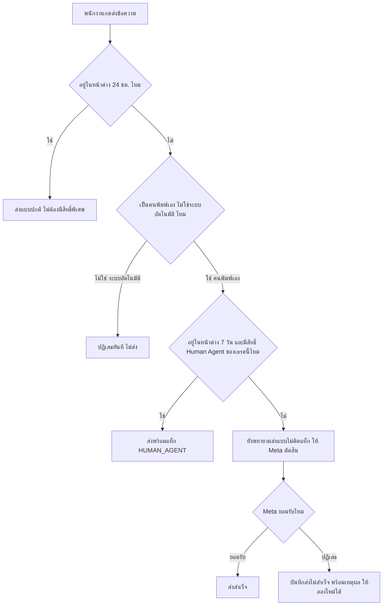
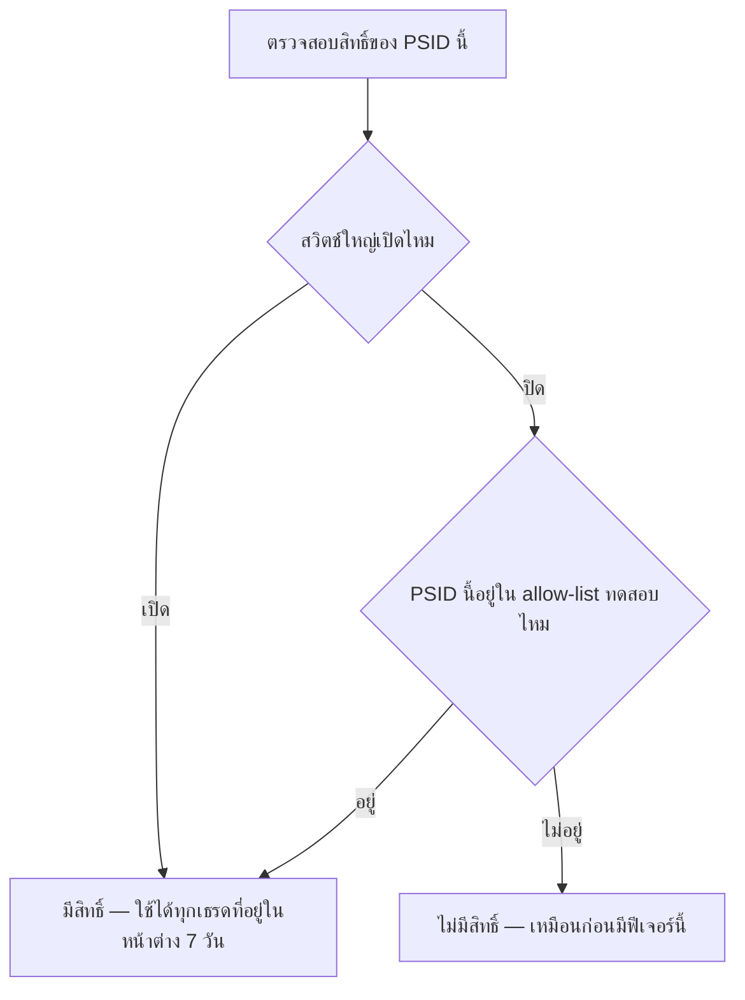
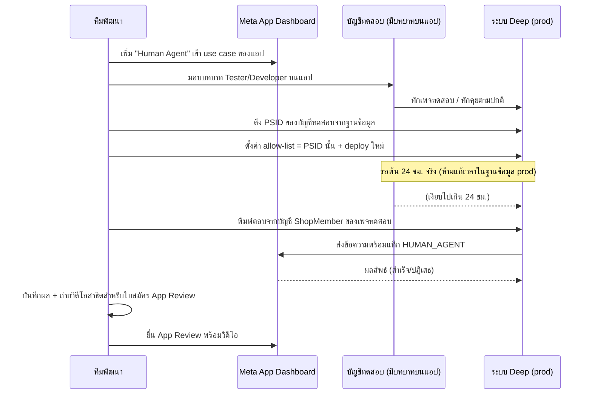

> **โมดูล:** 00043-HumanAgent
> **ประเภทเอกสาร:** Business Requirements Document (BRD) - NON-TECHNICAL
> **เวอร์ชัน:** 1.0
> **วันที่จัดทำ:** 2026-08-10
> **สถานะ:** Draft — รอ user review
> **เจ้าของเอกสาร:** BA

# BRD: ตอบแชทลูกค้าเกิน 24 ชั่วโมง (Facebook/Instagram Human Agent)

---

## 1. บทนำ

### 1.1 วัตถุประสงค์ของเอกสาร

เอกสารนี้อธิบายความต้องการเชิงธุรกิจของการเปิดสิทธิ์ "ตอบแชทเกิน 24 ชั่วโมง" (Human Agent) ให้
ผู้ที่ไม่ใช่นักพัฒนาอ่านแล้วตรวจสอบได้ว่าระบบตัดสินใจอย่างไรในแต่ละสถานการณ์ และเมื่อไหร่จึง
ถือว่าทำงานถูกต้อง โดยเฉพาะช่วงทดสอบก่อนได้รับอนุมัติสิทธิ์จาก Meta ซึ่งต้องพิสูจน์บน prod จริง
เนื่องจาก Deep ไม่มีสภาพแวดล้อม staging แยกต่างหาก

เอกสารนี้เป็นฐานให้ SRS/SDS (เอกสารเชิงเทคนิค) และ TestCase เขียนต่อ — สิ่งที่ไม่ปรากฏใน BRD
ถือว่าไม่อยู่ในความต้องการ

### 1.2 ขอบเขตของระบบ

**เข้าสู่ระบบ (Input):**
- ข้อความที่ `ShopMember` พิมพ์ในกล่องแชท `/inbox` แล้วกดส่ง
- event จาก Meta webhook: ข้อความเข้า, react, referral (มีอยู่แล้ว) และ **postback** (ใหม่ในฟีเจอร์นี้)
- ค่าจาก environment variable: สวิตช์ใหญ่ + รายชื่อบัญชีทดสอบ (allow-list)

**ออกจากระบบ (Output):**
- ข้อความที่ยิงออกไปหาลูกค้าผ่าน Meta Graph API พร้อม/ไม่พร้อมแท็ก `HUMAN_AGENT`
- สถานะหน้าต่างเวลาที่แสดงบนหน้าจอเธรด (แถบสถานะ + ช่องพิมพ์)
- ประวัติ `ChatMessage.deliveryStatus`/`failureReason` เมื่อส่งไม่สำเร็จ (ใช้กลไกเดิมของ 00018)

**ระบบที่เกี่ยวข้อง:**
- feature 00018 (Facebook Chat Integration) — เจ้าของโครงสร้างหน้าต่างเวลา/แท็ก/adapter เดิมทั้งหมด
- Meta Graph API + App Dashboard (App Review, subscription)

**อยู่ในขอบเขต:**
- เปิดสิทธิ์ส่งข้อความเกิน 24 ชม. (ถึง 7 วัน) แบบควบคุมด้วย allow-list รายบัญชีลูกค้า
- รับ event `postback` จาก Meta แล้วยืดหน้าต่างเวลาเหมือนข้อความปกติ
- ทำให้ทุกช่องทางส่งข้อความ (ข้อความเดี่ยว + ชุดรูปภาพ) ใช้กติกาเดียวกัน

**ไม่อยู่ในขอบเขต:**
- ส่งข้อความหลัง 7 วัน / ส่งเนื้อหาการตลาดผ่านสิทธิ์นี้
- `messaging_optins` (Send-to-Messenger / Checkbox plugin)
- หน้าจอจัดการ allow-list ในแอป
- LINE

### 1.3 กลุ่มผู้ใช้งาน

| กลุ่มผู้ใช้ | บทบาท | สิทธิ์การใช้งาน |
|-----------|--------|----------------|
| **`ShopMember`** (เจ้าของร้าน PERSONAL/BUSINESS + สมาชิกที่ถูกเชิญ) | ตอบแชทลูกค้า | ส่งข้อความได้ในทุกหน้าต่างเวลาที่เธรดนั้นอนุญาต — ใช้ `canAccessShop` เดิม ไม่มีสิทธิ์ระดับใหม่แยกต่างหาก |
| **ระบบ (บอท/auto-reply/AI)** | ผู้กระทำอัตโนมัติ | ส่งได้เฉพาะภายในหน้าต่าง 24 ชม. เท่านั้น ห้ามใช้สิทธิ์ 7 วันเด็ดขาด ไม่มีข้อยกเว้น |
| **ลูกค้า Facebook/Instagram** | ผู้รับข้อความ | ไม่มีสิทธิ์ตั้งค่าใด ๆ — การกระทำของลูกค้า (พิมพ์/react/คลิกโฆษณา/กดปุ่ม) เป็นตัวกำหนดว่าหน้าต่างเวลาเปิดอยู่หรือไม่ |
| **ทีมพัฒนา (operator)** | ตั้งค่า allow-list/สวิตช์ใหญ่ | ผ่าน environment variable + deploy เท่านั้น ไม่มี UI |

---

## 2. ความต้องการหลัก (Functional Requirements)

> รหัส `FR-HA-xx` = Functional Requirement ของโมดูล 00043

### 2.1 หน้าต่างเวลาตอบกลับ (Baseline — มีอยู่แล้ว เอกสารนี้เป็น SSOT อ้างอิง)

**FR-HA-01 — นิยามหน้าต่าง 24 ชั่วโมง**

> ในฐานะระบบ ฉันต้องคำนวณว่าเธรดนี้ยังอยู่ในหน้าต่างตอบอิสระ 24 ชม. ไหม
> เพื่อตัดสินว่าจะส่งข้อความแบบปกติได้โดยไม่ต้องใช้สิทธิ์พิเศษ

**Acceptance Criteria:**
- [ ] หน้าต่างเปิด = เวลาปัจจุบัน ยังไม่เกิน 24 ชั่วโมงนับจากเวลาที่ลูกค้าติดต่อล่าสุด
- [ ] เธรดที่ลูกค้าไม่เคยติดต่อเลย (ไม่มีเวลาติดต่อล่าสุด) = หน้าต่างปิดเสมอ
- [ ] ข้อความที่เพจส่งเอง (echo) ต้องไม่ทำให้หน้าต่างนี้ยืดออก

**FR-HA-02 — นิยามหน้าต่าง 7 วัน (Human Agent)**

> ในฐานะระบบ ฉันต้องคำนวณว่าเธรดนี้ยังอยู่ในหน้าต่าง Human Agent 7 วันไหม
> เพื่อตัดสินว่าคนพิมพ์เองยังส่งต่อได้หรือหมดสิทธิ์แล้ว

**Acceptance Criteria:**
- [ ] หน้าต่าง 7 วันคำนวณจาก**จุดเวลาเดียวกัน**กับหน้าต่าง 24 ชม. (เวลาที่ลูกค้าติดต่อล่าสุด) — ไม่มีนิยามคู่ขนาน
- [ ] หน้าต่าง 24 ชม. ปิดแล้วไม่ได้แปลว่าหน้าต่าง 7 วันปิดตามเสมอไป (7 วัน > 24 ชม. เสมอ)
- [ ] หน้าต่าง 7 วันปิดแล้ว = ปิดถาวร ไม่มีทางเปิดใหม่ได้ด้วยการกระทำใด ๆ ยกเว้นลูกค้าติดต่อเข้ามาใหม่

### 2.2 เปิดสิทธิ์ตอบเกิน 24 ชม. แบบควบคุมความเสี่ยง (ใหม่)

**FR-HA-03 — สวิตช์ใหญ่ระดับระบบ**

> ในฐานะทีมพัฒนา ฉันต้องการสวิตช์เดียวที่ปิดสิทธิ์ Human Agent ทั้งระบบได้ทันที
> เพื่อควบคุมความเสี่ยงก่อนได้รับอนุมัติจาก Meta เต็มรูป

**Acceptance Criteria:**
- [ ] ปิด (ค่าเริ่มต้น) = ไม่มีเธรดไหนใช้สิทธิ์ 7 วันได้เลย ไม่ว่า allow-list จะมีอะไรอยู่ก็ตาม
- [ ] เปิด = ทุกเธรดที่อยู่ในหน้าต่าง 7 วันใช้สิทธิ์ได้ (ไม่ต้องพึ่ง allow-list อีกต่อไป — สถานะ "ผ่านการอนุมัติเต็มรูปแล้ว")

**FR-HA-04 — allow-list รายบัญชีลูกค้า (PSID/IGSID)**

> ในฐานะทีมพัฒนา ฉันต้องการทดสอบสิทธิ์ Human Agent บน prod กับบัญชีที่กำหนดไว้ล่วงหน้าเท่านั้น
> เพื่อพิสูจน์ว่าระบบทำงานถูกต้องก่อนยื่น App Review โดยไม่กระทบลูกค้าจริง

**Acceptance Criteria:**
- [ ] เมื่อสวิตช์ใหญ่ปิดอยู่ เธรดที่คู่สนทนาอยู่ใน allow-list เท่านั้นที่ใช้สิทธิ์ 7 วันได้
- [ ] เธรดที่คู่สนทนาไม่อยู่ใน allow-list พฤติกรรมเหมือนวันนี้ทุกประการ (ไม่มีสิทธิ์ 7 วัน)
- [ ] allow-list ระบุด้วยรหัสประจำตัวลูกค้า (PSID/IGSID) ไม่ใช่รหัสเพจ/ร้าน
- [ ] ไม่ได้ตั้งค่า allow-list เลย = เหมือนไม่มีใครอยู่ใน allow-list (fail-closed)

**FR-HA-05 — ด่านนโยบาย fail-closed**

> ในฐานะระบบ ฉันต้องปิดสิทธิ์เป็นค่าเริ่มต้นเมื่อไม่แน่ใจ
> เพื่อไม่ให้ความผิดพลาดในการตั้งค่ากลายเป็นการเปิดสิทธิ์ให้ทุกคนโดยไม่ตั้งใจ

**Acceptance Criteria:**
- [ ] ค่า environment variable ที่ตั้งผิดรูปแบบ/อ่านไม่ได้ = ถือว่าปิด ไม่ถือว่าเปิด
- [ ] ไม่มี path ไหนที่ "อ่านค่าไม่ได้" แล้วไปเปิดสิทธิ์ให้แทน

**FR-HA-06 — เปลี่ยนค่าต้อง deploy ใหม่จึงมีผล**

> ในฐานะทีมพัฒนา ฉันต้องรู้ว่าการแก้ allow-list มีผลเมื่อไหร่
> เพื่อวางแผนขั้นตอนทดสอบได้ถูกต้อง

**Acceptance Criteria:**
- [ ] แก้ environment variable บน Vercel แล้ว ต้อง deploy ใหม่ ค่าจึงมีผลกับ runtime จริง
- [ ] เอกสารขั้นตอนทดสอบ (§4.3) ต้องระบุขั้น deploy ไว้เป็นขั้นตอนบังคับ ไม่ใช่ขั้นตอนที่เดาเอาเอง

**FR-HA-07 — จุดตัดสินใจทุกจุดต้องสอดคล้องกัน**

> ในฐานะพนักงานที่ตอบแชท ฉันต้องเห็นสถานะบนหน้าจอที่ตรงกับสิทธิ์การส่งจริง
> เพื่อไม่ให้เข้าใจผิดว่าส่งได้ทั้งที่ส่งไม่ได้ หรือกลับกัน

**Acceptance Criteria:**
- [ ] จุดที่คำนวณสถานะเพื่อ**แสดงผล**บนหน้าจอเธรด (แถบสถานะ + ช่องพิมพ์) และจุดที่**ตัดสินใจส่งจริง**
      (ทั้งข้อความเดี่ยวและชุดรูปภาพ) ต้องใช้ตรรกะเดียวกันทั้งสวิตช์ใหญ่และ allow-list ต่อ PSID ของ
      เธรดนั้น — ไม่มีจุดไหนใช้แค่สวิตช์ใหญ่อย่างเดียวโดยไม่เช็ค allow-list
- [ ] เธรดที่คู่สนทนาอยู่ใน allow-list ต้องเห็นแถบ "เกิน 24 ชม. แต่ยังตอบเองได้ถึง [วันที่]" — เธรดที่ไม่อยู่ต้องเห็นข้อความทั่วไปแบบเดิม

### 2.3 Postback ต้องยืดหน้าต่างเหมือนข้อความ (แก้บั๊กที่มีอยู่ก่อน)

**FR-HA-08 — รับ event postback แล้วยืดหน้าต่าง**

> ในฐานะระบบ ฉันต้องนับการกดปุ่มของลูกค้าเป็นการติดต่อ
> เพื่อไม่ให้หน้าต่างเวลาแคบกว่าที่ Meta อนุญาตจริง

**Acceptance Criteria:**
- [ ] event `postback` ที่มาจากลูกค้า (ไม่ใช่ฝั่งเพจ) ต้องยืดหน้าต่างทั้ง 24 ชม. และ 7 วัน ด้วยเวลาที่
      ปุ่มถูกกดจริง (ไม่ใช่เวลาที่ webhook มาถึงเรา)
- [ ] เขียนเวลาใหม่เฉพาะเมื่อ**ใหม่กว่า**เวลาที่เก็บไว้เดิม (กัน event สลับลำดับดันเวลาถอยหลัง — ใช้
      กติกาเดียวกับที่ `react`/`referral` ใช้อยู่แล้ว)
- [ ] event `postback` ที่มาจากฝั่งเพจเอง (ถ้ามี) ต้องไม่ยืดหน้าต่างให้ตัวเอง

**FR-HA-09 — postback ที่มาทาง standby (ไม่มี payload)**

> ในฐานะระบบ ฉันต้องไม่ล้มเมื่อได้รับ postback ที่ไม่มีรายละเอียดติดมา (ห้องที่ Deep ไม่ใช่เจ้าของเธรด)
> เพื่อให้เธรดยังคงยืดหน้าต่างเวลาได้แม้ในสถานการณ์นี้

**Acceptance Criteria:**
- [ ] event ที่มาทางช่อง `standby` และไม่มี payload ของปุ่ม ต้องไม่ทำให้ระบบ error/ตอบ non-200 กลับ Meta
- [ ] ระบบยังบันทึกว่า "มีปฏิสัมพันธ์เกิดขึ้น" เพื่อยืดหน้าต่างเวลา แม้ไม่รู้รายละเอียดของปุ่มที่กด

### 2.4 ความสม่ำเสมอของนโยบายในทุกช่องทางส่งออก

**FR-HA-10 — ด่าน "คนพิมพ์เองเท่านั้น" ครอบทุกช่องทางส่ง**

> ในฐานะทีมพัฒนา ฉันต้องการให้ทุกฟังก์ชันส่งข้อความเช็คเงื่อนไขเดียวกันก่อนใช้สิทธิ์ 7 วัน
> เพื่อไม่ให้ช่องทางใดช่องทางหนึ่งเผลอเปิดช่องให้ระบบอัตโนมัติใช้สิทธิ์นี้ในอนาคต

**Acceptance Criteria:**
- [ ] ฟังก์ชันส่งข้อความเดี่ยวและฟังก์ชันส่งชุดรูปภาพ ต้องเช็ค "เป็นคนพิมพ์เอง ไม่ใช่ระบบอัตโนมัติ"
      ด้วยเงื่อนไขเดียวกัน เป็นด่านที่ตรวจได้จริงตอนรัน (ไม่ใช่พึ่งแค่รูปแบบพารามิเตอร์ของฟังก์ชันเพียงอย่างเดียว)
- [ ] มีเทส regression ยืนยันว่าเรียกฟังก์ชันส่งข้อความจากเส้นทางระบบ (auto-reply/บอท) แล้วพยายามใช้
      สิทธิ์ 7 วัน ต้องถูกปฏิเสธเสมอ ไม่ว่าสวิตช์ใหญ่/allow-list จะเป็นอย่างไร

**FR-HA-11 — พฤติกรรมสม่ำเสมอเมื่อหน้าต่างปิดและไม่มีสิทธิ์**

> ในฐานะพนักงานที่ตอบแชท ฉันต้องการให้ระบบพยายามส่งข้อความเสมอแล้วให้ Meta เป็นคนตัดสิน
> เพื่อไม่พลาดโอกาสในกรณีที่ระบบของเราคำนวณสถานะผิดพลาด

**Acceptance Criteria:**
- [ ] ทุกช่องทางส่งข้อความ (เดี่ยว + ชุดรูปภาพ) เมื่อหน้าต่างปิดและไม่มีสิทธิ์ Human Agent ให้ใช้
      (ไม่ว่าเพราะเกิน 7 วันจริง หรือสวิตช์/allow-list ยังไม่ครอบคลุมเธรดนั้น) ต้อง**พยายามส่งแบบไม่ติด
      แท็ก แล้วให้ Meta ตอบกลับ** — ห้ามบล็อกฝั่งเราเองก่อนที่จะลองส่ง (สอดคล้องกับพฤติกรรมของ
      ฟังก์ชันส่งข้อความเดี่ยวที่ตัดสินใจไว้แล้วก่อนหน้านี้)
- [ ] เมื่อ Meta ปฏิเสธ ต้องบันทึกเป็นสถานะส่งไม่สำเร็จพร้อมเหตุผล ให้ผู้ใช้เห็นและกดลองใหม่ได้ —
      ไม่ใช่ปฏิเสธแบบเงียบที่ผู้ใช้ไม่เห็นบับเบิลข้อความที่พยายามส่งเลย

> **หมายเหตุจากการตรวจโค้ดจริง:** ฟังก์ชันส่งข้อความเดี่ยวทำตาม AC นี้แล้ว แต่ฟังก์ชันส่งชุดรูปภาพ
> ยังบล็อกฝั่งเราเองทันทีเมื่อหน้าต่างปิดและไม่มีสิทธิ์ (พฤติกรรมเก่าที่ยังไม่ได้ปรับตาม) — ต้องแก้ให้
> ตรงกันเป็นส่วนหนึ่งของ FR-HA-11

---

## 3. Acceptance Criteria สรุป

### 3.1 หน้าต่างเวลาตอบกลับ

**เมื่อระบบทำงานถูกต้อง:**
- ✅ 24 ชม. และ 7 วัน คำนวณจากจุดเวลาเดียวกันเสมอ
- ✅ บอท/ระบบอัตโนมัติไม่มีทางใช้สิทธิ์ 7 วันได้ ไม่ว่ากรณีใด

### 3.2 การเปิดสิทธิ์แบบควบคุมความเสี่ยง

**เมื่อสวิตช์ใหญ่ปิดและ allow-list มีบัญชีทดสอบ:**
- ✅ เธรดของบัญชีทดสอบใช้สิทธิ์ 7 วันได้
- ✅ เธรดของลูกค้าทั่วไปพฤติกรรมเหมือนก่อนมีฟีเจอร์นี้ทุกประการ

**เมื่อไม่ได้ตั้งค่าอะไรเลย:**
- ✅ ปิดสนิททุกเธรด

### 3.3 Postback

**เมื่อลูกค้ากดปุ่ม:**
- ✅ หน้าต่างเวลายืดออกเหมือนพิมพ์ข้อความ
- ✅ ระบบไม่ล้มแม้ event ไม่มี payload ติดมา

### 3.4 ความสม่ำเสมอของช่องทางส่ง

**เมื่อหน้าต่างปิดและไม่มีสิทธิ์:**
- ✅ ทุกช่องทางพยายามส่งแล้วให้ Meta ตัดสินเหมือนกัน ไม่มีช่องทางไหน block ทันทีโดยไม่ลอง

---

## 4. Business Flows (กระบวนการทำงาน)

### 4.1 Flow หลัก: ตัดสินใจว่าจะส่งข้อความแบบไหน

### 4.2 Flow: สิทธิ์ Human Agent ของเธรดหนึ่ง ๆ ตัดสินอย่างไร

### 4.3 Flow: ทดสอบก่อนยื่น App Review (Allow-list Rollout)

---

## 5. Use Case Scenarios (สถานการณ์การใช้งานจริง)

### Scenario 1: Best Case — บัญชีทดสอบ ส่งสำเร็จ

**ผู้เกี่ยวข้อง:** ทีมพัฒนา (สวมบทบาท ShopMember), บัญชีทดสอบ (Tester ของแอป)

**เงื่อนไขเริ่มต้น:**
- สวิตช์ใหญ่ปิด, allow-list มี PSID ของบัญชีทดสอบ, เธรดเงียบมาแล้ว 3 วัน (ยังอยู่ในหน้าต่าง 7 วัน)

**ขั้นตอน:**
1. พนักงานเปิดเธรด เห็นแถบ "เกิน 24 ชม. แต่ยังตอบเองได้ถึง [วันที่]"
2. พิมพ์ข้อความแล้วกดส่งตามปกติ (ไม่มีปุ่ม/โหมดพิเศษให้เลือก)

**ผลลัพธ์:**
- ระบบติดแท็ก `HUMAN_AGENT` อัตโนมัติ ส่งสำเร็จ ลูกค้าได้รับข้อความ

### Scenario 2: บัญชีทั่วไป ยังไม่มีสิทธิ์ (ปกติของวันนี้ ไม่เปลี่ยนแปลง)

**ผู้เกี่ยวข้อง:** พนักงานร้าน, ลูกค้าทั่วไป

**เงื่อนไขเริ่มต้น:**
- สวิตช์ใหญ่ปิด, PSID ของลูกค้าไม่อยู่ใน allow-list, เธรดเงียบมาแล้ว 2 วัน

**ขั้นตอน:**
1. พนักงานเห็นแถบสถานะบอกว่าเกินเวลาที่ Meta ให้ตอบ
2. พนักงานยังกดส่งได้ (ไม่ถูกล็อก UI)

**ผลลัพธ์:**
- ส่งแบบไม่ติดแท็ก Meta ปฏิเสธ → บันทึกเป็นส่งไม่สำเร็จพร้อมเหตุผล พฤติกรรมเหมือนก่อนมีฟีเจอร์นี้ทุกประการ

### Scenario 3: ลูกค้ากดปุ่มแล้วเงียบ (postback เปิดหน้าต่างใหม่)

**ผู้เกี่ยวข้อง:** ลูกค้า, พนักงานร้าน

**เงื่อนไขเริ่มต้น:**
- เธรดเงียบมาแล้ว 20 ชั่วโมง (ใกล้หมดหน้าต่าง 24 ชม.)

**ขั้นตอน:**
1. ลูกค้ากด quick reply บนข้อความเก่า
2. ระบบรับ event `postback` แล้วยืด `lastInboundAt`

**ผลลัพธ์:**
- เธรดกลับมาอยู่ในหน้าต่าง 24 ชม. เปิดใหม่ พนักงานส่งข้อความปกติได้โดยไม่ต้องใช้สิทธิ์ 7 วันเลย

### Scenario 4: บัญชีทดสอบ แต่พ้น 7 วันแล้ว

**ผู้เกี่ยวข้อง:** ทีมพัฒนา (สวมบทบาท ShopMember), บัญชีทดสอบ

**เงื่อนไขเริ่มต้น:**
- PSID อยู่ใน allow-list แต่เธรดเงียบมาแล้ว 8 วัน (พ้นหน้าต่าง 7 วันแล้ว)

**ขั้นตอน:**
1. พนักงานพยายามส่งข้อความ

**ผลลัพธ์:**
- แม้อยู่ใน allow-list ก็ส่งไม่ได้ — หน้าต่าง 7 วันหมดถาวรแล้ว ไม่มีทางส่งได้อีกจนกว่าลูกค้าจะติดต่อเข้ามาใหม่ (allow-list ไม่ใช่ทางลัดข้ามกฎ 7 วัน)

### Scenario 5: Meta ปฏิเสธหลังบันทึกแถวข้อความไว้แล้ว

**ผู้เกี่ยวข้อง:** พนักงานร้าน

**เงื่อนไขเริ่มต้น:**
- เธรดอยู่ในหน้าต่าง 7 วันและมีสิทธิ์ แต่ Meta ปฏิเสธด้วยเหตุผลอื่น (เช่นลูกค้าปิดรับข้อความจากเพจ)

**ขั้นตอน:**
1. พนักงานส่งข้อความ ระบบสร้างบับเบิลทันที (optimistic)
2. Meta ตอบปฏิเสธกลับมา

**ผลลัพธ์:**
- บับเบิลเปลี่ยนเป็น "ส่งไม่สำเร็จ" พร้อมเหตุผลเท่าที่ระบบแปลได้ (ใช้กลไกแปลเหตุผลเดิมของ 00018) —
  ถ้าเป็นเหตุผลที่ยังไม่เคยพบมาก่อน (เช่นข้อความปฏิเสธเฉพาะของสิทธิ์ Human Agent) ให้แสดงข้อความ
  ดิบของ Meta ไว้ก่อน ไม่เดาคำแปล (ตามหลักการเดิมของ 00018)

### Scenario 6: Edge Cases (ตารางสรุป)

| สถานการณ์ | พฤติกรรมที่ต้องการ |
|---|---|
| หน้าต่าง 7 วันหมดพอดีระหว่างพนักงานกำลังพิมพ์อยู่ | ระบบตัดสินด้วยเวลา ณ ตอนกดส่งจริง (เซิร์ฟเวอร์คำนวณใหม่ทุกครั้ง ไม่ใช้ค่าที่โหลดหน้าจอไว้ตอนแรก) — ถ้าหมดแล้วให้เข้า flow "พยายามส่งแล้วให้ Meta ตัดสิน" ตามปกติ |
| เธรดที่ Meta AI ถือสิทธิ์คุมอยู่ (`standby`) | ยังไม่มีข้อมูลยืนยันว่าส่งข้อความผ่านได้ไหมแม้มีสิทธิ์ Human Agent แล้ว — เป็นหนี้ที่สืบทอดจากฟีเจอร์ก่อนหน้า ไม่ใช่สิ่งที่ฟีเจอร์นี้ต้องแก้ แต่ต้องไม่ทำให้อาการแย่ลง |
| ไม่เคยมีเวลาติดต่อล่าสุดของเธรดนี้เลย (`lastInboundAt` เป็นค่าว่าง) | หน้าต่างทั้ง 24 ชม. และ 7 วัน ปิดทั้งคู่ — ไม่มีสิทธิ์ Human Agent ไม่ว่า allow-list จะระบุอะไร |
| ระบบตรวจพบว่าลูกค้าติดต่อจริงล่าสุดใหม่กว่าที่เก็บไว้ (เช็คสดกับ Meta) | ใช้ค่าที่เช็คสดมาแทน ไม่ใช้ค่าเก่าที่อาจไม่ตรงความจริง |
| PSID อยู่ใน allow-list แต่พ้น 7 วันแล้ว | ปฏิเสธเสมอ — allow-list ไม่ใช่ทางข้ามกฎ 7 วัน (ดู Scenario 4) |
| เธรดของช่องทาง LINE / ห้องแชทภายในของ Deep เอง | ไม่มีแนวคิดหน้าต่างแบบนี้เลย ตัดสินใจ/ยืดหน้าต่างของฟีเจอร์นี้ไม่เกี่ยวข้องกับช่องทางเหล่านี้ |

---

## 6. ความต้องการด้านคุณภาพ (Quality Requirements)

### 6.1 ความถูกต้องของข้อมูล
- ต้องมีนิยาม "เธรดนี้เหลือเวลาตอบเท่าไหร่" เพียงจุดเดียวในระบบ ทั้งฝั่งคำนวณเพื่อส่งจริงและฝั่งแสดงผลบนหน้าจอ

### 6.2 ความรวดเร็ว
- การตัดสินใจว่าจะติดแท็กหรือไม่ ต้องไม่เพิ่ม round-trip พิเศษไปยัง Meta ก่อนส่งจริง (ตัดสินจากข้อมูลที่มีอยู่แล้วในฐานข้อมูล)

### 6.3 ความน่าเชื่อถือ
- เรียก Meta ไม่สำเร็จระหว่างตรวจสอบเวลาติดต่อล่าสุด ต้อง fail-safe ไปทาง "ใช้ค่าที่มีอยู่เดิม" ไม่ใช่ทำให้ระบบล้ม
- ไม่ได้ตั้งค่า environment variable ใด ๆ ต้อง fail-closed ไปทางปิดสิทธิ์เสมอ

### 6.4 ความปลอดภัย
- allow-list เป็นค่าระดับ environment ไม่ใช่ค่าในฐานข้อมูลที่ผู้ใช้ทั่วไปแก้ได้
- ไม่มีจุดใดในระบบเปิดให้ระบบอัตโนมัติ (บอท/AI) ใช้สิทธิ์ 7 วันได้ไม่ว่ากรณีใด

### 6.5 ความสะดวกในการใช้งาน (Usability)
- พนักงานไม่ต้องเรียนรู้โหมด/ปุ่มใหม่ — พิมพ์และกดส่งเหมือนเดิมทุกประการ ระบบจัดการสิทธิ์ให้เอง
- แถบสถานะเธรดต้องบอกครบ 3 สถานะ (เปิด 24 ชม. / เกิน 24 ชม. แต่ยังตอบเองได้ / หมดสิทธิ์แล้ว) โดยไม่พูดถึงกลไก allow-list ที่เป็นรายละเอียดภายใน

---

## 7. ข้อจำกัด (Constraints)

### 7.1 ข้อจำกัดทางธุรกิจ
- ส่งได้สูงสุด 7 วันเท่านั้น เป็นเพดานของ Meta ไม่ใช่การตัดสินใจของ Deep
- ต้องรอ Meta อนุมัติสิทธิ์เต็มรูปก่อนเปิดให้ลูกค้าทั่วไปทุกคนใช้ได้

### 7.2 ข้อจำกัดทางเทคนิค
- ไม่มีสภาพแวดล้อม staging แยกจาก prod — ทุกการทดสอบต้องออกแบบให้ปลอดภัยต่อลูกค้าจริงด้วยตัวเอง
- การเปลี่ยนค่า environment variable ต้อง deploy ใหม่ ไม่มีผลทันที
- Standard Access ของ Meta อนุญาตให้ทดสอบเฉพาะกับบัญชีที่มีบทบาทบนแอป — ทดสอบกับลูกค้าจริงไม่ได้จนกว่าจะผ่านการอนุมัติ

---

## 8. กฎทางธุรกิจ (Business Rules)

### 8.1 กฎการนับหน้าต่างเวลา
- หน้าต่าง 24 ชม. และ 7 วัน คำนวณจากเวลาที่ลูกค้าติดต่อล่าสุดจุดเดียวกันเสมอ
- การกระทำของลูกค้าที่ยืดหน้าต่าง (พิมพ์ข้อความ, react, คลิกโฆษณา/ลิงก์, กดปุ่ม) เขียนเวลาใหม่เฉพาะเมื่อใหม่กว่าค่าเดิม

### 8.2 กฎสิทธิ์การส่ง
- ระบบอัตโนมัติ (บอท/AI/auto-reply) ห้ามใช้สิทธิ์ 7 วันเด็ดขาด ไม่มีข้อยกเว้น
- เฉพาะข้อความที่คนพิมพ์เองเท่านั้นที่มีสิทธิ์ใช้ช่วง 7 วัน

### 8.3 กฎ allow-list/kill switch
- ไม่ได้ตั้งค่าอะไรเลย = ปิดสนิท (fail-closed)
- allow-list ผูกกับบัญชีลูกค้า (PSID/IGSID) ไม่ใช่เพจหรือร้าน
- allow-list ไม่ใช่ทางข้ามกฎ 7 วัน — พ้น 7 วันแล้วปฏิเสธเสมอไม่ว่าจะอยู่ใน allow-list หรือไม่

### 8.4 กฎ postback
- postback จากลูกค้ายืดหน้าต่างเหมือนข้อความ
- postback จากฝั่งเพจไม่ยืดหน้าต่างให้ตัวเอง
- postback ที่ไม่มี payload (มาทาง standby) ต้องไม่ทำให้ระบบล้ม

---

## 9. อภิธานศัพท์ (Glossary)

| คำศัพท์ | ความหมาย |
|---------|----------|
| **หน้าต่าง 24 ชั่วโมง** | ช่วงเวลาที่ส่งข้อความได้อิสระนับจากข้อความล่าสุดของลูกค้า |
| **หน้าต่าง 7 วัน (Human Agent)** | ช่วงเวลาที่คนพิมพ์เองส่งข้อความต่อได้ นับจากจุดเวลาเดียวกับ 24 ชม. |
| **HUMAN_AGENT tag** | รูปแบบการส่งข้อความของ Meta ที่ใช้สิทธิ์นอกหน้าต่างปกติ ต้องมี permission ก่อน |
| **allow-list** | รายชื่อ PSID ที่อนุญาตให้ใช้สิทธิ์ Human Agent ได้ก่อนได้รับอนุมัติเต็มรูป |
| **kill switch (สวิตช์ใหญ่)** | สวิตช์ปิด/เปิดสิทธิ์ทั้งระบบ |
| **postback** | event ที่เกิดเมื่อลูกค้ากดปุ่ม/quick reply |
| **standby** | ช่องทาง event ของห้องที่ Deep ไม่ใช่เจ้าของเธรด |
| **PSID/IGSID** | รหัสประจำตัวลูกค้าฝั่ง Messenger/Instagram |

---

## 10. สรุป

เอกสาร BRD นี้อธิบายความต้องการหลักของ **การเปิดสิทธิ์ตอบแชทเกิน 24 ชั่วโมง (Human Agent)**
แบบไม่ใช่เทคนิค

**จุดเด่นของระบบ:**
- ต่อยอดโครงสร้างหน้าต่างเวลา/แท็กที่มีอยู่แล้วจาก feature 00018 โดยไม่ต้องสร้างใหม่
- ทดสอบบน prod ได้อย่างปลอดภัยผ่าน allow-list โดยไม่ต้องมี staging แยก
- แก้บั๊กเดิมที่ปุ่ม/quick reply ของลูกค้าไม่ถูกนับเป็นการติดต่อ
- ทำให้ทุกช่องทางส่งข้อความมีกติกาเดียวกัน ลดความเสี่ยงที่ช่องทางใหม่ในอนาคตจะหลุดเปิดสิทธิ์ให้ระบบอัตโนมัติโดยไม่ตั้งใจ

**ผลลัพธ์ที่คาดหวัง:**
- ลูกค้าที่หายไปนานถึง 7 วันยังได้รับการตอบกลับ แทนที่จะถูกปฏิเสธเงียบ ๆ
- ทีมพัฒนามีหลักฐานพร้อมยื่น App Review สิทธิ์ `human_agent` จาก Meta

---

**หมายเหตุ:**
สำหรับความต้องการทางธุรกิจระดับภาพรวม/personas/KPI ดู [[PRD]] ของโมดูลนี้
สำหรับ technical specification (architecture/API/data/NFR) ดู [[SRS]] ของโมดูลนี้ (ยังไม่ได้จัดทำ)
