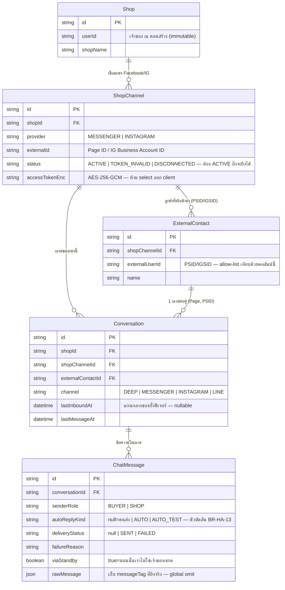

> **โมดูล:** 00043-HumanAgent
> **ประเภทเอกสาร:** DATABASE Design
> **เวอร์ชัน:** 1.0
> **วันที่จัดทำ:** 2026-08-10
> **สถานะ:** Draft — รอ user review
> **เจ้าของเอกสาร:** SA (ดู [[Feature-Docs-Ownership]])

# DATABASE: ตอบแชทลูกค้าเกิน 24 ชั่วโมง (Facebook/Instagram Human Agent)

---

## 🔒 สรุปข้อสรุปที่ล็อกแล้ว

**ฟีเจอร์นี้ไม่มีการเปลี่ยน schema เลย** — ไม่มีตารางใหม่ ไม่มีคอลัมน์ใหม่ ไม่มี enum ใหม่
**ไม่มี migration ไฟล์ไหนถูกสร้างในรอบนี้**

การตั้งค่าทั้งหมด (สวิตช์ใหญ่ + allow-list บัญชีทดสอบ) อยู่ใน **environment variable** เท่านั้น:

| ตัวแปร | ความหมาย | ตรวจสอบ |
|---|---|---|
| `META_HUMAN_AGENT_ENABLED` | สวิตช์ใหญ่ระดับระบบ (`'true'` = เปิด) | ยืนยันแล้วว่ามีอยู่จริงในโค้ด (`src/services/channel-chat.service.ts:104-106`, ฟังก์ชัน `isHumanAgentEnabled()`) — เปรียบเทียบสตริงตรง ๆ `=== 'true'` ค่าอื่นทุกค่ารวมทั้งไม่ได้ตั้งเลย = `false` (fail-closed ตาม BR-HA-07 อยู่แล้วในโครงเดิม) |
| `META_HUMAN_AGENT_TEST_PSIDS` | allow-list PSID/IGSID บัญชีทดสอบ (คั่นด้วย comma คาดว่า) | **ยังไม่มีในโค้ดวันนี้** — เป็นสิ่งที่ FR-HA-04 ต้องเพิ่ม (กอง 2 ของ Roadmap §11.2 ใน PRD) รูปแบบ parse (comma-separated / JSON array) เป็นการตัดสินใจของ SDS ไม่ใช่ของเอกสารนี้ แต่ **ต้อง fail-closed เหมือนกัน**: parse ไม่ได้ = allow-list ว่าง ไม่ใช่ allow-list "ทุกคน" |

งานของเอกสารนี้ไม่ใช่หาเรื่องเพิ่มตาราง แต่คือทำให้ตอบได้ว่า **ข้อมูลที่ฟีเจอร์นี้พึ่งพาอยู่ที่ไหน
เขียนโดยใคร เชื่อถือได้แค่ไหน** — ทุกชื่อ table/column ในเอกสารนี้ยืนยันกับ `prisma/schema.prisma`
และซอร์สจริงแล้ว (ไม่ได้อ้างจากความจำ) พร้อมเลขบรรทัดกำกับ

---

## 1. Overview

โครงสร้างข้อมูลของหน้าต่างเวลาตอบกลับ (24 ชม. / 7 วัน) มีอยู่ครบแล้วตั้งแต่ feature 00018
(Facebook Chat Integration) — ฟีเจอร์นี้ (00043) **ไม่สร้างโครงสร้างใหม่** แต่ทำ 3 อย่างที่กระทบ
data layer ทางอ้อม:

1. **เปิดสิทธิ์ใช้หน้าต่าง 7 วันแบบควบคุมความเสี่ยง** — อ่านค่าจาก environment variable มา
   เปรียบเทียบกับ `ExternalContact.externalUserId` ของเธรดนั้น ไม่มีการเขียนอะไรลง DB เพิ่ม
2. **แก้บั๊ก postback ไม่ยืดหน้าต่าง** — เพิ่ม**ผู้เขียนรายใหม่**ให้คอลัมน์ `Conversation.lastInboundAt`
   ที่มีอยู่แล้ว (ไม่ใช่คอลัมน์ใหม่) ต้องเดินตามกติกาเดียวกับผู้เขียนรายเดิมทุกราย (ดู §3)
3. **ความสม่ำเสมอของช่องทางส่งออก** — แก้ลำดับเงื่อนไขในโค้ด (`sendOutboundImageGrid`) ให้ตรงกับ
   `sendOutboundMessage` ไม่มีผลต่อ schema แต่มีผลต่อ **ค่าที่จะถูกเขียนลง** `ChatMessage.deliveryStatus`
   / `failureReason` (เขียนสถานะ "พยายามส่งแล้วถูกปฏิเสธ" แทนที่จะไม่มีแถวให้เขียนเลยเพราะบล็อกไว้
   ก่อนตั้งแต่ต้น)

- **เอกสารออกแบบต้นทาง:** [[PRD]] + [[BRD]] ของ 00043 (SRS/SDS ของโมดูลนี้ยังไม่ได้จัดทำ — ตาม
  Hard Rule 11 ลำดับคือ PRD → BRD → SRS → SDS → DATABASE/API → Tests; เอกสารนี้เขียนคู่ขนานกับ
  SDS/API/Tests ของรอบเดียวกันตามการมอบหมายงานของ Controller ไม่ใช่การข้ามลำดับ)
- **Store:** PostgreSQL 16 (Supabase) — Prisma ORM เดียว ไม่มี store อื่น (ต่างจาก template ที่เขียน
  สำหรับระบบ polyglot หลาย store — โปรเจกต์นี้ใช้ Postgres ตัวเดียวทั้งระบบ)
- **Engine / Charset:** InnoDB ไม่เกี่ยวข้อง (Postgres); encoding UTF-8 ตาม default ของ Supabase
- **⚠️ dev DB = prod DB ตัวเดียวกันบางส่วน** — ดู Hard Rule 13/14 และ `docs/conventions/prod-db-safety.md`
  ก่อนรันคำสั่งใดที่แตะฐานข้อมูลจริง แม้เอกสารนี้จะไม่มี migration ให้รันเลยก็ตาม

---

## 2. ERD

เฉพาะส่วนที่ฟีเจอร์นี้อ่าน/เขียน — โครงเต็มของ chat schema (feature 00018/00023/00025/00038) มี
รายละเอียดกว่านี้มาก ดูใน `prisma/schema.prisma` โดยตรง ไม่ทำซ้ำที่นี่

---

## 3. ตารางคอลัมน์ที่ฟีเจอร์นี้อ่าน/เขียน

ไม่มีตารางใหม่ — นี่คือรายการคอลัมน์ **ที่มีอยู่แล้ว** ที่ฟีเจอร์ 00043 พึ่งพา พร้อมชนิดจริงจาก
`prisma/schema.prisma` (บรรทัดอ้างอิงเวลาเขียนเอกสารนี้ — อาจขยับถ้ามีคนแก้ไฟล์นี้ทีหลัง)

### 3.1 `Conversation` (PostgreSQL — Prisma model `Conversation`, `schema.prisma:1480-1596`)

| Column | Type | Null | ใช้ทำอะไรในฟีเจอร์นี้ |
|---|---|---|---|
| `lastInboundAt` | `DateTime?` | ใช่ | **คอลัมน์แกนกลางของทั้งฟีเจอร์** — `getWindowState(lastInboundAt)` (`channel-chat.service.ts:108-132`) derive ทั้งหน้าต่าง 24 ชม. (`expiresAt`) และหน้าต่าง 7 วัน (`humanAgentExpiresAt`) จากค่าเดียวกันตัวนี้ (ตอบ BR-HA-01/FR-HA-01/FR-HA-02 ที่บังคับว่าห้ามมีนิยามคู่ขนาน) `null` = ลูกค้าไม่เคยติดต่อเลย → ทั้งสองหน้าต่างปิดเสมอ |
| `channel` | `String` (default `"DEEP"`) | ไม่ | ตัดสินว่าเธรดนี้อยู่ใต้แนวคิดหน้าต่าง Meta หรือไม่ — `LINE`/`DEEP` ไม่มีแนวคิดนี้เลย (BRD §5 Scenario 6 แถวสุดท้าย); `sendOutboundMessage` early-return ไปเส้นทาง LINE ก่อนถึงโค้ดของ Meta แม้แต่บรรทัดเดียว (`channel-chat.service.ts:2933-2937`) |
| `shopChannelId` | `String?` | ใช่ | join ไปหา `ShopChannel.status` (ต้อง `ACTIVE` — ดู §3.3) |
| `externalContactId` | `String?` | ใช่ | join ไปหา `ExternalContact.externalUserId` (PSID/IGSID) ที่ allow-list เทียบด้วย |

### 3.2 `ExternalContact` (`schema.prisma:1442-1478`)

| Column | Type | Null | ใช้ทำอะไรในฟีเจอร์นี้ |
|---|---|---|---|
| `externalUserId` | `String` | ไม่ | **ค่าที่ allow-list (`META_HUMAN_AGENT_TEST_PSIDS`) ต้องเทียบด้วย** (BR-HA-06: "ระบุด้วยบัญชีปลายทางของลูกค้า ไม่ใช่เพจหรือร้าน") — page-scoped, `@@unique([shopChannelId, externalUserId])` กัน dedupe ข้ามเพจ ดังนั้น PSID เดียวกันของลูกค้าคนเดียวกันที่ทักคนละเพจจะเป็นคนละแถว คนละเธรด — allow-list ต้องรู้ตัวว่าตั้งค่าต่อ (Page, PSID) จริง ๆ ไม่ใช่ต่อคนเฉย ๆ |

### 3.3 `ShopChannel` (`schema.prisma:1377-1439`)

| Column | Type | Null | ใช้ทำอะไรในฟีเจอร์นี้ |
|---|---|---|---|
| `status` | `String` (default `"ACTIVE"`) | ไม่ | `sendOutboundMessage` throw `CHANNEL_NOT_ACTIVE` ทันทีถ้าไม่ใช่ `ACTIVE` (`channel-chat.service.ts:2970`) ก่อนแม้แต่จะถึงจุดตัดสิน tag — เพจที่ token ตายแล้วไม่มีทางได้ทดสอบ allow-list |
| `accessTokenEnc` | `String` | ไม่ | ต้อง decrypt (`decryptToken`) ก่อนยิง Graph — **ห้าม select/log/ส่งกลับ client ทุกกรณี** (คอมเมนต์บังคับไว้ในไฟล์ schema เอง) |

### 3.4 `ChatMessage` (`schema.prisma:1645-1763`)

| Column | Type | Null | ใช้ทำอะไรในฟีเจอร์นี้ |
|---|---|---|---|
| `autoReplyKind` | `String?` (`null` \| `"AUTO"` \| `"AUTO_TEST"`) | ใช่ | **ตัวตัดสิน BR-HA-02/BR-HA-13/FR-HA-10** — `sentByHuman = actorUserId !== null && !autoReplyKind` (`channel-chat.service.ts:2959`) เป็นด่านเดียวที่บอกว่า "ข้อความนี้คนพิมพ์เอง" ไม่ใช่แค่ตรวจชนิดพารามิเตอร์ตอน compile (BRD เขียนกำกับไว้ตรง ๆ ว่าห้ามพึ่งแค่ type safety) |
| `senderRole` | `String` (`"BUYER"` \| `"SHOP"`) | ไม่ | คู่กับ `autoReplyKind` — "พนักงานตอบ" = `senderRole='SHOP' AND autoReplyKind IS NULL` (คอมเมนต์ต้นทาง `schema.prisma:1739-1740` อ้าง BR-AR-22 ของ 00023) |
| `deliveryStatus` | `String?` (`null` \| `"SENT"` \| `"FAILED"`) | ใช่ | ผลลัพธ์เมื่อ Meta ยอมรับ/ปฏิเสธการส่ง — เขียนที่ `channel-chat.service.ts:3137` (`failureReason ? 'FAILED' : 'SENT'`) เป็นกลไกเดิมของ 00018 ที่ 00043 ต่อยอด ไม่สร้างใหม่ (BRD §1.2 Output) |
| `failureReason` | `String?` | ใช่ | ข้อความ error ที่แปลได้ (หรือ raw ของ Meta ถ้าแปลไม่ได้ — Scenario 5 ของ BRD) |
| `viaStandby` | `Boolean` (default `false`) | ไม่ | ธงว่าแถวนี้มาทางกล่อง `standby` (ตอนนั้นไม่ใช่เจ้าของเธรด) — **เกี่ยวข้องกับ G-3 (known gap)** ไม่ใช่สิ่งที่ 00043 ต้องแก้ แต่ postback ที่มาทาง standby ไม่มี payload ต้องไม่ทำให้ระบบล้ม (FR-HA-09) เก็บที่ "ข้อความ" ไม่ใช่ธงแยกบน `Conversation` โดยตั้งใจ (คอมเมนต์ต้นทาง `schema.prisma:1722-1723` อ้าง `stored-flag-vs-owner-truth.md`) |
| `rawMessage` | `Json?` | ใช่ | **`messageTag` ที่ยิงจริง (`'HUMAN_AGENT'` หรือไม่มี) ไม่ได้มีคอลัมน์แยก — ถูกฝังไว้ใน `rawMessage.messageTag` ของฝั่งขาออก** (`outboundResponse.messageTag`, `channel-chat.service.ts:3083`, เก็บผ่าน `toRawMessage(conversation.channel, outboundResponse, 'outbound-response')` ที่ `channel-chat.service.ts:3143`) 🛑 คอลัมน์นี้ถูก **global omit** ที่ `src/lib/prisma.ts` — query ปกติ (`findMany` ไม่ระบุ `select`) จะไม่ได้ค่านี้กลับมา ต้องขอตรง ๆ ด้วย `omit: { rawMessage: false }` เท่านั้น (ผลต่อ §7 Test Plan ของ BRD ข้อ 8 ที่บอกให้ตรวจ `ChatMessage.deliveryStatus` — ถ้าจะตรวจว่า **ติดแท็กจริงไหม** ต้องอ่านคอลัมน์นี้เพิ่ม ไม่ใช่ดูแค่ `deliveryStatus`) |

---

## 4. 🛑 ใครเขียน `Conversation.lastInboundAt` บ้าง (หัวข้อสำคัญที่สุดของเอกสารนี้)

`rg -n "lastInboundAt" src/` แล้วไล่ทุกจุดเขียนจริง (ไม่ใช่แค่ที่ประกาศ/comment ถึง) — ตารางนี้คือ
SSOT ของ "ใครมีสิทธิ์เขียนคอลัมน์นี้และเงื่อนไขอะไร"

| # | ผู้เขียน | ไฟล์:บรรทัด | เส้นทาง | มีเงื่อนไข "ใหม่กว่าเดิมเท่านั้น" ไหม | ทำไม |
|---|---|---|---|---|---|
| 1 | `ingestInboundMessage` (ข้อความ Messenger/IG ขาเข้าจริง — ไม่ใช่ echo) | `channel-chat.service.ts:1253-1254` | webhook `messaging` event ชนิด `message` | **ไม่มี — ทับตรง ๆ** (`{ lastMessageAt: occurredAt, lastInboundAt: occurredAt, ... }`) | นี่คือสัญญาณปฐมภูมิของ "ลูกค้าพิมพ์มาจริง" — ไม่ต้องกันดันถอยหลังเพราะ webhook ของข้อความมาตามลำดับจริงเสมอ (ต่างจากสัญญาณรอง เช่น react/referral ที่มาได้สลับลำดับกับ event อื่น) — `isEcho` (ฝั่งเพจตอบเอง) **ไม่เขียนคอลัมน์นี้เลย** (เห็นชัดใน branch ternary บรรทัดเดียวกัน) |
| 2 | `ingestReactionEvent` (ลูกค้ากด react) | `channel-chat.service.ts:2166-2170` | webhook `message_reactions`, action=`'react'` เท่านั้น | **มี** — `updateMany` กับ `WHERE ... OR: [{lastInboundAt:null},{lastInboundAt:{lt:at}}]` | สัญญาณรอง — event reaction มาได้ไม่เรียงลำดับกับ event message เสมอ ต้องกันดันถอยหลัง (คอมเมนต์อ้างตรงว่า "ตรรกะเดียวกับ react" คือของตัวเอง — เป็นชื่อ pattern ในโค้ด) `reactorExternalId === pageExternalId` (ร้านกด react เอง) **ไม่เขียน** (BR-HA-11 เทียบเท่ากับ referral) |
| 3 | `ingestAdReferral` (`ingestAdReferral`, ลูกค้าคลิกโฆษณา/ลิงก์ m.me) | `channel-chat.service.ts:2082-2092` | webhook `messaging_referrals` หรือ `message.referral` | **มี** — `updateMany` กับ `OR: [{lastInboundAt:null},{lastInboundAt:{lt:customerActionAt}}]` | เขียนเฉพาะเมื่อ caller ประกาศ `customerActionAt` มาชัดเจนว่าเป็น action ของลูกค้า (ไม่ใช่ referral ที่ติดมากับ echo ของฝั่งเพจ) — caller ต้องประกาศออกมาตรง ๆ ไม่ให้ service เดาเอง |
| 4 | `syncInboundWindowFromMeta` (lazy check สดกับ Meta ตอนหน้าต่างของเรา "ดูปิด") | `channel-chat.service.ts:164-171` | เรียกจาก server component ตอนเปิดเธรด เมื่อ `getWindowState` ของค่าที่เก็บไว้ = ปิด | **มี** — เช็ค `if (conv.lastInboundAt && realLast.getTime() <= conv.lastInboundAt.getTime()) return conv.lastInboundAt` ก่อนเขียน | ค่าที่เก็บไว้ไม่ใช่ความจริงเสมอไป (webhook หลุด/ร้านเชื่อมเพจช้ากว่าที่ลูกค้าทัก) ดึงเวลาจริงจาก Meta Conversations API มาชดเชย |
| 5 | `writeMessage` / `writeLineInboundMessage` (ช่องทาง **LINE**) | `channel-chat.service.ts:1475`, `1600` | webhook LINE | **ไม่มี — ทับตรง ๆ** | ⚠️ **คนละช่องทาง ไม่เกี่ยวกับ Meta 24hr/7-day window เลย** (LINE ใช้ reply token 60 วินาที + push message แยก — BRD §5 Scenario 6 ระบุไว้ตรง ๆ ว่า "ไม่เกี่ยวข้องกับช่องทางเหล่านี้") ใส่ไว้ในตารางนี้เพื่อความครบถ้วนของการ `rg` เท่านั้น **00043 ไม่แตะเส้นทางนี้** |
| 6 | **postback (ใหม่ — ยังไม่มีโค้ด)** | ยังไม่มี — ต้องเขียนใหม่ตาม FR-HA-08/09 | webhook `messaging` event ชนิด `postback` | **ต้องมี** (BR-HA-10 ระบุตรง ๆ ว่า "ด้วยกติกาเดียวกับ BR-HA-04" ซึ่งหมายถึงกติกา "ใหม่กว่าเดิมเท่านั้น" ที่ #2/#3 ใช้อยู่แล้ว) | postback เป็นสัญญาณรองเหมือน react/referral (ไม่ใช่ตัวข้อความหลักแบบ #1) — ต้องกันดันถอยหลังเหมือนกัน มิฉะนั้น postback ที่มาช้ากว่า webhook อื่นจะย้อนหน้าต่างกลับ; ฝั่งเพจกด (ถ้ามีจริง) **ห้ามยืดให้ตัวเอง** (BR-HA-11 — เทียบเคียงกับ `reactorExternalId === pageExternalId` ของ #2) — event ที่มาทาง `standby` และไม่มี `payload` (FR-HA-09) ต้องยัง**บันทึกว่ามีปฏิสัมพันธ์เกิดขึ้น**ได้ (เขียน `lastInboundAt` ด้วย event timestamp) แม้ไม่รู้รายละเอียดปุ่มที่กด — ไม่ throw/ไม่ตอบ non-200 กลับ Meta |
| — | `comment-private-reply.service.ts` (ร้านเริ่มห้องเองจาก private reply ของคอมเมนต์ — feature 00038) | `comment-private-reply.service.ts:319` (คอมเมนต์บังคับ **ห้ามตั้ง**) | ร้านเป็นคนเริ่มห้อง ไม่ใช่ลูกค้า | ไม่เขียนเลย (ตั้งใจ) | ตั้งเองเท่ากับโกหกว่าลูกค้าทัก — ห้องที่เพิ่งเกิดจาก private reply มี `lastInboundAt = null` ตั้งแต่แรก (`comment-private-reply.service.ts:8`) ระบุไว้เพื่อยืนยันว่า **ไม่ใช่ทุกจุดที่สร้าง/แตะ `Conversation` จะเป็นผู้เขียนคอลัมน์นี้** — บาง path ตั้งใจไม่เขียน |

**กติกาที่สรุปได้จากตารางนี้ (สำหรับคนเขียน postback ตาม FR-HA-08):**

1. **สัญญาณปฐมภูมิ (ข้อความจริง)** → ทับตรง ๆ ได้ (แถว #1)
2. **สัญญาณรอง (react/referral/postback)** → ต้องเช็ค "ใหม่กว่าเดิมเท่านั้น" เสมอ (แถว #2/#3/#6)
3. **ฝั่งเพจกระทำเอง** → ไม่เขียนให้ตัวเอง ไม่ว่าจะเป็น echo/react/postback (แถว #1 echo branch, #2, #6)
4. **บาง path ตั้งใจไม่เขียนเลย** (แถว "—") — อย่าสรุปว่าทุกจุดที่ `create`/`update` เธรดต้องแตะคอลัมน์นี้เสมอ

---

## 5. 🛑 ทำไมไม่เก็บ allow-list ในฐานข้อมูล

**เหตุผลที่เลือก environment variable แทนตาราง:**

1. **fail-closed ง่ายกว่า** (BR-HA-07/FR-HA-05) — ค่า env ที่ไม่ได้ตั้ง/parse ไม่ได้ = `undefined`/error
   ซึ่งแปลเป็น "ไม่มีใครใน allow-list" ได้ตรงไปตรงมาในระดับภาษาโปรแกรม ไม่ต้องพึ่ง default row/
   migration ที่พลาดได้ถ้าลืมรัน
2. **เป็นกลไกชั่วคราวช่วงทดสอบก่อนอนุมัติเท่านั้น** (§4.2 ของ PRD, FR-HA-04) — อายุของฟีเจอร์ย่อยนี้
   คือ "จนกว่า Meta จะอนุมัติสิทธิ์ `human_agent` เต็มรูป" (กอง 3 ของ Roadmap) หลังจากนั้นสวิตช์ใหญ่
   เปิด allow-list ก็ไม่ถูกอ่านอีกเลย — สร้างตาราง+migration+authz+audit ให้สิ่งที่มีอายุการใช้งาน
   สั้นและมีคนตั้งค่าแค่ทีมพัฒนา (ไม่ใช่ผู้ใช้ปลายทาง) ไม่คุ้มต้นทุน
3. **ไม่มีผู้ใช้ที่ควรแก้ได้เอง** — allow-list ผูกกับ "บัญชี Tester/Developer/Admin บนแอป Meta" ซึ่ง
   เป็นแนวคิดของทีมพัฒนา ไม่ใช่การตั้งค่าระดับร้าน (BR-HA-08: เปลี่ยนแล้วต้อง deploy ใหม่ ไม่ใช่กด
   บันทึกในหน้าจอ) — ไม่มี persona ไหนใน §2 ของ PRD ที่ควรมีสิทธิ์แก้ allow-list ผ่าน UI เลย

**สิ่งที่ต้องเปลี่ยนถ้าวันหนึ่งจะย้ายลง DB:**

ถ้าอนาคตต้องการให้ allow-list เป็นค่าที่ **ผู้ใช้แก้ได้เอง** (เช่น ต้องการเปิด/ปิดสิทธิ์นี้เป็นรายร้าน
แทนที่จะเป็น kill switch ระดับระบบ) มันจะกลายเป็นการตั้งค่าที่ต้องมี:

- **Authorization** — ใครมีสิทธิ์แก้ (เทียบกับวันนี้ที่ทีมพัฒนาเท่านั้นที่แก้ได้ผ่าน env+deploy)
- **Audit trail** — ใครเปลี่ยนอะไรเมื่อไหร่ (ค่าที่กระทบว่าจะส่งข้อความหาลูกค้าได้ไหม ควรมีประวัติ)
- **UI จัดการ** — ปัจจุบัน "ไม่มีหน้าจอจัดการ allow-list ในแอป" เป็น Out of Scope ตรง ๆ (§5 ของ PRD)

🛑 **บทเรียนที่ต้องอ้างไว้ล่วงหน้า — `ShopNotificationPref` (2026-08-08):** ถ้าจะทำตารางตั้งค่าที่
**ผูกกับร้าน** ในอนาคต (ไม่ว่าจะเป็น allow-list เวอร์ชัน DB หรือ per-shop human-agent toggle)
**ห้ามผูกกับ `ShopMember`** เพราะแถวของตารางนั้นถูกสร้าง**เฉพาะร้าน BUSINESS** เท่านั้น —
`business-shop.service.ts` เป็นจุดเดียวในระบบที่เรียก `shopMember.create` (ยืนยันจาก memory
`project_bt_premium_service_queue`/CLAUDE.md snapshot วันเดียวกัน) เจ้าของร้าน **PERSONAL ไม่มีแถว
`ShopMember` เลยสักแถว** แต่เข้าถึงร้านตัวเองได้เสมอผ่าน `canAccessShop` — ถ้าตารางใหม่ join ผ่าน
`ShopMember` เจ้าของร้าน PERSONAL ทั้งกลุ่มจะตั้งค่าไม่ได้โดยไม่มีอะไรฟ้อง (หน้าจอขึ้นสวิตช์ครบ
กดแล้ว "สำเร็จ" แต่ค่าไปไม่ถึงไหน) — ต้องสร้างตารางแยกที่ระบุคีย์เป็น `(shopId, ...)` ตรง ๆ เหมือนที่
`ShopNotificationPref(userId, shopId)` แก้ปัญหานี้ไปแล้ว **ไม่ใช่ join ผ่าน `ShopMember`**

---

## 6. Data integrity / ข้อควรระวัง

- **`Conversation.lastInboundAt` เป็น nullable โดยตั้งใจ** — `null` แปลว่า **"ลูกค้าไม่เคยติดต่อเลย"**
  ไม่ใช่ "นานมาแล้ว/ไม่รู้เวลา" — `getWindowState(null)` คืน `{ open: false, humanAgentOpen: false, ... }`
  ทั้งคู่เสมอ (`channel-chat.service.ts:119-121`) ตรงกับ BRD §5 ตารางแถว "ไม่เคยมีเวลาติดต่อล่าสุดของ
  เธรดนี้เลย" — ไม่มี allow-list ไหนทำให้เธรดที่ไม่เคยมีข้อความเข้ามาใช้สิทธิ์ Human Agent ได้
- **ห้ามให้ echo/ฝั่งเพจเขียนคอลัมน์นี้** — ยืนยันแล้วในโค้ดปัจจุบันทั้ง 3 จุดที่มีอยู่ (ingest message
  ตรวจ `isEcho`, ingest reaction ตรวจ `reactorExternalId !== pageExternalId`, ingest referral รับ
  `customerActionAt` เป็น parameter ที่ caller ต้องประกาศเอง) — postback ใหม่ต้องตรวจแบบเดียวกัน
  (BR-HA-11) ไม่งั้นเพจกดปุ่มของตัวเอง (ถ้ามีทางเทคนิคทำได้) จะยืดหน้าต่างให้ตัวเองอย่างผิดกติกา
- **ห้ามมีคอลัมน์ที่สองเก็บ "หน้าต่าง 7 วัน" แยกออกจาก `lastInboundAt`** (Hard Rule 16 — domain term
  ต้องมีนิยามเดียว) — `getWindowState()` เป็นฟังก์ชันเดียวที่ derive ทั้งสองหน้าต่างจาก column เดียว
  (`humanAgentExpiresAt` คำนวณจาก `lastInboundAt + HUMAN_AGENT_WINDOW_MS` บรรทัดถัดจาก `expiresAt`
  ที่คำนวณจาก `lastInboundAt + MESSAGING_WINDOW_MS` ในฟังก์ชันเดียวกัน) — ถ้ามีจุดใดในโค้ดใหม่
  พยายามคำนวณหน้าต่าง 7 วันจากคอลัมน์อื่น (เช่นเวลาที่ tag ถูกตั้งครั้งแรก) นั่นคือการละเมิด BR-HA-01
- **`messageTag` ที่บันทึกจริงอยู่ใน `rawMessage` (JSON, global-omit) ไม่ใช่คอลัมน์แยก** — ถ้า Test
  Plan (§11.3 ของ PRD) หรือ TestCase ของฟีเจอร์นี้ต้องยืนยันว่า "ข้อความที่ส่งไปติดแท็ก `HUMAN_AGENT`
  จริงไหม" การ query ต้องระบุ `omit: { rawMessage: false }` อย่างชัดเจน ไม่งั้นจะได้ `undefined`
  เงียบ ๆ (เข้าใจผิดว่า "ไม่มีการติดแท็ก" ทั้งที่แค่ไม่ได้ขอคอลัมน์นั้นมา)
- **`autoReplyKind` เป็นด่านเดียวที่พิสูจน์ได้ตอนรัน (runtime) ว่าไม่ใช่ระบบอัตโนมัติ** (FR-HA-10) —
  พารามิเตอร์ `actorUserId: string | null` ของ `sendOutboundMessage` เป็นแค่ type-level hint
  (สามารถถูกเรียกผิดได้ถ้ามีบั๊กใน caller) เกณฑ์จริงที่ผูกกับแถวที่ถูกเขียนลง DB คือ
  `sentByHuman = actorUserId !== null && !autoReplyKind` — เทส regression ที่ FR-HA-10 เรียกร้อง
  ต้องยืนยันคู่นี้ ไม่ใช่แค่ตรวจ signature ของฟังก์ชัน
- **`ChatMessage.viaStandby` ไม่บอกว่าห้องนี้ "ใช้สิทธิ์ Human Agent ส่งได้ไหม"** — มันบอกแค่ว่า
  **แถวไหน**มาทางกล่อง `standby` (ตอนนั้น Deep ไม่ใช่เจ้าของเธรด) เป็นหนี้เดิมจากฟีเจอร์ก่อนหน้า
  (G-3 ใน PRD §11.1) — 00043 ต้อง**ไม่ทำให้อาการแย่ลง** เท่านั้น ไม่ใช่ต้องแก้ในรอบนี้

---

## 7. Migration

**ไม่มี migration ในรอบนี้** — ไม่มีคอลัมน์/ตาราง/enum ที่ต้องเปลี่ยน (ยืนยันซ้ำตาม §🔒 ด้านบน)

ถ้าใน SDS ของ 00043 มีการตัดสินใจภายหลังว่าต้องการ**ตารางเก็บสถานะ**อะไรเพิ่ม (เช่น audit log ของ
การส่งที่ติดแท็ก, หรือ allow-list เวอร์ชัน DB ตาม §5) — ต้องกลับมาแก้เอกสารนี้ก่อน ไม่ใช่เพิ่มเงียบ ๆ
ใน SDS โดยไม่ sync กลับมาที่นี่ (Hard Rule 11: DATABASE.md คือ SSOT ของโครงสร้างข้อมูล)

🛑 **คำเตือนที่ต้องระบุไว้แม้ไม่มี migration ให้รันจริงในรอบนี้ (Hard Rule 15):** การ deploy ของ
โปรเจกต์นี้รัน `prisma migrate deploy` อัตโนมัติเป็นส่วนหนึ่งของ `buildCommand`
(`"prisma migrate deploy && prisma generate && next build"` ใน `vercel.json`) — แปลว่า **push ขึ้น
`main` = migrate ขึ้น prod ในตัว** ถ้าฟีเจอร์ 00043 รอบต่อไป (หรือฟีเจอร์อื่นที่ merge เข้ามาพร้อมกัน)
มี migration ไฟล์ใหม่ ต้องแจ้ง user ก่อนเสมอ ไม่มีข้อยกเว้น — ไม่ใช่สิ่งที่เกี่ยวกับ 00043 โดยตรง
แต่เป็นกฎที่ครอบทุกการเปลี่ยนแปลง schema ของโปรเจกต์นี้

**ห้ามรันคำสั่งต่อไปนี้ตลอดการทำงานฟีเจอร์นี้** (Hard Rule 13/14): `prisma db pull` (มี unmanaged SQL
บน prod ที่ introspect ไม่เห็น เช่น partial unique index ของ `Shop.userId`/`ShopChannel` และ CHECK
constraint ของ `Shop.vertical` — introspect แล้วพยายามลบทิ้ง), `prisma migrate dev/reset`,
`prisma db push --force-reset`

---

## 8. Query / Index

**ไม่ต้องเพิ่ม index ใหม่** — เหตุผล:

- ฟีเจอร์นี้ไม่ได้เพิ่ม query pattern ใหม่ที่กระทบ `Conversation`/`ChatMessage`/`ExternalContact` —
  ทุก query ที่เกี่ยวข้องเป็น **point lookup ด้วย primary key หรือ unique constraint ที่มีอยู่แล้ว**:
  - `getWindowState()` ไม่ query เอง — รับค่า `lastInboundAt` ที่ caller ดึงมาจาก `findUnique` ด้วย
    `id` (PK) อยู่แล้ว (`sendOutboundMessage`, `sendOutboundImageGrid`, หน้า inbox
    `app/(paces)/seller/(chat)/inbox/[conversationId]/page.tsx`)
  - allow-list เทียบ `ExternalContact.externalUserId` — ค่านี้มากับ `Conversation` ที่ query มาแล้ว
    (ผ่าน `include: { externalContact: true }`) ไม่ใช่ query ใหม่แยกต่างหาก
  - postback ใหม่ (§4 แถว #6) เดินตาม pattern เดียวกับ `ingestReactionEvent`/`ingestAdReferral` ที่มี
    อยู่แล้ว — ใช้ `updateMany` บน `WHERE id = ... AND (lastInboundAt IS NULL OR lastInboundAt < ...)`
    ซึ่งกรองด้วย **primary key** (`id`) เป็นเงื่อนไขหลัก ตัวกรองเวลาเป็นแค่ตัวกรองรองภายในแถวเดียว
    ไม่ใช่ตัวกวาดตาราง
- **index ที่มีอยู่แล้วซึ่งครอบ pattern ที่เกี่ยวข้องอยู่แล้ว:** `@@index([shopId, lastInboundAt])`
  บน `Conversation` (`schema.prisma:1595`) — สร้างไว้ตั้งแต่ feature 00023 สำหรับ sweeper fallback
  pass ของ auto-reply ไม่ใช่ของฟีเจอร์นี้โดยตรง แต่ 00043 ไม่ได้เพิ่มภาระ query ใหม่บนคอลัมน์นี้ที่
  จำเป็นต้องมี index เพิ่ม (การเขียน/อ่านทั้งหมดของ 00043 ยังคง scope ด้วย conversation `id` เดี่ยว ๆ)
- `ChatMessage.autoReplyKind`/`deliveryStatus`/`failureReason` เป็นคอลัมน์ที่อ่านต่อแถวเดียว
  (ไม่มี query ใหม่ที่ filter ตามคอลัมน์เหล่านี้ในสเกลตาราง) — index ผสมที่มีอยู่แล้ว
  `@@index([conversationId, autoReplyKind, createdAt])` (`schema.prisma:1759`) ครอบพอสำหรับ Test
  Plan §11.3 ข้อ 8 ของ PRD (ตรวจ `deliveryStatus` ของเธรดทดสอบ — scope ด้วย `conversationId` เดี่ยว)

---

## 9. Traceability

| Column / กลไก | BR/FR ที่เกี่ยวข้อง | สถานะ |
|---|---|---|
| `Conversation.lastInboundAt` (อ่าน) | BR-HA-01, FR-HA-01, FR-HA-02 | Done (มีอยู่แล้วจาก 00018) |
| `Conversation.lastInboundAt` (เขียนจาก postback — ใหม่) | BR-HA-10, BR-HA-11, BR-HA-12, FR-HA-08, FR-HA-09 | **ต้องทำในกอง 1 ของ Roadmap** — โครงสร้างข้อมูลรองรับแล้ว (คอลัมน์เดิม, กติกา "ใหม่กว่าเดิม" มี pattern ให้ก็อปจาก react/referral) เหลือแค่ implement ฟังก์ชัน ingest ใหม่ |
| `META_HUMAN_AGENT_ENABLED` (env) | BR-HA-05, FR-HA-03 | Done (มีอยู่แล้ว, ยืนยันจาก `isHumanAgentEnabled()`) |
| `META_HUMAN_AGENT_TEST_PSIDS` (env — ใหม่) | BR-HA-06, BR-HA-07, FR-HA-04, FR-HA-05 | **ต้องทำในกอง 2** — ยังไม่มีในโค้ด ต้องเพิ่มการอ่าน+parse (fail-closed) ที่จุดตัดสินใจ tag ทั้ง `sendOutboundMessage`/`sendOutboundImageGrid`/แถบสถานะหน้าจอ (FR-HA-07: 3 จุดต้องสอดคล้องกัน) |
| `ExternalContact.externalUserId` (อ่าน — allow-list เทียบด้วย) | BR-HA-06 | Done (คอลัมน์มีอยู่แล้ว) |
| `ShopChannel.status` (อ่าน) | ด่านที่มีอยู่ก่อนแล้ว ไม่ใช่ requirement ใหม่ของ 00043 แต่เป็น prerequisite ของทุก path | Done |
| `ChatMessage.autoReplyKind` (อ่าน — ด่าน sentByHuman) | BR-HA-02, BR-HA-03, BR-HA-13, FR-HA-10 | Done ที่ `sendOutboundMessage`; **ต้องแก้ที่ `sendOutboundImageGrid`** (กอง 1, FR-HA-11 — ปัจจุบัน throw `WINDOW_CLOSED` ทันทีแทนที่จะพยายามส่งแล้วให้ Meta ตัดสิน) |
| `ChatMessage.deliveryStatus`/`failureReason` (เขียน) | BR-HA-14 (PRD), FR-HA-11 | Done ที่ `sendOutboundMessage`; รอ `sendOutboundImageGrid` ตามกอง 1 |
| `ChatMessage.rawMessage.messageTag` (เขียน — ไม่ใช่คอลัมน์แยก) | ผลลัพธ์ของ BR-HA-09/FR-HA-07 (ต้องเทียบสถานะที่แสดงผลกับที่ส่งจริงได้) | Done โครงสร้าง — เตือนไว้ที่ §6 ว่าต้อง `omit: false` ตอน query |

---

## 10. สรุป (Summary)

เอกสาร DATABASE นี้ยืนยันว่า **feature 00043 ไม่เปลี่ยนโครงสร้างฐานข้อมูลเลยสักคอลัมน์** — ทุกอย่าง
ที่ต้องทำคือ (1) เขียนโค้ด ingest ใหม่สำหรับ `postback` ที่เขียนคอลัมน์ `Conversation.lastInboundAt`
เดิมด้วยกติกา "ใหม่กว่าเดิมเท่านั้น" ตาม pattern ที่ `ingestReactionEvent`/`ingestAdReferral` วางไว้
แล้ว (2) เพิ่มการอ่าน environment variable ตัวใหม่ (`META_HUMAN_AGENT_TEST_PSIDS`) แบบ fail-closed
เข้าไปในจุดตัดสินใจ tag ที่มีอยู่แล้ว 3 จุด (ข้อความเดี่ยว/ชุดรูปภาพ/แสดงผลหน้าจอ) และ (3) แก้ลำดับ
เงื่อนไขใน `sendOutboundImageGrid` ให้ตรงกับ `sendOutboundMessage`

**สิ่งที่ SDS/API/Tests ของโมดูลนี้ต้องรับไปต่อ:**
- SDS ต้องออกแบบ shape ของฟังก์ชัน ingest postback ใหม่ (parameter ตาม pattern `ingestReactionEvent`)
  และรูปแบบ parse ของ `META_HUMAN_AGENT_TEST_PSIDS`
- API ไม่มี endpoint ใหม่ (allow-list ไม่มี UI — §5 ของเอกสารนี้) แต่ webhook route ที่รับ
  `messaging` event ต้อง route ชนิด `postback` ไปยังฟังก์ชันใหม่นี้
- Tests ต้องมีเทส `[blocker]` อย่างน้อย: (a) postback เขียน `lastInboundAt` เฉพาะเมื่อใหม่กว่าเดิม
  (b) postback จากฝั่งเพจไม่ยืดหน้าต่างให้ตัวเอง (c) `sendOutboundImageGrid` เข้าเส้นทาง "พยายามส่ง
  แล้วให้ Meta ตัดสิน" เหมือน `sendOutboundMessage` แทนที่จะ throw ทันที (d) auto-reply/บอทพยายามใช้
  สิทธิ์ 7 วัน ต้องถูกปฏิเสธเสมอไม่ว่าสวิตช์/allow-list จะเป็นอย่างไร (ทั้งข้อความเดี่ยวและชุดรูปภาพ)

**Open Questions:**
- ไม่มี — ข้อสงสัยเชิงข้อมูล (G-1, G-2 ใน PRD §11.1) เป็นเรื่องของ**พฤติกรรมฝั่ง Meta** ไม่ใช่โครงสร้าง
  ข้อมูลฝั่งเรา จึงไม่ใช่ Open Question ของเอกสารนี้ — ดูใน [[PRD]] §11.5 สำหรับ Open Question ที่ต้อง
  ตรวจกับ Meta Dashboard จริงก่อน
