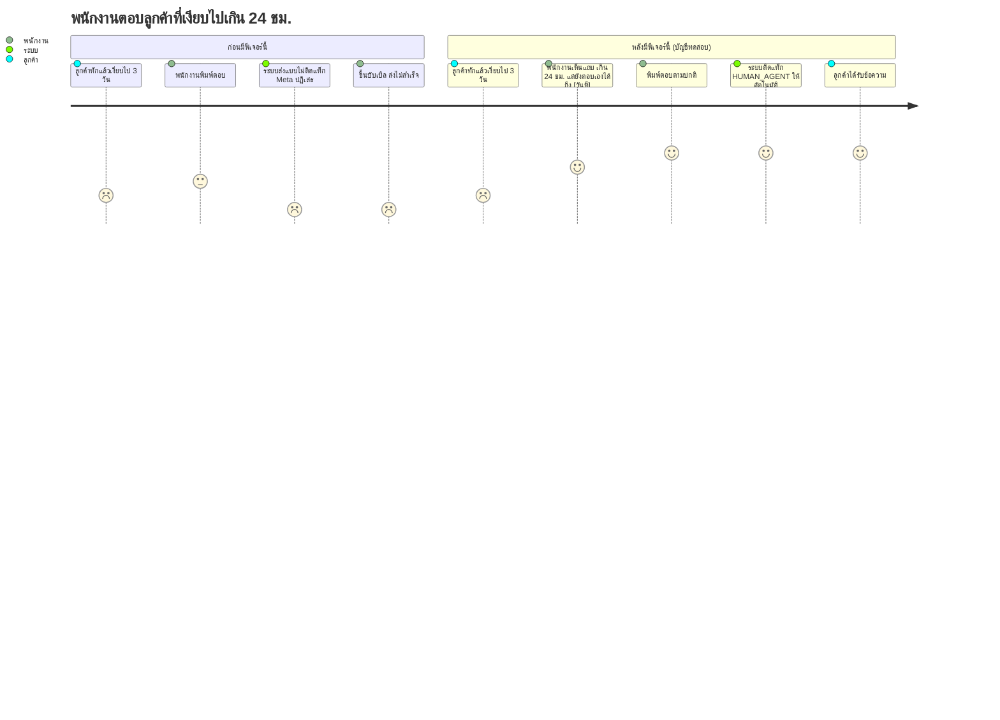
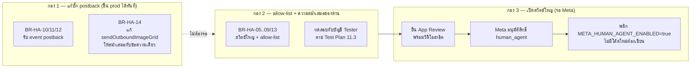

> **โมดูล:** 00043-HumanAgent
> **ประเภทเอกสาร:** Product Requirements Document (PRD)
> **เวอร์ชัน:** 1.0
> **วันที่จัดทำ:** 2026-08-10
> **สถานะ:** Draft — รอ user review
> **เจ้าของเอกสาร:** BA + PO + PM

# PRD: ตอบแชทลูกค้าเกิน 24 ชั่วโมง (Facebook/Instagram Human Agent)

---

## Executive Summary

Deep มีกล่องแชทรวม Facebook Messenger + Instagram มาแล้วตั้งแต่ feature 00018 พร้อมกลไก
"หน้าต่างเวลาตอบกลับ" ที่ถูกต้องตามนโยบาย Meta ครบทั้งสองชั้น — ตอบอิสระได้ 24 ชั่วโมงนับจาก
ข้อความล่าสุดของลูกค้า และตอบต่อได้เอง (คนพิมพ์เท่านั้น) อีกถึง 7 วันถ้าติดแท็ก `HUMAN_AGENT`
กับข้อความที่ส่งออกไป **โค้ดส่วนนี้เขียนไว้ครบและใช้งานได้จริงทางเทคนิคแล้ว** แต่ถูกปิดไว้ด้วย
environment variable ตัวเดียว (`META_HUMAN_AGENT_ENABLED`) เพราะ Deep ยังไม่เคยยื่นขอสิทธิ์
`human_agent` จาก Meta App Review เลย (ตรวจสดจาก App Dashboard: มี 17 permission แต่ไม่มี
Human Agent อยู่เลยสักบรรทัด)

ผลที่เกิดขึ้นจริงบน prod ทุกวันนี้: เมื่อลูกค้าเงียบไปเกิน 24 ชั่วโมง (นอนหลับ ไปธุระ นอกเวลาทำการ
ของร้าน) แล้วพนักงานพิมพ์ตอบ ระบบจะยิงข้อความไปแบบไม่ติดแท็ก ปล่อยให้ Meta เป็นคนตัดสินและ
ปฏิเสธ ขึ้นเป็นบับเบิล "ส่งไม่สำเร็จ" — ร้านเสียโอกาสตอบลูกค้าที่ยังสนใจอยู่ ทั้งที่ Meta อนุญาตให้
ตอบได้จริงถ้ามีสิทธิ์นี้

ฟีเจอร์นี้ทำ 3 อย่างพร้อมกัน: **(1)** เปิดสิทธิ์ตอบเกิน 24 ชม. (ถึง 7 วัน) แบบควบคุมความเสี่ยงได้
— ทดสอบบน prod จริงได้ทันทีโดยจำกัดผลกระทบเฉพาะบัญชีที่กำหนดไว้ล่วงหน้า (allow-list) เพราะ
Deep ไม่มีสภาพแวดล้อม staging แยกจาก prod **(2)** แก้บั๊กที่มีอยู่ก่อน: ปุ่ม/quick reply ที่ลูกค้ากด
(`postback`) ไม่ถูกนับเป็นการติดต่อของลูกค้าเลย ทำให้หน้าต่างเวลาไม่ถูกยืดออกทั้งที่ Meta อนุญาต
ให้ยืด — อาการเดียวกับบั๊ก `referral` ที่เคยแก้ไปแล้วเมื่อ 2026-08-02 **(3)** ทำให้ทุกช่องทางส่ง
ข้อความออก (ข้อความเดี่ยว + ชุดรูปภาพ) ใช้กติกา "คนพิมพ์เองเท่านั้น" ชุดเดียวกันอย่างสม่ำเสมอ —
วันนี้พบว่าฟังก์ชันส่งชุดรูปภาพ (`sendOutboundImageGrid`) ยังบล็อกฝั่งเราเองทันทีเมื่อหน้าต่างปิด
โดยไม่ให้ Meta ได้ตัดสินเลย ซึ่งขัดกับมติที่ตัดสินใจไปแล้วเมื่อ 2026-08-03 สำหรับข้อความเดี่ยว

งานทั้งสามอย่างแบ่งเป็น 3 กองที่ **ไม่ต้องรอกัน** (ดู §11.2 Roadmap) — กองแก้บั๊ก postback และ
ความสม่ำเสมอของช่องทางส่งขึ้น prod ได้ทันทีเพราะเป็นการแก้ให้ตรงกับพฤติกรรมที่ตัดสินใจไว้แล้ว
ไม่ใช่การเปิดสิทธิ์ใหม่ ส่วนการเปิดสวิตช์ใหญ่ให้ลูกค้าทุกคนใช้ได้ต้องรอ Meta อนุมัติสิทธิ์ก่อนเท่านั้น

---

## 1. Business Goals & KPIs

### 1.1 เป้าหมายทางธุรกิจ

| เป้าหมาย | รายละเอียด |
|----------|-----------|
| **ไม่เสียลูกค้าที่หายไปแล้วกลับมา** | ลูกค้าที่ทักแล้วเงียบไป 1-6 วันคือคนที่แสดงความสนใจแล้ว ไม่ใช่ลูกค้าใหม่ที่ต้องหาใหม่ — วันนี้ร้านตอบไม่ได้เลยถ้าเกิน 24 ชม. |
| **ปิดบั๊กที่ทำให้หน้าต่างเวลาแคบกว่าที่ Meta อนุญาตจริง** | ลูกค้ากดปุ่ม/quick reply แล้วระบบไม่นับเป็นการติดต่อ ร้านเห็นว่า "หมดเวลาแล้ว" ทั้งที่ Meta ยังให้ตอบได้ |
| **ทดสอบสิทธิ์ใหม่บน prod ได้อย่างปลอดภัย** | Deep ไม่มี staging แยกจาก prod — ต้องพิสูจน์ระบบทำงานถูกต้องก่อนยื่น App Review โดยไม่กระทบเธรดของลูกค้าจริงแม้แต่ห้องเดียว |
| **เตรียมความพร้อมสำหรับ App Review** | Meta ต้องการวิดีโอสาธิตการใช้งานจริงประกอบใบสมัครสิทธิ์ `human_agent` — ต้องมีระบบที่ทดสอบผ่านแล้วก่อนถึงจะถ่ายวิดีโอได้ |
| **ทำให้นโยบาย "คนพิมพ์เองเท่านั้น" สม่ำเสมอทุกช่องทางส่ง** | กันไม่ให้ช่องทางส่งข้อความใหม่ในอนาคต (เช่นชุดรูปภาพ) หลุดเปิดสิทธิ์ 7 วันให้ระบบอัตโนมัติโดยไม่ตั้งใจ |

### 1.2 ตัวชี้วัดความสำเร็จ (KPIs)

| KPI | สูตร/วิธีวัด | เป้าหมาย |
|-----|----------|---------|
| **อัตราส่งสำเร็จของข้อความที่ส่งหลัง 24 ชม.** | (ข้อความที่ `ChatMessage.deliveryStatus ≠ FAILED` ที่ส่งขณะหน้าต่าง 24 ชม. ปิด ÷ ข้อความทั้งหมดที่พยายามส่งขณะหน้าต่าง 24 ชม. ปิด) × 100 — วัดเฉพาะเธรดที่อยู่ในหน้าต่าง 7 วันและมีสิทธิ์ Human Agent | เพิ่มขึ้นชัดเจนจาก baseline ปัจจุบัน (เกือบ 0% สำเร็จ เพราะไม่มีแท็ก) เป็น ≥ 80% หลังสิทธิ์ผ่านและเปิดใช้เต็มรูป |
| **postback ที่ยืดหน้าต่างสำเร็จ** | (event `postback` จากลูกค้าที่ทำให้ `Conversation.lastInboundAt` ขยับ ÷ event `postback` จากลูกค้าทั้งหมดที่รับเข้ามา) × 100 | 100% (ปัจจุบัน 0% — ไม่มีโค้ดรับเลย) |
| **จำนวนครั้งที่บอท/auto-reply พยายามส่งนอกหน้าต่าง 24 ชม. แล้วหลุดผ่าน (ติดแท็กได้)** | นับจาก log/เทส ที่ `sentByHuman=false` แต่ `messageTag='HUMAN_AGENT'` ถูกตั้งค่าจริง | 0 ครั้ง — ไม่มีเกณฑ์ผ่อนผัน (นโยบาย Meta ห้ามเด็ดขาด) |
| **ความสม่ำเสมอของช่องทางส่ง** | จำนวนฟังก์ชันส่งข้อความออก (ข้อความเดี่ยว, ชุดรูปภาพ) ที่ใช้เกณฑ์ "คนพิมพ์เอง" + พฤติกรรม "พยายามส่งแล้วให้ Meta ตัดสิน" ตรงกัน ÷ ฟังก์ชันส่งข้อความออกทั้งหมด | 100% (ปัจจุบัน 1/2 — เฉพาะข้อความเดี่ยว) |
| **ความคืบหน้าใบสมัคร App Review `human_agent`** | สถานะใบสมัครใน App Dashboard | ยื่นสำเร็จพร้อมวิดีโอสาธิต ภายในสิ้น phase นี้ |

---

## 2. User Personas (กลุ่มผู้ใช้งาน)

### 2.1 พนักงาน/เจ้าของร้านที่ตอบแชท — `ShopMember` (Primary)

**ข้อมูลพื้นฐาน:**
- ครอบคลุมทั้งเจ้าของร้าน **PERSONAL** (ไม่มีแถว `ShopMember` แต่เข้าถึงร้านตัวเองได้เสมอ) เจ้าของ
  ร้าน **BUSINESS** และ **staff ที่ถูกเชิญเข้าร้าน BUSINESS** (บทบาท ADMIN) — ทั้งสามกลุ่มใช้ด่าน
  สิทธิ์เดียวกัน (`canAccessShop`) ไม่มีสิทธิ์ระดับใหม่แยกสำหรับฟีเจอร์นี้
- นั่งตอบแชทที่ `/inbox` เป็นงานประจำ มีทั้งเธรดสดและเธรดที่ค้างหลายวัน

**เป้าหมาย:**
- อยากตอบลูกค้าที่หายไปหลายวันได้ ไม่อยากเห็นบับเบิล "ส่งไม่สำเร็จ" ทั้งที่ตั้งใจช่วยลูกค้าจริง

**ความต้องการ:**
- พิมพ์และกดส่งตามปกติ ไม่อยากมีขั้นตอน/โหมดพิเศษที่ต้องเลือกเอง
- อยากรู้ชัดว่าเธรดนี้เหลือเวลาตอบอีกกี่วัน ก่อนหมดสิทธิ์ถาวร

**จุดปวด (Pain Points):**
- ส่งข้อความไปแล้วโดนปฏิเสธเงียบ ๆ โดยไม่รู้ว่าทำไม
- ไม่รู้ว่าอันไหน "เกินเวลาแล้วจริง" กับอันไหน "ระบบยังไม่รู้ว่าลูกค้าเพิ่งกดปุ่มมา"

### 2.2 ลูกค้า Facebook/Instagram (Secondary)

**ข้อมูลพื้นฐาน:**
- ทักเพจหรือกดปุ่ม CTA/quick reply แล้วไม่ได้อยู่คุยต่อทันที (นอกเวลาทำการ ไปธุระ ลืม)

**เป้าหมาย:**
- อยากได้คำตอบเมื่อร้านว่าง แม้จะผ่านไปหลายวันแล้ว

**ความต้องการ:**
- การกดปุ่ม/quick reply ควรถูกนับว่า "ฉันเพิ่งมีปฏิสัมพันธ์" เหมือนพิมพ์ข้อความ

**จุดปวด (Pain Points):**
- กดปุ่มแล้วเงียบ ไม่มีใครตอบ เพราะร้านเข้าใจผิดว่าหมดเวลาคุยแล้ว

---

## 3. User Stories & Business Requirements

> รหัส `BR-HA-xx` = Business Requirement ระดับฟีเจอร์ของโมดูล 00043 (สอดคล้องกับ
> `FR-HA-01..11` ในเอกสาร BRD — BR ที่นี่คือความต้องการเชิงธุรกิจ ส่วน FR ใน BRD คือรายละเอียด
> เชิงฟังก์ชันพร้อม Acceptance Criteria)

**User Story ระดับฟีเจอร์:**
> ในฐานะพนักงานร้านที่ตอบแชท ฉันต้องการตอบลูกค้าที่เงียบไปเกิน 24 ชั่วโมงได้ (สูงสุด 7 วัน)
> เพื่อไม่ให้เสียโอกาสขายจากลูกค้าที่ยังสนใจอยู่จริง โดยไม่ต้องเรียนรู้ขั้นตอน/โหมดใหม่

> ในฐานะทีมพัฒนา ฉันต้องการทดสอบสิทธิ์นี้บน prod ได้จริงกับบัญชีที่กำหนดไว้ล่วงหน้าเท่านั้น
> เพื่อพิสูจน์ว่าระบบทำงานถูกต้องก่อนยื่นขอสิทธิ์จาก Meta โดยไม่กระทบลูกค้าจริงแม้แต่คนเดียว

### 3.1 หน้าต่างเวลาตอบกลับ (Baseline — มีอยู่แล้ว เอกสารนี้เป็น SSOT อ้างอิงตาม Hard Rule 16)

**ความต้องการ:**
- ระบบต้องมีหน้าต่างเวลา 2 ชั้น นับจากจุดเดียวกัน (เวลาที่ลูกค้าติดต่อล่าสุด): ตอบอิสระได้ 24 ชม. และ
  ตอบต่อได้เอง (คนพิมพ์เท่านั้น) อีกถึง 7 วัน

**Business Rules:**
- **BR-HA-01** — หน้าต่างทั้งสองคำนวณจากค่าเดียวกัน (เวลาที่ลูกค้าติดต่อล่าสุด) ห้ามมีนิยามคู่ขนาน
- **BR-HA-02** — ข้อความที่ระบบส่งอัตโนมัติ (บอท/auto-reply) ห้ามส่งนอกหน้าต่าง 24 ชม. เด็ดขาด
  ไม่มีข้อยกเว้นไม่ว่าจะผ่าน App Review แล้วหรือไม่ก็ตาม
- **BR-HA-03** — เฉพาะข้อความที่คนพิมพ์เอง (ไม่ใช่ระบบ) เท่านั้นที่มีสิทธิ์ใช้ช่วง 7 วัน
- **BR-HA-04** — การกระทำของลูกค้าที่ทำให้หน้าต่างยืดออก ต้องเขียนเวลาใหม่เฉพาะเมื่อ **ใหม่กว่า**
  เวลาที่เก็บไว้เดิม กัน event ที่มาสลับลำดับดันเวลาถอยหลัง

**เหตุผล:**
- นี่คือนโยบาย Messaging ของ Meta ตรงตัว ละเมิดแล้วเสี่ยงเพจ/แอปถูกจำกัดสิทธิ์ส่งข้อความหรือถูก
  ระงับทั้งระบบ

### 3.2 เปิดสิทธิ์ตอบเกิน 24 ชม. แบบควบคุมความเสี่ยง (ใหม่)

**ความต้องการ:**
- เปิดสิทธิ์ Human Agent ให้ทดสอบบน prod ได้จริง โดยจำกัดผลกระทบเฉพาะบัญชีลูกค้าที่กำหนดไว้
  ล่วงหน้า ก่อนที่ Meta จะอนุมัติสิทธิ์ให้ใช้กับลูกค้าทุกคน

**Business Rules:**
- **BR-HA-05** — มีสวิตช์ใหญ่ระดับระบบ (เปิด/ปิดทั้งหมด) แยกจากสวิตช์ทดสอบรายบัญชี
- **BR-HA-06** — สวิตช์ทดสอบระบุด้วย **บัญชีปลายทางของลูกค้า** (PSID/IGSID) ไม่ใช่ด้วยเพจหรือร้าน
  เพราะสิ่งที่กำหนดว่าใช้สิทธิ์ได้คือ "ใครเป็นคู่สนทนา" ไม่ใช่ "เพจไหนเชื่อมอยู่"
- **BR-HA-07** — ค่าเริ่มต้นเมื่อไม่ได้ตั้งค่าอะไรเลย ต้องเป็น **ปิดสนิท** เหมือนวันนี้ (fail-closed)
- **BR-HA-08** — การเปลี่ยนรายชื่อบัญชีทดสอบ/สวิตช์ใหญ่ ต้อง deploy ใหม่จึงมีผล (เป็นค่าระดับ
  environment ไม่ใช่ค่าในฐานข้อมูล)
- **BR-HA-09** — ทุกจุดที่ตัดสินใจว่า "เธรดนี้ใช้สิทธิ์ Human Agent ได้ไหม" ต้องใช้ตรรกะเดียวกัน ทั้ง
  ฝั่งที่ส่งข้อความจริงและฝั่งที่แสดงผลบนหน้าจอ (ห้ามหน้าจอบอกว่าใช้ได้ แต่ส่งจริงแล้วไม่ได้ หรือ
  กลับกัน) — วันนี้มีจุดคำนวณอยู่ 3 แห่ง (ส่งข้อความเดี่ยว, ส่งชุดรูปภาพ, แสดงผลแถบสถานะเธรด)
  ต้องแก้ให้สอดคล้องกันทั้งหมด

**เหตุผล:**
- Deep ไม่มี staging แยกจาก prod — การพิสูจน์ว่าระบบทำงานถูกต้องก่อนยื่น App Review (ซึ่งต้องมี
  วิดีโอสาธิตการใช้งานจริง) ต้องทำบน prod จริง วิธีเดียวที่ปลอดภัยคือจำกัด blast radius ด้วย
  allow-list ไม่ใช่เปิดทั้งระบบแล้วหวังว่าจะไม่มีอะไรผิดพลาด

### 3.3 Postback ต้องยืดหน้าต่างเหมือนข้อความ (แก้บั๊กที่มีอยู่ก่อน)

**ความต้องการ:**
- เมื่อลูกค้ากดปุ่ม (Get Started, quick reply, ปุ่มในการ์ด) ระบบต้องถือว่าเป็นการติดต่อของลูกค้า
  เท่ากับการพิมพ์ข้อความ

**Business Rules:**
- **BR-HA-10** — event ปุ่มกด (`postback`) จากลูกค้าต้องยืดหน้าต่างทั้ง 24 ชม. และ 7 วัน ด้วยกติกา
  เดียวกับ BR-HA-04
- **BR-HA-11** — ปุ่มที่มาจากฝั่งเพจเอง (ถ้ามี) ห้ามยืดหน้าต่างให้ตัวเอง
- **BR-HA-12** — event ที่มาทางช่องทาง `standby` (ห้องที่ Deep ไม่ใช่เจ้าของเธรด เช่นตอน Meta AI
  ถือสิทธิ์อยู่) และไม่มี payload ติดมา ต้องไม่ทำให้ระบบล้ม — ระบบรับรู้แค่ "มีปฏิสัมพันธ์เกิดขึ้น"

**เหตุผล:**
- เอกสาร Meta Messaging Policy ระบุตรงตัวว่าการกดปุ่ม CTA เปิดหน้าต่างเท่ากับการส่งข้อความ อาการ
  ที่เกิดจากบั๊กนี้เหมือนกับบั๊ก `referral` ที่แก้ไปแล้วเมื่อ 2026-08-02 เป๊ะ (ลูกค้าโต้ตอบแล้วระบบขึ้น
  ว่าหมดเวลา) เพียงมาจากทางเข้าคนละทาง — **เป็นบั๊กแก้ไขล้วน ไม่ต้องรอ Meta อนุมัติอะไรเลย**

### 3.4 ความสม่ำเสมอของนโยบายในทุกช่องทางส่งออก

**ความต้องการ:**
- ทุกฟังก์ชันที่ส่งข้อความออกไปหาลูกค้า (ข้อความเดี่ยว, ชุดรูปภาพ, และช่องทางที่จะเพิ่มในอนาคต)
  ต้องบังคับกติกา "คนพิมพ์เองเท่านั้นที่ใช้สิทธิ์ 7 วันได้" แบบเดียวกัน

**Business Rules:**
- **BR-HA-13** — ทุกจุดส่งข้อความต้องเช็คว่าเป็นคนพิมพ์เอง (ไม่ใช่ระบบอัตโนมัติ) ก่อนพิจารณาใช้
  สิทธิ์ 7 วัน — ห้ามพึ่งแค่ชนิดของพารามิเตอร์ในโค้ด (type safety) เป็นเพียงด่านเดียว
- **BR-HA-14** — เมื่อหน้าต่างปิดและไม่มีสิทธิ์ใช้ต่อ (ไม่ว่าเพราะเกิน 7 วันจริง หรือสวิตช์ยังปิดอยู่)
  ทุกช่องทางส่งต้อง**พยายามส่งแล้วปล่อยให้ Meta เป็นคนตัดสิน** (ไม่บล็อกฝั่งเราเองก่อนแล้วไม่ให้
  ลองเลย) — สอดคล้องกับมติที่ตัดสินใจไปแล้วสำหรับข้อความเดี่ยวเมื่อ 2026-08-03

**เหตุผล:**
- วันนี้พบว่าฟังก์ชันส่งข้อความเดี่ยวกับฟังก์ชันส่งชุดรูปภาพมีพฤติกรรมไม่ตรงกัน — ชุดรูปภาพยังบล็อก
  ฝั่งเราเองทันทีเมื่อหน้าต่างปิด (ของเก่าก่อนมติ 2026-08-03) ทำให้ร้านไม่มีโอกาสให้ Meta ตัดสินเลย
  แม้ Meta จะยอมรับก็ตาม — ต้นทุนในการปล่อยให้ Meta ตัดสินต่ำกว่าการบล็อกผิดพลาดมาก

---

## 4. Business Rules & Constraints

### 4.1 กฎทางธุรกิจหลัก

| กฎ | คำอธิบาย |
|----|----------|
| **สิทธิ์ 7 วันใช้ได้เฉพาะข้อความที่ "คนพิมพ์เอง"** | บอท/AI/auto-reply ห้ามใช้เด็ดขาด — เสี่ยงแอปถูกระงับถ้าฝ่าฝืน (นโยบาย Meta ระบุชัด) |
| **ห้ามส่งเนื้อหาการตลาด/โปรโมชันผ่านสิทธิ์นี้** | Human Agent ใช้ได้เฉพาะการช่วยเหลือลูกค้าที่ยังคุยค้างอยู่ — ผิดวัตถุประสงค์แล้ว Meta ตรวจจับได้และลงโทษได้ถึงระดับแอป |
| **allow-list กำหนดด้วยบัญชีปลายทาง ไม่ใช่เพจ** | กันไม่ให้ลูกค้าจริงที่ทักเพจทดสอบโดนยิงแท็กไปด้วยระหว่างทดสอบ |
| **ไม่มี UI แยกให้เลือก "โหมด Human Agent"** | พนักงานพิมพ์และกดส่งตามปกติ ระบบเลือกใช้แท็กให้อัตโนมัติตามสถานะเธรด — คงพฤติกรรมเดิมที่ตัดสินใจไปแล้วเมื่อ 2026-08-03 ว่าไม่ล็อก UI ตามค่าที่อาจไม่แม่นยำ |
| **ทุกกลุ่ม `ShopMember` (PERSONAL owner / BUSINESS owner / staff) ใช้สิทธิ์นี้ได้เท่ากัน** | ไม่มีสิทธิ์ระดับใหม่แยกสำหรับฟีเจอร์นี้ — ใช้ด่าน `canAccessShop` เดิมที่ครอบทั้งสามกลุ่มอยู่แล้ว |

### 4.2 ข้อจำกัดทางธุรกิจ

| ข้อจำกัด | รายละเอียด |
|---------|-----------|
| **ต้องรอ Meta อนุมัติสิทธิ์ `human_agent` ก่อนเปิดใช้กับลูกค้าทุกคน** | ต้องผ่าน App Review + Business Verification — ธุรกิจควบคุมกำหนดเวลาไม่ได้ |
| **ทดสอบก่อนอนุมัติได้เฉพาะกับบัญชีที่มีบทบาทบนแอป (Tester/Developer/Admin)** | ตามเอกสาร Meta เรื่อง Standard Access — ไม่ใช่ลูกค้าทั่วไป และ**ผลการทดสอบกับ Tester ไม่ได้แปลว่าใช้ได้กับลูกค้าจริงเสมอไป** (ดู §11.1 G-1) |
| **ส่งได้สูงสุด 7 วันเท่านั้น ไม่มีทางขยายต่อ** | เกิน 7 วันแล้วคือปิดถาวร Meta ไม่มีกลไกขยายให้ไม่ว่ากรณีใด |
| **ไม่มีหน้าจอจัดการ allow-list ในแอป** | ตั้งค่าผ่าน environment variable โดยทีมพัฒนาเท่านั้น เป็นกลไกชั่วคราวสำหรับช่วงทดสอบก่อนได้รับอนุมัติ |

### 4.3 เหตุผลที่ระบบปฏิเสธการส่ง (ต่อยอดจากที่มีอยู่ใน 00018)

| เหตุผล | ความหมายสำหรับร้าน |
|---|---|
| เกิน 24 ชม. และยังไม่มีสิทธิ์ Human Agent (สวิตช์ปิด/ไม่อยู่ใน allow-list) | ต้องรอให้ลูกค้าทักเข้ามาใหม่ก่อน |
| เกิน 24 ชม. แต่มีสิทธิ์ Human Agent และยังอยู่ในหน้าต่าง 7 วัน | ส่งได้ ต้องเป็นข้อความที่พิมพ์เอง ห้ามส่งโปรโมชัน |
| เกิน 7 วันแล้ว | หมดสิทธิ์ถาวร ไม่มีทางส่งได้อีกจนกว่าลูกค้าจะทักเข้ามาใหม่ |
| ลูกค้ากดปุ่ม/quick reply | นับเป็นการติดต่อ ยืดหน้าต่างเหมือนพิมพ์ข้อความ (บั๊กเดิมที่แก้ในฟีเจอร์นี้) |

---

## 5. Out of Scope (นอกขอบเขต)

| หัวข้อ | คำอธิบาย |
|--------|----------|
| **ส่งข้อความหลัง 7 วัน** | Meta ไม่มีกลไกอนุญาตไม่ว่ากรณีใด ไม่ใช่ข้อจำกัดของ Deep |
| **ส่งเนื้อหาการตลาด/โปรโมชันผ่านสิทธิ์ Human Agent** | ผิดวัตถุประสงค์ของสิทธิ์นี้ตามนโยบาย Meta — เสี่ยงแอปถูกระงับ |
| **`messaging_optins` (Send-to-Messenger / Checkbox plugin)** | ไม่มีร้านใดใช้ปลั๊กอินนี้อยู่ในปัจจุบัน ไม่ subscribe ทั้งสองชั้น (แอป+เพจ — ตรวจแล้วไม่มีอยู่ใน `MESSENGER_SUBSCRIBED_FIELDS` เลย) และไม่มีโค้ดรับเลยสักบรรทัด — เพิ่มเข้ามาตอนนี้คือสร้างโครงสร้างใหม่ 3 ชั้นทั้งหมดสำหรับสิ่งที่ไม่มีใครใช้ พิจารณาใหม่เมื่อมีร้านต้องการปลั๊กอินนี้จริง |
| **LINE** | ไม่มีแนวคิดหน้าต่าง 24 ชม./7 วันแบบนี้ในโปรโตคอลของ LINE (ใช้ reply token 60 วินาที + push message แยกกัน) |
| **หน้าจอจัดการ allow-list ในแอป** | ตั้งค่าผ่าน environment variable ชั่วคราวช่วงทดสอบเท่านั้น |
| **ปุ่ม/แถบเตือนบอกร้านว่า "ข้อความนี้ใช้สิทธิ์ Human Agent"** | Meta แนบ tag ไปกับ request เอง ร้านไม่จำเป็นต้องรู้ระดับเทคนิคนี้ — แถบสถานะหน้าต่างที่มีอยู่แล้วบอกครบเพียงพอ |
| **การแก้ไข/ตามให้ตรงกันในแอปมือถือผู้ขาย (deep-mobile-seller)** | นอกขอบเขตของรอบนี้ — บันทึกเป็น known gap (§11.1 G-5) ให้ตรวจสอบภายหลัง ไม่ใช่ scope ที่ต้องปิดตอนนี้ |

---

## 6. Risks & Mitigation (ความเสี่ยงและแนวทางแก้ไข)

### 6.1 ความเสี่ยงทางธุรกิจ

| ความเสี่ยง | ผลกระทบ | ระดับความรุนแรง | แนวทางแก้ไข |
|-----------|---------|-----------------|-------------|
| ร้านใช้สิทธิ์ Human Agent ส่งข้อความการตลาด/สแปม | สูง — Meta ตรวจจับได้และอาจระงับแอปทั้งระบบ ไม่ใช่แค่เพจนั้น | สูง | ด่านโค้ดกันบอท/auto-reply อยู่แล้ว (BR-HA-02/13) + UI มีข้อความเตือน "ห้ามส่งโปรโมชัน" อยู่แล้วในแถบสถานะเธรด |
| ทดสอบบน prod แล้วกระทบเธรดของลูกค้าจริงโดยไม่ตั้งใจ | สูง — เสียหายต่อลูกค้าจริงระหว่างทดสอบ | สูง | allow-list ผูกกับ PSID ของบัญชีทดสอบ (บัญชี Tester/Dev ของแอป) เท่านั้น + fail-closed เมื่อไม่ได้ตั้งค่า |
| App Review ใช้เวลานานกว่าคาด | กลาง — ฟีเจอร์ค้างในสถานะทดสอบนาน | กลาง | ไม่กระทบธุรกิจปัจจุบัน (พฤติกรรมเดิมก่อนฟีเจอร์นี้ยังคงอยู่สำหรับลูกค้าทั่วไป) — กอง 1/2 ของ roadmap ขึ้น prod ได้โดยไม่ต้องรอ |

### 6.2 ความเสี่ยงทางเทคนิค

รายการเต็มพร้อมรายละเอียด อยู่ที่ **§11.1 Known Gaps** — สรุปย่อที่นี่:

| ความเสี่ยง | ผลกระทบ | แนวทางแก้ไข |
|-----------|---------|-------------|
| ทดสอบผ่านกับ Tester ≠ ใช้ได้กับลูกค้าจริงเสมอ | กลาง–สูง | ดู G-1 |
| นาฬิกา 7 วันที่ derive จากคอลัมน์เดียวกับ 24 ชม. ยังเป็นข้อสันนิษฐาน ไม่ใช่ข้อเท็จจริงที่ยืนยันกับ Meta แล้ว | กลาง | ดู G-2 |
| เธรดที่ Meta AI ถือสิทธิ์อยู่ (`standby`) ยังไม่รู้ว่าส่งผ่านได้ไหม | กลาง | ดู G-3 |
| `GRAPH_VERSION` (`v21.0`) ใกล้ deprecate หรือยังไม่ทราบ | ต่ำ–กลาง | ดู G-4 |
| แอปมือถือผู้ขายอาจต้องตามแก้ | ต่ำ | ดู G-5 |

---

## 7. Glossary (อภิธานศัพท์)

| คำศัพท์ | ความหมาย |
|---------|----------|
| **หน้าต่าง 24 ชั่วโมง** | ช่วงเวลาที่เพจส่งข้อความได้อิสระ นับจากข้อความล่าสุดของลูกค้า |
| **หน้าต่าง 7 วัน (Human Agent)** | ช่วงเวลาที่คนพิมพ์เองส่งข้อความต่อได้ (ติดแท็ก `HUMAN_AGENT`) แม้พ้น 24 ชม. แล้ว นับจากจุดเดียวกับหน้าต่าง 24 ชม. |
| **MESSAGE_TAG / HUMAN_AGENT** | รูปแบบการส่งข้อความของ Meta ที่อนุญาตให้ส่งนอกหน้าต่างปกติได้ ต้องมีสิทธิ์ (permission) จาก App Review ก่อน |
| **PSID / IGSID** | รหัสประจำตัวลูกค้าฝั่ง Messenger/Instagram ที่ Deep ใช้อ้างอิงคู่สนทนา (`ExternalContact.externalUserId`) |
| **postback** | event ที่ Meta ส่งเข้ามาเมื่อลูกค้ากดปุ่ม (Get Started/quick reply/ปุ่มในการ์ด) |
| **referral** | event ที่ Meta ส่งเข้ามาเมื่อลูกค้าคลิกโฆษณา/ลิงก์ m.me — ยืดหน้าต่างเช่นกัน (แก้ไปแล้วก่อนหน้านี้) |
| **standby** | ช่องทางที่ Meta ส่ง event ของห้องที่ Deep ไม่ใช่เจ้าของเธรด (เช่นตอน Meta AI ถือสิทธิ์อยู่) |
| **App Review / Business Verification** | กระบวนการขอสิทธิ์และยืนยันตัวตนธุรกิจกับ Meta ก่อนใช้สิทธิ์ระดับสูงกับผู้ใช้ทั่วไปได้ |
| **Standard Access / Advanced Access** | ระดับสิทธิ์ของ Meta — Standard ใช้ได้เฉพาะกับคนที่มีบทบาทบนแอป (Tester/Dev/Admin), Advanced ใช้ได้กับผู้ใช้ทั่วไปหลังผ่านรีวิว |
| **allow-list (บัญชีทดสอบ)** | รายชื่อ PSID ที่อนุญาตให้ใช้สิทธิ์ Human Agent ได้ก่อนสิทธิ์อนุมัติเต็มรูป |
| **kill switch** | สวิตช์ปิด/เปิดระดับระบบทั้งหมด — ปิด = ปิดสนิทเหมือนวันนี้ |
| **`ShopMember`** | สมาชิกของร้าน BUSINESS ที่ถูกเชิญ (บทบาท OWNER/ADMIN) — เจ้าของร้าน PERSONAL ไม่มีแถวนี้แต่เข้าถึงร้านตัวเองได้เสมอผ่าน `canAccessShop` |

---

## 8. Success Metrics (ตัวชี้วัดความสำเร็จ)

| ตัวชี้วัด | ค่าที่คาดหวัง | วิธีวัด |
|----------|---------------|--------|
| ทดสอบด้วย allow-list สำเร็จ | ส่งข้อความจากบัญชี Tester ได้จริงหลังพ้น 24 ชม. อย่างน้อย 1 ครั้ง ก่อนยื่น App Review | ดูจาก `ChatMessage.deliveryStatus` ของเธรดทดสอบ |
| postback ยืดหน้าต่างถูกต้อง | เธรดที่ลูกค้ากดปุ่มหลัง 20+ ชม. เงียบ กลับมาอยู่ในหน้าต่างเปิดใหม่ | ตรวจ `Conversation.lastInboundAt` ก่อน/หลัง event postback |
| ความสม่ำเสมอของช่องทางส่งครบ 100% | ฟังก์ชันส่งข้อความเดี่ยว + ชุดรูปภาพ มีพฤติกรรมตรงกันทั้งเกณฑ์ "คนพิมพ์เอง" และ "พยายามส่งแล้วให้ Meta ตัดสิน" | เทส regression ยืนยัน + ตรวจโค้ดตรง |
| ไม่มี auto-reply/บอทหลุดไปใช้แท็ก | 0 เหตุการณ์ตลอดช่วงทดสอบ | เทส regression ผูกกับ `sentByHuman` |
| ยื่น App Review สำเร็จ | ใบสมัครสิทธิ์ `human_agent` ถูกส่งพร้อมวิดีโอสาธิต | สถานะใน App Dashboard |

---

## 9. Dependencies & Assumptions

### 9.1 สิ่งที่ต้องพึ่งพา (Dependencies)

| ระบบ/ส่วนประกอบ | ความสัมพันธ์ |
|-----------------|-------------|
| **feature 00018 (Facebook Chat Integration)** | โครงสร้างหน้าต่างเวลา/แท็ก/adapter มีอยู่แล้วทั้งหมด ฟีเจอร์นี้ต่อยอด ไม่สร้างใหม่ |
| **สิทธิ์ `human_agent` จาก Meta App Review** | ต้องผ่านก่อนเปิดสวิตช์ใหญ่ให้ทุกร้านใช้ได้ — ระหว่างรอ ใช้ allow-list แทน |
| **Business Verification ของแอป Deep Chat & LIVE** | อาจเป็นเงื่อนไขก่อนขอสิทธิ์ `human_agent` ได้ (ต้องตรวจสอบสถานะปัจจุบันก่อนยื่น) |
| **ความสามารถ deploy ใหม่ได้เมื่อแก้ environment variable** | Vercel — ตามที่ระบุไว้แล้วว่า push main = migrate/deploy prod ในตัว |

### 9.2 สมมติฐาน (Assumptions)

| # | สมมติฐาน | ถ้าผิดจะเกิดอะไร |
|---|---|---|
| A-1 | react/referral/postback ที่ยืด `lastInboundAt` จะยืดหน้าต่าง 7 วันไปพร้อมกับ 24 ชม. เพราะคำนวณจากคอลัมน์เดียวกัน | ถ้า Meta ตีความว่า reset เฉพาะ 24 ชม. แต่ไม่ reset 7 วัน หน้าจอจะบอกว่าส่งได้แต่ Meta ปฏิเสธจริง — ต้องพิสูจน์ระหว่างทดสอบ allow-list ก่อนยื่น App Review (ดู §11.3 Test Plan) |
| A-2 | บัญชี Tester/Developer/Admin ของแอป Meta ทดสอบสิทธิ์ Standard Access ได้จริงตามที่เอกสาร Meta ระบุ (คนที่มีบทบาทบนแอป) | ถ้าไม่ได้จริง ต้องหาวิธีทดสอบอื่นก่อนยื่น App Review |
| A-3 | ผลการทดสอบกับบัญชี Tester (Standard Access) จะสะท้อนพฤติกรรมจริงกับลูกค้าทั่วไปหลังผ่าน Advanced Access | **ไม่แน่นอน** — เคยพบมาแล้วว่า endpoint บางตัวของ Meta ให้ผลต่างกันระหว่าง subject ที่มี role บนแอปกับที่ไม่มี (ดู G-1) ต้องระวังไม่สรุปเกินหลักฐาน |

---

## 10. Appendix

### 10.1 ตัวอย่าง User Journey

**Scenario: พนักงานตอบลูกค้าที่หายไป 3 วัน (หลัง allow-list เปิดใช้ให้บัญชีทดสอบ)**

### 10.2 ตัวอย่างเส้นทางที่สอง — postback แก้บั๊ก

1. ลูกค้ากด quick reply "สนใจสินค้า" ใต้ข้อความต้อนรับ แล้วไม่พิมพ์อะไรต่อ
2. **ก่อนแก้:** ระบบไม่นับ event นี้เป็นการติดต่อ → เธรดยังโชว์ "ยังไม่มีข้อความเข้า" หรือหน้าต่างไม่ยืด
3. **หลังแก้:** `Conversation.lastInboundAt` ขยับตามเวลาที่กดปุ่ม → พนักงานเห็นเธรดอยู่ในหน้าต่างเปิด
   ตอบได้ทันทีแบบข้อความปกติ (ไม่ต้องใช้สิทธิ์ 7 วันด้วยซ้ำ เพราะเพิ่งเกิดขึ้นสด)

---

## 11. Known Gaps & Roadmap

### 11.1 Known Gaps (ความเสี่ยง/ข้อจำกัดที่ยังไม่ปิดในรอบนี้)

| # | Gap | รายละเอียด | สถานะ |
|---|-----|-----------|-------|
| **G-1** | ทดสอบผ่านกับ Tester ≠ ใช้ได้กับลูกค้าจริงเสมอ | เอกสาร Meta ระบุ Standard Access "active for app users who have a role on the app" — เคยพบมาแล้วว่า endpoint บางตัวของ Meta ตอบต่างกันระหว่าง subject ที่มี role บนแอปกับลูกค้าทั่วไป (`docs/conventions/graph-access-depends-on-subject.md` — เคส `Business Asset User Profile Access`: ยิงหาลูกค้า 30 คนได้ 400 ครบ ยิงหาเจ้าของแอปได้ 200) ผลทดสอบ allow-list รอบนี้จึงเป็นหลักฐานว่า "กลไกทำงานถูกต้องทางเทคนิค" เท่านั้น ไม่ใช่หลักฐานว่า "ลูกค้าทั่วไปจะได้ผลเดียวกันหลัง Advanced Access ผ่าน" | OPEN — ยอมรับความเสี่ยงนี้ระหว่างทดสอบ ต้องเฝ้าดูอีกครั้งหลัง Advanced Access ผ่านจริง |
| **G-2** | นาฬิกา 7 วันที่ derive จากคอลัมน์เดียวกับ 24 ชม. ยังเป็นข้อสันนิษฐาน | `getWindowState()` คำนวณหน้าต่างทั้งสองจาก `lastInboundAt` เดียวกันตามโครงสร้างเดิม — แต่เอกสาร Meta ไม่ได้ยืนยันตรง ๆ ว่า react/referral/postback รีเซ็ตหน้าต่าง 7 วันไปพร้อมกับ 24 ชม.เสมอ (ดู A-1) | OPEN — ต้องพิสูจน์ระหว่าง Test Plan (§11.3) |
| **G-3** | เธรดที่ Meta AI ถือสิทธิ์อยู่ (`standby`) ยังไม่รู้ว่าส่งข้อความผ่านได้ไหมแม้เปิดสิทธิ์ Human Agent แล้ว | หนี้สืบทอดจาก feature ก่อนหน้า (memory `project_meta_ai_thread_standby`) — ไม่ใช่สิ่งที่ฟีเจอร์นี้ต้องแก้ แต่ต้องไม่ทำให้อาการแย่ลง | OPEN — carry จาก feature ก่อนหน้า |
| **G-4** | `GRAPH_VERSION = 'v21.0'` ยังไม่ตรวจสอบว่าใกล้ deprecate หรือยัง | ควรตรวจสอบ Meta Changelog ก่อนยื่น App Review เพื่อไม่ให้ทดสอบผ่านแล้วแต่ต้องย้าย version กลางทาง | OPEN — ตรวจก่อนยื่น App Review |
| **G-5** | แอปมือถือผู้ขาย (deep-mobile-seller) อาจต้องตามแก้ | แอปมือถือมี native push แจ้งเตือนแชท — ยังไม่ตรวจสอบว่าต้องรู้จักสถานะ Human Agent/แสดงแถบสถานะเดียวกันด้วยหรือไม่ | OPEN — ยังไม่ตรวจสอบขอบเขต ไม่ใช่ scope ของรอบนี้ |

### 11.2 Roadmap / ลำดับงาน (3 กอง — ไม่ต้องรอกัน)

- **กอง 1 — แก้บั๊ก postback (ไม่ต้องรอ Meta อนุมัติอะไรเลย ขึ้น prod ได้ทันที):** เป็นการแก้ไข
  ให้ตรงกับพฤติกรรมที่เอกสาร Meta ระบุไว้อยู่แล้ว (postback = การติดต่อของลูกค้า) และแก้ความไม่
  สม่ำเสมอที่มีอยู่ก่อน (`sendOutboundImageGrid`) ไม่ใช่การเปิดสิทธิ์ใหม่ ความเสี่ยงต่ำที่สุดในสามกอง
- **กอง 2 — allow-list + ความสม่ำเสมอของด่านนโยบาย:** ทำคู่ขนานกับกอง 1 ได้ แต่ยังไม่มีผลกับ
  ใครจนกว่า allow-list จะถูกตั้งค่าจริง (fail-closed ตาม BR-HA-07) — เมื่อพร้อมแล้วจึงเริ่ม Test
  Plan (§11.3) กับบัญชีทดสอบ
- **กอง 3 — เปิดสวิตช์ใหญ่ให้ทุกร้าน:** รอผลจาก Meta App Review เท่านั้น — เมื่อผ่านแล้วเป็นเพียง
  ขั้นตอนปฏิบัติการ (พลิกค่า environment variable + deploy) ไม่มีโค้ดใหม่ต้องเขียนเพิ่ม

### 11.3 Test Plan ก่อนยื่น App Review

1. เพิ่ม **"Human Agent"** เข้า use case ของแอป **Deep Chat & LIVE** ใน App Dashboard —
   **บันทึกผลว่าสิทธิ์ active ที่ Standard Access ทันทีหรือไม่** (ดู §11.5 Open Question)
2. มอบบทบาท Tester/Developer/Admin บนแอปให้บัญชีทดสอบที่จะสวมบทบาทลูกค้า
3. ให้บัญชีทดสอบทักเพจที่เชื่อมกับ Deep ตามปกติ (สร้างเธรดจริง)
4. ดึง PSID ของบัญชีทดสอบจากฐานข้อมูล (`ExternalContact.externalUserId`)
5. ตั้งค่า `META_HUMAN_AGENT_TEST_PSIDS` ให้มี PSID นั้น + deploy ใหม่ (ค่าจะมีผลหลัง deploy
   เท่านั้น ตาม BR-HA-08)
6. รอพ้น 24 ชั่วโมงจริง (ห้ามแก้เวลาในฐานข้อมูล prod เพื่อลัดขั้นตอน)
7. พนักงาน (ทีมพัฒนา สวมบทบาท `ShopMember` ของเพจทดสอบ) พิมพ์ตอบตามปกติ
8. ตรวจผลผ่าน `ChatMessage.deliveryStatus` และยืนยันว่าบัญชีทดสอบได้รับข้อความจริงในแอป
   Messenger/Instagram
9. ทดสอบซ้ำกับ postback: ให้บัญชีทดสอบกดปุ่ม/quick reply แล้วยืนยันว่า `Conversation.lastInboundAt`
   ขยับตามเวลาที่กดจริง
10. ทดสอบกรณี A-1 (G-2): ให้หน้าต่างยืดออกผ่าน react/referral/postback เพียงอย่างเดียว (ไม่มี
    ข้อความพิมพ์) แล้วลองส่งข้อความด้วยสิทธิ์ 7 วัน — บันทึกผลว่า Meta ยอมรับหรือปฏิเสธ เพื่อปิด
    ข้อสันนิษฐาน A-1
11. บันทึกผลทดสอบทั้งหมด (ภาพหน้าจอ + log) ไว้เป็นหลักฐานประกอบใบสมัคร

### 11.4 ขั้นตอนถ่ายวิดีโอสาธิต (สำหรับใบสมัคร App Review)

Meta กำหนดให้แนบวิดีโอสาธิตการใช้งานจริงประกอบใบสมัครสิทธิ์ — ผลิตได้หลัง Test Plan (§11.3)
ผ่านแล้วเท่านั้น เพราะต้องเป็นการสาธิตบนระบบที่ทำงานได้จริง ไม่ใช่ mockup:

1. เปิดเธรดของบัญชีทดสอบที่เงียบไปเกิน 24 ชั่วโมงแล้ว (ยังอยู่ในหน้าต่าง 7 วัน)
2. แสดงแถบสถานะที่บอกว่า "เกิน 24 ชม. แต่ยังตอบเองได้ถึง [วันที่]"
3. พนักงานพิมพ์ตอบตามปกติ (ไม่มีปุ่ม/โหมดพิเศษ) แล้วกดส่ง
4. แสดงว่าข้อความถึงบัญชีทดสอบจริงในแอป Messenger/Instagram
5. narration สั้น ๆ อธิบายว่านี่คือการช่วยเหลือลูกค้าที่ยังคุยค้างอยู่ (customer support use case)
   ไม่ใช่การส่งข้อความการตลาด — ตรงตามวัตถุประสงค์ที่ Meta อนุญาตให้ใช้สิทธิ์นี้
6. แนบวิดีโอไปกับใบสมัคร พร้อม instructions ภาษาอังกฤษ ตาม pattern เดียวกับที่ 00018 เคยทำ
   (`docs/20 - Features/00018 - Facebook Chat Integration/APP-REVIEW.md`)

### 11.5 Open Question (ห้ามเดา — ต้องตรวจกับ Meta Dashboard จริง)

ยังไม่ยืนยันว่าการเพิ่ม **"Human Agent"** เข้า use case ใน App Dashboard จะทำให้สิทธิ์ active ที่
Standard Access ได้ **ทันที** สำหรับบัญชีที่มีบทบาทบนแอป หรือต้อง**รอผลรีวิวก่อนแม้แต่การทดสอบ
ด้วย Tester** — ต้องตรวจสอบจาก Meta Dashboard จริงตอนทำขั้นตอนแรกของ Test Plan (§11.3 ข้อ 1)
แล้วบันทึกผลไว้ ถ้าต้องรอรีวิวก่อน แผนทดสอบทั้งหมดใน §11.3 ต้องเลื่อนออกไปจนกว่าจะได้รับ
อนุมัติเบื้องต้น และกอง 2 ของ Roadmap (§11.2) จะถูกบล็อกไปด้วย

---

**หมายเหตุ:**
เอกสารนี้เป็นการบันทึกความต้องการทางธุรกิจ (Business Requirements) โดยไม่มีรายละเอียดทางเทคนิค
สำหรับ Functional Requirements / User Story / Acceptance Criteria ระดับละเอียด ดู [[BRD]] ของโมดูลนี้
สำหรับ technical specification ดู [[SRS]] ของโมดูลนี้ (ยังไม่ได้จัดทำ — ทำหลัง PRD+BRD ผ่าน review ตาม Hard Rule 11)
