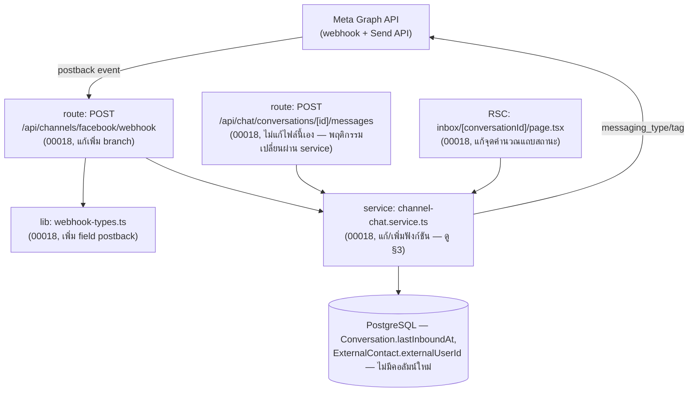
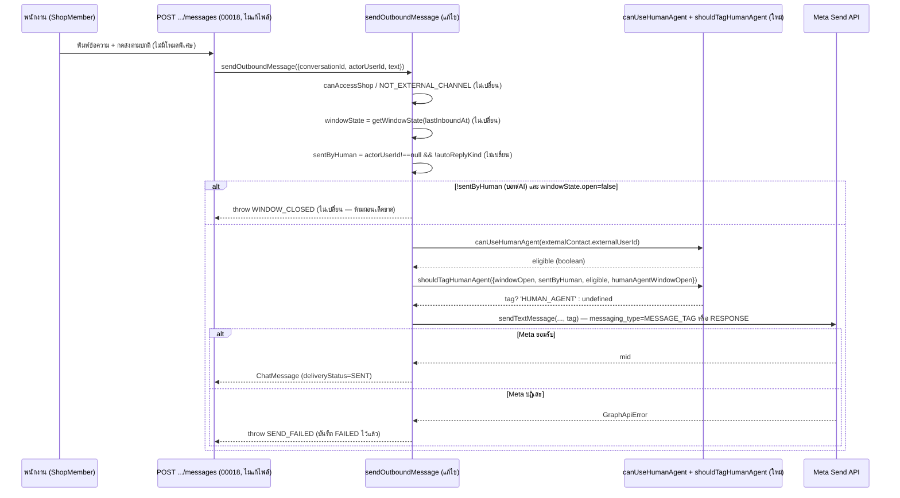
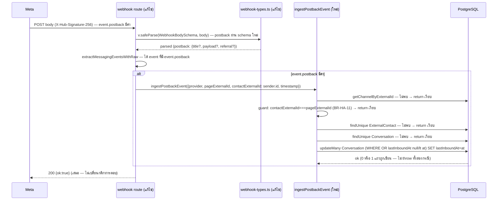

> **โมดูล:** M00043-FacebookHumanAgent
> **ประเภทเอกสาร:** System Design Spec (SDS)
> **เวอร์ชัน:** 1.0
> **วันที่จัดทำ:** 2026-08-10
> **สถานะ:** Draft — รอ user review
> **เจ้าของเอกสาร:** SA (ดู [[Feature-Docs-Ownership]])

# SDS: Facebook Human Agent (System Design Spec)

---

## 1. บทนำ & References

### 1.1 วัตถุประสงค์

เอกสารนี้ออกแบบ "การ implement จริง" ของฟีเจอร์ Human Agent — งานทั้งหมดเป็นการ **แก้ไขไฟล์ที่มีอยู่แล้ว
4 ไฟล์ + เพิ่มไฟล์เทส** ไม่มี component/service ใหม่ระดับ layer ผู้อ่านเป้าหมาย: DEV ที่ implement,
QA ที่ทดสอบ, Controller ที่ dispatch

### 1.2 ขอบเขตการออกแบบ

**อยู่ในขอบเขต:** SSOT สิทธิ์ Human Agent ต่อ PSID + pure function แยกเงื่อนไข tag, การรับ event
`postback`, การทำให้ `sendOutboundImageGrid` สม่ำเสมอกับ `sendOutboundMessage`, จุดแสดงผลแถบสถานะ,
เทส `[blocker]` มัด 4 เงื่อนไขที่ระบุใน task

**นอกขอบเขต:** เปิดสวิตช์ใหญ่จริงบน prod (รอ Meta), UI ใหม่ใด ๆ (ใช้แถบสถานะเดิมของ 00018 ที่ต่อสาย
`humanAgentOpen`/`humanAgentExpiresAt` ไว้ครบแล้ว), การแก้ deep-mobile-seller

### 1.3 เอกสารอ้างอิง

| เอกสาร | ความสัมพันธ์ |
|--------|-------------|
| [[SRS]] ของโมดูลนี้ | TFR-HA-01..06 ที่ SDS นี้ realize |
| [[BRD]] ของโมดูลนี้ | FR-HA-01..11 |
| [[PRD]] ของโมดูลนี้ | BR-HA-01..14, Roadmap 3 กอง (§11.2) |
| [[../00018 - Facebook Chat Integration/SDS]] | Component เดิมที่ฟีเจอร์นี้แก้ต่อ (`channel-chat.service.ts`, `webhook-types.ts`, webhook route, `page.tsx`) |
| `docs/conventions/ui-boolean-needs-a-testable-home.md` | TD-HA-02 |
| `docs/conventions/external-payload-schema.md` | TD-HA-03 |

---

## 2. Architecture Overview

โปรเจกต์เป็น Next.js 16 App Router monolith (single stack) — ฟีเจอร์นี้เดินตาม layer เดิมทั้งหมด
(route handler → service → Prisma / RSC page → service) **ไม่เพิ่ม layer ใหม่**

### 2.2 มุมมองการ Deploy

ไม่มี infra ใหม่ — deploy ร่วมกับแอปหลักบน Vercel (push `origin/main` = deploy prod ตาม Hard Rule 15)
เพิ่ม env var 2 ตัว (`META_HUMAN_AGENT_ENABLED` มีอยู่แล้วบน prod แต่ตั้งเป็นค่าว่าง/ไม่ตั้ง = ปิด;
`META_HUMAN_AGENT_TEST_PSIDS` ยังไม่เคยตั้ง — ต้องเพิ่มบน Vercel + deploy ใหม่ก่อนเริ่ม Test Plan
ของ PRD §11.3) — **ไม่ใช่ scope ของ task implementation** เป็นขั้นตอนปฏิบัติการหลัง merge

---

## 3. Component Design

| Component | หน้าที่ (Responsibility) | Dependency |
|-----------|--------------------------|-----------|
| **`channel-chat.service.ts::canUseHumanAgent`** | SSOT ของ "PSID ใช้สิทธิ์ Human Agent ได้ไหม" — pure function หน้าที่เดียว | `process.env` เท่านั้น |
| **`channel-chat.service.ts::shouldTagHumanAgent`** | pure function หน้าที่เดียว — รวม window/sentByHuman/eligible เป็นคำตอบ boolean เดียว | ไม่มี (รับ primitive ล้วน) |
| **`channel-chat.service.ts::ingestPostbackEvent`** | ยืด `Conversation.lastInboundAt` เมื่อลูกค้ากดปุ่ม — หน้าที่เดียว ไม่แตะ `ChatMessage`/`Notification` | Prisma, `getChannelByExternalId` |
| **`channel-chat.service.ts::sendOutboundMessage`** (แก้ไข) | เรียก `canUseHumanAgent`/`shouldTagHumanAgent` แทนตรรกะเดิม — ที่เหลือไม่เปลี่ยน | (เดิม) |
| **`channel-chat.service.ts::sendOutboundImageGrid`** (แก้ไข) | เรียก `canUseHumanAgent`/`shouldTagHumanAgent` + ถอด throw `WINDOW_CLOSED` | (เดิม) |
| **`webhook-types.ts::MessagingEventSchema`** (แก้ไข) | เพิ่ม field `postback` (optional ทุก sub-field) | Valibot |
| **`webhook/route.ts`** (แก้ไข) | เพิ่ม branch dispatch `event.postback` → `ingestPostbackEvent` | `channel-chat.service.ts` |
| **`inbox/[conversationId]/page.tsx`** (แก้ไข) | จุดคำนวณแถบสถานะเรียก `canUseHumanAgent` แทน `isHumanAgentEnabled` | `channel-chat.service.ts` |

**เหตุผลที่ไม่แยกไฟล์ใหม่:** `canUseHumanAgent`/`shouldTagHumanAgent` เป็น pure function ขนาดเล็ก
(น้อยกว่า 15 บรรทัดรวมกัน) ที่ผูกกับโดเมน "ข้อความช่องทางนอก" เดียวกับฟังก์ชันอื่นทั้งหมดใน
`channel-chat.service.ts` อยู่แล้ว (`getWindowState`, `isHumanAgentEnabled` เดิม) — แยกไฟล์จะเพิ่ม import
โดยไม่ได้ประโยชน์ด้าน testability เพิ่ม (ฟังก์ชันเป็น pure + exported อยู่แล้ว เทสจากไฟล์เดิมได้ตรง ๆ)

---

## 4. Data Flow

### 4.1 Flow ที่ 1: ส่งข้อความนอกหน้าต่าง 24 ชม. → ตัดสินแท็ก → Graph → ผลลัพธ์

### 4.2 Flow ที่ 2: postback เข้า webhook → ยืด `lastInboundAt`

---

## 5. Integration Points

| จุดเชื่อม | ประเภท | Protocol / Contract | ความเสี่ยงเมื่อล่ม |
|-----------|--------|----------------------|---------------------|
| Meta webhook (`event.postback`) | external, 3rd-party (push) | HTTPS POST + HMAC-SHA256 (ไม่เปลี่ยนจาก 00018) | subscribe ครบ 2 ชั้นแล้ว (ยืนยันจาก contract) — ความเสี่ยงเดิมของ webhook ทั้งระบบ ไม่ใช่ความเสี่ยงใหม่ |
| Meta Send API (`messaging_type`/`tag`) | external, 3rd-party | REST/JSON (ไม่เปลี่ยนจาก 00018 — `graph.ts` บรรทัด 605/640 ไม่แตะ) | ถ้า `META_HUMAN_AGENT_ENABLED=true` ก่อนได้รับ permission จริง → Meta ปฏิเสธทั้งข้อความ (เหตุผลที่สวิตช์ยังปิดบน prod) |

- **Timeout / Retry:** ไม่เปลี่ยนจาก 00018 — ไม่มี retry logic ฝั่งเรา
- **สัญญา API เต็ม:** ดู [[API]] ของโมดูลนี้

---

## 6. Technical Decisions

### TD-HA-01: `ingestPostbackEvent` ไม่สร้าง `ExternalContact`/`Conversation` ใหม่

- **ตัดสินใจ:** ฟังก์ชันนี้ return เงียบเมื่อไม่พบ contact/conversation ที่มีอยู่ก่อน — ไม่ upsert/create ใหม่
- **เหตุผล:** BRD Scenario 3 และ FR-HA-08 พูดถึง "ลูกค้ากดปุ่มบนข้อความเก่า" ซึ่งสื่อว่าเธรดมีอยู่แล้วเสมอ
  postback ล้วน ๆ (Get Started ของบัญชีใหม่เอี่ยมที่ไม่เคยพิมพ์อะไรเลย) ไม่มี field ให้สร้างโปรไฟล์
  ผู้ติดต่อที่มีความหมาย (ไม่มีชื่อ ไม่มีข้อความ) — สร้าง contact เปล่า ๆ จาก postback อย่างเดียวจะทำให้
  รายการแชทมีเธรด "ว่างเปล่า" โผล่ขึ้นโดยไม่มีอะไรให้ร้านทำ ตรงข้ามกับ `ingestReadEvent`/`ingestReactionEvent`
  ที่ใช้ pattern เดียวกันนี้อยู่แล้ว (return เงียบเมื่อไม่พบ conversation)
- **ทางเลือกที่ตัดทิ้ง:** upsert contact+conversation เหมือน `ingestInboundMessage` — เกินขอบเขตของ BRD/PRD
  (ไม่มี AC ไหนพูดถึง "ต้องสร้างเธรดจาก Get Started เปล่า ๆ") และจะทำให้ inbox list มีเธรดว่างที่ไม่มี
  ข้อความให้แสดง (UX แย่กว่าการไม่สร้างเลย)
- **ผลกระทบ:** ลูกค้าที่กด Get Started เป็นการกระทำแรกสุด (ไม่เคยพิมพ์อะไรมาก่อน) จะยังไม่ปรากฏใน `/inbox`
  จนกว่าจะมีข้อความจริงเข้ามา — เป็นพฤติกรรมเดิมของระบบ (ไม่ถดถอย, ไม่ใช่ regression)

### TD-HA-02: แยก `shouldTagHumanAgent` เป็น pure function ตาม `ui-boolean-needs-a-testable-home.md`

- **ตัดสินใจ:** ดึงเงื่อนไข "จะติด tag ไหม" ออกจากเทอร์นารีที่เคยฝังใน `sendOutboundMessage`/
  `sendOutboundImageGrid` มาเป็นฟังก์ชันเดียวที่ทั้งสองจุดเรียกร่วมกัน
- **เหตุผล:** เกณฑ์ตามอนุสัญญาคือ "ถ้าเขียนกลับด้านแล้วจะมีอะไรจับได้ไหม" — เดิมเงื่อนไขนี้อยู่คนละฟังก์ชัน
  คนละบรรทัด ไม่มีจุดเดียวให้ import มาเทส unit test ที่มีอยู่ (`messaging-window.test.ts`) เทสแค่
  `getWindowState` ไม่ได้เทสว่า "จะติด tag ไหม" เลย
- **ทางเลือกที่ตัดทิ้ง:** คงเทอร์นารีเดิมไว้ทั้งสองจุด แล้วเขียน integration test ที่ mock Prisma ทั้งก้อน
  แทน — ตรวจจับ mutation ได้แคบกว่า (ต้อง setup mock ทั้งชุดเพื่อเทส 1 บูลีน) และเสี่ยงเทสไม่ครบทุก
  combination เพราะซับซ้อนกว่าการเทส pure function ตรง ๆ
- **ผลกระทบ:** เพิ่ม export ใหม่ 1 ตัวใน `channel-chat.service.ts` — ต่ำ ไม่กระทบ call site เดิมนอกจาก
  2 จุดที่แก้อยู่แล้ว

### TD-HA-03: field `postback` เป็น optional ทุก sub-field (ตาม `external-payload-schema.md`)

- **ตัดสินใจ:** `postback: v.optional(v.object({ title: v.optional(v.string()), payload: v.optional(v.string()), referral: v.optional(ReferralSchema) }))`
- **เหตุผล:** ฟังก์ชันที่ใช้ประโยชน์จาก event นี้ (`ingestPostbackEvent`) ใช้แค่ `sender.id`/`event.timestamp`
  ที่อยู่นอก object `postback` เอง — ไม่มี sub-field ไหนเป็นตัวตัดสินความหมายที่บังคับต้องมี ประกาศเป็น
  บังคับแล้ว Meta ไม่ส่งมาครบทุกครั้ง (เอกสาร Meta เองไม่ยืนยัน) จะทำให้ Valibot ตี event ทั้งก้อนตกและ
  ไม่ได้ยืดหน้าต่างเลย ซึ่งเป็นบั๊กคลาสเดียวกับที่แก้ไปแล้วหลายครั้งใน 00018 (`AttachmentSchema.type`,
  `ads_context_data`)
- **ทางเลือกที่ตัดทิ้ง:** บังคับ `payload` (ดูเป็น field ที่ "ต้องมี" ตามสามัญสำนึก) — เสี่ยงพังทั้ง event
  ถ้า Meta ส่งปุ่มที่ไม่มี payload ตั้งไว้ (เช่นปุ่ม Get Started บางค่าเริ่มต้น) โดยไม่มีประโยชน์เพิ่ม
  เพราะเราไม่ได้อ่านค่านี้อยู่ดี
- **ผลกระทบ:** ต่ำ — ไม่มี call site ไหนอ่าน `event.postback.title`/`.payload`/`.referral` ในรอบนี้
  (สงวนไว้เผื่ออนาคตอยากเก็บ analytics ว่าลูกค้ากดปุ่มไหน — นอกขอบเขตของ BRD)

### TD-HA-04: `sendOutboundImageGrid` ไม่รับ `systemShopId`/`autoReplyKind` — `sentByHuman` จึงเป็น `true` แบบ hardcode

- **ตัดสินใจ:** ไม่เพิ่ม parameter ใหม่ให้ `sendOutboundImageGrid` — คง signature เดิม (`actorUserId: string`
  บังคับ ไม่ nullable) แล้วส่ง `sentByHuman: true` ตรง ๆ เข้า `shouldTagHumanAgent`
- **เหตุผล:** ตรวจสอบแล้วว่าไม่มี caller ใดในระบบ (auto-reply/AI/cron) เรียก `sendOutboundImageGrid` เลย
  — ฟังก์ชันนี้ถูกเรียกจาก `POST /api/chat/conversations/[id]/messages` เท่านั้น (composer ของคนกดส่ง)
  เพิ่ม parameter ที่ไม่มีใครใช้เป็นการเพิ่มพื้นผิวที่ต้องดูแลโดยไม่จำเป็น (YAGNI)
- **ทางเลือกที่ตัดทิ้ง:** เพิ่ม `systemShopId`/`autoReplyKind` ให้เหมือน `sendOutboundMessage` เผื่ออนาคต —
  ตัดเพราะไม่มีความต้องการจริงตอนนี้ และถ้าวันหน้ามี auto-reply ที่ส่งกริดรูป จะเห็นชัดเจนจาก type error
  (`actorUserId` เป็น `string` บังคับ) บังคับให้ผู้เขียนคิดเรื่องนี้ใหม่อีกครั้งตอนนั้น ไม่ใช่เปิดช่องไว้ล่วงหน้า
- **ผลกระทบ:** ไม่มี — พฤติกรรมปัจจุบันคงเดิม 100%

---

## 7. Cross-file Error-mapping (บังคับ enumerate)

ฟีเจอร์นี้ **ไม่ throw custom Error type ใหม่** — enumerate จุดที่เกี่ยวข้องทั้งหมดเพื่อยืนยัน:

| Error string | throw จาก (ไฟล์) | route-handler catch | HTTP status | สถานะ |
|---|---|---|---|---|
| `WINDOW_CLOSED` | `sendOutboundMessage` (ไม่เปลี่ยน — ยังคง throw เมื่อ `!sentByHuman` และหน้าต่างปิด) | `mapChatServiceError` (`src/app/api/chat/conversations/[id]/messages/route.ts:69-77`) | `409` | **ไม่เปลี่ยน** — มี catch อยู่แล้วจาก 00018 |
| `WINDOW_CLOSED` | ~~`sendOutboundImageGrid`~~ **ถอดออกแล้ว (TFR-HA-04)** | — | — | **ต้อง verify:** ไม่มี call site อื่นดัก error string นี้เฉพาะเส้นทาง `IMAGE_GRID` — ตรวจแล้ว (route.ts บรรทัด 622-637) ว่า catch block ของ `IMAGE_GRID` จับด้วย `chunkErr.message.startsWith("SEND_FAILED")` เท่านั้น ไม่มี branch พิเศษสำหรับ `WINDOW_CLOSED` — การถอด throw นี้จึงไม่ทิ้ง dead code หรือทำให้ error หลุดไม่มี catch |
| — (ไม่มี error) | `ingestPostbackEvent` (ออกแบบให้ไม่ throw ในเส้นทางปกติ — ตาม BR-HA-12) | ไม่ต้อง catch พิเศษ | webhook ตอบ `200` เสมอ (`isInfraError` เดิมของ route จับ P1xxx เท่านั้น) | ใหม่ — ยืนยันว่าไม่มี throw path ที่ลืม catch |
| — (ไม่มี error) | `canUseHumanAgent` (pure function, คืน `boolean` เท่านั้น) | ไม่เกี่ยวข้อง | ไม่เกี่ยวข้อง | ใหม่ |
| — (ไม่มี error) | `shouldTagHumanAgent` (pure function, คืน `boolean` เท่านั้น) | ไม่เกี่ยวข้อง | ไม่เกี่ยวข้อง | ใหม่ |

**สรุป:** ไม่มี S-id ไหนต้องเพิ่ม branch ใหม่ใน `mapChatServiceError` — งานเดียวที่ต้อง verify คือ "การถอด
throw `WINDOW_CLOSED` ออกจาก `sendOutboundImageGrid` จะไม่ทำให้ route มี dead-code catch หรือพฤติกรรม
ที่ผูกไว้เฉพาะ error นั้น" ซึ่งตรวจแล้วว่าปลอดภัย (ดูตารางแถวที่ 2)

---

## 8. แผนเทส `[blocker]` (พิสูจน์ด้วย mutation)

> ที่ตั้งไฟล์: `src/services/__tests__/` (ไม่แตะ DB จริง — ทุกไฟล์เป็น pure-function unit test หรือ
> mock Prisma ตาม pattern เดิมของ repo, สอดคล้อง Hard Rule 13)
> รายละเอียดเคสระดับ QA (37 เคส) ดู [[TestCase]] ของโมดูลนี้ — ส่วนนี้คือมุมมองของผู้ออกแบบว่าเทสไหน
> เป็น "ด่านที่ห้ามแดง"

### 8.1 `human-agent-eligibility.test.ts` (ใหม่) — `canUseHumanAgent`

| # | เคส | ผลที่คาด | mutation ที่ต้องจับได้ |
|---|---|---|---|
| 1 | `META_HUMAN_AGENT_ENABLED='true'`, ไม่มี PSID (`null`) | `true` | สลับ `===` เป็น `!==` ที่เช็คสวิตช์ใหญ่ → ต้องแดง `[blocker]` |
| 2 | `META_HUMAN_AGENT_ENABLED='true'`, PSID ไม่อยู่ใน allow-list | `true` (สวิตช์ใหญ่ชนะ ไม่ต้องพึ่ง allow-list) | — |
| 3 | env ทั้งคู่ไม่ได้ตั้งค่า (unset) | `false` | ลบเงื่อนไข early-return ข้อ 2/3 → ต้องแดง `[blocker]` (fail-closed) |
| 4 | สวิตช์ปิด, `META_HUMAN_AGENT_TEST_PSIDS='psidA,psidB'`, PSID='psidA' | `true` | สลับ `.includes` เป็นค่าคงที่ `false` → ต้องแดง `[blocker]` |
| 5 | สวิตช์ปิด, allow-list มีค่า, PSID='psidC' (ไม่อยู่ในลิสต์) | `false` | — |
| 6 | allow-list มีรูปแบบเลอะ (`' psidA ,, psidB ,'`) | parse ได้ถูกต้อง ไม่ throw, `'psidA'`/`'psidB'` ยัง match | ลบ `.trim()`/`.filter(Boolean)` → เทสต้องแดง |
| 7 | PSID เป็น `undefined`/`''`, สวิตช์ปิด | `false` | — |

### 8.2 `human-agent-tag-decision.test.ts` (ใหม่) — `shouldTagHumanAgent`

| # | `windowOpen` | `sentByHuman` | `eligible` | `humanAgentWindowOpen` | ผลที่คาด | mutation |
|---|---|---|---|---|---|---|
| 1 | `true` | `true` | `true` | `true` | `false` (อยู่ในหน้าต่างปกติ ไม่ต้อง tag) | สลับเงื่อนไข `if(windowOpen) return false` → ต้องแดง |
| 2 | `false` | **`false`** | `true` | `true` | `false` (**บอทห้ามได้ tag เด็ดขาด**) | สลับ `if(!sentByHuman) return false` เป็น `if(sentByHuman)` → **ต้องแดง `[blocker]`** — นี่คือเทสที่ locked contract เรียกร้องตรง ๆ ("บอทห้ามได้ tag กลับตรรกะแล้วต้องแดง") |
| 3 | `false` | `true` | `false` | `true` | `false` (ไม่อยู่ใน allow-list/สวิตช์ปิด) | — |
| 4 | `false` | `true` | `true` | `false` | `false` (พ้น 7 วันแล้ว) | — |
| 5 | `false` | `true` | `true` | `true` | **`true`** (เคสเดียวที่ต้องติด tag จริง) | สลับ `&&` เป็น `\|\|` ในบรรทัดสุดท้าย → ต้องแดง `[blocker]` |

### 8.3 `channel-chat-postback.test.ts` (ใหม่) — `ingestPostbackEvent` (mock Prisma)

| # | เคส | ผลที่คาด | mutation |
|---|---|---|---|
| 1 | ไม่พบ `ShopChannel` | ไม่ throw, ไม่เรียก `updateMany` | ลบ early-return → ต้องแดง (throw เมื่อ channel เป็น null) |
| 2 | `contactExternalId === pageExternalId` (BR-HA-11) | ไม่เรียก `updateMany` เลย | ลบ guard นี้ → ต้องแดง (เทส spy ว่า `updateMany` ไม่ถูกเรียก) |
| 3 | ไม่พบ `ExternalContact`/`Conversation` ที่มีอยู่ก่อน | ไม่เรียก `updateMany`, ไม่สร้างแถวใหม่ (TD-HA-01) | — |
| 4 | พบ conversation, event ใหม่กว่า `lastInboundAt` เดิม | `updateMany` ถูกเรียกด้วย `where.OR` ที่มี `{lastInboundAt: null}` และ `{lastInboundAt: {lt: at}}` ครบทั้งคู่ | ลบเงื่อนไข `lt` ออกจาก `OR` → **ต้องแดง `[blocker]`** ("postback ห้ามดันเวลาถอยหลัง" — พิสูจน์ที่ระดับ WHERE clause เพราะ unit test ไม่มี DB จริงให้พิสูจน์ผลลัพธ์ตรง ๆ) |
| 5 | event มาทาง `standby` (ไม่มี field พิเศษอะไรนอกจาก sender/timestamp) | ทำงานเหมือนแถวที่ไม่ใช่ standby ทุกประการ — ฟังก์ชันไม่มี parameter `standby` เลย พิสูจน์ว่า route เรียกได้โดยไม่ผ่านค่านี้ | — |
| 6 | ไม่มี `timestamp` (`undefined`) | ใช้ `new Date()` แทน ไม่ throw | — |

### 8.4 `human-agent-window-display-parity.test.ts` (ใหม่, ไม่บังคับ `[blocker]` แต่แนะนำ) — regression กัน 3 จุดหลุด sync

- grep-based unit test: สแกน `src/` หา call site ทั้งหมดของ `canUseHumanAgent` ต้องได้ **3 จุดเป๊ะ**
  (`sendOutboundMessage`, `sendOutboundImageGrid`, `inbox/[conversationId]/page.tsx`) — ถ้ามีจุดที่ 4
  โผล่ขึ้นในอนาคตโดยไม่อัปเดตเทสนี้ = สัญญาณเตือนว่ามีจุดตัดสินใจใหม่ที่ต้องพิจารณาว่าควรเรียก SSOT
  เดียวกันหรือไม่ (ป้องกัน FR-HA-07 หลุดซ้ำในอนาคต — เรียนรู้จากรูปแบบเทสของ 2026-08-09 comment-inbox
  fetch loop ที่ scan source แทนการ hardcode รายชื่อไฟล์)

**สรุป — เทส `[blocker]` ทั้งหมด 4 ตัวที่ locked contract เรียกร้องตรง ๆ:**
1. บอทห้ามได้ tag (§8.2 #2)
2. fail-closed เมื่อ env ว่าง (§8.1 #3)
3. postback ห้ามดันเวลาถอยหลัง (§8.3 #4)
4. allow-list ไม่ข้ามกฎ 7 วัน (§8.2 #4 — `eligible=true` แต่ `humanAgentWindowOpen=false` ยังคืน `false`)

---

## 9. Traceability

| SRS Requirement (TFR) | SDS Element | สถานะ |
|---|---|---|
| TFR-HA-01 | Component `canUseHumanAgent`, §8.1 | Draft |
| TFR-HA-02 | Component `shouldTagHumanAgent`, TD-HA-02, §8.2 | Draft |
| TFR-HA-03 | Component `ingestPostbackEvent`, Flow 4.2, TD-HA-01, TD-HA-03, §8.3 | Draft |
| TFR-HA-04 | Component `sendOutboundImageGrid`, TD-HA-04, §7 | Draft |
| TFR-HA-05 | Component `page.tsx`, Flow 4.1 (เทียบเคียง) | Draft |
| TFR-HA-06 | §8.2 #2 | Draft |

---

## 10. สรุป (Summary)

เอกสาร SDS นี้กำหนดการออกแบบของฟีเจอร์ Human Agent — **แก้ไฟล์เดิม 4 ไฟล์ + เพิ่มไฟล์เทส 3-4 ไฟล์**
ไม่มี component/layer ใหม่ ไม่มี migration ไม่มี REST endpoint ใหม่ เดินตาม convention เดิมของ 00018 ทั้งหมด

**ลำดับการ build ที่แนะนำ (ตาม Roadmap 3 กองของ PRD §11.2):**

- **กอง 1 (ขึ้น prod ได้ทันที ไม่ต้องรอ Meta):**
  1. TFR-HA-03 (`ingestPostbackEvent` + schema + route dispatch) — ไม่มี dependency
  2. TFR-HA-04 (`sendOutboundImageGrid` เลิก block) — ต้องรอ TFR-HA-01/02 (SSOT) เสร็จก่อน
- **กอง 2 (allow-list + ความสม่ำเสมอของด่าน — ยังไม่มีผลจนกว่าจะตั้งค่า env):**
  1. TFR-HA-01 (`canUseHumanAgent`) — ทำก่อน TFR-HA-04/TFR-HA-05 เพราะทั้งคู่ต้องเรียกฟังก์ชันนี้
  2. TFR-HA-02 (`shouldTagHumanAgent`) — ทำคู่กับ TFR-HA-01 (อยู่ไฟล์เดียวกัน)
  3. TFR-HA-05 (จุดแสดงผล `page.tsx`)
  4. TFR-HA-06 (เทส regression บอท) — ทำหลังทุกอย่างเสร็จ เป็นด่านสุดท้ายก่อน merge
- **กอง 3:** ไม่มีโค้ดใหม่ต้องเขียน (พลิก env variable — operational, ไม่ใช่ implementation)

**ลำดับที่แนะนำจริงสำหรับ 1 รอบ implementation:** TFR-HA-01/02 (SSOT) → TFR-HA-04 (image grid ใช้ SSOT) →
TFR-HA-05 (display ใช้ SSOT) → TFR-HA-03 (postback, ขนานได้กับข้างต้นเพราะไม่พึ่ง SSOT) → §8 เทสทั้งหมด →
`.env.example` sync → comment update ที่ `ChatThread.tsx:1571`

**Open Questions:**
- ไม่มี — contract ถูกล็อกและยืนยันกับโค้ดจริงครบทุกจุดแล้วก่อนเขียนเอกสารนี้
