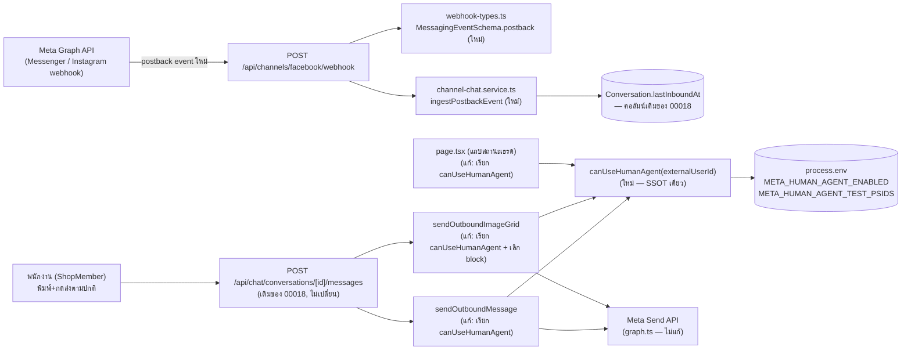
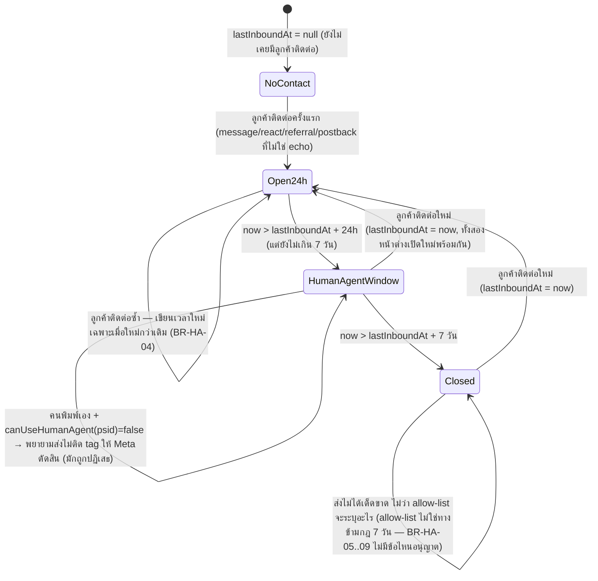

> **โมดูล:** M00043-FacebookHumanAgent
> **ประเภทเอกสาร:** Software Requirements Specification (SRS) — TECHNICAL
> **เวอร์ชัน:** 1.0
> **วันที่จัดทำ:** 2026-08-10
> **สถานะ:** Draft — รอ user review (Hard Rule 11: SRS ทำหลัง PRD+BRD ผ่าน review)
> **เจ้าของเอกสาร:** SA (ดู [[Feature-Docs-Ownership]])

# SRS: Facebook Human Agent — ตอบแชทลูกค้าเกิน 24 ชั่วโมง (Software Requirements Specification — Technical)

---

## 1. บทนำ

### 1.1 วัตถุประสงค์ของเอกสาร

เอกสารนี้กำหนดข้อกำหนดเชิงเทคนิคของ **Facebook/Instagram Human Agent (M00043)** — ฟีเจอร์ที่ต่อยอด
โครงสร้างหน้าต่างเวลา/แท็ก/adapter ที่มีอยู่แล้วจาก [[../00018 - Facebook Chat Integration/SRS|feature 00018]]
โดยไม่สร้างระบบใหม่ ผู้อ่านเป้าหมาย: DEV ที่ implement, QA ที่ออกแบบ test case, Controller ที่วางแผน dispatch

**หลักการออกแบบสำคัญ:** เอกสารนี้ trace กลับ FR-HA-01..11 ใน [[BRD]] (ซึ่ง trace กลับ BR-HA-01..14 ใน [[PRD]])
ทุกข้อ — ไม่มี TFR ที่ไม่มี FR ต้นทาง และไม่มี FR ที่ไม่มี TFR รองรับ (ดู §9 Traceability Matrix)

### 1.2 ขอบเขตเชิงระบบ (System Scope)

**ในขอบเขต:**
- `src/services/channel-chat.service.ts` — เปลี่ยนชื่อ+signature `isHumanAgentEnabled()` → `canUseHumanAgent(externalUserId)`
  (SSOT สิทธิ์ Human Agent ต่อ PSID), เพิ่ม `shouldTagHumanAgent()` (pure function แยกเงื่อนไข boolean),
  เพิ่ม `ingestPostbackEvent()`, แก้ `sendOutboundMessage()`/`sendOutboundImageGrid()` ให้เรียก SSOT เดียวกัน
  และให้ `sendOutboundImageGrid()` เลิก block ฝั่งเราเองก่อนลองส่ง
- `src/lib/facebook/webhook-types.ts` — เพิ่ม field `postback` ใน `MessagingEventSchema`
- `src/app/api/channels/facebook/webhook/route.ts` — เพิ่ม branch dispatch `event.postback` → `ingestPostbackEvent`
- `src/app/(paces)/seller/(chat)/inbox/[conversationId]/page.tsx` — จุดคำนวณแถบสถานะ (จุดแสดงผลที่ 3)
  เปลี่ยนมาเรียก `canUseHumanAgent()` ตัวเดียวกับจุดส่งจริง
- `.env.example` — เพิ่ม `META_HUMAN_AGENT_ENABLED`/`META_HUMAN_AGENT_TEST_PSIDS` (ปัจจุบันไม่มีทั้งคู่ —
  gap ที่สืบทอดจาก 00018 ที่ shipped `META_HUMAN_AGENT_ENABLED` โดยไม่เพิ่มใน `.env.example`)

**นอกขอบเขต (ดู PRD §5):**
- เปิดสวิตช์ใหญ่ให้ลูกค้าทุกคน (`META_HUMAN_AGENT_ENABLED=true` บน prod) — รอ Meta App Review
- `messaging_optins` (Send-to-Messenger/Checkbox plugin), LINE, หน้าจอจัดการ allow-list ในแอป,
  แถบเตือน "ข้อความนี้ใช้สิทธิ์ Human Agent", แก้ไข deep-mobile-seller (known gap G-5 ใน PRD)
- **ไม่มี migration / ไม่มีตาราง/คอลัมน์ใหม่** — `Conversation.lastInboundAt` และ `ExternalContact.externalUserId`
  เดิมของ 00018 มีอยู่แล้วครบ (ดู [[DATABASE]] ของโมดูลนี้ ซึ่งยืนยันว่าไม่มีการเปลี่ยน schema)

**ไม่ใช่หนี้ของฟีเจอร์นี้ (แต่เป็น known gap ที่มีอยู่ก่อน — carry ตาม PRD §11.1):**
- G-2: 7-day window ที่ derive จากคอลัมน์เดียวกับ 24h ยังไม่ยืนยันกับ Meta ว่า react/referral/postback
  reset ทั้งสองหน้าต่างพร้อมกันจริง (ต้องพิสูจน์ใน Test Plan §11.3 ของ PRD)
- G-3: เธรดที่ Meta AI ถือสิทธิ์ (`standby`, `ChatMessage.viaStandby`) ยังไม่รู้ว่าส่งผ่านได้ไหมแม้มีสิทธิ์
  Human Agent แล้ว — ฟีเจอร์นี้ไม่ทำให้อาการแย่ลง (ดู TFR-HA-03 §"ข้อควรระวัง")

### 1.3 เอกสารอ้างอิง

| เอกสาร | ความสัมพันธ์ |
|--------|-------------|
| [[PRD]] ของโมดูลนี้ | Business goals, KPI, BR-HA-01..14, Known Gaps, Roadmap 3 กอง |
| [[BRD]] ของโมดูลนี้ | FR-HA-01..11, AC เต็ม, Scenario 1-6, Business Flows |
| [[../00018 - Facebook Chat Integration/SRS]] | `getWindowState`, `MESSAGING_WINDOW_MS`/`HUMAN_AGENT_WINDOW_MS`, pattern เดิมของ `ingestReadEvent`/`ingestReactionEvent`/`ingestAdReferral` ที่ TFR-HA-03 ใช้เป็นต้นแบบ |
| `docs/conventions/ui-boolean-needs-a-testable-home.md` | เหตุผลที่แยก `shouldTagHumanAgent()` เป็น pure function แทนเทอร์นารีกลาง service |
| `docs/conventions/external-payload-schema.md` | เหตุผลที่ field `postback` ใหม่ทุกตัวเป็น optional |
| `docs/conventions/webhook-subscription-two-layers.md` | ยืนยันแล้วว่า `messaging_postbacks` subscribe ครบทั้ง 2 ชั้น — ไม่ต้องแก้ subscription |
| `src/lib/shop-context.ts` (`canAccessShop`) | authorization guard เดิมที่ฟีเจอร์นี้ใช้ต่อ ไม่สร้างสิทธิ์ใหม่ |

### 1.4 นิยามและตัวย่อ

| คำ/ตัวย่อ | ความหมาย |
|-----------|----------|
| **PSID / IGSID** | ตัวระบุลูกค้าฝั่ง Messenger/Instagram — เก็บที่ `ExternalContact.externalUserId` |
| **allow-list** | รายชื่อ PSID/IGSID (env `META_HUMAN_AGENT_TEST_PSIDS`, คั่นด้วย `,`) ที่ใช้สิทธิ์ Human Agent ได้ก่อนสวิตช์ใหญ่เปิด |
| **kill switch (สวิตช์ใหญ่)** | env `META_HUMAN_AGENT_ENABLED` — `'true'` = ทุกเธรดในหน้าต่าง 7 วันใช้สิทธิ์ได้ ไม่ต้องพึ่ง allow-list |
| **`canUseHumanAgent(externalUserId)`** | SSOT ใหม่ของฟีเจอร์นี้ — ฟังก์ชันเดียวที่ตอบว่า "PSID นี้ใช้สิทธิ์ Human Agent ได้ไหม" |
| **`shouldTagHumanAgent(...)`** | pure function ใหม่ — รวมเงื่อนไข window/sentByHuman/eligible เป็นคำตอบเดียวว่าจะติด tag `HUMAN_AGENT` ไหม |
| **postback** | event จาก Meta เมื่อลูกค้ากดปุ่ม (Get Started/persistent menu/button template) — **ไม่ใช่** quick reply ที่ผูกมากับข้อความ (นั้นมาทาง `event.message.quick_reply` และยืดหน้าต่างอยู่แล้วผ่าน `ingestInboundMessage` เพราะมี `event.message.mid`) |
| **standby** | ช่องทางที่ Meta ส่ง event ของห้องที่ Deep ไม่ใช่เจ้าของเธรด — โครงเหมือน `messaging` ทุกอย่าง รวมถึง `postback` |
| **sentByHuman** | ตัวแปรเดิมของ 00018 ใน `sendOutboundMessage`: `actorUserId !== null && !autoReplyKind` — ตัดสินว่า "คนพิมพ์เอง" ไหม |

---

## 2. ภาพรวมสถาปัตยกรรม

### 2.1 System Context



### 2.2 องค์ประกอบหลัก

| Component | หน้าที่ | สถานะ |
|-----------|---------|-------|
| `channel-chat.service.ts::canUseHumanAgent(externalUserId)` | SSOT ของ "PSID นี้ใช้สิทธิ์ Human Agent ได้ไหม" — pure function อ่าน `process.env` เท่านั้น ไม่มี DB/network | ใหม่ (แทนที่ `isHumanAgentEnabled()`) |
| `channel-chat.service.ts::shouldTagHumanAgent(...)` | pure function รวม window/sentByHuman/eligible → ตัดสินติด tag `HUMAN_AGENT` ไหม | ใหม่ |
| `channel-chat.service.ts::ingestPostbackEvent(...)` | รับ event `postback` แล้วยืด `Conversation.lastInboundAt` เมื่อใหม่กว่าเดิม | ใหม่ |
| `channel-chat.service.ts::sendOutboundMessage(...)` | เรียก `canUseHumanAgent`/`shouldTagHumanAgent` แทนตรรกะเดิม — พฤติกรรมภายนอกไม่เปลี่ยน (ยัง throw `WINDOW_CLOSED` เมื่อ `!sentByHuman`) | แก้ไข |
| `channel-chat.service.ts::sendOutboundImageGrid(...)` | เรียก `canUseHumanAgent`/`shouldTagHumanAgent` + **เลิก throw `WINDOW_CLOSED`** — พยายามส่งเสมอเมื่อคนกด (actor เป็น human เสมอในฟังก์ชันนี้) | แก้ไข (BR-HA-14) |
| `webhook-types.ts::MessagingEventSchema.postback` | field ใหม่ — `title`/`payload`/`referral` ทุกตัว optional | ใหม่ |
| `webhook/route.ts` | เพิ่ม branch `else if (event.postback)` ก่อน branch `pass_thread_control` | แก้ไข |
| `inbox/[conversationId]/page.tsx` | จุดคำนวณแถบสถานะเรียก `canUseHumanAgent(conversation.externalContact?.externalUserId ?? null)` แทน `isHumanAgentEnabled()` | แก้ไข |
| `ChatThread.tsx` | ไม่แก้ logic — คอมเมนต์บรรทัด 1571 ที่อ้างชื่อ env ตัวเดิมยังใช้ได้ (สวิตช์ใหญ่ยังเป็นเหตุผลหนึ่งที่ `humanAgentOpen=false` ได้ — เพิ่มแค่ "หรือ PSID ไม่อยู่ใน allow-list" เข้าไปในคอมเมนต์) | ไม่แก้ (comment update เท่านั้น) |

---

## 3. ข้อกำหนดเชิงฟังก์ชันเชิงเทคนิค

### TFR-HA-01: SSOT สิทธิ์ Human Agent ต่อ PSID (`canUseHumanAgent`)

- **Trace:** FR-HA-03/04/05/06/07, BR-HA-05/06/07/08/09
- **คำอธิบายเชิงเทคนิค:**
  ```
  canUseHumanAgent(externalUserId: string | null | undefined): boolean
    1. ถ้า process.env.META_HUMAN_AGENT_ENABLED === 'true' → true (ไม่ต้องพึ่ง allow-list — สวิตช์ใหญ่ชนะ)
    2. ถ้าไม่มี externalUserId (null/undefined/ว่าง) → false
    3. อ่าน process.env.META_HUMAN_AGENT_TEST_PSIDS — ไม่มีค่า/ว่าง → false
    4. split(',') → trim ทีละตัว → filter(Boolean) (ตัดค่าว่างจาก , , ติดกัน/เว้นวรรค)
    5. รายการที่ได้ .includes(externalUserId) → ผลลัพธ์
  ```
- **Precondition:** ไม่มี — ฟังก์ชัน pure เรียกได้ทุกที่โดยไม่ต้องมี DB context
- **Postcondition:** คืน `boolean` เท่านั้น ไม่ throw ไม่ว่า input จะเป็นอะไร
- **Error/Edge cases:**
  - env ทั้งคู่ไม่ได้ตั้งค่า → `false` เสมอ (BR-HA-07 fail-closed)
  - `META_HUMAN_AGENT_ENABLED` เป็นค่าอื่นที่ไม่ใช่ `'true'` เป๊ะ (เช่น `'True'`/`'1'`/ว่าง) → ตีเป็นปิด (เทียบ `===` ตรง ๆ แบบเดียวกับของเดิม — ไม่เปลี่ยนพฤติกรรม parse)
  - `META_HUMAN_AGENT_TEST_PSIDS` มีเว้นวรรค/คอมมาซ้อน (`" psid1 ,,psid2 "`) → parse ได้ถูกต้อง ไม่ throw
  - สวิตช์ใหญ่เปิด + PSID ไม่อยู่ใน allow-list (หรือไม่มี allow-list เลย) → **ยังคืน `true`** (ข้อ 1 ชนะก่อนเช็ค allow-list เสมอ — BR-HA-05 "เปิด = ทุกเธรด… ไม่ต้องพึ่ง allow-list อีกต่อไป")
- **จุดเรียกที่บังคับต้องใช้ฟังก์ชันนี้ตัวเดียว (FR-HA-07 — ห้ามมีนิยามคู่ขนาน):**
  1. `sendOutboundMessage` (ก่อนแก้: `isHumanAgentEnabled()` บรรทัด 2965)
  2. `sendOutboundImageGrid` (ก่อนแก้: `isHumanAgentEnabled()` บรรทัด 2339)
  3. `inbox/[conversationId]/page.tsx` (ก่อนแก้: `isHumanAgentEnabled()` บรรทัด 560)

### TFR-HA-02: `shouldTagHumanAgent` — แยกเงื่อนไข boolean ออกจากเทอร์นารี

- **Trace:** FR-HA-10/11, BR-HA-13/14 + `docs/conventions/ui-boolean-needs-a-testable-home.md`
- **เหตุผล implement เป็นฟังก์ชันแยก:** เงื่อนไข "จะติด tag `HUMAN_AGENT` ไหม" เดิมฝังอยู่ในเทอร์นารีกลาง
  `sendOutboundMessage`/`sendOutboundImageGrid` คนละไฟล์ละจุด — ถ้าเขียนกลับด้าน (เช่นสลับ `&&`/`||`)
  จะไม่มี unit test จับได้เพราะไม่มีฟังก์ชันให้ import มาเทส (คลาสเดียวกับบั๊ก "ย่อกลับ" ที่บันทึกไว้ใน
  `feedback_ui_boolean_needs_testable_home`) — ย้ายมาเป็น pure function แล้วเทสแยกด้วย mutation
- **คำอธิบายเชิงเทคนิค:**
  ```
  shouldTagHumanAgent(params: {
    windowOpen: boolean          // getWindowState(...).open
    sentByHuman: boolean         // actorUserId !== null && !autoReplyKind (ไม่เปลี่ยนนิยามเดิม)
    eligible: boolean            // canUseHumanAgent(externalUserId)
    humanAgentWindowOpen: boolean // getWindowState(...).humanAgentOpen
  }): boolean
    if (windowOpen) return false          // อยู่ในหน้าต่างปกติ ไม่ต้องติด tag
    if (!sentByHuman) return false        // ระบบ/บอท/AI ห้ามได้ tag เด็ดขาด (BR-HA-02/13 — ห้ามผ่อน)
    return eligible && humanAgentWindowOpen
  ```
- **Postcondition:** คืน `boolean` — caller ใช้ผลนี้ตัดสิน `messageTag = result ? 'HUMAN_AGENT' : undefined`
- **Error/Edge:** ไม่ throw — เป็น pure function ล้วน ไม่มี side effect ไม่มี DB
- **ที่เรียก:** `sendOutboundMessage` แทนที่ `if (!windowState.open) { if (!sentByHuman) throw...; if (isHumanAgentEnabled() && windowState.humanAgentOpen) messageTag = 'HUMAN_AGENT' }` — **การ throw `WINDOW_CLOSED` เมื่อ `!sentByHuman` ยังคงอยู่ใน `sendOutboundMessage`** (เป็นคนละเงื่อนไขจาก tag เอง — `shouldTagHumanAgent` แค่ตอบว่า "ติด tag ไหม" ไม่ได้ตัดสินว่า "throw ไหม") ส่วน `sendOutboundImageGrid` ไม่มี branch throw นี้อีกต่อไป (ดู TFR-HA-04)

### TFR-HA-03: รับ event `postback` แล้วยืดหน้าต่างเวลา

- **Trace:** FR-HA-08/09, BR-HA-10/11/12
- **คำอธิบายเชิงเทคนิค:** `ingestPostbackEvent({provider, pageExternalId, contactExternalId, timestamp?})`
  (ต้นแบบ: `ingestReadEvent`/`ingestReactionEvent` ของ 00018 — SRS §"TFR-FBC-06" ของ 00018):
  1. `getChannelByExternalId(provider, pageExternalId)` — ไม่พบ channel → return เงียบ (เพจไม่มีร้านเชื่อม)
  2. **BR-HA-11 defensive guard:** `contactExternalId === pageExternalId` → return เงียบ (ปุ่มจากฝั่งเพจเอง
     ถ้ามี — Meta ไม่มีเอกสารยืนยันว่า `messaging_postbacks` มี echo แต่กันไว้แบบเดียวกับ `ingestReactionEvent`
     ที่กัน reactor ฝั่งเพจเช่นกัน)
  3. หา `ExternalContact` ด้วย `{shopChannelId, externalUserId: contactExternalId}` — ไม่พบ → return เงียบ
     (**ไม่สร้าง contact/conversation ใหม่จาก postback อย่างเดียว** — ตัดสินใจตาม TD-HA-01 ใน [[SDS]])
  4. หา `Conversation` ด้วย `{shopChannelId, externalContactId}` — ไม่พบ → return เงียบ
  5. `at = timestamp ? new Date(timestamp) : new Date()`
  6. `prisma.conversation.updateMany({where: {id, OR: [{lastInboundAt: null}, {lastInboundAt: {lt: at}}]}, data: {lastInboundAt: at}})`
     — เขียนเฉพาะเมื่อใหม่กว่าเดิม (BR-HA-04, กติกาเดียวกับ `react`/`referral`)
- **Precondition:** ไม่มี — เรียกได้แม้ event มาทาง `standby` (ไม่มี field พิเศษของ postback ให้ใช้เลยนอกจาก
  `sender.id`/`timestamp` ซึ่งมีเสมอทั้ง 2 กล่อง)
- **Postcondition:** `Conversation.lastInboundAt` ขยับ (ถ้าเข้าเงื่อนไข) — **ไม่สร้าง `ChatMessage`/`Notification` ใด ๆ**
  (postback ไม่ใช่ข้อความ ไม่มีเนื้อหาให้แสดงในเธรด)
- **Error/Edge cases:**
  - ไม่ throw ในทุกกรณี (เหมือน `ingestReadEvent`) — DB infra error (P1xxx) จะไหลขึ้นไปให้ webhook route
    จับที่ `isInfraError()` เดิม (503 ให้ Meta retry) เพราะฟังก์ชันนี้ไม่ได้ห่อ try/catch ของตัวเอง
    (เจตนา — ตรงกับ `ingestReadEvent`/`ingestReactionEvent`/`ingestMessageEdit` ที่มีอยู่แล้ว ไม่ใช่ `ingestAdReferral`
    ซึ่งห่อ try/catch เองเพราะเรียก network call เพิ่ม — `ingestPostbackEvent` ไม่มี network call เลย)
  - event ที่ไม่มี `timestamp` (optional ตาม external-payload-schema.md) → ใช้เวลาที่ webhook รับ (`new Date()`)
    แทน — ยังยืดหน้าต่างได้ ไม่ต้องรอ field ที่อาจไม่มา
- **ข้อควรระวัง (G-2/G-3, carry จาก 00018/PRD):** ฟังก์ชันนี้ไม่แก้ปัญหาที่ยังไม่ยืนยันว่า Meta reset
  หน้าต่าง 7 วันพร้อมกับ 24 ชม.จริงหรือไม่ (ใช้สูตรเดียวกับ `react`/`referral` เดิม — สม่ำเสมอกับของเดิม
  ไม่ใช่การเดาใหม่) และไม่แก้ปัญหาเธรดที่ Meta AI ถือสิทธิ์อยู่ — แค่บันทึกว่า "มีปฏิสัมพันธ์" ตาม BR-HA-12

### TFR-HA-04: ความสม่ำเสมอของช่องทางส่ง — `sendOutboundImageGrid` เลิก block ก่อนลอง

- **Trace:** FR-HA-10/11, BR-HA-13/14
- **คำอธิบายเชิงเทคนิค:** ของเดิม (`sendOutboundImageGrid` บรรทัด 2336-2341):
  ```
  const windowState = getWindowState(conversation.lastInboundAt)
  let messageTag
  if (!windowState.open) {
    if (isHumanAgentEnabled() && windowState.humanAgentOpen) messageTag = 'HUMAN_AGENT'
    else throw new Error('WINDOW_CLOSED')   // ← ปัญหา: block ฝั่งเราเองก่อน ไม่ให้ Meta ตัดสิน
  }
  ```
  แก้เป็น (สอดคล้อง `sendOutboundMessage` ที่ทำถูกอยู่แล้วตั้งแต่มติ 2026-08-03):
  ```
  const windowState = getWindowState(conversation.lastInboundAt)
  // sendOutboundImageGrid ไม่มี systemShopId/autoReplyKind — actorUserId เป็น string บังคับเสมอ
  // → sentByHuman = true ตลอด (ฟังก์ชันนี้ถูกเรียกจาก composer ของคนกดส่งเท่านั้น)
  const messageTag = shouldTagHumanAgent({
    windowOpen: windowState.open,
    sentByHuman: true,
    eligible: canUseHumanAgent(conversation.externalContact.externalUserId),
    humanAgentWindowOpen: windowState.humanAgentOpen,
  }) ? 'HUMAN_AGENT' : undefined
  // ไม่มี throw WINDOW_CLOSED อีกต่อไป — พยายามส่งเสมอ ให้ Meta เป็นคนตัดสิน (BR-HA-14)
  ```
- **Precondition:** ownership (`canAccessShop`)/`NOT_EXTERNAL_CHANNEL`/`CHANNEL_NOT_ACTIVE`/`IMAGE_GRID_COUNT_OUT_OF_RANGE`
  guard เดิมทั้งหมด **ไม่เปลี่ยน** — แก้เฉพาะ branch ตัดสิน tag/throw ของหน้าต่างเวลา
- **Postcondition:** เมื่อหน้าต่างปิดและไม่มีสิทธิ์ Human Agent → ยิงไปแบบ `messaging_type: 'RESPONSE'`
  (ไม่มี tag) แล้วให้ Meta ปฏิเสธ → `sendImageGridMessage` throw จาก Graph API error → catch เดิมใน
  `sendOutboundImageGrid` (บรรทัด 2395) ตกไป fallback "ส่งทีละใบผ่าน `sendOutboundMessage`" อยู่แล้ว
  (path เดิม ไม่ต้องแก้) ซึ่งจะบันทึก `deliveryStatus='FAILED'` + `failureReason` ให้เห็นในเธรด (BR-HA-14
  AC ข้อ 2: "บันทึกเป็นสถานะส่งไม่สำเร็จพร้อมเหตุผล ให้ผู้ใช้เห็นและกดลองใหม่ได้")
- **Error/Edge:** ไม่มี error type ใหม่ — **ถอด** throw path `WINDOW_CLOSED` ออกจากฟังก์ชันนี้เท่านั้น
  (ยืนยันแล้วว่า route handler (`mapChatServiceError`) ไม่ได้ผูก logic พิเศษกับ `WINDOW_CLOSED` เฉพาะเส้นทาง
  `IMAGE_GRID` — ใช้ catch เดียวกับทุกเส้นทางส่งข้อความ ดู [[SDS]] §"Cross-file error-mapping")

### TFR-HA-05: จุดแสดงผลแถบสถานะ sync กับจุดส่งจริง

- **Trace:** FR-HA-07, BR-HA-09
- **คำอธิบายเชิงเทคนิค:** `inbox/[conversationId]/page.tsx` บรรทัด 558-561 (แก้):
  ```
  humanAgentOpen={canUseHumanAgent(conversation.externalContact?.externalUserId ?? null) && windowState.humanAgentOpen}
  humanAgentExpiresAt={windowState.humanAgentExpiresAt?.toISOString() ?? null}
  ```
  แทนที่ `isHumanAgentEnabled() && windowState.humanAgentOpen` เดิม — **ตรรกะเดียวกันเป๊ะกับที่
  `sendOutboundMessage`/`sendOutboundImageGrid` ใช้ตัดสินตอนส่งจริง** เพราะเรียก `canUseHumanAgent`
  ตัวเดียวกัน (TFR-HA-01)
- **Precondition:** `conversation.externalContact` เป็น `null` ได้ (เธรด `channel==='DEEP'`) — ต้อง `?? null`
  ก่อนส่งเข้า `canUseHumanAgent` (ฟังก์ชันรองรับ `null`/`undefined` อยู่แล้วตาม TFR-HA-01 ข้อ 2)
- **Postcondition:** ผู้ขายเห็นแถบ "เกิน 24 ชม. แต่ยังตอบเองได้ถึง [วันที่]" **ก็ต่อเมื่อ** ส่งข้อความจริง
  จะติด tag `HUMAN_AGENT` ได้จริง — ปิดช่องว่างที่ FR-HA-07 AC ระบุ ("เธรดที่คู่สนทนาอยู่ใน allow-list
  ต้องเห็นแถบนี้ — เธรดที่ไม่อยู่ต้องเห็นข้อความทั่วไปแบบเดิม")
- **Error/Edge:** ไม่มี — ฟังก์ชัน pure ไม่มีทาง throw ระหว่าง render

### TFR-HA-06: ป้องกันระบบอัตโนมัติใช้สิทธิ์ 7 วัน (baseline — ไม่เปลี่ยนพฤติกรรม, เพิ่ม regression test)

- **Trace:** FR-HA-10, BR-HA-02/13
- **คำอธิบายเชิงเทคนิค:** `sentByHuman = actorUserId !== null && !autoReplyKind` (นิยามเดิมของ 00018/00023
  — **ไม่เปลี่ยน**) และ `shouldTagHumanAgent` ปฏิเสธทันทีเมื่อ `!sentByHuman` (TFR-HA-02) — เส้นทาง
  auto-reply (`systemShopId` ตั้งค่า, `actorUserId === null`) และ AI (`autoReplyKind='AUTO'|'AUTO_TEST'`)
  จึงไม่มีทางได้ tag ไม่ว่า `canUseHumanAgent` จะตอบ `true` แค่ไหนก็ตาม
- **Postcondition:** เส้นทางระบบที่หน้าต่างปิด ยัง throw `WINDOW_CLOSED` เหมือนเดิมทุกประการ (ไม่ใช่ "พยายามส่ง
  แล้วให้ Meta ตัดสิน" — กติกานี้สงวนไว้เฉพาะข้อความที่คนพิมพ์เอง ตาม BR-HA-02 "ห้ามส่งนอกหน้าต่าง 24
  ชม.เด็ดขาด ไม่มีข้อยกเว้น")
- **Error/Edge:** ต้องมี unit test `[blocker]` ที่พิสูจน์ด้วย mutation ว่ากลับเงื่อนไข `!sentByHuman` แล้วเทส
  ต้องแดง (ดู [[SDS]] §"แผนเทส")

---

## 4. Interface / API Specification (สรุป — รายละเอียดเต็มดู [[API]])

ฟีเจอร์นี้**ไม่มี REST endpoint ใหม่** — แก้พฤติกรรมภายในของ endpoint เดิม 2 ตัว และ webhook payload เดิม 1 ตัว

| Method | Path | สิ่งที่เปลี่ยน | Auth |
|--------|------|----------------|------|
| `POST` | `/api/channels/facebook/webhook` | รับ field `postback` เพิ่ม (เดิมตกเข้า `ingestInboundMessage` → `IGNORED`) | `X-Hub-Signature-256` (ไม่เปลี่ยน) |
| `POST` | `/api/chat/conversations/[id]/messages` | ผลลัพธ์ที่ client เห็นเปลี่ยนเมื่อ `type=IMAGE_GRID` และหน้าต่างปิด+ไม่มีสิทธิ์ — จาก `409 WINDOW_CLOSED` ทันที → พยายามส่งแล้วอาจได้ `502 SEND_FAILED` แทน (ยัง fail แต่ "พยายาม" ก่อน) | participant session (ไม่เปลี่ยน) |

---

## 5. State Machine

### 5.1 หน้าต่างเวลาตอบกลับ 3 สถานะ (SSOT ของ*เวลา* = `getWindowState()`, ไม่เปลี่ยนจาก 00018)



> **หมายเหตุ:** `canUseHumanAgent(psid)` **ไม่ใช่สถานะที่ 4** — เป็น gate ที่ประเมินซ้ำได้ทุกครั้งที่ส่ง
> (ไม่ persist ลง DB) ทับซ้อนอยู่บนสถานะ `HumanAgentWindow` เท่านั้น เมื่อสวิตช์ใหญ่เปลี่ยนค่า (ต้อง deploy
> ใหม่ตาม BR-HA-08) เธรดเดียวกันจะได้ผลต่างกันโดยไม่มี event ใหม่เข้ามาเลย — เป็นพฤติกรรมที่ตั้งใจ

### 5.2 ตารางเทียบ: event → ยืดหน้าต่างไหม (ครบทุกชนิดที่ webhook รับ ณ วันนี้)

| Event | ยืดหน้าต่างไหม | ฟังก์ชันที่ทำ | หมายเหตุ |
|---|---|---|---|
| `message` (ลูกค้าพิมพ์) | ✅ | `ingestInboundMessage` | `is_echo` ต้องเป็น falsy |
| `message` (`is_echo=true`, ฝั่งเพจ) | ❌ | — | ฝั่งเพจเป็นผู้ส่ง ไม่ใช่ปฏิสัมพันธ์ของลูกค้า |
| `reaction` (action=`react`, ลูกค้ากด) | ✅ | `ingestReactionEvent` | ต้อง `reactorExternalId !== pageExternalId` |
| `reaction` (action=`unreact`) | ❌ | — | ถอนรีแอ็กชันไม่ใช่ปฏิสัมพันธ์ใหม่ |
| `referral` (ลูกค้าคลิกโฆษณา/ลิงก์ m.me เอง) | ✅ | `ingestAdReferral` (`customerActionAt` มีค่า) | มาทั้งซ้อนใน `message.referral` และ top-level `event.referral` |
| `referral` (ติดมากับ echo ของฝั่งเพจ) | ❌ | `ingestAdReferral` (`customerActionAt=undefined`) | เพจเป็นผู้กระทำ ไม่ใช่ลูกค้า |
| **`postback` (ลูกค้ากดปุ่ม)** | **✅ ใหม่ในฟีเจอร์นี้** | **`ingestPostbackEvent`** | เดิม `IGNORED` เพราะไม่มี `event.message.mid` |
| `postback` (จากฝั่งเพจ, ถ้ามี) | ❌ | `ingestPostbackEvent` (defensive guard) | Meta ไม่มีเอกสารยืนยันว่าเกิดขึ้นได้ — กันไว้เป็นการป้องกัน |
| `read` (message_reads) | ❌ | `ingestReadEvent` | แค่ปลดสถานะ "อ่านแล้ว" ไม่ใช่ปฏิสัมพันธ์ใหม่ |
| `delivery` (message_deliveries) | ❌ | `ingestDeliveryEvent` | แค่ปลดสถานะ "ถึงแล้ว" |
| `message_edit` | ❌ | `ingestMessageEdit` | แก้ข้อความเดิม ไม่ใช่ข้อความใหม่ |
| `pass/take/request_thread_control` | ❌ | `ingestHandoverEvent` | สิทธิ์คุมห้องเปลี่ยนมือ ไม่ใช่ปฏิสัมพันธ์ของลูกค้า |
| **ทุกชนิดข้างต้นที่มาทาง `standby`** | เหมือนแถวที่ไม่ใช่ standby | เดียวกัน | ต้องไม่ทำให้ระบบล้มแม้ไม่มี payload เพิ่มเติม (BR-HA-12) |

---

## 6. NFR (Non-Functional Requirements)

| ด้าน | ข้อกำหนด | เป้าหมายที่วัดได้ |
|------|----------|-------------------|
| **Performance** | `canUseHumanAgent`/`shouldTagHumanAgent` ต้องไม่เพิ่ม round-trip ไป Meta/DB ก่อนส่งจริง (BRD §6.2) | ทั้งสองฟังก์ชันอ่านแค่ `process.env`/พารามิเตอร์ที่มีอยู่แล้ว — 0 query เพิ่ม |
| **Reliability** | เรียก Meta ไม่สำเร็จ → fail-safe ไปทางค่าที่มีอยู่เดิม (BRD §6.3, ไม่เปลี่ยนจาก `syncInboundWindowFromMeta` เดิม); env ไม่ได้ตั้งค่า → fail-closed | `canUseHumanAgent` คืน `false` เมื่อ env ว่างทั้งคู่ — พิสูจน์ด้วย unit test `[blocker]` |
| **Security** | allow-list เป็น env server-only ไม่ expose ผ่าน client (BRD §6.4) | `META_HUMAN_AGENT_TEST_PSIDS` อ่านเฉพาะฝั่ง server (`channel-chat.service.ts`, `page.tsx` เป็น RSC) — ไม่มี `NEXT_PUBLIC_` prefix |
| **Observability** | `ingestPostbackEvent` ไม่ต้องเพิ่ม log พิเศษ (เกาะ pattern เดิมของ `console.error` ต่อ event ที่ webhook route มีอยู่แล้ว) | — |
| **Maintainability** | ห้ามมีนิยามคู่ขนานของ "ใช้สิทธิ์ Human Agent ได้ไหม" มากกว่า 1 จุด (FR-HA-07) | grep `isHumanAgentEnabled` ทั้ง repo ต้องเหลือ 0 หลัง implement (เปลี่ยนชื่อหมดทุกจุด) |

---

## 7. ข้อกำหนดด้านข้อมูล (Data Requirements)

**ไม่มี migration ไม่มีตาราง/คอลัมน์ใหม่** — ฟีเจอร์นี้ใช้ `Conversation.lastInboundAt` และ
`ExternalContact.externalUserId` ที่มีอยู่แล้วจาก 00018 ทั้งหมด รายละเอียดเต็ม (ผู้เขียน `lastInboundAt`
ทุกราย, เหตุผลที่ allow-list ไม่อยู่ใน DB, index ที่มีอยู่แล้ว) ดู [[DATABASE]] ของโมดูลนี้

---

## 8. ข้อจำกัดทางเทคนิคและการพึ่งพา

### 8.1 ข้อจำกัดทางเทคนิค

- `META_HUMAN_AGENT_ENABLED`/`META_HUMAN_AGENT_TEST_PSIDS` เป็นค่าระดับ environment — เปลี่ยนแล้วต้อง
  deploy ใหม่ (Vercel) ค่าจึงมีผล (BR-HA-08) — ไม่มี hot-reload
- `messaging_postbacks` subscribe ครบทั้ง 2 ชั้นแล้ว (ยืนยันจาก contract ที่ล็อก — app topic `page`+`instagram`,
  page `MESSENGER_SUBSCRIBED_FIELDS:18`) — **ไม่ต้องแก้ subscription ใด ๆ** ในฟีเจอร์นี้

### 8.2 การพึ่งพาภายนอก/ภายใน

| Dependency | ประเภท | ความเสี่ยง |
|------------|--------|------------|
| Meta Graph API — สิทธิ์ `human_agent` (App Review) | external | ยังไม่ได้รับอนุมัติ — สวิตช์ใหญ่ต้องปิดอยู่จนกว่าจะผ่าน (กอง 3 ของ Roadmap) |
| `channel-chat.service.ts::getWindowState` | internal (00018) | ไม่แก้ไข — ฟีเจอร์นี้ประกอบเพิ่มบนผลลัพธ์เดิม |
| `src/lib/shop-context.ts::canAccessShop` | internal (00018) | ไม่แก้ไข — ครอบ PERSONAL owner + BUSINESS member อยู่แล้ว |

### 8.3 สมมติฐานทางเทคนิค

- ยึดตาม PRD §9.2 A-1/A-2/A-3 ทั้งหมด (ต้องพิสูจน์ระหว่าง Test Plan §11.3 ของ PRD ก่อนยื่น App Review
  — ไม่ใช่ขอบเขตของ implementation รอบนี้)

### 8.4 การ sync `docs/SRS.md` (เอกสารระบบ) — Hard Rule 11

**ผลตรวจ:** `docs/SRS.md` (เอกสารระบบระดับโปรเจกต์) **ยังไม่มี section เกี่ยวกับ Facebook chat webhook เลย**
— เป็น gap ที่สืบทอดมาตั้งแต่ feature 00018 ไม่ใช่สิ่งที่ฟีเจอร์นี้สร้างขึ้น

**มติ:** ไม่ backfill section ของ 00018 ทั้งก้อนในรอบนี้ (เกินขอบเขต) — แต่ **หนี้นี้ต้องถูกบันทึกไว้
ไม่ใช่ปล่อยเงียบ** สิ่งที่ฟีเจอร์นี้เพิ่มและควรเข้าสู่ `docs/SRS.md` เมื่อมีการ backfill section 00018:

| หัวข้อใน `docs/SRS.md` | สิ่งที่ต้องเพิ่ม |
|---|---|
| Validation rules / Schema ภายนอก | `MessagingEventSchema.postback` (optional ทุก sub-field) |
| Enums/Constants | `MESSAGING_WINDOW_MS` (24 ชม.), `HUMAN_AGENT_WINDOW_MS` (7 วัน) — ค่าเดิมของ 00018 ที่ไม่เคยถูกบันทึก |
| Environment variables | `META_HUMAN_AGENT_ENABLED` (เดิม ไม่เคยบันทึก), `META_HUMAN_AGENT_TEST_PSIDS` (ใหม่) |
| API reference | พฤติกรรมที่เปลี่ยนของ `POST /api/chat/conversations/[id]/messages` branch `IMAGE_GRID` |

---

## 9. Traceability Matrix

| BRD FR-ID | SRS TFR-ID | Component | สถานะ |
|-----------|------------|-----------|-------|
| FR-HA-01/02 | (baseline, ไม่มี TFR ใหม่) | `getWindowState` | Done (00018) |
| FR-HA-03/04/05/06 | TFR-HA-01 | `canUseHumanAgent` | Draft |
| FR-HA-07 | TFR-HA-01, TFR-HA-05 | `canUseHumanAgent` (3 จุดเรียก) | Draft |
| FR-HA-08 | TFR-HA-03 | `ingestPostbackEvent` | Draft |
| FR-HA-09 | TFR-HA-03 | `ingestPostbackEvent` (standby-safe) | Draft |
| FR-HA-10 | TFR-HA-02, TFR-HA-06 | `shouldTagHumanAgent` | Draft |
| FR-HA-11 | TFR-HA-04 | `sendOutboundImageGrid` | Draft |

---

## 10. สรุป (Summary)

เอกสาร SRS นี้กำหนดข้อกำหนดเชิงเทคนิคของ **Facebook Human Agent** — ฟีเจอร์ที่ **ไม่สร้างระบบใหม่**
แต่เติม SSOT ตัวเดียว (`canUseHumanAgent`) เข้าไปแทนที่จุดตัดสินใจ 3 จุดที่เคยกระจัดกระจาย, เพิ่มเส้นทาง
รับ event `postback` ที่หายไปตั้งแต่ 00018, และแก้ความไม่สม่ำเสมอของ `sendOutboundImageGrid` ให้ตรงกับมติ
2026-08-03 ที่ `sendOutboundMessage` ทำถูกอยู่แล้ว

**ขอบเขตที่ครอบคลุม:** TFR-HA-01..06 — ครบ FR-HA-01..11 ทุกข้อ, ไม่มี migration, ไม่มี REST endpoint ใหม่

**ประเด็นที่ต้องตัดสินใจเพิ่ม (Open Questions):**
- G-2 (7-day window assumption) และ G-3 (standby thread) ยังเปิดอยู่ตาม PRD — ไม่ใช่สิ่งที่ implementation
  รอบนี้ต้องปิด แต่ QA ต้องรู้ว่าไม่ได้ทดสอบครอบคลุมสองเคสนี้จนกว่าจะมี Test Plan §11.3 ของ PRD
- §8.4: หนี้ `docs/SRS.md` ที่ไม่มี section ของ 00018 เลย — ต้องตัดสินใจว่าจะ backfill เมื่อไหร่
