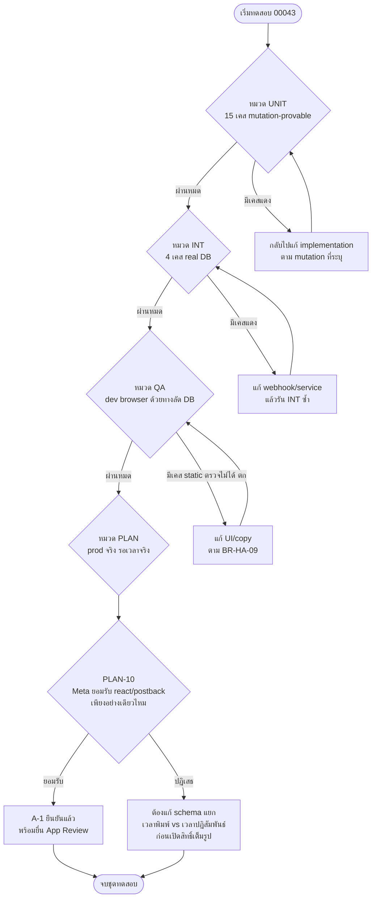

> **โมดูล:** 00043-HumanAgent
> **ประเภทเอกสาร:** Test Case
> **เวอร์ชัน:** 1.0
> **วันที่จัดทำ:** 2026-08-10
> **สถานะ:** Draft — รอ user review
> **เจ้าของเอกสาร:** QA

# Test Case: ตอบแชทลูกค้าเกิน 24 ชั่วโมง (Facebook/Instagram Human Agent)

---

## 1. Overview

ชุดทดสอบนี้ครอบคลุมฟีเจอร์ 00043 ทั้ง 3 กอง (ดู PRD §11.2 Roadmap): **(1)** แก้บั๊ก postback ไม่ยืด
หน้าต่างเวลา **(2)** เปิดสิทธิ์ Human Agent แบบควบคุมความเสี่ยงด้วย allow-list + kill switch
**(3)** Test Plan บน prod ก่อนยื่น App Review — ประเภททดสอบ: unit (functional, mutation-provable) /
integration (real DB, local Postgres) / manual browser QA / prod verification plan

- **เอกสารต้นทาง:** [[BRD]] ของโมดูลนี้ (ทุก scenario trace กลับ FR-HA-01..11) + [[PRD]] (BR-HA-01..14
  — ระดับธุรกิจที่ละเอียดกว่า FR รายข้อ ใช้เป็น master coverage ตาม §5 ของเอกสารนี้)
- **ขอบเขตชุดทดสอบ (Scope):** in-scope = Messenger + Instagram (ตาม BRD §1.2); out-of-scope =
  `messaging_optins`, LINE, หน้าจอจัดการ allow-list ในแอป (ทั้งหมดอยู่นอกขอบเขตของฟีเจอร์เอง ไม่ใช่
  แค่นอกขอบเขตการทดสอบ — ดู PRD §5)
- **สภาพแวดล้อม:**
  - Unit/Integration: dev local — Vitest + local Postgres (`tests/setup.ts` allowlist เฉพาะ
    `localhost`/`127.0.0.1`/`host.docker.internal`) — **ห้ามรันชุดนี้ชี้ DB ที่แชร์กับ prod เด็ดขาด**
    (Hard Rule 13/14)
  - Manual/Browser QA (dev): `seller.deepth.local:4000` ด้วยเพจ Facebook/IG ทดสอบที่เชื่อมไว้แล้ว —
    ใช้ทางลัดแก้ `lastInboundAt` ตรงบน **dev DB `localhost:5434` เท่านั้น** เพื่อจำลองสถานะ 3 ระดับ
    โดยไม่ต้องรอเวลาจริง
  - Test Plan บน prod (§4): `deepthailand.app` จริง กับบัญชี Tester ของแอป Meta — **ห้ามแก้เวลาใน
    ฐานข้อมูล prod เพื่อลัดขั้นตอนเด็ดขาด** (PRD §11.3 ข้อ 6) ต้องรอเวลาจริง

### 1.1 สถานะโค้ดจริง ณ วันที่เขียนเอกสารนี้ (ตรวจจากซอร์สโดยตรง — สำคัญสำหรับอ่านหมวด UNIT ด้านล่าง)

เอกสารนี้เขียนก่อนเริ่ม implementation ตาม Hard Rule 11 (Documentation-First) — บางเทสในหมวด UNIT/INT
คือ **สัญญาที่ implementation ที่จะเขียนต่อจากนี้ต้องทำให้ผ่าน** ไม่ใช่เทสที่ผ่านอยู่แล้ววันนี้ ตรวจสอบ
กับซอร์สจริงแล้วสรุปสถานะตั้งต้นได้ดังนี้:

| ส่วน | สถานะวันนี้ (ตรวจจากซอร์ส) | ไฟล์/บรรทัด |
|---|---|---|
| `getWindowState(lastInboundAt, now)` — หน้าต่าง 24 ชม./7 วัน จากจุดเดียวกัน (BR-HA-01) | **มีอยู่แล้ว ใช้งานได้** | `src/services/channel-chat.service.ts:108` + เทสเดิม `src/services/__tests__/messaging-window.test.ts` |
| `isHumanAgentEnabled()` — เช็คเฉพาะ kill switch (`META_HUMAN_AGENT_ENABLED === 'true'`) | **มีอยู่แล้ว แต่ยังไม่มี allow-list ต่อ PSID เลย** — เป็นสวิตช์ all-or-nothing ระดับระบบเท่านั้น | `channel-chat.service.ts:104-106` |
| allow-list ต่อ PSID (`META_HUMAN_AGENT_TEST_PSIDS`) | **ยังไม่มีในโค้ดเลยสักบรรทัด** (grep ทั้ง `src/` = 0 ผลลัพธ์) — เป็นงานใหม่ของฟีเจอร์นี้ (FR-HA-04) | — |
| `sendOutboundMessage` — คนพิมพ์เอง (`sentByHuman`) ยิงให้ Meta ตัดสินเสมอเมื่อ window ปิด, บอทถูก block ด้วย `WINDOW_CLOSED` | **ทำตาม BR-HA-14/FR-HA-11 แล้ว** (มติ 2026-08-03) | `channel-chat.service.ts:2958-2966` |
| `sendOutboundImageGrid` — เมื่อ window ปิดและไม่มีสิทธิ์ Human Agent | **ยังบล็อกฝั่งเราเองทันที** (`throw new Error('WINDOW_CLOSED')` ก่อนยิง Graph) — ยังไม่ตรงกับ `sendOutboundMessage` | `channel-chat.service.ts:2338-2340` — **นี่คือบั๊กที่ FR-HA-11 ต้องปิด** |
| แถบสถานะ `inbox/[conversationId]/page.tsx` | ใช้ `isHumanAgentEnabled() && windowState.humanAgentOpen` เหมือน `sendOutboundMessage` (สอดคล้องกันแล้วสำหรับ kill switch — แต่ยังไม่มี allow-list เช่นกัน) | `page.tsx:560` |
| event `postback` จาก Meta | **ไม่มีโค้ดรับเลย** — `MessagingEventSchema` (`src/lib/facebook/webhook-types.ts`) ไม่มีฟิลด์ `postback`, และ `route.ts` ของ webhook ไม่มีการเช็ค `event.postback` ที่จุดใดเลย แม้ Meta subscribe field `messaging_postbacks` ไว้แล้ว (`src/lib/facebook/constants.ts:18` — ระดับ subscription ไม่ใช่ปัญหา ปัญหาอยู่ที่โค้ดรับ) | — |

**ผลต่อการอ่านหมวด UNIT (§2.1)/INT (§2.2):** เทสที่อ้างอิง allow-list หรือ postback คือเทสที่นิยาม
พฤติกรรมที่ต้องสร้างใหม่ — developer ที่รับ SDS ต่อจากเอกสารนี้ต้องทำให้เทสเหล่านี้ผ่าน ไม่ใช่แก้เอกสาร
ให้ตรงกับโค้ดเดิม เทสที่ไม่เกี่ยวกับสองเรื่องนี้ (เช่น `sendOutboundImageGrid` ต้องพยายามส่งเสมอ) คือ
**บั๊กที่มีอยู่แล้ววันนี้** — ต้องแดงก่อนแก้ เขียวหลังแก้ ไม่ใช่ mutation-based

---

## 2. Test Scenarios

### 2.1 หมวด UNIT — Unit Test `[blocker]` (มีระบุ "Mutation ที่ต้องทำให้แดง" ทุกเคส)

> ที่ตั้งไฟล์ที่แนะนำ: ต่อ `src/services/__tests__/messaging-window.test.ts` (เคส 01),
> ต่อ `src/services/__tests__/channel-chat-outbound.test.ts` (เคส 02-05, 08-09, 14-15),
> ไฟล์ใหม่ `src/services/__tests__/human-agent-access.test.ts` (เคส 06-07, 08-09 ถ้าแยกฟังก์ชัน
> parse allow-list ออกมาเป็นหน่วยเดี่ยว), ต่อ webhook postback ไฟล์ใหม่หรือ extend
> `src/app/api/channels/facebook/webhook/route.test.ts` (เคส 11-12) และไฟล์ใหม่สแกนซอร์ส
> (เคส 13 — pattern เดียวกับ `upload-no-multipart-callers.test.ts`)

#### TC-HA-UNIT-01: หน้าต่าง 24 ชม. และ 7 วัน มาจากจุดเวลาเดียวกันเสมอ

- **Linked to:** BR-HA-01, FR-HA-01 AC, FR-HA-02 AC1 (BRD §2.1)
- **Precondition:** ฟังก์ชันบริสุทธิ์ `getWindowState(lastInboundAt, now)` — ไม่ต้อง setup DB
- **Steps:**
  1. เรียก `getWindowState(lastInboundAt, now)` ด้วย `lastInboundAt` ค่าเดียวกัน
  2. อ่าน `s.expiresAt` และ `s.humanAgentExpiresAt` จากผลลัพธ์เดียวกัน
- **Expected Result:** `s.expiresAt === lastInboundAt + MESSAGING_WINDOW_MS` และ
  `s.humanAgentExpiresAt === lastInboundAt + HUMAN_AGENT_WINDOW_MS` เป๊ะทั้งคู่ — ไม่มี field ไหน
  derive จาก timestamp อื่น (เช่น `conversation.createdAt`, `lastMessageAt`)
- **Mutation ที่ต้องทำให้แดง:** เปลี่ยนสูตรคำนวณ `humanAgentExpiresAt` ให้ใช้ตัวแปรอื่นแทน
  `lastInboundAt` (เช่น `now`) — เทสต้องจับว่าค่าไม่ตรงสูตรทันที
- **หมายเหตุ:** `messaging-window.test.ts` มี 7 เคสแยกยืนยัน `open`/`humanAgentOpen` อยู่แล้ว แต่ไม่มี
  เคสไหนยืนยันตรง ๆ ว่าทั้งสองมาจาก field เดียวกัน — เพิ่มเป็นเทสใหม่ ไม่ลบของเดิม

#### TC-HA-UNIT-02: บอทที่ปลอมพารามิเตอร์ให้ดู "เหมือนคน" (`actorUserId` ไม่ null) แต่ยังส่ง `autoReplyKind` มาด้วย ต้องยังถูกบล็อก

- **Linked to:** BR-HA-02, BR-HA-13, FR-HA-10 AC1
- **Precondition:** mock Prisma ตาม pattern `channel-chat-outbound.test.ts`; conversation ที่
  `lastInboundAt` = 3 วันที่แล้ว (พ้น 24 ชม. แต่ยังในหน้าต่าง 7 วัน); ตั้ง
  `META_HUMAN_AGENT_ENABLED='true'` (เปิดสุดโต่งที่สุดเท่าที่ทำได้ เพื่อพิสูจน์ว่าด่านนี้ไม่ได้พึ่งสวิตช์)
- **Steps:**
  1. เรียก `sendOutboundMessage({ conversationId, actorUserId: 'owner1', text: '...', autoReplyKind: 'AUTO' })`
     — จงใจส่ง `actorUserId` จริง (ไม่ใช่ `null`) พร้อม `autoReplyKind` (ค่าที่ type อนุญาตให้ส่งคู่กัน
     แม้ในทางปฏิบัติ caller จริงไม่เคยส่งคู่กันแบบนี้ — นี่คือสิ่งที่ BR-HA-13 เตือนว่า "ห้ามพึ่งแค่
     ชนิดพารามิเตอร์เป็นด่านเดียว")
  2. ตรวจ error ที่โยนออกมา + ยืนยันไม่มีการเรียก `sendTextMessage`/Graph เลย
- **Expected Result:** โยน `WINDOW_CLOSED` — ไม่มี tag ให้แม้ `actorUserId` เป็นคนจริงและสวิตช์ใหญ่เปิด
- **Mutation ที่ต้องทำให้แดง:** เปลี่ยนตัวแปร `sentByHuman` จาก
  `params.actorUserId !== null && !params.autoReplyKind` เป็น `params.actorUserId !== null` เฉย ๆ
  (ตัด `!autoReplyKind` ทิ้ง) → เทสต้องแดงเพราะข้อความจะถูกส่งพร้อม tag แทนที่จะถูกบล็อก

#### TC-HA-UNIT-03: เส้นทางระบบจริง (`systemShopId` + `actorUserId: null`) ต้องถูกบล็อกเช่นกัน

- **Linked to:** BR-HA-02, BR-HA-13
- **Precondition:** เหมือน UNIT-02 แต่เรียกด้วยรูปแบบจริงที่ `auto-reply-send.service.ts` ใช้
  (`actorUserId: null, systemShopId: 'shop1', autoReplyKind: 'AUTO'`)
- **Steps:** เหมือน UNIT-02
- **Expected Result:** โยน `WINDOW_CLOSED` เช่นกัน
- **Mutation ที่ต้องทำให้แดง:** เอาเงื่อนไข `if (!sentByHuman) throw new Error('WINDOW_CLOSED')` ออกจาก
  branch `!windowState.open`
- **หมายเหตุ:** เคสนี้ overlap บางส่วนกับเทสเดิม (`channel-chat-outbound.test.ts:93`) ที่มีอยู่แล้วก่อน
  ฟีเจอร์นี้ — คงไว้เป็น regression guard ไม่ต้องลบ เพิ่มเคสนี้เพื่อ**รันคู่กับ allow-list ที่เปิดใช้งาน
  แล้ว** (เทสเดิมไม่เคยมีบริบทที่ allow-list มีค่า)

#### TC-HA-UNIT-04: fail-closed — ไม่ได้ตั้งค่า env ใดเลย

- **Linked to:** BR-HA-07, FR-HA-05 AC1/AC2
- **Precondition:** `delete process.env.META_HUMAN_AGENT_ENABLED`,
  `delete process.env.META_HUMAN_AGENT_TEST_PSIDS`; conversation ที่ `lastInboundAt` = 3 วันที่แล้ว,
  ผู้ส่งเป็นคนพิมพ์เอง (`actorUserId: 'owner1'`, ไม่มี `autoReplyKind`)
- **Steps:** เรียก `sendOutboundMessage` ปกติ (คนพิมพ์เอง) — ตรวจว่ายิง Graph ไหม และ tag ที่แนบไปคืออะไร
- **Expected Result:** ยิง Graph จริง (ให้ Meta ตัดสินตาม BR-HA-14) แต่ **ไม่มี `tag: 'HUMAN_AGENT'`
  แนบไปด้วย** (`messaging_type: 'RESPONSE'` เท่านั้น) — ปิดสนิทเหมือนวันนี้ทุกประการ
- **Mutation ที่ต้องทำให้แดง:** เปลี่ยน default ของค่า parse allow-list จาก "ไม่มีใครอยู่ใน list" เป็น
  "ถ้า env undefined ให้ถือว่าอนุญาตทุกคน" (เช่น `env ?? '*'` หรือ `allowList.length === 0 ? true : ...`)

#### TC-HA-UNIT-05: env ค่าเพี้ยน (ไม่ใช่ `'true'` เป๊ะ ๆ) → ต้องปิด

- **Linked to:** BR-HA-07, FR-HA-05 AC1
- **Precondition:** ตั้ง `META_HUMAN_AGENT_ENABLED` เป็นค่าที่ "ดูเหมือนเปิด" แต่ไม่ตรงสตริง `'true'`
  เป๊ะ — ทดสอบ 3 ค่าแยกกัน: `'TRUE'` (ตัวพิมพ์ใหญ่), `'1'`, `' true'` (มีช่องว่างนำ)
- **Steps:** เรียก `isHumanAgentEnabled()` (หรือ SSOT ตัวใหม่ที่ครอบทั้ง kill switch + allow-list) ด้วย
  แต่ละค่า
- **Expected Result:** คืน `false` ทุกค่า — เทียบแบบ strict equality เท่านั้น ไม่ trim/lowercase ค่า
  ของสวิตช์ใหญ่ก่อนเทียบ (ต่างจาก UNIT-06 ที่ allow-list **ต้อง** trim แต่ละ PSID — คนละกติกากัน
  เพราะ "ตั้งค่าเป็น boolean ผิดรูป" ควรมองเป็นเจตนาไม่ชัด แล้ว fail-closed ตรง ๆ)
- **Mutation ที่ต้องทำให้แดง:** เปลี่ยน comparator จาก `=== 'true'` เป็น `.toLowerCase() === 'true'`
  หรือ `!== 'false'`

#### TC-HA-UNIT-06: allow-list parsing — ช่องว่างรอบ PSID ต้อง trim ก่อนเทียบ

- **Linked to:** BR-HA-06, FR-HA-04 AC3
- **Precondition:** `META_HUMAN_AGENT_TEST_PSIDS = ' PSID_1 , PSID_2 '` (มีช่องว่างรอบ PSID และรอบจุลภาค
  — รูปแบบที่ operator น่าจะพิมพ์จริงเวลาแก้ค่าบน Vercel dashboard)
- **Steps:** ตรวจว่า `PSID_1` (ไม่มีช่องว่าง) อยู่ในรายการที่ parse ได้ไหม
- **Expected Result:** `PSID_1` ถูกจับคู่ว่าอยู่ใน allow-list (parser ต้อง trim แต่ละ token)
- **Mutation ที่ต้องทำให้แดง:** เอา `.trim()` ออกจาก split step (เทียบ raw token ที่มีช่องว่างติดมา)

#### TC-HA-UNIT-07: allow-list parsing — จุลภาคซ้อน/ท้ายค่าต้องไม่สร้าง PSID ว่าง

- **Linked to:** BR-HA-06, FR-HA-04 AC3, FR-HA-04 AC4 (fail-closed เมื่อ config ผิดรูป)
- **Precondition:** `META_HUMAN_AGENT_TEST_PSIDS = 'PSID_1,,PSID_2,'` (จุลภาคซ้อนกลาง + ต่อท้าย)
- **Steps:** ตรวจ allow-list ที่ parse ได้ แล้วลองเทียบกับเธรดที่ `ExternalContact.externalUserId = ''`
  (สมมติกรณีผิดปกติที่ค่านี้เป็นสตริงว่าง — ไม่ควรเกิดจริงแต่ต้องพิสูจน์ว่า parser ไม่เปิดช่องนี้)
- **Expected Result:** allow-list ที่ได้มีแค่ `['PSID_1', 'PSID_2']` — ไม่มีสตริงว่างปนอยู่ ดังนั้นเธรด
  ที่ `externalUserId` ว่างเปล่า (ถ้าเกิดขึ้นจากบั๊กอื่น) จะไม่ถูกจับคู่ผิด ๆ ว่า "อยู่ใน allow-list"
- **Mutation ที่ต้องทำให้แดง:** เอา filter ค่าว่างออกจาก parser (`.split(',')` ตรง ๆ โดยไม่กรอง
  `''` ทิ้ง)

#### TC-HA-UNIT-08: สวิตช์ใหญ่เปิด → ทุก PSID ใช้สิทธิ์ได้ไม่ต้องพึ่ง allow-list

- **Linked to:** BR-HA-05, FR-HA-03 AC2
- **Precondition:** `META_HUMAN_AGENT_ENABLED='true'`, `META_HUMAN_AGENT_TEST_PSIDS` **ไม่ตั้งค่า/ว่าง**
  (ไม่มี PSID นี้อยู่ใน allow-list เลย); conversation ที่ `lastInboundAt` = 3 วันที่แล้ว, คนพิมพ์เอง
- **Steps:** เรียก `sendOutboundMessage` ปกติ
- **Expected Result:** ยิง Graph พร้อม `tag: 'HUMAN_AGENT'` — สวิตช์ใหญ่ให้สิทธิ์ทุกเธรดโดยไม่สน
  allow-list เลย (สอดคล้อง BR-HA-05: "สวิตช์ใหญ่ ... แยกจากสวิตช์ทดสอบรายบัญชี")
- **Mutation ที่ต้องทำให้แดง:** เปลี่ยนเงื่อนไขจาก `enabled || allowList.includes(psid)` เป็น
  `enabled && allowList.includes(psid)` (AND แทน OR — ทำให้สวิตช์ใหญ่ไม่พอต้องมี allow-list ด้วย)

#### TC-HA-UNIT-09: PSID อยู่ใน allow-list แต่พ้นหน้าต่าง 7 วันแล้ว → ปฏิเสธเสมอ (Scenario 4)

- **Linked to:** BR-HA-06 (BRD §8.3), FR-HA-04 AC1 — allow-list ไม่ใช่ทางลัดข้ามกฎ 7 วัน
- **Precondition:** `META_HUMAN_AGENT_ENABLED='false'`, `META_HUMAN_AGENT_TEST_PSIDS` มี PSID ของเธรดนี้
  แน่นอน; conversation ที่ `lastInboundAt` = 8 วันที่แล้ว (พ้นหน้าต่าง 7 วันแล้ว); คนพิมพ์เอง
- **Steps:** เรียก `sendOutboundMessage`
- **Expected Result:** โยน `WINDOW_CLOSED` — allow-list ให้สิทธิ์ "ใช้ tag ได้เมื่ออยู่ในหน้าต่าง 7 วัน"
  เท่านั้น ไม่ใช่ "ขยายหน้าต่างให้ยาวกว่า 7 วัน"
- **Mutation ที่ต้องทำให้แดง:** ทำให้ allow-list bypass การเช็ค `windowState.humanAgentOpen` ไปเลย
  (เช่น `if (allowList.includes(psid)) messageTag = 'HUMAN_AGENT'` โดยไม่เช็คหน้าต่างเวลาก่อน)

#### TC-HA-UNIT-10: `lastInboundAt = null` → ปิดทั้งคู่ ไม่ว่า allow-list จะระบุ PSID นี้หรือไม่

- **Linked to:** FR-HA-02 AC2, BRD §5 Scenario 6 (แถวที่ 3)
- **Precondition:** `META_HUMAN_AGENT_TEST_PSIDS` มี PSID ของเธรดนี้; conversation ที่
  `lastInboundAt = null` (ลูกค้าไม่เคยทักเลย)
- **Steps:** เรียก `getWindowState(null, now)` แล้วเทียบกับผลของ allow-list check
- **Expected Result:** `humanAgentOpen = false` เสมอ — allow-list ไม่มีผลถ้าไม่มีจุดเริ่มต้นเวลาให้นับ
- **Mutation ที่ต้องทำให้แดง:** ย้าย early-return ของ `if (!lastInboundAt) return closedState` ให้มา
  "หลัง" การเช็ค allow-list (ทำให้ allow-list check ทำงานก่อนแล้ว short-circuit ข้าม null-guard)

#### TC-HA-UNIT-11: postback — เวลาใหม่กว่าต้องเขียน, เก่ากว่า/เท่ากันห้ามเขียน

- **Linked to:** BR-HA-04, BR-HA-10, FR-HA-08 AC2
- **Precondition:** mock Prisma; conversation ที่ `lastInboundAt` มีค่าอยู่แล้ว (เช่น `T0`)
- **Steps:**
  1. เรียกฟังก์ชัน ingest postback (ตามชื่อจริงที่ SDS จะกำหนด — รูปแบบเดียวกับ `ingestReactionEvent`/
     `ingestAdReferral` ที่มี OR-guard เทียบเวลาก่อนเขียน) ด้วย `postbackAt = T0 + 1 วินาที`
  2. ตรวจว่ามีการเรียก `conversation.update({ data: { lastInboundAt } })` ไหม และค่าใหม่คืออะไร
  3. ทำซ้ำด้วย `postbackAt = T0 - 1 วินาที` (เก่ากว่า) และ `postbackAt = T0` เป๊ะ (เท่ากัน)
- **Expected Result:** กรณี (1) มีการเขียน `lastInboundAt = T0 + 1วิ`; กรณี (3) — ทั้งเก่ากว่าและเท่ากัน
  **ไม่มีการเรียก update เลย**
- **Mutation ที่ต้องทำให้แดง:** ลบเงื่อนไข `lt: postbackAt` (หรือเทียบเท่า) ออกจาก where clause ของ
  guard (เขียนทับ `lastInboundAt` เสมอไม่ว่าค่าใหม่จะเก่ากว่าหรือไม่)

#### TC-HA-UNIT-12: postback จากฝั่งเพจเอง (echo) ต้องไม่ยืดหน้าต่างให้ตัวเอง

- **Linked to:** BR-HA-11, FR-HA-08 AC3
- **Precondition:** postback event ที่ `sender.id` = page id ของเพจเอง (ไม่ใช่ลูกค้า) — รูปแบบเดียวกับ
  `event.message?.is_echo` ที่ `ingestAdReferral` เช็คอยู่แล้ว
- **Steps:** เรียกฟังก์ชัน ingest postback ด้วย event ที่มาจากฝั่งเพจ
- **Expected Result:** ไม่มีการเรียก `conversation.update` เพื่อยืด `lastInboundAt` เลย
- **Mutation ที่ต้องทำให้แดง:** เอาเงื่อนไขเช็ค echo/sender-เป็นเพจออก (ยืดหน้าต่างให้ทุก postback
  ไม่ว่าใครเป็นผู้กระทำ)

#### TC-HA-UNIT-13: [structural scan] ทุกจุดตัดสิน `messageTag = 'HUMAN_AGENT'` ต้องผ่าน SSOT เดียว — ห้ามอ่าน `process.env.META_HUMAN_AGENT_*` ตรง ๆ นอก SSOT

- **Linked to:** BR-HA-09, FR-HA-07 AC1
- **Precondition:** ไม่มี — เทสนี้อ่านซอร์สโค้ดจริงในไฟล์ระบบ (ไม่ mock, ไม่ต้อง DB) แบบเดียวกับ
  `upload-no-multipart-callers.test.ts` และเทสสแกน `useListBusy()` ที่มีอยู่แล้วในรีโป
- **Steps:**
  1. เดินไฟล์ทั้งหมดใต้ `src/` (`fs.readdirSync` recursive หรือ glob) — **ห้าม hardcode รายชื่อไฟล์**
  2. หาบรรทัดที่ match `process.env.META_HUMAN_AGENT_ENABLED` หรือ
     `process.env.META_HUMAN_AGENT_TEST_PSIDS`
  3. ยืนยันว่า match ทั้งหมดอยู่ **เฉพาะในไฟล์ของ SSOT function** (เช่น
     `src/services/channel-chat.service.ts` ที่บรรทัดของ `isHumanAgentEnabled()`/ฟังก์ชันที่ครอบ
     allow-list) — ไม่มี match ที่ไฟล์อื่น
- **Expected Result:** จำนวนไฟล์ที่มี match = 1 ไฟล์เท่านั้น (ไฟล์ของ SSOT)
- **Mutation ที่ต้องทำให้แดง:** เพิ่มบรรทัด
  `if (process.env.META_HUMAN_AGENT_ENABLED === 'true') messageTag = 'HUMAN_AGENT'` ตรง ๆ ใน
  `sendOutboundImageGrid` (จำลอง call site ที่ bypass SSOT แล้วอ่าน env เอง) — เทสต้องแดงทันที

#### TC-HA-UNIT-14: `sendOutboundImageGrid` ต้องพยายามส่งเสมอเมื่อ window ปิดและไม่มีสิทธิ์ (ไม่ใช่บล็อกฝั่งเราเองก่อน)

- **Linked to:** BR-HA-14, FR-HA-11 AC1 — **นี่คือบั๊กที่มีอยู่แล้ววันนี้ (ไม่ใช่ mutation-based)**
- **Precondition:** conversation ที่ `lastInboundAt` = 3 วันที่แล้ว (window ปิด); ไม่มีสิทธิ์ Human
  Agent เลย (env ว่างทั้งคู่); `actorUserId` เป็นคนจริง
- **Steps:** เรียก `sendOutboundImageGrid({ conversationId, actorUserId, fileIds: [...] })`
- **Expected Result (หลังแก้ FR-HA-11):** ยิง Graph จริง (ไม่มี `tag`, `messaging_type: 'RESPONSE'`)
  แล้วให้ Meta ตัดสิน — เหมือนพฤติกรรมของ `sendOutboundMessage` เป๊ะ ถ้า Meta ปฏิเสธ ต้องบันทึกเป็น
  deliveryStatus FAILED พร้อมเหตุผล ไม่ใช่ throw ก่อนสร้างแถวข้อความด้วยซ้ำ
- **สถานะวันนี้ (ก่อนแก้):** โยน `Error('WINDOW_CLOSED')` ที่บรรทัด `channel-chat.service.ts:2340`
  ทันที **ก่อน**สร้างแถว `ChatMessage` เลย — เทสนี้ต้อง **แดงก่อนแก้ เขียวหลังแก้** (ระบุใน CI ว่าเป็น
  regression-defining test ของ task นี้ ไม่ใช่เทสที่คาดหวังว่าผ่านตั้งแต่วันแรก)

#### TC-HA-UNIT-15: [ไม่ mock Graph sender] request จริงที่ยิงไป Meta ต้องมี `messaging_type`/`tag` ถูกต้องตามสิทธิ์

- **Linked to:** BR-HA-09, FR-HA-07 AC1 — ป้องกันเทสที่ mock `sendTextMessage` ทิ้งทั้งก้อนแล้วไม่มีทาง
  จับได้ว่า tag จริงถูกส่งออกไปหรือเปล่า (บทเรียน 00038: "เทสที่ mock เพื่อนบ้านทิ้งทั้งตัวเขียวตลอด
  ไม่ว่าเพื่อนบ้านทำอะไร")
- **Precondition:** mock **เฉพาะ `global.fetch`** (ไม่ mock `@/lib/facebook/graph`) — ปล่อยให้
  `sendTextMessage`/`graphFetch` รันจริงทุกบรรทัดจนถึงจุดที่ยิง HTTP request; mock Prisma ปกติ
- **Steps (เคส A — มีสิทธิ์):**
  1. ตั้ง env ให้มีสิทธิ์ Human Agent ของเธรดนี้ (สวิตช์ใหญ่เปิด หรือ allow-list มี PSID)
  2. เรียก `sendOutboundMessage` กับ conversation ที่ window ปิดแต่ยังในหน้าต่าง 7 วัน คนพิมพ์เอง
  3. ตรวจ `fetch.mock.calls[0]` — อ่าน `body` ที่ยิงไป `https://graph.facebook.com/v21.0/me/messages`
- **Steps (เคส B — ไม่มีสิทธิ์):** เหมือนเคส A แต่ env ว่างทั้งคู่
- **Expected Result:**
  - เคส A: body ที่ยิงจริงมี `messaging_type: 'MESSAGE_TAG'` และ `tag: 'HUMAN_AGENT'`
  - เคส B: body ที่ยิงจริงมี `messaging_type: 'RESPONSE'` และ **ไม่มี key `tag`** เลย
- **Mutation ที่ต้องทำให้แดง:** ไม่จำเป็นต้อง mutate โค้ด production — เทสนี้เองมีค่าเพราะมันจับ
  "เทสอื่นที่ mock `sendTextMessage` ทั้งฟังก์ชัน" ไม่ทัน (ถ้าใครแก้ `messageTag` ให้เพี้ยนแต่ยัง
  ส่ง arg ตำแหน่งเดิมให้ mock เทสที่ mock ไว้จะไม่มีวันจับได้ — เคสนี้จับได้เพราะเช็คที่ body จริง)

---

### 2.2 หมวด INT — Integration Test (real local Postgres, ไม่ mock Prisma)

> ทุกเคสในหมวดนี้ seed ข้อมูลด้วย Prisma ตรง ๆ ผ่าน `tests/setup.ts` (`prisma` client) และ **ต้อง
> เรียก `deleteTestData({ userIds, shopIds })` ใน `finally`/`afterEach` เสมอ** — ห้ามมีคำสั่งลบข้อมูล
> แบบไม่ scope ปรากฏในไฟล์เทสเด็ดขาด (Hard Rule 13) ที่ตั้งไฟล์แนะนำ: `tests/integration/human-agent.test.ts`

#### TC-HA-INT-01: postback ผ่าน webhook route จริง → `Conversation.lastInboundAt` ขยับในฐานข้อมูลจริง

- **Linked to:** BR-HA-08, BR-HA-10, FR-HA-08 AC1
- **Precondition:** seed `User`+`Shop`+`ShopChannel`(provider='MESSENGER', status='ACTIVE')+
  `ExternalContact`(externalUserId='PSID_TEST_1')+`Conversation`(channel='MESSENGER', ผูกกับ 2 แถวบน,
  `lastInboundAt` = 20 ชม.ที่แล้ว) ด้วย Prisma ตรง (ไม่ mock)
- **Steps:**
  1. เรียก `POST` handler ของ `src/app/api/channels/facebook/webhook/route.ts` ตรง ๆ (ไม่ mock
     `channel-chat.service` — ต่างจาก `route.test.ts` เดิมที่ mock ทั้งก้อน) ด้วย payload postback
     จริง (`entry[].messaging[].postback`) ที่ `sender.id = 'PSID_TEST_1'`,
     `recipient.id = <externalId ของ ShopChannel>`, `timestamp` = เวลาปัจจุบัน
  2. อ่านแถว `Conversation` จากฐานข้อมูลจริงหลังเรียกเสร็จ
- **Expected Result:** `Conversation.lastInboundAt` ขยับเป็นเวลาที่ปุ่มถูกกดจริง (ไม่ใช่เวลาเดิม 20
  ชม.ที่แล้ว) — เธรดกลับมาอยู่ในหน้าต่าง 24 ชม. เปิดใหม่ (`getWindowState(...).open === true`)
- **Cleanup:** `deleteTestData({ shopIds: [seededShopId] })` ใน `afterEach`

#### TC-HA-INT-02: postback ที่มาทาง `standby` ไม่มี payload → ตอบ 200 ไม่ล้ม

- **Linked to:** BR-HA-12, FR-HA-09 AC1/AC2
- **Precondition:** seed เหมือน INT-01 แต่เธรดอยู่ในสถานะที่ Meta ถือสิทธิ์คุม (มาจากกล่อง `standby`)
- **Steps:**
  1. ยิง webhook payload ที่ event อยู่ใน `entry[].standby` (ไม่ใช่ `entry[].messaging`) และเป็น
     postback ที่ **ไม่มี field `postback.payload`/`postback.title` ติดมา** (ตามที่เอกสาร Meta ระบุว่า
     event ทาง standby ไม่มี payload)
  2. ตรวจ HTTP status ที่ route ตอบกลับ
  3. ตรวจ `Conversation.lastInboundAt` ในฐานข้อมูล
- **Expected Result:** route ตอบ `200` เสมอ (Meta ไม่ retry batch) — ไม่ throw/ไม่ 500; และตาม FR-HA-09
  AC2 ต้องบันทึกว่า "มีปฏิสัมพันธ์เกิดขึ้น" ด้วย (`lastInboundAt` ขยับ แม้ไม่รู้รายละเอียดปุ่มที่กด)
- **Cleanup:** `deleteTestData({ shopIds: [seededShopId] })`

#### TC-HA-INT-03: allow-list end-to-end — PSID ทดสอบส่งข้อความหลัง 24 ชม. สำเร็จ พร้อม tag

- **Linked to:** BR-HA-05..09, FR-HA-04 AC1
- **Precondition:** seed conversation จริงที่ `lastInboundAt` = 3 วันที่แล้ว, `externalUserId` =
  `'PSID_ALLOW_1'`; ตั้ง `process.env.META_HUMAN_AGENT_TEST_PSIDS = 'PSID_ALLOW_1'`,
  `META_HUMAN_AGENT_ENABLED = 'false'`; mock **เฉพาะ `global.fetch`** ให้ตอบสำเร็จ (`message_id`)
- **Steps:** เรียก `sendOutboundMessage({ conversationId, actorUserId, text })` จริง (service ไม่ mock)
- **Expected Result:** แถว `ChatMessage` ที่ถูกสร้างในฐานข้อมูลจริงมี `deliveryStatus = 'SENT'`; body
  ที่ยิงไป Meta (ผ่าน mock fetch) มี `tag: 'HUMAN_AGENT'` — **หมายเหตุ: schema ของ `ChatMessage` ไม่มี
  คอลัมน์เก็บ tag** (ตรวจแล้วมีแค่ `deliveryStatus`/`failureReason`/`rawMessage`) ดังนั้นการยืนยันว่า
  tag ถูกส่งจริง ต้องอ่านจาก mock fetch เท่านั้น ไม่ใช่จากแถวในฐานข้อมูล
- **Cleanup:** `deleteTestData({ shopIds: [seededShopId] })`

#### TC-HA-INT-04: ไม่มีสิทธิ์ + Meta ปฏิเสธจริง → บันทึก FAILED พร้อมเหตุผล ไม่ throw ทิ้งเงียบ (Scenario 5)

- **Linked to:** FR-HA-11 AC2
- **Precondition:** seed conversation ที่ window ปิด ไม่มีสิทธิ์ Human Agent เลย (env ว่างทั้งคู่); mock
  `global.fetch` ให้ตอบ error ของ Meta (เช่น subcode ที่หมายถึงนอกหน้าต่าง)
- **Steps:** เรียก `sendOutboundMessage` จริง
- **Expected Result:** แถว `ChatMessage` ถูกสร้างจริงในฐานข้อมูล (ไม่ throw ก่อนสร้างแถว) ด้วย
  `deliveryStatus = 'FAILED'` และ `failureReason` ไม่ว่าง — ใช้กลไกแปลเหตุผลเดิมของ 00018
  (`lib/chat-send-failure.ts`)
- **Cleanup:** `deleteTestData({ shopIds: [seededShopId] })`

---

### 2.3 หมวด QA — Manual/Browser QA (dev: `seller.deepth.local:4000`)

> **ทางลัด dev DB:** เคส QA-01..07 ใช้การแก้ `Conversation.lastInboundAt` ตรงบน **dev DB
> `localhost:5434` เท่านั้น** เพื่อจำลองสถานะโดยไม่ต้องรอเวลาจริง — **ห้ามทำแบบเดียวกันนี้บน prod**
> เคสที่ต้องรอเวลาจริง แยกไว้ชัดเจนในตาราง §2.3.1 ด้านล่าง (และดูรายละเอียดเต็มใน §4 Test Plan)

#### TC-HA-QA-01: แถบสถานะ "เปิดปกติ" — Messenger

- **Linked to:** FR-HA-01, BRD §6.5 (3 สถานะ)
- **Precondition:** dev DB ตั้ง `lastInboundAt` = 1 ชม.ที่แล้วของเธรด Messenger ทดสอบ
- **Steps:** เปิด `/inbox/{conversationId}` — สังเกตแถบสถานะหัวเธรด
- **Expected Result:** ไม่มีแถบเตือน (window เปิดปกติ) — ช่องพิมพ์ใช้งานได้ปกติ

#### TC-HA-QA-02: แถบสถานะ "เกิน 24 ชม. แต่ยังตอบเองได้ถึง [วันที่]" — Messenger

- **Linked to:** FR-HA-07 AC2, BRD §6.5
- **Precondition:** dev `.env.local` ตั้ง `META_HUMAN_AGENT_ENABLED=true`; dev DB ตั้ง `lastInboundAt`
  = 3 วันที่แล้วของเธรดทดสอบ
- **Steps:** เปิดเธรด — สังเกตแถบสถานะ + วันที่ที่แสดง
- **Expected Result:** แถบโทน info (ไม่ใช่ warning) ขึ้นข้อความ "เกิน 24 ชั่วโมงแล้ว แต่ยังตอบเองได้ถึง
  [วันที่ = lastInboundAt + 7 วัน ตรงเป๊ะ]" — ไม่พูดถึงกลไก allow-list เลย (BRD §6.5: ไม่พูดถึงรายละเอียด
  ภายใน)

#### TC-HA-QA-03: แถบสถานะ "หมดสิทธิ์แล้ว" (เกิน 7 วัน) — Messenger

- **Linked to:** FR-HA-02 AC3
- **Precondition:** dev DB ตั้ง `lastInboundAt` = 8 วันที่แล้ว
- **Steps:** เปิดเธรด — สังเกตแถบสถานะ
- **Expected Result:** แถบโทน warning "เกินเวลาที่ Meta ให้ตอบ ... ลองส่งได้ แต่ Meta มักปฏิเสธ" —
  **ห้ามขึ้นคำว่า "เกิน 7 วัน" ตรง ๆ** (ตามคอมเมนต์ในโค้ดที่มีอยู่แล้ว — เพราะ branch นี้เข้าได้จาก 2
  เหตุ: เกิน 7 วันจริง หรือสวิตช์ยังปิดอยู่ เขียนเจาะจงเกินจะทำให้ร้านที่เพิ่งเงียบ 25 ชม. เข้าใจผิด)

#### TC-HA-QA-04: ทำซ้ำ QA-01..03 บน Instagram

- **Linked to:** BRD §1.2 (Messenger + Instagram in-scope)
- **Precondition:** เธรด Instagram ทดสอบ + dev DB ตั้งค่าเวลาเหมือน QA-01..03
- **Steps:** ทำซ้ำทั้ง 3 สถานะบนเธรด IG
- **Expected Result:** พฤติกรรม/ข้อความเหมือนกันทุกประการกับ Messenger (ระบบไม่มีแนวคิดหน้าต่างแยกตาม
  แพลตฟอร์ม — derive จาก `lastInboundAt` เดียวกัน)

#### TC-HA-QA-05: ช่องพิมพ์ไม่ถูกล็อกไม่ว่าสถานะไหน (ไม่มี UI โหมดพิเศษ)

- **Linked to:** BRD §4.1 กฎ "ไม่มี UI แยกให้เลือกโหมด Human Agent"
- **Precondition:** เธรดทั้ง 3 สถานะจาก QA-01..03
- **Steps:** ลองพิมพ์ข้อความ+กดส่งในทุกสถานะ
- **Expected Result:** พิมพ์และกดส่งได้เสมอทุกสถานะ — ไม่มีปุ่ม/toggle/โหมดพิเศษให้เลือกใช้สิทธิ์
  Human Agent เลย

#### TC-HA-QA-06: [เคสที่ static ตรวจไม่ได้] หน้าจอบอกว่า "ยังตอบเองได้" แต่ actor ไม่มีสิทธิ์จริง → ส่งจริงต้องถูกปฏิเสธพร้อมเหตุผล กดลองใหม่ได้จริง

- **Linked to:** FR-HA-07, FR-HA-11 AC2
- **Precondition:** สวิตช์ใหญ่ปิด, allow-list ไม่มี PSID ของเธรดนี้, `lastInboundAt` = 3 วันที่แล้ว —
  แถบสถานะจะขึ้นเป็น warning ทั่วไป (ไม่ใช่ "ยังตอบเองได้") ตาม logic ปัจจุบัน — **เคสนี้จงใจทดสอบ
  ด้าน "กดส่งจริงแล้วเกิดอะไรขึ้น" ไม่ใช่แค่แถบสถานะ**
- **Steps:**
  1. พิมพ์ข้อความแล้วกดส่ง
  2. สังเกตบับเบิลตั้งแต่วินาทีแรก (optimistic) จนถึงผลจริง
- **Expected Result:** บับเบิลเปลี่ยนเป็น "ส่งไม่สำเร็จ" พร้อมเหตุผลที่อ่านได้ (ไม่ใช่ error ดิบของ
  Meta ที่ไม่เคยแปล) และมีปุ่ม "ลองใหม่" ที่กดซ้ำได้จริง (ไม่ค้าง/ไม่ error ซ้อน)

#### TC-HA-QA-07: [เคสที่ static ตรวจไม่ได้] allow-list มีสิทธิ์จริง กดส่งแล้วบัญชีทดสอบ "ได้รับข้อความจริง" ในแอป

- **Linked to:** FR-HA-04 AC1, PRD §8 Success Metrics แถวแรก — เกณฑ์นี้ **ตรวจซ้ำใน §4 (prod) ด้วย**
  เพราะเป็นสิ่งที่ dev environment (ไม่มีเพจ Facebook จริงที่ผ่าน App Review) พิสูจน์ได้ไม่สมบูรณ์
- **Precondition:** dev: allow-list มี PSID ทดสอบจริง, สวิตช์ใหญ่ปิด, `lastInboundAt` = 3 วัน
- **Steps:** กดส่งข้อความ → เปิดแอป Messenger/IG ของบัญชีทดสอบจริงบนมือถือ
- **Expected Result:** ข้อความถึงจริงในแอป (ไม่ใช่แค่ `deliveryStatus='SENT'` ในฐานเรา — Meta อาจตอบ
  `message_id` มาได้แม้ tag ผิดในบางกรณี ต้องยืนยันด้วยตาว่าถึงจริง)
- **หมายเหตุ:** เคสนี้ต้องมีสิทธิ์ Human Agent ที่ **active จริงกับแอปของ Deep** ก่อน (ดู Open Question
  §4 ข้อ PLAN-01) — ถ้า Standard Access ยังไม่ active เคสนี้จะ **Blocked** ไม่ใช่ Fail

##### 2.3.1 ตารางแยก: เคสไหนใช้ทางลัด dev DB ได้ / เคสไหนต้องรอเวลาจริง

| เคส | ใช้ทางลัด dev DB ได้ไหม | เหตุผล |
|---|---|---|
| QA-01..06 | **ได้** — แก้ `lastInboundAt` บน `localhost:5434` | ทดสอบ UI/logic การคำนวณ ไม่ใช่ทดสอบว่า Meta ยอมรับ tag จริงไหม |
| QA-07 | **ได้บางส่วน** (setup เวลาลัดได้ แต่ผลลัพธ์ "ถึงมือลูกค้าจริง" ต้องพิสูจน์กับ Meta จริงเสมอ ทางลัดพิสูจน์แค่ logic ฝั่งเรา) | ดู §4 PLAN-08 สำหรับหลักฐานที่หนักแน่นกว่า |
| §4 ทั้งหมด (PLAN-01..11) | **ห้ามเด็ดขาด** — ต้องรอเวลาจริงบน prod | เป็น Test Plan ก่อนยื่น App Review โดยตรง (PRD §11.3 ข้อ 6 สั่งห้ามชัดเจน) |

---

## 3. Traceability Matrix

### 3.1 FR-HA (จาก [[BRD]] §2) → Test Case

| FR ใน [[BRD]] | Test Case | ครอบคลุมหรือไม่ |
|---|---|---|
| FR-HA-01 (นิยามหน้าต่าง 24 ชม.) | TC-HA-UNIT-01 (เทสเดิม `messaging-window.test.ts` + เคสใหม่), TC-HA-QA-01 | Yes |
| FR-HA-02 (นิยามหน้าต่าง 7 วัน) | TC-HA-UNIT-01, TC-HA-UNIT-10, TC-HA-QA-02, TC-HA-QA-03 | Yes |
| FR-HA-03 (สวิตช์ใหญ่ระดับระบบ) | TC-HA-UNIT-04, TC-HA-UNIT-08 | Yes |
| FR-HA-04 (allow-list ต่อ PSID) | TC-HA-UNIT-06, TC-HA-UNIT-07, TC-HA-UNIT-09, TC-HA-INT-03, TC-HA-QA-07 | Yes |
| FR-HA-05 (fail-closed) | TC-HA-UNIT-04, TC-HA-UNIT-05 | Yes |
| FR-HA-06 (เปลี่ยนค่าต้อง deploy ใหม่) | TC-HA-PLAN-05 (§4) — **ไม่มี unit test อัตโนมัติ** (ดูเหตุผลใน §5) | Yes (ทาง manual plan) |
| FR-HA-07 (จุดตัดสินใจทุกจุดสอดคล้องกัน) | TC-HA-UNIT-13, TC-HA-QA-02, TC-HA-QA-03, TC-HA-QA-06 | Yes |
| FR-HA-08 (รับ postback แล้วยืดหน้าต่าง) | TC-HA-UNIT-11, TC-HA-UNIT-12, TC-HA-INT-01 | Yes |
| FR-HA-09 (postback ทาง standby ไม่มี payload) | TC-HA-INT-02 | Yes |
| FR-HA-10 (ด่าน "คนพิมพ์เองเท่านั้น" ครอบทุกช่องทาง) | TC-HA-UNIT-02, TC-HA-UNIT-03, TC-HA-UNIT-13 | Yes |
| FR-HA-11 (พฤติกรรมสม่ำเสมอเมื่อไม่มีสิทธิ์ — พยายามส่งแล้วให้ Meta ตัดสิน) | TC-HA-UNIT-14, TC-HA-UNIT-15, TC-HA-INT-04, TC-HA-QA-06 | Yes |

> ทุก FR ใน [[BRD]] (FR-HA-01..11) ปรากฏในตารางนี้ครบและมี TC อย่างน้อย 1 รายการ

### 3.2 BR-HA (จาก [[PRD]] §3) → Test Case — ดูตารางเต็มที่ §5

---

## 4. Test Plan บน prod ก่อนยื่น App Review (จาก PRD §11.3 — 11 ขั้น)

> 🛑 **ผลทดสอบทุกข้อในหมวดนี้มาจากบัญชี Tester/Developer/Admin ของแอป (Standard Access) —
> ไม่ใช่หลักฐานว่าลูกค้าทั่วไปจะได้ผลเดียวกันหลัง Advanced Access ผ่าน** (PRD G-1,
> `docs/conventions/graph-access-depends-on-subject.md` — เคยพบมาแล้วว่า endpoint บางตัวของ Meta
> ตอบต่างกันระหว่าง subject ที่มี role บนแอปกับลูกค้าทั่วไป) **ทุกแถวด้านล่างที่เขียนว่า "ผ่าน" หมายถึง
> "กลไกทำงานถูกต้องทางเทคนิค" เท่านั้น ต้องเฝ้าดูซ้ำอีกครั้งหลัง Advanced Access ผ่านจริง**
>
> 🛑 **ห้ามแก้เวลาในฐานข้อมูล prod เพื่อลัดขั้นตอนเด็ดขาด** ทุกขั้นที่ต้องรอ 24 ชม./7 วัน ต้องรอเวลาจริง

| # | ขั้นตอน (จาก PRD §11.3) | สิ่งที่ต้องตรวจ/พิสูจน์ | ผลที่บันทึกได้ (กรอกตอนทดสอบจริง) | ถ้าผลออกทางลบ ต้องทำอะไรต่อ |
|---|---|---|---|---|
| **PLAN-01** | เพิ่ม "Human Agent" เข้า use case ของแอป Deep Chat & LIVE ใน App Dashboard | สิทธิ์ active ที่ Standard Access **ทันที** หรือต้องรอรีวิวก่อน (ดู PRD §11.5 Open Question) | ☐ active ทันที / ☐ ต้องรอรีวิว | ถ้าต้องรอรีวิว → แผนทดสอบทั้งหมด (PLAN-02..11) ต้องเลื่อนออกไปจนกว่าจะได้รับอนุมัติเบื้องต้น และกอง 2 ของ Roadmap ถูกบล็อกไปด้วย (PRD §11.5) |
| **PLAN-02** | มอบบทบาท Tester/Developer/Admin บนแอปให้บัญชีทดสอบ | บัญชีทดสอบมีบทบาทบนแอปแล้วจริง (ตรวจใน App Dashboard → Roles) | ☐ มอบสำเร็จ | ถ้าไม่สำเร็จ → ตรวจสิทธิ์ผู้ดำเนินการเอง หรือ Business Verification ที่ค้างอยู่ (PRD §9.1) |
| **PLAN-03** | บัญชีทดสอบทักเพจที่เชื่อมกับ Deep ตามปกติ | เธรดจริงถูกสร้างใน `/inbox` ของร้านทดสอบ | ☐ เธรดถูกสร้าง | ถ้าไม่เข้า → ตรวจ webhook subscription 2 ชั้น (แอป+เพจ, `docs/conventions/webhook-two-layer-subscription.md`) |
| **PLAN-04** | ดึง PSID ของบัญชีทดสอบจากฐานข้อมูล (`ExternalContact.externalUserId`) | ดึงได้ค่าที่ถูกต้อง ไม่ใช่ IGSID สลับ Messenger/IG | ☐ ดึงได้ PSID = _______ | — |
| **PLAN-05** | ตั้งค่า `META_HUMAN_AGENT_TEST_PSIDS` ให้มี PSID นั้น + deploy ใหม่ | ค่ามีผลกับ runtime จริง**หลัง deploy เสร็จเท่านั้น** (BR-HA-08/FR-HA-06) — ทดสอบเรียก config endpoint/ดู log ก่อน-หลัง deploy | ☐ ยืนยันค่ามีผลหลัง deploy | ถ้าค่ามีผลก่อน deploy เสร็จ (ไม่ควรเป็นไปได้บน Vercel) → แปลว่ามี caching ผิดที่ ต้องสืบเพิ่ม |
| **PLAN-06** | รอพ้น 24 ชั่วโมงจริง | ห้ามลัดด้วยการแก้เวลาในฐานข้อมูล prod | ☐ รอครบ 24 ชม.จริง (เวลาเริ่ม: _____ / เวลาสิ้นสุด: _____) | — |
| **PLAN-07** | พนักงาน (ทีมพัฒนาในบทบาท `ShopMember`) พิมพ์ตอบตามปกติ | แถบสถานะขึ้น "เกิน 24 ชม. แต่ยังตอบเองได้" ก่อนพิมพ์ — พิมพ์และกดส่งแบบเดียวกับ QA-02 | ☐ แถบสถานะตรง / ☐ ส่งได้ตามปกติไม่มีโหมดพิเศษ | — |
| **PLAN-08** | ตรวจผลผ่าน `ChatMessage.deliveryStatus` + ยืนยันบัญชีทดสอบได้รับข้อความจริงในแอป Messenger/Instagram | `deliveryStatus='SENT'` **และ** เห็นข้อความจริงในแอปมือถือของบัญชีทดสอบ (ทั้งสองอย่าง — อย่างใดอย่างหนึ่งไม่พอ) | ☐ DB=SENT / ☐ เห็นข้อความจริงในแอป | ถ้า DB=SENT แต่ไม่ถึงแอปจริง → พิสูจน์ A-1 (ดู PLAN-10) หรือปัญหาที่ tag/permission |
| **PLAN-09** | ทดสอบซ้ำกับ postback — บัญชีทดสอบกดปุ่ม/quick reply แล้วยืนยัน `Conversation.lastInboundAt` ขยับตามเวลาที่กดจริง | เวลาที่บันทึกตรงกับเวลาที่กดจริง (ไม่ใช่เวลาที่ webhook มาถึงเรา ถ้าต่างกันมาก) | ☐ lastInboundAt ขยับถูกต้อง | ถ้าไม่ขยับ → ตรวจ TC-HA-INT-01 ซ้ำในสภาพแวดล้อม dev ก่อนสืบต่อบน prod |
| **PLAN-10** | **[พิสูจน์ A-1/G-2]** ยืดหน้าต่างด้วย react/postback/referral **อย่างเดียว** (ไม่มีข้อความพิมพ์เลย) แล้วลองส่งข้อความด้วยสิทธิ์ 7 วัน | Meta ยอมรับหรือปฏิเสธ — ดูรายละเอียดการตีความผลด้านล่าง | ☐ Meta ยอมรับ (A-1 ถูก) / ☐ Meta ปฏิเสธ (A-1 ผิด) | **ถ้า Meta ยอมรับ:** A-1 ได้รับการยืนยัน — ปิด G-2 ได้ ไม่ต้องทำอะไรเพิ่ม `getWindowState()` ใช้จุดเวลาเดียวถูกต้องแล้ว **ถ้า Meta ปฏิเสธ:** A-1 ผิด — Meta แยกนาฬิกา 7 วันออกจาก 24 ชม. จริง (reset เฉพาะ 24 ชม. จาก react/referral/postback แต่ไม่ reset 7 วัน) → ต้องกลับไปแก้ `getWindowState()`/schema ให้เก็บ "เวลาที่ลูกค้า**พิมพ์ข้อความ**ล่าสุด" แยกจาก "เวลาที่ลูกค้ามีปฏิสัมพันธ์ล่าสุด" **เป็นคอลัมน์คนละตัว** ก่อนเปิดใช้สิทธิ์นี้ให้ลูกค้าทั่วไป (กอง 3 ต้องหยุดรอจนกว่าจะแก้เสร็จ) |
| **PLAN-11** | บันทึกผลทดสอบทั้งหมด (ภาพหน้าจอ + log) ไว้เป็นหลักฐานประกอบใบสมัคร | มีไฟล์หลักฐานครบทุกขั้นตอนข้างต้น พร้อมแนบใบสมัคร App Review | ☐ บันทึกครบ | — |

---

## 5. ตารางสรุป coverage — BR-HA-01..14 (จาก [[PRD]] §3)

| BR | คำอธิบายย่อ | Test Case ที่ครอบ | หมายเหตุ |
|---|---|---|---|
| BR-HA-01 | หน้าต่างทั้งสองคำนวณจากค่าเดียวกัน | TC-HA-UNIT-01 | — |
| BR-HA-02 | บอท/auto-reply ห้ามส่งนอกหน้าต่าง 24 ชม. เด็ดขาด | TC-HA-UNIT-02, TC-HA-UNIT-03 | — |
| BR-HA-03 | เฉพาะคนพิมพ์เองมีสิทธิ์ใช้ 7 วัน | TC-HA-UNIT-02, TC-HA-UNIT-03 (ด้านลบ) + TC-HA-UNIT-08, TC-HA-UNIT-15 (ด้านบวก) | ทดสอบทั้งสองด้านของกฎเดียวกัน |
| BR-HA-04 | ยืดหน้าต่างเฉพาะเมื่อเวลาใหม่กว่าเดิม | TC-HA-UNIT-11 | ครอบทั้ง postback ใหม่และกติกาเดิมของ react/referral (regression อยู่แล้วในเทสเดิมของ 00018) |
| BR-HA-05 | สวิตช์ใหญ่แยกจาก allow-list รายบัญชี | TC-HA-UNIT-08 | — |
| BR-HA-06 | allow-list ผูก PSID/IGSID ไม่ใช่เพจ/ร้าน | TC-HA-UNIT-06, TC-HA-UNIT-07, TC-HA-UNIT-09 | — |
| BR-HA-07 | ค่าเริ่มต้น = ปิดสนิท (fail-closed) | TC-HA-UNIT-04, TC-HA-UNIT-05 | — |
| BR-HA-08 | เปลี่ยนค่า env ต้อง deploy ใหม่จึงมีผล | **ไม่มี unit/integration test อัตโนมัติ** — ดูเหตุผลด้านล่าง | ตรวจผ่าน TC-HA-PLAN-05 (manual, §4) เท่านั้น |
| BR-HA-09 | ทุกจุดตัดสินใจต้องสอดคล้องกัน (ส่ง+แสดงผล) | TC-HA-UNIT-13, TC-HA-UNIT-15, TC-HA-QA-02, TC-HA-QA-03, TC-HA-QA-06 | — |
| BR-HA-10 | postback ยืดหน้าต่างด้วยกติกาเดียวกับ BR-HA-04 | TC-HA-UNIT-11, TC-HA-INT-01 | — |
| BR-HA-11 | postback จากฝั่งเพจห้ามยืดให้ตัวเอง | TC-HA-UNIT-12 | — |
| BR-HA-12 | event ทาง standby ไม่มี payload ต้องไม่ทำให้ระบบล้ม | TC-HA-INT-02 | — |
| BR-HA-13 | ทุกจุดส่งข้อความเช็ค "คนพิมพ์เอง" ก่อนใช้สิทธิ์ 7 วัน (ห้ามพึ่ง type safety อย่างเดียว) | TC-HA-UNIT-02, TC-HA-UNIT-03, TC-HA-UNIT-13 | UNIT-02 คือเคสที่พิสูจน์ตรงตัวว่า "ไม่พึ่ง type safety อย่างเดียว" |
| BR-HA-14 | ไม่มีสิทธิ์ → ทุกช่องทางพยายามส่งแล้วให้ Meta ตัดสิน ไม่บล็อกฝั่งเราเองก่อน | TC-HA-UNIT-14, TC-HA-INT-04 | UNIT-14 คือเคสที่ปิดบั๊กจริงของ `sendOutboundImageGrid` |

**เหตุผลที่ BR-HA-08 ไม่มี unit/integration test:** เป็นข้อเท็จจริงเชิงปฏิบัติการของแพลตฟอร์ม Vercel
(environment variable ต้อง build+deploy ใหม่ค่าจึงมีผล — ไม่ใช่ตรรกะที่โค้ดของเราตัดสินใจเอง) จึง
"ทดสอบ" ไม่ได้ด้วยการรันฟังก์ชันในเครื่อง มีแต่ทดสอบเชิงปฏิบัติการจริงบน prod เท่านั้น (TC-HA-PLAN-05)
— ไม่ใช่ช่องโหว่ของ coverage แต่เป็นข้อจำกัดของสิ่งที่ automated test พิสูจน์ได้

> ทุก BR-HA ใน [[PRD]] (BR-HA-01..14) ปรากฏในตารางนี้ครบ — 13/14 มี automated test, 1 ข้อ (BR-HA-08)
> ครอบด้วย manual test plan พร้อมเหตุผลกำกับ

---

## 6. Flow

---

## 7. ผลล่าสุด

| Run | วันที่ | ผล (Pass/Fail/Blocked) | ผู้ทดสอบ (Tester) |
|-----|--------|--------------------------|---------------------|
| — | — | ยังไม่เคยรัน — รอ SRS/SDS + implementation (กอง 1/2 ตาม PRD §11.2) เสร็จก่อน | — |

---

## 8. สรุป (Summary)

เอกสาร Test Case นี้กำหนด **ชุดเคสทดสอบ 37 เคส** ของ **ตอบแชทลูกค้าเกิน 24 ชั่วโมง (Human Agent)**
แบ่ง 4 หมวด (UNIT 15 — ทุกเคสระบุ mutation ที่ต้องทำให้แดง / INT 4 — real local Postgres / QA 7 —
browser จริงบน dev ทั้ง Messenger+Instagram / PLAN 11 — ยกจาก PRD §11.3 มาเป็นเคสตรวจได้ทีละข้อ)
ที่ trace กลับทั้ง FR-HA-01..11 ([[BRD]]) และ BR-HA-01..14 ([[PRD]]) ครบทุกข้อ (13/14 มี automated
test, 1 ข้อเป็นข้อเท็จจริงเชิงปฏิบัติการที่ทดสอบได้เฉพาะ manual plan)

**จุดที่ต้องระวังเป็นพิเศษเมื่อ implementation เสร็จแล้วมารันชุดนี้:**
- หมวด UNIT ที่อ้างอิง allow-list (`META_HUMAN_AGENT_TEST_PSIDS`) และ postback ingestion **ยังไม่มี
  โค้ดรองรับเลยวันนี้** (ตรวจแล้วในซอร์สจริง §1.1) — เทสเหล่านี้คือสัญญาที่ implementation ต้องทำให้
  ผ่าน ไม่ใช่เทสที่คาดหวังว่าเขียวตั้งแต่วันแรก
- TC-HA-UNIT-14 (`sendOutboundImageGrid` ต้องพยายามส่งเสมอ) คือ**บั๊กที่มีอยู่แล้วในโค้ด main วันนี้**
  ต้องแดงก่อนแก้ เขียวหลังแก้ — ไม่ใช่ mutation-based เหมือนเคสอื่น
- ทุกเคสในหมวด PLAN (§4) ห้ามลัดด้วยการแก้เวลาบนฐานข้อมูล prod เด็ดขาด และผลที่ได้ต้องอ่านคู่กับ
  คำเตือนเรื่อง Standard Access ≠ Advanced Access เสมอ (G-1)

**Open Questions:**
- ไม่มี — รอ SRS/SDS (กำหนดชื่อฟังก์ชัน SSOT ของ allow-list + postback ingestion ที่แน่นอน) และ
  implementation เสร็จก่อนเริ่มรันชุดทดสอบจริง ชื่อฟังก์ชันที่อ้างอิงในเอกสารนี้บางจุด (เช่น "ฟังก์ชัน
  ingest postback") เป็นชื่อสมมติตามรูปแบบของ `ingestReactionEvent`/`ingestAdReferral` ที่มีอยู่แล้ว —
  ต้องปรับให้ตรงกับชื่อจริงใน SDS ก่อนรัน แต่ **พฤติกรรมที่ต้องพิสูจน์ (Linked to BR/FR + Expected
  Result + Mutation) ไม่เปลี่ยนตามชื่อฟังก์ชัน**
