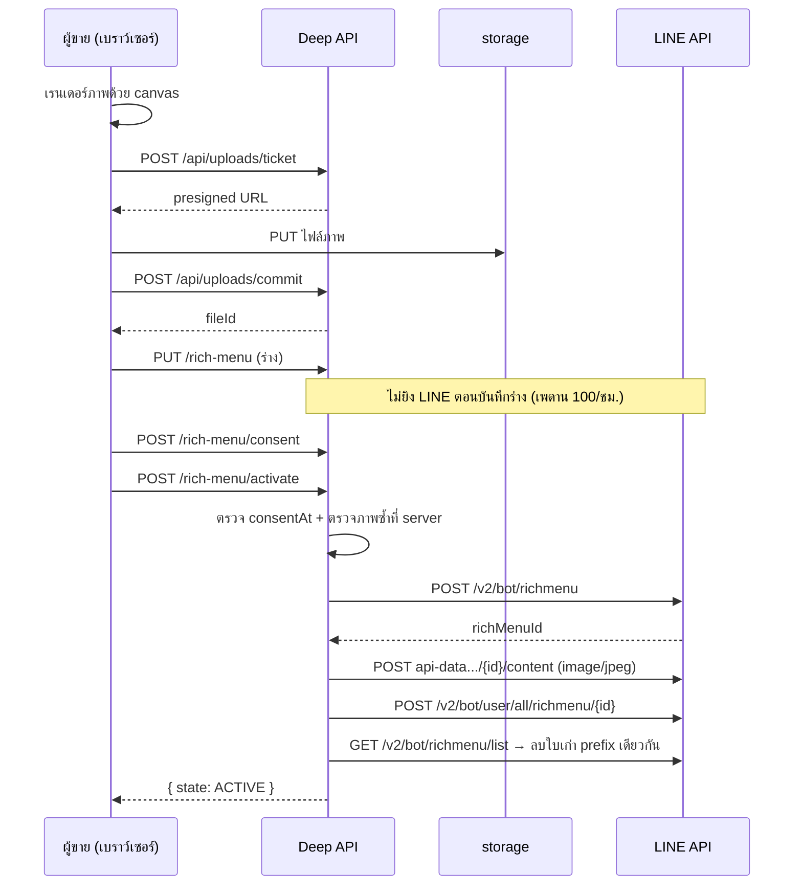

> **โมดูล:** 00045 - LINE Rich Menu · **เวอร์ชัน:** 0.1 · **วันที่:** 2026-08-11

# API Contract: เมนูลัดใน LINE (Rich Menu)

---

## 1. Overview

API ของฟีเจอร์นี้เป็น **ฝั่งตั้งค่าของผู้ขายล้วน** — ไม่มี endpoint สาธารณะ และไม่มี webhook ใหม่
(postback ของลูกค้าเข้าทาง `/api/channels/line/webhook` ของ 00025 ที่มีอยู่แล้ว)

🛑 วางไว้ใต้ `api/channels/**` ซึ่งเป็น **ข้อยกเว้นที่ระบุไว้ตรง ๆ ใน `docs/SRS.md` §7.14**
ของกติกา `resolveChatScope` (ตั้งค่าเพจ = อยู่ในบริบทร้านเดียวโดยตั้งใจ) — แต่ยังต้อง scope
`shopChannelId` ด้วย `shopId` ของร้านใน `WHERE` เสมอ **นอกขอบเขต = 404 ไม่ใช่ 403**

---

## 2. Authentication

- NextAuth session ฝั่ง seller subdomain
- สิทธิ์: `Shop.userId === session.user.id` (OWNER) **หรือ** `ShopMember(role='ADMIN')`
- ทุก mutation ผ่าน `guardApi` เดิม (Origin-check + rate limit)

---

## 3. Endpoint List

| Method | Path | Purpose | ยิง LINE? |
|--------|------|---------|-----------|
| GET | `/api/channels/line/rich-menu?shopChannelId=` | อ่านร่าง + สถานะจริง | ✅ (`GET /v2/bot/user/all/richmenu`) |
| PUT | `/api/channels/line/rich-menu` | บันทึกร่าง | ❌ **ห้ามยิง** (เพดาน 100/ชม.) |
| POST | `/api/channels/line/rich-menu/consent` | บันทึกความยินยอมทับเมนูเดิม | ❌ |
| POST | `/api/channels/line/rich-menu/activate` | สร้าง+อัปโหลด+ตั้ง default+เก็บกวาด | ✅ |
| POST | `/api/channels/line/rich-menu/deactivate` | คืนเมนูเดิม | ✅ (`DELETE /v2/bot/user/all/richmenu`) |

ภาพเมนูไม่มี endpoint ของตัวเอง — ใช้ `/api/uploads/ticket` → `PUT` เข้า storage → `/api/uploads/commit`
ที่มีอยู่แล้ว แล้วส่ง `imageFileId` มากับ `PUT` (🛑 **ห้ามส่งไฟล์ผ่าน body ของ API route** —
`docs/conventions/upload-body-size-limit.md`)

---

## 4. Endpoint Detail

### 4.1 `GET /api/channels/line/rich-menu`

**Query:** `shopChannelId` (required)

**200:**
```json
{
  "state": "NONE | DRAFT | ACTIVE | UNKNOWN",
  "templateKey": "online_sales_v1",
  "chatBarText": "เปิดเมนู",
  "buttons": [
    { "key": "catalog",  "label": "ดูสินค้า",        "action": { "type": "uri", "uri": "https://deepthailand.app/u/btshop" } },
    { "key": "shipping", "label": "เช็คสถานะพัสดุ",  "action": { "type": "postback", "data": "src=rm&action=order_status&label=เช็คสถานะพัสดุ" } },
    { "key": "address",  "label": "ส่งที่อยู่",       "action": { "type": "location" } },
    { "key": "agent",    "label": "คุยกับแอดมิน",    "action": { "type": "message", "text": "ขอคุยกับแอดมินครับ/ค่ะ" } }
  ],
  "imageFileId": "…",
  "consentAt": "2026-08-11T07:00:00.000Z",
  "canActivate": true
}
```

🛑 `state` **derive สด** ไม่ได้อ่านจากคอลัมน์ (SRS TFR-RM-01) — ถ้าเรียก LINE ไม่สำเร็จ
ให้คืน `state: "UNKNOWN"` พร้อม `stateStale: true` **ห้ามเดาว่าเป็น `ACTIVE`** เพราะสถานะนี้
คือสิ่งที่ผู้ขายใช้ตัดสินใจว่าลูกค้าเห็นอะไรอยู่

### 4.2 `PUT /api/channels/line/rich-menu`

**Body:** `{ shopChannelId, templateKey, chatBarText, buttons[], imageFileId }`

🛑 `templateKey` รับได้ทั้งคีย์เทมเพลตของระบบ และรูป `custom:<layoutKey>` (โหมดร้านอัปโหลดภาพเอง —
D-RM-2b) · จำนวนสมาชิกใน `buttons` ต้องเท่าจำนวนช่องของเลย์เอาต์นั้น ไม่งั้น `activate` จะตกด้วย
`RICH_MENU_BUTTON_COUNT_MISMATCH` (ตรวจตอนประกอบ payload ไม่ใช่ตอนบันทึกร่าง — ร้านบันทึกร่างที่ยัง
ไม่ครบไว้ก่อนได้)

**Validation (Valibot):**
- `chatBarText` 1–14 **code point** — 🛑 นับด้วย `Array.from(s).length` ไม่ใช่ `s.length`
  (สระ/วรรณยุกต์ไทยเป็น code point แยก และ `.length` ของ JS นับ UTF-16 unit ซึ่งไม่ตรงกับที่ LINE นับ)
- `buttons` 1–20 รายการ (เพดาน tappable area ของ LINE) · ทุกตัวมี `label` ไม่ว่าง
- `action.type` เป็น **allow-list** `uri | postback | message | location | datetimepicker` เท่านั้น
  (fail-closed — ชนิดที่ไม่รู้จักตอบ 400 ห้ามปล่อยผ่านไปให้ LINE ตัดสิน)
- `uri` ต้องขึ้นต้น `https://` (LINE ปฏิเสธ http — BR-RM-07)
- `imageFileId` ต้องเป็นไฟล์ที่ผู้ใช้คนนี้ claim ไว้

**200:** `{ ok: true }` · **400:** `VALIDATION_FAILED` พร้อม field

### 4.3 `POST /api/channels/line/rich-menu/consent`

**Body:** `{ shopChannelId }` → บันทึก `consentAt = now()`, `consentByUserId = session.user.id`

**200:** `{ ok: true, consentAt }`

🛑 แยกเป็น endpoint ของตัวเอง ไม่รวมกับ `activate` โดยตั้งใจ — เพื่อให้ "การยินยอม" เป็นเหตุการณ์
ที่บันทึกได้ว่าใครกดเมื่อไร แม้ร้านจะกดยินยอมแล้วเปลี่ยนใจไม่เปิดใช้ในตอนนั้น

### 4.4 `POST /api/channels/line/rich-menu/activate`

**Body:** `{ shopChannelId }`

ลำดับตาม SRS TFR-RM-03 (ห้ามสลับ) — สรุป: ตรวจ consent → สร้าง → อัปโหลดภาพ → ตั้ง default →
บันทึก → เก็บกวาดใบเก่าด้วย prefix

**200:** `{ ok: true, state: "ACTIVE", lineRichMenuId }`

**ความล้มเหลว:** ขั้นเก็บกวาด (ขั้นสุดท้าย) ล้ม → **ยังคืน 200** (เมนูใหม่ทำงานแล้ว) แต่ log ไว้ ·
ขั้น 2–5 ล้มขั้นไหนก็ตาม → ไม่บันทึกว่า ACTIVE และคืน error ที่บอกทางออกจริง

### 4.5 `POST /api/channels/line/rich-menu/deactivate`

**Body:** `{ shopChannelId }` → `DELETE /v2/bot/user/all/richmenu`

**200:** `{ ok: true, state: "UNKNOWN" }`

🛑 **ไม่ลบตัวเมนู** — ร้านต้องเปิดกลับได้โดยไม่ต้องสร้างใหม่ (BRD FR-RM-05)

---

## 5. Error Code Table

| code | HTTP | ความหมาย | ข้อความที่ผู้ใช้ควรเห็น | กดซ้ำมีผลไหม |
|------|------|----------|------------------------|---------------|
| `CHANNEL_NOT_FOUND` | 404 | เพจไม่ใช่ของร้านนี้ / ไม่มีอยู่ | "ไม่พบเพจนี้" | ไม่ |
| `NOT_LINE_CHANNEL` | 400 | เพจไม่ใช่ provider LINE | "ใช้ได้เฉพาะเพจ LINE" | ไม่ |
| `CONSENT_REQUIRED` | 409 | ยังไม่เคยยินยอม (BR-RM-01) | เปิดจอยินยอมให้กดก่อน | ไม่ (ต้องยินยอมก่อน) |
| `DRAFT_INCOMPLETE` | 400 | ยังไม่มี `imageFileId` หรือปุ่มว่าง | "ยังสร้างภาพเมนูไม่เสร็จ" | ไม่ |
| `IMAGE_REJECTED` | 400 | ภาพไม่ผ่านเกณฑ์ LINE (ขนาด/สัดส่วน/ชนิด) | บอกเกณฑ์ที่ไม่ผ่านเป็นข้อ ๆ | ไม่จนกว่าจะแก้ภาพ |
| `TOKEN_INVALID` | 409 | โทเคนของเพจใช้ไม่ได้ | "เชื่อมเพจใหม่อีกครั้ง" + ปุ่มไปหน้าเชื่อม | **ไม่** |
| `RATE_LIMITED` | 429 | ชนเพดาน 100 ครั้ง/ชม. ของ LINE | "ลองใหม่ในอีกสักครู่" | **ใช่ (รอ)** |
| `UPSTREAM_ERROR` | 502 | LINE ตอบผิดปกติอื่น ๆ | "ระบบของ LINE ขัดข้อง ลองใหม่อีกครั้ง" | ใช่ |

🛑 คอลัมน์ "กดซ้ำมีผลไหม" ต้องสะท้อนลงหน้าจอจริง — บทเรียน iShip (2026-08-06): การจัดประเภท
error ที่กดซ้ำไม่มีทางสำเร็จให้เป็น retryable คือการสั่งให้ผู้ใช้ทำสิ่งที่ไร้ผลซ้ำ ๆ

---

## 6. Sequence



---

## 7. Traceability

| SRS | API |
|-----|-----|
| TFR-RM-01 | §4.1 `state` derive สด + `stateStale` |
| TFR-RM-02 | §4.2 validate + ห้ามยิง LINE |
| TFR-RM-03 | §4.4 ลำดับ 6 ขั้น |
| TFR-RM-04 | §4.5 ไม่ลบตัวเมนู |
| NFR-RM-1 | `RATE_LIMITED` |
| NFR-RM-2 | `IMAGE_REJECTED` (ตรวจที่ server) |
| NFR-RM-4 | §2 + 404 เมื่อนอกขอบเขต |

---

## 8. สรุป

5 endpoint ฝั่งผู้ขาย ไม่มี webhook ใหม่ ไม่มี endpoint สาธารณะ จุดที่ต้องระวังคือ **ห้ามยิง LINE
ตอนบันทึกร่าง** (เพดานอัตรา) และ **`state` ต้อง derive สดเสมอ** เพราะเป็นข้อมูลที่ผู้ขายใช้ตัดสินใจว่า
ลูกค้ากำลังเห็นอะไรอยู่
