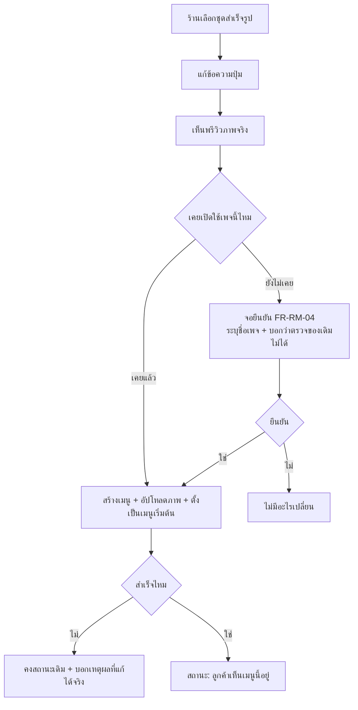
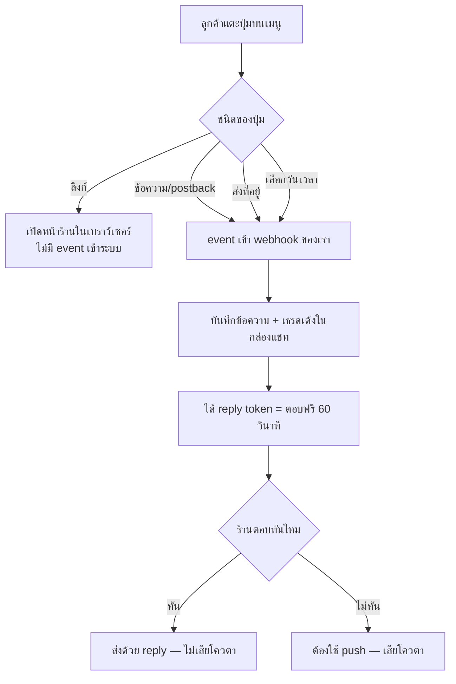

> **โมดูล:** 00045 - LINE Rich Menu
> **ประเภทเอกสาร:** Business Requirements Document (BRD) - NON-TECHNICAL
> **เวอร์ชัน:** 0.1
> **วันที่จัดทำ:** 2026-08-11
> **สถานะ:** Draft — **รอ user review (HR11)**
> **เจ้าของเอกสาร:** BA (ดู [[Feature-Docs-Ownership]])

# BRD: เมนูลัดใต้ห้องแชท LINE (Rich Menu)

---

## 1. บทนำ

### 1.1 วัตถุประสงค์ของเอกสาร

1. กำหนดว่าร้านต้องทำอะไรได้บ้างกับเมนูลัดใน LINE และวัดผลว่า "ทำได้" ด้วยเกณฑ์อะไร
2. ล็อกขอบเขตของรอบแรก และสิ่งที่จงใจไม่ทำ
3. เขียนกฎที่ **ห้ามเปลี่ยนโดยไม่ถาม** ให้ชัด โดยเฉพาะเรื่องการไม่เขียนทับเมนูเดิมของร้าน
4. ทำให้ทีมพัฒนากับฝั่งธุรกิจเข้าใจตรงกันว่าอะไรคือข้อจำกัดของ LINE (แก้ไม่ได้) กับอะไรคือทางเลือกของเรา

### 1.2 ขอบเขตของระบบ

**เมนูลัดใน LINE** คือแผงปุ่มที่ตรึงอยู่ใต้ช่องพิมพ์ในห้องแชท LINE ของลูกค้า ซึ่งร้านสร้างและเปิด/ปิด
ได้เองจากในระบบ Deep โดยไม่ต้องเข้า LINE OA Manager

**เข้าสู่ระบบ (Input):**
- ชุดปุ่มที่ร้านเลือก (จากเทมเพลตตามประเภทร้าน) + ข้อความบนปุ่มที่ร้านแก้ได้
- ข้อมูลของร้านที่ระบบมีอยู่แล้ว (ชื่อเพจ, username/slug หน้าร้าน, ประเภทร้าน)

**ออกจากระบบ (Output):**
- ภาพเมนู + โครงปุ่มที่ถูกส่งไปตั้งเป็นเมนูเริ่มต้นของเพจ LINE นั้น
- event ขาเข้าเมื่อลูกค้าแตะปุ่ม (ซึ่งเปิดหน้าต่างตอบฟรี 60 วินาทีให้ร้าน)

**ระบบที่เกี่ยวข้อง:**
- 00025 LINE OA Chat (ช่องทาง/โทเคน/ingest/หน้าต่างตอบฟรี)
- 00024 คิวงาน · 00022 พัสดุ · 00035 หน้าร้านสาธารณะ (ปลายทางของปุ่ม)
- direct upload `/api/uploads/*` (ทางเดียวที่ส่งไฟล์ภาพได้)

### 1.3 กลุ่มผู้ใช้งาน

| กลุ่มผู้ใช้ | บทบาท | สิทธิ์การใช้งาน |
|-----------|--------|----------------|
| **เจ้าของร้าน (OWNER)** | สร้าง/แก้/เปิด/ปิดเมนู | เต็ม |
| **ผู้ดูแลร้าน (`ShopMember` role ADMIN)** | เหมือนเจ้าของ | เต็ม |
| **พนักงานร้านอื่น ๆ** | ไม่เกี่ยวข้อง | ไม่เห็นเมนูตั้งค่านี้ |
| **ลูกค้าใน LINE** | ผู้ใช้ปลายทาง | แตะปุ่มเท่านั้น |

---

## 2. ความต้องการหลัก (Functional Requirements)

### 2.1 การสร้างเมนู

#### FR-RM-01: เลือกเมนูสำเร็จรูปตามประเภทร้าน

**User Story:**
> ในฐานะเจ้าของร้านที่ทำรูปไม่เป็น ฉันต้องการเลือกชุดปุ่มสำเร็จรูปที่เข้ากับธุรกิจของฉัน
> เพื่อให้มีเมนูใช้งานได้จริงโดยไม่ต้องเตรียมรูปหรือรู้ขนาดพิกเซล

**Acceptance Criteria:**
- [ ] ร้าน `ONLINE_SALES` เห็นชุดที่มีปุ่ม "ดูสินค้า" และ "เช็คสถานะพัสดุ"
- [ ] ร้าน `SERVICE_QUEUE` เห็นชุดที่มีปุ่มจองคิว/นัดเวลา ไม่ใช่ปุ่มพัสดุ
- [ ] ร้าน `LODGING` เห็นชุดที่พูดเรื่องห้องพัก
- [ ] คำบนปุ่มมาจากคลังคำเดียวกับที่ระบบใช้อยู่แล้ว ไม่ใช่คำที่พิมพ์ใหม่ซ้อนขึ้นมา
- [ ] ทุกปุ่มในทุกชุด มีปลายทางที่ทำงานอยู่แล้วบน prod (ไม่มีปุ่มตาย)

#### FR-RM-02: แก้ข้อความบนปุ่มได้

**User Story:**
> ในฐานะร้าน ฉันต้องการเปลี่ยนคำบนปุ่มให้เป็นภาษาที่ลูกค้าของฉันคุ้น เพื่อให้ลูกค้ากดถูกปุ่ม

**Acceptance Criteria:**
- [ ] แก้ข้อความได้ทุกปุ่มในชุด
- [ ] ข้อความว่างไม่ได้ (ปุ่มไม่มีคำ = ลูกค้าไม่รู้ว่ากดแล้วเกิดอะไร)
- [ ] มีเพดานความยาวที่ทำให้คำไม่ล้นกรอบปุ่มบนภาพจริง และพรีวิวสะท้อนของจริง

#### FR-RM-03: เห็นพรีวิวก่อนเปิดใช้

**User Story:**
> ในฐานะร้าน ฉันต้องการเห็นว่าเมนูจะออกมาหน้าตายังไงในมือลูกค้า ก่อนที่จะเปิดใช้จริง

**Acceptance Criteria:**
- [ ] พรีวิวคือ **ภาพเดียวกับที่จะถูกส่งไป LINE จริง** ไม่ใช่ภาพจำลองที่วาดคนละทาง
- [ ] เห็นได้ว่าปุ่มไหนอยู่ตรงไหนของแผง

### 2.2 การเปิดใช้และการถอย

#### FR-RM-04: 🛑 ขอความยินยอมก่อนเปิดใช้ครั้งแรกของแต่ละเพจ

**User Story:**
> ในฐานะร้านที่เคยตั้งเมนูไว้เองใน LINE OA Manager ฉันต้องการรู้ก่อนกดว่าเมนูเดิมของฉันจะถูกแทน
> เพื่อไม่ให้ของที่ทำไว้หายไปโดยไม่รู้ตัว

**Acceptance Criteria:**
- [ ] จอยืนยัน **ระบุชื่อเพจที่กำลังจะถูกเปลี่ยน** ไม่ใช่ข้อความลอย ๆ
- [ ] ข้อความบอกตรง ๆ ว่า **ระบบตรวจไม่ได้** ว่าเพจนี้มีเมนูเดิมอยู่หรือเปล่า (ไม่ใช่บอกว่า "ไม่มีเมนูเดิม")
- [ ] ข้อความบอกว่ากดคืนของเดิมได้ทุกเมื่อ
- [ ] ไม่ยืนยัน = ไม่มีอะไรเปลี่ยนทั้งฝั่งเราและฝั่ง LINE
- [ ] จอนี้ขึ้น**ครั้งแรกต่อเพจ** เท่านั้น การเปิด/ปิดครั้งถัด ๆ ไปไม่ต้องถามซ้ำ

**Business Flow:**
1. ร้านกด "เปิดใช้"
2. ระบบเช็คว่าเพจนี้เคยเปิดใช้ผ่าน Deep มาก่อนไหม
3. ยังไม่เคย → แสดงจอยืนยันพร้อมชื่อเพจ
4. ยืนยัน → สร้างเมนู + อัปโหลดภาพ + ตั้งเป็นเมนูเริ่มต้น
5. สำเร็จ → สถานะเป็น "ลูกค้าเห็นเมนูนี้อยู่"

#### FR-RM-05: 🛑 คืนเมนูเดิมได้เองทันที

**User Story:**
> ในฐานะร้าน ฉันต้องการยกเลิกเมนูของ Deep ได้เองในคลิกเดียว เพื่อให้เมนูที่ฉันตั้งไว้เองกลับมา

**Acceptance Criteria:**
- [ ] มีปุ่มคืนเมนูเดิมเสมอเมื่อสถานะเป็น "ลูกค้าเห็นเมนูนี้อยู่"
- [ ] กดแล้วเมนูของ Deep หยุดแสดง และเมนูที่ตั้งไว้ใน OA Manager กลับมาเอง
- [ ] เมนูที่ร้านสร้างไว้ใน Deep **ไม่ถูกลบทิ้ง** — เปิดใหม่ได้โดยไม่ต้องสร้างใหม่
- [ ] ไม่ต้องติดต่อทีมงาน ไม่มีขั้นตอนรออนุมัติ

#### FR-RM-06: สถานะบนจอต้องไม่โกหก

**User Story:**
> ในฐานะร้าน ฉันต้องการรู้ว่าตอนนี้ลูกค้าเห็นอะไรอยู่กันแน่

**Acceptance Criteria:**
- [ ] 4 สถานะตาม PRD §3.3 (ยังไม่ได้สร้าง / สร้างแล้วยังไม่เปิด / ลูกค้าเห็นเมนูนี้อยู่ / ไม่ได้ใช้เมนูของ Deep)
- [ ] สถานะ "ไม่ได้ใช้เมนูของ Deep" **ห้ามเขียนว่า "ร้านนี้ไม่มีเมนู"** ต้องบอกว่าลูกค้าอาจเห็นเมนูที่ตั้งไว้
      ใน OA Manager ซึ่งเรามองไม่เห็น
- [ ] สถานะมาจากผลจริงของการเรียก LINE ไม่ใช่ธงที่เราเดาไว้ล่วงหน้า

### 2.3 ปุ่มและปลายทาง

#### FR-RM-07: ปุ่มต้องต่อกับความสามารถที่มีตัวรับแล้ว

**User Story:**
> ในฐานะลูกค้า ฉันต้องการให้ทุกปุ่มที่กดแล้วมีอะไรเกิดขึ้นจริง

**Acceptance Criteria:**
- [ ] ปุ่มลิงก์ → เปิดหน้าร้านสาธารณะของร้านนั้นได้จริง (ลิงก์ต้องเป็น https)
- [ ] ปุ่มส่งที่อยู่ → ที่อยู่เข้าระบบตามเส้นทาง ingest location ที่มีอยู่
- [ ] ปุ่มนัดเวลา → ค่าที่ลูกค้าเลือกเข้าสู่เส้นทางคิวงาน ไม่ใช่ตกหายเงียบ
- [ ] ปุ่มคุยกับแอดมิน → ข้อความเข้ากล่องแชทและเธรดเด้งขึ้นเหมือนลูกค้าพิมพ์เอง
- [ ] 🛑 ไม่มีปุ่มใดในชุดสำเร็จรูปที่ปลายทางยังไม่ทำงาน

#### FR-RM-08: วัดได้ว่าปุ่มไหนถูกกด

**User Story:**
> ในฐานะเจ้าของธุรกิจ (Deep) ฉันต้องการรู้ว่าเมนูนี้ถูกใช้จริงไหมและปุ่มไหนมีค่า

**Acceptance Criteria:**
- [ ] event ที่เกิดจากการแตะเมนูแยกออกจาก event ที่ลูกค้าพิมพ์เองได้
- [ ] แยกได้ว่าเป็นปุ่มไหน

---

## 3. Acceptance Criteria สรุป

### 3.1 การไม่ทำลายของเดิมของร้าน

**เมื่อระบบทำงานถูกต้อง:**
- ✅ ไม่มีเพจไหนถูกตั้งเมนูโดยที่ร้านไม่ได้กดยืนยันด้วยตัวเอง
- ✅ ไม่มีเส้นทางอัตโนมัติใดตั้งเมนูให้ (รวมถึงตอนเชื่อม LINE ใหม่)
- ✅ ร้านกดคืนของเดิมได้เองเสมอ และเมนูที่สร้างไว้ไม่หาย
- ✅ ไม่มีข้อความไหนบนจอที่อ้างว่ารู้สถานะเมนูใน OA Manager

### 3.2 คุณค่าที่ต้องได้จริง

**เมื่อลูกค้าแตะปุ่ม:**
- ✅ เกิด event เข้าระบบ และร้านได้หน้าต่างตอบฟรี 60 วินาที
- ✅ ปลายทางของปุ่มนั้นทำงานจริง ไม่เงียบ

### 3.3 การสร้างภาพ

**เมื่อร้านสร้างเมนู:**
- ✅ ร้านไม่ต้องเตรียมรูปเอง
- ✅ ตัวอักษรไทยบนภาพแสดงถูกต้องด้วยฟอนต์ Anuphan
- ✅ ภาพผ่านข้อกำหนดของ LINE ก่อนถูกส่ง และถ้าไม่ผ่านต้องบอกเหตุผลที่แก้ได้จริง

---

## 4. Business Flows

### 4.1 Flow หลัก: เปิดใช้เมนู

### 4.2 Flow: ลูกค้าแตะปุ่ม

---

## 5. Use Case Scenarios

### Scenario 1: ร้านใหม่ที่ไม่เคยมีเมนู (Best Case)

**ผู้เกี่ยวข้อง:** เจ้าของร้านขายออนไลน์

**เงื่อนไขเริ่มต้น:**
- เชื่อม LINE OA กับ Deep แล้ว, ไม่เคยตั้งเมนูใน OA Manager

**ขั้นตอน:**
1. เข้าหน้าตั้งค่าช่องทาง เห็นการ์ด "เมนูลัดใน LINE" สถานะ *ยังไม่ได้สร้าง*
2. เลือกชุดสำเร็จรูปของร้านขายออนไลน์
3. แก้คำบนปุ่มหนึ่งปุ่ม → ดูพรีวิว
4. กดเปิดใช้ → ยืนยันบนจอที่ระบุชื่อเพจ

**ผลลัพธ์:**
- ลูกค้าที่เปิดห้องแชทเห็นเมนูทันที · สถานะบนจอ = *ลูกค้าเห็นเมนูนี้อยู่*

### Scenario 2: ร้านที่มีเมนูเดิมอยู่แล้วและไม่รู้ตัว (Worst Case ที่ต้องกันให้ได้)

**ผู้เกี่ยวข้อง:** ร้านที่จ้างกราฟิกทำเมนูไว้ใน OA Manager

**เงื่อนไขเริ่มต้น:**
- มีเมนูของตัวเองแสดงอยู่ · **ระบบเรามองไม่เห็น**

**ขั้นตอน:**
1. ร้านกดเปิดใช้เมนูของ Deep
2. จอยืนยันขึ้น บอกว่าถ้าเพจนี้เคยตั้งเมนูไว้ ลูกค้าจะเห็นของ Deep แทน และเราตรวจให้ไม่ได้
3. ร้านนึกออกว่ามีของเดิมอยู่ → กดยกเลิก

**ผลลัพธ์:**
- ไม่มีอะไรถูกเปลี่ยน · **ร้านไม่เสียของ และไม่ต้องมาหาสาเหตุทีหลัง**
- (ถ้าร้านยืนยันไปแล้วค่อยเปลี่ยนใจ → FR-RM-05 คืนของเดิมได้ทันที)

### Scenario 3: ยิงไปแล้ว LINE ปฏิเสธ

**ผู้เกี่ยวข้อง:** ร้านที่ token หมดอายุ

**เงื่อนไขเริ่มต้น:** โทเคนของเพจใช้ไม่ได้แล้ว

**ขั้นตอน:**
1. ร้านกดเปิดใช้
2. LINE ปฏิเสธ

**ผลลัพธ์:**
- สถานะไม่เปลี่ยนเป็น "เปิดใช้แล้ว" · จอบอกเหตุผลที่ตรงกับสิ่งที่ร้านทำได้จริง (เชื่อมเพจใหม่)
- ไม่มีข้อความชวนให้กดซ้ำในกรณีที่กดซ้ำไม่มีทางสำเร็จ

---

## 6. ความต้องการด้านคุณภาพ

### 6.1 ความถูกต้องของข้อมูล
- สถานะบนจอต้อง derive จากผลจริงของการเรียก LINE ไม่ใช่ธงที่เขียนไว้ล่วงหน้า
- ภาพที่พรีวิวต้องเป็นไฟล์เดียวกับที่ส่งไปจริง

### 6.2 ความรวดเร็ว
- เรนเดอร์พรีวิวในเบราว์เซอร์ต้องเสร็จในระดับที่รู้สึกว่าทันที (เป้าหมาย <1 วินาที)
- การเปิด/ปิดเมนูต้องมีสถานะกำลังทำงานให้เห็น ไม่ปล่อยให้จอนิ่งเฉย

### 6.3 ความน่าเชื่อถือ
- ยิง LINE สำเร็จแต่บันทึกฝั่งเราล้ม ต้องไม่ทำให้จอกับความจริงต่างกันถาวร
- กดเปิดซ้ำ/กดรัวต้องไม่สร้างเมนูซ้ำซ้อนกองอยู่ใน OA

### 6.4 ความปลอดภัย
- เฉพาะ OWNER/ADMIN ของร้านนั้น และต้อง scope ด้วยเพจที่เป็นของร้านนั้นจริง
- นอกขอบเขต = ไม่มีอยู่ (คืน 404 ไม่ใช่ 403) ตามกติกา §7.14 ของ SRS

### 6.5 ความสะดวกในการใช้งาน
- ร้านต้องทำจบได้โดยไม่ต้องรู้จักคำว่า "พิกเซล" หรือ "อัตราส่วนภาพ"
- ทัชทาร์เก็ตทุกปุ่ม ≥44px และใช้งานบนมือถือได้ (ผู้ขายจำนวนมากทำงานบนมือถือ)

---

## 7. ข้อจำกัด (Constraints)

### 7.1 ข้อจำกัดทางธุรกิจ
- ต้องเชื่อม LINE OA แล้วเท่านั้นจึงใช้ได้
- รอบแรกเป็นเทมเพลตสำเร็จรูป ไม่ใช่เครื่องมือออกแบบอิสระ

### 7.2 ข้อจำกัดทางเทคนิค
- 🛑 **มองไม่เห็นและแก้ไขเมนูที่สร้างจาก OA Manager ไม่ได้** และทิศกลับก็จริง — ข้อจำกัดถาวรของ LINE
- Rich Menu ต้องมีภาพเสมอ ไม่มีโหมดข้อความล้วน
- ส่งไฟล์ภาพต้องผ่าน direct upload เท่านั้น (เพดาน body ของ function)
- ตัวเลขข้อกำหนดภาพ (ขนาด/สัดส่วน/ชนิดไฟล์) **ยังไม่ยืนยัน** — ดู PRD §4.3 ต้องยืนยันก่อนเขียน SRS

---

## 8. กฎทางธุรกิจ (Business Rules)

### 8.1 กฎการเขียนทับ
- **BR-RM-01** เปิดใช้ครั้งแรกต่อเพจ ต้องผ่านจอยืนยันที่ระบุชื่อเพจ และบอกว่าเราตรวจของเดิมไม่ได้
- **BR-RM-02** ต้องมีทางถอยที่ร้านกดเองได้เสมอ และการถอยต้องไม่ลบเมนูที่สร้างไว้
- **BR-RM-05** ระบบห้ามตั้งเมนูเองโดยไม่มีการกดของร้าน (หลักเดียวกับ BR-LINE-18 ที่ห้ามระบบส่ง push เอง)

### 8.2 กฎของปุ่ม
- **BR-RM-03** ห้ามมีปุ่มที่ปลายทางยังไม่ทำงาน
- **BR-RM-06** คำบนปุ่มผันตามประเภทร้านโดยใช้คลังคำเดิมของระบบ ห้ามตั้งคำใหม่ซ้อน
- **BR-RM-07** ปุ่มลิงก์ต้องเป็น https เท่านั้น (LINE ปฏิเสธ http)

### 8.3 กฎขอบเขต
- **BR-RM-04** เมนูผูกกับเพจ (`ShopChannel`) ไม่ใช่ผูกกับร้าน
- **BR-RM-08** สิทธิ์ = OWNER + ADMIN เท่านั้น

---

## 9. อภิธานศัพท์

| คำศัพท์ | ความหมาย |
|---------|----------|
| **เมนูลัด / Rich Menu** | แผงปุ่มตรึงใต้ช่องพิมพ์ในห้องแชท LINE |
| **เมนูเริ่มต้น (default)** | เมนูที่แสดงกับลูกค้าทุกคนของเพจนั้น |
| **LINE OA Manager** | เครื่องมือของ LINE ที่ร้านเข้าไปตั้งค่าเองได้ แยกขาดจากระบบที่ Deep เรียกใช้ |
| **หน้าต่างตอบฟรี** | ช่วง 60 วินาทีหลังลูกค้าส่ง event ที่ร้านตอบได้โดยไม่เสียโควตา |
| **โควตา** | จำนวนข้อความ push ที่ร้านจ่ายเงินซื้อจาก LINE |

---

## 10. สรุป

**จุดเด่นของระบบ:**
- ร้านมีเมนูมืออาชีพได้โดยไม่ต้องทำรูปเองและไม่ต้องออกจาก Deep
- ปุ่มชี้ไปที่ข้อมูลจริงของร้านนั้น ซึ่งเมนูที่ทำใน OA Manager ทำไม่ได้
- ทุกการแตะปุ่มเปิดหน้าต่างตอบฟรี = ฟีเจอร์นี้ลดค่าใช้จ่ายของร้านโดยตรง ไม่ใช่แค่สวยขึ้น

**ผลลัพธ์ที่คาดหวัง:**
- สัดส่วนการตอบแบบฟรี (reply) สูงขึ้นเทียบกับก่อนเปิดใช้
- ไม่มีเคสร้านแจ้งว่าเมนูเดิมหายไปโดยไม่รู้ตัว (เป้าหมาย 0)

---

**หมายเหตุ:**
ความต้องการระดับภาพรวม/personas/KPI ดู [[PRD]] ของโมดูลนี้
technical specification ดู [[SRS]] (ยังไม่เขียน — HR11 ห้าม implement ก่อน PRD+BRD ผ่าน review)

🛑 **ประเด็นที่ต้องให้ user เคาะก่อนเขียน SRS:**
1. ชุดปุ่มสำเร็จรูปของแต่ละ `vertical` — เอาตามที่เสนอใน FR-RM-01 หรือปรับ
2. รอบแรกให้ร้านอัปโหลดภาพเมนูของตัวเองได้ไหม หรือบังคับใช้เทมเพลตอย่างเดียว
3. ปุ่ม "เช็คสถานะพัสดุ" ต้องตอบกลับอัตโนมัติ (= ระบบตอบเอง) หรือแค่เปิดเธรดให้คนตอบ
   — ถ้าตอบอัตโนมัติต้องตรวจว่าไม่ขัด BR-LINE-18 (ระบบห้ามส่ง push เอง) ในกรณีที่เกิน 60 วินาที
