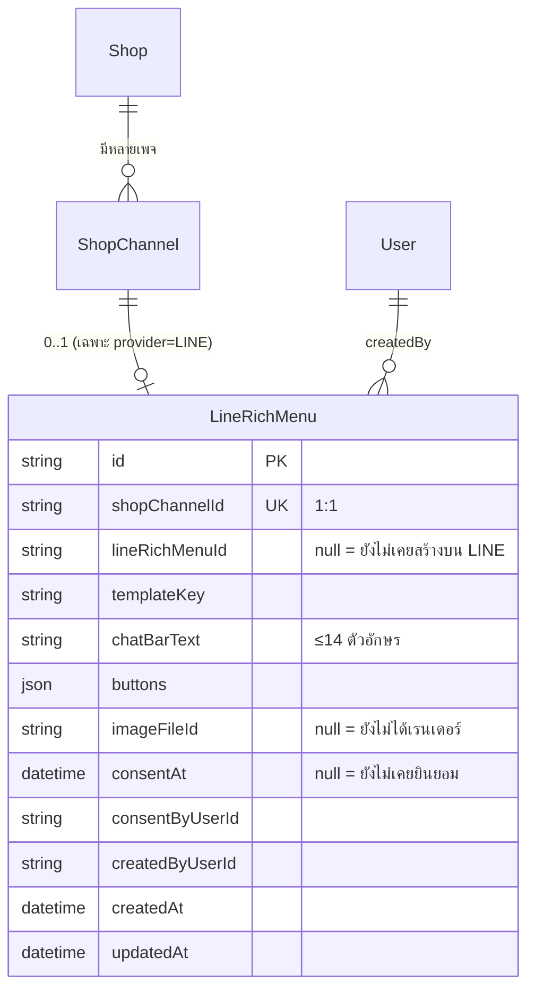

> **โมดูล:** 00045 - LINE Rich Menu · **เวอร์ชัน:** 0.1 · **วันที่:** 2026-08-11
> **เจ้าของเอกสาร:** safepay-database

# DATABASE: เมนูลัดใน LINE (Rich Menu)

---

## 1. Overview

- **ตารางใหม่ 1 ตาราง:** `LineRichMenu`
- **แก้ตารางเดิม:** ไม่มี
- **backfill:** ไม่มี (ร้านที่ยังไม่เคยตั้งเมนู = ไม่มีแถว = สถานะ `NONE` ซึ่งถูกต้องอยู่แล้ว)
- migration เป็น **additive ล้วน** ไม่มี DROP ไม่มี ALTER คอลัมน์เดิม

🛑 **ทำไมไม่เพิ่มคอลัมน์บน `ShopChannel`** (ดู SRS §5): `ShopChannel` ถูกอ่านทุก event ของ webhook
และทุกครั้งที่ส่งข้อความ การเพิ่ม 7 คอลัมน์ที่ใช้เฉพาะหน้าตั้งค่าทำให้ query ร้อนแบกของที่ไม่มีใครใช้
เหตุผลเดียวกับที่ `ShopNotificationPref` ถูกแยกออกมาแทนที่จะเป็นคอลัมน์บน `ShopMember`

---

## 2. ERD



---

## 3. Tables

### 3.1 `LineRichMenu`

| คอลัมน์ | ชนิด | Null | ค่าเริ่มต้น | คำอธิบาย |
|---------|------|------|------------|----------|
| `id` | String (uuid) | ไม่ | `uuid()` | PK |
| `shopChannelId` | String | ไม่ | — | FK → `ShopChannel.id` **`@unique`** (1 เพจ = ไม่เกิน 1 เมนูในระบบเรา) · `onDelete: Cascade` |
| `lineRichMenuId` | String | ได้ | `null` | id ที่ LINE คืนมา — 🛑 **`null` = DRAFT (ยังไม่เคยสร้างบน LINE)** ไม่ใช่ "ปิดอยู่" |
| `templateKey` | String | ไม่ | — | คีย์เทมเพลต **หรือ** โหมด+เลย์เอาต์ที่ร้านเลือก · 🛑 `custom:<layoutKey>` = ร้านอัปโหลดภาพเอง (D-RM-2b) · ค่าอื่น = เทมเพลตของระบบ (ผูกกับ `Shop.vertical`) — **ไม่มีคอลัมน์แยกโดยตั้งใจ** เพราะคอลัมน์นี้ตอบคำถาม "เมนูนี้ประกอบจากอะไร" อยู่แล้ว เพิ่มคอลัมน์ = ข้อมูลสองที่ที่ต้องคอยให้ตรงกัน (TD-RM-8) · อ่านด้วย `parseTemplateKey()` ซึ่ง fail-closed ถอยไป AUTO เมื่อคีย์ไม่รู้จัก |
| `chatBarText` | String | ไม่ | — | คำบนแถบเปิดเมนู — 🛑 **≤14 ตัวอักษร** (เพดานของ LINE) |
| `buttons` | Json | ไม่ | — | อาร์เรย์ปุ่ม: `{ key, label, action }` เรียงตามตำแหน่งบนภาพ |
| `imageFileId` | String | ได้ | `null` | ไฟล์ภาพใน storage ที่จะอัปโหลดไป LINE |
| `consentAt` | DateTime | ได้ | `null` | 🛑 เวลาที่ร้านกดยินยอมทับเมนูเดิม (BR-RM-01) — **`null` = ห้าม activate** |
| `consentByUserId` | String | ได้ | `null` | ใครเป็นคนยินยอม (หลักฐานเมื่อมีข้อพิพาท) |
| `createdByUserId` | String | ไม่ | — | FK → `User.id` |
| `createdAt` | DateTime | ไม่ | `now()` | |
| `updatedAt` | DateTime | ไม่ | `@updatedAt` | |

🛑 **ไม่มีคอลัมน์ `status`** โดยตั้งใจ — สถานะ 4 ค่า (SRS TFR-RM-01) **derive จากข้อมูลจริง**
(`lineRichMenuId` + ผลของ `GET /v2/bot/user/all/richmenu`) การเก็บ `status` เป็นคอลัมน์คือการสร้าง
ธงที่ต้องคอยให้ตรงกับความจริงฝั่ง LINE ซึ่งเปลี่ยนได้โดยที่เราไม่รู้ (ร้านเข้าไปตั้งเองใน OA Manager
ก็ได้) — บทเรียนเดียวกับ `docs/conventions/stored-flag-vs-owner-truth.md`

🛑 **ไม่มีคอลัมน์เก็บ "เมนูใบเก่าที่รอลบ"** โดยตั้งใจ — การเก็บกวาดใช้ **prefix ของชื่อเมนู**
(`deep:{shopChannelId}:`) แล้วลบทุกใบที่ไม่ใช่ใบปัจจุบัน (SRS TFR-RM-03 ขั้น 6) วิธีนี้เก็บได้แม้แต่
ใบที่ค้างจากรอบที่ล้มกลางทาง ซึ่งคอลัมน์ติดตามทำไม่ได้ (ใบที่ล้มก่อนบันทึกจะไม่มีใครจำ)

---

## 4. Indexes

| Index | คอลัมน์ | เหตุผล |
|-------|---------|--------|
| PK | `id` | |
| Unique | `shopChannelId` | บังคับ 1:1 ที่ระดับฐาน ไม่ใช่แค่ในโค้ด — กันสองแท็บกดสร้างพร้อมกันแล้วได้สองแถว |

ไม่ต้องมี index อื่น: ทุก query ของฟีเจอร์นี้เข้าทาง `shopChannelId` ซึ่งเป็น unique อยู่แล้ว
และปริมาณแถวเท่ากับจำนวนเพจ LINE ที่เชื่อม (หลักสิบ ไม่ใช่หลักล้าน)

---

## 5. Migration Plan

```sql
-- additive ล้วน: ตารางใหม่ 1 ตาราง ไม่แตะของเดิม ไม่มี backfill
CREATE TABLE "LineRichMenu" (
  "id"              TEXT PRIMARY KEY,
  "shopChannelId"   TEXT NOT NULL UNIQUE REFERENCES "ShopChannel"("id") ON DELETE CASCADE,
  "lineRichMenuId"  TEXT,
  "templateKey"     TEXT NOT NULL,
  "chatBarText"     TEXT NOT NULL,
  "buttons"         JSONB NOT NULL,
  "imageFileId"     TEXT,
  "consentAt"       TIMESTAMP(3),
  "consentByUserId" TEXT,
  "createdByUserId" TEXT NOT NULL,
  "createdAt"       TIMESTAMP(3) NOT NULL DEFAULT CURRENT_TIMESTAMP,
  "updatedAt"       TIMESTAMP(3) NOT NULL
);
```

**ข้อควรระวังตอน apply:**
- 🛑 **HR15:** push ขึ้น `main` = `prisma migrate deploy` รันบน prod ให้เองตอน build
  — ไม่ต้องสั่ง migrate ชี้ prod ด้วยมือไม่ว่ากรณีใด · ฐาน local ต้อง apply เอง (ปักหมุด localhost ตาม HR14)
  · migrate ล้ม = build ล้ม = deploy ไม่ขึ้น ของเก่ายังเสิร์ฟอยู่ ต้องแก้ไฟล์ migration แล้ว push ใหม่
- ไม่มี CHECK constraint ในไฟล์นี้ — ถ้ารอบหน้าจะเพิ่ม ต้อง **อ่านของเดิมมาต่อท้าย ห้าม hardcode รายชื่อ**
  (`docs/conventions/migration-check-constraint-additive.md`)

---

## 6. Retention / ข้อควรระวัง

- ลบเพจ (`ShopChannel`) → แถวหายตาม `CASCADE` แต่ **เมนูฝั่ง LINE ไม่หายตาม** — ถ้าร้านถอดเพจ
  ออกจาก Deep ขณะเมนูของเรายัง active ลูกค้าจะยังเห็นเมนูนั้นอยู่และเรากดคืนให้ไม่ได้แล้ว
  ⇒ **ก่อนถอดเพจต้อง deactivate ให้ก่อน** (เขียนเป็นเงื่อนไขในเส้นทางถอดเพจ ไม่ใช่แค่เตือนบนจอ)
- `imageFileId` ที่ถูกแทนที่ตอนแก้ไขจะกลายเป็นไฟล์กำพร้าใน bucket — ยอมรับได้ในรอบนี้ (ไฟล์ละ <1MB
  จำนวนเท่ากับจำนวนครั้งที่ร้านแก้เมนู) แต่บันทึกเป็นหนี้ไว้ เป็นคลาสเดียวกับไฟล์ที่ commit ไม่สำเร็จ
  ซึ่งยังไม่มีตัวเก็บกวาดเหมือนกัน
- 🛑 **จำนวนสมาชิกใน `buttons` ต้องเท่าจำนวนช่องของเลย์เอาต์ใน `templateKey` เสมอ** — DB บังคับให้ไม่ได้ ต้องกันที่ `buildRichMenuPayload()` (`RICH_MENU_BUTTON_COUNT_MISMATCH`) ไม่งั้นได้ช่องที่ไม่มี action หรือปุ่มที่ไม่มีช่อง ซึ่งเงียบสนิททั้งคู่
- `buttons` เป็น JSON ที่ **ไม่มี type บังคับที่ระดับ DB** — ต้อง validate ด้วย Valibot ทุกทางเข้า
  และเมื่อเพิ่มชนิดปุ่มใหม่ต้องอ่านแบบ allow-list + fail-closed (`docs/conventions/enum-value-removal.md`)

---

## 7. Traceability

| SRS | DATABASE |
|-----|----------|
| TFR-RM-01 (สถานะ 4 ค่า) | ไม่มีคอลัมน์ `status` — derive จาก `lineRichMenuId` + LINE |
| TFR-RM-02 (ร่าง) | `templateKey`/`chatBarText`/`buttons`/`imageFileId` |
| TFR-RM-03 ขั้น 1 (consent) | `consentAt` + `consentByUserId` |
| TFR-RM-03 ขั้น 6 (เก็บกวาด) | จงใจไม่มีคอลัมน์ติดตาม — ใช้ prefix ของชื่อเมนูแทน |
| NFR-RM-4 (scope) | FK `shopChannelId` + unique |

---

## 8. สรุป

ตารางเดียว additive ล้วน ไม่มี backfill ไม่แตะของเดิม จุดตัดสินใจที่สำคัญคือ **สิ่งที่จงใจไม่เก็บ**
(คอลัมน์ `status` และคอลัมน์ติดตามเมนูเก่า) เพราะทั้งสองอย่างคือธงที่ต้องคอยให้ตรงกับความจริงที่
อยู่นอกระบบเรา ซึ่งรีโปนี้มีบทเรียนซ้ำแล้วว่าจะเพี้ยนเสมอ
