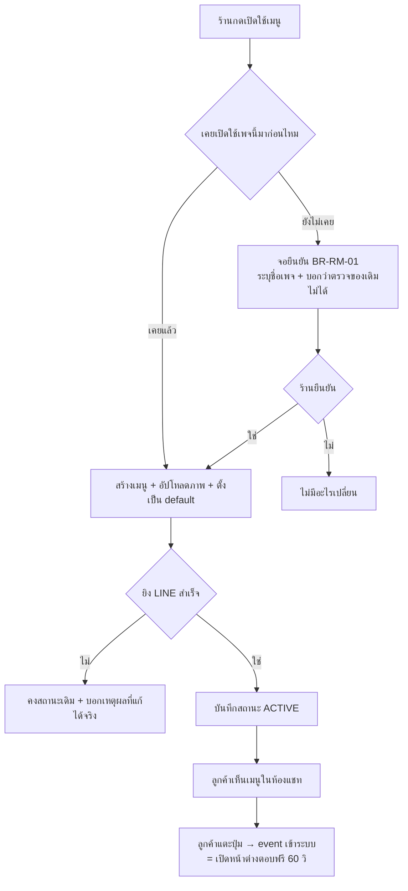

> **โมดูล:** 00045 - LINE Rich Menu
> **ประเภทเอกสาร:** Product Requirements Document (PRD)
> **เวอร์ชัน:** 0.1
> **วันที่จัดทำ:** 2026-08-11
> **สถานะ:** Draft — **รอ user review (HR11: ห้าม implement ก่อน PRD+BRD ผ่าน review)**
> **เจ้าของเอกสาร:** BA + PO + PM (ดู [[Feature-Docs-Ownership]])

# PRD: เมนูลัดใต้ห้องแชท LINE (Rich Menu)

---

## Executive Summary

Rich Menu คือแผงปุ่มที่ตรึงอยู่ **ใต้ช่องพิมพ์ในห้องแชท LINE ของลูกค้า** ตลอดเวลา — ลูกค้าเห็นก่อนพิมพ์
อะไรก็ตาม ปัจจุบันร้านที่เชื่อม LINE OA กับ Deep ไม่มีเมนูนี้เลย (ยืนยันกับ OA ทดสอบ `@502sjent`
เมื่อ 2026-08-11: `GET /v2/bot/richmenu/list` คืน `{"richmenus":[]}`) ลูกค้าที่เปิดห้องแชทมาจึงเจอ
ช่องพิมพ์เปล่า ๆ และต้องคิดเองว่าจะถามอะไร

คุณค่าทางธุรกิจของฟีเจอร์นี้ **ไม่ใช่แค่ความสะดวก แต่เป็นเรื่องต้นทุนโดยตรง** — แกนของ 00025 คือ
LINE ให้ตอบฟรีเฉพาะภายใน **reply token อายุ 1 นาที** ที่เกิดขึ้นเมื่อ *ลูกค้า* ส่ง event เข้ามา
เกินจากนั้นต้องใช้ push ซึ่งนับโควตาเป็นเงินร้านจริง **ทุกการแตะปุ่มบน Rich Menu ที่สร้าง event
(`message` / `postback` / `datetimepicker` / `location`) จะเปิดหน้าต่างตอบฟรี 60 วินาทีให้ร้านทันที**
เมนูที่ออกแบบดีจึงย้ายบทสนทนาจาก "ร้านทักไปก่อน (เสียเงิน)" ไปเป็น "ลูกค้าแตะแล้วร้านตอบ (ฟรี)"

🛑 **ข้อค้นพบที่กำหนดรูปร่างของฟีเจอร์ทั้งอัน** — เอกสารทางการของ LINE ระบุตรงตัวว่า:

> *"You can't use both tools to retrieve or edit the same instance of rich menu. A rich menu created
> with the LINE Official Account Manager is retrievable and editable only through the LINE Official
> Account Manager."*
> — https://developers.line.biz/en/docs/messaging-api/rich-menus-overview/

แปลว่า **เราไม่มีทางรู้เลยว่าร้านตั้งเมนูของตัวเองไว้ใน LINE OA Manager หรือยัง** และเมนูที่เราตั้ง
ผ่าน API จะ **ชนะเมนูนั้นเงียบ ๆ** (ลำดับความสำคัญ: per-user ผ่าน API > default ผ่าน API >
default ผ่าน OA Manager) ซ้ำร้ายคือฝั่ง OA Manager ร้านจะยัง**เห็นเมนูเดิมของตัวเองแสดงว่า "ใช้งานอยู่"**
ทั้งที่ลูกค้าไม่เห็นมันแล้ว ⇒ ด่านกันเขียนทับต้องเป็น **การขอความยินยอมจากร้านอย่างชัดแจ้ง**
ไม่ใช่การตรวจสอบทางเทคนิค เพราะแพลตฟอร์มไม่ให้เครื่องมือตรวจมาเลย

---

## 1. Business Goals & KPIs

### 1.1 เป้าหมายทางธุรกิจ

| เป้าหมาย | รายละเอียด |
|----------|-----------|
| **ลดค่าโควตา push ของร้าน** | ย้ายจุดเริ่มบทสนทนาไปอยู่ที่ฝั่งลูกค้า — ลูกค้าแตะปุ่ม = เกิด event = ร้านได้หน้าต่างตอบฟรี 60 วิ แทนที่จะต้อง push ทักไปก่อน |
| **ลดงานพิมพ์ซ้ำของแอดมิน** | คำถามซ้ำ ๆ (ดูสินค้า / เช็คสถานะพัสดุ / ขอที่อยู่ / นัดคิว) กลายเป็นปุ่มที่ลูกค้ากดเอง แทนที่จะให้แอดมินพิมพ์ตอบทุกครั้ง |
| **เก็บข้อมูลที่ระบบใช้ต่อได้ทันที** | ปุ่ม `location` ต่อกับ ingest ที่อยู่ที่มีอยู่แล้ว และ `datetimepicker` ต่อกับระบบคิวงาน (00024) — ได้ข้อมูลเป็น structured data ไม่ใช่ข้อความที่ต้องมาแกะทีหลัง |
| **ให้ร้านตั้งเองได้โดยไม่ต้องออกจาก Deep** | ปัจจุบันร้านที่อยากมีเมนูต้องไปทำใน LINE OA Manager แยกอีกระบบ และเมนูนั้นจะไม่รู้จักข้อมูลใน Deep เลย (ลิงก์ไปหน้าร้าน/คิวงานของตัวเองไม่ได้แบบอัตโนมัติ) |

### 1.2 ตัวชี้วัดความสำเร็จ (KPIs)

| KPI | คำอธิบาย | เป้าหมาย |
|-----|----------|---------|
| **สัดส่วนข้อความขาออกที่ส่งด้วย reply (ฟรี)** | `นับ ChatMessage ขาออกช่องทาง LINE ที่ส่งด้วยวิธี REPLY ÷ ขาออก LINE ทั้งหมด` เทียบก่อน/หลังเปิดเมนู | เพิ่มขึ้นอย่างมีนัย (ตั้งเลขจริงหลังมี baseline 1 เดือน) |
| **จำนวน event ที่เกิดจากการแตะเมนูต่อเธรด** | นับ event ที่มี `source = richmenu` (ต้องฝัง marker ใน `postback.data` — ดู BRD) | มี baseline ให้วัด ไม่ใช่ 0 |
| **อัตราร้านที่เปิดใช้แล้วไม่ปิดกลับภายใน 14 วัน** | ร้านที่กด "คืนเมนูเดิม" ภายใน 14 วัน = สัญญาณว่าเมนูของเราแย่กว่าของเขาเอง | ≥80% ไม่ปิดกลับ |
| **จำนวนเคสที่ร้านแจ้งว่า "เมนูเดิมของผมหายไป"** | วัดว่าด่านขอความยินยอมทำงานจริงไหม | 0 |

---

## 2. User Personas (กลุ่มผู้ใช้งาน)

### 2.1 ผู้ขายที่เชื่อม LINE OA กับ Deep แล้ว (กลุ่มหลัก)

**ข้อมูลพื้นฐาน:**
- ร้านค้าออนไลน์/ร้านบริการที่ใช้ LINE เป็นช่องทางหลักของลูกค้าไทย
- ส่วนใหญ่ไม่เคยเข้า LINE OA Manager เอง หรือเข้าแล้วตั้งเมนูไม่เป็น (ต้องเตรียมรูปเองตามขนาดที่กำหนด)
- ตาม PRODUCT.md: กลุ่มนี้มี digital literacy หลากหลาย บางส่วนเป็นผู้สูงวัย

**เป้าหมาย:**
- ให้ลูกค้าหาสิ่งที่ต้องการเจอเองโดยไม่ต้องทักถาม
- ลดค่าใช้จ่ายโควตา LINE (ร้านที่ใช้แพ็กฟรี 300 ข้อความ/เดือน หมดเร็วมาก)

**ความต้องการ:**
- ตั้งเมนูได้จบในหน้าเดียวใน Deep ไม่ต้องเตรียมรูปเอง ไม่ต้องรู้ขนาดพิกเซล
- ปุ่มต้องชี้ไปที่ของจริงของร้านตัวเอง (หน้าร้าน สินค้า คิวงาน) โดยระบบเติมลิงก์ให้

**จุดปวด (Pain Points):**
- "อยากมีเมนูเหมือนร้านใหญ่ ๆ แต่ทำรูปไม่เป็น"
- ลูกค้าทักมาถามเรื่องเดิมทุกวัน ตอบไม่ทัน พอตอบช้าเกิน 1 นาทีก็เสียเงินค่า push

### 2.2 ผู้ขายที่ตั้ง Rich Menu ไว้เองแล้วใน LINE OA Manager (กลุ่มเสี่ยง)

**ข้อมูลพื้นฐาน:**
- ร้านที่มีคนดูแลเพจ/ทีมการตลาด ทำเมนูสวย ๆ ไว้แล้ว บางร้านจ้างกราฟิกทำ
- **ระบบเรามองไม่เห็นว่าร้านกลุ่มนี้มีเมนูอยู่** (ข้อจำกัดของแพลตฟอร์ม)

**เป้าหมาย:**
- ไม่ต้องการให้ของที่ทำไว้หายไปโดยไม่รู้ตัว

**ความต้องการ:**
- ถ้าจะเปลี่ยน ต้องเป็นการตัดสินใจของเขาเอง และต้องกดคืนของเดิมได้เองทันที

**จุดปวด (Pain Points):**
- 🛑 ถ้าเราเปิดเมนูให้เงียบ ๆ เขาจะเห็นเมนูเดิมยัง "ใช้งานอยู่" ใน OA Manager แต่ลูกค้าเห็นของเรา
  → เป็นอาการที่ debug เองไม่ได้เลย และจะอ่านว่า "Deep ทำ LINE ของผมพัง"

### 2.3 ลูกค้าปลายทางในแอป LINE

**ข้อมูลพื้นฐาน:**
- คนทั่วไปที่แอดไลน์ร้าน มักเปิดห้องแชทมาแล้วไม่รู้จะเริ่มยังไง

**เป้าหมาย:**
- หาของ/เช็คสถานะ/นัดเวลา ให้จบโดยไม่ต้องพิมพ์

**ความต้องการ:**
- ปุ่มที่อ่านแล้วรู้ทันทีว่ากดแล้วเกิดอะไร

**จุดปวด (Pain Points):**
- พิมพ์ถามแล้วรอนาน ไม่รู้ว่าร้านเห็นหรือยัง

---

## 3. Business Requirements

### 3.1 ร้านสร้าง/เปิดใช้เมนูจากใน Deep ได้เอง

**ความต้องการ:**
- ร้านเลือกชุดปุ่มจาก "เมนูสำเร็จรูป" ที่ระบบเตรียมไว้ตามประเภทร้าน (`Shop.vertical`) แล้วปรับข้อความปุ่มได้
- ระบบสร้าง **ภาพเมนู** ให้เอง ร้านไม่ต้องอัปโหลดรูป (อัปโหลดรูปของตัวเองเป็นทางเลือกเสริม)
- ปุ่มที่ต้องมีลิงก์ ระบบเติมลิงก์ของร้านนั้นให้อัตโนมัติ (หน้าร้านสาธารณะ ฯลฯ)

**Business Rules:**
- เมนูผูกกับ **ช่องทาง LINE รายเพจ** (`ShopChannel` provider LINE) ไม่ใช่ผูกกับร้าน — ร้านที่เชื่อมหลาย OA ตั้งคนละเมนูได้
- ชุดปุ่มสำเร็จรูปต้องต่างกันตาม `vertical` (ขายออนไลน์ / บริการ-คิวงาน / บ้านพัก) ตามหลักเดียวกับ `ORDER_VOCAB`
- สิทธิ์: OWNER + `ShopMember(role='ADMIN')` เท่านั้น (ชุดเดียวกับตัวจัดหน้าร้าน 00035)

**เหตุผล:**
- อุปสรรคเดียวที่ทำให้ร้านไม่มีเมนูวันนี้คือ "ทำรูปไม่เป็น" ไม่ใช่ "ไม่อยากมี" — ถ้ายังต้องเตรียมรูปเอง
  ฟีเจอร์นี้จะไม่ถูกใช้ต่างจากการไปทำใน OA Manager

### 3.2 🛑 ไม่เขียนทับเมนูเดิมของร้านโดยไม่ได้รับความยินยอม

**ความต้องการ:**
- ก่อนเปิดใช้ **ครั้งแรกของแต่ละเพจ** ต้องมีจอที่บอกตรง ๆ ว่า: ถ้าเพจนี้เคยตั้งเมนูไว้ใน LINE OA Manager
  เมนูของ Deep จะถูกแสดงแทน และ **ระบบตรวจแทนไม่ได้ว่ามีของเดิมอยู่หรือเปล่า** ร้านต้องเป็นคนยืนยันเอง
- ต้องมีปุ่ม **"คืนเมนูเดิม"** ที่กดแล้วเมนูของ Deep หยุดแสดงทันที และเมนูที่ตั้งใน OA Manager กลับมาเอง
- หน้าจอต้องไม่พูดว่า "ร้านนี้ไม่มีเมนู" เมื่อความจริงคือ "เรามองไม่เห็น"

**Business Rules:**
- ข้อความยินยอมต้องระบุชื่อเพจที่กำลังจะถูกเปลี่ยน ไม่ใช่คำพูดลอย ๆ
- การเปิดใช้ = ตั้ง default ผ่าน API · การคืน = ยกเลิก default ผ่าน API (ทั้งคู่ย้อนกลับได้ ไม่ทำลายของเดิม)
- 🛑 ห้ามเปิดใช้ให้อัตโนมัติตอนร้านเชื่อม LINE ใหม่ ต้องเป็นการกดของร้านเสมอ

**เหตุผล:**
- นี่คือกรณีที่ **ข้อจำกัดของแพลตฟอร์มบังคับให้ต้องแก้ด้วยการออกแบบ ไม่ใช่ด้วยโค้ด** — ถ้าเราปล่อยผ่าน
  ร้านกลุ่ม 2.2 จะเจออาการที่หาสาเหตุเองไม่ได้เลย และมันจะดูเหมือนบั๊กของเราทุกประการ
- บทเรียนซ้ำในรีโปนี้: การรู้ตัวว่าเสี่ยงแล้วเขียนคอมเมนต์กำกับไม่ได้ลดความเสียหาย
  (`docs/conventions/external-payload-schema.md` — เคสที่อยู่สลับ 23 ใบ)

### 3.3 สถานะที่หน้าจอต้องบอกให้ตรงความจริง

**สถานะที่ต้องรองรับ:**

| สถานะ | ชื่อภาษาไทย | คำอธิบาย | การใช้งาน |
|-------|------------|----------|----------|
| **NONE** | ยังไม่ได้สร้าง | เพจนี้ยังไม่เคยสร้างเมนูผ่าน Deep | ชวนให้เริ่มจากเมนูสำเร็จรูป |
| **DRAFT** | สร้างไว้แล้ว ยังไม่เปิดใช้ | มีเมนูในระบบเรา แต่ยังไม่ได้ตั้งเป็น default | ให้พรีวิว + ปุ่มเปิดใช้ (ผ่านจอขอความยินยอม) |
| **ACTIVE** | ลูกค้าเห็นเมนูนี้อยู่ | ตั้งเป็น default ผ่าน API แล้ว | ให้ปุ่ม "คืนเมนูเดิม" + แก้ไข |
| **UNKNOWN** | ไม่ได้ใช้เมนูของ Deep | เราไม่ได้ตั้ง default ไว้ — **ลูกค้าอาจเห็นเมนูที่ร้านตั้งใน OA Manager ซึ่งเรามองไม่เห็น** | ห้ามเขียนว่า "ไม่มีเมนู" |

**เหตุผล:**
- `UNKNOWN` เป็นสถานะที่ต้องมีชื่อของตัวเอง เพราะ "เราไม่ได้ตั้ง" กับ "ลูกค้าไม่เห็นอะไรเลย" เป็นคนละเรื่อง
  และเราแยกสองอย่างนี้ไม่ออกด้วยข้อมูลที่แพลตฟอร์มให้

### 3.4 ปุ่มต้องต่อกับของที่ระบบทำได้จริงอยู่แล้ว

**ความต้องการ:**
- ชุดปุ่มตั้งต้นเลือกจากความสามารถที่ **มีตัวรับพร้อมแล้ว** เท่านั้น:

| ปุ่ม | ชนิด action | ต่อกับของที่มีอยู่ |
|------|------------|-------------------|
| ดูสินค้า / ดูห้องพัก | `uri` | หน้าร้านสาธารณะ `/u/{username}` หรือ `/b/{slug}` (00035) |
| ส่งที่อยู่จัดส่ง | `location` | ingest location ของ 00025 (มีแล้ว) |
| นัดเวลา / จองคิว | `datetimepicker` | ระบบคิวงาน 00024 (ต้องแมป postback → นัด) |
| คุยกับแอดมิน | `message` | เข้ากล่องแชทตามปกติ + **เปิดหน้าต่างตอบฟรี** |
| เช็คสถานะพัสดุ | `postback` | สถานะพัสดุ/`deriveShippingStage` (00022) |

**Business Rules:**
- 🛑 **ห้ามใส่ปุ่มที่ยังไม่มีตัวรับ** — ลูกค้ากดแล้วเงียบหายคือความเสียหายที่ร้ายกว่าไม่มีปุ่มนั้น
  (บทเรียนตรงจาก retro 2026-08-11 C-3 และจากตอนทำ postback ของ 00025)
- ทุกปุ่มที่สร้าง event ต้องฝังเครื่องหมายว่ามาจาก Rich Menu เพื่อให้วัด KPI ได้

**เหตุผล:**
- ฟีเจอร์นี้มีค่าก็ต่อเมื่อปลายทางของทุกปุ่มทำงานจริง เมนูที่มีปุ่มตายอยู่หนึ่งปุ่มทำลายความเชื่อมั่นทั้งเมนู

---

## 4. Business Rules & Constraints

### 4.1 กฎทางธุรกิจหลัก

| กฎ | คำอธิบาย |
|----|----------|
| **BR-RM-01 ความยินยอมก่อนเขียนทับ** | เปิดใช้ครั้งแรกต่อเพจ ต้องผ่านจอยืนยันที่บอกว่าเมนูเดิมใน OA Manager จะถูกแทน และเราตรวจแทนไม่ได้ |
| **BR-RM-02 ถอยได้เสมอ** | ต้องมีปุ่มคืนเมนูเดิมที่ร้านกดเองได้ ผลทันที ไม่ต้องติดต่อทีมงาน |
| **BR-RM-03 ไม่มีปุ่มตาย** | ทุกปุ่มในเมนูสำเร็จรูปต้องมีตัวรับที่ทำงานอยู่แล้วบน prod |
| **BR-RM-04 เมนูผูกรายเพจ** | เมนูเป็นของ `ShopChannel` ไม่ใช่ของ `Shop` |
| **BR-RM-05 ระบบไม่เปิดใช้เอง** | ไม่มีเส้นทางอัตโนมัติใดตั้ง default rich menu — ต้องมาจากการกดของร้านเท่านั้น (หลักเดียวกับ BR-LINE-18 ที่ห้ามระบบส่ง push เอง = ห้ามระบบตัดสินใจแทนร้านในเรื่องที่กระทบร้าน) |
| **BR-RM-06 คำบนปุ่มผันตามประเภทร้าน** | ใช้คลังคำเดียวกับที่มีอยู่ (`ORDER_VOCAB`) ห้ามพิมพ์คำใหม่ซ้อน (HR16) |

### 4.2 ข้อจำกัดทางธุรกิจ

| ข้อจำกัด | รายละเอียด |
|---------|-----------|
| **มองไม่เห็นเมนูของ OA Manager** | ข้อจำกัดถาวรของแพลตฟอร์ม ไม่มี workaround — เอกสาร LINE ระบุตรงตัว |
| **ร้านแก้เมนูของ Deep ใน OA Manager ไม่ได้** | ทิศกลับก็จริงเหมือนกัน เมนูที่สร้างผ่าน API แก้ได้เฉพาะผ่าน API — ต้องบอกร้านไว้ ไม่งั้นเขาจะไปหาใน OA Manager แล้วไม่เจอ |
| **ต้องมีภาพเสมอ** | Rich Menu ไม่มีโหมด "ข้อความล้วน" — ไม่มีภาพ = สร้างไม่ได้ |
| **เปลี่ยนเมนูไม่ใช่ realtime 100%** | LINE อาจใช้เวลาสักครู่กว่าลูกค้าที่เปิดห้องแชทค้างไว้จะเห็นของใหม่ (ต้องยืนยันพฤติกรรมจริงตอน SRS) |

### 4.3 ตัวเลขที่ **ยังไม่ยืนยัน** — ห้ามเขียนโค้ดโดยอ้างจากที่นี่

🛑 หน้า API reference ของ LINE เป็น SPA ที่ WebFetch อ่านไม่ได้ ตัวเลขชุดนี้มาจากบันทึกของ session
ก่อน (2026-08-11) **ต้องยืนยันซ้ำกับเอกสารทางการหรือด้วยการยิงจริงตอนเขียน SRS** ก่อนนำไปใช้:

- รูป: JPEG/PNG · **≤1MB** · กว้าง 800–2500px · สูง ≥250px · อัตราส่วน (กว้าง/สูง) ≥1.45
- จำนวนพื้นที่กดได้ต่อเมนู (MCP `create_rich_menu` จำกัดที่ **6** แต่นั่นคือเพดานของ MCP ไม่ใช่ของ LINE)
- จำนวน rich menu สูงสุดต่อ OA

ที่ **ยืนยันแล้ว** จากเอกสาร/เครื่องมือจริงเมื่อ 2026-08-11:
- ลำดับความสำคัญ: per-user (API) > default (API) > default (OA Manager)
- ระบบสองฝั่งแยกขาดจากกัน (อ้างอิงย่อหน้า Executive Summary)
- ปลายทาง: `POST /v2/bot/richmenu` → `POST /v2/bot/richmenu/{id}/content` → `POST /v2/bot/user/all/richmenu/{id}`
- ชนิด action ที่ใช้ได้: `postback` `message` `uri` `datetimepicker` `camera` `cameraRoll` `location`
  `richmenuswitch` `clipboard`
- OA ทดสอบ `@502sjent` ปัจจุบันมี **0 เมนู**

---

## 5. Out of Scope (นอกขอบเขต)

| หัวข้อ | คำอธิบาย |
|--------|----------|
| **per-user rich menu** | เมนูรายคน (เช่น ลูกค้าเก่าเห็นคนละเมนู) — เพิ่มความซับซ้อนมากและยังไม่มีคำขอ |
| **rich menu alias / เมนูหลายชั้น** | เมนูที่สลับหน้าได้ด้วย `richmenuswitch` — เก็บไว้รอบถัดไป |
| **ตัวแก้ภาพในตัว (ลากวางไอคอน/เปลี่ยนสีทีละปุ่ม)** | รอบแรกใช้เทมเพลตสำเร็จรูป + แก้ข้อความปุ่ม เท่านั้น |
| **ตั้งเวลาเปิด/ปิดเมนูตามช่วงเวลา** | OA Manager มีให้ แต่ของเรายังไม่ทำ |
| **อ่าน/ย้ายเมนูเดิมจาก OA Manager มาให้** | **ทำไม่ได้ทางเทคนิค** (ระบบสองฝั่งแยกขาด) |
| **Rich Menu ของ Messenger/IG** | Meta มีแนวคิดคนละแบบ (persistent menu) — คนละฟีเจอร์ |

---

## 6. Risks & Mitigation

### 6.1 ความเสี่ยงทางธุรกิจ

| ความเสี่ยง | ผลกระทบ | ระดับความรุนแรง | แนวทางแก้ไข |
|-----------|---------|-----------------|-------------|
| **เมนูที่ร้านทำไว้เองถูกแทนโดยร้านไม่รู้ตัว** | ร้านโกรธ/เลิกใช้ และหาสาเหตุเองไม่ได้เพราะ OA Manager ยังโชว์ของเดิมว่าใช้งานอยู่ | **สูง** | BR-RM-01 จอขอความยินยอมระบุชื่อเพจ + BR-RM-02 ปุ่มคืนของเดิม + สถานะ `UNKNOWN` ที่ไม่โกหก |
| **เมนูสำเร็จรูปไม่ตรงกับธุรกิจร้าน** | ร้านเปิดแล้วปิด กลายเป็นฟีเจอร์ที่ไม่มีใครใช้ | กลาง | แยกชุดตาม `vertical` + ให้แก้ข้อความปุ่มได้ + วัด KPI "ไม่ปิดกลับใน 14 วัน" |
| **ลูกค้ากดปุ่มแล้วเงียบ** | เสียความเชื่อมั่นทั้งเมนู | **สูง** | BR-RM-03 ห้ามมีปุ่มที่ยังไม่มีตัวรับ |

### 6.2 ความเสี่ยงทางเทคนิค

| ความเสี่ยง | ผลกระทบ | แนวทางแก้ไข |
|-----------|---------|-------------|
| **สร้างภาพบน server ได้ฟอนต์ไทยไม่ครบ** | เมนูออกมาเป็นสี่เหลี่ยม/ฟอนต์ผิด ซึ่งเป็นของที่ลูกค้าปลายทางเห็น | เรนเดอร์ด้วย canvas **ในเบราว์เซอร์ของร้าน** ที่มี Anuphan โหลดอยู่แล้ว แล้วอัปโหลดผ่าน `/api/uploads/*` (เส้นทาง direct upload ที่มีอยู่แล้ว — ห้ามส่งไฟล์ผ่าน body ของ function) |
| **ภาพเกิน 1MB** | LINE ปฏิเสธ | บีบอัดฝั่ง client + ตรวจขนาดก่อนส่ง และ **ตรวจซ้ำที่ server ก่อนยิงเข้า LINE** (ตัวเลขจาก client ไม่ใช่ด่าน) |
| **ยิง LINE สำเร็จแต่บันทึกฝั่งเราล้ม** | สถานะบนจอไม่ตรงกับความจริงที่ลูกค้าเห็น | ทำตามบทเรียน 00038: ต้องมี error boundary หลังเรียกสำเร็จ และสถานะบนจอต้อง derive จากผลจริง ไม่ใช่ธงที่เดาไว้ล่วงหน้า |
| **token ของ OA หมดอายุ** | เปิด/ปิดเมนูไม่ได้แบบเงียบ | ใช้เส้นทาง token เดียวกับ 00025 (S-9 refactor) + แสดงสถานะ `TOKEN_INVALID` แบบเดียวกับที่ทำไว้แล้ว |

---

## 7. Glossary

| คำศัพท์ | ความหมาย |
|---------|----------|
| **Rich Menu** | แผงปุ่มตรึงใต้ช่องพิมพ์ในห้องแชท LINE ของลูกค้า |
| **default rich menu** | เมนูที่แสดงกับผู้ใช้ทุกคนที่เป็นเพื่อนกับ OA (ต่างจาก per-user) |
| **LINE OA Manager** | เครื่องมือของ LINE ที่ร้านเข้าไปตั้งค่าเองได้ — **แยกขาดจาก Messaging API** |
| **reply token** | โทเคนอายุ 1 นาทีที่เกิดเมื่อลูกค้าส่ง event เข้ามา ใช้ตอบได้ฟรี 1 ครั้ง |
| **push** | การส่งข้อความที่ไม่ได้ใช้ reply token — **นับโควตา = เงินร้าน** |
| **tappable area** | พื้นที่กดได้บนภาพเมนู (พิกัดสี่เหลี่ยม + action) |

---

## 8. Success Metrics

| ตัวชี้วัด | ค่าที่คาดหวัง | วิธีวัด |
|----------|---------------|--------|
| ร้านที่เชื่อม LINE และเปิดใช้เมนู | ≥50% ภายใน 1 เดือนหลังปล่อย | นับ `ShopChannel` LINE ที่มีสถานะ ACTIVE |
| สัดส่วนขาออกที่เป็น reply (ฟรี) | สูงขึ้นเทียบ baseline ก่อนเปิด | query วิธีส่งของข้อความขาออก LINE |
| เคส "เมนูเดิมหาย" | 0 | คำร้องเรียนจากร้าน |
| ปุ่มที่ถูกกดมากที่สุด | มีข้อมูลให้จัดอันดับ | marker ใน `postback.data` |

---

## 9. Dependencies & Assumptions

### 9.1 Dependencies

| ระบบ/ส่วนประกอบ | ความสัมพันธ์ |
|-----------------|-------------|
| **00025 LINE OA Chat** | ต้องมี `ShopChannel` provider LINE ที่เชื่อมแล้วและ token ใช้ได้ |
| **ingest location (00025)** | ปลายทางของปุ่ม "ส่งที่อยู่" |
| **ระบบคิวงาน 00024** | ปลายทางของปุ่ม `datetimepicker` |
| **หน้าร้านสาธารณะ 00035** | ปลายทางของปุ่ม `uri` |
| **direct upload `/api/uploads/*`** | ทางเดียวที่อนุญาตให้ส่งไฟล์ภาพ (เพดาน body 4.5MB ของ Vercel) |
| **`ShopMember` role** | เกณฑ์สิทธิ์ |

### 9.2 Assumptions

- ร้านที่จะใช้ฟีเจอร์นี้เชื่อม LINE OA กับ Deep เรียบร้อยแล้ว
- ร้านยอมรับได้ว่าเมนูที่สร้างจาก Deep จะแก้ไขใน OA Manager ไม่ได้ (จะบอกไว้บนจอ)
- การเปิด/ปิดเมนูไม่ต้องขอสิทธิ์เพิ่มจาก LINE (ยืนยันแล้วว่าใช้ token เดิมได้ — MCP `line-bot` เรียก
  `get_rich_menu_list` สำเร็จด้วย token ปัจจุบัน)

---

## 10. Appendix

### 10.1 ตัวอย่าง User Journey

**Scenario: ร้านขายออนไลน์เปิดเมนูครั้งแรก**

1. ร้านเข้าหน้าตั้งค่าช่องทาง → เห็นการ์ด "เมนูลัดใน LINE" สถานะ *ไม่ได้ใช้เมนูของ Deep*
2. กด "สร้างเมนู" → ระบบเสนอชุดสำเร็จรูปของร้านขายออนไลน์ (ดูสินค้า · เช็คสถานะพัสดุ · ส่งที่อยู่ · คุยกับแอดมิน)
3. ร้านแก้ข้อความปุ่มเล็กน้อย → เห็นพรีวิวภาพเมนูจริงที่เรนเดอร์ในเบราว์เซอร์
4. กด "เปิดใช้" → **จอยืนยันขึ้น**: *"เพจ «BT สาขา สุขสวัสดิ์» — ถ้าเพจนี้เคยตั้งเมนูไว้ใน LINE OA Manager
   ลูกค้าจะเห็นเมนูของ Deep แทน ระบบตรวจให้ไม่ได้ว่ามีของเดิมอยู่หรือเปล่า และคุณกดคืนของเดิมได้ทุกเมื่อ"*
5. ร้านยืนยัน → สถานะเป็น *ลูกค้าเห็นเมนูนี้อยู่*
6. ลูกค้าเปิดห้องแชท เห็นเมนู กด "เช็คสถานะพัสดุ" → เกิด postback → **ร้านได้หน้าต่างตอบฟรี 60 วิ**

**Scenario: ร้านที่มีเมนูเดิมอยู่แล้ว แล้วเปลี่ยนใจ**

1. ร้านเปิดใช้เมนูของ Deep ไป แล้วลูกค้าทักว่าเมนูเปลี่ยน
2. ร้านเข้ามากด **"คืนเมนูเดิม"**
3. ระบบยกเลิก default ที่ตั้งผ่าน API → เมนูที่ร้านตั้งไว้ใน OA Manager กลับมาแสดงเอง
4. สถานะกลับเป็น *ไม่ได้ใช้เมนูของ Deep* พร้อมข้อความว่าเมนูที่สร้างไว้ยังอยู่ เปิดใหม่ได้ทุกเมื่อ

### 10.2 Flow การเปิดใช้

---

**หมายเหตุ:**
เอกสารนี้เป็นความต้องการทางธุรกิจ ไม่มีรายละเอียดทางเทคนิค
Functional Requirements / User Story / Acceptance Criteria ดู [[BRD]] ของโมดูลนี้
technical specification ดู [[SRS]] ของโมดูลนี้ (ยังไม่เขียน — รอ PRD+BRD ผ่าน review ก่อนตาม HR11)
