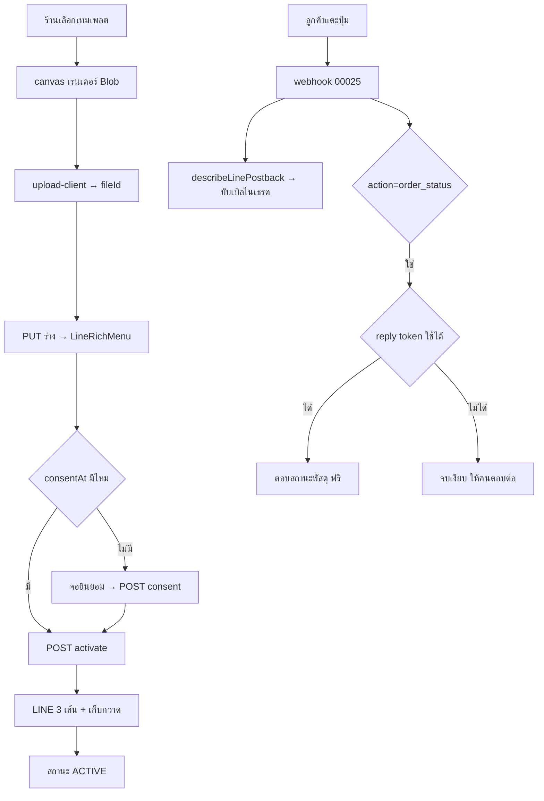

> **โมดูล:** 00045 - LINE Rich Menu · **เวอร์ชัน:** 0.1 · **วันที่:** 2026-08-11

# SDS: เมนูลัดใน LINE (Rich Menu)

---

## 1. บทนำ & References

ออกแบบระดับ component/ไฟล์ ต่อจาก SRS. ทุกตัวเลขของแพลตฟอร์มอ้าง **PRD §4.3** ที่เดียว
(ห้ามพิมพ์ซ้ำในโค้ด — ต้องเป็นค่าคงที่ใน `src/lib/line/constants.ts`)

🛑 **ก่อนเขียน frontend ต้องผ่าน `safepay-ux` (HR8)** — SDS นี้ระบุ "มีอะไรบ้าง" ไม่ได้ระบุ
"หน้าตาเป็นอย่างไร" หน้าตาต้องมาจาก Design Spec ของ ux

---

## 2. Architecture Overview

| ชั้น | ของใหม่ | ของเดิมที่ใช้ซ้ำ |
|------|---------|------------------|
| lib (pure) | `src/lib/line/rich-menu.ts` · `src/lib/line/rich-menu-templates.ts` | `constants.ts` · `postback.ts` · `reply-window.ts` |
| lib (client) | `src/lib/line/rich-menu-canvas.ts` (เรนเดอร์ภาพ) | `@/lib/upload-client` |
| service | `src/services/line-rich-menu.service.ts` | `channel-chat.service.ts` (โทเคน/ส่งข้อความ) |
| api | `src/app/api/channels/line/rich-menu/**` | `/api/uploads/*` · `guardApi` |
| ui | หน้าตั้งค่าใต้ `(paces)/seller/settings/channels/**` | `pacesToast` · `pacesConfirm` |
| webhook | ตัวจัดการ `action=order_status` | `/api/channels/line/webhook` ทั้งเส้น |

---

## 3. Component Design

### 3.1 `src/lib/line/rich-menu-templates.ts` (pure)
SSOT ของชุดปุ่มต่อ `Shop.vertical` (มติ D-RM-1)

```ts
export type RichMenuButton = { key: string; label: string; action: RichMenuAction }
export type RichMenuTemplate = { key: string; vertical: ShopVertical; chatBarText: string; buttons: RichMenuButton[] }
export function templatesFor(vertical: ShopVertical): RichMenuTemplate[]
```

- คำบนปุ่มต้องดึงจาก `ORDER_VOCAB` **ห้ามพิมพ์คำใหม่ซ้อน** (BR-RM-06 / HR16)
- 🛑 `chatBarText` ตั้งต้นของทุกเทมเพลตต้อง ≤14 code point — มีเทส `[blocker]` วนทุกเทมเพลตยืนยัน
  (ถ้าใครเพิ่มเทมเพลตใหม่ด้วยคำยาวเกิน จะแดงทันทีแทนที่จะไปเจอตอน LINE ปฏิเสธบน prod)

### 3.2 `src/lib/line/rich-menu.ts` (pure)
```ts
export function buildRichMenuPayload(input): LineRichMenuObject   // ประกอบ areas/bounds จากจำนวนปุ่ม
export function richMenuNamePrefix(shopChannelId: string): string // "deep:{id}:"
export function isOwnRichMenuName(name: string, shopChannelId: string): boolean
export function validateRichMenuImage(meta): { ok: true } | { ok: false; reasons: string[] }
export function countChatBarText(s: string): number               // Array.from().length
```

- `buildRichMenuPayload` คำนวณพิกัดปุ่มจากกริดคงที่ (2×2 / 2×3) ให้ **ตรงกับที่ canvas วาดเป๊ะ**
  🛑 กริดต้องมาจากค่าคงที่ชุดเดียวที่ทั้ง canvas และ payload อ่าน — ถ้าสองฝั่งคำนวณเอง วันหนึ่งจะเพี้ยน
  แล้ว **ลูกค้าจะกดโดนปุ่มผิด** โดยไม่มี tsc/เทสตัวไหนฟ้อง (คลาสเดียวกับ HR16)

### 3.3 `src/lib/line/rich-menu-canvas.ts` (client-only)
เรนเดอร์ภาพ 2500×1686 ด้วย `<canvas>` แล้วคืน `Blob` (JPEG)
- 🛑 ฟอนต์: ต้อง `await document.fonts.ready` ก่อนวาด ไม่งั้นได้ฟอนต์ fallback (ตัวอักษรไทยจะเพี้ยน
  และผู้ใช้จะไม่รู้เลยเพราะภาพ "ออกมาแล้ว")
- บีบอัดจนได้ ≤1MB — 🛑 **ห้ามเขียนบันไดคุณภาพหลายขั้นแบบเผื่อ ๆ** ให้วัดจริงก่อนว่าต้องกี่ขั้น
  (บทเรียน P-7 ใน retro 2026-08-11: บันได 4 ขั้นที่ขั้น 2–4 ไม่มีทางถูกเรียก)
- ภาพที่พรีวิวต้องเป็น `Blob` เดียวกับที่อัปโหลด ไม่เรนเดอร์สองรอบ (NFR-RM-3)

### 3.4 `src/services/line-rich-menu.service.ts`
```ts
getRichMenuState(shopId, shopChannelId)
saveDraft(...)                  // ไม่ยิง LINE
recordConsent(...)
activate(shopId, shopChannelId, actorUserId)
deactivate(shopId, shopChannelId)
```
- ทุกตัว scope `shopChannelId` ด้วย `shopId` ใน `WHERE` (NFR-RM-4)
- โทเคนอ่านผ่าน service เดียวกับ 00025 (S-9 refactor) **ห้ามถอดรหัสโทเคนเองในไฟล์นี้**
- `activate` ทำตาม 6 ขั้นของ SRS TFR-RM-03 — 🛑 **ขั้น 2–5 ต้องมี error boundary**: ยิง LINE
  สำเร็จแล้วเขียน DB ล้ม ต้องไม่จบด้วยสถานะที่จอกับความจริงต่างกัน (บทเรียน 00038 Critical #2)

### 3.5 ตัวจัดการ `action=order_status` (D-RM-3)
วางใน `src/services/line-rich-menu-reply.service.ts` แยกจาก service ตั้งค่า

```ts
export async function replyOrderStatus(ctx): Promise<'REPLIED' | 'NO_TOKEN' | 'NO_ORDER'>
```
- หาออเดอร์: ฟังก์ชันบริสุทธิ์ `pickOrderForStatusReply(orders)` = ใบล่าสุดที่ยังไม่ปิด + เทส
- ข้อความ: ประกอบจาก `deriveShippingStage()` **ตัวเดียวกับ `/orders`** (HR16) และ **ต้องมีเลขออเดอร์**
  เพื่อให้ลูกค้าที่มีหลายใบตรวจได้เองว่าเป็นใบไหน
- 🛑 `NO_TOKEN` = **จบเงียบ ห้ามส่ง push** (BR-LINE-18) — มีเทส `[blocker]` ที่พิสูจน์ว่าเส้นทางนี้
  ไม่เรียกตัวส่งแบบ push เลย ไม่ใช่แค่เทสว่า "ผลลัพธ์เป็น NO_TOKEN"

---

## 4. Data Flow



---

## 5. Integration Points

| ระบบ | จุดต่อ | ข้อควรระวัง |
|------|--------|-------------|
| 00025 LINE | โทเคน · webhook · `reply-window` · `postback.ts` | ตัวรับ postback มีอยู่แล้ว **ห้ามเขียนใหม่** |
| 00022 พัสดุ | `deriveShippingStage()` | ห้ามคำนวณสถานะเอง |
| 00024 คิวงาน | ปุ่ม `datetimepicker` | postback ที่ได้ต้องมีปลายทางจริงก่อนใส่ปุ่มนี้ (BR-RM-03) |
| 00035 หน้าร้าน | ปุ่ม `uri` | ต้องเป็น https · ร้านที่ยังไม่มี slug/username ต้องซ่อนปุ่มนี้ ไม่ใช่ส่งลิงก์เสีย |
| direct upload | `@/lib/upload-client` | ห้ามส่งไฟล์ผ่าน body ของ route |

---

## 6. Technical Decisions

| # | ตัดสินใจ | เหตุผล | ทางเลือกที่ไม่เอา |
|---|----------|--------|-------------------|
| TD-RM-1 | เรนเดอร์ภาพฝั่งเบราว์เซอร์ | server ไม่มี Anuphan · ไม่ต้องเพิ่ม headless renderer บน Vercel | เรนเดอร์บน server (ฟอนต์ไทยเพี้ยนเงียบ) |
| TD-RM-2 | ไม่เก็บคอลัมน์ `status` | สถานะจริงอยู่ฝั่ง LINE และเปลี่ยนได้โดยเราไม่รู้ | เก็บธง (จะเพี้ยนแบบ `stored-flag-vs-owner-truth`) |
| TD-RM-3 | เก็บกวาดเมนูเก่าด้วย prefix ของชื่อ | เก็บได้แม้ใบที่ค้างจากรอบที่ล้มกลางทาง | คอลัมน์ติดตาม (จำใบที่ล้มก่อนบันทึกไม่ได้) |
| TD-RM-4 | `consent` เป็น endpoint แยก | บันทึกได้ว่าใครยินยอมเมื่อไร แม้ยังไม่กดเปิดใช้ | ยัดรวมใน activate |
| TD-RM-5 | ตอบสถานะพัสดุด้วย reply เท่านั้น | BR-LINE-18 — ระบบห้ามใช้เงินร้านเอง | fallback push (ผิดกฎเหล็ก) |
| TD-RM-6 | กริดพิกัดปุ่มเป็นค่าคงที่ชุดเดียว | canvas กับ payload ต้องตรงกัน ไม่งั้นลูกค้ากดโดนปุ่มผิดเงียบ ๆ | ให้แต่ละฝั่งคำนวณเอง |

---

## 7. Traceability

| SRS | SDS |
|-----|-----|
| TFR-RM-01 | §3.4 `getRichMenuState` · TD-RM-2 |
| TFR-RM-02 | §3.4 `saveDraft` · §3.1 เทมเพลต |
| TFR-RM-03 | §3.4 `activate` · TD-RM-3 |
| TFR-RM-04 | §3.4 `deactivate` |
| TFR-RM-05 | TD-RM-3 (สร้างใหม่ทุกครั้ง) |
| TFR-RM-06 | §3.5 ทั้งหัวข้อ · TD-RM-5 |
| TFR-RM-07 | §3.1 (`src=rm` ใน data) |
| NFR-RM-2 | §3.2 `validateRichMenuImage` (เรียกที่ server) |

---

## 8. สรุป

ของใหม่มี 5 ไฟล์ lib/service + 5 route + 1 หน้าจอ และ **ไม่แตะเส้นทางขาเข้าของ 00025 เลย**
ความเสี่ยงที่ออกแบบไว้กันโดยเฉพาะคือ 3 อย่างที่ *ไม่มีเครื่องมือไหนจับได้*: ฟอนต์ fallback ตอน
เรนเดอร์ · พิกัดปุ่มระหว่าง canvas กับ payload ไม่ตรงกัน · และการ fallback ไป push ตอนตอบสถานะพัสดุ
