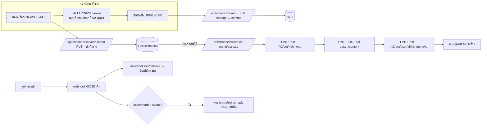

> **โมดูล:** 00045 - LINE Rich Menu · **เวอร์ชัน:** 0.1 · **วันที่:** 2026-08-11
> **สถานะ:** Draft — เขียนหลัง PRD+BRD ผ่าน review และ user เคาะ D-RM-1..3 แล้ว
> **เจ้าของเอกสาร:** safepay-planner

# SRS: เมนูลัดใน LINE (Rich Menu) — Technical

---

## 1. บทนำ

### 1.1 ขอบเขตทางเทคนิค
ระบบให้ร้านสร้าง/เปิด/ปิด rich menu ของเพจ LINE ตัวเองจากใน Deep โดย:
- เรนเดอร์ภาพเมนู **ในเบราว์เซอร์ของร้าน** (canvas) แล้วอัปโหลดผ่าน direct upload ที่มีอยู่
- ยิง Messaging API 3 เส้นเพื่อสร้าง → อัปโหลดภาพ → ตั้ง default
- รับ postback ตอนลูกค้าแตะปุ่ม ผ่าน webhook เดิมของ 00025 (ตัวรับมีอยู่แล้ว)

### 1.2 เอกสารอ้างอิง
- ข้อเท็จจริงของแพลตฟอร์มทั้งหมด (ตัวเลข/ปลายทาง/ข้อจำกัด): **PRD §4.3** — ยืนยันกับ
  `github.com/line/line-developers-docs-source` แล้ว ห้ามเขียนตัวเลขใหม่จากที่อื่น
- มติ D-RM-1..3: **PRD §4.4**
- FR/BR: **BRD §2, §8**

---

## 2. ภาพรวมสถาปัตยกรรม

**หลักการ:** ฟีเจอร์นี้ **ไม่สร้างเส้นทางใหม่ฝั่งขาเข้าเลย** — ใช้ webhook/ingest/reply-window ของ 00025
ทั้งหมด สิ่งที่เพิ่มคือฝั่งตั้งค่า (seller) กับตัวจัดการ postback หนึ่งชนิด

---

## 3. Technical Functional Requirements

### TFR-RM-01 สถานะเมนูของแต่ละเพจ
สถานะ 4 ค่าตาม PRD §3.3 **derive จากข้อมูลจริง ห้ามเก็บเป็นธงอิสระ**:

| สถานะ | เกณฑ์ |
|-------|------|
| `NONE` | ไม่มีแถว `LineRichMenu` ของ `shopChannelId` นั้น |
| `DRAFT` | มีแถว แต่ `lineRichMenuId = null` |
| `ACTIVE` | มีแถว และ `lineRichMenuId` ตรงกับผลของ `GET /v2/bot/user/all/richmenu` |
| `UNKNOWN` | มีแถว แต่ `GET /v2/bot/user/all/richmenu` คืน 404 (ไม่มี default ที่ตั้งผ่าน API) |

🛑 `UNKNOWN` **ไม่ได้แปลว่า "ร้านนี้ไม่มีเมนู"** — แปลว่าเราไม่ได้ตั้ง default ไว้ ลูกค้าอาจเห็นเมนูที่ตั้ง
ใน OA Manager ซึ่งมองไม่เห็นจากฝั่ง API (BRD FR-RM-06)

### TFR-RM-02 การบันทึกร่าง
- `PUT` บันทึก `templateKey` + `chatBarText` + `buttons[]` + `imageFileId` ลงแถวเดียว (1:1 กับ `ShopChannel`)
- 🛑 **ห้ามยิง LINE ตอนบันทึกร่าง** — เพดานสร้างเมนู 100 ครั้ง/ชั่วโมง (PRD §4.3) ร้านที่แก้คำไปมา
  จะเผาเพดานหมดโดยไม่ได้อะไร
- validate: `chatBarText` 1–14 ตัวอักษร (นับด้วย `Array.from()` ไม่ใช่ `.length` — สระ/วรรณยุกต์ไทย
  เป็น code point แยก และ `.length` ของ JS นับ UTF-16 unit) · ทุกปุ่มต้องมี label ไม่ว่าง

### TFR-RM-03 การเปิดใช้ (activate)
ลำดับที่ห้ามสลับ:
1. ตรวจว่ามี `consentAt` แล้ว — ไม่มี = ปฏิเสธ (`CONSENT_REQUIRED`) **ห้ามให้ client ข้ามด้วยการยิง API ตรง**
2. `POST /v2/bot/richmenu` (name = `deep:{shopChannelId}:{timestamp}`) → ได้ `newId`
3. `POST https://api-data.line.me/v2/bot/richmenu/{newId}/content` — อ่านไฟล์จาก storage แล้วส่งเป็น binary
4. `POST /v2/bot/user/all/richmenu/{newId}`
5. บันทึก `lineRichMenuId = newId`
6. **เก็บกวาด**: `GET /v2/bot/richmenu/list` → ลบทุกใบที่ชื่อขึ้นต้น `deep:{shopChannelId}:` และไม่ใช่ `newId`

🛑 ขั้น 6 ล้มเหลว **ห้ามทำให้ทั้ง request ล้ม** — เมนูใหม่ทำงานแล้ว การเก็บกวาดไม่สำเร็จเป็นเรื่องรอง
(log ไว้ รอบหน้าเก็บต่อ) แต่ขั้น 2–5 ล้มที่ขั้นไหนก็ตาม **ต้องไม่บันทึกว่า ACTIVE**

🛑 ขั้น 2 สำเร็จแล้วขั้น 3/4 ล้ม = มีเมนูค้างบน LINE ที่ไม่มีภาพ — ขั้น 6 ของรอบถัดไปจะเก็บให้เอง
เพราะชื่อขึ้นต้นด้วย prefix เดียวกัน (นี่คือเหตุผลที่ต้องตั้งชื่อด้วย prefix ไม่ใช่ชื่อสวย ๆ)

### TFR-RM-04 การคืนเมนูเดิม (deactivate)
- `DELETE /v2/bot/user/all/richmenu` → เมนูที่ตั้งใน OA Manager กลับมาแสดงเอง
- 🛑 **ห้ามลบตัวเมนู** (`DELETE /v2/bot/richmenu/{id}`) — ร้านต้องเปิดกลับได้โดยไม่ต้องสร้างใหม่
  (BRD FR-RM-05) เก็บ `lineRichMenuId` ไว้เหมือนเดิม สถานะกลายเป็น `UNKNOWN`

### TFR-RM-05 การแก้ไข = สร้างใหม่เสมอ
LINE ไม่มี endpoint แก้เมนู และอัปโหลดภาพซ้ำลงใบเดิมไม่ได้ ⇒ การแก้ไขคือ TFR-RM-03 ทั้งชุดอีกรอบ
(ไม่ต้องขอ consent ซ้ำ — consent ผูกกับ "การเริ่มใช้เมนูของ Deep บนเพจนี้" ไม่ใช่ผูกกับเนื้อหาเมนู)

### TFR-RM-06 ตอบสถานะพัสดุอัตโนมัติ (D-RM-3)
เมื่อ webhook ได้ postback ที่ `data` มี `action=order_status`:
1. resolve `Conversation` จาก `destination` + `source.userId` (เส้นทางเดิมของ 00025)
2. หา `Customer` ของเธรด → ออเดอร์ล่าสุดของร้านนั้นที่ยังไม่ปิด
3. `deriveShippingStage()` (`src/lib/order-stage.ts`) — **ตัวเดียวกับที่ `/orders` ใช้** (HR16)
4. ประกอบข้อความ → ส่งด้วย **reply token เท่านั้น**

🛑 **กฎเหล็ก (BR-LINE-18):** ถ้า `canReplyFree()` = false (โทเคนหมดอายุ/ถูกใช้แล้ว/ไม่มี)
**ห้ามส่งด้วย push ทุกกรณี** — ไม่ส่งอะไรเลย ปล่อยให้บับเบิล "ลูกค้าแตะปุ่ม: …" ขึ้นในเธรดตามปกติ
เพื่อให้คนตอบต่อ นี่คือกฎเดียวกับที่ AI ตอบไม่ทันแล้วเก็บเป็นร่าง ห้าม fallback

- ไม่พบออเดอร์ → ตอบข้อความที่บอกทางออกจริง ("ยังไม่พบคำสั่งซื้อที่กำลังจัดส่ง — พิมพ์เลขคำสั่งซื้อ
  หรือรอสักครู่ให้แอดมินตรวจสอบให้") ไม่ใช่ "ไม่พบข้อมูล"
- ข้อความที่ระบบตอบต้องบันทึกเป็น `ChatMessage` ขาออกพร้อม `autoReplyKind='AUTO'` (มีอยู่แล้วใน
  `sendOutboundMessage`) เพื่อให้ผู้ขายเห็นว่าระบบเป็นคนตอบ ไม่ใช่เพื่อนร่วมงาน

### TFR-RM-07 ตัวชี้วัด (FR-RM-08)
`postback.data` ของทุกปุ่มต้องมี `src=rm` และ `action=<key>` — `describeLinePostback()` ที่มีอยู่แล้ว
อ่าน `label`/`action` เป็น query string อยู่แล้ว จึงไม่ต้องแก้ตัวรับ

---

## 4. Interface / API Specification

รายละเอียดเต็มดู `API.md` — สรุปที่นี่:

| Method | Path | Auth |
|--------|------|------|
| GET | `/api/channels/line/rich-menu` | Seller (OWNER/ADMIN) |
| PUT | `/api/channels/line/rich-menu` | เดียวกัน |
| POST | `/api/channels/line/rich-menu/consent` | เดียวกัน |
| POST | `/api/channels/line/rich-menu/activate` | เดียวกัน |
| POST | `/api/channels/line/rich-menu/deactivate` | เดียวกัน |

🛑 อยู่ใต้ `api/channels/**` ซึ่งเป็น **ข้อยกเว้นที่ระบุไว้ชัดใน SRS §7.14** ของกติกา `resolveChatScope`
(ตั้งค่าเพจ = ต้องอยู่ในบริบทร้านเดียวโดยตั้งใจ) — แต่ยังต้อง scope `shopChannelId` ด้วย `shopId`
ของร้านใน `WHERE` เสมอ นอกขอบเขต = 404 ไม่ใช่ 403

---

## 5. ข้อกำหนดด้านข้อมูล

ดู `DATABASE.md` — สรุป: ตารางใหม่ **1 ตาราง** `LineRichMenu` (1:1 กับ `ShopChannel`)
ไม่มีการแก้ตารางเดิม ไม่มี backfill

🛑 **ทำไมเป็นตารางใหม่ ไม่ใช่คอลัมน์บน `ShopChannel`** — `ShopChannel` เป็นตารางร้อนที่ทุกเส้นทาง
ของแชทอ่าน (webhook ทุก event, ทุกการส่งข้อความ) การเพิ่ม 6–7 คอลัมน์ที่ใช้เฉพาะหน้าตั้งค่าทำให้
payload ของ query ร้อนโตขึ้นโดยไม่มีใครใช้ และ `buttons` เป็น JSON ที่จะโตต่อในรอบถัดไป
(เทียบเคียงเหตุผลเดียวกับที่ `ShopNotificationPref` แยกออกจาก `ShopMember`)

---

## 6. Non-Functional Requirements

| NFR | ข้อกำหนด |
|-----|---------|
| **NFR-RM-1 เพดานอัตราการเรียก** | สร้างเมนูได้ 100 ครั้ง/ชั่วโมงต่อ OA — ระบบต้องไม่ยิงสร้างนอกจากตอนกด activate; ชน 429 ต้องบอกร้านว่า "ลองใหม่ในอีกสักครู่" ไม่ใช่ error ดิบ |
| **NFR-RM-2 ขนาดภาพ** | ตรวจ ≤1MB + สัดส่วน ≥1.45 + กว้าง 800–2500 + สูง ≥250 **ที่ server ก่อนยิง LINE** — ตัวเลขจาก client ไม่ใช่ด่าน (บทเรียน `upload-body-size-limit.md`) |
| **NFR-RM-3 ความสอดคล้องของสถานะ** | ยิง LINE สำเร็จแต่เขียน DB ล้ม ต้องไม่ทำให้จอกับความจริงต่างกันถาวร — สถานะ `ACTIVE` derive จาก `GET /v2/bot/user/all/richmenu` ไม่ใช่จากธงที่เราเขียน |
| **NFR-RM-4 ความปลอดภัย** | เฉพาะ OWNER/ADMIN · `shopChannelId` ต้อง scope ด้วย `shopId` ใน `WHERE` · `imageFileId` ต้องเป็นไฟล์ที่ผู้ใช้คนนั้น claim ไว้ |
| **NFR-RM-5 a11y/มือถือ** | ฟอร์มตั้งค่าใช้บนมือถือได้ · ทัชทาร์เก็ต ≥44px · ผ่าน `safepay-ux` ก่อนเขียนโค้ด (HR8) |

---

## 7. ข้อจำกัดทางเทคนิคและการพึ่งพา

- ทุกข้อใน **BRD §7.2** (immutable menu · chatBarText 14 ตัว · 100 ครั้ง/ชม. · โฮสต์อัปโหลดคนละตัว)
- พึ่ง 00025: `ShopChannel` provider LINE + โทเคน + `reply-window.ts` + webhook + `postback.ts`
- พึ่ง 00022 `deriveShippingStage()` · 00035 หน้าร้านสาธารณะ · direct upload `/api/uploads/*`
- 🛑 **เรนเดอร์ภาพต้องอยู่ฝั่งเบราว์เซอร์** — server ไม่มี Anuphan ติดตั้ง และการเพิ่ม headless
  renderer บน Vercel function เป็นงานคนละขนาด (เทียบ: preview วิดีโอที่ต้อง ffmpeg ยังไม่ทำด้วยเหตุผลเดียวกัน)

---

## 8. ความเสี่ยงเชิงสถาปัตยกรรม

| ความเสี่ยง | แนวทาง |
|-----------|--------|
| เมนูขยะสะสมบน LINE จนชนเพดาน 1000 | เก็บกวาดด้วย prefix ทุกครั้งที่ activate (TFR-RM-03 ขั้น 6) — self-healing ไม่ต้องมีตารางติดตาม |
| ร้านกด activate รัว ๆ | ปุ่มต้องมีสถานะกำลังทำงาน + server กันซ้ำระดับแถว (ใบที่กำลังสร้างค้างอยู่ = ปฏิเสธใบใหม่) |
| ภาพเรนเดอร์ต่างกันข้ามเบราว์เซอร์ | ภาพที่พรีวิวต้องเป็นไฟล์เดียวกับที่อัปโหลดจริง (ไม่เรนเดอร์สองรอบด้วยโค้ดคนละชุด) |
| `order_status` ตอบผิดใบเมื่อลูกค้ามีหลายออเดอร์ | นิยาม "ใบล่าสุดที่ยังไม่ปิด" เป็นฟังก์ชันบริสุทธิ์ + เทส และ**บอกเลขออเดอร์ในข้อความ** ให้ลูกค้าตรวจได้เอง |

---

## 9. Traceability Matrix

| BRD | SRS | หมายเหตุ |
|-----|-----|----------|
| FR-RM-01/02/03 | TFR-RM-02 | ร่าง + validate |
| FR-RM-04 | TFR-RM-03 ขั้น 1 | consent เป็นด่านฝั่ง server ไม่ใช่แค่จอ |
| FR-RM-05 | TFR-RM-04 | ห้ามลบตัวเมนู |
| FR-RM-06 | TFR-RM-01 | สถานะ 4 ค่า + `UNKNOWN` ที่ไม่โกหก |
| FR-RM-07 | TFR-RM-06, §7 | ปลายทางทุกปุ่มมีของจริง |
| FR-RM-08 | TFR-RM-07 | marker `src=rm` |
| FR-RM-09 | TFR-RM-06 | reply เท่านั้น ห้าม push |
| BR-RM-01/02 | TFR-RM-03/04 | |
| BR-RM-04/08 | §4, NFR-RM-4 | scope + สิทธิ์ |

---

## 10. สรุป

ฟีเจอร์นี้เพิ่มของฝั่งตั้งค่าเป็นหลัก และ**ไม่แตะเส้นทางขาเข้าของ 00025 เลย** จุดที่ต้องระวังที่สุด
มี 3 อย่างและทั้งหมดมาจากข้อจำกัดของ LINE ไม่ใช่จากดีไซน์ของเรา: เมนูแก้ไม่ได้ต้องสร้างใหม่ทุกครั้ง ·
`chatBarText` 14 ตัวอักษร · และการที่เรามองไม่เห็นเมนูฝั่ง OA Manager จนต้องแก้ด้วยความยินยอมแทนการตรวจสอบ
