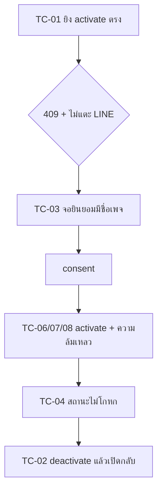

> **โมดูล:** 00045 - LINE Rich Menu · **เวอร์ชัน:** 0.1 · **วันที่:** 2026-08-11
> **เจ้าของเอกสาร:** safepay-qa

# Test Case: เมนูลัดใน LINE (Rich Menu)

---

## 1. Overview

- เคสที่ทำเครื่องหมาย **`[ห้ามข้าม]`** คือเคสที่ถ้าพลาดแล้ว **ไม่มีเครื่องมืออื่นในโปรเจกต์จับได้เลย**
  (tsc/build/theme-guard/grep ผ่านหมด) — ส่วนใหญ่เป็นเรื่อง *ความหมาย* ไม่ใช่ *รูปแบบ*
- ทุกเทสที่เขียนเป็น unit ต้อง **พิสูจน์ด้วย mutation**: คืนตรรกะผิดกลับไปแล้วต้องแดง
  ไม่ใช่แค่เขียนให้เขียว
- 🛑 **ห้ามคำสั่งลบข้อมูลแบบไม่ scope ในไฟล์เทสเด็ดขาด** (HR13) — เทสที่ต้องแตะ DB ต้อง scope
  ด้วย id ที่เทสสร้างเอง

---

## 2. Test Scenarios

### 2.1 ความยินยอมและการไม่เขียนทับ (แกนของฟีเจอร์)

| # | เคส | ขั้นตอน | ผลที่คาดหวัง |
|---|-----|---------|--------------|
| **TC-01** `[ห้ามข้าม]` | activate โดยยังไม่เคยยินยอม | ยิง `POST /activate` ตรงโดยไม่ผ่านจอ | **409 `CONSENT_REQUIRED`** และ **ไม่มีการเรียก LINE แม้แต่ครั้งเดียว** |
| **TC-02** `[ห้ามข้าม]` | deactivate ต้องไม่ลบตัวเมนู | activate → deactivate → activate อีกครั้ง | รอบสองไม่ต้องสร้างภาพ/เมนูใหม่จากศูนย์ · `lineRichMenuId` เดิมยังอยู่ในแถว |
| TC-03 | จอยินยอมต้องระบุชื่อเพจ | เปิดจอ | เห็นชื่อเพจจริงของ `ShopChannel` นั้น ไม่ใช่ข้อความลอย |
| **TC-04** `[ห้ามข้าม]` | ข้อความสถานะต้องไม่โกหก | ไม่มี default ที่ตั้งผ่าน API | สถานะ `UNKNOWN` และข้อความ**ต้องไม่มีคำว่า "ไม่มีเมนู"** — ต้องบอกว่าอาจมีเมนูที่ตั้งใน OA Manager ซึ่งเรามองไม่เห็น |
| TC-05 | ยินยอมแล้วไม่ต้องถามซ้ำ | ยินยอม → activate → deactivate → activate | จอยินยอมขึ้นครั้งเดียว |

### 2.2 ลำดับการเปิดใช้และความล้มเหลว

| # | เคส | ขั้นตอน | ผลที่คาดหวัง |
|---|-----|---------|--------------|
| **TC-06** `[ห้ามข้าม]` | ยิง LINE สำเร็จแต่เขียน DB ล้ม | mock ให้ `prisma.update` โยนหลังตั้ง default สำเร็จ | ต้องไม่จบด้วยสถานะที่จอกับความจริงต่างกันถาวร — รอบถัดไปที่เปิดหน้าต้อง derive สถานะจาก LINE ได้ถูก |
| TC-07 | ขั้นเก็บกวาดล้ม | mock `DELETE /richmenu/{id}` ให้ error | **ยังคืน 200** (เมนูใหม่ทำงานแล้ว) + มี log |
| **TC-08** `[ห้ามข้าม]` | เมนูค้างจากรอบที่ล้มกลางทาง ต้องถูกเก็บ | สร้างเมนูค้างชื่อ `deep:{id}:xxx` ไว้ → activate | ใบค้างถูกลบในขั้นเก็บกวาด · ใบที่ **ชื่อไม่ขึ้นต้นด้วย prefix ของเรา ต้องไม่ถูกแตะ** |
| TC-09 | โทเคนใช้ไม่ได้ | ตั้ง `status='TOKEN_INVALID'` | `409 TOKEN_INVALID` + ข้อความชี้ไปหน้าเชื่อมเพจใหม่ · **ไม่ชวนให้กดซ้ำ** |
| TC-10 | ชนเพดานอัตรา | mock LINE ตอบ 429 | `429 RATE_LIMITED` + ข้อความ "ลองใหม่ในอีกสักครู่" (เป็นเคสเดียวที่กดซ้ำมีผล) |
| TC-11 | กด activate รัว ๆ | ยิงพร้อมกัน 3 ครั้ง | ไม่เกิดเมนูซ้อนบน LINE เกิน 1 ใบที่ active |

### 2.3 ภาพและการ validate

| # | เคส | ขั้นตอน | ผลที่คาดหวัง |
|---|-----|---------|--------------|
| **TC-12** `[ห้ามข้าม]` | `chatBarText` ยาวเกิน | ส่ง "แตะเพื่อเปิดเมนู" (16 code point) | **400** ก่อนถึง LINE · นับด้วย `Array.from().length` ไม่ใช่ `.length` |
| **TC-13** `[ห้ามข้าม]` | เทมเพลตทุกตัวต้องผ่านเพดาน 14 | วนทุกเทมเพลตใน `templatesFor()` ทุก vertical | ทุกตัว ≤14 code point (เทสนี้จับคนที่เพิ่มเทมเพลตใหม่ด้วยคำยาวเกิน) |
| TC-14 | ภาพเกิน 1MB | ส่ง fileId ของไฟล์ 1.5MB | `400 IMAGE_REJECTED` **ที่ server** — ตัวเลขจาก client ไม่ใช่ด่าน |
| TC-15 | สัดส่วนไม่ถึง 1.45 | ภาพ 1000×800 (=1.25) | `400 IMAGE_REJECTED` พร้อมบอกว่าไม่ผ่านข้อไหน |
| TC-16 | `uri` เป็น http | ส่ง `http://…` | `400` (BR-RM-07) |
| TC-17 | `action.type` ที่ไม่รู้จัก | ส่ง `{"type":"richmenuswitch"}` (ยังไม่รองรับรอบนี้) | `400` fail-closed **ไม่ปล่อยผ่านไปให้ LINE ตัดสิน** |
| **TC-18** `[ห้ามข้าม]` | พิกัดปุ่มตรงกับที่ canvas วาด | เทียบ `buildRichMenuPayload()` กับกริดที่ canvas ใช้ | ต้องมาจากค่าคงที่ชุดเดียวกัน — ถ้าไม่ตรง **ลูกค้ากดโดนปุ่มผิดโดยไม่มีอะไรฟ้อง** |
| TC-19 | ฟอนต์ยังไม่พร้อมตอนวาด | (manual) โหลดหน้าแล้ววาดทันที | ต้อง `await document.fonts.ready` — ตัวอักษรไทยไม่เพี้ยน |

### 2.3b โหมด “ใช้ภาพของร้านเอง” (D-RM-2b)

| # | เคส | ขั้นตอน | ผลที่คาดหวัง |
|---|-----|---------|--------------|
| **TC-37** `[ห้ามข้าม]` | เลย์เอาต์ที่จำนวนช่องเท่ากันต้องให้พิกัดต่างกัน | เทียบ `top-1-bottom-2` กับ `row-3` | ทั้งคู่ 3 ช่อง แต่ `layoutBounds` ต้องไม่เท่ากัน — เท่ากันเมื่อไหร่ = **ลูกค้ากดโดนช่องผิด** |
| **TC-38** `[ห้ามข้าม]` | จำนวนปุ่มไม่เท่าจำนวนช่อง | ส่ง 2 ปุ่มพร้อม `layoutKey='grid-2x2'` (4 ช่อง) | `RICH_MENU_BUTTON_COUNT_MISMATCH` — ไม่ปล่อยให้เกิดช่องที่ไม่มี action |
| **TC-39** `[ห้ามข้าม]` | `templateKey` เพี้ยน | `custom:grid-9x9` | ถอยไปโหมด **AUTO** (fail-closed) ไม่ใช่ CUSTOM ที่ layout พัง |
| **TC-40** `[ห้ามข้าม]` | เลย์เอาต์ปรับสัดส่วนแล้วยังปูเต็มภาพเป๊ะ | `[{h:2,cols:[1]},{h:1,cols:[2,1]}]` และอีก 9 ชุด | ผลรวมพื้นที่ทุกช่อง = 2500×1686 เป๊ะ · ไม่มีคู่ไหนซ้อนกัน · ทุกช่องอยู่ในกรอบภาพ — **เงื่อนไขเดียวนี้จับได้ทั้งรูโหว่และช่องซ้อน** |
| **TC-41** `[ห้ามข้าม]` | สัดส่วนออกตามน้ำหนักจริง ไม่ใช่แบ่งเท่ากันเงียบ ๆ | `[{h:2,cols:[1]},{h:1,cols:[2,1]}]` | แถวบนสูง 1124 · แถวล่างสูง 562 (กลืนเศษ) · ช่องล่างกว้าง 1666/834 (กลืนเศษ) |
| **TC-42** `[ห้ามข้าม]` | เทมเพลตเดิม 6 แบบต้องให้พิกัด **เดิมเป๊ะ** | เทียบ `layoutBounds` ก่อน/หลังเปลี่ยนโมเดล | เท่ากันทุกช่องทุกแบบ — เมนูที่ร้านสร้างไว้แล้วบน prod ห้ามขยับแม้แต่พิกเซลเดียว |
| **TC-43** `[ห้ามข้าม]` | `isValidLayout` fail-closed | น้ำหนัก 0 / ติดลบ / ทศนิยม / เกิน 12 / ช่องรวมเกิน 20 / `null` / สตริง / แถวไม่มีช่อง (11 แบบ) | คืน `false` ทุกแบบ · `buildRichMenuPayload` โยน `RICH_MENU_LAYOUT_UNSUPPORTED` ไม่ใช่ซ่อมให้ |
| **TC-44** `[ห้ามข้าม]` | `templateKey` ไป-กลับครบ และของเดิมไม่เปลี่ยนรูป | เลย์เอาต์ตรงเทมเพลต → `custom:grid-2x2` (เหมือนเดิมเป๊ะ) · ปรับเอง → `custom:g:2*1|1*2-1` ถอดกลับได้ครบ · สเปกพัง 7 แบบ | สเปกพัง → ถอยไป AUTO ไม่ใช่ 400 |
| TC-40 | ภาพอัตราส่วน <1.45 | อัปโหลดภาพจัตุรัส | ปฏิเสธ **ก่อนอัปโหลดขึ้น storage** พร้อมข้อความบอกทางแก้ (ครอปให้กว้างขึ้น) |
| TC-41 | ภาพกว้าง <800px | อัปโหลดภาพเล็ก | ปฏิเสธก่อนอัปโหลด พร้อมบอกความกว้างจริง |
| TC-42 | ภาพใหญ่เกิน 1MB แต่บีบอัดได้ | ภาพถ่าย 4MB สัดส่วนผ่าน | ย่อ+บีบอัดอัตโนมัติจนผ่าน **ไม่บอกให้ร้านไปย่อเอง** |
| TC-43 | บีบอัดจนต่ำสุดแล้วยังเกิน | ภาพรายละเอียดสูงมาก | ปฏิเสธพร้อมทางออกที่ทำได้จริง (ใช้ภาพกราฟิกที่เรียบกว่า) |
| TC-44 | สลับโหมดไปมา | อัปโหลดรูป → สลับไป AUTO → สลับกลับ | รูปที่อัปโหลดยังอยู่ **ไม่ต้องอัปใหม่** |
| TC-45 | บันทึกโหมด CUSTOM แล้วไม่เรนเดอร์ทับ | กดบันทึกร่าง | `imageFileId` ยังเป็นไฟล์ของร้าน ไม่ถูกภาพที่ระบบวาดเขียนทับ |
| TC-46 | เส้นกริดตรงกับพิกัดจริง | เปิดเส้นแบ่งช่อง | ตำแหน่งมาจาก `layoutBounds()` ตัวเดียวกับที่ส่งให้ LINE |

### 2.4 ปุ่มและปลายทาง

| # | เคส | ขั้นตอน | ผลที่คาดหวัง |
|---|-----|---------|--------------|
| **TC-20** `[ห้ามข้าม]` | ไม่มีปุ่มตายในเทมเพลต | วนทุกปุ่มของทุกเทมเพลต | ทุกปุ่มมีปลายทางที่ทำงานจริงบน prod (BR-RM-03) |
| TC-21 | ร้านที่ยังไม่มี username/slug | ร้านที่ไม่มีหน้าร้านสาธารณะ | ปุ่มลิงก์ต้อง **ถูกซ่อน** ไม่ใช่ส่งลิงก์เสีย |
| TC-22 | marker วัดผล | แตะปุ่มใด ๆ | `postback.data` มี `src=rm` และ `action=<key>` |
| TC-23 | บับเบิลขาเข้าไม่ว่าง | แตะปุ่มที่ไม่มี label | `describeLinePostback()` ยังคืนข้อความไม่ว่าง |

### 2.5 ตอบสถานะพัสดุอัตโนมัติ (D-RM-3)

| # | เคส | ขั้นตอน | ผลที่คาดหวัง |
|---|-----|---------|--------------|
| **TC-24** `[ห้ามข้าม]` | 🛑 โทเคนหมดอายุ **ห้าม fallback ไป push** | postback เข้ามาโดย reply token ถูกใช้ไปแล้ว | **ไม่มีการส่งอะไรออกไปเลย** · เทสต้องยืนยันว่า *ตัวส่งแบบ push ไม่ถูกเรียก* ไม่ใช่แค่ผลลัพธ์เป็น `NO_TOKEN` |
| **TC-25** `[ห้ามข้าม]` | สถานะต้องมาจาก SSOT เดียว | ออเดอร์ที่ `/orders` แสดงว่า "กำลังจัดส่ง" | ข้อความที่ตอบต้องตรงกัน (มาจาก `deriveShippingStage()` ตัวเดียวกัน — HR16) |
| TC-26 | ลูกค้ามีหลายออเดอร์ | 3 ใบ ปิดไปแล้ว 1 | ตอบใบล่าสุดที่ยังไม่ปิด **และบอกเลขออเดอร์** ให้ลูกค้าตรวจเองได้ |
| TC-27 | ไม่พบออเดอร์ | ลูกค้าที่ยังไม่เคยสั่ง | ข้อความบอกทางออกจริง ไม่ใช่ "ไม่พบข้อมูล" เฉย ๆ |
| TC-28 | ข้อความติดป้ายว่าระบบตอบ | ตอบสำเร็จ | `ChatMessage` ขาออกมี `autoReplyKind='AUTO'` — ผู้ขายเห็นว่าระบบตอบ ไม่ใช่เพื่อนร่วมงาน |
| TC-29 | ตอบแล้วไม่กินโควตา | ตอบภายในหน้าต่างฟรี | ส่งด้วย reply ไม่ใช่ push (ยืนยันจากปลายทางที่ถูกเรียก) |

### 2.6 สิทธิ์และขอบเขต

| # | เคส | ขั้นตอน | ผลที่คาดหวัง |
|---|-----|---------|--------------|
| **TC-30** `[ห้ามข้าม]` | เพจของร้านอื่น | ยิงด้วย `shopChannelId` ของร้านอื่น | **404** ไม่ใช่ 403 (นอกขอบเขต = ไม่มีอยู่ — SRS §7.14) |
| TC-31 | พนักงานที่ไม่ใช่ ADMIN | เข้าด้วย role อื่น | ปฏิเสธทั้งฝั่ง API และไม่เห็นเมนูตั้งค่า |
| TC-32 | เพจที่ไม่ใช่ LINE | ส่ง `shopChannelId` ของ Messenger | `400 NOT_LINE_CHANNEL` |
| TC-33 | `imageFileId` ของคนอื่น | ส่ง fileId ที่ผู้ใช้อื่น claim | ปฏิเสธ (ไม่งั้นเป็นช่องอ้างไฟล์ข้ามร้าน) |

### 2.7 Regression ของ 00025

| # | เคส | ผลที่คาดหวัง |
|---|-----|--------------|
| **TC-34** `[ห้ามข้าม]` | ส่ง/รับข้อความ LINE ปกติทุกชนิด | ไม่มีอะไรเปลี่ยน (ฟีเจอร์นี้ไม่ควรแตะเส้นทางขาเข้าเลย) |
| TC-35 | postback จากการ์ด Flex เดิม | ยังทำงานเหมือนเดิม |
| TC-36 | ถอดเพจออกจาก Deep ขณะเมนู active | 🛑 ต้อง deactivate ก่อน ไม่งั้นลูกค้าค้างเห็นเมนูที่เรากดคืนให้ไม่ได้แล้ว (DATABASE §6) |

---

## 3. Traceability Matrix

| BRD FR | TC |
|--------|-----|
| FR-RM-01/02/03 | TC-12, TC-13, TC-14–17, TC-19 |
| FR-RM-04 | **TC-01**, TC-03, TC-05 |
| FR-RM-05 | **TC-02** |
| FR-RM-06 | **TC-04**, TC-06 |
| FR-RM-07 | **TC-20**, TC-21, TC-23 |
| FR-RM-08 | TC-22 |
| FR-RM-09 | **TC-24**, **TC-25**, TC-26–29 |
| BR-RM-01/02 | TC-01, TC-02 |
| BR-RM-04/08 | **TC-30**, TC-31 |

---

## 4. Flow ของการทดสอบเปิดใช้

---

## 5. ผลล่าสุด

| รอบ | วันที่ | ผล |
|-----|--------|-----|
| — | 2026-08-11 | **ยังไม่เคยรันสักเคส** — โค้ดขึ้น prod แล้วแต่ยังไม่เคยเปิดหน้าจริงดูเลย (retro §5 A-1/A-6) |

---

## 6. สรุป

36 เคส · **12 เคส `[ห้ามข้าม]`** ซึ่งกระจุกอยู่ 3 กลุ่ม: การไม่เขียนทับเมนูเดิมของร้าน ·
การที่พิกัดปุ่มกับภาพต้องตรงกัน · และกฎห้าม fallback ไป push ตอนตอบสถานะพัสดุ
ทั้งสามกลุ่มมีลักษณะร่วมกันคือ **ผิดแล้วไม่มีอะไรพังเสียงดัง** — ระบบยังทำงานต่อได้ปกติทุกประการ
ความเสียหายไปโผล่ที่ฝั่งร้านหรือฝั่งลูกค้าในวันหลัง ซึ่งเป็นคลาสที่รีโปนี้เจอซ้ำมากที่สุด
