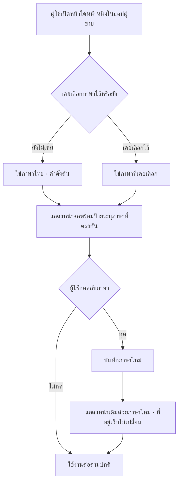
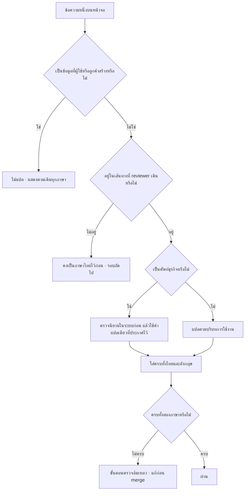
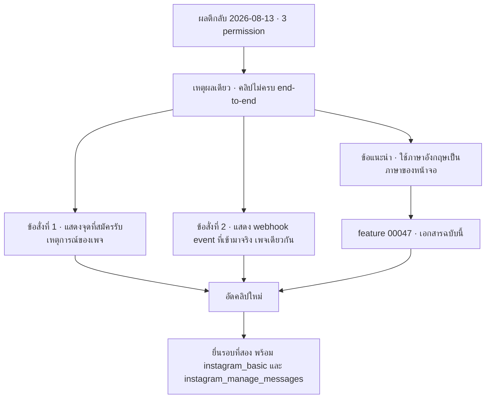

> **โมดูล:** M-I18N (feature 00047)
> **ประเภทเอกสาร:** Business Requirements Document (BRD) - NON-TECHNICAL
> **เวอร์ชัน:** 1.0
> **วันที่จัดทำ:** 2026-08-13
> **สถานะ:** Draft — รอ user review (HR11)
> **เจ้าของเอกสาร:** BA (ดู [[Feature-Docs-Ownership]])

# BRD: สลับภาษาไทย/อังกฤษในแอปผู้ขาย (Business Requirements Document)

---

## 1. บทนำ

### 1.1 วัตถุประสงค์ของเอกสาร

เอกสารนี้มีวัตถุประสงค์เพื่อ:

1. กำหนดความต้องการของความสามารถ "สลับภาษาไทย/อังกฤษ" ในแอปผู้ขายของ Deep
   ให้ตรวจวัดได้เป็นข้อ ๆ
2. ตรึงขอบเขตรอบแรกไว้ที่เส้นทางที่ Meta App Reviewer เดินผ่าน และระบุชัดว่าส่วนที่เหลือ
   ของระบบจะถูกปฏิบัติอย่างไร
3. กำหนดกฎที่ต้อง**บังคับได้ด้วยเครื่องมือ** ไม่ใช่แค่เขียนไว้ให้อ่าน — โดยเฉพาะกฎเรื่อง
   คำแปลที่ขาดหายและกฎเรื่องศัพท์ธุรกิจ
4. สร้างความเข้าใจร่วมว่า "เสร็จ" ของฟีเจอร์นี้วัดจากผลการยื่น App Review ไม่ใช่จากการที่โค้ดขึ้น

### 1.2 ขอบเขตของระบบ

**ระบบสลับภาษาไทย/อังกฤษ** คือความสามารถที่ให้ผู้ใช้เลือกภาษาของส่วนติดต่อผู้ใช้ในแอปผู้ขาย
และจดจำค่านั้นไว้ โดยไม่เปลี่ยนที่อยู่เว็บและไม่เปลี่ยนข้อมูลใด ๆ ของร้าน

**เข้าสู่ระบบ (Input):**
- การกดเลือกภาษาของผู้ใช้
- ค่าภาษาที่เคยเลือกไว้ก่อนหน้า (ถ้ามี)

**ออกจากระบบ (Output):**
- ข้อความบนหน้าจอในภาษาที่เลือก
- ป้ายระบุภาษาของเอกสารที่ตรงกับภาษาที่เลือก (สำหรับโปรแกรมอ่านหน้าจอ)
- หน้าที่ยังไม่แปล คงแสดงภาษาไทยตามเดิมและใช้งานได้ปกติ

**ระบบที่เกี่ยวข้อง:**
- แอปผู้ขายทั้งหมด (`seller.deepthailand.app`)
- การยื่น App Review ต่อ Meta ([[APP-REVIEW]])
- ชุดคำศัพท์ธุรกิจที่ประกาศไว้ในระบบอยู่แล้ว (ผูกกับ Hard Rule 16)

### 1.3 กลุ่มผู้ใช้งาน

| กลุ่มผู้ใช้ | บทบาท | สิทธิ์การใช้งาน |
|-----------|--------|----------------|
| **Meta App Reviewer** | ตรวจสอบใบยื่นผ่านบัญชีทดสอบที่เราสร้างให้ | สลับภาษาได้ ใช้งานเส้นทางในคลิปได้เต็ม |
| **ผู้ขาย (เจ้าของร้าน)** | ใช้งานระบบประจำวัน | สลับภาษาได้ · ค่าที่เลือกเป็นของตัวเอง ไม่กระทบคนอื่นในร้าน |
| **พนักงานร้าน** | ใช้งานกล่องข้อความ | สลับภาษาได้เป็นของตัวเอง |
| **ทีมพัฒนา Deep** | เพิ่ม/แก้คำแปล | ต้องผ่านด่านความครบถ้วนก่อน merge |

---

## 2. ความต้องการหลัก (Functional Requirements)

### 2.1 การเลือกและจดจำภาษา

#### FR-I18N-01: ผู้ใช้สลับภาษาได้เองจากในแอป

**User Story:**
> ในฐานะผู้ใช้แอปผู้ขาย ฉันต้องการสลับภาษาของหน้าจอระหว่างไทยกับอังกฤษได้เอง
> เพื่อให้อ่านและใช้งานระบบได้โดยไม่ต้องพึ่งคนอื่นแปลให้

**Acceptance Criteria:**
- [ ] มีตัวควบคุมการสลับภาษาที่มองเห็นได้จากทุกหน้าในแอปผู้ขาย
- [ ] ตัวควบคุมนั้นแสดงภาษาที่กำลังใช้อยู่ และแสดงภาษาที่จะสลับไป
- [ ] เมื่อกดสลับ หน้าจอที่กำลังอยู่เปลี่ยนภาษาทันที
- [ ] **ที่อยู่เว็บ (URL) ไม่เปลี่ยนแม้แต่ตัวอักษรเดียว** ทั้ง path, query และ subdomain
- [ ] ผู้ใช้ยังอยู่ที่หน้าเดิม ไม่ถูกพากลับหน้าแรก ไม่เสียข้อมูลที่กรอกค้างไว้ในฟอร์ม
- [ ] ตัวควบคุมอยู่ตำแหน่งเดิมทั้งสองภาษา และป้ายของมันอ่านออกในภาษาอังกฤษ
      (ห้ามซ่อนทางกลับไปไทยไว้หลังคำภาษาไทย)

**Business Flow:**
1. ผู้ใช้อยู่ที่หน้าใดก็ได้ในแอปผู้ขาย
2. ผู้ใช้กดตัวควบคุมสลับภาษา
3. ระบบบันทึกภาษาที่เลือก
4. หน้าจอปัจจุบันแสดงผลด้วยภาษาใหม่ โดยยังอยู่ที่อยู่เดิม

**Example:**
```
ก่อนกด : /settings/channels  · หัวข้อ "ช่องทางแชท"      · ปุ่ม "เชื่อม Facebook Page"
หลังกด : /settings/channels  · หัวข้อ "Chat channels"    · ปุ่ม "Connect Facebook Page"
         ^^^ ที่อยู่เว็บเดิมทุกตัวอักษร
```

#### FR-I18N-02: ระบบจดจำภาษาที่เลือก

**User Story:**
> ในฐานะผู้ใช้ ฉันต้องการให้ระบบจำภาษาที่ฉันเลือกไว้ เพื่อไม่ต้องกดสลับใหม่ทุกครั้งที่เปิดใช้งาน

**Acceptance Criteria:**
- [ ] ภาษาที่เลือกยังคงเดิมเมื่อเปลี่ยนไปหน้าอื่นในแอป
- [ ] ภาษาที่เลือกยังคงเดิมเมื่อปิดแท็บแล้วเปิดใหม่
- [ ] ภาษาที่เลือกยังคงเดิมเมื่อกลับมาใช้งานในวันถัดไปบนเครื่องเดิม
- [ ] ภาษาที่ผู้ใช้คนหนึ่งเลือก **ไม่กระทบผู้ใช้คนอื่นในร้านเดียวกัน**
- [ ] หน้าจอที่ถูกสร้างจากฝั่งเซิร์ฟเวอร์ต้องออกมาเป็นภาษาที่ถูกต้องตั้งแต่การแสดงผลครั้งแรก
      **ห้ามแสดงภาษาไทยแวบหนึ่งแล้วค่อยเปลี่ยนเป็นอังกฤษ**

#### FR-I18N-03: ภาษาเริ่มต้นคือไทยเสมอ

**User Story:**
> ในฐานะผู้ขายไทยที่ใช้ระบบอยู่ทุกวัน ฉันต้องการให้ระบบเป็นภาษาไทยเหมือนเดิม
> เพื่อไม่ต้องเรียนรู้อะไรใหม่โดยที่ฉันไม่ได้ร้องขอ

**Acceptance Criteria:**
- [ ] ผู้ใช้ที่ไม่เคยเลือกภาษา เห็นภาษาไทยเสมอ
- [ ] บัญชีที่สมัครใหม่ เห็นภาษาไทยเสมอ
- [ ] ระบบ **ไม่เดาภาษาจากการตั้งค่าเบราว์เซอร์หรือประเทศของผู้ใช้**
- [ ] ผู้ใช้เดิมทุกคนบนระบบจริง ไม่มีใครถูกเปลี่ยนภาษาโดยอัตโนมัติ

**เหตุผลที่ห้ามเดาจากเบราว์เซอร์:** ผู้ขายไทยจำนวนมากตั้งเครื่องเป็นภาษาอังกฤษ
การเดาจะทำให้คนกลุ่มนั้นถูกเปลี่ยนภาษาโดยไม่ได้ขอ ซึ่งขัดกับ FR-I18N-10 โดยตรง

### 2.2 การแสดงผล

#### FR-I18N-04: เส้นทางในคลิปต้องเป็นภาษาอังกฤษครบถ้วน

**User Story:**
> ในฐานะ Meta App Reviewer ฉันต้องการอ่านทุกปุ่มและทุกข้อความที่ฉันกดในคลิปได้
> เพื่อยืนยันว่าแอปใช้ permission ตรงตามที่เขียนไว้ในคำอธิบาย

**Acceptance Criteria:**
- [ ] เมื่อเลือกภาษาอังกฤษ หน้าจอต่อไปนี้ไม่มีตัวอักษรไทยเหลืออยู่เลย:
      หน้าเข้าสู่ระบบของผู้ขาย · เมนูซ้ายและแถบบน · หน้าบัญชีที่เชื่อมต่อ ·
      หน้าเลือกเพจ · กล่องข้อความ (รายการเธรด + หน้าต่างสนทนา + ช่องพิมพ์)
- [ ] ครอบคลุมข้อความทุกชนิดบนจอเหล่านั้น ไม่ใช่เฉพาะปุ่ม — รวม หัวข้อ · ป้ายกำกับ ·
      ข้อความในช่องกรอก · ข้อความเมื่อไม่มีข้อมูล · ข้อความแจ้งเตือน · ข้อความผิดพลาด ·
      คำบรรยายสำหรับโปรแกรมอ่านหน้าจอ
- [ ] ข้อความผิดพลาดที่เกิดจากการกดจริง (เช่น ปฏิเสธสิทธิ์ที่หน้าของ Meta) ต้องเป็นอังกฤษด้วย
- [ ] ตรวจสอบด้วยการสแกนไฟล์ในขอบเขต **ไม่ใช่การไล่กดดูด้วยตา**

#### FR-I18N-05: ป้ายระบุภาษาของเอกสารต้องตรงกับภาษาที่แสดง

**User Story:**
> ในฐานะผู้ใช้ที่พึ่งโปรแกรมอ่านหน้าจอ ฉันต้องการให้เนื้อหาถูกอ่านออกเสียงด้วยภาษาที่ถูกต้อง
> เพื่อให้ฟังรู้เรื่อง

**Acceptance Criteria:**
- [ ] เมื่อแสดงภาษาไทย ป้ายระบุภาษาของเอกสารเป็นไทย
- [ ] เมื่อแสดงภาษาอังกฤษ ป้ายระบุภาษาของเอกสารเป็นอังกฤษ
- [ ] ค่านี้ถูกต้องตั้งแต่การแสดงผลครั้งแรกจากฝั่งเซิร์ฟเวอร์

#### FR-I18N-06: ข้อมูลของผู้ใช้และลูกค้าไม่ถูกแปล

**User Story:**
> ในฐานะผู้ขาย ฉันต้องการให้ชื่อร้าน ชื่อสินค้า และข้อความที่ลูกค้าพิมพ์มา คงเดิมเสมอ
> เพื่อไม่ให้ความหมายเพี้ยนหรือหาของไม่เจอ

**Acceptance Criteria:**
- [ ] ข้อความในบทสนทนา ชื่อลูกค้า ชื่อเพจ ชื่อร้าน ชื่อสินค้า ที่อยู่ และเลขพัสดุ
      แสดงเหมือนกันทุกภาษา
- [ ] ข้อความอัตโนมัติที่ **ผู้ขายเป็นคนตั้งเอง** (เช่น ข้อความตอบกลับอัตโนมัติ)
      ไม่ถูกแปล เพราะเป็นข้อมูลของร้าน ไม่ใช่ส่วนติดต่อผู้ใช้ของเรา

#### FR-I18N-07: หน้าที่ยังไม่แปลต้องใช้งานได้ตามปกติ

**User Story:**
> ในฐานะผู้ใช้ที่เลือกภาษาอังกฤษ ฉันต้องการให้หน้าที่ยังไม่ได้แปลยังใช้งานได้ตามปกติ
> เพื่อทำงานต่อได้ ไม่ใช่เจอหน้าจอที่พังหรือว่างเปล่า

**Acceptance Criteria:**
- [ ] หน้าที่ยังไม่แปล **แสดงภาษาไทยตามเดิม** ห้ามแสดงรหัสข้อความดิบ ห้ามแสดงช่องว่าง
- [ ] ทุกปุ่มและทุกฟังก์ชันบนหน้านั้นทำงานเหมือนเดิมทุกประการ
- [ ] การสลับกลับเป็นภาษาไทยทำได้จากหน้านั้นเช่นกัน
- [ ] **ไม่ต้องมีข้อความแจ้งผู้ใช้ว่าคำแปลยังไม่ครบ** (มติ D-I18N-1)

> **หมายเหตุมติ D-I18N-1 (2026-08-13):** ข้อเสนอเดิมของ FR นี้คือให้มีป้ายบอกผู้ใช้ว่า
> คำแปลยังไม่ครบ โดยอ้าง `docs/conventions/partial-data-must-be-labeled-or-filled.md`
> user ตัดสินว่าไม่ต้องมี ด้วยเหตุผลว่า *"คนใช้ยังรับได้"* — เหตุผลประกอบและเงื่อนไข
> ที่ทำให้มตินี้ต้องถูกทบทวนใหม่ อยู่ใน [[PRD]] §4.4

### 2.3 ความสมบูรณ์และการดูแลระยะยาว

#### FR-I18N-08: คำแปลที่ขาดต้องทำให้ขั้นตอนตรวจล้มเหลว

**User Story:**
> ในฐานะทีมพัฒนา ฉันต้องการให้ระบบฟ้องทันทีเมื่อฉันลืมใส่คำแปล
> เพื่อไม่ให้ปัญหาไปโผล่ที่หน้าจอผู้ใช้

**Acceptance Criteria:**
- [ ] ถ้ามีข้อความในภาษาหนึ่งแต่ขาดในอีกภาษาหนึ่ง ขั้นตอนตรวจสอบก่อน merge ต้องล้มเหลว
- [ ] **ห้ามมีกลไกแสดงข้อความสำรองเงียบ ๆ** ที่ทำให้คีย์หายแล้วระบบยังผ่านได้
- [ ] มีชุดทดสอบที่พิสูจน์ว่าด่านนี้ทำงานจริง โดยการ**ทำให้มันพังจริง** แล้วยืนยันว่ามันแดง
      ไม่ใช่แค่เขียนชุดทดสอบให้เขียว

**เหตุผล:** บทเรียนที่เกิดซ้ำในรีโปนี้ — กฎที่เขียนไว้ในเอกสารหรือคอมเมนต์แต่ไม่มีด่านบังคับ
จะถูกละเมิดเงียบ ๆ จนกว่าจะมีคนบังเอิญเปิดดู และคำแปลที่หายไปไม่ทำให้ระบบพัง
มันแค่ทำให้ผู้ใช้เห็นของแปลก = ไม่มีอะไรฟ้อง

#### FR-I18N-09: ศัพท์ธุรกิจมีคำแปลเดียวทั้งระบบ

**User Story:**
> ในฐานะผู้ขายที่อ่านภาษาอังกฤษ ฉันต้องการให้คำว่า "กำไรขั้นต้น" แปลเหมือนกันทุกหน้า
> เพื่อไม่ให้เข้าใจผิดว่าเป็นตัวเลขคนละอย่างกัน

**Acceptance Criteria:**
- [ ] คำกลุ่มธุรกิจ (กำไร · กำไรขั้นต้น · ยอดขาย · ต้นทุน · ส่วนลด · ค่าธรรมเนียม ·
      ยอดคงเหลือ) มีคำแปลภาษาอังกฤษเพียงคำเดียว และประกาศไว้ที่เดียว
- [ ] คำแปลตรงกับนิยามที่ประกาศไว้ในระบบแล้ว — "กำไรขั้นต้น" ต้องไม่ถูกแปลเป็นคำเดียวกับ
      "กำไรสุทธิ" เพราะสองตัวนี้คำนวณคนละสูตรและมีอยู่จริงทั้งคู่ในระบบ
- [ ] คำที่ผันตามประเภทร้านอยู่แล้ว (ร้านขายของ / ร้านบริการ / บ้านพัก) ต้องผันในภาษาอังกฤษ
      ด้วยชุดเดียวกัน **ห้ามยุบเหลือคำกลางคำเดียว**
- [ ] ก่อนตั้งคำแปลของคำกลุ่มนี้ ต้องตรวจกับนิยามในระบบก่อน ไม่ใช่แปลตามตัวอักษร

**เหตุผล:** Hard Rule 16 — และมีเคสจริงในระบบแล้วที่การ์ดหนึ่งเรียกตัวเองว่า "กำไร"
ทั้งที่คำนวณคนละสูตรกับนิยามที่ประกาศไว้ **ไม่มี gate อัตโนมัติใดของโปรเจกต์จับความหมายผิดได้**
การแปลเป็นภาษาที่สองจึงเป็นโอกาสสร้างนิยามที่สองโดยไม่มีใครเห็น

### 2.4 การไม่กระทบผู้ใช้เดิม

#### FR-I18N-10: ผู้ใช้ที่ไม่กดสลับต้องไม่เห็นความเปลี่ยนแปลงใด ๆ

**User Story:**
> ในฐานะผู้ขายไทยที่ใช้ระบบตอบลูกค้าอยู่ทุกวัน ฉันต้องการให้ทุกอย่างเหมือนเดิมเป๊ะ
> เพื่อทำงานต่อได้โดยไม่สะดุด

**Acceptance Criteria:**
- [ ] ข้อความภาษาไทยทุกจุดที่ถูกย้ายเข้าระบบแปล ต้องเหมือนเดิม **ทุกตัวอักษร**
      รวมช่องว่าง เครื่องหมายวรรคตอน และการขึ้นบรรทัด
- [ ] ตำแหน่งและลำดับขององค์ประกอบบนหน้าจอไม่เปลี่ยน
- [ ] การรับ-ส่งข้อความในกล่องข้อความทำงานเหมือนเดิมทุกประการ
- [ ] ไม่มีการเปลี่ยนแปลงตรรกะทางธุรกิจใด ๆ ไปพร้อมกับการแปลในรอบเดียวกัน

#### FR-I18N-11: เลย์เอาต์ต้องไม่พังในภาษาอังกฤษ

**User Story:**
> ในฐานะผู้ใช้ที่เลือกภาษาอังกฤษบนมือถือ ฉันต้องการให้หน้าจอยังอ่านได้และกดได้
> เพื่อใช้งานได้จริงไม่ใช่แค่ "แปลแล้ว"

**Acceptance Criteria:**
- [ ] ทุกหน้าจอในขอบเขตถูกตรวจที่ความกว้าง **320px** ด้วย ไม่ใช่แค่บนเดสก์ท็อป
- [ ] ไม่มีข้อความใดดันกล่องจนหน้าจอเลื่อนออกด้านข้างได้
- [ ] ไม่มีปุ่มที่ข้อความล้นออกนอกกรอบหรือตกบรรทัดจนกดยาก
- [ ] ไอคอนที่อยู่คู่ข้อความไม่ถูกดันตกบรรทัด

**เหตุผล:** ภาษาอังกฤษยาวกว่าไทยเป็นปกติ และรีโปนี้มีบทเรียนตรงคลาสนี้แล้วว่า
**ฟีเจอร์ที่ทำให้ค่าที่แสดงยาวขึ้นเป็นปกติ จะปลุกบั๊กที่หลับอยู่ในองค์ประกอบขนาดคงที่
ซึ่งเคยรอดมาได้เพราะเนื้อหาสั้น** — เกิดจริงบนระบบจริงมาแล้วสองครั้ง

---

## 3. Acceptance Criteria สรุป

### 3.1 การสลับและจดจำภาษา

**เมื่อระบบทำงานถูกต้อง:**
- ✅ กดสลับภาษาได้จากทุกหน้า และหน้าจอเปลี่ยนทันทีโดยที่อยู่เว็บไม่ขยับ
- ✅ ภาษาที่เลือกอยู่ข้ามหน้า ข้ามแท็บ และข้ามวัน
- ✅ ผู้ใช้ที่ไม่เคยเลือก เห็นภาษาไทยเสมอ
- ✅ ภาษาของผู้ใช้คนหนึ่งไม่กระทบคนอื่นในร้านเดียวกัน

### 3.2 ความครบถ้วนของเส้นทางในคลิป

**เมื่อเลือกภาษาอังกฤษ:**
- ✅ เข้าสู่ระบบ → เมนู → บัญชีที่เชื่อมต่อ → เลือกเพจ → กล่องข้อความ ไม่มีตัวอักษรไทยเหลือ
- ✅ ข้อความเมื่อไม่มีข้อมูล ข้อความแจ้งเตือน และข้อความผิดพลาด เป็นอังกฤษด้วย
- ✅ คำบรรยายสำหรับโปรแกรมอ่านหน้าจอ เป็นอังกฤษด้วย
- ✅ ป้ายระบุภาษาของเอกสารเป็นอังกฤษ

### 3.3 ความปลอดภัยของผู้ใช้เดิม

**เมื่อผู้ขายไทยเปิดใช้งานตามปกติ:**
- ✅ ไม่มีข้อความใดเปลี่ยนไปจากเดิมแม้แต่ตัวอักษรเดียว
- ✅ กล่องข้อความรับ-ส่งได้เหมือนเดิม
- ✅ ไม่มีอะไรบนจอขยับตำแหน่ง

### 3.4 ความยั่งยืนของระบบแปล

**เมื่อมีคนเพิ่มหน้าจอใหม่แล้วลืมแปล:**
- ✅ ขั้นตอนตรวจก่อน merge ล้มเหลว
- ✅ ไม่มีทางที่คีย์ที่ขาดจะไปโผล่บนหน้าจอผู้ใช้
- ✅ ชุดทดสอบพิสูจน์ด่านนี้ด้วยการทำให้พังจริง ไม่ใช่แค่เขียนให้เขียว

---

## 4. Business Flows (กระบวนการทำงาน)

### 4.1 Flow หลัก: การเลือกภาษาและการแสดงผล



### 4.2 Flow: การตัดสินว่าข้อความหนึ่งต้องแปลหรือไม่



### 4.3 Flow: ความสัมพันธ์กับการยื่น App Review



---

## 5. Use Case Scenarios (สถานการณ์การใช้งานจริง)

### Scenario 1: Meta reviewer ตรวจใบยื่นรอบที่สอง *(กรณีที่ฟีเจอร์นี้ถูกสร้างมาเพื่อ)*

**ผู้เกี่ยวข้อง:** Meta App Reviewer

**เงื่อนไขเริ่มต้น:**
- บัญชีทดสอบของผู้ขายพร้อมใช้งาน และผ่านการตั้งค่าเริ่มต้นครบแล้ว
- reviewer ยังไม่เคยเข้าระบบนี้มาก่อน

**ขั้นตอน:**
1. เปิดหน้าเข้าสู่ระบบของผู้ขาย เห็นภาษาไทยเป็นค่าตั้งต้น
2. เห็นตัวควบคุมสลับภาษาและกดสลับเป็นอังกฤษ
3. เข้าสู่ระบบด้วยบัญชีทดสอบ
4. เปิดหน้าบัญชีที่เชื่อมต่อ กดเชื่อมเพจ ผ่านหน้าให้สิทธิ์ของ Meta
5. เลือกเพจและยืนยัน เห็นสถานะที่บอกว่าระบบกำลังสมัครรับเหตุการณ์ของเพจนั้น
6. ให้อีกบัญชีส่งข้อความเข้าเพจ เห็นบทสนทนาเด้งขึ้นในกล่องข้อความ
7. พิมพ์ตอบและกดส่ง

**ผลลัพธ์:**
- reviewer อ่านออกทุกปุ่มที่กด และเห็นครบทั้งจังหวะสมัครรับเหตุการณ์และจังหวะที่เหตุการณ์เข้ามาจริง
- ไม่ต้องเปิดคำแปลในวงเล็บจากช่องคำอธิบายประกอบ

### Scenario 2: ผู้ขายไทยที่ไม่รู้ว่ามีฟีเจอร์นี้ *(กรณีที่ต้องไม่มีอะไรเกิดขึ้น)*

**ผู้เกี่ยวข้อง:** ผู้ขายไทย

**เงื่อนไขเริ่มต้น:**
- ใช้ระบบมาก่อนหน้านี้แล้ว ไม่เคยกดสลับภาษา

**ขั้นตอน:**
1. เปิดแอปตอนเช้า
2. เปิดกล่องข้อความ ตอบลูกค้าตามปกติ
3. ไปหน้าอื่น ๆ ตามงานประจำวัน

**ผลลัพธ์:**
- ทุกอย่างเป็นภาษาไทยเหมือนเดิมทุกตัวอักษร
- ไม่มีอะไรขยับ ไม่มีอะไรต้องเรียนรู้ใหม่

### Scenario 3: พนักงานร้านที่ไม่อ่านภาษาไทยกดสลับ *(กรณีขอบเขตไม่ครบ)*

**ผู้เกี่ยวข้อง:** พนักงานร้าน

**เงื่อนไขเริ่มต้น:**
- เพิ่งได้รับเชิญเข้าร้าน ยังไม่คุ้นระบบ

**ขั้นตอน:**
1. กดสลับเป็นภาษาอังกฤษ
2. ใช้งานกล่องข้อความซึ่งเป็นอังกฤษครบ
3. เข้าหน้ารายงานยอดขายซึ่งยังไม่ได้แปล เห็นเป็นภาษาไทย โดยไม่มีอะไรอธิบาย

**ผลลัพธ์:**
- หน้าที่ยังไม่แปลใช้งานได้ตามปกติ ไม่มีรหัสข้อความดิบหรือช่องว่างโผล่มา
- 🛑 **พนักงานไม่มีทางรู้ว่านั่นคือขอบเขตที่ตั้งใจ ไม่ใช่ระบบเสีย** — เป็นความเสี่ยงที่
  ยอมรับไว้แล้วตามมติ D-I18N-1 เพราะกลุ่มผู้ใช้จริงวันนี้ยังไม่มีคนกลุ่มนี้
  ถ้าวันใดมีจริง มตินี้ต้องถูกทบทวน ([[PRD]] §4.4)

### Scenario 4: นักพัฒนาสร้างหน้าจอใหม่แล้วลืมใส่คำแปล *(กรณีที่ด่านต้องทำงาน)*

**ผู้เกี่ยวข้อง:** ทีมพัฒนา Deep

**เงื่อนไขเริ่มต้น:**
- กำลังเพิ่มหน้าจอใหม่ในขอบเขตที่แปลแล้ว

**ขั้นตอน:**
1. เพิ่มข้อความใหม่ในภาษาไทย แต่ลืมเพิ่มในภาษาอังกฤษ
2. รันขั้นตอนตรวจก่อน merge

**ผลลัพธ์:**
- ขั้นตอนตรวจล้มเหลวพร้อมชี้ว่าคีย์ไหนขาด
- ไม่มีทางที่ข้อความที่ขาดจะไปถึงหน้าจอผู้ใช้

---

## 6. ความต้องการด้านคุณภาพ (Quality Requirements)

### 6.1 ความถูกต้องของข้อมูล
- ข้อความภาษาไทยที่ย้ายเข้าระบบแปลต้องเหมือนของเดิมทุกตัวอักษร รวมช่องว่างและวรรคตอน
- คำแปลศัพท์ธุรกิจต้องตรงกับนิยามที่ประกาศไว้ในระบบ ไม่ใช่แปลตามตัวอักษร
- ข้อมูลของผู้ใช้และลูกค้าต้องไม่ถูกแตะต้องในทุกภาษา

### 6.2 ความรวดเร็ว
- การสลับภาษาต้องเห็นผลทันทีในสายตาผู้ใช้ ไม่ใช่รอโหลดใหม่ทั้งแอป
- การเพิ่มระบบแปลต้องไม่ทำให้หน้าจอที่มีอยู่แสดงผลช้าลงจนสังเกตได้
- หน้าจอต้องออกมาเป็นภาษาที่ถูกตั้งแต่การแสดงผลครั้งแรก ห้ามเห็นภาษาผิดแวบหนึ่งก่อน

### 6.3 ความน่าเชื่อถือ
- คำแปลที่ขาดต้องถูกจับก่อน merge เสมอ ไม่มีข้อยกเว้น
- ถ้าระบบอ่านค่าภาษาที่บันทึกไว้ไม่ได้ ต้องถอยไปใช้ภาษาไทย ไม่ใช่หน้าจอว่างหรือค้าง
- ค่าภาษาที่เสียหายหรือไม่รู้จัก ต้องถูกปฏิเสธและถอยไปใช้ไทย

### 6.4 ความปลอดภัย
- ค่าภาษาที่บันทึกไว้เป็นค่าที่ผู้ใช้เลือกเอง ไม่ใช่ข้อมูลลับ และต้องไม่ถูกใช้ตัดสินสิทธิ์ใด ๆ
- การสลับภาษาต้องไม่เปลี่ยนสิ่งที่ผู้ใช้เห็นได้หรือทำได้ นอกจากภาษาของข้อความ
- ค่าภาษาที่รับมาต้องถูกตรวจว่าเป็นค่าที่รู้จักเท่านั้น ห้ามนำไปใช้ตรง ๆ

### 6.5 ความสะดวกในการใช้งาน (Usability)
- ตัวควบคุมสลับภาษาต้องหาเจอได้เองโดยไม่ต้องมีคนบอก
- แต่ต้องไม่อยู่ในเส้นทางการทำงานประจำวันของผู้ขายไทยจนกดโดนโดยไม่ตั้งใจ
- ทางกลับไปภาษาไทยต้องอยู่ที่เดิมและอ่านออกในภาษาอังกฤษ
- ทุกหน้าจอในขอบเขตต้องใช้งานได้จริงที่ความกว้าง 320px ในทั้งสองภาษา

---

## 7. ข้อจำกัด (Constraints)

### 7.1 ข้อจำกัดทางธุรกิจ
- ขอบเขตรอบแรกถูกตรึงไว้ที่เส้นทางที่ reviewer เดิน การขยายกลางทางทำให้การยื่นเลื่อนออกไป
- ทุกวันที่ยังไม่ยื่นใหม่ คือวันที่ร้านนอก App Roles เชื่อมเพจไม่ได้
- แต่ละรอบการยื่นใช้เวลาราว 12 วัน จึงต้องแก้ให้ครบทุกข้อในรอบเดียว
- ห้ามกระทบร้านที่ใช้งานอยู่แม้ชั่วขณะ โดยเฉพาะกล่องข้อความ

### 7.2 ข้อจำกัดทางเทคนิค
- ห้ามเปลี่ยนที่อยู่เว็บ เพราะระบบมีการกำหนดเส้นทางตาม subdomain อยู่แล้ว
  และเป็นคลาสบั๊กที่ทำให้หน้า 404 เฉพาะบางโดเมนซึ่งพลาดมาแล้ว 2 ครั้ง
- ฟอนต์ต้องเป็น Anuphan ทุกภาษา ตาม Hard Rule 5
- ระบบยังไม่มีที่เก็บค่าตั้งค่าส่วนตัวของผู้ใช้แบบข้ามเครื่อง — รอบนี้จึงจดจำภาษาต่อเครื่อง
  ไม่ใช่ต่อบัญชี *(ข้อจำกัดนี้ยอมรับได้ เพราะ reviewer ใช้เครื่องเดียว
  และผู้ขายไทยไม่ได้ใช้ฟีเจอร์นี้)*
- ขอบเขตทั้งระบบคือ 445 ไฟล์ / 22,277 บรรทัดที่มีตัวอักษรไทย เกินกว่าจะทำครบในรอบเดียว

---

## 8. กฎทางธุรกิจ (Business Rules)

### 8.1 กฎการเลือกภาษา
- **BR-I18N-01** ภาษาเริ่มต้นคือไทยเสมอ สำหรับทุกบัญชีและทุกเครื่อง
- **BR-I18N-02** การสลับภาษาห้ามเปลี่ยนที่อยู่เว็บ
- **BR-I18N-03** ห้ามเดาภาษาจากการตั้งค่าเบราว์เซอร์หรือประเทศของผู้ใช้
- **BR-I18N-04** ภาษาที่ผู้ใช้คนหนึ่งเลือก ไม่กระทบผู้ใช้คนอื่นในร้านเดียวกัน
- **BR-I18N-05** ค่าภาษาที่ไม่รู้จักหรือเสียหาย ให้ถอยไปใช้ไทย

### 8.2 กฎการแปล
- **BR-I18N-06** ข้อมูลที่ผู้ใช้หรือลูกค้าสร้าง ไม่ถูกแปล
- **BR-I18N-07** ข้อความที่ผู้ขายตั้งเอง ไม่ถูกแปล
- **BR-I18N-08** ศัพท์ธุรกิจมีคำแปลภาษาอังกฤษเพียงคำเดียวทั้งระบบ และต้องตรวจกับ
  นิยามในระบบก่อนตั้งคำแปล *(ผูกกับ Hard Rule 16)*
- **BR-I18N-09** คำที่ผันตามประเภทร้านต้องผันในภาษาอังกฤษด้วย ห้ามยุบเหลือคำเดียว
- **BR-I18N-10** ข้อความภาษาไทยที่ย้ายเข้าระบบแปลต้องเหมือนเดิมทุกตัวอักษร

### 8.3 กฎความครบถ้วน
- **BR-I18N-11** คีย์ที่ขาดไปฝั่งใดฝั่งหนึ่ง ต้องทำให้ขั้นตอนตรวจล้มเหลว
- **BR-I18N-12** ห้ามมีกลไกแสดงข้อความสำรองเงียบ ๆ เมื่อคีย์หาย
- **BR-I18N-13** หน้าที่ยังไม่แปลต้องแสดงภาษาไทยตามเดิม ห้ามแสดงรหัสดิบหรือช่องว่าง
- ~~**BR-I18N-14**~~ **ยกเลิกตามมติ D-I18N-1** — ไม่ต้องแจ้งผู้ใช้ว่าคำแปลยังไม่ครบ
  *(อย่าเติมกลับโดยอ้าง `partial-data-must-be-labeled-or-filled.md` — user ตัดสินไปแล้ว
  พร้อมเหตุผลใน [[PRD]] §4.4)*

### 8.4 กฎการแสดงผล
- **BR-I18N-15** ป้ายระบุภาษาของเอกสารต้องตรงกับภาษาที่แสดง
- **BR-I18N-16** ฟอนต์ยังเป็น Anuphan ทุกภาษา
- **BR-I18N-17** ทุกหน้าจอในขอบเขตต้องผ่านการตรวจที่ความกว้าง 320px ในทั้งสองภาษา
- **BR-I18N-18** ห้ามเปลี่ยนตรรกะทางธุรกิจไปพร้อมกับการแปลในรอบเดียวกัน

---

## 9. อภิธานศัพท์ (Glossary)

| คำศัพท์ | ความหมาย |
|---------|----------|
| **ภาษา (locale)** | ภาษาของส่วนติดต่อผู้ใช้ที่ผู้ใช้เลือก — รอบนี้มี 2 ค่า คือ ไทย และ อังกฤษ |
| **คำแปล (dictionary)** | ชุดข้อความทั้งหมดของภาษาหนึ่ง จับคู่กับรหัสข้อความ |
| **รหัสข้อความ (key)** | ตัวระบุข้อความหนึ่งชิ้น ใช้แทนการเขียนข้อความลงในหน้าจอโดยตรง |
| **เส้นทางในคลิป** | ลำดับหน้าจอที่ Meta reviewer เดินผ่าน: เข้าสู่ระบบ → เมนูซ้าย → บัญชีที่เชื่อมต่อ → เลือกเพจ → กล่องข้อความ |
| **ศัพท์ธุรกิจ** | คำที่มีนิยามทางธุรกิจอยู่แล้วในระบบ เช่น กำไรขั้นต้น ยอดขาย ต้นทุน |
| **ด่านตรวจก่อน merge** | ขั้นตอนอัตโนมัติที่ต้องผ่านก่อนนำโค้ดเข้าสายหลัก |
| **Advanced Access** | ระดับสิทธิ์ของ Meta ที่ทำให้แอปใช้ permission กับผู้ใช้ทั่วไปได้ ไม่ใช่เฉพาะคนที่มีบทบาทบนแอป |

---

## 10. สรุป

เอกสาร BRD นี้อธิบายความต้องการหลักของ **ระบบสลับภาษาไทย/อังกฤษในแอปผู้ขาย** แบบไม่ใช่เทคนิค

**จุดเด่นของระบบ:**
- ผู้ใช้สลับภาษาได้เองโดยที่อยู่เว็บไม่ขยับ จึงไม่แตะการกำหนดเส้นทางตาม subdomain
  ซึ่งเป็นจุดที่เคยพลาดมาแล้ว
- ผู้ขายไทยที่ใช้อยู่ทุกวันไม่เห็นความเปลี่ยนแปลงใด ๆ เลย
- คำแปลที่ขาดถูกจับด้วยด่านอัตโนมัติ ไม่ใช่ด้วยความตั้งใจของคนเขียน
- หน้าที่ยังไม่แปลยังใช้งานได้ครบทุกฟังก์ชัน ไม่มีรหัสข้อความดิบหรือช่องว่างโผล่ถึงผู้ใช้

**ผลลัพธ์ที่คาดหวัง:**
- `pages_manage_metadata`, `pages_messaging`, `pages_read_engagement` ได้รับอนุมัติ
  ในการยื่นรอบถัดไป ทำให้ร้านที่ไม่มีบทบาทบนแอปเชื่อมเพจและตอบลูกค้าได้จริง
- ความเสี่ยงข้อ "ภาษาของส่วนติดต่อผู้ใช้" ถูกตัดออกจากทุกใบยื่นในอนาคต
- ไม่มีรายงานปัญหาจากร้านที่ใช้งานอยู่

---

**หมายเหตุ:**
สำหรับความต้องการทางธุรกิจระดับภาพรวม/personas/KPI ดู [[PRD]] ของโมดูลนี้
สำหรับ technical specification (architecture/API/data/NFR) ดู [[SRS]] ของโมดูลนี้
