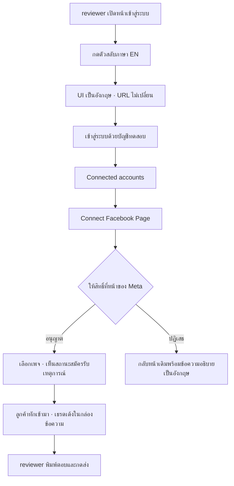

> **โมดูล:** M-I18N (feature 00047)
> **ประเภทเอกสาร:** Product Requirements Document (PRD)
> **เวอร์ชัน:** 1.0
> **วันที่จัดทำ:** 2026-08-13
> **สถานะ:** Draft — รอ user review (HR11 บังคับ PRD+BRD ผ่าน review ก่อน implement)
> **เจ้าของเอกสาร:** BA + PO + PM (ดู [[Feature-Docs-Ownership]])

# PRD: สลับภาษาไทย/อังกฤษในแอปผู้ขาย (Bilingual UI)

---

## Executive Summary

แอปผู้ขายของ Deep (`seller.deepthailand.app`) มี UI เป็น**ภาษาไทยล้วน** ทุกจอ ทุกปุ่ม
ทุกข้อความ ไม่มีกลไกสลับภาษาอยู่เลย — ยืนยันจากโค้ดเมื่อ 2026-08-13: `package.json`
ไม่มี `next-intl`/`i18next`/`@formatjs` ใด ๆ, `src/proxy.ts` ไม่มีการอ่านหรือเขียน locale,
และ `<html lang="th">` เป็นค่าคงที่ hardcode ทั้งใน `src/app/(paces)/layout.tsx:62`
และ `src/app/(marketing)/layout.tsx:73`

เรื่องนี้เพิ่งกลายเป็นต้นทุนทางธุรกิจจริงเมื่อ **2026-08-13 เวลา 11:31 น.** — Meta ตีกลับ
App Review ใบแรกของแอปแชท `1570859340799126` โดยปฏิเสธ 3 permission ที่เป็นหัวใจของ
ระบบแชททั้งหมด (`pages_manage_metadata`, `pages_messaging`, `pages_read_engagement`)
ด้วยเหตุผล *Screencast Not Aligned with Use Case Details* และในคำสั่งแก้ไข Meta ระบุ
best practice ไว้ตรงตัวว่า **"use English as the app UI language, provide captions and
tool-tips, and explain the meaning of buttons and other UI elements"**

ตราบใดที่ UI ยังเป็นไทยล้วน ทุกใบยื่นในอนาคต (Instagram, `human_agent`,
`pages_utility_messaging`) จะแบกความเสี่ยงข้อเดียวกันนี้ทุกครั้ง และแต่ละรอบกินเวลา
**12 วัน** (ใบแรก: ยื่น 2026-08-01 15:22 → ตรวจเสร็จ 2026-08-13 11:31)

ฟีเจอร์นี้เพิ่มความสามารถให้ผู้ใช้สลับ UI ระหว่าง **ไทย (ค่าตั้งต้น)** กับ **อังกฤษ**
โดยไม่เปลี่ยน URL ไม่แตะ subdomain routing และ**ไม่เปลี่ยนอะไรเลยสำหรับร้านไทยที่ใช้อยู่
ทุกวันนี้** ผลลัพธ์ทางธุรกิจหลักคือปลดล็อกการยื่น App Review ให้ผ่านได้จริง และเปิดทาง
ให้ Deep รับผู้ขายที่ไม่อ่านภาษาไทยได้ในอนาคตโดยไม่ต้องรื้อระบบซ้ำ

---

## 1. Business Goals & KPIs

### 1.1 เป้าหมายทางธุรกิจ

| เป้าหมาย | รายละเอียด |
|----------|-----------|
| **ปลดล็อก Advanced Access ของ 3 permission ที่ถูกตีกลับ** | ไม่มี `pages_messaging` = ร้านนอก App Roles ส่ง/รับข้อความไม่ได้เลย · ไม่มี `pages_manage_metadata` = subscribe webhook ไม่ได้ = เชื่อมเพจไม่ได้ ทั้งผลิตภัณฑ์หยุดอยู่ที่ "หน้าเลือกเพจ" ซึ่งเป็น 2 permission ที่ผ่านไปแล้ว |
| **ลดความเสี่ยงของทุกใบยื่นในอนาคต** | รอบถัดไปยังต้องขอ `instagram_basic` + `instagram_manage_messages` และในอนาคต `human_agent` — ถ้า UI ยังเป็นไทยล้วน ข้อ "use English as the app UI language" จะเป็นจุดตีกลับซ้ำได้ทุกครั้ง |
| **ลดต้นทุนการอัดคลิปทุกรอบ** | ถ้า UI สลับเป็นอังกฤษได้ คลิปไม่ต้องพึ่งซับบรรยายทุกปุ่ม ซึ่งต้องทำใหม่ทุกครั้งที่ UI เปลี่ยน |
| **เปิดทางตลาดที่ไม่ใช่ผู้อ่านภาษาไทย** *(รอง)* | ผู้ขายต่างชาติที่ขายในไทย และพนักงานร้านที่ไม่อ่านไทย ใช้ระบบได้โดยไม่ต้องรอฟีเจอร์ใหม่ |

### 1.2 ตัวชี้วัดความสำเร็จ (KPIs)

| KPI | คำอธิบาย | เป้าหมาย |
|-----|----------|---------|
| **ผลการยื่น App Review รอบถัดไป** | `devtools_app_review action=privileges` → `is_live` ของ `pages_messaging`, `pages_manage_metadata`, `pages_read_engagement` | ทั้ง 3 ตัวเป็น `true` |
| **ความครอบคลุมของเส้นทางในคลิป** | ทุกข้อความที่ผู้ใช้เห็นบนเส้นทาง `sign-in → เมนูซ้าย → บัญชีที่เชื่อมต่อ → เลือกเพจ → กล่องข้อความ` แสดงเป็นอังกฤษเมื่อสลับภาษา | 100% (บังคับด้วยเทสสแกนซอร์ส ไม่ใช่การกดดูด้วยตา) |
| **ผลกระทบต่อร้านไทยที่ใช้อยู่** | จำนวนจุดที่ผู้ใช้เดิมเห็นข้อความเปลี่ยนไปจากเดิม โดยไม่ได้กดสลับภาษาเอง | **0** |
| **ความสมบูรณ์ของคำแปล** | คีย์ที่ประกาศใน dictionary ไทยแต่ไม่มีในอังกฤษ (หรือกลับกัน) | **0 — บังคับด้วย `tsc` ไม่ใช่การตรวจด้วยตา** |

---

## 2. User Personas (กลุ่มผู้ใช้งาน)

### 2.1 Meta App Reviewer *(กลุ่มที่ฟีเจอร์นี้ถูกสร้างขึ้นมาเพื่อ)*

**ข้อมูลพื้นฐาน:**
- พนักงานตรวจสอบของ Meta อยู่นอกประเทศไทย อ่านภาษาไทยไม่ได้
- เข้าถึงระบบผ่านบัญชีทดสอบที่เราสร้างให้ (`metareview`) และดูคลิปที่เราอัดส่งไป
- มีเวลาจำกัดต่อ 1 ใบยื่น และตัดสินจาก "สิ่งที่เห็นบนจอ" เป็นหลัก

**เป้าหมาย:**
- ยืนยันว่าแอปใช้ permission ตรงตามที่เขียนไว้ในคำอธิบาย ไม่มากไม่น้อยกว่านั้น
- เห็นเส้นทางครบตั้งแต่ login → ให้สิทธิ์ → ใช้งานจริง ในคลิปเดียว

**ความต้องการ:**
- ปุ่มและป้ายทุกตัวที่กดในคลิป ต้องอ่านออกว่าคืออะไร
- ต้องเห็นจังหวะที่แอป subscribe Page events และจังหวะที่ webhook event เข้ามาจริง

**จุดปวด (Pain Points):**
- UI ภาษาไทยล้วน ทำให้ตรวจไม่ได้ว่าปุ่มที่กดคือปุ่มที่คำอธิบายอ้างถึงจริงหรือไม่
- คำแปลในวงเล็บที่เราใส่ไว้ในช่อง "Test and reproduce" อยู่คนละที่กับคลิป ต้องสลับอ่านไปมา

### 2.2 ผู้ขายไทย *(กลุ่มที่ห้ามได้รับผลกระทบ)*

**ข้อมูลพื้นฐาน:**
- ร้านค้าออนไลน์ไทย ใช้กล่องข้อความของ Deep ตอบลูกค้าทุกวัน วันละหลายชั่วโมง
- ส่วนใหญ่ใช้บนมือถือ อ่านภาษาไทยเป็นหลัก

**เป้าหมาย:**
- ตอบลูกค้าให้ทัน ไม่ต้องเรียนรู้อะไรใหม่

**ความต้องการ:**
- ระบบต้องเหมือนเดิมทุกประการ ไม่มีอะไรขยับ

**จุดปวด (Pain Points):**
- การเปลี่ยนคำในระบบที่ใช้ทำมาหากินอยู่ทุกวัน สร้างความสับสนทันทีแม้เปลี่ยนคำเดียว
- ถ้าเผลอกดสลับภาษาแล้วหาทางกลับไม่เจอ = ทำงานไม่ได้ทั้งวัน

### 2.3 ทีมพัฒนา Deep *(กลุ่มที่ต้องอยู่กับระบบนี้ต่อไป)*

**ข้อมูลพื้นฐาน:**
- ต้องเติมคำแปลของหน้าจอใหม่ทุกครั้งที่สร้างฟีเจอร์ นับจากวันที่ระบบนี้ขึ้น

**เป้าหมาย:**
- เพิ่มหน้าจอใหม่โดยไม่ทำให้ระบบภาษาพังเงียบ ๆ

**ความต้องการ:**
- ถ้าลืมใส่คำแปล ต้องมีอะไรฟ้อง**ก่อน** merge ไม่ใช่ไปโผล่บนจอผู้ใช้เป็นคีย์ดิบหรือช่องว่าง

**จุดปวด (Pain Points):**
- ระบบ i18n ส่วนใหญ่ fallback เงียบเมื่อคีย์หาย — ปัญหาจึงไปโผล่ที่ผู้ใช้เสมอ
  (คลาสเดียวกับบทเรียน `rule-must-be-enforced-not-described.md`: กฎที่ "เขียนไว้" ไม่ใช่กฎที่ "บังคับได้")

### 2.4 ผู้ขายที่ไม่อ่านภาษาไทย *(กลุ่มอนาคต)*

**ข้อมูลพื้นฐาน:**
- ผู้ขายต่างชาติที่ขายของในไทย หรือพนักงานร้านที่ไม่อ่านไทย

**เป้าหมาย:**
- ใช้ระบบได้ด้วยตัวเอง ไม่ต้องให้คนอื่นแปลให้

**ความต้องการ:**
- สลับภาษาได้เอง และค่าที่เลือกต้องอยู่ถาวร

**จุดปวด (Pain Points):**
- ปัจจุบันใช้ไม่ได้เลย

---

## 3. Business Requirements

### 3.1 การสลับภาษา

**ความต้องการ:**
- ผู้ใช้สลับ UI ระหว่างไทยกับอังกฤษได้เองจากในแอป โดยไม่ต้องติดต่อทีมงาน
- ค่าที่เลือกต้องคงอยู่เมื่อเปลี่ยนหน้า ปิดแท็บ และเปิดใหม่ในวันถัดไป
- ตัวสลับต้องหาเจอโดยไม่ต้องมีคนบอก แต่ต้องไม่เด่นจนผู้ขายไทยเผลอกด

**Business Rules:**
- ภาษาเริ่มต้นคือ **ไทยเสมอ** สำหรับทุกบัญชี ทั้งบัญชีเดิมและบัญชีที่สมัครใหม่
- การสลับภาษา **ห้ามเปลี่ยน URL** และห้ามพาผู้ใช้ออกจากหน้าที่กำลังอยู่
- ผู้ใช้ที่สลับเป็นอังกฤษแล้ว ต้องกลับเป็นไทยได้จากที่เดียวกัน โดยที่ตัวสลับนั้น
  ยังอ่านออกในภาษาอังกฤษ (ห้ามซ่อนทางกลับไว้หลังคำไทย)

**เหตุผล:**
- ร้านไทยคือผู้ใช้จริงทั้งหมดในวันนี้ การเปลี่ยนค่าตั้งต้นคือการเปลี่ยนเครื่องมือทำมาหากิน
  ของคนที่ไม่ได้ร้องขอ
- URL ที่ไม่เปลี่ยนคือเงื่อนไขทางเทคนิคที่มาจากธุรกิจ: ลิงก์ที่ร้านส่งให้ลูกค้าและ callback
  ของ Meta/LINE ผูกกับ path ปัจจุบันอยู่แล้ว

### 3.2 ขอบเขตการแปลรอบแรก

**ความต้องการ:**
- รอบแรกแปลเฉพาะ**เส้นทางที่ Meta reviewer เดินในคลิป** ให้ครบสมบูรณ์
  (หน้าเข้าสู่ระบบ → เมนูซ้าย → บัญชีที่เชื่อมต่อ → หน้าเลือกเพจ → กล่องข้อความ)
- หน้าจออื่นทั้งหมดของระบบต้องยังใช้งานได้ตามปกติเป็นภาษาไทย ไม่พัง ไม่ว่าง ไม่ขึ้นคีย์ดิบ

**Business Rules:**
- หน้าที่ยังไม่แปล ให้คงเป็นภาษาไทยตามเดิม ห้ามแสดงคีย์ดิบ ห้ามแสดงช่องว่าง
- **ไม่ต้องมีข้อความแจ้งผู้ใช้ว่าคำแปลยังไม่ครบ** — ดูมติ D-I18N-1 (§4.4)

**เหตุผล:**
- ขอบเขตทั้งระบบคือ **445 ไฟล์ / 22,277 บรรทัด** ที่มีตัวอักษรไทย (วัดเมื่อ 2026-08-13)
  ขณะที่เส้นทางในคลิปคือ 46 ไฟล์ / 5,473 บรรทัด — การรอให้ครบทั้งระบบก่อนยื่น
  แปลว่าเลื่อนการยื่นออกไปหลายสัปดาห์ ทั้งที่ 3 permission ที่ตกทำให้ร้านนอก App Roles
  เชื่อมเพจไม่ได้อยู่ตอนนี้

### 3.3 ความสมบูรณ์ของคำแปล

**ความต้องการ:**
- ทุกข้อความที่เข้าระบบภาษาแล้ว ต้องมีครบทั้งไทยและอังกฤษเสมอ
- ถ้ามีคนเพิ่มข้อความใหม่แล้วลืมแปล ต้องมีด่านจับก่อนขึ้น production

**Business Rules:**
- 🛑 คีย์ที่ขาดไปฝั่งใดฝั่งหนึ่ง ต้องทำให้ **ขั้นตอนตรวจชนิดข้อมูลล้มเหลว** ไม่ใช่แสดง
  ข้อความสำรองเงียบ ๆ บนหน้าจอผู้ใช้
- ห้ามใช้กลไก fallback ที่ยอมให้คีย์หายแล้วระบบยังผ่านได้

**เหตุผล:**
- บทเรียนที่เกิดซ้ำแล้วในรีโปนี้: กฎที่เขียนเป็นคอมเมนต์หรือเอกสารแต่ไม่มีด่านบังคับ
  จะถูกละเมิดเงียบ ๆ จนกว่าจะมีคนบังเอิญเปิดดู (`rule-must-be-enforced-not-described.md`)
- คำแปลที่หายไปไม่ได้ทำให้ระบบพัง มันแค่ทำให้ผู้ใช้เห็นของแปลก = ไม่มีอะไรฟ้อง

### 3.4 ความหมายทางธุรกิจของคำแปล

**ความต้องการ:**
- คำที่มีนิยามทางธุรกิจอยู่แล้วในระบบ ต้องแปลให้ตรงนิยามนั้น ไม่ใช่แปลตามตัวอักษร

**Business Rules:**
- คำกลุ่มธุรกิจ (กำไร/ยอดขาย/ต้นทุน/ส่วนลด/ค่าธรรมเนียม/ยอดคงเหลือ) ต้องมี**คำแปล
  ภาษาอังกฤษเพียงคำเดียวทั้งระบบ** และต้องตรงกับนิยามที่ประกาศไว้ในโค้ดแล้ว
- คำที่ผันตามประเภทร้าน (`ORDER_VOCAB`) ต้องผันในภาษาอังกฤษด้วยชุดเดียวกัน
  ห้ามยุบเหลือคำเดียว

**เหตุผล:**
- Hard Rule 16 ของโปรเจกต์: ศัพท์ธุรกิจต้องมีนิยามเดียวทั้งระบบ — และมีเคสจริงแล้ว
  (2026-08-08) ที่การ์ดหนึ่งเรียกตัวเองว่า "กำไร" ขณะที่ระบบมีนิยาม `NET_PROFIT_FORMULA`
  อยู่แล้วในไฟล์เดียวกับที่การ์ดนั้น import มา
- ถ้าแปล "กำไรขั้นต้น" เป็น `Profit` เฉย ๆ เราจะสร้างนิยามที่สองในภาษาที่สอง
  ซึ่งไม่มี gate ไหนของโปรเจกต์ตรวจได้เลย

### 3.5 ผลกระทบต่อหน้าจอ

**ความต้องการ:**
- เลย์เอาต์ต้องไม่พังเมื่อสลับเป็นอังกฤษ

**Business Rules:**
- ทุกจอที่แปลแล้ว ต้องตรวจที่ความกว้าง 320px ด้วย ไม่ใช่แค่บนเดสก์ท็อป
- ข้อความที่ยาวขึ้นห้ามดันกล่องจนเลื่อนหน้าจอออกด้านข้าง

**เหตุผล:**
- ภาษาอังกฤษยาวกว่าไทยเป็นปกติ และรีโปนี้มีบทเรียนตรงคลาสนี้แล้ว
  (`flex-header-truncation.md`): **ฟีเจอร์ที่ทำให้ค่าที่แสดง "ยาวขึ้นเป็นปกติ" จะปลุกบั๊ก
  ที่หลับอยู่ในองค์ประกอบที่ขนาดคงที่ ซึ่งเคยรอดมาได้เพราะเนื้อหาสั้น** — เกิดจริงบน prod
  2026-08-09 และ 2026-08-12 มาแล้วทั้งสองครั้ง

---

## 4. Business Rules & Constraints

### 4.1 กฎทางธุรกิจหลัก

| กฎ | คำอธิบาย |
|----|----------|
| **BR-I18N-01 ค่าตั้งต้นคือไทย** | ทุกบัญชี ทุกเครื่อง ทุกครั้งที่ยังไม่เคยเลือก = ไทย ห้ามเดาจากภาษาเบราว์เซอร์ |
| **BR-I18N-02 ไม่แตะ URL** | การสลับภาษาต้องไม่เปลี่ยน path, query หรือ subdomain |
| **BR-I18N-03 คีย์ขาด = ต้องล้มที่ขั้นตอนตรวจ** | ห้าม fallback เงียบไปหน้าจอผู้ใช้ |
| **BR-I18N-04 ฟอนต์ไม่เปลี่ยน** | ยังเป็น Anuphan ทุกภาษา ตาม Hard Rule 5 (ฟอนต์รองรับ latin อยู่แล้ว) |
| **BR-I18N-05 ป้ายภาษาของเอกสารต้องตรงจริง** | ค่า `lang` ของหน้าเว็บต้องเปลี่ยนตามภาษาที่เลือก เพื่อให้โปรแกรมอ่านหน้าจอออกเสียงถูก |
| **BR-I18N-06 ข้อมูลของผู้ใช้ไม่ถูกแปล** | ชื่อร้าน ชื่อสินค้า ข้อความแชท ชื่อลูกค้า ที่อยู่ ยังคงเดิมทุกภาษา |
| ~~**BR-I18N-07 คำแปลไม่ครบต้องบอก**~~ | **ยกเลิกตามมติ D-I18N-1 (§4.4)** — ไม่มีข้อความแจ้งผู้ใช้ หน้าที่ยังไม่แปลคงเป็นไทยเงียบ ๆ |
| **BR-I18N-08 ศัพท์ธุรกิจมีคำแปลเดียว** | ผูกกับ Hard Rule 16 — ห้ามแปลคำเดียวกันต่างกันคนละหน้าจอ |

### 4.2 ข้อจำกัดทางธุรกิจ

| ข้อจำกัด | รายละเอียด |
|---------|-----------|
| **ห้ามกระทบร้านที่ใช้งานอยู่** | `inbox` คือหน้าที่ร้านเปิดค้างไว้ทั้งวัน การแก้ไขต้องไม่ทำให้การรับ-ส่งข้อความสะดุดแม้ชั่วขณะ |
| **เวลาเป็นข้อจำกัดจริง** | ทุกวันที่ยังไม่ยื่นใหม่ = วันที่ร้านนอก App Roles เชื่อมเพจไม่ได้ และแต่ละรอบยื่นใช้เวลาราว 12 วัน |
| **ขอบเขตรอบแรกถูกตรึงไว้** | เส้นทางในคลิปเท่านั้น การขยายขอบเขตกลางทางจะทำให้การยื่นเลื่อนออกไปอีก |

### 4.3 สิ่งที่ต้องเป็นจริงก่อนถือว่าฟีเจอร์นี้เสร็จ

ฟีเจอร์นี้เกิดขึ้นเพื่อรับใช้การยื่น App Review ดังนั้น "เสร็จ" ไม่ได้แปลว่าโค้ดขึ้น prod แต่แปลว่า:

1. สลับเป็นอังกฤษแล้วเดินเส้นทางในคลิปได้ครบโดยไม่เจอภาษาไทยเลยสักจุด
2. สลับกลับเป็นไทยแล้วทุกอย่างเหมือนเดิมทุกตัวอักษร
3. ร้านที่ไม่เคยกดสลับ ไม่เห็นความเปลี่ยนแปลงใด ๆ

### 4.4 มติที่ตัดสินแล้ว (Decisions)

| รหัส | มติ | ผู้ตัดสิน / วันที่ |
|---|---|---|
| **D-I18N-1** | **ไม่ต้องมีข้อความแจ้งผู้ใช้ว่าคำแปลยังไม่ครบทุกหน้า** — เมื่อเลือกภาษาอังกฤษ หน้าที่ยังไม่แปลจะคงเป็นภาษาไทยไปเงียบ ๆ โดยไม่มีป้ายบอก | user, 2026-08-13 |
| ~~**D-I18N-2**~~ | ~~จดจำภาษาต่อเครื่อง ไม่ใช่ต่อบัญชี~~ — **ถูกพลิกโดย D-I18N-4 ในวันเดียวกัน** | user, 2026-08-13 |
| **D-I18N-3** | ค่าตั้งต้นเป็นไทยเสมอ และ **ห้ามเดาจากการตั้งค่าเบราว์เซอร์** | user, 2026-08-13 |
| **D-I18N-4** | **ภาษาเป็นการตั้งค่าราย user เก็บใน DB** (พลิก D-I18N-2) · ตัวเลือกอยู่ใน **หน้าตั้งค่าโปรไฟล์ `/account`** ไม่ใช่บน topbar · ค่าตั้งต้น `th` | user, 2026-08-13 |
| **D-I18N-5** | หน้าที่ยังไม่ล็อกอินอ่านภาษาจาก **cookie ที่เป็นเงาของค่าใน DB** — DB คือแหล่งความจริง cookie เป็นสำเนาไว้ให้หน้าก่อนล็อกอินใช้ | user, 2026-08-13 |
| **D-I18N-6** | **หน้า `/auth/sign-in` มีตัวสลับภาษาของตัวเอง** (เขียน cookie อย่างเดียว) และ **หลังล็อกอินค่าใน DB ชนะเสมอ** — การกดที่หน้า login มีผลเฉพาะหน้าก่อนล็อกอิน ไม่เขียนทับการตั้งค่าของบัญชี | user, 2026-08-13 |

**บันทึกประกอบ D-I18N-4 / D-I18N-5:**

D-I18N-2 เดิมเลือก "ต่อเครื่อง" เพื่อเลี่ยง migration user พลิกมติในวันเดียวกันโดยให้เหตุผลว่า
ภาษาควรเป็นของคน ไม่ใช่ของเครื่อง — ผลคือ **ต้องมี migration เพิ่มคอลัมน์บน `User`**
และตำแหน่งตัวเลือกย้ายจาก topbar ไปหน้า `/account`

ตำแหน่งใหม่นี้ตรงกับหลักที่โปรเจกต์ประกาศไว้อยู่แล้วตั้งแต่ feature 00026: `/account` คือ
"ตั้งค่าตัวคน" ผูกกับ `session.user.id` ล้วน แยกจาก `/shop` ที่เป็น "ตั้งค่าร้าน" — ภาษาของ
หน้าจอเป็นของตัวคนชัดเจน และมีพี่น้องที่ทำเรื่องเดียวกันอยู่แล้วในหน้านั้น
(`NotificationPrefsCard` = การตั้งค่าส่วนตัวรายคนที่เก็บใน DB)

🛑 **ผลข้างเคียงที่ต้องรับมือ — และเป็นเหตุผลทั้งหมดที่ D-I18N-5 มีอยู่:**
เมื่อภาษาผูกกับบัญชี หน้าที่ยังไม่ล็อกอินจะไม่รู้ว่าใครกำลังดูอยู่ แต่หน้าแรกสุดที่ Meta
reviewer เห็นคือ `/auth/sign-in` ซึ่งอยู่ก่อนล็อกอินพอดี ขณะที่ Meta สั่งมาตรง ๆ ว่าคลิป
ต้องมี *"The complete Meta login flow"* ⇒ ถ้าไม่มีเงา cookie คลิปจะเริ่มด้วยหน้าไทยเสมอ

กลไกของเงา: ค่าจริงอยู่ใน DB · หน้าใดก็ตามที่เรนเดอร์ให้ผู้ใช้ที่ล็อกอินอยู่ จะเขียน cookie
ให้ตรงกับ DB · หน้าที่ยังไม่ล็อกอินอ่าน cookie นั้น ⇒ **เครื่องที่เคยล็อกอินแล้วจะเห็นหน้า
sign-in เป็นภาษาของเจ้าของบัญชี** ส่วนเครื่องที่ไม่เคยล็อกอินเลยจะได้ไทยตามค่าตั้งต้น

**บันทึกประกอบ D-I18N-6 — ทำไม DB ต้องชนะ:**

เมื่อหน้า login มีตัวสลับของตัวเอง จะมีจังหวะที่ค่าสองแหล่งขัดกันเสมอ: ผู้ใช้กด `EN`
ที่หน้า login (เขียน cookie) แล้วล็อกอินเข้าบัญชีที่ `User.locale = 'th'`

เลือกให้ **DB ชนะ** เพราะเครื่องหนึ่งเครื่องมีคนใช้ได้หลายคน (เครื่องรวมหน้าร้าน · พนักงาน
ยืมเครื่องกัน) การให้ cookie เขียนทับค่าบัญชี แปลว่าคนก่อนหน้ากด `EN` ทิ้งไว้แล้วเจ้าของ
บัญชีล็อกอินตามจะถูกเปลี่ยนการตั้งค่าถาวรโดยไม่มีใครตั้งใจ และไม่มีอะไรฟ้อง

ตัวสลับที่หน้า login จึงมีขอบเขตชัดเจน: **ทำให้หน้าก่อนล็อกอินอ่านออก** เท่านั้น
ไม่ใช่ทางลัดในการตั้งค่าบัญชี

⚠️ **ข้อจำกัดที่ยังเหลือ และวิธีรับมือตอนอัดคลิป:** เครื่องที่ไม่เคยล็อกอินเลยจะเห็นหน้า
sign-in เป็นไทยในเฟรมแรก (ยังไม่มีทั้ง session และ cookie) — รับมือ 2 ทางประกอบกัน:
1. **ตั้ง `locale = 'en'` ให้บัญชีทดสอบ `metareview` ตั้งแต่ตอนสร้าง**
   (`scripts/create-review-account.ts`) ⇒ reviewer ได้อังกฤษต่อเนื่องทันทีหลังล็อกอิน
   โดยไม่ต้องพึ่งกลไก cookie เลย
2. ในคลิป กดตัวสลับที่หน้า sign-in ให้เห็นเป็นฉากหนึ่ง — ซึ่งได้ประโยชน์ซ้อนคือแสดงให้
   reviewer เห็นเองว่าแอปรองรับภาษาอังกฤษจริง ไม่ใช่แค่หน้าจอที่จัดฉากมา

**บันทึกประกอบ D-I18N-1 (สำคัญ — อย่าลบ):**

ข้อเสนอเดิมคือให้มีป้ายบอก โดยอ้าง `docs/conventions/partial-data-must-be-labeled-or-filled.md`
ซึ่งระบุว่า *ของที่มาบางส่วนแต่หน้าตาเหมือนของที่ครบแล้ว อันตรายกว่าไม่มีเลย* และให้ทางเลือก
เพียง 2 ทางคือ **บอก** หรือ **เติมให้เต็ม**

user ตัดสินว่า **ไม่ต้องมี** ด้วยเหตุผลว่า *"คนใช้ยังรับได้"* — สิ่งที่เรายอมรับพร้อมมตินี้คือ
ผู้ใช้ที่เลือกภาษาอังกฤษจะเจอหน้าจอภาษาไทยปนโดยไม่มีอะไรอธิบาย และจะไม่มีทางรู้ว่านั่นคือ
ขอบเขตที่ตั้งใจ ไม่ใช่ระบบเสีย

เหตุผลที่ความเสี่ยงนี้รับได้ในบริบทนี้ ต่างจากเคสที่คอนเวนชันเขียนถึง:
- ผู้ใช้จริงทั้งหมดวันนี้เป็นผู้ขายไทยที่ใช้ภาษาไทย และจะไม่กดสลับ (D-I18N-3 ค่าตั้งต้นไทย)
- ผู้ใช้กลุ่มเป้าหมายรอบนี้คือ Meta App Reviewer ซึ่งเดินเฉพาะเส้นทางในคลิปที่แปลครบ 100%
- ภาษาที่ปนกันเป็นเรื่องที่ผู้ใช้ *มองเห็นได้ทันที* ต่างจากตัวเลขที่มาไม่ครบซึ่งหน้าตาเหมือน
  ตัวเลขที่ถูกต้อง — อันหลังคือคลาสที่คอนเวนชันนั้นเขียนถึงจริง ๆ

🛑 **ถ้าวันใดเปิดรับผู้ขายที่ไม่อ่านภาษาไทยเป็นกลุ่มผู้ใช้จริง มตินี้ต้องถูกทบทวนทันที**
เพราะเงื่อนไขทั้ง 3 ข้อข้างบนจะไม่เป็นจริงอีกต่อไป

---

## 5. Out of Scope (นอกขอบเขต)

| หัวข้อ | คำอธิบาย |
|--------|----------|
| **ฝั่งผู้ซื้อและหน้าเว็บสาธารณะ** (`(marketing)/**`) | reviewer ไม่ได้เดินผ่าน และเป็นหน้าที่ลูกค้าคนไทยเห็น — คนละกลุ่มผู้ใช้ |
| **ฝั่งแอดมิน** (`admin/**`) | ใช้ภายในทีมไทยเท่านั้น |
| **ภาษาที่ 3 ขึ้นไป** | โครงต้องรองรับได้ แต่รอบนี้ไม่แปล |
| **ภาษาที่เขียนจากขวาไปซ้าย (RTL)** | ไม่มีในแผนธุรกิจ |
| **แปลข้อความที่ผู้ใช้หรือลูกค้าพิมพ์เอง** | เป็นข้อมูล ไม่ใช่ส่วนติดต่อผู้ใช้ (BR-I18N-06) |
| **อีเมล / SMS / ข้อความแจ้งเตือนเข้ามือถือ** | ส่งไปหาคนไทยเป็นหลัก และ reviewer ไม่เห็น |
| **ข้อความผิดพลาดที่มาจากระบบภายนอก** (Meta, LINE, iShip) | เราไม่ได้เป็นคนเขียน และเปลี่ยนได้ทุกเมื่อโดยไม่บอก |
| **หน้าจอที่เหลืออีก ~399 ไฟล์** | ทยอยเติมรอบถัดไป — คงเป็นภาษาไทยไปก่อนโดยไม่มีป้ายบอกผู้ใช้ (มติ D-I18N-1) |

---

## 6. Risks & Mitigation (ความเสี่ยงและแนวทางแก้ไข)

### 6.1 ความเสี่ยงทางธุรกิจ

| ความเสี่ยง | ผลกระทบ | ระดับความรุนแรง | แนวทางแก้ไข |
|-----------|---------|-----------------|-------------|
| **ร้านที่ใช้อยู่เจอระบบสะดุดระหว่างแก้ `inbox`** | ตอบลูกค้าไม่ได้ = เสียยอดขายจริงทันที | **สูง** | แปลทีละไฟล์ ตรวจชนิดข้อมูลทุกไฟล์ · ห้ามแตะตรรกะการรับ-ส่งข้อความในรอบเดียวกับการแปล |
| **ผู้ขายเผลอกดสลับแล้วหาทางกลับไม่เจอ** | ทำงานไม่ได้ทั้งวัน | สูง | ตัวสลับอยู่ที่เดิมทั้งสองภาษา และอ่านออกในภาษาอังกฤษ (3.1) |
| **แปลเสร็จแล้ว Meta ยังตีกลับด้วยเหตุอื่น** | เสียเวลาไปอีก 12 วันโดยไม่ได้แก้ต้นเหตุ | สูง | i18n ไม่ใช่คำตอบทั้งหมดของการตีกลับ — reviewer สั่งมา 2 ฉากที่ขาด (จุดที่ subscribe Page events และ webhook event ที่เข้ามาจริง) ต้องแก้ที่คลิปควบคู่ไปด้วย ดู [[APP-REVIEW]] |
| **ขอบเขตบานปลายเป็นการแปลทั้งระบบ** | การยื่นเลื่อนออกไปหลายสัปดาห์ | กลาง | ตรึงขอบเขตไว้ที่เส้นทางในคลิป (4.2) |

### 6.2 ความเสี่ยงทางเทคนิค

| ความเสี่ยง | ผลกระทบ | แนวทางแก้ไข |
|-----------|---------|-------------|
| **ข้อความอังกฤษยาวกว่าไทย ทำเลย์เอาต์พัง** | การ์ดหลุดขอบจอ ปุ่มตกบรรทัด ไอคอนเบียด — เกิดจริงมาแล้ว 2 ครั้งบน prod | ตรวจทุกจอที่แปลที่ 320px · ยึดบทเรียน `flex-header-truncation.md` (ต้องมี `min-w-0` ที่กล่อง + `max-w-full` ที่ลูก ไม่ใช่ใส่ `truncate` เฉย ๆ) |
| **การเปลี่ยน `lang` ของเอกสารกระทบการเรนเดอร์ฝั่งเซิร์ฟเวอร์** | หน้าเพี้ยนตอนโหลดครั้งแรก | อ่านค่าภาษาที่เซิร์ฟเวอร์ก่อนเรนเดอร์ ไม่ใช้วิธีสลับหลังโหลดเสร็จ |
| **คำแปลหายเงียบเมื่อมีคนเพิ่มหน้าจอใหม่** | ผู้ใช้เห็นคีย์ดิบหรือช่องว่าง | BR-I18N-03 บังคับที่ขั้นตอนตรวจชนิดข้อมูล + เทสที่พิสูจน์ด้วยการทำให้พังจริง |
| **การสลับภาษาชนกับการกำหนดเส้นทางตาม subdomain** | หน้าเว็บ 404 เฉพาะบางโดเมน ซึ่งเป็นคลาสบั๊กที่พลาดมาแล้ว 2 ครั้งในรีโปนี้ | BR-I18N-02 ห้ามแตะ URL ทั้งหมด — ตัดความเสี่ยงนี้ทิ้งตั้งแต่ระดับความต้องการ |
| **คำแปลศัพท์ธุรกิจสร้างนิยามที่สอง** | ไม่มี gate ไหนของโปรเจกต์จับได้เลย | BR-I18N-08 + ตรวจกับนิยามที่ประกาศไว้ในโค้ดก่อนแปลทุกคำ |

---

## 7. Glossary (อภิธานศัพท์)

| คำศัพท์ | ความหมาย |
|---------|----------|
| **ภาษา (locale)** | ภาษาที่ผู้ใช้เลือกให้ส่วนติดต่อผู้ใช้แสดง — รอบนี้มี 2 ค่า: ไทย และ อังกฤษ |
| **คำแปล (dictionary)** | ชุดข้อความทั้งหมดของภาษาหนึ่ง จับคู่กับรหัสข้อความ |
| **รหัสข้อความ (key)** | ตัวระบุข้อความหนึ่งชิ้น ใช้แทนการเขียนข้อความลงในหน้าจอโดยตรง |
| **เส้นทางในคลิป** | ลำดับหน้าจอที่ Meta reviewer เดินผ่าน: เข้าสู่ระบบ → เมนูซ้าย → บัญชีที่เชื่อมต่อ → เลือกเพจ → กล่องข้อความ |
| **Advanced Access** | ระดับสิทธิ์ของ Meta ที่ทำให้แอปใช้ permission กับผู้ใช้ทั่วไปได้ ไม่ใช่เฉพาะคนที่มีบทบาทบนแอป |
| **Screencast** | คลิปบันทึกหน้าจอที่ต้องแนบไปกับใบยื่น App Review |

---

## 8. Success Metrics (ตัวชี้วัดความสำเร็จ)

| ตัวชี้วัด | ค่าที่คาดหวัง | วิธีวัด |
|----------|---------------|--------|
| **3 permission ที่ถูกตีกลับได้รับอนุมัติ** | อนุมัติทั้ง 3 | `devtools_app_review action=privileges` → `is_live: true` |
| **ไม่มีภาษาไทยหลงเหลือบนเส้นทางในคลิป** | 0 จุด | เทสสแกนซอร์สของไฟล์ในขอบเขต |
| **คีย์คำแปลครบทั้งสองภาษา** | 0 คีย์ที่ขาด | ขั้นตอนตรวจชนิดข้อมูลผ่าน |
| **ร้านเดิมไม่เห็นความเปลี่ยนแปลง** | 0 รายงาน | ไม่มีการแจ้งจากร้านหลังขึ้น production |
| **เลย์เอาต์ไม่พังในภาษาอังกฤษ** | 0 จุดที่หลุดขอบจอ | ตรวจทุกจอในขอบเขตที่ 320px |

---

## 9. Dependencies & Assumptions

### 9.1 สิ่งที่ต้องพึ่งพา (Dependencies)

| ระบบ/ส่วนประกอบ | ความสัมพันธ์ |
|-----------------|-------------|
| **การยื่น App Review รอบถัดไป** | ฟีเจอร์นี้เป็นเงื่อนไขหนึ่งของการยื่น แต่ไม่ใช่ทั้งหมด — ต้องอัดคลิปใหม่ตามที่ reviewer สั่งด้วย ([[APP-REVIEW]]) |
| **ตัวห่อ provider ของฝั่ง Paces** | จุดเดียวที่ทั้งแอปผู้ขายผ่าน — ใช้เป็นที่ติดตั้งระบบภาษา |
| **ฟอนต์ Anuphan** | ต้องแสดงอักษรละตินได้ — ยืนยันแล้วว่าโหลดชุด `latin` มาตั้งแต่แรก |
| **ศัพท์ธุรกิจที่ประกาศไว้ในโค้ด** | เป็นแหล่งอ้างอิงของคำแปลกลุ่มธุรกิจ (BR-I18N-08) |

### 9.2 สมมติฐาน (Assumptions)

- Meta ยอมรับ UI ภาษาอังกฤษที่สลับได้จากในแอป โดยไม่บังคับว่าต้องเป็นค่าตั้งต้น
  *(สมมติฐานนี้ยังไม่ได้พิสูจน์ — ถ้าผิด ต้องอัดคลิปโดยสลับเป็นอังกฤษไว้ตั้งแต่ต้นคลิป
  ซึ่งทำได้อยู่แล้วโดยไม่ต้องแก้อะไรเพิ่ม)*
- ผู้ใช้ที่เป็นร้านไทยจะไม่กดสลับภาษาโดยไม่ตั้งใจ ถ้าตัวสลับไม่ได้อยู่ในเส้นทางการทำงานประจำวัน
- ปริมาณข้อความบนเส้นทางในคลิปเป็นไปตามที่วัดไว้ (46 ไฟล์ / 5,473 บรรทัด)
  ตัวเลขนี้นับ "บรรทัดที่มีตัวอักษรไทย" ซึ่งรวมคอมเมนต์ภาษาไทยด้วย — จำนวนข้อความจริง
  ที่ต้องแปลจะน้อยกว่านี้ และจะทราบแน่ชัดเมื่อไล่ไฟล์จริง

---

## 10. Appendix

### 10.1 ตัวอย่าง User Journey

**Scenario: Meta reviewer ตรวจใบยื่นรอบที่สอง**

1. reviewer เปิด `https://seller.deepthailand.app/auth/sign-in` ตามที่ระบุในใบยื่น
2. เห็นหน้าเข้าสู่ระบบเป็นภาษาไทย พร้อมตัวสลับภาษาที่อ่านออกว่า `EN`
3. กดสลับเป็นอังกฤษ — หน้าเดิม URL เดิม ข้อความทั้งหน้าเปลี่ยนเป็นอังกฤษ
4. เข้าสู่ระบบด้วยบัญชีทดสอบ `metareview` — เมนูซ้ายทั้งแถบเป็นอังกฤษ
5. เปิด `Connected accounts` → กด `Connect Facebook Page`
6. ผ่านหน้าให้สิทธิ์ของ Meta → กลับมาที่หน้าเลือกเพจซึ่งเป็นอังกฤษ → ติ๊กเพจ → กด `Connect selected pages`
7. ระบบแสดงสถานะว่ากำลังสมัครรับเหตุการณ์ของเพจ (ฉากที่ reviewer สั่งให้เห็นในคลิป)
8. ลูกค้าส่งข้อความเข้ามา → เธรดเด้งขึ้นในกล่องข้อความที่เป็นอังกฤษ
9. reviewer พิมพ์ตอบและกด `Send` → ข้อความไปถึงลูกค้า
10. reviewer เข้าใจทุกปุ่มที่กดโดยไม่ต้องเปิดคำแปลในวงเล็บจากช่องคำอธิบาย

**Scenario: ผู้ขายไทยที่ไม่เกี่ยวข้องกับเรื่องนี้เลย**

1. ผู้ขายเปิดแอปตอนเช้าเหมือนทุกวัน
2. ทุกอย่างเป็นภาษาไทยเหมือนเดิมทุกตัวอักษร
3. ผู้ขายไม่รู้ด้วยซ้ำว่ามีฟีเจอร์นี้อยู่ และไม่จำเป็นต้องรู้

### 10.2 ที่มาของฟีเจอร์ — ผลตีกลับจาก Meta (2026-08-13)

| Permission | ผล | เหตุผล |
|---|---|---|
| `pages_show_list` | ผ่าน | — |
| `business_management` | ผ่าน | — |
| `pages_manage_metadata` | **ตีกลับ** | Screencast Not Aligned with Use Case Details |
| `pages_messaging` | **ตีกลับ** | เหตุผลเดียวกัน (รหัสเหตุผลเดียวกัน) |
| `pages_read_engagement` | **ตีกลับ** | เหตุผลเดียวกัน |

reviewer ระบุเองว่า *"we have determined that your apps' use case is allowed"* — คำอธิบาย
การใช้งานทั้งชุดผ่านแล้ว สิ่งที่ตกคือคลิป และหนึ่งในข้อแนะนำที่แนบมาคือให้ใช้ภาษาอังกฤษ
เป็นภาษาของส่วนติดต่อผู้ใช้ รายละเอียดการแก้คลิปอยู่ใน [[APP-REVIEW]]

---

**หมายเหตุ:**
เอกสารนี้เป็นการบันทึกความต้องการทางธุรกิจ (Business Requirements) โดยไม่มีรายละเอียดทางเทคนิค
สำหรับ Functional Requirements / User Story / Acceptance Criteria ดู [[BRD]] ของโมดูลนี้
สำหรับ technical specification ดู [[SRS]] ของโมดูลนี้
