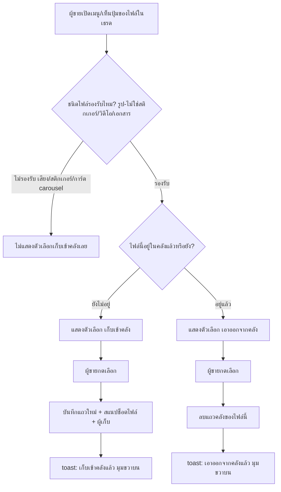
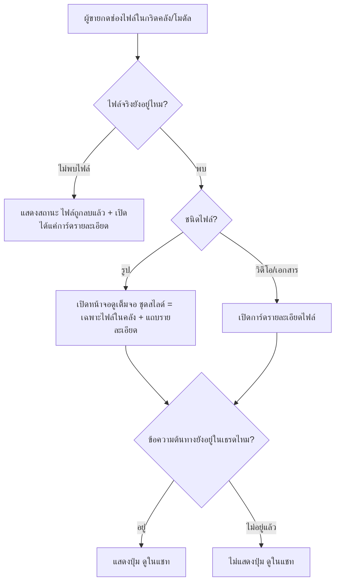

<!-- Feature 00048 - Customer File Library -->

---
title: "BRD — คลังไฟล์ต่อลูกค้า (Customer File Library)"
owner: shinobu22
status: draft
created: 2026-08-13
tags: [rules, brd, feature, 00048, chat, inbox, file-library]
related: ["[[PRD]]", "[[Feature-Docs-Ownership]]", "[[00018 - Facebook Chat Integration]]", "[[00037 - Unified Multishop Inbox]]"]
---

> **โมดูล:** 00048-CustomerFileLibrary
> **ประเภทเอกสาร:** Business Requirements Document (BRD) - NON-TECHNICAL
> **เวอร์ชัน:** 1.0
> **วันที่จัดทำ:** 2026-08-13
> **สถานะ:** Draft — รอ Controller review
> **เจ้าของเอกสาร:** BA

# BRD: คลังไฟล์ต่อลูกค้า (Customer File Library)

---

## 1. บทนำ

### 1.1 วัตถุประสงค์ของเอกสาร

เอกสารนี้มีวัตถุประสงค์เพื่อ:
1. อธิบายความต้องการหลักของ "คลังไฟล์ต่อลูกค้า" — พื้นที่คัดไฟล์สำคัญออกจากเธรดแชทของลูกค้า/ผู้ติดต่อรายหนึ่งด้วยมือ
2. กำหนดขอบเขตการทำงานและข้อจำกัด (ชนิดไฟล์ที่รองรับ, จุดเข้าถึง, สิทธิ์ทีมร้าน)
3. อธิบายเงื่อนไขการใช้งานและกฎทางธุรกิจ (การ toggle เก็บ/เอาออก, ความคงทนของข้อมูล, ความเป็นเจ้าของ)
4. สร้างความเข้าใจร่วมกันระหว่างทีมธุรกิจและทีมพัฒนา ก่อนลงมือออกแบบเทคนิค (SRS/SDS)

### 1.2 ขอบเขตของระบบ

**คลังไฟล์ต่อลูกค้า (Customer File Library)** คือส่วนขยายของกล่องแชทรวมหลายช่องทางฝั่งผู้ขาย ที่ให้ผู้ขายคัดไฟล์ (รูป/วิดีโอ/เอกสาร) ออกจากกระแสข้อความในเธรดหนึ่ง ๆ เข้าสู่คลังที่แสดงอยู่ในแผงข้อมูลลูกค้า เพื่อให้เรียกดูซ้ำได้ในภายหลังโดยไม่ต้องเลื่อนหาในเธรด และไม่หายไปแม้ข้อความต้นทางถูกลบ

**เข้าสู่ระบบ (Input):**
- การกดเลือก "เก็บเข้าคลัง"/"เอาออกจากคลัง" จาก 3 จุด (กดค้างบนมือถือ, ปุ่มตอน hover บนเดสก์ท็อป, ปุ่มในหน้าดูไฟล์เต็มจอ)
- การแก้ไขชื่อไฟล์/เพิ่มโน้ตต่อไฟล์ในโมดัล "ดูไฟล์ทั้งหมด"

**ออกจากระบบ (Output):**
- ส่วนแสดงผลกริดคลังไฟล์ (ล่าสุด 9 ใบ) ท้ายแท็บ "ข้อมูลลูกค้า"
- โมดัล "ดูไฟล์ทั้งหมด" (เมื่อมีเกิน 9 ใบ)
- หน้าจอดูไฟล์เต็ม (Lightbox สำหรับรูป, เปิดแท็บใหม่/การ์ดรายละเอียดสำหรับเอกสาร)

**ระบบที่เกี่ยวข้อง:**
- กล่องแชทรวมหลายช่องทางฝั่งผู้ขาย (feature 00018/00037) — เธรด, ข้อความ, ผู้ติดต่อ, สิทธิ์ทีมร้าน
- ระบบจัดเก็บไฟล์แนบในแชท (ไฟล์ mirror มาแล้ว เข้าถึงผ่านรหัสอ้างอิงไฟล์)

### 1.3 กลุ่มผู้ใช้งาน

| กลุ่มผู้ใช้ | บทบาท | สิทธิ์การใช้งาน |
|-----------|--------|----------------|
| **เจ้าของร้าน** | เจ้าของบัญชีร้าน | เก็บ/เอาไฟล์ออกจากคลังของทุกเธรดของร้านตัวเอง |
| **สมาชิกทีมร้าน (ShopMember)** | พนักงาน/แอดมินที่ได้รับเชิญ | เก็บ/เอาไฟล์ออกจากคลังของเธรดที่ตนเข้าถึงได้ เท่ากับเจ้าของร้าน ไม่มีข้อจำกัดเพิ่ม |
| **ลูกค้า/ผู้ติดต่อ** | ผู้ทักแชทเข้ามา | **ไม่มีสิทธิ์ใด ๆ กับคลังนี้เลย** ไม่เห็นแม้แต่ว่ามีคลังอยู่ |

---

## 2. ความต้องการหลัก (Functional Requirements)

### 2.1 การเก็บไฟล์เข้าคลัง

#### FR-CFL-01: เก็บไฟล์เข้าคลังจาก 3 จุดเข้าถึง

**User Story:**
> ในฐานะผู้ขายที่กำลังอ่านข้อความในห้องแชท ฉันต้องการเก็บไฟล์สำคัญเข้าคลังได้ทันทีจากจุดที่กำลังดูอยู่ เพื่อไม่ต้องจำไว้แล้วมาหาทีหลัง

**Acceptance Criteria:**
- [ ] บนมือถือ: กดค้างที่ไฟล์รูป/วิดีโอ/เอกสารในเธรด → เมนูลอยที่ปรากฏมีตัวเลือก "เก็บเข้าคลัง"
- [ ] บนเดสก์ท็อป: hover ที่แถวข้อความ → มีปุ่มเก็บเข้าคลังปรากฏในกลุ่มปุ่มข้างบับเบิล (กลุ่มเดียวกับ ตอบกลับ/คัดลอก/รีแอ็กชัน)
- [ ] ในหน้าจอดูไฟล์เต็ม (Lightbox): มีปุ่ม "เก็บเข้าคลัง" ที่สะท้อนสถานะของไฟล์ที่กำลังดูอยู่ ณ ขณะนั้น (เปลี่ยนไอคอนทันทีเมื่อเลื่อนดูไฟล์ถัดไปในชุด)
- [ ] ทั้ง 3 จุดเรียกใช้ผลลัพธ์เดียวกัน — ไฟล์ที่ถูกเก็บจากจุดใดจุดหนึ่ง ต้องแสดงสถานะ "อยู่ในคลังแล้ว" ที่อีก 2 จุดด้วยเมื่อกลับไปเปิดดูไฟล์เดิม
- [ ] กดเก็บสำเร็จ → มี toast แจ้งผล "เก็บเข้าคลังแล้ว" ที่มุมขวาบนของจอ (ยกเว้นในบริบท Lightbox ที่ใช้การสลับไอคอนเป็น feedback แทน)

**Business Flow:**
1. ผู้ขายเปิดจุดใดจุดหนึ่งใน 3 จุด (กดค้าง/hover/หน้าดูเต็มจอ) ที่ไฟล์ชนิดรูป/วิดีโอ/เอกสาร
2. ระบบตรวจว่าไฟล์นี้เคยถูกเก็บเข้าคลังแล้วหรือยัง
3. ยังไม่เคยเก็บ → ปุ่ม/ตัวเลือกแสดงข้อความ "เก็บเข้าคลัง"
4. กดเลือก → ระบบบันทึกแถวใหม่ในคลัง พร้อมสแนปช็อตข้อมูลไฟล์ (ชื่อ/ขนาด/ผู้ส่ง/เวลาที่ส่งจริง) + ผู้เก็บ (ผู้ขายที่กด)
5. แจ้งผลสำเร็จผ่าน toast มุมขวาบน

**Example:**
```
ลูกค้าส่งรูป "IMG_2891.jpg" (2.3MB) เวลา 14:32
ผู้ขายกดค้างที่รูปบนมือถือ → เลือก "เก็บเข้าคลัง"
ระบบบันทึก: ไฟล์ = fileId ของ IMG_2891.jpg, ผู้ส่ง = ลูกค้า (BUYER),
  เวลาที่ส่งจริง = 14:32, ผู้เก็บ = ผู้ขาย A, เวลาที่เก็บ = ตอนที่กด
toast: "เก็บเข้าคลังแล้ว"
```

#### FR-CFL-02: ขอบเขตชนิดไฟล์ที่เก็บเข้าคลังได้

**User Story:**
> ในฐานะผู้ขาย ฉันต้องการให้ตัวเลือก "เก็บเข้าคลัง" ปรากฏเฉพาะกับไฟล์ที่มีความหมายในการเก็บเป็นหลักฐาน/ข้อมูลอ้างอิง เพื่อไม่ให้คลังปนไปด้วยของที่ไม่เกี่ยวข้อง

**Acceptance Criteria:**
- [ ] ข้อความชนิดรูปภาพ (ที่ไม่ใช่สติกเกอร์), วิดีโอ, ไฟล์เอกสาร → มีตัวเลือก "เก็บเข้าคลัง" ปรากฏใน 3 จุดเข้าถึง
- [ ] ข้อความชนิดสติกเกอร์ (รูปที่มีธงสติกเกอร์) → **ไม่มี** ตัวเลือก "เก็บเข้าคลัง" ปรากฏเลยในเมนูกดค้าง/hover
- [ ] ข้อความชนิดไฟล์เสียง → ไม่มีตัวเลือก "เก็บเข้าคลัง" ปรากฏเลย
- [ ] รูปที่อยู่ในการ์ดสินค้า/โพสต์แบบ carousel จาก Facebook → ไม่มีตัวเลือก "เก็บเข้าคลัง" ปรากฏในเมนูของรูปเหล่านั้น **รวมถึงเมื่อเปิดรูปนั้นในหน้าดูเต็มจอด้วย** (หน้าดูเต็มจอใช้ชุดสไลด์ร่วมกัน จึงต้องแยกได้ว่าสไลด์ไหนเก็บเข้าคลังได้)

**Business Flow:**
1. ผู้ขายเปิดเมนูของข้อความหนึ่ง
2. ระบบตรวจชนิดของไฟล์แนบในข้อความนั้น
3. เป็นรูป(ไม่ใช่สติกเกอร์)/วิดีโอ/เอกสาร → แสดงตัวเลือก "เก็บเข้าคลัง"
4. เป็นเสียง/สติกเกอร์/รูปการ์ด carousel/ข้อความไม่มีไฟล์แนบ → ไม่แสดงตัวเลือกนี้เลย

#### FR-CFL-03: เก็บได้ทั้งไฟล์ขาเข้าและขาออก

**User Story:**
> ในฐานะผู้ขาย ฉันต้องการเก็บทั้งไฟล์ที่ลูกค้าส่งมาและเอกสารที่ฉันส่งให้ลูกค้าเข้าคลังเดียวกัน เพราะทั้งสองฝั่งอาจสำคัญพอกัน (เช่น ใบเสนอราคาที่ฉันส่งไป)

**Acceptance Criteria:**
- [ ] ไฟล์ที่ลูกค้า/ผู้ติดต่อเป็นผู้ส่ง → เก็บเข้าคลังได้ปกติ พร้อมบันทึกว่าผู้ส่งคือฝั่งลูกค้า
- [ ] ไฟล์ที่ผู้ขาย/ทีมร้านเป็นผู้ส่งออกไป → เก็บเข้าคลังได้ปกติเช่นกัน พร้อมบันทึกว่าผู้ส่งคือฝั่งร้าน
- [ ] คลังแสดงไฟล์ทั้งสองฝั่งปนกันในกริดเดียว ไม่แยกเป็นสองคลัง

---

### 2.2 การเอาไฟล์ออกจากคลัง

#### FR-CFL-04: กดซ้ำ = เอาออกจากคลัง (Toggle)

**User Story:**
> ในฐานะผู้ขาย ฉันต้องการกดปุ่มเดิมซ้ำเพื่อเอาไฟล์ออกจากคลังถ้าเก็บผิด โดยไม่ต้องไปหาปุ่ม "ลบ" แยกที่อื่น

**Acceptance Criteria:**
- [ ] ไฟล์ที่อยู่ในคลังแล้ว → ตัวเลือกในเมนูของข้อความนั้นเปลี่ยนข้อความเป็น "เอาออกจากคลัง"
- [ ] กด "เอาออกจากคลัง" → แถวไฟล์นั้นหายจากกริดคลังทันที (optimistic) + toast แจ้งผล "เอาออกจากคลังแล้ว" มุมขวาบน
- [ ] เอาออกจากคลังแล้ว กดเก็บซ้ำอีกครั้งได้ตามปกติ ไม่มีข้อจำกัดว่าเก็บ-เอาออกได้กี่ครั้ง
- [ ] การเอาออกจากคลังไม่กระทบข้อความต้นทางในเธรดหรือไฟล์จริงในระบบจัดเก็บ — ข้อความยังอยู่ในเธรดตามปกติ
- [ ] "เอาออกจากคลัง" ไม่ใช่การกระทำที่ทำลายถาวร (ย้อนกลับได้ในคลิกเดียว) จึง **ไม่ต้องมีหน้าต่างยืนยัน** และไม่ใช้สีอันตราย

#### FR-CFL-05: ป้องกันการเก็บซ้ำเมื่อกดพร้อมกัน

**User Story:**
> ในฐานะระบบ ฉันต้องไม่สร้างแถวคลังซ้ำสำหรับไฟล์เดียวกัน แม้จะมีผู้ใช้สองคนกดเก็บไฟล์เดียวกันในเวลาไล่เลี่ยกัน

**Acceptance Criteria:**
- [ ] ไฟล์หนึ่งไฟล์ มีได้สูงสุด 1 แถวในคลังของเจ้าของคลังหนึ่งราย ณ เวลาใดเวลาหนึ่ง
- [ ] พนักงาน 2 คนกดเก็บไฟล์เดียวกันพร้อมกัน → ผลลัพธ์คือมีแถวเดียวในคลัง ไม่มีแถวซ้ำหรือ error ที่ผู้ใช้เห็น
- [ ] การป้องกันนี้ต้องยึดอยู่ที่ชั้นข้อมูล (ข้อจำกัดของระบบ ไม่ใช่แค่การเช็คสถานะบนหน้าจอก่อนกดส่ง) เพราะการเช็คก่อนส่งอย่างเดียวไม่กันการชนกันของคำขอที่มาถึงพร้อมกันจริง ๆ

---

### 2.3 การแสดงผลในแผงข้อมูลลูกค้า

#### FR-CFL-06: ตำแหน่งและโครงสร้าง section คลังไฟล์

**User Story:**
> ในฐานะผู้ขาย ฉันต้องการเห็นคลังไฟล์ของลูกค้าคนนี้อยู่ในที่เดียวกับข้อมูลอื่นของลูกค้าที่ฉันเปิดดูอยู่แล้ว โดยไม่ต้องสลับหน้าจอ

**Acceptance Criteria:**
- [ ] Section คลังไฟล์อยู่ในแท็บ "ข้อมูลลูกค้า" ของแผงลูกค้า **ตำแหน่งล่างสุด** ใต้บล็อกสุดท้ายที่มีอยู่ — ไม่ใช่แท็บแยกต่างหาก
- [ ] แสดงผลเหมือนกันทั้งบนเดสก์ท็อป (คอลัมน์ข้อมูลลูกค้าแบบ persistent) และมือถือ/แท็บเล็ต (bottom-sheet ข้อมูลลูกค้า) — มาจากส่วนแสดงผลชุดเดียวกัน ไม่ใช่ implement แยกกันสองชุด

#### FR-CFL-07: กริดคลังไฟล์และการเรียงลำดับ

**User Story:**
> ในฐานะผู้ขาย ฉันต้องการเห็นไฟล์ล่าสุดก่อนเสมอ เพราะไฟล์ที่เพิ่งเกิดขึ้นมักเป็นไฟล์ที่ฉันกำลังตามหา

**Acceptance Criteria:**
- [ ] กริดแสดงสูงสุด 9 ไฟล์ (3 คอลัมน์ × 3 แถว) สัดส่วนช่องละ 4:5
- [ ] เรียงลำดับตาม **เวลาที่ไฟล์ถูกส่งจริงในเธรด** ใหม่→เก่า (ไม่ใช่เวลาที่กดเก็บเข้าคลัง)
- [ ] ทุกช่องมี aria-label บอกชนิดไฟล์ + ผู้ส่ง + วันที่ส่ง (เช่น "รูปจาก สมชาย · 12 ส.ค. 2569" / "วิดีโอจาก สมชาย · 12 ส.ค. 2569" / "{ชื่อไฟล์} จาก สมชาย · 12 ส.ค. 2569") — ไม่มีข้อความปรากฏบนตัวช่องโดยตรง
- [ ] ช่องของไฟล์เอกสารต้องแยกแยะได้ด้วยสายตาจากช่องรูป/วิดีโอ (แสดงเป็นไอคอนชนิดไฟล์ ไม่ใช่ภาพตัวอย่างเนื้อหา) เพราะพฤติกรรมเมื่อกดต่างกัน

#### FR-CFL-08: คลังว่าง — Empty State

**User Story:**
> ในฐานะผู้ขายที่ยังไม่เคยใช้ฟีเจอร์นี้ ฉันต้องการรู้ว่ามีฟีเจอร์นี้อยู่และรู้วิธีเริ่มใช้ทันทีที่เห็นแท็บข้อมูลลูกค้า

**Acceptance Criteria:**
- [ ] เธรดที่ยังไม่มีไฟล์ในคลังเลย → section คลังไฟล์ยังคงแสดงอยู่ (ไม่ถูกซ่อนไป) พร้อมข้อความอธิบายวิธีเก็บไฟล์เข้าคลัง
- [ ] ข้อความ empty state ต้องสื่อว่าเป็นการคัดด้วยมือ (อธิบายว่ากดค้าง/hover ที่ไฟล์ในเธรดเพื่อเก็บ) ไม่ใช่บอกว่า "ยังไม่มีไฟล์" เฉย ๆ
- [ ] กริดไม่เติมช่องว่างเปล่าให้ครบ 9 ช่อง — แสดงเท่าจำนวนไฟล์จริงที่มี

#### FR-CFL-09: ลิงก์ "ดูไฟล์ทั้งหมด"

**User Story:**
> ในฐานะผู้ขายที่มีไฟล์เก็บไว้เยอะ ฉันต้องการเห็นไฟล์ทั้งหมดที่เก็บไว้ ไม่ใช่แค่ 9 ใบล่าสุด

**Acceptance Criteria:**
- [ ] มีไฟล์ในคลัง ≤ 9 ใบ → ไม่มีลิงก์ "ดูไฟล์ทั้งหมด" ปรากฏ
- [ ] มีไฟล์ในคลัง > 9 ใบ → ปรากฏลิงก์ "ดูไฟล์ทั้งหมด (N)" โดย N คือจำนวนไฟล์ทั้งหมดจริงในคลังของเจ้าของคลังนี้ (ไม่ใช่จำนวนที่แสดงในกริด)
- [ ] กดลิงก์ → เปิดโมดัลกริดเต็ม (ดู FR-CFL-13) โดยไม่ออกจากห้องแชท

---

### 2.4 การเรียกดูไฟล์

#### FR-CFL-10: เปิดไฟล์รูปในหน้าจอดูเต็ม (Lightbox)

**User Story:**
> ในฐานะผู้ขาย ฉันต้องการดูรูปในคลังแบบเต็มจอ ขยายดูได้ ไม่ใช่แค่เห็นภาพย่อในกริด

**Acceptance Criteria:**
- [ ] กดช่องรูปในกริดคลัง/โมดัล "ดูไฟล์ทั้งหมด" → เปิดหน้าจอดูเต็มจอ (ตัวเดียวกับที่ใช้ดูรูปในเธรด) ที่ตำแหน่งของรูปนั้น
- [ ] ชุดรูปที่เลื่อนดูต่อได้ (ซ้าย/ขวา หรือปัดบนมือถือ) ต้องเป็น **เฉพาะไฟล์ในคลังของเจ้าของคลังนี้เท่านั้น** — ไม่ปนกับรูปอื่นทั้งเธรดที่ไม่ได้อยู่ในคลัง
- [ ] มีปุ่มขยาย (Zoom) และปุ่มโหลดไฟล์ลงเครื่อง (Download) เหมือนกับหน้าจอดูรูปในเธรดปกติ
- [ ] มีแถบรายละเอียดท้ายจอบอก: ผู้ส่ง + วันที่ส่ง, ผู้เก็บ + วันที่เก็บ, และปุ่ม แก้ไข / ดาวน์โหลด / ดูในแชท / เอาออกจากคลัง

#### FR-CFL-11: เปิดไฟล์เอกสารและวิดีโอ

**User Story:**
> ในฐานะผู้ขาย ฉันต้องการเปิดไฟล์เอกสารและวิดีโอในคลังได้ แม้ว่ามันจะไม่เหมาะกับหน้าจอดูรูปภาพ

**Acceptance Criteria:**
- [ ] กดช่องไฟล์เอกสารในกริดคลัง/โมดัล → เปิดการ์ดรายละเอียดไฟล์ (ชื่อ/ขนาด/ผู้ส่ง/ผู้เก็บ + ปุ่ม เปิดไฟล์ / ดาวน์โหลด / แก้ไข / ดูในแชท / เอาออกจากคลัง) — ไม่ผ่านหน้าจอดูรูปเต็มจอ
- [ ] ไฟล์เอกสารไม่ถูกนับรวมในชุดสไลด์ของหน้าจอดูรูปเต็มจอ (FR-CFL-10)
- [ ] ช่องวิดีโอในกริดแสดงเฟรมแรกของวิดีโอจริงพร้อมสัญลักษณ์เล่น (ไม่ใช่ไอคอนเปล่าแบบไฟล์เอกสาร) เพื่อให้แยกจากไฟล์เอกสารได้ด้วยสายตา
- [ ] วิธีเปิดวิดีโอ (ในหน้าจอดูเต็มจอ หรือการ์ดรายละเอียดที่มีตัวเล่นวิดีโอ) ให้เป็นไปตามมติที่ระบุใน SDS — ดูหมายเหตุใน §7.2

#### FR-CFL-12: ปุ่ม "ดูในแชท" แบบมีเงื่อนไข

**User Story:**
> ในฐานะผู้ขาย เมื่อดูไฟล์จากคลังแล้วอยากเห็นบริบทการสนทนารอบข้อความนั้น ฉันต้องการกระโดดกลับไปยังตำแหน่งข้อความต้นทางในเธรดได้

**Acceptance Criteria:**
- [ ] หน้าจอดูไฟล์เต็ม/การ์ดรายละเอียดของไฟล์ในคลัง มีปุ่ม "ดูในแชท" ที่กระโดดไปยังข้อความต้นทางในเธรด
- [ ] กระโดดไปหาข้อความต้นทางได้จริง → ปุ่มทำงาน ปิดโมดัล/หน้าจอเต็ม แล้วเธรดเลื่อนไปยังข้อความนั้นพร้อมไฮไลต์ชั่วคราว
- [ ] ข้อความต้นทางไม่มีอยู่ในเธรดแล้ว (เช่นถูกลบออกจากฐานข้อมูลจริง ไม่ใช่แค่ soft-delete) → **ปุ่มนี้ไม่ปรากฏเลย** ไม่ใช่ปรากฏแล้วกดไม่ได้ผล
- [ ] ข้อความต้นทางยังอยู่แต่ยังไม่ถูกโหลดเข้าหน้าจอ (ต้องเลื่อนขึ้นไปโหลดข้อความเก่าก่อน) → ระบบต้องแจ้งผู้ใช้ว่ายังไปไม่ถึง ไม่เงียบ

---

### 2.5 โมดัล "ดูไฟล์ทั้งหมด"

#### FR-CFL-13: โมดัลกริดเต็มพร้อมโหลดเพิ่มเมื่อเลื่อน

**User Story:**
> ในฐานะผู้ขายที่มีไฟล์สะสมในคลังมาก ฉันต้องการดูไฟล์ทั้งหมดได้โดยไม่ต้องออกจากห้องแชทที่กำลังคุยอยู่

**Acceptance Criteria:**
- [ ] กดลิงก์ "ดูไฟล์ทั้งหมด" → เปิดเป็นโมดัล/ชีตซ้อนอยู่ในหน้าห้องแชทเดิม (ไม่ navigate ไปหน้าอื่น, ไม่เสีย scroll position ของเธรด)
- [ ] โมดัลแสดงไฟล์ทั้งหมดของเจ้าของคลังนี้ เรียงลำดับเดียวกับกริดหลัก
- [ ] เลื่อนโมดัลถึงท้ายรายการที่โหลดไว้ → โหลดไฟล์ชุดถัดไปเพิ่มทีละ 60 ใบ โดยไม่ต้องกดปุ่ม "โหลดเพิ่ม" เอง
- [ ] จำนวนไฟล์ในคลังไม่มีเพดานสูงสุด — โมดัลต้องรองรับการเลื่อนโหลดต่อเนื่องได้ไม่ว่าคลังจะมีกี่ไฟล์
- [ ] โมดัลต้องตรึงการเลื่อนของหน้าด้านหลัง (ไม่ให้เลื่อนทะลุไปโดนเธรด) ตามมาตรฐาน overlay ของระบบ

#### FR-CFL-14: แก้ไขชื่อไฟล์/เพิ่มโน้ต

**User Story:**
> ในฐานะผู้ขาย ฉันต้องการตั้งชื่อไฟล์ให้จำง่ายขึ้นหรือเขียนโน้ตกำกับไฟล์บางใบ โดยไม่ต้องทำตอนกดเก็บเข้าคลัง (เพราะตอนนั้นฉันแค่อยากเก็บเร็ว ๆ)

**Acceptance Criteria:**
- [ ] กดเก็บไฟล์เข้าคลัง (FR-CFL-01) → ไม่มีการถามชื่อ/โน้ตใด ๆ ระหว่างทาง จบในคลิกเดียว
- [ ] จากหน้าจอดูไฟล์เต็ม/การ์ดรายละเอียด มีปุ่ม "แก้ไข" ที่เปิดฟอร์ม 2 ช่อง (ชื่อไฟล์ + โน้ต)
- [ ] แก้ไขแล้วบันทึกสำเร็จ → ชื่อ/โน้ตที่แก้ไขแสดงผลทันทีทั้งในรายละเอียดและใน aria-label ของกริด

---

### 2.6 ความเป็นเจ้าของและสิทธิ์การมองเห็น

#### FR-CFL-15: กำหนดเจ้าของคลัง

**User Story:**
> ในฐานะระบบ ฉันต้องผูกคลังไฟล์เข้ากับ "ตัวตนของลูกค้า" ที่คงอยู่แม้เธรดจะถูกจัดการอย่างไรก็ตาม เพื่อให้คลังไม่หายหรือกระจัดกระจาย

**Acceptance Criteria:**
- [ ] เธรดที่ผูกกับผู้ติดต่อภายนอก (Messenger/Instagram/LINE) → คลังผูกกับผู้ติดต่อภายนอกรายนั้น
- [ ] เธรดแชท DEEP ที่ไม่มีผู้ติดต่อภายนอกผูกอยู่ → คลังผูกกับเธรดนั้นโดยตรง
- [ ] คลังของเจ้าของหนึ่งรายต้องมีเจ้าของที่ระบุได้เสมออย่างน้อย 1 แบบ (ผู้ติดต่อภายนอก หรือ เธรด) ไม่มีคลังที่ "ลอย" ไม่มีเจ้าของ

#### FR-CFL-16: คลังเป็นของทีมร้าน — สิทธิ์เท่ากันทุกคน

**User Story:**
> ในฐานะสมาชิกทีมร้าน ฉันต้องการเห็นและจัดการไฟล์ในคลังของลูกค้าคนเดียวกับที่เพื่อนร่วมงานเคยเก็บไว้ ไม่ใช่เห็นแค่ของตัวเอง

**Acceptance Criteria:**
- [ ] ทุกคนที่เข้าถึงห้องแชทนี้ได้ (เจ้าของร้าน + สมาชิกทีมที่มีสิทธิ์เข้าห้องแชทของร้าน) เห็นรายการไฟล์ในคลังชุดเดียวกันทุกประการ
- [ ] สมาชิกทีมคนใดก็ตามที่เข้าถึงห้องแชทได้ เอาไฟล์ออกจากคลังได้ ไม่ว่าตัวเองจะเป็นคนเก็บไฟล์นั้นเข้ามาหรือไม่
- [ ] แต่ละไฟล์แสดงป้าย "เก็บโดย {ชื่อผู้เก็บ}" ให้เห็นว่าใครเป็นคนเก็บไว้ — เป็นข้อมูลบริบท ไม่ใช่ข้อจำกัดสิทธิ์

#### FR-CFL-17: ลูกค้าไม่เห็นคลัง

**User Story:**
> ในฐานะผู้ขาย ฉันต้องมั่นใจว่าลูกค้าไม่มีทางเห็นว่าฉันเก็บไฟล์ของเขาไว้ที่ไหนหรืออย่างไร

**Acceptance Criteria:**
- [ ] ไม่มีหน้าจอ/route ฝั่งลูกค้า (ทั้งเว็บและแอปผู้ซื้อ) ที่แสดงเนื้อหาคลังไฟล์นี้ไม่ว่าทางใด
- [ ] คำขอเข้าถึงข้อมูลคลังจากบัญชีที่ไม่ใช่เจ้าของร้าน/สมาชิกทีมของร้านนั้น ต้องถูกปฏิเสธ

---

### 2.7 ความคงทนของข้อมูล

#### FR-CFL-18: แถวคลังอยู่ต่อแม้ข้อความต้นทางถูกลบ

**User Story:**
> ในฐานะผู้ขาย ฉันต้องการให้ไฟล์ที่เก็บไว้แล้วยังเปิดดูได้ แม้ลูกค้าจะ unsend หรือข้อความต้นทางถูกลบไปในภายหลัง — นี่คือเหตุผลที่ฉันเก็บมันเข้าคลังตั้งแต่แรก

**Acceptance Criteria:**
- [ ] เก็บไฟล์เข้าคลังแล้ว ลูกค้า unsend ข้อความต้นทาง → ไฟล์ในคลังยังปรากฏในกริด เปิดดูได้ปกติทุกประการ
- [ ] ข้อมูลที่แสดงในคลัง (ชื่อไฟล์ ผู้ส่ง วันที่ส่ง) ต้องอ่านได้จากสแนปช็อตของคลังเอง ไม่พึ่งการอ่านข้อความต้นทาง

#### FR-CFL-19: สถานะ "ไฟล์ถูกลบแล้ว" เมื่อไฟล์จริงหายจากระบบจัดเก็บ

**User Story:**
> ในฐานะผู้ขาย เมื่อไฟล์ในคลังเปิดไม่ขึ้นเพราะไฟล์จริงหายไปจากระบบจัดเก็บ ฉันต้องการรู้ว่าเกิดอะไรขึ้น ไม่ใช่เห็นแค่ช่องว่างที่ดูเหมือนบั๊ก

**Acceptance Criteria:**
- [ ] ไฟล์จริงในระบบจัดเก็บไม่พบ → ช่องนั้นในกริดแสดงไอคอน + ข้อความ "ไฟล์ถูกลบแล้ว" แทนที่ช่องว่างหรือภาพแตก
- [ ] ช่องที่ไฟล์หาย **กดเปิดหน้าจอดูเต็มจอไม่ได้** แต่ยังกดเปิดการ์ดรายละเอียดได้ เพื่อให้เอาออกจากคลังได้
- [ ] การ์ดรายละเอียดของไฟล์ที่หาย ตัดปุ่มที่ทำไม่ได้จริงออก (เปิดไฟล์/ดาวน์โหลด) เหลือข้อมูลประกอบ + ปุ่มเอาออกจากคลัง
- [ ] แถวคลังของไฟล์ที่หายไปนี้ **ไม่ถูกลบทิ้งเอง** โดยระบบ — ยังคงอยู่ในรายการจนกว่าผู้ใช้จะกดเอาออกเอง

#### FR-CFL-20: การลบแบบ Cascade ตามเจ้าของคลัง

**User Story:**
> ในฐานะระบบ เมื่อผู้ติดต่อหรือเธรดที่เป็นเจ้าของคลังถูกลบทั้งบัญชี ฉันต้องเคลียร์แถวคลังที่ผูกกับเจ้าของนั้นไปด้วย โดยไม่แตะไฟล์จริงที่ยังถูกใช้อยู่ในเธรด

**Acceptance Criteria:**
- [ ] ผู้ติดต่อภายนอก หรือเธรดที่เป็นเจ้าของคลัง ถูกลบทั้งบัญชี → แถวคลังทั้งหมดที่ผูกกับเจ้าของนั้นถูกลบไปด้วยโดยอัตโนมัติ
- [ ] การลบแถวคลังในกรณีนี้ **ไม่ลบไฟล์จริงในระบบจัดเก็บ** — เพราะไฟล์เดียวกันอาจยังถูกอ้างอิงจากที่อื่นในเธรด

---

### 2.8 คำศัพท์ ตำแหน่งแจ้งเตือน และพฤติกรรมรีเฟรช

#### FR-CFL-21: คำที่ใช้ในระบบ

**User Story:**
> ในฐานะผู้ขาย ฉันต้องการให้คำที่ใช้เรียก action นี้ไม่สับสนกับคำว่า "บันทึก" ที่ใช้กับการดาวน์โหลดไฟล์ลงเครื่องอยู่แล้วในระบบ

**Acceptance Criteria:**
- [ ] คำที่ใช้เรียก action คือ "เก็บเข้าคลัง" / "เอาออกจากคลัง" เท่านั้น — ไม่ใช้คำว่า "บันทึก" ในความหมายของการเก็บเข้าคลังที่จุดใดเลย
- [ ] ชื่อ section ในแท็บข้อมูลลูกค้าคือ "คลังไฟล์"
- [ ] คำทั้งหมดของฟีเจอร์นี้มาจากจุดกำหนดคำศัพท์เดียว (single source of truth) เพื่อไม่ให้คำเพี้ยนกันระหว่างหน้าจอต่าง ๆ ที่แสดงคลังนี้ (กริดหลัก, โมดัล, หน้าดูเต็มจอ, เมนูกดค้าง/ปุ่ม hover)

#### FR-CFL-22: ตำแหน่งการแจ้งผล (Toast)

**User Story:**
> ในฐานะผู้ขาย เมื่อฉันกดเก็บ/เอาไฟล์ออกจากคลังเอง ฉันต้องการเห็นผลของการกดของฉันเองในตำแหน่งที่ต่างจากข้อความแชทที่ไหลเข้ามาเอง

**Acceptance Criteria:**
- [ ] toast แจ้งผลของ "เก็บเข้าคลัง"/"เอาออกจากคลัง" ปรากฏที่ **มุมขวาบน** ของจอ (ตำแหน่งเดียวกับ toast ของ action ที่ผู้ใช้กดเอง)
- [ ] ไม่ใช้ตำแหน่งมุมล่างขวาที่สงวนไว้สำหรับข้อความที่ไหลเข้ามาเองในแชท
- [ ] ในบริบทหน้าจอดูไฟล์เต็มจอ ให้ใช้การสลับไอคอนทันทีเป็น feedback หลัก (ไม่พึ่ง toast ที่อาจถูกบังโดยชั้นการแสดงผลของหน้าจอเต็ม)

#### FR-CFL-23: การรีเฟรชข้อมูลคลัง

**User Story:**
> ในฐานะผู้ขาย ฉันเข้าใจว่าการเปลี่ยนแปลงคลังจากเพื่อนร่วมทีมอาจไม่ปรากฏทันทีในหน้าจอของฉันจนกว่าจะรีเฟรช

**Acceptance Criteria:**
- [ ] รายการคลังถูกดึงข้อมูลใหม่เมื่อ: เปิดแผงข้อมูลลูกค้าของเธรดนั้น, สลับกลับมาที่แท็บ "ข้อมูลลูกค้า", หรือปิดโมดัล "ดูไฟล์ทั้งหมด"
- [ ] ไม่มีการอัปเดตแบบเรียลไทม์ระหว่างที่แผงเปิดค้างอยู่ — การกระทำของผู้ใช้อื่นจะไม่ปรากฏจนกว่าจะเกิดจังหวะ refetch ข้างต้น

#### FR-CFL-24: ไม่มีทางลัดใหม่บนแถบเครื่องมือมือถือ

**User Story:**
> ในฐานะทีมพัฒนา ฉันต้องไม่เพิ่มปุ่ม/ไอคอนใหม่บนแถบเครื่องมือแชทมือถือสำหรับฟีเจอร์นี้ เพราะพื้นที่ตรงนั้นเพิ่งถูกยุบเข้าเมนู "⋯" จากปัญหาล้นขอบจอมาก่อนหน้านี้

**Acceptance Criteria:**
- [ ] แถบเครื่องมือของห้องแชทบนมือถือ (composer toolbar) ไม่มีปุ่ม/ไอคอนใหม่ที่เกี่ยวกับคลังไฟล์เพิ่มเข้ามา
- [ ] การเข้าถึงคลังไฟล์ทำได้เฉพาะผ่าน 3 จุดที่ระบุใน FR-CFL-01 และผ่านแท็บ "ข้อมูลลูกค้า" เท่านั้น

---

## 3. Acceptance Criteria สรุป

### 3.1 การเก็บ/เอาออกจากคลัง

**เมื่อระบบทำงานถูกต้อง:**
- ✅ เก็บไฟล์เข้าคลังได้จาก 3 จุด (กดค้างมือถือ, ปุ่ม hover เดสก์ท็อป, ปุ่มในหน้าดูเต็มจอ) ด้วยผลลัพธ์เดียวกัน
- ✅ กดปุ่มเดิมซ้ำ = toggle เอาออกจากคลัง ไม่ใช่เก็บซ้ำเป็นแถวใหม่ และไม่ต้องมีหน้าต่างยืนยัน
- ✅ กดพร้อมกันหลายคนบนไฟล์เดียวกัน ไม่เกิดแถวซ้ำหรือ error ที่ผู้ใช้เห็น
- ✅ เฉพาะรูป(ไม่ใช่สติกเกอร์)/วิดีโอ/เอกสารเท่านั้นที่มีตัวเลือกนี้ — เสียง/สติกเกอร์/รูปการ์ด carousel ไม่มีทางเข้าคลังได้ รวมถึงตอนเปิดในหน้าดูเต็มจอ

### 3.2 การแสดงผลและการเรียกดู

**เมื่อคลังมีไฟล์:**
- ✅ กริด 9 ช่องล่าสุด เรียงตามเวลาที่ส่งจริง ใหม่→เก่า
- ✅ N > 9 → มีลิงก์ "ดูไฟล์ทั้งหมด (N)" เปิดโมดัลในหน้าเดิม โหลดเพิ่มหน้าละ 60 เมื่อเลื่อนถึงท้าย
- ✅ กดช่องรูป → หน้าจอดูเต็มจอ (เฉพาะไฟล์ในคลัง) ; ช่องเอกสาร/วิดีโอ → การ์ดรายละเอียด
- ✅ ปุ่ม "ดูในแชท" ปรากฏเฉพาะเมื่อข้อความต้นทางยังมีอยู่จริง

**เมื่อคลังยังว่าง:**
- ✅ section ยังคงแสดงอยู่ พร้อมคำอธิบายวิธีเริ่มเก็บไฟล์ ไม่ถูกซ่อนไปเงียบ ๆ

### 3.3 ความเป็นเจ้าของและความคงทน

**เมื่อระบบทำงานถูกต้อง:**
- ✅ ทีมร้านทุกคนที่เข้าห้องแชทได้ เห็น/จัดการคลังชุดเดียวกันเสมอ พร้อมป้าย "เก็บโดย X"
- ✅ ลูกค้าไม่มีทางเห็นคลังในทุกกรณี
- ✅ ข้อความต้นทางถูกลบ/unsend ไม่กระทบแถวคลังหรือไฟล์ที่เปิดดูได้
- ✅ ไฟล์จริงหายจากระบบจัดเก็บ → แสดงสถานะ "ไฟล์ถูกลบแล้ว" ไม่ใช่ช่องว่าง และแถวคลังไม่ถูกลบทิ้งเอง
- ✅ เจ้าของคลังถูกลบทั้งบัญชี → แถวคลังถูกลบตามแบบ cascade แต่ไฟล์จริงในระบบจัดเก็บไม่ถูกลบ

---

## 4. Business Flows (กระบวนการทำงาน)

### 4.1 Flow หลัก: เก็บ/เอาไฟล์ออกจากคลัง (Toggle)



### 4.2 Flow ย่อย: ดูไฟล์จากคลัง



---

## 5. Use Case Scenarios (สถานการณ์การใช้งานจริง)

### Scenario 1: เก็บสลิปโอนเงินระหว่างคุยแชท (Best Case)

**เงื่อนไขเริ่มต้น:** เธรดแชทเปิดอยู่ ลูกค้าเพิ่งส่งรูปสลิปโอนเงินเข้ามา

**ขั้นตอน:**
1. ผู้ขายกดค้าง (มือถือ) ที่รูปสลิป
2. เมนูลอยขึ้นมา ผู้ขายกดเลือก "เก็บเข้าคลัง"
3. ระบบบันทึกและแจ้งผลด้วย toast มุมขวาบน

**ผลลัพธ์:** สลิปปรากฏในกริดคลังท้ายแท็บ "ข้อมูลลูกค้า" ทันที พร้อมป้าย "เก็บโดย{ชื่อผู้ขาย}"

### Scenario 2: ค้นสลิปเก่าตอนเกิดข้อพิพาท

**เงื่อนไขเริ่มต้น:** สลิปถูกเก็บเข้าคลังไว้แล้ว 2 สัปดาห์ก่อน ลูกค้า unsend ข้อความสลิปต้นทางไปแล้ว

**ขั้นตอน:**
1. ลูกค้าทักมาอ้างว่าโอนเงินแล้วแต่ยังไม่ได้รับสินค้า
2. ผู้ขายเปิดแท็บ "ข้อมูลลูกค้า" เลื่อนลงไปที่ section คลังไฟล์
3. เห็นสลิปเดิมอยู่ในกริด กดเปิดดูเต็มจอ

**ผลลัพธ์:** สลิปยังเปิดดูได้ปกติแม้ข้อความต้นทางจะถูกลบไปแล้ว ใช้เป็นหลักฐานยืนยันยอด/เวลาโอนได้

### Scenario 3: ทีมร้าน 2 คนใช้คลังร่วมกัน

**เงื่อนไขเริ่มต้น:** พนักงาน A เคยเก็บรูปแบบงานของลูกค้ารายนี้เข้าคลังไว้เมื่อ 3 วันก่อน

**ขั้นตอน:**
1. ลูกค้าทักกลับมาระหว่างที่พนักงาน A ไม่อยู่กะ
2. พนักงาน B เปิดห้องแชทเดียวกัน ดูแท็บ "ข้อมูลลูกค้า"
3. เห็นรูปแบบงานที่พนักงาน A เก็บไว้ พร้อมป้าย "เก็บโดย A"

**ผลลัพธ์:** พนักงาน B เข้าใจบริบทงานได้ทันทีโดยไม่ต้องถามลูกค้าซ้ำหรือเลื่อนอ่านเธรดทั้งหมด

### Scenario 4: กดเก็บไฟล์เดิมพร้อมกัน 2 คน

**เงื่อนไขเริ่มต้น:** ทั้งสองคนเปิดห้องแชทเดียวกันพร้อมกัน เห็นรูปเดียวกันที่ยังไม่ถูกเก็บ

**ขั้นตอน:**
1. พนักงาน A กด "เก็บเข้าคลัง" ที่รูปนั้น
2. เกือบพร้อมกัน พนักงาน B กดที่รูปเดียวกัน ก่อนหน้าจอของ B จะรู้ว่า A กดไปแล้ว

**ผลลัพธ์:** คลังมีแถวของไฟล์นี้เพียงแถวเดียว ไม่มีแถวซ้ำ ไม่มี error ปรากฏบนหน้าจอของทั้งสองคน

### Scenario 5: ไฟล์เอกสารที่ร้านส่งออกไปให้ลูกค้า

**เงื่อนไขเริ่มต้น:** ผู้ขายส่งไฟล์ใบเสนอราคา (PDF) เข้าไปในเธรดให้ลูกค้า

**ขั้นตอน:**
1. ผู้ขาย hover ที่ข้อความไฟล์ของตัวเองบนเดสก์ท็อป → กดปุ่มเก็บเข้าคลัง
2. ภายหลังเปิดโมดัล "ดูไฟล์ทั้งหมด" แล้วกดที่ไฟล์นี้

**ผลลัพธ์:** เปิดการ์ดรายละเอียดไฟล์ (ไม่ใช่หน้าจอดูรูปเต็มจอ) พร้อมปุ่มเปิดไฟล์/ดาวน์โหลด — บันทึกว่าผู้ส่งคือฝั่งร้าน

---

## 6. ความต้องการด้านคุณภาพ (Quality Requirements)

### 6.1 ความถูกต้องของข้อมูล
- สแนปช็อตข้อมูลไฟล์ (ชื่อ/ขนาด/ผู้ส่ง/เวลาที่ส่งจริง) ต้องบันทึก ณ เวลาที่กดเก็บเข้าคลัง และไม่เปลี่ยนแปลงตามข้อความต้นทางในภายหลัง (ยกเว้นชื่อ/โน้ตที่ผู้ใช้แก้ไขเอง)
- จำนวน N ในลิงก์ "ดูไฟล์ทั้งหมด (N)" ต้องตรงกับจำนวนแถวจริงในคลังเสมอ ไม่ใช่ค่าประมาณ

### 6.2 ความรวดเร็ว
- การกดเก็บ/เอาออกจากคลัง ต้องแสดงผลบนหน้าจอทันที (optimistic) ไม่ต้องรอ round-trip เต็มก่อนเห็นผล
- โมดัล "ดูไฟล์ทั้งหมด" โหลดชุดแรกและชุดถัดไปโดยไม่ทำให้หน้าจอค้าง

### 6.3 ความน่าเชื่อถือ
- แถวคลังต้องไม่หายไปเองจากเหตุการณ์ใด ๆ ในเธรดต้นทาง ยกเว้นการลบทั้งบัญชีของเจ้าของคลัง
- การชนกันของคำขอ (กดพร้อมกัน) ต้องไม่ทำให้ข้อมูลผิดเพี้ยนหรือเกิดแถวซ้ำ

### 6.4 ความปลอดภัย
- ทุกการเข้าถึงคลัง (อ่าน/เก็บ/เอาออก/แก้ไข) ต้องผ่านการตรวจสิทธิ์ระดับร้านเดียวกับที่ห้องแชทใช้อยู่แล้ว ไม่มีทางเข้าถึงข้ามร้าน
- ไม่มีทางที่บัญชีลูกค้า/ผู้ติดต่อจะเข้าถึงข้อมูลคลังได้ไม่ว่าโดยตรงหรือโดยอ้อม

### 6.5 ความสะดวกในการใช้งาน (Usability)
- การกดเก็บเข้าคลังต้องจบในคลิกเดียว ไม่มีฟอร์ม/คำถามคั่นกลาง
- คลังที่ว่างต้องอธิบายวิธีใช้ในหน้าจอ ไม่ปล่อยให้ผู้ใช้เดาว่าฟีเจอร์นี้มีอยู่หรือไม่
- ทุกช่องในกริดต้องมีขนาดแตะได้จริงบนจอ 320px (ไม่ต่ำกว่าเกณฑ์ 44px)

---

## 7. ข้อจำกัด (Constraints)

### 7.1 ข้อจำกัดทางธุรกิจ
- ขอบเขตชนิดไฟล์ (รูป/วิดีโอ/เอกสาร) และการยกเว้น (เสียง/สติกเกอร์/รูปการ์ด carousel) เป็นมติที่ล็อกแล้ว ไม่เปิดกว้างเพิ่มในรอบนี้
- ไม่มีการรวมโปรไฟล์ข้ามช่องทางในรอบนี้ — คลังยังผูกกับผู้ติดต่อรายช่องทางเดียว
- ระบบระบุไฟล์ด้วยรหัสอ้างอิง ไม่ใช่เนื้อหาไฟล์ — ไฟล์เนื้อหาซ้ำที่มาจากข้อความต่างกันจะถูกมองเป็นคนละไฟล์ (ดู Known Gap ใน PRD §4.3)

### 7.2 ข้อจำกัดทางเทคนิค
- ต้องมีตารางข้อมูลใหม่สำหรับคลังไฟล์เพิ่มในฐานข้อมูล (ไม่ปรับแก้ตารางเดิมของข้อความ/เธรด)
- **หน้าจอดูไฟล์เต็มจอที่ใช้อยู่ในเธรดปัจจุบันรองรับเฉพาะรูปภาพ** — วิดีโอในเธรดวันนี้เล่นอินไลน์ในบับเบิล ไม่เคยเปิดหน้าจอเต็มจอ ⇒ FR-CFL-11 กำหนดให้วิดีโอเปิดเป็นการ์ดรายละเอียดที่มีตัวเล่นวิดีโอ (ไม่ฝืนดันเข้าหน้าจอดูรูป) หากภายหลังต้องการให้วิดีโอมีแถบรายละเอียดเหมือนรูป ต้องขยายชุดสไลด์ให้รองรับชนิดวิดีโอ ซึ่งเป็นงานคนละขนาด
- ชุดสไลด์ของหน้าจอดูเต็มจอต้องพกข้อมูลได้ว่าสไลด์ไหน "เก็บเข้าคลังได้" (เพื่อซ่อนปุ่มบนสไลด์ที่เป็นสติกเกอร์/รูปการ์ด carousel) — ปัจจุบันชุดสไลด์เก็บเฉพาะ URL กับข้อมูลดาวน์โหลด
- ไม่ทำงานแบบเรียลไทม์ระหว่างผู้ใช้หลายคนที่เปิดห้องแชทเดียวกันพร้อมกัน (ดู FR-CFL-23)

---

## 8. กฎทางธุรกิจ (Business Rules)

### 8.1 การเก็บ/เอาออกจากคลัง

- **BR-CFL-01:** ทุกแถวในคลังเกิดจากการกดของผู้ใช้เท่านั้น ไม่มีการเพิ่มโดยอัตโนมัติจากระบบไม่ว่ากรณีใด
- **BR-CFL-02:** กดปุ่มเดิมที่ไฟล์เดิมซ้ำ = สลับสถานะเก็บ/เอาออก (toggle) เสมอ ไม่มีการเก็บซ้ำเป็นแถวใหม่
- **BR-CFL-03:** ไฟล์หนึ่งไฟล์มีได้สูงสุด 1 แถวต่อเจ้าของคลังหนึ่งราย ณ เวลาใดเวลาหนึ่ง — บังคับที่ชั้นข้อมูล ไม่ใช่แค่การตรวจสอบก่อนส่งคำขอ
- **BR-CFL-04:** การเอาไฟล์ออกจากคลัง คือการลบแถวอ้างอิงจริง (ไม่ใช่ soft-delete) เพราะแถวคลังเป็นดัชนีอ้างอิง ไม่ใช่ต้นฉบับข้อมูล

### 8.2 ขอบเขตชนิดไฟล์

- **BR-CFL-05:** ชนิดไฟล์ที่เก็บเข้าคลังได้มี 3 ชนิดเท่านั้น: รูปภาพ (ที่ไม่ใช่สติกเกอร์), วิดีโอ, ไฟล์เอกสาร
- **BR-CFL-06:** ไฟล์เสียง สติกเกอร์ และรูปในการ์ด carousel ของ Facebook ไม่มีทางเข้าคลังได้เลย ไม่ว่าจากทางเข้าใดในระบบ รวมถึงหน้าจอดูไฟล์เต็มจอ
- **BR-CFL-07:** เก็บได้ทั้งไฟล์ที่ลูกค้า/ผู้ติดต่อส่งเข้ามา และไฟล์ที่ร้านส่งออกไป ไม่จำกัดฝั่งผู้ส่ง

### 8.3 ความเป็นเจ้าของและสิทธิ์

- **BR-CFL-08:** เจ้าของคลัง = ผู้ติดต่อภายนอก (เมื่อเธรดผูกกับช่องทางนอก) หรือเธรดเอง (เมื่อเป็นแชท DEEP) — ไม่มีคลังที่ไม่มีเจ้าของ
- **BR-CFL-09:** สิทธิ์เข้าถึงคลังเท่ากับสิทธิ์เข้าถึงห้องแชทของร้านนั้น — ไม่มีสิทธิ์แยกระดับเพิ่มเติม และไม่มีสิทธิ์พิเศษสำหรับผู้ที่เก็บไฟล์นั้นเข้ามา
- **BR-CFL-10:** ลูกค้า/ผู้ติดต่อไม่มีสิทธิ์เข้าถึงคลังในทุกกรณี ไม่มี route/หน้าจอสาธารณะใดที่แสดงเนื้อหาคลังนี้
- **BR-CFL-11:** ทุกไฟล์ในคลังต้องระบุผู้เก็บ และแสดงเป็นบริบท "เก็บโดย {ชื่อ}" — ชื่อผู้เก็บยังคงแสดงแม้ผู้นั้นจะพ้นสมาชิกทีมร้านไปแล้วในภายหลัง

### 8.4 การแสดงผลและการเรียงลำดับ

- **BR-CFL-12:** เรียงลำดับไฟล์ในคลังตามเวลาที่ไฟล์ถูกส่งจริงในเธรด (ไม่ใช่เวลาที่กดเก็บเข้าคลัง) ใหม่→เก่าเสมอ — แต่ต้องบันทึกเวลาที่กดเก็บไว้ด้วยทุกแถว เพื่อให้เปลี่ยนเกณฑ์เรียงในอนาคตได้โดยไม่ต้องแก้โครงสร้างข้อมูล
- **BR-CFL-13:** กริดหลักแสดงสูงสุด 9 ไฟล์ — เกินกว่านั้นต้องผ่านลิงก์ "ดูไฟล์ทั้งหมด" เท่านั้น ไม่ขยายกริดหลักให้ใหญ่ขึ้นตามจำนวนไฟล์
- **BR-CFL-14:** ปุ่ม "ดูในแชท" ต้องปรากฏเฉพาะเมื่อข้อความต้นทางยังมีอยู่จริงเท่านั้น — ห้ามแสดงปุ่มที่กดแล้วไม่มีผลและไม่บอกอะไรเลย

### 8.5 ความคงทนของข้อมูล

- **BR-CFL-15:** แถวคลังไม่ถูกลบทิ้งเองจากเหตุการณ์ใด ๆ ที่เกิดกับข้อความ/ไฟล์ต้นทาง (ลบ, unsend, แก้ไข) — ยกเว้นเมื่อเจ้าของคลังเองถูกลบทั้งบัญชี
- **BR-CFL-16:** ไฟล์จริงในระบบจัดเก็บหายไป → แถวคลังยังคงอยู่ แสดงสถานะ "ไฟล์ถูกลบแล้ว" และตัดปุ่มที่ทำไม่ได้จริงออก
- **BR-CFL-17:** เจ้าของคลังถูกลบทั้งบัญชี → แถวคลังที่ผูกกับเจ้าของนั้นถูกลบแบบ cascade แต่ไฟล์จริงในระบบจัดเก็บไม่ถูกลบ

### 8.6 คำศัพท์และ UX Convention

- **BR-CFL-18:** ใช้คำว่า "เก็บเข้าคลัง" / "เอาออกจากคลัง" / "คลังไฟล์" เท่านั้น — ห้ามใช้คำว่า "บันทึก" ในความหมายของการเก็บเข้าคลัง เพราะซ้ำกับการดาวน์โหลดไฟล์ลงเครื่องที่มีอยู่แล้วในเธรดเดียวกัน
- **BR-CFL-19:** การแจ้งผล action ของฟีเจอร์นี้ใช้ตำแหน่ง toast มุมขวาบนเท่านั้น ไม่ใช้มุมล่างขวาที่สงวนไว้สำหรับข้อความที่ไหลเข้ามาเอง
- **BR-CFL-20:** ไม่เพิ่มปุ่ม/ไอคอนใหม่บนแถบเครื่องมือห้องแชทมือถือสำหรับฟีเจอร์นี้
- **BR-CFL-21:** ไม่ใช้สีเขียวในฟีเจอร์นี้ (ไม่มีสถานะ "ยืนยันแล้ว") และไม่ใช้สีอันตรายกับ "เอาออกจากคลัง" (ย้อนกลับได้ในคลิกเดียว)

---

## 9. อภิธานศัพท์ (Glossary)

| คำศัพท์ | ความหมาย |
|---------|----------|
| **คลังไฟล์ (Customer File Library)** | พื้นที่เก็บไฟล์สำคัญที่ผู้ขายคัดออกมาจากเธรดแชทของลูกค้า/ผู้ติดต่อรายหนึ่งด้วยมือ |
| **เก็บเข้าคลัง / เอาออกจากคลัง** | คู่ action ที่ toggle สถานะไฟล์หนึ่งใบว่าอยู่ในคลังหรือไม่ |
| **เจ้าของคลัง (Owner)** | ผู้ติดต่อภายนอก (เมื่อเธรดผูกกับช่องทางนอก) หรือเธรด (เมื่อเป็นแชท DEEP) ที่คลังนี้ผูกอยู่ |
| **ผู้ติดต่อภายนอก (External Contact)** | ตัวตนของลูกค้าที่ทักเข้ามาผ่าน Messenger/Instagram/LINE ผูกกับเพจ/ช่องทางเดียว |
| **ทีมร้าน (Shop Team)** | เจ้าของร้าน + สมาชิกที่ได้รับเชิญ ที่มีสิทธิ์เข้าห้องแชทของร้านนั้น |
| **สแนปช็อตข้อมูลไฟล์** | ข้อมูล (ชื่อ/ขนาด/ผู้ส่ง/เวลาที่ส่งจริง) ที่บันทึกแยกจากข้อความต้นทาง ณ เวลาที่เก็บเข้าคลัง |
| **ดูในแชท** | ปุ่มกระโดดกลับไปยังข้อความต้นทางของไฟล์ในเธรด — ปรากฏเฉพาะเมื่อข้อความต้นทางยังมีอยู่จริง |
| **หน้าจอดูไฟล์เต็มจอ (Lightbox)** | คอมโพเนนต์เดียวกับที่ใช้ดูรูปในเธรดปัจจุบัน ขยาย/เลื่อนดูชุดรูปได้ — รองรับเฉพาะรูปภาพ |
| **การ์ด carousel** | ชุดรูปหลายใบในข้อความเดียวที่มาจากการ์ดสินค้า/โพสต์ของ Facebook — ไม่รวมอยู่ในขอบเขตของคลังนี้ |
| **สแนปช็อต vs. อ้างอิง** | คลังเก็บ "การอ้างอิง" ไปยังไฟล์เดิมในระบบจัดเก็บ ไม่ได้คัดลอกไฟล์ใหม่ — ต่างจาก "สแนปช็อตข้อมูลไฟล์" ที่เป็นข้อมูลประกอบที่ถูกคัดลอกมาเก็บแยก |

---

## 10. สรุป

เอกสาร BRD นี้อธิบายความต้องการหลักของ **คลังไฟล์ต่อลูกค้า (Customer File Library)** แบบไม่ใช่เทคนิค

**จุดเด่นของระบบ:**
- คัดไฟล์เข้าคลังได้จากจุดที่ผู้ขายอยู่ระหว่างดูข้อความอยู่แล้ว ไม่ต้องสลับหน้าจอ (3 ทางเข้า ผลลัพธ์เดียวกัน)
- ไฟล์ที่เก็บไว้แล้วรอดพ้นจากการลบ/unsend ข้อความต้นทาง — เป็นหลักประกันหลักฐานที่แท้จริง
- เป็นทรัพยากรร่วมของทีมร้าน ไม่ผูกกับคนใดคนหนึ่ง พร้อมบริบท "เก็บโดยใคร"
- ลูกค้าไม่มีทางรับรู้หรือเข้าถึงคลังนี้ได้เลย — เป็นเครื่องมือภายในของร้านล้วน ๆ

**ผลลัพธ์ที่คาดหวัง:**
- ลดเวลาค้นหาไฟล์สำคัญย้อนหลังในเธรดยาว
- ลดความเสี่ยงที่หลักฐานสำคัญ (สลิป) หายไปพร้อมข้อความที่ถูกลบ
- ทีมงานหลายคนทำงานต่อกันได้โดยไม่ต้องพึ่งความจำของคนที่คุยครั้งแรก

---

**หมายเหตุ:**
สำหรับความต้องการทางธุรกิจระดับภาพรวม/personas/KPI ดู [[PRD]] ของโมดูลนี้
สำหรับ technical specification (architecture/API/data/NFR) ดู [[SRS]] ของโมดูลนี้ — ตาม Hard Rule 11 ต้องทำ SRS+SDS ก่อนเริ่ม implement
