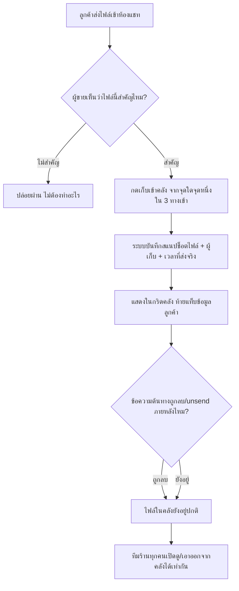

<!-- Feature 00048 - Customer File Library -->

---
title: "PRD — คลังไฟล์ต่อลูกค้า (Customer File Library)"
owner: shinobu22
status: draft
created: 2026-08-13
tags: [prd, feature, 00048, chat, inbox, file-library]
related: ["[[BRD]]", "[[Feature-Docs-Ownership]]", "[[00018 - Facebook Chat Integration]]", "[[00037 - Unified Multishop Inbox]]"]
---

> **โมดูล:** 00048-CustomerFileLibrary
> **ประเภทเอกสาร:** Product Requirements Document (PRD)
> **เวอร์ชัน:** 1.0
> **วันที่จัดทำ:** 2026-08-13
> **สถานะ:** Draft — รอ Controller review
> **เจ้าของเอกสาร:** BA + PO + PM

# PRD: คลังไฟล์ต่อลูกค้า (Customer File Library)

---

## Executive Summary

กล่องแชทรวมหลายช่องทางฝั่งผู้ขาย (`/inbox`) รวมข้อความจาก Messenger, Instagram, LINE และ DEEP ไว้ในเธรดเดียว แต่เธรดที่คุยกันยาว — โดยเฉพาะร้านที่ใช้แชทเป็นช่องทางขายหลัก — ทำให้ไฟล์สำคัญที่ลูกค้าส่งมา (สลิปโอนเงิน, รูปแบบงาน/รูปอ้างอิงที่ลูกค้าต้องการ, เอกสารประกอบ) จมหายในประวัติข้อความ หาย้อนกลับไม่เจอเมื่อเกิดข้อพิพาทหรือเมื่อทีมงานอีกคนต้องมาสานงานต่อ

ฟีเจอร์นี้เพิ่ม **คลังไฟล์ต่อลูกค้า** — พื้นที่ที่ผู้ขายคัดไฟล์สำคัญออกจากกระแสข้อความ **ทีละใบด้วยมือ** (ไม่ใช่การไล่รวมไฟล์ทั้งเธรดให้อัตโนมัติ) แสดงเป็นกริดท้ายแท็บ "ข้อมูลลูกค้า" ในแผงขวาของห้องแชท เข้าถึงได้จาก 3 จุดที่ผู้ขายอยู่ระหว่างดูข้อความอยู่แล้ว (กดค้างบนมือถือ, hover บนเดสก์ท็อป, ปุ่มในหน้าดูรูปเต็มจอ) คลังนี้เป็นของทีมร้านร่วมกัน ทุกคนที่เข้าห้องแชทนี้ได้เห็นและจัดการเท่ากัน และไฟล์ที่เก็บไว้แล้วจะอยู่ต่อแม้ข้อความต้นทางถูกลูกค้า unsend หรือถูกลบไปในภายหลัง — เพราะนั่นคือเหตุผลทั้งหมดที่ฟีเจอร์นี้มีอยู่

ผลลัพธ์ทางธุรกิจที่คาดหวัง: ผู้ขายหาไฟล์หลักฐาน/ไฟล์อ้างอิงย้อนหลังได้ในไม่กี่คลิกแทนการเลื่อนเธรดยาวเป็นร้อยข้อความ และทีมงานหลายคนไม่ต้องพึ่งความจำของคนที่คุยกับลูกค้าคนนั้นเป็นคนแรก

---

## 1. Business Goals & KPIs

### 1.1 เป้าหมายทางธุรกิจ

| เป้าหมาย | รายละเอียด |
|----------|-----------|
| **ลดเวลาค้นหาไฟล์สำคัญย้อนหลัง** | ผู้ขายไม่ต้องเลื่อนเธรดที่มีข้อความหลักร้อยเพื่อหาสลิปโอนเงินหรือรูปงานที่ลูกค้าเคยส่งมา |
| **กันหลักฐานสำคัญหายไปพร้อมข้อความต้นทาง** | สลิป/รูปที่เป็นหลักฐานข้อพิพาท ต้องยังเรียกดูได้แม้ลูกค้า unsend ข้อความหรือมีการล้างประวัติในอนาคต |
| **ทำให้ทีมงานหลายคนทำงานต่อกันได้โดยไม่ต้องไล่ถามคนเดิม** | ร้านที่มีพนักงานมากกว่า 1 คนดูแลแชทร่วมกัน ต้องเห็นไฟล์สำคัญของลูกค้าคนเดียวกันชุดเดียวกัน ไม่ผูกกับคนที่คุยครั้งแรก |
| **ไม่เพิ่มภาระงานถ้าไม่จำเป็น** | ต้องไม่ใช่ระบบที่บังคับให้ผู้ขายจัดการไฟล์ที่ไม่สำคัญ — คัดเฉพาะที่ต้องการเท่านั้น (ตรงข้ามกับการแสดงไฟล์ทั้งหมดในเธรดอัตโนมัติซึ่งจะกลายเป็นขยะภาพที่ต้องมานั่งกรองเอง) |

### 1.2 ตัวชี้วัดความสำเร็จ (KPIs)

| KPI | คำอธิบาย | เป้าหมาย |
|-----|----------|---------|
| **อัตราการนำไปใช้ (Adoption)** | % ของร้านที่มีเธรดแชทใช้งานอยู่ (มีข้อความใน 30 วันล่าสุด) ที่เก็บไฟล์เข้าคลังอย่างน้อย 1 ครั้ง | ≥ 25% ภายใน 30 วันหลังปล่อยใช้งาน |
| **ปริมาณการใช้งานต่อเนื่อง** | จำนวนไฟล์ที่ถูกเก็บเข้าคลังเฉลี่ยต่อร้าน (ที่เคยใช้ฟีเจอร์นี้) ต่อสัปดาห์ | มีแนวโน้มเพิ่มขึ้นต่อเนื่องใน 4 สัปดาห์แรก (ไม่ใช่ใช้ครั้งเดียวแล้วหยุด) |
| **อัตราการเรียกดูซ้ำจากคลัง** | จำนวนครั้งที่เปิดไฟล์จาก section คลัง/โมดัล "ดูไฟล์ทั้งหมด" ต่อสัปดาห์ | มากกว่า 0 อย่างสม่ำเสมอ — ยืนยันว่าคลังถูก "ใช้ค้นคืน" จริง ไม่ใช่แค่เก็บทิ้งไว้เฉย ๆ |
| **อัตราการเอาออกจากคลัง (unsave)** | จำนวนครั้งที่กด "เอาออกจากคลัง" ÷ จำนวนครั้งที่กด "เก็บเข้าคลัง" | ต่ำ (< 15%) — ตัวเลขสูงแปลว่าผู้ขายกดพลาด/เก็บของที่ไม่ต้องการบ่อย ต้องกลับมาทบทวน UX |

> **หมายเหตุเรื่องการวัด:** ทุก KPI คำนวณได้จากตารางคลังไฟล์ใหม่ (จำนวนแถวที่ถูกสร้าง/ลบ ต่อร้าน ต่อสัปดาห์) ไม่ต้องต่อเครื่องมือวิเคราะห์ภายนอก

---

## 2. User Personas (กลุ่มผู้ใช้งาน)

### 2.1 เจ้าของร้าน/แอดมินที่คุยแชทเอง (Primary)

**ข้อมูลพื้นฐาน:**
- เจ้าของร้านเล็ก–กลางที่ดูแลแชทเอง หรือมีแอดมิน 1–2 คน
- คุยกับลูกค้าผ่านหลายช่องทาง (Messenger/IG/LINE/DEEP) ในกล่องแชทเดียว
- ทำงานจากมือถือเป็นหลักระหว่างวัน เปิดคอมพิวเตอร์ช่วงจัดการหลังบ้าน

**เป้าหมาย:**
- หาสลิปโอนเงินของลูกค้าคนหนึ่งได้เร็วเมื่อเกิดข้อโต้แย้งเรื่องการชำระเงิน
- หารูปแบบงาน/รูปอ้างอิงที่ลูกค้าส่งมาตอนต้นเธรด ได้โดยไม่ต้องเลื่อนย้อนขึ้นไปเป็นร้อยข้อความ

**ความต้องการ:**
- คัดไฟล์สำคัญออกจากกระแสข้อความได้ทันทีตอนเห็นมัน ไม่ต้องจำไว้แล้วมาหาทีหลัง
- ไฟล์ที่เก็บไว้ต้องยังอยู่แม้ลูกค้าลบ/แก้ข้อความเดิม

**จุดปวด (Pain Points):**
- เธรดยาวเป็นร้อยข้อความ เลื่อนหาสลิปเก่าเป็นเรื่องที่ทำบ่อยและเสียเวลาทุกครั้ง
- เคยเจอเคสที่ลูกค้า unsend ข้อความสลิปหลังจากมีปัญหา — ไม่มีที่เก็บสำรองไว้เลย

### 2.2 พนักงาน/ทีมร้านที่ดูแลแชทร่วมกัน (Secondary)

**ข้อมูลพื้นฐาน:**
- สมาชิกร้าน (`ShopMember`) ที่ได้รับเชิญให้ช่วยดูแลกล่องแชท ไม่ใช่เจ้าของ
- ผลัดกันรับผิดชอบเธรดตามกะ ไม่ได้เป็นคนที่คุยกับลูกค้าคนนั้นตั้งแต่แรกเสมอไป

**เป้าหมาย:**
- รับช่วงต่อจากเพื่อนร่วมงานได้ทันทีโดยไม่ต้องเลื่อนอ่านเธรดทั้งหมดใหม่

**ความต้องการ:**
- เห็นไฟล์สำคัญของลูกค้าคนนี้ที่เพื่อนร่วมงานคนอื่นเคยคัดไว้แล้ว
- รู้ว่าไฟล์นี้ใครเป็นคนเก็บไว้ (บริบทว่าใครเคยดูแลเคสนี้)

**จุดปวด (Pain Points):**
- คุยแชทแทนกันบ่อย แต่ข้อมูลสำคัญติดอยู่กับความจำของคนที่คุยครั้งแรกเท่านั้น

### 2.3 ลูกค้า/ผู้ติดต่อ (ผู้ได้รับผลทางอ้อม — ไม่ใช่ผู้ใช้ฟีเจอร์นี้โดยตรง)

**ข้อมูลพื้นฐาน:**
- คนที่ทักแชทเข้ามาผ่าน Messenger/Instagram/LINE หรือแอปผู้ซื้อ DEEP
- ไม่มีสิทธิ์เข้าถึงหรือรับรู้ว่ามีคลังไฟล์อยู่เลย (ตามมติ D-6)

**เป้าหมาย:**
- ได้รับการตอบสนองที่รวดเร็วและถูกต้อง โดยเฉพาะเมื่อกลับมาคุยเรื่องเดิมภายหลัง (เช่น อ้างสลิปที่เคยส่งไปแล้ว)

**ความต้องการ:**
- ไม่ต้องส่งไฟล์ซ้ำ/อธิบายซ้ำเมื่อผู้ขายอีกคนมารับช่วงคุยต่อ

**จุดปวด (Pain Points):**
- เคยเจอกรณีที่ต้องส่งสลิปซ้ำเพราะร้านหาของเดิมไม่เจอ

---

## 3. Business Requirements

### 3.1 การคัดไฟล์เข้าคลังด้วยมือ

**ความต้องการ:**
- ผู้ขายต้องคัดไฟล์เข้าคลังเองทีละใบ จากจุดที่กำลังดูข้อความอยู่แล้ว — ไม่ใช่ระบบไล่รวมไฟล์ทั้งเธรดให้อัตโนมัติ
- ต้องคัดได้จากอย่างน้อย 3 จุดที่ผู้ขายอยู่ระหว่างอ่าน/ดูไฟล์อยู่แล้ว โดยไม่ต้องสลับไปหน้าอื่น

**Business Rules:**
- action "เก็บเข้าคลัง" ใช้ได้กับไฟล์รูป/วิดีโอ/เอกสารเท่านั้น (ไม่รวมไฟล์เสียง, สติกเกอร์, รูปในการ์ด carousel ของ Facebook)
- กดซ้ำที่ไฟล์เดิม = สลับสถานะ (เก็บ ↔ เอาออก) ไม่ใช่การเก็บซ้ำ

**เหตุผล:**
- ผู้ขายปฏิเสธโมเดล "แสดงทุกไฟล์ในเธรดอัตโนมัติ" อย่างชัดเจน เพราะเธรดที่คุยกันนานมีไฟล์ปนกันมาก (สติกเกอร์, รูปตัวอย่างที่ไม่เกี่ยว) การให้ระบบเลือกเองจะทำให้คลังกลายเป็นที่เก็บขยะที่ต้องมานั่งกรองอีกที ตรงข้ามกับเป้าหมายที่ต้องการ "หาไฟล์สำคัญได้เร็ว"

### 3.2 ขอบเขตของสิ่งที่เก็บได้

**ความต้องการ:**
- ระบบต้องรองรับการเก็บไฟล์ทั้งที่ลูกค้าส่งเข้ามาและที่ร้านส่งออกไป (เอกสารที่ร้านส่งให้ลูกค้าก็อาจสำคัญพอ ๆ กัน เช่น ใบเสนอราคา)
- ระบบต้องเก็บเป็น "การอ้างอิงไปยังไฟล์เดิม" ไม่คัดลอกไฟล์ซ้ำ — ไฟล์ขาเข้าจากช่องทางนอก (Messenger/IG) ถูก mirror เข้าระบบจัดเก็บของเราแล้วตั้งแต่ตอนรับข้อความ

**Business Rules:**
- ชนิดไฟล์ที่เก็บได้: รูปภาพ, วิดีโอ, ไฟล์เอกสาร
- ไม่รองรับ: ไฟล์เสียง, สติกเกอร์ (แม้จะถูกเก็บเป็นชนิดรูปในระบบก็ตาม), รูปในการ์ดสินค้า/โพสต์แบบ carousel จาก Facebook

**เหตุผล:**
- ไฟล์เสียง/สติกเกอร์ไม่ใช่หลักฐานหรือข้อมูลอ้างอิงในความหมายที่ฟีเจอร์นี้ต้องการแก้ปัญหา (สลิป/รูปงาน/เอกสาร) การเปิดขอบเขตกว้างเกินจะทำให้คลังสับสนและเพิ่มความซับซ้อนของ UI โดยไม่มีประโยชน์ทางธุรกิจชัดเจน

### 3.3 การแสดงผลและการค้นคืน

**ความต้องการ:**
- ไฟล์ที่เก็บไว้ต้องมองเห็นได้จากแผงข้อมูลลูกค้าที่ผู้ขายเปิดดูอยู่แล้วระหว่างคุยแชท ไม่ใช่หน้าจอแยกที่ต้องออกจากห้องแชทไปหา
- ต้องดูไฟล์เต็มได้ทันทีที่กด ไม่ใช่แค่เห็นภาพย่อ
- คลังที่ยังไม่มีไฟล์ต้องแสดงตัวเองพร้อมคำแนะนำวิธีใช้ ไม่ใช่ซ่อนหายไปเมื่อว่าง

**Business Rules:**
- แสดงผลเป็นกริดในแท็บ "ข้อมูลลูกค้า" ตำแหน่งท้ายสุด แสดงไฟล์ล่าสุด 9 ใบ เรียงตามเวลาที่ไฟล์ถูกส่งจริง (ใหม่→เก่า)
- มีไฟล์เกิน 9 ใบ → มีลิงก์ "ดูไฟล์ทั้งหมด (จำนวนจริง)" เปิดโมดัลกริดเต็มในหน้าเดิม

**เหตุผล:**
- ผู้ขายต้องเห็นคลังในบริบทที่กำลังคุยกับลูกค้าคนนั้นอยู่แล้ว — การแยกเป็นหน้าต่างหากจะทำให้เสีย scroll position และ state ของห้องแชทที่เปิดค้างอยู่ (บทเรียนที่โปรเจกต์เจอซ้ำหลายครั้งกับ modal/หน้าแยกในบริบทแชท)

### 3.4 ความเป็นเจ้าของและสิทธิ์ระดับทีม

**ความต้องการ:**
- คลังไฟล์ต้องเป็นทรัพยากรร่วมของทีมร้าน ไม่ใช่ของส่วนตัวของคนที่คุยกับลูกค้าคนนั้นเป็นคนแรก
- ต้องบอกได้ว่าใครเป็นคนเก็บไฟล์แต่ละใบไว้ เพื่อเป็นบริบทให้คนที่มารับช่วงต่อ

**Business Rules:**
- ทุกคนที่เข้าถึงห้องแชทนี้ได้ (เจ้าของร้าน + สมาชิกทีมที่มีสิทธิ์) เห็นคลังและเอาไฟล์ออกจากคลังได้เท่ากันทั้งหมด ไม่แบ่งสิทธิ์ตามผู้เก็บ
- ลูกค้า/ผู้ติดต่อไม่มีทางเห็นคลังนี้ในทุกกรณี — ไม่มีหน้าจอฝั่งลูกค้าที่แสดงคลังนี้เลย

**เหตุผล:**
- สอดคล้องกับสิทธิ์การเข้าถึงห้องแชทที่ระบบมีอยู่แล้ว (เจ้าของร้าน + สมาชิกทีม `ShopMember` เข้าห้องแชทได้เท่ากันอยู่แล้ว) — คลังไฟล์เป็นส่วนขยายของห้องแชทเดียวกัน ไม่ควรมีกฎสิทธิ์แยกต่างหากที่ผู้ใช้ต้องเรียนรู้ใหม่

### 3.5 ความคงทนของข้อมูล

**ความต้องการ:**
- ไฟล์ที่ถูกเก็บเข้าคลังแล้วต้องยังเรียกดูได้ แม้ข้อความต้นทางในเธรดจะถูกลูกค้า unsend หรือถูกลบไปในภายหลัง
- ถ้าไฟล์จริงในระบบจัดเก็บหายไป (เช่น ถูกลบโดยกระบวนการอื่นนอกฟีเจอร์นี้) ต้องแจ้งสถานะที่อ่านเข้าใจได้ ไม่ใช่ปล่อยเป็นช่องว่างที่ดูเหมือนระบบพัง

**Business Rules:**
- แถวในคลังไม่ถูกลบทิ้งเองโดยระบบไม่ว่ากรณีใด ยกเว้นผู้ใช้กดเอาออกเอง หรือเจ้าของคลัง (ผู้ติดต่อ/เธรด) ถูกลบทั้งบัญชี
- ไฟล์ที่เปิดไม่ได้ (หายจากระบบจัดเก็บ) แสดงสถานะ "ไฟล์ถูกลบแล้ว" แทนที่ช่องว่าง/รูปพัง

**เหตุผล:**
- นี่คือเหตุผลทั้งหมดที่ฟีเจอร์นี้มีอยู่ — ถ้าไฟล์ในคลังหายไปพร้อมกับข้อความต้นทาง คลังจะไม่ต่างอะไรจากการเลื่อนหาในเธรดเอง

---

## 4. Business Rules & Constraints

### 4.1 กฎทางธุรกิจหลัก

| กฎ | คำอธิบาย |
|----|----------|
| **คัดด้วยมือเท่านั้น** | ไม่มีการเพิ่มไฟล์เข้าคลังโดยอัตโนมัติไม่ว่ากรณีใด ทุกแถวเกิดจากผู้ใช้กด "เก็บเข้าคลัง" เอง |
| **ขอบเขตชนิดไฟล์คงที่** | รูป/วิดีโอ/เอกสารเท่านั้น — เสียง/สติกเกอร์/รูปการ์ด carousel ไม่มีทางเข้าคลังได้เลย ไม่ว่าจากทางไหน |
| **เจ้าของคลังผูกกับผู้ติดต่อ ไม่ใช่เธรดเดี่ยว ๆ** | เมื่อเธรดมีผู้ติดต่อภายนอกผูกอยู่ (Messenger/IG/LINE) คลังผูกกับผู้ติดต่อนั้น เพื่อรองรับการรวมโปรไฟล์ข้ามช่องทางในอนาคต; เธรด DEEP (ไม่มีผู้ติดต่อภายนอก) คลังผูกกับเธรดโดยตรง |
| **สิทธิ์เท่ากันทั้งทีม** | เจ้าของร้านและสมาชิกทีมทุกคนที่เข้าห้องแชทได้ มีสิทธิ์เห็น/เพิ่ม/เอาไฟล์ออกจากคลังเท่ากัน ไม่มีลำดับชั้นสิทธิ์แยกสำหรับคลัง |
| **แถวคลังไม่ตายตามข้อความต้นทาง** | ข้อความถูกลบ/unsend ไม่กระทบแถวในคลัง — ยกเว้นเจ้าของคลัง (ผู้ติดต่อ/เธรด) เองถูกลบทั้งบัญชี |
| **ไม่มีหน้าจอฝั่งลูกค้า** | คลังนี้เป็นเครื่องมือภายในของร้านล้วน ๆ ไม่มี route/หน้าจอสาธารณะที่แสดงเนื้อหานี้ |

### 4.2 ข้อจำกัดทางธุรกิจ

| ข้อจำกัด | รายละเอียด |
|---------|-----------|
| **ไม่มีตัวกรองตามชนิดไฟล์ในรอบแรก** | โมดัล "ดูไฟล์ทั้งหมด" แสดงทุกชนิดไฟล์ปนกัน ยังไม่มีปุ่มกรองเฉพาะรูป/วิดีโอ/เอกสาร |
| **ไม่มีการค้นหาด้วยคำ/เนื้อหาไฟล์** | ค้นหาไฟล์ในคลังได้จากการเลื่อนดูเท่านั้น ไม่มี OCR/ค้นหาข้อความในไฟล์ |
| **ไม่จำกัดจำนวนไฟล์ที่เก็บได้ต่อลูกค้า** | แต่ไม่มีการเก็บแบบเลือกหลายไฟล์พร้อมกัน (bulk-select) ในรอบแรก — เก็บได้ทีละใบ |
| **ไม่มีการย้ายไฟล์ข้ามลูกค้า/เธรด** | ไฟล์ที่เก็บเข้าคลังของลูกค้า A จะไม่ปรากฏในคลังของลูกค้า B ไม่ว่ากรณีใด |
| **ไม่ทำงานแบบเรียลไทม์ในรอบแรก** | หน้าจอไม่อัปเดตอัตโนมัติเมื่อพนักงานอีกคนเก็บ/เอาไฟล์ออกพร้อมกัน — เห็นผลเมื่อเปิดแผง/สลับแท็บ/ปิดโมดัลใหม่เท่านั้น |

### 4.3 ช่องโหว่ที่รับทราบและยอมรับแล้ว (Known Gap)

ระบบระบุ "ไฟล์เดียวกัน" ด้วยรหัสอ้างอิงไฟล์ (fileId) ไม่ใช่ด้วยเนื้อหาไฟล์ ดังนั้น:

- ถ้าลูกค้าส่งสลิปใบเดิมซ้ำ 2 ครั้ง (คนละข้อความ) ทั้งสองข้อความจะได้ fileId คนละตัวกัน แม้เนื้อหาไฟล์จะเหมือนกันทุกประการ
- ระบบกันการ "กดเก็บข้อความเดิมซ้ำ" ได้ (กดปุ่มเดิมสองครั้ง = toggle) แต่ **กันไม่ได้** ที่ผู้ใช้จะเก็บ "รูปเดียวกันสองใบที่ต่างข้อความกัน" เข้าคลัง — ผลคือคลังอาจมีรูปซ้ำหน้าตาเดียวกัน 2 ช่องได้ ถ้าลูกค้าส่งไฟล์เดิมมาซ้ำแล้วผู้ขายกดเก็บทั้งสองใบ
- **ผู้ใช้รับทราบและยอมรับความเสี่ยงนี้แล้ว** — ไม่อยู่ในขอบเขตที่ต้องแก้ในรอบนี้ (การตรวจ hash เนื้อหาไฟล์เพื่อ dedup ข้ามข้อความเป็นงานคนละระดับความซับซ้อน)

---

## 5. Out of Scope (นอกขอบเขต)

สิ่งที่ระบบนี้ **ไม่รองรับ** หรือ **ไม่รับผิดชอบ**:

| หัวข้อ | คำอธิบาย |
|--------|----------|
| **การรวมไฟล์ทั้งเธรดอัตโนมัติ** | ไม่มีโหมดที่ระบบเลือกไฟล์เข้าคลังเอง — ปฏิเสธโดยตรงจากมติ D-1 |
| **ไฟล์เสียง / สติกเกอร์ / รูปการ์ด carousel** | ไม่มีทางเข้าคลังได้เลยไม่ว่าจากทางไหน (มติ D-4) |
| **การแก้ไข/แก้ไฟล์ต้นฉบับ** | คลังเป็นการอ้างอิง ไม่ใช่ระบบแก้ไขรูป/ครอป/ย่อ |
| **ตัวกรองชนิดไฟล์ในโมดัล "ดูไฟล์ทั้งหมด"** | รอบแรกยังไม่มี (มติ D-16) — Phase 2 |
| **การเก็บเข้าคลังแบบเลือกหลายไฟล์พร้อมกัน (bulk save)** | รอบแรกเก็บได้ทีละใบต่อการกดหนึ่งครั้ง |
| **การอัปเดตแบบเรียลไทม์ (Realtime sync)** | เห็นการเปลี่ยนแปลงเมื่อ refetch ตามจังหวะที่กำหนดเท่านั้น (มติ D-19) — Phase 2 |
| **ทางลัดใหม่บนแถบเครื่องมือมือถือ** | ไม่เพิ่มปุ่ม/ไอคอนใหม่บนแถบเครื่องมือแชทมือถือ — เข้าถึงผ่าน 3 จุดที่ล็อกไว้เท่านั้น (มติ D-20) |
| **การตรวจจับไฟล์เนื้อหาซ้ำ (content-based dedup)** | ดูหัวข้อ Known Gap §4.3 — ยอมรับความเสี่ยงนี้แล้ว |
| **การแชร์ลิงก์คลังให้บุคคลภายนอกร้าน** | ไม่มี URL สาธารณะของคลังหรือไฟล์ในคลัง — ต้องผ่านสิทธิ์สมาชิกร้านเสมอ |
| **รองรับหลายภาษา (i18n)** | ข้อความ/คำในฟีเจอร์นี้เป็นภาษาไทยล้วน ไม่ผูกกับระบบสลับภาษา EN/TH ของฟีเจอร์ 00047 |

---

## 6. Risks & Mitigation (ความเสี่ยงและแนวทางแก้ไข)

### 6.1 ความเสี่ยงทางธุรกิจ

| ความเสี่ยง | ผลกระทบ | ระดับความรุนแรง | แนวทางแก้ไข |
|-----------|---------|-----------------|-------------|
| **ผู้ขายไม่รู้ว่าฟีเจอร์นี้มีอยู่** | คลังว่างเปล่าตลอดไป ไม่มีใครใช้ | กลาง | Empty state ต้องอธิบายวิธีใช้ตรง ๆ ในหน้าจอ (มติ D-14) ไม่ใช่แค่ซ่อน section |
| **ไฟล์เนื้อหาซ้ำสร้างความสับสน** | ผู้ขายเห็นรูปเดียวกัน 2 ช่องในคลัง คิดว่าระบบมีบั๊ก | ต่ำ | ยอมรับแล้วตาม §4.3 — ถ้าเกิดบ่อยจริงในทางปฏิบัติ ค่อยพิจารณาแก้ในเฟสถัดไป |
| **พนักงานเข้าใจผิดว่าคลังเป็นของส่วนตัว** | เก็บไฟล์ไว้แล้วไม่บอกทีม คาดหวังว่าคนอื่นไม่เห็น | ต่ำ | ป้าย "เก็บโดย X" ต้องแสดงชัดเจนทุกไฟล์ ให้เห็นตั้งแต่แรกว่าเป็นของกลาง |

### 6.2 ความเสี่ยงทางเทคนิค

| ความเสี่ยง | ผลกระทบ | แนวทางแก้ไข |
|-----------|---------|-------------|
| **กดเก็บไฟล์เดิมพร้อมกัน 2 คน (race condition)** | อาจเกิด error หรือแถวซ้ำในฐานข้อมูล | บังคับด้วยข้อจำกัดระดับฐานข้อมูล (unique ต่อคู่เจ้าของคลัง+ไฟล์) พร้อมดักข้อผิดพลาดจากการชนกัน ไม่ใช่แค่ตรวจก่อนเขียนฝั่งเดียว |
| **ไฟล์ในระบบจัดเก็บหายไปโดยกระบวนการอื่น** | ผู้ใช้กดดูแล้วเจอหน้าว่าง/error ดิบ | ต้องแยกแยะ "ไฟล์หาย" ออกจาก "โหลดไม่สำเร็จชั่วคราว" แล้วแสดงสถานะที่อ่านเข้าใจได้ (มติ D-7) |
| **ตัวเล่นไฟล์วิดีโอเต็มจอที่ใช้อยู่ในเธรดปัจจุบันยังไม่รองรับ slide ชนิดวิดีโอ** | ปุ่ม "ดูไฟล์" ของวิดีโอในคลังอาจใช้ไม่ได้ถ้าไม่ต่อสายเพิ่ม | ต้องเปิดสเปกวิดีโอเป็นข้อกำหนดชัดเจนใน SDS ไม่ใช่ปล่อยให้ implement ทึกทักว่ามีอยู่แล้วครบ |

---

## 7. Glossary (อภิธานศัพท์)

| คำศัพท์ | ความหมาย |
|---------|----------|
| **คลังไฟล์ (Customer File Library)** | พื้นที่เก็บไฟล์สำคัญที่ผู้ขายคัดออกมาจากเธรดแชทของลูกค้า/ผู้ติดต่อรายหนึ่ง แสดงในแท็บ "ข้อมูลลูกค้า" |
| **เก็บเข้าคลัง** | ชื่อ action ที่ใช้เรียกการคัดไฟล์เข้าคลัง (ห้ามใช้คำว่า "บันทึก" ซึ่งใช้กับการดาวน์โหลดไฟล์ลงเครื่องอยู่แล้ว) |
| **เจ้าของคลัง (Owner)** | ผู้ติดต่อภายนอก (ExternalContact) เมื่อเธรดผูกกับช่องทางนอก หรือเธรดเอง (Conversation) เมื่อเป็นแชท DEEP ที่ไม่มีผู้ติดต่อภายนอก |
| **ผู้ติดต่อภายนอก (External Contact)** | ตัวตนของลูกค้าที่ทักเข้ามาผ่าน Messenger/Instagram/LINE — ผูกกับ 1 เพจ ไม่ข้ามช่องทาง (ในรอบนี้) |
| **ทีมร้าน (Shop Team)** | เจ้าของร้าน + สมาชิกที่ได้รับเชิญ (ShopMember) ที่มีสิทธิ์เข้าห้องแชทของร้านนั้น |
| **สแนปช็อตข้อมูลไฟล์** | ข้อมูลของไฟล์ ณ เวลาที่ถูกเก็บเข้าคลัง (ชื่อไฟล์ ขนาด ผู้ส่ง เวลาที่ส่งจริง) ที่บันทึกแยกจากข้อความต้นทาง เพื่อให้ยังอ่านได้แม้ข้อความต้นทางถูกลบ |
| **ดูในแชท** | ปุ่มที่กระโดดกลับไปยังข้อความต้นทางของไฟล์ในเธรด — หายไปเมื่อกระโดดไม่ได้จริง (ข้อความถูกลบ/unsend หรืออยู่นอกช่วงที่โหลดไว้) |

---

## 8. Success Metrics (ตัวชี้วัดความสำเร็จ)

เมื่อระบบทำงานได้ดี ควรมีผลลัพธ์ดังนี้:

| ตัวชี้วัด | ค่าที่คาดหวัง | วิธีวัด |
|----------|---------------|--------|
| **หาสลิป/ไฟล์อ้างอิงเก่าได้โดยไม่เลื่อนเธรด** | ผู้ขายเปิดแท็บ "ข้อมูลลูกค้า" แล้วเห็นไฟล์ที่ต้องการทันทีโดยไม่ต้องกลับไปเลื่อนหาข้อความ | สังเกตจากอัตราการเปิดไฟล์จาก section คลัง เทียบกับพฤติกรรมเดิมที่ต้องเลื่อนเธรด |
| **ไฟล์ที่เก็บไว้รอดจากการลบข้อความต้นทาง** | กด "เก็บเข้าคลัง" แล้วลูกค้า unsend ข้อความเดิม → ไฟล์ในคลังยังเปิดดูได้ปกติ | ทดสอบ end-to-end: unsend ข้อความที่มาจากไฟล์ที่เก็บไว้แล้ว แล้วเปิดคลังซ้ำ |
| **ทีมงานเห็นคลังชุดเดียวกัน** | สมาชิกร้าน 2 คนเปิดห้องแชทเดียวกัน เห็นรายการไฟล์ในคลังเหมือนกันทุกประการ | ทดสอบด้วยบัญชี 2 คนในร้านเดียวกัน |

---

## 9. Dependencies & Assumptions

### 9.1 สิ่งที่ต้องพึ่งพา (Dependencies)

| ระบบ/ส่วนประกอบ | ความสัมพันธ์ |
|-----------------|-------------|
| **กล่องแชทรวมหลายช่องทาง (Unified Inbox, feature 00018/00037)** | คลังไฟล์เป็นส่วนขยายของแผงข้อมูลลูกค้าที่มีอยู่แล้ว — ต้องเข้าถึงเธรด/ข้อความ/สิทธิ์ทีมร้านของระบบเดิม |
| **ระบบจัดเก็บไฟล์แนบในแชท** | คลังอ้างอิงไฟล์ที่ถูก mirror เข้าระบบจัดเก็บของเราแล้วตั้งแต่ตอนรับข้อความ (ไม่พึ่ง URL ต้นทางจาก Meta ที่หมดอายุได้) |
| **หน้าจอดูรูป/ไฟล์เต็มจอที่ใช้อยู่ในเธรดปัจจุบัน** | จุดเก็บเข้าคลังที่ 3 (ปุ่มในหน้าดูเต็มจอ) ต่อยอดจากคอมโพเนนต์เดิม — ต้องขยายให้รองรับไฟล์วิดีโอด้วย (ปัจจุบันรองรับเฉพาะรูป) |
| **สิทธิ์การเข้าถึงร้าน (canAccessShop)** | คลังไฟล์ใช้กฎสิทธิ์เดียวกับที่ห้องแชทใช้อยู่แล้ว ไม่สร้างระบบสิทธิ์ใหม่ |

### 9.2 สมมติฐาน (Assumptions)

- **aria-label ของช่องไฟล์ในกริด** — มติ D-12 ล็อกถ้อยคำตัวอย่างไว้ที่ "รูปจาก {ชื่อ} · {วันที่}" ซึ่งครอบเฉพาะไฟล์ชนิดรูป เอกสารนี้ตีความขยายรูปแบบเป็น "{ประเภทไฟล์}จาก {ชื่อ} · {วันที่}" (รูปจาก/วิดีโอจาก/ไฟล์จาก) ให้ label ตรงชนิดไฟล์จริงเสมอ — เป็นการขยายให้ครอบคลุมชนิดไฟล์อื่นตามเจตนาของมติ ไม่ใช่การเปลี่ยนมติ **(Controller ยืนยันแล้ว 2026-08-13)**
- **การเอาไฟล์ออกจากคลัง = ลบแถวอ้างอิงจริง ไม่ใช่ soft-delete** — เนื่องจากแถวคลังเป็นเพียงดัชนีอ้างอิง (ไม่ใช่ต้นฉบับข้อมูล ต้นฉบับยังอยู่ที่ข้อความ/ไฟล์เดิมเสมอ) การลบแถวจริงจึงไม่มีความเสี่ยงข้อมูลสูญหาย และทำให้กดเก็บไฟล์เดิมกลับเข้าคลังซ้ำได้ในอนาคตโดยไม่ชนกับ record เก่า **(Controller ยืนยันแล้ว 2026-08-13)**
- **ป้าย "เก็บโดย X" อ้างอิงบัญชีผู้ใช้แบบ live (ไม่ใช่ข้อความคงที่)** — ถ้าพนักงานคนนั้นออกจากทีมร้านภายหลัง ป้ายยังคงแสดงชื่อเดิมที่เคยบันทึกไว้เป็นบริบทประวัติ ไม่แสดงเป็น "ไม่ทราบ"
- **ผู้ขายเข้าใจว่าคลังเป็นดัชนีอ้างอิง ไม่ใช่การสำรองไฟล์แยกต่างหาก** — ถ้าไฟล์ต้นฉบับถูกลบระดับระบบจัดเก็บ (นอกเหนือการควบคุมของฟีเจอร์นี้) ไฟล์ในคลังจะเปิดไม่ได้เช่นกัน (แสดงสถานะ "ไฟล์ถูกลบแล้ว")

---

## 10. Appendix

### 10.1 ตัวอย่าง User Journey

**Scenario: เก็บสลิปโอนเงินระหว่างคุยแชทกับลูกค้า**

1. ลูกค้าส่งรูปสลิปโอนเงินเข้ามาในห้องแชท
2. ผู้ขาย (บนมือถือ) กดค้างที่รูปสลิป → เมนูลอยขึ้นมาพร้อมตัวเลือก "เก็บเข้าคลัง"
3. ผู้ขายกดเลือก → ระบบแจ้งผลทันที "เก็บเข้าคลังแล้ว" มุมขวาบนจอ
4. อีก 2 สัปดาห์ต่อมา ลูกค้าอ้างว่าโอนเงินแล้วแต่ยังไม่ได้รับสินค้า และได้ unsend ข้อความสลิปเดิมออกจากเธรดไปแล้ว
5. ผู้ขายเปิดแท็บ "ข้อมูลลูกค้า" ของเธรดนี้ เลื่อนลงไปที่ section คลังไฟล์ท้ายแท็บ → เห็นสลิปที่เก็บไว้อยู่ครบ พร้อมวันที่ส่งจริง
6. ผู้ขายกดเปิดสลิปเต็มจอเพื่อตรวจสอบยอดเงินและเวลาโอน — ยืนยันข้อพิพาทได้ทันทีโดยไม่ต้องพึ่งความจำหรือแคปหน้าจอที่แยกเก็บไว้เอง

### 10.2 ตัวอย่างการทำงานร่วมกันของทีม

ร้านหนึ่งมีเจ้าของ 1 คนและพนักงาน 2 คนช่วยดูแลแชท ลูกค้ารายหนึ่งเคยคุยกับพนักงาน A และส่งรูปแบบงานที่ต้องการมา พนักงาน A เก็บรูปนั้นเข้าคลังไว้ อีก 3 วันต่อมาลูกค้าทักกลับมาแต่เป็นช่วงที่พนักงาน A ไม่อยู่ พนักงาน B รับช่วงต่อ เปิดแท็บข้อมูลลูกค้าแล้วเห็นรูปแบบงานที่พนักงาน A เก็บไว้ พร้อมป้าย "เก็บโดย A" ทำให้พนักงาน B เข้าใจบริบทงานได้ทันทีโดยไม่ต้องถามลูกค้าซ้ำหรือเลื่อนอ่านเธรดทั้งหมด

---

**หมายเหตุ:**
เอกสารนี้เป็นการบันทึกความต้องการทางธุรกิจ (Business Requirements) โดยไม่มีรายละเอียดทางเทคนิค
สำหรับ Functional Requirements / User Story / Acceptance Criteria ดู [[BRD]] ของโมดูลนี้
สำหรับ technical specification ดู [[SRS]] ของโมดูลนี้
