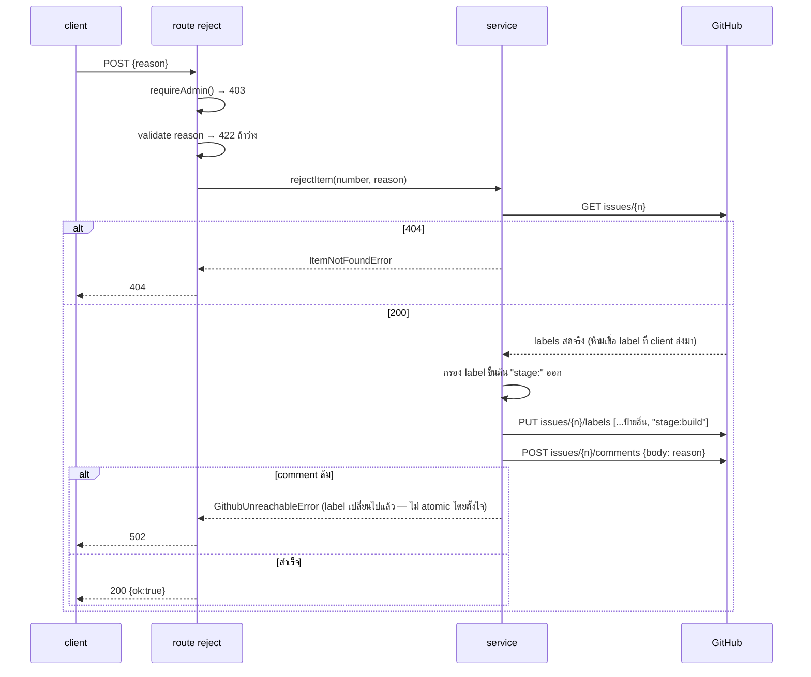

> **โมดูล:** 00049 - AI Command Center · **เวอร์ชัน:** 1.0 · **วันที่:** 2026-08-16
> **สถานะ:** Draft — **ยังไม่มี route ใดตามสัญญานี้ implement จริง (P4 ยังไม่เริ่ม)**

# API Contract: AI Command Center

---

## 1. ภาพรวม

API ชุดนี้เป็นตัวกลาง**เดียว**ระหว่าง Command Center UI (browser) กับ GitHub REST API
ผู้บริโภคมีรายเดียวคือ client island ของหน้า `command-center` — **ไม่ใช่ public API**

- **Base URL:** `https://admin.deepthailand.app/api/admin/command-center`
  (dev: `http://admin.deepth.local:4000/...`)
- **Content-Type:** `application/json`
- **รูปแบบ error:** `{ "error": "ข้อความไทย" }` — 🛑 ยึด convention จริงของ `/api/admin/*` ในโปรเจกต์นี้
  (แบบเรียบ) **ไม่ใช่** envelope `{error:{code,message,details}}` ของ template ทั่วไป

---

## 2. Authentication

| รายการ | ค่า |
|---|---|
| **วิธี** | NextAuth v4 session cookie (เดียวกับทุกหน้า `admin.*`) — ไม่ใช่ Bearer/API key |
| **Header** | ไม่มี header พิเศษ — cookie แนบเองจาก browser (same-origin) |
| **Gate** | ทุก route เรียก `requireAdmin()` **เอง** → คืน `session.user` เมื่อ `isAdmin === true` เท่านั้น 🛑 **ไม่พึ่ง `(dashboard)/layout.tsx`** เพราะ layout ครอบเฉพาะ RSC page ไม่ครอบ API route (SDS TD-005) |
| **CSRF** | inherit จาก `guardApi()` (`src/proxy.ts`) อัตโนมัติ — POST ต้องมี `Origin` ใน allowlist ไม่งั้น 403 ก่อนถึง route handler |
| **Rate limit** | inherit เช่นกัน: POST 30/นาที · GET 120/นาที — poll ของ UI (สูงสุด 4/นาที ต่อ endpoint) อยู่ใต้เพดานมาก |
| **ไม่ผ่าน** | `403 { "error": "ไม่มีสิทธิ์เข้าถึง" }` — **ไม่แยก** "ไม่ได้ล็อกอิน" กับ "ล็อกอินแล้วแต่ไม่ใช่ admin" (ยึด convention เดิมที่ไม่บอก attacker ว่าเกือบถูก) |

🛑 GitHub PAT อยู่ใน server env เท่านั้น **ไม่ปรากฏใน response ใด ๆ**

### Env vars ใหม่ (ต้องเพิ่มใน `.env.example` + Vercel)

```
# feature 00049 — จอที่ admin.deepthailand.app/command-center
# PAT ของ "จอ" — คนละตัวกับ PAT ของเครื่อง Hermes (D-1 แยกอำนาจ)
#   scope: Issues (RW) · Pull requests (RW) · Actions (R — check-run + repository variable)
#   🛑 ห้ามมีสิทธิ์ workflows
#   ⚠️ scope ที่แน่ชัดสำหรับอ่าน repository variable ยังไม่เคยทดสอบจริง (SRS §9 ข้อ 5)
COMMAND_CENTER_GITHUB_TOKEN=
COMMAND_CENTER_GITHUB_REPO="CodeCooLTH/deep-web"
```

---

## 3. Endpoint

| Method | Path | คำอธิบาย |
|---|---|---|
| `GET` | `/board` | อ่านสถานะบอร์ด 7 คอลัมน์ |
| `GET` | `/heartbeat` | ชีพจร Hermes (ค่าดิบ + สถานะ issue ใน response เดียว) |
| `POST` | `/tasks` | สร้างใบงานใหม่ |
| `POST` | `/items/{number}/approve` | เคาะป้าย `พร้อมขึ้น` |
| `POST` | `/items/{number}/reject` | ตีกลับ + comment เหตุผล |
| `POST` | `/items/{number}/stop` | หยุด (ถอดป้าย `stage:*`) |

---

## 4. รายละเอียด

### 4.1 `GET /board`

**Request:** ไม่มี query/body

**Response 200**

| ฟิลด์ | ชนิด | คำอธิบาย |
|---|---|---|
| `columns[]` | `Column[]` | 7 คอลัมน์เรียงตามสายพาน `plan,ux,build,review,qa,docs,ready` |
| `columns[].stage` | `string` | `"plan"\|"ux"\|"build"\|"review"\|"qa"\|"docs"\|"ready"` |
| `columns[].label` | `string` | ป้ายไทยสำหรับหัวคอลัมน์ |
| `columns[].agent` | `string \| null` | ชื่อ subagent — `null` สำหรับ `ready` |
| `columns[].count` | `number` | จำนวน item |
| `columns[].items[]` | `BoardItem[]` | รายการใบงาน |
| `generatedAt` | ISO 8601 | เวลาที่ server ประมวลผล |
| `degraded` | `boolean` | `true` เมื่อโควตาหมดและใช้ cache เก่า |
| `degradedSince` | ISO 8601 \| null | เวลาที่ cache ถูกอัปเดตจริงล่าสุด (ใช้แสดง "ข้อมูลเป็นของ {relative}") |

**`BoardItem`**

| ฟิลด์ | ชนิด | คำอธิบาย |
|---|---|---|
| `number` | `number` | เลข issue/PR |
| `kind` | `"issue" \| "pr"` | แยกจาก field `.pull_request` ของ GitHub |
| `title` | `string` | หัวข้อ |
| `url` | `string` | ลิงก์เปิด GitHub |
| `stage` | `string` | คอลัมน์ที่อยู่ |
| `stageEnteredAt` | ISO 8601 \| null | เวลาที่ label ปัจจุบันถูกติด — `null` ถ้า Timeline API หาไม่เจอ (ป้ายถูกติดมือก่อนระบบเริ่ม track) |
| `touchesMigration` | `boolean` | `true` เฉพาะ item ที่ `stage==="ready"` และแตะ `prisma/migrations/**` · item อื่น `false` เสมอ (ไม่คำนวณเพื่อประหยัดโควตา) |
| `awaitingApproval` | `boolean` | 🛑 `true` = **ยังไม่ถูกเคาะ** (มี `stage:ready` แต่**ไม่มี** `พร้อมขึ้น`) → UI แสดงปุ่ม "เคาะ" · `false` = เคาะแล้ว รอ `auto-merge.yml` → UI แสดงสถานะแทนปุ่ม · item นอกคอลัมน์ `ready` เป็น `false` เสมอ |

🛑 **คอลัมน์ `ready` ถือ 2 สถานะ** (`stage:ready` = รอกด · `พร้อมขึ้น` = กดแล้ว) — ดู [[SRS]] §1.4
ใบที่มีทั้งสองป้ายนับ **ครั้งเดียว** · `POST /approve` กับใบที่ `awaitingApproval:false` = idempotent
success ไม่ error (ป้ายที่ต้องการมีอยู่แล้ว)

**Error:** `403` ไม่ใช่ admin · `502` อ่าน GitHub ไม่ได้และไม่มี cache (บอร์ด block ทั้งหน้า) ·
`200 + degraded:true` โควตาหมดแต่มี cache (**ไม่ใช่ error HTTP**)

```json
{
  "columns": [
    { "stage": "plan", "label": "วางแผน", "agent": "safepay-planner", "count": 1,
      "items": [{ "number": 41, "kind": "issue", "title": "แก้บั๊กหน้าแรกโหลดช้า",
                  "url": "https://github.com/CodeCooLTH/deep-web/issues/41",
                  "stage": "plan", "stageEnteredAt": "2026-08-16T07:00:00Z",
                  "touchesMigration": false, "awaitingApproval": false }] },
    { "stage": "ready", "label": "รอเคาะ", "agent": null, "count": 1,
      "items": [{ "number": 35, "kind": "pr", "title": "แก้บั๊กหน้าแรกโหลดช้า",
                  "url": "https://github.com/CodeCooLTH/deep-web/pull/35",
                  "stage": "ready", "stageEnteredAt": "2026-08-16T08:00:00Z",
                  "touchesMigration": false, "awaitingApproval": true }] }
  ],
  "generatedAt": "2026-08-16T10:00:00Z",
  "degraded": false,
  "degradedSince": null
}
```

### 4.2 `GET /heartbeat`

คืน**ทั้งค่าดิบและสถานะ issue ใน response เดียว** (มติ Controller §9.5 ของ UX Spec —
หมายถึง client เห็น 1 endpoint ไม่ใช่ห้าม service ยิง GitHub 2 ครั้ง)

| ฟิลด์ | ชนิด | คำอธิบาย |
|---|---|---|
| `lastHeartbeatAt` | ISO 8601 \| null | จาก repo variable `HERMES_HEARTBEAT` — `null` ถ้าไม่เคยตั้งค่าเลย |
| `ageSeconds` | `number \| null` | คำนวณ**ฝั่ง server** (D-8: ไม่คำนวณอายุที่ frontend) |
| `watchdogIssue` | `{ open, url, number }` | สถานะ issue ป้าย `hermes:offline` |

**Error:** `403` · `502` (**ไม่ block ทั้งหน้า** — heartbeat เป็นข้อมูลรอง แสดง banner แดงที่แถบบนเท่านั้น)

```json
{ "lastHeartbeatAt": "2026-08-16T09:57:00Z", "ageSeconds": 180,
  "watchdogIssue": { "open": false, "url": null, "number": null } }
```

### 4.3 `POST /tasks`

| ฟิลด์ | ชนิด | บังคับ | เงื่อนไข |
|---|---|---|---|
| `title` | `string` | ✅ | 1–200 ตัวอักษร |
| `description` | `string` | ✅ | 1–5000 ตัวอักษร |

**Response 201:** `{ "number": 52, "url": "https://github.com/.../issues/52" }`

**Error:** `422` validation (🛑 **ไม่แตะ GitHub เลย**) · `403` · `502` GitHub สร้างไม่สำเร็จ ·
`503` โควตาหมด (**write ไม่ degrade** — ต้องแจ้งตรง ๆ ว่าล้มเหลว)

### 4.4 `POST /items/{number}/approve`

**Response 200:** `{ "ok": true }`

**Error:** `403` · `404` ไม่พบ item · **`409`** item ยังเป็น issue ไม่ใช่ PR —
`{ "error": "ใบงานนี้ยังไม่มี PR ให้อนุมัติ" }` (ยังไม่เข้าขั้นเขียนตาม TD-002) · `502`/`503`

### 4.5 `POST /items/{number}/reject`

| ฟิลด์ | ชนิด | บังคับ | เงื่อนไข |
|---|---|---|---|
| `reason` | `string` | ✅ | 1–2000 ตัวอักษร — `422` ถ้าว่าง (ตรงกับ validation "กรุณาระบุเหตุผลก่อนตีกลับ" ของ UX spec) |

**Response 200:** `{ "ok": true }` · **Error:** `422` · `403` · `404` · `502`/`503`

### 4.6 `POST /items/{number}/stop`

**Response 200:** `{ "ok": true }` (เรียกซ้ำ = idempotent success)
**Error:** `403` · `404` · `502`/`503`

---

## 5. 🛑 Cross-file Error Mapping

**บังคับ enumerate** — ทุก custom Error ที่ `command-center.service.ts` โยน ต้องมี route handler
(**คนละไฟล์**) ดักไว้เสมอ

| Error class (โยนจาก service) | เงื่อนไข | route ที่ต้องดัก | HTTP | `error` |
|---|---|---|---|---|
| `GithubUnreachableError` | `fetch()` throw หรือ GitHub 5xx | **ทั้ง 6 route** | `502` | GET: `"อ่านข้อมูลจาก GitHub ไม่สำเร็จตอนนี้ — ระบบจะลองใหม่อัตโนมัติ"` · POST: `"ทำรายการไม่สำเร็จ ลองใหม่อีกครั้ง"` |
| `GithubRateLimitedError` | `403` + `x-ratelimit-remaining: 0` | **GET**: service จับเอง คืน cache + `degraded:true` (route ตอบ `200`) · **POST 4 ตัว**: route จับ | POST `503` | `"โควตาเรียก GitHub หมดชั่วคราว ลองใหม่อีกครั้งใน 1 นาที"` |
| `GithubAuthError` | `401` (PAT หมดอายุ/ผิด scope) | **ทั้ง 6 route** | `500` | `"เกิดข้อผิดพลาดของระบบ กรุณาติดต่อผู้ดูแล"` — log `console.error` เต็มพร้อม endpoint (🛑 **ห้าม log token**) เพราะเป็นปัญหา config ไม่ใช่สิ่งที่ user แก้เองได้ |
| `ItemNotFoundError` | GitHub `404` ตอน GET รายตัว | `approve` `reject` `stop` | `404` | `"ไม่พบใบงานนี้"` |
| `ItemNotApprovableError` | `approve` ถูกเรียกกับ `kind==="issue"` | `approve` **เท่านั้น** | `409` | `"ใบงานนี้ยังไม่มี PR ให้อนุมัติ"` |
| *(Valibot)* | schema ล้มก่อนเรียก service | `tasks` `reject` | `422` | ข้อความจาก issue แรก |
| *(inherit `requireAdmin`)* | ไม่ใช่ admin | ทุก route | `403` | `"ไม่มีสิทธิ์เข้าถึง"` |
| *(inherit `guardApi`)* | CSRF / rate limit | ครอบที่ `proxy.ts` ก่อนถึง route | `403`/`429` | ข้อความมาตรฐานของ `guardApi` เดิม |

🛑 **ด่านที่ต้องมีคู่กับตารางนี้เสมอ** (กัน `feedback_service_error_route_mapping` ซ้ำ — 00003 P2
`OutOfStockError` เคยตกหล่นจนคืน 500 แทน 400): ก่อน mark P4.2 เสร็จ ต้อง
`rg "throw new (Github\w+Error|ItemNot\w+Error)" src/services/command-center.service.ts`
แล้วไล่ทีละชื่อว่ามี `instanceof` ตรงกันในทุก route ที่เรียก path นั้นจริง —
**ไม่ใช่แค่ "มี try/catch" เฉย ๆ ต้องมี branch เจาะจงต่อ error class**

---

## 6. Sequence: `POST /reject` — ต้องอ่าน label สดก่อนเขียน



---

## 7. Traceability

| Endpoint | SDS | BRD FR |
|---|---|---|
| `GET /board` | §4.1, TD-001/002/003 | FR-CC-13 |
| `GET /heartbeat` | TD-004 | FR-CC-14 |
| `POST /tasks` | §3 | FR-CC-01 |
| `POST /approve` | TD-002 (kind===pr gate) | FR-CC-11 |
| `POST /reject` | §4.1, §6 | FR-CC-05 |
| `POST /stop` | §3 | FR-CC-12 |
| ทุก endpoint | TD-005 | BR-CC-01, BR-CC-06 |

---

## 8. สรุป

6 endpoint ยึด `requireAdmin()` (mirror pattern เดิมของ `/api/admin/*`) และ inherit CSRF/rate-limit
จาก `guardApi()` โดยไม่ต้องเขียนเพิ่ม · §5 enumerate cross-file error-mapping ครบทุก error class

**Open Questions:**
- `GET /heartbeat` ควร ship เป็น placeholder (`lastHeartbeatAt: null`) ใน P4 หรือรอฝั่งเครื่อง
  Hermes เขียนชีพจรได้ก่อน — ต้องตัดสินก่อนเริ่ม P4.2 (กระทบ P4.3)
- scope ที่แน่ชัดของ PAT สำหรับอ่าน repository variable — ยังไม่เคยทดสอบจริง
