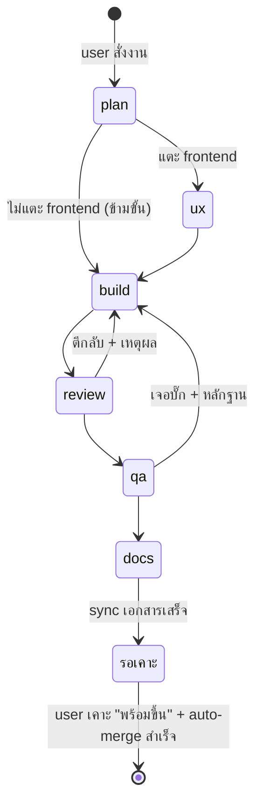
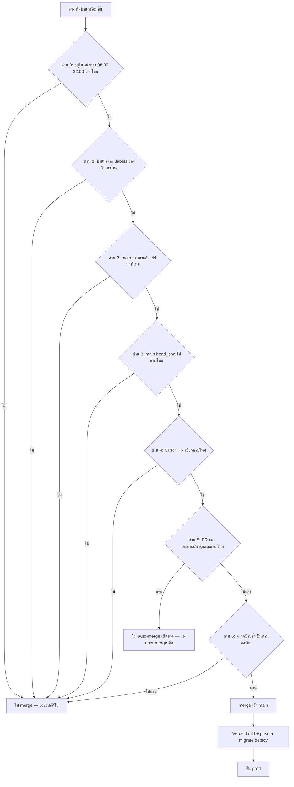
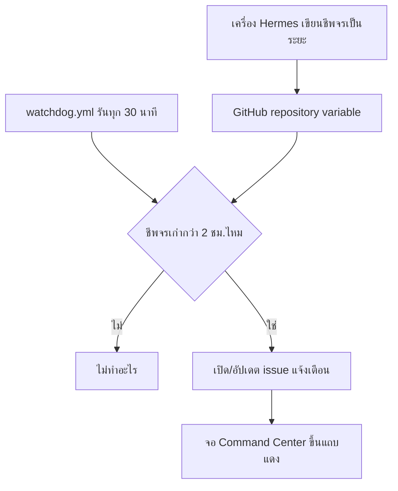

> **โมดูล:** 00049 - AI Command Center
> **ประเภทเอกสาร:** Business Requirements Document (BRD) — NON-TECHNICAL
> **เวอร์ชัน:** 0.2 · **วันที่:** 2026-08-16 (แก้รอบ 2 หลัง P0 รันจริง)
> **สถานะ:** Draft — **รอ user review (HR11)**
> **อ้างอิงดีไซน์:** `docs/superpowers/specs/2026-08-16-ai-command-center-design.md`

# BRD: AI Command Center

---

## 1. บทนำ

### 1.1 วัตถุประสงค์

1. กำหนดว่า user สั่งงาน AI และอนุมัติผลงานผ่านจอ Command Center อย่างไร และวัดว่า "ทำได้" ด้วยเกณฑ์อะไร
2. ล็อกขอบเขตรอบแรก (P0–P5) และสิ่งที่จงใจไม่ทำ
3. เขียนกฎที่ **ห้ามเปลี่ยนโดยไม่ถาม** โดยเฉพาะอำนาจของ agent และด่านที่ห้ามพังเงียบ

### 1.2 ขอบเขตของระบบ

หน้าเว็บ + ชุด GitHub Actions workflow ที่ให้ user สั่งงาน AI จากที่เดียว แล้วให้ agent 6 ขั้นทำงาน
ต่อกันเองผ่านป้าย GitHub จนได้ PR ที่ผ่านด่านอัตโนมัติ แล้วให้ user อนุมัติปลายทางก่อนขึ้น prod

- **Input:** คำสั่งงานที่ user พิมพ์ · การกดปุ่ม (เคาะ "พร้อมขึ้น" / ตีกลับ / หยุด)
- **Output:** issue/PR ที่เดินผ่านป้าย `stage:*` · PR ที่ merge เข้า `main` (เฉพาะที่ user เคาะและผ่านด่านครบ) ·
  การแจ้งเตือนเมื่อ Hermes ขาดชีพจร
- **ระบบที่เกี่ยวข้อง:** GitHub (issue/PR/label/comment/Actions) · `.claude/agents/*` เดิม ·
  `admin.deepthailand.app` + guard `isAdmin` เดิม · `vercel.json` build pipeline ·
  **service container `postgres:16` (ต้องเพิ่มใหม่ สำหรับด่าน `vitest run tests/` หลัง P0.1)**

### 1.3 กลุ่มผู้ใช้งาน

| กลุ่ม | บทบาท | สิทธิ์ |
|---|---|---|
| **user — ผู้สั่งงาน** | สร้างงานใหม่ ดูสถานะ | เต็ม |
| **user — ผู้อนุมัติ** | เคาะ "พร้อมขึ้น" / ตีกลับ / หยุด | เต็ม — คนเดียวที่ทำได้ |
| **agent (6 ขั้น)** | อ่านป้าย → ทำงาน → เขียน comment → เปลี่ยนป้าย → เปิด PR | **เปิด PR ได้อย่างเดียว** ห้าม merge/push main/แตะ DB/แตะ env |
| **GitHub Actions (ด่าน)** | ตรวจ/บล็อก/merge ตามเงื่อนไข | เชลล์ล้วน ไม่มีสิทธิ์ตัดสินเชิงเนื้อหา |
| **ผู้ขาย/ผู้ซื้อของ Deep** | ไม่เกี่ยวข้อง | ไม่มีสิทธิ์เข้าถึง (อยู่ใต้ `admin.*`) |

---

## 2. Functional Requirements

### 2.1 การสั่งงานใหม่

#### FR-CC-01 สั่งงานใหม่จากหน้าเว็บ

> ในฐานะผู้สั่งงาน ฉันต้องการสั่งงานใหม่จากหน้า Command Center เพื่อให้สายงาน agent เริ่มทำงาน
> โดยไม่ต้องเปิดเทอร์มินัลหรือ GitHub เอง

**AC:**
- [ ] กรอกคำสั่งงานแล้วกดส่ง → เกิด GitHub issue ใหม่ที่มีป้าย `stage:plan` ทันที
- [ ] ทุก write (สร้าง issue/เปลี่ยนป้าย) ยิงผ่าน API route ฝั่งเรา ไม่ยิงจาก client ตรงเข้า GitHub
- [ ] token ของ GitHub ไม่หลุดไปฝั่ง client ไม่ว่ากรณีใด

**Flow:** พิมพ์ → กดส่ง → API route สร้าง issue + ป้าย → Hermes poll เจอในรอบถัดไป (30 วิ–5 นาที)

#### FR-CC-02 งานเกิดจาก user สั่งเท่านั้น

> ในฐานะผู้อนุมัติ ฉันต้องการมั่นใจว่าไม่มีงานไหนถูกสร้างขึ้นเองโดยไม่มีฉันสั่ง

**AC:**
- [ ] ไม่มี cron หรือ agent ใดสแกนหา backlog/TODO แล้วเปิด issue เอง
- [ ] ทุก issue ที่มีป้าย `stage:*` สืบย้อนไปหาการสั่งงานของ user ได้เสมอ

### 2.2 สายงาน agent 6 ขั้น

#### FR-CC-03 แต่ละขั้นทำงานตามป้ายและส่งต่อด้วย comment โครงตายตัว

> ในฐานะ user ฉันต้องการให้แต่ละขั้นส่งต่อกันได้แม้ไม่มีการส่ง context ตรงระหว่างเซสชัน
> เพื่อให้มีหลักฐานเป็นลายลักษณ์อักษรว่าแต่ละขั้นทำอะไร

**AC:**
- [ ] ทุกขั้นเขียน comment ที่มีอย่างน้อย: สรุปผล · ไฟล์ที่ต้องแตะ · ข้อควรระวังสำหรับขั้นถัดไป · ป้ายที่ส่งต่อ
- [ ] งาน UI ต้องมี "Theme Source" อยู่ใน comment ของขั้นออกแบบ UX (ผูก HR1/HR3)
- [ ] ป้ายเปลี่ยนไปขั้นถัดไปได้ก็ต่อเมื่อ comment สรุปผลถูกเขียนแล้วเท่านั้น

#### FR-CC-04 ข้ามขั้น UX ได้เมื่อไม่แตะ frontend

**AC:**
- [ ] การข้ามขั้นตัดสินจาก path ที่ขั้นวางแผนระบุใน comment ไม่ใช่ให้ขั้นเขียนโค้ดตัดสินเอง
- [ ] งานที่แตะ path ใต้ `src/app/(marketing)/**`, `src/app/(paces)/**` หรือไฟล์ component/style ใด ๆ
      **ต้อง**ผ่านขั้น UX เสมอ (ผูก HR8 — ไม่มีข้อยกเว้น)

#### FR-CC-05 ตีกลับพร้อมเหตุผลเมื่อรีวิว/QA ไม่ผ่าน

**AC:**
- [ ] ขั้นที่ตีกลับต้องเขียนเหตุผลเป็น comment ก่อนเปลี่ยนป้ายกลับ `stage:build`
- [ ] ใบงานที่ถูกตีกลับแล้วไม่มีใครรับต่อ ยังค้างที่ป้าย `stage:build` — ไม่หายไปจากจอ

#### FR-CC-06 🛑 agent เปิด PR ได้อย่างเดียว

> ในฐานะผู้อนุมัติ ฉันต้องการมั่นใจว่า agent ไม่มีทางแตะ main/ฐานข้อมูล/environment โดยตรง
> ไม่ว่าสถานการณ์ใด เพื่อป้องกันเหตุการณ์แบบฐาน prod ถูกล้างซ้ำ

**AC:**
- [ ] token ของเครื่อง Hermes ไม่มีสิทธิ์ push ตรงเข้า `main` (บังคับด้วย branch protection)
- [ ] token ของเครื่อง Hermes ไม่มีสิทธิ์แก้ `.github/workflows/**`
- [ ] ไม่มี credential ฐาน prod หรือ env ของ prod อยู่ในสภาพแวดล้อมที่ agent เข้าถึงได้ผ่านสายงานนี้

### 2.3 ด่านอัตโนมัติบน GitHub Actions

#### FR-CC-07 🛑 `verify.yml` บล็อกเต็มตัวตั้งแต่วันแรก — ไม่มีระยะ advisory

> ในฐานะ user ฉันต้องการให้ทุก PR ถูกตรวจแบบบล็อกจริงตั้งแต่วันแรก โดยไม่มีช่วงเปลี่ยนผ่าน
> ที่ด่านประกาศตัวว่าไม่บล็อก

**AC:**
- [ ] รัน `tsc --noEmit` (ทั้งรีโป) บนทุก PR และบล็อกจริงถ้าแดง
- [ ] รัน `vitest run src/` (252 ไฟล์ ไม่แตะ DB — วัดแล้ว 2026-08-16 เขียวหมด 2,945/2,945) บนทุก PR
      และบล็อกจริงถ้าแดง — **ใช้เกณฑ์ผ่านเต็ม ไม่มี baseline/ลิสต์ยกเว้น**
- [ ] รัน `.claude/hooks/theme-guard.sh` กับไฟล์ที่ PR แตะ และบล็อกจริงถ้าแดง
- [ ] `vitest run tests/` (12 ไฟล์ ต้องมี Postgres) **ยังไม่อยู่ในด่านจนกว่า P0.1 จะเสร็จ** และ CI ต้องมี
      service container `postgres:16` — ระหว่างที่ยังไม่เข้าด่าน สถานะต้องแสดงว่า "อยู่นอกด่าน" อย่าง
      เปิดเผยบนจอ **ห้ามแสดงเป็นด่านที่ผ่านแล้วทั้งที่ยังไม่ได้รัน**

#### FR-CC-08 `auto-merge.yml` เก็บ PR ที่ติดป้าย "พร้อมขึ้น"

**AC:**
- [ ] merge เฉพาะในหน้าต่างเวลา 08:00–22:00 น. ไทย
- [ ] ตรวจป้ายจาก `.labels` ของใบ PR เอง **ไม่เชื่อผลจาก `gh pr list --label`**
- [ ] ตรวจว่า `main` สงบมาแล้ว ≥N นาที (N วัดจากเวลา merge→live จริงของ Vercel เราเอง)
- [ ] ตรวจว่า `main` ปัจจุบัน (`head_sha`) ไม่แดง — ไม่ใช่ดูจาก run ล่าสุดของ branch
- [ ] ตรวจว่า CI ของ PR เขียวครบ (ไม่นับ check-run ของ job ตัวเอง)
- [ ] ตรวจป้าย "พร้อมขึ้น" ซ้ำเป็นขั้นตอนสุดท้ายก่อนสั่ง merge จริง
- [ ] รันครั้งละ 1 PR (`concurrency: cancel-in-progress: false`)
- [ ] `permissions:` เป็น allow-list ที่ระบุชัด ไม่ใช้ default ที่กว้างเกิน
- [ ] อ่านค่าที่จำเป็นไม่ได้ = ไม่ merge (fail-closed)

#### FR-CC-09 🛑 PR ที่แตะ migration ห้าม auto-merge

**AC:**
- [ ] ตรวจ diff ว่าแตะ `prisma/migrations/**` ไหม ก่อนตัดสินใจ merge
- [ ] ถ้าแตะ → **ไม่ merge อัตโนมัติเด็ดขาด** ไม่ว่าด่านอื่นจะผ่านครบหรือไม่
- [ ] จอแสดงสถานะที่ต่างจากปกติสำหรับ PR กลุ่มนี้ (ไม่ใช่ "รอเคาะ" เฉย ๆ)

#### FR-CC-10 🛑 PR จาก agent ห้ามแตะ path คุ้มครอง

**AC:**
- [ ] `verify.yml` ตกทันทีถ้า PR ของ agent แตะ `.github/workflows/**`, `.claude/hooks/**`
      หรือไฟล์เทสที่มี marker `[blocker]`
- [ ] `CODEOWNERS` บังคับให้ user รีวิวเมื่อ PR แตะ path เหล่านี้ (บังคับ 2 ชั้นซ้อน)

### 2.4 การอนุมัติของ user

#### FR-CC-11 🛑 เคาะป้าย "พร้อมขึ้น" = ประตูอนุมัติเดียว

**AC:**
- [ ] ไม่มี agent ขั้นไหนติดป้ายนี้ให้ตัวเองได้ (ไม่มี token ของ agent ใดมีสิทธิ์ติดป้ายนี้)
- [ ] จอมีปุ่ม "เคาะพร้อมขึ้น" ที่ยิง API route ของเราไปติดป้ายเท่านั้น (ไม่ยิงจาก client ตรง)
- [ ] เคาะป้ายจาก GitHub ตรง ๆ ก็ยังใช้ได้ (จอเป็นทางลัด ไม่ใช่ทางเดียว)

#### FR-CC-12 ตีกลับ/หยุดงานจากจอได้

**AC:**
- [ ] ปุ่ม "ตีกลับ" เปลี่ยนป้ายกลับขั้นก่อนหน้า พร้อมเขียน comment เหตุผลที่ user กรอก
- [ ] ปุ่ม "หยุด" ถอดป้าย `stage:*` ทั้งหมด (agent จะไม่รับงานนั้นในรอบถัดไป)

### 2.5 มองเห็นสถานะทุกงาน

#### FR-CC-13 จออ่านจาก GitHub ตรง ไม่เก็บ state เอง

**AC:**
- [ ] ไม่มีตาราง Prisma ใหม่ที่เก็บสถานะของงาน (ยืนยันว่าไม่มี migration ใหม่ — D-8)
- [ ] จอแสดง 7 คอลัมน์ (6 ขั้น + รอเคาะ) + แถบสถานะบน โดยข้อมูล derive จาก GitHub API ณ เวลา request
- [ ] client poll ทุก 15–30 วินาที พร้อม ETag/conditional request (304 ไม่นับโควตา)
- [ ] token อ่านฝั่ง server เท่านั้น — ไม่หลุดไป client

#### FR-CC-14 🛑 แจ้งเตือนเมื่อเครื่อง Hermes ขาดชีพจร

**AC:**
- [ ] เครื่อง Hermes เขียนชีพจรผ่าน repository variable — ไม่สร้าง commit ไม่สร้าง notification
- [ ] `watchdog.yml` อ่านค่าชีพจรทุก 30 นาที
- [ ] ชีพจรเก่ากว่า 2 ชั่วโมง → เปิด/อัปเดต GitHub issue แจ้งเตือน
- [ ] จอแสดงแถบแดงเมื่อ issue นี้เปิดอยู่
- [ ] **ตัวเฝ้าอยู่บน GitHub Actions เท่านั้น — ห้ามวางไว้บนเครื่อง Hermes เอง**
      (ป้องกันการตายพร้อมกันทั้งชุดเงียบ ๆ แบบที่เกิดกับระบบต้นแบบ 178 รอบ)

---

## 3. Acceptance Criteria สรุป

**อำนาจของ agent**
- ✅ agent เปิด PR ได้ แต่ไม่มีทางแตะ `main`/ฐานข้อมูล/env
- ✅ ไม่มี PR จาก agent ที่แก้ path คุ้มครองหลุดผ่านไปได้
- ✅ ไม่มี issue ใดถูกสร้างเองโดยไม่มี user สั่ง

**ด่านที่ห้ามพังเงียบ**
- ✅ `verify.yml` บล็อกด้วย `tsc`/`vitest run src/`/`theme-guard` เต็มตัวตั้งแต่วันแรก ไม่มีลิสต์ยกเว้น
  หรือช่วง advisory
- ✅ `vitest run tests/` เข้าด่านทันทีที่ P0.1 เสร็จ — ไม่ถูกปล่อยค้างเป็น "อยู่นอกด่าน" ตลอดกาลอย่างเงียบ ๆ
- ✅ PR ที่แตะ migration ไม่เคยถูก auto-merge แม้แต่ครั้งเดียว
- ✅ อ่านค่าที่จำเป็นไม่ได้ = ไม่ merge เสมอ

**ประตูอนุมัติ**
- ✅ PR ต้องผ่านด่านครบ 6 ชั้นก่อนถูก merge จริง
- ✅ ไม่มีทางที่ PR จะขึ้น `main` โดยไม่มีป้าย "พร้อมขึ้น"

**การมองเห็นสถานะ**
- ✅ ตัวเลข "รอ user เคาะ" ตรงกับจำนวนป้ายบน GitHub เสมอ
- ✅ เครื่อง Hermes ปิดเกิน 2 ชม. ต้องมีการแจ้งเตือนเกิดขึ้นจริงเสมอ

---

## 4. Business Flows

### 4.1 สายงาน 6 ขั้น + ทางย้อน

### 4.2 ด่าน `auto-merge.yml` 6 ชั้น

### 4.3 การเฝ้าเครื่อง Hermes

---

## 5. Use Case Scenarios

### Scenario 1 — งานเล็กที่ไม่แตะ frontend เดินครบ 6 ขั้นจนขึ้น prod (Best Case)

**เงื่อนไขเริ่มต้น:** ตั้งค่าครบตาม PRD §10.2 · เครื่อง Hermes เปิดอยู่

1. user สั่งงานจากจอ
2. `safepay-planner` วางแผน ระบุว่าไม่แตะ frontend → ข้ามขั้น UX
3. `safepay-developer` เขียนโค้ด เปิด PR
4. `reviewer` ผ่าน → `qa` ผ่าน → `docs` sync เอกสาร
5. user เห็นในคอลัมน์ "รอเคาะ" → กด "พร้อมขึ้น"
6. `auto-merge.yml` ผ่านครบ 6 ด่าน → merge → ขึ้น prod

**ผลลัพธ์:** PR ขึ้น prod โดย user แทรกแค่ 2 จุด (สั่งงาน, อนุมัติ)

### Scenario 2 — งานถูกตีกลับที่ขั้นรีวิว

**เงื่อนไขเริ่มต้น:** PR อยู่ที่ป้าย `stage:review`

1. `safepay-reviewer` พบปัญหา (เช่น ละเมิด HR7 arbitrary Tailwind value)
2. เขียน comment ระบุปัญหาและตำแหน่งที่ต้องแก้
3. เปลี่ยนป้ายกลับเป็น `stage:build`

**ผลลัพธ์:** developer รับงานต่อในรอบ poll ถัดไป · จอแสดงใบนี้ในคอลัมน์ "เขียน" อีกครั้ง
พร้อมประวัติการตีกลับที่ย้อนดูได้

### Scenario 3 — เครื่อง Hermes ปิดกลางทาง

1. เครื่องหยุดเขียนชีพจร
2. `watchdog.yml` รันตามรอบ พบว่าชีพจรเก่ากว่า 2 ชม.
3. เปิด/อัปเดต issue "เครื่อง Hermes ขาดการติดต่อ"

**ผลลัพธ์:** จอขึ้นแถบแดง user รู้ทันทีว่างานหยุดเดินเพราะอะไร · เมื่อเครื่องกลับมา มัน poll
ไล่เก็บงานค้างเองตามปกติ (D-6)

### Scenario 4 — PR แตะ migration ถูกกันไม่ให้ auto-merge

1. `auto-merge.yml` เดินผ่านด่าน 0–4 ทั้งหมด
2. ถึงด่าน 5 พบว่าแตะ `prisma/migrations/**`
3. หยุดทันที ไม่ยิง merge

**ผลลัพธ์:** จอแสดง "รอ merge มือ (แตะ migration)" · user ต้องอ่าน SQL แล้ว merge เองบน GitHub —
ไม่มีทางลัด

---

## 6. Quality Requirements

**6.1 ความถูกต้องของข้อมูล** — ตัวเลขบนจอต้อง derive จาก GitHub ณ เวลา request เสมอ ห้ามเก็บ
state คู่ขนาน · ตัวเลข "รอเคาะ" ต้องตรงกับจำนวนป้ายบน GitHub เสมอ

**6.2 ความรวดเร็ว** — poll ทุก 15–30 วินาที + ETag ไม่กระทบโควตาแม้เปิดจอค้างทั้งวัน ·
merge เกิดภายในไม่กี่นาทีหลัง user เคาะป้าย (เว้นแต่ติดเงื่อนไขด่าน)

**6.3 ความน่าเชื่อถือ** — ด่านทุกตัว fail-closed · รันครั้งละ 1 PR ป้องกัน race ·
`permissions:` เป็น allow-list ที่ระบุชัด

**6.4 ความปลอดภัย** — PAT ของ Hermes เป็น fine-grained และ **ห้ามมีสิทธิ์ `workflows`** ·
ไม่ต้องมี `ANTHROPIC_API_KEY` · path คุ้มครองบังคับ 2 ชั้น (`verify.yml` + `CODEOWNERS`) ·
guard `isAdmin` เดิมครอบหน้านี้อยู่แล้ว

**6.5 Usability** — เห็นภาพรวมทุกงานปราดเดียวโดยไม่ต้องไล่เปิดหลายแท็บ ·
คอลัมน์ "รอเคาะ" ต้องเด่นที่สุดบนจอเสมอ เพราะเป็นคอขวดจริง

---

## 7. Constraints

### 7.1 ทางธุรกิจ
- เครื่อง Hermes ต้องเปิดและเชื่อมเน็ตได้ งานจึงจะเดิน — ระบบนี้ไม่ทำให้ AI ทำงาน 24 ชม.จริง
- agent มีอำนาจเปิด PR ได้อย่างเดียวตลอดดีไซน์รอบนี้ — ขยายทีหลังได้เมื่อมีหลักฐาน

### 7.2 ทางเทคนิค (ยืนยันแล้ว)
- 🛑 รีโปนี้ยังไม่มี `.github/workflows/` เลยสักไฟล์ — ต้องเริ่มจากศูนย์
- ✅ **วัดจริง 2026-08-16 (P0):** `vitest run src/` (252 ไฟล์ ไม่แตะ DB) เขียวหมด 2,945/2,945 —
  ด่านส่วนนี้บล็อกเต็มตัวได้ทันที ไม่ต้องมีระยะผ่อนปรน
- 🛑 `vitest run tests/` (12 ไฟล์) แดง 8 ไฟล์/80 เทส **จากสาเหตุเดียว**: `cleanDatabase()` ถูกถอด
  ออกอย่างถูกต้องตาม HR13 แต่ยังไม่ได้ตามไปแก้ผู้เรียก 8 ไฟล์ — เป็นงาน 1 ชิ้นที่ทำค้าง (**P0.1**)
  ไม่ใช่หนี้เทส 80 ข้อ ต้องแก้ให้เรียก `deleteTestData({ userIds, shopIds })` แทน
- ⚠️ CLAUDE.md เคยบันทึกสาเหตุของเทสกลุ่มนี้ไว้**ผิด**ว่า "prisma mock ไม่ครบ" ตั้งแต่ 2026-08-07
  (คัดลอกต่อกันมา 18→98→80) ซึ่งเป็นเหตุผลที่ไม่มีใครไปแตะ — ต้องแก้บันทึกพร้อมงาน P0.1
- `vitest run tests/` ต้องมี Postgres — CI ต้องเพิ่ม service container `postgres:16` ก่อน
- `merge` = migration รันบน prod ทันที (`vercel.json` มี `prisma migrate deploy`)
- GitHub API โควตา 5,000 คำขอ/ชม.
- `anthropics/claude-code-action` ไม่รองรับ Claude subscription — ต้องใช้เครื่อง Hermes
- ยังไม่รู้วิธี dispatch งานเข้า Hermes แบบ headless — ต้อง spike ก่อนเฟสสุดท้าย

---

## 8. Business Rules

### 8.1 อำนาจของ agent
- **BR-CC-01** agent เปิด PR ได้อย่างเดียว — ห้าม merge / push main / แตะ DB / แตะ env
- **BR-CC-02** งานมาจาก user สั่งเท่านั้น ไม่มี agent หางานทำเอง

### 8.2 ด่านและขอบเขตการบล็อก
- **BR-CC-03** ด่านครอบคลุมเต็มตั้งแต่วันแรก ไม่มีระยะ advisory — `verify.yml` บล็อกด้วย
  `tsc --noEmit` + `vitest run src/` + `theme-guard.sh` ตั้งแต่วันแรก · `vitest run tests/`
  เข้าด่านหลัง P0.1 — ระหว่างนั้นต้องเปิดเผยว่าอยู่นอกด่าน ห้ามตั้งเป็นด่านที่ผ่านเสมอ
- **BR-CC-04** PR ที่แตะ `prisma/migrations/**` ห้าม auto-merge เด็ดขาด
- **BR-CC-05** PR จาก agent ห้ามแตะ `.github/workflows/**`, `.claude/hooks/**`, เทส `[blocker]`
  บังคับด้วย `verify.yml` + `CODEOWNERS` สองชั้น
- **BR-CC-06** `auto-merge.yml` ทำงานเฉพาะ 08:00–22:00 น. ไทย
- **BR-CC-07** รันด่าน merge ครั้งละ 1 PR เท่านั้น

### 8.3 ขอบเขตข้อมูล
- **BR-CC-08** ไม่มีตาราง Prisma ใหม่ ไม่มี migration สำหรับฟีเจอร์นี้เอง
- **BR-CC-09** จอไม่เก็บ state ของตัวเอง อ่านจาก GitHub ตรงเสมอ
- **BR-CC-10** ตรวจป้ายต้องอ่านจาก `.labels` ของ PR/issue เอง **ห้ามเชื่อ `gh pr list --label`**
  (พิสูจน์แล้วว่าคืนใบที่ไม่มีป้ายออกมาด้วย)

---

## 9. Glossary

| คำศัพท์ | ความหมาย |
|---|---|
| **Command Center** | หน้าเว็บที่ `admin.deepthailand.app/command-center` |
| **สายงาน (agent chain)** | 6 ขั้น: วางแผน → ออกแบบ UX → เขียน → รีวิว → QA → sync เอกสาร |
| **ป้าย `stage:*`** | ป้าย GitHub บอกว่าใบงานอยู่ขั้นไหน |
| **ป้าย "พร้อมขึ้น"** | ประตูอนุมัติเดียวที่ user ติดเองเท่านั้น |
| **เครื่อง Hermes** | เครื่องส่วนตัวของ user ที่รัน Claude Code ด้วย subscription |
| **fail-closed** | อ่านค่าที่จำเป็นไม่ได้ = ถือว่า "ไม่ผ่าน" เสมอ ไม่ใช่ "ผ่านโดยปริยาย" |
| **root safety** | กลไกความปลอดภัยต้องแก้ไขตัวเองไม่ได้จาก PR ที่ agent เปิด |
| **heartbeat / ชีพจร** | ค่าเวลาที่เครื่อง Hermes เขียนอัปเดตเป็นระยะ |
| **P0.1** | งานเดี่ยวที่ต้องปิดก่อนเปิดด่านให้ `vitest run tests/` |
| **`cleanDatabase()` / `deleteTestData()`** | ตัวแรกถูกถอดออกแล้ว (เรียกแล้ว `throw`) ตาม HR13 — ตัวหลังคือทางแทนที่ถูกต้อง (scope ด้วย `userIds`/`shopIds`) |

---

## 10. สรุป

**จุดเด่น:**
- user สั่งงานครั้งเดียวแล้วสายงาน 6 ขั้นทำงานต่อกันเองผ่าน GitHub label โดยไม่ต้องนั่งเฝ้า
- ด่านอัตโนมัติที่ **ห้ามพังเงียบ** (fail-closed ทุกจุด) และบล็อกเต็มตัวตั้งแต่วันแรกในส่วนที่ทำได้จริง
  (ไม่มีการโอบรับหนี้ที่ไม่มีอยู่จริงด้วยลิสต์ยกเว้น)
- ประตูอนุมัติเดียวที่ user เคาะเสมอ — agent ไม่มีทางได้อำนาจ merge/push main/แตะ DB/แตะ env

**ผลลัพธ์ที่คาดหวัง:**
- ไฟล์ใน `tests/` ที่ยังเรียก `cleanDatabase()` = 0 (จาก 8) และ `vitest run tests/` เข้าด่านครบ
- มี PR ≥1 ใบเดินครบ 6 ขั้นถึงป้าย "พร้อมขึ้น" โดย user ไม่ต้องแทรกกลาง
- ตัวเลข "รอ user เคาะ" บนจอตรงกับจำนวนป้ายบน GitHub เสมอ

---

✅ **มติที่ user เคาะแล้ว (2026-08-16):** D-1 อำนาจ agent จำกัดที่เปิด PR · D-2 แหล่งงาน = user สั่ง
เท่านั้น · D-3 AI รันที่เครื่อง Hermes · D-4 ด่านรันบน Actions เชลล์ล้วน · D-5 bus = GitHub เอง ·
D-6 ทางส่งคำสั่ง = poll ทุก 30วิ–5นาที · D-7 แบ่ง agent ตามขั้นงาน 6 ขั้น · D-8 ไม่เก็บ state เอง
ไม่มี migration ใหม่ · D-9 ที่อยู่จอ = `admin.deepthailand.app/command-center`

🛑 **แก้ไขรอบ 2 (หลัง P0 รันจริง):** `known-failures.txt`/baseline ถูกถอดออกทั้งหมด — แทนที่ด้วย
ด่านที่บล็อกเต็มตัวตั้งแต่วันแรก บวกงานเดี่ยวที่มีเป้าจบชัดเจนชื่อ **P0.1** สำหรับส่วนที่ยังต้องพึ่ง Postgres
ดู §2.3 FR-CC-07, §7.2, §8.2 BR-CC-03

**หมายเหตุ:** ภาพรวม/personas/KPI ดู [[PRD]] · technical spec ดู [[SRS]] (ยังไม่เขียน — HR11)
