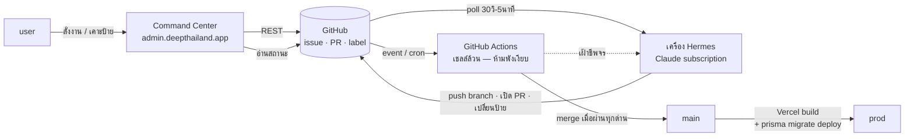

> **โมดูล:** 00049 - AI Command Center
> **ประเภทเอกสาร:** Product Requirements Document (PRD)
> **เวอร์ชัน:** 0.2
> **วันที่จัดทำ:** 2026-08-16 (แก้ไขรอบ 2 หลัง P0 รันจริงและ `known-failures.txt` ถูกถอดออกจากดีไซน์)
> **สถานะ:** Draft — **รอ user review (HR11: ห้าม implement ก่อน PRD+BRD ผ่าน review)**
> **อ้างอิงดีไซน์ที่อนุมัติแล้ว:** `docs/superpowers/specs/2026-08-16-ai-command-center-design.md` — **ห้ามเปลี่ยนมติ D-1..D-9 โดยไม่ผ่าน user**

# PRD: AI Command Center

---

## Executive Summary

วันนี้เมื่อ user สั่งงานให้ Claude Code ทำฟีเจอร์ให้ ทุกขั้น — วางแผน, ออกแบบ UX, เขียนโค้ด, รีวิว,
QA, sync เอกสาร — เกิดในเซสชันเดียวที่ user ต้องนั่งคุมตลอด และด่านตรวจสอบ (`tsc`, `vitest`,
`theme-guard.sh`, blocker tests) รันเฉพาะตอนที่คนนึกได้บนเครื่อง dev
**รีโปนี้ไม่มี `.github/workflows/` เลยแม้แต่ไฟล์เดียว** ณ วันที่เขียนเอกสารนี้

AI Command Center ย้ายงาน "ทำต่อกันเป็นทอด ๆ" ออกจากเซสชันเดียว ไปเป็น **สายงาน agent 6 ขั้น
ที่ทำงานผ่าน GitHub label เองเป็นทอด ๆ** จนได้ Pull Request ที่พร้อมให้ user ตัดสินใจ — และย้าย
ด่านตรวจสอบไปอยู่บน **GitHub Actions ที่บังคับทุก PR โดยอัตโนมัติ ไม่ขึ้นกับว่าใครนึกได้**

ต้นแบบคือระบบภายในของ `CodeCooLTH/12tees` ซึ่ง user มีสิทธิ์เข้าถึงและเห็นว่าใช้ได้จริง แต่
**ไม่ลอกทั้งดุ้น** — ของเขามี agent บนเครื่องจริง 6 เครื่อง เราไม่มี · ของเขามี "advisory pattern"
ให้ข้ามด่านที่แดงถาวร เราปฏิเสธแนวคิดนี้ (คอมเมนต์ในโค้ดของเขาเองยอมรับว่ามันคือการยอมรับหนี้
ไม่ใช่การแก้)

🛑 **อัปเดตสำคัญ (2026-08-16 หลังเขียนเอกสารนี้รอบแรก):** ตอนออกแบบครั้งแรกยังไม่เคยวัดว่าเทสแดง
กี่ตัว ดีไซน์รอบแรกจึงเสนอ "baseline เทสแดงที่โตไม่ได้" (`known-failures.txt`) — พอวัดจริงพบว่า
**ซอร์สหลัก (`vitest run src/`, 252 ไฟล์) เขียวหมด 2,945/2,945** ส่วนที่แดงทั้ง 80 ข้ออยู่ใน `tests/`
(ต้องมี Postgres) และมาจาก**สาเหตุเดียว**ที่ไม่ใช่บั๊กโปรดักต์ (§3.3/§6.1) — แนวคิด baseline จึงถูก
ถอดออกทั้งหมด เพราะไม่มีหนี้จริงให้ต้องโอบรับ ด่านที่ทำเต็มได้ตั้งแต่วันแรกจึงทำเต็มไปเลย

**ผู้ใช้ของฟีเจอร์นี้มีคนเดียว: user เอง ในบทบาทแอดมิน** ไม่ใช่ผู้ขายหรือผู้ซื้อ — คุณค่าคือเวลาและ
ความปลอดภัยของ user เอง และกันไม่ให้เหตุการณ์แบบฐาน prod ถูกล้างทั้ง 64 ตาราง (2026-07-31)
เกิดซ้ำผ่านเส้นทางที่ agent ควบคุมอัตโนมัติ

---

## 1. Business Goals & KPIs

### 1.1 เป้าหมายทางธุรกิจ

| เป้าหมาย | รายละเอียด |
|---|---|
| **ลดภาระการนั่งคุมทุกขั้น** | สายงาน 6 ขั้นทำงานต่อกันเองผ่านป้าย — user แทรกแค่ตอนสั่งงานและตอนอนุมัติ |
| **ยกด่านออกจากเครื่อง dev ไปบน CI** | ปัจจุบันด่านรันเฉพาะตอนคนนึกได้ — ย้ายไป Actions ที่รันทุกครั้งไม่มีข้อยกเว้น |
| **มีด่านที่ "ห้ามตายเงียบ"** | AI ตาย = งานไม่เดิน (ดังเอง) · ด่านตาย = ของแย่ไหลขึ้น prod เงียบ ๆ ⇒ ด่านต้องพังแบบดังเสมอ (fail-closed) |
| **ประตูอนุมัติเดียวที่ user เคาะเอง** | ไม่มีทางไหนที่โค้ดขึ้น `main` โดย user ไม่ได้ติดป้าย "พร้อมขึ้น" |
| **เห็นสถานะทุกงานจากจอเดียว** | แทนการไล่เช็คทีละ terminal/เซสชัน |

### 1.2 KPIs

| KPI | คำอธิบาย | เป้าหมาย |
|---|---|---|
| **ไฟล์ใน `tests/` ที่ยังเรียก `cleanDatabase()`** | ปัจจุบัน 8 จาก 12 ไฟล์ — เป็นสาเหตุที่ทำให้ 80 เทสแดงตั้งแต่บรรทัดแรกใน 0ms | **= 0** และ `vitest run tests/` เข้าด่าน `verify.yml` ได้ครบ (งาน P0.1) |
| **PR ที่ `verify.yml` ตีตกโดย user ไม่ได้สังเกตเอง** | นับ PR ที่ด่านจับได้ก่อนคน | ≥1 ใบในเดือนแรก (พิสูจน์ว่าด่านมีค่าจริง) |
| **PR ที่เดินครบ 6 ขั้นถึงป้าย "พร้อมขึ้น" โดยไม่ต้องแทรกกลาง** | นับ PR ที่ไม่มีคนเข้าไปแก้/เร่งระหว่างทาง | ≥1 ใบ |
| **เวลาเฉลี่ยจาก "สั่งงาน" ถึง "PR เปิด"** | เทียบกับกระบวนการทำมือเดิม | ยังไม่ตั้งเลข — ต้องมี baseline ≥1 เดือนก่อน |
| **watchdog แจ้งเตือนจริงเมื่อ Hermes ขาดชีพจร** | ทดสอบโดยตั้งใจปิดเครื่อง | ต้องเคยแจ้งจริง ≥1 ครั้ง |

---

## 2. User Personas

> ผู้ใช้จริงมีคนเดียว (shinobu22) แต่สวมหมวกคนละใบในแต่ละจังหวะ — แยก persona ตามบทบาท

### 2.1 ผู้สั่งงาน (Requester)

- **พื้นฐาน:** เจ้าของโปรเจกต์คนเดียว ตัดสินขอบเขต/ลำดับความสำคัญเองทั้งหมด · คุ้นกับการสั่ง Claude Code
  ผ่านเซสชันแชทอยู่แล้ว — Command Center คือช่องทางใหม่ ไม่ใช่ทดแทน
- **เป้าหมาย:** สั่งงานสั้น ๆ จากมือถือ/จอไหนก็ได้ แล้วเดินไปทำอย่างอื่น · ไม่ต้องเปิดเทอร์มินัลหรือ
  เขียนพรอมป์ยาวทุกครั้งสำหรับงานที่ scope ชัดแล้ว
- **ความต้องการ:** ฟอร์มสั่งงานที่ทำให้เกิด issue + ป้าย `stage:plan` ทันที · รู้ว่างานอยู่ขั้นไหน
  โดยไม่ต้องเปิด GitHub
- **จุดปวด:** ต้องเปิดเซสชันค้างไว้และรอดูทุกขั้นเอง ปิดจอไปงานก็หยุดเดิน

### 2.2 ผู้อนุมัติและผู้เฝ้าระบบ (Approver & Watcher)

- **พื้นฐาน:** คนเดียวที่มีสิทธิ์ตัดสินว่าอะไรขึ้น prod ไม่มีทีมอื่นช่วยรีวิว · เคยเจอฐาน prod ถูกล้าง
  ทั้ง 64 ตาราง (2026-07-31) จึงระวังอำนาจของสิ่งที่รันอัตโนมัติเป็นพิเศษ
- **เป้าหมาย:** อนุมัติของที่พร้อมจริงได้เร็วโดยไม่ต้องไล่เช็คทุกบรรทัดเอง · รู้ทันทีที่มีอะไรค้าง/พัง
- **ความต้องการ:** ปุ่มเดียวที่กดแล้วของขึ้น prod · เห็นทันทีว่ามีงานรอเคาะกี่ใบ (คอขวดจริงของระบบ) ·
  มั่นใจว่า PR ที่แตะ migration ไม่มีทางถูก merge อัตโนมัติโดยไม่มีคนอ่าน SQL
- **จุดปวด:** กลัว agent ได้อำนาจเกินตัว · ด่านที่ "เตือนแล้วปล่อยผ่านได้" จะกลายเป็นหนี้ที่ไม่มีวันจ่าย

---

## 3. Business Requirements

### 3.1 สั่งงานจากหน้าเว็บ

**ความต้องการ:** สั่งงานใหม่ได้ในฟอร์มเดียว → ระบบสร้าง GitHub issue + ป้ายขั้นแรกให้เอง ·
ไม่มีทางที่งานจะเกิดขึ้นเองโดยไม่มี user สั่ง

**Business Rules:** แหล่งงานมีทางเดียวคือ user สั่ง — agent ห้ามหางานทำเอง · ทุกใบงานต้องมีป้าย
`stage:*` เสมอ ไม่มีสถานะ "ไม่มีป้าย" ที่นับเป็นงานที่กำลังทำ

**เหตุผล:** "ไม่มีงาน = ไม่ตื่น = ไม่เสียเงิน" คือกลไกคุมต้นทุนและขอบเขตที่ตั้งใจเลือก (D-2) —
ถ้าให้ agent หางานเอง จะเปิดช่องให้มันตัดสินลำดับความสำคัญแทน user

### 3.2 สายงาน agent 6 ขั้นผ่านป้าย GitHub

**ความต้องการ:**
- งานเดินผ่าน 6 ขั้น (วางแผน → ออกแบบ UX → เขียน → รีวิว → QA → sync เอกสาร) แมป 1:1 กับ
  subagent ที่มีอยู่แล้ว (`safepay-planner`/`ux`/`developer`/`reviewer`/`qa`/`docs`)
- แต่ละขั้นเขียนสรุปผลเป็น comment รูปแบบตายตัวก่อนส่งต่อ เพื่อให้ขั้นถัดไปอ่านบริบทได้แม้เปิด
  เซสชันใหม่ (**ไม่มีการส่ง context ตรงระหว่าง session**)
- งานที่ไม่แตะ frontend ข้ามขั้น UX ได้ ตัดสินจาก path ที่ขั้นวางแผนระบุ ไม่ใช่ให้ agent เดาเอง

**Business Rules:**
- 🛑 **agent เปิด PR ได้อย่างเดียว** — merge / push `main` / แตะ DB / แตะ env เป็นสิทธิ์ของคนเท่านั้น (D-1)
- ขั้นที่ตีกลับต้องเขียนเหตุผลแล้วเปลี่ยนป้ายกลับ `stage:build` เสมอ — ห้ามเงียบ
- ใบงานที่ไม่มีใครรับต่อ ต้องค้างที่ป้ายเดิมและเห็นได้ทั้งบน GitHub และบนจอ (ไม่มีสถานะ "หายไปเฉย ๆ")

**เหตุผล:**
- HR8 บังคับว่างาน frontend ทุกชิ้นต้องผ่าน `safepay-ux` — หนี้ข้อนี้เคยค้าง 3 รอบติด (08-11, 08-12,
  08-15) เพราะไม่มีกลไกบังคับ สายงานนี้ทำให้ ux ถูกบังคับ**โดยโครงสร้าง** ไม่ใช่โดยการจำ
- ไม่มี broker/blocking ask-reply โดยตั้งใจ เพราะ "หยุดรอ" คือคลาสความล้มเหลวเดียวกับที่ทำให้
  ระบบต้นแบบตายเงียบ 178 รอบ — comment โครงตายตัวบังคับให้มีหลักฐานแทนการรอสัญญาณ

### 3.3 ด่านอัตโนมัติที่ห้ามพังเงียบ

**ความต้องการ:**
- ทุก PR ต้องผ่านการตรวจอัตโนมัติก่อนพิจารณา merge
- 🛑 **ด่านต้องครอบคลุมเต็มตัวตั้งแต่วันแรกเท่าที่ทำได้จริง ไม่ใช่ประกาศเกณฑ์ผ่อนปรนเพื่อโอบรับหนี้
  ที่ไม่มีอยู่จริง** — ส่วนที่ยังทำเต็มไม่ได้ (เพราะต้องพึ่ง Postgres) ต้องถูก**เปิดเผยว่าอยู่นอกด่าน**
  ตรงไปตรงมา ไม่ใช่ทำเป็นด่านที่ผ่านเสมอแบบเงียบ ๆ
- PR ที่แตะ migration **ห้าม merge อัตโนมัติเด็ดขาด**
- PR จาก agent **ห้ามแตะไฟล์ที่เป็นตัวด่าน/ตัวเกณฑ์เอง**

**Business Rules:**
- ด่านรันด้วยเชลล์ล้วน — **ห้ามมีโมเดล AI อยู่ในเส้นทางตัดสินว่าจะ merge หรือไม่**
- อ่านค่าที่จำเป็นไม่ได้ = ไม่ผ่าน (fail-closed) ไม่ใช่ผ่านโดยปริยาย
- ห้ามใช้แนวคิด "advisory" — ส่วนที่ยังบล็อกไม่ได้จริงต้องประกาศว่า "อยู่นอกด่าน" พร้อมงานที่มี
  เป้าจบชัดเจน ไม่ใช่ค้างเป็นเกณฑ์ผ่อนปรนถาวร

**เหตุผล:**
- ความเสียหายไม่สมมาตร: AI ตาย = ไม่มีอะไรเกิดขึ้น (ปลอดภัยแต่ช้า) · ด่านตาย = ของแย่ขึ้น prod
  โดยไม่มีใครรู้ (อันตรายและเงียบ)
- `vercel.json` = `prisma migrate deploy && prisma generate && next build` ⇒ **merge = migration
  รันบน prod ทันที** (HR15) เดิมพันสูงกว่าระบบต้นแบบที่ merge แล้วแค่ deploy โค้ด
- 🛑 **ผลวัดจริง 2026-08-16 (P0):** `vitest run src/` (252 ไฟล์ ไม่แตะ DB) เขียวหมด 2,945/2,945 —
  บล็อกเต็มได้ทันทีโดยไม่ต้องมีระยะผ่อนปรน · `vitest run tests/` (12 ไฟล์ ต้องมี Postgres) แดง
  8 ไฟล์/80 เทส **จากสาเหตุเดียว**: มีคนถอด `cleanDatabase()` ออกอย่างถูกต้องตาม HR13 (เรียกแล้ว
  `throw` ทันที เพราะเป็นการลบข้อมูลแบบไม่ scope) แต่ยังไม่ได้ตามไปแก้ผู้เรียกทั้ง 8 ไฟล์ ⇒ เทสตาย
  ที่บรรทัดแรกใน 0ms — **นี่คืองาน 1 ชิ้นที่ทำค้าง (P0.1) ไม่ใช่หนี้เทส 80 ข้อ**
  (`docs/conventions/known-limitation-vs-unfinished.md`)
- ai-agent-book บทที่ 9: กลไกความปลอดภัยต้องแก้ไขตัวเองไม่ได้ ไม่งั้น agent ลดเกณฑ์เทสแล้วเรียก
  การถอยหลังว่าความก้าวหน้าได้

### 3.4 ประตูอนุมัติเดียวที่ user เคาะ

**ความต้องการ:** ไม่ว่างานจะผ่าน 6 ขั้นและด่านมาดีแค่ไหน **ของขึ้น prod ได้ก็ต่อเมื่อ user ติดป้าย
"พร้อมขึ้น" เอง** · ตีกลับ/หยุดงานจากจอได้โดยไม่ต้องเปิด GitHub

**Business Rules:** ป้าย "พร้อมขึ้น" ติดได้โดย user เท่านั้น · เคาะจากจอหรือจาก GitHub ก็ได้
(จอเป็นทางลัด ไม่ใช่ทางเดียว)

**เหตุผล:** หัวใจของโมเดลความปลอดภัย — agent ได้อำนาจ "เสนอ" แต่ไม่มีอำนาจ "ตัดสิน" เด็ดขาด

### 3.5 มองเห็นสถานะจากจอเดียว + เฝ้าเครื่อง Hermes

**ความต้องการ:** จอแสดงงานทั้งหมดแยกตามขั้น โดยเฉพาะงานที่รอ user เคาะ · ระบบต้องแจ้งเตือน
เมื่อเครื่อง Hermes ขาดการติดต่อ ไม่ใช่ปล่อยให้เงียบ

**Business Rules:** จออ่านจาก GitHub ตรงเสมอ ไม่เก็บ state ซ้ำ (D-8) · ตัวเฝ้าอยู่ชั้นเดียวกับด่าน
(GitHub Actions) ไม่ใช่บนเครื่อง Hermes เอง

**เหตุผล:** ตัวเลขที่ไม่ตรงความจริงอันตรายกว่าไม่มีตัวเลข (HR16) · บทเรียนหนักที่สุดจากต้นแบบ:
cron เฝ้าระบบอยู่บนเครื่องเดียวกับสิ่งที่มันเฝ้าและคนที่ควรสังเกต ⇒ ตายพร้อมกันเงียบ 178 รอบ

---

## 4. Business Rules & Constraints

### 4.1 กฎหลัก

| กฎ | คำอธิบาย |
|---|---|
| **BR-CC-01** | agent เปิด PR ได้อย่างเดียว — ห้าม merge / push main / แตะ DB / แตะ env (D-1) |
| **BR-CC-02** | งานมาจาก user สั่งเท่านั้น ไม่มี agent หางานทำเอง (D-2) |
| **BR-CC-03** | ด่านครอบคลุมเต็มตั้งแต่วันแรก ไม่มีระยะ advisory — `verify.yml` บล็อกด้วย `tsc --noEmit` + `vitest run src/` + `theme-guard.sh` ตั้งแต่วันแรก · `vitest run tests/` เข้าด่านหลัง P0.1 เสร็จ — ระหว่างนั้นต้องเปิดเผยว่าอยู่นอกด่าน ห้ามตั้งเป็นด่านที่ผ่านเสมอแบบไม่บล็อกจริง |
| **BR-CC-04** | PR ที่แตะ `prisma/migrations/**` ห้าม auto-merge เด็ดขาด |
| **BR-CC-05** | PR จาก agent ห้ามแตะ `.github/workflows/**`, `.claude/hooks/**`, เทสที่มี `[blocker]` |
| **BR-CC-06** | ไม่มีของใดขึ้น `main` ได้โดยไม่มีป้าย "พร้อมขึ้น" ที่ user ติดเอง |

### 4.2 ข้อจำกัดทางธุรกิจ

| ข้อจำกัด | รายละเอียด |
|---|---|
| **ไม่มีตาราง Prisma ใหม่ ไม่มี migration** | จอไม่เก็บ state เอง (D-8) — ไม่แตะฐาน prod, ไม่มีทางเกิดค่าเดียวกันสองที่ |
| **AI รันบน subscription เครื่องส่วนตัว** | ไม่ต้องมี `ANTHROPIC_API_KEY` — แต่งานเดินได้ก็ต่อเมื่อเครื่อง Hermes เปิดและเชื่อมเน็ตได้ |
| **"24 ชม." = ลูป poll + cron ไม่ใช่ agent นั่งตื่น** | ต่างจากภาพในจอต้นแบบ — ต้องสื่อสารความคาดหวังให้ตรงตั้งแต่แรก |
| **GitHub API โควตา 5,000 คำขอ/ชม.** | จอ poll ห่าง ๆ (15–30 วิ) + ETag ไม่ใช่ 2–3 วิแบบต้นแบบ |
| **`vitest run tests/` ต้องมี Postgres** | เข้าด่านได้ก็ต่อเมื่อ P0.1 เสร็จ + CI มี service container `postgres:16` — ระหว่างนั้นอยู่นอกด่านอย่างเปิดเผย |

### 4.3 เงื่อนไขที่ทำให้ตีกลับหรือข้ามขั้น

| เหตุการณ์ | ผล |
|---|---|
| แผนระบุว่าไม่แตะ path frontend | ข้ามขั้น UX ไปขั้นเขียนได้ |
| ขั้นรีวิวพบปัญหา | ตีกลับไปขั้นเขียน พร้อมเหตุผลเป็นลายลักษณ์อักษร |
| ขั้น QA เจอบั๊ก | ตีกลับไปขั้นเขียน พร้อมหลักฐานการทดสอบที่ล้ม |
| PR แตะ path คุ้มครอง | `verify.yml` ตกทันที ไม่ต้องรอถึงขั้นรีวิว |
| PR แตะไฟล์ migration | ข้ามด่าน auto-merge ไปกอง "ต้อง merge มือ" เสมอ |

---

## 5. Out of Scope

| หัวข้อ | คำอธิบาย |
|---|---|
| แชตโต้ตอบกับ agent บนจอ | สื่อสารผ่าน PR/issue comment ไม่ใช่กล่องแชทเรียลไทม์ |
| สตรีม terminal ขึ้นจอ | จออ่านสถานะจาก GitHub (ป้าย/comment) เท่านั้น |
| ตัวละคร/อวตารของ agent | ต้นแบบมีเครื่องจริง 6 เครื่องที่หลับ/ตื่นได้จริง เราไม่มี ⇒ ตัวละครจะเป็นภาพที่โกหกสถานะจริง (HR6) |
| agent หางานเอง | แหล่งงานมีทางเดียวคือ user สั่ง (D-2) |
| blocking ask/reply ระหว่าง agent | คลาสความล้มเหลวที่ทำให้ระบบต้นแบบตายเงียบมาแล้ว |
| agent มีสิทธิ์ merge/push main/แตะ DB/แตะ env | เป็นของคนเท่านั้นในรอบนี้ (ขยายทีหลังได้เมื่อมีหลักฐาน — D-1) |
| `claude-code-action` / API key จ่ายต่อคำขอ | ยืนยันแล้วว่าไม่รองรับ subscription — ใช้เครื่อง Hermes แทน (D-3) |
| รองรับหลายรีโปพร้อมกัน | รอบนี้ผูกกับรีโป SafePay รีโปเดียว |

---

## 6. Risks & Mitigation

### 6.1 ความเสี่ยงทางธุรกิจ

| ความเสี่ยง | ผลกระทบ | ระดับ | แนวทาง |
|---|---|---|---|
| ~~จำนวนเทสแดงยังไม่เคยถูกวัดจริง~~ | — | — | ✅ **ปิดแล้ว 2026-08-16 (P0):** `vitest run src/` เขียวหมด 2,945/2,945 · `tests/` แดง 8 ไฟล์/80 เทส **จากสาเหตุเดียว** (เรียก `cleanDatabase()` ที่ถูกถอดตาม HR13 แต่ยังไม่แก้ผู้เรียก) ไม่ใช่บั๊กโปรดักต์ — ติดตามเป็นงานเดียวชื่อ **P0.1** |
| **merge = migration รันบน prod ทันที** | ถ้าด่านกัน migration พลาด แก้ยากและกระทบข้อมูลจริง | **สูง** | บล็อกที่ auto-merge: PR แตะ `prisma/migrations/**` = ไม่ auto-merge เด็ดขาด |
| **"24 ชม." ที่คาดหวังอาจต่างจากที่ทำได้จริง** | ความคาดหวังคลาดเคลื่อนจากภาพต้นแบบ | กลาง | สื่อสารชัดในเอกสารนี้ว่าเป็นลูป poll + cron — user รับทราบแล้ว |

### 6.2 ความเสี่ยงทางเทคนิค

| ความเสี่ยง | ผลกระทบ | แนวทาง |
|---|---|---|
| **context ไม่ถูกส่งต่อระหว่างขั้น** | ขั้นที่เขียน comment ลวก ทำให้ขั้นถัดไปข้อมูลขาด | บังคับรูปแบบ comment ตายตัว + QA เป็นตัวจับ + ทบทวนรูปแบบเมื่อเจอบ่อย |
| **เครื่อง Hermes ปิด/ขาดเน็ต** | งานไม่เดินต่อโดยไม่มีใครรู้ | `watchdog.yml` อ่านชีพจรทุก 30 นาที แจ้งเมื่อเก่ากว่า 2 ชม. |
| **GitHub API rate limit** | จอค้างหรือแสดงข้อมูลว่าง | poll 15–30 วิ + ETag (304 ไม่นับโควตา) |
| **ยังไม่รู้วิธี dispatch งานเข้า Hermes แบบ headless** | อาจต้องเขียน wrapper ก่อนลูป poll ทำงานจริง | ต้อง spike ก่อนเฟสสุดท้าย (P5) |
| **CI ยังไม่มี service container `postgres:16`** | ด่าน `vitest run tests/` เข้ามาบล็อกจริงไม่ได้ | เพิ่มพร้อมกับ P0.1 |

---

## 7. Glossary

| คำศัพท์ | ความหมาย |
|---|---|
| **Command Center** | หน้าเว็บที่ `admin.deepthailand.app/command-center` ที่ user สั่งงาน/อนุมัติ/ดูสถานะ |
| **สายงาน (agent chain)** | 6 ขั้น: วางแผน → ออกแบบ UX → เขียน → รีวิว → QA → sync เอกสาร |
| **ป้าย `stage:*`** | ป้าย GitHub บอกว่าใบงานอยู่ขั้นไหน |
| **ป้าย "พร้อมขึ้น"** | ป้ายเดียวที่ user ติดเองเท่านั้น — ประตูอนุมัติก่อนขึ้น prod |
| **เครื่อง Hermes** | เครื่องส่วนตัวของ user ที่รัน Claude Code ด้วย subscription |
| **`verify.yml`** | workflow ที่รัน `tsc`/`vitest`/`theme-guard.sh` บนทุก PR — บล็อกเต็มตั้งแต่วันแรกสำหรับส่วนที่ไม่พึ่ง Postgres |
| **`auto-merge.yml`** | workflow ที่เก็บ PR ติดป้าย "พร้อมขึ้น" หลังผ่านด่านครบ 6 ชั้น |
| **`watchdog.yml`** | workflow ที่เฝ้าชีพจรเครื่อง Hermes |
| **P0.1** | งานเดี่ยวที่ต้องปิดก่อนเปิดด่านให้ `vitest run tests/`: แก้ 8 ไฟล์ที่เรียก `cleanDatabase()` → `deleteTestData()` + เพิ่ม service container `postgres:16` |
| **`cleanDatabase()` / `deleteTestData()`** | ตัวแรกถูกถอดออกแล้ว (เรียกแล้ว `throw`) ตาม HR13 เพราะลบข้อมูลแบบไม่ scope — ตัวหลังคือทางแทนที่ถูกต้อง (scope ด้วย `userIds`/`shopIds`) |
| **root safety** | กลไกความปลอดภัยต้องแก้ไขตัวเองไม่ได้จาก PR ที่ agent เปิด |

---

## 8. Success Metrics

| ตัวชี้วัด | ค่าที่คาดหวัง | วิธีวัด |
|---|---|---|
| ไฟล์ใน `tests/` ที่ยังเรียก `cleanDatabase()` | **= 0** (จาก 8) และ `vitest run tests/` เข้าด่านครบ | `rg "cleanDatabase\(" tests/` ต้องว่าง + ยืนยันว่า workflow รันจริงและบล็อก |
| PR ที่ `verify.yml` ตีตกโดยคนไม่ได้สังเกตเอง | ≥1 ใบ | history ของ check run ที่ล้มบน PR |
| PR ที่เดินครบ 6 ขั้นโดยไม่ต้องแทรกกลาง | ≥1 ใบ | ไล่ comment ประวัติของ PR |
| `watchdog.yml` แจ้งเตือนจริง | ≥1 ครั้ง | ตั้งใจปิดเครื่อง แล้วดู issue ที่เปิด |
| ตัวเลข "รอเคาะ" บนจอ | ตรงกับจำนวนป้ายบน GitHub เสมอ | เทียบเลขบนจอกับผลนับจาก GitHub API ตรง |

---

## 9. Dependencies & Assumptions

### 9.1 Dependencies

| ระบบ | ความสัมพันธ์ |
|---|---|
| **GitHub (issue/PR/label/comment)** | bus กลางของทั้งระบบ — ไม่มีคิวหรือฐานข้อมูลแยก |
| **GitHub Actions** | ที่อยู่ของด่านทั้งหมด |
| **`.claude/agents/*` ที่มีอยู่แล้ว** | 6 ขั้นแมป 1:1 ไม่ต้องสร้าง subagent ใหม่ |
| **เครื่อง Hermes** | ที่ที่ AI ทำงานจริง — poll GitHub เอง ไม่มี inbound webhook |
| **`admin.deepthailand.app` (Paces/proxy เดิม)** | ที่อยู่จอ — ใช้ guard `isAdmin` ที่มีอยู่แล้ว |
| **`vercel.json` build command** | เหตุผลที่ด่านกัน migration ต้องเข้มเป็นพิเศษ |
| **service container `postgres:16`** | ยังไม่มีในรีโป — ต้องเพิ่มพร้อม P0.1 |

### 9.2 Assumptions

- user ตั้งค่าเองบน GitHub ก่อนใช้จริง (branch protection, PAT, ป้าย 7 ใบ, `CODEOWNERS`) — §10.2
- เครื่อง Hermes เปิดและเชื่อมเน็ตได้ตามเวลาทำงานปกติ — ระบบนี้ไม่ทำให้ AI ทำงาน 24 ชม.จริง
- `.claude/agents/*` ปัจจุบันมีความสามารถพอสำหรับงานที่จะสั่งผ่านระบบนี้
- โควตานาทีรันของ Actions เพียงพอสำหรับ workflow ทั้ง 3 ตัว
- P0.1 เสร็จก่อนหรือพร้อม P1 — ถ้าไม่เสร็จ `verify.yml` ยังใช้ได้เต็มสำหรับ `tsc`/`vitest src/`/`theme-guard`

---

## 10. Appendix

### 10.1 User Journey

**สั่งงานเล็กจนขึ้น prod โดยไม่ต้องนั่งเฝ้า**

1. user เปิด Command Center บนมือถือ พิมพ์คำสั่งงานสั้น ๆ กดส่ง
2. ระบบสร้าง issue + ป้าย `stage:plan` — user ปิดจอไปทำอย่างอื่น
3. Hermes poll เจองานใหม่ → `safepay-planner` วางแผน → comment สรุปไฟล์ที่ต้องแตะ → `stage:build`
   (ข้ามขั้น UX เพราะแผนระบุว่าไม่แตะ frontend)
4. `safepay-developer` เขียนโค้ด เปิด PR → `stage:review`
5. `reviewer` ผ่าน → `stage:qa` → `qa` ผ่าน → `stage:docs` → `docs` sync เอกสารแล้วส่งต่อรอ user
6. `verify.yml` วิ่งเขียวทุกครั้งที่มี push — ถ้าแดง เห็นทันทีบนจอ
7. user กลับมาเห็นใบนี้ในคอลัมน์ "รอเคาะ" อ่านสรุปทั้ง 6 ขั้นในที่เดียว แล้วกด "พร้อมขึ้น"
8. `auto-merge.yml` ตรวจครบ 6 ด่าน → merge → Vercel build → ขึ้น prod

**PR แตะ migration ถูกกันไว้**

1. งานต้องเพิ่มคอลัมน์ในฐานข้อมูล — developer เขียน migration ไปด้วยใน PR เดียวกัน
2. ทุกขั้นผ่านครบจนถึงป้าย "พร้อมขึ้น"
3. `auto-merge.yml` พบว่าแตะ `prisma/migrations/**` → **หยุดทันที ไม่ merge**
4. จอขึ้นสถานะ "รอ merge มือ (แตะ migration)"
5. user อ่าน SQL เอง แล้วกด merge เองบน GitHub

### 10.2 สิ่งที่ user ต้องตั้งค่าเองบน GitHub

1. เปิด branch protection บน `main` — บังคับผ่าน `verify.yml` ก่อน merge
2. ออก fine-grained PAT ให้เครื่อง Hermes (**ห้ามมีสิทธิ์ `workflows`**)
3. สร้างป้าย 7 ใบ: `stage:plan` `stage:ux` `stage:build` `stage:review` `stage:qa` `stage:docs` `พร้อมขึ้น`
4. ตั้ง `CODEOWNERS` บังคับ user รีวิว path คุ้มครอง (§4.1 BR-CC-05)

### 10.3 สถาปัตยกรรม 3 ชั้น

| ชั้น | อยู่ที่ | ตายแล้วเกิดอะไร |
|---|---|---|
| AI ทำงาน | เครื่อง Hermes | งานใหม่ไม่โผล่ — user เห็นเองเพราะจอว่าง |
| ด่านตัดสิน | GitHub Actions | **ห้ามตาย** — ถ้าตาย ของแย่ไหลขึ้น prod เงียบ ๆ |
| จอ | Vercel (`admin.*`) | ไม่มีอะไรเสีย งานยังเดินผ่าน GitHub |

---

**หมายเหตุ:** FR/User Story/Acceptance Criteria ดู [[BRD]] · technical spec ดู [[SRS]]
(ยังไม่เขียน — HR11 ห้าม implement ก่อน PRD+BRD ผ่าน review)
