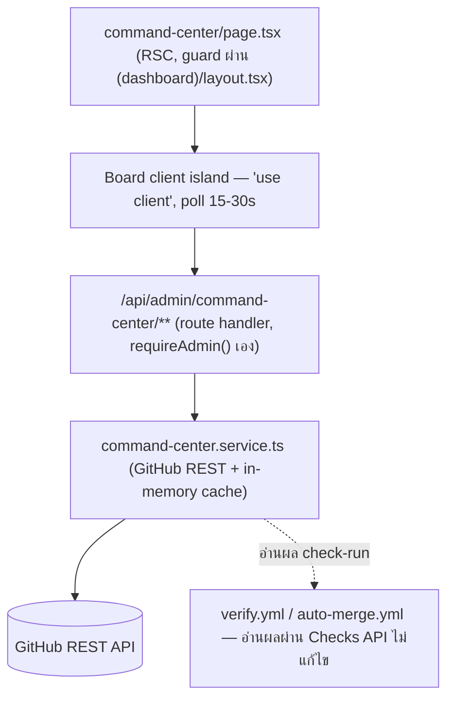
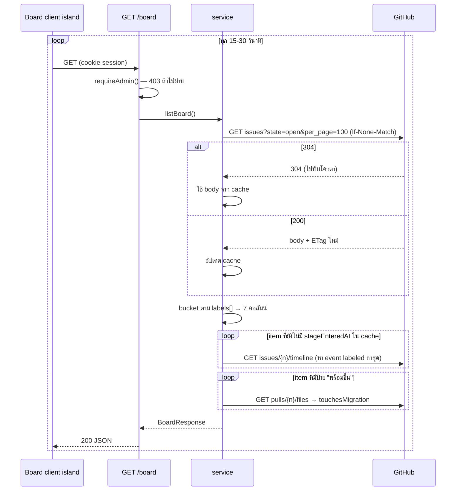
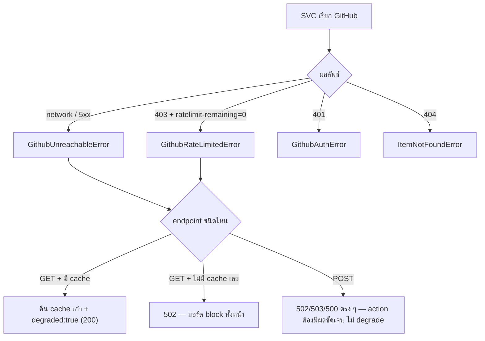

> **โมดูล:** 00049 - AI Command Center · **เวอร์ชัน:** 1.0 · **วันที่:** 2026-08-16
> **สถานะ:** Draft — รอ user review (HR11) · **เจ้าของ:** `safepay-planner`

# SDS: AI Command Center

---

## 1. บทนำ

ออกแบบ **implement จริง** ของ P4 (Command Center page + API) และส่วนที่เหลือของ P5
สำหรับ P1–P3 (มีโค้ดแล้ว / เป็น process ไม่ใช่โค้ด) เอกสารนี้อธิบาย**สิ่งที่มีอยู่จริง** ไม่ออกแบบซ้ำ

**นอกขอบเขต:** UI ระดับ markup/pixel (→ [[UX-Design-Spec]] — ไม่ออกแบบ layout ซ้ำ) ·
prompt ของ `.claude/agents/*` (P3)

---

## 2. สถาปัตยกรรม

เข้ากับ convention เดิมของ `(paces)/admin/**` ทุกประการ: RSC เปลือกบาง + client island poll +
API route บาง + service layer เดียวที่คุยกับระบบภายนอก (mirror `topup.service.ts`)
**ไม่มี state ฝั่งเรา** — service เป็น pass-through ไป GitHub เสมอ + in-memory cache เพื่อประหยัดโควตา
(ไม่ใช่ source of truth)

**Deploy:** ไม่มี infra ใหม่ — เพิ่ม env var 2 ตัวบน Vercel เท่านั้น

---

## 3. Component Design

| Component | หน้าที่ | หมายเหตุ |
|---|---|---|
| `command-center/page.tsx` | RSC เปลือก — **ไม่ fetch เอง** ปล่อยให้ client island poll | กันไม่ให้มี 2 แหล่งความจริงตอน hydrate |
| `CommandCenterBoard.tsx` (client) | poll `board`+`heartbeat` · render 7 คอลัมน์ + แถบสถานะ · ยิง action | **ไม่ import service ตรง** — client ไม่มีสิทธิ์เห็น token |
| `command-center.service.ts` | ผูก GitHub REST เป็นสัญญาเดียว · cache · โยน custom error | `fetch()` ตรง (TD-001) |
| API route × 6 | `requireAdmin()` → validate (Valibot) → service → map error → JSON | TD-005 |
| `watchdog.yml` | **มีอยู่จริงแล้ว** — อ่าน `HERMES_HEARTBEAT` · เปิด/ปิด issue | ไม่พึ่งโค้ดฝั่งเรา |

---

## 4. Data Flow

### 4.1 โหลดบอร์ด (poll)

### 4.2 กรณีล้มเหลว

---

## 5. Integration Points

| จุดเชื่อม | Protocol | ความเสี่ยงเมื่อล่ม |
|---|---|---|
| GitHub REST API | HTTPS `fetch()` + PAT ใน `Authorization: Bearer` | quota หมด → degraded (GET) / hard error (POST) |
| GitHub Checks API | ส่วนหนึ่งของ REST เดียวกัน | ใช้แค่แสดงผลบนการ์ด — **`auto-merge.yml` เป็นตัวตัดสินจริง ไม่ใช่จอ** |
| `requireAdmin()` | function call ตรง | session หมดอายุระหว่าง poll → 403 → client ต้องแยกจาก error GitHub |

- **Timeout:** `AbortSignal.timeout(10_000)` — **ไม่ retry อัตโนมัติฝั่ง server** (client poll รอบถัดไป
  ทุก 15–30 วิ ทำหน้าที่นี้อยู่แล้ว)
- **Idempotency:** POST ทุกตัวเรียกซ้ำได้ปลอดภัย — label operation บน GitHub idempotent โดยธรรมชาติ

---

## 6. Technical Decisions

### TD-001 ใช้ `fetch()` ตรง ไม่ใช้ `@octokit/rest`
**เหตุผล:** ต้องการแค่ ~8 endpoint — เขียนเองได้ใน ~150 บรรทัด ไม่ต้องแบก dependency ใหม่
และ workflow (`auto-merge.yml`) เองก็ใช้ `gh api` ดิบ ไม่ใช่ SDK — รูปแบบเดียวกันทั้งระบบ
**ตัดทิ้ง:** `@octokit/rest` (เกินจำเป็น เพิ่ม cold-start) · GraphQL (REST พอ และโปรเจกต์ไม่มี GraphQL client)
**ผลกระทบ:** ต้องเขียน error-mapping เอง (→ [[API]] §5)

### TD-002 🛑 ป้าย `stage:*` ย้ายจาก Issue ไป PR เมื่อเข้าขั้นเขียน
**ตัดสินใจ:** ใบงานเริ่มเป็น Issue (`stage:plan`→`stage:ux`) · เมื่อ developer เปิด PR (ขั้น ③)
ให้**ลบ `stage:*` จาก issue** แล้ว**เพิ่ม `stage:build` ที่ PR** (ผูกกันด้วย "Closes #NN" ใน PR body)

**เหตุผล — หลักฐานจากโค้ดจริง:** `auto-merge.yml` อ่านป้าย `พร้อมขึ้น` จาก **PR เท่านั้น**
(`gh pr list --json labels`) ไม่เคยอ่านจาก issue เลย ⇒ ให้ป้ายอยู่กับ artifact จริงของขั้นนั้น
(issue ตอนยังไม่มีโค้ด · PR ตอนมีโค้ดแล้ว) สอดคล้องกับโค้ดที่มีอยู่มากที่สุด และไม่ต้องเก็บ mapping แยก

**ตัดทิ้ง:** เก็บป้ายที่ issue ตลอด (ต้องแก้ `auto-merge.yml` ซึ่งเป็น path คุ้มครอง — เสี่ยงกว่า) ·
เก็บทั้ง 2 ที่ (เสี่ยง drift แบบ HR16)

✅ **P3 ยืนยันตามนี้แล้ว (2026-08-16)** — `command-center-agent-protocol.md` §4 บังคับตรงตาม TD-002
และ prompt ของ `safepay-developer` สั่งให้ PR body มี `Closes #NN` (ผูกด้วยเทส `[blocker]`)
⇒ R-2 ปิดในส่วนของ *ดีไซน์* แล้ว **แต่ยังไม่เคยเดินจริงสักใบ** (SRS §9 ข้อ 7)

### TD-003 cache in-memory — ไม่ผิด D-8
**ตัดสินใจ:** `Map` ระดับ module เก็บ (1) `stageEnteredAt` คีย์ `${number}:${stageLabel}` — คงที่จนกว่า
label เปลี่ยน (2) `touchesMigration` คีย์ `${number}:${updatedAt}` — invalidate เองเมื่อ PR อัปเดต
(3) ETag+body ของ list call

**เหตุผล:** D-8 ห้าม "จอเก็บ state ที่แข่งกับ GitHub เป็นความจริง" — แต่ cache ที่ **derive ซ้ำได้เสมอ +
หายแล้วไม่กระทบความถูกต้อง (แค่ช้าลงตอน cold start)** ไม่ใช่สิ่งที่ D-8 ห้าม (D-8 กังวลเรื่อง
Prisma table ที่กลายเป็นความจริงคู่ขนานถาวร)
**ตัดทิ้ง:** ไม่ cache เลย (คูณ N เท่าของ GitHub call ต่อ poll โดยไม่จำเป็น) · เก็บใน Prisma
(**ปฏิเสธเด็ดขาด** — ขัด D-8/BR-CC-08 ตรง ๆ)

### TD-004 label `hermes:offline` สำหรับ watchdog issue
**ตัดสินใจ:** ใช้ label ตายตัวให้ `watchdog.yml` (ฝั่งเขียน) และ `GET /heartbeat` (ฝั่งอ่าน) หากันเจอแน่นอน
**เหตุผล:** BRD/PRD ไม่เคยตั้งชื่อ label นี้ — ต้องมีชื่อตายตัว ไม่ใช่ค้นด้วย title string
(เปราะบาง — user แก้หัวข้อ issue แล้วหาไม่เจอ)
⚠️ **`watchdog.yml` ปัจจุบันยังค้นด้วย title** — ต้องเปลี่ยนมาใช้ label นี้ตอน P5 (งานค้าง)
**ผลกระทบ:** ต้องเพิ่มใน PRD §10.2 checklist (SRS §9 ข้อ 4)

### TD-006 🛑 คอลัมน์ `ready` = `stage:ready` ∪ `พร้อมขึ้น` (D-10 · P3)
**ตัดสินใจ:** bucket ของคอลัมน์ที่ 7 รับ **2 ป้าย** · `awaitingApproval` แยกใบที่ยังไม่ถูกเคาะออกมา
ให้ UI ผูกปุ่ม "เคาะ" กับใบกลุ่มนั้นเท่านั้น

**เหตุผล:** state machine เขียนว่า `docs --> ready` แต่ `พร้อมขึ้น` ติดได้เฉพาะ user (TFR-CC-11)
⇒ ต้องมีป้ายที่ *Controller ติดได้* แทนสถานะ "จบสายพานแล้ว รอกด" ไม่งั้นใบที่จบขั้น docs หายจากบอร์ด
รายละเอียดเต็ม → [[SRS]] §1.4

**ตัดทิ้ง:** ให้ agent ติด `พร้อมขึ้น` เอง (**ปฏิเสธเด็ดขาด** — ลบประตูอนุมัติเดียวของระบบทิ้ง ขัด D-1) ·
ให้ docs คงป้าย `stage:docs` ไว้ (แยก "กำลังทำ" กับ "ทำเสร็จ" ไม่ออก) · ปล่อยให้หายจากบอร์ด (งานที่หาย
จากบอร์ดคืองานที่ไม่มีใครรู้ว่ายังไม่เสร็จ)

**ผลกระทบ:** ต้องสร้าง label `stage:ready` บน GitHub · [[UX-Design-Spec]] §3 ต้องแยก 2 สถานะให้เห็นด้วยตา

### TD-005 🛑 API route ทุกตัวเรียก `requireAdmin()` เอง
**เหตุผล:** `(dashboard)/layout.tsx` เป็น RSC layout ที่ครอบเฉพาะ **page** — API route handler เป็น
**คนละ request pipeline ไม่ผ่าน layout tree เลย** ถ้าไม่เช็คเองจะเป็นช่องโหว่ที่ user ที่ล็อกอินแต่ไม่ใช่
admin เรียก API ตรงได้ด้วย curl — mirror `topups/[id]/approve/route.ts` ที่ทำแบบนี้อยู่แล้วทุก
`/api/admin/*` route ในโปรเจกต์
**ตัดทิ้ง:** middleware กลางใน `proxy.ts` (เปลี่ยนพฤติกรรม 12 route ที่มีอยู่โดยไม่จำเป็น + ขัด convention เดิม)

---

## 7. Traceability

| SRS | SDS Element |
|---|---|
| TFR-CC-13 (board) | §4.1, TD-001/002/003 |
| TFR-CC-09 (migration gate ฝั่งจอ) | §4.1 `touchesMigration`, TD-003 |
| TFR-CC-01/05/11/12 | API route × 4, TD-005 |
| TFR-CC-14 | TD-004 + `watchdog.yml` (มีแล้ว) |
| NFR rate limit | §4.1 ETag/cache, §5 timeout |
| NFR admin gate | TD-005 |

---

## 8. สรุป + ลำดับการ build

**P4 sub-task ที่แนะนำ:**
1. **P4.1** `command-center.service.ts` — GitHub client + cache + custom error types (ทดสอบแยกได้ไม่ต้องมี UI)
2. **P4.2** API route × 6 — เขียนคู่กับ P4.1 ทีละ endpoint ยืนยันตาม [[API]]
3. **P4.3** UI ตาม [[UX-Design-Spec]] — 🛑 **ต้องผ่าน `safepay-ux` gate ก่อนเขียน (HR8 ไม่มีข้อยกเว้น)**
4. **P4.4** `_admin-menu.ts` เพิ่มกลุ่ม "ระบบ" + wiring `page.tsx`
5. **P4.5** QA: verify TD-002 กับ P3 จริง — ถ้า P3 ยังไม่เสร็จ ให้จำลอง (สร้าง PR + ติดป้ายมือ)

**Open Questions:**
- ship `heartbeat` เป็น placeholder ใน P4 หรือรอ P5 — กระทบ P4.3 (การ์ดชีพจรจะว่างเปล่า)
- ลำดับ P3 → P4 หรือกลับกัน — แนะนำ P3 ก่อน เพื่อให้ TD-002 อิงพฤติกรรมจริงแทนสมมติฐาน
- `watchdog.yml` ต้องเปลี่ยนจากค้นด้วย title มาใช้ label `hermes:offline` (TD-004)
