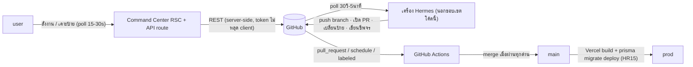
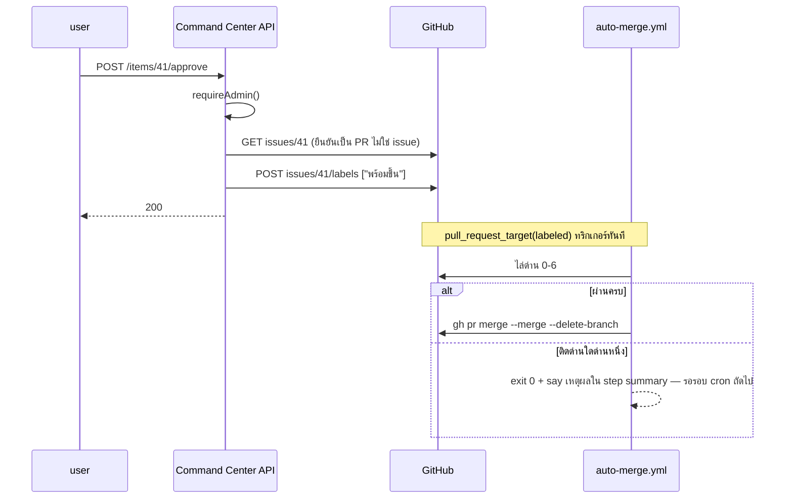
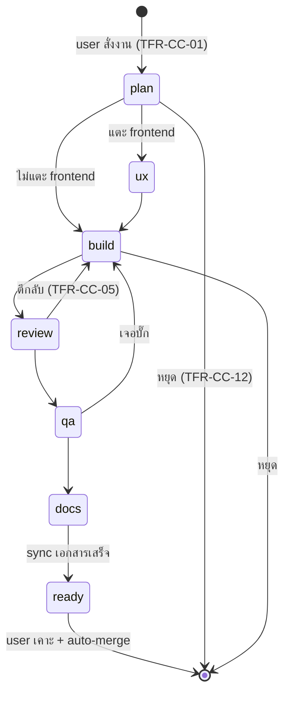

> **โมดูล:** 00049 - AI Command Center · **เวอร์ชัน:** 1.0 · **วันที่:** 2026-08-16
> **สถานะ:** Draft — รอ user review (HR11) · **เจ้าของ:** `safepay-planner`
> **อ้างอิงดีไซน์:** `docs/superpowers/specs/2026-08-16-ai-command-center-design.md` — ห้ามเปลี่ยนมติ D-1..D-9

# SRS: AI Command Center

---

## 1. บทนำ

### 1.1 วัตถุประสงค์
ขยาย FR-CC-01..14 ของ [[BRD]] เป็นสเปกเชิงเทคนิคที่ implement ได้ตรง + state machine ของป้าย +
NFR + หัวข้อบังคับ **"สิ่งที่ยังพิสูจน์ไม่ได้"** (§9) ที่แยกชัดระหว่างสิ่งที่ยืนยันจากโค้ดจริง กับสิ่งที่ยังเป็นสมมติฐาน

### 1.2 ขอบเขต

**อยู่ในขอบเขต:** หน้า `admin.deepthailand.app/command-center` · API route ใต้
`/api/admin/command-center/*` · workflow `verify.yml`/`auto-merge.yml`/`watchdog.yml`

**นอกขอบเขต:** prompt ของ `.claude/agents/*` (P3) · กลไก dispatch งานเข้า Hermes แบบ headless
(R-7 ต้อง spike) · schema Prisma (**ไม่มีการเปลี่ยนแปลง** — D-8)

### 1.3 นิยาม

| คำ | ความหมาย |
|---|---|
| **ใบงาน** | GitHub Issue ที่เกิดจาก "สั่งงานใหม่" — มีป้าย `stage:*` เสมอ |
| **stage label** | `stage:plan` `stage:ux` `stage:build` `stage:review` `stage:qa` `stage:docs` |
| **ready label** | `พร้อมขึ้น` (ยึดตาม `auto-merge.yml` `LABEL: พร้อมขึ้น`) |
| **override label** | `แตะด่าน` — ให้คนที่มีสิทธิ์เขียนรีโป bypass ด่าน 0 ของ `verify.yml` |
| **watchdog label** | `hermes:offline` — ป้ายที่ `watchdog.yml` ใช้หา issue แจ้งเตือนใบเดิม (ดู SDS TD-004) |
| **fail-closed** | อ่านค่าที่จำเป็นไม่ได้ = ถือว่า "ไม่ผ่าน/ไม่ทำ" เสมอ |
| **degraded mode** | endpoint อ่านคืน cache เก่าพร้อม `degraded:true` แทน error เต็ม เมื่อโควตา GitHub หมด |

---

## 2. สถาปัตยกรรม

| Component | สถานะ ณ 2026-08-16 |
|---|---|
| `verify.yml` (ด่าน 0–4) | **มีอยู่จริง รันจริง เขียวครบ** |
| `auto-merge.yml` (ด่าน 0–6) | **มีอยู่จริง** — merge จริงยังไม่เคยเกิด (§9) |
| `watchdog.yml` | **มีอยู่จริง** — ยังไม่เคยมีชีพจรจริงเข้ามา (§9) |
| `.claude/agents/*` 6 ตัว | มีอยู่แล้ว — **ยังไม่รู้จักโปรโตคอลของฟีเจอร์นี้** (P3) |
| Command Center page + API | **ยังไม่มีไฟล์** (P4) |

⚠️ **cache เป็น per-instance บน Vercel serverless** — ไม่การันตี hit ข้าม instance (คลาสเดียวกับ
known-gap ของ `api-rate-limit.ts` ที่บันทึกไว้แล้วในโปรเจกต์) กระทบความเร็ว ไม่กระทบความถูกต้อง

---

## 3. Technical Functional Requirements

### TFR-CC-01 สร้างใบงานใหม่ → FR-CC-01
`POST /tasks` → `requireAdmin()` → Valibot (`title` 1–200, `description` 1–5000) → `POST /repos/{o}/{r}/issues`
**ครั้งเดียว**พร้อม `labels:["stage:plan"]` (GitHub รับ labels ในคำขอสร้างได้เลย ไม่ต้องแยก 2 call)
· validation ล้ม → 422 **ก่อนแตะ GitHub** · GitHub non-2xx → 502 · **ไม่ retry อัตโนมัติ**
(การสั่งซ้ำเป็นการตัดสินใจของ user ไม่ใช่ของระบบ)

### TFR-CC-02 งานมาจาก user สั่งเท่านั้น → FR-CC-02
🛑 **negative requirement ที่ยืนยันด้วย *การไม่มีโค้ด* ไม่ใช่ด้วยโค้ดที่ห้าม** — ไม่มี schedule ใดใน
`.github/workflows/` ที่สร้าง issue (ยืนยันแล้ว: `verify.yml` = `pull_request`/`dispatch` ·
`auto-merge.yml` = `schedule`/`labeled`/`dispatch` (merge เท่านั้น) · `watchdog.yml` = `schedule`
(เปิด issue แจ้งเตือน**เครื่องตาย** ไม่ใช่ใบงาน))
⇒ reviewer ของทุก PR ที่แตะ `.github/workflows/**` ต้องเช็คซ้ำ — path คุ้มครอง (BR-CC-05) ช่วยชั้นหนึ่ง

### TFR-CC-03 รูปแบบ comment ส่งต่อ → FR-CC-03
🛑 นี่คือ**ข้อตกลงระหว่าง subagent** (P3 — prompt ของ agent) **ไม่ใช่โค้ดที่ Command Center บังคับได้**
เพราะ Hermes รัน subagent เอง service ของเราไม่ได้อยู่ในเส้นทางที่เขียน comment นั้น
บอร์ด**ไม่ parse เนื้อ comment** — สิ่งเดียวที่โค้ดเราพึ่งคือหา `stageEnteredAt` (TFR-CC-13)

### TFR-CC-04 ข้ามขั้น UX เมื่อไม่แตะ frontend → FR-CC-04
ตัดสินโดย `safepay-planner` ตอนเขียน comment ขั้น ① (P3) — Command Center **ไม่ตรวจ path เอง**
🛑 **Edge case:** ถ้า planner ตัดสินผิด (ข้ามขั้น UX ทั้งที่แตะ `(paces)/**`) — HR8 **ยังไม่มีด่าน
อัตโนมัติบังคับ** ในเฟสนี้ เป็นความเสี่ยงที่รับไว้ (§8 R-3)

### TFR-CC-05 ตีกลับพร้อมเหตุผล → FR-CC-05
`POST /items/{n}/reject` → validate `reason` (1–2000, ห้ามว่าง) → (1) `GET issues/{n}` อ่าน label
**สดจริง** (🛑 ห้ามเชื่อ label ที่ client ส่งมา — คลาสเดียวกับที่ `verify.yml` คอมเมนต์ไว้ว่าห้ามเชื่อ
event payload) (2) กรอง `stage:*` ออกทั้งหมด (3) เพิ่ม `stage:build` (4) โพสต์ comment
· ต้องโพสต์ comment สำเร็จก่อนตอบ 200 · เรียกกับใบที่ไม่มี `stage:*` แล้ว → ยัง apply ได้ ไม่ error
(fail-open เฉพาะจุดนี้ เพราะผลลัพธ์ปลอดภัยกว่าการปฏิเสธ)

### TFR-CC-06 agent เปิด PR ได้อย่างเดียว → FR-CC-06 / BR-CC-01
🛑 **บังคับด้วยการตั้งค่านอกโค้ดทั้งหมด** — branch protection · PAT ของ Hermes ไม่มีสิทธิ์ `workflows`
· `CODEOWNERS` · **ไม่มีโค้ดในรีโปนี้ที่พิสูจน์ข้อนี้ได้** สิ่งที่โค้ดทำได้คือด่าน 0 ของ `verify.yml`
(กันไม่ให้ PR แก้ตัวด่านเอง) ซึ่งเป็นเพียง*ส่วนหนึ่ง* ของ BR-CC-01 ไม่ใช่ทั้งหมด
⇒ ต้อง manual-verify บน GitHub Settings (§9 ข้อ 6)

### TFR-CC-07 🛑 `verify.yml` บล็อกเต็มตัว → FR-CC-07 / BR-CC-03
**ยืนยันจากโค้ดจริง:**

| ด่าน | job | บังคับด้วย | บล็อกจริง |
|---|---|---|---|
| 0 path คุ้มครอง | `protected-paths` | diff เทียบ `^(\.github/workflows/\|\.claude/hooks/)` + ไฟล์เทสที่มี `[blocker]` | ✅ `exit 1` เว้นแต่มีป้าย `แตะด่าน` (**อ่านสดจาก API ไม่ใช่ event payload**) |
| 1 type error | `typecheck` | `npm run build` (= `next build`) | ✅ 🛑 **ห้ามกลับไปใช้ `tsc --noEmit` เปล่า** — `next-env.d.ts` ถูก gitignore ⇒ CI แดง `Cannot find module '@/assets/images/*.svg'` เป็นสิบตัวทั้งที่โค้ดถูก (พิสูจน์แล้ว PR #5 รอบแรก) |
| 2 unit | `unit` | `npx vitest run src/` | ✅ 2,945/2,945 · ไม่มีลิสต์ยกเว้น แดง 1 ตัวก็ตก |
| 3 theme | `theme` | `theme-guard.sh` ต่อไฟล์ที่ diff แตะ ผ่าน stdin JSON | ✅ |
| 4 integration | `integration` | `npx vitest run tests/` บน `postgres:16` service | ✅ 126/126 |

**ไม่มี advisory / ไม่มี baseline / ไม่มีลิสต์ยกเว้นในด่านใดเลย**

### TFR-CC-08 🛑 `auto-merge.yml` → FR-CC-08 / BR-CC-06/07
**ยืนยันจากโค้ดจริง:**

| ด่าน | ตรรกะ |
|---|---|
| 0 หน้าต่างเวลา | `TZ=Asia/Bangkok date +%-H` ต้องอยู่ `[8,22)` — เช็คซ้ำในสคริปต์เพราะ `labeled`/`dispatch` ไม่ผูกกับ cron |
| 1 หาป้าย | 🛑 กรองด้วย `jq` จาก `.labels` เอง **ไม่ใช้ `--label` flag** (ต้นแบบพิสูจน์แล้วว่าคืนใบไม่มีป้ายด้วย) |
| 2 main สงบ | `AGE_MIN >= QUIET_MIN (8)` |
| 3 main ไม่แดง | ผูกกับ `head_sha` ของ main ปัจจุบัน · 🛑 **โค้ดยอมรับเองว่า `verify.yml` ไม่ทริกเกอร์ตอน push main ⇒ ด่านนี้ได้ `none` เสมอในทางปฏิบัติ = ผ่านเพราะไม่มีอะไรให้ตรวจ ไม่ใช่ผ่านเพราะตรวจแล้วเขียว** |
| 4 CI ของ PR | วน `bucket` ทุกตัว ยกเว้น job ของตัวเอง (query ชื่อสด ไม่ hardcode) · `pending` → รอรอบหน้า |
| 5 🛑 migration | `gh pr view --json files` grep `^prisma/migrations/` — เจอ = **ไม่ merge เด็ดขาด** |
| 6 ป้ายซ้ำ | เช็ค `พร้อมขึ้น` อีกครั้งก่อน merge จริง |
| MERGE | `--merge --delete-branch` (merge commit ไม่ใช่ squash — กัน PR ที่ stack กำพร้า) |

**fail-open จุดเดียวโดยตั้งใจ:** การอ่านชื่อ job ตัวเอง — อ่านไม่ได้ = ไม่ข้ามอะไรเลย = ช้าลง ไม่ใช่หลุด

**`QUIET_MIN=8`** มาจากวัด `next build` บน runner (2 นาที 39 วิ) **ไม่ใช่ merge→live จริงบน Vercel** (§9 ข้อ 3)

### TFR-CC-09 🛑 PR แตะ migration ห้าม auto-merge → FR-CC-09 / BR-CC-04
ดู TFR-CC-08 ด่าน 5
**ฝั่งจอ (P4):** board endpoint คำนวณ `touchesMigration` เฉพาะ item ที่มีป้าย `พร้อมขึ้น` (ประหยัดโควตา)
🛑 **ต้องใช้ regex เดียวกันเป๊ะกับ `auto-merge.yml`** (`^prisma/migrations/`) ไม่งั้นจอกับด่านไม่ตรงกัน (HR16)

### TFR-CC-10 🛑 PR ห้ามแตะ path คุ้มครอง → FR-CC-10 / BR-CC-05
ด่าน 0 ของ `verify.yml` + `CODEOWNERS` (มีไฟล์แล้ว — **แต่มีผลจริงต่อเมื่อเปิด branch protection
พร้อมติ๊ก "Require review from Code Owners"**)
🛑 **ช่องโหว่ที่รับไว้:** ป้าย `แตะด่าน` ให้**ใครก็ตามที่มีสิทธิ์เขียนรีโป**ติดได้ ไม่ผูกกับ identity ของ user
โดยตรง — ตอนนี้มี user คนเดียวจึงเทียบเท่ากัน **ต้องทบทวนก่อนเพิ่ม collaborator** (§8 R-8)

### TFR-CC-11 🛑 ป้าย `พร้อมขึ้น` = ประตูอนุมัติเดียว → FR-CC-11 / BR-CC-06
2 ชั้น: (1) ไม่มี token ของ agent ใดมีสิทธิ์ติดป้ายนี้ (ยืนยันตอนออก PAT — นอกโค้ด)
(2) `POST /approve` เรียกได้เฉพาะ `requireAdmin()`
⇒ ป้ายนี้ปรากฏได้ 2 ทางเท่านั้น: ปุ่มบนจอ หรือ user ติดตรงบน GitHub

### TFR-CC-12 ตีกลับ/หยุดจากจอ → FR-CC-12
"หยุด" = `POST /stop` → `GET` label สด → **ลบทุกป้ายที่ขึ้นต้น `stage:`** (ไม่เพิ่มป้ายใหม่ ไม่โพสต์ comment)
· เรียกซ้ำ = idempotent success ไม่ error

### TFR-CC-13 บอร์ดอ่านจาก GitHub ตรง → FR-CC-13
`GET /board`:
1. `GET /repos/{o}/{r}/issues?state=open&per_page=100` (**endpoint นี้คืนทั้ง issue และ PR** — แยกด้วย
   field `.pull_request`) พร้อม `If-None-Match`
2. 304 → ใช้ body ที่ cache (ไม่นับโควตา — §9 ข้อ 5)
3. bucket ตาม `.labels[].name` — item ที่ไม่มี `stage:*`/`พร้อมขึ้น` เลย = **ไม่แสดงบนบอร์ด**
4. `stageEnteredAt` จาก Timeline API + cache (SDS TD-003)
5. `touchesMigration` เฉพาะ item ป้าย `พร้อมขึ้น`

**Postcondition:** ไม่มี state ใด persist ในฐานของเรา (D-8) — cache ทั้งหมด in-memory, derive ซ้ำได้เสมอ,
หายแล้วไม่กระทบความถูกต้อง (กระทบแค่ความเร็วรอบแรกหลัง cold start)

### TFR-CC-14 🛑 แจ้งเตือนเมื่อ Hermes ขาดชีพจร → FR-CC-14
**ฝั่ง `watchdog.yml` มีอยู่จริงแล้ว** (cron 30 นาที · 4 กิ่ง: ไม่เคยมีชีพจร / ค่าไม่ใช่ตัวเลข (fail-closed) /
สด (ปิด issue ที่ค้าง) / เก่ากว่า 2 ชม. (เปิด-อัปเดต issue))
🛑 **กิ่ง "ยังไม่เคยมีชีพจร" ไม่เปิด issue โดยตั้งใจ** — "ยังไม่เคยมี" ต่างจาก "เคยมีแล้วหาย"
การเตือนเรื่องที่ยังไม่เริ่มทำ = สัญญาณเฟ้อที่ทำให้คนเลิกสนใจสัญญาณจริง
**ฝั่งเครื่อง Hermes เขียนชีพจร: ยังไม่มี** (P5 — พึ่ง R-7)
**ฝั่ง endpoint `GET /heartbeat` (P4):** คืน**ทั้งค่าดิบและสถานะ issue ใน response เดียว**
(มติ Controller §9.5 ของ UX Spec — หมายถึง client เห็น 1 endpoint ไม่ใช่ห้าม service ยิง GitHub 2 ครั้ง)

---

## 4. ส่วนต่อประสาน

| Method | Path | TFR | Auth |
|---|---|---|---|
| GET | `/api/admin/command-center/board` | TFR-CC-13 | `requireAdmin()` |
| GET | `/api/admin/command-center/heartbeat` | TFR-CC-14 | `requireAdmin()` |
| POST | `/api/admin/command-center/tasks` | TFR-CC-01 | `requireAdmin()` |
| POST | `/api/admin/command-center/items/{n}/approve` | TFR-CC-11 | `requireAdmin()` |
| POST | `/api/admin/command-center/items/{n}/reject` | TFR-CC-05 | `requireAdmin()` |
| POST | `/api/admin/command-center/items/{n}/stop` | TFR-CC-12 | `requireAdmin()` |

สัญญาเต็ม → [[API]]

### 4.1 Flow "เคาะพร้อมขึ้น" จนถึง merge

### 4.2 State machine ของป้าย

---

## 5. ข้อกำหนดด้านข้อมูล

🛑 **ไม่มี Prisma model ใหม่ ไม่มี migration ทั้งฟีเจอร์** (D-8, BR-CC-08) — รายละเอียดเต็มใน [[DATABASE]]

| "Entity" (ฝั่ง GitHub) | เก็บอะไร |
|---|---|
| Issue / Pull Request | ใบงาน |
| Label | `stage:*` (routing) · `พร้อมขึ้น` (อนุมัติ) · `แตะด่าน` (override) · `hermes:offline` (watchdog) |
| Comment | payload ที่ agent ส่งต่อกัน — จอไม่ parse |
| Repository Variable `HERMES_HEARTBEAT` | unix timestamp ล่าสุดที่เครื่อง Hermes เขียน |
| Check Run | ผลด่านของ PR แต่ละใบ |

**ข้อยกเว้นเดียว:** Postgres service container ใน `verify.yml` ด่าน 4 — container ชั่วคราวต่อ 1 run
ไม่ใช่ persisted state ไม่แตะฐาน prod/dev จริง

---

## 6. NFR

| ด้าน | ข้อกำหนด | เป้าที่วัดได้ |
|---|---|---|
| **Rate limit** | poll 15–30 วิ ต้องไม่ชน quota 5,000/ชม. | 1 tab worst case = 480 req/ชม. (board+heartbeat) · 10 tab = 4,800 ยังใต้เพดาน · ETag ลดที่นับจริงลงอีก |
| **Search API** | 🛑 **ห้ามใช้ `search/issues` ต่อ stage label** — เพดานแยก 30 req/นาที ต่ำกว่ามาก จะชนก่อน core quota | ใช้ `GET issues?state=open` ครั้งเดียวต่อ poll แล้ว bucket เอง |
| **Availability** | จอเป็น "read replica" ของ GitHub เสมอ | ปิดจอได้โดยงานยังเดินต่อผ่าน GitHub ตรง |
| **Security — token** | `COMMAND_CENTER_GITHUB_TOKEN` ฝั่ง server เท่านั้น | grep ทั้งโฟลเดอร์ command-center ต้องไม่พบชื่อ env นี้นอก route handler/service |
| **Security — CSRF/RL** | inherit จาก `guardApi` (`src/proxy.ts`) อัตโนมัติ | POST 30/นาที · GET 120/นาที — **ไม่ต้องเขียนโค้ดเพิ่ม** |
| **Security — admin** | ทุก route เรียก `requireAdmin()` **เอง** | 🛑 layout guard ครอบเฉพาะ RSC page **ไม่ครอบ API route** (SDS TD-005) |
| **Observability** | ทุก error จาก GitHub log `console.error` พร้อม endpoint+status | ห้าม log token/PII |

---

## 7. ข้อจำกัดและการพึ่งพา

- ใช้ `fetch()` ตรงไป `api.github.com` — **ไม่เพิ่ม GitHub SDK** (SDS TD-001)
- token PAT ต้อง fine-grained และ**ห้ามมีสิทธิ์ `workflows`**
- พึ่ง GitHub REST API (external) · เครื่อง Hermes (external, นอกขอบเขตโค้ด) ·
  `requireAdmin()` (internal — ถ้าถูกแก้ความหมาย กระทบทุก route ทันที)

---

## 8. ความเสี่ยงเชิงสถาปัตยกรรม

| # | ความเสี่ยง | แนวทางลด |
|---|---|---|
| R-2 | ป้าย `stage:*` ย้าย issue→PR (SDS TD-002) เป็นดีไซน์ใหม่ที่ยังไม่ทดสอบกับ agent จริง | ทำ P3 ก่อน แล้วเขียน P4 ตาม**พฤติกรรมจริง** ไม่ใช่ตามสมมติฐาน |
| R-3 | HR8 (ux gate) ยังไม่มีด่านอัตโนมัติบังคับในสายงาน | รับไว้ — QA เป็นตัวจับ |
| R-5 | merge = migration บน prod | ด่าน 5 ของ `auto-merge.yml` — **implement แล้ว** |
| R-7 | ยังไม่รู้วิธี dispatch งานเข้า Hermes headless | spike ก่อน P5 |
| R-8 | ป้าย `แตะด่าน` ผูกกับ "สิทธิ์เขียนรีโป" ไม่ใช่ "เป็น user" | รับไว้ (มี user คนเดียว) — ทบทวนก่อนเพิ่ม collaborator |
| R-9 | cache per-instance บน Vercel | กระทบความเร็ว ไม่กระทบความถูกต้อง — ยอมรับ (YAGNI) |
| R-10 | ด่าน 3 ของ `auto-merge.yml` ได้ `none` เสมอ (ไม่มี CI บน main) | รับไว้ — ด่านนี้ยังไม่ได้ทำงานจริง แต่เก็บไว้ให้ทำงานเองทันทีที่มีคนเปิด CI บน main |

---

## 9. 🛑 สิ่งที่ยังพิสูจน์ไม่ได้

1. **`auto-merge.yml` ยังไม่เคย merge จริงสักใบ** — KPI "PR ที่เดินครบ 6 ขั้น" ยังไม่เกิดขึ้นจริง
2. **`watchdog.yml` ยังไม่เคยมีชีพจรจริงเข้ามา** — ทดสอบได้แค่ตรรกะท้องถิ่น 4 กิ่ง (P5 ยังไม่เริ่ม)
3. **`QUIET_MIN=8`** มาจาก `next build` บน runner **ไม่ใช่** merge→live จริงบน Vercel (ที่รวม
   `prisma migrate deploy` + `generate` + build + deploy propagation) — ต้องวัดใหม่หลัง auto-merge ใบแรก
4. **ป้าย `แตะด่าน` และ `hermes:offline` ไม่เคยอยู่ใน PRD §10.2 checklist** — ป้ายทั้งสองสร้างแล้วบน
   GitHub แต่ PRD ยังระบุแค่ 7 ป้าย ต้อง sync
5. **GitHub REST behavior ที่ SDS อ้างแต่ยังไม่เคยยิงจริงจากโค้ดนี้** (ต้อง spike ตอนเริ่ม P4):
   `GET issues` คืน PR ปนจริงไหม + `.pull_request` แยกได้จริงไหม · Timeline API คืน `labeled` พร้อม
   timestamp โดยไม่ต้องมี preview header ไหม · `If-None-Match`→304 ไม่นับโควตาจริงไหม ·
   fine-grained PAT scope ที่พอสำหรับอ่าน repository variable
6. **TFR-CC-06 พิสูจน์จากโค้ดในรีโปนี้ไม่ได้เลย** — เป็นการตั้งค่าฝั่ง GitHub ทั้งหมด ต้อง manual-verify
7. **P3 ยังไม่เริ่ม** — `.claude/agents/*` ทั้ง 6 ตัวยังไม่รู้จักโปรโตคอล comment/label ของฟีเจอร์นี้
   (D-7 ยืนยันแค่ว่า agent มีอยู่ครบ ไม่ได้แปลว่ามันรู้จักสายงานนี้)
8. **P4 ยังไม่เริ่ม** — ไม่มี `command-center/**` และไม่มี entry ใน `_admin-menu.ts`

---

## 10. Traceability

| BRD FR | SRS TFR | Component | สถานะ |
|---|---|---|---|
| FR-CC-01 | TFR-CC-01 | API `tasks` | Draft (P4) |
| FR-CC-02 | TFR-CC-02 | — (negative req) | ✅ ยืนยันจากการไม่มีโค้ด |
| FR-CC-03/04 | TFR-CC-03/04 | `.claude/agents/*` | ยังไม่ implement (P3) |
| FR-CC-05 | TFR-CC-05 | API `reject` | Draft (P4) |
| FR-CC-06 | TFR-CC-06 | GitHub settings | ต้อง manual verify |
| FR-CC-07 | TFR-CC-07 | `verify.yml` | ✅ **Done — รันจริง เขียวครบ 5 ด่าน** |
| FR-CC-08 | TFR-CC-08 | `auto-merge.yml` | ✅ Done (merge จริงยังไม่เคยเกิด) |
| FR-CC-09 | TFR-CC-09 | `auto-merge.yml` ด่าน 5 | ✅ Done (ฝั่งด่าน) / Draft (ฝั่งจอ) |
| FR-CC-10 | TFR-CC-10 | `verify.yml` ด่าน 0 + `CODEOWNERS` | ✅ Done (รอ branch protection) |
| FR-CC-11/12/13 | TFR-CC-11/12/13 | API routes | Draft (P4) |
| FR-CC-14 | TFR-CC-14 | `watchdog.yml` + API `heartbeat` | ✅ Done (ฝั่ง watchdog) / Draft (ฝั่ง endpoint + ฝั่งเครื่อง Hermes) |

---

## 11. สรุป

แยกชัด 3 กลุ่ม: **มีอยู่จริงและรันจริงแล้ว** (`verify.yml`/`auto-merge.yml`/`watchdog.yml`/`CODEOWNERS`)
· **ดีไซน์รอ implement** (Command Center page/API — P4 · ลูปบนเครื่อง Hermes — P5)
· **พิสูจน์จากโค้ดในรีโปนี้ไม่ได้เลย** (TFR-CC-06 — การตั้งค่า GitHub ฝั่ง user)

**Open Questions:**
- sync ป้าย `แตะด่าน`/`hermes:offline` เข้า PRD §10.2 checklist
- R-2: ทำ P3 ก่อน P4 เพื่อให้ TD-002 อิงพฤติกรรมจริง
- TFR-CC-14: P4 ควร ship `heartbeat` เป็น placeholder หรือรอ P5
