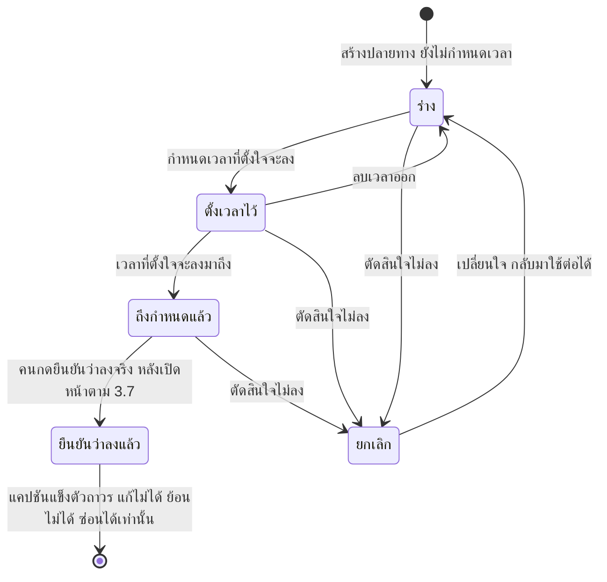
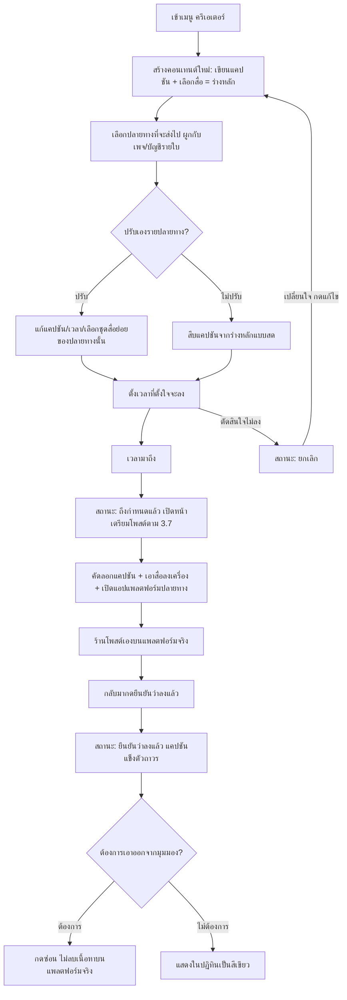

> **โมดูล:** 00049-content-desk
> **ประเภทเอกสาร:** Product Requirements Document (PRD)
> **เวอร์ชัน:** 1.2
> **วันที่จัดทำ:** 2026-08-16
> **สถานะ:** Draft — มติเนื้อหาทั้งหมด (D-1..D-18) ตัดสินแล้วจาก grilling session กับ user; รอ user รีวิวเอกสารก่อนเริ่ม BRD
> **เจ้าของเอกสาร:** BA + PO + PM (ดู [[Feature-Docs-Ownership]])

# PRD: ครีเอเตอร์ (Content Desk)

---

## Executive Summary

"ครีเอเตอร์" คือเมนูใหม่ในคอนโซลผู้ขายที่ร้านค้าทุกร้านบน Deep เห็นเหมือนกัน (ไม่ผูกกับประเภทร้าน ไม่มีสวิตช์เปิด/ปิด ฟรีตั้งแต่วันแรก) สำหรับผู้ขายที่ทำคอนเทนต์โปรโมตสินค้าของตัวเองบน Facebook และ Instagram อยู่แล้ว เครื่องมือนี้รวมคลังสื่อที่ใช้ซ้ำได้ ปฏิทินคอนเทนต์ หน้าสร้างคอนเทนต์ที่ร่าง/ตั้งเวลา/ปรับรายปลายทางได้ หน้าที่ช่วยลดขั้นตอนตอนถึงเวลาต้องไปโพสต์เองจริง และการแจ้งเตือนสรุปรายวันไว้ในที่เดียว เพื่อแก้ปัญหาที่พบบ่อยของร้านค้าที่ทำคอนเทนต์เอง คือการลงคอนเทนต์ไม่สม่ำเสมอเพราะไม่มีที่วางแผน/เก็บสื่อ/ติดตามว่าลงอะไรไปแล้วบ้าง

รอบแรกของฟีเจอร์นี้**ยังโพสต์ออกให้อัตโนมัติไม่ได้** เพราะสิทธิ์เผยแพร่โพสต์ของ Meta ต้องผ่านกระบวนการ App Review ก่อน และการเปิดสิทธิ์ที่ยังไม่ได้รับอนุมัติจะทำให้ปุ่มเชื่อมต่อเพจของร้านทุกร้านพังทันที (มีบทเรียนจากสิทธิ์ตัวอื่นมาก่อนแล้ว) ระบบจึงทำหน้าที่เป็นเครื่องมือวางแผนและลดแรงเสียดทานของการโพสต์เอง — งานที่เจ็บที่สุดของผู้ขายไม่ใช่การจำว่าต้องลง แต่คือการหาไฟล์ในเครื่อง หาแคปชันที่เขียนไว้ แล้วสลับไปมาหลายแอป เมื่อถึงเวลาที่ต้องลงจริง ระบบจึงเตรียมทุกอย่างไว้ให้พร้อมหยิบใช้ในหน้าเดียว ผู้ขายยังคงลงมือโพสต์เองบนแพลตฟอร์มจริง แล้วกลับมายืนยันในระบบว่าลงแล้ว โครงสร้างข้อมูล (คลังสื่อ, ปฏิทิน, สถานะปลายทางแยกรายเพจ) ถูกออกแบบให้ขยายเป็นการโพสต์อัตโนมัติได้ทันทีที่สิทธิ์ผ่าน โดยไม่ต้องรื้อใหม่

ฟีเจอร์นี้ไม่ใช่สัญญาณความน่าเชื่อถือ (Trust Signal) โดยตรงเหมือนฟีเจอร์อื่นของ Deep — คุณค่าของมันคือช่วยให้ร้านที่ขายของบนแพลตฟอร์มอยู่แล้วทำคอนเทนต์สม่ำเสมอขึ้น ซึ่งเชื่อมโยงไปสู่ยอดขาย/ออเดอร์ที่ป้อนกลับเข้าประวัติและ Trust Score ทางอ้อม ไม่ใช่การสร้างคะแนนความน่าเชื่อถือให้เองโดยตรง

---

## 1. Business Goals & KPIs

### 1.1 เป้าหมายทางธุรกิจ

| เป้าหมาย | รายละเอียด |
|----------|-----------|
| **ช่วยร้านที่ทำคอนเทนต์อยู่แล้วให้ทำได้สม่ำเสมอขึ้น** | ปัจจุบันร้านค้าที่โปรโมตสินค้าผ่าน Facebook/Instagram ไม่มีเครื่องมือกลางในระบบ Deep เลย — ต้องพึ่งแอปภายนอกหรือความจำล้วน ๆ ในการวางแผนว่าจะลงอะไรเมื่อไหร่ |
| **รวมศูนย์สื่อที่ใช้ซ้ำได้** | ลดเวลาค้นหาไฟล์รูป/วิดีโอเดิมที่เคยใช้โปรโมตสินค้ามาก่อน ด้วยคลังสื่อกลางต่อร้าน |
| **ลดแรงเสียดทานของขั้นตอน "โพสต์เอง" จนกว่าจะโพสต์อัตโนมัติได้** | เริ่มส่งมอบคุณค่าได้ทันทีโดยไม่ต้องรอสิทธิ์จาก Meta ผ่านก่อน (D-6) — เตรียมแคปชัน/สื่อ/ทางลัดเปิดแอปปลายทางไว้ให้ครบในหน้าเดียว แทนที่ผู้ขายต้องหาเองทีละอย่าง |
| **วางรากฐานที่ขยายเป็นการโพสต์อัตโนมัติได้โดยไม่ต้องรื้อใหม่** | เมื่อสิทธิ์ผ่าน ระบบเปลี่ยนจาก "เตรียมให้คนไปโพสต์เอง" เป็น "โพสต์ให้" โดยใช้ข้อมูลชุดเดียวกัน |
| **ไม่สร้างเครื่องมือซ้ำกับของที่มีอยู่แล้ว** | ต้องไม่สร้างนิยาม "ยังไม่ตอบ"/กล่องข้อความรวมซ้ำกับกล่องแชทที่มีอยู่แล้วในระบบ (D-4 นอกขอบเขต) — ครีเอเตอร์เป็นเครื่องมือ "เตรียมเนื้อหาก่อนลง" ไม่ใช่เครื่องมือ "ดูผลหลังลง" |

### 1.2 ตัวชี้วัดความสำเร็จ (KPIs)

ตัวชี้วัดแบ่งเป็น 2 กลุ่มที่ใช้คนละแบบ (D-17)

**กลุ่มที่ 1 — ตัวชี้วัดความถูกต้อง** ใช้เป็นด่านก่อนปล่อยได้จริงตั้งแต่วันแรก มีเป้าหมายชัดเจน ไม่ใช่ข้อเสนอ

| ตัวชี้วัด | วิธีวัด | เป้าหมาย |
|-----|----------|---------|
| **ปลายทางที่ใช้งานไม่ได้ต้องแสดงสถานะเตือน** | ตรวจอัตโนมัติ + QA checklist ก่อนทุกรอบปล่อย | 100% ไม่มีการหายเงียบ |
| **แจ้งเตือนสรุปไม่เกิน 1 ครั้ง/วัน/ร้าน** | ตรวจอัตโนมัติ | 100% ไม่มีเตือนรายชิ้น/เตือนซ้ำ |
| **คอนเทนต์ที่ยืนยันว่าลงแล้ว แก้ไขไม่ได้อีก** | QA checklist — regression ถือเป็นบั๊กร้ายแรง | 100% |
| **สีเขียวไม่ปรากฏกับสถานะอื่นนอกจาก "ยืนยันว่าลงแล้ว"** | ตรวจอัตโนมัติ + QA checklist | 100% |

**กลุ่มที่ 2 — ตัวชี้วัดการใช้งาน** เก็บตัวเลขตั้งแต่วันแรก แต่ **ตั้งใจไม่ตั้งเป้า** จนกว่าจะมี baseline จากผู้ใช้จริง

| ตัวชี้วัด | วิธีวัด | เป้าหมาย |
|-----|----------|---------|
| **อัตราการสร้างคอนเทนต์ต่อร้านที่เปิดใช้เมนู** | จำนวนคอนเทนต์ที่สร้างต่อร้านต่อสัปดาห์ ในกลุ่มร้านที่เคยเข้าเมนูนี้อย่างน้อย 1 ครั้ง | วัด baseline หลังปล่อยจริงก่อน จึงตั้งเป้า |
| **อัตรากลับมายืนยันว่าลงแล้ว** | สัดส่วนปลายทางที่ถึงกำหนดแล้วและได้รับการยืนยันว่าลงจริง — สะท้อนว่าร้านใช้ครบวงจร ไม่ใช่ตั้งเวลาแล้วทิ้ง | วัด baseline หลังปล่อยจริงก่อน จึงตั้งเป้า |
| **สัดส่วนปลายทางที่ค้างสถานะ "ถึงกำหนดแล้ว" เกิน 24 ชม.** | บ่งชี้ว่าร้านลืมกลับมายืนยัน — ยิ่งต่ำยิ่งดี | วัด baseline หลังปล่อยจริงก่อน จึงตั้งเป้า |
| **อัตราการใช้ซ้ำของสื่อในคลัง** | สัดส่วนของสื่อที่ถูกใช้กับคอนเทนต์มากกว่า 1 ชิ้น — บ่งชี้ว่าคลังสื่อมีประโยชน์จริง ไม่ใช่ที่พักไฟล์ครั้งเดียว | วัด baseline หลังปล่อยจริงก่อน จึงตั้งเป้า |

> 🛑 ช่องเป้าหมายของกลุ่มที่ 2 ที่ยังว่าง **เป็นมติ ไม่ใช่ช่องที่ลืมกรอก** (D-17) — ตัวเลข adoption ที่ตั้งก่อนมีผู้ใช้จริงคือเลขที่ไม่มีใครเชื่อและไม่มีใครกลับมาดู ส่วนกลุ่มที่ 1 ใช้เป็นด่านได้จริง

---

## 2. User Personas (กลุ่มผู้ใช้งาน)

### 2.1 ผู้ขาย/เจ้าของร้านที่ทำคอนเทนต์โปรโมตสินค้าเอง (persona หลัก)

**ข้อมูลพื้นฐาน:**
- ขายของอยู่บน Deep แล้ว (มีสินค้า/บริการ, มีประวัติออเดอร์) — ไม่ใช่ครีเอเตอร์ที่ไม่ขายของ เพราะกลุ่มนั้นไม่มี Trust Score/ออเดอร์/รีวิวให้ระบบทำงานด้วยตั้งแต่ต้น (D-2)
- ทำคอนเทนต์โปรโมตสินค้าลง Facebook/Instagram ด้วยตัวเองอยู่แล้ว ไม่มีทีมการตลาดแยก
- ทำงานบนมือถือเป็นหลักในชีวิตประจำวัน

**เป้าหมาย:**
- อยากลงคอนเทนต์สม่ำเสมอมากขึ้นโดยไม่ต้องจำเองว่าลงอะไรไปแล้ว/ยังไม่ได้ลงอะไร
- อยากมีที่เก็บรูป/วิดีโอที่เคยใช้แล้วเอากลับมาใช้ซ้ำได้ ไม่ต้องหาไฟล์เดิมในเครื่อง

**ความต้องการ:**
- วางแผนล่วงหน้าได้ (ร่าง/ตั้งเวลา) และเมื่อถึงเวลาต้องลงจริง มีทุกอย่างที่ต้องใช้อยู่ในที่เดียว ไม่ต้องสลับแอปหาไฟล์/หาแคปชันเอง
- ปรับเนื้อหาให้เหมาะกับแต่ละแพลตฟอร์มได้โดยไม่ต้องเขียนซ้ำทั้งหมด (เช่น Instagram แคปชันสั้นกว่า Facebook)
- ถูกเตือนแบบไม่รบกวน (สรุปครั้งเดียวต่อวัน ไม่ใช่เตือนทุกชิ้น)

**จุดปวด (Pain Points):**
- ปัจจุบันไม่มีที่ไหนในระบบให้วางแผนคอนเทนต์ ต้องพึ่งแอปโน้ต/ปฏิทินภายนอกที่ไม่เชื่อมกับสินค้าจริงที่ขายอยู่
- สื่อที่เคยใช้โปรโมตกระจัดกระจายอยู่ในเครื่อง หาไม่เจอเมื่อจะใช้ซ้ำ
- ถึงเวลาต้องลงคอนเทนต์แล้วต้องเสียเวลาหาไฟล์ในเครื่อง หาแคปชันที่เคยเขียนไว้ แล้วสลับไปมาระหว่างแอป — เป็นแรงเสียดทานที่ทำให้ลงคอนเทนต์ไม่สม่ำเสมอ มากกว่าการลืมว่าต้องลง
- เอเจนซี่/แอดมินที่ดูแลหลายร้านเป็นผลพลอยได้ของฟีเจอร์นี้ ไม่ใช่กลุ่มที่ออกแบบมาเพื่อโดยตรง (D-2) — ระบบไม่มีขั้นตอนเฉพาะสำหรับดูแลหลายร้านพร้อมกันในรอบนี้

### 2.2 ผู้ดูแลร้าน

**ข้อมูลพื้นฐาน:**
- ได้รับเชิญให้ช่วยดูแลร้าน อยู่ในระดับสิทธิ์เดียวกับที่เข้าถึงตัวจัดหน้าร้านได้ (D-13)

**เป้าหมาย:**
- ช่วยเจ้าของร้านเตรียม/จัดตารางคอนเทนต์ได้โดยไม่ต้องรอเจ้าของร้านทำเอง

**ความต้องการ:**
- เข้าถึงเมนูนี้ได้เต็มสิทธิ์เท่าเจ้าของร้าน (สร้าง/แก้/ยืนยัน/ซ่อน) — ไม่ใช่สิทธิ์แบบพนักงานทั่วไป เพราะคอนเทนต์คือเสียงของแบรนด์ต่อสาธารณะ

**จุดปวด (Pain Points):**
- ถ้าไม่มีสิทธิ์เข้าเมนูนี้ เจ้าของร้านต้องทำทุกอย่างเอง ทั้งที่มีผู้ดูแลที่ไว้ใจได้อยู่แล้ว

---

## 3. Business Requirements

### 3.1 ทางเข้า สิทธิ์ และขอบเขตของเฟสแรก

**ความต้องการ:**
- ทุกร้านค้าเห็นเมนู "ครีเอเตอร์" ในคอนโซลผู้ขาย โดยไม่ขึ้นกับประเภทร้าน และไม่มีสวิตช์เปิด/ปิดให้ร้านเลือก
- เข้าถึงได้เฉพาะเจ้าของร้านและผู้ดูแลร้าน — ไม่เปิดให้พนักงานระดับทั่วไป

**Business Rules:**
- BR-CD-01 เมนูนี้เปิดฟรีทุกร้านตั้งแต่วันแรก ไม่มีสวิตช์เปิด/ปิด (ราคาในอนาคตยังไม่ตัดสิน — ไม่ใช่ส่วนหนึ่งของ MVP) (D-1)
- BR-CD-02 สิทธิ์เข้าถึง = เจ้าของร้าน + ผู้ดูแลร้าน (บทบาทเดียวกับที่เข้าตัวจัดหน้าร้านได้) เท่านั้น (D-13)
- BR-CD-03 การตรวจสิทธิ์ต้องครอบทั้งฝั่งข้อมูลและฝั่งหน้าจอ — ไม่ใช่แค่ซ่อนเมนู (บทเรียนจากฟีเจอร์อื่นที่เคยกันด้วยการซ่อนเมนูอย่างเดียวแล้วมีช่องโหว่)

**เหตุผล:**
- ฟีเจอร์นี้ถูกเปลี่ยนจากข้อเสนอเดิมที่เป็นประเภทร้านใหม่มาเป็นเมนูกลาง เพราะประเภทร้านเป็นการตัดสินใจที่ล็อกถาวรตอนเปิดร้าน — การบังคับให้ร้านที่ขายของอยู่แล้วต้อง "เลือกข้าง" เป็นครีเอเตอร์หรือร้านขายของ ขัดกับความจริงที่คนกลุ่มนี้ทำทั้งสองอย่างพร้อมกัน (D-1)
- คอนเทนต์คือเสียงสาธารณะของแบรนด์ จึงจำกัดสิทธิ์แคบกว่าพนักงานทั่วไป เหมือนตัวจัดหน้าร้าน (D-13)

### 3.2 คลังสื่อ

**ความต้องการ:**
- ร้านมีที่เก็บรูป/วิดีโอกลางที่ใช้ซ้ำได้ข้ามคอนเทนต์หลายชิ้น แยกจากคลังไฟล์ต่อลูกค้าและรูปสินค้าที่มีอยู่แล้วในระบบ
- ไฟล์ที่อัปโหลดตอนเขียนคอนเทนต์เข้าคลังนี้โดยอัตโนมัติ ไม่ต้องอัปโหลดซ้ำสองที่
- ร้านเห็นได้ว่าไฟล์แต่ละชิ้นถูกใช้อยู่กับคอนเทนต์ไหนบ้างก่อนตัดสินใจลบ

**Business Rules:**
- BR-CD-04 คลังสื่อเป็นคนละที่กับคลังไฟล์ต่อลูกค้าและรูปสินค้า (D-12)
- BR-CD-05 ไฟล์ที่ถูกใช้อยู่ในคอนเทนต์ใด ๆ (ไม่ว่าสถานะปลายทางจะเป็นอะไร) **ลบไม่ได้** และต้องมีหน้าจอให้ดูว่าใช้อยู่ที่ไหนบ้าง (D-12)
- BR-CD-06 รับไฟล์ประเภท jpg/png/mp4 เท่านั้นในเฟสแรก (D-12)
- BR-CD-07 มีโควตาต่อร้าน แต่ตัวเลขยังไม่กำหนด — ต้องมีหน้าจอแสดงปริมาณที่ใช้ไปแล้วตั้งแต่วันแรก แม้ยังไม่มีเพดานให้ชนก็ตาม (D-12)
- BR-CD-08 การตรวจว่าไฟล์หนึ่งใช้กับปลายทางหนึ่งได้หรือไม่ ทำ **ตอนเลือกปลายทาง** ไม่ใช่ตอนอัปโหลด และเป็น**คำเตือน ไม่ใช่ตัวบล็อก** (D-12) — ตัวอย่าง: ปลายทาง Instagram Reel ต้องใช้สื่อเป็นวิดีโอเดี่ยว การเลือกสื่อหลายชิ้นหรือรูปนิ่งให้ปลายทางประเภทนี้ควรขึ้นคำเตือน ไม่ใช่ปิดกั้นไม่ให้บันทึก

**เหตุผล:**
- แยกคลังเพื่อไม่ให้ปนกับของที่มีวัตถุประสงค์ต่างกัน (ไฟล์ต่อลูกค้า = หลักฐานเฉพาะราย, รูปสินค้า = ผูกกับสินค้าเดียว) — คำเดียวกันต้องมีความหมายเดียวในแต่ละบริบท ไม่งั้นร้านจะสับสนว่าไฟล์ไปอยู่ที่ไหน
- ห้ามลบไฟล์ที่ใช้อยู่เพื่อป้องกันคอนเทนต์ที่ยืนยันว่าลงแล้วเสียหลักฐานย้อนหลัง (สอดคล้องกับ §3.3 ที่แคปชันแข็งตัวถาวรหลังยืนยัน)
- ต้องนับการใช้งานตั้งแต่วันแรกเพราะเพดานที่ยังไม่ตัดสินวันนี้ อาจต้องบังคับใช้ย้อนหลังในอนาคต — ถ้าไม่เก็บตัวเลขไว้ตั้งแต่ต้น จะต้องไล่นับย้อนหลังทั้งฐานทีหลัง ซึ่งมีความเสี่ยงข้อมูลไม่ตรงกับของจริง

### 3.3 การสร้างคอนเทนต์และร่างหลัก

**ความต้องการ:**
- ร้านสร้างคอนเทนต์หนึ่งชิ้นด้วยการเขียนแคปชันและเลือกชุดสื่อ (ร่างหลัก) จากนั้นเลือกว่าจะส่งไปปลายทางไหนบ้าง
- ปลายทางแต่ละใบใช้ร่างหลักเป็นค่าเริ่มต้น แต่ปรับได้เฉพาะแคปชัน เวลา และการเลือกใช้สื่อบางส่วนจากชุดของร่างหลัก

**Business Rules:**
- BR-CD-09 คอนเทนต์หนึ่งชิ้นมีร่างหลักเดียว (แคปชัน + ชุดสื่อ) และมีปลายทางได้หลายใบพร้อมกัน (D-8)
- BR-CD-10 แคปชันของปลายทางที่ยังไม่ถูกปรับเอง จะสืบค่าจากร่างหลักแบบสด — แก้ร่างหลักแล้วปลายทางที่ยังไม่ปรับเองจะเห็นค่าที่แก้ทันที จนกว่าปลายทางนั้นจะเข้าสถานะ "ยืนยันว่าลงแล้ว" ซึ่งจะทำให้แคปชัน ณ ขณะนั้น**แข็งตัวถาวร** ไม่ตามร่างหลักอีก (D-8)
- BR-CD-11 ปลายทางเลือกใช้สื่อได้เฉพาะ "ชุดย่อย" จากสื่อที่อยู่ในร่างหลักเท่านั้น — ไม่มีเครื่องมือครอปหรือแก้ไฟล์ในระบบ (D-4, D-8)

**เหตุผล:**
- ให้สืบค่าแบบสดจนกว่าจะยืนยัน เพื่อให้ร้านแก้ผิดคำในร่างหลักได้โดยไม่ต้องไล่แก้ทุกปลายทางเอง แต่ต้องแข็งตัวทันทีที่ยืนยันว่าลงแล้ว เพราะการแก้ร่างหลักหลังจากนั้นไม่ควรไปเปลี่ยนบันทึกของสิ่งที่ลงไปแล้วจริงบนแพลตฟอร์ม — การปล่อยให้เปลี่ยนย้อนหลังคือการโกหกประวัติ

### 3.4 ปลายทางและการปรับเอง

**ความต้องการ:**
- ปลายทางมี 3 รูปแบบเท่านั้น: Facebook Feed, Instagram Feed, Instagram Reel
- ปลายทางแต่ละใบผูกกับเพจ/บัญชีโซเชียลหนึ่งใบเสมอ — ร้านที่เชื่อมหลายเพจเห็นปลายทางแยกตามเพจ
- ถ้าปลายทางใช้งานไม่ได้ (เพจถูกตัดการเชื่อม/สิทธิ์หมดอายุ) ระหว่างที่ยังมีคอนเทนต์ตั้งเวลารออยู่ ร้านต้องเห็นสถานะนั้นชัดเจน

**Business Rules:**
- BR-CD-12 ปลายทางมี 3 รูปแบบตายตัว: Facebook Feed / Instagram Feed / Instagram Reel — ไม่รวม Facebook Reel และไม่รวม Instagram Story (D-5)
- BR-CD-13 ปลายทางผูกกับเพจ/บัญชีรายใบเสมอ **ห้ามมีตัวเลือก "ทุกเพจ"** เพราะความหมายจะเปลี่ยนย้อนหลังเงียบ ๆ เมื่อเชื่อมเพจเพิ่ม (D-9)
- BR-CD-14 ปลายทางที่ใช้งานไม่ได้ต้องแสดงสถานะ "ใช้งานไม่ได้" ให้เห็นชัด **ห้ามหายเงียบและห้ามลบทิ้ง** (D-9)

**เหตุผล:**
- ตัด Facebook Reel เพราะพฤติกรรมผู้ใช้ไทยลง Reel บน Instagram มากกว่า, ตัด Instagram Story เพราะเนื้อหาหายภายใน 24 ชั่วโมง ทำให้กลไก "ยืนยันว่าลงแล้ว" ของระบบใช้ตรวจสอบไม่ได้อีกต่อไปหลังหมดอายุ (D-5)
- ปลายทางที่หายไปเงียบ ๆ จะทำให้ร้านเสียคอนเทนต์ที่เตรียมไว้โดยไม่รู้ตัว — การแสดงสถานะ "ใช้งานไม่ได้" ให้ร้านตัดสินใจเองว่าจะย้ายไปปลายทางอื่นหรือรอแก้ไขการเชื่อมต่อ

### 3.5 สถานะของปลายทางและการยืนยันว่าลงแล้ว

**ความต้องการ:**
- ปลายทางแต่ละใบมีสถานะของตัวเอง ไม่ใช่สถานะรวมของทั้งคอนเทนต์
- ต้องแยก "เวลาที่ควรลงมาถึงแล้ว" ออกจาก "ยืนยันว่าลงแล้วจริง" อย่างเด็ดขาด เพราะระบบไม่มีทางรู้ว่าร้านโพสต์จริงหรือยังจนกว่าจะมีคนยืนยัน

**สถานะที่ต้องรองรับ:**

| สถานะ | คำอธิบาย | การใช้งาน |
|-------|----------|----------|
| **ร่าง** | ยังไม่กำหนดเวลา | ปลายทางที่เพิ่งสร้าง ยังไม่พร้อมลง |
| **ตั้งเวลาไว้** | กำหนดเวลาแล้ว เวลานั้นยังไม่มาถึง | รอถึงเวลาที่ตั้งใจจะลง |
| **ถึงกำหนดแล้ว** | เวลามาถึงแล้ว แต่ยังไม่มีใครยืนยันว่าลงจริง | งานค้างที่ร้านต้องไปโพสต์เองแล้วกลับมายืนยัน — จุดที่เปิดหน้าตาม §3.7 |
| **ยืนยันว่าลงแล้ว** | มีคนยืนยันว่าคอนเทนต์อยู่บนแพลตฟอร์มปลายทางจริงแล้ว | จุดที่แคปชันแข็งตัวถาวร ห้ามแก้ไขต่อ ห้ามย้อนกลับ |
| **ยกเลิก** | ตัดสินใจไม่ลง | ย้อนกลับเป็น "ร่าง" ได้ถ้าเปลี่ยนใจ (D-18) |

**Business Rules:**
- BR-CD-15 "ถึงกำหนดแล้ว" กับ "ยืนยันว่าลงแล้ว" **ห้ามยุบรวมกันเด็ดขาด** — ห้ามให้ระบบเดาแล้วเปลี่ยนสถานะเองว่าลงแล้ว (D-7)
- BR-CD-16 สีเขียวสงวนไว้เฉพาะสถานะ "ยืนยันว่าลงแล้ว" เท่านั้น สถานะอื่นต้องแยกด้วยรูปร่าง/ไอคอน ไม่ใช่สี (D-10)
- BR-CD-17 ปลายทางที่สถานะเป็น "ยืนยันว่าลงแล้ว" แก้ไขไม่ได้อีก (D-14, ดูปุ่ม "ซ่อน" ใน §3.9)
- BR-CD-31 ปลายทางที่สถานะเป็น "ยกเลิก" **ย้อนกลับเป็น "ร่าง" ได้** ส่วน "ยืนยันว่าลงแล้ว" **ย้อนกลับไม่ได้เด็ดขาด** (D-18)

**เหตุผล:**
- ระบบยังไม่มีสิทธิ์เผยแพร่โพสต์ (§3.1) จึงไม่มีทางรู้ผลจริงบนแพลตฟอร์มปลายทาง การยุบสองสถานะนี้เป็นหนึ่งเดียวคือการอ้างว่ารู้ในสิ่งที่ระบบไม่รู้ ซึ่งจะทำให้ร้านเข้าใจผิดว่าคอนเทนต์ลงแล้วทั้งที่ยังไม่ได้ลง
- "ยกเลิก" ต่างจาก "ยืนยันว่าลงแล้ว" ตรงที่ไม่มีอะไรเกิดขึ้นจริงบนแพลตฟอร์มภายนอก จึงไม่ใช่บันทึกประวัติที่ต้องรักษาไว้ — เป็นเพียงความตั้งใจที่เปลี่ยนไป การล็อกไว้ไม่ได้ปกป้องอะไร แค่บังคับให้ผู้ขายพิมพ์ใหม่ (D-18)

### 3.6 ปฏิทินคอนเทนต์

**ความต้องการ:**
- ร้านเห็นภาพรวมว่าปลายทางแต่ละใบอยู่ในสถานะอะไร กำหนดเวลาไว้เมื่อไหร่ ผ่านหน้าปฏิทิน
- กรองมุมมองตามช่องทาง (Facebook / Instagram) ได้
- ปฏิทินแสดงเฉพาะสิ่งที่จำเป็นต่อการวางแผน ไม่ปนกับข้อมูลสรุปเชิงวิเคราะห์หรือฟังก์ชันจัดการเป็นชุด

**Business Rules:**
- BR-CD-18 หน่วยของก้อนที่แสดงบนปฏิทิน คือ**ปลายทาง** ไม่ใช่คอนเทนต์ — คอนเทนต์เดียวที่มี 2 ปลายทางจะปรากฏเป็น 2 ก้อนคนละเวลากันได้ (D-10)
- BR-CD-19 ตัวกรองด้านบนแยกตาม**ช่องทาง** และตัวเลขที่แสดงบนตัวกรองนับเป็นจำนวนปลายทาง ไม่ใช่จำนวนคอนเทนต์ (D-10)
- BR-CD-20 บนมือถือ ปฏิทินแสดงเป็นรายการรายวัน ไม่ใช่ตารางเดือนที่ถูกย่อส่วนจนอ่านยาก (D-10)
- BR-CD-21 ปฏิทินไม่แสดงเลขสัปดาห์ (เช่น W27, W28) — ปฏิทินอื่นในระบบไม่มีองค์ประกอบนี้ การมีเฉพาะปฏิทินนี้จะกลายเป็นของแปลกปลอมที่ไม่สอดคล้องกับส่วนอื่น
- BR-CD-22 ปฏิทินไม่มีตารางสรุป "ทั้งเดือนแยกทีละช่องทาง" — เป็นการตอบคำถามเชิงวิเคราะห์ซึ่งอยู่นอกขอบเขตรอบแรก (D-4) และเป็นการแสดงข้อมูลชุดเดิมซ้ำครั้งที่สองบนจอเดียวกัน
- BR-CD-23 ปฏิทินไม่มีฟังก์ชันจัดการเป็นคิว/ชุด — จัดทีละคอนเทนต์เท่านั้น
- BR-CD-24 การเลื่อน/เปลี่ยนวันของก้อนหนึ่งบนปฏิทิน มีผลกับ**ปลายทางใบนั้นใบเดียว** ไม่เลื่อนตามกันทั้งคอนเทนต์ — เป็นผลตามมาโดยตรงจาก BR-CD-18
- สถานะที่ต้องเด่นที่สุดในสายตาบนปฏิทิน คือ "ถึงกำหนดแล้วแต่ยังไม่ยืนยัน" เพราะเป็นงานค้างที่ต้องรีบจัดการ

**เหตุผล:**
- ปลายทางแต่ละใบมีเวลาของตัวเองที่ต่างกันได้ (§3.4) ถ้านับหน่วยเป็นคอนเทนต์ ก้อนเดียวจะต้องแสดงหลายเวลาพร้อมกันซึ่งทำไม่ได้บนปฏิทิน
- เลขสัปดาห์/ตารางสรุปรายเดือน/ฟังก์ชันคิว เป็นองค์ประกอบที่ปรากฏในภาพอ้างอิงที่ผู้ใช้ตรวจแล้วปฏิเสธทั้งสามจุด — คงไว้จะทำให้ปฏิทินนี้ไม่สอดคล้องกับส่วนอื่นของระบบและล้ำขอบเขตที่ยังไม่อยู่ใน scope

### 3.7 หน้าที่ผู้ขายเปิดเมื่อปลายทางถึงกำหนดแล้ว

**ความต้องการ:**
- เมื่อปลายทางเข้าสถานะ "ถึงกำหนดแล้ว" ร้านต้องมีหน้าจอเดียวที่รวมทุกอย่างที่ต้องใช้ในการไปโพสต์เองบนแพลตฟอร์มจริง โดยไม่ต้องสลับแอปหรือค้นหาอะไรเพิ่ม

**Business Rules:**
- BR-CD-25 หน้านี้เปิดขึ้นเมื่อปลายทางมีสถานะ "ถึงกำหนดแล้ว" และต้องมีครบ 4 องค์ประกอบเสมอ: (1) แคปชันที่ปรับเองแล้วของปลายทางนั้น พร้อมปุ่มคัดลอก (2) ทางเข้าถึงไฟล์สื่อที่เลือกไว้สำหรับปลายทางนั้น เพื่อเอาลงเครื่องไปใช้ (3) ทางเปิดแอปของแพลตฟอร์มปลายทาง (4) ปุ่มยืนยันว่าลงแล้ว
- BR-CD-26 รอบแรกทำ**เฉพาะเท่าที่เว็บทำได้** — ไม่ลงทุนเขียนความสามารถฝั่งแอปมือถือเพื่อบันทึกไฟล์สื่อลงเครื่องโดยตรง ผู้ใช้กดเซฟไฟล์ด้วยตัวเองผ่านกลไกมาตรฐานของเบราว์เซอร์/ระบบปฏิบัติการ (D-16)

**เหตุผล:**
- งานที่เจ็บที่สุดของผู้ขายไม่ใช่การจำว่าต้องลง แต่คือ "ต้องหาไฟล์ในเครื่อง + หาแคปชันที่เขียนไว้ + สลับหลายแอป" — หน้านี้คือสิ่งที่ทำให้ฟีเจอร์รอบแรกมีคุณค่าจริงทั้งที่ระบบยังโพสต์ให้ไม่ได้ ปฏิทินเป็นแค่ตัวบอกว่าต้องมาที่หน้านี้เมื่อไหร่
- ทางลัดที่ทำให้บันทึกไฟล์ลงเครื่องได้ในคลิกเดียวฝั่งแอปมือถือ เป็นความสามารถที่จะถูกแทนที่ทันทีที่ระบบโพสต์อัตโนมัติได้ — ท่านี้ทั้งท่ามีอายุการใช้งานสั้นตามนิยาม การลงทุนพัฒนาหนักกับสิ่งที่มีอายุสั้นคือการจ่ายต้นทุนแพงที่สุดต่อวันที่ใช้งานจริง (D-16)

### 3.8 แจ้งเตือนสรุปรายวัน

**ความต้องการ:**
- ร้านได้รับการแจ้งเตือนหนึ่งครั้งในตอนเช้าของวันที่มีปลายทางต้องลงหรือรอยืนยัน สรุปเป็นข้อความเดียว (เช่น "วันนี้ต้องลง N ชิ้น · ค้างยืนยัน M")
- เปิด/ปิดการแจ้งเตือนนี้แยกจากการแจ้งเตือนแชท

**Business Rules:**
- BR-CD-27 แจ้งเตือนแบบสรุปเดียวต่อวันเท่านั้น **ไม่เตือนรายชิ้นตามเวลา และไม่เตือนซ้ำ** (D-11)
- BR-CD-28 เวลาที่ผู้ขายกรอกในปลายทางคือ "เวลาที่ตั้งใจจะลง" **ไม่ใช่เวลาที่ระบบจะเตือน** และไม่ใช่เวลาที่ระบบจะยิงโพสต์ออก (D-11)

**เหตุผล:**
- คอนเทนต์เป็นตารางงานของร้านเอง ไม่ใช่คำร้องขอจากลูกค้าที่รออยู่ (ต่างจากการแจ้งเตือนแชท) — ความเร่งด่วนคนละระดับ จึงไม่ควรรบกวนถี่แบบเดียวกัน
- ตราบใดที่ระบบยังโพสต์เองไม่ได้ (§3.1) เวลาที่กรอกคือความตั้งใจของคน ไม่ใช่คำสั่งที่เครื่องรับไปทำ — วันที่สิทธิ์ผ่านค่านี้จะกลายเป็นเวลาจริงที่ระบบใช้ยิงโพสต์เองโดยไม่ต้องเปลี่ยนวิธีกรอก

### 3.9 การแก้ไขและการซ่อนคอนเทนต์

**ความต้องการ:**
- ปลายทางที่ยังไม่ยืนยันว่าลงแล้ว แก้ไขได้ตามปกติ (แคปชัน/เวลา/สื่อ) — รวมถึงปลายทางที่ "ยกเลิก" ซึ่งย้อนกลับเป็น "ร่าง" แล้วแก้ไขต่อได้ (BR-CD-31)
- ปลายทางที่ยืนยันว่าลงแล้วแก้ไขไม่ได้ (BR-CD-17) ทำได้แค่ "ซ่อน" จากมุมมองในระบบ Deep

**Business Rules:**
- BR-CD-29 ปุ่มสำหรับเอาคอนเทนต์ที่ยืนยันแล้วออกจากมุมมอง ต้องเขียนว่า **"ซ่อน"** ห้ามใช้คำว่า "ลบ" ในทุกจุด (D-14)

**เหตุผล:**
- การกดปุ่มนี้ **ไม่ได้ลบเนื้อหาบน Facebook/Instagram จริง** และระบบไม่มีความสามารถลบเนื้อหาบนแพลตฟอร์มภายนอกให้ได้เลยในเฟสนี้ — คำว่า "ลบ" จะทำให้ร้านเข้าใจผิดว่าเนื้อหาหายไปจากทุกที่ ซึ่งอันตรายกว่าการปล่อยให้ค้างอยู่ในรายการ

### 3.10 การเปลี่ยนผ่านเมื่อสิทธิ์เผยแพร่โพสต์อัตโนมัติผ่านภายหลัง

**ความต้องการ:**
- วันที่สิทธิ์เผยแพร่โพสต์ของ Meta ได้รับการอนุมัติ ร้านต้องเปิดใช้ความสามารถนี้ได้โดยไม่ต้องเชื่อมต่อเพจใหม่ตั้งแต่ต้น
- ร้านที่ยังขาดสิทธิ์ (เพราะเชื่อมเพจไว้ก่อนสิทธิ์ใหม่จะมีผล) ต้องรู้ตัวว่าขาดอะไร ไม่ใช่เงียบไป

**Business Rules:**
- BR-CD-30 ใช้ปุ่มเชื่อมต่อเพจใบเดิมที่ร้านคุ้นเคยอยู่แล้ว ไม่แยกปุ่มใหม่ — ระบบตรวจสอบเองว่าสิทธิ์ของเพจนั้นครบสำหรับการโพสต์อัตโนมัติหรือไม่ และแสดงแถบเตือนเฉพาะร้านที่ยังขาดสิทธิ์ **ห้ามเงียบ** (D-15)

**เหตุผล:**
- สิทธิ์ของ Meta ผูกกับ "ตอนที่ผู้ใช้กดอนุญาต" ไม่ใช่ผูกกับการเชื่อมต่อที่มีอยู่ก่อนแล้ว — ร้านที่เชื่อมเพจไว้ก่อนสิทธิ์ใหม่มีผล จะไม่ได้รับสิทธิ์ใหม่โดยอัตโนมัติ ถ้าไม่มีสัญญาณเตือน ร้านจะไม่รู้ว่าทำไมโพสต์อัตโนมัติไม่ทำงานให้

---

## 4. Business Rules & Constraints

### 4.1 กฎทางธุรกิจหลัก

> หนึ่งแถว = หนึ่งกฎ ตรงกับรายการใน §3 ทั้งหมด ไม่ยุบรวม ไม่ขาด ไม่เกิน

| กฎ | คำอธิบาย |
|----|----------|
| **BR-CD-01 เปิดฟรีทุกร้าน ไม่มีสวิตช์** | ตั้งแต่วันแรก ราคาในอนาคตยังไม่ตัดสิน (D-1) |
| **BR-CD-02 สิทธิ์เข้าถึง = เจ้าของร้าน + ผู้ดูแลร้าน** | ระดับเดียวกับตัวจัดหน้าร้าน (D-13) |
| **BR-CD-03 ตรวจสิทธิ์ครอบทั้งฝั่งข้อมูลและหน้าจอ** | ไม่ใช่แค่ซ่อนเมนู |
| **BR-CD-04 คลังสื่อแยกจากคลังไฟล์ลูกค้า/รูปสินค้า** | (D-12) |
| **BR-CD-05 ห้ามลบสื่อที่ใช้อยู่** | ต้องดูได้ว่าใช้ที่ไหนบ้าง (D-12) |
| **BR-CD-06 คลังสื่อรับเฉพาะ jpg/png/mp4** | เฟสแรก (D-12) |
| **BR-CD-07 คลังสื่อมีโควตาต่อร้าน (ตัวเลขยังไม่กำหนด)** | ต้องมีหน้าจอแสดงการใช้งานตั้งแต่วันแรก (D-12) |
| **BR-CD-08 การตรวจไฟล์เข้ากับปลายทางเป็นคำเตือน ไม่ใช่ตัวบล็อก** | ตรวจตอนเลือกปลายทาง (D-12) |
| **BR-CD-09 หนึ่งคอนเทนต์ = หนึ่งร่างหลัก + หลายปลายทาง** | (D-8) |
| **BR-CD-10 แคปชันสืบสดจากร่างหลักจนกว่าจะยืนยัน** | ยืนยันแล้วแข็งตัวถาวร (D-8) |
| **BR-CD-11 สื่อของปลายทาง = ชุดย่อยของร่างหลักเท่านั้น** | ไม่มีเครื่องมือครอป/แก้ไฟล์ (D-4, D-8) |
| **BR-CD-12 ปลายทาง 3 รูปแบบตายตัว** | Facebook Feed / Instagram Feed / Instagram Reel เท่านั้น (D-5) |
| **BR-CD-13 ปลายทางผูกกับเพจรายใบเสมอ** | ห้ามมีตัวเลือก "ทุกเพจ" (D-9) |
| **BR-CD-14 ปลายทางที่ใช้ไม่ได้ต้องแสดงสถานะ** | ห้ามหายเงียบ/ห้ามลบทิ้ง (D-9) |
| **BR-CD-15 "ถึงกำหนดแล้ว" ≠ "ยืนยันว่าลงแล้ว"** | ห้ามยุบรวมสถานะ ห้ามระบบเดาเอง (D-7) |
| **BR-CD-16 สีเขียว = "ยืนยันว่าลงแล้ว" เท่านั้น** | สถานะอื่นแยกด้วยรูปร่าง/ไอคอน (D-10) |
| **BR-CD-17 ยืนยันแล้วแก้ไขไม่ได้อีก** | ทางเดียวที่เหลือคือปุ่ม "ซ่อน" (D-14) |
| **BR-CD-18 หน่วยของปฏิทิน = ปลายทาง** | ไม่ใช่คอนเทนต์ (D-10) |
| **BR-CD-19 ตัวกรองปฏิทินแยกตามช่องทาง ตัวเลขนับปลายทาง** | (D-10) |
| **BR-CD-20 มือถือ = ปฏิทินรายการรายวัน** | ไม่ใช่ตารางเดือนย่อส่วน (D-10) |
| **BR-CD-21 ปฏิทินไม่แสดงเลขสัปดาห์** | สอดคล้องกับปฏิทินอื่นในระบบ |
| **BR-CD-22 ปฏิทินไม่มีตารางสรุปทั้งเดือนแยกทีละช่องทาง** | เป็นเรื่องเชิงวิเคราะห์ที่อยู่นอกขอบเขต (D-4) |
| **BR-CD-23 ปฏิทินไม่มีฟังก์ชันคิว/ชุด** | จัดทีละคอนเทนต์เท่านั้น |
| **BR-CD-24 เลื่อนก้อนบนปฏิทิน มีผลกับปลายทางใบนั้นใบเดียว** | ผลตามมาจาก BR-CD-18 |
| **BR-CD-25 หน้า "ถึงกำหนดแล้ว" ต้องมีครบ 4 องค์ประกอบ** | แคปชัน+คัดลอก / ทางเข้าถึงสื่อ / ทางเปิดแอปปลายทาง / ปุ่มยืนยัน |
| **BR-CD-26 รอบแรกทำเฉพาะเท่าที่เว็บทำได้** | ไม่ลงทุนความสามารถบันทึกไฟล์ลงเครื่องฝั่งแอปมือถือ (D-16) |
| **BR-CD-27 แจ้งเตือนสรุปเดียวต่อวัน** | ไม่เตือนรายชิ้น ไม่เตือนซ้ำ (D-11) |
| **BR-CD-28 เวลาที่กรอก = "เวลาที่ตั้งใจจะลง"** | ไม่ใช่เวลาเตือน ไม่ใช่เวลายิงออก (D-11) |
| **BR-CD-29 ปุ่มเอาออกจากมุมมองต้องเขียนว่า "ซ่อน"** | ห้าม "ลบ" (D-14) |
| **BR-CD-30 วันที่สิทธิ์ผ่าน ใช้ปุ่มเชื่อมเพจเดิม** | ต้องตรวจสิทธิ์ครบไหมและเตือนร้านที่ขาด ห้ามเงียบ (D-15) |
| **BR-CD-31 "ยกเลิก" ย้อนกลับเป็น "ร่าง" ได้** | ส่วน "ยืนยันว่าลงแล้ว" ย้อนกลับไม่ได้เด็ดขาด (D-18) |

### 4.2 ข้อจำกัดทางธุรกิจ

| ข้อจำกัด | รายละเอียด |
|---------|-----------|
| **ไม่ยิงโพสต์ออกอัตโนมัติในเฟสนี้** | ต้องรอสิทธิ์จาก Meta ผ่านก่อน (D-6) |
| **ไม่มีการสรุปผลเชิงวิเคราะห์** | ไม่แสดงยอด engagement/สรุปผลรวมในเฟสนี้ รวมถึงตารางสรุปทั้งเดือนแยกทีละช่องทางบนปฏิทิน (D-4, BR-CD-22) |
| **ไม่สร้างกล่องข้อความ/คอมเมนต์รวมใหม่** | ระบบมีอยู่แล้วในกล่องแชท — สร้างซ้ำจะสร้างนิยาม "ยังไม่ตอบ" ซ้อนที่สอง (D-4) |
| **ไม่มีตัวช่วยเขียนแคปชันอัตโนมัติ** | เฟสนี้ (D-4) |
| **ไม่รองรับ LINE/อีเมล/บทความเว็บ** | ปลายทางจำกัดที่ Facebook/Instagram เท่านั้น (D-4, D-5) |
| **ไม่มีการตั้งเวลาเป็นชุด** | จัดทีละคอนเทนต์ ครอบคลุมทั้งขั้นตอนสร้างและปุ่มจัดการบนปฏิทิน (D-4, BR-CD-23) |
| **ไม่มีเครื่องมือครอปรูป/ตัดต่อ** | ใช้สื่อตามที่อัปโหลดไว้เท่านั้น (D-4, D-8) |
| **ไม่มีคิวอนุมัติก่อนลง** | เจ้าของร้านและผู้ดูแลมีสิทธิ์เท่ากัน ไม่มีขั้นอนุมัติแยก (D-4) |
| **ไม่ลงทุนความสามารถบันทึกไฟล์สื่อลงเครื่องฝั่งแอปมือถือโดยตรง** | รอบแรกทำเฉพาะเท่าที่เว็บทำได้ผ่านกลไกมาตรฐานของเบราว์เซอร์/ระบบปฏิบัติการ — ความสามารถนี้จะถูกแทนที่ทันทีที่โพสต์อัตโนมัติทำได้ (D-16) |

### 4.3 เหตุผลของข้อจำกัดสำคัญ

- **ทำไมไม่เปิดสิทธิ์เผยแพร่โพสต์ล่วงหน้าทั้งที่ทำได้ทางเทคนิค:** เคยมีเหตุการณ์ที่การเปิดสิทธิ์ตัวหนึ่งก่อนได้รับอนุมัติจาก Meta ทำให้ปุ่มเชื่อมต่อเพจของทุกร้านพังทันที เพราะสิทธิ์ที่ยังไม่ผ่าน App Review จะถูก Meta ปฏิเสธทั้งคำขอ ไม่ใช่แค่ความสามารถที่ขาดเพียงจุดเดียว (D-6)
- **ทำไมไม่รวมกับกล่องข้อความ/คอมเมนต์ที่มีอยู่แล้ว:** ทั้งสองระบบตอบคำถามคนละทิศทาง — กล่องแชท/คอมเมนต์คือ "สิ่งที่ลูกค้าพูดกลับมาแล้ว" ส่วนครีเอเตอร์คือ "สิ่งที่ร้านกำลังจะพูดออกไป" การรวมกันจะทำให้นิยามสถานะของทั้งสองฝั่งชนกัน
- **ทำไมไม่ลงทุนกับความสามารถบันทึกไฟล์ลงเครื่องฝั่งแอปมือถือ:** เป็นความสามารถที่มีอายุการใช้งานสั้นตามนิยาม (ถูกแทนที่ทันทีที่ระบบโพสต์อัตโนมัติได้) การลงทุนพัฒนาหนักกับสิ่งที่มีอายุสั้นคือการจ่ายต้นทุนแพงที่สุดต่อวันที่ใช้งานจริง (D-16)

---

## 5. Out of Scope (นอกขอบเขต)

| หัวข้อ | คำอธิบาย |
|--------|----------|
| **ยิงโพสต์ออกอัตโนมัติ** | รอสิทธิ์จาก Meta ผ่านก่อน — เฟสนี้ต้องมีคนยืนยันว่าลงแล้วเสมอ (D-6) |
| **การสรุปผลเชิงวิเคราะห์** | ไม่แสดงยอด engagement/สรุปผลข้ามปลายทางในเฟสนี้ รวมถึงตารางสรุปทั้งเดือนแยกทีละช่องทางบนปฏิทิน (D-4, BR-CD-22) |
| **กล่องข้อความ/คอมเมนต์รวม** | มีอยู่แล้วในระบบ ห้ามสร้างซ้ำ (D-4) |
| **ตัวช่วยเขียนแคปชันอัตโนมัติ** | ไม่อยู่ในขอบเขตเฟสนี้ (D-4) |
| **ปลายทาง LINE/อีเมล/บทความเว็บ** | จำกัดที่ Facebook Feed / Instagram Feed / Instagram Reel เท่านั้น (D-4, D-5) |
| **Facebook Reel และ Instagram Story** | ตัดออกโดยเจตนา — พฤติกรรมผู้ใช้ไทยและข้อจำกัดการยืนยันตามลำดับ (D-5) |
| **การตั้งเวลาเป็นชุด** | จัดทีละคอนเทนต์ในเฟสนี้ — รวมถึงปุ่มจัดการเป็นชุดบนหน้าปฏิทิน (D-4, BR-CD-23) |
| **เครื่องมือครอปรูป/ตัดต่อวิดีโอ** | ใช้สื่อตามไฟล์ต้นฉบับที่อัปโหลดเท่านั้น (D-4, D-8) |
| **คิวอนุมัติก่อนลง** | ไม่มีขั้นตอนอนุมัติแยกจากคนสร้าง (D-4) |
| **ความสามารถบันทึกไฟล์สื่อลงเครื่องโดยตรงฝั่งแอปมือถือ** | รอบแรกทำเฉพาะเท่าที่เว็บทำได้ (D-16) |
| **ประเภทร้านใหม่สำหรับครีเอเตอร์** | เป็นเมนูกลางที่ทุกร้านเห็นเหมือนกัน ไม่ใช่ประเภทร้านใหม่ (D-1) |
| **ครีเอเตอร์ที่ไม่ขายของบน Deep** | ไม่ใช่กลุ่มเป้าหมาย เพราะไม่มีประวัติ Trust Score ให้ระบบทำงานด้วย (D-2) |

---

## 6. Risks & Mitigation

### 6.1 ความเสี่ยงทางธุรกิจ

| ความเสี่ยง | ผลกระทบ | ระดับความรุนแรง | แนวทางแก้ไข |
|-----------|---------|-----------------|-------------|
| ผู้ใช้เข้าใจผิดว่าเมนูนี้โพสต์ให้อัตโนมัติทันทีที่ตั้งเวลา | ตั้งเวลาแล้วไม่มีอะไรเกิดขึ้นจริงบนแพลตฟอร์ม — รู้สึกว่าระบบพัง | สูง | ต้องสื่อสารชัดเจนตลอดเส้นทางใช้งาน (ตอนตั้งเวลา, ปฏิทิน, การแจ้งเตือน, หน้า §3.7) ว่าเป็นเครื่องมือ "เตือน + เตรียม" ไม่ใช่ "ยิงให้" ในเฟสนี้ |
| ผู้ใช้เข้าใจว่าปุ่ม "ซ่อน" ลบเนื้อหาบน Facebook/Instagram ด้วย | เข้าใจผิดว่าเนื้อหาบนแพลตฟอร์มภายนอกหายไป | กลาง | ข้อความยืนยันก่อนซ่อนต้องอธิบายชัดว่าเป็นการซ่อนในระบบ Deep เท่านั้น (D-14) |
| คุณค่าของคลังสื่อ + ปฏิทิน + หน้าเตรียมโพสต์ (§3.7) ไม่มากพอที่จะทำให้ผู้ใช้กลับมาใช้ซ้ำ ก่อนสิทธิ์โพสต์อัตโนมัติจะผ่าน | อัตราการใช้งานต่ำ ผู้ใช้เลิกใช้ก่อนที่ฟีเจอร์จะได้ทำงานเต็มรูปแบบ | สูง | ออกแบบให้คุณค่ารอบแรก (จัดระเบียบ + ลดแรงเสียดทานตอนโพสต์เอง) ยืนได้ด้วยตัวเอง ไม่ผูกความสำเร็จทั้งหมดไว้กับวันที่สิทธิ์ผ่าน |
| กำหนดการอนุมัติสิทธิ์เผยแพร่โพสต์จาก Meta ไม่อยู่ในการควบคุมของทีม | ระยะเวลาที่จะได้ความสามารถโพสต์อัตโนมัติไม่แน่นอน | สูง | สื่อสารกับผู้ใช้ตรง ๆ ว่ารอบแรกเป็นเครื่องมือช่วยวางแผน ไม่ใช่การทำงานอัตโนมัติเต็มรูป และวางแผนยื่นสิทธิ์เผยแพร่โพสต์เป็นงานแยกในอนาคต |
| คุณค่าของหน้า §3.7 บนมือถือ (ซึ่งเป็นอุปกรณ์หลักของ persona) อาจอ่อนกว่าที่ตั้งใจ เพราะรอบแรกไม่ลงทุนความสามารถบันทึกไฟล์ลงเครื่องโดยตรง (D-16) | ผู้ใช้ยังต้องเซฟไฟล์ด้วยตัวเองผ่านกลไกมาตรฐานของเบราว์เซอร์ ซึ่งอาจมีขั้นตอนมากกว่าที่คาดบนมือถือบางรุ่น/บางเบราว์เซอร์ | กลาง | ยอมรับเป็นข้อจำกัดที่ตัดสินใจแล้ว (D-16) — ติดตามเสียงตอบรับหลังปล่อยเพื่อประเมินว่าจำเป็นต้องลงทุนเพิ่มก่อนสิทธิ์โพสต์อัตโนมัติจะผ่านหรือไม่ |
| ไฟล์ HEIC ที่กล้อง iPhone ถ่ายออกมาโดยค่าเริ่มต้น ไม่ถูกรองรับในเฟสแรก | ผู้ใช้ iPhone จำนวนมากอัปโหลดไม่ได้ตั้งแต่ครั้งแรกที่ลอง | กลาง-สูง | แสดงข้อความเตือนพร้อมวิธีแก้ (เปลี่ยนตั้งค่ากล้องเป็นรูปแบบที่เข้ากันได้มากที่สุด) ไม่ใช่แปลงไฟล์ให้อัตโนมัติในเฟสนี้ |
| โควตาคลังสื่อยังไม่มีตัวเลข | ถ้าไม่เริ่มนับตั้งแต่วันแรก ต้องไล่นับย้อนหลังทั้งฐานภายหลัง เสี่ยงตัวเลขไม่ตรงกับของจริง | กลาง | ต้องนับการใช้งานตั้งแต่วันแรกแม้ตัวเลขเพดานจะยังไม่ตัดสิน (BR-CD-07) |

### 6.2 ความเสี่ยงทางเทคนิค

| ความเสี่ยง | ผลกระทบ | แนวทางแก้ไข |
|-----------|---------|-------------|
| สิทธิ์เผยแพร่โพสต์ไม่ได้อยู่ในชุดสิทธิ์ที่ระบบขอตอนเชื่อมเพจในปัจจุบัน จึงยังไม่เคยได้รับ และการได้มาต้องผ่าน App Review ซึ่งทีมไม่ควบคุมกำหนดการ | §3.10 เป็นความสามารถที่รอเงื่อนไขภายนอกเสมอ ไม่ใช่สิ่งที่วางแผนวันที่ส่งมอบได้ | ออกแบบ §3.1–§3.9 ให้ส่งมอบคุณค่าครบในตัวเองโดยไม่พึ่งสิทธิ์นี้ (ตามที่เอกสารนี้ทำอยู่แล้ว) และแยกงานยื่นสิทธิ์เผยแพร่โพสต์เป็นสายงานอิสระ |
| การใช้ปุ่มเชื่อมต่อเพจเดิมเป็นทางตรวจสิทธิ์ใหม่เมื่อสิทธิ์เผยแพร่โพสต์ผ่าน (BR-CD-30) | ถ้าตรวจสิทธิ์ไม่ครบทุกกรณี ร้านอาจไม่รู้ตัวว่ายังขาดสิทธิ์ | ต้องออกแบบการตรวจสิทธิ์ระดับเพจให้ชัดเจนใน SRS/SDS พร้อมแถบเตือนที่ค้างอยู่จนกว่าจะแก้ ไม่ใช่แจ้งครั้งเดียวแล้วหาย |
| ความสัมพันธ์ระหว่างร่างหลักกับปลายทางที่ยังไม่ปรับเอง (สืบค่าสด vs แข็งตัวถาวร) มีจุดเปลี่ยนสถานะที่ต้องจัดการลำดับเหตุการณ์ให้ถูก | แก้ร่างหลักพร้อมกับที่ระบบกำลังบันทึกการยืนยันว่าลงแล้ว อาจได้ผลลัพธ์ที่ไม่ตรงกับที่ตั้งใจ | ต้องกำหนดลำดับและเงื่อนไขชนะ-แพ้ของสองเหตุการณ์นี้ให้ชัดเจนใน SDS |
| การอัปโหลดไฟล์สื่อ (โดยเฉพาะวิดีโอ) ต้องยึดรูปแบบการอัปโหลดที่ระบบใช้อยู่แล้วทั้งแพลตฟอร์ม เพราะมีเพดานขนาดคำขอที่ต่ำกว่าขนาดไฟล์วิดีโอทั่วไปมาก | ถ้าใช้วิธีอัปโหลดแบบเดิมที่เคยมีปัญหานี้มาก่อนในระบบ ผู้ใช้จะอัปโหลดวิดีโอไม่ได้อย่างเงียบ ๆ | SRS/SDS ต้องระบุให้ใช้รูปแบบการอัปโหลดมาตรฐานเดียวกับที่ระบบแก้ปัญหานี้ไว้แล้ว |

---

## 7. Glossary (อภิธานศัพท์)

> คำศัพท์ในตารางนี้อ้างอิงตามอภิธานศัพท์กลางของโดเมนคอนเทนต์ (`CONTEXT.md` ที่รากรีโป) — คำหนึ่งคำมีความหมายเดียวทั้งระบบ ห้ามใช้คำอื่นแทน

| คำศัพท์ | ความหมาย |
|---------|----------|
| **ครีเอเตอร์** | ชื่อเมนูที่ผู้ขายเห็นในคอนโซล — จุดเข้าของฟีเจอร์นี้ทั้งหมด |
| **คอนเทนต์** | สิ่งที่ผู้ขายเขียนหนึ่งชิ้นเพื่อส่งออกไปหลายปลายทาง ประกอบด้วยร่างหลักและรายการปลายทาง — ห้ามใช้คำว่า "โพสต์" แทน เพราะชนกับโพสต์ที่ดึงเข้ามาจากเพจ Facebook ซึ่งมีอยู่แล้วในระบบ (คนละทิศทาง) |
| **ปลายทาง** | หนึ่งที่ที่คอนเทนต์ชิ้นหนึ่งจะไปลง ผูกกับเพจ/บัญชีหนึ่งใบและรูปแบบหนึ่งแบบ มีแคปชัน เวลา และสถานะเป็นของตัวเอง |
| **ร่างหลัก** | เนื้อหากลางของคอนเทนต์ (แคปชัน + ชุดสื่อ) ที่ปลายทางทุกใบสืบไปใช้เมื่อยังไม่ได้ปรับเอง |
| **ปรับเอง** | การที่ปลายทางใบหนึ่งมีแคปชัน เวลา หรือชุดสื่อย่อยต่างจากร่างหลัก |
| **ช่องทาง** | กลุ่มของปลายทางที่อยู่บนแพลตฟอร์มเดียวกัน (Facebook, Instagram) ใช้เป็นตัวกรองในหน้าจอเท่านั้น ไม่ใช่หน่วยที่เก็บสถานะ |
| **สื่อ** | ไฟล์รูปหรือวิดีโอของร้านที่เก็บไว้ใช้ซ้ำได้ข้ามคอนเทนต์หลายชิ้น |
| **คลังสื่อ** | ที่รวมสื่อทั้งหมดของร้านหนึ่ง แยกจากคลังไฟล์ต่อลูกค้าและรูปสินค้า |
| **เวลาที่ตั้งใจจะลง** | วันและเวลาที่ผู้ขายตั้งใจให้คอนเทนต์ไปอยู่บนปลายทาง เป็นของปลายทางแต่ละใบ — ไม่ใช่เวลาที่ระบบจะเตือนหรือเวลาที่ระบบจะยิงออกในเฟสนี้ |
| **ซ่อน** | การเอาคอนเทนต์ที่ยืนยันว่าลงแล้วออกจากมุมมองในระบบ Deep เท่านั้น — ไม่ลบเนื้อหาบนแพลตฟอร์มภายนอก |

---

## 8. Success Metrics (ตัวชี้วัดความสำเร็จ)

เมื่อระบบทำงานได้ดี ควรมีผลลัพธ์ดังนี้ (สอดคล้องกับ §1.2 — กลุ่มความถูกต้องมีเป้าหมาย กลุ่มการใช้งานรอ baseline ตาม D-17)

| ตัวชี้วัด | ค่าที่คาดหวัง | วิธีวัด |
|----------|---------------|--------|
| ปลายทางที่ใช้งานไม่ได้แสดงสถานะเตือนให้เห็น | 100% ไม่มีการหายเงียบ | ตรวจอัตโนมัติ + QA checklist ก่อนทุกรอบปล่อย |
| การแจ้งเตือนสรุปรายวันส่งไม่เกิน 1 ครั้ง/วัน/ร้าน | 100% ไม่มีการเตือนซ้ำหรือเตือนรายชิ้น | ตรวจอัตโนมัติ |
| คอนเทนต์ที่ยืนยันว่าลงแล้วไม่ถูกแก้ไขได้อีก | 100% — regression ถือเป็นบั๊กร้ายแรง | QA checklist |
| สีเขียวไม่ปรากฏกับสถานะอื่นนอกจาก "ยืนยันว่าลงแล้ว" | 100% | ตรวจอัตโนมัติ + QA checklist |
| ร้านที่เปิดเมนูนี้อย่างน้อย 1 ครั้ง กลับมาสร้างคอนเทนต์ชิ้นที่สอง | วัด baseline หลังปล่อยจริงก่อน จึงตั้งเป้า | ติดตามเชิงคุณภาพ |

---

## 9. Dependencies & Assumptions

### 9.1 สิ่งที่ต้องพึ่งพา (Dependencies)

| ระบบ/ส่วนประกอบ | ความสัมพันธ์ |
|-----------------|-------------|
| ระบบเชื่อมต่อเพจ/บัญชีโซเชียลของร้าน (มีอยู่แล้ว) | เป็นแหล่งของปลายทางทุกใบ — ร้านต้องเชื่อมเพจ/บัญชีก่อนถึงจะสร้างปลายทางได้ |
| ระบบสิทธิ์ผู้ดูแลร้านที่ใช้ร่วมกับตัวจัดหน้าร้าน | ครีเอเตอร์ใช้ชุดสิทธิ์เดียวกัน ไม่สร้างระดับสิทธิ์ใหม่ |
| ระบบแจ้งเตือนของแอปผู้ขายที่มีอยู่แล้ว | ต่อยอดเป็นสวิตช์แยกสำหรับแจ้งเตือนสรุปรายวัน ไม่สร้างช่องทางแจ้งเตือนใหม่ |
| กระบวนการขอสิทธิ์เผยแพร่โพสต์จาก Meta (ภายนอก ทีมไม่ควบคุมกำหนดการ) | เงื่อนไขของความสามารถโพสต์อัตโนมัติในเฟสถัดไป ไม่ใช่สิ่งที่ MVP ต้องพึ่งพา |
| ระบบจัดเก็บไฟล์ของแพลตฟอร์มที่มีอยู่แล้ว | ใช้รูปแบบการอัปโหลดเดียวกับฟีเจอร์อื่นที่มีอยู่แล้ว |

### 9.2 สมมติฐาน (Assumptions)

- MVP เปิดฟรีทุกร้านตาม D-1 เท่านั้น — การกำหนดราคาในอนาคตเป็นการตัดสินใจแยกที่ยังไม่เกิดขึ้นและไม่กระทบขอบเขตเอกสารนี้
- เพดานสื่อต่อคอนเทนต์ (สูงสุด 10 ชิ้น ตาม D-8) ใช้ร่วมกันทุกปลายทางของคอนเทนต์เดียวกัน — แต่ละปลายทางเลือกใช้สื่อ "ชุดย่อย" จาก 10 ชิ้นนี้ได้ ไม่ใช่อัปโหลดเพิ่มเฉพาะปลายทาง
- ตัวเลขโควตาคลังสื่อต่อร้านยังไม่ถูกกำหนด (BR-CD-07) — ต้องมีคำตอบก่อนจัดทำ `DATABASE.md`

---

## 10. Appendix

### 10.1 ตัวอย่าง User Journey

**Scenario: ร้านขายเสื้อผ้าออนไลน์ใช้ครีเอเตอร์ครั้งแรก**

1. เจ้าของร้าน "ผ้าไหมใจดี" เข้าเมนู "ครีเอเตอร์" ครั้งแรก เห็นคลังสื่อว่างเปล่า
2. กดสร้างคอนเทนต์ใหม่ อัปโหลดรูปสินค้าคอลเลกชันใหม่ 4 รูป (เข้าคลังสื่ออัตโนมัติ) เขียนแคปชันเป็นร่างหลัก
3. เลือกปลายทาง 2 ใบ: Facebook Feed ของเพจร้าน + Instagram Feed ของบัญชีร้าน — ทั้งสองใบเริ่มต้นสืบแคปชันจากร่างหลัก
4. ตั้งเวลาที่ตั้งใจจะลงของปลายทาง Facebook Feed เป็นเย็นวันนี้ 18:00 น. — เข้าสถานะ "ตั้งเวลาไว้"
5. ปรับเองที่ปลายทาง Instagram Feed: ตัดแคปชันให้สั้นลง เลือกใช้แค่ 3 จาก 4 รูป และตั้งเวลาลงพรุ่งนี้ 10:00 น. — เข้าสถานะ "ตั้งเวลาไว้" เช่นกัน
6. บันทึกคอนเทนต์ — ปฏิทินแสดงเป็น 2 ก้อนคนละวัน เพราะหน่วยของปฏิทินคือปลายทาง (BR-CD-18)
7. เวลา 18:00 น. ปลายทาง Facebook Feed เข้าสถานะ "ถึงกำหนดแล้ว" ร้านเปิดหน้าตาม §3.7 ที่รวมแคปชันพร้อมปุ่มคัดลอก + ทางเข้าถึงรูปที่เลือกไว้ + ทางเปิดแอป Facebook + ปุ่มยืนยันว่าลงแล้ว
8. ร้านคัดลอกแคปชัน เอารูปลงเครื่อง เปิดแอป Facebook โพสต์เอง แล้วกลับมากดยืนยันว่าลงแล้วที่หน้าเดิม → เข้าสถานะ "ยืนยันว่าลงแล้ว" (สีเขียว) แคปชัน ณ ขณะนั้นแข็งตัวถาวร
9. เช้าวันถัดไป ร้านได้รับแจ้งเตือนสรุปหนึ่งข้อความ "วันนี้ต้องลง 1 ชิ้น" (ปลายทาง Instagram Feed) เมื่อถึง 10:00 น. เปิดหน้าเตรียมโพสต์แบบเดียวกับขั้นตอนที่ 7 โพสต์เองบน Instagram แล้วกลับมายืนยันในระบบ
10. สัปดาห์ถัดมา ร้านเปิดคอนเทนต์อีกชิ้นที่เคยกด "ยกเลิก" ไว้เพราะเปลี่ยนใจตอนนั้น แล้วกดแก้ไข — ปลายทางย้อนกลับเป็นสถานะ "ร่าง" ให้แก้แคปชันและตั้งเวลาใหม่ได้ทันที (BR-CD-31)

### 10.2 สถานะของปลายทางและการเปลี่ยนสถานะ

### 10.3 Flow ภาพรวมของการสร้างคอนเทนต์

### 10.4 มติที่ผ่านการตัดสินแล้ว

มติทั้งหมดมาจากการซักถามทีละข้อกับผู้ใช้ (grilling session) ก่อนเริ่มเขียนเอกสารนี้

| # | หัวข้อ | มติ |
|---|---|---|
| D-1 | รูปร่างของฟีเจอร์ | เมนูกลางที่ทุกร้านเห็น ไม่ใช่ประเภทร้านใหม่ · ฟรีทุกร้าน ไม่มีสวิตช์ · ราคายังไม่ตัดสิน |
| D-2 | กลุ่มผู้ใช้ | ร้านที่ขายของบน Deep อยู่แล้วเท่านั้น — ไม่ใช่ครีเอเตอร์ที่ไม่ขายของ |
| D-3 | ชื่อ | เมนู = "ครีเอเตอร์" · คำเรียกของหนึ่งชิ้น = "คอนเทนต์" (ห้ามใช้ "โพสต์") |
| D-4 | ขอบเขตรอบแรก | คลังสื่อ + ปฏิทิน + ร่าง/ตั้งเวลา/ปรับรายปลายทาง + หน้าเตรียมโพสต์ตอนถึงกำหนดแล้ว + แจ้งเตือนสรุปรายวัน |
| D-5 | ปลายทาง | Facebook Feed / Instagram Feed / Instagram Reel เท่านั้น — ตัด Facebook Reel และ Instagram Story |
| D-6 | สิทธิ์โพสต์อัตโนมัติ | รอบแรกยังทำไม่ได้ — เปิดสิทธิ์ก่อนได้รับอนุมัติจะทำให้ปุ่มเชื่อมเพจพังทั้งระบบ |
| D-7 | สถานะปลายทาง | 5 ค่า — ห้ามยุบ "ถึงกำหนดแล้ว" กับ "ยืนยันว่าลงแล้ว" |
| D-8 | ร่างหลัก + ปลายทาง | 1 ร่างหลัก (แคปชัน + สื่อ ≤10 ชิ้น) → หลายปลายทางปรับเองได้เฉพาะแคปชัน/เวลา/ชุดสื่อย่อย · แคปชันแข็งตัวถาวรเมื่อยืนยันแล้ว |
| D-9 | ปลายทางผูกเพจ | ห้ามมี "ทุกเพจ" · ปลายทางใช้ไม่ได้ต้องแสดงสถานะ ห้ามหาย/ห้ามลบ |
| D-10 | ปฏิทิน | หน่วย = ปลายทาง · กรองตามช่องทาง · เขียว = ยืนยันแล้วเท่านั้น · มือถือ = รายการรายวัน |
| D-11 | แจ้งเตือน | สรุปเดียวตอนเช้า ไม่เตือนรายชิ้น ไม่ซ้ำ · เวลาที่กรอก = เวลาที่ตั้งใจจะลง |
| D-12 | คลังสื่อ | แยกจากคลังไฟล์ลูกค้า/รูปสินค้า · ห้ามลบที่ใช้อยู่ · jpg/png/mp4 · มีโควตา (ตัวเลขยังไม่กำหนด) · ตรวจไฟล์เข้ากับปลายทางตอนเลือก เป็นคำเตือน |
| D-13 | สิทธิ์ | เจ้าของร้าน + ผู้ดูแล — ไม่เปิดพนักงานทั่วไป |
| D-14 | แก้ไข/ซ่อน | ยืนยันแล้วแก้ไม่ได้ ซ่อนได้อย่างเดียว ปุ่มต้องเขียน "ซ่อน" ห้าม "ลบ" |
| D-15 | เปลี่ยนผ่านสิทธิ์ | ใช้ปุ่มเชื่อมเพจเดิม + ตรวจสิทธิ์ครบไหม + เตือนร้านที่ขาด ห้ามเงียบ |
| D-16 | หน้าเตรียมโพสต์ (§3.7) | รอบแรกทำเฉพาะเท่าที่เว็บทำได้ — ไม่ลงทุนความสามารถบันทึกไฟล์ลงเครื่องฝั่งแอปมือถือ เพราะเป็นท่าที่มีอายุการใช้งานสั้น |
| D-17 | KPI | ตัวชี้วัดความถูกต้องมีเป้า 100% ใช้เป็นด่านก่อนปล่อย · ตัวชี้วัดการใช้งาน **ตั้งใจไม่ตั้งเป้า** รอ baseline จากผู้ใช้จริง |
| D-18 | ย้อนสถานะ | "ยกเลิก" กลับเป็น "ร่าง" ได้ · "ยืนยันว่าลงแล้ว" ย้อนไม่ได้เด็ดขาด |

---

**หมายเหตุ:**
เอกสารนี้เป็นการบันทึกความต้องการทางธุรกิจ (Business Requirements) โดยไม่มีรายละเอียดทางเทคนิค
สำหรับ Functional Requirements / User Story / Acceptance Criteria ดู [[BRD]] ของโมดูลนี้
สำหรับ technical specification ดู [[SRS]]/[[SDS]] ของโมดูลนี้ (ยังไม่จัดทำ — รอ BRD ผ่านการยืนยันก่อน ตาม Hard Rule 11)
