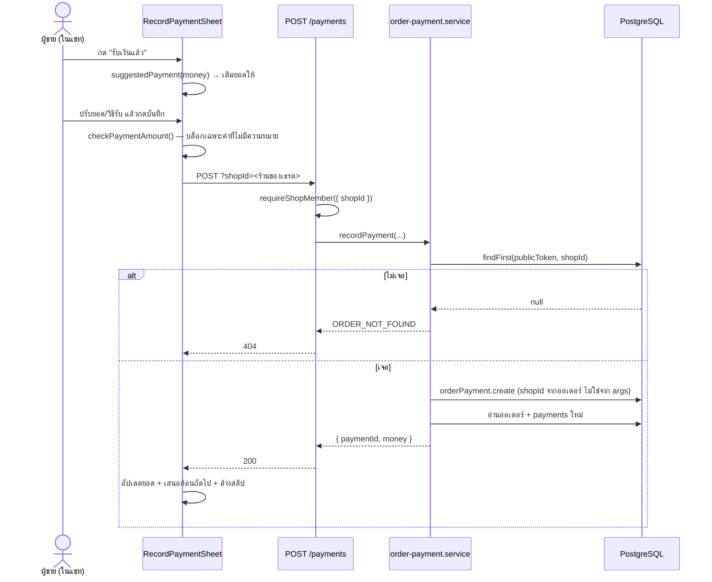

> **โมดูล:** M00050-ServiceQueueEndToEnd
> **ประเภทเอกสาร:** API Contract
> **เวอร์ชัน:** 1.0
> **วันที่จัดทำ:** 2026-08-15
> **สถานะ:** Draft
> **เจ้าของเอกสาร:** safepay-planner (ดู [[Feature-Docs-Ownership]])

# API Contract: ร้านบริการครบวงจร

---

## 1. Overview

Stack: Next.js 16 Route Handlers (`nodejs` runtime) · Validation: Valibot · ทุก response
`cache-control: private, no-store` ผ่าน `jsonNoStore()`

---

## 2. Authentication & Authorization

ทุก endpoint ในเอกสารนี้ผ่าน `requireShopMember(opts?)` — ต้องเป็น `OWNER` หรือ `ADMIN` ของร้าน
(ไม่สร้างระดับสิทธิ์ใหม่ · BR-RSV-25)

### 2.1 🛑 `?shopId=` — ทำไมต้องมี

endpoint กลุ่มนี้ถูกกดจาก **กล่องแชท** ซึ่งเปิดเธรดของร้าน B ได้ขณะ `activeShopId` ยังเป็นร้าน A
(BR-UNI-07) ถ้า guard เชื่อ `activeShopId` อย่างเดียว query จะ scope ผิดร้าน → "หาไม่เจอ" →
**ผู้ใช้ได้ปุ่มที่กดกี่ครั้งก็ไม่มีวันผ่าน** (คลาสเดียวกับบทเรียน iShip retry 2026-08-06)

| พฤติกรรม | ผล |
|---|---|
| ไม่ส่ง `?shopId=` | ใช้ร้านที่ active — **พฤติกรรมเดิมทุกประการ** (ผู้เรียกเดิมไม่กระทบ) |
| ส่งมาและเป็นสมาชิก | ใช้ร้านนั้น (re-verify membership ทุกครั้ง) |
| ส่งมาแต่ไม่มีสิทธิ์ | **403 — ห้ามถอยไปใช้ร้านที่ active** (ถอยเมื่อไร = ทำงานผิดร้านเงียบ ๆ) |

---

## 3. Endpoint List

| # | Method | Path | หน้าที่ |
|---|---|---|---|
| 1 | POST | `/api/orders/{token}/payments` | บันทึกว่ารับเงินก้อนหนึ่งแล้ว |
| 2 | GET | `/api/orders/{token}/payments` | ประวัติการรับเงินของออเดอร์ |
| 3 | DELETE | `/api/orders/{token}/payments/{paymentId}` | ยกเลิกรายการ (soft void) |
| 4 | PATCH | `/api/orders/{token}/appointment` | *(เดิม)* ตั้ง/เลื่อนนัด — ใช้เป็นทาง "เริ่มงาน walk-in" |
| 5 | POST | `/api/orders/{token}/appointment/outcome` | *(เดิม)* ปิดผลนัด |
| 6 | GET | `/api/shops/current/service-resources` | *(เดิม)* รายการคิวงาน |

🛑 **ไม่มี PATCH สำหรับแก้ยอดเงินโดยเจตนา** — หัวหน้ายืนยัน *"จ่ายมาแล้ว แก้ไม่ได้"*
กรอกผิดให้ยกเลิก (#3) แล้วบันทึกใหม่ (#1) = การกลับรายการทางบัญชี

---

## 4. Endpoint Detail

### 4.1 POST `/api/orders/{token}/payments`

**Query:** `shopId?` (ดู §2.1)

**Request**

```json
{
  "kind": "DEPOSIT",
  "amount": 300,
  "method": "TRANSFER",
  "slipFileId": "abc123",
  "note": "โอนผ่านพร้อมเพย์ ลงท้าย 1234"
}
```

| field | ชนิด | บังคับ | กติกา |
|---|---|---|---|
| `kind` | `"DEPOSIT" \| "BALANCE"` | ✓ | picklist |
| `amount` | number | ✓ | `>= 0.01` และ `<= 99,999,999` |
| `method` | `"TRANSFER" \| "CASH" \| "OTHER"` | ✗ | default `TRANSFER` |
| `slipFileId` | string \| null | ✗ | ≤ 200 ตัวอักษร |
| `note` | string \| null | ✗ | ≤ 500 ตัวอักษร · **บันทึกภายใน ไม่ส่งให้ลูกค้า** |

**Response 200**

```json
{
  "paymentId": "uuid",
  "money": {
    "totalAmount": 1000, "depositAgreed": 300,
    "depositReceived": 300, "balanceReceived": 0,
    "totalReceived": 300, "outstanding": 700,
    "unpaid": false, "fullyPaid": false,
    "depositSettled": true, "hasDeposit": true
  }
}
```

🛑 คืน `money` **หลังบันทึก** เพื่อให้จอที่กดปุ่มอัปเดตทันทีโดยไม่ต้อง query ซ้ำ —
และเป็นค่าที่ **อ่านใหม่จากฐาน** ไม่ใช่คำนวณต่อจากค่าเดิม (ทีมมีหลายคน อาจบันทึกแทรก)

### 4.2 GET `/api/orders/{token}/payments`

**Response 200** — `{ "payments": [...] }` เรียง `receivedAt` **ใหม่สุดก่อน**
รวมแถวที่ถูกยกเลิกด้วย (ประวัติต้องเห็นครบ — จอนี้เป็นของร้าน ไม่ใช่ของลูกค้า)

| field | หมายเหตุ |
|---|---|
| `id`, `kind`, `amount`, `method`, `slipFileId`, `note`, `receivedAt` | |
| `voidedAt`, `voidedReason` | null = ยังนับเป็นเงินที่รับ |

### 4.3 DELETE `/api/orders/{token}/payments/{paymentId}`

**Request:** `{ "reason": "กรอกยอดผิด" }` (1–500 ตัวอักษร · UI ใช้รายการปิด `VOID_PAYMENT_REASONS`)

**Response 200:** `{ "money": {...} }`

🛑 **soft void ไม่ใช่ลบ** — แถวยังอยู่พร้อมเวลา คนที่ยกเลิก และเหตุผล
🛑 ตรวจว่า `paymentId` อยู่ใน **ออเดอร์ตาม `{token}` จริง** ไม่ใช่แค่ร้านตรง — ไม่งั้น URL โกหก

### 4.4 PATCH `/api/orders/{token}/appointment` — ใช้เป็นทาง walk-in

**Request:** `{ "resourceId": "...", "start": "ISO", "end": "ISO" }`

ฝั่ง UI ประกอบ `start`/`end` ด้วย `walkInWindow(new Date(), durationMin)` **ตอนกด** ไม่ใช่ตอนเปิดจอ

🛑 ไม่สร้าง endpoint ใหม่สำหรับ walk-in — เส้นทางเดิมมีที่นั่ง · EXCLUDE constraint ·
ประวัติการเลื่อนครบแล้ว การเขียนเส้นที่สองคือที่ที่กติกาสองชุดจะเพี้ยนจากกัน

---

## 5. Error Code Table

| code | HTTP | เกิดเมื่อ | คำที่ผู้ใช้เห็น |
|---|---|---|---|
| `unauthorized` | 401 | ไม่มี session | — (redirect) |
| `FORBIDDEN` | 403 | ไม่ใช่สมาชิกร้านที่ระบุ | "ไม่มีสิทธิ์ในร้านนี้" |
| `VALIDATION_ERROR` | 400 | body ไม่ผ่าน schema | "ยอดเงินไม่ถูกต้อง ตรวจตัวเลขอีกครั้ง" |
| `AMOUNT_INVALID` | 400 | ยอด ≤ 0 หรือไม่ใช่ตัวเลข | เหมือนข้างบน |
| `ORDER_NOT_FOUND` | 404 | ไม่มีออเดอร์นี้ในร้านที่ scope | "ไม่พบคำสั่งซื้อนี้ในร้านที่เปิดอยู่ ลองปิดแล้วเปิดเธรดใหม่" |
| `PAYMENT_NOT_FOUND` | 404 | ไม่มีรายการนี้ / ไม่ได้อยู่ในออเดอร์ตาม token | "ไม่พบรายการนี้แล้ว อาจมีคนในทีมยกเลิกไปก่อน" |
| `ALREADY_VOIDED` | 409 | ถูกยกเลิกไปแล้ว (รวมกรณีแข่งกัน) | "รายการนี้ถูกยกเลิกไปแล้วโดยคนในทีม" |
| `APPOINTMENT_SLOT_FULL` | 409 | คิวเต็มในช่วงเวลานั้น | "คิวนี้เต็มในช่วงเวลานี้ — เลือกคิวอื่น หรือลดเวลาที่ใช้ลง" |
| `APPOINTMENT_TERMINAL` | 409 | ปิดผลนัดไปแล้ว | "งานใบนี้ปิดผลไปแล้ว เริ่มใหม่ไม่ได้" |

🛑 **ทุกข้อความบอกทางออก** — ห้ามตกไปที่ "ลองใหม่อีกครั้ง" สำหรับโค้ดที่ลองกี่ครั้งก็เท่าเดิม
นั่นคือคำเชิญให้กดวนสิ่งที่ไม่มีวันสำเร็จ (บทเรียน iShip 2026-08-06)

---

## 6. Sequence



---

## 7. Traceability

| BR/AC | Endpoint |
|---|---|
| BR-SQ-01/04/12 | #1 (บังคับ `receivedByUserId` จาก session) |
| BR-SQ-02/03 | #1 response `money` |
| BR-SQ-10/11 | #1 `slipFileId` ต่อก้อน |
| BR-SQ-13 | #1 `method=CASH` + `slipFileId=null` |
| BR-SQ-20/21 | #4 |
| BR-SQ-22 | #5 |
| AC-SQ-02 | #1 (เรียกจากเมนูกดค้างบนรูป) |
| AC-SQ-07 | ทุก endpoint scope `shopId` ใน WHERE |

---

## 8. สรุป

3 endpoint ใหม่ 3 endpoint เดิมที่รับ `?shopId=` เพิ่ม — **ไม่มี endpoint ไหนที่แก้ยอดเงินได้**
ซึ่งเป็นข้อจำกัดที่ตั้งใจให้บังคับที่ระดับ contract ไม่ใช่ที่ระดับ UI
