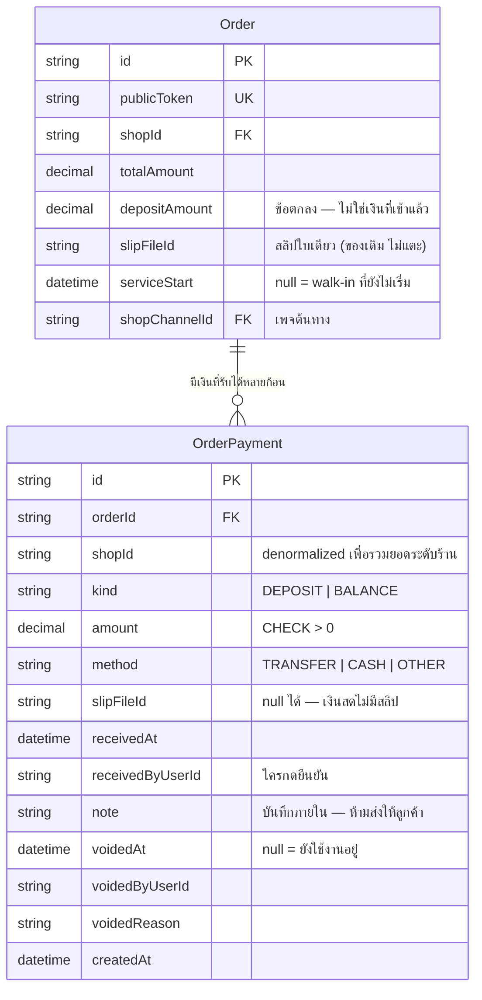

> **โมดูล:** M00050-ServiceQueueEndToEnd
> **ประเภทเอกสาร:** DATABASE Design
> **เวอร์ชัน:** 1.0
> **วันที่จัดทำ:** 2026-08-15
> **สถานะ:** Draft — migration เขียนแล้ว **ยังไม่เคยรันที่ไหน**
> **เจ้าของเอกสาร:** safepay-database (ดู [[Feature-Docs-Ownership]])

# DATABASE: ร้านบริการครบวงจร

---

## 1. Overview

**Store:** PostgreSQL 16 (Supabase) ตัวเดียวกับทั้งระบบ · ORM: Prisma

เพิ่ม **1 ตาราง** ไม่แตะคอลัมน์เดิมแม้แต่ตัวเดียว

🛑 **ทำไมต้องเป็นตารางใหม่ ไม่ใช่คอลัมน์บน `Order`** (KG-SQ-01)

BR-SQ-10 ต้องการสลิป **หลายใบต่อหนึ่งงาน** (มัดจำใบหนึ่ง ส่วนที่เหลืออีกใบ) ขณะที่
`Order.slipFileId` เป็นใบเดียวต่อออเดอร์และ **`ONLINE_SALES` กับ `LODGING` ใช้อยู่จริงบน prod**
การขยายคอลัมน์เดิมให้รองรับหลายใบ = เปลี่ยนความหมายของข้อมูลที่ร้านอื่นพึ่งพาอยู่

---

## 2. ERD



---

## 3. Tables

### 3.1 `OrderPayment` (ใหม่)

| คอลัมน์ | ชนิด | Null | ค่าตั้งต้น | หมายเหตุ |
|---|---|---|---|---|
| `id` | TEXT | ✗ | `uuid()` | PK |
| `orderId` | TEXT | ✗ | — | FK → `Order.id` ON DELETE CASCADE |
| `shopId` | TEXT | ✗ | — | **denormalized** — รวมยอดระดับร้าน/รายวันโดยไม่ต้อง join |
| `kind` | TEXT | ✗ | — | `DEPOSIT` \| `BALANCE` (String ตาม convention โปรเจกต์) |
| `amount` | DECIMAL(12,2) | ✗ | — | CHECK `> 0` |
| `method` | TEXT | ✗ | `'TRANSFER'` | `TRANSFER` \| `CASH` \| `OTHER` |
| `slipFileId` | TEXT | ✓ | — | สลิปของ **ก้อนนี้** (BR-SQ-10) · null = เงินสด (BR-SQ-13) |
| `receivedAt` | TIMESTAMP(3) | ✗ | `now()` | เวลาที่ **ได้รับเงิน** |
| `receivedByUserId` | TEXT | ✗ | — | 🛑 บังคับมีเสมอ — BR-SQ-12 ต้องมีคนกดยืนยัน |
| `note` | TEXT | ✓ | — | บันทึกภายใน **ห้ามส่งลงหน้าลูกค้า** |
| `voidedAt` | TIMESTAMP(3) | ✓ | — | null = ยังนับเป็นเงินที่รับ |
| `voidedByUserId` | TEXT | ✓ | — | |
| `voidedReason` | TEXT | ✓ | — | จาก `VOID_PAYMENT_REASONS` (รายการปิด) |
| `createdAt` | TIMESTAMP(3) | ✗ | `now()` | ต่างจาก `receivedAt`: อันนี้คือเวลาที่กด |

🛑 **`receivedAt` ≠ `createdAt` โดยเจตนา** — ร้านบันทึกย้อนหลังได้ ("เมื่อวานลูกค้าโอนมา
เพิ่งมากดวันนี้") ยอดรายวันต้องยึด `receivedAt` ไม่งั้นเงินจะไปตกวันที่กดปุ่ม

### 3.2 ตารางเดิมที่ **ไม่ถูกแตะ**

`Order.slipFileId` · `Order.depositAmount` · `Order.serviceStart/End/ResourceId/Seat` —
ทั้งหมดอยู่ที่เดิม ทำงานเหมือนเดิมทุกประการ (AC-SQ-07)

เพิ่มเฉพาะ **relation** `payments OrderPayment[]` บน `Order` ซึ่งไม่เปลี่ยนโครงตาราง

---

## 4. Indexes

| Index | ครอบ query | เหตุผล |
|---|---|---|
| `OrderPayment_pkey (id)` | `findFirst({ id })` ตอน void | PK |
| `OrderPayment_shopId_receivedAt_idx` | `groupBy` รายวันของ dashboard: `WHERE shopId = ? AND receivedAt >= ? AND receivedAt < ? AND voidedAt IS NULL` | คอลัมน์นำ = `shopId` (คัดทิ้งมากที่สุด) ตามด้วย `receivedAt` ที่เป็น range — เรียงกลับกันจะสแกนทั้งช่วงเวลาของทุกร้าน |
| `OrderPayment_orderId_idx` | โหลด relation `payments` ของออเดอร์ (แชท/หน้าลูกค้า) | ลิสต์ 20 ใบ → `WHERE orderId IN (...)` ครั้งเดียว |

**ไม่ทำ index บน `voidedAt`** — จำนวนแถวต่อร้านต่อวันอยู่ในหลักสิบ การกรอง null หลัง index scan
ถูกกว่าการแบก index เพิ่ม (ประเมินใหม่เมื่อร้านหนึ่งมี > 10k แถว/เดือน)

---

## 5. Migration Plan

**ไฟล์:** `prisma/migrations/20260815190000_service_queue_order_payment/migration.sql`

```sql
CREATE TABLE IF NOT EXISTS "OrderPayment" ( ... );
CREATE INDEX IF NOT EXISTS "OrderPayment_shopId_receivedAt_idx" ON "OrderPayment"("shopId","receivedAt");
CREATE INDEX IF NOT EXISTS "OrderPayment_orderId_idx" ON "OrderPayment"("orderId");
ALTER TABLE "OrderPayment" ADD CONSTRAINT "OrderPayment_orderId_fkey" FOREIGN KEY ...;
ALTER TABLE "OrderPayment" ADD CONSTRAINT "OrderPayment_amount_positive" CHECK ("amount" > 0);
```

### 5.1 กฎที่ migration นี้ยึด

| กฎ | ทำอย่างไร |
|---|---|
| **additive ล้วน** | ไม่มี `DROP`/`ALTER COLUMN`/`RENAME`/`TRUNCATE`/`DELETE`/`UPDATE "Order"` — มีด่านสแกนไฟล์ |
| **ไม่มี CHECK แบบรายชื่อค่า** | บทเรียน `20260806120000`: สอง branch แก้ CHECK ตัวเดียวกันแบบ hardcode แล้วตัวที่รันทีหลังลบค่าของอีกฝั่งเงียบ ๆ · CHECK ของเราผูกกับตารางใหม่และมีชื่อเฉพาะ |
| **ไม่มี backfill** | ระบบไม่เคยรู้เรื่อง "ได้รับเงินแล้ว" ⇒ ไม่มีข้อมูลให้ย้าย · การเดาว่า "มี `slipFileId` = จ่ายแล้ว" คือการแต่งข้อเท็จจริงทางการเงิน และขัดกฎข้อแรกของฟีเจอร์นี้เอง (BR-SQ-12) |
| **`IF NOT EXISTS` ทุกคำสั่งที่ทำได้** | รันซ้ำได้ปลอดภัย |

### 5.2 การนำขึ้น (Hard Rule 15)

1. **prod ไม่ต้องสั่งเอง** — `vercel.json` ตั้ง `buildCommand: "prisma migrate deploy && ..."`
   push ขึ้น `main` = migrate ขึ้น prod ในตัว
2. **ฐาน local ต้อง apply เอง** — Vercel เห็นเฉพาะฐานที่ deployment ชี้ ไม่เห็น Docker บนเครื่อง
3. **migrate ล้ม = build ล้ม = deploy ไม่ขึ้น** ของเก่ายังเสิร์ฟอยู่ ไม่มีสถานะครึ่ง ๆ กลาง ๆ
   ต้องแก้ไฟล์ migration แล้ว push ใหม่ ไม่ใช่กด retry deploy

### 5.3 Rollback

`DROP TABLE "OrderPayment"` — ปลอดภัยเพราะไม่มีตารางอื่นอ้างถึง และไม่มีคอลัมน์เดิมถูกแก้
**แต่จะเสียประวัติการรับเงินทั้งหมด** ⇒ ถ้ามีข้อมูลจริงแล้วให้ปิดทาง UI แทนการ drop

---

## 6. Retention / ข้อควรระวัง

| # | ข้อควรระวัง |
|---|---|
| 1 | **ลบออเดอร์ = ลบประวัติเงินของออเดอร์นั้น** (`ON DELETE CASCADE` เหมือน `OrderItem`/`OrderEvent`) — ถ้าวันหนึ่งต้องเก็บประวัติเงินไว้แม้ออเดอร์หาย ต้องเปลี่ยนเป็น `SET NULL` + คอลัมน์ snapshot |
| 2 | `note` และ `receivedByUserId` **ห้ามหลุดลงหน้าลูกค้า** — `getOrderByToken` select เฉพาะ 5 คีย์และมีด่านตรวจ |
| 3 | แถวที่ `voidedAt != null` **ไม่ถูกลบ** — ประวัติเงินที่ลบทิ้งได้ไม่ใช่ประวัติ |
| 4 | `shopId` เป็น denormalized — ถ้าออเดอร์ถูกย้ายร้าน (ยังไม่มีฟีเจอร์นี้) ต้องอัปเดตแถวเงินด้วย |

---

## 7. Traceability

| BR/AC | ส่วนของ schema |
|---|---|
| BR-SQ-01/04 | `receivedByUserId` NOT NULL |
| BR-SQ-02/03 | `OrderPayment` แยกจาก `Order.depositAmount` |
| BR-SQ-10 | `OrderPayment.slipFileId` (หลายแถวต่อออเดอร์) |
| BR-SQ-13 | `slipFileId` nullable + `method = CASH` |
| AC-SQ-04 | `@@index([shopId, receivedAt])` |
| AC-SQ-07 | migration additive ล้วน + ไม่มี backfill |
| KG-SQ-01 | §1 เหตุผลที่ต้องเป็นตารางใหม่ |

---

## 8. สรุป

หนึ่งตาราง หนึ่ง CHECK สอง index ศูนย์การแก้ของเดิม — ความเสี่ยงทั้งหมดของ migration นี้
อยู่ที่ "ถ้าไม่รัน" ไม่ใช่ "ถ้ารันแล้วพัง"
