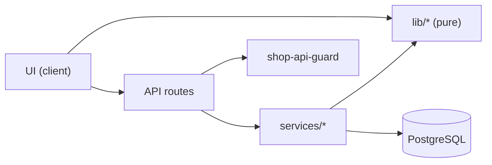
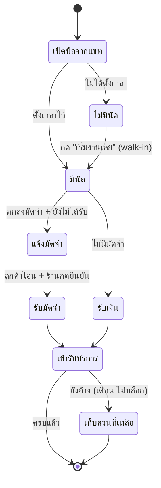
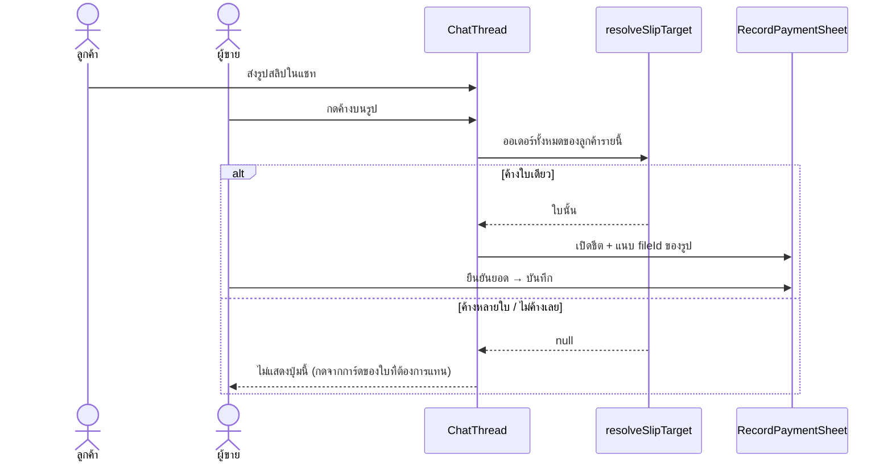

> **โมดูล:** M00050-ServiceQueueEndToEnd
> **ประเภทเอกสาร:** System Design Spec (SDS)
> **เวอร์ชัน:** 1.0
> **วันที่จัดทำ:** 2026-08-15
> **สถานะ:** Draft
> **เจ้าของเอกสาร:** safepay-planner (ดู [[Feature-Docs-Ownership]])

# SDS: ร้านบริการครบวงจร (System Design Spec)

---

## 1. บทนำ & References

Input: [[SRS]] · Output: [[API]] + [[DATABASE]] + [[TestCase]]

---

## 2. Architecture Overview

### 2.1 ชั้นและกฎการพึ่งพา

**กฎ:** `lib/*` ห้าม import prisma/React · UI ห้ามเรียก prisma · service ห้ามรู้จัก HTTP

---

## 3. Component Design

### 3.1 `lib/order-payment.ts` — SSOT ของเงิน

| export | หน้าที่ |
|---|---|
| `computeOrderMoney(input)` | รวมสถานะเงินของออเดอร์หนึ่งใบ |
| `computeOrderMoneyFromSerialized(input)` | เวอร์ชันที่รับค่าที่ข้าม RSC/JSON มาแล้ว |
| `hasMoneyStory(money)` | "ใบนี้มีเรื่องเงินให้พูดถึงไหม" — เกณฑ์ที่ **3 จอ** ใช้ร่วม (TFR-SQ-08) |
| `suggestedPayment(money)` | ยอด+ชนิดที่ควรเสนอตอนกด "รับเงิน" |
| `completionWarning(money)` | ข้อความเตือนตอนปิดงานทั้งที่ค้าง (null = ไม่ค้าง) |
| `ALLOW_COMPLETE_WITH_OUTSTANDING` | กฎ "ปิดงานทั้งที่ค้างได้ไหม" **ที่เดียว** |
| `ORDER_PAYMENT_KIND_LABEL` / `_METHOD_LABEL` | คำไทยของ enum |

🛑 **มีตัวแปลง serialized ตัวเดียว** — ถ้าปล่อยให้แต่ละจอ `Number(x)`/`new Date(y)` เอง
วันหนึ่งจะมีจอที่ลืมตัด `voidedAt` แล้วนับเงินที่ยกเลิกไปแล้วเป็นเงินที่รับจริง
ไม่มี `tsc`/build ตัวไหนฟ้อง เพราะทุกบรรทัดถูกตามชนิด

### 3.2 `lib/chat-order-actions.ts` — ปุ่มบนการ์ดงานในแชท

| export | หน้าที่ |
|---|---|
| `chatOrderActions(ctx)` | คืนรายการปุ่มที่ควรเห็น เรียงตามลำดับที่ควรกด |
| `checkPaymentAmount(input)` | เตือน/บล็อกยอดที่กรอก |
| `resolveSlipTarget(candidates)` | สลิปที่ลูกค้าส่งมาควรลงบิลไหน (null = กำกวม) |
| `chatMoneySummary(money)` | ข้อความสรุปบนแถบ |
| `VOID_PAYMENT_REASONS` | รายการเหตุผลปิด |

🛑 **ชื่อไฟล์เคยเป็น `chat-payment-actions`** — เปลี่ยนตอนเพิ่ม `START_WALK_IN` ซึ่งไม่ใช่เรื่องเงิน
ชื่อไฟล์ที่โกหกคือจุดเริ่มของการมีปุ่มสองแหล่ง (HR16)

### 3.3 `services/order-payment.service.ts`

| export | query | scope |
|---|---|---|
| `getOrderMoney` | `order.findFirst` | `publicToken + shopId` |
| `recordPayment` | findFirst → create → re-read | `publicToken + shopId` |
| `voidPayment` | findFirst → updateMany → re-read | `id + shopId + order.publicToken` |
| `listPayments` | findFirst → findMany | order scope แล้ว → `orderId` |
| `getSalesSeries` (dashboard.service) | `order.findMany` + relation `payments` | `shopId` ที่ตัวออเดอร์ — payments ถูก scope ผ่านออเดอร์ที่อ่านมาแล้ว |

### 3.4 UI

| ไฟล์ | ธีม | Base |
|---|---|---|
| `(chat)/_components/RecordPaymentSheet.tsx` | Paces | `AppointmentSummarySheet.tsx` |
| `(chat)/_components/StartWalkInSheet.tsx` | Paces | `AppointmentSummarySheet.tsx` |
| `(chat)/_components/mark-served.ts` | — | `AppointmentCard.tsx:115` (คำ/ท่ายืนยัน) |
| `(marketing)/o/[token]/PaymentSummaryCard.tsx` | **Vuexy** | `OrderDetailMobile.tsx` การ์ด "รีวิวของคุณ" |

---

## 4. Data Flow

### 4.1 เส้นทางเต็มของงานหนึ่งใบ (AC-SQ-01)

### 4.2 สลิปจากแชท → เงินที่รับ (AC-SQ-02)

🛑 **ไม่เดาเมื่อกำกวม** — เดาผิดใบแปลว่าผิดพร้อมกันสองใบ (ใบที่ควรได้ยังค้าง
ใบที่ไม่ควรได้ดูเหมือนจ่ายแล้ว) ซึ่งหนักกว่าการไม่มีทางลัดให้กดมาก

---

## 5. Integration Points

| ระบบเดิม | จุดเชื่อม | ผลกระทบ |
|---|---|---|
| `appointment.service` | `setOrRescheduleAppointment` (walk-in) | ไม่แก้ตรรกะเลย เพิ่มแค่ผู้เรียก |
| `shop-api-guard` | `requireShopMember(opts?)` | additive — ผู้เรียกเดิม 10 route ไม่กระทบ |
| `appointment-day` | `appointmentDayBounds` เรียก `thaiTodayBounds` | สกัดนิยาม "วันนี้" ออกมาที่เดียว |
| `getOrderByToken` | เพิ่ม `payments` + `shopChannel` (allow-list) | จอ guest ไม่รับต่อ (ประกอบทีละ field) |
| `getOrdersByCustomer` | เพิ่ม `payments` | ต้อง sync กับ `inbox/[id]/page.tsx` — มีด่าน |

---

## 6. Technical Decisions

| # | ตัดสินใจ | ทางเลือกที่ไม่เอา | เหตุผล |
|---|---|---|---|
| TD-01 | ตารางใหม่ `OrderPayment` | เพิ่มคอลัมน์บน `Order` | BR-SQ-10 ต้องการหลายก้อนต่อบิล และของเดิมมีร้านใช้จริง |
| TD-02 | soft void ไม่มี update | ให้แก้ `amount` ได้ | *"จ่ายมาแล้ว แก้ไม่ได้"* — ประวัติที่แก้ทับได้ไม่ใช่ประวัติ |
| TD-03 | `recordPayment` อ่านซ้ำหลังเขียน (3 query) | คำนวณต่อจากค่าเดิม (2 query) | ทีม 7 คนกดพร้อมกันได้ — ความถูกต้องชนะ 1 round trip |
| TD-04 | walk-in ใช้ endpoint นัดเดิม | สร้าง `POST /walk-in` | เส้นทางเดิมมีที่นั่ง/EXCLUDE/ประวัติครบ · เส้นที่สอง = กติกาสองชุด |
| TD-05 | ไทล์ "นัดวันนี้" → `/queues` | คงที่ `/orders?apptDay=today` | AC-SQ-05 · **ย้อนมติ 2026-08-10 ของ user** — บันทึกทั้งสองมติไว้ในโค้ดและ BRD |
| TD-06 | `?shopId=` เป็น optional | บังคับส่งเสมอ | ผู้เรียกเดิมไม่ต้องแก้ · ไม่ส่ง = พฤติกรรมเดิมเป๊ะ |
| TD-07 | `money = null` เมื่อไม่มีเรื่องเงิน | ส่ง 0 ทุกช่อง | ออเดอร์ขายออนไลน์ต้องไม่ได้บล็อกใหม่ที่ไม่ได้ขอ (AC-SQ-07) |
| TD-08 | สลิปกำกวม → ไม่แสดงปุ่ม | เดาใบล่าสุด | เดาผิด = ผิดสองใบพร้อมกัน |
| TD-09 | `Record<ChatOrderActionKey, …>` ที่ทุก surface | `switch` + `default` | เพิ่มปุ่มแล้วลืมต่อสาย = `tsc` แดง ไม่ใช่ปุ่มหายเงียบ |
| TD-10 | dashboard: query ล้ม → การ์ดหาย | ตกเป็น ฿0.00 | เลข 0 ที่ผิดเป็นข้ออ้างให้ไปตามเก็บเงินจากคนที่จ่ายแล้ว |

---

## 7. Traceability

| SRS TFR | Component |
|---|---|
| TFR-SQ-01/02 | `order-payment.service` + API #1/#3 |
| TFR-SQ-03 | `lib/order-payment` |
| TFR-SQ-04 | `lib/chat-order-actions` + `OrderProgressBar`/`CustomerPanel` |
| TFR-SQ-05 | `walkInWindow` + `StartWalkInSheet` + API #4 |
| TFR-SQ-06 | `getSalesSeries` (`depositValues`/`receivedValues`) + คอลัมน์ `มัดจำ/รับจริง/ค้างรับ` ใน `SalesChartSheet` |
| TFR-SQ-07 | `PaymentSummaryCard` + `originPage` |

---

## 8. สรุป

การออกแบบทั้งหมดวางอยู่บนข้อสังเกตเดียว: **ปัญหาไม่ใช่ว่าระบบคำนวณผิด แต่คือระบบไม่มีที่เก็บ
คำตอบ** เมื่อมีที่เก็บแล้ว งานที่เหลือคือทำให้ทุกจอที่ถามคำถามเดียวกัน อ่านจากที่เดียวกัน
