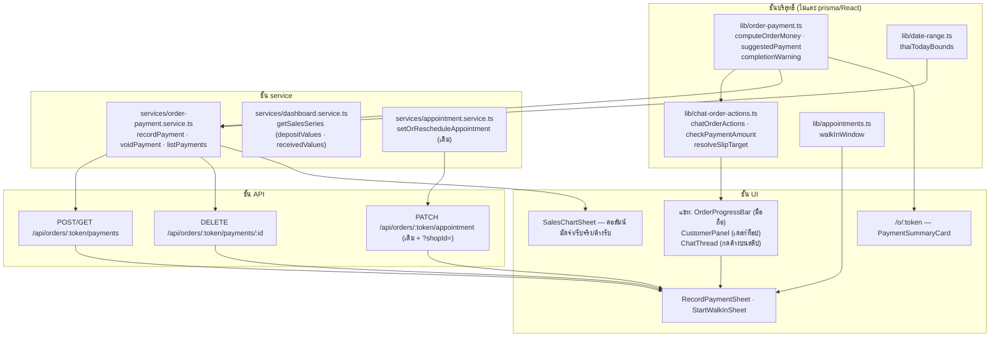

> **โมดูล:** M00050-ServiceQueueEndToEnd
> **ประเภทเอกสาร:** Software Requirements Specification (SRS) — TECHNICAL
> **เวอร์ชัน:** 1.0
> **วันที่จัดทำ:** 2026-08-15
> **สถานะ:** Draft — เขียนจากโค้ดที่ implement แล้วและอ่านซ้ำแล้ว รอ user review ก่อน commit
> **เจ้าของเอกสาร:** safepay-planner (ดู [[Feature-Docs-Ownership]])

# SRS: ร้านบริการครบวงจร (Software Requirements Specification — Technical)

---

## 1. บทนำ (Introduction)

### 1.1 ขอบเขต

ปิด "รูโหว่เดียว" ที่ทำให้ 4 ข้อที่เหลือของหัวหน้าทำไม่ได้: **ระบบไม่มีที่บันทึกว่า "ได้รับเงินแล้ว"**

ก่อนหน้านี้ระบบรู้แค่ 2 อย่าง — *ควรเก็บมัดจำเท่าไร* (`Order.depositAmount`) และ *มีรูปสลิปไหม*
(`Order.slipFileId`) ทั้งคู่ไม่ใช่คำตอบของคำถาม "เงินเข้าหรือยัง" โค้ดเขียนสารภาพไว้เองที่
`APPOINTMENT_SUMMARY_LABEL.deposit` ว่าต้องเลี่ยงไปใช้คำว่า "มัดจำที่ตกลงไว้" เพราะไม่รู้

### 1.2 นอกขอบเขต

ระบบชำระเงินออนไลน์จริง (ยังเป็นโอน+สลิป) · ใบเสร็จ/ภาษี · การอ่านตัวเลขจากรูปสลิปอัตโนมัติ ·
บัญชีแยกประเภท · การคืนเงินจริง (มีแค่ "ยกเลิกรายการ" ทางบัญชี)

### 1.3 คำที่ต้องแยกให้ขาด (Hard Rule 16)

| คำ | นิยาม | เก็บที่ |
|---|---|---|
| **มัดจำที่ตกลงไว้** | *ข้อตกลง* — ยอดที่ร้านบอกลูกค้าว่าต้องวาง | `Order.depositAmount` (snapshot ตอนสร้าง) |
| **เงินที่รับจริง** | *ข้อเท็จจริง* — มีคนกดยืนยันแล้ว | `OrderPayment` (ตารางใหม่) |
| **ยอดขาย** | มูลค่าตามบิล ณ วันที่เปิดบิล | `Order.totalAmount` + `/sales` |
| **เงินที่รับจริงรายวัน** | เงินที่เข้าจริงของงานที่ **ขายวันนั้น** (รวมที่เก็บทีหลัง) | `SalesSeries.receivedValues` |

🛑 สองคู่หลังต่างกันเสมอในร้านที่เก็บมัดจำ — บิลเปิดวันนี้ 5,000 แต่เงินเข้าจริงอาจเป็น 1,500
และอีก 3,500 เข้าคนละวัน **ต้องบอกความต่างบนหน้าจอ ไม่ใช่แค่ในคอมเมนต์**

---

## 2. ภาพรวมสถาปัตยกรรม (Architecture Overview)



### 2.1 หลักที่บังคับทั้งโมดูล

| # | หลัก | บังคับที่ |
|---|---|---|
| A-1 | ตรรกะเรื่องเงินทุกตัวเป็น **ฟังก์ชันบริสุทธิ์** ที่เทสได้ | `lib/order-payment.ts`, `lib/chat-order-actions.ts` |
| A-2 | ทุกจอที่พูดเรื่องเงิน **ต้องเรียก SSOT ตัวเดียวกัน** ห้ามบวกเอง | ด่าน `chat-order-surfaces.test.ts` |
| A-3 | ทุก query ที่รับ input จากผู้เรียก **ต้อง scope ด้วย `shopId` ใน WHERE** | ด่าน `service-queue-isolation.test.ts` |
| A-4 | endpoint ที่ถูกกดจากกล่องแชท **ต้องรับ `?shopId=`** | ด่าน `chat-order-surfaces.test.ts` |
| A-5 | ข้อมูลที่ส่งลงหน้าลูกค้า **ต้องเป็น allow-list** ห้าม `include`/spread | ด่าน `public-order-money.test.ts` |

---

## 3. ข้อกำหนดเชิงฟังก์ชันเชิงเทคนิค

### TFR-SQ-01 · บันทึกเงินที่ได้รับ

`recordPayment({ shopId, orderToken, receivedByUserId, kind, amount, method, slipFileId?, note? })`

- อ่านออเดอร์ด้วย `findFirst({ where: { publicToken, shopId } })` — **ownership อยู่ใน WHERE**
  ร้านอื่นต้อง "หาไม่เจอ" ไม่ใช่ "เจอแล้วถูกปฏิเสธ"
- `shopId` ที่บันทึกลงแถวมาจาก **ออเดอร์ที่เพิ่งอ่าน** ไม่ใช่จาก args (denormalize จากความจริง)
- คืน `money` **หลังบันทึก** (อ่านซ้ำ) เพื่อให้จอที่กดปุ่มอัปเดตทันที
  🛑 อ่านซ้ำโดยตั้งใจ — ทีมร้านอ้างอิงมี 7 คน อีกคนอาจบันทึกแทรกระหว่างนั้น

### TFR-SQ-02 · ยกเลิกรายการ (ไม่ใช่แก้)

`voidPayment({ shopId, orderToken, paymentId, voidedByUserId, reason })`

- ไม่มีฟังก์ชัน `update` ที่แก้ `amount` โดยเจตนา (หัวหน้า: *"จ่ายมาแล้ว แก้ไม่ได้"*)
- `updateMany` + `voidedAt: null` ใน WHERE = optimistic guard กันสองคนกดพร้อมกัน
  ถ้าใช้ `update` เฉย ๆ คนที่สองจะเขียนทับเวลา/ชื่อของคนแรก ⇒ ประวัติชี้คนผิด
- ผูกกับ `orderToken` ด้วย relation filter — ไม่งั้น URL โกหก (ยกเลิกของออเดอร์ A ผ่าน token ของ B)

### TFR-SQ-03 · ตัวคำนวณเงิน (SSOT)

`computeOrderMoney({ totalAmount, depositAgreed, payments }) → OrderMoney`

| กติกา | เหตุผล |
|---|---|
| ยอดค้างหักจาก **เงินที่รับจริง** เท่านั้น | มัดจำที่ตกลงแต่ยังไม่ได้รับ ไม่ทำให้ค้างน้อยลงแม้บาทเดียว |
| แถว `voidedAt != null` ไม่ถูกนับ | การกลับรายการทำด้วยการยกเลิก ไม่ใช่ยอดติดลบ |
| รับเกินยอดรวมได้ → `outstanding = 0` ไม่ติดลบ | ลูกค้าโอนเกิน/ทิป เกิดจริง |
| **ไม่รับ `depositMode`/`depositValue` เข้ามาเลย** | ทำให้คำนวณมัดจำใหม่ย้อนหลังเป็นไปไม่ได้ในเชิงโครงสร้าง (BR-SQ-32) |
| ปัดทศนิยม 2 ตำแหน่งทุกค่า | กัน "ค้าง 0.0000001 บาท" จากเลขทศนิยม |

### TFR-SQ-04 · ปุ่มในแชท

`chatOrderActions({ orderStatus, appointmentStatus, hasAppointment, money }) → ChatOrderAction[]`

| ปุ่ม | เงื่อนไข |
|---|---|
| `START_WALK_IN` | ยังไม่มีนัด **และ** ยังไม่ปิดงาน — เป็นปุ่มหลักเสมอ |
| `REQUEST_DEPOSIT` | มีนัด **และ** ตกลงมัดจำไว้ **และ** ยังไม่ได้รับสักบาท **และ** ยังไม่ปิดงาน |
| `RECORD_PAYMENT` | `outstanding > 0` — **ตลอดเวลาที่ยังค้าง** ไม่ใช่เฉพาะถึงวันนัด |
| `MARK_SERVED` | มีนัด **และ** ยังไม่ปิดงาน |

🛑 `hasAppointment` จำเป็นเพราะ `POST .../appointment/outcome` **404 เมื่อใบนั้นไม่มีนัด** —
ไม่กั้นแล้วปุ่มจะโผล่กับ walk-in ทุกใบแล้วกดกี่ครั้งก็ไม่ผ่าน

### TFR-SQ-05 · walk-in เข้าตารางงาน

`walkInWindow(now, durationMinutes) → { start, end }` — ปัดวินาที/มิลลิวินาทีทิ้ง

🛑 ไม่สร้าง endpoint ใหม่: `PATCH /api/orders/:token/appointment` ทำงานนี้ได้อยู่แล้วตั้งแต่ 00024
(ที่นั่ง · EXCLUDE constraint · ประวัติการเลื่อน อยู่ในเส้นทางเดิมครบ) — ที่ขาดคือ *ทางเข้าที่แปลว่า
"เริ่มตอนนี้"*

### TFR-SQ-06 · เงินที่รับจริง — คอลัมน์รายวันในตารางชีตยอดขาย

> **แก้มติ 2026-08-23 (user สั่ง):** เดิมเป็นแถว "รับจริงวันนี้" ท้ายการ์ดยอดขายบนหน้าแรก
> ซึ่งตอบได้แค่ *วันนี้* วันเดียว — ย้ายเป็น **คอลัมน์ในตารางรายวัน** ที่มีอยู่แล้ว
> (`SalesChartSheet`) จึงตอบได้ทั้ง "วันนี้เท่าไหร่" และ "วันไหนที่ยังเก็บไม่ครบ"
> `MoneyTodayRow` · `getMoneyReceivedToday` · `countUnpaidJobsToday` ถูกลบทั้งสาย

`getSalesSeries(..., vertical)` คืนเพิ่ม `depositValues[]` / `receivedValues[]` เมื่อ
`vertical === 'SERVICE_QUEUE'` เท่านั้น (ร้านอื่นได้ `undefined` — **ไม่ใช่อาร์เรย์ศูนย์**
เพราะตารางใช้ค่านี้ตัดสินว่าจะโชว์คอลัมน์ชุดไหน)

ตารางของร้านบริการเปลี่ยนคอลัมน์ท้ายจาก `ต้นทุน · ค่าส่ง · กำไร` (ซึ่ง **ว่างเปล่าเชิงโครงสร้าง**
เพราะ `SERVICE_QUEUE` ล็อก `NO_SHIPPING` เสมอ ⇒ กำไร = ยอดขายทุกแถว) เป็น
`มัดจำ · รับจริง · ค้างรับ` — ร้านขายออนไลน์ยังใช้ชุดเดิม

🛑 **ตัดตามวันที่ของออเดอร์ ไม่ใช่ `receivedAt`** — ทุกคอลัมน์ในตารางนี้ผูกกับ `Order.createdAt`
ถ้าชุดนี้ใช้แกนเวลาของการรับเงิน `ยอดขาย − รับจริง` จะเป็นการลบข้ามแกน แล้วค้างรับติดลบได้
⇒ `receivedValues[i] ≤ values[i]` เสมอ และ `ค้างรับ ≥ 0`

### TFR-SQ-07 · หน้าลูกค้า `/o/[token]`

เพิ่ม `money` (nullable) + `originPage` (nullable) ลง `PublicOrderData`
`money = null` เมื่อ `!hasMoneyStory(m)` ⇒ ออเดอร์ขายออนไลน์ทั่วไป **DOM เหมือนเดิมทุก node**

---

### TFR-SQ-08 · `hasMoneyStory()` — เกณฑ์ "ใบนี้มีเรื่องเงินให้พูดถึงไหม" (SSOT)

```ts
hasMoneyStory(m) === (m.totalReceived > 0 || m.hasDeposit)
```

ตัดสิน **3 จอพร้อมกัน**: รายการ `/orders` · หน้ารายละเอียดฝั่งร้าน · หน้าลูกค้า `/o/[token]`

| ข้อบังคับ | เหตุผล |
|---|---|
| เป็น **OR ไม่ใช่ AND** | ร้านที่ไม่ตกลงมัดจำแต่ลูกค้าจ่ายสดหน้าร้าน ต้องนับว่ามีเรื่องเงิน |
| **ไม่ใช่** ด่าน vertical และใช้แทนกันไม่ได้ | ผู้เรียกต้องกั้น `vertical === 'SERVICE_QUEUE'` มาก่อนเสมอ (AC-SQ-07) |
| ห้ามเขียนนิพจน์ซ้ำที่จุดเรียก | เดิมเป็นนิพจน์ดิบ 2 ที่ ไม่มีเทสผูก — ต้นตอของ "สองจอพูดคนละคำ" |

### TFR-SQ-09 · ป้ายสถานะในรายการ `/orders` ต้องตรงกับหน้ารายละเอียด

**อาการเดิม:** รายการอ่าน `resolveOrderStatusBadge` (แกน `Order.status` + พัสดุ) ส่วนหน้ารายละเอียด
อ่าน `resolveServiceOrderBadge` (แกนเงิน) ⇒ ใบเดียวกันขึ้น **"รอดำเนินการ"** ในรายการ แล้วขึ้น
**"ชำระเงินแล้ว"** เมื่อกดเข้าไป — ห่างกันหนึ่งคลิก

| ข้อบังคับ | บังคับที่ |
|---|---|
| `getOrdersByShop()` รับ `opts.withPayments` — opt-in ต่อ **ประเภทร้าน** ไม่ใช่เปิดให้ทุกคน | `order.service.ts` |
| เงื่อนไขดึงแถวเงิน กับ เงื่อนไขคำนวณ ต้องเป็น **สัญลักษณ์ตัวเดียวกัน** (`isServiceQueue`) | `orders/page.tsx` + ด่าน `service-queue-vertical-gate` |
| `OrderRow.money` เป็น `undefined` ⇒ ป้ายเดิมไม่ขยับเลย (ร้านอื่นได้ DOM เท่าเดิม) | `data.ts` · `OrderCard.tsx` |
| เช็กลิสต์เดสก์ท็อปได้ขั้น **"เก็บเงินครบ"** ทรงเดียวกับแถว COD | `OrdersTable.tsx` |

> 🛑 กับดักเฉพาะของหน้ารายการ: การดึงกับการคำนวณอยู่คนละบรรทัด ถ้าใช้คนละเงื่อนไขจะเกิดเคส
> "คำนวณเงินโดยไม่มีแถวเงินอยู่ในมือ" ⇒ ทุกใบอ่านได้ว่ายังไม่จ่าย ทั้งที่จ่ายครบแล้ว —
> **ค่าที่หายไปตอนดึง อ่านไม่ต่างจากศูนย์จริง** และไม่มี `tsc`/build ตัวไหนฟ้อง

### TFR-SQ-10 · `resolveArrivalMode()` — ลูกค้ารายนี้เข้ามายังไง

| ค่า | เกณฑ์ |
|---|---|
| `UNSCHEDULED` | ไม่มี `serviceStart` — ยังไม่มีที่ยืนในตารางงาน |
| `WALK_IN` | `serviceStart − createdAt ≤ 30 นาที` |
| `BOOKED` | `serviceStart − createdAt > 30 นาที` |

🛑 เทียบ **ทางเดียว ห้าม `Math.abs`** — บิลที่เปิดย้อนหลัง (feature 00033 ให้ย้อนได้ 90 วัน)
มีส่วนต่างติดลบก้อนใหญ่ `abs` จะอ่านเป็น "จองล่วงหน้า" ทั้งที่ร้านแค่มากรอกทีหลัง

🛑 **derive ไม่เพิ่มคอลัมน์** — ออเดอร์ 21 ใบบน prod เกิดก่อนมีธง เพิ่มคอลัมน์ = ต้อง backfill ด้วยการเดา

### TFR-SQ-11 · เส้นทางของงานบริการบนหน้าลูกค้า (`getServiceTimeline`)

`getOrderTimeline()` สำหรับ `NO_SHIPPING + PENDING` คืน `สั่งซื้อแล้ว → **ส่งมอบแล้ว(ขั้นปัจจุบัน)** → ยืนยันรับ`
⇒ ลูกค้าที่จองไว้และยังไม่ได้รับบริการ เห็นคำว่า "ส่งมอบแล้ว" บนจอที่ใช้ตัดสินใจโอนเงิน

แทนด้วย `จองแล้ว → เข้ารับบริการ → ยืนยันแล้ว` โดย **"ถึงคิวหรือยัง" ตัดสินจากเวลาที่ผ่านไป
ไม่ใช่จากที่ร้านกดปิดผล** — ร้านที่ยุ่งกดทีหลัง ลูกค้าที่นั่งอยู่ในร้านจะเห็น "ยังไม่ถึงคิว"
ซึ่งขัดกับสิ่งที่เขาเห็นด้วยตา

### TFR-SQ-12 · จอ guest ของ `/o/[token]` ต้องบอกวันนัด

`GuestOrderData` เพิ่ม `serviceStartIso` / `serviceEndIso` เข้า **allow-list** (ไฟล์นั้นเป็น
allow-list ไม่ใช่ deny-list — ฟิลด์ใหม่ต้องมาเพิ่มโดยตั้งใจเท่านั้น)

| ข้อบังคับ | เหตุผล |
|---|---|
| กั้นด้วย `shop.vertical === 'SERVICE_QUEUE'` ไม่ใช่ "แถวนี้มี `serviceStart` ไหม" | ไม่มีอะไรใน schema ห้ามร้านประเภทอื่นมีค่าค้าง (คลาสเดียวกับ `Product.fulfillmentMode`) |
| ไม่เพิ่ม query | `serviceStart`/`serviceEnd` เป็น scalar มากับ `getOrderByToken()` อยู่แล้ว |
| ยอมรับความเสี่ยง PII | ค่านี้บอก *เวลาของบิล* ไม่ได้บอกว่าใคร (ชื่อไม่เคยส่งมาจอนี้ · เบอร์ mask เหลือ 3 ตัวท้าย) |

**บั๊กที่แก้ไปพร้อมกัน** (จอ guest — จอแรกที่ผู้ซื้อทุกคนเจอ):

1. **โลโก้ร้านถูกปกทับครึ่งใบ** — `ShopCover` เป็น element ที่ positioned ส่วนบล็อกข้อมูลร้านไม่ใช่
   ⇒ ตามลำดับการวาดของ CSS ปกถูกวาดทับลูกทุกตัว รวมโลโก้ที่ยื่นขึ้นไป 32px
   (จอหลังล็อกอินไม่เป็นเพราะห่อ avatar ด้วย `position: relative` อยู่แล้ว — ความต่างที่ไม่มีใครตั้งใจ)
2. **ที่ว่างท้ายหน้าเป็นเลขดิบ `112`** เขียนคนละที่กับแถบ CTA ⇒ ป้ายปุ่ม/แคปชันตกบรรทัดเมื่อไร
   เนื้อหาท้ายหน้าถูกทับเมื่อนั้น — คำนวณจากตัวเลขชุดเดียวกับแถบแล้ว เผื่อแคปชัน 2 บรรทัดเสมอ
3. **คำว่า "สินค้า" หลุดในร้านบริการ** — `"ยังไม่ได้รับสินค้า?"` ตายตัว ทั้งที่หน้าผันคำด้วย `vocab`
   อยู่แล้ว → เขียนใหม่ให้ไม่ต้องพึ่งคำนาม (`"มีปัญหากับรายการนี้? แจ้งร้านค้า"`)
   เพราะ `"ยังไม่ได้รับ" + noun` ได้ "ยังไม่ได้รับการเข้ารับบริการ"

### TFR-SQ-13 · พรีวิวสรุปนัดต้องเท่ากับข้อความที่ส่งจริง

สรุปนัดถูกประกอบ 2 ที่ (ชีตพรีวิว + route ที่ส่งจริง) — ทั้งคู่ต้องได้ `url` จาก
**`publicOrderUrl()` ตัวเดียวกัน** และห้ามต่อ path `/o/` เองในสองไฟล์นั้น

> เดิม `url` ส่งแค่ฝั่ง route ⇒ ผู้ขายเห็นข้อความไม่มีลิงก์ กดส่ง แล้วลูกค้าได้ข้อความที่มีลิงก์
> ลิงก์นั้นคือสิ่งที่ลูกค้าใช้ตรวจบิล/แนบสลิป/กดยืนยัน — พรีวิวที่ไม่มีมันคือพรีวิวที่โกหก
> ในเรื่องสำคัญที่สุดของข้อความนั้น · หัวไฟล์ `appointment-summary.ts` เขียนกฎนี้ไว้เองแล้ว
> **แต่ไม่มีอะไรบังคับ** — และนั่นคือเหตุผลที่มันหลุด

ผลพลอยได้จากการยกเป็นฟังก์ชัน: `orderRefToken` เป็น optional ตาม schema แต่โค้ดเดิมยัดลง
template literal ได้เพราะ JS แปลง `undefined` เป็นสตริง ⇒ **ลิงก์ `/o/undefined`** · ตอนนี้ `tsc` จับให้

---

## 4. ข้อกำหนดส่วนต่อประสาน

ดูรายละเอียดเต็มที่ [[API]] — สรุป:

| Method | Path | ใหม่/แก้ |
|---|---|---|
| POST | `/api/orders/:token/payments` | ใหม่ |
| GET | `/api/orders/:token/payments` | ใหม่ |
| DELETE | `/api/orders/:token/payments/:paymentId` | ใหม่ |
| PATCH | `/api/orders/:token/appointment` | เดิม + รับ `?shopId=` |
| POST | `/api/orders/:token/appointment/outcome` | เดิม + รับ `?shopId=` |
| GET | `/api/shops/current/service-resources` | เดิม + รับ `?shopId=` |

🛑 **ไม่มี PATCH สำหรับแก้ยอดเงิน** โดยเจตนา

---

## 5. ข้อกำหนดด้านข้อมูล

ดู [[DATABASE]] — สรุป: ตารางใหม่ `OrderPayment` 1 ตาราง · **ไม่แตะคอลัมน์เดิมแม้แต่ตัวเดียว** ·
ไม่มี backfill (ระบบไม่เคยรู้เรื่องนี้มาก่อน จึงไม่มีข้อมูลให้ย้าย — การเดาว่า "มีสลิป = จ่ายแล้ว"
คือการแต่งข้อเท็จจริงทางการเงิน)

---

## 6. ข้อกำหนดที่ไม่ใช่ฟังก์ชัน

| # | ข้อกำหนด | หลักฐาน |
|---|---|---|
| NFR-SQ-01 | dashboard ต้องไม่ช้าลง | ไม่มี query เพิ่ม — `payments` มากับ query ออเดอร์ก้อนเดิมของ `getSalesSeries` (index `orderId`) และ select เฉพาะร้าน `SERVICE_QUEUE` |
| NFR-SQ-02 | ไม่ดึงข้อมูลที่ไม่ได้ใช้ | `payments` อยู่ใต้ธง `isServiceShop` — ร้านขายออนไลน์ไม่จ่าย join นี้เลย (ด่าน `service-queue-vertical-gate`) |
| NFR-SQ-03 | การ์ดในแชทต้องไม่ยิง API ต่อใบ | `payments` มากับ query ออเดอร์ (index `orderId`) — ลิสต์ 20 ใบ ≠ 20 คำขอ |
| NFR-SQ-04 | ข้อมูลลับต้องไม่ลงหน้าลูกค้า | allow-list ทุก relation · `ShopChannel` select 3 คีย์ (แถวนั้นมี `accessTokenEnc`) |

---

## 7. ข้อจำกัดทางเทคนิคและการพึ่งพา

| # | ข้อจำกัด |
|---|---|
| C-1 | `Order.slipFileId` เดิม (สลิปใบเดียวต่อออเดอร์) **ยังอยู่ครบและยังทำงานเหมือนเดิม** — `LODGING`/`ONLINE_SALES` ใช้อยู่จริงบน prod |
| C-2 | `serviceStart`/`serviceEnd`/`serviceResourceId`/`serviceSeat` ถูกเขียน **คู่กันเสมอ** โดย `allocateSeat()` — ไม่มีเส้นทางใดตั้งตัวเดียว (ตรวจทั้ง repo แล้ว) |
| C-3 | walk-in ที่คิวเต็มจะได้ `APPOINTMENT_SLOT_FULL` — เป็นพฤติกรรมของ EXCLUDE constraint เดิม ไม่ได้ผ่อนให้ |
| C-4 | `?shopId=` เป็น **additive**: ไม่ส่ง = พฤติกรรมเดิมทุกประการ (ผู้เรียกเดิม 10 route ไม่กระทบ) |

---

## 8. ความเสี่ยงเชิงสถาปัตยกรรม

| # | ความเสี่ยง | การรับมือ |
|---|---|---|
| R-1 | จอหนึ่งบวกเลขเอง แล้วสองจอบอกคนละตัว | ด่านสแกนซอร์สห้ามเงื่อนไขเรื่องเงินนอกไลบรารี + `Record<ChatOrderActionKey,…>` ให้ `tsc` บังคับความครบ |
| R-2 | คนถัดไปแก้ไทล์ "นัดวันนี้" กลับไป `/orders` โดยไม่รู้ประวัติ | ด่านล็อก `/queues` + บันทึกทั้งสองมติในโค้ดและ BRD |
| R-3 | มีคนเปลี่ยนจอ guest เป็น `{ ...order }` แล้ว token หลุด | ด่านตรวจ **รูปแบบการประกอบ** ไม่ใช่รายชื่อค่า |
| R-4 | ชุด lazy-load (ใบที่ 21+) ลืม `select payments` ⇒ เก็บเงินซ้ำ | ด่านบังคับให้ 2 query sync กัน |

---

## 9. Traceability Matrix

| BR | TFR | โค้ด | เทส |
|---|---|---|---|
| BR-SQ-01..04 | TFR-SQ-01 | `recordPayment` | `service-queue-isolation` |
| BR-SQ-02/03 | TFR-SQ-03 | `computeOrderMoney` | `order-payment.test` |
| BR-SQ-10..13 | TFR-SQ-01/02 | `OrderPayment.slipFileId` · `voidPayment` | `public-order-money` |
| BR-SQ-20/21 | TFR-SQ-05 | `walkInWindow` · `StartWalkInSheet` | `walk-in-window` |
| BR-SQ-22/23 | TFR-SQ-04 | `markServedFlow` · `completionWarning` | `chat-order-actions` |
| BR-SQ-30..32 | TFR-SQ-03 | `computeOrderMoney` | `order-payment.test` |
| AC-SQ-04 | TFR-SQ-06 | `getSalesSeries` → `receivedValues` · คอลัมน์ใน `SalesChartSheet` | `money-received-today` · `sales-series-mirror-shape` |
| AC-SQ-05 | — | `OrderStatusBand` href | `money-received-today` |
| AC-SQ-06 | TFR-SQ-07 | `PaymentSummaryCard` · `originPage` | `public-order-money` |
| AC-SQ-07 | ทุกข้อ | migration additive | `service-queue-isolation` |
| BR-SQ-07 | TFR-SQ-08 | `hasMoneyStory` | `order-payment.test` |
| AC-SQ-07 | TFR-SQ-09 | `getOrdersByShop(opts.withPayments)` · `OrderRow.money` | `service-queue-vertical-gate` |
| — | TFR-SQ-10 | `resolveArrivalMode` · `ARRIVAL_MODE_META` | `arrival-mode` |
| — | TFR-SQ-11 | `getServiceTimeline` | `service-timeline` |
| AC-SQ-07 | TFR-SQ-12 | `GuestOrderData.serviceStartIso` | `guest-order-data` |
| — | TFR-SQ-13 | `publicOrderUrl` | `appointment-summary-url-parity` |

---

## 10. สรุป

รากของปัญหาคือ **ข้อตกลงกับข้อเท็จจริงถูกเก็บเป็นสิ่งเดียวกัน** — เอกสารนี้แยกสองอย่างนั้นออกจากกัน
ที่ระดับข้อมูล แล้วบังคับให้ทุกจอที่พูดถึงมันอ่านจากนิยามเดียว
