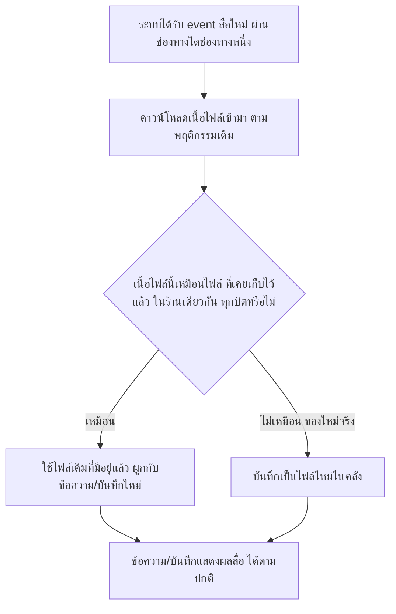
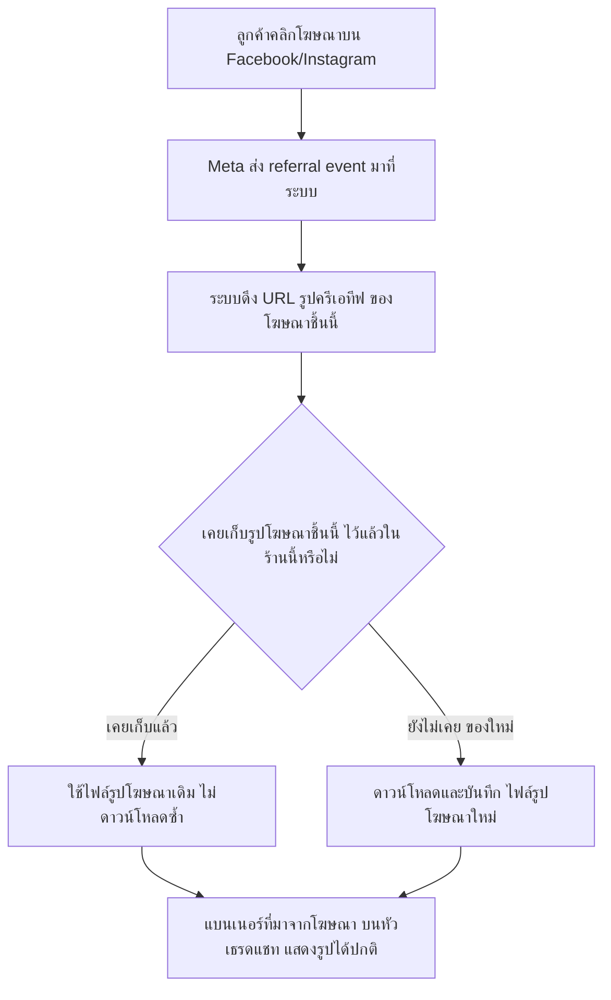
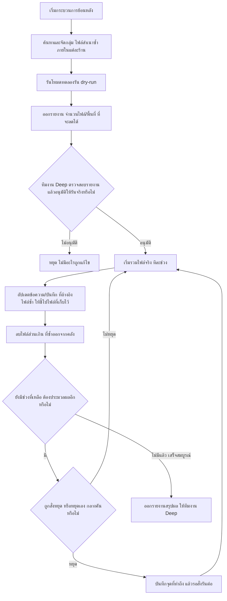

> **โมดูล:** M00051-ChatMediaDedup
> **ประเภทเอกสาร:** Business Requirements Document (BRD) — NON-TECHNICAL
> **เวอร์ชัน:** 1.0
> **วันที่จัดทำ:** 2026-08-19
> **สถานะ:** Draft
> **เจ้าของเอกสาร:** BA (ดู [[Feature-Docs-Ownership]])

# BRD: Chat Media Deduplication — ลดสำเนาไฟล์สื่อซ้ำในแชท (Business Requirements Document)

---

## 1. บทนำ

### 1.1 วัตถุประสงค์ของเอกสาร

เอกสารนี้มีวัตถุประสงค์เพื่อ:
1. กำหนด Functional Requirements ระดับ non-technical สำหรับการหยุด "เก็บไฟล์ซ้ำ" ของสื่อในแชท (รูป/วิดีโอ/เสียง/ไฟล์/สติกเกอร์/รูปโฆษณา/รูปโปรไฟล์ผู้ติดต่อ) ที่ระบบดาวน์โหลดมาเก็บเองจาก Facebook/Instagram/LINE
2. กำหนดขอบเขตการทำงาน — ทั้งการ "หยุดสร้างสำเนาซ้ำตั้งแต่ต้นทาง" (ทุกข้อความใหม่ที่เข้ามาจากนี้ไป) และ "จัดการสำเนาซ้ำที่มีอยู่แล้ว" (~4,332 MB ในคลังไฟล์ปัจจุบัน) แยกจากกันให้ชัด
3. ระบุเงื่อนไขการรับงาน (Acceptance Criteria) ที่ทีม QA นำไปสร้าง Test Case ได้โดยตรง โดยเฉพาะเงื่อนไขที่ป้องกันไม่ให้ผู้ใช้เห็นรูป/สื่อหายไปจากสายตาแม้แต่ใบเดียว
4. สร้างความเข้าใจร่วมกันระหว่างทีมธุรกิจและทีมพัฒนา ก่อนเริ่ม implement feature — โดยเฉพาะการแยกให้ชัดว่าฟีเจอร์นี้ **ไม่ใช่** นโยบายลบรูปเก่า/retention

### 1.2 ขอบเขตของระบบ

**Chat Media Deduplication** คือกลไกเบื้องหลังที่ทำให้ระบบไม่เก็บ "สำเนาไฟล์ที่เนื้อหาเหมือนกันทุกบิต" ซ้ำหลายใบภายในร้านค้าเดียวกันอีกต่อไป ครอบคลุม 2 ส่วน: (1) หยุดสร้างสำเนาซ้ำตั้งแต่ต้นทางสำหรับสื่อทุกชิ้นที่ระบบดึงเข้ามาใหม่จากนี้ไป และ (2) กระบวนการย้อนหลัง (backfill) ที่ค้นหาและรวมสำเนาซ้ำที่มีอยู่แล้วในคลังไฟล์ปัจจุบัน

**ปัญหาเชิงธุรกิจที่ต้นเรื่อง:** ระบบเก็บสำเนาของรูปเดียวกันซ้ำแล้วซ้ำอีก — ข้อมูล prod ณ 2026-08-19 พบว่าคลังไฟล์มี 15,805 ไฟล์ / 5,609 MB แต่เนื้อไฟล์ที่ต่างกันจริงมีแค่ 3,573 ไฟล์ → **4,332 MB (77% ของคลัง) เป็นสำเนาซ้ำ** และคลังโตเฉลี่ย ~248 MB/วัน (~7.4 GB/เดือน) ต้นตอหลักคือ **รูปโฆษณา**: ทุกครั้งที่ลูกค้าทักเข้ามาจากโฆษณา ระบบดึงรูปโฆษณาใบเดิมมาเก็บใหม่อีกหนึ่งใบเสมอ (3,901 รายการ ซ้ำ 3,894 รายการ = 99.8% ทั้งที่รูปโฆษณาที่ต่างกันจริงมีแค่ 40 ใบ) และสำเนาซ้ำที่พบทั้งหมด **ไม่เคยข้ามร้าน** — ทุกกลุ่มที่ซ้ำอยู่ในร้านเดียวกันทั้งหมด

**ทำไมระบบต้องดึงรูปมาเก็บเอง (นโยบายเดิม — ฟีเจอร์นี้ไม่แตะ ไม่ยกเลิก):** ลิงก์รูปจาก Facebook/Meta หมดอายุตามเวลา ถ้าไม่ดึงมาเก็บเอง ลูกค้า/ร้านจะเปิดดูรูปเก่าในแชทไม่ได้อีกเลย

**คุณค่าที่แท้จริงของฟีเจอร์นี้ (ไม่ใช่การประหยัดค่าใช้จ่าย — ระบบอยู่บน Supabase Pro โควตา 100 GB ใช้ไป 5.6 GB ยังไม่มีค่าใช้จ่ายส่วนเกินเลย):**
- ยืดอายุพื้นที่คงเหลือจาก ~13 เดือน เป็น ~50 เดือน (ลดอัตราการโตจาก 7.4 → ~2 GB/เดือน)
- รูปในแชทโหลดเร็วขึ้น (ปัจจุบันสำเนาแต่ละใบมีลิงก์คนละอัน ระบบ cache ใช้ร่วมกันไม่ได้เลย)
- ลดงานที่ระบบต้องทำตอนรับข้อความใหม่ (ตัดการดาวน์โหลดรูปโฆษณาซ้ำ ~3,900 ครั้งที่ผ่านมา และทุกครั้งใหม่ที่จะเกิดขึ้น)
- เป็น **เงื่อนไขบังคับก่อน** ที่จะออกนโยบาย "ลบรูปเก่า" ใด ๆ ได้อย่างปลอดภัยในอนาคต (ถ้าลบโดยไม่รู้ว่ามีสำเนาซ้ำอ้างอิงอยู่ อาจลบไฟล์ที่จริงยังมีคนใช้)

**เข้าสู่ระบบ (Input):**
- สื่อขาเข้าจากทุกช่องทาง (Facebook Messenger, Instagram, LINE) ที่ระบบดาวน์โหลดมาเก็บเอง ได้แก่ รูป วิดีโอ เสียง ไฟล์ สติกเกอร์ รูปโฆษณา (ครีเอทีฟที่ Meta ส่งมาตอนลูกค้าคลิกโฆษณา) และรูปโปรไฟล์ผู้ติดต่อ
- คลังไฟล์สื่อที่มีอยู่แล้วในระบบ ณ วันเริ่มงาน (15,805 ไฟล์ / 5,609 MB) — สำหรับกระบวนการย้อนหลัง

**ออกจากระบบ (Output):**
- สื่อใหม่ที่เข้ามาจากนี้ไป: ไม่มีการสร้างไฟล์ใหม่ซ้ำเมื่อเนื้อไฟล์เหมือนกันทุกบิตกับไฟล์ที่เก็บไว้แล้วในร้านเดียวกัน
- คลังไฟล์เดิม: สำเนาซ้ำที่มีอยู่ (~4,332 MB) ถูกรวมเหลือไฟล์เดียวต่อกลุ่มเนื้อหา ภายในขอบเขตร้านเดียวกัน
- ทุกข้อความ/บันทึกที่เคยอ้างอิงถึงสื่อ ยังแสดงผลรูป/สื่อได้ปกติเหมือนเดิมทุกใบ ทั้งก่อนและหลังกระบวนการทำงาน
- รายงานสรุปผล (จำนวนไฟล์ที่รวม, พื้นที่ที่ลดได้) ให้ทีมงาน Deep

**ระบบที่เกี่ยวข้อง:**
- ระบบดึงสื่อจาก Meta/LINE เข้ามาเก็บเอง (ingest/mirror ของ Deep Chat, feature 00018/00011)
- คลังไฟล์ (Storage) ของระบบ
- เธรดแชทฝั่งร้าน/ผู้ซื้อที่แสดงผลรูป/สื่อ
- ระบบบันทึกที่มาของลูกค้าจากโฆษณา (Ad Referral — feature ที่เกี่ยวข้องกับ E5)

### 1.3 กลุ่มผู้ใช้งาน

| กลุ่มผู้ใช้ | บทบาท | สิทธิ์การใช้งาน |
|-----------|--------|----------------|
| **ลูกค้า (ผู้ซื้อ)** | ผู้ใช้ปลายทางที่แชทกับร้าน — ได้รับผลทางอ้อม | ต้องเห็นรูป/สื่อทุกใบในแชทเหมือนเดิมทุกประการ ไม่มีหน้าจอ/การตั้งค่าใดที่เกี่ยวกับฟีเจอร์นี้โดยตรง |
| **ร้านค้า (Seller)** | ผู้ใช้ปลายทางที่ใช้แชทตอบลูกค้า — ได้รับผลทางอ้อม | ต้องเห็นรูปในแชท/บันทึกออเดอร์เหมือนเดิม ได้รับความเร็วในการโหลดรูปที่ดีขึ้น ไม่มีหน้าจอ/การตั้งค่าใดที่เกี่ยวกับฟีเจอร์นี้โดยตรง |
| **ทีมงาน Deep (Admin/Dev-Ops ระดับระบบ)** | ผู้ควบคุมกระบวนการย้อนหลัง | เป็นกลุ่มเดียวที่มีสิทธิ์สั่งค้นหาสำเนาซ้ำ, รันโหมดทดลองรัน (dry-run), อนุมัติ/สั่งรัน/หยุด/รันต่อกระบวนการรวมไฟล์จริง และดูรายงานผล |

### 1.4 ข้อสมมติฐาน (Assumptions)

> รายการต่อไปนี้เป็นสมมติฐานที่ตั้งไว้เพื่อไม่ให้งานหยุดชะงักจากความกำกวมเล็กน้อย — ข้อที่ทำเครื่องหมาย **ยังไม่ยืนยันกับ user** ต้องถูกตรวจสอบก่อนเริ่ม implement จริง

- "เนื้อไฟล์เหมือนกัน" ในเอกสารนี้หมายถึง **เหมือนกันทุกบิต (bit-identical)** เป็นเกณฑ์เริ่มต้น — เลือกเกณฑ์นี้เพื่อไม่ให้เกิดการรวมไฟล์คนละเนื้อหาเข้าด้วยกันผิดพลาด (false-positive) แม้จะจับสำเนาที่ผ่านการบีบอัด/แก้ไขเล็กน้อยจากต้นทางไม่ได้ก็ตาม — **ยังไม่ยืนยันกับ user**
- ตัวเลข "โฆษณาที่ต่างกันจริง 40 ใบ" เป็นภาพ ณ วันที่ 2026-08-19 เท่านั้น ไม่ใช่เพดานตายตัว — ระบบต้องรองรับโฆษณาชิ้นใหม่ที่เพิ่มขึ้นเรื่อย ๆ ได้ตามปกติ ไม่ hardcode จำนวน
- อัตราการเติบโตของคลังหลังแก้ปัญหา (~2 GB/เดือน) เป็นค่าประมาณจากสัดส่วนสำเนาซ้ำปัจจุบัน ไม่ใช่ตัวเลขค้ำประกัน ขึ้นกับพฤติกรรมลูกค้า/แคมเปญโฆษณาจริงในอนาคต
- สิทธิ์สั่งรัน/อนุมัติกระบวนการย้อนหลังจำกัดเฉพาะทีมงาน Deep ระดับระบบเท่านั้น — ยังไม่กำหนดว่าต้องมีหน้าจอ (UI) ให้สั่งงานหรือรันผ่านเครื่องมือภายใน (script/CLI) เท่านั้น — **ยังไม่ยืนยันกับ user**
- ไม่มี SLA บังคับว่ากระบวนการย้อนหลังต้องเสร็จภายในกี่วัน — assume ว่าควรรันแบบไม่เร่งรีบ (throttle) เพื่อไม่แย่ง resource กับแชทสด — **ยังไม่ยืนยันกับ user**
- ขอบเขต "ต่อร้าน" (per-shop) ครอบคลุมทุก entity ที่ผูกกับสื่อเท่าที่มีอยู่ในระบบปัจจุบัน (ข้อความในแชท, บันทึกที่มาจากโฆษณา, รูปโปรไฟล์ผู้ติดต่อ) — entity ใหม่ที่จะเกิดจาก feature อื่นในอนาคตไม่อยู่ใน BRD ฉบับนี้

### 1.5 นอกขอบเขต (Out of Scope)

- **นโยบายลบรูป/retention ทุกชนิด** (เช่น ลบรูปที่เก่ากว่า N วัน, ลบรูปของออเดอร์ที่ปิดไปแล้ว) — เป็น feature แยกในอนาคตที่ต้องมี BRD ของตัวเอง และฟีเจอร์นี้ (dedup) ต้องเสร็จก่อนเป็นเงื่อนไขบังคับ เพื่อไม่ให้นโยบายลบในอนาคตลบไฟล์ที่จริงแล้วยังมีสำเนาซ้ำอ้างอิงอยู่โดยไม่รู้ตัว
- **การเปลี่ยนนโยบาย mirror เดิม** — ระบบยังต้องดาวน์โหลดสื่อจาก Meta/LINE มาเก็บเองเหมือนเดิมทุกประการ ไม่เปลี่ยนว่าจะ mirror ประเภทไหน/เมื่อไร
- **การรวมสำเนาซ้ำข้ามร้าน (cross-shop dedup)** — แม้ทางเทคนิคทำได้ แต่ข้อมูล prod ยืนยันว่าสำเนาซ้ำไม่เคยข้ามร้านเลย จึงไม่มีประโยชน์เพิ่ม และเป็นการเปิดความเสี่ยงเรื่องขอบเขตข้อมูลระหว่างร้านโดยไม่จำเป็น
- **การบีบอัด/ลดคุณภาพไฟล์ (compress/resize)** — ฟีเจอร์นี้ทำแค่ "ไม่เก็บซ้ำ" ไม่ใช่ "ทำให้แต่ละไฟล์เล็กลง"
- **การเปลี่ยนแปลง UI/UX ฝั่งลูกค้าและร้านค้า** — ฟีเจอร์นี้เป็นการเปลี่ยนวิธีเก็บไฟล์เบื้องหลังล้วน ๆ ไม่มีหน้าจอใหม่ ไม่มีอะไรให้ผู้ใช้ปลายทางเรียนรู้เพิ่ม

---

## 2. ความต้องการหลัก (Functional Requirements)

### 2.1 หยุดสร้างสำเนาซ้ำตั้งแต่ต้นทาง

#### FR-CMD-01: ตรวจสอบเนื้อไฟล์ก่อนบันทึกไฟล์ใหม่ทุกครั้งที่ดึงสื่อเข้ามา

**User Story:**
> ในฐานะระบบที่ดึงสื่อจาก Facebook/Instagram/LINE เข้ามาเก็บเอง ฉันต้องการตรวจสอบก่อนบันทึกว่าเนื้อไฟล์นี้เคยถูกเก็บไว้แล้วหรือยังภายในร้านเดียวกัน เพื่อไม่ต้องบันทึกไฟล์ใหม่ซ้ำเมื่อเนื้อหาเหมือนเดิมทุกบิต

**Acceptance Criteria:**
- [ ] เมื่อระบบดึงสื่อ (รูป/วิดีโอ/เสียง/ไฟล์/สติกเกอร์/รูปโปรไฟล์) เข้ามาและพบว่าเนื้อไฟล์เหมือนกันทุกบิตกับไฟล์ที่เคยเก็บไว้แล้วในร้านเดียวกัน ระบบต้องนำไฟล์เดิมที่มีอยู่แล้วมาผูกกับข้อความ/บันทึกใหม่ **โดยไม่สร้างไฟล์ใหม่ในคลัง**
- [ ] เมื่อเนื้อไฟล์ที่ดึงเข้ามาไม่เคยมีในร้านนั้นมาก่อน ระบบต้องบันทึกเป็นไฟล์ใหม่ตามพฤติกรรมเดิมทุกประการ
- [ ] การตรวจสอบนี้ทำงานกับทุกช่องทาง (Facebook, Instagram, LINE) และทุกประเภทสื่อที่ระบบดึงมาเก็บอยู่แล้ว (รูป วิดีโอ เสียง ไฟล์ สติกเกอร์ รูปโฆษณา รูปโปรไฟล์ผู้ติดต่อ)
- [ ] ไฟล์ที่มีเนื้อหาเหมือนกันแต่บันทึกไว้คนละร้าน ต้องยังถูกเก็บเป็นคนละไฟล์เสมอ (ไม่รวมข้ามร้าน)

**Business Flow:**
1. ระบบได้รับ event สื่อใหม่จากช่องทางใดช่องทางหนึ่ง (webhook ข้อความ/referral)
2. ระบบดาวน์โหลดเนื้อไฟล์เข้ามา (พฤติกรรมเดิม ไม่เปลี่ยน)
3. ระบบตรวจสอบว่าเนื้อไฟล์นี้เหมือนกับไฟล์ที่เคยเก็บไว้แล้ว "ในร้านเดียวกัน" หรือไม่
4. ถ้าเหมือน → ใช้ไฟล์เดิม ผูกกับข้อความ/บันทึกใหม่
5. ถ้าไม่เหมือน (ของใหม่จริง) → บันทึกเป็นไฟล์ใหม่ตามปกติ
6. ข้อความ/บันทึกแสดงผลสื่อได้ตามปกติในทั้งสองกรณี



**Example:**
```
ลูกค้า A ทักแชทร้าน B แล้วส่งรูปสลิปเดียวกันสองครั้งโดยไม่ได้ตั้งใจ (กดส่งซ้ำ)
- ครั้งแรก: เนื้อไฟล์ใหม่ → บันทึกไฟล์ 1 ใบในคลัง
- ครั้งที่สอง: เนื้อไฟล์เหมือนทุกบิตกับครั้งแรก → ระบบผูกข้อความที่สองเข้ากับไฟล์เดิม
ผลลัพธ์: คลังไฟล์มีรูปสลิปนี้อยู่ 1 ใบ (ไม่ใช่ 2 ใบ) แต่แชทยังแสดงข้อความรูป 2 ครั้งตามที่ลูกค้าส่งจริง
```

#### FR-CMD-02: ไม่ดึงรูปโฆษณาซ้ำเมื่อลูกค้าคลิกโฆษณาเดิม (ต้นตอหลักของปัญหา)

**User Story:**
> ในฐานะระบบที่บันทึกที่มาของลูกค้าจากการคลิกโฆษณา ฉันต้องการนำรูปโฆษณาที่เคยดึงมาเก็บไว้แล้วมาใช้ซ้ำ เมื่อมีลูกค้าคนใหม่หรือคนเดิมคลิกโฆษณาชิ้นเดียวกันอีก เพื่อไม่ต้องดาวน์โหลดรูปโฆษณาเดิมซ้ำหลายพันครั้ง ทั้งที่โฆษณาจริงมีอยู่ไม่กี่สิบชิ้น

**Acceptance Criteria:**
- [ ] เมื่อลูกค้าคนใหม่/คนเดิมคลิกโฆษณาที่เคยมีคนคลิกมาก่อนแล้วภายในร้านเดียวกัน (รูปโฆษณาเนื้อหาเดียวกันทุกบิต) ระบบต้อง**ไม่บันทึกไฟล์รูปใหม่** ให้ใช้ไฟล์รูปโฆษณาที่มีอยู่แล้ว
- [ ] แบนเนอร์ที่มาจากโฆษณาบนหัวเธรดแชท (ที่แสดง "ทักมาจากโฆษณาไหน") ยังต้องแสดงรูปได้ปกติทุกกรณี ไม่ว่าจะเป็นครั้งแรกหรือครั้งที่ N ที่มีคนคลิกโฆษณาชิ้นนั้น
- [ ] เมื่อเป็นโฆษณาชิ้นใหม่ที่ไม่เคยมีในร้านนั้นมาก่อน ระบบยังต้องดาวน์โหลดและบันทึกรูปตามปกติ (ฟีเจอร์นี้ต้องไม่ปิดกั้นโฆษณาใหม่จากการมีรูป)



**Example:**
```
ร้าน B มีโฆษณาชิ้นหนึ่งที่เคยมีลูกค้าคลิกมาแล้ว 50 คน — รูปโฆษณาถูกเก็บไว้แล้ว 1 ไฟล์ในคลัง
ลูกค้าคนที่ 51 คลิกโฆษณาชิ้นเดียวกัน → ระบบตรวจพบว่าเนื้อไฟล์รูปเหมือนของเดิมทุกบิต
→ ใช้ไฟล์เดิม ไม่ดาวน์โหลดซ้ำ
ผลลัพธ์: คลังไฟล์ยังมีรูปโฆษณาชิ้นนี้อยู่ 1 ไฟล์ ไม่ใช่ 51 ไฟล์
```

### 2.2 จัดการสำเนาซ้ำที่มีอยู่แล้ว (ย้อนหลัง)

#### FR-CMD-03: ค้นหาและระบุกลุ่มสำเนาซ้ำที่มีอยู่แล้วในคลังไฟล์ปัจจุบัน

**User Story:**
> ในฐานะทีมงาน Deep ฉันต้องการให้ระบบสำรวจคลังไฟล์ที่มีอยู่แล้วและระบุว่าไฟล์ไหนเป็นสำเนาซ้ำของไฟล์ไหนภายในร้านเดียวกัน เพื่อรู้ขอบเขตงานก่อนตัดสินใจรวมไฟล์จริง

**Acceptance Criteria:**
- [ ] ระบบต้องสามารถจัดกลุ่มไฟล์ในคลังปัจจุบันตามเนื้อไฟล์ที่เหมือนกันทุกบิต ภายในขอบเขตร้านเดียวกัน
- [ ] ผลการสำรวจต้องบอกได้อย่างน้อย: จำนวนไฟล์ทั้งหมดที่ตรวจ, จำนวนกลุ่มสำเนาซ้ำที่พบ, พื้นที่ที่จะลดได้โดยประมาณถ้ารวมกลุ่มเหล่านี้
- [ ] ไฟล์ที่ไม่มีสำเนาซ้ำ (unique) ต้องไม่ถูกจัดว่าเป็นเป้าหมายของการรวมไฟล์

#### FR-CMD-04: โหมดทดลองรัน (dry-run) ก่อนลบไฟล์จริง

**User Story:**
> ในฐานะทีมงาน Deep ฉันต้องการรันกระบวนการรวมสำเนาซ้ำแบบ "ทดลอง" ที่รายงานผลลัพธ์ล่วงหน้าโดยไม่ลบ/แก้ไขข้อมูลจริงใด ๆ เพื่อตรวจสอบความถูกต้องก่อนดำเนินการจริงที่แก้ไขข้อมูลและลบไฟล์จริง

**Acceptance Criteria:**
- [ ] เมื่อรันโหมดทดลองรัน ระบบต้องออกรายงาน (จำนวนไฟล์ที่จะถูกรวม, พื้นที่ที่จะลดได้, จำนวนข้อความ/บันทึกที่จะถูกปรับให้ชี้ไปไฟล์ที่เก็บไว้แทน) โดย**ไม่มีไฟล์ใดถูกลบจริงจากคลัง**
- [ ] เมื่อรันโหมดทดลองรัน ต้อง**ไม่มีข้อความ/บันทึกใดในระบบเปลี่ยนแปลงค่าอ้างอิงไฟล์จริง** (การอ้างอิงเดิมต้องเหมือนก่อนรันทุกประการ)
- [ ] กระบวนการรวมไฟล์จริง (ที่ลบไฟล์สำเนาซ้ำ) ต้องรันตามหลังโหมดทดลองรันเสมอ — ห้ามมีเส้นทางที่ลบไฟล์จริงโดยไม่เคยผ่านรายงานผลจาก dry-run มาก่อน

#### FR-CMD-05: รวมสำเนาซ้ำจริง (backfill) แบบแบ่งช่วง หยุด/รันต่อได้

**User Story:**
> ในฐานะทีมงาน Deep ฉันต้องการรันกระบวนการรวมสำเนาซ้ำของไฟล์เก่าที่มีอยู่แล้ว (~4,332 MB) แบบแบ่งเป็นช่วงย่อย และสามารถหยุดกลางคันแล้วสั่งรันต่อได้โดยไม่ต้องเริ่มนับใหม่ตั้งแต่ต้น เพื่อให้งานย้อนหลังปริมาณมากทำได้อย่างปลอดภัย ไม่ต้องรันรวดเดียวจบ และไม่กระทบระบบขณะแชทสดกำลังทำงาน

**Acceptance Criteria:**
- [ ] เมื่อสั่งหยุดกระบวนการกลางคัน (ตั้งใจสั่งหยุด หรือหยุดเองกลางคันจากเหตุขัดข้อง เช่น deploy ใหม่) แล้วสั่งรันใหม่อีกครั้ง กระบวนการต้อง**ทำงานต่อจากจุดที่ค้างไว้** — ไม่เริ่มนับจากศูนย์ ไม่ข้ามรายการที่ยังไม่ได้ทำ ไม่ทำซ้ำรายการที่รวมเสร็จไปแล้ว
- [ ] ระหว่างกระบวนการทำงาน ข้อความ/รูปในแชทของผู้ใช้ (ลูกค้า/ร้าน) ต้องแสดงผลได้ปกติตลอดเวลา ไม่มีช่วงที่รูปหายหรือโหลดไม่ขึ้น
- [ ] หลังกระบวนการรวมไฟล์เสร็จสมบูรณ์สำหรับกลุ่มสำเนาซ้ำหนึ่ง ๆ ไฟล์ส่วนเกินที่ซ้ำต้องถูกลบออกจากคลังจริง เหลือเพียงไฟล์เดียวต่อกลุ่มเนื้อหา
- [ ] ลำดับการรวมไฟล์ต้องเป็น "อัปเดตทุกข้อความ/บันทึกที่อ้างอิงไฟล์ซ้ำให้ชี้ไปไฟล์ที่เก็บไว้ก่อน แล้วจึงลบไฟล์ส่วนเกิน" — ห้ามลบไฟล์ก่อนแล้วค่อยอัปเดตอ้างอิงทีหลัง (ป้องกันรูปหายชั่วขณะ)

### 2.3 การรับประกันว่าผู้ใช้ไม่เห็นความเปลี่ยนแปลง

#### FR-CMD-06: ผู้ใช้ต้องเห็นสื่อเดิมครบทุกใบเหมือนเดิมทุกประการ ทั้งก่อนและหลังกระบวนการทำงาน

**User Story:**
> ในฐานะลูกค้า/ร้านค้าที่ใช้งานแชท ฉันต้องการเห็นรูป/วิดีโอ/ไฟล์ทุกใบที่เคยเห็นในแชทเหมือนเดิมทุกประการ โดยไม่รู้เลยว่าเบื้องหลังมีการเปลี่ยนวิธีเก็บไฟล์ เพื่อไม่ให้ประสบการณ์การใช้งานเปลี่ยนไปแม้แต่น้อย

**Acceptance Criteria:**
- [ ] จำนวนรูป/สื่อที่แสดงในห้องแชทที่มีสำเนาซ้ำ ต้องเท่าเดิมทุกใบ ทั้งก่อนและหลังกระบวนการย้อนหลังทำงาน (นับจำนวนข้อความที่มีสื่อในห้องแชทเทียบกันก่อน/หลัง ต้องเท่ากันทุกห้อง)
- [ ] ลิงก์/หน้าที่เคยเปิดดูรูปได้ก่อนกระบวนการทำงาน ต้องยังเปิดดูรูปเดียวกันได้หลังกระบวนการทำงาน (ไม่มี broken image)
- [ ] ฟีเจอร์นี้ต้องไม่มี business flow ใดที่ลบข้อความ/บันทึกในแชท — แก้ไขเฉพาะ "ไฟล์ต้นทางเบื้องหลัง" เท่านั้น ไม่แตะข้อความ/ประวัติการสนทนา

### 2.4 การมองเห็นผลลัพธ์สำหรับทีมงาน

#### FR-CMD-07: รายงานผลให้ทีมงาน Deep เห็นพื้นที่ที่ลดได้

**User Story:**
> ในฐานะทีมงาน Deep ฉันต้องการเห็นรายงานสรุปหลังกระบวนการย้อนหลังทำงานเสร็จ เพื่อยืนยันผลลัพธ์และติดตามอัตราการเติบโตของคลังไฟล์หลังแก้ปัญหา

**Acceptance Criteria:**
- [ ] หลังกระบวนการรวมไฟล์เสร็จ ต้องมีรายงานอย่างน้อย: จำนวนไฟล์ที่ถูกรวม, พื้นที่ที่ลดได้ (MB), จำนวนกลุ่มที่ประมวลผลสำเร็จ/ล้มเหลว
- [ ] กลุ่มที่ประมวลผลล้มเหลว (ถ้ามี) ต้องถูกบันทึกแยกไว้ให้ตรวจสอบ ไม่ใช่ถูกข้ามแบบเงียบ ๆ

---

## 3. Acceptance Criteria สรุป

### 3.1 หยุดสร้างสำเนาซ้ำตั้งแต่ต้นทาง

**เมื่อระบบทำงานถูกต้อง:**
- ✅ สื่อที่เนื้อหาเหมือนไฟล์เดิมทุกบิตในร้านเดียวกัน (รวมถึงรูปโฆษณาที่ถูกคลิกซ้ำ) ไม่สร้างไฟล์ใหม่ในคลัง
- ✅ สื่อที่เนื้อหาไม่เคยมีมาก่อนในร้านนั้น ถูกเก็บเป็นไฟล์ใหม่ตามพฤติกรรมเดิมทุกประการ
- ✅ ไฟล์เนื้อหาเดียวกันที่อยู่คนละร้าน ไม่ถูกรวมเข้าด้วยกัน

### 3.2 จัดการสำเนาซ้ำที่มีอยู่แล้ว (ย้อนหลัง)

**เมื่อรัน backfill:**
- ✅ มีรายงานจาก dry-run ก่อนเสมอ โดยไม่มีไฟล์ถูกลบและไม่มีการอ้างอิงเปลี่ยนแปลงระหว่าง dry-run
- ✅ สั่งหยุดกลางคันแล้วรันต่อได้ ไม่ข้าม ไม่ทำซ้ำ ไม่เริ่มนับใหม่
- ✅ ไฟล์ที่ถูกรวมแล้วเหลือเพียงไฟล์เดียวต่อกลุ่มเนื้อหา และการอ้างอิงถูกอัปเดตก่อนลบไฟล์เกินเสมอ

### 3.3 ความสมบูรณ์ที่ผู้ใช้เห็น

**เมื่อกระบวนการใด ๆ ของฟีเจอร์นี้ทำงาน (ต้นทางหรือย้อนหลัง):**
- ✅ จำนวนสื่อที่แสดงในแชทเท่าเดิมทุกใบ ทั้งก่อนและหลัง
- ✅ ไม่มีรูปแตก/ลิงก์เสียในห้องแชทใด ๆ
- ✅ ไม่มีข้อความ/บันทึกถูกลบ

---

## 4. Business Flows (กระบวนการทำงาน)

### 4.1 Flow หลัก: ตรวจสอบสำเนาซ้ำตอนดึงสื่อเข้าใหม่ (ทุกช่องทาง)


### 4.2 Flow: รูปโฆษณาเมื่อมีลูกค้าคลิกโฆษณาเดิมซ้ำ


### 4.3 Flow: กระบวนการจัดการสำเนาซ้ำที่มีอยู่แล้ว (Backfill)



---

## 5. Use Case Scenarios (สถานการณ์การใช้งานจริง)

### Scenario 1: ลูกค้าใหม่คลิกโฆษณาที่เคยมีคนคลิกมาก่อนแล้ว (Best Case)

**ผู้เกี่ยวข้อง:** ลูกค้า (คนใหม่), ระบบดึงสื่อจากโฆษณา, ร้านค้า

**เงื่อนไขเริ่มต้น:**
- ร้าน B มีโฆษณาชิ้นหนึ่งที่เคยมีลูกค้าคลิกมาแล้ว 50 คน รูปโฆษณาถูกเก็บไว้แล้ว 1 ไฟล์ในคลัง

**ขั้นตอน:**
1. ลูกค้า C คลิกโฆษณาชิ้นเดียวกันเป็นคนที่ 51
2. Meta ส่ง referral event มาที่ระบบ พร้อม URL รูปครีเอทีฟของโฆษณา
3. ระบบตรวจพบว่าเนื้อไฟล์รูปนี้เหมือนไฟล์ที่เก็บไว้แล้วในร้าน B ทุกบิต
4. ระบบใช้ไฟล์เดิม ไม่ดาวน์โหลดซ้ำ ผูกกับบันทึกที่มาจากโฆษณาของลูกค้า C

**ผลลัพธ์:**
- แบนเนอร์ที่มาจากโฆษณาบนหัวเธรดของลูกค้า C แสดงรูปได้ปกติ คลังไฟล์ยังมีรูปโฆษณาชิ้นนี้อยู่ 1 ไฟล์เหมือนเดิม ไม่เพิ่มเป็น 51 ไฟล์

### Scenario 2: ลูกค้าส่งรูปสลิปที่ไม่เคยมีมาก่อนในระบบ (Unique Media)

**ผู้เกี่ยวข้อง:** ลูกค้า, ร้านค้า

**เงื่อนไขเริ่มต้น:**
- ลูกค้าเพิ่งโอนเงินและถ่ายรูปสลิปใหม่

**ขั้นตอน:**
1. ลูกค้าส่งรูปสลิปเข้าแชทร้าน
2. ระบบดาวน์โหลดเนื้อไฟล์เข้ามา
3. ระบบตรวจสอบแล้วพบว่าเนื้อไฟล์นี้ไม่เคยมีในร้านนั้นมาก่อน

**ผลลัพธ์:**
- ระบบบันทึกเป็นไฟล์ใหม่ตามพฤติกรรมเดิมทุกประการ ร้านเห็นรูปสลิปในแชททันที ไม่มีความล่าช้าหรือพฤติกรรมเปลี่ยนแปลง

### Scenario 3: ทีมงาน Deep รันกระบวนการย้อนหลังจัดการสำเนาซ้ำที่มีอยู่แล้ว (Backfill ปกติ)

**ผู้เกี่ยวข้อง:** ทีมงาน Deep

**เงื่อนไขเริ่มต้น:**
- คลังไฟล์มีสำเนาซ้ำสะสม ~4,332 MB จาก 15,805 ไฟล์

**ขั้นตอน:**
1. ทีมงาน Deep สั่งค้นหาและจัดกลุ่มสำเนาซ้ำในคลังปัจจุบัน
2. รันโหมดทดลองรัน (dry-run) ได้รายงาน "จะรวมได้ X ไฟล์ ลดได้ Y MB"
3. ทีมงาน Deep ตรวจสอบรายงานแล้วอนุมัติ
4. รันกระบวนการรวมไฟล์จริงแบบแบ่งช่วง

**ผลลัพธ์:**
- คลังไฟล์ลดขนาดลงตามรายงาน ผู้ใช้ (ลูกค้า/ร้าน) ไม่เห็นความเปลี่ยนแปลงใด ๆ ในหน้าแชท

### Scenario 4: กระบวนการ Backfill ถูกขัดจังหวะกลางคัน (Edge Case)

**ผู้เกี่ยวข้อง:** ทีมงาน Deep, ระบบ (เช่น deploy ใหม่ทำให้ process รีสตาร์ท)

**เงื่อนไขเริ่มต้น:**
- กระบวนการรวมไฟล์จริงกำลังทำงานอยู่ที่ช่วงที่ 40 จากทั้งหมด 100 ช่วง

**ขั้นตอน:**
1. ระบบถูกรีสตาร์ทกลางคัน (เช่น deploy ใหม่) ทำให้กระบวนการหยุดกะทันหัน
2. ทีมงาน Deep สั่งรันกระบวนการใหม่อีกครั้งภายหลัง
3. ระบบอ่านจุดที่ทำถึงล่าสุด (ช่วงที่ 40) แล้วเริ่มทำต่อจากช่วงที่ 41

**ผลลัพธ์:**
- ไม่มีช่วงใดถูกข้าม ไม่มีช่วงใดถูกทำซ้ำ (ช่วงที่ 1–40 ที่เสร็จแล้วไม่ถูกประมวลผลซ้ำ) งานเสร็จสมบูรณ์ครบทั้ง 100 ช่วงในที่สุด

---

## 6. ความต้องการด้านคุณภาพ (Quality Requirements)

### 6.1 ความถูกต้องของข้อมูล
- การตัดสินว่า "ไฟล์ซ้ำ" ต้องอิงเนื้อไฟล์เหมือนกันทุกบิตเท่านั้น ห้ามใช้เกณฑ์ที่คลาดเคลื่อนได้ (เช่น ชื่อไฟล์ หรือขนาดไฟล์อย่างเดียว หรือความคล้ายของภาพ) เพื่อไม่ให้เกิด false-positive ที่ทำให้ไฟล์คนละเนื้อหาถูกรวมกันผิด

### 6.2 ความรวดเร็ว
- การตรวจสอบซ้ำตอนดึงสื่อเข้าใหม่ (ingest) ต้องไม่ทำให้เวลาที่ข้อความ/รูปใหม่ปรากฏในแชทช้าลงจนผู้ใช้สังเกตเห็นได้ ต้องเร็วใกล้เคียงพฤติกรรมเดิมที่ไม่มีการตรวจซ้ำ

### 6.3 ความน่าเชื่อถือ
- กระบวนการย้อนหลัง (backfill) ต้องไม่ทำให้ข้อมูลเสียหาย ไม่มีสถานะ "ค้างครึ่ง ๆ กลาง ๆ" ที่ข้อความชี้ไปไฟล์ที่ถูกลบไปแล้ว — ทุกขั้นตอนต้องอัปเดตการอ้างอิงให้เสร็จก่อนลบไฟล์ต้นทางเสมอ ไม่มีช่วงเวลาที่รูปหายไปจากผู้ใช้

### 6.4 ความปลอดภัย
- เฉพาะทีมงาน Deep (สิทธิ์ระดับระบบ) เท่านั้นที่สั่งรัน/หยุด/อนุมัติกระบวนการย้อนหลังได้ ห้ามเปิดสิทธิ์นี้ให้ seller ระดับร้านสั่งเอง เพราะกระทบคลังไฟล์รวมของทั้งระบบ
- ต้องผ่านโหมดทดลองรัน (dry-run) และรายงานผลก่อนทุกครั้งที่จะลบไฟล์จริง — ไม่มีเส้นทางลัด

### 6.5 ความสะดวกในการใช้งาน (Usability)
- ฟีเจอร์นี้ไม่มีหน้าจอใหม่สำหรับลูกค้า/ร้าน — ผู้ใช้ปลายทางไม่ต้องเรียนรู้อะไรใหม่ ประสบการณ์ต้องเหมือนเดิมทุกประการ

---

## 7. ข้อจำกัด (Constraints)

### 7.1 ข้อจำกัดทางธุรกิจ
- ห้ามลบ/ทำลายรูปที่ผู้ใช้เคยเห็นในแชท ไม่ว่ากรณีใด
- ห้ามเปลี่ยนนโยบาย mirror เดิม — ระบบยังต้องดึงสื่อจาก Meta/LINE มาเก็บเองเสมอ เพราะลิงก์ต้นทางหมดอายุ
- การเทียบซ้ำต้องอยู่ในขอบเขต "ร้านเดียวกัน" เท่านั้น ห้ามรวมไฟล์ข้ามร้าน แม้เนื้อไฟล์จะเหมือนกัน (เพื่อไม่ให้ความเป็นเจ้าของ/ขอบเขตข้อมูลของแต่ละร้านเกี่ยวพันกัน)
- โครงการนี้ไม่ใช่นโยบายลบรูปเก่า/retention — จะเป็น feature แยกในอนาคตที่ต้องมี BRD ของตัวเอง

### 7.2 ข้อจำกัดทางเทคนิค
- ต้องทำงานร่วมกับกระบวนการดึงสื่อเข้ามาที่มีอยู่แล้วในปัจจุบัน โดยไม่ทำให้พฤติกรรมเดิมของช่องทางใดพังหรือช้าลงจนกระทบผู้ใช้จริง
- กระบวนการย้อนหลัง (backfill) ต้องทำงานได้แม้ระบบแชทสดกำลังถูกใช้งานพร้อมกัน โดยไม่หยุดให้บริการ

---

## 8. กฎทางธุรกิจ (Business Rules)

### 8.1 กฎเรื่องขอบเขตการเทียบซ้ำ
- **BR-CMD-01:** เทียบไฟล์ซ้ำเฉพาะภายในร้านเดียวกันเท่านั้น — ห้ามเทียบ/รวมข้ามร้าน ไม่ว่าเนื้อไฟล์จะเหมือนกันแค่ไหน
- **BR-CMD-02:** "ซ้ำ" หมายถึงเนื้อไฟล์เหมือนกันทุกบิต ไม่ใช่แค่หน้าตาคล้ายกันหรือชื่อไฟล์เดียวกัน

### 8.2 กฎเรื่องความสมบูรณ์ที่ผู้ใช้เห็น
- **BR-CMD-03:** ห้ามมีรูป/สื่อใดหายไปจากสายตาผู้ใช้ ไม่ว่าจะเป็นขั้นตอนหยุดสร้างสำเนาซ้ำตั้งแต่ต้นทาง หรือกระบวนการย้อนหลัง
- **BR-CMD-04:** ข้อความ/บันทึกเดิมทุกรายการต้องยังอ้างอิงถึงสื่อได้ปกติเสมอ แม้ไฟล์จริงเบื้องหลังจะถูกรวมเป็นใบเดียวแล้ว

### 8.3 กฎเรื่องความปลอดภัยของ Backfill
- **BR-CMD-05:** ต้องมีโหมดทดลองรัน (dry-run) และรายงานผลก่อนลบไฟล์จริงทุกครั้ง — ไม่มีข้อยกเว้น
- **BR-CMD-06:** กระบวนการรวมไฟล์จริงต้องรันแบบแบ่งช่วง หยุดกลางคันแล้วรันต่อได้เสมอ (resumable) ไม่ใช่งานที่ต้องรันรวดเดียวจบ
- **BR-CMD-07:** ห้ามลบไฟล์ต้นทางก่อนอัปเดตการอ้างอิงของข้อความ/บันทึกทั้งหมดที่ชี้ไปไฟล์นั้นให้เสร็จก่อนเสมอ

### 8.4 กฎเรื่องขอบเขตนโยบาย mirror เดิม
- **BR-CMD-08:** ระบบยังต้องดาวน์โหลดสื่อจาก Meta/LINE เข้ามาเก็บเองเหมือนเดิมเสมอ — ฟีเจอร์นี้ไม่เปลี่ยนพฤติกรรมนี้
- **BR-CMD-09:** ฟีเจอร์นี้ไม่ใช่นโยบาย retention/ลบรูปเก่า — ห้ามลบไฟล์ใดที่ไม่ใช่สำเนาซ้ำที่ถูกระบุแล้วผ่านกระบวนการที่กำหนดในเอกสารนี้

---

## 9. อภิธานศัพท์ (Glossary)

| คำศัพท์ | ความหมาย |
|---------|----------|
| **สำเนาซ้ำ (Duplicate Copy)** | ไฟล์สื่อที่เนื้อหาเหมือนกันทุกบิตกับไฟล์อื่นที่มีอยู่แล้วภายในร้านเดียวกัน แต่ถูกบันทึกเป็นคนละไฟล์ในคลัง |
| **เนื้อไฟล์ (File Content)** | ข้อมูลดิบของไฟล์สื่อ ไม่นับชื่อไฟล์/เวลาที่สร้าง/metadata อื่น |
| **ต้นทาง (Ingest)** | จุดที่ระบบดึงสื่อจากช่องทางภายนอก (Facebook/Instagram/LINE) เข้ามาเก็บเองเป็นครั้งแรก |
| **ย้อนหลัง (Backfill)** | กระบวนการที่ตรวจและรวมสำเนาซ้ำที่มีอยู่แล้วในคลังไฟล์ปัจจุบัน (ก่อนฟีเจอร์นี้ทำงาน) |
| **โหมดทดลองรัน (Dry-Run)** | การรันกระบวนการเพื่อดูผลลัพธ์ล่วงหน้า โดยไม่มีการแก้ไข/ลบข้อมูลจริง |
| **รูปโฆษณา (Ad Creative Image)** | รูปที่ Meta ส่งมาพร้อม referral event เมื่อลูกค้าคลิกโฆษณา ใช้แสดงเป็นแบนเนอร์ที่มาบนหัวเธรดแชท |
| **ขอบเขตร้าน (Per-Shop Scope)** | หลักการที่การเทียบ/รวมสำเนาซ้ำทำเฉพาะภายในร้านเดียวกัน ไม่ข้ามไปร้านอื่น |
| **การรีจูม (Resumable)** | ความสามารถของกระบวนการที่หยุดกลางคันแล้วรันต่อจากจุดที่ค้างไว้ได้ โดยไม่ข้าม/ไม่ทำซ้ำ |

---

## 10. สรุป

เอกสาร BRD นี้อธิบายความต้องการหลักของ **Chat Media Deduplication** แบบไม่ใช่เทคนิค — กลไกเบื้องหลังที่หยุดเก็บไฟล์สื่อในแชทซ้ำ ทั้งการป้องกันตั้งแต่ต้นทางสำหรับสื่อใหม่ทุกชิ้นที่เข้ามาจากนี้ไป และการจัดการสำเนาซ้ำที่มีอยู่แล้วในคลังไฟล์ย้อนหลัง โดยยึดหลักการสำคัญที่สุดคือ **ผู้ใช้ต้องไม่เห็นความเปลี่ยนแปลงใด ๆ เลย** — ทุกรูป/สื่อที่เคยเห็นในแชทต้องยังเห็นได้ครบทุกใบเหมือนเดิม

**จุดเด่นของระบบ:**
- แก้ต้นตอที่แท้จริงของปัญหา (รูปโฆษณาที่ถูกดาวน์โหลดซ้ำทุกครั้งที่มีคนคลิก) ไม่ใช่แก้ปลายเหตุด้วยการลบทิ้ง
- แยกขอบเขตชัดเจนระหว่าง "หยุดสร้างสำเนาซ้ำต่อจากนี้" กับ "จัดการสำเนาเก่าที่มีอยู่" และไม่ปนกับนโยบายลบ/retention ซึ่งเป็นเรื่องละเอียดอ่อนกว่าที่ต้องแยกตัดสินใจเป็นฟีเจอร์อนาคต
- กระบวนการย้อนหลังปลอดภัยด้วยหลัก dry-run ก่อนเสมอ และรันแบบแบ่งช่วง/รีจูมได้ ไม่เสี่ยงต่อข้อมูลจริงระหว่างระบบยังให้บริการอยู่

**ผลลัพธ์ที่คาดหวัง:**
- คลังไฟล์สื่อลดจาก 5,609 MB เหลือใกล้เคียง 3,573 MB ที่เป็นเนื้อหาจริงที่ต่างกัน (ลดสำเนาซ้ำ ~4,332 MB ที่มีอยู่)
- อัตราการเติบโตของคลังไฟล์ลดจาก ~7.4 GB/เดือน เหลือประมาณ ~2 GB/เดือน หลังจากไม่มีการดาวน์โหลดรูปโฆษณาซ้ำอีก
- คลังไฟล์เดิมไม่มีข้อความ/รูปใดหายไปจากสายตาผู้ใช้แม้แต่ใบเดียว ตรวจสอบได้ด้วยการนับจำนวนสื่อในแชทก่อน/หลังกระบวนการทำงาน

---

**หมายเหตุ:**
สำหรับความต้องการทางธุรกิจระดับภาพรวม/personas/KPI ดู [[PRD]] ของโมดูลนี้
สำหรับ technical specification (architecture/API/data/NFR) ดู [[SRS]] ของโมดูลนี้
