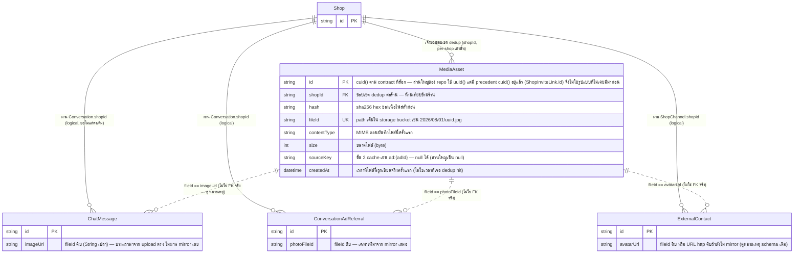

> **โมดูล:** M00051-ChatMediaDedup
> **ประเภทเอกสาร:** DATABASE Design
> **เวอร์ชัน:** 1.0
> **วันที่จัดทำ:** 2026-08-19
> **สถานะ:** Draft — schema ยังไม่เคย migrate ที่ไหน (dev/prod)
> **เจ้าของเอกสาร:** safepay-database (ดู [[Feature-Docs-Ownership]])

# DATABASE: การกำจัดไฟล์สื่อซ้ำในระบบแชท (Chat Media Deduplication)

---

## 1. Overview

**Store:** PostgreSQL 16 (Supabase) ตัวเดียวกับทั้งระบบ · ORM: Prisma (`prisma/schema.prisma`)

เพิ่ม **1 ตารางใหม่** (`MediaAsset`) — เป็น "ดัชนีเนื้อไฟล์ต่อร้าน" ที่ choke point `saveMirroredBuffer`
(`src/services/channel-chat.service.ts`) ใช้ตรวจก่อนเขียนไฟล์ทุกครั้ง ไม่แตะคอลัมน์ของตาราง**เดิม**
ที่อ้างอิงไฟล์ทั้ง 3 ตัว (`ChatMessage.imageUrl`, `ConversationAdReferral.photoFileId`,
`ExternalContact.avatarUrl`) แม้แต่คอลัมน์เดียว — ฟีเจอร์นี้เพิ่มได้แค่ 2 อย่างบนของเดิม: (ก) **index
เพิ่ม** บน 2 คอลัมน์อ้างอิงที่ยังไม่มี index (§4) และ (ข) **การเปลี่ยนค่า** ของคอลัมน์เหล่านั้นให้ชี้ไป
fileId ที่รอด (repoint, ทำโดยสคริปต์ backfill — เป็น data operation ไม่ใช่ schema migration)

- **เอกสารต้นทาง:** [[PRD]] + [[BRD]] ของโมดูลนี้ (SRS/SDS เขียนขนานอยู่บน contract เดียวกันที่ระบุใน
  brief งานนี้ — schema ของ `MediaAsset` **ถูกล็อกแล้ว** ไม่ใช่การออกแบบใหม่ในเอกสารนี้)
- **Store ที่เกี่ยวข้อง:** PostgreSQL 16 (Supabase) เท่านั้น — ไม่มี store อื่น. ตัวไฟล์จริงอยู่ที่ storage
  driver เดิม (`local`/`s3` ตาม `STORAGE_DRIVER`, `src/lib/storage/`) ซึ่ง**ไม่ใช่ relational store** —
  ความสัมพันธ์ระหว่าง `MediaAsset.fileId` กับไฟล์จริงจึงเป็นความสัมพันธ์เชิง "ที่อยู่" ไม่ใช่ FK (ดู §2)
- **Engine/Charset:** InnoDB — **ไม่เกี่ยวข้อง** (Postgres ใช้ default `UTF8`/heap storage ของทั้งระบบอยู่แล้ว
  ไม่มีการตั้งค่าพิเศษต่อฟีเจอร์นี้)

### 1.1 ขอบเขตที่สำคัญ — `MediaAsset` ไม่ครอบคลุมทุก fileId ที่ 3 คอลัมน์อ้างอิง

🛑 ต้องเข้าใจก่อนอ่านต่อ: `ChatMessage.imageUrl` มี **2 ที่มา** — (1) mirror จากช่องทางนอก
(Messenger/IG/LINE ผ่าน `mirrorRemoteImage`/`mirrorMediaBuffer`) และ (2) อัปโหลดตรงจากแอปแชท DEEP เอง
(`POST /api/chat/upload` → `saveFile()` ตรง ๆ **ไม่ผ่าน** `saveMirroredBuffer`) — เฉพาะเส้นทาง (1) เท่านั้น
ที่ผ่าน choke point ที่ฟีเจอร์นี้แก้ (FR-CMD-01 ระบุ "ทุกช่องทางที่ mirror สื่อ" ไม่ใช่ "ทุกช่องทางที่มีรูป")
ดังนั้นหลัง deploy ชั้น 1/2 แล้ว จะยังมี `imageUrl` บางแถวที่**ไม่เคย**มี `MediaAsset` row คู่กัน (ไฟล์ที่
อัปโหลดตรงจาก DEEP) — เป็นพฤติกรรม**ปกติ** ไม่ใช่ข้อมูลขาด ต้องคำนึงถึงเรื่องนี้ตอนเขียน query ย้อนกลับ (§4.1)
และงาน backfill (§6) ซึ่งสแกนทั้ง bucket จึงเจอไฟล์กลุ่มนี้ด้วยและจะจัดการซ้ำให้เหมือนกัน (backfill ไม่ได้
จำกัดแค่ไฟล์ที่มาจาก mirror — ดู §6.1)

### 1.2 ตัวเลขจริงจาก prod (2026-08-19) — ใช้ประเมินขนาด/growth ของตารางใหม่

| รายการ | ค่า |
|---|---|
| ไฟล์ทั้งหมดใน bucket `uploads` | 15,805 ไฟล์ / 5,609 MB |
| ไฟล์ที่ไม่ซ้ำจริง (distinct eTag) | 3,573 ไฟล์ → ประมาณจำนวนแถว `MediaAsset` สุดท้ายหลัง backfill |
| `ConversationAdReferral` ที่มีรูป | 3,901 แถว (รูปต่างกันจริง 40 ใบ, ซ้ำ 99.8%) |
| `ChatMessage.imageUrl` ไม่ว่าง | 7,704 แถว (distinct 6,852) |
| `ExternalContact.avatarUrl` ไม่ว่าง | 37 จาก 3,271 แถว |
| อัตราเติบโตก่อนฟีเจอร์นี้ | ~248 MB/วัน (~7.4 GB/เดือน) |
| อัตราเติบโตที่คาดหลังฟีเจอร์นี้ | ~2 GB/เดือน (PRD §1.2) |

ดูการประเมินขนาดตาราง `MediaAsset` (ไม่ใช่ storage bucket) ที่ §7.3

---

## 2. ERD



**ทำไม `fileId` ไม่ผูก FK จริงกับ 3 คอลัมน์ที่อ้างอิง (เส้นประในไดอะแกรม = ความสัมพันธ์เชิงตรรกะ ไม่ใช่
constraint ที่ Postgres บังคับ):**

1. **`MediaAsset` ไม่ครอบคลุมทุกค่าที่ 3 คอลัมน์นี้เก็บ** (§1.1) — `ChatMessage.imageUrl` มีค่าที่มาจาก
   upload ตรง (ไม่ผ่าน mirror) ซึ่งไม่เคยและไม่ควรมี `MediaAsset` row คู่กัน ถ้าผูก FK บังคับ ทุกค่าที่มี
   อยู่แล้วในคอลัมน์นี้ (7,704 แถว) จะต้องมี `MediaAsset` row รองรับครบ 100% ก่อนถึงจะเปิด constraint ได้
   — เป็นเงื่อนไขที่ไม่จริงตั้งแต่ต้น (ไม่ใช่แค่ backfill แล้วจบ เพราะ path ตรงยังคงเขียนค่าที่ไม่มี
   `MediaAsset` ต่อไปเรื่อย ๆ ตลอดไป)
2. **`ExternalContact.avatarUrl` เก็บ 2 รูปแบบผสมกันในคอลัมน์เดียวโดยตั้งใจอยู่แล้ว** (ดู comment ในสคีมา
   เดิม) — ค่าที่ขึ้นต้นด้วย `http` คือ URL ดิบของ Meta ที่ยัง**ไม่ได้** mirror (รอ retry รอบถัดไปผ่าน
   `avatarSyncedAt`) FK ที่ชี้ไป `MediaAsset.fileId` จะปฏิเสธค่านี้ทันที ทั้งที่เป็นสถานะที่ตั้งใจให้เกิดขึ้น
3. **Convention เดิมของ repo ก็ไม่ผูก FK กับ fileId อยู่แล้ว** — `ChatMessage.productRefId` เป็น FK จริง
   แต่ `productRefIds` (array) ทำ FK ไม่ได้ใน Postgres จึงปล่อยเป็น string เปล่าที่ resolve เองตอน enrich
   (ดู comment ในสคีมา) `imageUrl`/`photoFileId`/`avatarUrl` เดินตามรูปแบบเดียวกันมาตั้งแต่ก่อนฟีเจอร์นี้
   คือเป็น **"fileId ของ storage" แบบ opaque string** ที่ resolve ผ่าน service layer ไม่ใช่ DB constraint
4. **การผูก FK จะทำให้ backfill (§6) เดินลำดับยากขึ้นโดยไม่ได้อะไรเพิ่ม** — BR-CMD-07 บังคับ "repoint
   ก่อนลบไฟล์" อยู่แล้วที่ระดับ business rule/application logic; FK ระดับ DB จะไม่ได้เพิ่มการป้องกันอะไร
   เกินกว่าที่ transaction ของ backfill ทำอยู่แล้ว (repoint+insert MediaAsset อยู่ใน transaction เดียวกัน)
   แต่จะเพิ่มความเสี่ยงเรื่องลำดับการ deploy (ต้อง backfill ให้ 100% ก่อนเปิด constraint ได้ ซึ่งขัดกับ
   ข้อ 1 ที่ไม่มีทาง 100% อยู่แล้ว)

สรุป: ความถูกต้องของการอ้างอิงคุมที่ **application layer** (service function เดียวที่เขียน/อ่านทั้ง 3
คอลัมน์นี้) เหมือนกับที่ระบบเดิมทำมาก่อนฟีเจอร์นี้อยู่แล้ว — ไม่ใช่ gap ใหม่ที่ฟีเจอร์นี้สร้างขึ้น

---

## 3. Tables

### 3.1 `MediaAsset` (ใหม่ — PostgreSQL, Prisma)

ดัชนีเนื้อไฟล์ต่อร้าน ใช้ตรวจ dedup ก่อนเขียนไฟล์ใหม่ทุกครั้งที่ `saveMirroredBuffer` ถูกเรียก
(FR-CMD-01) และเป็นชั้น cache ที่ 2 ผูกกับ ad ID (FR-CMD-02, คอลัมน์ `sourceKey`) รองรับ BR-CMD-01/02
(ขอบเขตต่อร้าน + เทียบทุกบิต) และเป็นฐานให้ query ย้อนกลับหาผู้อ้างอิงในอนาคต (§4.1) โดยไม่ต้องเก็บ
`refCount` (มติ §4.1 ของ PRD — คำนวณสดจาก 3 คอลัมน์แทน)

| Column | Type | Null | Default | Key |
|--------|------|------|---------|-----|
| `id` | `TEXT` | NO | `cuid()` | PK |
| `shopId` | `TEXT` | NO | — | ส่วนหนึ่งของ `@@unique([shopId, hash])` — **ไม่ผูก FK จริงกับ `Shop.id`** ตาม contract ที่ล็อก (เดินตาม convention เดิมของ repo ที่ปล่อย `shopId` เป็น string เปล่าในหลายตาราง denormalized เช่น `OrderPayment.shopId`) |
| `hash` | `TEXT` | NO | — | sha256 hex (64 ตัวอักษร) ของเนื้อไฟล์**ทั้งก้อน** — ต้องเหมือนกันทุกบิตถึงจะถือว่าซ้ำ (BR-CMD-02, มติ user "ต่างกันแม้เล็กน้อย = คนละรูป") |
| `fileId` | `TEXT` | NO | — | `@unique` — path เต็มใน storage bucket รูปแบบเดียวกับที่ `newFileId()` สร้าง (`YYYY/MM/DD/uuid.ext`) ใช้แทนกันได้ 100% กับค่าที่เก็บใน `imageUrl`/`photoFileId`/`avatarUrl` |
| `contentType` | `TEXT` | NO | — | MIME ที่ตรวจได้ตอนบันทึกไฟล์นี้ (จาก response header ของ mirror fetch หรือ content-type ที่ LINE ส่งมา) |
| `size` | `INT4` | NO | — | ขนาดไฟล์ (byte) — เพดาน `MIRROR_MAX_BYTES` = 25MB อยู่ในช่วง `INT4` สบาย ๆ (ไม่ต้อง `BIGINT`) |
| `sourceKey` | `TEXT` | YES | `NULL` | ชั้น 2 cache: `"ad:{adId}"` สำหรับรูปโฆษณาที่ทราบที่มาแน่นอน — `NULL` สำหรับสื่อทุกชนิดที่ไม่มีตัวระบุแหล่งที่มาแบบนี้ (แชทรูป/วิดีโอ/เสียง/ไฟล์/สติกเกอร์/avatar) ซึ่งเป็น**กรณีส่วนใหญ่** |
| `createdAt` | `TIMESTAMP(3)` | NO | `now()` | เวลาที่ไฟล์**นี้**ถูกเขียนจริงครั้งแรก — ไม่อัปเดตเมื่อเกิด dedup hit ซ้ำ (แถวนี้แทน "ต้นตอ" ของกลุ่มเนื้อหา) |

**ทำไม `@@unique([shopId, hash])` ไม่ใช่ `@@unique([hash])` เดี่ยว:** BR-CMD-01 บังคับขอบเขต per-shop
โดยเจตนา (ไม่ใช่ข้อจำกัดทางเทคนิค — PRD §4.1 ยืนยันไม่พบไฟล์ซ้ำข้ามร้านแม้แต่กรณีเดียวจากข้อมูลจริง) การ
unique เดี่ยวบน `hash` จะบังคับให้ระบบต้อง**แชร์ไฟล์ข้ามร้าน**โดยอัตโนมัติทันทีที่เนื้อไฟล์ตรงกัน ซึ่งขัดกับ
มติทางธุรกิจที่ตกลงไว้ชัดเจนแล้วว่าไม่ทำ (out of scope, §5 ของ PRD) — compound key คือกลไกเดียวที่ทำให้
DB บังคับขอบเขตนี้เองโดยไม่ต้องพึ่ง application logic ล้วน ๆ (สำคัญเพราะ DB-level constraint คือสิ่งที่
แก้ race condition ได้จริง ดู §5)

**ทำไม `@@index([shopId, sourceKey])` เป็น index ธรรมดา ไม่ใช่ `@@unique`:**
- `sourceKey` เป็น**ชั้น cache เสริม** บน (shopId, hash) ที่เป็นแหล่งความจริงเดียว (single source of truth)
  ของ "เนื้อไฟล์นี้ซ้ำกับใครไหม" — สื่อส่วนใหญ่ (แชทรูป/วิดีโอ/เสียง/ไฟล์/avatar) ไม่มี `sourceKey`
  (`NULL`) เลย ถ้าทำ unique บน `(shopId, sourceKey)` แม้ Postgres จะปล่อยให้หลายแถวมี `sourceKey = NULL`
  ได้ (Postgres ถือว่าแต่ละ `NULL` ไม่เท่ากับ `NULL` อื่นในความหมาย unique) ก็ยัง**ไม่มีประโยชน์เพิ่ม**
  เพราะ unique constraint ที่แท้จริงต้องอยู่ที่ `(shopId, hash)` เท่านั้น
- ในทางทฤษฎี เนื้อไฟล์เดียวกัน (hash เดียวกัน) อาจถูกอ้างถึงจาก `sourceKey` ได้มากกว่าหนึ่งค่าตลอดชีวิต
  ของแถว (เช่น ครีเอทีฟเดียวกันถูกใช้ซ้ำในโฆษณาคนละชิ้น `ad:A` และ `ad:B` — แถวมีได้ทีละค่าเดียว ชิ้นที่มา
  ทีหลังจะ cache-miss ที่ชั้น 2 แล้วไปเจอที่ชั้น 1 (hash) แทน เป็น known-limitation ที่ยอมรับได้ ดู §7.2) —
  ถ้าทำ unique ไว้จะยิ่งบังคับให้ต้องมีกลไก "เปลี่ยนเจ้าของ sourceKey" ที่ซับซ้อนขึ้นโดยไม่จำเป็น
- การ "ตั้ง/อัปเดต" `sourceKey` บนแถวที่มีอยู่แล้ว (พบผ่าน hash แต่ยังไม่เคยมี sourceKey) เป็นการ
  `UPDATE` ค่าเดิมซ้ำได้อย่างปลอดภัย (idempotent — ค่าที่เขียนคือ `"ad:{adId}"` เดิมเสมอสำหรับ ad เดียวกัน)
  ไม่มีทางชนกับ constraint ใด ๆ ถ้าเป็น index ธรรมดา ต่างจากถ้าเป็น unique ที่การ "ย้ายเจ้าของ" จะโยน
  P2002 ให้ต้องจัดการเพิ่มโดยไม่ได้ประโยชน์อะไรตอบแทน

### 3.2 ตารางเดิมที่ถูกแตะเฉพาะ "เพิ่ม index" (ไม่แก้คอลัมน์/ไม่แก้ค่าที่ schema level)

`ChatMessage` · `ConversationAdReferral` · `ExternalContact` — คอลัมน์ `imageUrl`/`photoFileId`/
`avatarUrl` **ไม่ถูกเปลี่ยน type/nullable/default ใด ๆ ทั้งสิ้น** ทั้ง 3 ตารางนี้เพิ่มได้แค่ index ใหม่
(§4) เพื่อรองรับ query ย้อนกลับหาผู้อ้างอิงที่ backfill (§6) และฟีเจอร์ retention ในอนาคตต้องใช้ — ค่า
ข้อมูลจริงในคอลัมน์เหล่านี้เปลี่ยนได้เฉพาะผ่าน **data operation ของ backfill script** (repoint ค่าที่ชี้
ไปไฟล์ที่ถูกรวม ให้ชี้ไปไฟล์ที่รอด) ซึ่งเป็นคนละเรื่องกับ schema migration (ดู §6)

---

## 4. Indexes

| Table | Columns | Type | Rationale (query pattern ที่รองรับ) |
|-------|---------|------|--------------------------------------|
| `MediaAsset` | `(id)` | PK | lookup ตรงตอนสร้าง/ลบแถวจากงาน backfill |
| `MediaAsset` | `(shopId, hash)` | **UNIQUE composite** | คำถามหลักของทุกการเขียนไฟล์ mirror ("ร้านนี้เคยมีเนื้อไฟล์นี้หรือยัง") — `shopId` นำหน้าเพราะเป็นตัวคัดทิ้งเสมอ (ทุก query มี `shopId` เจาะจงจาก session/context อยู่แล้ว ไม่มี query ที่ถาม "hash นี้ที่ไหนก็ได้") และเป็นตัวบังคับ race condition ที่ DB-level (§5) |
| `MediaAsset` | `(shopId, sourceKey)` | index (ไม่ unique — เหตุผล §3.1) | ชั้น 2 cache ของ FR-CMD-02: `WHERE shopId = ? AND sourceKey = 'ad:{adId}'` ก่อนตัดสินใจ fetch จาก Meta CDN — ต้องเร็วเพราะอยู่บน hot path ของ webhook ingest (BRD §6.2) |
| `MediaAsset` | `(fileId)` | UNIQUE (implicit จาก `@unique`) | lookup "ไฟล์นี้คือ MediaAsset แถวไหน" ตอน backfill ตรวจว่าไฟล์ถูก register แล้วหรือยัง |
| `ChatMessage` | `(imageUrl)` | index | **มีอยู่แล้ว** (`ChatMessage_imageUrl_idx`, migration `20260802160000_chat_attachment_meta`) — ฟีเจอร์นี้ไม่ต้องเพิ่ม |
| `ConversationAdReferral` | `(photoFileId)` | index — **เพิ่มใหม่** | **ไม่มี index ในสคีมาปัจจุบัน** (ยืนยันจากการ grep `@@index`/`@@unique` ของตารางนี้ — มีแค่ `@@index([conversationId, receivedAt])`) query ย้อนกลับ "fileId นี้ยังมี ad referral อ้างอิงอยู่ไหม" (§4.1) ต้อง full-scan ถ้าไม่มี index — ตารางเล็กวันนี้ (3,901 แถว) แต่ backfill + ฟีเจอร์ retention ในอนาคตเรียกซ้ำหลายครั้งต่อไฟล์ ต้นทุน index ต่ำกว่าการสแกนซ้ำสะสม |
| `ExternalContact` | `(avatarUrl)` | index — **เพิ่มใหม่** | **ไม่มี index ในสคีมาปัจจุบัน** (มีแค่ `@@unique([shopChannelId, externalUserId])`) เหตุผลเดียวกับข้างบน — ตารางเล็ก (37/3,271 แถวมีค่า) แต่เป็นจุดที่ query ย้อนกลับต้องเช็คทุกครั้งเช่นกัน |

### 4.1 Query ย้อนกลับหาผู้อ้างอิง — "fileId นี้ยังมีใครอ้างอิงอยู่ไหม"

เนื่องจาก `fileId` ไม่ใช่ FK จริง (§2) ต้อง query แยก 3 ตารางแล้วรวมผลเอง ไม่มีทาง join เดียวจบ ตัวอย่าง
(TypeScript/Prisma — **ไม่ใช้ `select *`** กับตารางไหนเลย นับด้วย `count` พอ ไม่ต้องดึงข้อมูลจริงออกมา):

```ts
// คืนจริงว่า fileId นี้ (ในร้าน shopId) ยังถูกอ้างอิงอยู่หรือไม่ — ใช้ก่อนตัดสินใจลบไฟล์จริง (BR-CMD-07)
async function isFileStillReferenced(shopId: string, fileId: string): Promise<boolean> {
  const [chatCount, referralCount, avatarCount] = await Promise.all([
    prisma.chatMessage.count({
      where: { imageUrl: fileId, conversation: { shopId } },
    }),
    prisma.conversationAdReferral.count({
      where: { photoFileId: fileId, conversation: { shopId } },
    }),
    prisma.externalContact.count({
      where: { avatarUrl: fileId, channel: { shopId } },
    }),
  ])
  return chatCount + referralCount + avatarCount > 0
}
```

**ประเมิน index ที่ต้องมีให้ query นี้เร็ว:**
- `ChatMessage`: มี `ChatMessage_imageUrl_idx` อยู่แล้ว — Postgres ใช้ index นี้กรอง `imageUrl` ก่อน แล้ว
  join ไป `Conversation` เพื่อเช็ค `shopId` ทีหลัง (cardinality ของ `imageUrl` สูงมากอยู่แล้วเพราะเป็น
  UUID path เกือบ unique ในตัวเอง — ผลลัพธ์ที่ได้จาก index scan มักเหลือ ≤1 แถวก่อน filter shopId ด้วยซ้ำ)
- `ConversationAdReferral`/`ExternalContact`: **ต้องเพิ่ม index** ตามที่ระบุใน §4 ด้านบน — ไม่งั้น
  `count` สอง query นี้จะ full table scan ทุกครั้ง (เล็กวันนี้ ไม่เป็นปัญหาเชิง latency แต่จะถูกเรียกซ้ำ
  เป็นพัน ๆ ครั้งระหว่างงาน backfill รอบแรก และฟีเจอร์ retention ในอนาคตจะเรียก pattern เดียวกันนี้ถี่กว่า)

---

## 5. Concurrency: การจัดการ Race Condition ที่จุดเขียน (FR-CMD-01/02, PRD §6.2)

**สถานการณ์:** สองคำขอ mirror เนื้อไฟล์**เดียวกัน**เข้าร้านเดียวกันพร้อมกัน (เช่น ลูกค้าสองคนคลิกโฆษณา
เดียวกันในเสี้ยววินาทีเดียวกัน ตอนที่ ad นั้นยังไม่เคยถูก cache มาก่อนเลย — cache miss ทั้งคู่ที่ชั้น 2)

1. Request A และ Request B ต่างดาวน์โหลดไฟล์ (เนื้อหาเดียวกัน) แล้วคำนวณ `hash` ได้ค่าเดียวกัน
2. ทั้งคู่ `SELECT` หา `MediaAsset` ที่ `(shopId, hash)` นี้ — **ยังไม่มีใครเขียนแถวลงไปเลย** ทั้งคู่ได้
   ผล "ไม่พบ" (miss) เพราะ SELECT-then-INSERT ไม่ atomic ในตัวมันเอง
3. ทั้งคู่เรียก `saveFile()` เขียนไฟล์จริงลง storage — **เกิดไฟล์ซ้ำสองไฟล์จริงในช่วงนี้** (ยอมรับได้
   ชั่วคราว เพราะ storage ไม่ transactional กับ DB อยู่แล้ว — แก้ที่ปลายทางด้วยขั้นตอนที่ 5)
4. ทั้งคู่พยายาม `prisma.mediaAsset.create({ data: { shopId, hash, fileId, ... } })` — **ตรงนี้ที่
   `@@unique([shopId, hash])` ทำหน้าที่จริง**: DB ยอม insert แถวแรกที่มาถึง (ผู้ชนะ) และปฏิเสธแถวที่สอง
   ด้วย `P2002` (ผู้แพ้)
5. ผู้แพ้จับ error ด้วย pattern เดียวกับที่ไฟล์นี้ใช้อยู่แล้วสำหรับ `externalMessageId`/
   `externalContactId` (`isUniqueViolationOn`, บรรทัด ~700-707 ของ `channel-chat.service.ts` — **ใช้ของ
   เดิม ไม่เขียนใหม่** ตามที่ระบุใน PRD §6.2):
   ```ts
   try {
     await prisma.mediaAsset.create({ data: { shopId, hash, fileId: newFileId, contentType, size, sourceKey } })
     return newFileId // ชนะ — ใช้ไฟล์ที่ตัวเองเพิ่งเขียน
   } catch (e) {
     if (isUniqueViolationOn(e, 'hash')) {
       // แพ้ race — อ่านค่าที่ผู้ชนะเขียนไว้กลับมาใช้แทน
       const winner = await prisma.mediaAsset.findUniqueOrThrow({
         where: { shopId_hash: { shopId, hash } },
       })
       // ลบไฟล์ที่ตัวเองเพิ่งเขียนทิ้ง (best-effort — ล้มแล้วปล่อยผ่านได้ ไม่ throw)
       await deleteFile(newFileId).catch(() => {
         // orphan file เหลือใน storage — ไม่กระทบความถูกต้อง (ไม่มีใครอ้างอิง) เก็บกวาดได้ทีหลังด้วย
         // backfill รอบถัดไป (สแกนทั้ง bucket อยู่แล้ว §6.1) ไม่ต้อง retry ทันที
       })
       return winner.fileId // ใช้ fileId ของผู้ชนะแทน
     }
     throw e
   }
   ```
6. ผู้เรียก (`saveMirroredBuffer`) ได้ `fileId` ที่ใช้งานได้จริงกลับไปเสมอไม่ว่าจะชนะหรือแพ้ race —
   contract เดิมของฟังก์ชันนี้ (คืน `fileId` เดียว) ไม่เปลี่ยน ผู้เรียกทุกจุด (10 จุดตาม PRD §9.1) ไม่ต้อง
   รู้เรื่อง race เลย

**ทำไมต้องพึ่ง DB unique constraint ไม่ใช่ application-level lock:** โปรเจกต์รันบน Vercel serverless
(หลาย instance พร้อมกัน, ไม่มี in-memory lock ที่ใช้ร่วมกันข้าม instance ได้ — บทเรียนเดิมของระบบเรื่อง
rate-limit ที่ per-instance อยู่แล้ว) มีแต่ DB เท่านั้นที่เป็นจุดร่วมที่บังคับ atomicity ข้าม instance ได้จริง

---

## 6. Backfill Data Plan (จัดการสำเนาซ้ำที่มีอยู่แล้ว — FR-CMD-03/04/05, BR-CMD-05/06/07)

รันเป็น **script/CLI แยกต่างหาก** (มติ user §4.4 ของ PRD — ไม่มีหน้าจอ admin) เขียนรายงานผลออก
เทอร์มินัลได้ทันที ไม่แตะ production traffic path

### 6.1 ขอบเขตการสแกน — ต้องมาจาก 3 ตารางอ้างอิง ไม่ใช่จาก storage bucket ตรง ๆ

🛑 **ข้อสังเกตสำคัญ:** path ของไฟล์ใน storage (`YYYY/MM/DD/uuid.ext`) **ไม่มี shopId ฝังอยู่เลย** — การ
จะรู้ว่าไฟล์หนึ่งเป็นของร้านไหน (ขอบเขต per-shop ที่ BR-CMD-01 บังคับ) ต้อง**ย้อนกลับจากตารางที่อ้างอิง
มันเท่านั้น** ไม่ใช่จากการ list bucket ตรง ๆ ดังนั้นขั้นแรกของ backfill คือดึง universe ของ
`(fileId, shopId)` ที่ยังมีการอ้างอิงอยู่จริงจาก 3 แหล่ง รวมกัน:

```sql
SELECT m."imageUrl" AS "fileId", c."shopId"
FROM "ChatMessage" m
JOIN "Conversation" c ON c.id = m."conversationId"
WHERE m."imageUrl" IS NOT NULL

UNION

SELECT r."photoFileId" AS "fileId", c."shopId"
FROM "ConversationAdReferral" r
JOIN "Conversation" c ON c.id = r."conversationId"
WHERE r."photoFileId" IS NOT NULL

UNION

SELECT e."avatarUrl" AS "fileId", ch."shopId"
FROM "ExternalContact" e
JOIN "ShopChannel" ch ON ch.id = e."shopChannelId"
WHERE e."avatarUrl" IS NOT NULL AND e."avatarUrl" NOT LIKE 'http%'  -- ตัด URL ดิบที่ยังไม่ mirror ทิ้ง
```

ไฟล์ใน bucket ที่**ไม่ปรากฏใน universe นี้เลย** (ไม่มีตารางไหนอ้างอิงแล้ว — เช่น ข้อความถูกลบไปหรือ
บั๊กเก่าทำไฟล์กำพร้า) อยู่**นอกขอบเขต**ของฟีเจอร์นี้โดยเจตนา — BR-CMD-07 พูดถึงการ "repoint การอ้างอิง
ก่อนลบ" ซึ่งไม่มีความหมายกับไฟล์ที่ไม่มีการอ้างอิงอยู่แล้วตั้งแต่ต้น การลบไฟล์กำพร้าเป็นเรื่อง **data
retention/cleanup** ที่ PRD ระบุชัดว่านอกขอบเขต (§5 ของ PRD) — ต้องไม่ปนเข้ามาในงาน backfill นี้แม้จะ
เจอไฟล์เหล่านี้ระหว่างสแกนก็ตาม (ข้ามไป ไม่แตะ)

### 6.2 Grouping (dry-run) — eTag/size ก่อน แล้ว verify hash จริงเมื่อจำเป็น

1. Group `(fileId, shopId)` ที่ได้จาก §6.1 ด้วย `(shopId, storage.eTag, storage.size)` เป็น proxy
   เบื้องต้น (เร็ว — ไม่ต้องดาวน์โหลดเนื้อไฟล์มา hash ทุกไฟล์)
2. 🛑 **`eTag` เชื่อได้แค่ระดับหนึ่ง:** `eTag` ที่ Supabase/S3 คืนมาเป็น MD5 ของเนื้อไฟล์**เฉพาะกรณี
   upload แบบ single-part** เท่านั้น — ไฟล์ที่ถูก upload แบบ multipart จะได้ `eTag` ที่ไม่ใช่ MD5 ตรง ๆ
   (เป็น hash ของ hash ของแต่ละ part) ไฟล์เฉลี่ยของระบบนี้ 300–500 KB (เล็กกว่าเพดาน single-part ทั่วไป
   มาก) จึง**ปลอดภัยเกือบทั้งหมด** แต่ต้องมีด่านป้องกันสำหรับส่วนน้อยที่ไม่ใช่:
   - จับคู่กลุ่มด้วย **`(eTag, size)` ร่วมกัน** ไม่ใช่ `eTag` เดี่ยว (กันกรณี `eTag` ชนกันเองแบบบังเอิญ
     ที่ต่างขนาด)
   - ไฟล์ที่**ใหญ่กว่า threshold ที่กำหนด** (แนะนำ 1 MB ขึ้นไป — เผื่อ margin จากค่าเฉลี่ย 300–500 KB
     หลายเท่า) ต้อง**ดาวน์โหลดมา sha256 จริง** ก่อนยืนยันว่าซ้ำ ไม่เชื่อ `eTag` อย่างเดียว
   - ทุกกลุ่มที่มีสมาชิก **≥ 2 ไฟล์ตามผล `eTag`+`size`** ควร verify hash จริงเสมอก่อนตัดสินใจรวม
     (ต้นทุนต่ำเพราะจำนวนกลุ่มที่ผ่านเกณฑ์นี้เล็กกว่าทั้ง bucket มาก — ไม่ใช่การ hash ทุกไฟล์ 15,805 ไฟล์)
3. ผลลัพธ์ dry-run ต้องรายงาน: จำนวนไฟล์ที่ตรวจ, จำนวนกลุ่มที่ยืนยันซ้ำจริง (หลัง verify hash),
   พื้นที่ที่จะทวงคืนได้ (MB), และ**กลุ่มที่ eTag บอกว่าซ้ำแต่ hash จริงไม่ตรง** (false-positive ของ eTag
   — ต้องแยกออกจากกลุ่มเดิม ไม่ใช่ข้าม เพราะยังต้องถูกจัดกลุ่มใหม่ให้ถูกในรอบ apply)

### 6.3 Apply — ลำดับบังคับ "repoint ก่อน ลบทีหลัง" (BR-CMD-07)

สำหรับแต่ละกลุ่มที่ยืนยันซ้ำแล้ว (เลือกไฟล์ตัวแทน "survivor" หนึ่งไฟล์แบบ deterministic — เช่น fileId
ที่เรียงตามตัวอักษรมาก่อน เพื่อให้รันซ้ำได้ผลเดิมเสมอ ไม่ใช่สุ่ม):

1. **Transaction เดียว** (ต่อกลุ่ม หรือ batch เล็กของหลายกลุ่มในร้านเดียวกัน — ไม่ทำทั้งระบบใน
   transaction เดียวตาม BRD §7.2 "ต้องไม่ทำงานเป็น transaction ก้อนเดียวขนาดใหญ่"):
   - `UPDATE` ทุกแถวใน `ChatMessage`/`ConversationAdReferral`/`ExternalContact` ที่ `fileId` ตรงกับ
     สมาชิกที่ไม่ใช่ survivor ในกลุ่ม → ให้ชี้ไป `fileId` ของ survivor แทน
   - `INSERT`/`UPSERT` แถว `MediaAsset` สำหรับ `(shopId, hash)` นี้ ให้ `fileId = survivor` (ถ้ายังไม่มี
     — ดู §6.4 เรื่องทำไมต้อง insert ให้ครบทุกกลุ่ม ไม่ใช่แค่กลุ่มที่มีสำเนาซ้ำ)
   - Commit
2. **หลัง commit สำเร็จเท่านั้น** — ลบไฟล์ที่ไม่ใช่ survivor ออกจาก storage จริง (`deleteFile`, เกิด
   นอก DB transaction เพราะ storage ไม่ transactional กับ Postgres) ถ้าลบไฟล์ใดไฟล์หนึ่งไม่สำเร็จ (เช่น
   network hiccup) ให้บันทึก log แล้วข้ามไปไฟล์ถัดไป — ไฟล์นั้นจะกลายเป็น **orphan ที่ไม่มีใครอ้างอิงแล้ว**
   (ปลอดภัย ไม่กระทบผู้ใช้ เพราะ repoint สำเร็จไปแล้วในขั้นตอนที่ 1) เก็บกวาดได้ในรอบถัดไปหรือปล่อยไว้ก็ได้
3. ลำดับนี้ทำให้**ไม่มีช่วงเวลาใดเลย**ที่ข้อความชี้ไปไฟล์ที่ถูกลบไปแล้ว (BR-CMD-03/07) — ถ้า process
   ถูกฆ่ากลางคันระหว่างขั้นตอนที่ 1 (ก่อน commit) transaction rollback เอง ไม่มีอะไรเปลี่ยน; ถ้าถูกฆ่า
   หลังขั้นตอนที่ 1 commit แต่ก่อนขั้นตอนที่ 2 ลบไฟล์เสร็จ — สถานะปลอดภัย (แค่ยังไม่ทวงพื้นที่คืน ไม่ใช่
   ข้อมูลเสีย) รันต่อได้ทันทีเพราะ MediaAsset ของกลุ่มนี้มีอยู่แล้ว (ดู §6.4)

### 6.4 Resumable state — ไม่ต้องมีตารางแยก, `MediaAsset` เองคือ checkpoint ตามธรรมชาติ

🛑 **คำแนะนำ (ไม่ใช่ contract ใหม่ — ไม่เพิ่ม schema):** แทนที่จะสร้างตาราง/ไฟล์ state แยกสำหรับ
"รันถึงไหนแล้ว" ให้ backfill script ใช้ **`MediaAsset` เองเป็นตัวบอกสถานะ**:

- ก่อนประมวลผลกลุ่มใด ๆ ให้เช็คก่อนว่า `MediaAsset` ที่ `(shopId, hash)` ของกลุ่มนี้**มีอยู่แล้วหรือยัง**
  — ถ้ามีแล้ว = กลุ่มนี้เคยถูก apply ไปแล้วในรันก่อนหน้า (ไม่ว่าจะจบครบหรือกลางคัน) **ข้ามไปเลย**
  (idempotent — ไม่ทำซ้ำ ไม่เสี่ยง double-repoint)
- ถ้ายังไม่มี = กลุ่มนี้ยัง pending → ประมวลผลตาม §6.3
- ข้อดี: **รันสคริปต์กี่รอบก็ได้ ไม่มีความเสี่ยงจาก state ไฟล์หาย/เครื่องที่รันเปลี่ยน** (CLI รันจากเครื่อง
  ทีมงาน Deep คนไหนก็ได้ตามมติ §4.4 — ไม่ผูกกับเครื่องเดียว) เพราะ source of truth ของ "ทำไปแล้วหรือยัง"
  อยู่ใน DB เดียวกับข้อมูลจริง ไม่ใช่ state ไฟล์ local ที่แยกจากกันซึ่งอาจ drift
- ระหว่างรัน สคริปต์ควร log ความคืบหน้าเชิง observability (เช่น "shopId X: ประมวลผลแล้ว 40/100 กลุ่ม")
  เพื่อความสะดวกของทีมงานเท่านั้น — ไม่ใช่กลไก correctness (correctness มาจากการเช็ค `MediaAsset` ทุก
  ครั้งก่อนเขียนเสมอ ไม่ใช่จาก log)

**ผลพลอยได้ที่สำคัญ:** เพราะ resumability พึ่ง `MediaAsset` ที่เป็นดัชนีเดียวกับที่ production ใช้ตัดสิน
dedup ของสื่อใหม่ — งาน backfill ที่ "เสร็จแล้วบางส่วน" (เช่น รันได้ครึ่งร้าน แล้วเลิกไปทำร้านอื่น) จะทำให้
ร้านที่ backfill เสร็จแล้วได้ประโยชน์ dedup สำหรับสื่อเก่าไปพร้อมกันทันที (ถ้าสื่อ mirror ใหม่ที่เข้ามามี
เนื้อหาตรงกับไฟล์เก่าที่เพิ่ง register)

### 6.5 ทำไมต้อง insert `MediaAsset` ให้ครบทุกกลุ่มเนื้อหา ไม่ใช่แค่กลุ่มที่มีสำเนาซ้ำ (≥2 ไฟล์)

ถ้า backfill insert `MediaAsset` เฉพาะกลุ่มที่ "พบว่าซ้ำ" (สมาชิก ≥2) เท่านั้น ไฟล์ที่**ไม่ซ้ำ**ในปัจจุบัน
(unique ตัวเดียวในกลุ่ม) จะไม่มี `MediaAsset` row เลย — ผลคือถ้าในอนาคตมีสื่อใหม่เข้ามาที่เนื้อหาตรงกับ
ไฟล์เก่าตัวนี้พอดี (เช่น ลูกค้าส่งรูปสลิปแบบเดิมอีกครั้ง) `saveMirroredBuffer` จะ **miss** (เพราะไม่มีแถว
ให้เจอ) แล้วเขียนไฟล์ใหม่ซ้ำอีกใบทั้งที่ควรจะ dedup ได้ ดังนั้น backfill ต้อง register **ทุกกลุ่มเนื้อหา
ที่แตกต่างกัน** (ทั้งกลุ่มซ้ำและไฟล์ unique เดี่ยว) — ทำให้จำนวนแถว `MediaAsset` สุดท้ายเข้าใกล้ตัวเลข
"3,573 ไฟล์ที่ไม่ซ้ำจริง" (§1.2) ไม่ใช่แค่จำนวนกลุ่มที่มีสำเนาซ้ำ (น้อยกว่านั้นมาก) — นี่คือสิ่งที่ทำให้
ฟีเจอร์นี้เป็น "เงื่อนไขบังคับก่อน" สำหรับ dedup ในอนาคตได้จริงตามที่ PRD ระบุ ไม่ใช่แค่ทวงพื้นที่ครั้งเดียว

---

## 7. Retention / ข้อควรระวัง

| # | ข้อควรระวัง |
|---|---|
| 1 | **`MediaAsset` ไม่มี `refCount`** (มติ §4.1 ของ PRD) — ต้อง query ย้อนกลับ 3 ตารางทุกครั้งที่ต้องรู้ว่าไฟล์ยังถูกใช้อยู่ไหม (§4.1) ห้ามสร้างตัวนับแยกในอนาคตโดยไม่ตรวจกับ 3 คอลัมน์จริงก่อน — ตัวนับที่ไม่ sync กับความจริงจะ drift เงียบ ๆ (เหตุผลเดิมของ PRD) |
| 2 | **ไม่มีการลบไฟล์อัตโนมัติในฟีเจอร์นี้** — `MediaAsset` เป็นดัชนีล้วน ๆ ไม่มี job ลบ/archive ตามอายุ นโยบาย retention เป็นฟีเจอร์แยกในอนาคตที่ต้องอาศัยตารางนี้ (ดู §5 ของ PRD, out of scope) |
| 3 | **sourceKey ผูกกับ ad ID ได้แค่ค่าเดียวต่อแถว** — เนื้อไฟล์เดียวกันที่ถูกใช้ในโฆษณาคนละชิ้น (`ad:A` แล้วภายหลัง `ad:B`) จะ cache-hit ที่ชั้น 2 ได้แค่ ad แรกที่เจอ ad ที่สองจะ miss ชั้น 2 แต่ยัง hit ชั้น 1 (hash) ได้อยู่ดี — เป็น known-limitation ที่ยอมรับได้ตาม PRD §1.2 (ไม่ตั้งเป้า 100% สำหรับกรณีนี้) |
| 4 | **PII/ข้อมูลอ่อนไหว:** `MediaAsset` ไม่มีคอลัมน์ PII โดยตรง (`hash`/`fileId`/`contentType`/`size` ไม่ใช่ข้อมูลระบุตัวตน) — แต่ `fileId` **ชี้ไปไฟล์จริงที่อาจเป็นสลิปโอนเงิน/บัตรประชาชน** เหมือนกับที่ `ChatMessage.imageUrl` เป็นอยู่แล้วในระบบเดิม การ query `MediaAsset` เพื่อ debug/ops ต้องผ่าน guard เดียวกับที่ endpoint เปิดไฟล์ใช้อยู่แล้ว (`/api/files` auth gate) ไม่ใช่ query ตรงแบบไม่มี shopId scope |
| 5 | **Performance:** ตารางเล็กมาก (~3,573 แถวตอนเริ่ม, ประเมิน growth ที่ §7.3) ไม่ต้อง partition หรือ archive ในอนาคตอันใกล้ |
| 6 | **Consistency ข้าม store:** `MediaAsset.fileId`/`size`/`contentType` เป็น **snapshot ตอนเขียนครั้งแรก** ไม่ sync อัตโนมัติกับ storage จริงถ้ามีใครลบไฟล์ตรง ๆ ผ่านช่องทางอื่น (ไม่ผ่าน service layer) — Postgres คือ source of truth ของ "ควรมีไฟล์นี้อยู่" ส่วน storage คือที่เก็บจริง ถ้าทั้งสองไม่ตรงกัน (ไฟล์หายจาก storage แต่ยังมี `MediaAsset` row) เป็น incident ที่ต้องแก้ด้วยมือ ไม่มีกลไก auto-heal ในฟีเจอร์นี้ |

### 7.1 ข้อทักท้วง/หมายเหตุจาก contract ที่ล็อก (ไม่แก้ schema เอง — รายงานให้ Controller ตัดสิน)

ดูหัวข้อท้ายรายงาน

### 7.2 ดูเพิ่มเรื่อง sourceKey/edge case

ดู §7 แถว 3 ด้านบน

### 7.3 Data volume / growth estimate

- **ขนาดแถวโดยประมาณ:** `id`(~25B) + `shopId`(~36B) + `hash`(64B hex) + `fileId`(~35B) +
  `contentType`(~20B) + `size`(4B) + `sourceKey`(~15B เฉลี่ยเมื่อไม่ null) + `createdAt`(8B) ≈ **~210
  byte/แถว** + ต้นทุน index (`unique(shopId,hash)` ~100B, `index(shopId,sourceKey)` ~80B,
  `unique(fileId)` ~50B) ≈ **รวม ~450 byte/แถวรวม index**
- **หลัง backfill รอบแรก:** ~3,573 แถว → **~1.6 MB** (ดัชนีของทั้งระบบรวมกันยังเล็กกว่าไฟล์ภาพ 1 ใบ)
- **Growth ต่อเดือน:** อัตราเติบโตของ storage ที่คาดหลังฟีเจอร์นี้ (~2 GB/เดือน, PRD §1.2) ส่วนใหญ่คือ
  "เนื้อหาใหม่จริง" (ไม่ใช่ dedup hit) — แต่ละ 1 ไฟล์ใหม่จริง = 1 แถว `MediaAsset` ใหม่ 1 แถว ที่ขนาดไฟล์
  เฉลี่ย 300–500 KB ⇒ ~2GB/เดือน ≈ 4,000–6,600 แถวใหม่/เดือน ⇒ **แม้ผ่านไป 1 ปีเต็มไม่มีงาน retention
  เลย ตารางนี้จะอยู่ที่หลักหมื่นต้น ๆ แถว (~50,000–80,000)** — ยังเล็กกว่า `ChatMessage` (7,704 แถวมีรูป
  จากข้อมูลวันนี้เพียงอย่างเดียว, ทั้งตารางใหญ่กว่านี้มาก) หลายเท่าตัว ไม่ต้องพิจารณา partition/archive
  ในระยะเวลาที่มองเห็นได้ (สอดคล้องกับ DB quota ของ Supabase ที่ใช้ไปแค่ 0.13/8 GB วันนี้ — PRD §4.2)

---

## 8. Migration Plan

### 8.1 ลำดับการ Migrate

| ลำดับ | การเปลี่ยนแปลง | Store | หมายเหตุ (dependency) |
|-------|----------------|-------|------------------------|
| 1 | สร้างตาราง `MediaAsset` (ตาม contract §3.1) | PostgreSQL (Supabase) — Prisma | ไม่มี dependency |
| 2 | สร้าง `@@unique([shopId, hash])` บน `MediaAsset` | เดียวกัน | ต้องมีลำดับ 1 ก่อน — สร้างพร้อมตารางได้ในไฟล์เดียว |
| 3 | สร้าง `@@index([shopId, sourceKey])` บน `MediaAsset` | เดียวกัน | ต้องมีลำดับ 1 ก่อน — สร้างพร้อมตารางได้ในไฟล์เดียว |
| 4 | เพิ่ม `@@index([photoFileId])` บน `ConversationAdReferral` (ตารางเดิม) | เดียวกัน | additive ล้วน ไม่กระทบข้อมูลเดิม — ทำพร้อมลำดับ 1-3 ในไฟล์เดียวกันได้ |
| 5 | เพิ่ม `@@index([avatarUrl])` บน `ExternalContact` (ตารางเดิม) | เดียวกัน | additive ล้วน ไม่กระทบข้อมูลเดิม — ทำพร้อมลำดับ 1-3 ในไฟล์เดียวกันได้ |
| 6 | (แยกจาก schema migration — data operation) รัน backfill script §6 | เดียวกัน + storage bucket | ต้องมีลำดับ 1-5 deploy สำเร็จก่อน (ต้องมีตาราง/index ให้เขียน) — รันเป็นขั้นตอนแยกหลัง deploy ไม่ผูกกับ deploy pipeline |

**ไฟล์ที่คาดว่าจะเกิด:** `prisma/migrations/<timestamp>_chat_media_dedup_media_asset/migration.sql`
(SDS/DEV เป็นผู้กำหนด timestamp จริงตอน implement — เอกสารนี้ระบุ SQL ที่ควรอยู่ในไฟล์เท่านั้น)

```sql
CREATE TABLE IF NOT EXISTS "MediaAsset" (
    "id"          TEXT NOT NULL,
    "shopId"      TEXT NOT NULL,
    "hash"        TEXT NOT NULL,
    "fileId"      TEXT NOT NULL,
    "contentType" TEXT NOT NULL,
    "size"        INTEGER NOT NULL,
    "sourceKey"   TEXT,
    "createdAt"   TIMESTAMP(3) NOT NULL DEFAULT CURRENT_TIMESTAMP,

    CONSTRAINT "MediaAsset_pkey" PRIMARY KEY ("id")
);

CREATE UNIQUE INDEX IF NOT EXISTS "MediaAsset_fileId_key" ON "MediaAsset"("fileId");
CREATE UNIQUE INDEX IF NOT EXISTS "MediaAsset_shopId_hash_key" ON "MediaAsset"("shopId", "hash");
CREATE INDEX IF NOT EXISTS "MediaAsset_shopId_sourceKey_idx" ON "MediaAsset"("shopId", "sourceKey");

-- index เพิ่มบนตารางเดิม (§4) — ไม่แตะคอลัมน์/ค่าใด ๆ ของตารางเดิม
CREATE INDEX IF NOT EXISTS "ConversationAdReferral_photoFileId_idx" ON "ConversationAdReferral"("photoFileId");
CREATE INDEX IF NOT EXISTS "ExternalContact_avatarUrl_idx" ON "ExternalContact"("avatarUrl");
```

**Prisma schema ที่ต้องเพิ่ม** (`prisma/schema.prisma`) — โมเดลใหม่ตาม contract เป๊ะ + 2 บรรทัด index
บนโมเดลเดิม:

```prisma
model MediaAsset {
  id          String   @id @default(cuid())
  shopId      String
  hash        String
  fileId      String   @unique
  contentType String
  size        Int
  sourceKey   String?
  createdAt   DateTime @default(now())

  @@unique([shopId, hash])
  @@index([shopId, sourceKey])
}
```

และเพิ่มบรรทัดเดียวในแต่ละโมเดลเดิม (ไม่แตะฟิลด์อื่นในบล็อกเดิมเลย):

```prisma
// ใน model ConversationAdReferral — เพิ่มต่อจาก @@index([conversationId, receivedAt]) เดิม
@@index([photoFileId])
```
```prisma
// ใน model ExternalContact — เพิ่มต่อจาก @@unique([shopChannelId, externalUserId]) เดิม
@@index([avatarUrl])
```

### 8.2 กฎที่ migration นี้ยึด

| กฎ | ทำอย่างไร |
|---|---|
| **additive ล้วน** | ไม่มี `DROP`/`ALTER COLUMN`/`RENAME`/`TRUNCATE`/`DELETE`/`UPDATE` ต่อตารางเดิมในไฟล์ migration นี้เลย — ตารางเดิมได้แค่ index เพิ่ม |
| **ไม่มี CHECK ที่ไม่ additive** | ไม่มี CHECK constraint ในตารางนี้เลย (ไม่จำเป็น — `size`/`hash`/`fileId` บังคับด้วย NOT NULL พอ ไม่มีเงื่อนไขเชิงค่าที่ต้องคุมระดับ DB) จึงไม่มีความเสี่ยงชนกับบทเรียน CHECK-รายชื่อค่าเดิม (`20260806120000`) |
| **ไม่มี backfill schema-level** | backfill (§6) เป็น**data operation**แยกหลัง deploy ไม่ใช่ส่วนหนึ่งของ migration.sql — สอดคล้องกับ pattern เดิมของฟีเจอร์ 00050 ที่แยก schema migration ออกจาก data backfill อย่างชัดเจน |
| **`IF NOT EXISTS` ทุกคำสั่งที่ทำได้** | รันซ้ำได้ปลอดภัย — ทั้ง `CREATE TABLE`/`CREATE INDEX` ในไฟล์นี้ |

### 8.3 การนำขึ้น

เดินตามกลไกเดิมของระบบ (Hard Rule/convention เดิม, ไม่ใช่กฎใหม่ของฟีเจอร์นี้):
1. prod ไม่ต้องสั่งเอง — `vercel.json` มี `buildCommand: "prisma migrate deploy && ..."` push ขึ้น
   `main` = migrate ขึ้น prod ในตัว
2. ฐาน local (dev) ต้อง apply เอง (`npx prisma migrate dev`) — ไม่ใช่หน้าที่ของเอกสารนี้ (ห้ามรันเองตาม
   ข้อกำหนดของงานนี้ — schema/migration SQL ระบุไว้ให้ DEV ดำเนินการต่อ)
3. งาน backfill (§6) เป็นขั้นตอน**แยกทีหลัง** deploy schema เสร็จ — รันโดยทีมงาน Deep ผ่าน CLI เอง
   ไม่ได้ผูกกับ deploy pipeline อัตโนมัติ (ตามมติ §4.4 ของ PRD ที่ไม่ต้องการ automation ระดับ auto-run)

### 8.4 Rollback

`DROP TABLE "MediaAsset"` + `DROP INDEX "ConversationAdReferral_photoFileId_idx"` +
`DROP INDEX "ExternalContact_avatarUrl_idx"` — **ปลอดภัย 100% ถ้ายังไม่เคยรัน backfill (§6)** เพราะไม่มี
ตารางอื่นอ้างอิงกลับมาที่ `MediaAsset` เลย (ไม่มี FK) และไม่มีคอลัมน์เดิมถูกแก้ค่า/type

⚠️ **ถ้า rollback หลังรัน backfill ไปแล้วบางส่วน** — การ `DROP TABLE MediaAsset` ไม่ทำให้ข้อมูลแชทเสียหาย
เอง (ไฟล์และการอ้างอิงที่ repoint ไปแล้วยังใช้งานได้ปกติ เพราะ backfill repoint สำเร็จแล้วในขั้นตอนที่แยก
จาก `MediaAsset` เอง) **แต่ระบบจะสูญเสียความสามารถ dedup ทั้งหมดทันที** (FR-CMD-01/02 จะหยุดทำงาน กลับไป
เขียนไฟล์ใหม่ซ้ำทุกครั้งเหมือนก่อนฟีเจอร์นี้) — ถ้าเกิดกรณีนี้ต้องรัน backfill ใหม่ทั้งหมดตั้งแต่ต้นเพื่อ
เอาประโยชน์ dedup ของสื่อเก่ากลับมา (ตาราง drop ไปแล้ว = checkpoint ตาม §6.4 หายไปด้วย)

### 8.5 ผลกระทบ (Impact)

- **Downtime:** ศูนย์ — `CREATE TABLE`/`CREATE INDEX` (ไม่ใช่ `CREATE INDEX CONCURRENTLY` เพราะตาราง
  ใหม่ว่างเปล่าตอนสร้าง ไม่มี lock ที่มีนัยสำคัญ) ส่วน index บนตารางเดิม (`ConversationAdReferral`,
  `ExternalContact`) ก็เป็นตารางเล็กระดับพันแถว — ใช้เวลาสร้างระดับมิลลิวินาที ไม่ต้อง `CONCURRENTLY`
- **Lock ตารางใหญ่:** ไม่มี — ไม่มี migration ใดแตะ `ChatMessage` (ตารางที่ใหญ่ที่สุดในระบบ) เลยแม้แต่
  index
- **ข้อมูลเดิม:** ไม่กระทบ — ตารางเดิมทั้ง 3 คงค่าเดิมทุกแถวหลัง schema migration (ยังไม่ได้ backfill)
- **Backward compatibility:** service layer เดิมที่อ่าน 3 คอลัมน์นี้ (chat.service.ts, order/review ที่
  join ผ่านมา ฯลฯ) ทำงานเหมือนเดิมทุกประการ เพราะ type/nullable ของคอลัมน์ไม่เปลี่ยน — จะเปลี่ยนพฤติกรรม
  เฉพาะตอน SDS/DEV ต่อ dedup logic เข้า `saveMirroredBuffer` เท่านั้น (นอกขอบเขตของเอกสารนี้)
- **Consistency ข้าม store:** ดู §7 แถว 6 (ไม่มีกลไก auto-heal ระหว่าง Postgres กับ storage bucket)

---

## 9. Traceability

| Table / Index | SDS Component / Decision (PRD/BRD) | สถานะ |
|--------------------|--------------------------|-------|
| `MediaAsset` | FR-CMD-01 (choke point dedup), BR-CMD-01/02 (ขอบเขต per-shop, ซ้ำทุกบิต) | Draft — schema ล็อกจาก contract |
| `MediaAsset.sourceKey` + `@@index([shopId, sourceKey])` | FR-CMD-02 (ชั้น 2 cache ผูก ad ID) | Draft |
| `MediaAsset` ไม่มี `refCount` | §4.1 ของ PRD (มติ: query ย้อนกลับแทนการเก็บตัวนับ) | Draft — ยึดตามมติ |
| §4.1 query ย้อนกลับ (`isFileStillReferenced`) | FR-CMD-05 (BR-CMD-07 ห้ามลบไฟล์ที่ยังมีอ้างอิง) | Draft |
| §5 race condition handling | PRD §6.2 (ความเสี่ยงเทคนิค: concurrent mirror เดียวกัน) | Draft |
| §6 backfill data plan | FR-CMD-03/04/05, BR-CMD-05/06/07 | Draft |
| `ConversationAdReferral_photoFileId_idx` (index ใหม่) | รองรับ query ย้อนกลับ §4.1 + backfill §6 | Draft |
| `ExternalContact_avatarUrl_idx` (index ใหม่) | รองรับ query ย้อนกลับ §4.1 + backfill §6 | Draft |

---

## 10. สรุป (Summary)

เอกสาร DATABASE นี้กำหนดโครงสร้างข้อมูลของ **Chat Media Deduplication**: หนึ่งตารางใหม่ (`MediaAsset`,
schema ตาม contract ที่ล็อกไว้แล้ว ไม่ได้ออกแบบใหม่ในเอกสารนี้) บวก 2 index เพิ่มบนตารางเดิมที่ไม่มี
index เลยวันนี้ (`ConversationAdReferral.photoFileId`, `ExternalContact.avatarUrl`) — **ไม่มี
`DROP`/`ALTER COLUMN`/backfill schema-level ใด ๆ ในตัว migration** ความเสี่ยงเชิงข้อมูลทั้งหมดของ
ฟีเจอร์นี้อยู่ที่**ขั้นตอน backfill data operation** (§6) ไม่ใช่ตัว schema migration เอง — schema migration
นี้ปลอดภัยเทียบเท่ากับการเพิ่มตารางใหม่ล้วน ๆ (เหมือนฟีเจอร์ 00050) rollback ได้แบบไม่เสียข้อมูลถ้ายังไม่
เคยรัน backfill

**Open Questions:** ไม่มี — schema ทั้งหมดอิงจาก contract ที่ user/Controller ล็อกไว้แล้วในบรีฟงานนี้
(ดูข้อทักท้วงแยกต่างหากท้ายรายงาน ซึ่งเป็นข้อสังเกต ไม่ใช่คำถามที่บล็อกการเขียนเอกสารนี้)
