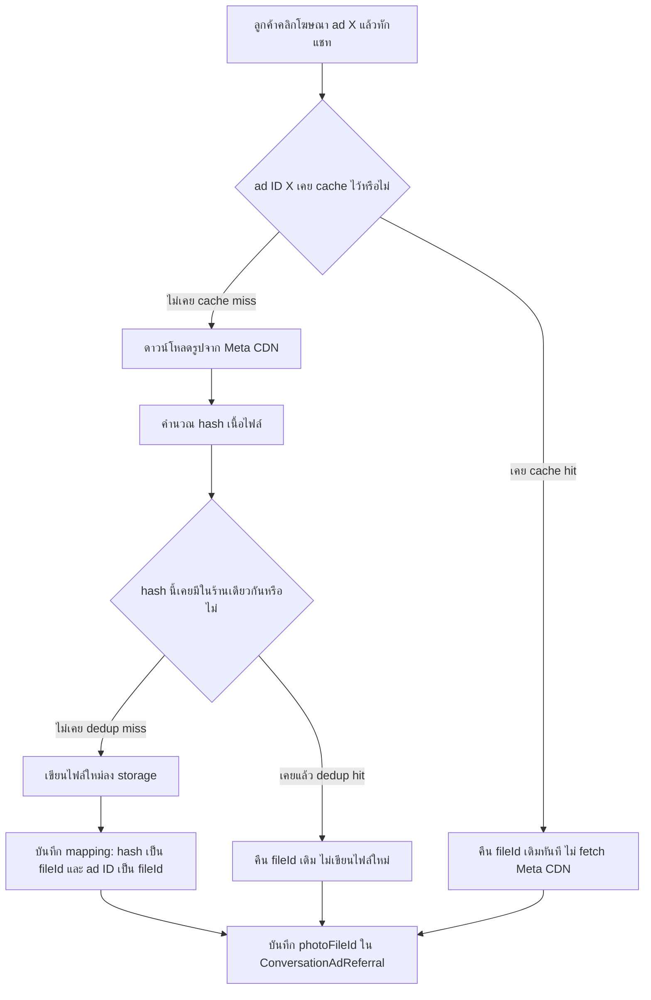

> **โมดูล:** M51-ChatMediaDeduplication
> **ประเภทเอกสาร:** Product Requirements Document (PRD)
> **เวอร์ชัน:** 1.0
> **วันที่จัดทำ:** 2026-08-19
> **สถานะ:** Draft
> **เจ้าของเอกสาร:** BA + PO + PM (ดู [[Feature-Docs-Ownership]])

# PRD: การกำจัดไฟล์สื่อซ้ำในระบบแชท (Chat Media Deduplication)

---

## Executive Summary

ทุกครั้งที่ SafePay/Deep รับข้อความสื่อ (รูปภาพ/ไฟล์แนบ) จากช่องทางภายนอก (Meta Messenger/Instagram, LINE OA) ระบบจะ "mirror" ไฟล์นั้นเข้ามาเก็บใน storage ของตัวเอง เพราะ URL ต้นทางของ Meta หมดอายุและคอลัมน์ที่อ้างอิงไฟล์ในระบบ (`ChatMessage.imageUrl`, `ConversationAdReferral.photoFileId`, `ExternalContact.avatarUrl`) ถูกออกแบบให้เก็บ "fileId ของ storage เรา" ไม่ใช่ URL ภายนอก — นโยบายนี้ยังถูกต้องและไม่อยู่ในขอบเขตที่ต้องเปลี่ยน ปัญหาอยู่ที่ **ทุกครั้งที่ mirror ระบบเขียนไฟล์ใหม่เสมอ แม้เนื้อไฟล์จะเหมือนเดิมเป๊ะ** เพราะจุดเดียวที่ทุก path เขียนลง storage (`saveMirroredBuffer`) ตั้งชื่อไฟล์จาก timestamp (`${filenamePrefix}-${Date.now()}.${ext}`) ไม่มีการตรวจเนื้อไฟล์ก่อนเขียนเลย

จากการตรวจ storage บน prod (2026-08-19) พบว่าในไฟล์ทั้งหมด 15,805 ไฟล์ (5,609 MB) มีเนื้อไฟล์ที่ไม่ซ้ำกันจริงแค่ 3,573 ไฟล์ — เท่ากับพื้นที่ 4,332 MB (77% ของทั้งหมด) เป็นสำเนาซ้ำล้วน ๆ และอัตราการเติบโตล่าสุด (7 วัน) อยู่ที่ ~248 MB/วัน (~7.4 GB/เดือน) ตัวการหลักคือรูปโฆษณาที่แนบมากับข้อความจาก Meta Ads (`ConversationAdReferral`) ซึ่งรูปโฆษณาจริงมีแค่ 40 ใบ แต่ถูก mirror ซ้ำไปแล้ว 3,901 ครั้ง (99.8% ซ้ำ) และไม่มีกรณีไหนที่กลุ่มไฟล์ซ้ำข้ามร้านค้าเลยแม้แต่กรณีเดียว — ยืนยันว่ารูปโฆษณาชุดเดียวกันถูกส่งซ้ำเข้ามาหลายครั้งในแชทเดียวกัน/ร้านเดียวกัน ไม่ใช่ปรากฏการณ์ข้ามผู้เช่า (cross-tenant)

ฟีเจอร์นี้ใส่ content-addressed deduplication (hash เนื้อไฟล์ → ตรวจ hit ก่อนเขียน) ที่ primitive ร่วม `writeDedupedFile()` ซึ่งเป็น choke point จริงของทุกเส้นทางที่เขียนไฟล์สื่อของแชท ขอบเขตต่อร้าน (per-shop) ตามข้อมูลจริงที่ไม่มีการซ้ำข้ามร้าน — ครอบทั้ง 3 เส้นทางที่ audit เจอ (mirror จากภายนอก, transcode รูป derived, และไฟล์ที่ client อัปโหลดตรงผ่าน presigned URL ซึ่ง server เห็นทีหลัง) เสริมด้วยชั้น cache `sourceKey` สำหรับรูปโฆษณาที่ทราบ ad ID ล่วงหน้าและรูป derived ที่ทราบไฟล์ต้นทาง (ข้ามการดาวน์โหลด/transcode ซ้ำได้ทั้งหมด) และงาน backfill แยกต่างหาก (dry-run ก่อน, resumable, ลบไฟล์เป็นขั้นสุดท้าย) เพื่อทวงพื้นที่ที่ซ้ำอยู่แล้ว 4.3 GB คืน

คุณค่าทางธุรกิจของฟีเจอร์นี้ **ไม่ใช่การประหยัดค่า cloud** — บัญชี Supabase ปัจจุบัน (Pro plan $25/เดือน) ยังไม่มีการใช้เกินโควตาแม้แต่รายการเดียว (storage ใช้ 5.6 จาก 100 GB) และค่าส่วนเกิน storage คือ $0.0213/GB เท่านั้น เงินที่ประหยัดได้จริงจึงอยู่ในระดับเศษเหรียญ คุณค่าที่แท้จริงคือ (1) ยืด runway ของ storage headroom จาก ~13 เดือนเป็น ~50 เดือน ก่อนต้องขยายแผน (2) ลด egress เพราะปัจจุบันแต่ละสำเนาไฟล์มี URL คนละอันทำให้ CDN แชร์ cache ข้ามกันไม่ได้ (3) ตัด HTTP fetch รูปโฆษณาออกจาก hot path ของ webhook ที่เคยเกิดซ้ำ ๆ ~3,900 ครั้ง และ (4) เป็น**เงื่อนไขบังคับก่อน**ที่จะสามารถออกแบบนโยบายลบไฟล์/data retention ได้อย่างปลอดภัยในอนาคต เพราะหลังฟีเจอร์นี้ ไฟล์หนึ่งไฟล์อาจถูกอ้างอิงจากหลายข้อความพร้อมกัน — ลบไฟล์โดยไม่รู้ก่อนว่าไฟล์นั้นถูกใช้ร่วมอยู่หรือไม่ = เสี่ยงทำรูปแชทของลูกค้ารายอื่นหายไปด้วย

---

## 1. Business Goals & KPIs

### 1.1 เป้าหมายทางธุรกิจ

| เป้าหมาย | รายละเอียด |
|----------|-----------|
| **หยุดการเติบโตของสำเนาไฟล์ซ้ำที่ต้นตอ** | ทุกไฟล์สื่อที่ mirror เข้าระบบใหม่นับจากนี้ต้องผ่านการตรวจเนื้อไฟล์ก่อนเขียน — ไฟล์เดียวกัน (เนื้อไฟล์เหมือนกันในร้านเดียวกัน) ต้องไม่ถูกเขียนซ้ำเป็นไฟล์ใหม่อีกต่อไป |
| **ยืด runway ของ storage headroom** | ลดอัตราการเติบโตของ storage จาก ~7.4 GB/เดือน เหลือใกล้เคียงปริมาณ "ไฟล์ที่ไม่ซ้ำจริง" ที่เข้าใหม่ต่อวัน (ประเมิน ~2 GB/เดือน) เพื่อยืดเวลาก่อนต้องขยายแผน Supabase storage |
| **วางรากฐานให้ทำนโยบายลบไฟล์ได้อย่างปลอดภัยในอนาคต** | หลังฟีเจอร์นี้ ระบบต้องสามารถระบุได้ว่าไฟล์หนึ่งไฟล์ถูกอ้างอิงจากที่ใดบ้าง (คำนวณย้อนกลับจาก 3 คอลัมน์ที่อ้างอิงไฟล์) เพื่อให้ feature การลบ/retention ในอนาคตไม่ลบไฟล์ที่ยังมีข้อความอื่นใช้อยู่ |
| **ตัด redundant network fetch ออกจาก hot path ของ webhook** | รูปโฆษณาที่ทราบ ad ID ซ้ำ (เช่นแคมเปญเดียวกันที่มีคนทักเข้ามาหลายคน) ต้องไม่ยิง fetch ไปยัง Meta CDN ซ้ำทุกครั้งที่มีคนใหม่ทักมาจากโฆษณาเดียวกัน |

### 1.2 ตัวชี้วัดความสำเร็จ (KPIs)

| KPI | คำอธิบาย | เป้าหมาย |
|-----|----------|---------|
| **อัตราการซ้ำของไฟล์ใหม่ (dedup hit rate)** | สัดส่วนของการเรียก mirror ที่ hash ตรงกับไฟล์ที่มีอยู่แล้วในร้านเดียวกัน (ไม่ต้องเขียนไฟล์ใหม่) เทียบกับการเรียก mirror ทั้งหมด วัดจาก log/metric ของ `saveMirroredBuffer` | ≥ 90% สำหรับ path รูปโฆษณา (`ConversationAdReferral`, อ้างอิงจากอัตราซ้ำจริง 99.8% ที่วัดได้), ไม่ตั้งเป้าสูงสำหรับข้อความแชททั่วไปเพราะข้อมูลจริงแสดงว่าซ้ำน้อย (ดู §4.1) |
| **อัตราการเติบโตของ storage ต่อเดือน (bucket `uploads`)** | ผลรวมขนาดไฟล์ใหม่ที่เขียนจริงต่อเดือน วัดจาก Supabase storage usage report เทียบก่อน/หลังเปิดใช้งาน | ลดจาก baseline ~7.4 GB/เดือน เหลือ ≤ 3 GB/เดือน ภายใน 1 เดือนหลัง deploy ชั้น 1+2 ครบ |
| **พื้นที่ที่ทวงคืนได้จากงาน backfill** | ผลต่างขนาด bucket ก่อน/หลังรันงาน backfill dry-run → apply บนไฟล์ที่ระบุว่าซ้ำ (เทียบ manifest ที่ backfill job สร้างไว้) | คืนพื้นที่ได้ไม่น้อยกว่า 3.5 GB (คาดการณ์จากตัวเลขจริง 4.3 GB ลบ margin ความคลาดเคลื่อนของ hash เชิงขอบ) โดยไม่มีไฟล์ที่ยังถูกอ้างอิงอยู่ถูกลบผิดพลาด (0 incident) |
| **จำนวนครั้งที่ fetch รูปโฆษณาไปที่ Meta CDN ซ้ำ ad เดิม** | นับจำนวนครั้งที่ระบบยิง fetch จริงสำหรับ `sourceKey = ad:{adId}` ที่เคย cache ไว้แล้ว (ควรเป็น 0 หลัง hit ครั้งแรก) | ad เดิมยิง fetch ไปยัง Meta CDN ได้อย่างมากครั้งเดียวต่อ ad ID ตลอดอายุของฟีเจอร์ (ไม่นับกรณี cache miss ครั้งแรกที่ยังไม่เคยเห็น ad นั้น) |

---

## 2. User Personas (กลุ่มผู้ใช้งาน)

### 2.1 ทีมวิศวกรรม/ผู้ดูแลระบบ SafePay (internal, ไม่ใช่ผู้ใช้ปลายทาง)

**ข้อมูลพื้นฐาน:**
- ทีมพัฒนาและดูแล SafePay/Deep ที่ต้องเฝ้าระวังปริมาณ storage และค่าใช้จ่าย infra บน Supabase
- เป็นผู้ตัดสินใจว่าเมื่อไรต้องอัปเกรดแผน Supabase หรือทำ data retention policy

**เป้าหมาย:**
- รู้ว่า storage โตเพราะไฟล์ใหม่จริง ไม่ใช่เพราะสำเนาซ้ำที่ไม่มีความหมาย
- มีระยะเวลาปลอดภัย (headroom) มากพอก่อนต้องตัดสินใจเรื่อง infra เร่งด่วน
- ในอนาคตสามารถออกแบบนโยบายลบไฟล์เก่าได้โดยไม่เสี่ยงลบไฟล์ที่ข้อความอื่นยังใช้อยู่

**ความต้องการ:**
- เห็นตัวเลข dedup hit rate และอัตราการเติบโตของ storage หลัง deploy เพื่อยืนยันว่าฟีเจอร์ทำงานได้จริง
- มีเครื่องมือ (backfill job) ที่ปลอดภัย ตรวจสอบได้ก่อนลบไฟล์จริง (dry-run ก่อนเสมอ)

**จุดปวด (Pain Points):**
- วันนี้ไม่มีทางรู้เลยว่าไฟล์ไหนซ้ำกับไฟล์ไหน ต้องตรวจด้วยการ query eTag เทียบมือ (ทำครั้งเดียวเพื่อวิเคราะห์ปัญหานี้ ไม่มีเครื่องมือถาวร)
- ไม่มีกลไกป้องกันไม่ให้ปัญหาแย่ลงเรื่อย ๆ — ทุกวันที่ผ่านไปมีไฟล์ซ้ำเพิ่มขึ้นโดยไม่มีใครรู้ตัวจนกว่าจะใกล้ชนโควตา

### 2.2 ร้านค้า (Shop) ที่ใช้ระบบแชทรวมหลายช่องทาง (Meta/LINE)

**ข้อมูลพื้นฐาน:**
- ร้านค้าที่เปิดใช้ Deep Chat เชื่อมกับเพจ Facebook/Instagram/LINE OA ของตัวเอง รับข้อความ รูปสินค้า รูปสลิป และรูปโฆษณาที่ลูกค้าคลิกเข้ามาจากแคมเปญ

**เป้าหมาย:**
- ระบบแชทตอบสนองเร็ว รูปภาพในแชทโหลดขึ้นได้ไม่ล่าช้า
- ไม่ต้องรับรู้หรือยุ่งเกี่ยวกับรายละเอียดว่า storage ข้างหลังทำงานยังไง

**ความต้องการ:**
- รูปภาพ/สื่อในแชทของร้านตัวเองต้องแสดงผลถูกต้องเหมือนเดิมทุกประการ ไม่มีความเปลี่ยนแปลงที่มองเห็นได้จาก UI
- เวลาที่มีคนทักเข้ามาจากโฆษณาเดียวกันจำนวนมาก (ช่วง campaign burst) ระบบต้องไม่ช้าลงเพราะการดาวน์โหลดรูปโฆษณาซ้ำ ๆ

**จุดปวด (Pain Points):**
- ไม่รู้ตัวว่าได้รับผลกระทบทางอ้อมถ้า storage เต็มโควตาในอนาคต (บริการแชทอาจสะดุด) — เป็นความเสี่ยงเชิงป้องกัน ไม่ใช่ปัญหาที่ร้านรู้สึกอยู่วันนี้
- ระหว่างแคมเปญโฆษณาที่มีคนทักเข้ามาพร้อมกันจำนวนมาก การที่ webhook ต้อง fetch รูปโฆษณาเดิมซ้ำทุกครั้งเป็นภาระที่มองไม่เห็นแต่ส่งผลต่อความเร็วของระบบโดยรวม

---

## 3. Business Requirements

### 3.1 กำจัดไฟล์สื่อซ้ำที่จุดเขียน storage เดียว (Content-Addressed Dedup)

**ความต้องการ:**
- เมื่อระบบจะบันทึกไฟล์สื่อที่ mirror มาจากช่องทางภายนอก (Meta/LINE) ต้องตรวจก่อนว่าเนื้อไฟล์นั้น "เคยถูกบันทึกไว้แล้วหรือยัง" สำหรับร้านค้าเดียวกัน ถ้าเคยมีอยู่แล้ว ระบบต้องใช้ไฟล์เดิมซ้ำ (คืน fileId เดิม) แทนที่จะเขียนไฟล์ใหม่
- การตรวจสอบต้องเกิดที่จุดเดียวที่เป็น choke point ของการเขียนไฟล์ทั้งหมด เพื่อให้ครอบคลุมทุกช่องทางที่ mirror สื่อเข้าระบบ (รูปสินค้า, รูปสลิป, สติกเกอร์ LINE, avatar ผู้ติดต่อ, รูปโฆษณา, สื่อขาเข้า/ขาออกของแชท) โดยไม่ต้องแก้ทุกจุดที่เรียกใช้แยกกัน

**Business Rules:**
- การเทียบ "เนื้อไฟล์เดียวกัน" ต้องใช้การคำนวณจากเนื้อหาไฟล์จริง (ไม่ใช่ชื่อไฟล์ ไม่ใช่ URL ต้นทาง เพราะ URL ต้นทางของสื่อชนิดเดียวกันอาจต่างกันได้ในแต่ละครั้งที่ Meta/LINE ส่งมา)
- ขอบเขตการเทียบ "ซ้ำ" ต้อง**จำกัดเฉพาะภายในร้านค้าเดียวกัน (per-shop)** ห้ามเทียบข้ามร้านค้า แม้เนื้อไฟล์จะเหมือนกันทุกประการก็ตาม
- ไฟล์ที่ระบบตัดสินว่า "ซ้ำ" ต้องคืนค่าอ้างอิง (fileId) ที่ใช้งานได้จริงเหมือนกับกรณีเขียนไฟล์ใหม่ทุกประการ — ผู้เรียกใช้งาน (ทุก path ที่ mirror สื่อ) ต้องไม่ต้องรู้หรือเปลี่ยนพฤติกรรมว่าครั้งนี้เป็นไฟล์ใหม่หรือไฟล์ซ้ำ
- ต้องไม่มีการเขียนตรรกะ "บันทึกไฟล์ลง storage" ซ้ำเป็นจุดที่สอง — ทุกจุดที่ mirror สื่อเข้าระบบต้องผ่านจุดเดียวกัน (สอดคล้องกับกฎเดิมของระบบที่มีอยู่แล้ว: ห้ามมีสองชุดตรรกะ "buffer → storage" ขนานกัน)

**เหตุผล:**
- ข้อมูลจริงจาก prod ยืนยันว่า 77% ของพื้นที่ storage เป็นสำเนาไฟล์ที่เนื้อหาซ้ำกันเป๊ะ และไม่มีกรณีซ้ำข้ามร้านค้าแม้แต่กรณีเดียว — การจำกัดขอบเขตต่อร้านให้ผลประหยัดพื้นที่เท่ากับการเทียบข้ามร้าน แต่ตัดความเสี่ยงเรื่องความเป็นส่วนตัวข้ามผู้เช่า (cross-tenant) ทิ้งไปทั้งหมด
- การแก้ที่จุดเขียนเดียว (choke point) แทนการแก้ทีละจุดเรียกใช้ ลดความเสี่ยงที่จะมีบางช่องทางหลุดไม่ได้รับการ dedup และสอดคล้องกับสถาปัตยกรรมเดิมของระบบที่ตั้งใจให้มีจุดเขียน storage จุดเดียวอยู่แล้ว

### 3.2 ตัดการดาวน์โหลดซ้ำสำหรับรูปโฆษณาที่ทราบแหล่งที่มาแน่นอน

**ความต้องการ:**
- สำหรับรูปโฆษณาที่แนบมากับข้อความจากแคมเปญ Meta Ads (ระบุ ad ID ได้จาก webhook) ระบบต้องสามารถ "จำ" ได้ว่ารูปของ ad ID นั้นเคยถูกดาวน์โหลดและบันทึกไว้แล้วหรือยัง โดยไม่ต้องดาวน์โหลดเนื้อไฟล์จาก Meta CDN ซ้ำเพื่อตรวจสอบ (ต่างจาก 3.1 ที่ต้องมีเนื้อไฟล์ในมือก่อนถึงจะ hash เทียบได้)

**Business Rules:**
- การจดจำต้องผูกกับตัวระบุแหล่งที่มา (เช่น ad ID) ไม่ใช่ URL ของรูป เพราะ URL ของรูปโฆษณาเดียวกันจาก Meta อาจเปลี่ยนไปในแต่ละครั้งที่ webhook ส่งมา ขณะที่ ad ID เดิมคงที่
- เมื่อพบว่าตัวระบุแหล่งที่มาเคยถูกบันทึกไว้แล้ว ระบบต้องใช้ไฟล์เดิมทันทีโดยไม่ยิง HTTP request ไปยัง Meta CDN อีก
- ต้องมีขอบเขต/ความเป็นเจ้าของเดียวกับ 3.1 (per-shop) เพื่อความสอดคล้องกัน

**เหตุผล:**
- ข้อมูลจริงแสดงว่ารูปโฆษณาที่ต่างกันจริงมีแค่ 40 ใบ แต่ถูกเรียก mirror ไปแล้ว 3,901 ครั้ง — การรอให้ดาวน์โหลดเนื้อไฟล์มาก่อนแล้วค่อย hash เทียบ (3.1) ยังคงเปลือง network I/O ในจุดนี้อยู่ดี การจดจำจาก ad ID ตัดขั้นตอนการดาวน์โหลดออกไปตั้งแต่ต้น ลดภาระบน hot path ของ webhook ที่ประมวลผลข้อความเข้าแบบเรียลไทม์

### 3.3 ทวงคืนพื้นที่ที่ซ้ำอยู่แล้วในระบบ (Backfill)

**ความต้องการ:**
- นอกเหนือจากการป้องกันไม่ให้เกิดไฟล์ซ้ำใหม่ (3.1, 3.2) ระบบต้องมีเครื่องมือแยกต่างหากสำหรับกวาดตรวจไฟล์ที่ซ้ำกันอยู่แล้วในปัจจุบัน (15,805 ไฟล์ที่มีอยู่แล้ว) และรวมให้เหลือสำเนาเดียวต่อกลุ่มไฟล์ที่ซ้ำกัน (ภายในขอบเขตร้านเดียวกัน) พร้อมอัปเดตทุกจุดที่อ้างอิงไฟล์เดิมให้ชี้ไปยังไฟล์ที่เหลืออยู่

**Business Rules:**
- งานนี้ต้องทำงานเป็น**ขั้นตอนแยกจากระบบใช้งานจริง** (offline/batch job) ไม่กระทบการทำงานปกติของแชทระหว่างรัน
- ต้องมีโหมด "dry-run" ที่รายงานผลลัพธ์ที่จะเกิดขึ้น (จำนวนไฟล์ที่จะรวม, พื้นที่ที่จะได้คืน) โดย**ไม่ลบหรือแก้ไขข้อมูลจริงใด ๆ** ก่อนเสมอ
- การลบไฟล์จริงต้องเป็นขั้นตอนสุดท้ายหลังยืนยันผล dry-run แล้วเท่านั้น และต้อง resumable (รันค้างแล้วรันต่อได้โดยไม่ต้องเริ่มใหม่ทั้งหมด)
- ก่อนลบไฟล์ใด ๆ ต้องอัปเดตทุกคอลัมน์ที่อ้างอิงไฟล์นั้น (`ChatMessage.imageUrl`, `ConversationAdReferral.photoFileId`, `ExternalContact.avatarUrl`) ให้ชี้ไปยังไฟล์ที่เหลืออยู่ก่อน — ห้ามลบไฟล์ที่ยังมีคอลัมน์ใดอ้างอิงอยู่

**เหตุผล:**
- 4,332 MB (77%) ของพื้นที่ปัจจุบันเป็นสำเนาซ้ำที่เกิดขึ้นไปแล้วก่อนฟีเจอร์นี้จะ deploy — การป้องกันปัญหาใหม่ (3.1, 3.2) ไม่ช่วยแก้พื้นที่ที่เสียไปแล้ว ต้องมีขั้นตอนแก้ย้อนหลังแยกต่างหาก และเนื่องจากเป็นการแก้ไขข้อมูลจำนวนมากแบบย้อนหลัง ความปลอดภัย (dry-run ก่อน, resumable, อัปเดตอ้างอิงก่อนลบ) สำคัญกว่าความเร็ว

---

## 4. Business Rules & Constraints

### 4.1 กฎทางธุรกิจหลัก

| กฎ | คำอธิบาย |
|----|----------|
| **ขอบเขตการ dedup คือต่อร้านค้า (per-shop) เท่านั้น** | ห้ามเทียบหรือใช้ไฟล์ร่วมกันข้ามร้านค้า แม้เนื้อไฟล์จะเหมือนกัน 100% — เป็นการตัดสินใจเชิงนโยบาย ไม่ใช่ข้อจำกัดทางเทคนิค (ข้อมูลจริงไม่พบกลุ่มไฟล์ซ้ำข้ามร้าน แต่การออกแบบต้องกันไว้ตั้งแต่ต้นเพื่อความปลอดภัยเชิงผู้เช่าหลายราย) |
| **ไม่มีการนับจำนวนอ้างอิง (refCount) ในเวอร์ชันแรก** | v1 ของฟีเจอร์นี้จะไม่เก็บตัวนับว่าไฟล์หนึ่งถูกอ้างอิงจากกี่ที่ — เมื่อถึงเวลาต้องตัดสินใจลบไฟล์ (นโยบาย retention ในอนาคต) ให้คำนวณย้อนกลับจาก 3 คอลัมน์ที่อ้างอิงไฟล์แทน เพราะปริมาณข้อมูลปัจจุบันยังเล็กพอที่จะ query ย้อนกลับได้โดยไม่แพง และการเก็บ refCount ล่วงหน้ามีความเสี่ยงสูงที่จะ drift ผิดจากค่าจริงอย่างเงียบ ๆ (เพิ่ม/ลดพลาดจุดใดจุดหนึ่งแล้วไม่มีใครรู้) |
| **นโยบายลบไฟล์/data retention ไม่อยู่ในขอบเขตของฟีเจอร์นี้** | ฟีเจอร์นี้ทำหน้าที่ "ไม่สร้างไฟล์ซ้ำเพิ่ม" และ "ทวงคืนไฟล์ซ้ำที่มีอยู่แล้วครั้งเดียว" เท่านั้น — การตัดสินใจว่าเมื่อไรควรลบไฟล์เก่าที่ไม่มีใครอ้างอิงแล้ว (เช่น หลังบัญชีถูกลบ, หลังพ้นระยะเวลาที่กำหนด) เป็นฟีเจอร์แยกในอนาคต |
| **การ mirror สื่อจากภายนอกเข้ามาเก็บเองยังคงเป็นนโยบายที่ถูกต้อง** | ฟีเจอร์นี้ไม่เปลี่ยนแปลงเหตุผลเดิมที่ระบบต้อง mirror สื่อ (URL ของ Meta หมดอายุ + คอลัมน์อ้างอิงเก็บ fileId ไม่ใช่ URL) — แก้เฉพาะพฤติกรรม "เขียนไฟล์ใหม่ทุกครั้งโดยไม่ตรวจซ้ำ" เท่านั้น |

### 4.2 ข้อจำกัดทางธุรกิจ

| ข้อจำกัด | รายละเอียด |
|---------|-----------|
| **ห้ามส่งผลกระทบต่อการแสดงผลสื่อในแชทที่มีอยู่แล้ว** | ข้อความ/รูปภาพในแชทของร้านที่มีอยู่ก่อนฟีเจอร์นี้ ต้องแสดงผลถูกต้องเหมือนเดิมทุกประการทั้งก่อนและหลัง deploy รวมถึงระหว่างและหลังงาน backfill |
| **บริบทต้นทุนไม่ใช่แรงกดดันเชิงเวลา** | บัญชี Supabase วันนี้ยังไม่มีการใช้เกินโควตาใด ๆ (storage 5.6/100 GB, DB 0.13/8 GB, egress ประเมิน ~31/250 GB) ฟีเจอร์นี้จึงไม่ใช่การแก้ไฟไหม้ที่ต้องรีบ deploy ข้ามขั้นตอนความปลอดภัยของงาน backfill (dry-run) เพื่อความเร็ว |
| **ต้องไม่เพิ่ม latency ที่ผู้ใช้สังเกตเห็นได้ในเส้นทางรับข้อความแชท** | การตรวจ hash/lookup ก่อนเขียนไฟล์ต้องไม่ทำให้การรับข้อความแชท (webhook ingest) ช้าลงจนสังเกตได้ เพราะเส้นทางนี้เป็น real-time path ที่ผู้ใช้ (ร้านค้า/ลูกค้า) รอผลอยู่ |

### 4.3 เงื่อนไขที่ยังไม่ยืนยัน (ต้องตรวจสอบระหว่างขั้น SRS/SDS)

- อัตรา false-positive/false-negative ของการเทียบ hash (ทางทฤษฎีมีโอกาสชนกันของ hash เกือบเป็นศูนย์ที่ scale นี้ แต่ต้องยืนยันอัลกอริทึม hash ที่ใช้ในชั้น technical spec)
- พฤติกรรมของ Meta CDN เมื่อรูปโฆษณาเดียวกันถูกส่ง crop/resize ต่างกันในแต่ละครั้ง (จะทำให้เนื้อไฟล์ไม่เหมือนกันเป๊ะ แม้เป็นรูปเดียวกันในสายตาคน) — ผลกระทบต่ออัตรา hit rate ของชั้น 1 (content hash) เทียบกับชั้น 2 (ad ID cache) ต้องยืนยันด้วยข้อมูลจริงหลัง deploy
  - **มติจาก user (2026-08-19):** กรณีนี้ถือเป็น "คนละรูป" และเก็บแยกกันตามปกติ ไม่ต้องพยายามจับให้เป็นไฟล์เดียวกัน — ยอมรับ hit rate ที่ต่ำลงในกรณีนี้ แลกกับความปลอดภัยว่าจะไม่มีการรวมไฟล์ผิดใบ

### 4.4 มติที่ยืนยันแล้วกับ user (2026-08-19)

| หัวข้อ | มติ |
|--------|-----|
| **เกณฑ์การตัดสินว่า "ไฟล์ซ้ำ"** | เนื้อไฟล์ต้องเหมือนกัน **ทุกบิต** เท่านั้น — ต่างกันแม้เล็กน้อย = คนละรูป เก็บแยกตามปกติ ห้ามใช้การเทียบแบบ "ภาพคล้ายกัน" (perceptual hash) ในฟีเจอร์นี้ |
| **ช่องทางสั่งงาน backfill** | รันผ่าน **script/CLI** ที่ทีมงาน Deep รันเองได้ — **ไม่ต้องสร้างหน้าจอ admin** ทั้ง dry-run และการรวมไฟล์จริงต้องสั่งครบทุกขั้นจาก command line และพิมพ์รายงานผลออกทางเทอร์มินัลได้ทันที |

---

## 5. Out of Scope (นอกขอบเขต)

สิ่งที่ระบบนี้ **ไม่รองรับ** หรือ **ไม่รับผิดชอบ**:

| หัวข้อ | คำอธิบาย |
|--------|----------|
| **นโยบายลบไฟล์/data retention** | การตัดสินใจว่าไฟล์เก่าที่ไม่มีการอ้างอิงแล้วควรถูกลบเมื่อไรและอย่างไร เป็นฟีเจอร์แยกในอนาคต ฟีเจอร์นี้เพียงวางรากฐาน (ทำให้ query ย้อนกลับหาผู้อ้างอิงได้) ให้ฟีเจอร์นั้นทำงานได้อย่างปลอดภัย |
| **การ dedup ข้ามร้านค้า (cross-shop/global dedup)** | เป็นการตัดสินใจเชิงนโยบายที่ตกลงกันแล้วว่าจะไม่ทำ แม้ข้อมูลทางเทคนิคจะรองรับได้ (ดู §4.1) |
| **การบีบอัด/ลดขนาดไฟล์ (compression, resize, transcoding)** | ฟีเจอร์นี้แก้เฉพาะปัญหา "ไฟล์เดียวกันถูกเขียนซ้ำ" ไม่แตะเรื่องขนาดไฟล์ต่อไฟล์ หรือคุณภาพของสื่อที่จัดเก็บ |
| **การย้าย storage driver หรือเปลี่ยนผู้ให้บริการ storage** | ระบบยังคงใช้ driver ปัจจุบัน (`local`/`s3` ตาม `STORAGE_DRIVER`) ไม่มีการเปลี่ยนสถาปัตยกรรม storage ในฟีเจอร์นี้ |
| **การอัปเกรดแผน Supabase หรือปรับ business case ด้านค่าใช้จ่าย infra** | ตามที่ระบุใน Executive Summary ฟีเจอร์นี้ไม่ได้ถูกขับเคลื่อนด้วยแรงกดดันเรื่องค่าใช้จ่าย และไม่รวมการตัดสินใจเรื่องแผนบริการ |
| **การเปลี่ยนกลไก mirror จากภายนอกเป็นอย่างอื่น (เช่น proxy สด แทนการดาวน์โหลดมาเก็บ)** | นโยบาย mirror-then-store ยังคงเดิมตามเหตุผลที่ระบุไว้ (URL หมดอายุ + schema เก็บ fileId) ไม่อยู่ในขอบเขตของฟีเจอร์นี้ที่จะเปลี่ยน |

---

## 6. Risks & Mitigation (ความเสี่ยงและแนวทางแก้ไข)

### 6.1 ความเสี่ยงทางธุรกิจ

| ความเสี่ยง | ผลกระทบ | ระดับความรุนแรง | แนวทางแก้ไข |
|-----------|---------|-----------------|-------------|
| **งาน backfill ลบไฟล์ที่ยังมีการอ้างอิงอยู่โดยไม่ตั้งใจ** | รูปในแชทของลูกค้าจริงหายไป กระทบความไว้วางใจของร้านค้าที่ใช้งานอยู่ | สูง | บังคับ dry-run ก่อนเสมอ (§3.3) + อัปเดตทุกคอลัมน์อ้างอิงให้ชี้ไปไฟล์ที่เหลือก่อนลบจริง + รันบน environment ที่ไม่ใช่ prod ก่อนเพื่อยืนยันผล + สำรองรายการไฟล์ที่จะลบไว้ก่อนลบจริงทุกครั้ง |
| **ตั้งความคาดหวังผิดว่าฟีเจอร์นี้ "ประหยัดเงิน" ให้ธุรกิจ** | ผู้บริหาร/ผู้มีส่วนได้เสียเข้าใจผิดว่าฟีเจอร์นี้ลดค่าใช้จ่ายอย่างมีนัยสำคัญ ทั้งที่ตัวเลขจริงคือเศษเหรียญ อาจกระทบการจัดลำดับความสำคัญของงานอื่นที่ควรได้ priority มากกว่า | กลาง | สื่อสารคุณค่าที่แท้จริง (headroom/egress/hot-path/รากฐานสำหรับ retention ในอนาคต) อย่างชัดเจนตั้งแต่ PRD ฉบับนี้ ไม่ปั้นตัวเลขค่าใช้จ่ายที่ประหยัดได้เกินจริง |

### 6.2 ความเสี่ยงทางเทคนิค

| ความเสี่ยง | ผลกระทบ | แนวทางแก้ไข |
|-----------|---------|-------------|
| **การคำนวณ hash เนื้อไฟล์เพิ่ม latency ให้เส้นทาง mirror ที่วิ่งใน webhook ingest** | ข้อความแชทเข้าช้าลง ผู้ใช้เห็นความหน่วง | ยืนยันในชั้น SRS/SDS ว่าใช้อัลกอริทึม hash ที่เร็วพอสำหรับขนาดไฟล์สื่อทั่วไป (รูปภาพระดับ MB) และวัด latency จริงก่อน/หลังก่อน deploy |
| **race condition เมื่อสองข้อความที่มีเนื้อไฟล์เดียวกันเข้ามาพร้อมกัน (concurrent) ในร้านเดียวกัน** | อาจเกิดการเขียนไฟล์ซ้ำสองครั้งแม้มี dedup แล้ว (เพราะทั้งคู่ตรวจไม่พบไฟล์เดิมพร้อมกัน) หรือเกิด error จาก unique constraint violation | ออกแบบ unique constraint ระดับฐานข้อมูลบน `[shopId, hash]` และจัดการกรณีชนกัน (P2002) ด้วยการอ่านค่าที่มีอยู่แล้วกลับมาใช้แทนการล้มทั้ง request — โค้ดปัจจุบันมี pattern ตรวจ unique violation แบบนี้อยู่แล้วที่จุดอื่นในไฟล์เดียวกัน (`isUniqueViolationOn`) สามารถนำแนวทางเดียวกันมาปรับใช้ |
| **การจดจำรูปโฆษณาด้วย ad ID (ชั้น 2) อาจผูกกับ ad ID ที่ Meta ใช้ซ้ำในบริบทต่างกัน** | ถ้า ad ID ไม่ unique จริงตามที่คาด อาจใช้รูปผิดแคมเปญมาแสดงแทน | ยืนยันความเสถียรและขอบเขตของ ad ID จาก payload webhook จริงในชั้น SRS ก่อนใช้เป็น cache key |
| **backfill job กระทบ performance ของระบบขณะรันบน production data จริง (ปริมาณ 15,805 ไฟล์)** | ระบบช้าลงระหว่างช่วงที่ backfill กำลังทำงาน | ออกแบบให้ทำงานเป็น batch ทีละส่วนเล็ก (throttled) และ resumable ตามที่ระบุใน §3.3 ไม่ทำงานเป็น transaction ก้อนเดียวขนาดใหญ่ |

---

## 7. Glossary (อภิธานศัพท์)

| คำศัพท์ | ความหมาย |
|---------|----------|
| **Mirror / mirroring** | การดาวน์โหลดไฟล์สื่อจากช่องทางภายนอก (Meta CDN, LINE) แล้วบันทึกสำเนาไว้ใน storage ของ SafePay เอง แทนที่จะอ้างอิง URL ภายนอกโดยตรง |
| **Content-addressed deduplication** | เทคนิคการตรวจสอบว่าไฟล์ "เนื้อหาเดียวกัน" มีอยู่แล้วหรือไม่ ด้วยการคำนวณค่า hash จากเนื้อไฟล์ (ไม่ใช่จากชื่อไฟล์หรือ URL) แล้วใช้ค่า hash เป็นตัวเทียบ |
| **Choke point** | จุดเดียวในโค้ดที่ทุกเส้นทางการทำงาน (ในที่นี้คือทุกช่องทางที่ mirror สื่อ) ต้องผ่านก่อนจะถึงปลายทาง (การเขียนไฟล์ลง storage) — ออกแบบให้แก้ปัญหาที่จุดเดียวมีผลครอบคลุมทุกเส้นทาง |
| **fileId** | ตัวระบุไฟล์ที่ storage layer คืนกลับมาหลังบันทึกไฟล์สำเร็จ ใช้เก็บในคอลัมน์ฐานข้อมูล (เช่น `ChatMessage.imageUrl`) แทนการเก็บ URL ตรง ๆ |
| **`ConversationAdReferral`** | ตารางที่บันทึกข้อมูลว่าการสนทนาหนึ่งมาจากการคลิกโฆษณา (ad) ใด รวมถึงรูปภาพของโฆษณานั้น (`photoFileId`) |
| **`ExternalContact`** | ตารางที่บันทึกข้อมูลผู้ติดต่อจากช่องทางภายนอก (Facebook/Instagram/LINE) รวมถึงรูปโปรไฟล์ (`avatarUrl`) |
| **Backfill** | งานประมวลผลย้อนหลังบนข้อมูลที่มีอยู่แล้วในระบบ (ในที่นี้คือไฟล์ที่ mirror ไปแล้วก่อนฟีเจอร์นี้จะ deploy) เพื่อให้สอดคล้องกับพฤติกรรมใหม่ |
| **Dry-run** | การรันงาน (โดยเฉพาะงานที่มีผลทำลายข้อมูล เช่น backfill) ในโหมดที่รายงานผลลัพธ์ที่ "จะ" เกิดขึ้น โดยไม่แก้ไข/ลบข้อมูลจริง |
| **refCount** | ตัวนับจำนวนครั้งที่ทรัพยากรหนึ่ง (ในที่นี้คือไฟล์) ถูกอ้างอิงจากที่อื่น — ฟีเจอร์นี้เลือก**ไม่**เก็บ refCount ไว้ล่วงหน้า (ดู §4.1) |
| **eTag** | ค่าประจำตัวไฟล์ที่ผู้ให้บริการ storage (เช่น Supabase/S3) คืนมา ใช้เทียบเนื้อไฟล์เบื้องต้นในขั้นตอนวิเคราะห์ปัญหา (ก่อนฟีเจอร์นี้จะมีตาราง hash เป็นทางการ) |
| **Per-shop scope** | ขอบเขตการทำงานที่จำกัดเฉพาะภายในร้านค้า (shop) เดียว ไม่ข้ามไปยังร้านค้าอื่น |

---

## 8. Success Metrics (ตัวชี้วัดความสำเร็จ)

เมื่อระบบทำงานได้ดี ควรมีผลลัพธ์ดังนี้:

| ตัวชี้วัด | ค่าที่คาดหวัง | วิธีวัด |
|----------|---------------|--------|
| **ไฟล์สื่อเนื้อหาเดียวกันในร้านเดียวกันถูกเขียนซ้ำ** | ลดลงเหลือ 0 กรณีใหม่ (นับเฉพาะไฟล์ที่ mirror เข้ามาหลัง deploy) | เทียบจำนวนครั้งที่ `saveMirroredBuffer` ถูกเรียกกับจำนวนไฟล์ใหม่จริงที่เขียนลง storage หลัง deploy — ต้องเท่ากับจำนวนเนื้อไฟล์ที่ไม่ซ้ำเท่านั้น |
| **การแสดงผลสื่อในแชท** | ผู้ใช้ (ร้านค้า/ลูกค้า/แอดมิน) ไม่พบความผิดปกติใด ๆ ในการแสดงรูปภาพ/ไฟล์แนบในแชท ทั้งก่อน/หลัง deploy และระหว่าง/หลัง backfill | สุ่มตรวจแชทตัวอย่างจากหลายร้าน (manual QA) หลัง deploy ชั้น 1-2 และหลังรัน backfill แต่ละรอบ |
| **พื้นที่ storage bucket `uploads`** | ลดลงอย่างมีนัยสำคัญหลัง backfill (ประเมิน ≥3.5 GB) และอัตราการเติบโตหลังจากนั้นชะลอลงชัดเจนเทียบ baseline เดิม | เทียบขนาด bucket ก่อน/หลัง backfill ผ่าน Supabase dashboard/API + ติดตามอัตราเติบโตรายสัปดาห์ต่อเนื่อง 4 สัปดาห์หลัง deploy |
| **จำนวนครั้งที่ fetch รูปโฆษณาไปยัง Meta CDN ซ้ำ ad เดิม** | ลดลงเหลือใกล้ 0 หลังจากที่ ad นั้นถูก cache ครั้งแรก | log/metric ที่นับจำนวนครั้งของการยิง fetch จริงต่อ ad ID เทียบกับจำนวนครั้งที่ webhook ได้รับ referral จาก ad ID เดิม |

---

## 9. Dependencies & Assumptions

### 9.1 สิ่งที่ต้องพึ่งพา (Dependencies)

| ระบบ/ส่วนประกอบ | ความสัมพันธ์ |
|-----------------|-------------|
| **`src/services/channel-chat.service.ts` (`saveMirroredBuffer`, `mirrorRemoteImage`, `mirrorMediaBuffer`)** | choke point เดิมที่ฟีเจอร์นี้จะเพิ่มตรรกะ dedup เข้าไป — ต้องคงพฤติกรรมเดิมของทุก path ที่เรียกใช้ (10 จุดเรียก) ให้ทำงานถูกต้องเหมือนเดิมทุกประการ ยกเว้นพฤติกรรม dedup ที่เพิ่มเข้ามา |
| **`src/lib/storage/index.ts` (`saveFile`, `deleteFile`, `getFile` และอื่น ๆ)** | storage abstraction layer ที่ฟีเจอร์นี้ต้องใช้งานต่อ (ทั้ง local driver และ s3 driver) — dedup ต้องทำงานถูกต้องไม่ว่า driver ใดกำลังทำงานอยู่ |
| **ฐานข้อมูล Prisma/PostgreSQL (Supabase)** | ต้องเพิ่มตารางใหม่ (เก็บ hash ของไฟล์ต่อร้าน) และ/หรือกลไก cache สำหรับ ad ID — รายละเอียด schema จะถูกกำหนดในชั้น DATABASE.md |
| **`ConversationAdReferral`, `ChatMessage`, `ExternalContact` (Prisma models)** | 3 คอลัมน์ที่อ้างอิงไฟล์ในระบบวันนี้ — งาน backfill (§3.3) ต้องอ่าน/เขียนทั้ง 3 ตารางนี้เพื่ออัปเดตการอ้างอิงให้ชี้ไปยังไฟล์ที่เหลือหลังการรวมไฟล์ซ้ำ |
| **Webhook ingest path ของ Meta/LINE (feature 00018, 00025)** | เส้นทาง real-time ที่เรียก `mirrorRemoteImage`/`mirrorMediaBuffer` อยู่แล้ว — ฟีเจอร์นี้ทำงานอยู่ "ภายใน" เส้นทางนี้ ต้องไม่เปลี่ยน contract ภายนอกของ webhook handler |

### 9.2 สมมติฐาน (Assumptions)

- สมมติว่าอัตราการซ้ำของไฟล์ (99.8% สำหรับรูปโฆษณา, 0% สำหรับสื่อที่ผู้ซื้อส่งเอง) ที่วัดได้จากข้อมูล prod ณ วันที่ 2026-08-19 เป็นตัวแทนที่สมเหตุสมผลของพฤติกรรมในอนาคต — ถ้าพฤติกรรมการใช้งานเปลี่ยนไปมาก (เช่น มีฟีเจอร์ใหม่ที่ทำให้ผู้ซื้อส่งรูปซ้ำกันบ่อยขึ้น) ตัวเลข KPI ใน §1.2 อาจต้องทบทวนใหม่
- สมมติว่าปริมาณข้อมูลปัจจุบัน (~15,805 ไฟล์, ~7,704 ข้อความที่มีรูปใน `ChatMessage`) ยังอยู่ในระดับที่การ query ย้อนกลับจาก 3 คอลัมน์อ้างอิง (แทนการเก็บ refCount ล่วงหน้า) ทำได้เร็วพอโดยไม่ต้องมี index พิเศษเพิ่มเติมมาก — ถ้าปริมาณข้อมูลโตขึ้นหลายเท่าตัวในอนาคต สมมติฐานนี้ต้องถูกทบทวนก่อนออกแบบฟีเจอร์ retention
- สมมติว่า Meta และ LINE ส่งเนื้อไฟล์รูปโฆษณา/สื่อเดิมมาแบบไบต์ต่อไบต์เหมือนกันทุกครั้งที่ referral/ข้อความเดิมถูกส่งซ้ำ (ไม่มีการ re-encode/crop/watermark แบบสุ่มที่ทำให้เนื้อไฟล์ต่างกันทุกครั้ง) — ยังไม่ได้ยืนยันจากเอกสารทางการของ Meta/LINE เป็นสมมติฐานที่อนุมานจากอัตราซ้ำ 99.8% ที่วัดได้จริง (ถ้าไม่จริงทั้งหมด อัตรา hit rate ของชั้น 1 จะต่ำกว่าที่คาด แต่ชั้น 2 ที่ผูกกับ ad ID โดยตรงยังทำงานได้ไม่กระทบ)
- สมมติว่าการเพิ่มขั้นตอนคำนวณ hash เนื้อไฟล์ในเส้นทาง mirror จะไม่กระทบ timeout ของ webhook handler อย่างมีนัยสำคัญ (ยังไม่ได้วัด latency จริงในชั้น PRD — ต้องยืนยันในชั้น SRS/SDS ก่อน implement)
- ~~สมมติว่าไม่มีจุดอื่นในระบบ (นอกเหนือ `saveMirroredBuffer`) ที่เขียนไฟล์ลง storage~~ — **สมมติฐานนี้ผิด แก้แล้ว 2026-08-19:** ยืนยันจากการ audit โค้ดจริงในชั้น SRS (`grep 'saveFile(' src/` ครบ 11 จุด + ตรวจ direct-upload flow ที่ไม่เรียก `saveFile()` เลยเพิ่มอีก 1 เส้นทาง) ว่ามีจุดเขียน storage ที่เกี่ยวข้องกับสื่อในแชท **3 กลุ่ม** ไม่ใช่จุดเดียว: (1) `saveMirroredBuffer` (mirror จากภายนอก, 17 call sites), (2) 3 ฟังก์ชัน derived-image ที่ transcode ไฟล์ที่มีอยู่แล้วในระบบ (`resolveMetaCardImageUrl`/`resolveLineFlexImageUrl`/`resolveLinePreviewUrl`) ซึ่งไม่มี cache มาก่อนเลย, (3) เส้นทางอัปโหลดตรง (`POST /api/uploads/commit`, purpose='CHAT') ที่ client PUT ไฟล์เข้า storage ก่อนที่ server จะเห็นด้วยซ้ำ — ทั้ง 3 กลุ่มถูกนำเข้าขอบเขตของฟีเจอร์นี้แล้ว (กลุ่ม 2/3 ขยายขอบเขตเพิ่มโดย user อนุมัติ 2026-08-19) ผ่าน choke point ร่วมกันจริงที่ `writeDedupedFile()`/`claimMediaAsset()` ดู [[SRS]] §3.0 สำหรับตารางเต็ม ส่วน path การอัปโหลดที่ยืนยันแล้วว่าไม่เกี่ยวกับสื่อในแชท (KYC verification, admin badge, order slip, buyer-app document) ยังคงนอกขอบเขตตามเดิม

---

## 10. Appendix

### 10.1 ตัวอย่าง User Journey

**Scenario: ลูกค้าคลิกจากโฆษณาเดียวกันเข้ามาทักแชทร้านค้าหลายคนในวันเดียวกัน**

1. ร้านค้า A รันแคมเปญโฆษณาบน Meta Ads หนึ่งชิ้น (ad ID `X`)
2. ลูกค้าคนที่ 1 คลิกโฆษณาแล้วทักแชทเข้ามา — webhook ส่ง referral พร้อม ad ID `X` และ URL รูปโฆษณา
3. ระบบตรวจพบว่า ad ID `X` ยังไม่เคยถูก cache มาก่อน (cache miss) → ดาวน์โหลดรูปจาก Meta CDN → คำนวณ hash เนื้อไฟล์ → ตรวจไม่พบไฟล์เดิมในร้าน A (dedup miss เช่นกัน เพราะเป็นครั้งแรก) → เขียนไฟล์ใหม่ลง storage → บันทึก mapping ทั้งสองชั้น (hash → fileId, ad ID `X` → fileId) → บันทึก `photoFileId` ใน `ConversationAdReferral`
4. ลูกค้าคนที่ 2, 3, ... คลิกโฆษณาเดียวกันแล้วทักแชทเข้ามาที่ร้าน A ตลอดวัน
5. สำหรับแต่ละคนที่เข้ามาใหม่ ระบบตรวจ ad ID `X` → พบว่าเคย cache ไว้แล้ว (cache hit) → **ไม่ยิง fetch ไปที่ Meta CDN เลย** → ใช้ fileId เดิมที่บันทึกไว้จากขั้นตอนที่ 3 ทันที → บันทึก `photoFileId` เดิมใน `ConversationAdReferral` ของแถวใหม่
6. ผลลัพธ์: ไฟล์ในระบบ storage สำหรับโฆษณา ad ID `X` มีอยู่**เพียงไฟล์เดียว** ไม่ว่าจะมีคนคลิกเข้ามากี่คนก็ตาม และการดาวน์โหลดจาก Meta CDN เกิดขึ้นเพียงครั้งเดียว

**Scenario: ผู้ดูแลระบบรันงาน backfill เพื่อทวงคืนพื้นที่ที่ซ้ำอยู่แล้ว**

1. ผู้ดูแลระบบสั่งรันงาน backfill ในโหมด dry-run
2. งานสแกนไฟล์ทั้งหมดในระบบ (ต่อร้านค้า) คำนวณ hash เนื้อไฟล์ทีละไฟล์ จัดกลุ่มไฟล์ที่ hash ตรงกันภายในร้านเดียวกัน
3. งานสร้างรายงาน (manifest) แสดงจำนวนกลุ่มไฟล์ซ้ำ, จำนวนไฟล์ที่จะถูกรวม, พื้นที่ที่คาดว่าจะทวงคืนได้ — **ไม่มีการแก้ไขข้อมูลใด ๆ ในขั้นตอนนี้**
4. ผู้ดูแลระบบตรวจสอบรายงาน ยืนยันว่าผลลัพธ์สมเหตุสมผล (เทียบกับตัวเลขที่วิเคราะห์ไว้ก่อนหน้า เช่น ~4.3 GB)
5. ผู้ดูแลระบบสั่งรันงาน backfill จริง (apply mode) — สำหรับแต่ละกลุ่มไฟล์ซ้ำ: เลือกไฟล์หนึ่งไฟล์เป็นตัวแทน (survivor) → อัปเดตทุกแถวใน `ChatMessage`/`ConversationAdReferral`/`ExternalContact` ที่อ้างอิงไฟล์อื่นในกลุ่มให้ชี้ไปยัง survivor → ลบไฟล์ที่เหลือใน storage
6. งานทำงานเป็นชุดย่อย (batch) และบันทึกความคืบหน้า เพื่อให้รันต่อได้จากจุดที่ค้างไว้หากถูกขัดจังหวะ

### 10.2 ขอบเขตของ "ไฟล์ซ้ำ" ที่ใช้ในเอกสารนี้

"ไฟล์ซ้ำ" ในเอกสารนี้หมายถึงไฟล์ที่มี**เนื้อหาไบต์เหมือนกันทุกประการ**ภายใน**ร้านค้าเดียวกัน** — ไม่ครอบคลุมกรณีรูปภาพที่ "ดูเหมือนกัน" ต่อสายตาคนแต่มีความต่างทางไบต์ (เช่น ถูก re-encode คนละคุณภาพ, crop ต่างกันเล็กน้อย, มี watermark ต่างกัน) กรณีเหล่านี้จะไม่ถูกตรวจพบว่าซ้ำโดยกลไก content hash ของฟีเจอร์นี้ (ยกเว้นชั้น 2 ที่ผูกกับ ad ID โดยตรง ซึ่งครอบคลุมกรณีรูปโฆษณาเดียวกันที่ URL เปลี่ยนแต่เนื้อไฟล์ต้นทางเหมือนกัน)

ตัวอย่างตัวเลขอ้างอิงจาก prod (2026-08-19) ที่ใช้ประกอบการตั้งเป้า KPI ในเอกสารนี้:

| รายการ | ค่า |
|---|---|
| ไฟล์ทั้งหมดใน bucket `uploads` | 15,805 ไฟล์ / 5,609 MB |
| ไฟล์ที่ไม่ซ้ำจริง (distinct eTag) | 3,573 ไฟล์ |
| พื้นที่ที่เป็นสำเนาซ้ำ | 4,332 MB (77%) |
| อัตราการเติบโต 7 วันล่าสุด | +4,282 ไฟล์ / +1,735 MB (~248 MB/วัน) |
| แถว `ConversationAdReferral` ที่มีรูป | 3,901 แถว (3,894 ซ้ำ = 99.8%, รูปต่างกันจริง 40 ใบ) |
| สื่อที่ BUYER ส่ง | 1,403 ข้อความ / distinct 1,403 (ซ้ำ 0%) |
| สื่อที่ SHOP ส่ง | 6,301 ข้อความ / distinct 5,449 |
| `ChatMessage` ที่มี `imageUrl` | 7,704 แถว (distinct 6,852) |
| `ExternalContact.avatarUrl` ที่ไม่ว่าง | 37 จาก 3,271 แถว |

---

**หมายเหตุ:**
เอกสารนี้เป็นการบันทึกความต้องการทางธุรกิจ (Business Requirements) โดยไม่มีรายละเอียดทางเทคนิค
สำหรับ Functional Requirements / User Story / Acceptance Criteria ดู [[BRD]] ของโมดูลนี้
สำหรับ technical specification ดู [[SRS]] ของโมดูลนี้
