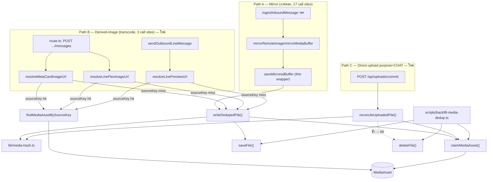
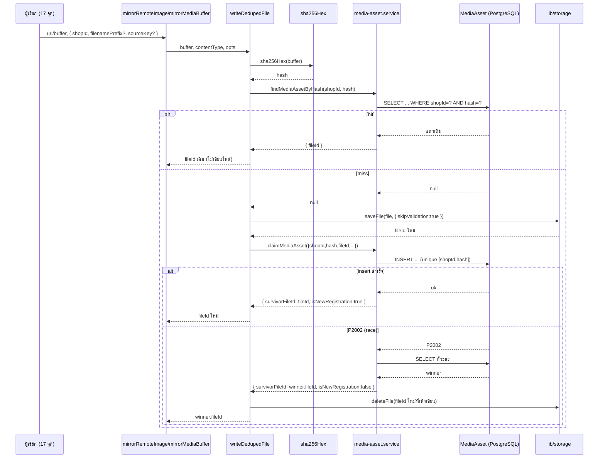
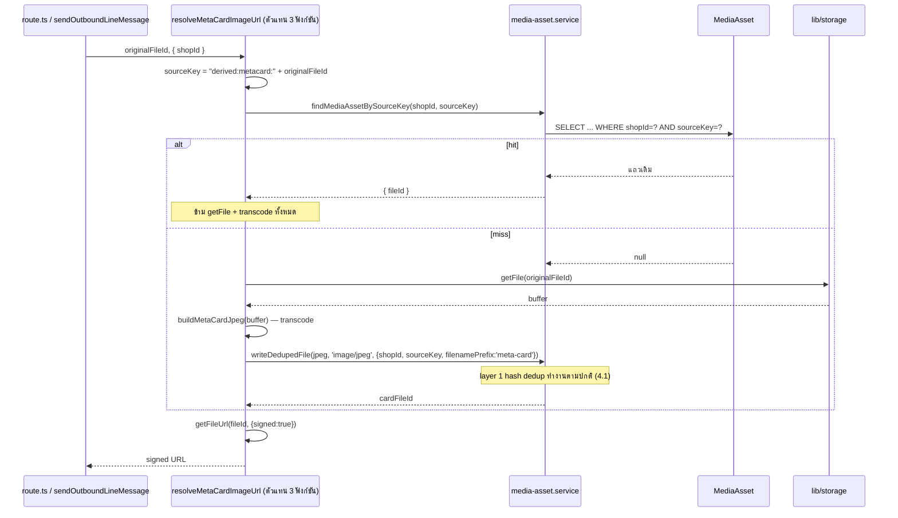
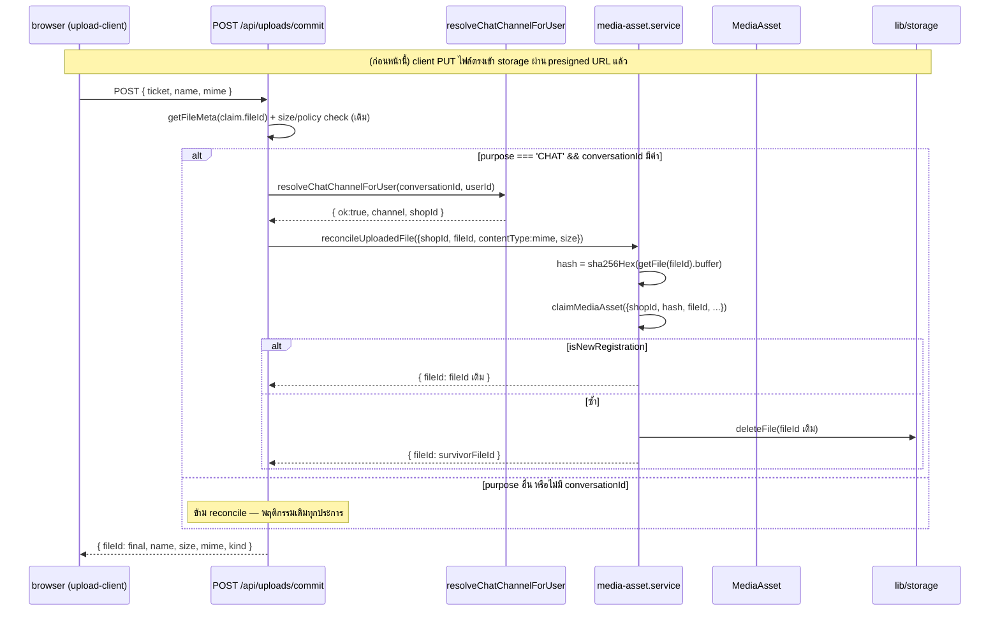
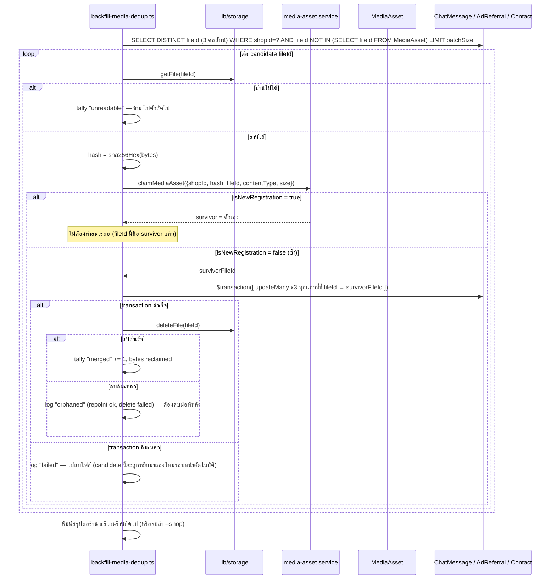

> **โมดูล:** M00051-ChatMediaDedup
> **ประเภทเอกสาร:** System Design Spec (SDS)
> **เวอร์ชัน:** 1.1 (แก้หลังพบว่ามี choke point จริง 3 กลุ่ม ไม่ใช่ 1 — ดู [[SRS]] §0/§3.0)
> **วันที่จัดทำ:** 2026-08-19
> **สถานะ:** Draft
> **เจ้าของเอกสาร:** safepay-planner (ดู [[Feature-Docs-Ownership]])

# SDS: การกำจัดไฟล์สื่อซ้ำในระบบแชท (System Design Spec)

---

## 1. บทนำ & References

Input: [[SRS]] v1.1 · Output: [[TestCase]] (ไม่มี endpoint ใหม่ — ดู [[API]] สำหรับคำอธิบายสั้น)

| เอกสาร | ความสัมพันธ์ |
|--------|-------------|
| [[SRS]] | ที่มาของ TFR-CMD-01..11 ที่ SDS นี้ต้อง realize |
| [[DATABASE]] | schema `MediaAsset` (contract ล็อกแล้ว โดย safepay-database) |
| `src/services/channel-chat.service.ts` | ไฟล์ที่แก้เยอะที่สุด — โครงสร้าง/comment convention ที่ SDS นี้ต้องเดินตาม |

---

## 2. Architecture Overview

### 2.1 มุมมองสถาปัตยกรรม (แก้ไข — choke point ที่แท้จริงคือ `writeDedupedFile`)

**กฎ:** `writeDedupedFile`/`reconcileUploadedFile`/`claimMediaAsset`/`findMediaAssetByHash`/
`findMediaAssetBySourceKey`/`claimSourceKey` อยู่รวมกันใน `src/services/media-asset.service.ts` ไฟล์
เดียว — **นี่คือ choke point จริงของฟีเจอร์ทั้งหมด** ทั้ง path A/B/C เรียกเข้าไฟล์นี้ไฟล์เดียว
`src/lib/media-hash.ts` ห้าม import prisma (ตาม convention ของ repo)

### 2.2 มุมมองการ Deploy

ไม่มี service ใหม่ ไม่มี cron ใหม่ — CLI รันแบบ manual โดยทีมงาน (`npx dotenv -e <env> -- npx tsx
scripts/backfill-media-dedup.ts`) ตรงกับ pattern 5 สคริปต์เดิมทุกประการ

---

## 3. Component Design

| Component | หน้าที่ | ไฟล์ | สถานะ |
|-----------|---------|------|-------|
| `src/lib/media-hash.ts` | `sha256Hex()` pure | ใหม่ | เดิม (v1.0) |
| `src/lib/attachment-mime.ts` | `extToContentType()` (CLI ใช้) | แก้เพิ่ม export | เดิม |
| **`src/services/media-asset.service.ts`** | `findMediaAssetByHash`, `findMediaAssetBySourceKey`, `claimMediaAsset`, `claimSourceKey`, **`writeDedupedFile`** (ย้าย logic จาก `saveMirroredBuffer`), **`reconcileUploadedFile`** (ใหม่) | ใหม่ | **ขยายจาก v1.0** |
| `saveMirroredBuffer()` | thin wrapper → `writeDedupedFile()` | `channel-chat.service.ts` (แก้) | เดิม (เปลี่ยน implementation) |
| `mirrorRemoteImage()`/`mirrorMediaBuffer()` | options-object บังคับ `shopId` | `channel-chat.service.ts` (แก้) | เดิม |
| 17 call sites | thread `shopId` | หลายไฟล์ | เดิม |
| **`resolveMetaCardImageUrl`/`resolveLineFlexImageUrl`/`resolveLinePreviewUrl`** | เพิ่ม `opts: {shopId}`, sourceKey-first check, เรียก `writeDedupedFile` แทน `saveFile` ตรง | `channel-chat.service.ts` (แก้) | **ใหม่ทั้งหมด (v1.1)** |
| **`POST /api/uploads/commit`** | เพิ่ม branch `purpose==='CHAT'` เรียก `reconcileUploadedFile` | `src/app/api/uploads/commit/route.ts` (แก้) | **ใหม่ทั้งหมด (v1.1)** |
| **`resolveChatChannelForUser`** | เพิ่ม `shopId` ใน return type | `src/app/api/uploads/_shared.ts` (แก้) | **ใหม่ (v1.1)** |
| `scripts/backfill-media-dedup.ts` | CLI | ใหม่ | เดิม |

---

## 4. Data Flow

### 4.1 Path A: mirror → `writeDedupedFile`

🛑 **ทุกขั้นที่แตะ `Asset`/`DB` ในฝั่ง "หา" (find) ต้องมี try/catch ภายในตัวเองที่ degrade เป็น `null`**
(TFR-CMD-07) — ไม่วาดเป็น branch แยกในไดอะแกรมเพื่อความอ่านง่าย แต่เป็น invariant ที่ reviewer ต้อง
grep หา `catch` ครอบทุกจุดนี้จริงตอนตรวจโค้ด

### 4.2 Path B (ใหม่): derived-image sourceKey-first

### 4.3 Path C (ใหม่): commit → reconcile ไฟล์ที่เขียนไปแล้ว

### 4.4 Flow: CLI backfill — apply mode ต่อ candidate หนึ่งไฟล์

---

## 5. Integration Points

| จุดเชื่อม | ประเภท | ความเสี่ยงเมื่อล่ม |
|-----------|--------|---------------------|
| **`MediaAsset` table** | internal (ตารางใหม่) | ตารางยังไม่มี = ทุก dedup lookup ล้มเหลว → degrade เป็น "ไม่มีฟีเจอร์นี้" (TFR-CMD-07) ไม่ block ingest |
| **`lib/storage`** | internal, reuse | ไม่เปลี่ยน — พฤติกรรมเดิมทุกประการ |
| **`isUniqueViolationOn`** (มีอยู่แล้ว) | internal, reuse | ยังไม่เคยพิสูจน์กับ composite unique — ต้องมี integration test (SRS R-4) |
| **16 file อื่นที่เรียก mirror** (services + scripts + tests) | internal | signature เปลี่ยนเป็น required options-object — บังคับแก้ทุกจุดโดย `tsc` |
| **`POST /api/uploads/commit` ↔ `reconcileUploadedFile`** | internal, ใหม่ | ล้มเหลว → catch ที่ route → ใช้ `claim.fileId` เดิม (ไม่ block การอัปโหลด) |
| **3 derived-image functions ↔ `writeDedupedFile`** | internal, ใหม่ | ล้มเหลว degrade เป็น "ไม่มีรูปในการ์ด" (พฤติกรรมเดิมของ 3 ฟังก์ชันนี้อยู่แล้วเมื่อ transcode/storage ล้ม) |

- **สัญญา API เต็ม:** ไม่มี endpoint ใหม่ — ดู [[API]]

---

## 6. Technical Decisions

### TD-01: `shopId` เป็น required field ของ options-object ไม่ใช่ positional parameter

- **ตัดสินใจ:** `mirrorRemoteImage(url, opts: { shopId: string; filenamePrefix?; sourceKey? })`
- **เหตุผล:** ยืนยันจากโค้ดจริง (`shop-channel.service.ts:64`) ว่ามี call site ที่ส่ง string เป็น
  positional argument ที่ 2 อยู่แล้ว (`filenamePrefix = 'ig-avatar'`) — ถ้าเพิ่ม `shopId` เป็น
  positional ตำแหน่งที่ 2 จะเกิด **silent type-compatible bug** ซึ่งร้ายแรงกว่า compile error เพราะขัด
  BR-CMD-01 (ห้าม cross-shop) โดยไม่มีอะไรฟ้อง
- **ทางเลือกที่ตัดทิ้ง:** `shopId` เป็น positional ตัวที่ 2
- **ผลกระทบ:** ต้องแก้ 17 call site + 5 scripts + ~5 test files (mechanical แต่ปลอดภัยเพราะ tsc บังคับ)

### TD-02: `claimMediaAsset()` เป็น primitive เดียวที่ใช้ร่วมกันโดยทุก path และ CLI

- **ตัดสินใจ:** สกัด "insert-then-catch-P2002-then-read-winner" เป็นฟังก์ชันเดียวใน
  `media-asset.service.ts` ให้ทุก path (A/B/C) และ CLI เรียกร่วมกัน
- **เหตุผล:** กันไม่ให้มี race-handling logic หลายชุดที่ต้อง sync กันเอง
- **ผลกระทบ:** DEV ต้อง implement `media-asset.service.ts` ก่อนทุกอย่าง (shared dependency)

### TD-03: dry-run ไม่แตะ `MediaAsset` table เลย (ใช้ in-memory Map แทน)

- **ตัดสินใจ:** dry-run ทำ grouping ในหน่วยความจำ ไม่เขียนอะไรลง DB
- **เหตุผล:** BRD §3.3 กำหนดชัดว่า dry-run "ไม่มีการแก้ไขข้อมูลจริงใด ๆ" — การสร้างแถว `MediaAsset`
  ก็ถือเป็นการแก้ไขข้อมูลจริง จึงตีความอย่างเข้มงวดที่สุด
- **ทางเลือกที่ตัดทิ้ง:** dry-run เขียนแล้ว rollback ด้วย transaction ที่ไม่ commit — ต้องเปิด
  long-running transaction คร่อมการอ่านไฟล์นับพันไฟล์ เสี่ยง lock/timeout
- **ผลกระทบ:** dry-run และ apply เป็นคนละ code path สำหรับขั้น "group/register"

### TD-04: resumability ของ apply mode ใช้ query แบบ "NOT IN MediaAsset" แทน state file

- **ตัดสินใจ:** ไม่มี checkpoint file แยก
- **เหตุผล:** ทุก fileId ที่ประมวลผลสำเร็จจบที่หนึ่งในสองสถานะเสมอ: (a) มีแถวใน `MediaAsset` หรือ
  (b) ไม่มีคอลัมน์ไหนอ้างอิงแล้ว — ทั้งสองทำให้มันหลุดออกจาก query เองโดยอัตโนมัติ และยังได้ retry ฟรี
  สำหรับ candidate ที่ transaction ล้มเหลว
- **ผลกระทบ:** flag `--resume` เป็น cosmetic เท่านั้น — **ต้องเขียน comment กำกับในโค้ดให้ชัดว่าทำไม
  ไม่มี state file** (กันคนถัดไปงงว่า "ลืมทำ" ทั้งที่เป็นการตัดสินใจตั้งใจ)

### TD-05: ไม่มี error class ใหม่ / ไม่มี route-catch mapping

- **ตัดสินใจ:** ทุกจุดของ dedup logic ไม่ throw ออกนอกตัวเอง — catch ภายในแล้ว degrade เป็น null/no-op
- **เหตุผล:** ฟีเจอร์นี้ไม่มี HTTP route ใหม่เลย จึงไม่มี route catch ให้ map — กฎเดียวกันนี้ที่จริงคือ
  การบังคับ "enumerate ทุก throw surface ให้ครบ" ซึ่งเอกสารนี้ทำแล้วด้วยการทำให้ **ไม่มี throw surface
  เหลืออยู่เลย** สอดคล้องกับ contract เดิมของ `mirrorRemoteImage`/`mirrorMediaBuffer` ที่ "ห้าม throw"
  มาตั้งแต่ feature 00018 (comment L725, L786)
- **ผลกระทบ:** ไม่มีตาราง "error → HTTP status" — CLI จับ error ของตัวเองต่อ-candidate แล้ว tally
  เป็น "failed" (ไม่ throw ทำให้ process ทั้งก้อนตาย)

### TD-06: `refreshPostStats` ขยาย `select` เพิ่ม `channel.shopId` แทนการเพิ่ม parameter

- **ตัดสินใจ:** เพิ่ม `include: { channel: { select: { shopId: true } } }` แล้วใช้ `post.channel.shopId`
- **เหตุผล:** ผู้เรียกทั้งหมด (2 จุด: L904, L1206) ส่งมาแค่ `postId` ไม่มี `shopId` ให้ thread จาก
  ภายนอกได้เลย — วิธีเดียวที่ไม่เปลี่ยน public signature คือ derive จากภายในผ่าน relation ที่มีอยู่แล้ว
- **ผลกระทบ:** query นี้มี join เพิ่ม 1 ที่ (ต้นทุนต่ำ, relation มีอยู่แล้ว)

### TD-07 (ใหม่): สกัด `writeDedupedFile` ออกจาก `saveMirroredBuffer` แทนการยัด 3 ฟังก์ชัน derived-image ให้เรียก `saveMirroredBuffer` ตรง ๆ

- **ตัดสินใจ:** ย้าย logic ทั้งหมดของ `saveMirroredBuffer` ไปเป็น `writeDedupedFile()` ใน
  `media-asset.service.ts` แล้วให้ `saveMirroredBuffer` เป็นแค่ pass-through 1 บรรทัด
- **เหตุผล:** ชื่อ `saveMirroredBuffer` มี semantic เฉพาะของ "mirror จากภายนอก" ฝังอยู่ในทุก comment
  รอบข้าง (เช่น "ห้าม throw เพราะ mirror ล้มเหลวไม่ควรทำให้ข้อความหาย") — การให้ 3 ฟังก์ชัน derived-image
  (ซึ่งไม่ได้ mirror อะไรจากภายนอกเลย เป็นการ transcode ไฟล์ที่ระบบมีอยู่แล้ว) เรียกฟังก์ชันที่ชื่อ
  "mirror" ตรง ๆ จะทำให้โค้ดสื่อความหมายผิด การสกัด primitive ที่เป็นกลาง (`writeDedupedFile` — พูดแค่
  เรื่อง "เขียนไฟล์แบบ dedup" ไม่พูดเรื่องที่มาของ buffer) แก้ปัญหานี้ตรงจุด
- **ทางเลือกที่ตัดทิ้ง:** เปลี่ยนชื่อ `saveMirroredBuffer` เป็นชื่อกลางแล้วให้ path A เรียกชื่อใหม่ตรง ๆ
  — ตัดทิ้งเพราะจะกระทบ comment ที่อ้างอิงชื่อนี้อยู่ทั่วทั้งไฟล์ (11+ comment blocks) การคง wrapper ไว้
  diff เล็กกว่ามาก
- **ผลกระทบ:** DEV เขียน `writeDedupedFile` เป็นงานแรก (ก่อน path A/B/C ทั้งหมด)

### TD-08 (ใหม่): `reconcileUploadedFile` เป็นฟังก์ชันแยกจาก `writeDedupedFile`

- **ตัดสินใจ:** สร้างฟังก์ชันใหม่แทนที่จะยัด path C เข้า `writeDedupedFile` เดิม
- **เหตุผล:** `writeDedupedFile` มี precondition ว่า **ไฟล์ยังไม่ถูกเขียน** (มันเป็นคนตัดสินว่าจะเขียน
  หรือไม่) ขณะที่ path C **ไฟล์ถูกเขียนไปแล้วเสมอ** (client PUT ตรง) — ถ้าใช้ตัวเดียวกันจะต้องมี flag
  "ไฟล์นี้เขียนไปแล้วนะ อย่าเขียนซ้ำ" ซึ่งทำให้ฟังก์ชันมี 2 โหมดที่พฤติกรรมต่างกันโดยพื้นฐาน — แยกเป็น
  คนละฟังก์ชันชัดเจนกว่า ทั้งคู่เรียก `claimMediaAsset` ตัวเดียวกันอยู่ดี (reuse ที่ระดับ primitive
  ที่ต่ำกว่า ไม่ใช่ระดับ orchestration)
- **ทางเลือกที่ตัดทิ้ง:** ฟังก์ชันเดียวรับ `alreadyWritten?: boolean`
- **ผลกระทบ:** โค้ดสองฟังก์ชันแยกกัน อ่านง่ายกว่า เทสแยกกันได้ชัดเจนกว่า

### TD-09 (ใหม่): จำกัด path C ไว้ที่ `purpose === 'CHAT'` เท่านั้น ไม่ hook ที่ `saveFile()` กลาง

- **ตัดสินใจ:** ไม่แก้ `src/lib/storage/index.ts`'s `saveFile()` ให้มี dedup logic ในตัว — คง hook ไว้
  ที่ 3 จุดเรียกใช้งานเฉพาะ (path A/B/C) แทน
- **เหตุผล:**
  1. `saveFile()` ถูกใช้ร่วมกันโดย domain ที่ไม่เกี่ยวกับ "สื่อในแชท" เลย (KYC verification, admin
     badge, order slip) — บาง caller (`admin/badges/upload`) **ไม่มี `shopId` ในบริบทเลย** การบังคับ
     `shopId` ที่ `saveFile()` จะทำให้ caller เหล่านี้ compile ไม่ผ่านทันที ทั้งที่ไม่ควรเกี่ยวข้องกับ
     ฟีเจอร์นี้ (ขัด Hard Rule 11 — ขยาย scope เกิน BRD ที่อนุมัติโดยไม่ตั้งใจ)
  2. `saveFile()` **ไม่ครอบคลุมเส้นทางที่สำคัญที่สุด** อยู่แล้ว (`/api/uploads/commit` ไม่เคยเรียก
     `saveFile()` เลย) — hook ที่ `saveFile()` จะพลาด path C ไปโดยสิ้นเชิงไม่ว่าจะออกแบบดีแค่ไหน
  3. Hook แบบเจาะจง 3 จุดให้ความควบคุมที่แม่นยำกว่า: แต่ละจุดรู้ `shopId`/บริบทของตัวเองอยู่แล้ว
- **ทางเลือกที่ตัดทิ้ง:** hook ที่ `saveFile()` แล้วรับ `shopId?: string` optional — ยังคงต้องแก้ 3 จุด
  เดิม + เพิ่มจุดใหม่อยู่ดี แถมไม่ได้อะไรเพิ่ม (เพราะ C ไม่เรียก `saveFile()`) มีแต่ความเสี่ยงจากข้อ 1
- **ผลกระทบ:** ไม่มีการแก้ `src/lib/storage/index.ts`/`local.ts`/`s3.ts` เลยในฟีเจอร์นี้

### TD-10 (ใหม่): legacy `POST /api/chat/upload` อยู่นอกขอบเขต v1

- **ตัดสินใจ:** ไม่แก้ `src/app/api/chat/upload/route.ts` ในฟีเจอร์นี้
- **เหตุผล:** ยืนยันจาก `src/lib/__tests__/upload-no-multipart-callers.test.ts` (เทสที่มีอยู่แล้ว บังคับ
  ว่า client ทุกจุด — รวม representative `useSellerChatThread.ts`, `ChatThread.tsx` ของทั้งฝั่ง
  seller/buyer — ต้องเรียกผ่าน `@/lib/upload-client`) ว่า **ไม่มี client ปัจจุบันเรียก route นี้อีก
  ต่อไป** เพิ่ม dedup ให้ route ที่ไม่มี traffic จริงคือ effort ที่ไม่ได้ผลตอบแทน
- **ทางเลือกที่ตัดทิ้ง:** แก้ไปด้วยเลยเพราะ `shopId` หาง่าย (`conv.shopId` มีที่ L69/75) — ตัดทิ้ง
  เพราะเพิ่ม surface ที่ต้องเทส/maintain โดยไม่มีประโยชน์วัดผลได้ ถ้าต้องการ defense-in-depth ในอนาคต
  เป็นงาน P2 แยกที่ทำได้ในไม่กี่บรรทัดตาม pattern เดียวกับ TFR-CMD-10
- **ผลกระทบ:** ถ้ามี client เก่าหลุดมาเรียก route นี้จริง (คาดว่าไม่มี) จะได้ไฟล์ที่ไม่ผ่าน dedup —
  ไม่ผิดพลาด แค่ไม่ได้ประโยชน์ — เหมือนพฤติกรรมก่อนฟีเจอร์นี้ทุกประการ

---

## 7. Traceability

| SRS TFR | Component |
|---|---|
| TFR-CMD-01 | `writeDedupedFile` |
| TFR-CMD-02 | 17 call sites |
| TFR-CMD-03 | `ingestAdReferral` |
| TFR-CMD-04..08 | CLI |
| **TFR-CMD-09** | 3 derived-image functions + `writeDedupedFile` (sourceKey namespace `derived:`) |
| **TFR-CMD-10** | `POST /api/uploads/commit` + `reconcileUploadedFile` |
| **TFR-CMD-11** | `resolveChatChannelForUser` |
| NFR-CMD-01 / NFR-CMD-08 | instrumentation `performance.now()` ใน `writeDedupedFile` / commit route |

---

## 8. สรุป

**ลำดับการ build ที่แนะนำ:**
1. safepay-database: migration `MediaAsset` (blocking ทุกอย่าง)
2. `src/lib/media-hash.ts` + `src/services/media-asset.service.ts` **รวม `writeDedupedFile` และ
   `reconcileUploadedFile` ตั้งแต่รอบแรก** (ทั้ง path A และ B/C ขึ้นกับมัน)
3. แก้ `saveMirroredBuffer` ให้เป็น thin wrapper ของ `writeDedupedFile` (path A)
4. ไล่แก้ 17 call sites ของ path A
5. **🆕 แก้ 3 ฟังก์ชัน derived-image (path B)** — เพิ่ม `opts:{shopId}`, sourceKey-first check, เรียก
   `writeDedupedFile` — พึ่งพา #2 เท่านั้น ทำคู่ขนานกับ #4 ได้
6. **🆕 แก้ `resolveChatChannelForUser` ให้คืน `shopId`** (TFR-CMD-11) — เล็กมาก ทำก่อน #7
7. **🆕 แก้ `POST /api/uploads/commit`** เพิ่ม branch `purpose==='CHAT'` เรียก `reconcileUploadedFile`
   — พึ่งพา #2 และ #6
8. แก้ 5 สคริปต์ backfill เก่า + test files ให้ `tsc`/`vitest` เขียว
9. `scripts/backfill-media-dedup.ts` — พึ่งพา #2 เท่านั้น
10. วัด latency จริง (NFR-CMD-01, NFR-CMD-08) บน staging/dev ก่อนสรุปตัวเลขเป้าหมายสุดท้าย

การออกแบบทั้งหมดยืนอยู่บนข้อสังเกตเดียว: **จุดเขียน storage ของสื่อในแชทมี 3 กลุ่มที่ธรรมชาติต่างกัน
(mirror จากภายนอก / transcode ของที่มีอยู่แล้ว / ไฟล์ที่ client เขียนไปก่อนแล้ว) แต่ทั้งสามต้องมาบรรจบ
ที่แหล่งความจริงเดียวคือ `MediaAsset` + `claimMediaAsset`** — งานหลักของ implementation ไม่ใช่การคิด
algorithm ใหม่ (sha256 + unique constraint เป็นของมาตรฐาน) แต่คือการไล่ thread `shopId` ให้ครบทุกจุด
อย่างปลอดภัย และการทำให้ระบบ dedup **ล้มเหลวอย่างปลอดภัยเสมอ** (ไม่มีทางทำให้ภาพหายไปจากที่ผู้ใช้เคยเห็น
แม้ subsystem ใหม่ทั้งก้อนจะล่ม)
