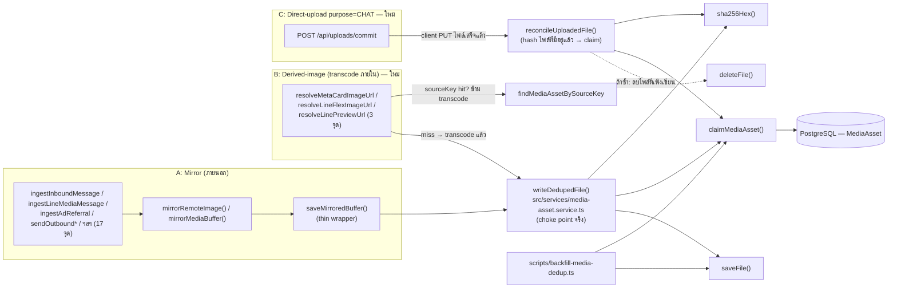

> **โมดูล:** M00051-ChatMediaDedup
> **ประเภทเอกสาร:** Software Requirements Specification (SRS) — TECHNICAL
> **เวอร์ชัน:** 1.1 (แก้หลัง Controller ตรวจโค้ดพบว่า `saveMirroredBuffer` ไม่ใช่ choke point เดียว — ดู §3.0)
> **วันที่จัดทำ:** 2026-08-19
> **สถานะ:** Draft — เขียนจากการอ่านโค้ดจริงทั้ง 11 จุดที่เรียก `saveFile()` ใน `src/` รอ user review ก่อน commit
> **เจ้าของเอกสาร:** safepay-planner (ดู [[Feature-Docs-Ownership]])

# SRS: การกำจัดไฟล์สื่อซ้ำในระบบแชท (Software Requirements Specification — Technical)

---

## 0. Errata — สิ่งที่แก้จากฉบับร่างแรก (2026-08-19)

Controller ตรวจโค้ดเองแล้วพบว่าสมมติฐานที่ตั้งไว้ในฉบับร่างแรก ("`saveMirroredBuffer` เป็นจุดเขียน
storage จุดเดียว") **ผิด** — `grep 'saveFile(' src/` พบ 11 call sites มีแค่ 1 จุดที่เป็น
`saveMirroredBuffer` ที่เหลือแยกเป็น 3 กลุ่ม (รายละเอียดเต็มที่ §3.0):

1. **3 ฟังก์ชัน derived-image** (`resolveMetaCardImageUrl`/`resolveLineFlexImageUrl`/
   `resolveLinePreviewUrl`) — เขียนไฟล์ใหม่ทุกครั้งที่ถูกเรียก ไม่มี cache เลย — **user อนุมัติให้เข้า
   scope รอบนี้แล้ว (2026-08-19)** ดู TFR-CMD-09
2. **Direct-upload path ของ CHAT purpose** (`POST /api/uploads/commit`) — client PUT ไฟล์ตรงเข้า
   storage ไม่ผ่าน `saveFile()` เลยด้วยซ้ำ (คนละปัญหาจากข้อ 1) — **เข้า scope เฉพาะ purpose='CHAT'**
   ดู TFR-CMD-10
3. **Path ที่ยืนยันแล้วว่านอกขอบเขต** (KYC verification, admin badges, order slip, product/room image) —
   ดู §3.0.3 เหตุผลที่ไม่รวม

เอกสารนี้ (v1.1) เขียนทับ v1.0 ทั้งฉบับ ไม่ใช่ diff — TFR-CMD-01..08 ของ v1.0 ยังคงอยู่ (ยืนยันถูกต้อง
แล้ว ไม่กระทบจากการแก้ไข) เพิ่ม TFR-CMD-09/10 ใหม่ และแก้ §3.0/§7 ให้สะท้อนความจริง

---

## 1. บทนำ (Introduction)

### 1.1 วัตถุประสงค์ของเอกสาร

เอกสารนี้ตอบคำถามเชิงเทคนิคที่ [[PRD]]/[[BRD]] ทิ้งไว้ — โดยเฉพาะ **`shopId` มาจากไหนในแต่ละจุดที่เขียน
storage จริง (ไม่ใช่แค่จุดที่เข้าใจผิดว่าเป็นจุดเดียว)**, **ผลกระทบ latency**, และ **CLI interface ของ
backfill** ผู้อ่านหลักคือ DEV ที่จะ implement และ QA ที่จะเขียน Test Case

### 1.2 ขอบเขตเชิงระบบ (System Scope)

**อยู่ในขอบเขต (4 choke point จริง หลังแก้ไข):**

| # | Choke point | ประเภท input | สถานะ |
|---|---|---|---|
| A | `saveMirroredBuffer` (mirror จากภายนอก) | fetch(url) หรือ buffer จาก LINE Data API | v1.0 เดิม — 17 call sites |
| B | `resolveMetaCardImageUrl`/`resolveLineFlexImageUrl`/`resolveLinePreviewUrl` (transcode รูปที่มีอยู่แล้ว) | `getFile(originalFileId)` → transcode | **ใหม่ v1.1** — 3 call sites |
| C | `POST /api/uploads/commit` (purpose='CHAT' เท่านั้น) | ไฟล์ที่ client PUT ตรงเข้า storage มาแล้ว | **ใหม่ v1.1** — 1 call site |
| — | ตารางใหม่ `MediaAsset` + CLI backfill | — | เดิม |

**ไม่อยู่ในขอบเขต (ยืนยันแล้วจากโค้ดจริง — ดู §3.0.3 เหตุผลทีละจุด):** `POST /api/upload` (KYC
verification), `POST /api/admin/badges/upload`, `POST /api/app/upload` (buyer-app verification/slip),
`POST /api/orders/[token]/slip`, `POST /api/chat/upload` (legacy — ยืนยันแล้วว่าไม่มี client เรียกอีก
ต่อไป)

### 1.3 เอกสารอ้างอิง

| เอกสาร | ความสัมพันธ์ |
|--------|-------------|
| [[PRD]] | ที่มา KPI — **§9.2 มี assumption ที่ผิด ต้องแก้** (ดูรายงานท้าย Planner สำหรับข้อความที่เสนอแทน) |
| [[BRD]] | ที่มา FR-CMD-01..07 |
| [[DATABASE]] | schema `MediaAsset` (เขียนขนานโดย safepay-database — **เขียนบนสมมติฐานเดิมเช่นกัน**, §1.1 ของ DATABASE.md ต้องอัปเดตให้ครอบคลุม derived-image + commit-path ด้วย — แจ้ง Controller ให้ sync) |
| `src/services/channel-chat.service.ts` | `saveMirroredBuffer` (L715-719), `resolveMetaCardImageUrl` (L2937), `resolveLineFlexImageUrl` (L2957), `resolveLinePreviewUrl` (L2976) |
| `src/app/api/uploads/commit/route.ts` | choke point ใหม่ที่ต้องแก้ (TFR-CMD-10) |
| `src/app/api/uploads/ticket/route.ts`, `src/lib/upload-ticket.ts`, `src/app/api/uploads/_shared.ts` | บริบทของ presigned-PUT flow ที่ commit route เป็นปลายทาง |

### 1.4 นิยามและตัวย่อ

| คำ/ตัวย่อ | ความหมาย |
|-----------|----------|
| **`writeDedupedFile()`** | primitive ชั้นล่างใหม่ (`media-asset.service.ts`) ที่รวม "hash → lookup → เขียนไฟล์ถ้า miss → register" — **นี่คือ choke point ที่แท้จริงของฟีเจอร์นี้** ไม่ใช่ `saveMirroredBuffer` (ซึ่งกลายเป็นแค่ผู้เรียกรายหนึ่งใน 2 รายที่เขียนไฟล์ใหม่) |
| **`reconcileUploadedFile()`** | primitive ใหม่สำหรับกรณีไฟล์ถูกเขียนไปแล้ว (client PUT ตรง) — hash แล้ว "ยืนยันหรือลบทิ้งแล้วใช้ของเดิม" แทนที่จะ "เขียนใหม่แล้วเช็ค" |
| **`sourceKey` namespace `derived:`** | รูปแบบใหม่ `derived:{kind}:{originalFileId}` สำหรับ layer 2 cache ของรูป transcode (แยกจาก `ad:{adId}` เดิม) |
| อื่น ๆ | เหมือนฉบับ v1.0 (choke point, layer 1/2, survivor, candidate fileId) |

---

## 2. ภาพรวมสถาปัตยกรรม (Architecture Overview)

### 2.1 บริบทระบบ (แก้ไขจาก v1.0 — เพิ่ม 2 เส้นทางใหม่)



### 2.2 องค์ประกอบหลัก (แก้ไข)

| Component | หน้าที่ | ไฟล์ |
|-----------|---------|------|
| `src/lib/media-hash.ts` (ใหม่) | `sha256Hex()` — pure | ใหม่ |
| `src/services/media-asset.service.ts` (ใหม่, **ขยายจาก v1.0**) | `findMediaAssetByHash`, `findMediaAssetBySourceKey`, `claimMediaAsset`, `claimSourceKey`, **`writeDedupedFile`** (ใหม่ — ย้าย logic ของ `saveMirroredBuffer` มาไว้ที่นี่), **`reconcileUploadedFile`** (ใหม่ — สำหรับ path C) | ใหม่ |
| `saveMirroredBuffer()` | thin wrapper เรียก `writeDedupedFile()` — คงชื่อเดิมไว้เพื่อ readability ของโค้ด mirror | `channel-chat.service.ts` (แก้) |
| `resolveMetaCardImageUrl` / `resolveLineFlexImageUrl` / `resolveLinePreviewUrl` | เพิ่ม sourceKey-first check ก่อน transcode, เรียก `writeDedupedFile()` แทน `saveFile()` ตรง ๆ | `channel-chat.service.ts` (แก้ — **ใหม่**) |
| `POST /api/uploads/commit` | เพิ่มเรียก `reconcileUploadedFile()` เมื่อ `purpose==='CHAT'` และ resolve `shopId` ได้ | `src/app/api/uploads/commit/route.ts` (แก้ — **ใหม่**) |
| `resolveChatChannelForUser()` | เพิ่มคืน `shopId` ใน `ChatChannelResult` (additive) | `src/app/api/uploads/_shared.ts` (แก้เล็กน้อย — **ใหม่**) |
| `scripts/backfill-media-dedup.ts` (ใหม่) | CLI dry-run/apply/report | ใหม่ |

---

## 3. ข้อกำหนดเชิงฟังก์ชันเชิงเทคนิค

### 3.0 การตรวจสอบ choke point จริง — ตาราง 11 จุดที่เรียก `saveFile()` ใน `src/`

**คำสั่งที่ใช้ยืนยัน:** `grep 'saveFile(' src/` (ไม่รวม `src/lib/storage/*` เอง และไม่รวม test) —
ได้ผลตรงกับที่ Controller รายงาน 11 จุด:

| # | ไฟล์:บรรทัด | บริบท | อยู่ในขอบเขตฟีเจอร์นี้ไหม |
|---|---|---|---|
| 1 | `channel-chat.service.ts:718` (ใน `saveMirroredBuffer`) | mirror จากภายนอก | ✅ ในขอบเขต (path A) |
| 2 | `channel-chat.service.ts:2945` (ใน `resolveMetaCardImageUrl`) | transcode การ์ด Meta 1.91:1 | ✅ ในขอบเขต (path B, ใหม่) |
| 3 | `channel-chat.service.ts:2963` (ใน `resolveLineFlexImageUrl`) | transcode รูป LINE Flex | ✅ ในขอบเขต (path B, ใหม่) |
| 4 | `channel-chat.service.ts:2997` (ใน `resolveLinePreviewUrl`) | transcode preview LINE | ✅ ในขอบเขต (path B, ใหม่) |
| 5 | `src/app/api/upload/route.ts:28` | `POST /api/upload` — legacy multipart, ใช้โดย KYC verification (บัตร/selfie/ทะเบียนธุรกิจ) | ❌ นอกขอบเขต — §3.0.3 ข้อ 1 |
| 6 | `src/app/api/admin/badges/upload/route.ts:96` | อัปโหลด badge icon โดย admin | ❌ นอกขอบเขต — §3.0.3 ข้อ 2 |
| 7 | `src/app/api/chat/upload/route.ts:91` | `POST /api/chat/upload` — **legacy, ยืนยันแล้วว่าไม่มี client เรียกอีก** | ❌ นอกขอบเขต — §3.0.3 ข้อ 3 |
| 8 | `src/app/api/orders/[token]/slip/route.ts:115` | อัปโหลดสลิปโอนเงิน (legacy multipart path ของ slip) | ❌ นอกขอบเขต — §3.0.3 ข้อ 4 |
| 9 | `src/app/api/app/upload/route.ts:24` | Buyer App (native) — เอกสารยืนยันตัวตน/สลิป | ❌ นอกขอบเขต — §3.0.3 ข้อ 4 |
| — | **`POST /api/uploads/commit`** (ไม่เรียก `saveFile()` เลย — client PUT ตรงเข้า storage ผ่าน presigned URL จาก `createUploadTicket()`) | path C ใหม่ — **ไม่อยู่ในผลลัพธ์ของ grep `saveFile(` เพราะไม่เคยเรียกฟังก์ชันนี้เลย** | ✅ ในขอบเขต **เฉพาะ purpose='CHAT'** — §3.0.2 |

🛑 **ข้อสังเกตสำคัญที่ต้องบันทึกไว้ (แก้ไขความเข้าใจผิดซ้อนอีกชั้น):** การ grep `saveFile(` ตามที่
Controller ทำ **ยังไม่ครบ 100%** เพราะ path C (`/api/uploads/commit`) เป็น **เส้นทางหลักของการอัปโหลด
ไฟล์แนบแชทในปัจจุบัน** (ตาม comment ที่หัว `/api/chat/upload/route.ts:16-20` และยืนยันจากเทส
`src/lib/__tests__/upload-no-multipart-callers.test.ts` ที่บังคับให้ client ทุกจุดเรียกผ่าน
`@/lib/upload-client` → ticket/commit) แต่ path นี้**ไม่เคยเรียก `saveFile()` เลยแม้แต่ครั้งเดียว**
(ไฟล์ถูกเขียนโดย client PUT ตรงผ่าน presigned URL) — การ grep ด้วยชื่อฟังก์ชันเดียวจึงพลาด choke point
ที่ "หนักที่สุด" ของระบบไปโดยสิ้นเชิง ยืนยันด้วยการไล่โค้ดจริง (`src/app/api/uploads/commit/route.ts`,
`src/app/api/uploads/ticket/route.ts`, `src/lib/storage/local.ts:31-40`, `s3.ts` — ไม่มี `saveFile()`
ปรากฏในไฟล์เหล่านี้เลย)

### 3.0.1 ยืนยันตัวเลข prod ของ path C (SHOP duplicate ~850 ที่ Controller อ้างถึง)

`ChatMessage` ที่ SHOP ส่ง 6,301 ข้อความ / distinct 5,449 (PRD §10.2) ≈ **852 ที่ซ้ำ** — ตัวเลขนี้รวมทั้ง
"SHOP ส่งรูปสินค้าซ้ำผ่าน commit path" และ "SHOP ส่งรูปที่เคย mirror ไว้แล้วซ้ำ" ปนกัน (ไม่มีทางแยกจาก
ตัวเลขรวมได้โดยไม่ query เพิ่ม) — แต่ path C คือ **เส้นทางเดียว**ที่ SHOP ใช้แนบไฟล์เองในแชท (ยืนยันจาก
`upload-no-multipart-callers.test.ts` representatives: `useSellerChatThread.ts` import จาก
`@/lib/upload-client`) จึงเป็นสาเหตุหลักที่อธิบายตัวเลขนี้ได้สมเหตุสมผลที่สุด

### 3.0.2 ทำไม path C เข้าขอบเขต — เฉพาะ `purpose === 'CHAT'`

`/api/uploads/commit` รองรับ 3 purpose (`CHAT`/`IMAGE`/`DOCUMENT`, `src/lib/upload-policy.ts:57`)
— `IMAGE` = รูปสินค้า/ห้องพัก/อวาตาร์/โลโก้ร้าน (`ProductImagesCardV2`/`RoomImages`), `DOCUMENT` = เอกสาร
ยืนยันตัวตน L2/L3 + สลิปโอนเงิน (`checkUploadPolicy` L93-98) — ทั้งสอง purpose นี้เป็นคนละ business
domain จาก "สื่อในแชท" ตาม BRD Executive Summary โดยสิ้นเชิง **จำกัด hook ไว้ที่ `purpose==='CHAT'`
เท่านั้น** ไม่ครอบ IMAGE/DOCUMENT (เหตุผลเดียวกับ §3.0.3 ข้อ 1/2/4)

### 3.0.3 เหตุผลที่ 5 จุดยังคงนอกขอบเขต

1. **`POST /api/upload` (KYC verification)** — เอกสารยืนยันตัวตนแต่ละครั้งเป็น**เหตุการณ์ทางกฎหมายที่
   แยกกัน** แม้เนื้อไฟล์จะเหมือนกัน (เช่น อัปโหลดบัตรประชาชนใบเดิมซ้ำเพราะฟอร์ม resubmit) การ dedup
   silent อาจสร้างความสับสนเรื่อง audit trail ของ verification — และไม่มีอยู่ใน BRD/PRD business case
   เลยแม้แต่บรรทัดเดียว (out of scope ตาม Hard Rule 11 doc-first — ต้องมี BRD ของตัวเองก่อน)
2. **`POST /api/admin/badges/upload`** — แอดมินอัปโหลด badge icon, **ไม่มี `shopId` ในบริบทเลย**
   (เป็น global asset ไม่ผูกร้าน) ขัดกับ `@@unique([shopId, hash])` โดยตรง ปริมาณต่ำมาก (แอดมินไม่กี่คน
   อัปโหลดไม่กี่ครั้ง) ไม่คุ้มความซับซ้อน
3. **`POST /api/chat/upload` (legacy)** — ยืนยันจาก `src/lib/__tests__/upload-no-multipart-callers.test.ts`
   ว่า **ไม่มี client component ใดในปัจจุบันเรียก route นี้อีกต่อไป** (ทุก surface ย้ายไป
   `@/lib/upload-client` → ticket/commit หมดแล้ว, เทสนี้ enforce ไว้) comment ของ route เองก็ระบุ
   "legacy (2026-08-10): ห้ามใช้กับงานใหม่" — เพิ่ม dedup ให้ route ที่ไม่มีใครเรียกคือ effort ที่ไม่ได้
   คุณค่าอะไรกลับมา (แม้ shopId จะหาได้ง่ายที่ path นี้ก็ตาม — `conv.shopId` มีอยู่แล้วที่ L69/75 ถ้าจะ
   ทำในอนาคต เป็น P2 optional ไม่ใช่ P1 ของ feature นี้)
4. **`POST /api/orders/[token]/slip` และ `POST /api/app/upload`** — สลิปโอนเงิน/เอกสารยืนยันตัวตน
   คนละ business domain จาก "สื่อในแชท" เหมือนข้อ 1 และ **`/api/orders/[token]/slip` มี `deleteFile()`
   ที่ทำงานอยู่แล้วเป็นส่วนหนึ่งของ rollback pattern เดิม** (attachSlip ล้ม → ลบไฟล์ทิ้งทันที, บรรทัด
   114-129) — ไฟล์เหล่านี้ไม่เคยถูกลงทะเบียนใน `MediaAsset` เลย (อยู่นอกขอบเขต) จึง**ไม่กระทบ**จาก
   ฟีเจอร์นี้แม้แต่น้อย (ดู §7 เรื่อง `deleteFile()` เดิม)

### TFR-CMD-01 · Layer 1 — content-hash dedup ที่ `writeDedupedFile()` (เดิม TFR ของ v1.0, **ย้ายจาก `saveMirroredBuffer` ไปที่ primitive ใหม่**)

- **Trace to:** FR-CMD-01, BR-CMD-01, BR-CMD-02
- **คำอธิบายเชิงเทคนิค:** `writeDedupedFile(buffer, contentType, opts: { shopId, filenamePrefix, sourceKey? })` — logic เดิมทุกประการจากที่เคยออกแบบไว้ใน `saveMirroredBuffer` (v1.0):
  1. `hash = sha256Hex(buffer)`
  2. `existing = await findMediaAssetByHash(shopId, hash)` (wrap try/catch ที่ระดับนี้ — miss เมื่อ error, TFR-CMD-07)
  3. hit → คืน `existing.fileId` ไม่เขียนไฟล์ + `claimSourceKey` best-effort ถ้ามี `sourceKey`
  4. miss → `saveFile()` → `claimMediaAsset(...)` → จัดการ P2002 race เหมือนเดิม (อ่านผู้ชนะ, ลบไฟล์ที่
     เพิ่งเขียน, คืน fileId ผู้ชนะ)
- **Postcondition:** ไฟล์เนื้อหาเดียวกัน + `shopId` เดียวกัน คืน `fileId` เดียวกันเสมอ **ไม่ว่าจะเข้ามาทาง
  path A (mirror) หรือ path B (derived-image)** — เป็น primitive เดียวที่ใช้ร่วมกันจริง
- **`saveMirroredBuffer` หลังแก้:**
  ```ts
  function saveMirroredBuffer(buffer, contentType, opts): Promise<string> {
    return writeDedupedFile(buffer, contentType, opts)  // thin wrapper — คงชื่อไว้เพื่ออ่านโค้ด mirror ง่าย
  }
  ```

### TFR-CMD-02 · เปลี่ยน signature ทุกฟังก์ชันตระกูล mirror + thread `shopId` (17 จุด — ไม่เปลี่ยนจาก v1.0)

`mirrorRemoteImage(url, opts: { shopId; filenamePrefix?; sourceKey? })`,
`mirrorMediaBuffer(data, contentType, opts: { shopId; filenamePrefix?; sourceKey? })` — บังคับ options
object (ห้าม positional) ด้วยเหตุผล: `shop-channel.service.ts:64` เคยส่ง `'ig-avatar'` เป็น
positional ที่ 2 อยู่แล้ว — ถ้าเพิ่ม `shopId` เป็น positional ที่ 2 โค้ดเดิมจะ **compile ผ่านแต่ค่า
`'ig-avatar'` ไหลเข้า `shopId`** (ทั้งคู่เป็น `string` — tsc จับไม่ได้) กลายเป็น cross-shop dedup
โดยไม่ตั้งใจซึ่งขัด BR-CMD-01 ตรง ๆ

`shopId` เป็น **required field ของ object** (ไม่ใช่ optional) — เพื่อให้ `tsc` แดงทุกจุดที่ยังไม่ได้แก้

**ตาราง 17 จุดเรียกจริงที่พบใน `src/`:**

| # | ไฟล์:บรรทัด | shopId มาจาก | ต้อง thread เพิ่มไหม |
|---|---|---|---|
| 1 | `channel-chat.service.ts:477` (`resolveBackfillContent`) | `conv.shopChannel.shopId` (L280-283) | ใช่ |
| 2 | `channel-chat.service.ts:516` (`mirrorGraphCards`) | เดียวกับ #1 | ใช่ |
| 3-7 | `channel-chat.service.ts:1160/1221/1230/1270/1287` (`ingestInboundMessage`) | `channel.shopId` (L1089) | ไม่ต้อง |
| 8-9 | `channel-chat.service.ts:2031/2078` (`ingestLineMediaMessage`) | `params.shopId` (L2001) | ไม่ต้อง |
| 10 | `channel-chat.service.ts:2333` (`ingestAdReferral`) | `channel.shopId` (L2304) | ไม่ต้อง |
| 11 | `channel-chat.service.ts:3296` (`sendOutboundLineMessage`) | `conversation.shopId` | ไม่ต้อง |
| 12-13 | `channel-chat.service.ts:3708/3711` (`sendOutboundMessage` Meta) | `conversation.shopId` (L3496) | ไม่ต้อง |
| 14 | `shop-page-layout.service.ts:358` | `shopId` param ตรง | ไม่ต้อง |
| 15 | `shop-video.service.ts:348` | `shopId` param ตรง | ไม่ต้อง |
| 16 | `shop-channel.service.ts:64` (`mirrorInstagramAvatar`) | `connectPages(shopId,...)` (L298) | ใช่ |
| 17a-c | `page-comment.service.ts:61` (`mirrorPostThumbnail`, 3 caller) | `channel.shopId`(L103)/`params.shopId`(L242)/**ไม่มีเลย**(`refreshPostStats`) | ใช่ 2 จุด, จุดที่ 3 ต้องขยาย query (TD-06) |

**จุดที่ 17c คือ gap จริงที่ยืนยันจากโค้ด:** `refreshPostStats(postId)` (L1120) รับแค่ `postId` และ query
`prisma.facebookPost.findUnique({ where: { id: postId } })` (L1122) โดยไม่ include ความสัมพันธ์ใด ๆ —
**ไม่มี `shopId` อยู่ใน scope เลยตลอดทั้งฟังก์ชัน** ทางแก้: เปลี่ยน query เป็น
`include: { channel: { select: { shopId: true } } }` แล้วใช้ `post.channel.shopId`

### TFR-CMD-03 · Layer 2 — `sourceKey` cache สำหรับรูปโฆษณา (ไม่เปลี่ยนจาก v1.0)

- **Trace to:** FR-CMD-02, BR-CMD-01
- ที่ `ingestAdReferral()` (`channel-chat.service.ts:2282-2333`) ก่อนเลือก `imageUrl` และก่อนเรียก
  `mirrorRemoteImage`:
  ```
  sourceKey = referral.ad_id ? `ad:${referral.ad_id}` : undefined
  if (sourceKey) {
    hit = await findMediaAssetBySourceKey(channel.shopId, sourceKey).catch(() => null)  // best-effort
    if (hit) photoFileId = hit.fileId   // ไม่ fetch Meta CDN เลย
  }
  if (!photoFileId && imageUrl) {
    photoFileId = await mirrorRemoteImage(imageUrl, { shopId: channel.shopId, sourceKey })
  }
  ```
  `claimSourceKey` เป็นแบบ **set-once** (`updateMany({ where: { shopId, hash, sourceKey: null }, data: { sourceKey } })`)
  — ไม่ overwrite `sourceKey` ที่มีอยู่แล้ว (กันกรณีสองแคมเปญใช้ creative เนื้อหาเดียวกัน — เจ้าของ
  sourceKey คนแรกชนะ, ครั้งถัดไปยัง hit ผ่าน layer 1 hash อยู่ดี)
- **Postcondition:** ad ID เดิมยิง fetch ไปยัง Meta CDN ได้ **มากที่สุดครั้งเดียว** ตลอดอายุฟีเจอร์

### TFR-CMD-04 – TFR-CMD-08 · CLI backfill (ไม่เปลี่ยนจาก v1.0)

- **TFR-CMD-04 (dry-run):** โหมดเริ่มต้น **ไม่แตะ `MediaAsset` เลย** ทำ grouping ใน memory ต่อร้าน:
  query fileId จาก 3 คอลัมน์ → `getFile` → `sha256Hex` → group ด้วย `Map<"${shopId}:${hash}", ...>` →
  พิมพ์รายงาน. ไฟล์ที่ `getFile()` คืน `null` → นับเป็น "unreadable" ไม่ throw ทั้ง batch
- **TFR-CMD-05 (`claimMediaAsset`):** `create` ตรง ๆ ก่อน (ไม่ find-then-create) → สำเร็จ =
  `{ survivorFileId: fileId, isNewRegistration: true }` → ชน P2002 (เช็คด้วย `isUniqueViolationOn(e, 'hash')`
  ที่มีอยู่แล้ว L703) → อ่านผู้ชนะ → `{ survivorFileId: winner.fileId, isNewRegistration: false }`.
  DB error อื่นที่ไม่ใช่ P2002 → **ไม่ catch ในฟังก์ชันนี้** ปล่อยผู้เรียกตัดสิน
- **TFR-CMD-06 (apply + resume):** query
  `SELECT DISTINCT fileId จาก 3 คอลัมน์ WHERE shopId=? AND fileId NOT IN (SELECT fileId FROM MediaAsset) LIMIT batchSize`
  — **เงื่อนไข `NOT IN MediaAsset` คือกลไก resume ทั้งหมด** ไม่ต้องมี state file. ต่อ candidate:
  อ่าน bytes → hash → `claimMediaAsset` → ถ้าซ้ำ → `$transaction([updateMany x3])` repoint ทุกแถว →
  สำเร็จแล้วค่อย `deleteFile()` (**BR-CMD-07 บังคับลำดับนี้**)
  - repoint สำเร็จ แต่ `deleteFile()` ล้มเหลว → ไฟล์กลายเป็น **orphan ถาวร** (ไม่ถูก reference แล้ว
    รอบหน้าจึงไม่เจอ) → **log แยกประเภท "orphaned"** พร้อม fileId เต็ม (known-gap v1, ไม่ auto-retry)
  - repoint ล้มเหลวทั้ง transaction → ไม่ลบไฟล์ → "failed" → candidate ยังไม่มีแถวใน `MediaAsset`
    จึงถูกหยิบมาลองใหม่อัตโนมัติรอบถัดไป (retry โดยธรรมชาติ)
- **TFR-CMD-07 (invariant ห้าม throw):** ทุกจุดที่ dedup logic แตะ DB (`findMediaAssetByHash`,
  `findMediaAssetBySourceKey`, `claimSourceKey`) **ต้อง wrap try/catch ภายในตัวเอง** และ degrade เป็น
  "miss"/no-op — **ไม่ปล่อยให้ exception ลอยไปถึง catch-all ของ `mirrorRemoteImage`** (L771-773) ซึ่ง
  แปลผลเป็น "mirror ล้มเหลว" → คืน `null` → ข้อความกลายเป็น placeholder — **regression ที่แย่กว่า
  "ไม่มีฟีเจอร์นี้เลย"**
- **TFR-CMD-08 (reporting):** พิมพ์สรุปต่อร้าน + สรุปรวม (สแกน, ลงทะเบียนใหม่, รวมซ้ำสำเร็จ, พื้นที่คืน,
  failed, orphaned) ไม่มีรายการใดถูกข้ามเงียบ

**เพิ่มเติมจากการแก้ไขรอบนี้:** ขอบเขตการสแกนของ CLI ยังครอบแค่ 3 คอลัมน์อ้างอิงเดิม —
**ไฟล์ derived-image (path B) ไม่เคยถูกเขียนกลับเข้า 3 คอลัมน์นี้เลย** (เป็น transient output ที่ใช้สร้าง
signed URL ส่งออกครั้งเดียวแล้วจบ) ดังนั้น **CLI ไม่ต้องแก้อะไรเพิ่มเพื่อรองรับ path B/C**

### TFR-CMD-09 · Derived-image dedup ผ่าน `sourceKey` namespace `derived:` (🆕 ใหม่ — user อนุมัติ 2026-08-19)

- **Trace to:** ส่วนขยายของ FR-CMD-01 (BRD เดิมไม่ครอบ แต่ user อนุมัติให้ขยายขอบเขตรอบนี้)
- **คำอธิบายเชิงเทคนิค:** ทั้ง 3 ฟังก์ชันปรับ pattern เดียวกัน (ตัวอย่าง `resolveMetaCardImageUrl`):
  ```ts
  export async function resolveMetaCardImageUrl(fileId: string, opts: { shopId: string }): Promise<string | null> {
    const sourceKey = `derived:metacard:${fileId}`
    const cached = await findMediaAssetBySourceKey(opts.shopId, sourceKey).catch(() => null)  // best-effort
    if (cached) return await getFileUrl(cached.fileId, { signed: true, expiresIn: 3600 })

    try {
      const original = await getFile(fileId)
      if (!original) return null
      const jpeg = await buildMetaCardJpeg(original.buffer, META_CARD_MAX_BYTES)
      if (!jpeg) return null
      const cardFileId = await writeDedupedFile(Buffer.from(jpeg), 'image/jpeg', {
        shopId: opts.shopId, filenamePrefix: 'meta-card', sourceKey,
      })
      return await getFileUrl(cardFileId, { signed: true, expiresIn: 3600 })
    } catch (err) {
      console.warn('[meta-card] เตรียมรูปสินค้าไม่สำเร็จ ส่งการ์ดแบบไม่มีรูป', { reason: err instanceof Error ? err.message : 'unknown' })
      return null
    }
  }
  ```
  `resolveLineFlexImageUrl(fileId, opts)` และ `resolveLinePreviewUrl(fileId, kind, fullUrl, opts)` ปรับ
  pattern เดียวกัน ด้วย `sourceKey = "derived:lineflex:${fileId}"` / `"derived:linepreview:${fileId}"`
  — **namespace แยกกันเพราะแต่ละ kind ให้ output คนละ byte กัน** จาก input เดียวกัน (คนละ crop/encode
  parameter) จะใช้ sourceKey ร่วมกันไม่ได้

- **🛑 ประเด็นวิกฤต: "ถ้า original ถูก backfill รวมกับใบอื่นภายหลัง survivor เปลี่ยน → sourceKey เดิม
  ชี้ fileId ที่ถูกลบไปแล้วหรือไม่":**

  **คำตอบ: ไม่ — ปลอดภัยโดยโครงสร้าง ไม่ใช่โดยบังเอิญ** เหตุผล:
  1. `originalFileId` ที่ใช้ประกอบ `sourceKey` มาจาก `Product.images[i]` (สำหรับ metacard/lineflex) หรือ
     `ChatMessage.imageUrl`-ที่กำลังจะถูกส่ง (สำหรับ linepreview) — เป็นค่าที่ **caller เพิ่งอ่านสด ๆ
     จาก DB ก่อนเรียกฟังก์ชันนี้ทุกครั้ง** ไม่มีการ cache ค่า `fileId` นี้ไว้ข้ามการเรียก
  2. ถ้า backfill repoint คอลัมน์ต้นทางแล้ว (`A` → `B`) การเรียกครั้งถัดไปจะ**อ่านค่า `B` ใหม่โดย
     อัตโนมัติ** แล้วคำนวณ `sourceKey = "derived:...:B"` ซึ่ง**เป็นคีย์คนละอันกับเดิม** — ผลคือ
     **cache miss (ไม่ใช่ stale hit)** ไป transcode ใหม่แล้ว register cache ใหม่ภายใต้คีย์ `B`
  3. แถวเก่า (`sourceKey="derived:...:A"`) กลายเป็น **cache entry ที่ตายแล้วเฉย ๆ** — ไม่ใช่ stale
     pointer ที่ชี้ไฟล์ที่หายไป เพราะไฟล์ derived output ของแถวเก่า **ไม่เคยถูกแตะโดย backfill เลย**
  4. **ทำไมไฟล์ derived output ไม่มีวันถูก backfill ลบ:** CLI สแกนเฉพาะ 3 คอลัมน์อ้างอิง —
     `cardFileId`/`previewFileId`/`flexFileId` **ไม่เคยถูกเขียนกลับเข้าคอลัมน์เหล่านี้เลย** (เป็น signed
     URL ที่ยิงออกไปให้ Meta/LINE ใช้ครั้งเดียวตอนส่งข้อความแล้วจบ — ตรวจโค้ดยืนยันแล้วว่าไม่มี
     `prisma.xxx.update` ใดเขียน `cardFileId` ลงตารางไหนเลย) จึงอยู่นอก "universe" ที่ backfill รู้จัก
  5. **ผลข้างเคียงที่ยอมรับได้:** แถว `MediaAsset` ของ derived-cache ที่ "ตายแล้ว" จะค้างอยู่ตลอดไป
     (storage เศษเล็กน้อย ไฟล์ transcode ≤1MB ต่อรายการ) — **known-limitation ที่ยอมรับได้ใน v1**
     เดียวกับที่ยอมรับเรื่อง "ไม่มี retention policy" อยู่แล้วทั้งฟีเจอร์

- **Edge case ที่สอง (เนื้อหาเดียวกันจากคนละ originalFileId, ยังไม่ถูก merge):** เรียกด้วย `A` แล้วด้วย
  `B` จะได้ `sourceKey` คนละอัน — ตอน transcode ครั้งที่สองเข้า `writeDedupedFile` มันจะ hash ตรงกับของ
  ที่ transcode จาก `A` ไปแล้ว → **layer 1 hash จับได้เอง** คืน fileId เดิม ไม่เขียนไฟล์ใหม่ (แต่
  `claimSourceKey` สำหรับ `derived:...:B` จะ set-once ไม่ผ่าน) — ผลคือครั้งถัดไปที่เรียกด้วย `B` จะ
  miss ที่ layer 2 แต่ hit ที่ layer 1 เสมอ — **เสีย CPU transcode ซ้ำ ไม่เสีย storage ซ้ำ**

- **Postcondition:** การ์ดสินค้าเดิมที่ถูกส่งซ้ำ (จาก 548 ข้อความที่วัดจาก prod) ที่ผูกกับ
  `Product.images[0]` ตัวเดียวกัน จะสร้างไฟล์ derived **ครั้งเดียว** ไม่ว่าจะถูกส่งไปกี่ครั้ง

### TFR-CMD-10 · Direct-upload reconcile ที่ `POST /api/uploads/commit` (🆕 ใหม่ — purpose='CHAT' เท่านั้น)

- **Trace to:** ส่วนขยายของ FR-CMD-01
- **คำอธิบายเชิงเทคนิค:** ต่างจาก path A/B ตรงที่ **ไฟล์ถูกเขียนไปแล้วก่อนที่ server จะเห็นด้วยซ้ำ**
  (client PUT ตรงเข้า storage ผ่าน presigned URL) — จึงไม่ใช่ "hash-then-write" แต่เป็น
  "write-already-happened-then-reconcile":
  ```ts
  // ใน POST /api/uploads/commit — หลัง getFileMeta + size/policy check ผ่านหมดแล้ว (บรรทัด ~61-102 เดิม)
  let finalFileId = claim.fileId
  if (claim.purpose === 'CHAT' && claim.conversationId) {
    const resolved = await resolveChatChannelForUser(claim.conversationId, userId)  // แก้ให้คืน shopId (TFR-CMD-11)
    if (resolved.ok && resolved.shopId) {
      const reconciled = await reconcileUploadedFile({
        shopId: resolved.shopId,
        fileId: claim.fileId,
        contentType: mime,
        size: meta.size,
      }).catch(() => null)  // ห้าม throw — ล้มเหลว = ใช้ claim.fileId เดิมต่อไป (TFR-CMD-07)
      if (reconciled) finalFileId = reconciled.fileId
    }
  }
  return NextResponse.json({ fileId: finalFileId, name, size: meta.size, mime, kind }, { status: 201 })
  ```
  `reconcileUploadedFile()` (ใหม่ ใน `media-asset.service.ts`):
  1. `bytes = await getFile(fileId)` (อ่านไฟล์ที่ client เพิ่ง PUT เสร็จ)
  2. `hash = sha256Hex(bytes.buffer)`
  3. `{ survivorFileId, isNewRegistration } = await claimMediaAsset({ shopId, hash, fileId, contentType, size })`
  4. `isNewRegistration: true` → คืน `{ fileId }` เดิม (ไฟล์นี้กลายเป็น survivor เอง)
  5. `isNewRegistration: false` → `await deleteFile(fileId)` (ไฟล์ที่ client เพิ่ง PUT ซ้ำกับที่มีอยู่
     แล้ว — ลบทิ้ง best-effort) → คืน `{ fileId: survivorFileId }`
- **Precondition:** `claim.purpose === 'CHAT'` **และ** `claim.conversationId` ไม่ว่าง **และ**
  `resolveChatChannelForUser` คืน `shopId` ได้จริง — ถ้าเงื่อนไขใดไม่ผ่าน (เช่น CHAT แต่ไม่มี
  conversationId อย่างกรณี comment-inbox picker ที่ `/api/uploads/ticket/route.ts:60-62` ยืนยันว่า
  optional) **ข้ามการ reconcile ไปเลย** — พฤติกรรมเดิมทุกประการ (known-gap ที่ยอมรับได้)
- **Postcondition:** response ของ commit อาจคืน `fileId` **ที่ต่างจาก `claim.fileId`** เมื่อพบว่าซ้ำ —
  client (ทั้งหมดผ่าน `@/lib/upload-client`) ต้องใช้ `fileId` ที่ response คืนมาต่อ (ตรงกับ contract
  เดิมอยู่แล้ว — client ไม่เคย assume ว่า `fileId` response ต้องเท่ากับที่ตัวเองส่ง ticket request ไป)
- **Error/Edge cases:**
  - `getFile(fileId)` คืน `null` (ไฟล์หายจาก storage หลัง PUT) → throw → catch ที่ route → ใช้
    `claim.fileId` เดิม (ไม่ block การอัปโหลด)
  - เพิ่ม I/O เข้า commit route (อ่าน bytes เต็มไฟล์แทนแค่ HEAD) — ดู NFR-CMD-08

### TFR-CMD-11 · ขยาย `ChatChannelResult` ให้คืน `shopId` (additive)

- **Trace to:** TFR-CMD-10 (dependency)
- `src/app/api/uploads/_shared.ts` — `ChatChannelResult` เพิ่ม field `shopId: string` ใน branch
  `{ ok: true }` (`conv.shopId` มีอยู่แล้วในผลลัพธ์ query ที่ L19-22 เพียงแต่ไม่เคยถูกส่งออกมา) —
  **ไม่กระทบผู้เรียกเดิม** (`/api/uploads/ticket`, `/api/uploads/commit` เดิม) เพราะเป็นการเพิ่ม field

---

## 4. ข้อกำหนดส่วนต่อประสาน

### 4.1 API Endpoints

**ไม่มี endpoint ใหม่** — `POST /api/uploads/commit` เป็น endpoint ที่**มีอยู่แล้ว** แค่เพิ่มพฤติกรรม
ภายใน (response shape เดิม `{ fileId, name, size, mime, kind }` ไม่เปลี่ยน — แค่ค่า `fileId` อาจเปลี่ยน
เมื่อพบว่าซ้ำ) ดู [[API]]

### 4.2 CLI Interface

```
npx dotenv -e <env> -- npx tsx scripts/backfill-media-dedup.ts [flags]

Flags:
  (ไม่มี flag)      dry-run ต่อทุกร้าน — ค่าเริ่มต้น ปลอดภัยเสมอ
  --apply           เขียนจริง (register MediaAsset + repoint + ลบไฟล์ซ้ำ)
  --shop <shopId>   จำกัดเฉพาะร้านเดียว (แนะนำให้ apply ทีละร้านก่อนรันทั้งระบบ)
  --batch-size <n>  จำนวน candidate ต่อรอบ query (default 200)
  --resume          เครื่องหมายยืนยันว่าตั้งใจรันต่อจากรอบก่อน (cosmetic — resumability เป็นคุณสมบัติ
                     โดยธรรมชาติของ query "NOT IN MediaAsset" ดู TFR-CMD-06)
```

- exit code 0 = จบครบ (ไม่มี failed), exit code 1 = มี failed ≥ 1 รายการ
- pattern การเขียนสคริปต์ตาม 5 สคริปต์เดิมใน `scripts/backfill-*.ts`

### 4.3 Events / Messaging

ไม่มี — ไม่มี queue/event ใหม่

---

## 5. ข้อกำหนดด้านข้อมูล

schema `MediaAsset` ไม่เปลี่ยน (ล็อกแล้ว) — ดู [[DATABASE]] ฉบับเต็ม

**แจ้ง safepay-database ให้อัปเดต DATABASE.md §1.1** เพิ่มเติมว่า path B (derived-image) และ path C
(commit) ก็เขียน `MediaAsset` เช่นกัน ไม่ใช่แค่ `saveMirroredBuffer` (schema ไม่กระทบ แค่ narrative
ต้อง sync — ไม่ใช่ schema change)

---

## 6. ข้อกำหนดที่ไม่ใช่ฟังก์ชัน (Non-Functional Requirements)

| # | ด้าน | ข้อกำหนด | เป้าหมายที่วัดได้ |
|---|------|----------|---------------------|
| NFR-CMD-01 | Performance | hash computation (sha256, buffer ≤ 25 MB) ต้องไม่เพิ่ม latency ของ ingest path จนสังเกตได้ | เพิ่ม instrumentation `performance.now()` รอบ hash+lookup (`console.warn` ถ้า > 200ms); **เป้าหมายตั้งต้น (ต้องวัดจริงก่อนปิดเป็นตัวเลขสุดท้าย):** เพิ่มไม่เกิน 100ms ที่ p95 เทียบ baseline |
| NFR-CMD-02 | Reliability | ความล้มเหลวของ dedup subsystem ต้องไม่เพิ่มอัตราการ "mirror ล้มเหลว" เหนือ baseline | inject DB error ที่ `findMediaAssetByHash`/`claimMediaAsset` → ยืนยัน `mirrorRemoteImage` ยังคืน fileId ที่ใช้งานได้ |
| NFR-CMD-03 | Correctness | ห้ามมีไฟล์เนื้อหาต่างกันถูกรวมเป็นไฟล์เดียว | sha256 เต็ม 32 ไบต์ ไม่ตัดทอน — เทส 2 ไฟล์ที่ต่าง 1 ไบต์ต้องได้ hash คนละค่า |
| NFR-CMD-04 | Correctness (visibility) | **ผู้ใช้ต้องไม่เห็นรูปหายแม้ใบเดียว** | นับจำนวนแถวที่มี `imageUrl`/`photoFileId`/`avatarUrl` ไม่ null ต่อ shop **ก่อน** backfill เทียบ **หลัง** — ต้องเท่ากันทุกแถว (นับแถว ไม่ใช่ distinct fileId); สุ่มเปิด N URL ต้องยังเปิดได้ (ไม่มี 404) |
| NFR-CMD-05 | Isolation | ห้าม cross-shop dedup แม้เนื้อหาเหมือนกัน 100% | ทุก query ของ `MediaAsset` ต้องมี `shopId` ใน WHERE เสมอ (grep gate) |
| NFR-CMD-06 | Observability | dedup hit/miss ต้อง log ได้เพื่อคำนวณ KPI | `console.log`/metric แยก hit vs miss ต่อ layer (1/2) |
| NFR-CMD-07 | Security | CLI รันได้เฉพาะผู้ที่มี prod DB credential | ควบคุมที่ระดับ infra/env access เหมือนสคริปต์ backfill เดิม — ไม่มี HTTP surface ให้ authz |
| **NFR-CMD-08** (ใหม่) | Performance | `reconcileUploadedFile` เพิ่ม latency ให้ `POST /api/uploads/commit` (อ่านไฟล์เต็มแทน HEAD) | เป้าหมายตั้งต้น **≤150ms ที่ p95** (คำขอ interactive ไม่ใช่ webhook hot path — งบกว้างกว่า NFR-CMD-01) **ต้องวัดจริงหลัง implement** |
| **NFR-CMD-09** (ใหม่) | Correctness | `sourceKey` ของ derived-image ต้อง**ไม่มีวันคืนไฟล์ที่ถูกลบไปแล้ว** | เทส: repoint คอลัมน์ต้นทางจาก A→B แล้วลบไฟล์ A จริง → เรียก `resolveMetaCardImageUrl` ด้วยค่าที่อ่านสดจาก DB (=B) ต้องได้ signed URL ที่เปิดได้จริง ไม่ error/ไม่ 404 |

---

## 7. ข้อจำกัดทางเทคนิคและการพึ่งพา

### 7.1 ข้อจำกัดทางเทคนิค

- ต้องใช้ `saveFile`/`getFile`/`deleteFile` ของ `src/lib/storage` เดิมทุกประการ ทั้ง local/s3 driver
- ห้ามเพิ่ม field ใหม่ใน `ChatMessage`/`ConversationAdReferral`/`ExternalContact`
- ห้ามเปลี่ยน default `filenamePrefix` เดิม (`'fb'`/`'line'`)

### 7.2 การพึ่งพา

| Dependency | ประเภท | ความเสี่ยง |
|------------|--------|------------|
| **`MediaAsset` schema (safepay-database)** | internal, blocking | implement ไม่ได้เลยจนกว่า migration จะ apply |
| **`isUniqueViolationOn(e, field)`** (L703-707) | internal, reuse | ยังไม่เคยถูกทดสอบกับ composite unique — ต้อง integration test ยืนยันว่า `e.meta.target` มี `'hash'` |
| **5 สคริปต์ backfill เก่า** | internal | เรียก `mirrorRemoteImage` แบบ positional เดิม — **compile ไม่ผ่านทันทีที่ signature เปลี่ยน** ต้องแก้ทุกไฟล์ |
| **Test files ที่เรียก mirror โดยตรง** | internal | อย่างน้อย 5 ไฟล์ต้องอัปเดต call signature/assertion |
| **`/api/uploads/commit` เป็น route ที่มี traffic จริงสูง** | internal | ต้องแน่ใจว่า `if (claim.purpose === 'CHAT' ...)` กันไม่ให้ purpose อื่นโดน logic ใหม่ — reviewer grep gate |
| **`resolveChatChannelForUser` ถูกใช้ร่วมโดย `/api/uploads/ticket`** | internal | เพิ่ม field `shopId` ต้อง additive ล้วน |

### 7.3 สมมติฐานทางเทคนิค

- Node `crypto.createHash('sha256')` เร็วพอสำหรับไฟล์ ≤ 25 MB — **ต้องวัดยืนยันจริง** (NFR-CMD-01)
- `getFile()` อ่านไฟล์ทั้งก้อนเข้า memory ได้โดยไม่มีปัญหาสำหรับ backfill (ไฟล์ที่ผ่าน mirror ถูกจำกัด
  ด้วย `MIRROR_MAX_BYTES` = 25 MB อยู่แล้ว)

---

## 8. ความเสี่ยงเชิงสถาปัตยกรรม

| # | ความเสี่ยง | ผลกระทบ | แนวทางลด |
|---|-----------|---------|----------|
| R-1 | ลืม thread `shopId` ที่จุดใดจุดหนึ่งใน 17 จุด | tsc แดงทันทีถ้าลืม — ความเสี่ยงจริงคือ **ใส่ shopId ผิดตัว** ซึ่ง tsc จับไม่ได้ | reviewer grep ทุกจุดเรียกแล้วอ่านค่า `shopId` เทียบตาราง §3.2 ทีละแถว |
| R-2 | `refreshPostStats` เพิ่ม join ทุกครั้งที่เรียก | join ผ่าน relation ที่มีอยู่แล้ว ต้นทุนต่ำ | วัด query time ถ้าพบว่าช้าผิดปกติ |
| R-3 | orphan file จาก `deleteFile()` ล้มเหลวหลัง repoint สำเร็จ | เศษพื้นที่ที่ไม่ auto-reclaim | log fileId แยกประเภท "orphaned" — เครื่องมือกวาดขยะแยก (นอกขอบเขต v1) |
| R-4 | `isUniqueViolationOn` กับ composite unique ยังไม่เคยพิสูจน์จริง | ถ้า `e.meta.target` ไม่ตรงตามคาด การจับ race จะพลาด | integration test ยิง insert ซ้ำ `[shopId, hash]` จริงบน DB จริง (ไม่ mock) |
| R-5 | latency ของ hash ยังไม่มีตัวเลขจริง | เสี่ยงเกินงบโดยไม่รู้ตัว | บังคับ instrumentation (NFR-CMD-01) เป็นส่วนหนึ่งของ implementation |
| **R-6** (ใหม่) | `reconcileUploadedFile` อ่านไฟล์เต็มทุกครั้งที่ commit purpose=CHAT | latency เพิ่มในเส้นทางอัปโหลดหลัก | วัดจริง (NFR-CMD-08) — ถ้าเกินงบ พิจารณาย้ายไป async หลัง response (แลกกับหน้าต่างเวลาสั้นที่ไฟล์ซ้ำมีอยู่ก่อนถูก reconcile) **ต้อง discuss กับ user ถ้าถึงจุดนี้จริง ไม่ตัดสินใจล่วงหน้า** |
| **R-7** (ใหม่) | derived-image `MediaAsset` แถวที่ตายแล้วไม่มีกลไก sweep | ตารางโตช้า ๆ ด้วยแถว dead-cache | ยอมรับใน v1 (TFR-CMD-09 ข้อ 5) — บันทึกเป็นหนี้สำหรับ retention feature ในอนาคต |

---

## 9. Traceability Matrix

| BRD FR-ID | SRS TFR-ID | Component |
|-----------|------------|-----------|
| FR-CMD-01, BR-CMD-01/02 | TFR-CMD-01 | `writeDedupedFile` |
| FR-CMD-01 | TFR-CMD-02 | 17 call sites (path A) |
| FR-CMD-02 | TFR-CMD-03 | `ingestAdReferral` |
| FR-CMD-03..07 | TFR-CMD-04..08 | CLI backfill |
| **(ส่วนขยาย 2026-08-19)** | **TFR-CMD-09** | 3 derived-image functions (path B) |
| **(ส่วนขยาย 2026-08-19)** | **TFR-CMD-10** | `POST /api/uploads/commit` (path C) |
| **(ส่วนขยาย 2026-08-19)** | **TFR-CMD-11** | `resolveChatChannelForUser` |

---

## 10. สรุป

การแก้ไขรอบนี้เปลี่ยนความเข้าใจพื้นฐานของฟีเจอร์: **choke point ที่แท้จริงไม่ใช่ `saveMirroredBuffer`
แต่คือ `writeDedupedFile()` ที่ถูกสกัดออกมาเป็นชั้นล่างสุด** โดย `saveMirroredBuffer` กลายเป็นแค่หนึ่งใน
สองผู้เรียกที่ "เขียนไฟล์ใหม่" (อีกฝ่ายคือ 3 ฟังก์ชัน derived-image) และมีผู้เรียกที่สาม
(`reconcileUploadedFile`) สำหรับกรณี "ไฟล์เขียนไปแล้วก่อนที่ server จะรู้ตัว" (`/api/uploads/commit`)
— ทั้งสามกลุ่มใช้ตาราง `MediaAsset` และ `claimMediaAsset` ร่วมกันเป็นแหล่งความจริงเดียว
