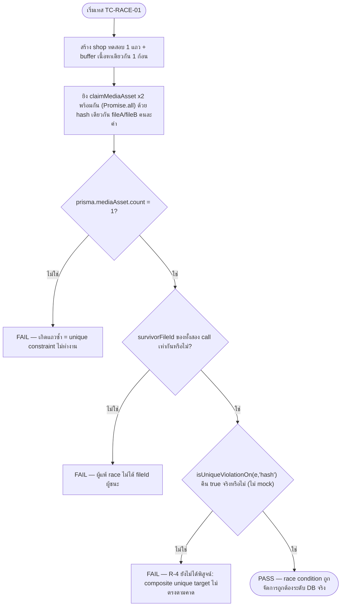
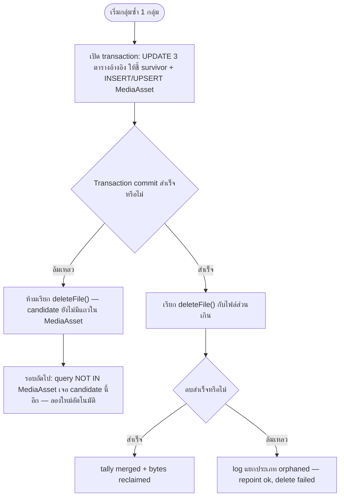

> **โมดูล:** M00051-ChatMediaDedup
> **ประเภทเอกสาร:** Test Case
> **เวอร์ชัน:** 1.0
> **วันที่จัดทำ:** 2026-08-19
> **สถานะ:** Draft — เขียนก่อน implement (doc-first, Hard Rule 11) — **ยังไม่มีเคสไหนถูกรันสักครั้ง**
> **เจ้าของเอกสาร:** safepay-qa (ดู [[Feature-Docs-Ownership]])

# Test Case: Chat Media Deduplication (กำจัดไฟล์สื่อซ้ำในระบบแชท)

---

## 1. Overview

### 1.1 เอกสารนี้คืออะไร / ไม่ใช่อะไร

🛑 **ฟีเจอร์นี้ยังไม่ถูก implement เลยแม้แต่บรรทัดเดียว** (ยืนยันจาก [[SRS]]/[[SDS]]/[[DATABASE]] — schema
`MediaAsset` ยังไม่ migrate, `src/services/media-asset.service.ts` ยังไม่มีไฟล์, `scripts/backfill-media-dedup.ts`
ยังไม่มีไฟล์) เอกสารนี้จึงเป็น **สเปกเทสสำหรับ TDD** ไม่ใช่บันทึกผลรัน — DEV เอาไปเขียนเทสให้แดงก่อน
(ตาม `Linked to`/`Precondition`/`Steps`/`Expected Result` ของแต่ละ TC) แล้ว implement ให้เขียว; QA รอบ
implement เสร็จเอา TestCase นี้ไปรันจริง+เติมผลใน §5

ตารางในเอกสารนี้ **ไม่ใช่รายชื่อเทสที่รันผ่านแล้ว** (ต่างจาก [[00050 TestCase]] ซึ่งเป็น post-implementation
record) — ทุก Expected Result เขียนให้ตรวจได้จริง (ค่าที่ query ได้ / call count / exit code / call order)
เพื่อให้ implement ตรงสเปกได้โดยไม่ต้องเดา

### 1.2 ขอบเขตชุดทดสอบ (Scope)

**In-scope:**
- Layer 1 content-hash dedup ที่ `writeDedupedFile()`/`claimMediaAsset()` (FR-CMD-01, TFR-CMD-01)
- Layer 2 `sourceKey` cache สำหรับรูปโฆษณา + derived-image (FR-CMD-02, TFR-CMD-03, TFR-CMD-09)
- Path C `reconcileUploadedFile()` ที่ `POST /api/uploads/commit` purpose=`CHAT` เท่านั้น (TFR-CMD-10)
- CLI backfill: dry-run, apply, resume, orphan/failed handling (FR-CMD-03..07, TFR-CMD-04..08)
- Race condition ระดับ DB จริง (composite unique `[shopId, hash]`, R-4)
- Cross-shop isolation, "1 ไบต์ต่าง = คนละไฟล์", ความปลอดภัยเมื่อ subsystem ล่ม
- ขอบเขต path C จำกัดที่ `purpose==='CHAT'` (ไม่แตะ `IMAGE`/`DOCUMENT`) และ path นอกขอบเขตอีก 4 จุด (KYC,
  admin badge, order slip, legacy chat/upload) ต้องพิสูจน์ว่า **ไม่ถูกแตะ**

**Out-of-scope (ตาม [[BRD]] §1.5 / [[PRD]] §5 — ไม่ต้องมี TC):**
- นโยบายลบไฟล์/retention ใด ๆ (ฟีเจอร์แยกอนาคต)
- Cross-shop dedup (ตัดสินใจทางธุรกิจว่าไม่ทำ — มี TC ยืนยันว่า "ไม่ทำ" เท่านั้น ไม่มี TC ที่ทดสอบว่า "ทำได้")
- Compression/resize/transcode คุณภาพไฟล์ (ฟีเจอร์นี้ไม่แตะขนาด/คุณภาพ)
- เปลี่ยน storage driver/ผู้ให้บริการ

**ประเมินระดับ E2E (Playwright):** ฟีเจอร์นี้ **ไม่มี endpoint ใหม่ ไม่มีหน้าจอใหม่** ([[API]] ยืนยัน) —
คุณค่าของ E2E ต่ำกว่าปกติมาก งานหลักคือ integration test ที่แตะ DB จริง (เพราะ correctness พึ่ง Postgres
unique constraint จริง ไม่ใช่ mock ได้) มี E2E เพียง **1 เคสเสริม** (§2.6) เพื่อพิสูจน์ที่ระดับ UI ว่าผู้ใช้ไม่
เห็นความเปลี่ยนแปลง (BR-CMD-03) — ไม่ใช่ mandatory blocker เท่าระดับ integration

### 1.3 สภาพแวดล้อม + ข้อกำหนดก่อนเทสได้จริง

| หัวข้อ | รายละเอียด |
|---|---|
| **Unit** | `npx vitest run src/lib/__tests__/media-hash.test.ts src/lib/__tests__/media-dedup-grouping.test.ts` — ไม่แตะ DB/storage เลย |
| **Integration** | ต้องมี **local Docker Postgres** (`docker compose up`, ดู `docs/conventions/seed-and-env.md`) — รันด้วย `npx dotenv -e .env -- npx vitest run tests/integration/media-asset-dedup*.test.ts` **ห้ามชี้ `.env.local` (prod/dev Supabase แชร์)** ตาม Hard Rule 13 — `tests/setup.ts` มี allowlist บังคับ `localhost`/`127.0.0.1`/`host.docker.internal` เท่านั้น จะ throw ทันทีถ้าไม่ใช่ |
| **CLI backfill testability (ข้อกำหนดต่อ DEV ก่อนเขียนเทสได้)** | `scripts/backfill-media-dedup.ts` ต้อง export ฟังก์ชันหลักแยกจาก CLI entry (เช่น `runDryRun(shopId?)`, `runApply(opts)`, `groupCandidatesByETagAndSize(...)`) ไม่ฝังทุกอย่างใต้ `if (require.main === module)` — ไม่งั้นเทสเรียกใช้ logic จริงไม่ได้เลย (ต้อง spawn subprocess ซึ่งเทสยาก/เปราะ) — **นี่คือ precondition ของ §2.4 ทั้งหมด** |
| **Mutation gate (มาตรฐานเดียวกับ [[00050 TestCase]])** | ทุกเทส `**blocker**` ต้องพิสูจน์ด้วย mutation อย่างน้อย 1 แบบก่อนถือว่าเทสนั้นใช้ได้ (คืนตรรกะผิดกลับเข้าไป → ต้องแดง) — ไม่ใช่แค่เขียวครั้งเดียว |
| **Hard Rule 13** | ไฟล์เทสทุกไฟล์ที่แตะ DB จริงต้องเก็บ `shopId`/`userId` ที่ตัวเองสร้างไว้ แล้วลบเฉพาะของตัวเองใน `afterEach` — `MediaAsset` **ยังไม่อยู่ใน `deleteTestData()`** (ตารางใหม่) ดังนั้นแต่ละไฟล์เทสต้อง `prisma.mediaAsset.deleteMany({ where: { shopId: { in: ourShopIds } } })` เองก่อนเรียก `deleteTestData({ shopIds: ourShopIds })` (pattern เดียวกับ `badgeNameENs` ใน `tests/integration/signup-achievement.test.ts`) — **ห้าม `deleteMany()` ไม่มี `where`** |

### 1.4 ตัวย่อระดับเทส

| ระดับ | นิยาม |
|---|---|
| **unit** | pure function ล้วน ไม่แตะ DB/storage/network — เร็ว, deterministic 100% |
| **integration** | แตะ Postgres จริง (local Docker) และ/หรือ storage driver จริง (`local` driver, temp dir) — จำเป็นสำหรับทุกเคสที่พิสูจน์เรื่อง unique constraint/race/transaction order |
| **compile-time** | พิสูจน์ผ่าน `tsc` แดง/เขียว (ไม่ใช่ runtime assertion) |
| **static/manual** | grep gate หรือ code review ที่ automate เต็มรูปไม่ได้ — ระบุไว้ตรง ๆ ว่าทำไม |
| **E2E** | Playwright ผ่าน browser จริง |

---

## 2. Test Scenarios

### 2.1 Unit — pure function (`src/lib/media-hash.ts`, grouping logic)

**ไฟล์:** `src/lib/__tests__/media-hash.test.ts` · **Trace:** BR-CMD-02, NFR-CMD-03

#### TC-HASH-01: hash ของเนื้อไฟล์เดียวกันต้องเท่ากันเสมอ (deterministic)

- **Linked to:** BR-CMD-02 (ซ้ำ = เนื้อไฟล์เหมือนกันทุกบิต)
- **Precondition:** มี `Buffer` ตัวอย่าง (เช่น อ่านจาก fixture ไฟล์ภาพเล็ก ๆ ใน `src/test/fixtures/`)
- **Steps:**
  1. เรียก `sha256Hex(buffer)` สองครั้งด้วย buffer เดิม
- **Expected Result:** ค่าที่คืนทั้งสองครั้งเท่ากันทุกตัวอักษร, เป็น hex string ยาว **64 ตัวอักษร** (sha256
  เต็ม 32 ไบต์ ไม่ตัดทอน — NFR-CMD-03 ระบุชัด)

#### TC-HASH-02 (🛑 mandatory #4): 1 ไบต์ต่าง = hash คนละค่าเสมอ

- **Linked to:** NFR-CMD-03, มติ user "ต่างกันแม้เล็กน้อย = คนละรูป" ([[BRD]] §1.4)
- **Precondition:** สร้าง `bufferA` (เช่น 1000 ไบต์สุ่ม) แล้ว copy เป็น `bufferB` แก้ 1 ไบต์เดียว (ไบต์กลาง
  ไฟล์ ไม่ใช่ header/trailer เพื่อกันเคสที่บังเอิญ hash คำนวณข้ามไบต์นั้น)
- **Steps:**
  1. `hashA = sha256Hex(bufferA)`
  2. `hashB = sha256Hex(bufferB)`
- **Expected Result:** `hashA !== hashB` — **blocker**

#### TC-HASH-03: buffer ว่างเปล่า (edge)

- **Linked to:** ความทนทานของฟังก์ชัน (ไม่ throw บน input ขอบ)
- **Steps:** เรียก `sha256Hex(Buffer.alloc(0))`
- **Expected Result:** คืน hex string 64 ตัวอักษรที่ถูกต้องตาม sha256 ของ empty buffer (`e3b0c44298fc1c149afbf4c8996fb92427ae41e4649b934ca495991b7852b855`) ไม่ throw

#### TC-ETAG-01: กลุ่ม `(eTag, size)` ต่ำกว่า threshold (< 1MB) ใช้ eTag เป็น proxy เบื้องต้นได้

- **Linked to:** DATABASE §6.2 (grouping ก่อน verify hash จริง)
- **Precondition:** fixture รายการไฟล์ `{ fileId, eTag, size }` 3 ไฟล์ที่ `eTag`+`size` ตรงกันเป๊ะ ทุกไฟล์ `size < 1MB`
- **Steps:** เรียก `groupCandidatesByETagAndSize(candidates)`
- **Expected Result:** ทั้ง 3 ไฟล์ถูกจัดกลุ่มเดียวกัน (candidate สำหรับ verify hash จริงต่อ — ฟังก์ชันนี้**ไม่ตัดสินซ้ำจริง** แค่ลดขนาด work set)

#### TC-ETAG-02: ไฟล์ที่ใหญ่กว่า threshold ต้อง flag ให้ verify hash จริงเสมอ ไม่เชื่อ eTag อย่างเดียว

- **Linked to:** DATABASE §6.2 ("ไฟล์ที่ใหญ่กว่า threshold ต้องดาวน์โหลดมา sha256 จริงก่อนยืนยันว่าซ้ำ")
- **Precondition:** fixture 2 ไฟล์ `eTag`/`size` ตรงกัน แต่ `size >= 1MB` (multipart upload มีโอกาสสูงขึ้น)
- **Steps:** เรียก grouping function
- **Expected Result:** ผลลัพธ์ของกลุ่มนี้ต้องมี flag `requiresHashVerify: true` (หรือเทียบเท่า) — **blocker** (ถ้าไม่มี flag นี้ backfill จะเชื่อ eTag เดี่ยว ๆ กับไฟล์ใหญ่ ซึ่ง DATABASE.md เตือนไว้ชัดว่าเสี่ยง false-positive จาก multipart upload)

#### TC-ETAG-03: eTag ตรงกันแต่ hash จริงไม่ตรง (false-positive ของ eTag) ต้องถูกแยกออก ไม่ใช่ข้าม

- **Linked to:** DATABASE §6.2 ข้อ 3 ("กลุ่มที่ eTag บอกว่าซ้ำแต่ hash จริงไม่ตรง ต้องแยกออกจากกลุ่มเดิม ไม่ใช่ข้าม")
- **Precondition:** 2 fixture ไฟล์ `eTag`/`size` เหมือนกัน แต่เนื้อไฟล์จริงต่างกัน (sha256 คนละค่า)
- **Steps:** รัน grouping + verify-hash step เต็ม (dry-run pipeline)
- **Expected Result:** ทั้งสองไฟล์ถูกจัดเป็นคนละกลุ่ม (ไม่ merge) — dry-run report ยังนับไฟล์ทั้งสองใน "จำนวนไฟล์ที่ตรวจ" แต่ไม่นับเป็นคู่ที่จะรวม

---

### 2.2 compile-time — บังคับ signature ผ่าน `tsc`

**Trace:** TFR-CMD-02, TD-01 (SRS/SDS)

#### TC-SIG-01 (🛑 mandatory #13, ส่วนที่ automate ได้): `mirrorRemoteImage`/`mirrorMediaBuffer` ต้องรับ options-object ที่มี `shopId` บังคับ ไม่ใช่ positional

- **Linked to:** TFR-CMD-02, TD-01 — ป้องกันบั๊ก "ส่ง string เป็น positional ตัวที่ 2 แล้ว compile ผ่านแต่ค่าไหลผิดตัวแปร" (เคยเกิดจริงกับ `'ig-avatar'` ที่ `shop-channel.service.ts:64`)
- **Precondition:** ไม่มี (compile-time)
- **Steps:**
  1. เขียนไฟล์ `.ts` ทดสอบที่เรียก `mirrorRemoteImage(url, 'some-string')` (positional แบบเดิม)
  2. รัน `npx tsc --noEmit`
- **Expected Result:** **ต้องแดง** (type error) — ถ้า `tsc` ผ่าน แปลว่า signature ยังเปิดช่องให้ positional string หลุดเข้ามาได้ ซึ่งคือบั๊กเดิมที่ TD-01 ตั้งใจปิด — **blocker**
- **Mutation ที่ต้องพิสูจน์:** ลบ `shopId` ออกจาก type ของ options object ชั่วคราว (ทำให้เป็น optional) → เคสนี้ต้องกลับเป็นเขียว (พิสูจน์ว่าเทสจับ "ไม่บังคับ" ได้จริง) แล้วคืนกลับ

#### TC-SIG-02: เรียกด้วย options-object ที่ไม่มี `shopId` เลย ต้องแดง

- **Linked to:** TFR-CMD-02 ("shopId เป็น required field ของ object")
- **Steps:** เรียก `mirrorRemoteImage(url, { filenamePrefix: 'ig-avatar' })` (ไม่มี `shopId`)
- **Expected Result:** `tsc` แดง — **blocker**

#### TC-SIG-03: เรียกด้วย options-object ที่มี `shopId` ครบ ต้องผ่าน

- **Steps:** เรียก `mirrorRemoteImage(url, { shopId: 'x', filenamePrefix: 'ig-avatar' })`
- **Expected Result:** `tsc` เขียว (regression — ต้องไม่ผ่านเข้มเกินจนบล็อกการใช้งานปกติ)

---

### 2.3 Integration — `media-asset.service.ts` (แตะ Postgres จริง, ห้าม mock unique constraint)

**ไฟล์:** `tests/integration/media-asset-dedup.test.ts` · **Trace:** TFR-CMD-01/07, BR-CMD-01/02, NFR-CMD-02/03/05, R-4

> ทุกเคสในหมวดนี้ **ห้าม mock `prisma.mediaAsset.create`/`findUnique`** สำหรับส่วนที่ทดสอบ race/unique —
> ต้องยิงใส่ Postgres จริงเพราะ R-4 ของ [[SRS]] ระบุชัดว่า `isUniqueViolationOn` กับ composite unique
> **ยังไม่เคยถูกพิสูจน์จริง** — ต้องยืนยันว่า `e.meta.target` มี `'hash'` จริงตามที่โค้ดคาด ไม่ใช่แค่ mock ให้เชื่อ

#### TC-CLAIM-01: เขียนครั้งแรกของ `(shopId, hash)` — ต้องลงทะเบียนสำเร็จ

- **Linked to:** TFR-CMD-01, TFR-CMD-05
- **Precondition:** สร้าง `Shop` ทดสอบ 1 แถว (เก็บ `shopId` ไว้ลบทีหลัง) — ยังไม่มี `MediaAsset` row สำหรับ hash นี้
- **Steps:** เรียก `claimMediaAsset({ shopId, hash, fileId, contentType, size })`
- **Expected Result:** คืน `{ survivorFileId: fileId, isNewRegistration: true }` — query `prisma.mediaAsset.findUnique({ where: { shopId_hash: { shopId, hash } } })` เจอแถวจริง 1 แถวที่ `fileId` ตรงกัน

#### TC-CLAIM-02: เขียนซ้ำ `(shopId, hash)` เดิม (sequential ไม่ concurrent) — ต้องได้ fileId เดิม ไม่สร้างแถวใหม่

- **Linked to:** TFR-CMD-01, BR-CMD-02
- **Precondition:** ต่อจาก TC-CLAIM-01 (มีแถวอยู่แล้ว 1 แถว)
- **Steps:** เรียก `claimMediaAsset({ shopId, hash, fileId: fileId2 (คนละค่า), contentType, size })` อีกครั้งด้วย `hash` เดิม
- **Expected Result:** คืน `{ survivorFileId: fileId เดิม (ไม่ใช่ fileId2), isNewRegistration: false }` — `prisma.mediaAsset.count({ where: { shopId, hash } })` ยังเป็น **1** (ไม่เพิ่มเป็น 2) — **blocker**

#### TC-RACE-01 (🛑 mandatory #1, ห้าม mock — integration บังคับ): 2 request mirror เนื้อไฟล์เดียวกันพร้อมกันในร้านเดียวกัน

- **Linked to:** DATABASE §5, PRD §6.2, R-4, TFR-CMD-05
- **Precondition:** shop ทดสอบ 1 แถว, buffer เนื้อหาเดียวกัน 1 ก้อน, hash คำนวณล่วงหน้าไว้ (`sha256Hex(buffer)`)
- **Steps:**
  1. เรียก `Promise.all([claimMediaAsset({ shopId, hash, fileId: fileA, ... }), claimMediaAsset({ shopId, hash, fileId: fileB, ... })])` — จำลอง 2 request แข่งกันจริงผ่าน 2 Prisma call ที่ยิงพร้อมกัน (ไม่ await ทีละตัว)
- **Expected Result (ตรวจได้จริงทั้งหมด):**
  1. `prisma.mediaAsset.count({ where: { shopId, hash } })` ต้องเป็น **1** เท่านั้น — ห้ามเป็น 2
  2. ทั้งสอง call คืน `survivorFileId` **ค่าเดียวกัน** (ไม่ว่าจะเป็น `fileA` หรือ `fileB` — ใครมาถึง DB ก่อนชนะ แต่ผลลัพธ์ที่คืนกลับต้องตรงกันทั้งคู่)
  3. ฝั่งที่แพ้ race ต้องได้ `isNewRegistration: false`
  4. เรียกผ่าน `isUniqueViolationOn(e, 'hash')` จริง (ไม่ mock) และต้องคืน `true` เมื่อโดน P2002 จาก composite unique `[shopId, hash]` — พิสูจน์ R-4 โดยตรง
  - **blocker — เคสนี้คือแกนกลางของทั้งฟีเจอร์**
- **Mutation ที่ต้องพิสูจน์:** เปลี่ยน `isUniqueViolationOn(e, 'hash')` เป็นเช็ค field ผิด (เช่น `'shopId'` เดี่ยว ๆ) → เทสต้องแดง (ฝั่งแพ้ race จะไม่ถูกจับว่าเป็น P2002 บน hash แล้ว throw ออกไปแทน)

#### TC-RACE-02: ไฟล์ที่ฝั่งแพ้ race เขียนไปแล้วต้องถูกลบทิ้ง (best-effort)

- **Linked to:** DATABASE §5 ขั้นตอน 5
- **Precondition:** ต่อจาก setup ของ TC-RACE-01 แต่ใช้ storage driver จริง (local driver, temp dir) แทน mock — เขียนไฟล์จริง 2 ไฟล์ก่อนเรียก `claimMediaAsset`
- **Steps:** จำลอง race เหมือน TC-RACE-01 แล้วให้ logic เต็ม (`writeDedupedFile`) ทำงาน ไม่ใช่แค่ `claimMediaAsset` เดี่ยว ๆ
- **Expected Result:** ไฟล์ของฝั่งที่แพ้ race (`fileId` ที่ไม่ใช่ survivor) ถูกลบออกจาก storage จริง — `getFile(loserFileId)` คืน `null` หลังจบ — ไฟล์ของผู้ชนะยังอ่านได้ปกติ

#### TC-RACE-03: `deleteFile()` ของฝั่งแพ้ race ล้มเหลว — ต้องไม่ throw ออกไปทำให้ทั้ง request ล้ม

- **Linked to:** DATABASE §5 comment "ลบไฟล์ที่ตัวเองเพิ่งเขียนทิ้ง (best-effort — ล้มแล้วปล่อยผ่านได้ ไม่ throw)"
- **Precondition:** mock `deleteFile` ให้ reject เฉพาะเคสนี้ (ระดับ storage layer เท่านั้น — DB ยังจริง)
- **Steps:** จำลอง race ที่ฝั่งแพ้ต้องเรียก `deleteFile` แล้วมันล้ม
- **Expected Result:** ฟังก์ชันยังคืน `winner.fileId` ให้ผู้เรียกตามปกติ ไม่ throw — **blocker**

#### TC-SCOPE-01 (🛑 mandatory #3): เนื้อไฟล์เดียวกันเป๊ะ คนละร้าน → ต้องได้คนละ fileId เสมอ

- **Linked to:** BR-CMD-01, NFR-CMD-05, DATABASE §3.1 (เหตุผลที่ unique เป็น composite `[shopId, hash]`)
- **Precondition:** สร้าง `Shop` ทดสอบ 2 แถว (`shopA`, `shopB`) — เนื้อไฟล์เดียวกันเป๊ะ 1 ก้อน
- **Steps:**
  1. `claimMediaAsset({ shopId: shopA.id, hash, fileId: fileA, ... })`
  2. `claimMediaAsset({ shopId: shopB.id, hash, fileId: fileB, ... })` (hash เดียวกัน)
- **Expected Result:** ทั้งสอง call สำเร็จเป็น `isNewRegistration: true` **ทั้งคู่** (ไม่มีใครแพ้ race — เพราะ unique constraint คือ `[shopId, hash]` ไม่ใช่ `[hash]` เดี่ยว ๆ) — `prisma.mediaAsset.count({ where: { hash } })` (ไม่กรอง shopId) = **2 แถว** — **blocker**
- **Mutation ที่ต้องพิสูจน์:** เปลี่ยน unique constraint (ใน schema สมมุติของเทส/หรือ mock query) เป็น `[hash]` เดี่ยว ๆ → เคสนี้ต้องแดง (แถวที่สองจะชน P2002 ผิด ๆ)

#### TC-SCOPE-02: query ทุกจุดของ `MediaAsset` ต้องมี `shopId` ใน WHERE เสมอ (grep gate)

- **Level:** static/manual
- **Linked to:** NFR-CMD-05
- **Steps:** `rg "prisma\.mediaAsset\." src/ scripts/` แล้วอ่านทุก match ว่ามี `shopId` อยู่ใน `where` clause
- **Expected Result:** ทุก query ที่ไม่ได้ query ด้วย PK เดี่ยว (`id`) ต้องมี `shopId` ใน where — reviewer gate ก่อน merge

#### TC-SAFE-01 (🛑 mandatory #2): `findMediaAssetByHash` ล้มเหลว (DB error) — ต้อง degrade เป็น miss ไม่ throw

- **Linked to:** TFR-CMD-07, NFR-CMD-02
- **Precondition:** mock `prisma.mediaAsset.findUnique` ให้ throw ทุกครั้งที่ถูกเรียก (จำลอง DB subsystem ของตาราง `MediaAsset` ล่มทั้งก้อน) — ส่วนอื่นของ Prisma (สร้าง shop, เขียนไฟล์) ยังทำงานปกติ
- **Steps:** เรียก `mirrorRemoteImage(url, { shopId })` เต็ม flow (mock `fetch` ให้คืน buffer จริง)
- **Expected Result:** `mirrorRemoteImage` ยังคืน **fileId ที่ใช้งานได้จริง** (ไม่ใช่ `null`) — ไฟล์ถูกเขียนลง storage จริง อ่านกลับมาได้ — **blocker (regression ร้ายแรงกว่าไม่มีฟีเจอร์นี้เลยถ้าพัง)**

#### TC-SAFE-02: `findMediaAssetBySourceKey` ล้มเหลว — ต้อง degrade เป็น miss ไม่ throw

- **Linked to:** TFR-CMD-07
- **Precondition:** mock ให้ query `sourceKey` throw เท่านั้น (query `hash` ปกติ)
- **Steps:** เรียก `ingestAdReferral` ด้วย `ad_id` ที่มี — path จะพยายาม cache-hit ที่ชั้น 2 ก่อน
- **Expected Result:** ตกไปที่ layer 1 (hash) ตามปกติ ไม่ throw ทั้งก้อน, ยังได้ `photoFileId` ที่ใช้งานได้

#### TC-SAFE-03: `claimSourceKey` ล้มเหลว — best-effort, ไม่กระทบผลลัพธ์หลัก

- **Linked to:** TFR-CMD-07
- **Steps:** mock `claimSourceKey`-underlying `updateMany` ให้ throw
- **Expected Result:** flow หลัก (คืน fileId) ยังสำเร็จตามปกติ — แค่ `sourceKey` ของแถวนั้นไม่ได้ถูกตั้ง (ครั้งถัดไปจะ miss ที่ชั้น 2 แต่ยัง hit ที่ชั้น 1 ได้)

#### TC-SAFE-04: `claimMediaAsset` โยน error ที่ไม่ใช่ P2002 หลัง `saveFile()` สำเร็จแล้ว (path A ระหว่าง ingest)

- **Linked to:** TFR-CMD-01 ขั้นตอน 4 (miss branch) + หลักการทั่วไปของ TFR-CMD-07 ("ไม่ปล่อยให้ exception ลอยไปถึง catch-all ของ mirrorRemoteImage")
- **⚠️ หมายเหตุ:** [[SRS]] ไม่ได้เขียนพฤติกรรมของเคสนี้ตรง ๆ (TFR-CMD-05 พูดถึง "error อื่นที่ไม่ใช่ P2002 → ไม่ catch ในฟังก์ชันนี้ ปล่อยผู้เรียกตัดสิน" ในบริบทของ **CLI**) — เคสนี้เป็น **สมมติฐานที่ QA เสนอ ต้องยืนยันกับ DEV/Controller ตอน implement**: ถ้า `saveFile()` เขียนไฟล์สำเร็จไปแล้วแต่ `claimMediaAsset` unexpected-throw ตอน register ควรทำอย่างไร — ทางเลือกที่ "ปลอดภัยกว่า" (สอดคล้องกับหลักการ TFR-CMD-07) คือคืน fileId ที่เพิ่งเขียนสำเร็จไปเลย (ไฟล์ใช้งานได้จริง แค่ไม่ถูก register ให้ dedup ในอนาคต) แทนที่จะปล่อยให้ exception ลอยไปทำให้ mirror ทั้งก้อนกลายเป็น placeholder
- **Precondition:** mock `prisma.mediaAsset.create` ให้ throw error ที่ไม่ใช่ `P2002` (เช่น connection timeout)
- **Steps:** เรียก `writeDedupedFile` ผ่าน mock ให้ `saveFile()` สำเร็จก่อน แล้ว `claimMediaAsset` throw
- **Expected Result (ที่เสนอ ต้องคอนเฟิร์มกับ DEV):** คืน fileId ของไฟล์ที่เพิ่งเขียนสำเร็จ ไม่ throw ออกไปให้ `mirrorRemoteImage` catch-all ตีความว่า mirror ล้มเหลว — **ทำเครื่องหมายเป็น open question ใน §6**

---

### 2.4 Integration — `ingestAdReferral` (Layer 2 sourceKey) + derived-image (path B)

**ไฟล์:** `tests/integration/media-asset-dedup-sourcekey.test.ts` · **Trace:** FR-CMD-02, TFR-CMD-03, TFR-CMD-09, NFR-CMD-09

#### TC-SRC-01: ad ID ใหม่ (cache miss ชั้น 2) — ต้อง fetch จาก Meta CDN และบันทึกทั้งสองชั้น

- **Linked to:** TFR-CMD-03
- **Precondition:** shop ทดสอบ, mock `fetch` (spy เก็บ call count) ให้คืนรูปจริง, `referral.ad_id = 'ad-test-1'` ที่ยังไม่เคยเห็น
- **Steps:** เรียก `ingestAdReferral(...)` เต็ม flow
- **Expected Result:** `fetch` ถูกเรียก **1 ครั้ง**, `MediaAsset` มีแถวใหม่ที่ `sourceKey = 'ad:ad-test-1'`, `ConversationAdReferral.photoFileId` ตรงกับ fileId ที่ถูกบันทึก

#### TC-SRC-02 (🛑 mandatory: ต้นตอหลักของ FR-CMD-02): ad ID เดิมถูกคลิกซ้ำ (คนที่ 51) — ห้าม fetch ซ้ำ

- **Linked to:** FR-CMD-02, BRD Scenario 1
- **Precondition:** ต่อจาก TC-SRC-01 (มี `sourceKey='ad:ad-test-1'` cache ไว้แล้ว), reset spy ของ `fetch`
- **Steps:** เรียก `ingestAdReferral` อีกครั้งด้วย `ad_id` เดิม ในร้านเดียวกัน (จำลองลูกค้าคนใหม่คลิกโฆษณาเดิม)
- **Expected Result:** `fetch` **ไม่ถูกเรียกเลย** (call count = 0), `photoFileId` ของแถวใหม่ = fileId เดิมจาก TC-SRC-01 เป๊ะ — **blocker**
- **Mutation ที่ต้องพิสูจน์:** ลบเงื่อนไข "sourceKey hit → ข้าม fetch" ออก → เทสต้องแดง (fetch ถูกเรียกซ้ำ)

#### TC-SRC-03: `claimSourceKey` เป็น set-once — ad คนละชิ้นที่ใช้ creative เนื้อหาเดียวกัน ไม่แย่งเจ้าของ sourceKey

- **Linked to:** DATABASE §3.1 (ทำไม index ไม่ unique), SRS TFR-CMD-03
- **Precondition:** มีแถว `MediaAsset` ที่ `sourceKey='ad:A'` (hash=H) อยู่แล้วจาก TC-SRC-01/02 pattern
- **Steps:** เรียก path ที่จะพยายาม `claimSourceKey(shopId, hash=H, sourceKey='ad:B')` (เนื้อไฟล์เดียวกัน แต่คนละ ad)
- **Expected Result:** แถวเดิมยัง `sourceKey='ad:A'` (ไม่ถูก overwrite เป็น `'ad:B'`) — ครั้งถัดไปที่ค้นด้วย `sourceKey='ad:B'` จะ miss ที่ชั้น 2 แต่ hit ที่ชั้น 1 (hash) แทน — regression

#### TC-DERIVED-01: derived-image cache hit ข้าม transcode ทั้งหมด

- **Linked to:** TFR-CMD-09
- **Precondition:** shop ทดสอบ, มีไฟล์ต้นทาง (`originalFileId = A`) ในคลังแล้ว, mock `buildMetaCardJpeg` (spy call count)
- **Steps:**
  1. เรียก `resolveMetaCardImageUrl(A, { shopId })` ครั้งแรก
  2. เรียกซ้ำอีกครั้งด้วย `A` เดิม
- **Expected Result:** `buildMetaCardJpeg` ถูกเรียก **1 ครั้งเท่านั้น** (ครั้งที่สอง cache hit ที่ `sourceKey='derived:metacard:A'`) — ทั้งสองครั้งคืน signed URL ที่เปิดได้จริง

#### TC-DERIVED-02 (🛑 mandatory #10): survivor เปลี่ยนหลัง backfill — sourceKey เดิมต้องไม่คืนไฟล์ที่ถูกลบไปแล้ว

- **Linked to:** NFR-CMD-09, TFR-CMD-09 ("ประเด็นวิกฤต")
- **Precondition:**
  1. shop ทดสอบ, `Product` fixture 1 แถวที่ `images[0] = fileA`
  2. เรียก `resolveMetaCardImageUrl(fileA, { shopId })` ให้เกิด cache `sourceKey='derived:metacard:A'` (mock transcode ให้ทำงานจริงระดับ storage)
  3. จำลอง backfill repoint: `UPDATE Product SET images[0] = fileB` (ตรง ๆ ผ่าน prisma) แล้ว `deleteFile(fileA)` จริง (ไฟล์ A หายจาก storage จริง)
- **Steps:** อ่าน `Product.images[0]` สด ๆ จาก DB (ได้ `fileB`) แล้วเรียก `resolveMetaCardImageUrl(fileB, { shopId })`
- **Expected Result:**
  1. คืน signed URL ที่**เปิดได้จริง** ไม่ error, ไม่ 404 — **blocker**
  2. คำนวณ `sourceKey` ใหม่เป็น `'derived:metacard:B'` (คนละคีย์กับเดิม) — เป็น **cache miss** (ไม่ใช่ stale hit) แล้ว transcode ใหม่จาก `fileB` จริง
  3. แถวเก่า `sourceKey='derived:metacard:A'` ยังอยู่ใน `MediaAsset` แต่ไม่ถูกใครเรียกใช้อีก (dead cache ที่ยอมรับได้ตาม TFR-CMD-09 ข้อ 5)
- **Mutation ที่ต้องพิสูจน์:** cache `sourceKey` ด้วย fileId แบบไม่ผูกกับ input สด (เช่น เก็บ `originalFileId` จาก closure ตัวแรกที่เคยเห็น) → เทสต้องแดง (คืน URL ของไฟล์ A ที่ถูกลบไปแล้ว)

#### TC-DERIVED-03: derived-image ล้มเหลว (transcode/storage ล้ม) — degrade เป็น `null` ไม่ throw

- **Linked to:** SDS §5 (integration point ของ 3 derived-image functions)
- **Steps:** mock `buildMetaCardJpeg` ให้ throw
- **Expected Result:** ฟังก์ชันคืน `null` (พฤติกรรมเดิมของ 3 ฟังก์ชันนี้อยู่แล้วเมื่อ transcode ล้ม — ไม่เปลี่ยน)

---

### 2.5 Integration — `POST /api/uploads/commit` (path C)

**ไฟล์:** `tests/integration/uploads-commit-media-dedup.test.ts` · **Trace:** TFR-CMD-10/11, TD-08/09

#### TC-COMMIT-01 (🛑 mandatory #12): commit purpose=CHAT ไฟล์ซ้ำ — response คืน fileId ต่างจากที่ client ส่งมา

- **Linked to:** TFR-CMD-10 postcondition
- **Precondition:** shop ทดสอบ + conversation ทดสอบ (`shopId` resolve ได้จาก `resolveChatChannelForUser`), มี `MediaAsset` row อยู่แล้วสำหรับ hash H (survivor = `fileX`), เขียนไฟล์ใหม่จริงที่เนื้อหา = H ไว้ที่ `fileId = claim.fileId` (จำลองว่า client PUT เสร็จไปแล้ว)
- **Steps:** เรียก `POST /api/uploads/commit` ด้วย `{ ticket, purpose: 'CHAT', conversationId }` ที่ resolve ไปยัง `claim.fileId` ข้างต้น
- **Expected Result:**
  1. response `{ fileId }` **≠ `claim.fileId`** และ **= `fileX`** (survivor เดิม) — **blocker**
  2. `getFile(claim.fileId)` (ไฟล์ที่ client เพิ่ง PUT) คืน `null` หลัง commit (ถูกลบทิ้งแล้ว)
  3. `prisma.mediaAsset.count({ where: { shopId, hash: H } })` ยังเป็น **1** (ไม่เพิ่ม)
- **Mutation ที่ต้องพิสูจน์:** ให้ route คืน `claim.fileId` เดิมเสมอ (ไม่สนใจผล reconcile) → เทสต้องแดง

#### TC-COMMIT-02: commit purpose=CHAT ไฟล์ใหม่จริง (unique) — response คืน fileId เดิม, ลงทะเบียนเป็น survivor

- **Linked to:** TFR-CMD-10 ขั้นตอน 4
- **Steps:** commit ไฟล์ที่เนื้อหาไม่เคยมีในร้านมาก่อน
- **Expected Result:** response `{ fileId }` **= `claim.fileId`** (ไฟล์ตัวเองกลายเป็น survivor), มี `MediaAsset` row ใหม่ที่ `fileId = claim.fileId`

#### TC-COMMIT-03: `reconcileUploadedFile` ล้มเหลว (เช่น `getFile` คืน null) — commit ต้องไม่ block การอัปโหลด

- **Linked to:** TFR-CMD-10 error/edge case
- **Precondition:** mock ให้ `getFile(claim.fileId)` throw/null ระหว่าง reconcile
- **Steps:** commit purpose=CHAT ตามปกติ
- **Expected Result:** response ยัง **201** พร้อม `{ fileId: claim.fileId }` (ไฟล์เดิม ไม่ block) — **blocker**

#### TC-PATHC-SCOPE-01 (🛑 mandatory #11): purpose=IMAGE เนื้อไฟล์ซ้ำ 2 ครั้ง — ต้องไม่ถูกแตะเลย

- **Linked to:** TD-09, SRS §3.0.2
- **Precondition:** shop ทดสอบ, เนื้อไฟล์เดียวกัน 2 ก้อน commit ด้วย `purpose: 'IMAGE'` (ติดต่อกัน)
- **Steps:** commit ครั้งที่ 1 แล้วครั้งที่ 2 ด้วยเนื้อไฟล์เดียวกัน (จำลองอัปโหลดรูปสินค้าเดิมซ้ำ)
- **Expected Result:**
  1. ทั้งสอง response คืน `fileId` **คนละค่า** (ไฟล์ถูกเขียน 2 ใบจริง — ไม่ dedup)
  2. `prisma.mediaAsset.count({ where: { shopId } })` = **0** (ไม่มีแถวถูกสร้างเลยจากทั้งสอง commit)
  - **blocker — พิสูจน์ว่า scope จำกัดที่ purpose='CHAT' จริง**

#### TC-PATHC-SCOPE-02: purpose=DOCUMENT เนื้อไฟล์ซ้ำ 2 ครั้ง — ต้องไม่ถูกแตะเลย

- **Linked to:** TD-09
- **Steps/Expected:** เหมือน TC-PATHC-SCOPE-01 แต่ `purpose: 'DOCUMENT'` (เอกสาร KYC/สลิป) — **blocker**

#### TC-PATHC-SCOPE-03: purpose=CHAT แต่ไม่มี `conversationId` (เช่น comment-inbox picker) — ข้าม reconcile

- **Linked to:** TFR-CMD-10 precondition ("ถ้าเงื่อนไขใดไม่ผ่าน ... ข้ามการ reconcile ไปเลย")
- **Steps:** commit `{ purpose: 'CHAT' }` โดยไม่ส่ง `conversationId`
- **Expected Result:** response `{ fileId } = claim.fileId` เสมอ (พฤติกรรมเดิม ไม่มีการ dedup เกิดขึ้น) — `MediaAsset` ไม่มีแถวใหม่

#### TC-SHOPID-11 (mandatory #11 companion): `resolveChatChannelForUser` คืน `shopId` ถูกต้องตรงกับ `Conversation.shopId` จริง

- **Linked to:** TFR-CMD-11
- **Steps:** เรียก `resolveChatChannelForUser(conversationId, userId)` กับ conversation ที่รู้ shopId แน่นอน (fixture)
- **Expected Result:** `result.shopId === conversation.shopId` เป๊ะ — regression ที่ป้องกัน field ใหม่ผูกผิดค่า

---

### 2.6 Integration — CLI backfill (`scripts/backfill-media-dedup.ts`)

**ไฟล์:** `tests/integration/backfill-media-dedup.test.ts` · **Trace:** FR-CMD-03..07, BR-CMD-05/06/07, TFR-CMD-04..08

> **Precondition ร่วมของทั้งหมวดนี้:** ต้อง import ฟังก์ชันจริงจากสคริปต์ (`runDryRun`, `runApply`) ตาม
> ข้อกำหนด §1.3 — เขียนไฟล์จริงลง storage driver `local` (temp dir แยกต่อเทส) + ข้อมูล fixture ที่มี
> `ChatMessage`/`ConversationAdReferral`/`ExternalContact` ผูกกับ `fileId` ที่รู้ล่วงหน้า

#### TC-DRY-01 (🛑 mandatory #6): dry-run ต้องไม่แก้อะไรเลย

- **Linked to:** FR-CMD-04, BR-CMD-05, TFR-CMD-04
- **Precondition:** shop ทดสอบ + 2 ไฟล์เนื้อหาเดียวกัน (คู่ซ้ำที่รู้ผลล่วงหน้า) ที่ `ChatMessage.imageUrl` อ้างอิงอยู่ทั้งคู่
- **Steps:**
  1. snapshot ค่าที่ตรวจได้ **ก่อน** รัน: `prisma.mediaAsset.count()` ทั้งฐาน, `ChatMessage.imageUrl` ของทั้ง 2 แถวเป๊ะ ๆ, รายชื่อไฟล์ใน storage temp dir
  2. เรียก `runDryRun({ shopId })`
  3. snapshot ค่าเดิมอีกครั้ง **หลัง** รัน
- **Expected Result:**
  1. `prisma.mediaAsset.count()` **เท่าเดิมเป๊ะ** (0 หรือค่าตั้งต้น ไม่เพิ่มแม้แต่แถวเดียว) — **blocker**
  2. `ChatMessage.imageUrl` ของทั้ง 2 แถวยัง**เท่าเดิมทุกตัวอักษร** (ไม่ repoint) — **blocker**
  3. รายชื่อไฟล์ใน storage เท่าเดิมทุกไฟล์ (ไม่มีไฟล์ถูกลบ) — **blocker**
  4. output/return value ของ `runDryRun` รายงานถูกต้อง: พบ 1 กลุ่มซ้ำ, จำนวนไฟล์ที่จะรวม = 1 (ไฟล์ส่วนเกิน), พื้นที่ที่จะทวงคืนได้ตรงกับขนาดไฟล์จริง
- **Mutation ที่ต้องพิสูจน์:** ให้ `runDryRun` เรียก `claimMediaAsset` จริงแทนการ group ใน memory → ทุกข้อ 1-3 ต้องแดง

#### TC-RESUME-01 (🛑 mandatory #7): หยุดกลางคันแล้วรันต่อ — ไม่ข้าม ไม่ทำซ้ำ

- **Linked to:** FR-CMD-05, TFR-CMD-06, TD-04
- **Precondition:** fixture 2 กลุ่มซ้ำอิสระกัน (กลุ่ม X: ไฟล์ 2 ใบ, กลุ่ม Y: ไฟล์ 2 ใบ อีกชุด) ในร้านเดียวกัน
- **Steps:**
  1. เรียก `runApply({ shopId, batchSize: 1 })` แล้ว "หยุดกลางคัน" โดยจำลองด้วยการประมวลผลแค่กลุ่มเดียว (mock/stub ให้ loop break หลัง candidate แรก หรือเรียกด้วย limit ที่ครอบแค่กลุ่ม X)
  2. ตรวจว่ากลุ่ม X ถูก repoint+ลบไฟล์แล้ว, กลุ่ม Y ยังไม่ถูกแตะ
  3. เรียก `runApply({ shopId })` **อีกครั้ง** (รอบสอง ไม่จำกัด batch แล้ว)
- **Expected Result:**
  1. รอบสองประมวลผล**เฉพาะกลุ่ม Y** เท่านั้น (สังเกตจาก log/return summary ที่นับ "scanned"/"merged" ของรอบสอง = เฉพาะ Y ไม่รวม X ซ้ำ) — **blocker**
  2. `ChatMessage`/ที่อ้างอิงกลุ่ม X **ไม่ถูก UPDATE ซ้ำ** (ตรวจด้วย `updatedAt` เดิม หรือ spy ว่า `prisma.chatMessage.updateMany` ไม่ถูกเรียกด้วยเงื่อนไขของกลุ่ม X ในรอบสอง)
  3. จบรอบสองแล้วทั้งกลุ่ม X และ Y ถูกรวมครบ (ตรวจ `MediaAsset` มี 2 แถว survivor, `ChatMessage.imageUrl` ทุกแถวชี้ไป survivor ถูกกลุ่ม)

#### TC-RESUME-02: รันซ้ำหลัง apply ครบแล้ว ต้องเป็น no-op (idempotent)

- **Linked to:** TD-04
- **Precondition:** ต่อจาก TC-RESUME-01 (ทั้งระบบ backfill เสร็จสมบูรณ์แล้ว)
- **Steps:** เรียก `runApply({ shopId })` เป็นรอบที่ 3
- **Expected Result:** summary รายงาน "scanned: 0 candidate" หรือเทียบเท่า (query `NOT IN MediaAsset` ไม่เจอ candidate เหลือ) — ไม่มี `UPDATE`/`deleteFile` ใด ๆ ถูกเรียกเลยในรอบนี้

#### TC-ORDER-01 (🛑 mandatory #8): repoint transaction ล้มเหลว — ต้องไม่ลบไฟล์ + retry อัตโนมัติรอบหน้า

- **Linked to:** BR-CMD-07, TFR-CMD-06
- **Precondition:** mock `prisma.$transaction` (เฉพาะ transaction ของ repoint ในสคริปต์ backfill) ให้ reject ครั้งเดียว
- **Steps:**
  1. เรียก `runApply({ shopId })` โดยที่ transaction ของกลุ่มซ้ำ 1 กลุ่มถูก mock ให้ล้ม
- **Expected Result:**
  1. `deleteFile()` **ต้องไม่ถูกเรียกเลย** สำหรับกลุ่มนี้ (spy call count = 0) — **blocker**
  2. `MediaAsset` ยังไม่มีแถวสำหรับ `(shopId, hash)` ของกลุ่มนี้ (repoint ล้ม = ยังไม่ register)
  3. summary รายงาน "failed" +1 สำหรับกลุ่มนี้
  4. เรียก `runApply({ shopId })` **อีกครั้ง** (ไม่ mock ให้ล้มแล้ว) → กลุ่มนี้ถูกหยิบมาลองใหม่และสำเร็จ (retry อัตโนมัติ พิสูจน์ผ่าน "candidate ยังไม่มีแถวใน MediaAsset จึงถูก query เจอใหม่")
- **Mutation ที่ต้องพิสูจน์:** สลับลำดับให้เรียก `deleteFile()` **ก่อน** `$transaction` (จำลองบั๊กลำดับกลับหัว) → ข้อ 1 ต้องแดง

#### TC-ORDER-02: happy path — ลำดับเรียกต้องเป็น repoint-commit ก่อน delete เสมอ (call order)

- **Linked to:** BR-CMD-07
- **Steps:** รัน `runApply` ปกติ 1 กลุ่มซ้ำ พร้อม spy ที่บันทึกลำดับเวลาการเรียก `prisma.$transaction`/`updateMany` เทียบกับ `deleteFile`
- **Expected Result:** `deleteFile` ถูกเรียก**หลัง**จาก transaction ของ repoint **commit สำเร็จ**เสมอ (ตรวจด้วย call-order array หรือ timestamp) — **blocker**

#### TC-ORPHAN-01 (🛑 mandatory #9): repoint สำเร็จแต่ `deleteFile` ล้มเหลว — ต้อง log แยกประเภท "orphaned" ไม่ข้ามเงียบ

- **Linked to:** DATABASE §6.3 ขั้นตอน 2, TFR-CMD-06, SRS R-3
- **Precondition:** mock `deleteFile` ให้ reject เฉพาะไฟล์เป้าหมาย (repoint transaction สำเร็จปกติ)
- **Steps:** รัน `runApply` 1 กลุ่มซ้ำที่ mock ไว้
- **Expected Result:**
  1. `MediaAsset` row ของกลุ่มนี้**ยังอยู่** (repoint ไม่ rollback)
  2. `ChatMessage`/อ้างอิงอื่นชี้ไป survivor ถูกต้องแล้ว (repoint สำเร็จจริง)
  3. summary/log แยกรายการนี้เป็นประเภท **"orphaned"** (ต่างจาก "failed" — ต้องแยกกันชัดเจน ไม่ใช่ nest อยู่ใต้ประเภทเดียวกัน) — **blocker**
  4. รายงาน fileId เต็มของไฟล์ orphan ให้ track ต่อได้ (ไม่ใช่แค่นับจำนวน)
- **Mutation ที่ต้องพิสูจน์:** รวม "orphaned" เข้ากับ "failed" เป็นหมวดเดียว → เทสที่เช็คว่า log แยกประเภทต้องแดง

#### TC-CLI-REPORT-01: รายงานสรุปมีครบทุกฟิลด์ตาม TFR-CMD-08

- **Linked to:** FR-CMD-07, TFR-CMD-08
- **Steps:** รัน `runApply` บน fixture ที่มีทั้งกรณีสำเร็จ/failed/orphaned/unreadable ปนกัน
- **Expected Result:** summary object/stdout มีครบ: จำนวนไฟล์ที่สแกน, จำนวนลงทะเบียนใหม่, จำนวนรวมสำเร็จ, พื้นที่คืน (MB), จำนวน failed, จำนวน orphaned, จำนวน unreadable — ไม่มีรายการใดถูกข้ามเงียบ (ทุก field ปรากฏแม้ค่าเป็น 0)

#### TC-CLI-EXIT-01: exit code สะท้อนผลลัพธ์ถูกต้อง

- **Linked to:** API.md ("exit code: 0 = จบครบไม่มี failed, 1 = มี candidate ที่ประมวลผลล้มเหลว ≥ 1 รายการ")
- **Steps:** (a) รันชุดที่ไม่มี failed เลย (b) รันชุดที่มี failed ≥1
- **Expected Result:** (a) exit code `0` (b) exit code `1`
- **⚠️ Open question:** เอกสารไม่ได้ระบุว่า "orphaned" (ต่างจาก "failed") มีผลต่อ exit code หรือไม่ — เสนอให้ orphaned **ไม่** ทำให้ exit code เป็น 1 (เพราะ repoint สำเร็จแล้ว ไม่ใช่ความเสียหายเชิงข้อมูล) แต่ต้อง confirm กับ DEV/Controller ก่อน implement — บันทึกไว้ใน §6

#### TC-CLI-FLAG-01: `--shop <shopId>` จำกัดเฉพาะร้านเดียว

- **Linked to:** API.md CLI flags
- **Precondition:** 2 shop ที่มีไฟล์ซ้ำทั้งคู่
- **Steps:** รัน `runApply({ shopId: shopA.id })` (จำกัดร้าน A)
- **Expected Result:** เฉพาะ shop A ถูกประมวลผล — shop B ไม่มี `MediaAsset` row ใหม่เกิดขึ้นเลย

#### TC-CLI-FLAG-02: `--batch-size <n>` จำกัดจำนวน candidate ต่อรอบ query

- **Linked to:** API.md, TFR-CMD-06
- **Steps:** เรียก query ที่ backfill ใช้ (`SELECT DISTINCT fileId ... LIMIT batchSize`) ด้วย `batchSize=1` บน fixture ที่มี 3 candidate อิสระกัน
- **Expected Result:** query คืนแค่ 1 candidate ต่อครั้งเรียก

#### TC-SCAN-01: ไฟล์กำพร้า (ไม่มีตารางไหนอ้างอิงแล้ว) ต้องอยู่นอกขอบเขตการสแกน

- **Linked to:** DATABASE §6.1
- **Precondition:** ไฟล์ในคลัง 1 ใบที่ไม่มี `ChatMessage`/`ConversationAdReferral`/`ExternalContact` แถวไหนอ้างอิงเลย (จำลองข้อความถูกลบไปแล้ว)
- **Steps:** รัน `runDryRun({ shopId })`
- **Expected Result:** ไฟล์กำพร้านี้ **ไม่ปรากฏ**ในรายงาน "จำนวนไฟล์ที่ตรวจ" เลย (universe มาจาก 3 ตารางอ้างอิงเท่านั้น ไม่ใช่ list bucket ตรง ๆ)

#### TC-UNREADABLE-01: `getFile()` คืน `null` สำหรับ candidate หนึ่ง — ต้องไม่ throw ทั้ง batch

- **Linked to:** TFR-CMD-04
- **Precondition:** mock `getFile` ให้คืน `null` สำหรับ fileId หนึ่ง (จำลองไฟล์หายจาก storage) ปนกับ candidate อื่นที่อ่านได้ปกติ
- **Steps:** รัน `runDryRun`
- **Expected Result:** candidate ที่อ่านไม่ได้ถูกนับเป็น **"unreadable"** ในรายงาน, candidate อื่นที่เหลือยังถูกประมวลผลต่อจนจบ (ไม่ throw ทำให้ batch ทั้งก้อนตาย)

---

### 2.7 Integration — ความสมบูรณ์ที่ผู้ใช้เห็น (NFR-CMD-04) และขอบเขต out-of-scope

**ไฟล์:** `tests/integration/media-asset-dedup-visibility.test.ts` · **Trace:** BR-CMD-03/04, NFR-CMD-04, FR-CMD-06, SRS §3.0.3

#### TC-VIS-01 (🛑 mandatory #5): จำนวนแถวที่มีสื่อ ต้องเท่ากันก่อน/หลัง backfill (นับแถว ไม่ใช่ distinct fileId)

- **Linked to:** NFR-CMD-04, FR-CMD-06 AC ข้อ 1
- **Precondition:** fixture shop ที่มี `ChatMessage.imageUrl` ไม่ว่าง 5 แถว (2 คู่ซ้ำ + 1 unique), `ConversationAdReferral.photoFileId` ไม่ว่าง 3 แถว (ซ้ำกันหมด), `ExternalContact.avatarUrl` ไม่ว่าง 1 แถว
- **Steps:**
  1. นับ `COUNT(*) WHERE imageUrl IS NOT NULL` / `photoFileId IS NOT NULL` / `avatarUrl IS NOT NULL AND NOT LIKE 'http%'` แยกตาราง **ก่อน** apply
  2. รัน `runApply({ shopId })` เต็ม
  3. นับซ้ำแบบเดียวกัน **หลัง** apply
- **Expected Result:** ตัวเลขทั้ง 3 ตารางเท่ากันเป๊ะก่อน/หลัง (5, 3, 1) — **นับแถว ห้ามนับ distinct fileId** (distinct fileId ควรลดลง แต่จำนวนแถวต้องเท่าเดิม) — **blocker**
- **Mutation ที่ต้องพิสูจน์:** ให้ backfill ลบแถว `ChatMessage` ที่ไฟล์ซ้ำแทนการ repoint (บั๊กจำลอง) → เทสต้องแดง (จำนวนแถวลดลง)

#### TC-VIS-02: สุ่มเปิด URL ของไฟล์ที่ถูก backfill แล้วต้องไม่ 404

- **Linked to:** NFR-CMD-04, FR-CMD-06 AC ข้อ 2
- **Precondition:** ต่อจาก TC-VIS-01 (apply เสร็จแล้ว)
- **Steps:** สำหรับทุกแถวที่ `imageUrl`/`photoFileId`/`avatarUrl` ไม่ว่าง (อ่านค่าสดหลัง repoint) เรียก `getFile(fileId)`
- **Expected Result:** ทุกแถวเปิดไฟล์ได้จริง (ไม่มี `null`/404) — **blocker**

#### TC-KYC-01: `/api/upload` (KYC verification) ไม่ถูกแตะ — เนื้อไฟล์ซ้ำ 2 ครั้งยังเขียน 2 ไฟล์

- **Linked to:** SRS §3.0.3 ข้อ 1, PRD §5 out-of-scope
- **Steps:** upload เอกสาร KYC เนื้อหาเดียวกัน 2 ครั้งผ่าน `/api/upload`
- **Expected Result:** ได้ `fileId` คนละค่า 2 ไฟล์ (ไม่ dedup), `MediaAsset` ไม่มีแถวใหม่จากการเรียกนี้ — regression ยืนยันขอบเขต

#### TC-BADGE-01: `/api/admin/badges/upload` ไม่ถูกแตะ — เหมือน TC-KYC-01

- **Linked to:** SRS §3.0.3 ข้อ 2
- **Expected Result:** เขียน 2 ไฟล์เสมอ ไม่มี `MediaAsset` แถวใหม่

#### TC-SLIP-01: `POST /api/orders/[token]/slip` ไม่ถูกแตะ

- **Linked to:** SRS §3.0.3 ข้อ 4
- **Expected Result:** เขียน 2 ไฟล์เสมอ ไม่มี `MediaAsset` แถวใหม่ — rollback pattern เดิม (`deleteFile` เมื่อ attachSlip ล้ม) ยังทำงานเหมือนเดิมทุกประการ

#### TC-LEGACY-01: `POST /api/chat/upload` (legacy) ไม่ถูกแก้ — regression

- **Linked to:** TD-10, SRS §3.0.3 ข้อ 3
- **Steps:** เรียก route นี้ตรง ๆ (bypass client เดิมที่เลิกเรียกแล้ว) ด้วยเนื้อไฟล์ซ้ำ
- **Expected Result:** เขียนไฟล์ใหม่เสมอ ไม่ dedup — พิสูจน์ว่า route legacy ไม่ได้ถูกแตะโดยไม่ตั้งใจระหว่างแก้ path อื่น

---

### 2.8 Cross-cutting — `shopId` threading 17 call sites (mandatory #13)

**Level:** integration (representative) + static/manual (ครบทุกจุด) · **Trace:** TFR-CMD-02, R-1

> SRS ระบุตรง ๆ ว่า "ลืม thread shopId" ที่จุดใดจุดหนึ่ง **tsc จับได้ทันที** (เพราะ `shopId` เป็น required
> field) — ความเสี่ยงจริงคือ **ใส่ shopId ผิดตัว** ซึ่ง `tsc` compile ผ่านเพราะ type ตรงกัน (string) แต่ค่าที่
> ไหลเข้าไปผิด — เคสนี้ automate เต็มรูปไม่ได้ครบ 17 จุดในเทสเดียว ใช้ 2 ชั้น: (ก) integration test เจาะจง
> จุดที่มีประวัติเคยผิดพลาดจริง/มี gap ที่รู้แล้ว (ข) reviewer grep gate สำหรับที่เหลือ

#### TC-SHOPID-01 (จุดที่เคยเป็นบั๊กจริง): `mirrorInstagramAvatar` ต้องใช้ `shopId` จาก `connectPages(shopId)` ไม่ใช่ `'ig-avatar'`

- **Linked to:** TD-01 (เหตุผลหลักของการเปลี่ยน signature ทั้งหมด)
- **Precondition:** เรียก `connectPages(shopId='shop-real', ...)` ที่ภายในเรียก `mirrorInstagramAvatar`
- **Steps:** เรียก flow เต็มแล้วตรวจว่า `MediaAsset` row (ถ้ามีการ dedup เกิดขึ้น) ผูกกับ `shopId='shop-real'`
- **Expected Result:** `MediaAsset.shopId === 'shop-real'` เสมอ — **ห้ามเป็น `'ig-avatar'`** (regression test ตรงจุดที่เคยเสี่ยงบั๊กจริงตามที่ TD-01 อธิบาย) — **blocker**

#### TC-SHOPID-02 (gap ที่ยืนยันแล้วจากโค้ด): `refreshPostStats` ต้อง derive `shopId` ผ่าน `post.channel.shopId` (TD-06)

- **Linked to:** TFR-CMD-02 แถวที่ 17c, TD-06
- **Precondition:** `FacebookPost` fixture ที่ผูกกับ `channel.shopId` ที่รู้ค่า
- **Steps:** เรียก `refreshPostStats(postId)` (รับแค่ `postId` ตาม signature เดิม)
- **Expected Result:** `shopId` ที่ใช้เรียก dedup logic ภายใน ตรงกับ `post.channel.shopId` จริง (ตรวจผ่าน `MediaAsset.shopId` ของแถวที่เกิดขึ้น หรือ spy บน arg ที่ส่งเข้า `writeDedupedFile`) — **blocker**

#### TC-SHOPID-03: `resolveBackfillContent`/`mirrorGraphCards` ใช้ `conv.shopChannel.shopId`

- **Linked to:** TFR-CMD-02 แถว 1-2
- **Expected Result:** `MediaAsset.shopId` ตรงกับ `conv.shopChannel.shopId` ของ fixture

#### TC-SHOPID-GREP (static/manual): grep ตาราง §3.2 ของ SRS ทีละแถว

- **Level:** static/manual — Reviewer gate ก่อน merge (ไม่ automate)
- **Steps:** สำหรับทั้ง 17 จุดใน SRS §TFR-CMD-02 ตาราง เปิดโค้ดจริงแล้วอ่านว่าค่า `shopId` ที่ส่งเข้า `mirrorRemoteImage`/`mirrorMediaBuffer` ตรงกับคอลัมน์ "shopId มาจาก" ในตารางหรือไม่ ทีละแถว
- **Expected Result:** ทั้ง 17 แถวตรงตามตาราง — จุดใดไม่ตรง = blocker ก่อน merge

---

### 2.9 Performance (NFR-CMD-01, NFR-CMD-08) — วัดจริง ไม่ใช่ threshold ตายตัว

**Level:** integration + manual measurement · **Trace:** NFR-CMD-01, NFR-CMD-08, R-5, R-6

#### TC-PERF-01: instrumentation รอบ hash+lookup ต้องมีจริง

- **Linked to:** NFR-CMD-01
- **Steps:** เรียก `writeDedupedFile` แล้วตรวจ log/metric ที่ห่อรอบ hash+lookup ด้วย `performance.now()`
- **Expected Result:** มี log บรรทัด warning เมื่อเกิน 200ms (ตามที่ SRS ระบุเป็นจุดเริ่ม instrumentation) — **ไม่ตั้ง assertion ตายตัวว่าเวลาต้อง ≤ Nms** เพราะ SRS ระบุชัดว่า "เป้าหมายตั้งต้น ต้องวัดจริงก่อนปิดเป็นตัวเลขสุดท้าย" — เทสนี้ตรวจแค่ว่า **instrumentation มีอยู่จริง** ไม่ตรวจค่าตัวเลข
- **Manual follow-up (บันทึกใน §6):** วัด p95 จริงบน staging/dev หลัง implement เทียบ baseline ก่อนปิดตัวเลขเป้าหมายสุดท้ายของ NFR-CMD-01/08

#### TC-PERF-02: `reconcileUploadedFile` มี instrumentation เช่นกัน

- **Linked to:** NFR-CMD-08
- **Expected Result:** เหมือน TC-PERF-01 แต่ที่ commit route

---

### 2.10 E2E (Playwright) — เสริม ไม่ใช่ blocker

**ไฟล์ที่คาดว่าจะเกิด:** `e2e/chat-media-dedup.spec.ts` · **Trace:** BR-CMD-03, FR-CMD-06

#### TC-E2E-01: ผู้ใช้ส่งไฟล์แนบเนื้อหาเดียวกันซ้ำในห้องแชทเดิม — ต้องไม่เห็นความเปลี่ยนแปลงใด ๆ

- **Level:** E2E — **ไม่ mandatory เท่าระดับ integration** (เหตุผล §1.2 — ไม่มีหน้าจอ/endpoint ใหม่ให้ทดสอบ
  ผ่าน UI โดยตรง คุณค่าหลักของเคสนี้คือพิสูจน์ที่ระดับ auth/ticket/HTTP flow เต็มซึ่ง integration test ของ
  §2.5 ยังไม่ครอบ)
- **Linked to:** BR-CMD-03, FR-CMD-06
- **Precondition:** ใช้ `e2e/helpers/auth.ts` (bypass login แบบ seller) seed shop + conversation, login เป็น seller
- **Steps:**
  1. เปิดห้องแชท แนบไฟล์รูปเดียวกัน 2 ครั้งติดกัน (ผ่าน UI จริง — ปุ่มแนบไฟล์ → เลือกไฟล์เดิม → ส่ง)
  2. รอทั้งสองข้อความขึ้นในห้องแชท
- **Expected Result:**
  1. ทั้งสองข้อความแสดงรูปได้ปกติ ไม่มี broken image (ตรวจด้วย `console` clean + element ที่มี `src` ไม่ error)
  2. หลังจากนั้น query DB (ผ่าน read-back, ไม่ผ่าน UI) ยืนยันว่าทั้งสองข้อความชี้ `imageUrl` **เดียวกัน** และมี `MediaAsset` แถวเดียวสำหรับ shop/hash นี้
- **Carry:** เคสนี้ **ยังไม่ได้เขียน/รัน** — เป็นงานของรอบ QA หลัง implement เสร็จ (ตาม mandate "Playwright E2E บังคับทุก user-facing feature" — แต่ฟีเจอร์นี้ไม่ใช่ user-facing โดยตรง จึงมีแค่ 1 เคสเสริมระดับ smoke แทนชุดเต็ม)

---

## 3. Traceability Matrix

### 3.1 BRD → Test Case

| BRD FR/BR/AC | Test Case |
|---|---|
| FR-CMD-01 (ตรวจเนื้อไฟล์ก่อนบันทึกทุกช่องทาง) | TC-CLAIM-01/02, TC-RACE-01/02/03, TC-SAFE-01, TC-SIG-01..03, TC-SHOPID-01..03 |
| FR-CMD-02 (ไม่ดึงรูปโฆษณาซ้ำ) | TC-SRC-01/02/03 |
| FR-CMD-03 (ค้นหา/ระบุกลุ่มสำเนาซ้ำ) | TC-ETAG-01..03, TC-SCAN-01, TC-DRY-01 |
| FR-CMD-04 (dry-run) | TC-DRY-01 |
| FR-CMD-05 (backfill resumable) | TC-RESUME-01/02, TC-ORDER-01/02 |
| FR-CMD-06 (ผู้ใช้เห็นสื่อครบเหมือนเดิม) | TC-VIS-01/02, TC-E2E-01 |
| FR-CMD-07 (รายงานผล) | TC-CLI-REPORT-01, TC-ORPHAN-01 |
| BR-CMD-01 (ขอบเขต per-shop) | TC-SCOPE-01/02, TC-SHOPID-01..03/GREP |
| BR-CMD-02 (ซ้ำ = ทุกบิต) | TC-HASH-01/02, TC-ETAG-03 |
| BR-CMD-03 (ห้ามรูปหาย) | TC-VIS-01/02, TC-E2E-01 |
| BR-CMD-04 (ข้อความยังอ้างอิงได้ปกติหลังรวมไฟล์) | TC-VIS-02, TC-DERIVED-02 |
| BR-CMD-05 (dry-run ก่อนเสมอ) | TC-DRY-01 |
| BR-CMD-06 (resumable) | TC-RESUME-01/02 |
| BR-CMD-07 (repoint ก่อนลบเสมอ) | TC-ORDER-01/02, TC-ORPHAN-01 |
| BR-CMD-08 (mirror policy เดิมไม่เปลี่ยน) | TC-KYC-01, TC-BADGE-01, TC-SLIP-01, TC-LEGACY-01 (ยืนยันว่า path อื่นไม่ถูกแตะ = นโยบายเดิมยังอยู่) |
| BR-CMD-09 (ไม่ใช่ retention — ห้ามลบไฟล์นอกกระบวนการที่กำหนด) | TC-ORDER-01, TC-SCAN-01 (ไฟล์กำพร้าไม่ถูกแตะ) |

### 3.2 SRS (TFR/NFR) → Test Case

| SRS ID | Test Case |
|---|---|
| TFR-CMD-01 | TC-CLAIM-01/02, TC-RACE-01/02/03, TC-SAFE-04 |
| TFR-CMD-02 | TC-SIG-01..03, TC-SHOPID-01..03/GREP |
| TFR-CMD-03 | TC-SRC-01/02/03 |
| TFR-CMD-04 | TC-DRY-01, TC-UNREADABLE-01 |
| TFR-CMD-05 | TC-CLAIM-01/02, TC-RACE-01 |
| TFR-CMD-06 | TC-RESUME-01/02, TC-ORDER-01/02, TC-ORPHAN-01 |
| TFR-CMD-07 | TC-SAFE-01/02/03/04 |
| TFR-CMD-08 | TC-CLI-REPORT-01, TC-ORPHAN-01 |
| TFR-CMD-09 | TC-DERIVED-01/02/03 |
| TFR-CMD-10 | TC-COMMIT-01/02/03, TC-PATHC-SCOPE-01/02/03 |
| TFR-CMD-11 | TC-SHOPID-11 |
| NFR-CMD-01 | TC-PERF-01 (instrumentation เท่านั้น — ตัวเลขจริงยังไม่ปิด) |
| NFR-CMD-02 | TC-SAFE-01 |
| NFR-CMD-03 | TC-HASH-02, TC-SCOPE-01 (mutation) |
| NFR-CMD-04 | TC-VIS-01/02 |
| NFR-CMD-05 | TC-SCOPE-01/02 |
| NFR-CMD-06 | **ไม่มี TC — ดู §6 ช่องว่าง** |
| NFR-CMD-07 | **ไม่มี TC (infra/env access — นอกขอบเขตเทสอัตโนมัติ)** ดู §6 |
| NFR-CMD-08 | TC-PERF-02 |
| NFR-CMD-09 | TC-DERIVED-02 |

### 3.3 SDS (Technical Decisions) → Test Case

| SDS ID | Test Case |
|---|---|
| TD-01 | TC-SIG-01..03, TC-SHOPID-01 |
| TD-02 | TC-CLAIM-01/02, TC-RACE-01, ทุกเคสที่เรียก `claimMediaAsset` ร่วมกัน |
| TD-03 | TC-DRY-01 |
| TD-04 | TC-RESUME-01/02 |
| TD-05 | TC-SAFE-01..04, TC-CLI-REPORT-01 (ไม่มี error class ใหม่ — ตรวจด้วยพฤติกรรม degrade แทน) |
| TD-06 | TC-SHOPID-02 |
| TD-07 | ครอบคลุมโดย TC-CLAIM/TC-RACE (ทดสอบผ่าน `writeDedupedFile` โดยตรง ไม่ผ่าน `saveMirroredBuffer` แยก) |
| TD-08 | TC-COMMIT-01/02/03 vs TC-CLAIM-01/02 (คนละฟังก์ชัน แต่ primitive เดียวกัน — พิสูจน์โดยทั้งสองชุดต้อง count แถวตรงกัน) |
| TD-09 | TC-PATHC-SCOPE-01/02/03 |
| TD-10 | TC-LEGACY-01 |

> ทุก AC/FR/TFR/NFR/TD มี TC ครอบอย่างน้อย 1 รายการ **ยกเว้น NFR-CMD-06/07** (ดูเหตุผลใน §6 — ไม่ใช่ AC
> ที่ blocking merge เพราะเป็นเรื่อง observability/infra-access ที่ไม่มีพฤติกรรม runtime ให้ assert)

---

## 4. Flow (ถ้ามี)

### 4.1 Flow ของ TC-RACE-01 (แกนกลางของฟีเจอร์)

### 4.2 Flow ของลำดับ repoint-before-delete (TC-ORDER-01/02, BR-CMD-07)

---

## 5. ผลล่าสุด

| Run | วันที่ | ผล (Pass/Fail/Blocked) | ผู้ทดสอบ (Tester) |
|-----|--------|--------------------------|---------------------|
| 1 | 2026-08-19 | **Blocked** — ฟีเจอร์ยังไม่ implement เลย ไม่มีอะไรให้รัน (เอกสารนี้เป็นสเปกก่อน implement) | safepay-qa |

---

## 6. สิ่งที่ **ยังไม่ได้ทดสอบ / ช่องว่างที่ต้องยืนยันกับ DEV-Controller**

🛑 เขียนตรง ๆ ตาม HR11 — เอกสารนี้เป็นสเปกก่อน implement ทุกเคสยัง **ไม่เคยถูกรันสักครั้ง**

| # | ยังไม่ได้ทำ / ยังไม่ยืนยัน | ความเสี่ยงที่ตามมา |
|---|---|---|
| 1 | **ยังไม่มี implementation ให้รันเทสจริง** | ทุก TC ในเอกสารนี้เป็นสเปกให้ TDD ตาม — เขียนเทสให้แดงก่อน implement ให้เขียว |
| 2 | **TC-SAFE-04** (claimMediaAsset unexpected-error หลัง saveFile สำเร็จ) — พฤติกรรมที่ถูกต้องยังไม่ระบุชัดใน SRS | เสนอไว้แล้วในตาราง (คืน fileId ที่เขียนสำเร็จ ไม่ throw) — ต้อง confirm กับ DEV/Controller ก่อน implement ไม่งั้นเสี่ยงตีความไปคนละทาง |
| 3 | **TC-CLI-EXIT-01** — orphaned มีผลต่อ exit code หรือไม่ ยังไม่ระบุใน API.md/SRS | เสนอว่า orphaned ไม่นับเป็น exit 1 — ต้อง confirm |
| 4 | **NFR-CMD-06 (observability metric hit/miss)** ไม่มี TC เจาะจง | ยังไม่มีสเปกว่า metric รูปแบบไหน (log line format? Datadog? แค่ `console.log`?) — SRS ระบุกว้าง ๆ "console.log/metric แยก hit vs miss" เท่านั้น ต้องรอ DEV implement แล้วเขียน TC ย้อนหลังจากรูปแบบจริง |
| 5 | **NFR-CMD-07 (สิทธิ์รัน CLI จำกัดที่ access ระดับ infra)** ไม่มี TC อัตโนมัติ | เป็น access control ระดับ env/credential ไม่ใช่ runtime behavior — ตรวจได้แค่ manual (ใครมี prod DB credential) ไม่ใช่สิ่งที่ automate ในเทสได้ |
| 6 | **ตัวเลข latency เป้าหมาย (NFR-CMD-01 ≤100ms p95, NFR-CMD-08 ≤150ms p95)** ยังไม่วัดจริง | TC-PERF-01/02 ตรวจแค่ว่ามี instrumentation — ต้องวัดจริงบน staging/dev ก่อนปิดตัวเลขเป้าหมายสุดท้าย ตามที่ SRS ระบุเอง |
| 7 | **17 call sites ครบทุกจุด** — automate ได้แค่ 3 จุดที่มีประวัติ/gap รู้แล้ว (TC-SHOPID-01/02/03) | ที่เหลือ (14 จุด) ต้องผ่าน reviewer grep gate (TC-SHOPID-GREP) แบบ manual — ถ้า reviewer พลาดจุดใดจุดหนึ่ง อาจมี shopId ผิดตัวหลุดเข้า production โดย tsc จับไม่ได้ (SRS R-1) |
| 8 | **Migration ยังไม่เคยรันที่ไหน** (dev/prod) | ยังไม่มีใครยืนยันว่า `@@unique([shopId, hash])`/`@@index` สร้างผ่านจริงบน Postgres — ต้องรันหลัง safepay-database ทำ migration เสร็จ |
| 9 | **E2E (TC-E2E-01)** ยังไม่เขียน/ไม่รัน | ประเมินไว้แล้วว่า mandatory ต่ำกว่าระดับ integration (§1.2/§2.10) แต่ยังเป็นช่องว่างที่ต้องปิดก่อน "เสร็จจริง" |
| 10 | **backfill กับข้อมูลปริมาณจริง (15,805 ไฟล์)** | ทุก TC ใช้ fixture ขนาดเล็ก — ยังไม่มีเทสที่จำลอง scale จริงของ prod (throttle/batch performance ที่ปริมาณเยอะ) — ต้องรัน dry-run จริงบน prod snapshot/copy ก่อนอนุมัติรัน apply |
| 11 | **`STORAGE_DRIVER=s3` ไม่ได้ถูกทดสอบแยก** | ทุก integration test ในเอกสารนี้ตั้งสมมติฐาน local driver (temp dir) — พฤติกรรม `deleteFile`/`getFile` ของ s3 driver อาจต่างในรายละเอียด (เช่น eventual consistency) ที่ local driver ไม่มี — ยังไม่มี TC เจาะจง driver s3 |

---

## 7. สรุป (Summary)

เอกสารนี้กำหนด **สเปกเทส 60+ เคส** ครอบทุก FR-CMD (7 ข้อ), BR-CMD (9 ข้อ), TFR-CMD (11 ข้อ), NFR-CMD (7
จาก 9 ข้อ — 2 ข้อที่เหลือไม่มีพฤติกรรม runtime ให้ assert อัตโนมัติ) และ TD (10 ข้อ) ของ [[SRS]]/[[SDS]]
ก่อนเริ่ม implement แม้แต่บรรทัดเดียว — จุดเน้นที่สำคัญที่สุดคือ **TC-RACE-01** (race condition ระดับ DB
จริง, ห้าม mock) เพราะเป็นจุดเดียวที่พิสูจน์ว่า composite unique constraint `[shopId, hash]` ทำงานได้จริง
ตามที่ทั้งฟีเจอร์พึ่งพา (R-4 ของ SRS ระบุว่า `isUniqueViolationOn` ยังไม่เคยถูกพิสูจน์กับ composite unique
มาก่อนเลย) รองลงมาคือชุด "ความปลอดภัยเมื่อ subsystem ล่ม" (TC-SAFE-*) ที่ป้องกัน regression ที่เลวร้ายกว่า
การไม่มีฟีเจอร์นี้เลย (รูปกลายเป็น placeholder)

**สิ่งที่ QA รอบถัดไป (หลัง implement) ต้องทำ:**
1. รันทุก TC ในเอกสารนี้จริง เติมผลใน §5 (เปลี่ยนโครงจาก template ที่ยังว่างอยู่)
2. ยืนยัน 3 open question ใน §6 (ข้อ 2, 3, 4) กับ DEV/Controller ก่อนหรือระหว่าง implement
3. เขียน `e2e/chat-media-dedup.spec.ts` จริงตาม TC-E2E-01 แล้วรัน `npm run e2e`
4. วัด latency จริง (NFR-CMD-01/08) บน staging/dev ก่อนปิดตัวเลขเป้าหมายสุดท้าย
5. รัน dry-run จริงบน snapshot ของ prod data (15,805 ไฟล์) ก่อนอนุมัติรัน apply บน prod จริง

**Open Questions (ต้องยืนยันก่อน implement เต็มรูปแบบ — สรุปจาก §6):**
- พฤติกรรมที่ถูกต้องของ `claimMediaAsset` เมื่อโดน error ที่ไม่ใช่ P2002 ระหว่าง path A miss-branch (TC-SAFE-04)
- orphaned ควรมีผลต่อ CLI exit code หรือไม่ (TC-CLI-EXIT-01)
- รูปแบบ metric ที่แท้จริงของ NFR-CMD-06 (รอ DEV implement ก่อนเขียน TC ที่ตรวจได้)
