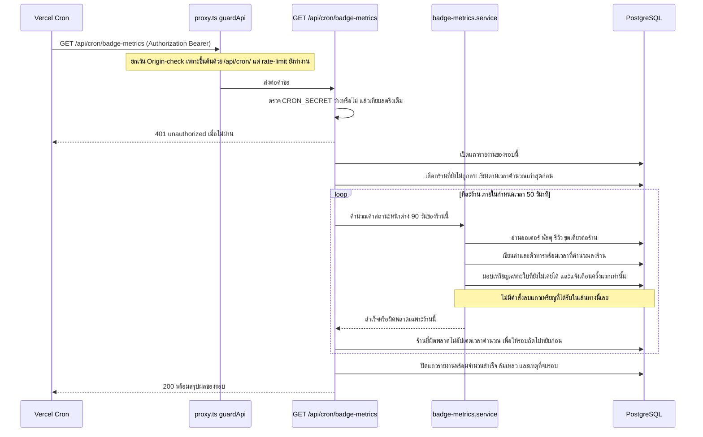
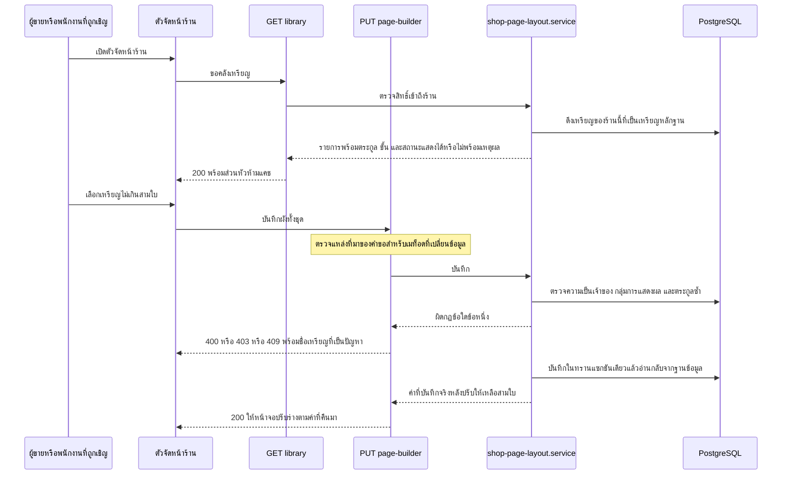

> **โมดูล:** 00052 - Badge & Achievement v2
> **ประเภทเอกสาร:** API Contract
> **เวอร์ชัน:** 1.0
> **วันที่จัดทำ:** 2026-08-21
> **สถานะ:** Draft
> **เจ้าของเอกสาร:** SA (ดู [[Feature-Docs-Ownership]])

# API Contract: ระบบเหรียญตราและความสำเร็จ รุ่นที่ 2

---

## 1. Overview

เอกสารนี้กำหนดสัญญาเชื่อมต่อของ **ระบบเหรียญตราและความสำเร็จ รุ่นที่ 2** ครอบ 3 กลุ่ม:

1. **endpoint เหรียญที่มีอยู่แล้ว 3 ตัว** ที่ได้รับผลกระทบจาก schema ใหม่ (`Badge.family` / `Badge.tier` / `Badge.surface` / `Badge.ownerScope` / `Badge.verticals`) และจากการย้ายด่านฐานความหายากลงไปที่ตัวคำนวณ (FR-BDG-27)
2. **cron ใหม่ 1 ตัว** `/api/cron/badge-metrics` ที่คำนวณค่าสถานะรายวันลงคอลัมน์บน `Shop` (FR-BDG-20)
3. **การบันทึกเหรียญเด่นของร้าน** — ตามมติ **D-BDG-3** ใช้ endpoint เดิมของ 00035 ไม่สร้างตัวใหม่ (ดู §3.1 และ §4.4)

- **เอกสารออกแบบต้นทาง:** [[SDS]] ของโมดูลนี้ · ความต้องการต้นทาง [[BRD]] (`FR-BDG-01` … `FR-BDG-27`)
- **Provider stack:** Next.js 16 App Router (Route Handler ใต้ `src/app/api/**`) + service layer `src/services/**` + Prisma/PostgreSQL — ไม่มี submodule/stack อื่น ไม่มี gateway ภายนอก
- **Base URL:** เส้นทางสัมพัทธ์บนโดเมนเดียวกันทุกซับโดเมน (`https://deepthailand.app`, `https://seller.deepthailand.app`, dev `*.deepth.local:4000`) — `src/proxy.ts` ไม่ rewrite path ที่ขึ้นต้นด้วย `/api` ตาม subdomain
- **Content-Type:** `application/json`
- **Convention ของ error envelope:** โปรเจกต์นี้มี **2 รูปแบบที่อยู่ร่วมกันโดยตั้งใจ** ห้ามยุบรวมในรอบนี้
  - **แบบ flat** `{ "error": "ข้อความ" }` — ใช้กับ `/api/badges/**`, `/api/account/**`, `/api/cron/**` (ยืนยันจากซอร์สทั้ง 4 ไฟล์)
  - **แบบ envelope** `{ "error": { "code", "message", "details" } }` — ใช้กับ `/api/shops/current/page-builder/**` เท่านั้น (ประกาศเป็น contract ไว้ในหัวไฟล์ `_shared.ts` ตรงตัวว่า "ห้ามเปลี่ยนเอง")

---

## 2. Authentication

| รายการ | ค่า |
|--------|-----|
| **วิธี (ผู้ใช้จริง)** | NextAuth v4 session cookie — อ่านด้วย `getServerSession(authOptions)` ที่ตัว route |
| **Header** | ไม่มี — ใช้คุกกี้ session ของซับโดเมนที่เรียก (session แยกตามซับโดเมน) |
| **ตัวตน** | `sessionUserId(session)` (`src/lib/session-user.ts`) คืน `string \| null` — 🛑 "มี session" ไม่เท่ากับ "รู้ว่าเป็นใคร" ห้าม cast `session.user.id` เอง |
| **ขอบเขตร้าน** | `requireActiveShop(session)` (`src/lib/shop-context.ts`) → ร้านที่เปิดอยู่ · แล้วแปลงเป็นขอบเขตเหรียญด้วย `toBadgeScope(active, userId)` เสมอ ห้าม derive ร้านเอง (FR-BDG-21) |
| **กรณีไม่ผ่าน** | `/api/badges/**`, `/api/account/**` → `401 { "error": "Unauthorized" }` (badge-progress ใช้ตัวพิมพ์เล็ก `"unauthorized"` — คงไว้ตามของเดิม) · `page-builder/**` → `401 { "error": { "code": "UNAUTHORIZED", ... } }` |
| **วิธี (cron)** | `Authorization: Bearer <CRON_SECRET>` เทียบแบบสตริงเต็ม — **ไม่มี session ไม่มี JWT** |
| **กรณี env ว่าง** | ถ้า `process.env.CRON_SECRET` ว่าง/undefined ต้อง `401` ทันทีก่อนอ่าน header (กัน `Bearer undefined` ผ่านเมื่อ deploy ลืมตั้ง env) — คัดจาก `src/app/api/cron/chat-response-metrics/route.ts` บรรทัด 21–31 |

### 2.1 Authorization — แยก 3 ระดับ (ยึดพฤติกรรมจริงของโค้ดที่เปิดอ่านแล้ว)

| ระดับ | ตัวตัดสินในโค้ด | สิทธิ์ในโมดูลนี้ |
|---|---|---|
| **เจ้าของร้าน** | `Shop.userId === session.user.id` (สาขาแรกของ `canAccessShop`, `src/lib/shop-context.ts:28`) | เห็นเหรียญ/ความคืบหน้าของร้านที่เปิดอยู่ครบทุกกลุ่ม · บันทึกเหรียญเด่นได้ |
| **พนักงานที่เจ้าของเชิญ** | `isShopMember(shopId, userId)` (สาขาที่สองของ `canAccessShop`, บรรทัด 29) — 🛑 **ไม่แยก role** ADMIN/STAFF ได้เท่ากันทั้งหมดในเส้นทางนี้ | **เท่ากับเจ้าของร้านทุกประการ** ในทุก endpoint ของเอกสารนี้ (นี่คือพฤติกรรมที่มีอยู่ก่อนแล้ว ไม่ใช่สิ่งที่รอบนี้เพิ่ม) · การจะแยกสิทธิ์ปักเหรียญออกจากพนักงาน = **มติใหม่** ต้องเคาะที่ SDS แล้วเพิ่มด่านที่ service ไม่ใช่ซ่อนปุ่ม |
| **คนนอก / ไม่ล็อกอิน** | ไม่มี session หรือ `requireActiveShop` คืนร้านคนละใบ | เข้าไม่ได้ทุก endpoint ในเอกสารนี้ (401/404) · เห็นเหรียญได้เฉพาะทางหน้าโปรไฟล์สาธารณะซึ่งเป็น RSC ไม่ใช่ API — ดู §7 |

🛑 **การซ่อนตามประเภทร้านไม่ใช่การควบคุมสิทธิ์ (BR-BDG-21)** — ทุก endpoint ที่คืนรายการเหรียญต้องกรองด้วย allow-list ต่อ `Shop.vertical` **ที่ฝั่งเซิร์ฟเวอร์** ไม่ใช่ให้หน้าจอกรอง

### 2.2 ด่านที่ `guardApi` (`src/proxy.ts`) บังคับให้อยู่แล้ว — ทุก endpoint ในเอกสารนี้อยู่ใต้ด่านนี้

| ด่าน | ผลกับ endpoint ของโมดูลนี้ |
|---|---|
| **CSRF Origin-check** | บังคับเฉพาะ `POST/PUT/PATCH/DELETE` และ **ยกเว้น `/api/cron/*`** (บรรทัด 38) ⇒ `PUT /api/shops/current/page-builder` ต้องมี `Origin` ที่อยู่ใน allow-list ไม่งั้น `403 { "error": "CSRF check failed" }` · cron ไม่ต้องมี Origin |
| **Rate-limit ต่อ IP (หน้าต่าง 60 วินาที)** | GET + ล็อกอิน = **120/นาที** · GET ไม่ล็อกอิน = **200/นาที** · mutation + ล็อกอิน = **30/นาที** · เกินแล้ว `429 { "error": "Rate limit exceeded" }` + `Retry-After: 60` |
| **bucket** | คีย์คือ `${ip}:${auth|pub}:${bucket}` โดย bucket = `get` / `mut` — **ไม่มี bucket แยกสำหรับ badge หรือ cron** และรอบนี้ไม่ขอเพิ่ม (cron ยิงวันละครั้ง · `BadgeDetailModal` ยิง 2 คำขอต่อการเปิดโมดัลหนึ่งครั้ง ห่างจากเพดาน 120 มาก) |

🛑 **จุดที่ต้องเฝ้า:** `GET .../page-builder/library` ที่หน้าตัวจัดหน้าร้านเรียกซ้ำตอนค้นหา/เลื่อนหน้า ใช้ bucket `get` ร่วมกับทุก GET ของทั้งระบบ — ถ้ารอบนี้เพิ่มการ fetch ต่อการพิมพ์ 1 ตัวอักษร จะกินโควตาเดียวกับหน้าอื่นที่ผู้ใช้เปิดค้างอยู่ ⇒ ฝั่ง client ต้อง debounce ไม่ใช่แก้เพดาน

### 2.3 Cache-Control

ทุก endpoint ในเอกสารนี้ผูกกับ session หรือกับร้าน ⇒ **`Cache-Control: private, no-store` ทุกตัวไม่มีข้อยกเว้น**
`page-builder/**` ทำอยู่แล้ว 2 ชั้น (`export const dynamic = "force-dynamic"` + `res.headers.set(...)` — ยืนยันจากซอร์ส)
🛑 **`/api/badges/[badgeId]/rarity`, `/api/badges/[badgeId]/estimate`, `/api/account/badge-progress` ปัจจุบัน "ไม่มี" ทั้ง `dynamic` และ header** (เปิดอ่านทั้ง 3 ไฟล์แล้ว ไม่มีบรรทัดใดตั้งค่านี้) ⇒ ต้องเติมในรอบนี้ ไม่ใช่ nice-to-have: `rarity` จะคืนค่าฐาน "ร้านที่ขายจริง" ซึ่งเป็นตัวเลขระดับแพลตฟอร์ม และ `estimate`/`badge-progress` ผูกกับร้านที่เปิดอยู่

---

## 3. Endpoint List

| Method | Path | สถานะ | คำอธิบาย |
|--------|------|-------|----------|
| `GET` | `/api/badges/{badgeId}/rarity` | **แก้ response (breaking)** | ความหายากของเหรียญหนึ่งใบ — เปลี่ยนตัวหารเป็น "ร้านที่ขายจริง" และย้ายด่านฐานขั้นต่ำมาที่ฝั่งเซิร์ฟเวอร์ |
| `GET` | `/api/badges/{badgeId}/estimate` | **แก้ response (additive + ค่าใหม่ใน union)** | "อีกกี่วันจะได้" ของเหรียญที่ยังไม่ได้รับ — เพิ่มเหตุผลสำหรับเหรียญสถานะที่ประเมินเป็นวันไม่ได้ |
| `GET` | `/api/account/badge-progress` | **แก้ response (additive) + แก้บั๊กไอคอน** | รายการเหรียญ + ความคืบหน้าของร้านที่เปิดอยู่ — เพิ่มตระกูล/ขั้น/กลุ่มการแสดงผล/สถานะการขึ้นโปรไฟล์ |
| `GET` | `/api/cron/badge-metrics` | **ใหม่** | งานเบื้องหลังรายวัน: คำนวณค่าสถานะหน้าต่าง 90 วันลง `Shop` แล้วประเมิน/มอบเหรียญ |
| `GET` | `/api/shops/current/page-builder/library` | **แก้ response (additive) + กรองเพิ่ม** | คลังเหรียญที่ร้านเลือกมาปักได้ — กรองเหลือเฉพาะเหรียญหลักฐาน พร้อมสถานะ "แสดงได้ตอนนี้ไหม" |
| `PUT` | `/api/shops/current/page-builder` | **แก้ validation + error ใหม่ 3 ตัว** | บันทึกผังหน้าร้านทั้งชุด รวมช่องเหรียญเด่นที่กลายเป็นตัวควบคุมช่อง 2–4 ของแผงหลักฐาน |

**ไม่มี endpoint ใหม่ฝั่งสาธารณะโดยตั้งใจ** — โปรไฟล์ `/u/[username]`, `/b/[slug]` และหน้าเหรียญเต็ม (FR-BDG-26) เป็น Server Component ที่เรียก service ตรง ไม่ผ่าน HTTP ⇒ ไม่มี payload สาธารณะให้ scrape เพิ่ม แต่ยังต้องทำตาม §7

### 3.1 ผลของ D-BDG-3 — ไม่สร้าง endpoint ใหม่ (คำตอบคือข้อ **(ข) ขยาย validation ของเดิม**)

เปิดอ่านของเดิมครบทั้งเส้นแล้ว: `src/lib/validations.ts:1808-1831` (`ShopPageBlockSchema` / `SaveShopPageLayoutSchema`) · `src/app/api/shops/current/page-builder/route.ts` · `_shared.ts` · `src/services/shop-page-layout.service.ts` (`saveShopPageLayout`, `resolveBadgeOwnershipWhere`, `listShopPageBlocks`, `getBuilderLibrary`)

**สิ่งที่ของเดิมมีอยู่แล้วและใช้ได้เลย:**

| ความต้องการ | ของเดิมทำได้แล้ว |
|---|---|
| เก็บรายการเหรียญที่ร้านเลือก | `ShopPageBlock.badgeIds` — 🛑 **เก็บ `UserBadge.id` ไม่ใช่ `Badge.id`** (คอมเมนต์ที่ `shop-page-layout.service.ts:119` ระบุตรงตัว และ query ที่บรรทัด 415 ใช้ `where: { id: { in: badgeIds } }` บน `prisma.userBadge`) |
| เพดานจำนวน | `v.maxLength(4)` ที่ Valibot |
| ความเป็นเจ้าของ | `resolveBadgeOwnershipWhere(shopId)` — PERSONAL ใช้ `{ userId, shopId: null }` · BUSINESS ใช้ `{ shopId }` |
| กันเหรียญคนละชนิดหลุดเข้ามา | `badge: { type: 'ACHIEVEMENT' }` ทั้งฝั่งอ่านและฝั่งเขียน |
| กันมีบล็อกเหรียญมากกว่า 1 | `TOO_MANY_BADGE_BLOCKS` |
| แปล error → HTTP | `handleBuilderError()` ที่ route ทุกตัวเรียกใน catch เดียว |
| ทนข้อมูลอ้างอิงที่หายไป | `listShopPageBlocks` กรองเหรียญที่หาไม่เจอทิ้งเงียบ ๆ และข้ามบล็อกที่เหลือ 0 ใบ |

**สิ่งที่ต้องขยาย (เพราะบล็อกนี้เปลี่ยนบทบาทจาก "บล็อกแยก" เป็น "ตัวควบคุมช่อง 2–4 ของแผงหลักฐาน"):**

| # | ต้องเพิ่ม | เหตุผลผูกกับ FR |
|---|---|---|
| B-1 | กรองให้เลือกได้เฉพาะเหรียญที่ `Badge.surface = 'EVIDENCE'` | FR-BDG-13 / FR-BDG-18 — เหรียญยอดเงินและเหรียญเป้าหมายต้องไม่มีทางขึ้นสาธารณะ **แม้ id หลุดเข้ามา** (ปัจจุบัน `type: 'ACHIEVEMENT'` ปล่อยผ่านหมด) |
| B-2 | ห้ามเลือกเหรียญ **ตระกูลเดียวกันซ้ำ** | FR-BDG-25 — ตระกูลละ 1 ใบบนโปรไฟล์ |
| B-3 | ห้ามส่ง `UserBadge.id` ซ้ำในอาร์เรย์ | ของเดิมเช็คซ้ำเฉพาะ `facebookPostId` (บรรทัด 408) **ไม่เคยเช็คเหรียญซ้ำเลย** ⇒ ส่งใบเดียวกัน 4 ครั้งจะได้แผงที่มีของซ้ำ 4 ช่อง |
| B-4 | เพดานที่ร้านปักได้จริงคือ **3 ใบ** (ช่องที่ 1 ระบบล็อก) | FR-BDG-24 |
| B-5 | เหรียญที่ปักไว้แล้วต่อมาไม่ผ่านเกณฑ์ = **ซ่อนชั่วคราว ห้ามลบการตั้งค่า** | FR-BDG-24 — ตรงกับพฤติกรรม fail-safe ที่ `listShopPageBlocks` ทำอยู่แล้ว (กรองตอนอ่าน ไม่แตะแถว) ⇒ **ห้ามเปลี่ยนเป็นลบตอนอ่าน** |

🛑 **B-4 ห้ามทำด้วยการลด `v.maxLength(4)` → `maxLength(3)`** — ร้านที่เคยบันทึก 4 ใบไว้ก่อนหน้า เปิดตัวจัดหน้าร้านแล้วกด "บันทึก" โดยไม่แก้อะไร จะได้ `400 VALIDATION_ERROR` ทันทีโดยไม่มีทางออกในจอ (ค่าที่เกินมาไม่ใช่สิ่งที่เขาเพิ่งพิมพ์) ⇒ **คง `maxLength(4)` ไว้ที่ Valibot** แล้วให้ service ตัดเหลือ 3 ใบแรกตามลำดับที่ร้านจัดไว้ พร้อมคืนค่าที่บันทึกจริงกลับมา (route คืนค่าจาก DB อยู่แล้ว ไม่ echo request ดิบ — บรรทัด 457–470) และหน้าจอต้อง sync draft จาก response ไม่ใช่เชื่อ state ของตัวเอง

---

## 4. Endpoint Detail

### 4.1 `GET /api/badges/{badgeId}/rarity`

คืนความหายากของเหรียญหนึ่งใบ **ไม่ cache** (ต้องการค่าสด) · ผู้เรียกปัจจุบัน **มีรายเดียว**: `src/app/(paces)/seller/(dashboard)/badges/BadgeDetailModal.tsx:204` (พิสูจน์ด้วย grep ทั้ง `src/`) ⇒ การเปลี่ยนชื่อฟิลด์ทำได้ในคอมมิตเดียว

**Request**

| ส่วน | ฟิลด์ | ชนิด | บังคับ | คำอธิบาย |
|------|-------|------|--------|----------|
| Path Param | `badgeId` | `string` | yes | `Badge.id` (ไม่ใช่ `UserBadge.id`) — ว่าง/สั้นกว่า 1 → 400 |

**Response — Success (200) — รูปร่างใหม่**

| ฟิลด์ | ชนิด | เปลี่ยนอย่างไร | คำอธิบาย |
|-------|------|---|----------|
| `tier` | `'COMMON'\|'UNCOMMON'\|'RARE'\|'LEGENDARY'\| null` | **เปลี่ยนเป็น nullable** | `null` = ฐานไม่พอ ระบบไม่ตัดสินความหายาก (FR-BDG-27) |
| `pct` | `number \| null` | **เปลี่ยนเป็น nullable** | `null` คู่กับ `tier: null` เสมอ — 🛑 ห้ามส่ง `0` แทน "ยังไม่รู้" (BR-BDG-15) |
| `earnedCount` | `number` | เหมือนเดิม | จำนวนแถวที่ถือเหรียญใบนี้ |
| `sellingShopCount` | `number` | **ชื่อใหม่ แทน `shopCount`** | จำนวน **ร้านที่ขายจริง** (มีออเดอร์ปิดจบ ≥1 ใบ) — เดิม `shopCount` = `prisma.shop.count()` นับทุกร้านรวมร้านที่ไม่เคยขาย |
| `suppressedReason` | `'BASE_TOO_SMALL' \| null` | **ใหม่** | มีค่าเมื่อ `tier === null` — ให้หน้าจออธิบายได้ว่าเงียบเพราะอะไร ไม่ใช่เงียบเฉย ๆ |

🛑 **ทำไมต้องเปลี่ยนชื่อฟิลด์ ไม่ใช่คงชื่อเดิมแล้วเปลี่ยนความหมาย** — `shopCount` ที่แปลว่า "ทุกร้าน" กับที่แปลว่า "ร้านที่ขายจริง" เป็นสองนิยามของคำเดียวกัน ซึ่ง Hard Rule 16 ห้ามไว้ตรงตัว และไม่มี gate ไหนของโปรเจกต์จับได้ (ชนิดเป็น `number` เหมือนกันทั้งคู่ `tsc` เขียวทั้งสองทาง) · นิยาม "ร้านที่ขายจริง" ต้องประกาศ **ที่เดียว** แล้วใช้ร่วมทุกจุด (FR-BDG-27)

🛑 **ด่านฐานขั้นต่ำ 20 ร้านต้องย้ายลงมาอยู่ใน `getBadgeRarity()`** — ปัจจุบันด่านอยู่ในคอมโพเนนต์เท่านั้น (`BadgeDetailModal.tsx:248-249` เขียนคอมเมนต์กำกับไว้เอง) แปลว่า **ผู้เรียกรายใหม่ทุกรายได้ชั้นความหายากมาโดยไม่มีด่าน** และ endpoint นี้ก็คืนมาให้ตั้งแต่วันแรกอยู่แล้ว

**พฤติกรรมที่ต้องไม่พัง**

- 401 เมื่อไม่มี session (คงเดิม — กัน scrape ความหายากแบบ bulk โดยผู้ไม่ล็อกอิน)
- 404 เมื่อ `badgeId` ไม่มีจริง (คงเดิม — กันแต่ง `LEGENDARY` ให้ id มั่ว)
- ผู้เรียกเดิม `BadgeDetailModal` ต้องแก้ **ในคอมมิตเดียวกัน** (atomic) เพราะ `tier`/`pct` กลายเป็น nullable และชื่อฟิลด์เปลี่ยน — ปล่อยคนละคอมมิตแล้ว `tsc` จะแดงระหว่างทาง

**Response — Error:** `UNAUTHORIZED` 401 · `INVALID_BADGE_ID` 400 · `NOT_FOUND` 404 · `INTERNAL_ERROR` 500

**ตัวอย่าง JSON**

```json
// Response 200 — ฐานพอ
{ "tier": "RARE", "pct": 8.3, "earnedCount": 2, "sellingShopCount": 24, "suppressedReason": null }

// Response 200 — ฐานไม่พอ (สถานะจริงของระบบ ณ 2026-08-21: ร้านที่ขายจริง 2 ร้าน)
{ "tier": null, "pct": null, "earnedCount": 2, "sellingShopCount": 2, "suppressedReason": "BASE_TOO_SMALL" }
```

---

### 4.2 `GET /api/badges/{badgeId}/estimate`

"อีกกี่วันจะได้รับ" ของเหรียญที่ยังไม่ได้รับ — `userId` มาจาก session เท่านั้น (ห้ามรับจาก query/path มิฉะนั้นเป็นช่อง IDOR) และ scope ด้วยร้านที่เปิดอยู่ผ่าน `requireActiveShop` → `toBadgeScope` (ยืนยันจากซอร์ส บรรทัด 39–40)
ผู้เรียกปัจจุบัน **รายเดียว**: `BadgeDetailModal.tsx:214` (เรียกเฉพาะเหรียญที่ `earned === false`)

**Request**

| ส่วน | ฟิลด์ | ชนิด | บังคับ | คำอธิบาย |
|------|-------|------|--------|----------|
| Path Param | `badgeId` | `string` | yes | `Badge.id` |

**Response — Success (200)**

| ฟิลด์ | ชนิด | คำอธิบาย |
|-------|------|----------|
| `estimateDays` | `number \| null` | จำนวนวันโดยประมาณ · `null` เมื่อประเมินไม่ได้ |
| `ratePerDay` | `number \| null` | อัตราย้อนหลัง 30 วัน |
| `reason` | `PaceReason` | เหตุผล — union เดิม + **ค่าใหม่ `'state_badge'`** |

**ค่าใหม่ที่เพิ่มเข้า union**

- `'state_badge'` — เหรียญสถานะ (ไม่ทิ้งลูกค้า / ตอบทุกรีวิว / ส่งไว / ตามพัสดุได้ทุกใบ) ประเมินเป็น "อีกกี่วัน" ไม่ได้โดยธรรมชาติ เพราะเกณฑ์เป็นสัดส่วน/ค่าเฉลี่ยในหน้าต่าง 90 วัน ไม่ใช่ตัวนับที่วิ่งขึ้นทางเดียว ⇒ ต้องบอกว่า "ต้องรักษาระดับ" ไม่ใช่ "อีก N วัน"
- `'insufficient_sample'` — ข้อมูลยังไม่พอตัดสิน (FR-BDG-23) — 🛑 **ห้ามยุบรวมกับ `'no_data'`** เพราะ "ยังไม่มีข้อมูลเลย" กับ "มีแล้วแต่ยังไม่ถึงขั้นต่ำ" ต้องใช้คนละข้อความ (BR-BDG-15) ⇒ ต้องมาคู่กับ `sampleSize` และ `sampleRequired`

| ฟิลด์เพิ่ม | ชนิด | คำอธิบาย |
|---|---|---|
| `sampleSize` | `number \| null` | ตัวหารที่นับได้จริงในหน้าต่าง 90 วัน — มีค่าเมื่อ `reason` เป็น `'insufficient_sample'` หรือ `'state_badge'` |
| `sampleRequired` | `number \| null` | ขนาดตัวอย่างขั้นต่ำของขั้นนั้น |

🛑 **การเพิ่มค่าใน union ที่หน้าจอแปลเป็นข้อความ ต้อง grep ทั้งรีโป ไม่ใช่แค่ `src/`** (`docs/conventions/enum-value-removal.md` ใช้กับทิศเพิ่มด้วย) — และตัวแปลข้อความต้องเป็น **allow-list ที่ fail-closed** ไม่ใช่ `switch` ที่มี `default` เป็นข้อความของเหตุผลใดเหตุผลหนึ่ง เพราะ `default` แบบนั้นคือรูปร่างของบั๊กที่เคยเกิดมาแล้ว 2 ครั้ง (ชิปช่องทางตกท้ายเป็น 'Instagram' 2026-08-12 · หน้า `/register` ตกท้ายเป็น 'Facebook' 2026-08-15)

**Response — Error:** `UNAUTHORIZED` 401 · `INVALID_BADGE_ID` 400 · `INTERNAL_ERROR` 500
**ไม่มี 404 โดยตั้งใจ** — เหรียญที่ไม่มี progress ของผู้ใช้คนนี้ตอบ `200` พร้อม `reason: 'no_data'` (คงพฤติกรรมเดิมตามคอมเมนต์หัวไฟล์)

---

### 4.3 `GET /api/account/badge-progress`

รายการเหรียญ + ความคืบหน้าของ **ร้านที่เปิดอยู่** (ไม่ใช่ร้านส่วนตัวของคนที่เปิดหน้า) — scope ด้วย `requireActiveShop` → `toBadgeScope` แล้วเรียก `getBadgeProgress(scope.ownerUserId, "seller", scope.shop)` (ยืนยันจากซอร์ส บรรทัด 17–20)
ผู้เรียกปัจจุบัน **รายเดียว**: `src/app/(paces)/seller/(dashboard)/dashboard/components/OnboardingModal.tsx:329`

**Response — Success (200)** — อาร์เรย์ของ item

| ฟิลด์ | ชนิด | เปลี่ยนอย่างไร | คำอธิบาย |
|-------|------|---|----------|
| `badge.id` | `string` | เหมือนเดิม | `Badge.id` |
| `badge.nameTH` / `badge.nameEN` | `string` | เหมือนเดิม | |
| `badge.icon` | `string` | 🛑 **แก้บั๊ก** | ปัจจุบัน **ฮาร์ดโค้ด `"award"` ทุกใบ** (บรรทัด 22 ของไฟล์นี้ อ่านยืนยันแล้ว) ⇒ หลัง P1 เขียนชื่อไอคอนจริงลงคอลัมน์ `Badge.icon` (ภาคผนวก ก ของ BRD) ต้องเปลี่ยนเป็น `p.badge.icon` ไม่งั้นเหรียญ 45 ใบใช้ไอคอนเดียวกันตลอดไปโดยไม่มีอะไรฟ้อง |
| `badge.family` | `string` | **ใหม่** | ตระกูล (FR-BDG-01) |
| `badge.tier` | `number` | **ใหม่** | ขั้นภายในตระกูล เริ่มที่ 1 |
| `badge.surface` | `'EVIDENCE'\|'GOAL'\|'COMMEMORATIVE'` | **ใหม่** | 🛑 ค่าที่ระบบไม่รู้จักต้องถูกปฏิบัติเป็น `'GOAL'` (BR-BDG-20) — fail-closed ที่ **ตัวอ่านแคตตาล็อก** ไม่ใช่ที่หน้าจอ |
| `earned` / `progressLabel` / `progressRatio` | เหมือนเดิม | เหมือนเดิม | |
| `displayState` | `'ON_PROFILE'\|'GOAL_BY_DESIGN'\|'WINDOW_FAILED'\|'SUPERSEDED'\|'INSUFFICIENT_SAMPLE'` | **ใหม่** | สถานะการขึ้นโปรไฟล์ (FR-BDG-22 ทั้ง 3 แบบ + สถานะข้อมูลไม่พอ) |
| `displayReason` | `{ measured, denominator, threshold, text } \| null` | **ใหม่** | 🛑 **ต้องมาจากตัวตัดสินตัวเดียวกับที่โปรไฟล์ใช้** (`resolveBadgeDisplayable()` ตาม FR-BDG-06) — หน้าจอ **ห้ามประกอบประโยคเอง** และเมื่อ `displayState === 'WINDOW_FAILED'` ต้องมี `measured` + `denominator` + `threshold` ครบทั้งสามเสมอ |

**การกรองที่ต้องเพิ่มฝั่งเซิร์ฟเวอร์ (ไม่ใช่ฝั่งจอ)**

1. **allow-list ต่อ `Shop.vertical`** (FR-BDG-16) — `ONLINE_SALES` **9 ตระกูล** · `SERVICE_QUEUE`/`LODGING` **7 ตระกูล** · **ค่าที่ไม่รู้จักตกไปชุดกลาง 7 ตระกูล** ไม่ใช่ชุดของประเภทใดประเภทหนึ่งและไม่ใช่เห็นทั้งหมด (โครงเดียวกับ `VERTICAL_VISIBLE_SLUGS` ใน `src/lib/seller-menu.ts`)
2. **ซ่อนหมวดประมูลทั้งหมวด** จนกว่าจะมีกิจกรรมประมูล ≥1 ครั้ง (FR-BDG-19) — ด่านเดียวครอบทั้งหมวด ไม่ใช่ซ่อนทีละใบ
3. เหรียญตระกูล **ยอดขายสะสม** ยังคืนได้ที่นี่ (endpoint นี้เป็นข้อมูลของเจ้าของร้านเอง ไม่ใช่ payload สาธารณะ) — แต่ต้องตรวจซ้ำว่า `surface` ของมันคือ `GOAL` ทุกใบ (FR-BDG-13)

**Response — Error:** `UNAUTHORIZED` 401 (`{"error":"unauthorized"}` — ตัวพิมพ์เล็ก คงตามของเดิม) · `INTERNAL_ERROR` 500
🛑 **route นี้ปัจจุบันไม่มี try/catch เลย** (ทั้งไฟล์ 28 บรรทัด ไม่มี `try`) ⇒ error ใด ๆ จาก service กลายเป็น 500 ดิบของ Next ⇒ ต้องเพิ่ม catch พร้อมกับที่เพิ่มการเรียก resolver ตัวใหม่ในรอบนี้ (ดู §5.1)

---

### 4.4 `PUT /api/shops/current/page-builder` — บันทึกเหรียญเด่นของร้าน (ตาม D-BDG-3)

บันทึกผังหน้าร้าน **ทั้งชุด** ในทรานแซกชันเดียว (ลบ `ShopPageBlock` ของร้านทิ้งแล้วสร้างใหม่ตามลำดับที่ส่งมา) — ไม่แตะ `isPublished` (คนละ endpoint)
รอบนี้ **ไม่เปลี่ยน path ไม่เปลี่ยนชื่อฟิลด์ ไม่เปลี่ยน envelope** เปลี่ยนเฉพาะกฎที่ service บังคับ

**Request (ส่วนที่เกี่ยวกับเหรียญ)**

| ส่วน | ฟิลด์ | ชนิด | บังคับ | คำอธิบาย |
|------|-------|------|--------|----------|
| Body | `tabOrder` | `string[]` | yes | คีย์ที่ไม่รู้จักถูกกรองทิ้งเงียบ ๆ ด้วย transform (พฤติกรรมเดิม ห้ามเปลี่ยนเป็น reject) |
| Body | `blocks[]` | `array` | yes | ≤200 รายการ · มีบล็อก `BADGE_HIGHLIGHT` ได้ **ไม่เกิน 1** |
| Body | `blocks[].type` | `'BADGE_HIGHLIGHT' \| 'FACEBOOK_POST'` | yes | |
| Body | `blocks[].badgeIds` | `string[]` (uuid) | เมื่อ `type='BADGE_HIGHLIGHT'` | 🛑 **`UserBadge.id` ไม่ใช่ `Badge.id`** · Valibot ยังคง `maxLength(4)` (ห้ามลดเป็น 3 — ดู §3.1) · **service เก็บจริงไม่เกิน 3 ใบแรก** |

**กฎใหม่ที่ service ต้องบังคับ (เรียงตามลำดับการตรวจ)**

| ลำดับ | กฎ | โยน error | ทำไมต้องอยู่ที่ service ไม่ใช่ Valibot |
|---|---|---|---|
| 1 | บล็อกเหรียญ ≤1 | `TOO_MANY_BADGE_BLOCKS` (มีอยู่แล้ว) | — |
| 2 | ไม่มี `UserBadge.id` ซ้ำในอาร์เรย์ | `DUPLICATE_BADGE` (**ใหม่**) | Valibot ไม่รู้จักความซ้ำข้ามสมาชิกอาร์เรย์ |
| 3 | ทุกใบเป็นของร้าน/ผู้ใช้นี้จริง | `BADGE_NOT_OWNED` (มีอยู่แล้ว) | ต้อง query DB |
| 4 | ทุกใบมี `Badge.surface = 'EVIDENCE'` | `BADGE_NOT_EVIDENCE` (**ใหม่**) | ต้อง join `Badge` |
| 5 | ไม่มีสองใบที่ `Badge.family` เดียวกัน | `DUPLICATE_BADGE_FAMILY` (**ใหม่**) | ต้อง join `Badge` |
| 6 | ตัดเหลือ 3 ใบแรกตามลำดับที่ร้านจัดไว้ | — (normalize เงียบ + คืนค่าจริงจาก DB) | ดู §3.1 B-4 |

🛑 **กฎข้อ 4 และ 5 ต้องบังคับที่ *ฝั่งเขียน* ด้วย ไม่ใช่กรองเฉพาะตอนอ่าน** — ถ้ากรองแค่ตอนอ่าน ร้านจะบันทึกสำเร็จแล้วเปิดหน้าร้านไม่เห็นอะไร โดยไม่มีอะไรบอกว่าทำไม (คลาสเดียวกับ `setError` ที่ไม่มีใคร render เมื่อ 2026-08-02) และ **ต้องกรองตอนอ่านด้วยเช่นกัน** เพราะ `surface` ของเหรียญเปลี่ยนได้ทีหลังโดยที่แถวที่บันทึกไว้ไม่รู้ตัว (`docs/conventions/stored-flag-vs-owner-truth.md`)

**Response — Success (200)** — คงรูปเดิม: `{ tabOrder, blocks[] }` โดย `blocks[].badgeIds` คือ **ค่าที่บันทึกจริงหลัง normalize** (query กลับจาก DB ไม่ echo request ดิบ — พฤติกรรมเดิมที่บรรทัด 457–470 ห้ามเปลี่ยน)

**Response — Error:** ดูตาราง §5.2 — ทุกตัวผ่าน `handleBuilderError()` ตัวเดียว

---

### 4.5 `GET /api/shops/current/page-builder/library`

คลังของที่เพิ่มลงหน้าร้านได้ ใช้ทั้งตอน SSR หน้าตัวจัดหน้าร้านและตอนค้นหา/เลื่อนหน้าต่อ

**Request:** `?q=` (≤200 ตัวอักษร) · `?cursor=` (ตัวเลขล้วน — ผิดรูป = 400 ไม่ใช่ตกไปหน้าแรกเงียบ ๆ) · `?take=` (1–50)

**Response — เปลี่ยนอย่างไร**

| ฟิลด์ใน `badges[]` | ชนิด | เปลี่ยน | คำอธิบาย |
|---|---|---|---|
| `id` (=`UserBadge.id`), `badgeId`, `name`, `nameEN`, `icon`, `imageUrl` | — | เหมือนเดิม | |
| `family`, `tier`, `surface` | — | **ใหม่ (additive)** | ให้ client จัดกลุ่มและกันเลือกซ้ำตระกูลได้ตั้งแต่ในจอ ก่อนโดน 409 |
| `displayable` | `boolean` | **ใหม่** | ผ่านเกณฑ์ ณ ตอนนี้ไหม — มาจาก `resolveBadgeDisplayable()` ตัวเดียวกับโปรไฟล์ |
| `notDisplayableReason` | `{ measured, denominator, threshold, text } \| null` | **ใหม่** | เหตุผลพร้อมตัวเลขครบสามค่า (FR-BDG-07) |

**การกรองที่เพิ่ม:** คืนเฉพาะ `surface = 'EVIDENCE'` — เหรียญเป้าหมาย/ที่ระลึกหายจากคลังนี้ เพราะบล็อกนี้ไม่ใช่ "โชว์เหรียญที่ชอบ" อีกต่อไปแล้ว มันคือช่อง 2–4 ของแผงหลักฐาน

🛑 **ห้ามซ่อนใบที่ `displayable === false`** — ร้านต้องเลือกไว้ล่วงหน้าได้ และต้องเห็นว่าทำไมมันยังไม่ขึ้น (ถ้าซ่อน ร้านจะเจอเหรียญ "หายไปจากคลัง" ซึ่งอ่านได้ว่าถูกริบ = ขัด FR-BDG-22 ตรง ๆ)

**Response — Error:** `VALIDATION_ERROR` 400 · `UNAUTHORIZED` 401 · `FORBIDDEN` 403 · `NOT_FOUND` 404 · `INTERNAL_ERROR` 500

---

### 4.6 `GET /api/cron/badge-metrics` (ใหม่)

งานเบื้องหลังรายวัน: คำนวณค่าสถานะหน้าต่าง 90 วันต่อร้าน → เขียนลงคอลัมน์บน `Shop` → ประเมินและมอบเหรียญ (FR-BDG-20)

**Auth — ต้องเหมือน `/api/cron/chat-response-metrics` เป๊ะ (คัดจากซอร์สจริง ไม่ได้คิดขึ้นเอง)**

```
1. cronSecret = process.env.CRON_SECRET
2. ถ้า !cronSecret  → 401 { "error": "unauthorized" }   // ห้ามปล่อยผ่านเมื่อ env ว่าง
3. authHeader = request.headers.get("authorization")
4. ถ้า authHeader !== `Bearer ${cronSecret}` → 401 { "error": "unauthorized" }  // เทียบสตริงเต็ม ไม่ parse บางส่วน
```

🛑 ข้อความ 401 ของทั้งสองกรณี **ต้องเหมือนกันทุกตัวอักษร** — ไม่ leak ว่า env ไม่ได้ตั้งหรือ secret ผิด
🛑 **ไม่มี session ไม่มี JWT ไม่มี CSRF** — `/api/cron/*` ถูกยกเว้น Origin-check ที่ `proxy.ts:38` แต่ **rate-limit ยัง apply** (GET ไม่ล็อกอิน 200/นาที/IP)
🛑 `export const maxDuration = 60` (Vercel default 10 วินาที ไม่พอ) — เหมือน cron ตัวที่มีอยู่

**Request**

| ส่วน | ฟิลด์ | ชนิด | บังคับ | คำอธิบาย |
|------|-------|------|--------|----------|
| Header | `Authorization` | `string` | yes | `Bearer <CRON_SECRET>` |
| Query | `limit` | `int` | no | จำนวนร้านสูงสุดต่อรอบ (ค่าเริ่มต้น 200 · เพดาน 500) |
| Query | `shopId` | `string` | no | รันร้านเดียวเพื่อสอบสวน/ทดสอบ — ยังต้องผ่าน Bearer เหมือนกัน |

**การเลือกร้านต่อรอบ (สำคัญกว่าที่ดู)**

- เลือกจาก `Shop` ที่ `deletedAt: null` เรียงด้วย **`badgeMetricsUpdatedAt` เก่าที่สุดก่อน (NULLS FIRST)** แล้ว `take: limit`
- ผลคือรอบถัดไป **เก็บร้านที่ตกรอบให้เองโดยไม่ต้องจำ state ที่ไหน** — ไม่มี cursor ให้หาย ไม่มีแถวคิวให้ค้าง
- 🛑 **ห้ามเรียงด้วย `createdAt` หรือ `id`** เพราะถ้าหมดเวลากลางทาง ร้านชุดท้ายจะตกรอบ *ชุดเดิมทุกวัน* แล้วค่าของร้านกลุ่มนั้นจะเก่าตลอดกาลโดยไม่มีอะไรฟ้อง

**Response — Success (200)**

| ฟิลด์ | ชนิด | คำอธิบาย |
|-------|------|----------|
| `runId` | `string` | id ของแถวรายงานใน DB (ดูด้านล่าง) |
| `processed` | `number` | จำนวนร้านที่หยิบมาในรอบนี้ |
| `ok` | `number` | สำเร็จ |
| `failed` | `number` | ล้ม (แยกรายร้าน) |
| `awarded` | `number` | จำนวนเหรียญที่มอบใหม่ในรอบนี้ |
| `remaining` | `number` | ร้านที่ยังค้างเพราะชน `limit` หรือชน soft deadline |
| `stoppedBy` | `'COMPLETED' \| 'LIMIT' \| 'DEADLINE'` | เหตุที่จบรอบ |

**🛑 การรายงานผลต้องลงฐานข้อมูล ไม่ใช่ log**

บนแพลตฟอร์มนี้ **query runtime log ย้อนหลังไม่ได้** (บันทึกไว้แล้วจากเคส 2026-08-08: `/v1/deployments/{id}/runtime-logs` คืน 404) ⇒ `console.error` ที่อ่านย้อนหลังไม่ได้ มีค่าเท่ากับไม่มี ⇒ ต้องมี **2 ชั้น**:

1. **ต่อร้าน** — `Shop.badgeMetricsUpdatedAt` (1 ใน 9 คอลัมน์ใหม่ตาม schema contract) ตอบคำถาม "ร้านไหนตกรอบ" ได้ด้วยคิวรีเดียว
2. **ต่อรอบ** — ตาราง `BadgeMetricsRun` (`id`, `startedAt`, `finishedAt`, `processed`, `ok`, `failed`, `awarded`, `stoppedBy`, `failedShopIds`, `lastError`) ตอบคำถาม "รอบนั้นเกิดอะไรขึ้น"
   🛑 **ตารางนี้ยังไม่มีใน schema contract ที่เคาะไว้** ⇒ **Controller ต้อง dispatch `safepay-database` ให้เพิ่มก่อนเริ่ม task ของ cron** — ถ้าไม่มี ข้อกำหนดข้อ 6.3 ของ BRD ("ร้านไหนตกรอบ · ล้มเพราะอะไร") จะไม่มีที่ให้เขียนคำตอบ

**พฤติกรรมเมื่อรันซ้ำในวันเดียวกัน (idempotent)**

| สิ่งที่เกิด | รอบที่ 2 ในวันเดียวกัน |
|---|---|
| ค่าสถานะบน `Shop` | เขียนทับด้วยค่าที่คำนวณใหม่ — ค่าเปลี่ยนได้ถ้าข้อมูลจริงเปลี่ยนระหว่างวัน (ไม่ใช่ non-determinism) |
| การมอบเหรียญ | ไม่มอบซ้ำ — กันด้วยดัชนี unique บางส่วนของ `UserBadge` ที่ห้ามแก้ (FR-BDG-01) |
| การแจ้งเตือน | ต้องไม่มีเพิ่ม — แจ้งได้เฉพาะตอนเขียนแถวใหม่สำเร็จครั้งแรก (FR-BDG-08) 🛑 BRD ระบุว่าพฤติกรรมนี้ *มีอยู่แล้ว* ในโค้ดปัจจุบัน — ผู้ implement ต้องเปิด `awardBadge` ยืนยันบรรทัดที่บังคับก่อนพึ่งพา ห้ามเชื่อเอกสาร (Hard Rule 16 ทิศกลับ) |
| การลบแถวเหรียญ | **ไม่มีคำสั่งลบแม้แต่บรรทัดเดียว** (FR-BDG-06) — มีเทส `[blocker]` สแกนซอร์สของ cron ห้ามพบคำสั่งลบบน `UserBadge` |
| แถว `BadgeMetricsRun` | เพิ่ม 1 แถวต่อ 1 รอบเสมอ (รอบเป็นเหตุการณ์ ไม่ใช่สถานะ) |

**พฤติกรรมเมื่อล้มกลางทาง**

- **try/catch แยกทีละร้าน** — error ของร้านเดียวห้ามทำให้ร้านอื่นตกไปด้วย (แบบเดียวกับ `chat-response-metrics` บรรทัด 43–53)
- ร้านที่ล้ม **ห้ามอัปเดต `badgeMetricsUpdatedAt`** — ปล่อยให้ค่าเก่าค้างไว้เพื่อให้รอบถัดไปหยิบมันขึ้นมาก่อนใครโดยอัตโนมัติ (นี่คือเหตุผลที่เรียงด้วยคอลัมน์นี้)
- ทั้งรอบยังคืน **200** พร้อม `failed > 0` — ไม่คืน 500 เพราะ Vercel Cron ตีความ non-2xx เป็น "รันไม่สำเร็จ" แล้วจะไม่มีใครเห็นว่าอีก 199 ร้านสำเร็จไปแล้ว
- คืน **500** เฉพาะกรณีที่รอบนั้นทำอะไรไม่ได้เลย (เช่นเชื่อมฐานข้อมูลไม่ได้ตั้งแต่ query แรก)

**Timeout / ขนาดงานเมื่อร้านโตขึ้น**

- ปัจจุบัน 14 ร้าน (ขายจริง 2) — งานทั้งรอบจบเร็วมาก
- เพดานแข็ง: `maxDuration = 60` วินาที · **soft deadline 50 วินาที** — ถึงแล้วหยุดรับร้านใหม่ ปิดรอบด้วย `stoppedBy: 'DEADLINE'` แล้วรายงาน `remaining` (ห้ามปล่อยให้แพลตฟอร์มตัดกลางคัน เพราะแถว `BadgeMetricsRun` จะไม่มี `finishedAt` และไม่มีใครรู้ว่าหยุดที่ตรงไหน)
- ต้นทุนต่อร้าน = จำนวนคิวรีรวมของทุกตระกูล ⇒ **จำนวนคิวรีต่อร้านห้ามโตตามจำนวนเหรียญ** (BRD §6.2) — คำนวณค่าสถานะทั้ง 4 ตระกูลจากชุดข้อมูลที่ดึงมาครั้งเดียวต่อร้าน แล้วค่อยเทียบกับทุกขั้น
- 🛑 **ถ้าวันใด `remaining > 0` ติดกันหลายวัน = สัญญาณว่าต้องแตกเป็นหลายรอบต่อวัน ไม่ใช่ปรับ `limit` ขึ้น** — `limit` ที่สูงกว่างานที่ทำทันใน 50 วินาที ไม่ได้ทำให้ทำได้มากขึ้น มันแค่ย้ายจุดที่ถูกตัด

---

## 5. Error Code Table

### 5.1 กลุ่ม `/api/badges/**` + `/api/account/**` + `/api/cron/**` (envelope แบบ flat)

| Error Code (ค่าใน `error`) | HTTP | เงื่อนไข | ข้อความที่ client แสดง |
|---|---|---|---|
| `Unauthorized` | 401 | ไม่มี session หรือ session ไม่มี `user.id` | "เซสชันหมดอายุ กรุณาเข้าสู่ระบบใหม่" + ปุ่มไปหน้าเข้าสู่ระบบ |
| `unauthorized` | 401 | เฉพาะ `badge-progress` (ตัวพิมพ์เล็ก คงของเดิม) และ cron | เหมือนบรรทัดบน · ฝั่ง cron ไม่มี UI |
| `Invalid badgeId` | 400 | path param ว่าง | ไม่แสดง (เกิดได้เฉพาะเมื่อ client ประกอบ URL ผิด) |
| `Badge not found` | 404 | `badgeId` ไม่มีในแคตตาล็อก (เฉพาะ `rarity`) | "ไม่พบเหรียญนี้แล้ว — อาจถูกปรับปรุงรายการ ลองรีเฟรชหน้า" |
| `Internal server error` | 500 | error ที่ไม่รู้จัก | "เปิดข้อมูลความหายากไม่ได้ตอนนี้ ลองใหม่อีกครั้ง" — 🛑 ห้ามใช้ข้อความนี้กับ error ที่รู้สาเหตุแล้ว |

**🛑 Cross-file error-mapping — error ใหม่ทุกตัวต้องมีที่จับ ห้ามหลุดเป็น 500**

| error ที่ service จะโยนใหม่ | โยนจากไหน | ใครจับ | HTTP ที่ต้องได้ | ถ้าไม่เติม branch จะเกิดอะไร |
|---|---|---|---|---|
| `BadgeOwnerScopeMismatchError` (มอบเหรียญร้านโดยไม่ส่งร้าน / มอบเหรียญบุคคลพร้อมร้าน — FR-BDG-02) | `awardBadge()` | **ไม่มี route ของผู้ใช้เรียกตรง** ⇒ ผู้จับคือ (ก) catch รายร้านใน `/api/cron/badge-metrics` → นับเป็น `failed` + เขียน `lastError` ไม่ล้มทั้งรอบ (ข) เส้นทางออเดอร์ (`evaluateSellerBadgesForShop`) | ไม่มี HTTP ของตัวเอง | **การสร้างออเดอร์จะล้มเพราะการมอบเหรียญ** ซึ่งเป็นผลข้างเคียง ไม่ใช่งานหลัก 🛑 **ผู้ implement ต้องเปิดจุดเรียกในเส้นทางออเดอร์ยืนยันว่ามี try/catch ครอบอยู่จริงก่อนปิด task — เอกสารนี้ไม่ยืนยันแทน** |
| `resolveBadgeFamily()` เจอตระกูลที่ไม่รู้จัก | ตัวอ่านแคตตาล็อก | — | — | 🛑 **ห้ามโยน error โดยเด็ดขาด** ต้อง fail-closed เป็น `GOAL` + ชุดกลาง 7 ตระกูล (BR-BDG-19/20) เพราะถ้าโยน หน้าเหรียญทั้งหน้าจะ 500 จากเหรียญใบเดียวที่ตั้งค่าผิด |
| error ใด ๆ จาก resolver ตัวใหม่ใน `badge-progress` | `getBadgeProgress` + resolver | **ยังไม่มีใครจับ** — route นี้ไม่มี `try` เลย | 500 | ⇒ **ต้องเพิ่ม try/catch ใน `src/app/api/account/badge-progress/route.ts` ในคอมมิตเดียวกับที่เพิ่มการเรียก resolver** ไม่ใช่คอมมิตแยก |

### 5.2 กลุ่ม `/api/shops/current/page-builder/**` (envelope แบบ `{ error: { code, message, details } }`)

| Error Code | HTTP | เงื่อนไข | ข้อความที่ client แสดง (บอกทางออก ไม่ใช่ "ลองใหม่") |
|---|---|---|---|
| `UNAUTHORIZED` | 401 | ไม่มี session | "เซสชันหมดอายุ กรุณาเข้าสู่ระบบใหม่แล้วเปิดตัวจัดหน้าร้านอีกครั้ง" |
| `NOT_FOUND` | 404 | ไม่มีร้านที่ใช้งานอยู่ | "ยังไม่ได้เลือกร้าน — สลับร้านที่มุมบนซ้ายแล้วลองอีกครั้ง" |
| `FORBIDDEN` | 403 | `canAccessShop` = false | "คุณไม่มีสิทธิ์แก้หน้าร้านนี้" |
| `VALIDATION_ERROR` | 400 | Valibot ไม่ผ่าน | "ข้อมูลผังไม่ถูกต้อง" (เดิม) |
| `NOT_OWNED` (จาก `BADGE_NOT_OWNED`) | 403 | มี `UserBadge.id` ที่ไม่ใช่ของร้านนี้ | "มีเหรียญที่ไม่ใช่ของร้านนี้ — รีเฟรชหน้าแล้วเลือกใหม่" (เดิม) |
| `NOT_OWNED` (จาก `POST_NOT_OWNED`) | 403 | โพสต์ไม่ใช่ของเพจที่เชื่อมไว้ | เดิม |
| `VALIDATION_ERROR` (จาก `TOO_MANY_BADGE_BLOCKS`) | 400 | บล็อกเหรียญ >1 | เดิม |
| `CONFLICT` (จาก `DUPLICATE_FACEBOOK_POST` / P2002) | 409 | โพสต์ซ้ำ / race 2 session | เดิม |
| **`BADGE_NOT_EVIDENCE`** | **400** | **ใหม่** — เลือกเหรียญที่ `surface ≠ EVIDENCE` | "เหรียญ «{ชื่อ}» เป็นเหรียญเป้าหมาย จึงปักบนหน้าร้านไม่ได้ — เลือกจากรายการเหรียญหลักฐานในคลังทางซ้าย" |
| **`DUPLICATE_BADGE`** | **409** | **ใหม่** — `UserBadge.id` ซ้ำในอาร์เรย์ | "มีเหรียญใบเดียวกันถูกเลือกซ้ำ — เอาออก 1 ใบแล้วบันทึกอีกครั้ง" |
| **`DUPLICATE_BADGE_FAMILY`** | **409** | **ใหม่** — 2 ใบ `family` เดียวกัน | "«{ชื่อ A}» กับ «{ชื่อ B}» เป็นเรื่องเดียวกันคนละขั้น หน้าร้านแสดงได้ขั้นเดียว — เก็บใบที่สูงกว่าไว้แล้วเอาอีกใบออก" |
| `INTERNAL_ERROR` | 500 | error ที่ไม่รู้จัก | "บันทึกไม่สำเร็จ ลองใหม่อีกครั้ง" |

🛑 **ทั้ง 3 error ใหม่ต้องเติม branch ใน `handleBuilderError()` (`_shared.ts`) ในคอมมิตเดียวกับที่ service เริ่มโยน** — ถ้าเติมคนละคอมมิต ระหว่างนั้นร้านที่เลือกผิดจะได้ `500 INTERNAL_ERROR` + ข้อความ "ลองใหม่อีกครั้ง" ซึ่งเชิญให้เขากดวนสิ่งที่ไม่มีวันผ่าน (คลาสเดียวกับที่ 00003 P2 พลาดกับ `OutOfStockError` และที่ iShip พลาดกับ "เครดิตไม่เพียงพอ") · หัวไฟล์ `_shared.ts` เขียนเหตุผลของด่านนี้ไว้เองแล้วว่า "กัน route ไหนลืมครอบ error ตัวใดตัวหนึ่งแล้วหลุดเป็น 500 ดิบ"

🛑 **ข้อความทั้ง 3 ต้องระบุชื่อเหรียญจริงใน `details`** (`details.badgeName`, `details.conflictWith`) ไม่ใช่พูดลอย ๆ — ร้านที่เลือกไว้ 4 ใบไม่มีทางเดาได้ว่าใบไหนคือปัญหา

**โครง error response มาตรฐาน (กลุ่ม page-builder)**

```json
{
  "error": {
    "code": "DUPLICATE_BADGE_FAMILY",
    "message": "เลือกเหรียญเรื่องเดียวกันซ้ำ",
    "details": { "family": "ORDER_COUNT", "badgeName": "ร้อยออเดอร์", "conflictWith": "ร้านค้าขายอดนิยม" }
  }
}
```

---

## 6. Sequence

### 6.1 งานเบื้องหลังรายวัน



### 6.2 ร้านบันทึกเหรียญเด่น (ช่อง 2–4 ของแผงหลักฐาน)



---

## 7. ความเป็นส่วนตัวของ payload

🛑 **`Shop` หลัง P2 มีคอลัมน์ที่ร้านไม่ได้ตั้งใจเปิดเผย** — การ `select` ทั้งแถวหรือส่งอ็อบเจกต์ `shop` ดิบเข้า props ของคอมโพเนนต์ = ข้อมูลเหล่านี้ไหลลง **flight payload ของ RSC** ซึ่งเปิดดูได้จากเบราว์เซอร์ของใครก็ได้ที่เปิดหน้านั้น (บทเรียน `feedback_rsc_pii_neutralize_at_source` — เคยเกิดกับ PII ของผู้ซื้อมาแล้ว)

| คอลัมน์ | ความอ่อนไหว | ที่ไหนใช้ได้ | ที่ไหนห้าม |
|---|---|---|---|
| `sellerCancelCount90d` | **สูง** — จำนวนใบที่ร้านยกเลิกเอง คือ "ความผิด" ของร้านในรูปตัวเลขดิบ | หน้าเหรียญของผู้ขาย (เจ้าของ/พนักงาน) เพื่ออธิบายเหตุผลตาม FR-BDG-07 | **ห้ามอยู่ใน payload ของ `/u/`, `/b/`, หน้าเหรียญเต็มสาธารณะ ทุกกรณี** — สาธารณะเห็นได้แค่ "มีเหรียญ / ไม่มีเหรียญ" |
| `orderSample90d` | **สูง** — ปริมาณการขาย คู่แข่งอ่านได้ทันที | หน้าเหรียญของผู้ขาย (เป็นตัวหารที่ BR-BDG-16 บังคับให้แสดงคู่สัดส่วน) | **ห้ามขึ้นสาธารณะ** — บนโปรไฟล์แสดงได้เฉพาะ "ผ่านเกณฑ์" ไม่ใช่ "ผ่านด้วยตัวเลขเท่าไร" |
| ค่าเฉลี่ย/สัดส่วนอื่น (`shipSpeedAvgHours`, `reviewReplyRate`, `trackingCoverageRate` …) + ตัวหารของแต่ละตัว | กลาง | หน้าเหรียญของผู้ขาย | ห้ามส่งทั้งชุดขึ้นสาธารณะ — โปรไฟล์ต้องการแค่ผลลัพธ์ boolean ของ `resolveBadgeDisplayable()` |
| `badgeMetricsUpdatedAt` | ต่ำ | ทั้งสองฝั่ง | — (แต่ก็ไม่มีเหตุผลให้ส่งขึ้นสาธารณะ) |
| ตระกูล **ยอดขายสะสม** ทั้งตระกูล | **สูงสุด** | หน้าเหรียญของผู้ขายเท่านั้น | 🛑 **ห้ามอยู่ในข้อมูลฝั่งสาธารณะแม้แต่ในรูปจำนวนรวมหรือรายการที่ซ่อนไว้** (FR-BDG-13) — "ซ่อนด้วย CSS" ไม่นับ ของยังอยู่ใน payload |

**กฎที่บังคับได้จริง (ไม่ใช่คำเตือน)**

1. ทุกคิวรีที่ป้อนข้อมูลให้หน้าสาธารณะต้อง **ระบุ `select` รายฟิลด์เสมอ ห้าม `select` ทั้งแถว ห้าม spread `...shop`** — และเทส `[blocker]` ต้องยิงหน้าสาธารณะของร้านที่ถือเหรียญยอดเงินแล้วยืนยันว่าไม่มีชื่อคอลัมน์ทั้ง 9 ตัวและไม่มีเหรียญตระกูลนั้นใน payload (FR-BDG-26)
2. ตัวกรอง `surface = 'EVIDENCE'` ต้องอยู่ใน **`WHERE` ของคิวรี** ไม่ใช่ `.filter()` หลังดึงมา — "ดึงมาก่อนแล้วค่อยกรอง" คือรูปแบบที่ข้อมูลรั่วได้ทุกครั้งที่มีคนลืมกรองในผู้เรียกรายใหม่
3. `/api/badges/{badgeId}/rarity` คืน `earnedCount` และ `sellingShopCount` ซึ่งเป็นตัวเลขระดับแพลตฟอร์ม ⇒ **คงด่าน 401 ไว้** (คอมเมนต์หัวไฟล์ระบุเหตุผลนี้ไว้แล้ว: กัน scrape แบบ bulk) และเพิ่ม `no-store` ตาม §2.3

---

## 8. Traceability

| Endpoint | SDS Component / Decision | BRD FR |
|----------|--------------------------|--------|
| `GET /api/badges/{badgeId}/rarity` | ตัวคำนวณความหายาก + นิยาม "ร้านที่ขายจริง" | FR-BDG-27 · BR-BDG-18 |
| `GET /api/badges/{badgeId}/estimate` | ตัวประเมินอัตรา + การแยกเหรียญเหตุการณ์/เหรียญสถานะ | FR-BDG-06 · FR-BDG-23 · BR-BDG-15 |
| `GET /api/account/badge-progress` | นิยามตระกูลรวมศูนย์ + `resolveBadgeDisplayable()` + allow-list ต่อประเภทร้าน | FR-BDG-01 · FR-BDG-16 · FR-BDG-19 · FR-BDG-21 · FR-BDG-22 · FR-BDG-23 |
| `GET /api/cron/badge-metrics` | งานเบื้องหลังรายวัน + คอลัมน์ค่าสถานะบน `Shop` + ตารางรายงานรอบ | FR-BDG-20 · FR-BDG-06 · FR-BDG-08 · FR-BDG-11 · FR-BDG-12 · FR-BDG-14 · FR-BDG-15 |
| `GET /api/shops/current/page-builder/library` | คลังเหรียญหลักฐาน (D-BDG-3) | FR-BDG-24 · FR-BDG-07 |
| `PUT /api/shops/current/page-builder` | ตัวควบคุมช่อง 2–4 ของแผงหลักฐาน (D-BDG-3) | FR-BDG-24 · FR-BDG-25 · FR-BDG-13 · FR-BDG-18 |
| (ไม่ใช่ endpoint) หน้า `/u/[username]`, `/b/[slug]`, หน้าเหรียญเต็ม | RSC อ่าน service ตรง + §7 | FR-BDG-24 · FR-BDG-25 · FR-BDG-26 |
| ด่านฝั่งมอบเหรียญ (`awardBadge`) | ด่านเจ้าของเหรียญ + ด่านข้ามประเภทร้าน | FR-BDG-02 · BR-BDG-01 · BR-BDG-02 · BR-BDG-21 |

---

## 9. สรุป (Summary)

เอกสารนี้กำหนดสัญญาของโมดูล 00052 ให้ชัดพอที่ DEV ลงมือได้โดยไม่ต้องตัดสินใจรูปร่าง request/response เอง

**สิ่งที่ตัดสินไปแล้วในเอกสารนี้:**

- **D-BDG-3 → ใช้ของเดิม ไม่สร้าง endpoint ใหม่** เพราะ `PUT /api/shops/current/page-builder` มีครบทั้งเพดานจำนวน ด่านความเป็นเจ้าของ ทรานแซกชัน และตัวแปล error → HTTP อยู่แล้ว — สิ่งที่ขาดคือ **กฎ 5 ข้อ (B-1…B-5)** ที่ต้องเพิ่มที่ service ไม่ใช่โครงสร้างใหม่
- **มี 3 error ใหม่ที่ต้องเติม branch ใน `handleBuilderError()` ในคอมมิตเดียวกับที่ service เริ่มโยน** — ไม่งั้นร้านจะเจอ 500 + "ลองใหม่อีกครั้ง" ซึ่งเป็นคำเชิญให้กดสิ่งที่ไม่มีวันผ่าน
- **`rarity` เป็น breaking change ที่ทำได้ปลอดภัย** เพราะมีผู้เรียกรายเดียวทั้งรีโป — และ **ต้อง** breaking เพราะการคง `shopCount` ไว้แล้วเปลี่ยนความหมายคือการละเมิด Hard Rule 16 ที่ไม่มี gate ไหนจับได้
- **cron รายงานผลลงฐานข้อมูล ไม่ใช่ log** และเลือกร้านด้วย "เวลาคำนวณเก่าสุดก่อน" เพื่อให้ร้านที่ตกรอบถูกเก็บเองในรอบถัดไปโดยไม่ต้องจำ state

**สิ่งที่ต้องทำก่อนเริ่ม task ของ cron:**

- 🛑 **Controller ต้อง dispatch `safepay-database`** เพิ่มตาราง `BadgeMetricsRun` — ยังไม่มีใน schema contract ที่เคาะไว้ (มีแต่ 9 คอลัมน์บน `Shop`) และถ้าไม่มี ข้อกำหนด BRD §6.3 จะไม่มีที่ให้เขียนคำตอบ

**Open Questions:**

1. **พนักงานที่ถูกเชิญปักเหรียญได้เท่าเจ้าของหรือไม่** — พฤติกรรมปัจจุบันคือ **ได้** (`canAccessShop` ไม่แยก role) และ BRD §1.3 เขียนไว้ว่า "ให้ SDS เคาะ" ⇒ **เอกสารนี้ยึดของเดิมไว้ก่อน** ถ้าจะแยกต้องเป็นมติใหม่และต้องเป็นด่านที่ service ไม่ใช่การซ่อนปุ่ม
2. **เกณฑ์จำนวนวันที่ถือว่าค่าสถานะ "เก่าเกินไปจนต้องถือว่ายังไม่รู้"** (BRD §6.3 ระบุว่าให้ SRS เคาะ) — กระทบ `displayState` ของทั้ง `badge-progress` และโปรไฟล์ ⇒ ต้องเคาะก่อน P2
3. **จุดเรียก `awardBadge` ในเส้นทางออเดอร์มี try/catch ครอบอยู่จริงหรือไม่** — เอกสารนี้ไม่ยืนยันแทนเพราะยังไม่ได้เปิดไฟล์นั้น ⇒ เป็นงานยืนยันที่ต้องปิดก่อน merge ด่านใหม่ของ FR-BDG-02
