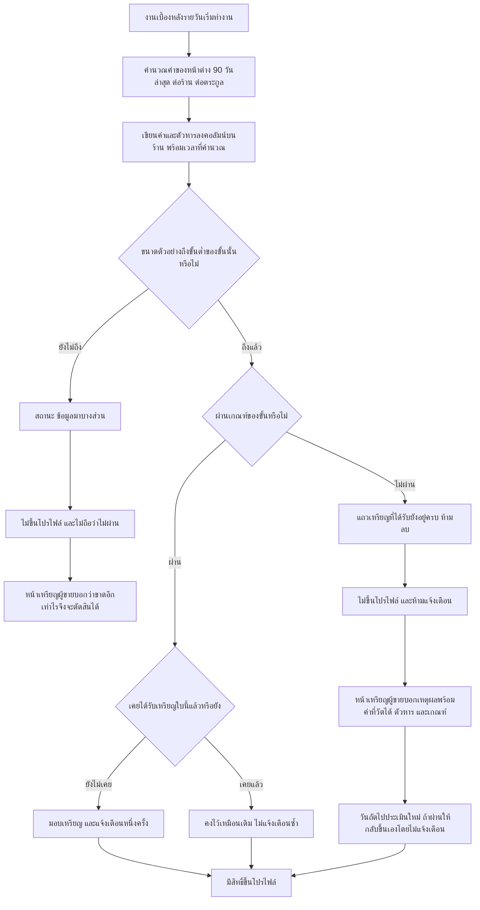
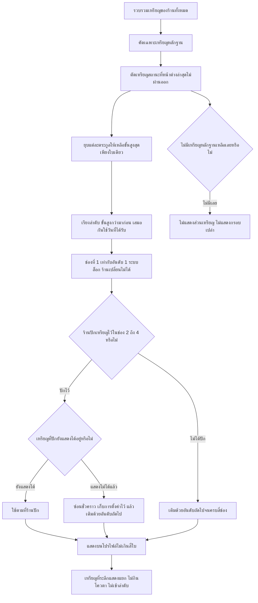
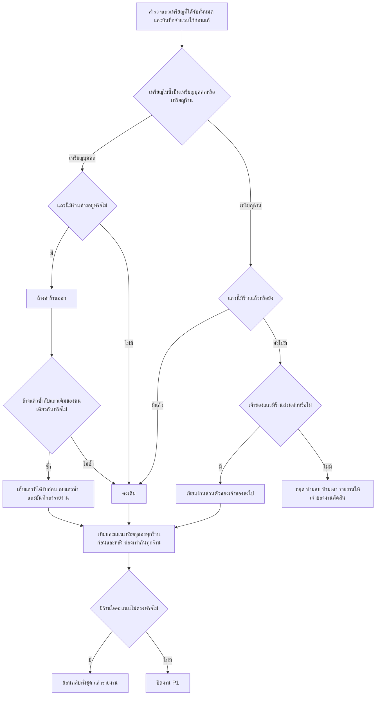

> **โมดูล:** 00052 - Badge & Achievement v2
> **ประเภทเอกสาร:** Business Requirements Document (BRD) - NON-TECHNICAL
> **เวอร์ชัน:** 1.0
> **วันที่จัดทำ:** 2026-08-21
> **สถานะ:** Draft
> **เจ้าของเอกสาร:** BA (ดู [[Feature-Docs-Ownership]])

# BRD: ระบบเหรียญตราและความสำเร็จ รุ่นที่ 2 (Business Requirements Document)

---

## 1. บทนำ

### 1.1 วัตถุประสงค์ของเอกสาร

เอกสารนี้มีวัตถุประสงค์เพื่อ:

1. อธิบายว่าระบบเหรียญของ Deep ต้องเปลี่ยนจาก "รายการความสำเร็จ 31 ใบที่แจกตามตัวเลขสะสมตลอดชีพ" ไปเป็น **ระบบที่แยกได้ว่าเหรียญใบไหนเป็นหลักฐานที่คนนอกควรเห็น เหรียญใบไหนเป็นเป้าหมายส่วนตัวของร้าน และเหรียญใบไหนเป็นเพียงของที่ระลึก**
2. กำหนดขอบเขตของรอบนี้ให้ชัดว่าอะไรทำ อะไรไม่ทำ — โดยเฉพาะการ **ตัดฝั่งผู้ซื้อและเหรียญประมูลใบใหม่ออกทั้งหมด** และการ **ไม่แตะสูตร Trust Score**
3. อธิบายกฎธุรกิจใหม่ 2 ข้อที่ระบบเดิมไม่มี: **เหรียญเป็นของร้านไม่ใช่ของคน** และ **เหรียญสถานะที่ความจริงหมดอายุได้โดยที่ตัวเหรียญไม่ถูกริบ**
4. สร้างความเข้าใจร่วมกันระหว่างทีมธุรกิจกับทีมพัฒนา ว่าเกณฑ์แต่ละขั้นตั้งด้วยตัวเลขอะไร และตัวเลขนั้นเอื้อมถึงจริงหรือไม่เมื่อเทียบกับข้อมูลจริงบนระบบจริง ณ 2026-08-21

### 1.2 ขอบเขตของระบบ

**ระบบเหรียญตราและความสำเร็จ รุ่นที่ 2** คือ ระบบที่ประเมินผลงานของร้านค้าตามเกณฑ์ที่ประกาศไว้ล่วงหน้า แล้วมอบ **เหรียญ** ให้เองโดยร้านขอเองหรือซื้อไม่ได้ พร้อมตัดสินว่าเหรียญใบไหนมีสิทธิ์ขึ้นหน้าร้านสาธารณะในฐานะหลักฐานความน่าเชื่อถือ

**เข้าสู่ระบบ (Input):**
- ออเดอร์ของร้าน (สถานะปิดจบ, สถานะยกเลิกและผู้ริเริ่มการยกเลิก, วันเวลาที่กดสร้าง, ยอดเงิน)
- พัสดุของออเดอร์ ทั้งที่เปิดผ่าน iShip และที่ร้านกรอกเลขเอง
- รีวิวของร้าน (คะแนน, ผู้รีวิว, คำตอบของร้านและเวลาที่ตอบ)
- วันเปิดร้าน (`Shop.createdAt`) และประเภทกิจการของร้าน (`Shop.vertical`)
- ระเบียนการยืนยันตัวตนที่อนุมัติแล้ว
- ปีที่สมัครสมาชิก (สำหรับเหรียญที่ระลึก)

**ออกจากระบบ (Output):**
- แถว "เหรียญที่ได้รับ" ผูกกับร้าน (เหรียญร้าน) หรือผูกกับบุคคล (เหรียญบุคคล)
- ค่าสถานะรายวันต่อร้าน (ค่าเฉลี่ย/สัดส่วน/ตัวหาร/เวลาคำนวณล่าสุด) ที่ใช้ตัดสินเหรียญสถานะ
- รายการเหรียญพร้อมความคืบหน้าและ **เหตุผลที่ยังไม่ขึ้นโปรไฟล์** บนหน้าเหรียญของผู้ขาย
- เหรียญสูงสุด 4 ใบบนโปรไฟล์สาธารณะ + เหรียญที่ระลึกที่แสดงแยก

**ระบบที่เกี่ยวข้อง:**
- Trust Score (feature 00040) — ช่องคะแนนเหรียญนับจากจำนวนเหรียญที่ร้านมี **สูตรห้ามเปลี่ยนในรอบนี้**
- Order Success Metrics (feature 00039) — นิยาม "ยกเลิกที่เป็นความรับผิดชอบของร้าน" และเกณฑ์ขนาดตัวอย่างขั้นต่ำ
- แผงหลักฐานบนโปรไฟล์สาธารณะ — เจ้าของพื้นที่ที่เหรียญไปแสดง
- ระบบประมูล (feature 00002) — เหรียญ 13 ใบที่ถูกซ่อนทั้งหมวดในรอบนี้
- งานเบื้องหลังรายวันของ Deep Chat (`chatResponseRate` ฯลฯ) — เป็น **แบบอย่าง** ของวิธีเก็บค่าสถานะลงคอลัมน์บนร้าน

### 1.3 กลุ่มผู้ใช้งาน

| กลุ่มผู้ใช้ | บทบาท | สิทธิ์การใช้งาน |
|-----------|--------|----------------|
| **เจ้าของร้าน** | คนที่ผลงานถูกวัด และเป็นคนตัดสินว่าจะปักเหรียญใบไหนขึ้นหน้าร้าน | เห็นเหรียญทุกกลุ่มของร้านที่เปิดอยู่ · ปักเหรียญได้ 3 ช่อง (ช่องที่ 2-4) |
| **พนักงานร้านที่ถูกเชิญ** | ผู้ช่วยที่เปิดหน้าเหรียญของร้านเดียวกันได้ | เห็นเหรียญและความคืบหน้าของร้านที่เปิดอยู่เหมือนเจ้าของ · สิทธิ์ปักเหรียญให้ SDS เคาะตามสิทธิ์ที่มีอยู่เดิมของหน้าตั้งค่าร้าน |
| **ผู้ซื้อ / ผู้เข้าชมสาธารณะ** | คนที่ใช้เหรียญเป็นหลักฐานประกอบการตัดสินใจ | เห็นเฉพาะเหรียญหลักฐานที่ผ่านเกณฑ์ ณ ปัจจุบัน สูงสุด 4 ใบ + เหรียญที่ระลึก |
| **งานเบื้องหลังรายวัน** | ผู้คำนวณค่าสถานะและมอบ/ไม่มอบเหรียญ | เขียนค่าสถานะลงร้าน · มอบเหรียญ · **ห้ามลบแถวเหรียญที่ได้รับไปแล้ว** |
| **แอดมิน** | ผู้ดูแลแคตตาล็อก | ดูรายการเหรียญและจำนวนผู้ถือ (ไม่มีการเพิ่มสิทธิ์ใหม่ในรอบนี้) |

---

## 2. ความต้องการหลัก (Functional Requirements)

> **การอ่านเฟส:** ทุก FR ระบุเฟสไว้ที่หัวข้อ — **P1** โครงกระดูกและข้อมูล (เฟสเดียวที่แตะข้อมูลจริง ต้องจบก่อนเฟสอื่นเริ่ม) · **P2** เกณฑ์ใหม่และงานเบื้องหลัง · **P3** หน้าเหรียญของผู้ขาย · **P4** โปรไฟล์สาธารณะ
>
> **หมายเหตุการบังคับใช้:** ทุก FR มีหัวข้อ **บังคับที่** ซึ่งระบุว่ากฎข้อนั้นถูกบังคับด้วยโค้ดตรงไหนและเทสตัวไหนต้องแดงถ้าเอาการบังคับนั้นออก — ตาม `docs/conventions/rule-must-be-enforced-not-described.md` ("กฎที่เขียนไว้ ยังไม่ใช่กฎที่บังคับได้") ชื่อไฟล์ที่ปรากฏเป็น **ข้อเสนอ** ให้ SRS/SDS เคาะชื่อสุดท้าย แต่ **จำนวนจุดบังคับและเงื่อนไขที่ต้องแดง ห้ามลด**

### 2.1 โครงกระดูกของแคตตาล็อกและเจ้าของเหรียญ (P1)

#### FR-BDG-01: แยกเหรียญเป็นตระกูล ขั้น และกลุ่มการแสดงผล (P1)

**User Story:**
> ในฐานะเจ้าของร้าน ฉันต้องการให้ระบบรู้ว่าเหรียญ "ขายครบ 10 ใบ" กับ "ขายครบ 100 ใบ" เป็นเรื่องเดียวกันคนละขั้น เพื่อที่หน้าร้านของฉันจะไม่โชว์เหรียญเรื่องเดียวกันซ้ำ 4 ใบจนดูเฟ้อ

**Acceptance Criteria:**
- [ ] ตาราง `Badge` มีคุณสมบัติเพิ่ม 3 อย่าง: **ตระกูล** (`family`), **ขั้น** (`tier`, จำนวนเต็มเริ่มที่ 1), **กลุ่มการแสดงผล** (`surface` — 1 ใน 3 ค่า: `EVIDENCE` เหรียญหลักฐาน / `GOAL` เหรียญเป้าหมาย / `COMMEMORATIVE` เหรียญที่ระลึก)
- [ ] เหรียญทั้ง 31 ใบเดิม มีค่าครบทั้ง 3 ช่องหลัง migration — ไม่มีแถวไหนเหลือค่าว่าง (พิสูจน์ด้วยคิวรีนับแถวที่ค่าใดค่าหนึ่งว่าง ต้องได้ 0)
- [ ] ภายในตระกูลเดียวกัน ค่า **ขั้น** ห้ามซ้ำกัน (พิสูจน์ด้วยคิวรี group by ตระกูล+ขั้น ต้องไม่มีกลุ่มที่นับได้มากกว่า 1)
- [ ] ค่า `surface` ที่ระบบไม่รู้จัก ต้องถูกปฏิบัติเป็น `GOAL` (ไม่ขึ้นโปรไฟล์) ไม่ใช่ตกไปเป็น `EVIDENCE`
- [ ] **โครงตาราง `UserBadge` ไม่ถูกแก้** — ไม่มีคอลัมน์ใหม่ ไม่มีการถอด index เดิม (ดัชนี unique บางส่วน 2 ตัวยังอยู่ครบ)
- [ ] ชนิดของเหรียญ (เหรียญเหตุการณ์ / เหรียญสถานะ) อ่านจาก **นิยามตระกูลชุดเดียวในโค้ด** ไม่ใช่เดาจากรูปแบบของเกณฑ์ และไม่ใช่คอลัมน์ใหม่ใน `Badge`

**บังคับที่:** นิยามตระกูลรวมศูนย์ (เสนอ `src/lib/badge-family.ts`) เป็น allow-list ที่ประกาศ ตระกูล → ชนิด/ขั้น/ขนาดตัวอย่างขั้นต่ำ/ประเภทร้านที่เห็น · เทส `[blocker]` ที่อ่านแคตตาล็อกจริงแล้วยืนยันว่าทุกใบแมปเข้าตระกูลได้ **และเทสตัวเดียวกันต้องแดงเมื่อลบแถวใดแถวหนึ่งออกจาก allow-list**

**Example:**
```
ร้านที่ขายครบ 100 ใบ จะถือเหรียญตระกูลออเดอร์สะสม 5 ใบ (ขั้น 1,2,3,4,5)
หน้าร้านสาธารณะเห็น 1 ใบ = ขั้น 5 · หน้าเหรียญของผู้ขายเห็นครบ 5 ใบเรียงเป็นแถบขั้น
```

#### FR-BDG-02: เหรียญผลสัมฤทธิ์เป็นของร้านเสมอ (P1)

**User Story:**
> ในฐานะผู้ซื้อ ฉันต้องการให้เหรียญที่เห็นบนหน้าร้านหมายถึงผลงานของ "ร้านนี้" ไม่ใช่ผลงานที่เจ้าของสะสมมาจากร้านอื่น เพื่อที่ร้านเปิดใหม่จะไม่เกิดมาพร้อมเหรียญที่ไม่ได้ทำเอง

**Acceptance Criteria:**
- [ ] เหรียญร้านทุกใบที่มอบหลังฟีเจอร์นี้ขึ้น ต้องมีเจ้าของเป็นร้าน (`UserBadge.shopId` ไม่ว่าง) **ทั้งร้านส่วนตัวและร้านธุรกิจ** — เดิมร้านส่วนตัวเขียนค่าว่างเสมอ
- [ ] เหรียญบุคคล (ผู้ซื้อ / ยืนยันตัวตน / สมาชิกรุ่นก่อตั้ง) ต้องมี `shopId` **ว่างเสมอ**
- [ ] การมอบเหรียญที่ผิดฝั่งทั้ง 2 ทิศ ต้องถูกปฏิเสธที่จุดมอบ ไม่ใช่แค่ไม่มีใครเรียกให้ผิด
- [ ] backfill อยู่ใน **คอมมิตเดียวกับ migration** และรันได้ซ้ำโดยผลไม่เปลี่ยน (idempotent)
- [ ] แถวที่แมปเข้าร้านไม่ได้ (เจ้าของไม่มีร้านเลย) **ห้ามลบและห้ามเดา** — สคริปต์ต้องหยุดแล้วรายงานรายการนั้นให้เจ้าของงานตัดสิน
- [ ] หลัง backfill จำนวนแถวรวมใน `UserBadge` เท่าเดิมทุกแถว ยกเว้นแถวที่ FR-BDG-03 สั่งแก้ (นับก่อน/หลังต้องตรงกัน)

**บังคับที่:** ด่านใน `awardBadge()` ที่อ่านนิยามตระกูลแล้วโยน error เมื่อฝั่งเจ้าของไม่ตรง · เทส `[blocker]` 2 เคส (มอบเหรียญร้านโดยไม่ส่งร้าน / มอบเหรียญบุคคลพร้อมร้าน) ต้องแดงเมื่อถอดด่านออก · สคริปต์ตรวจข้อมูลที่รันหลัง migration แล้วต้องได้ 0 แถวผิดฝั่ง

#### FR-BDG-03: ล้างเหรียญที่ระลึกที่ผูกร้านค้างไว้ (P1)

**User Story:**
> ในฐานะเจ้าของระบบ ฉันต้องการให้เหรียญสมาชิกรุ่นก่อตั้งเป็นของคน ไม่ใช่ของร้าน เพื่อไม่ให้คนหนึ่งคนได้เหรียญเดียวกันซ้ำตามจำนวนร้านที่เปิด

**Acceptance Criteria:**
- [ ] แถวของเหรียญ `2026_BADGE` ที่มี `shopId` ค้างอยู่ (พบ **3 แถว** ณ 2026-08-21) ถูกล้างให้ `shopId` ว่าง
- [ ] ถ้าคนคนเดียวกันมีทั้งแถวที่ `shopId` ว่างอยู่แล้วและแถวที่มี `shopId` ค้าง → เก็บแถวที่ **ได้รับก่อน** แล้วลบแถวที่ซ้ำ พร้อมบันทึกรายการที่ลบไว้ในรายงานของสคริปต์
- [ ] หลังล้างแล้ว จำนวนผู้ถือเหรียญนี้เท่ากับจำนวน **คน** ที่สมัครปี 2026 ไม่ใช่จำนวนแถว (คิวรีนับ distinct ต้องเท่ากับนับแถว)

**บังคับที่:** สคริปต์ backfill ในคอมมิตเดียวกับ migration + คิวรีตรวจซ้ำหลังรัน (แถวเหรียญที่ระลึกที่มี `shopId` = 0)

#### FR-BDG-04: เหรียญ "อยู่มานาน" นับจากวันเปิดร้าน ไม่ใช่วันสมัครบัญชี (P1)

**User Story:**
> ในฐานะผู้ซื้อ ฉันต้องการให้เหรียญ "ร้านค้าเก่าแก่" หมายถึงร้านนี้เปิดมานาน ไม่ใช่เจ้าของสมัครบัญชี Deep มานาน เพราะสองอย่างนี้ไม่เท่ากันเลยสำหรับคนที่เปิดร้านที่สอง

**Acceptance Criteria:**
- [ ] เกณฑ์อายุอ่านจาก **วันเปิดร้าน** (`Shop.createdAt`) ไม่ใช่ `user.createdAt`
- [ ] เงื่อนไข "ต้องยังขายอยู่" คงไว้เหมือนเดิม: ต้องมีออเดอร์สถานะปิดจบอย่างน้อย 1 ใบภายใน **30 วันล่าสุด**
- [ ] ร้านที่ไม่มีร้าน (ไม่มี shop context) ต้องได้ผล "ยังไม่ผ่าน" ไม่ใช่คำนวณอายุจากบัญชีแล้วผ่าน
- [ ] การเปลี่ยนนี้ต้องไม่ริบเหรียญของใคร — ตรวจก่อนแก้ว่าปัจจุบัน **ไม่มีผู้ถือเหรียญตระกูลนี้เลย** (ยืนยันกับฐานจริงในคอมมิตเดียวกัน ถ้าพบผู้ถือต้องหยุดแล้วรายงาน)

**บังคับที่:** ตัวตรวจเกณฑ์อายุใน `badge.service.ts` (ฟังก์ชัน `checkVeteran` ปัจจุบันอ่าน `user.createdAt` — บรรทัดนั้นคือจุดที่ต้องเปลี่ยน) · เทส `[blocker]` ที่ให้บัญชีอายุ 400 วันแต่ร้านอายุ 10 วัน แล้วต้องได้ "ไม่ผ่าน" — เทสนี้ต้องแดงถ้าย้อนกลับไปอ่าน `user.createdAt`

#### FR-BDG-05: ตัวนับเหรียญของ Trust Score ต้องตามเจ้าของใหม่โดยคะแนนไม่ขยับ (P1)

**User Story:**
> ในฐานะร้านค้า ฉันต้องการให้คะแนนความน่าเชื่อถือของฉันเท่าเดิมในวันที่ระบบย้ายเจ้าของเหรียญ เพราะฉันไม่ได้ทำอะไรผิดและไม่ได้เสียเหรียญไปสักใบ

**Acceptance Criteria:**
- [ ] **สูตร Trust Score ไม่ถูกแก้** — ค่าคงที่ "1 เหรียญ = 1 คะแนน เพดาน 10" และไฟล์ที่ถือค่านี้ไม่ถูกแตะ
- [ ] ตัวนับเหรียญของร้านส่วนตัวต้องเปลี่ยน **แหล่งที่มาของการนับ** ให้ตามเจ้าของใหม่ (นับเหรียญของร้านส่วนตัวใบนั้น) — ปัจจุบันเงื่อนไขการนับผูกกับ "เจ้าของ + ไม่มีร้าน" ซึ่งจะกลายเป็น 0 ทันทีที่ backfill รัน
- [ ] มีสคริปต์เทียบคะแนนเหรียญของ **ทุกร้านบนระบบจริง** ก่อน/หลัง migration แล้วต้องเท่ากันทุกร้าน (ผลต่างที่ยอมรับได้ = 0) — 🛑 **ยกเว้น 3 ร้านที่ระบุชื่อไว้ล่วงหน้าใน `DATABASE.md` §5.3.1 ซึ่งลดลงร้านละ 1 แต้มจากการถอนเหรียญที่ระลึกออกจากคะแนนของร้าน** (`BT Premium - สุขสวัสดิ์` 2→1 · `ธนภัทร์ อะไหล่มอเตอร์ไซค์` 7→6 · `BT Premium - คลอง 4 ธัญบุรี` 6→5) · **ร้านที่สี่ที่มีส่วนต่าง = ความผิดพลาด ต้องหยุดสืบสวน ห้ามเพิ่มเข้ารายการข้อยกเว้น**
- [ ] ข้อยกเว้นข้างบนถูกบันทึกเป็น **การแก้ข้อมูลผิด ไม่ใช่การเปลี่ยนสูตร** — เหรียญที่ระลึกของ *ตัวคน* ไม่ควรเคยถูกนับเป็นคะแนนของ *ร้าน* ตั้งแต่แรก · คะแนนที่ผู้ขายเห็นบนจอจะไม่ลด (monotonic) แต่ `TrustScoreHistory` จะบันทึกเลขที่ต่ำลง ซึ่งเป็นผลที่ตั้งใจและอธิบายได้เป็นรายร้าน
- [ ] เหรียญที่ได้รับแล้วไม่ถูกลบออกจากฐานข้อมูลในทุกกรณี (สืบทอด FR-TS2-07 ของ 00040)

**บังคับที่:** ตัวนับใน `trust-score.service.ts` (`calcBadgeScore` — เงื่อนไขปัจจุบันคือ `{ userId, shopId: null }` สำหรับ personal) · เทส `[blocker]` ที่สร้างร้านส่วนตัวพร้อมเหรียญ 3 ใบผูกร้าน แล้วต้องได้คะแนนเหรียญ 3 — เทสนี้แดงทันทีถ้าคืนเงื่อนไขเดิม · รายงานผลสคริปต์เทียบก่อน/หลังต้องแนบใน `TestCase.md`

> 🛑 **มติที่เคาะแล้ว 2026-08-21 (D-BDG-1) — สูตรคงเดิม แต่ที่มาของตัวนับต้องขยับตามแถวที่ย้ายไป**
>
> มติ "ย้ายเจ้าของเหรียญไปผูกร้าน" กับมติ "ห้ามแตะ Trust Score" ชนกันโดยกลไก เพราะ `calcBadgeScore`
> เส้น personal นับด้วยเงื่อนไข `{ userId, shopId: null }` ⇒ วินาทีที่ backfill รัน ตัวนับจะเห็น 0
> และ `recalculateShopTrustScore` รับช่วงต่อไม่ได้เพราะมัน **no-op เมื่อ `kind !== 'BUSINESS'`**
>
> อาการจะไม่โผล่ทันที: คะแนนที่แสดงเป็น `Math.max(ของเดิม, ที่คำนวณใหม่)` ⇒ **หน้าจอค้างที่เลขเก่า
> ขณะที่ `TrustScoreHistory.score` และ breakdown บันทึกเลขที่ตกลง** — คะแนนเน่าเงียบโดยไม่มีอะไรฟ้อง
> ซึ่งเป็นคลาสเดียวกับที่ 00040 ตั้งใจแก้
>
> **สิ่งที่ทำ:** เส้น personal ของ `calcBadgeScore` นับทั้งเหรียญบุคคล (`shopId: null`) และเหรียญของ
> ร้านส่วนตัวของ user คนนั้น · **`BADGE_SCORE_PER_BADGE` และ `BADGE_SCORE_MAX` ไม่ถูกแตะ**
> เจตนาของมติ "ห้ามแตะ Trust Score" คือห้ามเปลี่ยน *ราคาต่อเหรียญ* ไม่ใช่ห้ามให้ตัวนับ *หาเหรียญเจอ*
> ⇒ การแก้ `where` ให้ตามแถวไป คือการรักษาผลลัพธ์เดิม ไม่ใช่เปลี่ยนมัน (พิสูจน์ด้วย AC ผลต่าง = 0 ข้างบน)

### 2.2 ชนิดของเหรียญและสิทธิ์ขึ้นโปรไฟล์ (P2)

#### FR-BDG-06: เหรียญสถานะไม่ถูกริบ แต่หยุดขึ้นโปรไฟล์เมื่อ 90 วันล่าสุดไม่ผ่าน (P2)

**User Story:**
> ในฐานะผู้ซื้อ ฉันต้องการให้เหรียญ "ส่งไว" บนหน้าร้านหมายถึงร้านนี้ส่งไว **อยู่ตอนนี้** ไม่ใช่เคยส่งไวเมื่อปีที่แล้ว เพื่อที่ฉันจะใช้มันตัดสินใจได้จริง

**Acceptance Criteria:**
- [ ] เหรียญสถานะที่ **หน้าต่าง 90 วันล่าสุด** ไม่ผ่านเกณฑ์ ต้องไม่ปรากฏบนโปรไฟล์สาธารณะ ทั้งในช่องที่ระบบเลือกและช่องที่ร้านปักเอง
- [ ] แถวเหรียญที่ได้รับแล้ว **ยังอยู่ในฐานข้อมูลครบทุกแถว** — งานเบื้องหลังห้ามมีคำสั่งลบแถว `UserBadge` แม้แต่บรรทัดเดียว
- [ ] เหรียญเหตุการณ์ (ออเดอร์สะสม / อยู่มานาน / ยอดขายสะสม) **ไม่ถูกประเมินใหม่** — ได้แล้วขึ้นโปรไฟล์ได้ตลอด
- [ ] เมื่อร้านกลับมาผ่านเกณฑ์อีกครั้ง เหรียญต้องกลับขึ้นโปรไฟล์เองภายในรอบงานเบื้องหลังถัดไป **โดยไม่ต้องมอบเหรียญใหม่และไม่แจ้งเตือน**
- [ ] ค่าที่ใช้ตัดสินต้องเป็นค่าที่งานเบื้องหลังเขียนไว้ ไม่ใช่คำนวณสดตอนเปิดหน้าโปรไฟล์

**บังคับที่:** ฟังก์ชันบริสุทธิ์ตัวเดียวที่ตอบว่า "เหรียญใบนี้ขึ้นโปรไฟล์ได้ไหม" (เสนอ `resolveBadgeDisplayable()`) ซึ่งทั้งโปรไฟล์และหน้าเหรียญผู้ขายเรียกตัวเดียวกัน · เทส `[blocker]` ที่พิสูจน์ด้วย mutation: กลับด้านเงื่อนไขหน้าต่างเวลาแล้วต้องแดง · เทสสแกนซอร์สงานเบื้องหลังห้ามพบคำสั่งลบบนตารางเหรียญที่ได้รับ

**Business Flow:** ดู §4.1

#### FR-BDG-07: หน้าเหรียญของผู้ขายต้องบอกเหตุผลพร้อมตัวเลขที่ขาด (P2/P3)

**User Story:**
> ในฐานะเจ้าของร้าน ฉันต้องการรู้ว่าทำไมเหรียญของฉันหายไปจากหน้าร้าน และต้องทำอะไรอีกเท่าไรถึงจะกลับมา เพื่อที่ฉันจะแก้ได้เองโดยไม่ต้องทักหาทีมงาน

**Acceptance Criteria:**
- [ ] เหรียญสถานะที่ไม่ขึ้นโปรไฟล์ ต้องมีข้อความเหตุผล **ที่มีตัวเลขจริงทั้งค่าที่วัดได้และเกณฑ์** เช่น "90 วันล่าสุดมีใบที่ร้านยกเลิกเอง 2 ใบ จาก 41 ใบ · เกณฑ์คือ 0 ใบ"
- [ ] ห้ามใช้ข้อความกลาง ๆ ที่ไม่มีตัวเลข เช่น "ยังไม่ผ่านเกณฑ์" เพียงอย่างเดียว
- [ ] ข้อความเหตุผลมาจากที่เดียวกับตัวตัดสิน — คำบนจอกับผลการตัดสินหลุดคนละทางไม่ได้
- [ ] กรณีข้อมูลไม่พอ (ขนาดตัวอย่างต่ำกว่าขั้นต่ำ) ต้องใช้ข้อความคนละชุดกับกรณี "ข้อมูลพอแต่ไม่ผ่าน" (ดู FR-BDG-23)

**บังคับที่:** ตัวตัดสินคืนทั้งผล **และ** เหตุผลเป็นก้อนเดียวกัน (หน้าจอห้ามประกอบประโยคเอง) · เทส `[blocker]` ยืนยันว่าเมื่อผลเป็น "ไม่ผ่าน" ต้องมีเหตุผลที่มีตัวเลขทั้งสองฝั่งเสมอ (คืนเหตุผลว่างแล้วต้องแดง)

#### FR-BDG-08: ห้ามแจ้งเตือนตอนเหรียญหลุดจากโปรไฟล์ (P2)

**User Story:**
> ในฐานะเจ้าของร้าน ฉันไม่ต้องการถูกแจ้งเตือนว่าเหรียญของฉันหลุด เพราะข้อความแบบนั้นทำให้รู้สึกถูกลงโทษทั้งที่เหรียญยังอยู่ครบ และมันเด้งได้ทุกวันตามค่าที่แกว่ง

**Acceptance Criteria:**
- [ ] งานเบื้องหลังส่งการแจ้งเตือนได้เฉพาะตอน **ได้รับเหรียญครั้งแรก** เท่านั้น
- [ ] เมื่อเหรียญเปลี่ยนสถานะจาก "ขึ้นโปรไฟล์" เป็น "ไม่ขึ้นโปรไฟล์" ต้องไม่มีการแจ้งเตือนและไม่มีแถวแจ้งเตือนถูกสร้าง
- [ ] เมื่อกลับมาผ่านเกณฑ์ ต้องไม่มีการแจ้งเตือนซ้ำ (เพราะไม่ใช่การได้รับครั้งแรก)

**บังคับที่:** จุดมอบเหรียญที่แจ้งเตือนเฉพาะเมื่อการเขียนแถวสำเร็จจริงครั้งแรก (พฤติกรรมนี้มีอยู่แล้วในโค้ดปัจจุบัน — ต้องไม่ถูกทำลาย) · เทส `[blocker]` ที่รันงานเบื้องหลังซ้ำ 3 รอบกับร้านที่หลุดเกณฑ์แล้วยืนยันว่าจำนวนแถวแจ้งเตือนคงที่

### 2.3 แคตตาล็อกตระกูลใหม่ (P2)

> **หลักที่ใช้ตั้งเกณฑ์ (มติที่เคาะแล้ว):** ทุกตระกูลมีเกณฑ์ **2 ชั้น** — ขั้นต้นที่ร้านจริงบนระบบเอื้อมถึงได้ในเดือนแรก และขั้นสูงที่เผื่ออนาคตไว้ · **ห้ามขยับตัวเลขเกณฑ์หลังปล่อยแล้ว**

#### FR-BDG-09: ตระกูล "ออเดอร์สะสม" — เหรียญเหตุการณ์ 7 ขั้น (P2)

**User Story:**
> ในฐานะเจ้าของร้าน ฉันต้องการเหรียญที่บันทึกว่าฉันขายมาแล้วกี่ใบ เพื่อให้มีเป้าหมายไล่เก็บตั้งแต่ใบแรกจนถึงหลักพัน

**Acceptance Criteria:**
- [ ] ขั้นคือ **1 · 10 · 25 · 50 · 100 · 250 · 500** ออเดอร์สถานะปิดจบ (นับตลอดชีพของร้าน)
- [ ] เฉพาะขั้น **100 ขึ้นไป** เท่านั้นที่เป็นเหรียญหลักฐาน (`EVIDENCE`) — ขั้น 1 ถึง 50 เป็นเหรียญเป้าหมาย
- [ ] เหรียญเดิม 5 ใบถูกใช้ต่อเป็นขั้น 1-5 (ไม่สร้างใบใหม่ทับ) — ขั้น 250 และ 500 เป็นเหรียญใหม่ 2 ใบ
- [ ] ผู้ถือเหรียญเดิมทั้ง 5 ใบไม่เสียเหรียญและไม่ถูกมอบซ้ำหลังเปลี่ยน
- [ ] เป็นเหรียญเหตุการณ์ — ได้แล้วไม่ถูกประเมินใหม่ แม้ออเดอร์ถูกยกเลิกย้อนหลัง

**บังคับที่:** นิยามตระกูลใน allow-list + เทส snapshot ค่าคงที่ของทั้ง 7 ขั้น (เปลี่ยนตัวเลขใดตัวเลขหนึ่ง = เทสแดง บังคับให้ต้องแก้เอกสารพร้อมกัน)

**Example:**
```
ธนภัทร์ อะไหล่มอเตอร์ไซค์ (ONLINE_SALES) — ออเดอร์จบ 227 ใบ ณ 2026-08-21
→ ได้ขั้น 1-5 ครบ · ขั้น 6 (250) เหลืออีก 23 ใบ
→ บนโปรไฟล์เห็นใบเดียว = ขั้น 5 "ร้อยออเดอร์"
```

#### FR-BDG-10: ตระกูล "อยู่มานานและยังขายอยู่" — เหรียญเหตุการณ์ 4 ขั้น (P2)

**User Story:**
> ในฐานะผู้ซื้อ ฉันต้องการรู้ว่าร้านนี้เปิดมานานแค่ไหน **และยังทำมาหากินอยู่จริง** ไม่ใช่ร้างมาครึ่งปี

**Acceptance Criteria:**
- [ ] ขั้นคือ **90 · 180 · 365 · 730 วัน** นับจากวันเปิดร้าน
- [ ] ทุกขั้นต้องมีเงื่อนไขร่วม: มีออเดอร์สถานะปิดจบอย่างน้อย 1 ใบใน 30 วันล่าสุด ณ เวลาที่ประเมิน
- [ ] เหรียญเดิม 2 ใบใช้ต่อเป็นขั้น 1 (90 วัน) และขั้น 3 (365 วัน) — ขั้น 180 และ 730 เป็นใบใหม่
- [ ] เป็นเหรียญเหตุการณ์ — ร้านที่หยุดขายหลังได้รับแล้วไม่เสียเหรียญ (ความ "ยังขายอยู่" ถูกตรวจแค่ตอนมอบ)
- [ ] ขั้น 365 ขึ้นไปเป็นเหรียญหลักฐาน · ขั้น 90/180 เป็นเหรียญเป้าหมาย (เพราะแถวตัวเลขบนโปรไฟล์บอกอายุร้านได้อยู่แล้วในระดับหยาบ)

**บังคับที่:** allow-list + เทสเกณฑ์อายุที่ผูกกับวันเปิดร้าน (FR-BDG-04)

#### FR-BDG-11: ตระกูล "ไม่ทิ้งลูกค้า" — เหรียญสถานะ 3 ขั้น (P2)

**User Story:**
> ในฐานะร้านค้าที่เคยยกเลิกออเดอร์เองตอนเพิ่งเปิดร้าน ฉันต้องการโอกาสได้เหรียญนี้กลับมา ถ้า 90 วันล่าสุดฉันไม่ได้ทิ้งลูกค้าสักใบ

**Acceptance Criteria:**
- [ ] เกณฑ์คือ **จำนวนใบที่ร้านยกเลิกเอง = 0 ใบ ในหน้าต่าง 90 วันล่าสุด** (เดิมนับตลอดชีพ ทำให้ร้านที่เคยยกเลิกไม่มีวันได้อีกตลอดกาล)
- [ ] ขั้นแบ่งด้วย **ขนาดตัวอย่าง 20 · 100 · 300 ใบปิดจบในหน้าต่างเดียวกัน** ไม่ใช่แบ่งด้วยจำนวนที่ยกเลิก
- [ ] การยกเลิกที่ระบบถือว่าไม่ใช่ความผิดร้าน (ผู้ซื้อยกเลิกเอง / พัสดุถูกตีกลับ) ต้อง **ไม่ถูกนับ** — ใช้นิยามเดียวกับ feature 00039 ห้ามเขียนเกณฑ์ยกเลิกซ้ำที่นี่
- [ ] เหตุผลที่ร้านพิมพ์เองตอนยกเลิก ต้องไม่ถูกอ่านหรือใช้ตัดสินเลย
- [ ] ตัวอย่างไม่ถึง 20 ใบ → ไม่ตัดสิน (ไม่ผ่านและไม่ตก) และต้องขึ้นป้ายข้อมูลไม่พอตาม FR-BDG-23
- [ ] เหรียญเดิม 2 ใบใช้ต่อเป็นขั้น 1 และ 2 · ขั้น 3 (300 ใบ) เป็นใบใหม่ · ผู้ถือเดิมไม่เสียเหรียญในฐานข้อมูล แต่จะขึ้นโปรไฟล์ก็ต่อเมื่อผ่านเกณฑ์ใหม่

**บังคับที่:** เรียกฟังก์ชันนับการยกเลิกของ 00039 ตัวเดียวกัน (`isRateExcludedCancellation` / `computeCompletionRate` ใน `src/lib/order-stats.ts`) · เทส `[blocker]` ที่ใส่ใบยกเลิกโดยผู้ซื้อ 3 ใบแล้วต้องยังผ่าน — แดงทันทีถ้ามีคนเขียนตัวนับเองใหม่

**Example:**
```
ธนภัทร์ฯ ยกเลิกเอง 9 ใบ (ตลอดชีพ) — เกณฑ์เดิมปิดประตูถาวร
เกณฑ์ใหม่ดูเฉพาะ 90 วันล่าสุด ⇒ มีโอกาสได้ ถ้าช่วงหลังไม่มีใบที่ยกเลิกเอง
🛑 ยังไม่ได้ตรวจว่า 9 ใบนั้นอยู่ในหน้าต่าง 90 วันหรือไม่ — ต้องตรวจกับฐานจริงตอนเริ่ม P2
```

#### FR-BDG-12: ตระกูล "ตอบทุกรีวิว" — เหรียญสถานะ 2 ขั้น (P2)

**User Story:**
> ในฐานะผู้ซื้อ ฉันต้องการเห็นว่าร้านนี้ตอบรีวิวของลูกค้าจริง เพราะร้านที่ตอบทุกใบคือร้านที่ยังดูแลหลังการขาย

**Acceptance Criteria:**
- [ ] ขั้น 1: ตอบแล้ว **อย่างน้อย 90%** ของรีวิว จากรีวิวอย่างน้อย **5 ใบ** · ขั้น 2: **100%** จากรีวิวอย่างน้อย **20 ใบ**
- [ ] "ตอบแล้ว" = รีวิวใบนั้นมีคำตอบของร้านและมีเวลาที่ตอบบันทึกไว้ (คอลัมน์ที่ feature 00041 สร้าง)
- [ ] รีวิวที่ถูกลบ (soft delete) ต้องไม่ถูกนับทั้งตัวตั้งและตัวหาร
- [ ] ต่ำกว่า 5 ใบ → ไม่ตัดสิน + ป้ายข้อมูลไม่พอ
- [ ] สัดส่วนที่แสดงต้องมาคู่ตัวหารเสมอ ("ตอบแล้ว 17 จาก 18 ใบ") ห้ามแสดงเปอร์เซ็นต์ลอย ๆ

**บังคับที่:** ตัวคำนวณสัดส่วนเป็นฟังก์ชันบริสุทธิ์ + เทส `[blocker]` เคสรีวิวถูกลบ (ต้องไม่ถูกนับ) และเคส 4 ใบ (ต้องคืน "ข้อมูลไม่พอ" ไม่ใช่ 0%)

**Example:**
```
BT Premium - คลอง 4 ธัญบุรี (SERVICE_QUEUE) — รีวิว 17 ใบ ร้านตอบไปแล้ว 1 ใบ
→ 1/17 ยังไม่ผ่านขั้น 1 · ระบบต้องบอกว่า "ตอบแล้ว 1 จาก 17 ใบ · เกณฑ์คือ 90%"
→ นี่คือตัวอย่างของเกณฑ์ที่ "เอื้อมถึงได้ในเดือนแรก" เพราะขึ้นกับการกระทำที่ร้านทำเองได้ทันที
```

#### FR-BDG-13: ตระกูล "ยอดขายสะสม" — เหรียญเหตุการณ์ 4 ขั้น หลังบ้านล้วน (P2)

**User Story:**
> ในฐานะเจ้าของร้าน ฉันต้องการเห็นหมุดหมายยอดขายของตัวเอง แต่ไม่ต้องการให้ยอดเงินของฉันไปโชว์บนหน้าร้านให้คู่แข่งอ่าน

**Acceptance Criteria:**
- [ ] ขั้นคือ **฿50,000 · ฿250,000 · ฿1,000,000 · ฿5,000,000** จากออเดอร์สถานะปิดจบ
- [ ] ทุกขั้นเป็นเหรียญเป้าหมาย (`GOAL`) — **ห้ามตั้งเป็นเหรียญหลักฐานไม่ว่ากรณีใด**
- [ ] เหรียญตระกูลนี้ต้องไม่ปรากฏใน API/หน้าจอฝั่งสาธารณะเลย แม้แต่ในรายการที่ซ่อนไว้
- [ ] เป็นเหรียญเหตุการณ์ (ได้แล้วถาวร)

**บังคับที่:** เทส `[blocker]` ที่อ่านแคตตาล็อกจริงแล้วยืนยันว่าไม่มีใบใดในตระกูลนี้มี `surface = EVIDENCE` (ตั้งค่าผิดแล้วต้องแดง) + เทสฝั่ง API สาธารณะที่ยืนยันว่าไม่มีเหรียญตระกูลนี้อยู่ใน payload

#### FR-BDG-14: ตระกูล "ส่งไว" — เหรียญสถานะ 3 ขั้น เฉพาะร้านขายออนไลน์ (P2)

**User Story:**
> ในฐานะผู้ซื้อของออนไลน์ ฉันต้องการรู้ว่าร้านนี้ใช้เวลากี่ชั่วโมงกว่าจะเอาของออกจากร้าน เพราะมันคือสิ่งที่แถวตัวเลขบนโปรไฟล์บอกฉันไม่ได้

**Acceptance Criteria:**
- [ ] ขั้นคือ **ค่าเฉลี่ยไม่เกิน 24 · 12 · 6 ชั่วโมง** จากขนาดตัวอย่างอย่างน้อย **20 ใบภายใน 90 วันล่าสุด** (เดิมไม่มีหน้าต่างเวลา นับตลอดชีพ)
- [ ] "ใบที่นับได้" คือใบที่มีพัสดุจริงเท่านั้น — อ่านพัสดุ **ทั้งสองทาง** (เปิดผ่าน iShip และร้านกรอกเลขเอง) ให้ตรงกับนิยามที่ระบบใช้อยู่แล้ว
- [ ] ใบที่คำนวณเวลาได้ติดลบ ต้องถูก **ตัดทิ้ง** ไม่ใช่ปัดเป็น 0 (สืบทอดพฤติกรรมเดิมของตัวคำนวณความเร็ว)
- [ ] ตัวอย่างไม่ถึง 20 ใบ → ไม่ตัดสิน + ป้ายข้อมูลไม่พอ
- [ ] ตระกูลนี้แสดงเฉพาะร้านประเภท `ONLINE_SALES` — ร้านประเภทอื่นต้องไม่เห็นทั้งบนโปรไฟล์และในหน้าเหรียญของตัวเอง
- [ ] เหรียญเดิม 2 ใบใช้ต่อเป็นขั้น 1 และ 2 · ขั้น 3 (6 ชั่วโมง) เป็นใบใหม่

**บังคับที่:** เรียกตัวคำนวณความเร็วตัวเดิม (`computeShippingSpeed` ใน `src/lib/shipping-speed.ts`) โดยเพิ่มเฉพาะการกรองหน้าต่างเวลาที่ชั้นดึงข้อมูล · เทส `[blocker]` เคสใบติดลบ (ต้องไม่ถูกนับ) และเคสใบนอกหน้าต่าง 90 วัน (ต้องไม่ถูกนับ)

#### FR-BDG-15: ตระกูล "ตามพัสดุได้ทุกใบ" — เหรียญสถานะ 2 ขั้น เฉพาะร้านขายออนไลน์ (P2)

**User Story:**
> ในฐานะผู้ซื้อ ฉันต้องการรู้ว่าร้านนี้ให้เลขพัสดุครบทุกใบไหม เพราะใบที่ไม่มีเลขคือใบที่ฉันตามของไม่ได้เลย

**Acceptance Criteria:**
- [ ] ขั้น 1: **อย่างน้อย 95%** ของออเดอร์ที่ต้องจัดส่ง มีพัสดุ จากอย่างน้อย **20 ใบ** ในหน้าต่าง 90 วัน · ขั้น 2: **100%** จากอย่างน้อย **100 ใบ**
- [ ] ตัวหารนับเฉพาะออเดอร์ที่ **ต้องจัดส่งจริง** — ออเดอร์ของสินค้าที่ไม่ต้องส่งต้องไม่ถูกนับเป็นตัวหาร
- [ ] "มีพัสดุ" อ่านทั้งสองทางเข้าเหมือน FR-BDG-14 และไม่นับใบพัสดุที่ล้มเหลว/ทดลอง
- [ ] แสดงเฉพาะร้าน `ONLINE_SALES`
- [ ] เป็นเหรียญใหม่ทั้ง 2 ใบ (ไม่มีของเดิมให้แมป)

**บังคับที่:** นิยาม "ออเดอร์นี้มีพัสดุแล้ว" ต้องเรียกจากจุดเดียวกับที่ระบบใช้อยู่ ห้ามเขียนเงื่อนไขสถานะพัสดุซ้ำในตัวคำนวณเหรียญ · เทส `[blocker]` เคสใบพัสดุสถานะล้มเหลว (ต้องนับว่าไม่มีพัสดุ)

#### FR-BDG-16: แคตตาล็อกผันตามประเภทร้าน แบบ allow-list และล้มไปทางที่ปลอดภัย (P2)

**User Story:**
> ในฐานะร้านบริการ ฉันไม่ต้องการเห็นเหรียญ "ส่งไว" ค้างอยู่ในรายการของฉันตลอดกาล เพราะฉันไม่มีวันได้มันและมันทำให้หน้าเหรียญของฉันดูเหมือนพัง

**Acceptance Criteria:**
- [ ] แคตตาล็อกที่ร้านเห็น มาจาก **รายการที่อนุญาตต่อประเภทร้าน** (allow-list) ไม่ใช่รายการที่ห้าม
- [ ] `ONLINE_SALES` เห็น **9 ตระกูล** · `SERVICE_QUEUE` และ `LODGING` เห็น **7 ตระกูล** (ชุดกลางอย่างเดียว)
- [ ] 🛑 **แก้จาก 5/7 เป็น 7/9 เมื่อ 2026-08-21** — เลข 5/7 เดิมนับตกตระกูล *คะแนนรีวิว* และ *จำนวนผู้รีวิว* ซึ่งถูกยุบเข้ามาเป็นชุดกลางทีหลังตาม D-BDG-2 · **ส่วนต่าง 2 ตระกูลระหว่างร้านขายของกับร้านอื่นไม่เปลี่ยน** เปลี่ยนแค่ตัวเลขสัมบูรณ์
- [ ] ค่าประเภทร้านที่ระบบไม่รู้จัก ต้องตกไปที่ **ชุดกลาง 7 ตระกูล** ไม่ใช่ตกไปที่ชุดของประเภทใดประเภทหนึ่ง และไม่ใช่เห็นทั้งหมด
- [ ] **ยอมรับโดยตั้งใจว่าร้านบริการมีเหรียญน้อยกว่าร้านขายของ** — ห้ามเติมเหรียญให้จำนวนเท่ากันเพื่อความสวยงาม
- [ ] การซ่อนตระกูลไม่ใช่การควบคุมสิทธิ์ — ต้องมีด่านฝั่งเซิร์ฟเวอร์ด้วยเสมอ (ร้านบริการต้องไม่ได้รับเหรียญส่งไวแม้จะยิงคำขอตรง)

**บังคับที่:** โครงเดียวกับ `VERTICAL_VISIBLE_SLUGS` ใน `src/lib/seller-menu.ts` (allow-list + fallback ที่ประกาศชัด) · เทส `[blocker]` ส่งค่าประเภทร้านมั่ว แล้วต้องได้ชุดกลาง 7 ตระกูล — เทสแดงทันทีถ้าเปลี่ยนเป็น deny-list

### 2.4 การยุบและการซ่อนของเดิม (P2)

#### FR-BDG-17: จัดเหรียญที่ผูกกับรีวิว 5 ใบเป็น 2 ตระกูล และเก็บไว้หลังบ้านทั้งหมด (P2)

**User Story:**
> ในฐานะผู้ซื้อ ฉันไม่ต้องการเห็นเหรียญเรื่องรีวิวหลายใบเรียงกันบนหน้าร้าน ในเมื่อดาวและจำนวนรีวิวอยู่เหนือขึ้นไปไม่ถึง 40 พิกเซล

**Acceptance Criteria:**
- [ ] ตระกูล **คะแนนรีวิว** มี 3 ขั้นเรียงตามความยาก: Well Rated (4.5 จาก 10 รีวิว) → Highly Rated (4.8 จาก 20 รีวิว) → Perfect Rating (คะแนนเต็มจาก 10 รีวิว)
- [ ] ตระกูล **จำนวนผู้รีวิว** มี 2 ขั้น: Getting Noticed (10 คน) → Community Favorite (50 คน)
- [ ] ทั้งสองตระกูลเป็นเหรียญเป้าหมาย (`GOAL`) — ไม่ขึ้นโปรไฟล์
- [ ] ผู้ถือเดิมไม่เสียเหรียญและไม่ได้รับแจ้งเตือนจากการเปลี่ยนครั้งนี้
- [ ] เกณฑ์ของทั้ง 5 ใบ **ไม่ถูกแก้ตัวเลข** ในรอบนี้ (เปลี่ยนแค่การจัดกลุ่มและกลุ่มการแสดงผล)
- [ ] ไม่มีเหรียญใบใดใน 5 ใบนี้ถูกจัดข้ามตระกูล — เทสยืนยันว่า `family` ของแต่ละใบตรงกับสิ่งที่เกณฑ์วัด (`HIGH_RATING`/`PERFECT_RATING` → คะแนนรีวิว · `UNIQUE_REVIEWERS` → จำนวนผู้รีวิว)

**บังคับที่:** allow-list ตระกูล + เทสยืนยัน `family`/`surface` ของทั้ง 5 ใบ

> 🛑 **มติที่เคาะแล้ว 2026-08-21 (D-BDG-2) — 2 ตระกูล ไม่ใช่ตระกูลเดียว**
>
> ร่างแรกยุบ 4 ใบเป็นตระกูลเดียว ซึ่งผิด เพราะเหรียญกลุ่มนี้วัด **คนละเรื่องกันสองเรื่อง**:
> *คะแนนที่ได้* กับ *จำนวนคนที่มารีวิว* — และใบที่ห้า (Community Favorite) ตกสำรวจไปเพราะเหตุนี้
>
> ถ้ายุบรวมเป็นตระกูลเดียว **ขั้นจะโกหกทันที**: ร้านที่มีผู้รีวิว 50 คนแต่คะแนน 4.2 กับร้านที่มี
> ผู้รีวิว 10 คนแต่คะแนนเต็ม ไม่มีใครสูงกว่าใคร ⇒ การบังคับให้เรียงขั้นเดียวกันคือการประกาศลำดับ
> ที่ไม่มีอยู่จริง ซึ่งจะไปโผล่เป็น "ขั้นสูงสุดของตระกูล" ที่เลือกผิดใบตอน rollup บนโปรไฟล์

#### FR-BDG-18: ปลดเหรียญ 13 ใบที่พูดซ้ำกับแถวตัวเลข ออกจากโปรไฟล์ (P2)

**User Story:**
> ในฐานะผู้ซื้อ ฉันต้องการให้เหรียญบนหน้าร้านเล่าเรื่องที่ตัวเลขบนหน้านั้นเล่าไม่ได้ ไม่ใช่เล่าเรื่องเดิมด้วยคำที่ต่างออกไปจนฉันต้องอ่านสองรอบแล้วสงสัยว่าเลขสองชุดต่างกันตรงไหน

**Acceptance Criteria:**
- [ ] เหรียญ 13 ใบต่อไปนี้ถูกตั้งเป็นเหรียญเป้าหมาย (ไม่ขึ้นโปรไฟล์): ออเดอร์ 10/25/50/100, ออเดอร์แรก, คะแนน 4.5/4.8, คะแนนเต็ม, รีวิวเวอร์ 10/50, เปิดร้าน 90/365 วัน, ยืนยันครบ
- [ ] เหรียญที่เหลือสิทธิ์ขึ้นโปรไฟล์ต้อง **อธิบายที่มาได้จากเกณฑ์จริงเสมอ** — ใบที่ไม่มีคำอธิบายที่มา ต้องไม่ถูกเลือกขึ้นโปรไฟล์
- [ ] ไม่มีเหรียญใบใดถูกลบจากแคตตาล็อกและไม่มีผู้ถือคนใดเสียเหรียญ
- [ ] จำนวนเหรียญที่มีสิทธิ์ขึ้นโปรไฟล์หลังเปลี่ยน ต้องนับได้และตรงกับตารางแมป §2.4.1

**บังคับที่:** ค่า `surface` ในแคตตาล็อก + เทส snapshot รายชื่อ 13 ใบ (ใครเผลอตั้งใบใดใบหนึ่งกลับเป็น `EVIDENCE` แล้วแดง)

#### FR-BDG-19: ซ่อนเหรียญหมวดประมูลทั้งหมวดจนกว่าจะเคยประมูล (P2)

**User Story:**
> ในฐานะร้านค้าที่ไม่เคยเปิดประมูล ฉันไม่ต้องการเห็นเหรียญประมูล 13 ใบที่ล็อกอยู่เต็มหน้า เพราะมันทำให้หน้าเหรียญของฉันดูเหมือนว่างเปล่าตลอดกาล

**Acceptance Criteria:**
- [ ] เหรียญหมวดประมูลทั้ง 13 ใบ **ไม่แสดงเลย** สำหรับร้าน/บุคคลที่ยังไม่เคยประมูล
- [ ] เกณฑ์การเปิดหมวดคือ **เคยมีกิจกรรมประมูลอย่างน้อย 1 ครั้ง** (ฝั่งร้าน: เคยเปิดประมูล · ฝั่งบุคคล: เคยเสนอราคา)
- [ ] เหรียญทั้ง 13 ใบ **ไม่ถูกปลดระวางและไม่ถูกริบ** — ผู้ที่ถือไว้แล้วยังเห็นตามปกติ
- [ ] ณ 2026-08-21 ระบบมีรายการประมูล **0 รายการ** ⇒ วันเปิดใช้ต้องไม่มีร้านใดเห็นหมวดนี้เลย (พิสูจน์ได้ด้วยคิวรีนับร้านที่เข้าเงื่อนไข = 0)

**บังคับที่:** ด่านเดียวที่ครอบทั้งหมวด (ไม่ใช่ซ่อนทีละใบ) · เทส `[blocker]` ร้านที่ไม่มีประมูลต้องได้รายการเหรียญที่ไม่มีใบหมวดประมูลเลย

#### 2.4.1 ตารางแมป 31 ใบเดิม → ปลายทางใหม่

> ตารางนี้คือบันทึกของเดิมทั้งหมด **ครบ 31 ใบ ไม่มีใบไหนถูกข้าม** · ไม่มีใบใดถูกลบ · ไม่มีผู้ถือคนใดเสียเหรียญ
> คอลัมน์ "เจ้าของ" = ร้าน (ผูก `shopId`) หรือ บุคคล (ผูก `userId`)

| # | ชื่อไทย (nameEN) | เกณฑ์เดิม | ตระกูลใหม่ | ขั้น | กลุ่มแสดงผล | เจ้าของ | ประเภทร้าน | หมายเหตุ |
|---|---|---|---|---|---|---|---|---|
| 1 | เปิดหน้าร้าน (First Sale) | ออเดอร์แรก | ออเดอร์สะสม | 1 | เป้าหมาย | ร้าน | ทุกประเภท | ปลดจากโปรไฟล์ (ซ้ำแถวตัวเลข) |
| 2 | ร้านค้าขายอดนิยม (Trusted Seller 50) | 50 ออเดอร์ | ออเดอร์สะสม | 4 | เป้าหมาย | ร้าน | ทุกประเภท | ปลดจากโปรไฟล์ |
| 3 | ร้อยออเดอร์ (Century Club) | 100 ออเดอร์ | ออเดอร์สะสม | 5 | **หลักฐาน** | ร้าน | ทุกประเภท | ขั้นแรกที่ขึ้นโปรไฟล์ได้ |
| 4 | ร้านคะแนนเต็ม (Perfect Rating) | 5.0 จาก 10 รีวิว | คะแนนรีวิว | 3 | เป้าหมาย | ร้าน | ทุกประเภท | ตระกูลคะแนนรีวิว ขั้นสูงสุด (D-BDG-2) |
| 5 | ร้านคะแนนสูง (Highly Rated) | 4.8 จาก 20 รีวิว | คะแนนรีวิว | 2 | เป้าหมาย | ร้าน | ทุกประเภท | ตระกูลคะแนนรีวิว (D-BDG-2) |
| 6 | ไร้ข้อร้องเรียน (Zero Complaint) | ยกเลิกเอง 0 ใบ ตลอดชีพ / ≥50 ใบ | ไม่ทิ้งลูกค้า | 1 | **หลักฐาน** | ร้าน | ทุกประเภท | **เกณฑ์เปลี่ยนเป็นหน้าต่าง 90 วัน / ตัวอย่าง 20 ใบ** |
| 7 | ร้านค้าเก่าแก่ (Veteran) | บัญชีอายุ 365 วัน + ขายใน 30 วัน | อยู่มานานฯ | 3 | **หลักฐาน** | ร้าน | ทุกประเภท | **เปลี่ยนไปอ่านวันเปิดร้าน** |
| 8 | จัดส่งสายฟ้า (Speed Demon) | เฉลี่ย ≤24 ชม. จาก 20 ใบ ตลอดชีพ | ส่งไว | 1 | **หลักฐาน** | ร้าน | ONLINE_SALES | **เพิ่มหน้าต่าง 90 วัน** |
| 9 | ยืนยันครบถ้วน (Fully Verified) | ยืนยันครบ 3 ระดับ | ยืนยันตัวตน | 1 | เป้าหมาย | **บุคคล** | — | ปลดจากโปรไฟล์ (แผงหลักฐานมีบรรทัดยืนยันตัวตนแล้ว) |
| 10 | ขวัญใจชุมชน (Community Favorite) | ผู้รีวิว 50 คน | จำนวนผู้รีวิว | 2 | เป้าหมาย | ร้าน | ทุกประเภท | ตระกูลจำนวนผู้รีวิว ขั้นสูงสุด (D-BDG-2) |
| 11 | สมาชิกผู้ก่อตั้ง 2026 (2026_BADGE) | สมัครปี 2026 | สมาชิกรุ่นก่อตั้ง | 1 | **ที่ระลึก** | **บุคคล** | — | ล้าง 3 แถวที่มี `shopId` ค้าง (FR-BDG-03) · ไม่กินโควตา 4 ช่อง |
| 12 | เริ่มมีลูกค้า (Getting Started) | 10 ออเดอร์ | ออเดอร์สะสม | 2 | เป้าหมาย | ร้าน | ทุกประเภท | ปลดจากโปรไฟล์ |
| 13 | ร้านกำลังโต (Rising Seller) | 25 ออเดอร์ | ออเดอร์สะสม | 3 | เป้าหมาย | ร้าน | ทุกประเภท | ปลดจากโปรไฟล์ |
| 14 | คะแนนดีน่าซื้อ (Well Rated) | 4.5 จาก 10 รีวิว | คะแนนรีวิว | 1 | เป้าหมาย | ร้าน | ทุกประเภท | ตระกูลคะแนนรีวิว ขั้นแรก (D-BDG-2) |
| 15 | เริ่มเป็นที่รู้จัก (Getting Noticed) | ผู้รีวิว 10 คน | จำนวนผู้รีวิว | 1 | เป้าหมาย | ร้าน | ทุกประเภท | ตระกูลจำนวนผู้รีวิว ขั้นแรก (D-BDG-2) |
| 16 | ขายดีไร้ปัญหา (Spotless 100) | ยกเลิกเอง 0 ใบ / ≥100 ใบ | ไม่ทิ้งลูกค้า | 2 | **หลักฐาน** | ร้าน | ทุกประเภท | เกณฑ์เปลี่ยนเป็นหน้าต่าง 90 วัน / ตัวอย่าง 100 ใบ |
| 17 | เปิดร้านครบไตรมาส (3 Months Strong) | บัญชีอายุ 90 วัน | อยู่มานานฯ | 1 | เป้าหมาย | ร้าน | ทุกประเภท | เปลี่ยนไปอ่านวันเปิดร้าน · ปลดจากโปรไฟล์ |
| 18 | ส่งไวระดับเทพ (Same-Day Hero) | เฉลี่ย ≤12 ชม. จาก 20 ใบ | ส่งไว | 2 | **หลักฐาน** | ร้าน | ONLINE_SALES | เพิ่มหน้าต่าง 90 วัน |
| 19 | นักประมูลมือใหม่ (First Auctioneer) | เปิดประมูล 1 ครั้ง | ประมูล–เจ้าภาพ | 1 | เป้าหมาย | ร้าน | ONLINE_SALES | ซ่อนทั้งหมวด (FR-BDG-19) |
| 20 | เจ้าแห่งประมูล 10 (Auction Host 10) | เปิดประมูล 10 ครั้ง | ประมูล–เจ้าภาพ | 2 | เป้าหมาย | ร้าน | ONLINE_SALES | ซ่อนทั้งหมวด |
| 21 | ปิดดีลประมูล (First Auction Win) | ปิดการประมูล 1 ครั้ง | ประมูล–ปิดดีล | 1 | เป้าหมาย | ร้าน | ONLINE_SALES | ซ่อนทั้งหมวด |
| 22 | ขายประมูลได้ 10 ดีล (Auction Closer 10) | ปิดการประมูล 10 ครั้ง | ประมูล–ปิดดีล | 2 | เป้าหมาย | ร้าน | ONLINE_SALES | ซ่อนทั้งหมวด |
| 23 | ประมูลครั้งแรก (First Bidder) | เสนอราคา 1 ครั้ง | ประมูล–ผู้เสนอราคา | 1 | เป้าหมาย | **บุคคล** | — | ซ่อนทั้งหมวด · ฝั่งผู้ซื้อไม่แตะในรอบนี้ |
| 24 | ชนะประมูลครั้งแรก (First Winner) | ชนะ 1 ครั้ง | ประมูล–ผู้ชนะ | 1 | เป้าหมาย | **บุคคล** | — | ซ่อนทั้งหมวด |
| 25 | ขายประมูลได้ 50 ดีล (Auction Pro 50) | ปิดการประมูล 50 ครั้ง | ประมูล–ปิดดีล | 3 | เป้าหมาย | ร้าน | ONLINE_SALES | ซ่อนทั้งหมวด |
| 26 | นักประมูลสายเร้าใจ (Bid Magnet) | มีประมูลที่มีผู้สู้ราคา 20+ | ประมูล–ความคึกคัก | 1 | เป้าหมาย | ร้าน | ONLINE_SALES | ซ่อนทั้งหมวด |
| 27 | นักประมูลตัวยง (Active Bidder) | เสนอราคา 50 ครั้ง | ประมูล–ผู้เสนอราคา | 2 | เป้าหมาย | **บุคคล** | — | ซ่อนทั้งหมวด |
| 28 | ชนะ 5 ดีล (Winner's Circle) | ชนะ 5 ครั้ง | ประมูล–ผู้ชนะ | 2 | เป้าหมาย | **บุคคล** | — | ซ่อนทั้งหมวด |
| 29 | ได้ของครบ 3 รายการ (Auction Completer) | ชนะแล้วรับของครบ 3 | ประมูล–รับของครบ | 1 | เป้าหมาย | **บุคคล** | — | ซ่อนทั้งหมวด |
| 30 | นักให้กำลังใจ (Bid Cheerer) | รีแอ็กชัน 20 ครั้ง | ประมูล–การมีส่วนร่วม | 1 | เป้าหมาย | **บุคคล** | — | ซ่อนทั้งหมวด |
| 31 | นักเฝ้าประมูล (Auction Watcher) | ติดตามประมูล 10 รายการ | ประมูล–การมีส่วนร่วม | 2 | เป้าหมาย | **บุคคล** | — | ซ่อนทั้งหมวด |

**เหรียญใหม่ที่ต้องเพิ่มในรอบนี้ 14 ใบ** (จาก 31 → 45 ใบ):

| ตระกูล | ขั้นที่เพิ่ม | จำนวน | กลุ่มแสดงผล |
|---|---|---|---|
| ออเดอร์สะสม | 250 · 500 | 2 | หลักฐาน |
| อยู่มานานและยังขายอยู่ | 180 วัน · 730 วัน | 2 | 180 = เป้าหมาย · 730 = หลักฐาน |
| ไม่ทิ้งลูกค้า | ตัวอย่าง 300 ใบ | 1 | หลักฐาน |
| ตอบทุกรีวิว | 90%/5 ใบ · 100%/20 ใบ | 2 | หลักฐาน |
| ยอดขายสะสม | ฿50k · ฿250k · ฿1M · ฿5M | 4 | เป้าหมาย (ทุกขั้น) |
| ส่งไว | เฉลี่ย ≤6 ชม. | 1 | หลักฐาน |
| ตามพัสดุได้ทุกใบ | 95%/20 ใบ · 100%/100 ใบ | 2 | หลักฐาน |

### 2.5 งานเบื้องหลังรายวัน (P2)

#### FR-BDG-20: คำนวณค่าสถานะวันละครั้งแล้วเก็บลงร้าน พร้อมตัวหารเสมอ (P2)

**User Story:**
> ในฐานะผู้เข้าชมหน้าร้าน ฉันต้องการให้หน้าร้านเปิดเร็ว โดยไม่ต้องให้ระบบไปไล่นับออเดอร์ 200 ใบสด ๆ ทุกครั้งที่มีคนเปิดดู

**Acceptance Criteria:**
- [ ] มีงานเบื้องหลัง **รายวัน** ที่คำนวณค่าสถานะทุกตระกูลของทุกร้าน แล้วเขียนลงคอลัมน์บนร้าน (แบบเดียวกับค่าการตอบแชทที่มีอยู่แล้ว)
- [ ] ทุกค่าที่เป็นสัดส่วนหรือค่าเฉลี่ย ต้องมี **ตัวหาร (ขนาดตัวอย่าง)** เก็บคู่กันเสมอ และมี **เวลาที่คำนวณล่าสุด**
- [ ] ค่าที่ยังไม่พอตัวอย่างหรือยังไม่เคยรัน ต้องเก็บเป็น **ค่าว่าง ห้ามใช้ 0 แทน "ยังไม่รู้"**
- [ ] หน้าโปรไฟล์สาธารณะ **ห้ามคำนวณสด** — อ่านจากค่าที่งานเบื้องหลังเขียนไว้เท่านั้น
- [ ] งานนี้ต้องไม่มีคำสั่งลบแถวเหรียญที่ได้รับ (FR-BDG-06)
- [ ] รันซ้ำในวันเดียวกันแล้วผลต้องเท่าเดิม (ไม่มอบเหรียญซ้ำ ไม่แจ้งเตือนซ้ำ)

**บังคับที่:** เทส `[blocker]` ที่สแกนซอร์สงานเบื้องหลังห้ามพบคำสั่งลบบนตารางเหรียญ · เทสที่ยืนยันว่าคอลัมน์สัดส่วนทุกตัวมีคอลัมน์ตัวหารคู่กัน (เพิ่มคอลัมน์สัดส่วนใหม่โดยไม่เพิ่มตัวหาร = แดง)

> 🛑 **ข้อจำกัดที่ตามมาโดยตรง:** เพราะงานเบื้องหลังเขียนทับค่าเดิมทุกวัน ระบบจึง **ไม่มีประวัติย้อนหลังของค่าสถานะ** ⇒ **ห้ามตั้งเกณฑ์ชนิด "ทำได้ต่อเนื่อง N เดือน"** ทุกเกณฑ์สถานะต้องตัดสินได้จากหน้าต่างล่าสุดเพียงอย่างเดียว (ดู BR-BDG-14)

### 2.6 หน้าเหรียญของผู้ขาย (P3)

#### FR-BDG-21: หน้าเหรียญแสดงเป็นตระกูลและขั้น ไม่ใช่กองการ์ดเรียงกัน (P3)

**User Story:**
> ในฐานะเจ้าของร้าน ฉันต้องการเห็นว่าฉันอยู่ขั้นไหนของแต่ละเรื่อง และขั้นถัดไปต้องทำอะไรอีกเท่าไร แทนที่จะเห็นการ์ด 45 ใบเรียงกันแล้วเดาเอาเอง

**Acceptance Criteria:**
- [ ] เหรียญถูกจัดกลุ่มตามตระกูล แต่ละตระกูลแสดง **ขั้นที่ได้แล้ว** และ **ขั้นถัดไปพร้อมส่วนที่ยังขาดเป็นตัวเลข**
- [ ] ตระกูลที่ประเภทร้านนี้ไม่มีสิทธิ์ ต้องไม่ปรากฏเลย (ไม่ใช่แสดงแบบจาง)
- [ ] หน้าเห็นได้เฉพาะเจ้าของร้านและพนักงานที่ถูกเชิญ — บุคคลภายนอกเปิดไม่ได้
- [ ] ข้อมูลที่แสดงต้องเป็นของ **ร้านที่เปิดอยู่** ไม่ใช่ของร้านส่วนตัวของผู้ที่กำลังเปิดหน้า
- [ ] เหรียญที่ระลึกแสดงแยกจากเหรียญผลงาน และระบุชัดว่าไม่นับเป็นหลักฐานความน่าเชื่อถือ

**บังคับที่:** หน้านี้ต้อง resolve ขอบเขตร้านผ่านตัวแปลงเดิม (`toBadgeScope`) ตามที่หน้าปัจจุบันทำอยู่แล้ว — ห้าม derive ร้านเอง · เทส `[blocker]` เคสผู้ใช้ที่มีทั้งร้านส่วนตัวและร้านธุรกิจ ต้องได้เหรียญของร้านที่เปิดอยู่

#### FR-BDG-22: บอกเหตุผลที่เหรียญยังไม่ขึ้นโปรไฟล์ ในที่เดียวกับตัวเหรียญ (P3)

**User Story:**
> ในฐานะเจ้าของร้าน ฉันต้องการเห็นเหตุผลตรงกับเหรียญใบนั้นเลย ไม่ใช่ต้องไปหาในหน้าช่วยเหลือ

**Acceptance Criteria:**
- [ ] เหรียญทุกใบที่ได้รับแล้วแต่ไม่ขึ้นโปรไฟล์ ต้องมีป้ายสถานะและเหตุผล 1 ใน 3 แบบ: (ก) เป็นเหรียญเป้าหมายโดยการออกแบบ (ข) เป็นเหรียญสถานะที่หน้าต่างล่าสุดไม่ผ่าน พร้อมตัวเลข (ค) ถูกแทนที่ด้วยขั้นที่สูงกว่าในตระกูลเดียวกัน
- [ ] เหตุผลแบบ (ข) ต้องบอกทั้งค่าที่วัดได้ ตัวหาร และเกณฑ์
- [ ] ห้ามใช้คำที่สื่อว่าเหรียญถูกยึด/ถูกริบ — ข้อความต้องบอกว่าเหรียญยังอยู่
- [ ] ทุกข้อความมาจากตัวตัดสินเดียวกับที่โปรไฟล์ใช้ (FR-BDG-06)

**บังคับที่:** ฟังก์ชันเดียวคืนทั้งสถานะและเหตุผล · เทส `[blocker]` ครอบทั้ง 3 แบบ

#### FR-BDG-23: ข้อมูลไม่พอ ต้องบอก ไม่ใช่แสดงเลขที่ดูเหมือนครบแล้ว (P3)

**User Story:**
> ในฐานะเจ้าของร้านที่เพิ่งเปิดพัสดุใบที่ 7 ฉันไม่ต้องการเห็นค่าเฉลี่ยที่คำนวณจาก 7 ใบแล้วเข้าใจว่านั่นคือคะแนนจริงของฉัน

**Acceptance Criteria:**
- [ ] ทุกค่าสถานะต้องแสดงได้ **ครบ 3 สถานะ**: ข้อมูลครบ · **ข้อมูลมาบางส่วน** · ยังไม่มีข้อมูล
- [ ] สถานะ "มาบางส่วน" ต้องบอกว่าขาดอีกเท่าไรถึงจะตัดสินได้ เช่น "มีพัสดุที่นับได้ 7 จาก 20 ใบที่ต้องใช้"
- [ ] ห้ามใช้เลข 0 หรือขีดกลางแทนคำว่า "ยังไม่รู้" โดยไม่มีคำอธิบาย
- [ ] เหรียญที่อยู่ในสถานะข้อมูลไม่พอ ต้องไม่ถูกตัดสินว่า "ไม่ผ่าน" (ไม่ทำให้เหรียญที่เคยได้หลุดจากโปรไฟล์เพราะเหตุนี้อย่างเดียว)

**บังคับที่:** ตัวตัดสินคืนสถานะ 3 ค่า (ไม่ใช่ boolean) · เทส `[blocker]` ที่เปลี่ยนสถานะ "ข้อมูลไม่พอ" ให้กลายเป็น "ไม่ผ่าน" แล้วต้องแดง — อ้างอิง `docs/conventions/partial-data-must-be-labeled-or-filled.md`

### 2.7 โปรไฟล์สาธารณะ (P4)

#### FR-BDG-24: เหรียญบนโปรไฟล์ 4 ช่อง ช่องแรกระบบล็อก (P4)

**User Story:**
> ในฐานะเจ้าของร้าน ฉันต้องการเลือกได้ว่าจะโชว์เหรียญไหน แต่ในฐานะผู้ซื้อ ฉันต้องการมั่นใจว่าอย่างน้อยหนึ่งใบเป็นใบที่ระบบเลือกให้ ไม่ใช่ใบที่ร้านเลือกมาเพื่อกลบใบอื่น

**Acceptance Criteria:**
- [ ] โปรไฟล์แสดงเหรียญผลงานได้ **ไม่เกิน 4 ใบ**
- [ ] **ช่องที่ 1 ระบบเลือกและร้านเปลี่ยนไม่ได้** = เหรียญหลักฐานอันดับ 1 ตามลำดับใน FR-BDG-25
- [ ] ช่องที่ 2-4 ร้านสลับเองได้จากเหรียญหลักฐานที่แสดงได้ ณ ตอนนั้น
- [ ] ช่องที่ร้านไม่ได้เลือก ระบบเติมด้วยอันดับถัดไปให้อัตโนมัติ
- [ ] เหรียญที่ร้านปักไว้แล้วต่อมาไม่ผ่านเกณฑ์ ต้อง **ซ่อนชั่วคราวโดยไม่ลบการตั้งค่า** และเมื่อกลับมาผ่านต้องกลับขึ้นช่องเดิมเอง
- [ ] เหรียญที่ระลึก **ไม่กินโควตา 4 ช่องและไม่เข้าลำดับ** — แสดงแยกส่วน
- [ ] ร้านที่ยังไม่มีเหรียญหลักฐานเลย ต้องไม่แสดงกรอบเปล่า 4 ช่อง

**บังคับที่:** ตัวเลือกเหรียญเป็นฟังก์ชันบริสุทธิ์ที่รับรายการเหรียญ + การตั้งค่าของร้าน แล้วคืนไม่เกิน 4 ใบ · เทส `[blocker]` พิสูจน์ด้วย mutation: ปลดล็อกช่องที่ 1 ให้ร้านเลือกได้แล้วต้องแดง / คืนค่ามากกว่า 4 ใบแล้วต้องแดง

**Business Flow:** ดู §4.2

#### FR-BDG-25: ลำดับเหรียญตัดสินด้วยขั้นสูงสุด และยุบตระกูลเหลือใบเดียว (P4)

**User Story:**
> ในฐานะผู้ซื้อ ฉันต้องการเห็นเหรียญ 4 เรื่องที่ต่างกัน ไม่ใช่เห็นเรื่องเดียวกัน 4 ขั้นเรียงกัน

**Acceptance Criteria:**
- [ ] แต่ละตระกูลส่งเหรียญขึ้นโปรไฟล์ได้ **ไม่เกิน 1 ใบ** = ขั้นสูงสุดที่ผ่านและแสดงได้
- [ ] ลำดับเรียงจาก **ขั้นสูงกว่ามาก่อน** เมื่อขั้นเท่ากันตัดสินด้วย **วันที่ได้รับ** (สมมติฐานของเอกสารนี้: ได้รับก่อนอยู่ก่อน — ถ้าเจ้าของงานต้องการทิศตรงข้าม แก้ที่ข้อนี้จุดเดียว)
- [ ] ขั้นที่ต่ำกว่าในตระกูลเดียวกันย้ายไปอยู่ในประวัติ (ยังเห็นได้ในหน้าเหรียญของผู้ขายและหน้าเหรียญเต็ม)
- [ ] ผลการเรียงต้องคงที่ (deterministic) — ข้อมูลชุดเดิมเรียงกี่ครั้งก็ได้ลำดับเดิม

**บังคับที่:** ฟังก์ชันเรียงลำดับตัวเดียว + เทส `[blocker]` เคสขั้นเท่ากันวันที่ต่างกัน และเคสตระกูลเดียวกัน 3 ขั้น (ต้องเหลือ 1)

#### FR-BDG-26: หน้าเหรียญเต็มของโปรไฟล์สาธารณะต้องเป็นปลายทางจริง (P4)

**User Story:**
> ในฐานะผู้ซื้อบนมือถือ ฉันต้องการกดที่แถวเหรียญแล้วไปดูทั้งหมดได้จริง และแชร์ลิงก์นั้นได้

**Acceptance Criteria:**
- [ ] ปลายทางเป็น **route จริง 2 เส้น** (โปรไฟล์สาธารณะมี 2 URL เสมอ: เส้น `/u/[username]` และเส้น `/b/[slug]`) ไม่ใช่แผงซ้อนที่กดปุ่มย้อนกลับแล้วออกจากหน้าทั้งหน้า
- [ ] หน้าเหรียญเต็มแสดงเฉพาะเหรียญที่คนนอกมีสิทธิ์เห็น (หลักฐาน + ที่ระลึก) — **ห้ามหลุดเหรียญเป้าหมายและเหรียญยอดเงิน**
- [ ] ทุกใบบนหน้านี้มีคำอธิบายที่มาจากเกณฑ์จริง ใบที่ไม่มีคำอธิบายต้องไม่แสดงคำอธิบายเดา ๆ แทน
- [ ] ไอคอน/ภาพประกอบของเหรียญที่ยังไม่มีอาร์ตเวิร์ก ต้องใช้ภาพสำรองของระบบ **ห้ามใช้อีโมจิ** (Hard Rule 12) — จุดที่ยังไม่ระบุว่าจะใช้ไอคอนตัวไหน **ต้องถาม user ก่อน ห้ามเดา**

**บังคับที่:** เทส `[blocker]` ที่ยิงหน้าสาธารณะของร้านที่ถือเหรียญยอดเงิน แล้วยืนยันว่าไม่มีเหรียญตระกูลนั้นใน payload

#### FR-BDG-27: ความหายากต้องมีฐานที่ถูกต้อง และเงียบไว้จนกว่าฐานจะพอ (P4)

**User Story:**
> ในฐานะเจ้าของร้าน ฉันไม่ต้องการเห็นป้าย "ระดับตำนาน" บนเหรียญที่ใคร ๆ ก็ได้ เพียงเพราะระบบมีร้านอยู่ 14 ร้าน

**Acceptance Criteria:**
- [ ] ตัวหารของความหายากเปลี่ยนจาก "ร้านทั้งหมด" เป็น **"ร้านที่ขายจริง"** — นิยามคือร้านที่มีออเดอร์สถานะปิดจบอย่างน้อย 1 ใบ (นิยามนี้ต้องประกาศที่เดียวและใช้ร่วมทุกที่)
- [ ] เมื่อฐานต่ำกว่า **20 ร้าน** ระบบต้อง **ไม่คืนชั้นความหายากเลย** (คืนค่าว่าง) ไม่ใช่คืนค่าแล้วให้หน้าจอเป็นคนซ่อน
- [ ] ณ 2026-08-21 ร้านที่ขายจริงมี **2 ร้าน** ⇒ วันเปิดใช้ต้องไม่มีป้ายความหายากปรากฏที่ใดเลยในระบบ (ตรวจได้จากทุก surface ที่เรียกใช้)
- [ ] เหรียญที่ยังไม่มีผู้ถือ ต้องไม่ถูกตีเป็น "หายากที่สุด" โดยอัตโนมัติเมื่อฐานไม่พอ

**บังคับที่:** ย้ายด่านฐานขั้นต่ำ **ลงไปอยู่ที่ตัวคำนวณ** (`getBadgeRarity` ใน `badge.service.ts`) — ปัจจุบันด่าน `shopCount >= 20` อยู่ในคอมโพเนนต์หน้าจอ `BadgeDetailModal.tsx` เท่านั้น ⇒ ผู้เรียกรายอื่นได้ชั้นความหายากมาโดยไม่มีด่าน · เทส `[blocker]` เรียกตัวคำนวณตรงด้วยฐาน 19 ร้าน แล้วต้องได้ค่าว่าง (แดงทันทีถ้าย้ายด่านกลับไปหน้าจอ)

---

## 3. Acceptance Criteria สรุป

### 3.1 P1 — โครงกระดูกและข้อมูล (เฟสเดียวที่แตะข้อมูลจริง)

**เมื่อระบบทำงานถูกต้อง:**
- ✅ เหรียญทั้ง 31 ใบมีตระกูล ขั้น และกลุ่มการแสดงผลครบ ไม่มีแถวค่าว่าง
- ✅ เหรียญผลสัมฤทธิ์ทุกแถวผูกกับร้าน · เหรียญบุคคลทุกแถวไม่ผูกร้าน · แถวผิดฝั่ง = 0
- ✅ แถวเหรียญที่ระลึกที่ผูกร้านค้างไว้ 3 แถว ถูกล้างแล้ว และจำนวนผู้ถือ = จำนวนคน
- ✅ เกณฑ์อายุร้านอ่านจากวันเปิดร้าน และไม่มีใครเสียเหรียญจากการเปลี่ยนนี้
- ✅ คะแนนเหรียญใน Trust Score ของทุกร้าน **เท่ากันทุกร้าน** ก่อนและหลัง migration
- ✅ จำนวนแถวรวมใน `UserBadge` ก่อน/หลัง ตรงกัน (ยกเว้นแถวซ้ำที่รายงานไว้)

### 3.2 P2 — เกณฑ์ใหม่และงานเบื้องหลัง

**เมื่อระบบทำงานถูกต้อง:**
- ✅ เหรียญสถานะที่หน้าต่าง 90 วันไม่ผ่าน หายจากโปรไฟล์แต่ยังอยู่ในฐานข้อมูลครบทุกแถว
- ✅ ไม่มีการแจ้งเตือนเกิดขึ้นเลยตอนเหรียญหลุด และไม่มีการแจ้งเตือนซ้ำตอนกลับมา
- ✅ ร้าน `SERVICE_QUEUE` และ `LODGING` เห็น 7 ตระกูล · `ONLINE_SALES` เห็น 9 ตระกูล · ค่าประเภทร้านที่ไม่รู้จักได้ 7 ตระกูล
- ✅ ไม่มีร้านใดเห็นเหรียญหมวดประมูล (เพราะยังไม่มีรายการประมูลในระบบ)
- ✅ เหรียญยอดขายไม่ปรากฏในข้อมูลฝั่งสาธารณะแม้แต่ใบเดียว
- ✅ งานเบื้องหลังรันซ้ำในวันเดียวกันแล้วผลลัพธ์และจำนวนแจ้งเตือนไม่เปลี่ยน

### 3.3 P3 — หน้าเหรียญของผู้ขาย

**เมื่อเจ้าของร้านเปิดหน้าเหรียญ:**
- ✅ เห็นเหรียญของ **ร้านที่เปิดอยู่** จัดกลุ่มเป็นตระกูลพร้อมขั้นที่ได้และขั้นถัดไป
- ✅ เหรียญที่ไม่ขึ้นโปรไฟล์ทุกใบมีเหตุผลกำกับ และเหตุผลชนิด "ยังไม่ผ่าน" มีตัวเลขครบทั้งค่าที่วัดได้ ตัวหาร และเกณฑ์
- ✅ ค่าที่ข้อมูลยังไม่พอ ขึ้นป้าย "มาบางส่วน" พร้อมบอกว่าขาดอีกเท่าไร ไม่แสดงเป็น 0
- ✅ ไม่มีตระกูลของประเภทร้านอื่นโผล่มาให้เห็นแม้แบบจาง

### 3.4 P4 — โปรไฟล์สาธารณะ

**เมื่อผู้ซื้อเปิดหน้าร้าน:**
- ✅ เห็นเหรียญผลงานไม่เกิน 4 ใบ · ช่องแรกเป็นใบที่ระบบเลือก · ไม่มีตระกูลใดซ้ำเกิน 1 ใบ
- ✅ เหรียญที่ระลึกแสดงแยกและไม่กินโควตา
- ✅ ไม่มีป้ายชั้นความหายากปรากฏ ตราบใดที่ร้านที่ขายจริงยังไม่ถึง 20 ร้าน
- ✅ กดดูเหรียญทั้งหมดแล้วไปถึงหน้าจริงที่แชร์ลิงก์ได้ ทั้งเส้น `/u/` และเส้น `/b/`
- ✅ ไม่มีเหรียญเป้าหมายหรือเหรียญยอดเงินหลุดออกสู่หน้าสาธารณะ

---

## 4. Business Flows (กระบวนการทำงาน)

### 4.1 Flow หลัก: เหรียญสถานะถูกประเมินรายวัน แล้วหลุด/กลับขึ้นโปรไฟล์



### 4.2 Flow: การเลือกเหรียญ 4 ช่องบนโปรไฟล์ (ระบบ + ร้าน)



### 4.3 Flow: การย้ายเจ้าของเหรียญตอน P1 (backfill)



---

## 5. Use Case Scenarios (สถานการณ์การใช้งานจริง)

### Scenario 1: ร้านขายของที่ขายเยอะแต่เคยยกเลิกเอง (Best Case ของเกณฑ์ใหม่)

**ผู้เกี่ยวข้อง:** ธนภัทร์ อะไหล่มอเตอร์ไซค์ (ONLINE_SALES) — เจ้าของร้าน

**เงื่อนไขเริ่มต้น:**
- ออเดอร์สถานะปิดจบ 227 ใบ · ยกเลิกเอง 9 ใบ (ตลอดชีพ) · รีวิว 0 ใบ · เปิดพัสดุผ่าน iShip แทบทุกใบ · บัญชีเจ้าของอายุ 20 วัน
- ก่อนฟีเจอร์นี้: เหรียญ "ไร้ข้อร้องเรียน" ปิดประตูถาวรเพราะนับตลอดชีพ · เหรียญ "ร้านค้าเก่าแก่" คำนวณจากอายุบัญชี 20 วัน

**ขั้นตอน:**
1. P1 ย้ายเหรียญที่ร้านนี้ถืออยู่ให้ผูกกับร้าน และเปลี่ยนเกณฑ์อายุไปอ่านวันเปิดร้าน
2. P2 งานเบื้องหลังคำนวณหน้าต่าง 90 วัน: จำนวนใบที่ร้านยกเลิกเอง, ค่าเฉลี่ยเวลาส่ง, สัดส่วนใบที่มีพัสดุ
3. ร้านเปิดหน้าเหรียญ เห็นตระกูลออเดอร์สะสมได้ถึงขั้น 5 และเห็นว่าขั้น 6 เหลืออีก 23 ใบ
4. ตระกูล "ตอบทุกรีวิว" ขึ้นป้ายข้อมูลไม่พอ (รีวิว 0 ใบ จากที่ต้องมี 5 ใบ) — ไม่ใช่ 0%

**ผลลัพธ์:**
- โปรไฟล์แสดงไม่เกิน 4 ใบ โดยช่องแรกคือเหรียญออเดอร์สะสมขั้น 5
- เหรียญ "ไม่ทิ้งลูกค้า" มีโอกาสกลับมาได้ ถ้า 90 วันล่าสุดไม่มีใบที่ร้านยกเลิกเอง (ยังไม่ได้ตรวจว่า 9 ใบนั้นอยู่ในหน้าต่างหรือไม่ — ต้องตรวจตอนเริ่ม P2)
- ไม่มีป้ายความหายากปรากฏ เพราะร้านที่ขายจริงมี 2 ร้าน

### Scenario 2: ร้านบริการที่มีรีวิวเยอะแต่ไม่มีพัสดุเลย

**ผู้เกี่ยวข้อง:** BT Premium - คลอง 4 ธัญบุรี (SERVICE_QUEUE) — เจ้าของร้าน

**เงื่อนไขเริ่มต้น:**
- ออเดอร์สถานะปิดจบ 25 ใบ · รีวิว 17 ใบ (ร้านตอบไปแล้ว 1 ใบ) · ยกเลิกเอง 2 ใบ · ไม่มีพัสดุเลยสักใบ

**ขั้นตอน:**
1. แคตตาล็อกตามประเภทร้านให้ร้านนี้เห็น **7 ตระกูล** — ตระกูล "ส่งไว" และ "ตามพัสดุได้ทุกใบ" ไม่ปรากฏเลย
2. ตระกูล "ตอบทุกรีวิว" คำนวณได้ 1 จาก 17 ใบ ⇒ ยังไม่ผ่านขั้น 1 (เกณฑ์ 90% จาก ≥5 ใบ)
3. หน้าเหรียญขึ้นข้อความ "ตอบแล้ว 1 จาก 17 ใบ · เกณฑ์คือ 90%" พร้อมทางที่กดไปตอบรีวิวได้
4. ร้านไล่ตอบรีวิวจนครบ ⇒ รอบงานเบื้องหลังถัดไปมอบเหรียญและแจ้งเตือนหนึ่งครั้ง

**ผลลัพธ์:**
- ร้านบริการมีเหรียญให้ไล่เก็บ 7 ตระกูล น้อยกว่าร้านขายของ 2 ตระกูล — **ยอมรับโดยตั้งใจ ห้ามเติมเหรียญให้เท่ากัน**
- เหรียญที่ได้เป็นเรื่องที่แถวตัวเลขบนโปรไฟล์บอกไม่ได้ (การตอบกลับลูกค้า) ไม่ใช่การพูดซ้ำเรื่องคะแนนดาว

### Scenario 3: ร้านที่เหรียญสถานะหลุดแล้วกลับมา (Worst Case ที่ต้องไม่ทำให้ร้านตกใจ)

**ผู้เกี่ยวข้อง:** ร้านขายของที่เคยได้เหรียญ "ส่งไว" ขั้น 2

**เงื่อนไขเริ่มต้น:**
- เคยเฉลี่ย 9 ชั่วโมงจากตัวอย่าง 40 ใบ ⇒ ได้เหรียญขั้น 2 แล้ว
- เดือนถัดมาเจ้าของป่วย ค่าเฉลี่ย 90 วันล่าสุดขยับเป็น 15 ชั่วโมง

**ขั้นตอน:**
1. งานเบื้องหลังเขียนค่าใหม่ พบว่าไม่ผ่านขั้น 2 แต่ยังผ่านขั้น 1
2. โปรไฟล์เปลี่ยนไปแสดงเหรียญขั้น 1 ของตระกูลเดียวกัน (ไม่ใช่หายไปทั้งตระกูล)
3. **ไม่มีการแจ้งเตือนใด ๆ ถูกส่ง**
4. เจ้าของร้านเปิดหน้าเหรียญเอง เห็นว่าใบขั้น 2 ยังอยู่ พร้อมเหตุผล "90 วันล่าสุดเฉลี่ย 15 ชั่วโมง จาก 33 ใบ · เกณฑ์คือไม่เกิน 12 ชั่วโมง"
5. เมื่อกลับมาส่งไว ค่าเฉลี่ยลงต่ำกว่า 12 ⇒ ใบขั้น 2 กลับขึ้นโปรไฟล์เองในรอบถัดไป โดยไม่มีการแจ้งเตือนซ้ำ

**ผลลัพธ์:**
- ร้านไม่เคยเสียเหรียญในฐานข้อมูล และไม่เคยได้รับข้อความที่ทำให้รู้สึกถูกลงโทษ
- ผู้ซื้อเห็นสถานะที่เป็นจริง ณ ปัจจุบันเสมอ

### Scenario 4: ร้านบ้านพักที่ยังไม่มีอยู่จริงในระบบ (Edge Case ที่ต้องไม่พัง)

**ผู้เกี่ยวข้อง:** ร้านประเภท `LODGING` (ปัจจุบันมี **0 ร้าน** บนระบบ)

**เงื่อนไขเริ่มต้น:**
- ยังไม่มีข้อมูลจริงให้ทดสอบเลย

**ขั้นตอน:**
1. ทดสอบด้วยร้านจำลองประเภท `LODGING` ⇒ ต้องเห็นชุดกลาง 7 ตระกูล ไม่มีตระกูลของร้านขายของหลุดเข้ามา
2. ทดสอบด้วยค่าประเภทร้านที่ระบบไม่รู้จัก ⇒ ต้องได้ชุดกลาง 7 ตระกูลเช่นกัน

**ผลลัพธ์:**
- ระบบล้มไปทางที่ปลอดภัย (ชุดกลาง) ไม่ใช่ล้มไปทางที่หลุดเหรียญของประเภทอื่น
- **ข้อจำกัดที่ต้องบันทึกไว้:** เส้นทาง `LODGING` ทั้งเส้นยังไม่เคยถูกทดสอบกับข้อมูลจริงเลย จนกว่าจะมีร้านประเภทนี้เกิดขึ้นจริง

---

## 6. ความต้องการด้านคุณภาพ (Quality Requirements)

### 6.1 ความถูกต้องของข้อมูล
- ตัวเลขที่แสดงบนหน้าจอกับตัวเลขที่ใช้ตัดสินเหรียญ ต้องมาจากการคำนวณชุดเดียวกันเสมอ — ห้ามคำนวณสองที่แล้วหวังว่าจะตรงกัน
- ทุกสัดส่วนต้องแสดงคู่กับตัวหาร และเมื่อมีใบที่ถูกหักออกจากตัวหาร ต้องบอกด้วยว่าหักออกกี่ใบ
- คำเรียกและนิยามของ "ยกเลิกโดยร้าน" / "ออเดอร์ที่ปิดจบ" / "ออเดอร์นี้มีพัสดุแล้ว" ต้องยืมนิยามที่ระบบมีอยู่แล้ว ห้ามตั้งนิยามคู่ขนาน (Hard Rule 16)

### 6.2 ความรวดเร็ว
- หน้าโปรไฟล์สาธารณะต้องไม่ทำการนับออเดอร์/รีวิวสดเพื่อแสดงเหรียญ — อ่านค่าที่งานเบื้องหลังเตรียมไว้เท่านั้น
- หน้าเหรียญของผู้ขายต้องเปิดได้ในเวลาใกล้เคียงกับปัจจุบัน แม้จำนวนเหรียญในแคตตาล็อกเพิ่มจาก 31 เป็น 45 ใบ (จำนวนคำขอฐานข้อมูลต่อการเปิดหน้าหนึ่งครั้ง ต้องไม่โตตามจำนวนเหรียญ)

### 6.3 ความน่าเชื่อถือ
- งานเบื้องหลังที่ล้มกลางทางต้องไม่ทิ้งร้านบางส่วนไว้ในสถานะครึ่ง ๆ กลาง ๆ โดยไม่มีร่องรอย — ต้องมีเวลาที่คำนวณล่าสุดต่อร้าน เพื่อให้รู้ว่าร้านไหนตกรอบ
- ค่าที่ไม่ได้อัปเดตมานานเกินกำหนด ต้องถือว่า "ยังไม่รู้" ไม่ใช่ใช้ค่าค้างต่อไปเรื่อย ๆ — 🛑 **เพดาน = 48 ชั่วโมง (เคาะแล้ว 2026-08-21)** = พลาดงานรายวัน 2 รอบ · ตรงกับ KPI ใน `PRD.md` §1.2 ("0 ร้านที่ค่าเก่ากว่า 48 ชม.") · **ค่าคงที่นี้ต้องประกาศที่เดียวแล้ว import ร่วมทุกจุด** ห้ามพิมพ์เลขซ้ำในหน้าจอหรือในเทส
- เหรียญที่ได้รับแล้วต้องไม่หายจากฐานข้อมูลไม่ว่ากรณีใด รวมถึงกรณีที่งานเบื้องหลังผิดพลาด

### 6.4 ความปลอดภัย
- หน้าเหรียญของผู้ขายเป็นข้อมูลเฉพาะร้าน — บุคคลภายนอกเปิดไม่ได้ และผู้ที่มีสิทธิ์ในร้าน A ต้องไม่เห็นของร้าน B
- การซ่อนตระกูลตามประเภทร้านไม่ใช่การควบคุมสิทธิ์ — ต้องมีด่านฝั่งเซิร์ฟเวอร์ที่กันการมอบเหรียญข้ามประเภทร้านด้วย
- เหรียญเป้าหมายและเหรียญยอดเงินต้องไม่รั่วออกทางข้อมูลฝั่งสาธารณะ แม้ในรูปของจำนวนรวม

### 6.5 ความสะดวกในการใช้งาน (Usability)
- ทุกข้อความที่บอกว่า "ยังไม่ได้" ต้องบอกด้วยว่า "ขาดอีกเท่าไร" — ห้ามมีข้อความที่บอกแต่ผลโดยไม่บอกทาง
- ห้ามใช้อีโมจิในทุกจุดของหน้าจอ ใช้ไอคอนจริงเท่านั้น · จุดที่ควรมีไอคอนแต่ยังไม่ได้ระบุตัว **ต้องถาม user ก่อน ห้ามเดา**
- คำที่ใช้เรียกของแต่ละอย่างต้องตรงกับกลอสซารีใน §9 ทุกหน้าจอและทุกเอกสาร

---

## 7. ข้อจำกัด (Constraints)

### 7.1 ข้อจำกัดทางธุรกิจ
- **ตัดฝั่งผู้ซื้อออกทั้งหมด** — ผู้ซื้อยังเข้าสู่ระบบใช้งานจริงไม่ได้ (ออเดอร์สำเร็จ 73 ใบ ในจำนวนนี้ **72 ใบผู้ซื้อไม่มีบัญชี**) ต้นเหตุอยู่ที่ feature 00041 ไม่ใช่ที่นี่
- **ไม่เพิ่มเหรียญประมูลใบใหม่** — ระบบมีรายการประมูล 0 รายการ การเพิ่มเหรียญให้สิ่งที่ยังไม่มีคนใช้ คือการเพิ่มของที่ไม่มีวันถูกทดสอบ
- **เกณฑ์ทุกขั้นห้ามขยับหลังปล่อย** — ร้านวางแผนตามตัวเลขที่ประกาศไว้ การขยับทีหลังทำลายความหมายของเหรียญที่ได้ไปแล้ว
- **วันแรกที่ปล่อยเปลี่ยนได้ทันทีโดยไม่ต้องแจ้งล่วงหน้า** (เจ้าของงานตัดสิน) — ไม่ต้องมีช่วงผ่อนผันหรือประกาศล่วงหน้า
- **ยอมรับว่าร้านบริการมีเหรียญน้อยกว่าร้านขายของ** — 7 ตระกูล เทียบกับ 9
- ✅ **2 จุดที่เคยค้างรอเจ้าของงานเคาะ ปิดแล้วทั้งคู่ 2026-08-21:** (1) การตีความเรื่องตัวนับ Trust Score ใน FR-BDG-05 → **D-BDG-1** สูตรคงเดิม แต่ที่มาของตัวนับขยับตามแถวที่ย้ายไป (2) ปลายทางของเหรียญ "ขวัญใจชุมชน" ใน FR-BDG-17 → **D-BDG-2** อยู่ตระกูล *จำนวนผู้รีวิว* ขั้นที่ 2 คู่กับ "เริ่มเป็นที่รู้จัก" ไม่ใช่ตระกูลคะแนนรีวิว
- 🛑 **ค่าที่สามของ `surface` คือ `COMMEMORATIVE`** (ไม่ใช่ `KEEPSAKE` ที่เคยหลุดเข้าไปใน contract ระหว่างทาง) และ **ชนิดของเหรียญไม่ใช่คอลัมน์ใน `Badge`** ตามที่ FR-BDG-01 ระบุไว้แต่แรก — งานเบื้องหลังอ่านชนิดจากนิยามตระกูลในโค้ด

### 7.2 ข้อจำกัดทางเทคนิค
- **ไม่มีประวัติย้อนหลังของค่าสถานะ** — งานเบื้องหลังเขียนทับค่าเดิมทุกวันแบบเดียวกับค่าการตอบแชท ⇒ ทำเกณฑ์ "ต่อเนื่อง N เดือน" ไม่ได้ในรอบนี้ ทุกเกณฑ์ต้องเป็นหน้าต่างล่าสุด
- **โครง `UserBadge` ห้ามแก้** — การย้ายเจ้าของทำได้เพราะคอลัมน์ร้านมีอยู่แล้ว ดัชนี unique บางส่วน 2 ตัวที่บังคับความไม่ซ้ำ ต้องอยู่ครบเหมือนเดิม
- **สูตร Trust Score ห้ามแตะ** — feature 00040 ต้องยังตั้งอยู่ได้บนของเดิมทุกบรรทัด
- **ฐานข้อมูลสำหรับความหายากเล็กมาก** — 14 ร้าน (ขายจริง 2 ร้าน) ⇒ ป้ายชั้นความหายากจะเงียบไปอีกนานจนกว่าจะมีร้านที่ขายจริง 20 ร้าน นี่คือพฤติกรรมที่ถูกต้อง ไม่ใช่บั๊ก
- **เส้นทางร้านบ้านพักไม่มีข้อมูลจริงให้ทดสอบ** (0 ร้าน) และการเลื่อนนัดยังไม่มีข้อมูลเลย (0 แถว) ⇒ ต้องทดสอบด้วยข้อมูลจำลอง แล้วบันทึกไว้ว่ายังไม่เคยเจอของจริง
- **P1 เป็นเฟสเดียวที่แตะข้อมูลจริง** — ต้องจบและพิสูจน์เสร็จก่อนเฟสอื่นเริ่ม เพราะเฟสหลังทั้งหมดอ่านข้อมูลที่ P1 จัดไว้

---

## 8. กฎทางธุรกิจ (Business Rules)

### 8.1 กฎเจ้าของเหรียญ

- **BR-BDG-01** เหรียญผลสัมฤทธิ์ทุกใบเป็น **เหรียญร้าน** ต้องผูกกับร้านเสมอ ทั้งร้านส่วนตัวและร้านธุรกิจ — แถวที่ไม่มีร้านถือว่าเป็นข้อมูลผิด
- **BR-BDG-02** **เหรียญบุคคล** มีได้เฉพาะ 3 กลุ่ม: ผู้ซื้อ · การยืนยันตัวตน · สมาชิกรุ่นก่อตั้ง — และต้อง **ไม่ผูกร้านเด็ดขาด**
- **BR-BDG-03** เหรียญของร้านไม่ติดตัวเจ้าของไปร้านอื่น — เปิดร้านใหม่เริ่มนับใหม่ทุกตระกูล
- **BR-BDG-04** แถวเหรียญที่แมปเจ้าของไม่ได้ ห้ามลบและห้ามเดา ต้องรายงานให้คนตัดสิน

### 8.2 กฎการได้และการเสียเหรียญ

- **BR-BDG-05** **เหรียญที่ได้รับแล้วไม่ถูกลบออกจากฐานข้อมูลไม่ว่ากรณีใด** — สืบทอด FR-4.4 และ FR-TS2-07 ของ 00040
- **BR-BDG-06** **เหรียญเหตุการณ์** ได้แล้วเป็นจริงตลอดไป ไม่ถูกประเมินซ้ำ
- **BR-BDG-07** **เหรียญสถานะ** ถูกประเมินใหม่ทุกวันจากหน้าต่าง **90 วันล่าสุด** — ไม่ผ่าน = ไม่ขึ้นโปรไฟล์ แต่เหรียญยังอยู่
- **BR-BDG-08** แจ้งเตือนได้เฉพาะ **การได้รับครั้งแรก** — **ห้ามแจ้งเตือนตอนหลุด และห้ามแจ้งเตือนตอนกลับมา**
- **BR-BDG-09** เกณฑ์ทุกขั้นถูกประกาศไว้ล่วงหน้าและ **ห้ามแก้ตัวเลขหลังปล่อย**

### 8.3 กฎการแสดงผลบนโปรไฟล์

- **BR-BDG-10** โปรไฟล์รับเฉพาะ **เหรียญหลักฐาน** — เหรียญที่พูดซ้ำกับแถวตัวเลขบนหน้าเดียวกันไม่มีสิทธิ์ขึ้น
- **BR-BDG-11** เหรียญที่ผูกกับ **ยอดเงิน** อยู่หลังบ้านเท่านั้น ห้ามขึ้นโปรไฟล์ในทุกกรณี
- **BR-BDG-12** โปรไฟล์แสดงเหรียญผลงาน **ไม่เกิน 4 ใบ** · ช่องที่ 1 ระบบล็อก · ช่องที่ 2-4 ร้านสลับได้ · แต่ละตระกูลขึ้นได้ใบเดียวคือขั้นสูงสุด · เรียงด้วยขั้น เสมอกันตัดสินด้วยวันที่ได้รับ
- **BR-BDG-13** **เหรียญที่ระลึก** แสดงได้ แต่ **ไม่กินโควตา 4 ช่องและไม่เข้าลำดับ** เพราะไม่ได้มาจากผลงาน

### 8.4 กฎการคำนวณและความซื่อสัตย์ของตัวเลข

- **BR-BDG-14** เกณฑ์สถานะทุกข้อต้องตัดสินได้จาก **หน้าต่างล่าสุดเพียงอย่างเดียว** — ห้ามมีเกณฑ์ที่ต้องใช้ประวัติย้อนหลังของค่าที่คำนวณ
- **BR-BDG-15** **ข้อมูลไม่พอ ≠ ไม่ผ่าน** — ต้องบอกผู้ใช้ว่าอยู่ในสถานะ "มาบางส่วน" พร้อมบอกว่าขาดอีกเท่าไร และ **ห้ามใช้ 0 แทน "ยังไม่รู้"**
- **BR-BDG-16** ทุกสัดส่วนต้องมาคู่ตัวหารเสมอ และต้องบอกจำนวนใบที่ถูกหักออกจากตัวหารถ้ามี
- **BR-BDG-17** นิยาม "ยกเลิกโดยร้าน" ต้องยืมจาก feature 00039 ตัวเดียวกัน ห้ามเขียนสูตรซ้ำ · เหตุผลที่ร้านพิมพ์เองห้ามนำมาใช้ตัดสิน
- **BR-BDG-18** ความหายากใช้ตัวหาร **"ร้านที่ขายจริง"** และต้อง **ไม่คืนชั้นความหายากเลย** เมื่อฐานต่ำกว่า 20 ร้าน — ด่านนี้อยู่ที่ตัวคำนวณ ไม่ใช่ที่หน้าจอ

### 8.5 กฎแคตตาล็อกและประเภทร้าน

- **BR-BDG-19** แคตตาล็อกที่ร้านเห็นมาจาก **allow-list ต่อประเภทร้าน** — ค่าที่ระบบไม่รู้จักต้องตกไป **ชุดกลาง** ไม่ใช่ชุดของประเภทใดประเภทหนึ่ง และไม่ใช่เห็นทั้งหมด
- **BR-BDG-20** ค่า `surface` ที่ระบบไม่รู้จัก ต้องถูกปฏิบัติเป็นเหรียญเป้าหมาย (ไม่ขึ้นโปรไฟล์)
- **BR-BDG-21** การซ่อนไม่ใช่การควบคุมสิทธิ์ — ต้องมีด่านฝั่งเซิร์ฟเวอร์ที่กันการมอบเหรียญข้ามประเภทร้านเสมอ
- **BR-BDG-22** เหรียญหมวดประมูลถูกซ่อนทั้งหมวดจนกว่าจะมีกิจกรรมประมูลอย่างน้อย 1 ครั้ง — **ไม่ปลดระวางและไม่ริบ**

---

## 9. อภิธานศัพท์ (Glossary)

> คำทั้งหมดในตารางนี้ยึดตามกลอสซารีร่วมของระบบ (`CONTEXT.md`) — **ห้ามตั้งคำใหม่ที่ชนกัน** และคำที่อยู่ในช่อง "ห้ามใช้" ห้ามปรากฏในเอกสาร หน้าจอ หรือคอมมิตของฟีเจอร์นี้

| คำศัพท์ | ความหมาย | ห้ามใช้ |
|---------|----------|---------|
| **เหรียญ** | รายการหนึ่งในแคตตาล็อกความสำเร็จที่ระบบมอบให้เองเมื่อเข้าเกณฑ์ ขอเองหรือซื้อไม่ได้ | ตรา, รางวัล, achievement, badge |
| **เหรียญที่ได้รับ** | การที่เหรียญหนึ่งใบถูกมอบให้ร้านหรือบุคคลหนึ่งราย ณ เวลาหนึ่ง | เหรียญของฉัน, badge instance |
| **เหรียญร้าน** | เหรียญที่วัดผลงานของกิจการ จึงเป็นของร้านเสมอ ทั้งร้านส่วนตัวและร้านธุรกิจ | เหรียญผู้ขาย, seller badge |
| **เหรียญบุคคล** | เหรียญที่วัดสิ่งที่เป็นของตัวคน ไม่ผูกกับร้านใด | เหรียญผู้ซื้อ, user badge |
| **เหรียญเหตุการณ์** | เหรียญที่บันทึกสิ่งที่เกิดขึ้นแล้วและย้อนกลับไม่ได้ ได้แล้วเป็นจริงตลอดไป | เหรียญถาวร, milestone |
| **เหรียญสถานะ** | เหรียญที่บอกว่าร้าน "ยังทำแบบนี้อยู่" ในช่วงล่าสุด ความจริงหมดอายุได้แม้ตัวเหรียญไม่ถูกริบ | เหรียญชั่วคราว, เหรียญที่ถูกริบ |
| **เหรียญหลักฐาน** | เหรียญที่มีสิทธิ์ขึ้นหน้าร้านสาธารณะ เพราะบอกสิ่งที่แถวตัวเลขบอกไม่ได้ | เหรียญเด่น, เหรียญโชว์ |
| **เหรียญเป้าหมาย** | เหรียญที่เห็นเฉพาะเจ้าของร้าน มีไว้ให้ไล่เก็บ ไม่ได้มีไว้พิสูจน์กับคนนอก | เหรียญซ่อน, เหรียญหลังบ้าน |
| **เหรียญที่ระลึก** | เหรียญที่มอบเพราะอยู่ร่วมช่วงเวลาหนึ่ง ไม่ได้มาจากผลงาน จึงไม่ใช่หลักฐานความน่าเชื่อถือ | เหรียญพิเศษ, event badge |
| **ตระกูลเหรียญ** | กลุ่มเหรียญที่วัดสิ่งเดียวกันด้วยระดับต่างกัน นับเป็นเรื่องเดียวเมื่อพูดกับคนนอก | หมวดเหรียญ, กลุ่ม, category |
| **ขั้น** | ตำแหน่งของเหรียญใบหนึ่งภายในตระกูล ยิ่งสูงยิ่งยาก | ระดับ (สงวนให้การยืนยันตัวตน), tier (สงวนให้ระดับความน่าเชื่อถือ) |
| **แผงหลักฐาน** | พื้นที่บนโปรไฟล์สาธารณะที่รวมเหตุผลว่าทำไมร้านนี้เชื่อได้ | แผงเหรียญ, trust panel |
| **ความหายาก** | สัดส่วนของผู้ที่ได้เหรียญใบนั้นเทียบกับฐานที่กำหนด แสดงเป็นชั้น | rarity, ระดับความยาก |
| **หน้าต่าง 90 วัน** | ช่วงเวลา 90 วันล่าสุดนับถึงเวลาที่งานเบื้องหลังคำนวณ ใช้ตัดสินเหรียญสถานะทุกใบ | — |
| **ขนาดตัวอย่างขั้นต่ำ** | จำนวนรายการขั้นต่ำในหน้าต่างที่ทำให้ค่าที่คำนวณมีความหมายพอจะตัดสิน | — |

---

## 10. สรุป

เอกสาร BRD นี้อธิบายความต้องการหลักของ **ระบบเหรียญตราและความสำเร็จ รุ่นที่ 2** แบบไม่ใช่เทคนิค

**จุดเด่นของระบบ:**
- **เหรียญกลายเป็นของร้าน ไม่ใช่ของคน** — เหรียญที่เห็นบนหน้าร้านหมายถึงผลงานของร้านนั้นจริง ๆ และร้านเปิดใหม่ไม่เกิดมาพร้อมเหรียญที่ไม่ได้ทำเอง
- **แยกได้ว่าเหรียญใบไหนพูดกับใคร** — หลักฐานสำหรับคนนอก · เป้าหมายสำหรับเจ้าของร้าน · ที่ระลึกที่ไม่แอบอ้างเป็นความน่าเชื่อถือ
- **เหรียญสถานะที่บอกความจริง ณ ปัจจุบัน โดยไม่ริบของใคร** — ผู้ซื้อได้สัญญาณที่ใช้ได้จริง ร้านไม่เคยเสียเหรียญและไม่เคยถูกแจ้งเตือนว่าหลุด
- **ประตูที่เคยปิดถาวรถูกเปิดใหม่** — เกณฑ์ "ไม่ทิ้งลูกค้า" ที่เดิมนับตลอดชีพ ทำให้ร้านที่ขายดีที่สุดบนระบบไม่มีวันได้อีกตลอดกาล เปลี่ยนเป็นหน้าต่าง 90 วันที่แก้ตัวได้
- **หน้าร้านเลิกพูดซ้ำ** — เหรียญ 13 ใบที่เล่าเรื่องเดียวกับแถวตัวเลขถูกปลดออก เหลือเฉพาะเรื่องที่ตัวเลขบอกไม่ได้
- **เกณฑ์เอื้อมถึงได้จริง** — ทุกตระกูลมีขั้นต้นที่ร้านจริงบนระบบทำได้ในเดือนแรก และขั้นสูงเผื่ออนาคตไว้แล้ว

**ผลลัพธ์ที่คาดหวัง:**
- เหรียญที่ขึ้นหน้าร้านทุกใบ อธิบายที่มาได้จากเกณฑ์จริง และผ่านเกณฑ์อยู่ ณ วันที่ผู้ซื้อเห็น (วัดได้: จำนวนเหรียญบนโปรไฟล์ที่ไม่มีคำอธิบายที่มา = 0)
- ไม่มีร้านใดเสียคะแนนความน่าเชื่อถือจากการย้ายเจ้าของเหรียญ (วัดได้: ผลต่างคะแนนเหรียญก่อน/หลัง = 0 ทุกร้าน)
- ไม่มีเหรียญใดหายจากฐานข้อมูล (วัดได้: จำนวนแถวก่อน/หลังตรงกัน ยกเว้นแถวซ้ำที่รายงานไว้)
- ร้านที่เปิดหน้าเหรียญ ตอบได้เองว่าต้องทำอะไรอีกเท่าไร โดยไม่ต้องทักหาทีมงาน (วัดได้: เหรียญที่ไม่ขึ้นโปรไฟล์ทุกใบมีเหตุผลที่มีตัวเลขครบ)
- จาก 31 ใบที่ 22 ใบไม่มีคนถือเลย → เหลือแคตตาล็อกที่ทุกตระกูลมีขั้นต้นที่ร้านจริงเอื้อมถึง

---

**หมายเหตุ:**
สำหรับความต้องการทางธุรกิจระดับภาพรวม/personas/KPI ดู [[PRD]] ของโมดูลนี้
สำหรับ technical specification (architecture/API/data/NFR) ดู [[SRS]] ของโมดูลนี้

---

## ภาคผนวก ก — ไอคอนของเหรียญทุกใบ (เคาะกับเจ้าของงาน 2026-08-21)

🛑 Hard Rule 12 ห้าม emoji ใน UI และระบุว่า **จุดที่ควรมี icon แต่สเปกไม่ได้กำหนด ต้องถามเจ้าของงานก่อน ห้ามเดา**
ตารางนี้คือคำตอบของคำถามนั้น — ทีมพัฒนาหยิบไปใช้ได้ทันทีโดยไม่ต้องตัดสินใจเอง

**หลักที่ใช้เลือก:** ในตระกูลเดียวกันต้องเป็น *ของสิ่งเดียวกันที่ยกระดับขึ้น* (โล่ → โล่ลายตาราง → โล่ติดดาว)
ไม่ใช่เปลี่ยนสัญลักษณ์ไปคนละเรื่อง เพราะหน้าเหรียญของผู้ขายแสดงทั้งตระกูลเรียงกัน ถ้าไอคอนไม่เป็นชุด
ผู้ใช้อ่านไม่ออกว่าขั้นไหนสูงกว่าขั้นไหน · ไม่มีใบใดใช้ **สี** เป็นตัวสื่อความหมาย (กลุ่มการแสดงผลแยกกัน
ด้วยตำแหน่งบนหน้าจอ ไม่ใช่ด้วยสี — ตาม WCAG 1.4.1 ที่ห้ามใช้สีเป็นตัวบอกความหมายเพียงอย่างเดียว)

### ก.1 เหรียญเดิม 18 ใบ — ยกค่าที่เรนเดอร์อยู่แล้วมาเขียนลงคอลัมน์

ทั้ง 18 ใบมีชื่อไอคอนกำกับอยู่แล้วใน `LUCIDE_FOR_BADGE` (`src/lib/badge-icons.ts`) ซึ่งเป็น map ที่ทำหน้าที่
แปลง emoji ในคอลัมน์เป็นไอคอนจริงตอนเรนเดอร์ ⇒ **การเขียนค่าเหล่านี้ลงคอลัมน์ `icon` ทำให้ emoji หายไป
จากฐานข้อมูลโดยที่หน้าจอไม่เปลี่ยนแม้แต่ใบเดียว** และทำให้ map ตัวนั้นกลายเป็น dead code ที่ลบทิ้งได้ในคอมมิตเดียวกัน

ข้อยกเว้นเดียว: **`Spotless 100`** ปัจจุบันใช้ `lucide:sparkles` **ซ้ำกับ `Highly Rated`** ทั้งที่ D-BDG-2
แยกสองใบนี้ไปคนละตระกูลแล้ว → เปลี่ยนเป็น `tabler-shield-checkered` ให้เป็นบันไดเดียวกับ `Zero Complaint`
(ใบนี้มีผู้ถือ 0 คน ณ 2026-08-21 การเปลี่ยนจึงไม่กระทบใคร — และถ้ารอจนมีผู้ถือ การเปลี่ยนจะกลายเป็นการริบ)

### ก.2 เหรียญใหม่ 14 ใบ

| ตระกูล | ขั้น | ไอคอน | เหตุผลของบันได |
|---|---|---|---|
| ออเดอร์สะสม | 250 ใบ | `tabler-packages` | ต่อจากถ้วยรางวัลของขั้น 100 — ของกองใหญ่ขึ้น |
| ออเดอร์สะสม | 500 ใบ | `tabler-crown` | ยอดบันได |
| อยู่มานานและยังขายอยู่ | 180 วัน | `tabler-calendar-star` | ต่อจากปฏิทินติ๊กถูกของขั้น 90 วัน |
| อยู่มานานและยังขายอยู่ | 730 วัน | `tabler-history` | ระยะเวลาที่ยาวจนกลายเป็นประวัติ |
| ไม่ทิ้งลูกค้า | 100 ใบ | `tabler-shield-checkered` | ต่อจากโล่ติ๊กถูกของขั้น 20 ใบ |
| ไม่ทิ้งลูกค้า | 300 ใบ | `tabler-shield-star` | ยอดบันไดของโล่ |
| ตอบทุกรีวิว | ตอบ ≥90% | `tabler-message-reply` | กริยาตรงตัวของสิ่งที่วัด |
| ตอบทุกรีวิว | ตอบ 100% | `tabler-message-circle-check` | ครบทุกใบ |
| ยอดขายสะสม (หลังบ้าน) | ฿50,000 | `tabler-coin` | เหรียญเดียว |
| ยอดขายสะสม (หลังบ้าน) | ฿250,000 | `tabler-coins` | หลายเหรียญ |
| ยอดขายสะสม (หลังบ้าน) | ฿1,000,000 | `tabler-cash-banknote` | ธนบัตร |
| ยอดขายสะสม (หลังบ้าน) | ฿5,000,000 | `tabler-building-bank` | ยอดบันได |
| ส่งไว (เฉพาะร้านขายของ) | เฉลี่ย ≤6 ชม. | `tabler-clock-hour-6` | บอกเกณฑ์ตรงตัว และไม่ซ้ำกับสายฟ้าของขั้น 24/12 ชม. |
| ตามพัสดุได้ทุกใบ (เฉพาะร้านขายของ) | ≥95% | `tabler-truck-delivery` | ของกำลังเดินทางและตามได้ |
| ตามพัสดุได้ทุกใบ (เฉพาะร้านขายของ) | 100% | `tabler-checks` | เครื่องหมายถูกคู่ = ครบทุกใบ |

🛑 **ทุกชื่อคัดจากรายการไอคอนที่มีอยู่จริงในรีโปนี้ ไม่ได้เขียนจากความจำ** — ก่อนเพิ่มไอคอนใหม่ในอนาคต
ต้องตรวจชื่อกับรายการเดิมเช่นกัน ชื่อที่ไม่มีอยู่จริงจะไม่ขึ้นเป็นกล่องว่างโดยไม่มี error ให้ใครเห็น
(เคสจริง 2026-08-12: `loader-2` ที่ไม่มี namespace ทำให้จอโหลดไม่มีอะไรหมุน)
