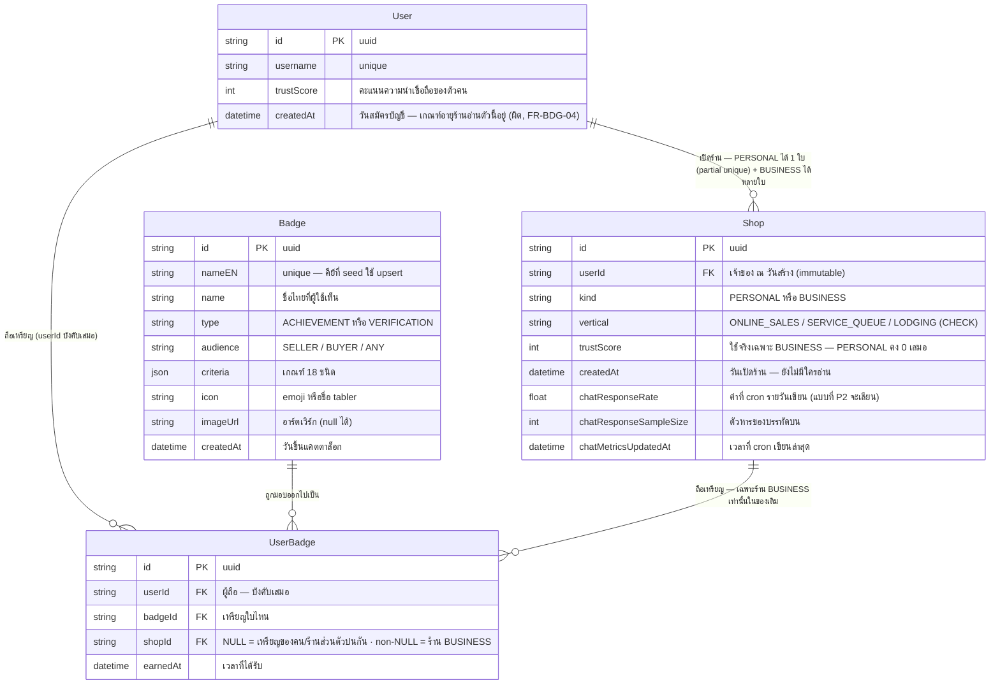
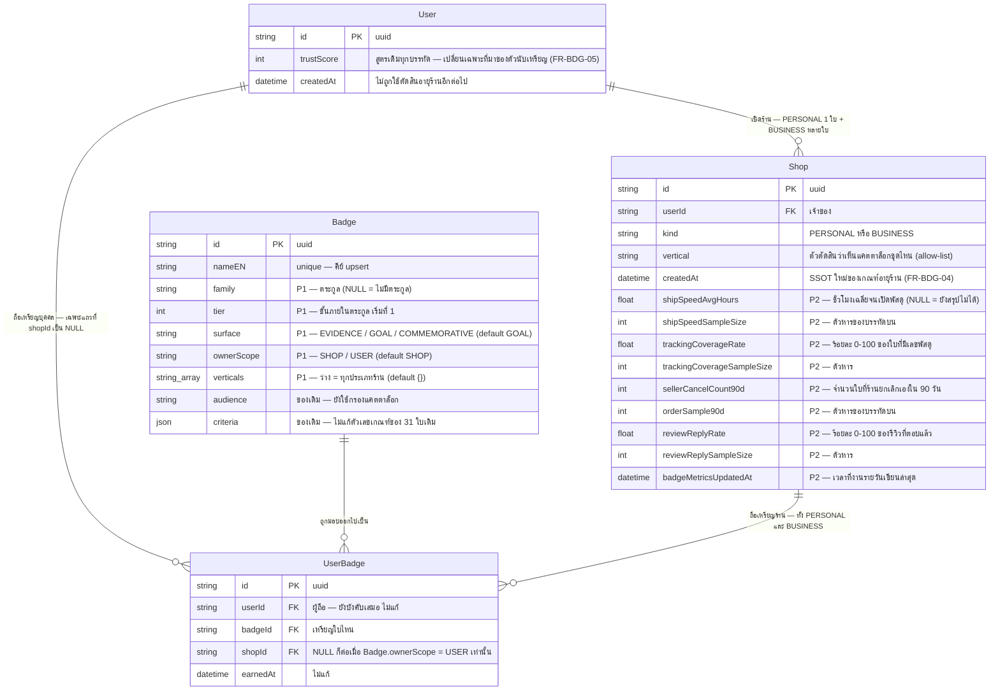

> **โมดูล:** 00052 — Badge & Achievement v2
> **ประเภทเอกสาร:** DATABASE Design
> **เวอร์ชัน:** 1.1
> **วันที่จัดทำ:** 2026-08-21
> **สถานะ:** Draft (ผลคิวรี pre-flight บน prod ยืนยันแล้ว 2026-08-21 · มติ OQ ครบทั้ง 7 ข้อ)
> **เจ้าของเอกสาร:** SA (ดู [[Feature-Docs-Ownership]])

# DATABASE: ระบบเหรียญตราและความสำเร็จ รุ่นที่ 2

---

## 1. Overview

เอกสารนี้กำหนดโครงสร้างข้อมูลของฟีเจอร์ 00052 ซึ่งแบ่งเป็น 4 เฟส โดย **เฟส P1 เป็นเฟสเดียวที่แตะข้อมูลจริงบน prod** (BR-BDG2-35) และเฟส P2 เพิ่มที่เก็บผลการประเมินรายวัน ส่วน P3/P4 เป็นงานหน้าจอที่ **ไม่มีการเปลี่ยนแปลงโครงสร้างข้อมูลเลย** — อ่านจากสิ่งที่ P1/P2 วางไว้ทั้งหมด

สิ่งที่เปลี่ยนมี 3 ก้อน ไม่มีตารางใหม่แม้แต่ตารางเดียว:

| ก้อน | เฟส | สรุป |
|------|-----|------|
| `Badge` — คุณสมบัติของ *ตัวเหรียญ* | P1 | เพิ่ม **5 คอลัมน์** แบบ additive: `family` · `tier` · `surface` · `ownerScope` · `verticals` (FR-BDG-01) |
| `UserBadge` — *เหรียญที่ได้รับ* | P1 | **ไม่แก้โครงสร้างแม้แต่คอลัมน์เดียว** — backfill ข้อมูลอย่างเดียว (ย้ายเจ้าของ + ล้าง 3 แถวค้าง) (FR-BDG-02/03) |
| `Shop` — ผลประเมินรายวันของเหรียญสถานะ | P2 | เพิ่ม 9 คอลัมน์ additive nullable ตามแบบ `chatResponseRate`/`chatResponseSampleSize`/`chatMetricsUpdatedAt` (FR-BDG-20) |

- **เอกสารออกแบบต้นทาง:** ยังไม่มี `SDS.md` ของโมดูลนี้ ณ วันจัดทำ — เอกสารฉบับนี้ trace กลับ `BRD.md` (FR-BDG-01 ถึง FR-BDG-27) และ `PRD.md` (BR-BDG2-01 ถึง BR-BDG2-37) แทน และต้องถูก trace ซ้ำอีกครั้งเมื่อ SDS เขียนเสร็จ (ดู §7)
- **Store ที่เกี่ยวข้อง:** PostgreSQL 16 store เดียว ผ่าน Prisma ORM — prod ฝากไว้บน Supabase · dev เป็น Postgres ใน Docker ที่ `localhost:5434` (แยกฐานกันแล้วตั้งแต่ 2026-08) ไม่มี store ที่สอง ไม่มีปัญหา consistency ข้าม store
- **Engine / Charset:** PostgreSQL 16 · UTF-8 · `uuid` เป็น `TEXT` ตาม convention เดิมของทุกตารางในรีโปนี้ (`@id @default(uuid())`)

🛑 **ข้อบังคับที่ครอบทั้งเอกสาร:** ทั้ง `UserBadge` และ `Shop` พึ่ง **unmanaged SQL** ที่ Prisma DSL ประกาศไม่ได้ — partial unique index 2 ตัวบน `UserBadge`, `Shop_userId_personal_key`, และ `Shop_vertical_check` ⇒ **ห้าม `prisma db pull` / `prisma migrate dev` / `migrate reset` / `db push` กับฟีเจอร์นี้เด็ดขาด** (Hard Rule 13/14) เพราะ introspection มองไม่เห็นแล้วจะสร้าง migration ที่ DROP มันทิ้ง ผลคือเหรียญซ้ำได้ทันทีโดยไม่มีอะไรฟ้อง (PRD §6.2) ทุก migration ของฟีเจอร์นี้ **เขียนมือ** และเป็น **additive** เท่านั้น

---

## 2. ERD

### 2.1 ก่อนเปลี่ยน (สภาพปัจจุบันบน prod 2026-08-21)



**สิ่งที่ ERD นี้บอกและเป็นต้นเหตุของงาน P1:** ช่อง `UserBadge.shopId = NULL` วันนี้แบก **สองความหมายในคอลัมน์เดียว** — ทั้ง "เหรียญของตัวคน" และ "เหรียญผลงานของร้านส่วนตัว" ⇒ คำถาม "ร้านนี้มีเหรียญอะไร" ตอบไม่ตรงกันระหว่างร้านสองประเภท (PRD §3.2)

### 2.2 หลังเปลี่ยน (จบ P1 + P2)



**invariant ใหม่ที่ ERD นี้ประกาศ (ทั้งคู่ต้องเป็น 0 แถวหลัง P1):**
1. `Badge.ownerScope = 'SHOP'` ⇒ `UserBadge.shopId IS NOT NULL` เสมอ (BR-BDG-01)
2. `Badge.ownerScope = 'USER'` ⇒ `UserBadge.shopId IS NULL` เสมอ (BR-BDG-02)

> **ไม่มีคอลัมน์บอกชนิดเหรียญ (เหรียญเหตุการณ์ / เหรียญสถานะ) ใน ERD นี้โดยตั้งใจ** — ชนิดเหรียญอ่านจาก **นิยามตระกูลชุดเดียวในโค้ด** ตาม FR-BDG-01 AC ข้อสุดท้าย (มติ OQ-2, ดู §3.1 หมายเหตุข้อ 2)

---

## 3. Tables

### 3.1 `Badge` (PostgreSQL — แคตตาล็อกเหรียญ, 31 แถวบน prod)

ตารางนี้เก็บ **ตัวเหรียญ** ไม่ใช่การได้รับ — 1 แถว = 1 รายการในแคตตาล็อก งาน P1 เพิ่ม 5 คอลัมน์เพื่อให้ระบบตอบได้ว่าเหรียญใบหนึ่ง "อยู่ตระกูลไหน ขั้นเท่าไร ขึ้นโปรไฟล์ได้ไหม เป็นของใคร และร้านประเภทไหนเห็น" ซึ่งวันนี้ตอบไม่ได้เลยสักข้อ

| Column | Type | Null | Default | Key |
|--------|------|------|---------|-----|
| `id` | `text` | `NO` | `uuid()` | `PK` |
| `name` | `text` | `NO` | `-` | `-` |
| `nameEN` | `text` | `NO` | `-` | `UNIQUE` |
| `icon` | `text` | `YES` | `NULL` | `-` |
| `imageUrl` | `text` | `YES` | `NULL` | `-` |
| `type` | `text` | `NO` | `-` | `-` |
| `criteria` | `jsonb` | `NO` | `-` | `-` |
| `audience` | `text` | `NO` | `'SELLER'` | `-` |
| `createdAt` | `timestamp(3)` | `NO` | `now()` | `-` |
| `family` | `text` | `YES` | `NULL` | `IDX (ไม่สร้าง — ดู §4)` |
| `tier` | `integer` | `YES` | `NULL` | `-` |
| `surface` | `text` | `NO` | `'GOAL'` | `CHECK` |
| `ownerScope` | `text` | `NO` | `'SHOP'` | `CHECK` |
| `verticals` | `text[]` | `NO` | `'{}'` | `CHECK` |

**นิยามและเหตุผลของแต่ละคอลัมน์ใหม่:**

| คอลัมน์ | นิยาม | ทำไม nullable / ทำไมมี default แบบนี้ |
|---------|------|----------------------------------------|
| `family` | คีย์ของตระกูลที่เหรียญใบนี้สังกัด — เหรียญที่วัดเรื่องเดียวกันคนละระดับใช้คีย์เดียวกัน (BR-BDG2-06/08) | **nullable** เพราะ (1) การเพิ่มคอลัมน์ NOT NULL บนตารางที่มี 31 แถวจริงต้องมี default ซึ่งจะกลายเป็นคีย์ตระกูลปลอมทันทีที่ backfill พลาด — ยอมให้ NULL แล้วบังคับด้วยคิวรีตรวจ "แถวที่ family เป็น NULL = 0" (FR-BDG-01 AC-2) ดีกว่าปล่อยให้ทุกแถวมีค่าที่ *ดูเหมือนถูก* (2) BR-BDG2-09 ประกาศไว้เองว่า "เหรียญที่ไม่มีตระกูลไม่อยู่ใต้กติกาการยุบขั้น" ⇒ ภาษาโดเมนยอมรับสภาพ "ไม่มีตระกูล" อยู่แล้ว NULL จึงเป็นค่าที่มีความหมายจริง ไม่ใช่ค่าที่หายไป |
| `tier` | ตำแหน่งของเหรียญภายในตระกูล เริ่มที่ 1 ยิ่งสูงยิ่งยาก (คำว่า "ระดับ" สงวนให้การยืนยันตัวตน · "tier" ในภาษาผู้ใช้สงวนให้ระดับความน่าเชื่อถือ — `CONTEXT.md`) | **nullable** ด้วยเหตุผลเดียวกับ `family` และเพราะทั้งคู่ต้อง **มีหรือไม่มีพร้อมกัน** (เหรียญไม่มีตระกูลก็ไม่มีขั้น) — invariant นี้ตรวจด้วยคิวรี V-6 ไม่ใช่ด้วย NOT NULL |
| `surface` | เหรียญใบนี้ไปโผล่ที่ไหน: `EVIDENCE` ขึ้นหน้าร้านสาธารณะได้ · `GOAL` เห็นเฉพาะเจ้าของร้าน · `COMMEMORATIVE` เหรียญที่ระลึกที่แสดงได้แต่ไม่นับเป็นหลักฐานและไม่กินโควตา 4 ช่อง (BR-BDG-10/13) | **NOT NULL + default `'GOAL'`** โดยตั้งใจ — `GOAL` คือค่าที่ปลอดภัยที่สุด (ไม่ขึ้นหน้าสาธารณะ) ตรงกับ BR-BDG-20 ที่สั่งว่าค่าที่ระบบไม่รู้จักต้องถูกปฏิบัติเป็นเหรียญเป้าหมาย ⇒ **เหรียญใบใหม่ที่ใครลืมตั้งค่า จะเงียบอยู่หลังบ้าน ไม่ใช่หลุดขึ้นหน้าร้าน** ทิศทางของความผิดพลาดถูกเลือกไว้แล้วตั้งแต่ระดับ schema |
| `ownerScope` | เจ้าของแถว `UserBadge` ของเหรียญใบนี้คือใคร: `SHOP` เขียน `shopId` เสมอ · `USER` เว้น `shopId` เป็น NULL เสมอ (BR-BDG-01/02) | **NOT NULL + default `'SHOP'`** เพราะ 22 จาก 31 ใบเป็นเหรียญร้าน และเหรียญใบใหม่ในรอบนี้ **ทุกใบ** เป็นเหรียญร้าน ⇒ default ที่ตรงกับกรณีที่พบบ่อยที่สุด ลดโอกาสที่คนเพิ่มเหรียญใหม่ต้องจำ · ค่านี้เป็น **ตัวบังคับฝั่งเขียนของ `awardBadge()`** ไม่ใช่ป้ายอธิบาย |
| `verticals` | รายชื่อประเภทร้านที่เห็นเหรียญใบนี้ — **ว่าง `{}` = ทุกประเภทร้าน** | **NOT NULL + default `'{}'`** มิเรอร์ `Shop.categories`/`Shop.salesChannels` ที่เป็น `String[] @default([])` อยู่แล้ว · เลือกให้ "ว่าง = ทุกประเภท" เพราะทำให้ **BR-BDG-19 (ค่าประเภทร้านที่ไม่รู้จักต้องได้ชุดกลาง 7 ตระกูล) เกิดขึ้นเองจากรูปร่างของข้อมูล**: ร้าน vertical มั่วจะ match เฉพาะแถวที่ `verticals = {}` ซึ่งคือชุดกลางเป๊ะ ๆ ไม่ต้องพึ่ง fallback ที่เขียนมือแล้วอาจลืม |

**หมายเหตุที่ต้องอ่านให้จบก่อนแตะตารางนี้:**

1. 🛑 **`ownerScope` ทับซ้อนกับ `audience` ที่มีอยู่แล้ว** — ณ 2026-08-21 ทั้ง 31 แถวเป็นไปตามสูตร `ownerScope = (audience = 'SELLER') ? 'SHOP' : 'USER'` เป๊ะทุกใบ ⇒ ค่าใหม่นี้ *derive ได้ทั้งหมด* ในวันนี้ (Hard Rule 16: หนึ่งความหมาย หนึ่งนิยาม) เหตุผลที่ยังเก็บเป็นคอลัมน์คือ `audience` ตอบคำถาม *"ใครเห็นเหรียญนี้ในแคตตาล็อก"* ส่วน `ownerScope` ตอบ *"แถวที่มอบไปแล้วเป็นของใคร"* ซึ่งจะแยกจากกันทันทีที่มีเหรียญ `audience='ANY'` ที่เป็นของร้าน **ข้อบังคับ:** ต้องมีเทส `[blocker]` ที่ยืนยันสูตรข้างบนกับทุกแถวในแคตตาล็อก และ **แดงเมื่อมีแถวที่แหกสูตรโดยไม่มีคอมเมนต์กำกับ** ไม่ใช่ปล่อยให้สองคอลัมน์ลอยจากกันเงียบ ๆ
2. 🛑 **ไม่มีคอลัมน์ `nature` และห้ามเพิ่มภายหลังโดยไม่กลับมาแก้เอกสารนี้ (มติ OQ-2, 2026-08-21)** — FR-BDG-01 AC ข้อสุดท้ายเขียนตรงตัวว่าชนิดเหรียญ (เหรียญเหตุการณ์ / เหรียญสถานะ) "อ่านจาก **นิยามตระกูลชุดเดียวในโค้ด** ไม่ใช่เดาจากรูปแบบของเกณฑ์ และ **ไม่ใช่คอลัมน์ใหม่ใน `Badge`**" และเหตุผลนั้นยืนได้ด้วยตัวเอง: **งานรายวันเป็น TypeScript** จึง `import` map `ตระกูล → ชนิด` จากโค้ดได้ตรง ๆ ไม่มีคิวรีไหนที่จำเป็นต้องกรองด้วยชนิดที่ระดับฐานข้อมูล ⇒ การเพิ่มคอลัมน์จะสร้าง **ผู้เขียนความจริงรายที่สอง** ให้กับค่าที่มี SSOT อยู่แล้ว ซึ่งเป็นรูปแบบที่ Hard Rule 16 ห้ามไว้ตรงตัว
   🛑 **แต่ invariant ที่คอลัมน์นี้เคยจะแบก ต้องคงอยู่ในรูปใหม่:** *"ตระกูลที่ถูกประกาศเป็นเหรียญสถานะ มีได้เฉพาะตระกูลที่มี **คู่คอลัมน์ค่า+ตัวหารบน `Shop` จริง**"* — วันนี้คือ 4 ตระกูล: `NO_SELLER_CANCEL` · `REVIEW_REPLY` · `SHIP_SPEED` · `TRACKING_COVERAGE` **บังคับด้วยเทส `[blocker]` ที่อ่าน map ตระกูลในโค้ด แล้วเทียบกับรายชื่อคอลัมน์จริง ไม่ใช่ด้วย CHECK** (CHECK ทำไม่ได้อยู่แล้วเพราะเป็นกฎข้ามตาราง) ⇒ ใครประกาศตระกูลใหม่เป็นเหรียญสถานะโดยไม่เพิ่มคอลัมน์ = เทสแดงทันที · ถ้าไม่มีเทสตัวนี้ อาการคือ งานรายวันประเมินด้วยค่าที่ไม่มีอยู่ แล้วเหรียญหลุดจากโปรไฟล์ตลอดกาลโดยไม่มีอะไรฟ้อง (FR-BDG-20 AC ข้อสุดท้าย)
3. 🛑 **ค่าที่สามของ `surface` คือ `COMMEMORATIVE` ไม่ใช่ `KEEPSAKE` (มติ OQ-1, 2026-08-21)** — BRD FR-BDG-01 ผ่านรีวิวจากเจ้าของงานแล้วและใช้ `COMMEMORATIVE` มาตลอด ส่วน `KEEPSAKE` เป็นค่าที่ถูกคิดขึ้นทีหลังโดยไม่ได้เทียบกับ AC ⇒ **contract ที่เคยล็อกไว้ผิด BRD ถูก** เอกสารฉบับนี้ยึด `COMMEMORATIVE` ทุกจุด รวมถึงชื่อค่าใน `Badge_surface_check` และ **ห้ามมีคำว่า `KEEPSAKE` เหลืออยู่ในโค้ด เอกสาร หรือ migration ของฟีเจอร์นี้แม้แต่ที่เดียว** (ค่าเดียวกันสองชื่อคือหนี้ที่จะถูกค้นพบตอนมีคนเขียนโค้ดตามเอกสารผิดฉบับ)
4. `criteria`/`type`/`audience`/`icon`/`imageUrl` **ไม่ถูกแก้เลยใน P1** — ตัวเลขเกณฑ์ของ 31 ใบเดิมห้ามขยับ (BR-BDG-09/FR-BDG-17 AC-5) การเปลี่ยนเกณฑ์ของ Zero Complaint · Spotless 100 · Speed Demon · Same-Day Hero ให้เป็นหน้าต่าง 90 วัน เป็นงาน **P2** และทำที่ `criteria` พร้อมกับตัวประเมิน ไม่ใช่ที่ P1

**ค่าที่ 31 แถวเดิมต้องได้หลัง P1** (ตารางนี้คือข้อมูลที่ migration ข้อ 1 เขียน — คีย์คือ `nameEN` ซึ่ง `@unique`):

| `nameEN` | `family` | `tier` | `surface` | `ownerScope` | `verticals` |
|---|---|---|---|---|---|
| First Sale | `ORDER_VOLUME` | 1 | GOAL | SHOP | `{}` |
| Getting Started | `ORDER_VOLUME` | 2 | GOAL | SHOP | `{}` |
| Rising Seller | `ORDER_VOLUME` | 3 | GOAL | SHOP | `{}` |
| Trusted Seller 50 | `ORDER_VOLUME` | 4 | GOAL | SHOP | `{}` |
| Century Club | `ORDER_VOLUME` | 5 | **EVIDENCE** | SHOP | `{}` |
| 3 Months Strong | `SHOP_TENURE` | 1 | GOAL | SHOP | `{}` |
| Veteran | `SHOP_TENURE` | 3 | **EVIDENCE** | SHOP | `{}` |
| Zero Complaint | `NO_SELLER_CANCEL` | 1 | **EVIDENCE** | SHOP | `{}` |
| Spotless 100 | `NO_SELLER_CANCEL` | 2 | **EVIDENCE** | SHOP | `{}` |
| Well Rated | `REVIEW_RATING` | 1 | GOAL | SHOP | `{}` |
| Highly Rated | `REVIEW_RATING` | 2 | GOAL | SHOP | `{}` |
| Perfect Rating | `REVIEW_RATING` | 3 | GOAL | SHOP | `{}` |
| Getting Noticed | `REVIEWER_COUNT` | 1 | GOAL | SHOP | `{}` |
| Community Favorite | `REVIEWER_COUNT` | 2 | GOAL | SHOP | `{}` |
| Speed Demon | `SHIP_SPEED` | 1 | **EVIDENCE** | SHOP | `{ONLINE_SALES}` |
| Same-Day Hero | `SHIP_SPEED` | 2 | **EVIDENCE** | SHOP | `{ONLINE_SALES}` |
| Fully Verified | `IDENTITY_VERIFIED` | 1 | GOAL | **USER** | `{}` |
| 2026_BADGE | `FOUNDING_MEMBER` | 1 | **COMMEMORATIVE** | **USER** | `{}` |
| First Auctioneer | `AUCTION_HOST` | 1 | GOAL | SHOP | `{ONLINE_SALES}` |
| Auction Host 10 | `AUCTION_HOST` | 2 | GOAL | SHOP | `{ONLINE_SALES}` |
| First Auction Win | `AUCTION_CLOSE` | 1 | GOAL | SHOP | `{ONLINE_SALES}` |
| Auction Closer 10 | `AUCTION_CLOSE` | 2 | GOAL | SHOP | `{ONLINE_SALES}` |
| Auction Pro 50 | `AUCTION_CLOSE` | 3 | GOAL | SHOP | `{ONLINE_SALES}` |
| Bid Magnet | `AUCTION_HYPE` | 1 | GOAL | SHOP | `{ONLINE_SALES}` |
| First Bidder | `AUCTION_BID` | 1 | GOAL | **USER** | `{}` |
| Active Bidder | `AUCTION_BID` | 2 | GOAL | **USER** | `{}` |
| First Winner | `AUCTION_WIN` | 1 | GOAL | **USER** | `{}` |
| Winner's Circle | `AUCTION_WIN` | 2 | GOAL | **USER** | `{}` |
| Auction Completer | `AUCTION_COMPLETE` | 1 | GOAL | **USER** | `{}` |
| Bid Cheerer | `AUCTION_ENGAGE` | 1 | GOAL | **USER** | `{}` |
| Auction Watcher | `AUCTION_ENGAGE` | 2 | GOAL | **USER** | `{}` |

รวม: **EVIDENCE 6 ใบ · COMMEMORATIVE 1 ใบ · GOAL 24 ใบ** · **ownerScope=USER 9 ใบ · SHOP 22 ใบ** · **verticals={ONLINE_SALES} 8 ใบ · {} 23 ใบ**

> คีย์ `family` ทั้ง 17 ตัวเป็น **ข้อเสนอ** ให้ SRS/SDS เคาะชื่อสุดท้าย (BRD ระบุตระกูลเป็นภาษาไทย ซึ่งเก็บเป็นคีย์ในฐานข้อมูลไม่ได้) แต่ **จำนวนตระกูลและการจับคู่ใบ→ตระกูลห้ามเปลี่ยน** เพราะมันมาจาก §2.4.1 ของ BRD และ D-BDG-2

> **ชนิดของแต่ละตระกูล (เหรียญเหตุการณ์ / เหรียญสถานะ) ไม่อยู่ในตารางนี้เพราะไม่ได้เก็บในฐานข้อมูล** — อยู่ใน map ตระกูลในโค้ด โดยตระกูลที่เป็น **เหรียญสถานะ** มี 4 ตัวเท่านั้น (`NO_SELLER_CANCEL` · `REVIEW_REPLY` · `SHIP_SPEED` · `TRACKING_COVERAGE`) ซึ่งตรงกับ 4 คู่คอลัมน์บน `Shop` ใน P2 พอดี และเป็นความตรงที่ต้องมีเทสผูกไว้ (§3.1 หมายเหตุข้อ 2)

### 3.2 `UserBadge` (PostgreSQL — เหรียญที่ได้รับ, 63 แถวบน prod)

🛑 **โครงสร้างไม่เปลี่ยนแม้แต่คอลัมน์เดียว** (BRD §7.2 · FR-BDG-01 AC-5) — ไม่มีคอลัมน์ใหม่ · ไม่ถอด index · ไม่แตะ FK · งานที่ทำกับตารางนี้คือ **backfill ค่าใน `shopId` เท่านั้น** เขียนไว้ที่นี่เพื่อให้เอกสารมีรูปตารางครบ และเพื่อกันคนอ่านสรุปเองว่า "ไม่มีอยู่ในเอกสาร = ไม่ต้องสนใจ"

| Column | Type | Null | Default | Key |
|--------|------|------|---------|-----|
| `id` | `text` | `NO` | `uuid()` | `PK` |
| `userId` | `text` | `NO` | `-` | `FK → User.id` (`ON DELETE CASCADE`) |
| `badgeId` | `text` | `NO` | `-` | `FK → Badge.id` (`ON DELETE CASCADE`) |
| `shopId` | `text` | `YES` | `NULL` | `FK → Shop.id` (`ON DELETE CASCADE`) · `IDX` · partial `UNIQUE` |
| `earnedAt` | `timestamp(3)` | `NO` | `now()` | `-` |

**ความหมายของ `shopId` เปลี่ยน (แต่ชนิดข้อมูลไม่เปลี่ยน):**

| | ก่อน P1 | หลัง P1 |
|---|---|---|
| `NULL` | เหรียญของตัวคน **หรือ** เหรียญผลงานของร้านส่วนตัว (ปนกัน) | เหรียญของตัวคนเท่านั้น (`Badge.ownerScope = 'USER'`) |
| non-`NULL` | เหรียญของร้าน BUSINESS เท่านั้น | เหรียญผลงานของร้าน **ทุกประเภท** ทั้ง PERSONAL และ BUSINESS |

🛑 **`ON DELETE CASCADE` บน `shopId` คือความเสี่ยงที่เพิ่งถูกขยายขอบเขตโดย P1** — ก่อนหน้านี้ เหรียญของร้านส่วนตัวเป็นแถว `shopId = NULL` จึงรอดจากการลบร้าน หลัง backfill มันผูกกับแถว `Shop` แล้ว ⇒ **ใครก็ตามที่เพิ่ม physical `DELETE FROM "Shop"` ในอนาคต จะลบประวัติเหรียญของร้านนั้นทิ้งไปด้วยเงียบ ๆ ซึ่งละเมิด BR-BDG-05 โดยตรง** วันนี้ยังปลอดภัยเพราะ (1) `deleteAccount()` ใช้ soft delete (`deletedAt`) (2) `purgedAt` เป็น tombstone ไม่ใช่ DELETE จริง (3) `Order.shopId` เป็น `ON DELETE RESTRICT` จึงบล็อกการลบจริงอยู่แล้ว — **ทั้งสามข้อนี้เป็นสถานะปัจจุบัน ไม่ใช่ข้อรับประกันถาวร** ต้องบันทึกไว้ใน §6

### 3.3 `Shop` (PostgreSQL — เพิ่ม 9 คอลัมน์ใน P2)

คอลัมน์ชุดนี้เก็บ **ผลการประเมินเหรียญสถานะที่งานรายวันคำนวณไว้ล่วงหน้า** เพื่อให้หน้าร้านสาธารณะไม่ต้องไล่นับออเดอร์ 90 วันสด ๆ ทุกครั้งที่มีคนเปิด (FR-BDG-20) — เลียนแบบชุด `chatResponseRate`/`chatResponseSampleSize`/`chatMetricsUpdatedAt` ที่ทำงานแบบนี้อยู่แล้วตั้งแต่ feature 00011 ทั้ง **รูปแบบคอลัมน์ · ความเป็น nullable · และวิธีที่ cron เขียน**

| Column | Type | Null | Default | Key |
|--------|------|------|---------|-----|
| `shipSpeedAvgHours` | `double precision` | `YES` | `NULL` | `CHECK ≥ 0` |
| `shipSpeedSampleSize` | `integer` | `YES` | `NULL` | `CHECK ≥ 0` |
| `trackingCoverageRate` | `double precision` | `YES` | `NULL` | `CHECK 0–100` |
| `trackingCoverageSampleSize` | `integer` | `YES` | `NULL` | `CHECK ≥ 0` |
| `sellerCancelCount90d` | `integer` | `YES` | `NULL` | `CHECK ≥ 0` |
| `orderSample90d` | `integer` | `YES` | `NULL` | `CHECK ≥ 0` |
| `reviewReplyRate` | `double precision` | `YES` | `NULL` | `CHECK 0–100` |
| `reviewReplySampleSize` | `integer` | `YES` | `NULL` | `CHECK ≥ 0` |
| `badgeMetricsUpdatedAt` | `timestamp(3)` | `YES` | `NULL` | `-` |

**นิยามและเหตุผล:**

| คอลัมน์ | นิยาม | ทำไม nullable |
|---------|------|----------------|
| `shipSpeedAvgHours` | ชั่วโมงเฉลี่ยนับจากเวลาที่ออเดอร์ถูกสร้าง จนถึงเวลาที่เปิดพัสดุ เฉพาะออเดอร์ใน **หน้าต่าง 90 วันล่าสุด** (ตระกูล `SHIP_SPEED`) | **NULL = ยังสรุปไม่ได้** ทั้งกรณี "งานรายวันยังไม่เคยรัน" และ "ตัวอย่างไม่ถึงขั้นต่ำ 20 ใบ" — BR-BDG-15 ห้ามใช้ `0` แทน "ยังไม่รู้" เด็ดขาด และ `0` ในคอลัมน์นี้แปลว่า *ส่งไวจนเป็นศูนย์ชั่วโมง* ซึ่งเป็นค่าที่ดีที่สุดที่เป็นไปได้ ⇒ ใช้ `0` แทนความว่างเปล่าที่นี่คือการโกหกในทิศที่เป็นคุณกับร้าน |
| `shipSpeedSampleSize` | จำนวนใบที่ใช้เป็นตัวหารของบรรทัดบน | nullable คู่กันเสมอ — **BR-BDG-16 บังคับว่าทุกสัดส่วน/ค่าเฉลี่ยต้องมาคู่ตัวหาร** ค่าเฉลี่ยที่ไม่มีตัวหารคือเลขที่ตรวจสอบไม่ได้ (บทเรียน `partial-data-must-be-labeled-or-filled.md`: ค่าส่งขึ้น ฿328.88 จาก 31 ออเดอร์ที่มีราคาจริงแค่ 7 ใบ) |
| `trackingCoverageRate` | **ร้อยละ (0–100)** ของออเดอร์ที่ต้องจัดส่งซึ่งมีเลขพัสดุแล้ว ในหน้าต่าง 90 วัน (ตระกูล `TRACKING_COVERAGE`) | NULL = ยังสรุปไม่ได้ · หน่วยเป็นร้อยละ **ไม่ใช่สัดส่วน 0–1** (มติ OQ-5) เพื่อให้ตรงกับ `chatResponseRate` ที่ schema ประกาศไว้เองว่า `(0-100)` — สองหน่วยในตารางเดียวคือรูปแบบของ Hard Rule 16 ที่เกิดซ้ำได้ง่ายที่สุด และไม่มี `tsc`/build/เทสตัวไหนจับได้ |
| `trackingCoverageSampleSize` | ตัวหาร: จำนวนออเดอร์ที่ **ต้องจัดส่งจริง** ใน 90 วัน (ไม่ใช่จำนวนออเดอร์ทั้งหมด) | nullable คู่กัน · นิยาม "ต้องจัดส่ง" ต้องยืมจากตัวเดียวกับที่ระบบใช้อยู่ ห้ามเขียนสูตรซ้ำ (BR-BDG-17) |
| `sellerCancelCount90d` | จำนวนใบที่ **ร้านเป็นฝ่ายยกเลิกเอง** ใน 90 วันล่าสุด (ตระกูล `NO_SELLER_CANCEL`) | NULL = งานรายวันยังไม่เคยรันกับร้านนี้ · **`0` ที่นี่มีความหมายจริงและตรงข้ามกับ NULL โดยสิ้นเชิง** — `0` = "ไม่เคยยกเลิกเลย" ซึ่งคือเงื่อนไขที่ทำให้ *ได้* เหรียญ ⇒ ถ้าใช้ `0` เป็น default ตอน migrate ทุกร้านบน prod จะดูเหมือนผ่านเกณฑ์ทันทีตั้งแต่วินาทีที่ migration รัน ทั้งที่ยังไม่มีใครนับอะไรเลย **นี่คือเหตุผลเดี่ยว ๆ ที่ใหญ่ที่สุดว่าทำไมทั้ง 9 คอลัมน์ต้อง nullable** |
| `orderSample90d` | ตัวหารของบรรทัดบน: จำนวนออเดอร์สถานะปิดจบใน 90 วัน — ใช้ตัดสินว่าถึงขนาดตัวอย่างขั้นต่ำของขั้นไหน (20 / 100 / 300 ใบ) | nullable คู่กัน |
| `reviewReplyRate` | **ร้อยละ (0–100)** ของรีวิวที่ร้านตอบแล้ว ในหน้าต่าง 90 วัน (ตระกูล `REVIEW_REPLY`) | NULL = ยังสรุปไม่ได้ (ร้านที่ไม่มีรีวิวเลย = NULL ไม่ใช่ 0% — ร้านที่ไม่มีรีวิวไม่ได้ *ละเลย* รีวิว) |
| `reviewReplySampleSize` | ตัวหาร: จำนวนรีวิวใน 90 วัน | nullable คู่กัน |
| `badgeMetricsUpdatedAt` | เวลาที่งานรายวันเขียนค่าชุดนี้ล่าสุด | NULL = ยังไม่เคยรัน · **คอลัมน์นี้คือตัวเดียวที่ทำให้ "งานรายวันตาย" มองเห็นได้** — อาการของ cron ที่ตายคือ "ทุกอย่างดูปกติ" เพราะหน้าจอยังโชว์ค่าล่าสุดที่เคยเขียนไว้ (PRD §6.2) ⇒ KPI "0 ร้านที่ค่าเก่ากว่า 48 ชม." อ่านจากคอลัมน์นี้ตัวเดียว วัดด้วยวิธีเดียวกับ `chatMetricsUpdatedAt` |

> **ทำไมไม่มีคอลัมน์ให้ตระกูล `ORDER_VOLUME` / `SHOP_TENURE` / `SALES_VOLUME`:** ทั้งสามเป็น **เหรียญเหตุการณ์** — ได้แล้วเป็นจริงตลอดไป ไม่ถูกประเมินซ้ำ (BR-BDG-06) จึงไม่มีอะไรต้องเก็บ ค่าที่ใช้ตอนมอบเหรียญคำนวณสดตอนเกิดเหตุการณ์เหมือนที่ทำอยู่ทุกวันนี้

> **ทำไมไม่เพิ่ม CHECK ให้ 4 คอลัมน์ chat ของเดิมไปด้วย:** อยู่นอกขอบเขตฟีเจอร์นี้ — บันทึกไว้เป็นหนี้ที่มีอยู่ก่อน ไม่ใช่ของที่รอบนี้สร้าง

---

## 4. Indexes

### 4.1 index/constraint ที่มีอยู่แล้วและ **ต้องยังอยู่ครบหลังทุก migration**

| Table | Columns | Type | Rationale (query pattern ที่รองรับ) |
|-------|---------|------|--------------------------------------|
| `UserBadge` | `("userId","badgeId") WHERE "shopId" IS NULL` | `partial UNIQUE` (`UserBadge_userId_badgeId_personal_key`) | กันมอบซ้ำของ **เหรียญบุคคล** · รองรับคิวรี `where { userId, shopId: null }` ที่ `calcBadgeScore` เส้น personal และหน้าเหรียญฝั่งบุคคลใช้ · 🛑 **เป็น index ที่ M-2 พิสูจน์แล้วว่าจะถูกชนจริงถ้าลำดับขั้นตอน backfill ผิด** (ดู §5.1.2 ขั้น B1) — **unmanaged SQL ห้าม db pull** |
| `UserBadge` | `("shopId","badgeId") WHERE "shopId" IS NOT NULL` | `partial UNIQUE` (`UserBadge_shopId_badgeId_key`) | กันมอบซ้ำของ **เหรียญร้าน** · หลัง P1 ตัวนี้กลายเป็นด่านกันซ้ำของร้านส่วนตัวด้วย (เดิมร้านส่วนตัวพึ่งตัวบน) — **unmanaged SQL ห้าม db pull** |
| `UserBadge` | `("shopId")` | `BTREE` (`UserBadge_shopId_idx`) | ดึงเหรียญทั้งหมดของร้านหนึ่ง — **หลัง P1 กลายเป็นเส้นทางอ่านหลักของทั้งระบบ** เพราะเหรียญผลงานทุกใบย้ายมาอยู่ใต้ `shopId` |
| `Badge` | `("nameEN")` | `UNIQUE` | คีย์ที่ seed/migration ใช้ `upsert` — ทั้ง P1 และ P2 พึ่งตัวนี้เป็น conflict target |
| `Shop` | `("userId") WHERE "kind" = 'PERSONAL'` | `partial UNIQUE` (`Shop_userId_personal_key`) | 🛑 **เป็นสิ่งที่ทำให้ backfill ของ P1 กำหนดผลได้แน่นอน** — "ร้านส่วนตัวของ user คนนี้" มีได้ไม่เกิน 1 แถวเสมอ จึงไม่มีทางเลือกที่ต้องเดา ถ้า index นี้หายไป backfill จะกลายเป็นการสุ่มร้านทันที — **unmanaged SQL ห้าม db pull** |
| `Shop` | `("userId","kind")` | `BTREE` | ใช้ join หา personal shop ตอน backfill และตอน `calcBadgeScore` เส้น personal เวอร์ชันใหม่ |

### 4.2 index ใหม่ที่ฟีเจอร์นี้สร้าง

**ไม่มี** — พร้อมเหตุผลที่ตรวจสอบได้:

| ตัวที่พิจารณา | ทำไมไม่สร้าง |
|---|---|
| `Badge(family, tier)` | ตารางมี 31 แถว (จะเป็น 45 หลัง P2) — Postgres จะเลือก seq scan เสมอบนขนาดนี้ ไม่ว่ามี index หรือไม่ · index ที่ไม่มีวันถูกใช้คือค่าใช้จ่ายฝั่งเขียนล้วน ๆ · แคตตาล็อกถูกอ่านทั้งก้อนอยู่แล้วทุกครั้ง (`prisma.badge.findMany`) |
| `Badge(surface)` / `Badge(ownerScope)` | เหตุผลเดียวกัน — คาร์ดินาลิตี้ 3 และ 2 บน 45 แถว |
| `Badge(verticals)` GIN | precedent `Shop_categories_gin_idx` มีเพราะ `Shop` โตได้ไม่จำกัด แคตตาล็อกเหรียญไม่ใช่ |
| `Shop(badgeMetricsUpdatedAt)` | KPI ความสดสแกน 14 แถว · `chatMetricsUpdatedAt` ก็ไม่มี index มาตลอด (sibling parity) — ทบทวนใหม่เมื่อร้านเกิน ~5,000 ร้าน |
| `UserBadge(userId)` เดี่ยว ๆ | คิวรี `{ userId, shopId: null }` ใช้ partial unique ที่มีอยู่แล้วได้ (คอลัมน์นำคือ `userId` และ predicate ตรงกับ `WHERE` ของ index) |

### 4.3 CHECK constraint ใหม่ (unmanaged SQL — ต้องขึ้นทะเบียนในเอกสาร §6)

| Table | Constraint | นิยาม | Rationale |
|---|---|---|---|
| `Badge` | `Badge_surface_check` | `surface IN ('EVIDENCE','GOAL','COMMEMORATIVE')` | ค่าที่หลุดเข้ามาผิดคือค่าที่ทำให้เหรียญขึ้น/ไม่ขึ้นหน้าสาธารณะผิด — defense-in-depth คู่กับ fail-closed ฝั่งโค้ด (BR-BDG-20) precedent: `Shop_vertical_check` · **ยึด `COMMEMORATIVE` ตาม BRD (มติ OQ-1) ห้ามเขียน `KEEPSAKE`** |
| `Badge` | `Badge_ownerScope_check` | `ownerScope IN ('SHOP','USER')` | ค่านี้เป็นตัวบังคับฝั่งเขียนของ `awardBadge()` — ค่ามั่วแปลว่าเหรียญไปผูกผิดเจ้าของ |
| `Badge` | `Badge_verticals_check` | `verticals <@ ARRAY['ONLINE_SALES','SERVICE_QUEUE','LODGING']::text[]` | ยืมรายชื่อเดียวกับ `Shop_vertical_check` — ถ้าสองรายการนี้หลุดจากกัน จะมีเหรียญที่ไม่มีร้านประเภทไหนมองเห็นเลย และไม่มีอะไรฟ้อง (`{}` ผ่านเงื่อนไข `<@` อยู่แล้วจึงไม่ต้องมีข้อยกเว้น) |
| `Shop` | `Shop_badge_metrics_range_check` | ค่าสัดส่วนอยู่ใน 0–100 · ค่านับและตัวหาร `>= 0` · ทุกเงื่อนไขยอม `NULL` | ทุกแถวเป็น `NULL` ตอน migrate ⇒ VALIDATE ผ่านทันที ไม่มีความเสี่ยง |

> **CHECK บน `Badge` มี 3 ตัว ไม่ใช่ 4** — ไม่มี `Badge_nature_check` เพราะไม่มีคอลัมน์ `nature` (มติ OQ-2) · invariant เรื่องชนิดเหรียญเป็น **กฎข้ามตาราง** (ตระกูลสถานะ ↔ คอลัมน์บน `Shop`) ซึ่ง CHECK บังคับไม่ได้อยู่แล้ว จึงบังคับด้วยเทส `[blocker]` ตาม §3.1 หมายเหตุข้อ 2

🛑 **ทุก CHECK ข้างบนต้องเขียนตาม `docs/conventions/migration-check-constraint-additive.md`** — คือ **อ่านนิยามเดิมจาก `pg_constraint` มาต่อท้าย ห้าม hardcode รายชื่อแล้ว DROP/ADD ตรง ๆ** scope ด้วย `conrelid` · idempotent · `NOT VALID` แล้วค่อย `VALIDATE` แยกคำสั่ง เหตุผลไม่ใช่ทฤษฎี: 2026-08-06 migration สอง branch ที่ timestamp ชนกันลบค่าของกันเองเงียบ ๆ โดยที่ `migrate deploy` รายงานว่าสำเร็จทุกไฟล์ แล้วไปโผล่เป็น insert ล้มบนฐานจริง

> ตรวจแล้ว ณ 2026-08-21: ไม่มี migration ของ branch ไหนใช้ timestamp `20260821*` (`git log --all --name-only --pretty=format: -- 'prisma/migrations/*'`) — ต้องตรวจซ้ำอีกครั้งก่อนตั้งชื่อโฟลเดอร์จริง

---

## 5. Migration Plan

### 5.1 ลำดับการ Migrate

| ลำดับ | การเปลี่ยนแปลง | เฟส | หมายเหตุ (dependency) |
|-------|----------------|-----|------------------------|
| 0 | **Pre-flight: รันคิวรีสำรวจ M-0 ถึง M-6 บน prod (อ่านอย่างเดียว)** | P1 | ไม่มี dependency · **รันแล้วบน prod 2026-08-21 — ผลอยู่ใน §5.1.1** · ต้องรันซ้ำอีกครั้งในวันที่จะ push จริง เพราะข้อมูลเปลี่ยนทุกวัน |
| 1 | `20260821090000_badge_v2_taxonomy` — เพิ่ม 5 คอลัมน์บน `Badge` + 3 CHECK + backfill ค่าของ 31 แถวเดิมตามตาราง §3.1 | P1 | ต้องมาก่อนลำดับ 2 เสมอ เพราะ backfill ของ `UserBadge` ตัดสินฝั่งเจ้าของจาก `Badge.ownerScope` ที่ไฟล์นี้เขียน |
| 2 | `20260821091000_badge_v2_owner_backfill` — สำรองข้อมูลเดิม → ลบแถวซ้ำ → ล้าง `shopId` ของเหรียญบุคคล → ย้ายเหรียญร้านส่วนตัวเข้า `shopId` → ตรวจในทรานแซกชันเดียวกัน | P1 | **ขึ้นกับลำดับ 1** · เป็นไฟล์เดียวที่แตะข้อมูลผู้ใช้จริง 63 แถว · อยู่ใน **คอมมิตเดียวกับลำดับ 1** (FR-BDG-02 AC-4) |
| 3 | แก้โค้ด: `calcBadgeScore` เส้น personal, `checkVeteran` อ่าน `Shop.createdAt`, ด่านฝั่งเขียนใน `awardBadge()`, map ตระกูล→ชนิด ในโค้ด | P1 | **ต้อง deploy พร้อมลำดับ 2 ในคอมมิตเดียวกัน** — ถ้า migration ขึ้นก่อนโค้ด คะแนนเหรียญเส้น personal จะเห็น 0 ทันที (D-BDG-1) |
| 4 | `20260822090000_shop_badge_metrics` — เพิ่ม 9 คอลัมน์บน `Shop` + 1 CHECK | P2 | ไม่มี dependency กับ P1 ในเชิงเทคนิค แต่ **BR-BDG2-35 ห้ามเริ่มก่อน P1 จบและพิสูจน์ผลแล้ว** |
| 5 | `20260822091000_badge_v2_catalog_rows` — เพิ่มเหรียญใหม่ 14 ใบเข้าแคตตาล็อกแบบ idempotent (`INSERT ... ON CONFLICT ("nameEN") DO UPDATE`) | P2 | ต้องหลังลำดับ 1 (คอลัมน์ต้องมีก่อน) · **ดู §5.5 — นี่คือทางเดียวที่เหรียญใหม่ขึ้น prod ได้ สคริปต์ seed ไปไม่ถึงแล้ว** |
| 6 | ไม่มีการเปลี่ยนแปลงฐานข้อมูลใน P3 และ P4 | P3/P4 | ทั้งสองเฟสอ่านจากสิ่งที่ P1/P2 วางไว้ล้วน ๆ |

#### 5.1.1 คิวรี Pre-flight และ **ผลจริงบน prod 2026-08-21**

> ผลด้านล่างมาจากการรันจริงบน prod แบบอ่านอย่างเดียว — ไม่ใช่ค่าที่คาดการณ์ · **ตัวเลขที่เป็น 0 คือเหตุผลให้มั่นใจว่า migration จะผ่าน ไม่ใช่เหตุผลให้ถอดด่านออก** ด่านทุกตัวใน §5.1.2 ต้องอยู่ครบทุกบรรทัด เพราะข้อมูลในวันที่รันจริงไม่จำเป็นต้องเหมือนวันนี้

```sql
-- M-0 · ฐานอ้างอิง
SELECT (SELECT count(*) FROM "Badge")     AS badge_rows,
       (SELECT count(*) FROM "UserBadge") AS userbadge_rows,
       (SELECT count(*) FROM "Shop")      AS shop_rows,
       (SELECT count(*) FROM "User")      AS user_rows;
```
**ผลจริง:** `31 / 63 / 14 / 52` — ตรงกับตัวเลขที่ PRD ใช้ตั้งเกณฑ์ทุกตัว (ร้าน 14 แถว = BUSINESS 6 · PERSONAL 8 · แยกตามประเภทกิจการ: SERVICE_QUEUE 3 · LODGING 0 · ที่เหลือ ONLINE_SALES)

```sql
-- M-1 · แถวเหรียญร้านที่แมปเข้าร้านไม่ได้เลย (เจ้าของไม่มีร้านส่วนตัว)
SELECT ub.id, ub."userId", b."nameEN", ub."earnedAt"
FROM "UserBadge" ub
JOIN "Badge" b ON b.id = ub."badgeId"
WHERE ub."shopId" IS NULL
  AND b."nameEN" <> ALL (ARRAY[
    '2026_BADGE','Fully Verified','First Bidder','Active Bidder','First Winner',
    'Winner''s Circle','Auction Completer','Bid Cheerer','Auction Watcher'])
  AND NOT EXISTS (
    SELECT 1 FROM "Shop" s WHERE s."userId" = ub."userId" AND s."kind" = 'PERSONAL');
```
**ผลจริง: 0 แถว** ⇒ **ไม่มีเหรียญร้านใบไหนที่เจ้าของไม่มีร้านส่วนตัว** เคสที่เคยเป็นคำถามเปิด (OQ-6) **ไม่เกิดขึ้นจริงบนข้อมูลชุดนี้** · สอดคล้องกับที่อ่านจากโค้ด: แถว `shopId = NULL` ของเหรียญร้านทั้งหมดเกิดจากเส้นทางที่ derive ร้านส่วนตัวมาแล้ว (`getShopForUser`) จึงมีร้านปลายทางเสมอ
🛑 **แต่ด่าน D1 ใน §5.1.2 ต้องอยู่ครบ** — ระหว่างวันนี้ถึงวันที่ push มีคนสมัครใหม่/ได้เหรียญใหม่ได้ตลอด และด่านนี้คือสิ่งเดียวที่กันไม่ให้แถวที่แมปไม่ได้ถูกปล่อยผ่านไปเป็นเหรียญที่ไม่มีใครนับ

```sql
-- M-2 · เหรียญบุคคลที่มี shopId ค้าง และจะชนแถวเดิมของคนเดียวกันเมื่อล้าง shopId
SELECT r.id AS row_with_shop, r."earnedAt" AS earned_with_shop,
       n.id AS row_null,      n."earnedAt" AS earned_null,
       r."userId", b."nameEN"
FROM "UserBadge" r
JOIN "Badge" b ON b.id = r."badgeId"
JOIN "UserBadge" n
  ON n."userId" = r."userId" AND n."badgeId" = r."badgeId" AND n."shopId" IS NULL
WHERE r."shopId" IS NOT NULL
  AND b."nameEN" IN ('2026_BADGE','Fully Verified','First Bidder','Active Bidder',
                     'First Winner','Winner''s Circle','Auction Completer',
                     'Bid Cheerer','Auction Watcher');
```
**ผลจริง: 3 แถว** — ทั้ง 3 แถวของ `2026_BADGE` ที่มี `shopId` **มีแถว `shopId IS NULL` ของ user คนเดียวกันอยู่แล้วทุกใบ**
🛑 **นี่คือข้อค้นพบที่เปลี่ยนสถานะของขั้น B1 จาก "การกันเหนียว" เป็น "ขั้นตอนที่ขาดไม่ได้"** — ถ้าข้ามขั้น B1 แล้วสั่ง `UPDATE ... SET "shopId" = NULL` ตรง ๆ ทั้งสามแถวจะกลายเป็นแถวที่ซ้ำกับแถวเดิมของคนเดียวกันทันที ⇒ **ชน `UserBadge_userId_badgeId_personal_key` และ migration ตายทั้งไฟล์ที่ statement นั้น** (บน prod = build ล้ม = deploy ไม่ขึ้น) จำนวนแถวที่ขั้น B1 ลบ **ต้องเท่ากับ 3 พอดี** ไม่มากไม่น้อย และทุกแถวต้องปรากฏใน `_00052_p1_userbadge_backup` ด้วย `action = 'DELETE_DUP'`

```sql
-- M-3 · เหรียญร้านที่ย้ายแล้วจะชน UserBadge_shopId_badgeId_key
SELECT ub.id, ub."userId", b."nameEN", s.id AS personal_shop_id
FROM "UserBadge" ub
JOIN "Badge" b ON b.id = ub."badgeId"
JOIN "Shop" s ON s."userId" = ub."userId" AND s."kind" = 'PERSONAL'
WHERE ub."shopId" IS NULL
  AND b."nameEN" <> ALL (ARRAY[
    '2026_BADGE','Fully Verified','First Bidder','Active Bidder','First Winner',
    'Winner''s Circle','Auction Completer','Bid Cheerer','Auction Watcher'])
  AND EXISTS (SELECT 1 FROM "UserBadge" x
              WHERE x."shopId" = s.id AND x."badgeId" = ub."badgeId");
```
**ผลจริง: 0 แถว** ⇒ **ไม่มีการชน `UserBadge_shopId_badgeId_key`** สอดคล้องกับโค้ดปัจจุบันที่ไม่มีทางสร้างแถว `shopId = <ร้านส่วนตัว>` ได้เลย (`evaluateSellerBadgesForShop` ตั้ง `shopIdForAward = null` เมื่อ `kind !== 'BUSINESS'`)
🛑 **ด่าน C1 ยังต้องอยู่** — ถ้าวันหนึ่งมีเส้นทางใหม่ที่เขียน `shopId` ของร้านส่วนตัวได้ (ซึ่ง P1 นี่แหละคือสิ่งที่ทำให้มันเกิดขึ้น) ตัวเลขนี้จะไม่เป็น 0 อีกต่อไป และเราต้องได้รายชื่อ id ไม่ใช่ข้อความ error ที่บอกแค่ชื่อ index

```sql
-- M-4 · จำนวนแถวต่อผู้ใช้ "ก่อน" (เก็บผลไว้เทียบกับ V-1)
SELECT "userId", count(*) AS cnt FROM "UserBadge" GROUP BY "userId" ORDER BY "userId";
```
**ผลจริง:** เก็บไว้เป็นฐานเทียบ — ยอดรวม 63 แถว กระจายตาม PRD §3.1 (`2026_BADGE` 51 แถว + เหรียญผลสัมฤทธิ์ 12 แถว)

```sql
-- M-5 · คะแนนส่วนเหรียญของทุกร้าน "ก่อน" ตามตรรกะ calcBadgeScore ปัจจุบัน (1 ใบ = 1 คะแนน เพดาน 10)
SELECT s.id AS shop_id, s.kind,
  LEAST(10, CASE WHEN s.kind = 'BUSINESS'
    THEN (SELECT count(*) FROM "UserBadge" ub WHERE ub."shopId" = s.id)
    ELSE (SELECT count(*) FROM "UserBadge" ub
          WHERE ub."userId" = s."userId" AND ub."shopId" IS NULL) END) AS badge_score_before
FROM "Shop" s ORDER BY s.id;
```
**ผลจริง:** เก็บไว้เป็นฐานเทียบกับ V-3 — **ไม่มีร้านใดมีเหรียญถึงเพดาน 10 ใบ** ซึ่งเป็นข้อเท็จจริงที่ทำให้ผลของ M-6 มีนัยจริง (ถ้าร้านไหนถึงเพดาน การลด 1 ใบจะถูกเพดานกลืนไป)

```sql
-- M-6 · 3 แถวของ 2026_BADGE ที่มี shopId ค้าง อยู่กับร้านไหน และร้านนั้นจะเสียคะแนนไปกี่แต้ม
SELECT ub.id, ub."userId", ub."shopId", s.kind, s."shopName",
       (SELECT count(*) FROM "UserBadge" x WHERE x."shopId" = ub."shopId") AS shop_badge_count_before
FROM "UserBadge" ub
JOIN "Badge" b ON b.id = ub."badgeId"
JOIN "Shop" s ON s.id = ub."shopId"
WHERE b."nameEN" = '2026_BADGE' AND ub."shopId" IS NOT NULL;
```
**ผลจริง: 3 แถว ทั้งหมดอยู่กับร้าน `kind = 'BUSINESS'`**

| ร้าน | เหรียญก่อน | เหรียญหลัง | คะแนนส่วนเหรียญ ก่อน → หลัง |
|---|---|---|---|
| `BT Premium - สุขสวัสดิ์` | 2 ใบ | 1 ใบ | 2 → **1** |
| `ธนภัทร์ อะไหล่มอเตอร์ไซค์` | 7 ใบ | 6 ใบ | 7 → **6** |
| `BT Premium - คลอง 4 ธัญบุรี` | 6 ใบ | 5 ใบ | 6 → **5** |

**ทั้งสามร้านต่ำกว่าเพดาน 10 ⇒ คะแนนส่วนเหรียญลดลงจริงร้านละ 1 แต้ม** — ผลนี้ถูกยอมรับเป็นมติแล้ว (OQ-3) รายละเอียดและสิ่งที่ต้องทำตามมาอยู่ใน §5.3

#### 5.1.2 ลำดับ 2 โดยละเอียด — สคริปต์ backfill

🛑 **ข้อบังคับของ Hard Rule 13 ที่ใช้กับทุกบรรทัดในไฟล์นี้:** ห้ามมี `deleteMany()` ที่ไม่มี `where` · ห้าม `TRUNCATE` · ห้าม `DELETE FROM` ที่ไม่มี `WHERE` · ห้าม `DROP TABLE` — **การลบที่อนุญาตในไฟล์นี้มีที่เดียว** คือการลบแถวซ้ำตาม FR-BDG-03 AC-2 (ซึ่ง M-2 ยืนยันแล้วว่ามี 3 แถวจริง) และต้อง `DELETE ... WHERE "id" IN (...)` โดย id ที่ถูกคำนวณจากเงื่อนไขที่เขียนไว้ชัด **หลังจากที่แถวนั้นถูกคัดลอกลงตารางสำรองแล้วเท่านั้น**

**เขียนเป็น SQL ในไฟล์ migration ไม่ใช่สคริปต์ TypeScript แยก** ด้วยเหตุผล 3 ข้อ: (1) FR-BDG-02 AC-4 บังคับว่า backfill ต้องอยู่ในคอมมิตเดียวกับ migration (2) Prisma ห่อไฟล์ migration ด้วยทรานแซกชันบน Postgres ⇒ `RAISE EXCEPTION` = ย้อนกลับทั้งไฟล์เอง ไม่มีสภาพครึ่ง ๆ กลาง ๆ (3) **เครื่อง dev ไม่มี `DATABASE_URL` ของ prod** ⇒ สคริปต์ที่ต้องรันด้วยมือชี้ prod ทำไม่ได้จริงอยู่แล้ว (ดู §5.5)

**ขั้นตอนภายในไฟล์ ตามลำดับ:**

**ขั้น A — สำรองก่อนแตะ (เก็บค่าเดิมไว้ก่อนเขียนทับ ไม่ใช่หวังว่าจะคำนวณย้อนได้)**

```sql
CREATE TABLE IF NOT EXISTS "_00052_p1_userbadge_backup" (
  "id"        TEXT PRIMARY KEY,
  "userId"    TEXT NOT NULL,
  "badgeId"   TEXT NOT NULL,
  "shopId"    TEXT,               -- ค่าเดิมก่อนแก้ (ไม่มี FK โดยตั้งใจ — เป็นตารางหลักฐาน)
  "earnedAt"  TIMESTAMP(3) NOT NULL,
  "action"    TEXT NOT NULL,      -- 'CLEAR_SHOP' | 'SET_SHOP' | 'DELETE_DUP' | 'UNCHANGED'
  "newShopId" TEXT,
  "backedUpAt" TIMESTAMP(3) NOT NULL DEFAULT now()
);

-- สำรอง "ทุกแถว" ไม่ใช่เฉพาะแถวที่จะแก้ — 63 แถวมีต้นทุนเท่ากับศูนย์ และการสำรองเฉพาะแถวที่
-- คิดว่าจะแก้ แปลว่าถ้าเงื่อนไขคัดแถวผิด แถวที่ถูกแก้โดยไม่ตั้งใจจะไม่มีสำเนาให้กู้เลย
INSERT INTO "_00052_p1_userbadge_backup" ("id","userId","badgeId","shopId","earnedAt","action")
SELECT ub."id", ub."userId", ub."badgeId", ub."shopId", ub."earnedAt", 'UNCHANGED'
FROM "UserBadge" ub
ON CONFLICT ("id") DO NOTHING;   -- idempotent: รันซ้ำไม่ทับสำเนาต้นฉบับ
```

**ขั้น B — ลบแถวซ้ำก่อน แล้วค่อยล้าง `shopId` ของเหรียญบุคคล**

🛑 **ลำดับนี้กลับกันไม่ได้ และไม่ใช่ทฤษฎี — M-2 พิสูจน์แล้วว่ามี 3 แถวที่จะชนจริงบน prod** ถ้าล้าง `shopId` ก่อน จะชน `UserBadge_userId_badgeId_personal_key` ที่ statement นั้นทันที ทั้งไฟล์ถูกย้อนกลับ และบน prod แปลว่า build ล้ม deploy ไม่ขึ้น

```sql
-- B1 · แถวที่ต้องลบ: คู่ที่ซ้ำกัน เก็บใบที่ "ได้รับก่อน" (earnedAt น้อยกว่า; เสมอกันตัดสินด้วย id
--      เพื่อให้ผลกำหนดได้แน่นอนและรันซ้ำได้ผลเดิม) — FR-BDG-03 AC-2
WITH person_badges AS (
  SELECT id FROM "Badge" WHERE "ownerScope" = 'USER'
), pairs AS (
  SELECT r.id AS id_with_shop, n.id AS id_null,
         r."earnedAt" AS e_with, n."earnedAt" AS e_null
  FROM "UserBadge" r
  JOIN person_badges pb ON pb.id = r."badgeId"
  JOIN "UserBadge" n ON n."userId" = r."userId"
                    AND n."badgeId" = r."badgeId"
                    AND n."shopId" IS NULL
  WHERE r."shopId" IS NOT NULL
), losers AS (
  SELECT CASE WHEN (e_null, id_null) <= (e_with, id_with_shop)
              THEN id_with_shop ELSE id_null END AS loser_id
  FROM pairs
)
UPDATE "_00052_p1_userbadge_backup" bk
SET "action" = 'DELETE_DUP'
FROM losers WHERE bk."id" = losers.loser_id;

DELETE FROM "UserBadge"
WHERE "id" IN (SELECT "id" FROM "_00052_p1_userbadge_backup" WHERE "action" = 'DELETE_DUP');
```

```sql
-- B2 · ล้าง shopId ของเหรียญบุคคลที่เหลือ
UPDATE "_00052_p1_userbadge_backup" bk SET "action" = 'CLEAR_SHOP', "newShopId" = NULL
FROM "UserBadge" ub JOIN "Badge" b ON b.id = ub."badgeId"
WHERE bk."id" = ub."id" AND b."ownerScope" = 'USER' AND ub."shopId" IS NOT NULL;

UPDATE "UserBadge" ub SET "shopId" = NULL
FROM "Badge" b
WHERE b.id = ub."badgeId" AND b."ownerScope" = 'USER' AND ub."shopId" IS NOT NULL;
```

**ขั้น C — ย้ายเหรียญร้านเข้าร้านส่วนตัว**

```sql
-- C1 · ด่านกันชนก่อนเขียน: ถ้ามีแถวที่ย้ายแล้วจะชน unique ให้หยุดพร้อมรายชื่อ
--      (M-3 = 0 บน prod 2026-08-21 แต่ด่านนี้ต้องอยู่ — ปล่อยให้ชนเองก็ rollback เหมือนกัน
--       แต่ข้อความของ Postgres จะบอกแค่ชื่อ index ไม่บอกว่าแถวไหน แล้วต้องมาไล่หาเองบน prod)
DO $$
DECLARE n int; sample text;
BEGIN
  SELECT count(*), string_agg(ub."id", ',') INTO n, sample
  FROM "UserBadge" ub
  JOIN "Badge" b ON b.id = ub."badgeId"
  JOIN "Shop" s ON s."userId" = ub."userId" AND s."kind" = 'PERSONAL'
  WHERE ub."shopId" IS NULL AND b."ownerScope" = 'SHOP'
    AND EXISTS (SELECT 1 FROM "UserBadge" x WHERE x."shopId" = s.id AND x."badgeId" = ub."badgeId");
  IF n > 0 THEN
    RAISE EXCEPTION '00052 P1: มีแถวที่ย้ายแล้วจะชน UserBadge_shopId_badgeId_key จำนวน % แถว (id: %)', n, sample;
  END IF;
END $$;

-- C2 · เขียนจริง
UPDATE "_00052_p1_userbadge_backup" bk SET "action" = 'SET_SHOP', "newShopId" = s.id
FROM "UserBadge" ub
JOIN "Badge" b ON b.id = ub."badgeId"
JOIN "Shop" s ON s."userId" = ub."userId" AND s."kind" = 'PERSONAL'
WHERE bk."id" = ub."id" AND ub."shopId" IS NULL AND b."ownerScope" = 'SHOP';

UPDATE "UserBadge" ub SET "shopId" = s.id
FROM "Badge" b, "Shop" s
WHERE b.id = ub."badgeId" AND b."ownerScope" = 'SHOP'
  AND ub."shopId" IS NULL
  AND s."userId" = ub."userId" AND s."kind" = 'PERSONAL';
```

**ขั้น D — ด่านตรวจในทรานแซกชันเดียวกัน (ล้ม = ย้อนกลับทั้งไฟล์เอง)**

```sql
DO $$
DECLARE bad_shop int; bad_user int; shrunk int; ids text;
BEGIN
  -- D1 · เหรียญร้านที่ยังไม่มีร้าน = เจ้าของไม่มีร้านส่วนตัว ⇒ หยุด ห้ามลบ ห้ามเดา (FR-BDG-02 AC-5)
  --      M-1 = 0 บน prod 2026-08-21 แต่ด่านนี้กันวันที่รันจริง ไม่ใช่วันที่สำรวจ
  SELECT count(*), string_agg(ub."id", ',') INTO bad_shop, ids
  FROM "UserBadge" ub JOIN "Badge" b ON b.id = ub."badgeId"
  WHERE b."ownerScope" = 'SHOP' AND ub."shopId" IS NULL;
  IF bad_shop > 0 THEN
    RAISE EXCEPTION '00052 P1: เหรียญร้าน % แถวแมปเข้าร้านไม่ได้ (id: %) — ต้องให้เจ้าของงานตัดสินก่อน', bad_shop, ids;
  END IF;

  -- D2 · เหรียญบุคคลที่ยังมีร้านกำกับ
  SELECT count(*) INTO bad_user
  FROM "UserBadge" ub JOIN "Badge" b ON b.id = ub."badgeId"
  WHERE b."ownerScope" = 'USER' AND ub."shopId" IS NOT NULL;
  IF bad_user > 0 THEN
    RAISE EXCEPTION '00052 P1: เหรียญบุคคลยังมี shopId ค้าง % แถว', bad_user;
  END IF;

  -- D3 · จำนวนแถวต่อผู้ใช้ห้ามลดลง ยกเว้นที่บันทึกไว้ว่าเป็นแถวซ้ำ (BR-BDG2-05)
  SELECT count(*) INTO shrunk FROM (
    SELECT bk."userId",
           count(*) FILTER (WHERE bk."action" <> 'DELETE_DUP') AS expected,
           (SELECT count(*) FROM "UserBadge" ub WHERE ub."userId" = bk."userId") AS actual
    FROM "_00052_p1_userbadge_backup" bk GROUP BY bk."userId"
  ) t WHERE t.actual <> t.expected;
  IF shrunk > 0 THEN
    RAISE EXCEPTION '00052 P1: จำนวนเหรียญต่อผู้ใช้ไม่ตรงกับที่คาดไว้ % ราย', shrunk;
  END IF;

  -- D4 · จำนวนแถวที่ถูกลบต้องเท่ากับที่ M-2 พบเท่านั้น — มากกว่านี้แปลว่าเงื่อนไขคัดแถวกว้างเกินไป
  IF (SELECT count(*) FROM "_00052_p1_userbadge_backup" WHERE "action" = 'DELETE_DUP') > 3 THEN
    RAISE EXCEPTION '00052 P1: ลบแถวซ้ำเกินจำนวนที่สำรวจไว้ (คาด <= 3 จาก M-2 2026-08-21)';
  END IF;
END $$;
```

#### 5.1.3 เคสที่ต้องตอบให้ชัด

| คำถาม | คำตอบ (พร้อมสถานะจากข้อมูลจริง) |
|---|---|
| **จะรู้ได้ยังไงว่า backfill ไม่พลาดแถวไหน** | ไม่พึ่งการนับด้วยตา — ด่าน **D1/D2 ตรวจ "แถวที่เหลือผิดฝั่ง" ไม่ใช่ "แถวที่แก้ไปแล้ว"** ⇒ แถวที่หลุดจากเงื่อนไข `UPDATE` ทุกแถวจะโผล่ที่ D1/D2 เสมอ · **D3 ยืนยันจากอีกทิศ** ว่าจำนวนต่อผู้ใช้ตรงกับตารางสำรอง (ซึ่งคัดลอกมาทั้ง 63 แถว ไม่ใช่เฉพาะแถวที่คิดว่าจะแก้) · **D4 ปิดทิศที่สาม** คือเงื่อนไขลบที่กว้างเกินไป · ทั้งสี่ด่านอยู่ในทรานแซกชันเดียวกับการเขียน |
| **จะรู้ได้ยังไงว่าไม่ทำ partial unique index ชน** | ชนได้ 2 ทาง มีด่านแยกกันคนละตัว และ **มีผลสำรวจจริงกำกับทั้งคู่**: (1) ขาล้าง `shopId` ชน `UserBadge_userId_badgeId_personal_key` — **M-2 = 3 แถว ชนจริง** จัดการที่ขั้น B1 ก่อนล้าง (2) ขาย้ายเข้าร้านส่วนตัวชน `UserBadge_shopId_badgeId_key` — **M-3 = 0 แถว ไม่ชนวันนี้** แต่ด่าน C1 ยังอยู่เพื่อกันวันที่รันจริง |
| **เคสที่เป็นคำถามตั้งต้น: user มีทั้งเหรียญ `shopId=NULL` และเหรียญใบเดียวกันของร้านธุรกิจอยู่แล้ว** | **ไม่ชน** — แถว NULL ถูกย้ายไป `shopId = <ร้านส่วนตัว>` ส่วนแถวเดิมอยู่ที่ `shopId = <ร้านธุรกิจ>` ซึ่งเป็นคนละค่า ⇒ คู่ `(shopId, badgeId)` ต่างกัน index ไม่ร้อง · **และนี่คือพฤติกรรมที่ถูกตามธุรกิจ** — BR-BDG-03 บอกว่าเหรียญร้านไม่ติดตัวเจ้าของไปร้านอื่น เจ้าของสองร้านจึงต้องมีเหรียญคนละชุด · เคสที่ *ชน* จริงคือ user ที่มีแถว `shopId = <ร้านส่วนตัวของตัวเอง>` อยู่ก่อนแล้ว ซึ่ง **M-3 ยืนยันแล้วว่าไม่มีบน prod** (ตรงกับที่อ่านจากโค้ด แต่ตัวเลขคือหลักฐาน ไม่ใช่การอ่านโค้ด) |
| **user ที่ไม่มีร้านส่วนตัวเลย — เหรียญร้านของเขาไป backfill ที่ไหน** | **M-1 = 0 ⇒ เคสนี้ไม่มีอยู่จริงบนข้อมูลชุดนี้ (OQ-6 ปิดแล้ว)** · แต่พฤติกรรมที่กำหนดไว้ยังบังคับใช้เต็มรูปแบบสำหรับวันที่รันจริง: **ไม่ไปไหน และห้ามให้ migration รันผ่าน** — ด่าน D1 โยน exception พร้อมรายการ id ⇒ ทรานแซกชันย้อนกลับทั้งไฟล์ ฐานข้อมูลกลับสู่สภาพเดิมทุกแถว (บน prod = build ล้ม = ไม่ deploy ของเก่ายังเสิร์ฟอยู่) · **ห้ามเดาว่าเป็นร้านธุรกิจใบไหน** (เจ้าของอาจมีหลายใบ เหรียญจะไปโผล่ผิดร้าน) **ห้ามลบแถว** (BR-BDG-04/05) **ห้ามปล่อยให้ `shopId` เป็น NULL ต่อไปแบบเงียบ ๆ** เพราะแถวนั้นจะกลายเป็นเหรียญที่ไม่มีใครนับ: `calcBadgeScore` เส้น personal เวอร์ชันใหม่หาไม่เจอ และหน้าเหรียญของร้านก็ไม่เจอ ⇒ **เหรียญหายจากทุกหน้าจอโดยที่แถวยังอยู่** · ถ้าเจอในวันที่รันจริง ทางออกมี 2 ทาง ทั้งคู่ต้องทำ **ก่อน** รัน migration: (ก) สร้างร้านส่วนตัวให้ user รายนั้นตามเส้นทางปกติของระบบ (ข) ประกาศรายการยกเว้นเป็น id ชัดเจนในไฟล์ migration พร้อมเหตุผล ซึ่งเท่ากับยอมรับว่าแถวนั้นจะไม่ถูกนับ และต้องเขียนลง `TestCase.md` |
| **เหรียญบุคคลต้องคง `shopId = NULL` ตลอดไปได้ยังไง** | สามชั้น: (1) ขั้น B ล้างของที่ค้างอยู่ (3 แถวที่ M-2/M-6 ระบุตัวแล้ว) (2) ด่าน D2 พิสูจน์ว่าเหลือ 0 (3) **ด่านฝั่งเขียนใน `awardBadge()` ที่อ่าน `Badge.ownerScope` แล้วปฏิเสธการมอบผิดฝั่งทั้งสองทิศ** (FR-BDG-02 AC-3) — ข้อ 3 คือข้อเดียวที่กันอนาคต สองข้อแรกแก้แค่อดีต · ต้องมีเทส `[blocker]` 2 เคสที่ **แดงเมื่อถอดด่านออก** ไม่ใช่แค่เขียวตอนมีด่าน · **หมายเหตุ:** 3 แถวที่ค้างอยู่เกิดจาก `runBadgeEvaluation` ที่รันในขอบเขตร้านธุรกิจแล้วกวาดเหรียญ `audience='ANY'` ติดมาด้วย ⇒ ด่านนี้ต้องกันเส้นทางนั้นโดยเฉพาะ ไม่ใช่กันแค่การเรียก `awardBadge()` ตรง ๆ |
| **ร้านส่วนตัวที่ถูก soft delete แล้ว** | ยังเป็นปลายทางที่ถูกต้อง — `Shop_userId_personal_key` เป็น partial unique บน `kind = 'PERSONAL'` ที่ **ไม่กรอง `deletedAt`** ⇒ user หนึ่งคนมีแถวร้านส่วนตัวได้ไม่เกิน 1 แถวตลอดกาล ปลายทางจึงกำหนดได้แน่นอนแม้ร้านจะถูกลบไปแล้ว · แถวเหล่านี้ต้องถูกรายงานใน `TestCase.md` ว่าย้ายไปอยู่กับร้านที่ถูกลบ (ไม่ใช่ข้อผิดพลาด แต่ต้องรู้) |

### 5.2 Rollback

**หลักการที่ใช้ทั้งแผน:** ทุกขั้นที่ *เพิ่มของ* ย้อนกลับด้วยการ drop ของที่เพิ่ง add เท่านั้น (ไม่แตะข้อมูลผู้ใช้) ส่วนขั้นที่ *แก้ข้อมูล* ย้อนกลับด้วย **ค่าที่สำรองไว้ก่อนเขียนทับ** ไม่ใช่ด้วยการคำนวณย้อน — เพราะการคำนวณย้อนต้องใช้กติกาชุดเดียวกับตอนเขียน ถ้ากติกานั้นผิด (ซึ่งคือเหตุผลที่ต้อง rollback ตั้งแต่แรก) การย้อนก็จะผิดซ้ำในทิศเดียวกัน

| ลำดับ | วิธี Rollback | ข้อจำกัด |
|-------|---------------|----------|
| 1 (`_taxonomy`) | `ALTER TABLE "Badge" DROP CONSTRAINT` 3 ตัว แล้ว `DROP COLUMN` 5 คอลัมน์ | ปลอดภัยเต็มที่ — ไม่มีข้อมูลผู้ใช้ในคอลัมน์เหล่านี้ ทุกค่ามาจาก migration เอง · 🛑 **ห้าม drop ลำดับ 1 ก่อนย้อนลำดับ 2** เพราะ `ownerScope` คือสิ่งเดียวที่บอกได้ว่าแถวไหนเป็นเหรียญบุคคล |
| 2 (`_owner_backfill`) | **คืนค่าจาก `_00052_p1_userbadge_backup`** ตามสคริปต์ R-1/R-2 ด้านล่าง | ต้องทำ **ก่อน** ย้อนลำดับ 1 · ต้องทำก่อนที่ระบบจะมอบเหรียญใบใหม่ทับ (ดูข้อจำกัดถัดไป) |
| 3 (โค้ด) | `git revert` คอมมิตเดียว | ต้องย้อนพร้อมลำดับ 2 เสมอ — โค้ดใหม่กับข้อมูลเก่า = `calcBadgeScore` นับซ้ำสองทาง; โค้ดเก่ากับข้อมูลใหม่ = คะแนนเหรียญของร้านส่วนตัวเป็น 0 |
| 4 (`_shop_badge_metrics`) | `DROP CONSTRAINT` + `DROP COLUMN` 9 คอลัมน์ | ปลอดภัย — ทุกค่ามาจากงานรายวัน คำนวณใหม่ได้ทั้งหมดจากข้อมูลต้นทางที่ยังอยู่ครบ **นี่คือคุณสมบัติของการเลือกเก็บเป็น denormalized cache ไม่ใช่ SSOT** |
| 5 (`_catalog_rows`) | ไม่ย้อน — ปล่อยแถวเหรียญใหม่ค้างไว้ | 🛑 **การลบแถว `Badge` ที่มีคนถืออยู่แล้วจะ cascade ลบ `UserBadge` ทิ้ง = ริบเหรียญ ซึ่งละเมิด BR-BDG-05** ⇒ ถ้าต้องถอนเหรียญใบใหม่ ให้ซ่อนที่ชั้นแคตตาล็อก (`surface`/`verticals`) ไม่ใช่ลบแถว |

```sql
-- R-1 · คืนค่า shopId เดิมให้ทุกแถวที่ถูกแก้
UPDATE "UserBadge" ub SET "shopId" = bk."shopId"
FROM "_00052_p1_userbadge_backup" bk
WHERE bk."id" = ub."id" AND bk."action" IN ('CLEAR_SHOP','SET_SHOP');

-- R-2 · คืนแถวที่ถูกลบเพราะซ้ำ (3 แถวตาม M-2) — id เดิม เวลาเดิม
INSERT INTO "UserBadge" ("id","userId","badgeId","shopId","earnedAt")
SELECT bk."id", bk."userId", bk."badgeId", bk."shopId", bk."earnedAt"
FROM "_00052_p1_userbadge_backup" bk
WHERE bk."action" = 'DELETE_DUP'
ON CONFLICT ("id") DO NOTHING;

-- R-3 · พิสูจน์ว่ากลับสภาพเดิมจริง — ต้องได้ 0 แถวทั้งสองบรรทัด
SELECT count(*) FROM "_00052_p1_userbadge_backup" bk
  LEFT JOIN "UserBadge" ub ON ub."id" = bk."id"
  WHERE ub."id" IS NULL;                                  -- แถวที่หายไป
SELECT count(*) FROM "_00052_p1_userbadge_backup" bk
  JOIN "UserBadge" ub ON ub."id" = bk."id"
  WHERE ub."shopId" IS DISTINCT FROM bk."shopId";         -- แถวที่ค่าไม่ตรงเดิม
```

🛑 **ข้อจำกัดของแผนย้อนกลับที่ต้องรู้ก่อนใช้ ไม่ใช่ตอนใช้:**
1. **หน้าต่างการย้อนกลับสั้นและปิดตัวเอง** — ทันทีที่มีออเดอร์/รีวิวใหม่เข้ามาหลัง P1 ระบบจะมอบเหรียญด้วยกติกาใหม่ (`shopId` ของร้านส่วนตัว) แถวใหม่เหล่านั้น **ไม่มีอยู่ในตารางสำรอง** ⇒ R-1/R-2 ไม่แตะมัน และมันจะกลายเป็นแถวที่โค้ดเก่าหาไม่เจอ **ต้องตัดสินใจย้อนภายในวันเดียวกัน** และตรวจ `SELECT count(*) FROM "UserBadge" ub WHERE NOT EXISTS (SELECT 1 FROM "_00052_p1_userbadge_backup" bk WHERE bk.id = ub.id)` ก่อนเสมอ
2. **`Shop.trustScore` และ `User.trustScore` ย้อนไม่ได้ด้วยสคริปต์นี้** — ทั้งคู่เป็น monotonic (`Math.max`) ⇒ ค่าที่เขียนไปแล้วไม่ลดลงเอง และ **แถวใน `TrustScoreHistory` เป็นบันทึกประวัติ ห้ามลบ** ⇒ ร่องรอยของ P1 จะอยู่ในประวัติถาวร (รวมถึงส่วนต่าง −1 แต้มของ 3 ร้านตาม §5.3 ซึ่งเป็นผลที่ตั้งใจ) วิธีรับมือกับส่วนที่ *ไม่* ตั้งใจคือ **ป้องกันด้วย V-3 ก่อน push ไม่ใช่ย้อนทีหลัง**
3. **ตารางสำรองห้ามถูก drop โดยอัตโนมัติ** — ไม่มี migration ไหนในแผนนี้ลบมัน การลบต้องเป็นคำสั่งชัดจาก Controller หลังยืนยันผลบน prod แล้ว (Hard Rule: ห้าม drop เว้นแต่สั่งชัด) · ตารางนี้เป็น unmanaged (Prisma ไม่รู้จัก) จึงต้องอยู่ในทะเบียน §6

### 5.3 ผลกระทบ (Impact)

**Downtime / lock:** ไม่มี — `ADD COLUMN` ที่มี default เป็นค่าคงที่บน Postgres 11+ เป็น metadata-only ไม่เขียนทุกแถวใหม่ · ตารางใหญ่ที่สุดที่ถูกแตะคือ `Shop` (14 แถว) และ `UserBadge` (63 แถว) · `NOT VALID` + `VALIDATE` แยกคำสั่งตาม precedent `Shop_pinSlots_min1`/`Shop_vertical_check` เพื่อไม่ถือ ACCESS EXCLUSIVE ระหว่างตรวจ

**Query impact:**

| จุด | ก่อน | หลัง |
|---|---|---|
| อ่านเหรียญของร้าน BUSINESS | `WHERE "shopId" = $1` → `UserBadge_shopId_idx` | เหมือนเดิมทุกประการ |
| อ่านเหรียญของร้าน **PERSONAL** | `WHERE "userId" = $1 AND "shopId" IS NULL` → partial unique index | `WHERE "shopId" = $1` → `UserBadge_shopId_idx` · **ทางเดียวกับร้าน BUSINESS แล้ว** ⇒ โค้ดฝั่งอ่านยุบเหลือเส้นเดียว ซึ่งเป็นเป้าหมายของ FR-BDG-02 |
| `calcBadgeScore` เส้น personal | `count where { userId, shopId: null }` (1 คิวรี) | ต้องนับ **เหรียญบุคคล + เหรียญของร้านส่วนตัวของ user คนนั้น** ⇒ ต้อง resolve ร้านส่วนตัวก่อน (`Shop_userId_kind_idx`) แล้ว count ด้วย `OR` · **+1 คิวรีต่อการคำนวณ trust score 1 ครั้ง** ซึ่งเกิดตอนมีเหตุการณ์ ไม่ใช่ตอน render — ยอมรับได้ |
| หน้าโปรไฟล์สาธารณะ (P4) | ไม่มีเหรียญสถานะ | **ห้ามคำนวณสด** — อ่าน 9 คอลัมน์จากแถว `Shop` ที่ถูก select อยู่แล้ว ⇒ **0 คิวรีเพิ่ม** (เหตุผลทั้งหมดที่ P2 มีอยู่) |
| งานรายวัน (P2) | ไม่มี | สแกนออเดอร์/รีวิว 90 วันต่อร้าน วันละครั้ง — 14 ร้านวันนี้ · ต้องรายงานผลรวมของรอบลงฐานข้อมูล ไม่ใช่ลง log ที่อ่านย้อนหลังไม่ได้ (PRD §6.2) |

**Backward compatibility:**
- **`Badge`:** ทุกคอลัมน์ใหม่มี default หรือเป็น nullable ⇒ โค้ดเก่าที่ `SELECT *` หรือ `INSERT` โดยไม่รู้จักคอลัมน์ใหม่ยังทำงานได้ครบ · **แต่ `prisma generate` ต้องรันหลัง migrate** ไม่งั้น TypeScript จะไม่รู้จักคอลัมน์ (บทเรียน HR17: Prisma client ค้างเวอร์ชันเก่าในเวิร์กทรีทำ build ล้ม)
- **`UserBadge`:** โครงเดิม 100% ⇒ ไม่มีโค้ดไหนพังเพราะรูปร่างข้อมูล **สิ่งที่พังได้คือ *สมมติฐาน* ของโค้ดที่เชื่อว่า `shopId = NULL` แปลว่า "เหรียญของร้านส่วนตัว"** ⇒ ต้อง grep ทุกจุดที่เขียน `shopId: null` ก่อน merge (วันนี้อย่างน้อย: `calcBadgeScore` · `runBadgeEvaluation` · `getBadgeProgress` · `evaluateBadges` · `evaluateSignupYearBadge`) — **นี่คือความเสี่ยงที่แท้จริงของ P1 ไม่ใช่ตัว migration**
- **`Shop`:** additive nullable ล้วน — ไม่มีผลกับผู้อ่านเดิมแม้แต่จุดเดียว

#### 5.3.1 ส่วนต่าง −1 แต้มของ 3 ร้าน — ผลที่ตั้งใจ ไม่ใช่ผลข้างเคียง (มติ OQ-3, 2026-08-21)

FR-BDG-03 สั่งล้าง `shopId` ของ 3 แถว `2026_BADGE` ขณะที่ D-BDG-1/FR-BDG-05 ตั้ง AC ว่า **คะแนนเหรียญของทุกร้านต้องต่างกัน 0** — สองข้อนี้ชนกันโดยกลไก เพราะ 3 แถวนั้นถูกนับเป็นเหรียญของ **ร้าน BUSINESS** อยู่ในวันนี้ (`calcBadgeScore` เส้น business นับ `{ shopId }` ล้วน) มติที่เคาะแล้วคือ **ยอมรับส่วนต่างนี้ในฐานะ "การแก้ข้อมูลผิด" ไม่ใช่ "การเปลี่ยนสูตร"** — เหรียญที่ระลึกไม่ควรเคยถูกนับเป็นคะแนนของร้านตั้งแต่แรก การที่มันเคยถูกนับคือบั๊กที่รอบนี้กำลังแก้ ไม่ใช่สิทธิ์ที่ร้านเสียไป · สี่สิ่งที่ต้องทำให้ครบ:

**(1) รายชื่อร้านและตัวเลขจริงจาก M-6 — ต้องถูกบันทึกไว้ล่วงหน้า ไม่ใช่ค้นพบทีหลัง**

| ร้าน (`kind = BUSINESS`) | เหรียญก่อน | เหรียญหลัง | คะแนนส่วนเหรียญ ก่อน → หลัง |
|---|---|---|---|
| `BT Premium - สุขสวัสดิ์` | 2 ใบ | 1 ใบ | 2 → **1** |
| `ธนภัทร์ อะไหล่มอเตอร์ไซค์` | 7 ใบ | 6 ใบ | 7 → **6** |
| `BT Premium - คลอง 4 ธัญบุรี` | 6 ใบ | 5 ใบ | 6 → **5** |

ทั้งสามต่ำกว่าเพดาน 10 ⇒ เพดานไม่กลืนส่วนต่าง **คะแนนลดลงจริงร้านละ 1 แต้ม**

**(2) `Shop.trustScore` ที่แสดงบนจอจะไม่ลด แต่ `TrustScoreHistory.score` จะบันทึกเลขที่ต่ำลง — และนั่นคือผลที่ตั้งใจ** เพราะ `recalculateShopTrustScore` เขียนค่าแบบ monotonic (`Math.max(shop.trustScore, computed)`) ⇒ ตัวเลขที่ผู้ขายเห็นไม่ขยับ ไม่มีใครรู้สึกว่าถูกลงโทษ (สอดคล้องกับ BR-BDG-05 "เหรียญไม่ถูกริบ" ในความรู้สึกของผู้ใช้) ขณะที่ประวัติบันทึกความจริงว่าองค์ประกอบเหรียญลดลง 1 แต้ม ⇒ ตัวเลขที่ *ถูกต้อง* ถูกเก็บไว้ในที่ที่ใช้ตรวจสอบ และตัวเลขที่ *ไม่ทำร้ายใคร* ถูกแสดงบนจอ 🛑 **ห้ามอ่านย่อหน้านี้ผิดเป็น "คะแนนเน่าเงียบแบบที่ 00040 ตั้งใจแก้"** — คลาสนั้นคือกรณีที่ค่าที่แสดงกับค่าที่คำนวณหลุดจากกัน **โดยไม่มีใครรู้ว่าเกิดอะไรขึ้น** ส่วนกรณีนี้ระบุร้านได้ครบทั้งสาม ระบุจำนวนแต้มได้ ระบุสาเหตุได้ และเขียนไว้ล่วงหน้าในเอกสาร — ความต่างอยู่ที่การอธิบายได้ ไม่ใช่ที่กลไก

**(3) AC "ผลต่าง = 0" ของ D-BDG-1 ต้องถูกแก้ให้เขียนข้อยกเว้นนี้ไว้ตรง ๆ ในคอมมิตเดียวกับ migration** — ห้ามปล่อยให้ BRD/PRD เขียนว่า 0 แล้วผลจริงไม่ใช่ 0 โดยไม่มีใครพูดถึง เพราะคนที่มาทีหลังจะอ่าน AC แล้วสรุปว่ามีบั๊ก แล้วไล่ "แก้" สิ่งที่ถูกอยู่แล้ว · ถ้อยคำที่ต้องไปอยู่ใน AC: *ผลต่างของคะแนนส่วนเหรียญต้องเป็น 0 ทุกร้าน **ยกเว้น 3 ร้านที่ระบุชื่อไว้ใน DATABASE.md §5.3.1 ซึ่งลดลงร้านละ 1 แต้มจากการถอนเหรียญที่ระลึกออกจากคะแนนของร้าน***

**(4) V-3 ต้องรายงานส่วนต่างรายร้าน และ 3 ร้านนี้เป็นรายชื่อที่ระบุไว้ล่วงหน้า** ⇒ **ร้านที่สี่ที่โผล่มาในผล V-3 คือความผิดพลาด ไม่ใช่ค่าที่ยอมรับได้** — ต้องหยุดและสืบสวนก่อนปิด P1 ไม่ใช่บันทึกเพิ่มเข้าไปในรายการข้อยกเว้น (รายการข้อยกเว้นที่ขยายตัวได้เอง = ไม่มีข้อยกเว้น มีแต่การยอมรับทุกอย่าง)

### 5.4 สคริปต์ตรวจหลัง migration

รันทันทีหลัง migrate ทั้งบน local และ prod (อ่านอย่างเดียว) แล้ว **แนบผลลง `TestCase.md`** — ทุกข้อต้องได้ค่าที่ระบุ ถ้าข้อใดไม่ตรง ถือว่า P1 ยังไม่จบ (BR-BDG2-35)

```sql
-- V-1 · จำนวนแถวต่อผู้ใช้ ต้องไม่ลดลงสักราย (เทียบกับ M-4) — ต้องได้ 0 แถว
SELECT bk."userId",
       count(*) FILTER (WHERE bk."action" <> 'DELETE_DUP') AS expected,
       (SELECT count(*) FROM "UserBadge" ub WHERE ub."userId" = bk."userId") AS actual
FROM "_00052_p1_userbadge_backup" bk
GROUP BY bk."userId"
HAVING count(*) FILTER (WHERE bk."action" <> 'DELETE_DUP')
       <> (SELECT count(*) FROM "UserBadge" ub WHERE ub."userId" = bk."userId");
```

```sql
-- V-2 · ไม่มีเหรียญ ownerScope='USER' ที่มี shopId  และ  ไม่มี ownerScope='SHOP' ที่ shopId เป็น null
SELECT b."ownerScope",
       count(*) FILTER (WHERE b."ownerScope" = 'USER' AND ub."shopId" IS NOT NULL) AS user_with_shop,
       count(*) FILTER (WHERE b."ownerScope" = 'SHOP' AND ub."shopId" IS NULL)     AS shop_without_shop
FROM "UserBadge" ub JOIN "Badge" b ON b.id = ub."badgeId"
GROUP BY b."ownerScope";
-- ทั้งสองคอลัมน์ต้องเป็น 0 ทุกแถว
```

```sql
-- V-3 · คะแนนส่วนเหรียญของทุกร้าน ก่อน/หลัง — ต่างกัน 0 ทุกร้าน ยกเว้น 3 ร้านตาม §5.3.1
--       "หลัง" ใช้ตรรกะใหม่: personal = เหรียญของร้านส่วนตัว + เหรียญบุคคลของเจ้าของ
WITH after_score AS (
  SELECT s.id AS shop_id, s."shopName", s.kind,
    LEAST(10, CASE WHEN s.kind = 'BUSINESS'
      THEN (SELECT count(*) FROM "UserBadge" ub WHERE ub."shopId" = s.id)
      ELSE (SELECT count(*) FROM "UserBadge" ub
            WHERE ub."shopId" = s.id
               OR (ub."userId" = s."userId" AND ub."shopId" IS NULL)) END) AS score_after
  FROM "Shop" s
)
SELECT * FROM after_score ORDER BY shop_id;
-- เทียบกับผล M-5 ทีละ shop_id แล้วรายงาน "ส่วนต่างรายร้าน"
-- ต้องเป็น 0 ทุกร้าน ยกเว้นสามร้านนี้ที่ต้องได้ -1 พอดี:
--   BT Premium - สุขสวัสดิ์ (2→1) · ธนภัทร์ อะไหล่มอเตอร์ไซค์ (7→6) · BT Premium - คลอง 4 ธัญบุรี (6→5)
-- 🛑 ร้านที่สี่ที่มีส่วนต่าง = ความผิดพลาด ต้องหยุดสืบสวน ห้ามเพิ่มเข้ารายการข้อยกเว้น
```

```sql
-- V-4 · แคตตาล็อกครบ ไม่มีแถวค่าว่าง (FR-BDG-01 AC-2) — ทุกคอลัมน์ต้องเป็น 0
SELECT count(*) FILTER (WHERE "family" IS NULL)     AS no_family,
       count(*) FILTER (WHERE "tier" IS NULL)       AS no_tier,
       count(*) FILTER (WHERE "surface" IS NULL)    AS no_surface,
       count(*) FILTER (WHERE "ownerScope" IS NULL) AS no_owner
FROM "Badge";
```

```sql
-- V-5 · ขั้นห้ามซ้ำในตระกูลเดียวกัน (FR-BDG-01 AC-3) — ต้องได้ 0 แถว
SELECT "family", "tier", count(*) FROM "Badge"
WHERE "family" IS NOT NULL GROUP BY 1,2 HAVING count(*) > 1;
```

```sql
-- V-6 · family กับ tier ต้องมี/ไม่มีพร้อมกัน — ต้องได้ 0 แถว
SELECT count(*) FROM "Badge" WHERE ("family" IS NULL) <> ("tier" IS NULL);
```

```sql
-- V-7 · 2026_BADGE: จำนวนผู้ถือ (distinct user) ต้องเท่ากับจำนวนแถว (FR-BDG-03 AC-3)
SELECT count(*) AS rows, count(DISTINCT ub."userId") AS people
FROM "UserBadge" ub JOIN "Badge" b ON b.id = ub."badgeId"
WHERE b."nameEN" = '2026_BADGE';
-- ต้องเท่ากันทั้งสองคอลัมน์ · ก่อน migration ทั้งคู่ต่างกัน 3 (M-2)
```

```sql
-- V-8 · index/constraint ที่ห้ามหาย ยังอยู่ครบ (PRD §6.2 — ต้องตรวจหลังทุก migration)
SELECT indexname FROM pg_indexes
WHERE indexname IN ('UserBadge_userId_badgeId_personal_key','UserBadge_shopId_badgeId_key',
                    'UserBadge_shopId_idx','Shop_userId_personal_key');   -- ต้องได้ครบ 4 แถว
SELECT conname, pg_get_constraintdef(oid) FROM pg_constraint
WHERE conname IN ('Shop_vertical_check','Badge_surface_check','Badge_ownerScope_check',
                  'Badge_verticals_check');
-- 🛑 อย่าเชื่อว่า migrate deploy สำเร็จ = ค่าอยู่ครบ (เคสจริง 2026-08-06 สำเร็จทุกไฟล์แล้วค่าหาย)
-- 🛑 Badge_surface_check ต้องมีคำว่า 'COMMEMORATIVE' — ถ้าเจอ 'KEEPSAKE' แปลว่ามี migration
--    เวอร์ชันเก่าหลุดขึ้นไป ต้องแก้ทันที (มติ OQ-1)
```

```sql
-- V-9 · (P2) ทุกคอลัมน์สัดส่วนมีคอลัมน์ตัวหารคู่กันจริงในฐาน (FR-BDG-20 บังคับที่)
SELECT column_name FROM information_schema.columns
WHERE table_name = 'Shop' AND column_name IN
  ('shipSpeedAvgHours','shipSpeedSampleSize','trackingCoverageRate','trackingCoverageSampleSize',
   'sellerCancelCount90d','orderSample90d','reviewReplyRate','reviewReplySampleSize',
   'badgeMetricsUpdatedAt');   -- ต้องได้ครบ 9 แถว
```

### 5.5 หมายเหตุ deploy

🛑 **`vercel.json` ตั้ง `"buildCommand": "prisma migrate deploy && prisma generate && next build"` ⇒ push ขึ้น `main` = migrate ขึ้น prod ในตัว** (Hard Rule 15) สิ่งที่ต้องรู้ครบ 3 ข้อก่อนกด push:

1. **prod ไม่ต้องสั่ง migrate เอง** — ห้ามรันคำสั่ง Prisma ใด ๆ ที่ชี้ prod จากเครื่อง dev ไม่ว่ากรณีใด (ฐาน prod เคยถูกล้างทั้ง 64 ตารางมาแล้วจากคำสั่ง Prisma ที่ชี้ผิดที่ — Hard Rule 14)
2. **ฐาน local ยังต้อง apply เอง** — Vercel เห็นเฉพาะฐานที่ deployment ชี้ ไม่เห็น Docker บนเครื่อง user ⇒ รัน `prisma migrate deploy` โดย **ปักหมุด URL localhost ในคำสั่งตรง ๆ** ห้ามใช้ `$(...)` หรือค่าจาก `.env.local`
3. **migrate ล้ม = build ล้ม = deploy ไม่ขึ้น** ของเก่ายังเสิร์ฟอยู่ ไม่มีสถานะครึ่ง ๆ กลาง ๆ — และนี่คือ **พฤติกรรมที่ตั้งใจ** สำหรับไฟล์ที่ 2: ถ้ามีแถวที่แมปไม่ได้ ด่าน D1 จะโยน exception ⇒ deploy ทั้งรอบไม่ขึ้น ต้องแก้ไฟล์ migration แล้ว push ใหม่ **ไม่ใช่กด retry deploy**

🛑 **`npm run seed:badges` ไปไม่ถึง prod อีกต่อไป — และเอกสารหลายฉบับยังเขียนว่าให้รันมัน (มติ OQ-7, ตรวจแล้ว 2026-08-21)**

ตรวจจากไฟล์จริงทั้งสองฝั่ง: `package.json` → `"seed:badges": "dotenv -e .env.local -- npx tsx prisma/seed-badges.ts"` และ `.env.local` → `postgresql://***@localhost:5434/safepay` ⇒ **สคริปต์นี้ seed ฐาน dev เท่านั้น ไม่มีทางแตะ prod ได้** และเครื่อง dev ก็ไม่มี `DATABASE_URL` ของ prod อยู่แล้ว (อ่าน prod ได้อย่างเดียวผ่าน Supabase PAT)

⚠️ **`PRD.md` §4.2/§6.2, `BRD.md` §9.1 และบันทึกความจำของโปรเจกต์ยังเขียนว่า "การนำเหรียญขึ้นฐานต้องทำด้วยมือ — ต้องรัน `npm run seed:badges` เอง"** ซึ่งเป็น **คำแนะนำที่ตกยุคตั้งแต่วันที่แยกฐาน dev/prod ออกจากกัน (2026-08)** — คำแนะนำนั้นเคยถูกในยุคที่ `.env.local` ชี้ Supabase · ทำตามวันนี้จะ **ไม่เกิดอะไรขึ้นบน prod เลย และไม่มี error ให้ใครเห็น** (สคริปต์จะรายงาน `created`/`updated` สำเร็จสวยงาม เพราะมันทำงานสำเร็จจริง — แค่ทำกับฐานอีกฐานหนึ่ง) ⇒ อาการปลายทางคือเหรียญใบใหม่ไม่มีอยู่จริงบน prod ไม่มีใครได้รับ ไม่มีอะไรฟ้อง ซึ่งเป็นเหตุการณ์ที่ **เคยเกิดแล้วกับเหรียญประมูลชุดหลัง** 🛑 **ทั้งสามที่ต้องถูกแก้ให้ชี้มาที่ migration ในคอมมิตเดียวกับลำดับ 5** ไม่ใช่ปล่อยไว้ให้คนถัดไปทำตาม

**⇒ เหรียญใบใหม่ 14 ใบของ P2 ขึ้น prod ได้ทางเดียวคือ migration (ลำดับ 5)** ส่วน `prisma/badge-seed-data.ts` ยังเป็น SSOT ของแคตตาล็อกสำหรับ dev/local และต้องถูกแก้ในคอมมิตเดียวกับลำดับ 1 ให้ทั้ง `create` และ `update` เขียน 5 คอลัมน์ใหม่ครบ — ไม่งั้นการรัน seed บน dev จะได้แคตตาล็อกคนละหน้าตากับ prod ซึ่งเป็นสภาพที่ทำให้ทุกการทดสอบบน dev เชื่อถือไม่ได้เงียบ ๆ

รายการปล่อยของทุกเฟสที่เพิ่มเหรียญ ต้องมีจุดตรวจนี้ก่อนปิดงาน:
```sql
-- ต้องได้ 45 หลังจบ P2 (31 + 14) — ไม่ตรง = เฟสยังไม่จบ (PRD §6.2 mitigation)
SELECT count(*) FROM "Badge";
```
และต้องมีเทส `[blocker]` ที่อ่าน `defaultBadges` จาก `prisma/badge-seed-data.ts` แล้วยืนยันว่า **ทุก `nameEN` ปรากฏในไฟล์ใต้ `prisma/migrations/**`** — precedent ที่พิสูจน์แล้วว่าจับคลาสนี้ได้คือ `src/lib/__tests__/cancel-reason-db-constraint.test.ts` เทสแบบนี้ราคาถูกและเป็นด่านเดียวที่จับ "ค่าใหม่ในโค้ดที่ไม่มี migration ตามไปเลย" ได้ก่อนขึ้น prod

---

## 6. Retention / ข้อควรระวัง

- **Data Retention:**
  - `UserBadge` **ไม่มีการลบทุกกรณี** (BR-BDG-05 · สืบทอด FR-TS2-07 ของ 00040) — ไม่มี job ลบ ไม่มีเครื่องมือให้แอดมินริบ **ยกเว้นการลบแถวซ้ำ 3 แถวใน P1 ซึ่งเป็นการรวมแถวของคนเดียวกันเข้าด้วยกัน ไม่ใช่การริบเหรียญ** (ผู้ถือยังถือเหรียญใบนั้นอยู่ครบ — V-7 พิสูจน์ว่าจำนวนคนไม่เปลี่ยน) · โตช้ามาก (63 แถวหลังเปิดระบบมาหลายเดือน) ไม่มีความเสี่ยงเรื่องขนาด
  - `Badge` โตตามจำนวนเหรียญในแคตตาล็อก (31 → 45) ไม่ใช่ตามผู้ใช้
  - 9 คอลัมน์ใหม่บน `Shop` เป็น **denormalized cache ที่ถูกเขียนทับทุกวัน ไม่มีประวัติย้อนหลัง** ⇒ ผลโดยตรงคือ **ทำเกณฑ์ "ทำได้ต่อเนื่อง N เดือน" ไม่ได้ในรอบนี้** (BR-BDG-14/BR-BDG2-28) ข้อจำกัดนี้เกิดจากการเลือกไม่สร้างตารางสถิติรายเดือน ต้องเขียนไว้ให้ชัดตั้งแต่ตอนนี้ ไม่ใช่ไปค้นพบตอนออกแบบเกณฑ์
  - `_00052_p1_userbadge_backup` เก็บไว้ **ไม่มีกำหนดลบอัตโนมัติ** — ลบได้ด้วยคำสั่งชัดจาก Controller หลังยืนยันผลบน prod แล้วเท่านั้น
- **PII / ข้อมูลอ่อนไหว:**
  - ไม่มีคอลัมน์ใหม่ใดเป็น PII — `Badge.*` เป็นข้อมูลแคตตาล็อกสาธารณะ · 9 คอลัมน์บน `Shop` เป็นสถิติระดับร้าน
  - 🛑 **แต่หลายคอลัมน์ในนั้นเป็นข้อมูลที่ร้านไม่ได้ตั้งใจเปิดเผย** — จำนวนใบที่ร้านยกเลิกเอง · จำนวนออเดอร์ใน 90 วัน (`orderSample90d` = ปริมาณการขาย) ⇒ **ห้ามส่งทั้งแถว `Shop` เข้า flight payload ของหน้าสาธารณะ ต้อง `select` เฉพาะฟิลด์ที่ใช้จริง** (บทเรียน PII RSC leak 2026-06-06 และ `feedback_rsc_pii_neutralize_at_source`) · ตระกูล `SALES_VOLUME` ห้ามขึ้นหน้าสาธารณะทุกกรณี (BR-BDG-11) ซึ่งบังคับที่ `surface = 'GOAL'` และต้องมีเทส snapshot กันใครตั้งกลับเป็น `EVIDENCE`
  - ห้ามใช้ `SELECT *` กับ `Shop` ในตัวอย่างคิวรีหรือในโค้ดฝั่งสาธารณะ (ตารางนี้มีทั้งที่อยู่ พิกัด และสถานะแพ็กเกจ)
- **Performance:**
  - ไม่มี hot row — งานรายวันเขียนแถวละครั้งต่อวัน · ไม่มี lock contention ที่คาดได้บนสเกลนี้
  - `UserBadge` ถูกเขียนแบบ "insert ไปก่อนแล้วดักตอนชน" ผ่าน partial unique ⇒ **Postgres จะเขียน ERROR ลง log ทุกครั้งที่ชน แม้แอปจะดักด้วย try/catch แล้ว** (`docs/conventions/insert-then-catch-logs-every-error.md`) — เห็น `UserBadge_shopId_badgeId_key` ไหลใน log **ไม่ใช่สัญญาณว่าพัง** ให้ประเมินที่ *ต้นทุน* (dead tuple ที่ autovacuum ต้องตามเก็บ) ไม่ใช่ที่ *ความถูกต้อง* · **ห้ามถอดตัวดักเดิมออกไม่ว่าจะเพิ่ม pre-check หรือไม่** ความถูกต้องต้องอยู่ที่ index เสมอ
- **Consistency ข้าม store:** ไม่มี store ที่สอง — แต่มีสิ่งที่ทำหน้าที่คล้ายกันและอันตรายกว่า: **แคตตาล็อกเหรียญมีผู้เขียน 2 ราย** คือ `prisma/badge-seed-data.ts` (dev) และไฟล์ migration (prod) ⇒ SSOT คือไฟล์ seed data ส่วน migration เป็นตัวนำค่านั้นขึ้น prod และต้องมีเทสผูกสองฝั่งเข้าหากันตาม §5.5 · **นิยามตระกูลและชนิดเหรียญมี SSOT อยู่ที่ allow-list ในโค้ดเพียงที่เดียว ไม่มีสำเนาในฐานข้อมูล** (มติ OQ-2) — ส่วน `family`/`tier`/`surface`/`ownerScope`/`verticals` ในฐานเป็นสำเนาของ allow-list เดียวกัน ใครแก้ฝั่งเดียวต้องถูกเทสจับ
- **ทะเบียน unmanaged SQL ของฟีเจอร์นี้ (ห้าม `prisma db pull` / `migrate dev` ตลอดไป):** `UserBadge_userId_badgeId_personal_key` · `UserBadge_shopId_badgeId_key` · `Shop_userId_personal_key` · `Shop_vertical_check` · `Badge_surface_check` · `Badge_ownerScope_check` · `Badge_verticals_check` · `Shop_badge_metrics_range_check` · ตาราง `_00052_p1_userbadge_backup`
- **ความเสี่ยงที่ต้องจดไว้แม้ยังไม่เกิด:** `UserBadge.shopId` เป็น `ON DELETE CASCADE` ⇒ หลัง P1 เหรียญของร้านส่วนตัวผูกชะตากับแถว `Shop` แล้ว **ใครเพิ่ม physical DELETE ของ `Shop` ในอนาคตจะลบประวัติเหรียญทิ้งเงียบ ๆ และละเมิด BR-BDG-05** วันนี้กันไว้ด้วย soft delete + `purgedAt` tombstone + `Order.shopId` เป็น RESTRICT ซึ่งเป็น **สถานะปัจจุบัน ไม่ใช่ข้อรับประกัน**

---

## 7. Traceability

> SDS ของโมดูลนี้ยังไม่ถูกเขียน ณ วันจัดทำ — คอลัมน์ที่สองจึงชี้ไปที่ FR/BR ใน `BRD.md` และ `PRD.md` ซึ่งเป็นเอกสารที่มีมติเคาะแล้ว **เมื่อ SDS เสร็จต้องกลับมาแก้ตารางนี้ให้ชี้ component จริง ไม่ใช่ปล่อยค้าง**

| Table / Column | BRD FR / PRD BR ต้นทาง | สถานะ |
|--------------------|--------------------------|-------|
| `Badge.family` · `Badge.tier` | FR-BDG-01 · BR-BDG2-06/07/08 · D-BDG-2 | Draft |
| `Badge.surface` (`EVIDENCE`/`GOAL`/`COMMEMORATIVE`) | FR-BDG-01 · FR-BDG-18 · BR-BDG-10/11/13/20 · มติ OQ-1 | Draft |
| `Badge.ownerScope` | FR-BDG-02 · BR-BDG-01/02 · BR-BDG2-01/02 | Draft |
| `Badge.verticals` | FR-BDG-16 · BR-BDG-19 · BR-BDG2-10/11 | Draft |
| **ชนิดเหรียญ (เหตุการณ์/สถานะ) — ไม่มีคอลัมน์ อยู่ใน map ในโค้ด** | FR-BDG-01 AC ข้อสุดท้าย · FR-BDG-06 · BR-BDG-06/07 · มติ OQ-2 | Draft |
| `UserBadge` (backfill `shopId`) | FR-BDG-02 · FR-BDG-03 · BRD §4.3 Flow · BR-BDG2-04/05 | Draft |
| `UserBadge` (โครงสร้างคงเดิม) | FR-BDG-01 AC-5 · BRD §7.2 | Draft |
| `Shop.shipSpeed*` | FR-BDG-14 · FR-BDG-20 · BR-BDG-16 | Draft |
| `Shop.trackingCoverage*` | FR-BDG-15 · FR-BDG-20 | Draft |
| `Shop.sellerCancelCount90d` · `Shop.orderSample90d` | FR-BDG-11 · FR-BDG-20 · BR-BDG-17 | Draft |
| `Shop.reviewReply*` | FR-BDG-12 · FR-BDG-20 | Draft |
| `Shop.badgeMetricsUpdatedAt` | FR-BDG-20 · PRD §1.2 KPI ความสด · PRD §6.2 | Draft |
| CHECK constraint ทั้ง 4 ตัว | BR-BDG-20/21 · `migration-check-constraint-additive.md` | Draft |
| `_00052_p1_userbadge_backup` | FR-BDG-02 AC-5 · FR-BDG-03 AC-2 · PRD §6.2 (เตรียมวิธีย้อนกลับก่อนรัน) | Draft |
| ส่วนต่าง −1 แต้มของ 3 ร้าน (§5.3.1) | FR-BDG-03 · FR-BDG-05 · D-BDG-1 (**AC ต้องถูกแก้ให้เขียนข้อยกเว้น**) · มติ OQ-3 | Draft |
| การเปลี่ยนตัวนับ `calcBadgeScore` | FR-BDG-05 · D-BDG-1 · PRD §4.1 | Draft (โค้ด ไม่ใช่ schema — อยู่ที่ SDS) |
| เกณฑ์อายุอ่าน `Shop.createdAt` | FR-BDG-04 | Draft (โค้ด ไม่ใช่ schema — คอลัมน์มีอยู่แล้ว) |

---

## 8. สรุป (Summary)

เอกสาร DATABASE นี้กำหนด **โครงสร้างข้อมูล** ของ **ระบบเหรียญตราและความสำเร็จ รุ่นที่ 2 (00052)** ให้ DEV นำไปเขียน migration จริงตาม convention ของรีโปนี้ (เขียนมือ · additive · CHECK แบบอ่านของเดิมมาต่อท้าย), QA ใช้เข้าใจ data model เพื่อวางแผนทดสอบ และทุกคอลัมน์ trace กลับ BRD/PRD ได้

สาระที่สั้นที่สุด: **ไม่มีตารางใหม่ · `UserBadge` ไม่ถูกแก้โครงสร้าง · P1 เพิ่ม 5 คอลัมน์บน `Badge` แล้วย้ายเจ้าของเหรียญ 63 แถวด้วย migration ที่ตรวจตัวเองในทรานแซกชันเดียวกัน · P2 เพิ่ม 9 คอลัมน์ nullable บน `Shop` ตามแบบ `chatResponse*` ที่ทำงานอยู่แล้ว · P3/P4 ไม่แตะฐานข้อมูลเลย** ความเสี่ยงที่แท้จริงของงานนี้ไม่ได้อยู่ที่ DDL (ซึ่งเล็กและย้อนกลับได้) แต่อยู่ที่ **โค้ดที่เชื่อมาตลอดว่า `shopId = NULL` แปลว่าเหรียญของร้านส่วนตัว** — ความเชื่อนั้นจะเป็นเท็จตั้งแต่วินาทีที่ migration ลำดับ 2 รันจบ

**Open Questions: ปิดครบทั้ง 7 ข้อแล้ว ณ 2026-08-21** — ทุกข้อตัดสินจากผลคิวรีจริงบน prod (M-0 ถึง M-6, §5.1.1) และมติของเจ้าของงาน ไม่มีข้อใดค้าง:

| # | หัวข้อ | มติ | อยู่ที่ |
|---|--------|-----|--------|
| OQ-1 | ชื่อค่าที่สามของ `surface` | ใช้ **`COMMEMORATIVE`** ตาม BRD ที่ผ่านรีวิวแล้ว — `KEEPSAKE` ถูกยกเลิกทั้งหมด | §3.1 หมายเหตุ 3 · §4.3 · V-8 |
| OQ-2 | คอลัมน์ `nature` | **ตัดทิ้ง** — ชนิดเหรียญอ่านจาก map ตระกูลในโค้ดตาม FR-BDG-01 AC ข้อสุดท้าย · invariant เดิมย้ายไปบังคับด้วยเทส `[blocker]` | §3.1 หมายเหตุ 2 · §4.3 |
| OQ-3 | ส่วนต่างคะแนนของ 3 ร้าน | **ยอมรับ −1 แต้ม ในฐานะการแก้ข้อมูลผิด** พร้อมรายชื่อร้านที่ระบุล่วงหน้า + แก้ AC ของ D-BDG-1 | §5.3.1 · V-3 |
| OQ-4 | บังคับ `(family, tier)` ที่ระดับ DB | **ไม่บังคับ** — ใช้เทส `[blocker]` + V-5 | §4.2 · V-5 |
| OQ-5 | หน่วยของคอลัมน์สัดส่วน | **ร้อยละ 0–100** ให้ตรงกับ `chatResponseRate` | §3.3 |
| OQ-6 | user ที่ไม่มีร้านส่วนตัว | **ไม่เกิดขึ้นจริง (M-1 = 0)** — แต่ด่าน D1 คงไว้ทุกบรรทัด | §5.1.1 · §5.1.3 |
| OQ-7 | ช่องทางนำเหรียญใหม่ขึ้น prod | **migration เท่านั้น** — `seed:badges` ชี้ localhost แล้ว · เอกสาร 3 ที่ที่ยังแนะนำให้รัน seed ต้องถูกแก้ในคอมมิตเดียวกัน | §5.5 |

**สิ่งที่ต้องทำต่อทันทีก่อนเริ่มลงมือ (ไม่ใช่คำถาม แต่เป็นงานที่ค้าง):**
- แก้ `BRD.md` FR-BDG-01 ให้ตัดคำว่า "คอลัมน์ `nature`" ออกจากรายการคุณสมบัติ (ถ้ามี) และคง `COMMEMORATIVE` ไว้ตามเดิม
- แก้ AC ของ D-BDG-1/FR-BDG-05 ให้เขียนข้อยกเว้น 3 ร้านไว้ตรง ๆ ตาม §5.3.1 (3)
- แก้ `PRD.md` §4.2/§6.2 และ `BRD.md` §9.1 ที่ยังเขียนว่า "ต้องรัน `npm run seed:badges` เอง" ให้ชี้มาที่ migration ตาม §5.5
- ตรวจ timestamp ชนของโฟลเดอร์ migration ซ้ำอีกครั้งในวันที่สร้างไฟล์จริง (`git log --all` ครอบทุก branch ไม่ใช่ `ls`)

