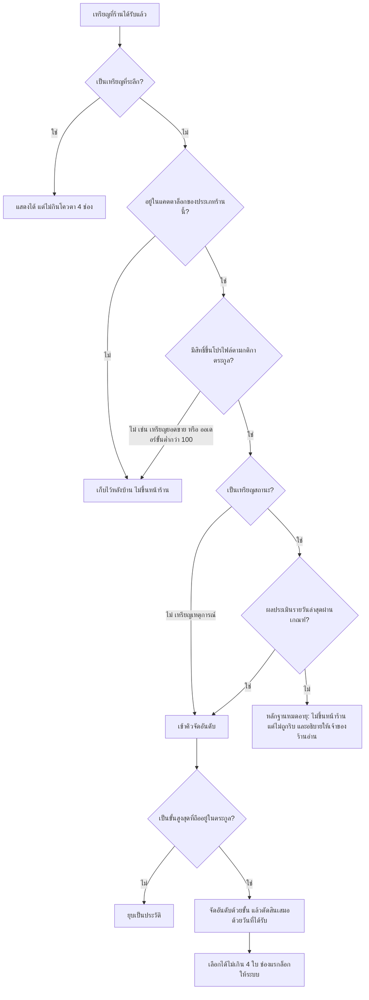

> **โมดูล:** 00052 — Badge & Achievement v2
> **ประเภทเอกสาร:** Product Requirements Document (PRD)
> **เวอร์ชัน:** 1.0
> **วันที่จัดทำ:** 2026-08-21
> **สถานะ:** Draft (มติที่ผู้ใช้เคาะแล้ว 25 ข้อ — ครอบทั้ง 4 เฟส)
> **เจ้าของเอกสาร:** BA + PO + PM (ดู [[Feature-Docs-Ownership]])

# PRD: ระบบเหรียญตราและความสำเร็จ เวอร์ชัน 2

---

## Executive Summary

ระบบเหรียญของ Deep มีอยู่แล้วและทำงานอยู่จริงบน prod — แคตตาล็อก 31 ใบ เกณฑ์ 18 ชนิด มอบให้อัตโนมัติเมื่อเกิดเหตุการณ์จริง และนับเป็นคะแนนหนึ่งส่วนของความน่าเชื่อถือ แต่ข้อมูลจริง ณ 2026-08-21 บอกว่ามันแทบไม่ได้ทำหน้าที่ของตัวเอง: เหรียญที่มีคนถือจริงมีเพียง **9 ใบจาก 31** และหนึ่งในนั้น (`2026_BADGE`) แจกให้ **51 คนจากผู้ใช้ 52 คน** ส่วน **13 ใบเป็นเหรียญประมูล** ทั้งที่ระบบประมูลมีรายการจริง **0 รายการตั้งแต่เปิดระบบ** ผลคือคนนอกอ่านเหรียญแล้วไม่ได้ข้อมูลเพิ่ม และเจ้าของร้านเปิดหน้าความสำเร็จแล้วเห็นเป้าหมายที่ไม่เกี่ยวกับธุรกิจของตัวเอง

ฟีเจอร์นี้เขียนแคตตาล็อกใหม่ให้ครอบ "ธุรกิจที่ระบบมีข้อมูลจริง" (ขาย · ส่งของ · ดูแลลูกค้า · ตอบรีวิว · อายุร้าน) แล้วแยกเหรียญเป็นสองชุดที่ทำคนละหน้าที่ — **เหรียญหลักฐาน** ที่ขึ้นหน้าร้านสาธารณะเพื่อบอกสิ่งที่แถวตัวเลขบอกไม่ได้ กับ **เหรียญเป้าหมาย** ที่เห็นเฉพาะเจ้าของร้านเพื่อให้มีอะไรไล่เก็บ พร้อมย้ายเจ้าของเหรียญผลสัมฤทธิ์ให้ผูกกับ **ร้าน** เสมอ (ทั้งร้านส่วนตัวและร้านธุรกิจ) และเพิ่มโครง **ตระกูล/ขั้น** เพื่อให้เหรียญที่วัดเรื่องเดียวกันไม่ไปกองซ้ำกันบนหน้าเดียว

ขอบเขตงานถูกจำกัดโดยเจตนา: **ไม่แตะสูตร Trust Score** (feature 00040 ต้องยังตั้งอยู่ได้) **ไม่ริบเหรียญออกจากฐานข้อมูล** และ **ตัดงานฝั่งผู้ซื้อกับเหรียญประมูลใบใหม่ออกทั้งหมด** ส่งมอบเป็น 4 เฟส โดยเฟสแรก (โครงกระดูกและการย้ายเจ้าของเหรียญ) เป็นเฟสเดียวที่แตะข้อมูลจริงบน prod จึงต้องจบก่อนเฟสอื่นเสมอ

---

## 1. Business Goals & KPIs

### 1.1 เป้าหมายทางธุรกิจ

| เป้าหมาย | รายละเอียด |
|----------|-----------|
| **เหรียญต้องพูดแทนร้านได้จริงกับคนนอก** | ผู้ซื้อที่กำลังจะโอนเงินอ่านเหรียญบนหน้าร้านแล้วต้องได้ข้อมูลที่ตัวเลขด้านบน (ออเดอร์ · ลูกค้า · อัตราสำเร็จ · คะแนนรีวิว) บอกไม่ได้ ถ้าเหรียญพูดซ้ำของเดิม มันคือของประดับที่ทำให้หน้าอ่านยากขึ้นเฉย ๆ |
| **เจ้าของร้านต้องมีเป้าหมายที่เอื้อมถึงตั้งแต่เดือนแรก** | ร้านที่เพิ่งเปิดต้องเห็นขั้นแรกที่ไปถึงได้ในเดือนแรก และร้านที่ขายมานานต้องยังมีขั้นถัดไปเหลือให้ไล่ ไม่ใช่แคตตาล็อกที่ทุกใบอยู่ไกลเกินหรือได้ครบไปแล้ว |
| **แคตตาล็อกต้องตรงกับธุรกิจที่ระบบมีข้อมูลจริง** | เหรียญ 13 ใบผูกกับระบบประมูลที่ไม่เคยถูกใช้เลย ขณะที่กิจกรรมที่เกิดจริงทุกวัน (เปิดพัสดุ · ตอบรีวิว · ไม่ยกเลิกออเดอร์) ไม่มีเหรียญรองรับเลยสักใบ |
| **ข้อมูลเหรียญต้องมีเจ้าของที่ถูกต้อง** | เหรียญผลสัมฤทธิ์วัดผลงานของกิจการ จึงต้องผูกกับร้าน ไม่ใช่ติดตัวเจ้าของไปร้านอื่น ปัจจุบันร้านส่วนตัวเก็บเหรียญไว้ที่ตัวบุคคล และมีข้อมูลค้าง 3 แถวที่เขียนผิดฝั่ง |
| **แยก "หลักฐาน" ออกจาก "แรงจูงใจ" ให้ขาดจากกัน** | เหรียญสองชุดนี้มีผู้อ่านคนละคนและมีเกณฑ์ความเข้มงวดคนละระดับ การเอามารวมกองเดียวทำให้ทั้งสองด้านเสียหน้าที่พร้อมกัน |

### 1.2 ตัวชี้วัดความสำเร็จ (KPIs)

| KPI | คำอธิบาย | เป้าหมาย |
|-----|----------|---------|
| **สัดส่วนเหรียญที่มีผู้ถือจริง** | นับเหรียญในแคตตาล็อกที่แสดงต่อร้านประเภท `ONLINE_SALES` ซึ่งมีแถว `UserBadge` อย่างน้อย 1 แถว หารด้วยจำนวนเหรียญทั้งหมดในแคตตาล็อกนั้น | จากปัจจุบัน 9/31 (29% ทั้งระบบ) เป็น **ไม่น้อยกว่า 60%** ของแคตตาล็อกที่ร้านประเภทนั้นเห็น |
| **ร้านที่ขายจริงมีเหรียญหลักฐานขึ้นหน้าร้าน** | นับเหรียญที่ผ่านเกณฑ์การขึ้นโปรไฟล์ของร้าน 2 ร้านที่มีการขายจริง | ร้าน `ONLINE_SALES` ที่ปิดจบ 227 ใบ ได้ **ไม่น้อยกว่า 3 ใบ** · ร้าน `SERVICE_QUEUE` ที่ปิดจบ 25 ใบ ได้ **ไม่น้อยกว่า 2 ใบ** |
| **ความถูกต้องของเจ้าของเหรียญ** | นับแถว `UserBadge` ของเหรียญผลสัมฤทธิ์ที่ยังไม่มีร้านกำกับ และแถวของเหรียญบุคคลที่ถูกเขียนร้านกำกับไว้ | ทั้งสองค่าเป็น **0** หลังจบเฟสที่ 1 (ปัจจุบันมี 3 แถวของ `2026_BADGE` ที่เขียนร้านไว้ผิด) |
| **เหรียญที่ระลึกไม่แย่งพื้นที่หลักฐาน** | นับช่องบนโปรไฟล์สาธารณะที่ถูกเหรียญที่ระลึกยึดไว้ | **0 ช่อง** จากเพดาน 4 ช่อง |
| **ความสดของผลประเมินเหรียญสถานะ** | นับร้านที่ค่าประเมินรายวันเก่ากว่า 48 ชั่วโมง (เทียบวิธีเดียวกับ `chatMetricsUpdatedAt`) | **0 ร้าน** ตลอดช่วงหลังปล่อยเฟสที่ 2 |

---

## 2. User Personas (กลุ่มผู้ใช้งาน)

### 2.1 ผู้ซื้อที่กำลังตัดสินใจโอนเงิน

**ข้อมูลพื้นฐาน:**
- เปิดหน้าร้านสาธารณะ (`/u/{username}` หรือ `/b/{slug}`) จากลิงก์ที่ร้านส่งให้ในแชท มักเปิดบนมือถือ และเปิดครั้งเดียวก่อนโอนเงิน
- ไม่มีบัญชีในระบบ — ข้อมูลจริงบน prod: ออเดอร์สำเร็จ 73 ใบ มี **72 ใบที่ผู้ซื้อไม่มีบัญชี**

**เป้าหมาย:**
- ตอบคำถามเดียวให้ได้ภายในไม่กี่วินาที: "ร้านนี้โอนไปแล้วจะได้ของไหม"

**ความต้องการ:**
- หลักฐานที่ร้านสร้างขึ้นเองไม่ได้ และอ่านแล้วรู้ทันทีว่าได้มาจากเงื่อนไขอะไร
- ข้อมูลที่ไม่ซ้ำกับแถวตัวเลขที่เพิ่งอ่านผ่านไปเมื่อครู่

**จุดปวด (Pain Points):**
- เหรียญที่เห็นตอนนี้ส่วนใหญ่พูดเรื่องเดียวกับตัวเลขด้านบน (จำนวนออเดอร์ · จำนวนรีวิว · คะแนนรีวิว) ต้องอ่านของเดิมสองรอบแล้วสงสัยว่าเลขสองชุดต่างกันตรงไหน
- เหรียญที่คนเกือบทุกคนในระบบมีเหมือนกัน (`2026_BADGE` — 51 จาก 52 คน) ทำให้เหรียญทั้งกองดูเหมือนของแจก

### 2.2 เจ้าของร้านขายของออนไลน์ที่ขายจริงต่อเนื่อง

**ข้อมูลพื้นฐาน:**
- ร้านธุรกิจประเภท `ONLINE_SALES` ปิดจบแล้ว 227 ใบ เปิดพัสดุผ่านระบบขนส่งแทบทุกใบ ยกเลิกเอง 9 ใบ และ **ยังไม่เคยมีรีวิวเลยสักใบ**
- บัญชีเจ้าของสร้างเมื่อ 2026-07-31 (อายุ 20 วัน ณ วันจัดทำเอกสาร)

**เป้าหมาย:**
- ให้หน้าร้านของตัวเองพิสูจน์ตัวเองได้โดยไม่ต้องพิมพ์อธิบายในแชททุกครั้ง

**ความต้องการ:**
- เหรียญที่วัดสิ่งที่ร้านทำจริงทุกวัน — ส่งของเร็ว · มีเลขพัสดุให้ตามทุกใบ · ไม่ยกเลิกออเดอร์ทิ้งลูกค้า
- รู้ว่าอีกเท่าไรถึงขั้นถัดไป และรู้ทันทีว่าทำไมเหรียญบางใบไม่ขึ้นหน้าร้านแล้ว

**จุดปวด (Pain Points):**
- เหรียญเกือบทั้งกองที่ยังไม่ได้ผูกกับรีวิว ซึ่งร้านนี้มี 0 รีวิว จึงเป็นเป้าหมายที่ขยับไม่ได้ด้วยการทำงานหนักขึ้น
- เหรียญประมูล 13 ใบกินพื้นที่หน้าความสำเร็จโดยที่ร้านไม่เคยใช้ระบบประมูลเลย

### 2.3 เจ้าของร้านบริการ

**ข้อมูลพื้นฐาน:**
- ร้านธุรกิจประเภท `SERVICE_QUEUE` ปิดจบ 25 ใบ มีรีวิว 17 ใบ ยกเลิกเอง 2 ใบ **ไม่มีพัสดุเลยแม้แต่ใบเดียว** เพราะไม่ได้ส่งของ
- ตอบกลับรีวิวไปแล้ว 1 ใบจาก 17

**เป้าหมาย:**
- ได้เหรียญที่สะท้อนงานบริการ ไม่ใช่ถูกวัดด้วยไม้บรรทัดของร้านขายของ

**ความต้องการ:**
- เกณฑ์ที่ไม่ต้องมีพัสดุก็ผ่านได้ และเกณฑ์ที่ใช้ประโยชน์จากสิ่งที่ร้านนี้มีมากกว่าร้านอื่น (รีวิวจริงจากลูกค้า)

**จุดปวด (Pain Points):**
- เหรียญจัดส่ง 2 ใบในระบบปัจจุบันเป็นไปไม่ได้สำหรับร้านประเภทนี้อย่างถาวร แต่ยังโผล่อยู่ในหน้าความสำเร็จเป็นเป้าหมายที่ล็อกตลอดกาล
- ยอมรับแล้วว่าร้านบริการจะมีตระกูลเหรียญน้อยกว่าร้านขายของ (5 ต่อ 7) แต่ที่มีต้องเป็นของจริงทุกใบ

### 2.4 ร้านเปิดใหม่ที่ยังแทบไม่มีออเดอร์

**ข้อมูลพื้นฐาน:**
- 12 ร้านจาก 14 ร้านที่ยังไม่ถูกลบ อยู่ในกลุ่มนี้ (ปิดจบ 0–1 ใบ)

**เป้าหมาย:**
- รู้ว่าก้าวแรกคืออะไร และก้าวนั้นอยู่ใกล้พอที่จะไปถึงได้ในเดือนแรก

**ความต้องการ:**
- ขั้นแรกของทุกตระกูลต้องเอื้อมถึงได้จริงด้วยการขายจริงไม่กี่ใบ
- ต้องไม่เห็นตัวเลขที่ยังสรุปไม่ได้ในรูปแบบที่อ่านเหมือนศูนย์

**จุดปวด (Pain Points):**
- เหรียญที่ได้จริงตอนนี้คือเหรียญสมัครสมาชิกปี ซึ่งไม่ได้บอกอะไรเกี่ยวกับร้านเลย

### 2.5 ทีมงาน Deep ที่ดูแลแคตตาล็อกและข้อมูล

**ข้อมูลพื้นฐาน:**
- ใช้หน้าแอดมินจัดการแคตตาล็อกเหรียญ และเป็นคนรันสคริปต์ seed เองด้วยมือเมื่อมีเหรียญใหม่

**เป้าหมาย:**
- ปล่อยเหรียญใหม่แล้วมั่นใจได้ว่ามันถูกประเมินจริง ไม่ใช่ตายเงียบอยู่ในโค้ด

**ความต้องการ:**
- ขั้นตอนปล่อยที่มีจุดตรวจชัดว่า "เหรียญขึ้นฐานแล้วกี่ใบ" และ "ตัวประเมินรายวันทำงานล่าสุดเมื่อไร"

**จุดปวด (Pain Points):**
- การ deploy ไม่ได้ seed เหรียญให้อัตโนมัติ เคยเกิดแล้วกับเหรียญประมูลชุดหลัง ซึ่งอยู่ในโค้ดก่อนจะขึ้นฐานจริง
- ไม่มีตัวประเมินที่ทำงานเองตามเวลา ทุกอย่างรอให้มีคนกดอะไรสักอย่างก่อน

---

## 3. Business Requirements

### 3.1 บันทึกระบบเหรียญที่มีอยู่เดิม (สภาพปัจจุบันก่อนแก้)

หัวข้อนี้เป็นการบันทึกของเดิม ไม่ใช่ข้อเสนอ — ระบบเหรียญเกิดก่อนกฎเอกสารนำโค้ด จึงไม่เคยมีโฟลเดอร์ฟีเจอร์ของตัวเองมาก่อน สิ่งที่จะเปลี่ยนอยู่ในหัวข้อ 3.2 เป็นต้นไป

**ความต้องการ:**
- ต้องมีบันทึกที่อ่านแล้วรู้ว่า "ก่อนแก้ ระบบทำอะไรได้แค่ไหน" เพื่อให้คนที่มาทีหลังแยกออกว่าอะไรเป็นของเดิมและอะไรเป็นของรอบนี้

**สภาพปัจจุบัน (ยืนยันจากโค้ดและข้อมูล prod 2026-08-21):**

| หัวข้อ | สภาพปัจจุบัน |
|--------|-------------|
| ขนาดแคตตาล็อก | 31 ใบ นิยามไว้ในไฟล์ข้อมูล seed ไฟล์เดียว |
| ชนิดเกณฑ์ | 18 ชนิด เป็นยูเนียนที่ตัวแปลภาษาไทยและตัวประเมินต้องรู้จักตรงกัน |
| กลุ่มผู้รับ | มีสามค่า: ผู้ขาย · ผู้ซื้อ · ทุกคน |
| การประเมิน | ทำงานตามเหตุการณ์เท่านั้น: ผู้ซื้อยืนยันรับของ · มีรีวิวใหม่ · เอกสารยืนยันตัวตนผ่าน · กดติดตามการประมูล · สมัครสมาชิกใหม่ (เฉพาะเหรียญปี) |
| ลักษณะการเรียก | ทุกจุดเป็นแบบ "ล้มได้ไม่กระทบงานหลัก" เรียกหลังบันทึกข้อมูลหลักเสร็จแล้ว ถ้าล้มจะเขียนบันทึกข้อผิดพลาดแล้วผ่านไป |
| ตัวประเมินตามเวลา | **ไม่มี** — ระบบไม่มีงานตามเวลาสำหรับเหรียญเลยแม้แต่ตัวเดียว |
| การมอบซ้ำ | กันด้วยดัชนีเฉพาะสองตัวที่ระดับฐานข้อมูล (แยกกรณีผูกร้าน/ไม่ผูกร้าน) เขียนเป็น SQL นอกการจัดการของ ORM |
| เจ้าของเหรียญ | ร้านธุรกิจ เขียนร้านกำกับ · **ร้านส่วนตัว ไม่เขียนร้านกำกับ** (เก็บไว้ที่ตัวบุคคล) |
| ผลต่อคะแนนความน่าเชื่อถือ | 1 คะแนนต่อเหรียญ 1 ใบ เพดานรวม 10 คะแนนจาก 100 |
| การริบ | ไม่มีการริบทุกกรณี (สอดคล้องกับ FR-TS2-07 ของ 00040) |
| หน้าจอที่แสดงเหรียญ | 6 จุด: หน้าความสำเร็จของผู้ขาย · หน้าเหรียญฝั่งผู้ซื้อ 2 หน้า · หน้าจัดการแคตตาล็อกของแอดมิน · โปรไฟล์สาธารณะ (2 URL ใช้หน้าจอชุดเดียวกัน) · บล็อกเหรียญเด่นในตัวจัดหน้าร้าน |
| การนำเหรียญขึ้นฐาน | ต้องรันสคริปต์ seed ด้วยมือ การ deploy ไม่ทำให้ |

**แคตตาล็อก 31 ใบ ณ ปัจจุบัน พร้อมจำนวนผู้ถือจริง:**

| # | ชื่อไทย | ชื่อระบบ | เกณฑ์ | กลุ่มผู้รับ | ผู้ถือ |
|---|---------|---------|-------|-----------|-------|
| 1 | เปิดหน้าร้าน | First Sale | ขายได้ออเดอร์แรก | ผู้ขาย | 3 |
| 2 | ร้านค้าขายอดนิยม | Trusted Seller 50 | ออเดอร์ 50 | ผู้ขาย | 1 |
| 3 | ร้อยออเดอร์ | Century Club | ออเดอร์ 100 | ผู้ขาย | 1 |
| 4 | ร้านคะแนนเต็ม | Perfect Rating | คะแนนเต็มจาก 10 รีวิว | ผู้ขาย | 0 |
| 5 | ร้านคะแนนสูง | Highly Rated | 4.8 ขึ้นไปจาก 20 รีวิว | ผู้ขาย | 0 |
| 6 | ไร้ข้อร้องเรียน | Zero Complaint | ไม่ยกเลิกเองใน 50 ออเดอร์ | ผู้ขาย | 0 |
| 7 | ร้านค้าเก่าแก่ | Veteran | อายุ 365 วัน + มีออเดอร์ล่าสุด | ผู้ขาย | 0 |
| 8 | จัดส่งสายฟ้า | Speed Demon | ส่งเฉลี่ยไม่เกิน 24 ชม. จาก 20 ใบ | ผู้ขาย | 1 |
| 9 | ยืนยันครบถ้วน | Fully Verified | ยืนยันตัวตนครบ 3 ระดับ | ทุกคน | 0 |
| 10 | ขวัญใจชุมชน | Community Favorite | รีวิวจากลูกค้า 50 คน | ผู้ขาย | 0 |
| 11 | สมาชิกผู้ก่อตั้ง 2026 | 2026_BADGE | สมัครปี 2026 | ทุกคน | 51 |
| 12 | เริ่มมีลูกค้า | Getting Started | ออเดอร์ 10 | ผู้ขาย | 2 |
| 13 | ร้านกำลังโต | Rising Seller | ออเดอร์ 25 | ผู้ขาย | 2 |
| 14 | คะแนนดีน่าซื้อ | Well Rated | 4.5 ขึ้นไปจาก 10 รีวิว | ผู้ขาย | 1 |
| 15 | เริ่มเป็นที่รู้จัก | Getting Noticed | รีวิวจากลูกค้า 10 คน | ผู้ขาย | 1 |
| 16 | ขายดีไร้ปัญหา | Spotless 100 | ไม่ยกเลิกเองใน 100 ออเดอร์ | ผู้ขาย | 0 |
| 17 | เปิดร้านครบไตรมาส | 3 Months Strong | อายุ 90 วัน + มีออเดอร์ล่าสุด | ผู้ขาย | 0 |
| 18 | ส่งไวระดับเทพ | Same-Day Hero | ส่งเฉลี่ยไม่เกิน 12 ชม. จาก 20 ใบ | ผู้ขาย | 0 |
| 19 | นักประมูลมือใหม่ | First Auctioneer | เปิดประมูล 1 ครั้ง | ผู้ขาย | 0 |
| 20 | เจ้าแห่งประมูล 10 | Auction Host 10 | เปิดประมูล 10 ครั้ง | ผู้ขาย | 0 |
| 21 | ปิดดีลประมูล | First Auction Win | ปิดการประมูลได้ 1 ครั้ง | ผู้ขาย | 0 |
| 22 | ขายประมูลได้ 10 ดีล | Auction Closer 10 | ปิดการประมูลได้ 10 ครั้ง | ผู้ขาย | 0 |
| 23 | ขายประมูลได้ 50 ดีล | Auction Pro 50 | ปิดการประมูลได้ 50 ครั้ง | ผู้ขาย | 0 |
| 24 | นักประมูลสายเร้าใจ | Bid Magnet | มีประมูลที่มีคนสู้ราคา 20 ครั้ง | ผู้ขาย | 0 |
| 25 | ประมูลครั้งแรก | First Bidder | เสนอราคา 1 ครั้ง | ผู้ซื้อ | 0 |
| 26 | นักประมูลตัวยง | Active Bidder | เสนอราคา 50 ครั้ง | ผู้ซื้อ | 0 |
| 27 | ชนะประมูลครั้งแรก | First Winner | ชนะประมูล 1 ครั้ง | ผู้ซื้อ | 0 |
| 28 | ชนะ 5 ดีล | Winner's Circle | ชนะประมูล 5 ครั้ง | ผู้ซื้อ | 0 |
| 29 | ได้ของครบ 3 รายการ | Auction Completer | ชนะแล้วรับของครบ 3 ครั้ง | ผู้ซื้อ | 0 |
| 30 | นักให้กำลังใจ | Bid Cheerer | ให้กำลังใจในการประมูล 20 ครั้ง | ผู้ซื้อ | 0 |
| 31 | นักเฝ้าประมูล | Auction Watcher | ติดตามการประมูล 10 รายการ | ผู้ซื้อ | 0 |

**สิ่งที่ตารางนี้บอกและต้องบันทึกไว้:**
- เหรียญที่มีผู้ถือจริง 9 ใบ · ไม่มีผู้ถือเลย 22 ใบ · ในจำนวนนั้นเป็นเหรียญประมูลและการมีส่วนร่วมกับการประมูล 13 ใบ ซึ่งมีรายการประมูลจริง 0 รายการ
- เหรียญที่ผูกกับรีวิวมี 5 ใบ และแยกเป็น **สองเรื่องที่ต่างกัน** ไม่ใช่เรื่องเดียว: *คะแนนที่ได้* (ลำดับ 4 · 5 · 14) กับ *จำนวนคนที่มารีวิว* (ลำดับ 10 · 15) — ปัจจุบันทั้งห้าใบนับเป็นคนละใบเวลาแสดงผล และไม่มีอะไรบอกว่าใบไหนเป็นญาติกับใบไหน (มติ D-BDG-2 จัดเป็น 2 ตระกูล ไม่ใช่ตระกูลเดียว เพราะร้านที่มีผู้รีวิว 50 คนแต่คะแนน 4.2 กับร้านที่มีผู้รีวิว 10 คนแต่คะแนนเต็ม ไม่มีใครสูงกว่าใคร)
- เหรียญ 2 ใบที่ผูกกับความเร็วในการส่ง (ลำดับ 8 · 18) และ 2 ใบที่ผูกกับการไม่ยกเลิก (ลำดับ 6 · 16) ก็อยู่ในรูปแบบเดียวกัน
- เกณฑ์อายุร้าน (ลำดับ 7 · 17) อ่านวันสร้าง **บัญชีผู้ใช้** ไม่ใช่วันเปิดร้าน ซึ่งเป็นคนละสิ่งกันเมื่อเจ้าของคนเดียวมีหลายร้าน
- ตัวแปลคำอธิบายเกณฑ์เป็นภาษาไทยรองรับชนิด `VERIFICATION` อยู่ด้วย ทั้งที่ชนิดนี้ไม่มีอยู่ในยูเนียนของระบบและไม่มีเหรียญใบไหนใช้ — เป็นโค้ดที่ไม่มีผู้เรียก
- `2026_BADGE` มี 3 แถวที่ถูกเขียนร้านกำกับไว้ ทั้งที่เป็นเหรียญของตัวบุคคล

**เหตุผล:**
- ถ้าไม่บันทึกของเดิมไว้ เอกสารฉบับนี้จะอ่านเหมือนระบบใหม่ที่สร้างจากศูนย์ แล้วคนที่มาทีหลังจะไม่รู้ว่ามีเหรียญ 63 แถวที่ผู้ใช้จริงถืออยู่แล้วและห้ามทำหาย

### 3.2 เจ้าของเหรียญ: แยกเหรียญร้านออกจากเหรียญบุคคล

**ความต้องการ:**
- เหรียญผลสัมฤทธิ์ทุกใบต้องผูกกับร้านเสมอ ทั้งร้านส่วนตัวและร้านธุรกิจ
- เหรียญที่วัดสิ่งที่เป็นของตัวคน (การยืนยันตัวตน · การเป็นสมาชิกรุ่นก่อตั้ง · การซื้อ) ต้องผูกกับบุคคลเสมอและห้ามมีร้านกำกับ
- ข้อมูลเดิมทั้งหมดต้องถูกย้ายให้เข้ากติกาใหม่ในการเปลี่ยนแปลงชุดเดียวกับที่เปลี่ยนโครงสร้าง

**Business Rules:**
- **BR-BDG2-01** เหรียญผลสัมฤทธิ์ = เหรียญร้าน ต้องมีร้านกำกับเสมอ ไม่มีข้อยกเว้น
- **BR-BDG2-02** การยืนยันตัวตนถือเป็นเหรียญบุคคล
- **BR-BDG2-03** เหรียญร้านไม่ติดตัวเจ้าของไปร้านอื่น เจ้าของที่มีสองร้านจะมีเหรียญคนละชุด
- **BR-BDG2-04** การย้ายเจ้าของข้อมูลเดิมและการล้างแถวที่เขียนผิดฝั่ง ต้องอยู่ในการเปลี่ยนแปลงเดียวกับการเปลี่ยนโครงสร้าง ห้ามแยกทำทีหลัง
- **BR-BDG2-05** จำนวนเหรียญที่ผู้ใช้เดิมถืออยู่ต้องไม่ลดลงจากการย้าย ต้องนับก่อนและหลังแล้วเท่ากัน

**เหตุผล:**
- ปัจจุบันร้านส่วนตัวเก็บเหรียญไว้ที่ตัวบุคคล ทำให้คำถาม "ร้านนี้มีเหรียญอะไร" ตอบไม่ตรงกันระหว่างร้านสองประเภท ทั้งที่เป็นคำถามเดียวกัน และเป็นต้นเหตุของบั๊กที่เคยเกิดแล้วเมื่อฝั่งเขียนกับฝั่งอ่านใช้ขอบเขตคนละแบบ

### 3.3 ตระกูลและขั้นของเหรียญ

**ความต้องการ:**
- เหรียญที่วัดเรื่องเดียวกันต้องรวมเป็นตระกูลเดียว และแต่ละใบมีขั้นของตัวเองภายในตระกูล
- เวลาแสดงต่อคนนอก แสดงเฉพาะขั้นสูงสุดที่ร้านถืออยู่ในตระกูลนั้น ขั้นที่ต่ำกว่ายุบเป็นประวัติ
- ข้อมูลตระกูลและขั้นเป็นคุณสมบัติของตัวเหรียญ ไม่ใช่ของการได้รับ

**Business Rules:**
- **BR-BDG2-06** หนึ่งตระกูลปรากฏต่อคนนอกได้ไม่เกิน 1 ใบเสมอ
- **BR-BDG2-07** ขั้นที่ต่ำกว่าไม่ถูกลบและยังนับเป็นเหรียญที่ได้รับตามปกติ เพียงแต่ไม่แสดงบนโปรไฟล์
- **BR-BDG2-08** เหรียญทุกใบต้องระบุได้ว่าอยู่ตระกูลไหน ขั้นเท่าไร และมีสิทธิ์ขึ้นโปรไฟล์หรือเป็นเหรียญเป้าหมาย
- **BR-BDG2-09** เหรียญที่ไม่มีตระกูล (เหรียญที่ระลึก) ไม่อยู่ใต้กติกาการยุบขั้น

**เหตุผล:**
- ร้านที่ขายมานานจะถือทั้ง 10 · 25 · 50 · 100 ออเดอร์พร้อมกัน ถ้าแสดงทุกใบ หน้าร้านจะเต็มไปด้วยเหรียญที่พูดประโยคเดียวกันสี่รอบ และคนอ่านจะนับเหรียญแทนการอ่านความหมาย

### 3.4 แคตตาล็อกใหม่ที่ผันตามประเภทร้าน

**ความต้องการ:**
- แคตตาล็อกที่ร้านหนึ่งเห็นและถูกประเมิน ต้องขึ้นกับประเภทของร้าน (ขายออนไลน์ · สินค้าและบริการ · บ้านพัก)
- เกณฑ์ทุกตระกูลมีอย่างน้อยสองชั้น: ขั้นต้นที่ร้านใหม่เอื้อมถึงได้ในเดือนแรก และขั้นสูงที่เผื่อไว้สำหรับอนาคต

**ชุดกลาง — ทุกประเภทร้านได้เหมือนกัน:**

| ตระกูล | ชนิด | ขั้น | ขึ้นหน้าร้านสาธารณะ |
|--------|------|------|---------------------|
| **ออเดอร์สะสม** | เหตุการณ์ | 1 · 10 · 25 · 50 · 100 · 250 · 500 | เฉพาะขั้น 100 ขึ้นไป |
| **อยู่มานานและยังขายอยู่** | เหตุการณ์ | 90 · 180 · 365 · 730 วันนับจากวันเปิดร้าน และต้องมีออเดอร์ใน 30 วันล่าสุด | ทุกขั้น |
| **ไม่ทิ้งลูกค้า** | สถานะ | ร้านยกเลิกเอง 0 ใบใน 90 วันล่าสุด แยกขั้นตามขนาดตัวอย่าง 20 · 100 · 300 ใบ | ทุกขั้น |
| **ตอบทุกรีวิว** | สถานะ | ตอบแล้วอย่างน้อย 90% จากรีวิวอย่างน้อย 5 ใบ · ตอบครบ 100% จากรีวิวอย่างน้อย 20 ใบ | ทุกขั้น |
| **ยอดขายสะสม** | เหตุการณ์ | 50,000 · 250,000 · 1,000,000 · 5,000,000 บาท | ไม่ขึ้นเลย — เป็นเหรียญเป้าหมายล้วน |

**ชุดเฉพาะร้านขายออนไลน์:**

| ตระกูล | ชนิด | ขั้น | ขึ้นหน้าร้านสาธารณะ |
|--------|------|------|---------------------|
| **ส่งไว** | สถานะ | เวลาเฉลี่ยจนเปิดพัสดุ ไม่เกิน 24 · 12 · 6 ชั่วโมง จากอย่างน้อย 20 ใบใน 90 วันล่าสุด | ทุกขั้น |
| **ตามพัสดุได้ทุกใบ** | สถานะ | ออเดอร์ที่ต้องส่งของมีเลขพัสดุอย่างน้อย 95% จากอย่างน้อย 20 ใบ · ครบ 100% จากอย่างน้อย 100 ใบ | ทุกขั้น |

**ร้านสินค้าและบริการ กับ ร้านบ้านพัก:** ใช้ชุดกลางอย่างเดียว ไม่มีตระกูลเฉพาะทางในรอบนี้

**Business Rules:**
- **BR-BDG2-10** แคตตาล็อกต่อประเภทร้านเป็นรายการที่อนุญาต ไม่ใช่รายการที่ห้าม และประเภทที่ระบบไม่รู้จักต้องตกไปที่ชุดของร้านขายออนไลน์ (ปิดไว้ก่อน)
- **BR-BDG2-11** เหรียญที่อยู่นอกแคตตาล็อกของร้านนั้น ต้องไม่ถูกประเมินและไม่ถูกแสดงเป็นเป้าหมายที่ล็อกอยู่
- **BR-BDG2-12** ห้ามขยับเกณฑ์ของเหรียญหลังปล่อยแล้ว ถ้าต้องการระดับใหม่ให้เพิ่มขั้นใหม่ในตระกูลเดิม
- **BR-BDG2-13** ตระกูลที่ผูกกับยอดเงินเป็นเหรียญเป้าหมายเสมอ ห้ามขึ้นหน้าร้านสาธารณะไม่ว่าขั้นใด
- **BR-BDG2-14** ยอมรับว่าร้านบริการมีตระกูลน้อยกว่าร้านขายของ (5 ต่อ 7) ห้ามเติมเหรียญเพื่อทำให้จำนวนเท่ากัน

**เหตุผลของแต่ละทางเลือก:**
- **ทำไมออเดอร์สะสมขึ้นโปรไฟล์เฉพาะขั้น 100 ขึ้นไป** — จำนวนออเดอร์อยู่ในแถวตัวเลขบนโปรไฟล์อยู่แล้ว ขั้นต่ำกว่านั้นจึงเป็นการพูดซ้ำ ส่วนขั้น 100 ขึ้นไปเปลี่ยนความหมายจาก "ขายได้" เป็น "ขายมาต่อเนื่องพอที่จะสะสมได้ขนาดนี้" ซึ่งตัวเลขเดี่ยว ๆ ไม่ได้สื่อ
- **ทำไม "อยู่มานาน" ต้องพ่วงเงื่อนไขว่ายังขายอยู่** — อายุอย่างเดียวได้มาจากการนั่งเฉย ๆ ร้านที่เปิดทิ้งไว้สองปีไม่ควรได้หลักฐานเท่าร้านที่ขายต่อเนื่องสองปี (เงื่อนไขนี้มีอยู่แล้วในระบบเดิมและคงไว้)
- **ทำไมไม่ทิ้งลูกค้าจึงแยกขั้นด้วยขนาดตัวอย่าง ไม่ใช่ด้วยความเข้มของเกณฑ์** — เกณฑ์คือศูนย์อยู่แล้วซึ่งเข้มที่สุดเท่าที่เป็นไปได้ สิ่งที่ทำให้ขั้นสูงยากกว่าคือการรักษาศูนย์นั้นไว้บนจำนวนออเดอร์ที่มากกว่า
- **ทำไมมีตระกูลตอบรีวิว** — ข้อมูลจริงบอกว่ารีวิว 18 ใบทั้งระบบถูกตอบเพียง 1 ใบ นี่คือพฤติกรรมที่ดีต่อผู้ซื้อโดยตรง วัดได้จากข้อมูลที่ระบบมีอยู่แล้ว และเป็นตระกูลที่ร้านบริการซึ่งมีรีวิวเยอะได้เปรียบ
- **ทำไมยอดขายอยู่หลังบ้านล้วน** — ยอดเงินของร้านเป็นความลับทางธุรกิจ การประกาศต่อสาธารณะว่าร้านนี้ขายได้เท่าไรไม่ได้ช่วยผู้ซื้อตัดสินใจ แต่ทำให้ร้านเสียเปรียบคู่แข่ง
- **ทำไมร้านบริการไม่มีตระกูลเฉพาะทาง** — สองอย่างที่พิจารณาแล้วตัดออกทั้งคู่: "ไม่เลื่อนนัด" ใช้ไม่ได้เพราะทั้งระบบมีการเลื่อนนัด 0 ครั้ง ทุกร้านจะผ่านตั้งแต่วันแรกโดยไม่ต้องทำอะไร ซึ่งไม่ใช่หลักฐาน · "งานที่นัดแล้วจบจริง" ซ้ำกับอัตราสำเร็จที่อยู่ในแถวตัวเลขอยู่แล้ว · ส่วนร้านบ้านพักมี 0 ร้านบน prod จึงยังไม่มีข้อมูลพอจะออกแบบเกณฑ์ที่ไม่ใช่การเดา

### 3.5 เหรียญหลักฐานบนหน้าร้านสาธารณะ

**ความต้องการ:**
- โปรไฟล์แสดงเหรียญได้ไม่เกิน 4 ใบ โดยระบบเป็นคนจัดอันดับให้เป็นค่าตั้งต้น
- ร้านสลับลำดับได้ภายในเพดาน แต่ช่องแรกล็อกให้ระบบเสมอ
- เหรียญที่ข้อมูลล่าสุดไม่ผ่านเกณฑ์แล้ว จะไม่ขึ้นหน้าสาธารณะ แต่ยังอยู่ในหลังบ้านและไม่ถูกริบ

**Business Rules:**
- **BR-BDG2-15** เพดานเหรียญบนโปรไฟล์ = 4 ใบ
- **BR-BDG2-16** ลำดับตั้งต้นจัดด้วยขั้นสูงสุดในตระกูล และเมื่อขั้นเท่ากันให้ตัดสินด้วยวันที่ได้รับเสมอ
- **BR-BDG2-17** ช่องแรกเป็นของระบบเสมอ ร้านสลับได้เฉพาะช่องที่เหลือ
- **BR-BDG2-18** เหรียญสถานะที่หลักฐานหมดอายุ ต้องหายจากหน้าสาธารณะ และห้ามลบแถวออกจากฐานข้อมูล
- **BR-BDG2-19** เหรียญที่ระลึกแสดงได้แต่ไม่กินโควตา 4 ช่อง ไม่เข้าลำดับที่ระบบจัด และห้ามนับเป็นหลักฐาน
- **BR-BDG2-20** เหรียญที่เป็นการพูดซ้ำแถวตัวเลข (ออเดอร์ขั้นต่ำกว่า 100 · เหรียญตระกูลรีวิว) ห้ามขึ้นโปรไฟล์

**เหตุผล:**
- แผงหลักฐานบนโปรไฟล์มีกติกาเขียนไว้แล้วว่ารับเฉพาะสิ่งที่แถวตัวเลขบอกไม่ได้ ถ้าเหรียญกลับไปพูดเรื่องเดิม แผงนั้นจะเสียเหตุผลของการมีอยู่ทั้งแผง
- การให้ร้านสลับได้ทั้งหมดโดยไม่ล็อกช่องแรก เปิดทางให้ร้านดันเหรียญที่อ่อนที่สุดขึ้นก่อน ซึ่งเปลี่ยนแผงจากหลักฐานเป็นพื้นที่โฆษณา
- การไม่ริบในฐานข้อมูลเป็นข้อผูกพันเดิมจาก 00040 (FR-TS2-07) ส่วนการไม่แสดงเป็นเรื่องความซื่อสัตย์ต่อคนนอก — เหรียญสถานะบอกว่าร้าน "ยังทำแบบนี้อยู่" ถ้าไม่ได้ทำแล้วยังแสดงต่อ ก็เท่ากับหน้าร้านโกหก

### 3.6 เหรียญเป้าหมายในหลังบ้านของร้าน

**ความต้องการ:**
- หน้าเหรียญของผู้ขายแสดงทั้งเหรียญที่ได้แล้วและเป้าหมายที่ยังไม่ถึง พร้อมบอกว่าเหลืออีกเท่าไร
- เมื่อเหรียญสถานะหลุดจากหน้าสาธารณะ หน้านี้ต้องบอกเหตุผลพร้อมตัวเลขที่ขาด
- เหรียญที่ผูกกับยอดเงินเห็นได้เฉพาะที่นี่

**Business Rules:**
- **BR-BDG2-21** ระบบไม่แจ้งเตือนเมื่อเหรียญสถานะหลุด แต่หน้าเหรียญต้องอธิบายได้ทันทีที่เปิดดู
- **BR-BDG2-22** คำอธิบายต้องมีตัวเลขที่ขาดจริง ไม่ใช่ข้อความกำกวมว่าไม่ผ่านเกณฑ์
- **BR-BDG2-23** ทุกตัวเลขที่แสดงต้องแยกได้สามสถานะ: ครบแล้ว · ยังไม่ถึงขนาดตัวอย่างขั้นต่ำ · ไม่มีข้อมูลเลย ห้ามใช้ศูนย์แทน "ยังไม่รู้"
- **BR-BDG2-24** หน้านี้ผูกกับร้านที่กำลังเปิดอยู่เสมอ ไม่ใช่ผูกกับตัวผู้ใช้ที่ล็อกอิน

**เหตุผล:**
- การแจ้งเตือนตอนหลุดคือการส่งข่าวร้ายที่ผู้ขายทำอะไรไม่ได้ทันที ณ วินาทีนั้น และเหรียญสถานะจะขึ้นลงตามธรรมชาติของช่วงที่ยุ่ง การเตือนทุกครั้งจะกลายเป็นเสียงรบกวนที่สอนให้คนเลิกอ่านการแจ้งเตือนของระบบ
- แต่การเงียบสนิทโดยไม่มีที่ให้ไปดูเหตุผล จะทำให้ผู้ขายสรุปเองว่าเหรียญถูกริบ ซึ่งผิดและทำลายความเชื่อถือในระบบเหรียญทั้งระบบ

### 3.7 เหรียญสถานะและหน้าต่างเวลา 90 วัน

**ความต้องการ:**
- เหรียญสถานะต้องถูกประเมินซ้ำทุกวันแม้จะไม่มีเหตุการณ์อะไรเกิดขึ้นเลย
- ผลการประเมินเก็บไว้กับร้าน เพื่อให้หน้าจอทุกจุดอ่านค่าเดียวกันโดยไม่ต้องคำนวณสด
- หน้าต่างเวลาที่ใช้กับเหรียญสถานะทุกตระกูลคือ 90 วันล่าสุด

**Business Rules:**
- **BR-BDG2-25** หน้าต่าง 90 วัน ใช้เหมือนกันทุกตระกูลของเหรียญสถานะ
- **BR-BDG2-26** ผลการประเมินและเวลาที่ประเมินล่าสุด ต้องเก็บไว้ตรวจสอบได้เสมอ
- **BR-BDG2-27** เหรียญสถานะที่ผ่านเกณฑ์ครั้งแรกยังคงถูกมอบและไม่ถูกริบ การประเมินรายวันตัดสินเฉพาะ "แสดงหรือไม่แสดง"
- **BR-BDG2-28** เกณฑ์ที่ต้องใช้ประวัติย้อนหลังรายเดือนหรือความต่อเนื่องหลายเดือน **ทำไม่ได้ในรอบนี้** ห้ามเขียนเกณฑ์ที่ต้องใช้ข้อมูลนั้น

**เหตุผล:**
- เลือก 90 วันเพราะตรงกับหน้าต่างที่ระบบใช้กับอัตราการตอบแชทอยู่แล้ว การมีสองหน้าต่างในระบบเดียวจะทำให้ตัวเลขสองชุดบนหน้าเดียวกันเทียบกันไม่ได้
- เลือกเก็บผลไว้กับร้านแทนการคำนวณสด ด้วยเหตุผลเดียวกับที่อัตราการตอบแชททำอยู่ — หน้าร้านสาธารณะเป็นหน้าที่คนนอกเปิด ไม่ควรวิ่งคำนวณย้อนหลัง 90 วันทุกครั้งที่มีคนเปิด
- ข้อจำกัดเรื่องความต่อเนื่องเป็นผลโดยตรงจากการเลือกไม่สร้างตารางสถิติรายเดือน ต้องเขียนไว้ให้ชัดตั้งแต่ตอนนี้ ไม่ใช่ไปค้นพบตอนออกแบบเกณฑ์

### 3.8 ความหายากของเหรียญ

**ความต้องการ:**
- ตัวหารของความหายากต้องเป็น "ร้านที่ขายจริง" ไม่ใช่จำนวนผู้ใช้ทั้งหมด
- ป้ายชั้นความหายากถูกซ่อนทั้งระบบจนกว่าฐานจะใหญ่พอ

**Business Rules:**
- **BR-BDG2-29** ตัวหาร = ร้านที่มีออเดอร์นับได้อย่างน้อย 1 ใบ
- **BR-BDG2-30** ถ้าฐานยังไม่ถึงเกณฑ์ขั้นต่ำ ต้องไม่แสดงป้ายความหายากเลย ไม่ใช่แสดงชั้นที่ต่ำที่สุดหรือชั้นที่หายากที่สุด
- **BR-BDG2-31** ตัวหารต้องเป็นนิยามเดียวทั้งระบบ ห้ามฝั่งผู้ขายกับฝั่งผู้ซื้อใช้ตัวหารคนละตัวโดยไม่มีคำอธิบายบนหน้าจอ

**เหตุผล:**
- ปัจจุบันตัวหารฝั่งผู้ขายคือจำนวนร้านทั้งหมด ซึ่งรวมร้านที่ไม่เคยขายอะไรเลย 12 จาก 14 ร้าน ผลคือเหรียญที่ร้านที่ขายจริงทั้งสองร้านถืออยู่จะถูกคำนวณเป็น "หายาก" ทั้งที่ความจริงคือร้านที่ขายจริงทุกร้านมีมัน
- ป้ายความหายากที่คำนวณจากฐาน 14 ร้านเป็นการอ้างสถิติจากตัวอย่างที่เล็กเกินกว่าจะมีความหมาย — ในโค้ดปัจจุบันฝั่งผู้ซื้อมีด่านกันเรื่องนี้อยู่ (ต้องมีผู้ใช้อย่างน้อย 5 คน) และคอมเมนต์ในโค้ดอ้างถึงเกณฑ์ 20 ร้านของฝั่งผู้ขาย แต่**ด่านนั้นไม่มีอยู่จริงในโค้ดฝั่งผู้ขาย** ต้องสร้างขึ้นในรอบนี้

### 3.9 เหรียญประมูลและเหรียญที่ระลึก

**ความต้องการ:**
- เหรียญประมูล 13 ใบไม่ถูกลบและไม่ถูกริบ แต่ซ่อนทั้งหมวดจากทุกคน ยกเว้นผู้ที่เคยมีส่วนร่วมกับการประมูลอย่างน้อย 1 ครั้ง
- เหรียญสมาชิกรุ่นก่อตั้งยังแสดงได้ แต่ถูกจัดเป็นเหรียญที่ระลึก

**Business Rules:**
- **BR-BDG2-32** เหรียญประมูลไม่ถูกปลดระวางออกจากแคตตาล็อกและไม่ถูกริบจากผู้ที่ถืออยู่
- **BR-BDG2-33** หมวดประมูลจะปรากฏก็ต่อเมื่อผู้ใช้/ร้านนั้นมีส่วนร่วมกับการประมูลมาแล้วอย่างน้อย 1 ครั้ง
- **BR-BDG2-34** เหรียญที่ระลึกไม่นับเป็นหลักฐาน ไม่กินโควตาช่องบนโปรไฟล์ และไม่เข้าลำดับของระบบ

**เหตุผล:**
- ระบบประมูลมีอยู่จริงในโค้ดและอาจถูกเปิดใช้วันหนึ่ง การลบเหรียญทิ้งจะทำให้ต้องสร้างใหม่ทั้งชุดพร้อมความเสี่ยงเรื่องข้อมูลเดิม ส่วนการซ่อนตามการมีส่วนร่วมทำให้ผู้ที่ไม่เคยแตะระบบประมูลไม่ต้องเห็นเป้าหมาย 13 ใบที่ล็อกอยู่ตลอดกาล
- เหรียญที่ 51 จาก 52 คนมีเหมือนกัน ไม่สามารถแยกแยะอะไรได้เลย การให้มันกินช่องบนแผงหลักฐานคือการเอาพื้นที่ที่มีจำกัดไปให้ข้อมูลที่ไม่มีข้อมูล

### 3.10 ลำดับการส่งมอบ 4 เฟส

**ความต้องการ:**
- งานถูกแบ่งเป็น 4 เฟสที่ส่งมอบเรียงกัน โดยเฟสที่แตะข้อมูลจริงต้องจบก่อนเสมอ

| เฟส | ขอบเขต | แตะข้อมูล prod |
|-----|--------|----------------|
| **P1 โครงกระดูก** | เพิ่มข้อมูลตระกูล/ขั้น/พื้นที่แสดงผลให้ตัวเหรียญ · ย้ายเจ้าของเหรียญผลสัมฤทธิ์ให้ผูกร้านทุกใบ · ล้าง 3 แถวที่เขียนร้านกำกับผิดฝั่ง · แก้เกณฑ์อายุร้านให้อ่านวันเปิดร้านแทนวันสร้างบัญชี | **ใช่ — เฟสเดียวที่แตะ** |
| **P2 เกณฑ์และการประเมิน** | เกณฑ์ใหม่ตามแคตตาล็อก 3.4 · ตัวประเมินรายวัน · ที่เก็บผลการประเมินสถานะ | ไม่ (เพิ่มของใหม่) |
| **P3 หน้าเหรียญของผู้ขาย** | เป้าหมาย · ความคืบหน้า · คำอธิบายเมื่อหลักฐานหมดอายุ | ไม่ |
| **P4 โปรไฟล์สาธารณะ** | การเลือกและจัดลำดับ 4 ช่อง · การซ่อนเหรียญที่หลักฐานหมดอายุ · การจัดการเหรียญที่ระลึก | ไม่ |

**Business Rules:**
- **BR-BDG2-35** P1 ต้องส่งมอบและยืนยันผลบนข้อมูลจริงจบก่อน จึงเริ่มเฟสอื่นได้
- **BR-BDG2-36** ทุกเฟสต้องปล่อยแล้วระบบยังใช้งานได้ด้วยตัวเอง ห้ามมีเฟสที่ทิ้งระบบไว้ในสภาพครึ่ง ๆ กลาง ๆ
- **BR-BDG2-37** วันแรกที่ปล่อย เปลี่ยนได้ทันทีโดยไม่ต้องแจ้งล่วงหน้า

**เหตุผล:**
- P1 เป็นเฟสเดียวที่ทำแล้วย้อนกลับยาก เพราะแตะแถวข้อมูลของผู้ใช้จริง 63 แถว การเอาไว้ทีหลังแปลว่างานเฟสอื่นจะถูกเขียนบนสมมติฐานเรื่องเจ้าของเหรียญที่ยังไม่จริง แล้วต้องรื้อ
- ข้อ 37 มาจากการที่ร้านทั้งสองร้านบน prod เป็นร้านจริงที่ใช้ทดสอบระบบด้วย และผู้ใช้ตัดสินเองว่ารับการเปลี่ยนแปลงแบบไม่แจ้งล่วงหน้าได้

---

## 4. Business Rules & Constraints

### 4.1 กฎทางธุรกิจหลัก

| กฎ | คำอธิบาย |
|----|----------|
| **เหรียญไม่ถูกริบเด็ดขาด** | ไม่มีเส้นทางไหนในระบบที่ลบแถวเหรียญที่ได้รับแล้วออกจากฐานข้อมูล จำนวนเหรียญของร้านไม่มีทางลดลง (ผูกพันเดิมจาก FR-TS2-07 ของ 00040) |
| **การไม่แสดง ไม่เท่ากับ การริบ** | เหรียญสถานะที่หลักฐานหมดอายุจะหายจากหน้าสาธารณะ แต่ยังอยู่ในหลังบ้าน ยังนับรวม และต้องมีคำอธิบายให้เจ้าของร้านอ่าน |
| **ห้ามแตะสูตรคะแนนความน่าเชื่อถือ** | เหรียญ 1 ใบยังเท่ากับ 1 คะแนน เพดานรวม 10 คะแนน ไม่เปลี่ยนน้ำหนัก ไม่เพิ่มการหักคะแนน ไม่ผูกคะแนนกับขั้นของเหรียญ |
| **แต่ตัวนับต้องตามแถวที่ย้ายไป (มติ D-BDG-2026-08-21 · ดู BRD FR ของเฟสที่ 1)** | ตัวนับคะแนนเหรียญเส้นบุคคลอ่านจากเงื่อนไข "เจ้าของ + ไม่มีร้านกำกับ" อยู่ในปัจจุบัน ⇒ ทันทีที่ย้ายเจ้าของเหรียญ ตัวนับจะเห็นศูนย์ และตัวคำนวณของร้านก็รับช่วงต่อไม่ได้เพราะมันไม่ทำงานกับร้านส่วนตัว · **ข้อจำกัดนี้ห้ามตีความว่าเป็นใบอนุญาตเปลี่ยนสูตร** — สิ่งที่แก้คือ *ที่มาของการนับ* เท่านั้น ผลลัพธ์คะแนนต้องเท่าเดิมทุกร้าน (ผลต่างที่ยอมรับได้ = 0) |
| **เหรียญขอเองไม่ได้และซื้อไม่ได้** | ทุกใบมอบโดยระบบจากข้อมูลจริงเท่านั้น ไม่มีทางให้ร้านร้องขอหรือจ่ายเงินเพื่อได้เหรียญในรอบนี้ |
| **เกณฑ์ทุกข้อต้องวัดได้จากข้อมูลที่ระบบมี** | ห้ามใส่คำที่ระบบวัดไม่ได้ลงในเกณฑ์หรือคำอธิบายเหรียญ (ดู 4.3) |
| **หนึ่งความหมาย หนึ่งนิยาม** | คำที่เหรียญใช้ (ออเดอร์ · ยกเลิกโดยร้าน · มีพัสดุแล้ว · ตอบรีวิวแล้ว) ต้องใช้นิยามเดียวกับที่ระบบใช้อยู่แล้ว ถ้าจำเป็นต้องต่างต้องตั้งชื่อต่างและอธิบายบนหน้าจอ |
| **ตัวเลขที่มาไม่ครบต้องติดป้าย** | ทุกที่ที่แสดงตัวเลขของเหรียญต้องแยกสามสถานะได้ (ครบ · มาบางส่วน · ยังไม่มี) ห้ามใช้ศูนย์แทนคำว่ายังไม่รู้ |
| **เกณฑ์ที่ปล่อยแล้วห้ามขยับ** | ถ้าเกณฑ์ตั้งไว้ผิด ให้เพิ่มขั้นใหม่ ไม่ใช่แก้ขั้นเดิม เพราะการแก้เกณฑ์ย้อนหลังทำให้เหรียญที่ร้านถืออยู่เปลี่ยนความหมายโดยที่ร้านไม่ได้ทำอะไรผิด |

### 4.2 ข้อจำกัดทางธุรกิจ

| ข้อจำกัด | รายละเอียด |
|---------|-----------|
| **ทำ "ต่อเนื่อง N เดือน" ไม่ได้** | ไม่มีการเก็บสถิติรายเดือน ทุกเกณฑ์สถานะจึงเป็นภาพของหน้าต่างล่าสุด 90 วันเท่านั้น สตรีคและกราฟย้อนหลังอยู่นอกขอบเขต |
| **ฐานร้านเล็กมาก** | ร้านที่ขายจริงมี 2 ร้าน ทุกการตั้งเกณฑ์และทุกตัวชี้วัดต้องคำนวณให้มีความหมายบนสเกลนี้ ไม่ใช่สเกลร้อยร้าน |
| **ไม่มีร้านบ้านพักเลย** | ประเภทนี้มี 0 ร้าน จึงยังไม่มีข้อมูลจริงให้ออกแบบเกณฑ์เฉพาะทาง ใช้ชุดกลางไปก่อน |
| **การเลื่อนนัดไม่เคยเกิดขึ้นเลย** | ทั้งระบบมี 0 รายการ เกณฑ์ที่ผูกกับมันจะกลายเป็นเหรียญที่ทุกร้านผ่านตั้งแต่วันแรก |
| **บัญชีเจ้าของร้านอายุ 20 วัน** | เหรียญตระกูลอายุร้านขั้น 90 วันขึ้นไปยังไม่มีใครถึงได้ในเดือนนี้ ซึ่งเป็นเรื่องปกติของเวลา ไม่ใช่ความผิดพลาดของระบบ |
| **ฝั่งผู้ซื้อยังเข้าระบบไม่ได้จริง** | ออเดอร์สำเร็จ 73 ใบมี 72 ใบที่ผู้ซื้อไม่มีบัญชี เหรียญฝั่งผู้ซื้อจึงไม่มีผู้รับจริงจนกว่า 00041 จะทำให้ผู้ซื้อล็อกอินได้ |
| **การนำเหรียญขึ้นฐานต้องทำด้วยมือ** | การ deploy ไม่ seed เหรียญให้ ต้องรันสคริปต์เอง มิฉะนั้นเหรียญใหม่จะอยู่แต่ในโค้ด |

### 4.3 เกณฑ์ที่ถูกปฏิเสธ เพราะระบบวัดไม่ได้หรือวัดแล้วไม่มีความหมาย

รายการนี้มีไว้ให้คนที่มาทีหลังไม่ต้องเสนอซ้ำ — ทุกข้อถูกพิจารณาแล้วและตัดออกพร้อมเหตุผล

| เกณฑ์ที่เสนอ | ทำไมถึงตัดออก |
|-------------|---------------|
| ส่งตรงเวลา 98% | ระบบไม่มีข้อมูล "เวลาที่สัญญาไว้" ให้เทียบ มีแต่เวลาที่เปิดพัสดุจริง |
| ไม่มีข้อพิพาท | ระบบไม่มีกลไกข้อพิพาทเลย จึงเป็นคำที่ไม่มีอะไรรองรับ |
| ไม่เคยเลื่อนนัด | มีการเลื่อนนัด 0 ครั้งทั้งระบบ ทุกร้านผ่านทันทีโดยไม่ต้องทำอะไร = เหรียญที่ทุกคนมีซึ่งไม่ใช่หลักฐาน |
| งานที่นัดแล้วจบจริง | ซ้ำกับอัตราสำเร็จที่อยู่ในแถวตัวเลขบนโปรไฟล์อยู่แล้ว |
| ตอบแชทเร็ว | ซ้ำกับบรรทัดอัตราการตอบกลับที่อยู่ในแผงหลักฐานอยู่แล้ว |
| รักษาสถิติต่อเนื่อง 6 เดือน | ต้องใช้ประวัติรายเดือนซึ่งรอบนี้ตัดสินแล้วว่าไม่สร้าง |
| ลูกค้าซื้อซ้ำ | ซ้ำกับช่อง "ซื้อซ้ำ" ในแถวตัวเลขบนโปรไฟล์ |
| คะแนนรีวิวสูง | ยังคงอยู่ในระบบแต่ถูกยุบเป็นตระกูลเดียวและเก็บไว้หลังบ้าน เพราะคะแนนรีวิวอยู่ในแถวตัวเลขแล้ว |

---

## 5. Out of Scope (นอกขอบเขต)

สิ่งที่ระบบนี้ **ไม่รองรับ** หรือ **ไม่รับผิดชอบ**:

| หัวข้อ | คำอธิบาย |
|--------|----------|
| **งานฝั่งผู้ซื้อทั้งหมด** | เหรียญของผู้ซื้อ · หน้าเหรียญฝั่งผู้ซื้อ · การมอบเหรียญให้ผู้ซื้อจากการสั่งซื้อ — บันทึกลง `docs/deferred-backlog.md` โดยผูกเงื่อนไขว่า "ปลดล็อกเมื่อผู้ซื้อล็อกอินได้จริง" ซึ่งเป็นงานของ 00041 เหตุผล: ปัจจุบัน 72 จาก 73 ออเดอร์สำเร็จมีผู้ซื้อที่ไม่มีบัญชี เหรียญที่ทำไปจะไม่มีผู้รับ |
| **เหรียญประมูลใบใหม่** | ไม่เพิ่มเหรียญประมูลแม้แต่ใบเดียว และไม่แก้เกณฑ์ของ 13 ใบเดิม รอบนี้ทำแค่ซ่อนหมวดตามการมีส่วนร่วม |
| **สูตรคะแนนความน่าเชื่อถือ** | น้ำหนักของเหรียญในคะแนนรวม เพดานคะแนน และองค์ประกอบอื่นทั้งหมดคงเดิม 100% |
| **เหรียญเฉพาะทางของร้านบริการและร้านบ้านพัก** | ทั้งสองประเภทใช้ชุดกลางอย่างเดียวในรอบนี้ |
| **สถิติรายเดือน สตรีค และกราฟย้อนหลัง** | ไม่สร้างตารางสถิติ ไม่มีความต่อเนื่องข้ามเดือน ไม่มีหน้าประวัติการขึ้นลงของเหรียญ |
| **ป้ายชั้นความหายากที่มองเห็นได้** | ยังคำนวณและเก็บได้ แต่ไม่แสดงบนหน้าจอใดจนกว่าฐานร้านจะถึงเกณฑ์ขั้นต่ำ |
| **การริบเหรียญออกจากฐานข้อมูล** | ไม่มีทั้งเส้นทางอัตโนมัติและเครื่องมือให้แอดมินริบ |
| **เหรียญที่ซื้อได้หรือขอได้** | ป้ายยืนยันแบบเสียเงินยังเป็นแผน Phase 2 ของเอกสารระดับผลิตภัณฑ์ ไม่เกี่ยวกับฟีเจอร์นี้ |
| **การแจ้งเตือนตอนเหรียญสถานะหลุด** | ตัดสินแล้วว่าไม่ทำ เหตุผลอยู่ใน 3.6 |
| **การเปลี่ยนนิยามการนับออเดอร์ของทั้งระบบ** | ฟีเจอร์นี้ไม่แก้กติกา `Public Order Count` และไม่แก้กติกาอัตราสำเร็จ |

---

## 6. Risks & Mitigation (ความเสี่ยงและแนวทางแก้ไข)

### 6.1 ความเสี่ยงทางธุรกิจ

| ความเสี่ยง | ผลกระทบ | ระดับความรุนแรง | แนวทางแก้ไข |
|-----------|---------|-----------------|-------------|
| **ร้านเห็นเหรียญหายจากหน้าร้านแล้วเข้าใจว่าถูกริบ** | ร้านเลิกเชื่อระบบเหรียญทั้งระบบ และอาจร้องเรียนว่าระบบลงโทษโดยไม่บอก | สูง | หน้าเหรียญของผู้ขายต้องอธิบายพร้อมตัวเลขที่ขาดเสมอ และต้องใช้คำที่แยก "ไม่แสดงชั่วคราว" ออกจาก "ถูกริบ" ให้ชัด |
| **เกณฑ์ตั้งผิดแล้วแก้ไม่ได้** | กฎห้ามขยับเกณฑ์หลังปล่อย ทำให้ความผิดพลาดอยู่ถาวรจนกว่าจะเพิ่มขั้นใหม่ | สูง | ก่อนปล่อยต้องซ้อมเกณฑ์ทุกขั้นกับข้อมูลจริงของทั้ง 2 ร้านที่ขายจริง แล้วเขียนผลที่คาดไว้ลงเอกสารทดสอบ ถ้าขั้นไหนไม่มีร้านไหนถึงเลยและไม่มีทางถึงในปีนี้ ต้องอธิบายได้ว่าทำไมถึงยังใส่ |
| **เหรียญเฟ้อจนไม่มีความหมาย** | ถ้าขั้นต้นง่ายเกินไป ทุกร้านจะมีเหมือนกันหมด ซึ่งเป็นปัญหาเดิมของเหรียญสมาชิกรุ่นก่อตั้งที่ 51 จาก 52 คนมี | กลาง | กติกาการขึ้นโปรไฟล์กันไว้แล้ว (ขั้นต่ำกว่า 100 ออเดอร์ไม่ขึ้น · เหรียญที่ระลึกไม่กินช่อง) และตัวชี้วัดความหายากใช้ตัวหารที่เป็นร้านที่ขายจริง |
| **ร้านบริการรู้สึกถูกเลือกปฏิบัติ** | ร้านประเภทนี้จะเห็นตระกูล 5 จาก 7 และอาจตีความว่าระบบให้ค่าร้านขายของมากกว่า | กลาง | ยอมรับอย่างเปิดเผยและอธิบายที่มา (สองตระกูลที่ขาดคือตระกูลที่ผูกกับพัสดุซึ่งร้านบริการไม่มีจริง) ห้ามแก้ด้วยการแจกเหรียญให้ครบจำนวน |
| **เปลี่ยนหน้าร้านทันทีโดยไม่แจ้ง** | ร้านเปิดมาเจอเหรียญไม่เหมือนเดิมในวันเดียว | ต่ำ | ผู้ใช้ตัดสินแล้วว่ารับได้ เพราะร้านทั้งสองเป็นร้านที่ติดต่อได้โดยตรง แต่ยังต้องเตรียมคำอธิบายสั้น ๆ ไว้ตอบทันทีถ้ามีคนถาม |
| **คะแนนความน่าเชื่อถือกับหน้าจอเล่าคนละเรื่อง** | เหรียญที่ไม่แสดงบนโปรไฟล์แล้วยังนับ 1 คะแนนอยู่ ผู้ใช้ที่พยายามบวกเลขตามจะได้ผลไม่ตรง | กลาง | ต้องอธิบายบนหน้าจอว่าคะแนนนับจาก "เหรียญที่ได้รับทั้งหมด" ส่วนหน้าร้านแสดง "เหรียญที่หลักฐานยังเป็นจริงอยู่" ซึ่งเป็นคนละคำถาม |

### 6.2 ความเสี่ยงทางเทคนิค

| ความเสี่ยง | ผลกระทบ | แนวทางแก้ไข |
|-----------|---------|-------------|
| **การ deploy ไม่นำเหรียญขึ้นฐานให้อัตโนมัติ** | เหรียญใบใหม่ที่เขียนเสร็จแล้วจะไม่มีอยู่จริงในฐานข้อมูล ไม่มีใครได้รับ ไม่มี error ไม่มีอะไรฟ้อง — เคยเกิดแล้วกับเหรียญประมูลชุดหลัง ซึ่งอยู่ในโค้ดก่อนจะถูก seed ขึ้นจริง | ทำการรันสคริปต์ seed เป็นขั้นตอนบังคับในรายการปล่อยของทุกเฟสที่เพิ่มเหรียญ และมีจุดตรวจว่า "จำนวนเหรียญในฐาน = จำนวนในแคตตาล็อก" ก่อนปิดงาน ถ้าตัวเลขไม่ตรงถือว่าเฟสยังไม่จบ |
| **ดัชนีกันการมอบซ้ำเป็น SQL นอกการจัดการของ ORM** | คำสั่งที่ทำให้ ORM เขียนสคีมาใหม่จากฐาน (การดึงสคีมาย้อนกลับ หรือการสร้าง migration แบบ dev) จะมองไม่เห็นดัชนีสองตัวนี้และพยายามลบทิ้ง ผลคือเหรียญซ้ำได้ทันทีโดยไม่มีอะไรฟ้อง | ห้ามใช้คำสั่งกลุ่มนั้นกับฟีเจอร์นี้เด็ดขาด (มีกฎระดับโครงการรองรับอยู่แล้ว) ทุก migration ของฟีเจอร์นี้ต้องเป็นแบบเพิ่มของ และต้องมีขั้นตอนตรวจว่าดัชนีทั้งสองยังอยู่หลัง migration |
| **ตัวประเมินรายวันเป็นตัวเดียวที่ทำงานตอนไม่มีอะไรเกิดขึ้น** | ถ้ามันตาย เหรียญสถานะที่ควรหลุดจะค้างอยู่บนหน้าร้านตลอดไป และเหรียญที่ควรได้จะไม่ถูกมอบ — อาการของมันคือ "ทุกอย่างดูปกติ" เพราะหน้าจอยังแสดงค่าล่าสุดที่เคยเขียนไว้ | ต้องเก็บเวลาที่ประเมินล่าสุดไว้กับร้านทุกแถว และมีตัวชี้วัดที่นับร้านที่ค่าเก่ากว่า 48 ชั่วโมง (ดู 1.2) ค่าที่ไม่ใช่ศูนย์คือสัญญาณว่าตัวประเมินตาย ไม่ใช่ว่าไม่มีอะไรเปลี่ยน |
| **เฟสแรกแตะข้อมูลผู้ใช้จริง 63 แถว** | ถ้าย้ายเจ้าของผิด เหรียญจะไปโผล่ผิดร้านหรือหายจากหน้าจอโดยที่แถวยังอยู่ | นับจำนวนเหรียญต่อผู้ใช้และต่อร้านก่อนและหลัง แล้วต้องเท่ากัน · ย้ายพร้อม migration ในการเปลี่ยนแปลงชุดเดียว · เตรียมวิธีย้อนกลับก่อนรัน |
| **เกณฑ์อายุร้านอ่านวันที่ผิดตัวมาตลอด** | เกณฑ์อ่านวันสร้างบัญชีผู้ใช้แทนวันเปิดร้าน ทำให้เจ้าของที่เปิดร้านที่สองได้เหรียญอายุร้านทันทีทั้งที่ร้านเพิ่งเปิด | แก้ในเฟสแรกได้อย่างปลอดภัย เพราะเหรียญทั้งสองใบในตระกูลนี้ยังไม่มีผู้ถือเลยสักคน (ยืนยันจากข้อมูล prod) ถ้าปล่อยไว้จนมีคนถือแล้วจะแก้ไม่ได้อีกเพราะจะกลายเป็นการริบ |
| **แคตตาล็อกตามประเภทร้านพึ่งธงที่เก็บไว้ในแถวข้อมูล** | ร้านเปลี่ยนประเภทได้ ทำให้ร้านหนึ่งเคยถูกประเมินด้วยแคตตาล็อกหนึ่งแล้วย้ายไปอีกแคตตาล็อก เหรียญเก่าจะกลายเป็นเหรียญนอกแคตตาล็อกของตัวเอง | ต้องนิยามให้ชัดว่าเหรียญที่ได้มาก่อนเปลี่ยนประเภทจะถูกปฏิบัติอย่างไร (ไม่ริบแน่นอน แต่จะแสดงหรือไม่ต้องตัดสิน) และรายการที่อนุญาตต้องปิดไว้ก่อนเมื่อเจอค่าที่ไม่รู้จัก |
| **ตัวประเมินถูกเรียกแบบล้มได้ไม่กระทบงานหลัก** | การประเมินที่ล้มจะเงียบ เขียนบันทึกข้อผิดพลาดแล้วผ่านไป — เหมาะกับงานตามเหตุการณ์ แต่ถ้าตัวประเมินรายวันใช้รูปแบบเดียวกัน ความล้มเหลวจะไม่มีใครเห็น | ตัวประเมินรายวันต้องรายงานผลรวมของรอบ (สำเร็จกี่ร้าน ล้มกี่ร้าน) ในรูปแบบที่ตรวจย้อนหลังได้จากฐานข้อมูล ไม่ใช่จากบันทึกที่อ่านย้อนหลังไม่ได้ |

---

## 7. Glossary (อภิธานศัพท์)

คำในตารางนี้ยึดตามกลอสซารีกลางของระบบเหรียญ (`CONTEXT.md`) — ถ้ามีคำใดในเอกสารนี้ขัดกับกลอสซารีกลาง ให้ถือว่ากลอสซารีกลางถูก

| คำศัพท์ | ความหมาย |
|---------|----------|
| **เหรียญ** | รายการหนึ่งในแคตตาล็อกความสำเร็จของแพลตฟอร์ม ที่ระบบมอบให้เองเมื่อเข้าเกณฑ์ ขอเองหรือซื้อไม่ได้ (เลี่ยงคำว่า ตรา · รางวัล · achievement · badge ในข้อความที่ผู้ใช้เห็น) |
| **เหรียญที่ได้รับ** | การที่เหรียญหนึ่งใบถูกมอบให้แก่ร้านหรือบุคคลหนึ่งราย ณ เวลาหนึ่ง เป็นคนละสิ่งกับตัวเหรียญเอง |
| **เหรียญร้าน** | เหรียญที่วัดผลงานของกิจการ (ขาย ส่ง ตอบแชท รีวิว อายุร้าน) จึงเป็นของร้านเสมอ ทั้งร้านส่วนตัวและร้านธุรกิจ ไม่ติดตัวเจ้าของไปร้านอื่น |
| **เหรียญบุคคล** | เหรียญที่วัดสิ่งที่เป็นของตัวคน (การซื้อ การยืนยันตัวตน การเป็นสมาชิกรุ่นก่อตั้ง) ไม่ผูกกับร้านใด และคนที่ไม่เคยเปิดร้านก็มีได้ |
| **เหรียญเหตุการณ์** | เหรียญที่บันทึกสิ่งที่เกิดขึ้นแล้วในอดีตและย้อนกลับไม่ได้ เมื่อได้แล้วเป็นจริงตลอดไป |
| **เหรียญสถานะ** | เหรียญที่บอกว่าร้าน "ยังทำแบบนี้อยู่" ในช่วงเวลาล่าสุด ความจริงของมันหมดอายุได้แม้ตัวเหรียญจะไม่ถูกริบคืน |
| **เหรียญหลักฐาน** | เหรียญที่มีสิทธิ์ขึ้นหน้าร้านสาธารณะ เพราะบอกสิ่งที่แถวตัวเลขบนหน้านั้นบอกไม่ได้ |
| **เหรียญเป้าหมาย** | เหรียญที่เห็นได้เฉพาะเจ้าของร้าน มีไว้ให้ไล่เก็บ ไม่ได้มีไว้พิสูจน์อะไรกับคนนอก |
| **เหรียญที่ระลึก** | เหรียญที่มอบให้เพราะอยู่ร่วมช่วงเวลาหนึ่ง ไม่ได้มาจากผลงาน คนส่วนใหญ่มีเหมือนกันหมด จึงไม่ใช่หลักฐานความน่าเชื่อถือ |
| **ตระกูลเหรียญ** | กลุ่มเหรียญที่วัดสิ่งเดียวกันด้วยระดับที่ต่างกัน นับเป็นเรื่องเดียวเมื่อพูดกับคนนอก |
| **ขั้น** | ตำแหน่งของเหรียญใบหนึ่งภายในตระกูลของมัน ยิ่งสูงยิ่งยาก (คำว่า "ระดับ" สงวนไว้ให้การยืนยันตัวตน และ "tier" สงวนไว้ให้ระดับความน่าเชื่อถือ) |
| **แผงหลักฐาน** | พื้นที่บนโปรไฟล์สาธารณะที่รวมเหตุผลว่าทำไมร้านนี้เชื่อได้ รับเฉพาะสิ่งที่แถวตัวเลขด้านบนบอกไม่ได้ |
| **ความหายาก** | สัดส่วนของผู้ที่ได้เหรียญใบนั้นเทียบกับฐานที่กำหนด แสดงเป็นชั้น (ทั่วไป · ไม่ค่อยพบ · หายาก · ตำนาน) — ฟีเจอร์นี้เปลี่ยนฐานเป็น "ร้านที่ขายจริง" และซ่อนชั้นไว้จนกว่าฐานจะพอ |
| **หลักฐานหมดอายุ** | สถานะของเหรียญสถานะที่ข้อมูลล่าสุดไม่ผ่านเกณฑ์แล้ว ผลคือไม่ขึ้นหน้าสาธารณะ แต่เหรียญยังอยู่ครบและไม่ถูกริบ |
| **ร้านที่ขายจริง** | ร้านที่มีออเดอร์นับได้อย่างน้อย 1 ใบ ใช้เป็นตัวหารของความหายาก (ปัจจุบันมี 2 ร้านจาก 14) |
| **หน้าต่างล่าสุด** | ช่วงเวลาย้อนหลังที่ใช้ตัดสินเหรียญสถานะ ฟีเจอร์นี้ใช้ 90 วันทุกตระกูล |
| **ขนาดตัวอย่างขั้นต่ำ** | จำนวนรายการขั้นต่ำที่ต้องมีก่อนระบบจะยอมสรุปผล ต่ำกว่านั้นต้องบอกว่ายังสรุปไม่ได้ ห้ามแสดงเป็นศูนย์ |

---

## 8. Success Metrics (ตัวชี้วัดความสำเร็จ)

ทุกตัวชี้วัดต้องอ่านได้จากฐานข้อมูลโดยตรง และตั้งค่าเป้าหมายให้มีความหมายบนสเกลปัจจุบัน (ร้านที่ขายจริง 2 ร้าน · ร้านที่ไม่ถูกลบ 14 ร้าน · ผู้ใช้ 52 คน)

| ตัวชี้วัด | ค่าที่คาดหวัง | วิธีวัด |
|----------|---------------|--------|
| **เหรียญผลสัมฤทธิ์ทุกแถวมีร้านกำกับ** | 0 แถวที่ยังไม่มีร้านกำกับ | นับแถวเหรียญที่ได้รับซึ่งเหรียญนั้นเป็นเหรียญร้าน แต่ช่องร้านยังว่าง |
| **ไม่มีเหรียญบุคคลที่ถูกเขียนร้านกำกับ** | 0 แถว (ปัจจุบัน 3 แถวของเหรียญสมาชิกรุ่นก่อตั้ง) | นับแถวเหรียญที่ได้รับซึ่งเหรียญนั้นเป็นเหรียญบุคคล แต่มีร้านกำกับ |
| **จำนวนเหรียญที่ผู้ใช้เดิมถืออยู่ไม่ลดลง** | เท่าเดิมทุกราย (ยอดรวมปัจจุบัน 63 แถว) | นับจำนวนแถวต่อผู้ใช้ก่อนและหลังเฟสที่ 1 แล้วเทียบ ต้องไม่มีรายไหนลดลง |
| **สัดส่วนเหรียญที่มีผู้ถือในแคตตาล็อกของร้านขายออนไลน์** | ไม่น้อยกว่า 60% (ฐานปัจจุบันทั้งระบบคือ 9 จาก 31 = 29%) | นับเหรียญในแคตตาล็อกนั้นที่มีผู้ถืออย่างน้อย 1 ราย หารด้วยจำนวนเหรียญในแคตตาล็อก |
| **ร้านที่ขายจริงมีเหรียญขึ้นหน้าร้าน** | ร้านขายออนไลน์ที่ปิดจบ 227 ใบ ไม่น้อยกว่า 3 ใบ · ร้านบริการที่ปิดจบ 25 ใบ ไม่น้อยกว่า 2 ใบ | นับเหรียญที่ผ่านกติกาการขึ้นโปรไฟล์ของแต่ละร้าน |
| **เหรียญที่ระลึกไม่กินช่องหลักฐาน** | 0 ช่องจาก 4 | ตรวจรายการที่ถูกเลือกขึ้นโปรไฟล์ ต้องไม่มีเหรียญที่ระลึกอยู่ในโควตา |
| **หนึ่งตระกูลไม่แสดงซ้ำบนโปรไฟล์เดียว** | 0 กรณีที่ตระกูลเดียวกันปรากฏมากกว่า 1 ใบ | ตรวจรายการที่ขึ้นโปรไฟล์ของทุกร้าน จัดกลุ่มตามตระกูลแล้วนับ |
| **ความสดของผลประเมินรายวัน** | 0 ร้านที่ค่าเก่ากว่า 48 ชั่วโมง | นับร้านที่เวลาประเมินล่าสุดเก่ากว่าเกณฑ์ (วิธีเดียวกับที่ใช้กับตัวชี้วัดการตอบแชท) |
| **คำอธิบายเมื่อหลักฐานหมดอายุครบทุกใบ** | 100% ของเหรียญที่หลักฐานหมดอายุมีตัวเลขที่ขาดแสดงอยู่ | ตรวจด้วยชุดทดสอบที่บังคับว่าทุกกรณีต้องคืนคำอธิบายที่มีตัวเลข ไม่ใช่ข้อความกลาง ๆ |
| **คะแนนความน่าเชื่อถือไม่ขยับจากฟีเจอร์นี้** | ส่วนคะแนนที่มาจากเหรียญของทุกร้านเท่าเดิมก่อนและหลังทุกเฟส ยกเว้นร้านที่ได้เหรียญใหม่จริง | บันทึกคะแนนส่วนเหรียญของทุกร้านก่อนปล่อย แล้วเทียบหลังปล่อย ความต่างทุกรายต้องอธิบายได้ด้วยเหรียญใบใหม่ที่ได้รับจริง |

---

## 9. Dependencies & Assumptions

### 9.1 สิ่งที่ต้องพึ่งพา (Dependencies)

| ระบบ/ส่วนประกอบ | ความสัมพันธ์ |
|-----------------|-------------|
| **ตัวประเมินเหรียญปัจจุบัน** | เป็นฐานที่ฟีเจอร์นี้ต่อยอด ไม่ใช่เขียนใหม่ — เกณฑ์ใหม่ทุกชนิดต้องเสียบเข้าตัวประเมินเดิมและมีคำแปลภาษาไทยของเกณฑ์เสมอ |
| **คะแนนความน่าเชื่อถือ (00040)** | เหรียญเป็นหนึ่งในองค์ประกอบของคะแนน ฟีเจอร์นี้ต้องไม่ทำให้คะแนนเปลี่ยนโดยไม่ตั้งใจ และต้องรักษาข้อผูกพัน FR-TS2-07 |
| **ประเภทร้าน (00028)** | เป็นตัวตัดสินว่าร้านเห็นแคตตาล็อกชุดไหน ใช้รูปแบบรายการที่อนุญาตแบบเดียวกับที่เมนูผู้ขายใช้อยู่ |
| **บริบทร้านที่กำลังเปิดอยู่** | ทุกหน้าที่อ่านเหรียญต้องผูกกับร้านที่เปิดอยู่ ไม่ใช่ผู้ใช้ที่ล็อกอิน |
| **เหตุการณ์ที่กระตุ้นการประเมิน** | ผู้ซื้อยืนยันรับของ · รีวิวใหม่ · เอกสารยืนยันตัวตนผ่าน — ทั้งสามยังเป็นทางเข้าหลักของเหรียญเหตุการณ์ |
| **โครงงานตามเวลาของระบบ** | ตัวประเมินรายวันใช้กลไกเดียวกับงานตามเวลาที่มีอยู่แล้ว (เช่น ตัวคำนวณอัตราการตอบแชท) |
| **สคริปต์นำเหรียญขึ้นฐาน** | เป็นขั้นตอนบังคับของทุกเฟสที่เพิ่มเหรียญ เพราะการ deploy ไม่ทำให้ |
| **โปรไฟล์สาธารณะ 2 URL** | หน้าโปรไฟล์มีสองเส้นทางที่ใช้หน้าจอชุดเดียวกัน การแก้เส้นเดียวไม่พอเสมอ |
| **ตัวจัดหน้าร้าน (00035)** | มีบล็อกเหรียญเด่นที่ร้านเลือกเองได้อยู่แล้ว กติกาการเลือก 4 ช่องของฟีเจอร์นี้ต้องไม่ขัดกับบล็อกนั้น |
| **กติกาการนับออเดอร์และอัตราสำเร็จ** | เกณฑ์ของเหรียญต้องอ้างนิยามที่มีอยู่ ไม่เขียนสูตรซ้ำ |
| **อาร์ตเวิร์กของเหรียญ** | เหรียญใหม่ควรมีรูปประจำใบ ระหว่างที่ยังไม่มี ระบบมีไอคอนสำรองอยู่แล้วจึงไม่บล็อกการปล่อย |

### 9.2 สมมติฐาน (Assumptions)

- **A-1 นิยาม "ออเดอร์" ที่เหรียญใช้ยังคงเป็นของเดิม** — ตัวประเมินปัจจุบันนับเฉพาะออเดอร์ที่ผู้ซื้อยืนยันรับของแล้ว ซึ่ง **ไม่ตรง** กับกติกาการนับออเดอร์บนหน้าร้านสาธารณะที่ยอมรับหลักฐานจากขนส่งด้วย เอกสารฉบับนี้สมมติว่ายังใช้นิยามเดิมของตัวประเมินเพื่อไม่ให้เหรียญที่ร้านถืออยู่เปลี่ยนความหมายย้อนหลัง แต่ **BRD/SRS ต้องเคาะเรื่องนี้ให้ชัดและต้องอธิบายบนหน้าจอถ้าตัวเลขสองชุดไม่ตรงกัน**
- **A-2** ตัวเลขข้อมูลจริงทั้งหมดในเอกสารนี้เป็นภาพ ณ 2026-08-21 และจะเปลี่ยนทุกวัน การนำไปตั้งเกณฑ์ต้องเผื่อการเติบโตของสองร้านที่ขายจริง
- **A-3** บัญชีเจ้าของร้านทั้งสองสร้างเมื่อ 2026-07-31 จึงยังไม่มีร้านไหนถึงเกณฑ์อายุ 90 วันในเดือนนี้ ซึ่งเป็นเรื่องของเวลาไม่ใช่ความผิดพลาด และห้ามลดเกณฑ์เพื่อให้มีคนได้
- **A-4** งานตามเวลารันได้อย่างน้อยวันละครั้งอย่างน่าเชื่อถือ ถ้าสมมติฐานนี้ผิด เหรียญสถานะทั้งหมดจะใช้ไม่ได้ (ดู 6.2)
- **A-5** ร้านไม่เปลี่ยนประเภทกิจการระหว่างรอบนี้ ถ้าเปลี่ยนต้องมีมติเพิ่มว่าเหรียญที่ได้มาก่อนหน้าจะถูกปฏิบัติอย่างไร
- **A-6** ระบบประมูลจะยังไม่ถูกเปิดใช้จริงในรอบนี้ ถ้าถูกเปิดใช้ กติกาการซ่อนหมวดตามการมีส่วนร่วมจะเริ่มทำงานเองโดยไม่ต้องแก้อะไร
- **A-7** ผู้ซื้อจะยังล็อกอินไม่ได้จริงจนกว่า 00041 จะส่งมอบ เหรียญฝั่งผู้ซื้อจึงไม่มีผู้รับและถูกเลื่อนทั้งชุด
- **A-8** เหรียญใหม่ที่ยังไม่มีอาร์ตเวิร์กแสดงได้ด้วยไอคอนสำรอง จึงไม่มีเหรียญใบไหนที่ปล่อยแล้วแสดงเป็นกล่องว่าง

---

## 10. Appendix

### 10.1 ตัวอย่าง User Journey

**Scenario A: ผู้ซื้อเปิดหน้าร้านก่อนโอนเงิน**

1. ผู้ซื้อได้ลิงก์หน้าร้านจากแชท เปิดบนมือถือ
2. อ่านแถวตัวเลขด้านบน: จำนวนออเดอร์ · จำนวนลูกค้า · ลูกค้าซื้อซ้ำ
3. เลื่อนลงมาที่แผงหลักฐาน เห็นบรรทัดการยืนยันตัวตน · อัตราสำเร็จพร้อมตัวหาร · อัตราการตอบกลับ
4. เห็นแถวเหรียญ 4 ใบ ซึ่งไม่มีใบไหนพูดซ้ำตัวเลขที่เพิ่งอ่าน — ช่องแรกเป็นเหรียญที่ระบบจัดให้ว่าแข็งที่สุด
5. กดที่แถวเหรียญ เข้าหน้ารวมเหรียญ อ่านคำอธิบายใต้ชื่อเหรียญแต่ละใบว่าได้มาจากเงื่อนไขอะไรและได้เมื่อไร
6. ตัดสินใจโอนเงิน

**Scenario B: เจ้าของร้านเปิดหน้าเหรียญแล้วพบว่าเหรียญส่งไวหายไปจากหน้าร้าน**

1. เจ้าของร้านเปิดหน้าความสำเร็จของร้าน
2. เห็นเหรียญตระกูลส่งไวอยู่ในกลุ่ม "หลักฐานหมดอายุ" ไม่ใช่หายไปเฉย ๆ
3. อ่านคำอธิบายที่มีตัวเลขจริง: เวลาเฉลี่ยในหน้าต่าง 90 วันล่าสุดเกินเกณฑ์ของขั้นที่เคยได้ พร้อมบอกว่าขาดอีกเท่าไร
4. เห็นข้อความยืนยันว่าเหรียญยังอยู่ครบ ไม่ถูกริบ และจะกลับขึ้นหน้าร้านเองเมื่อค่าล่าสุดกลับเข้าเกณฑ์
5. ปรับการทำงาน วันถัดไปตัวประเมินรายวันเขียนค่าใหม่ เหรียญกลับขึ้นหน้าร้านโดยไม่ต้องมีใครกดอะไร

**เส้นทางการตัดสินว่าเหรียญใบหนึ่งจะขึ้นหน้าร้านหรือไม่:**

### 10.2 ตัวอย่างผลลัพธ์ที่คาดหวังกับร้านจริง 2 ร้าน

ตัวอย่างนี้ใช้ข้อมูล ณ 2026-08-21 เพื่อให้เห็นว่าแคตตาล็อกใหม่ให้ผลอย่างไรจริง ๆ ไม่ใช่ตัวอย่างสมมติ

**ร้านขายออนไลน์ (ปิดจบ 227 ใบ · รีวิว 0 · ยกเลิกเอง 9 ใบ · เปิดพัสดุแทบทุกใบ · ร้านอายุ 20 วัน):**

| ตระกูล | ผลที่คาด | หมายเหตุ |
|--------|---------|----------|
| ออเดอร์สะสม | ถึงขั้น 100 และ 250 ได้ · ขึ้นหน้าร้านได้เพราะเกินขั้น 100 | ขั้น 500 เหลือเป็นเป้าหมายถัดไป |
| อยู่มานานและยังขายอยู่ | **ยังไม่ถึง** ขั้นแรก 90 วัน | เป็นเรื่องของเวลา ไม่ใช่บั๊ก — ห้ามลดเกณฑ์ |
| ไม่ทิ้งลูกค้า | ต้องดูเฉพาะ 90 วันล่าสุด ว่ามีใบที่ร้านยกเลิกเองอยู่ในหน้าต่างหรือไม่ | ยกเลิกเอง 9 ใบเป็นยอดสะสมทั้งหมด ไม่ใช่ยอดในหน้าต่าง |
| ตอบทุกรีวิว | ยังสรุปไม่ได้ (รีวิว 0 ใบ ต่ำกว่าขนาดตัวอย่างขั้นต่ำ 5) | ต้องแสดงว่า "ยังสรุปไม่ได้" ห้ามแสดงเป็น 0% |
| ยอดขายสะสม | ประเมินได้ แต่เห็นเฉพาะหลังบ้าน | ไม่ขึ้นหน้าร้านทุกกรณี |
| ส่งไว | มีข้อมูลพอประเมิน เพราะเปิดพัสดุแทบทุกใบ | ตระกูลนี้คือหลักฐานที่แข็งที่สุดของร้านนี้ |
| ตามพัสดุได้ทุกใบ | มีข้อมูลพอประเมิน | เป็นสิ่งที่ตัวเลขบนโปรไฟล์บอกไม่ได้เลย |

**ร้านบริการ (ปิดจบ 25 ใบ · รีวิว 17 ใบ ตอบแล้ว 1 · ยกเลิกเอง 2 ใบ · ไม่มีพัสดุ · ร้านอายุ 20 วัน):**

| ตระกูล | ผลที่คาด | หมายเหตุ |
|--------|---------|----------|
| ออเดอร์สะสม | ถึงขั้น 10 และ 25 · **ไม่ขึ้นหน้าร้าน** เพราะยังไม่ถึงขั้น 100 | เป็นเหรียญเป้าหมายที่เห็นความคืบหน้าได้ |
| อยู่มานานและยังขายอยู่ | ยังไม่ถึงขั้นแรก | เหมือนอีกร้าน |
| ไม่ทิ้งลูกค้า | ต้องดู 90 วันล่าสุด และดูว่าถึงขนาดตัวอย่าง 20 ใบหรือยัง | ถ้าไม่ถึงต้องบอกว่ายังสรุปไม่ได้ |
| ตอบทุกรีวิว | **ไม่ผ่าน** (ตอบ 1 จาก 17 ใบ ต่ำกว่า 90%) แต่มีข้อมูลพอสรุปแล้ว | นี่คือตระกูลที่ร้านนี้ขยับได้ทันทีด้วยการทำงาน และเป็นเหตุผลที่ตระกูลนี้มีอยู่ |
| ยอดขายสะสม | หลังบ้านล้วน | เหมือนอีกร้าน |

**สิ่งที่ตัวอย่างนี้ยืนยัน:** ทั้งสองร้านมีเหรียญที่ขยับได้ด้วยการทำงานจริงของตัวเอง และไม่มีร้านไหนได้เหรียญมาฟรีจากการนั่งเฉย ๆ ส่วนตระกูลที่ยังสรุปไม่ได้ต้องพูดตรง ๆ ว่ายังสรุปไม่ได้ ไม่ใช่แสดงเป็นศูนย์ให้เข้าใจผิดว่าร้านทำได้แย่

---

**หมายเหตุ:**
เอกสารนี้เป็นการบันทึกความต้องการทางธุรกิจ (Business Requirements) โดยไม่มีรายละเอียดทางเทคนิค
สำหรับ Functional Requirements / User Story / Acceptance Criteria ดู [[BRD]] ของโมดูลนี้
สำหรับ technical specification ดู [[SRS]] ของโมดูลนี้
