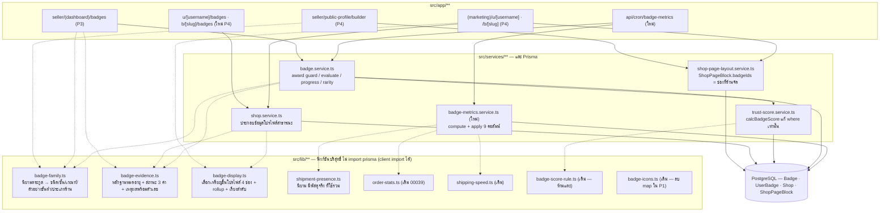
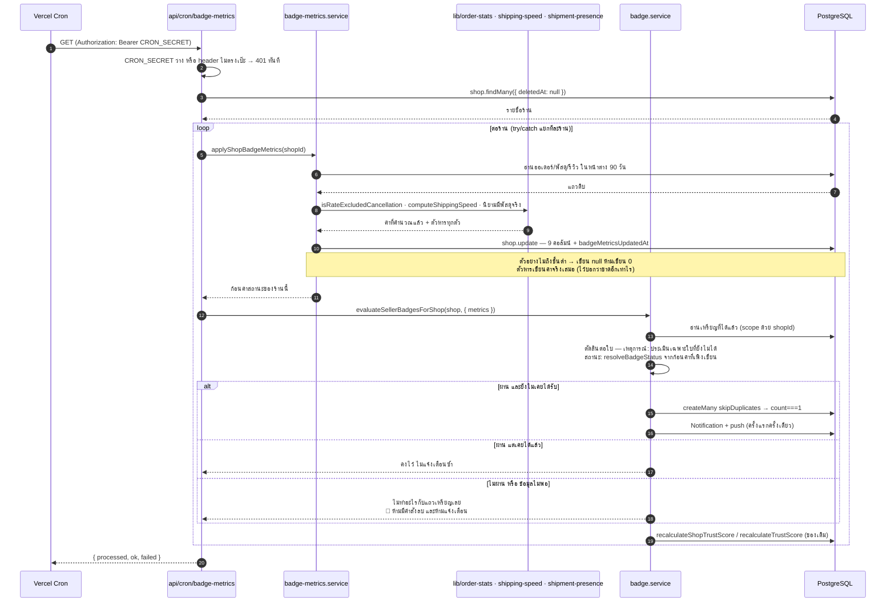
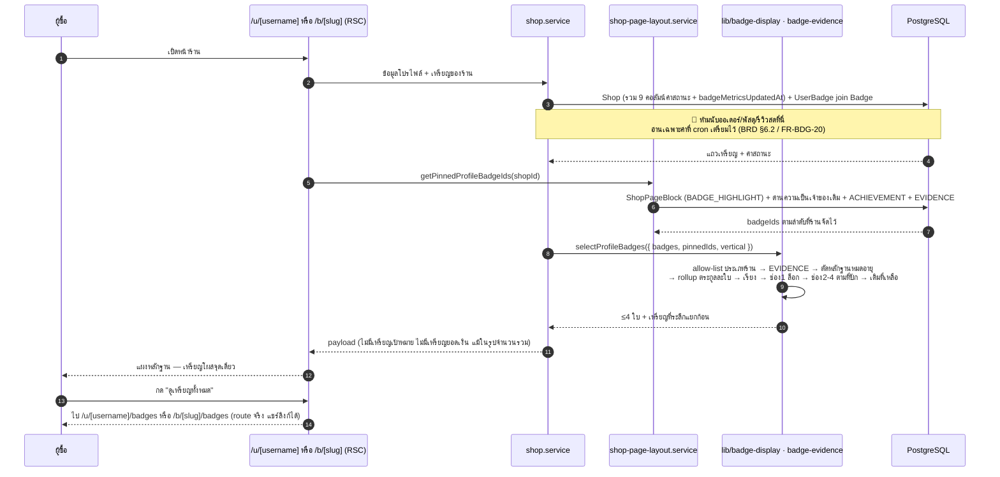
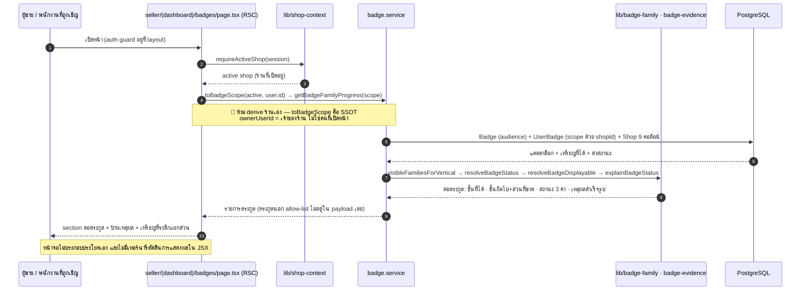
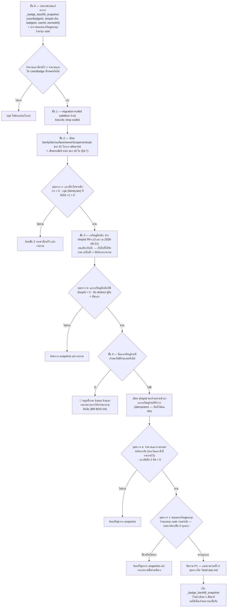

> **โมดูล:** 00052 - Badge & Achievement v2
> **ประเภทเอกสาร:** System Design Spec (SDS)
> **เวอร์ชัน:** 1.0
> **วันที่จัดทำ:** 2026-08-21
> **สถานะ:** Draft
> **เจ้าของเอกสาร:** SA (ดู [[Feature-Docs-Ownership]])

# SDS: ระบบเหรียญตราและความสำเร็จ รุ่นที่ 2 (System Design Spec)

---

## 1. บทนำ & References

### 1.1 วัตถุประสงค์

เอกสารนี้ออกแบบว่า **ข้อกำหนด FR-BDG-01 ถึง FR-BDG-27 ใน `BRD.md` จะถูกสร้างขึ้นอย่างไร** ในสถาปัตยกรรมจริงของ Deep (Next.js 16 App Router + Prisma + PostgreSQL) โดยแยกเป็น 4 เฟสตามที่ BRD กำหนด และระบุถึงระดับ "ไฟล์ไหนถูกสร้าง ไฟล์ไหนถูกแก้ ฟังก์ชันไหนต้องเป็นฟังก์ชันบริสุทธิ์เพื่อให้เทสจับได้"

ผู้อ่าน: DEV (นำไป implement ทีละ task), QA (วางแผนเทสจากจุดเสี่ยงที่ระบุ), Controller (จัดลำดับ dispatch และ commit ตาม atomic unit)

### 1.2 ขอบเขตการออกแบบ

**อยู่ในขอบเขต**

| เฟส | ขอบเขต |
|---|---|
| **P1** | คอลัมน์ใหม่บน `Badge` 5 ตัว · นิยามตระกูลรวมศูนย์ในโค้ด · ย้ายเจ้าของเหรียญไปผูกร้าน · เกณฑ์อายุอ่านวันเปิดร้าน · แก้ `where` ของตัวนับเหรียญใน Trust Score · backfill ที่ย้อนกลับได้ · ถอด emoji ออกจากคอลัมน์ `icon` |
| **P2** | คอลัมน์ค่าสถานะ 9 ตัวบน `Shop` · service คำนวณค่าสถานะ · cron รายวัน `/api/cron/badge-metrics` · เกณฑ์ใหม่ทุกตระกูล · allow-list ตามประเภทร้าน · ด่านความหายาก |
| **P3** | หน้า `/seller/badges` แสดงเป็นตระกูล+ขั้น พร้อมเหตุผลที่ยังไม่ขึ้นโปรไฟล์ |
| **P4** | โปรไฟล์สาธารณะ 4 ช่อง (ช่องแรกระบบล็อก) · **ยุบเหรียญบนโปรไฟล์ให้เหลือจุดเดียว (D-BDG-3)** · หน้าเหรียญเต็มเป็น route จริง 2 เส้น · ตัวเลือกเหรียญในตัวจัดหน้าร้านเปลี่ยนความหมาย |

**อยู่นอกขอบเขต** (ยึดตาม BRD §7.1)

- ฝั่งผู้ซื้อทั้งหมด — หน้า `/badges` และ `/m/badges` ของ buyer app ไม่ถูกแตะ
- เหรียญประมูลใบใหม่ — ของเดิม 13 ใบถูกซ่อนทั้งหมวด ไม่ปลดระวาง
- **สูตร Trust Score** — `BADGE_SCORE_PER_BADGE` / `BADGE_SCORE_MAX` ใน `src/lib/badge-score-rule.ts` ห้ามแตะแม้แต่บรรทัดเดียว
- โครงตาราง `UserBadge` — ไม่มีคอลัมน์ใหม่ ไม่ถอด partial unique index 2 ตัว
- หน้าแคตตาล็อกของแอดมิน `/admin/badges` — ไม่เพิ่มสิทธิ์และไม่เพิ่มคอลัมน์ในรอบนี้

### 1.3 เอกสารอ้างอิง

| เอกสาร | ความสัมพันธ์ |
|--------|-------------|
| `BRD.md` ของโมดูลนี้ | **ที่มาของทุกข้อกำหนดใน SDS ฉบับนี้** — FR-BDG-01..27, BR-BDG-01..22, D-BDG-1/2, ภาคผนวก ก (ไอคอน) |
| `PRD.md` ของโมดูลนี้ | เป้าหมายธุรกิจและ KPI |
| `SRS.md` ของโมดูลนี้ | ข้อกำหนดเชิงเทคนิคฉบับเต็ม — เขียนคู่ขนานกับ SDS ฉบับนี้ในวันเดียวกัน · **ที่ใดขัดกัน SRS ชนะเรื่องสูตร/เกณฑ์ ส่วน SDS ชนะเรื่องการแบ่งไฟล์และลำดับ build** |
| `DATABASE.md` ของโมดูลนี้ | DDL/SQL ของคอลัมน์ใหม่และสคริปต์ backfill — SDS อ้างอิง **ไม่เขียน SQL ซ้ำ** |
| `API.md` ของโมดูลนี้ | สัญญาของ cron endpoint และ route ใหม่ฝั่งสาธารณะ |
| `CONTEXT.md` (ราก repo) | กลอสซารีเหรียญ — คำในเอกสารนี้ทุกคำยึดตามไฟล์นั้น |
| `docs/20 - Features/00035 - Shop Page Builder/` | เจ้าของ `ShopPageBlock` ที่ D-BDG-3 ต่อสายใหม่ |
| `docs/20 - Features/00039 - Order Success Metrics/` | นิยาม "ยกเลิกที่เป็นความรับผิดชอบของร้าน" (`src/lib/order-stats.ts`) |
| `docs/conventions/partial-data-must-be-labeled-or-filled.md` | ที่มาของสถานะ 3 ค่า (ครบ/มาบางส่วน/ยังไม่มี) |
| `docs/conventions/ui-boolean-needs-a-testable-home.md` | ที่มาของกฎ "boolean ที่ตัดสิน UI ต้องมีบ้านให้เทสจับ" |
| `docs/conventions/rule-must-be-enforced-not-described.md` | ที่มาของหัวข้อ **บังคับที่** ในทุก FR ของ BRD |

---

## 2. Architecture Overview

### 2.1 มุมมองสถาปัตยกรรม

ระบบนี้ไม่ introduce framework ใหม่และไม่เพิ่ม store ใหม่ — ทั้งหมดเดินบนโครงที่มีอยู่แล้ว 3 ชั้นเดิม (`src/lib/` ฟังก์ชันบริสุทธิ์ → `src/services/` แตะ Prisma → `src/app/` route/หน้าจอ) และ **เลียนโครงงานเบื้องหลังของค่าการตอบแชทตรง ๆ**: `chat-metrics.service.ts` + `/api/cron/chat-response-metrics` คือแบบอย่างที่ P2 ก็อปโครงมาทั้งชุด (compute → apply → เขียนคอลัมน์บน `Shop` → หน้าสาธารณะอ่านคอลัมน์)

เส้นแบ่งที่สำคัญที่สุดของแผนผังนี้คือ **เส้นประ** — ทุกอย่างเหนือเส้นเป็นฟังก์ชันบริสุทธิ์ที่ client component import ได้โดยไม่ลาก `@/lib/prisma` เข้า bundle (แบบอย่าง: `src/lib/badge-score-rule.ts` ซึ่งหัวไฟล์อธิบายเหตุผลนี้ไว้เองแล้ว เพราะ `BadgeDetailModal.tsx` เป็น `'use client'`)

### 2.2 มุมมองการ Deploy

- **runtime เดิมทั้งหมด** — Next.js บน Vercel, Prisma → PostgreSQL (prod: Supabase / dev: localhost:5434)
- **cron ใหม่ 1 รายการ**: `GET /api/cron/badge-metrics` รายวัน ป้องกันด้วย `Authorization: Bearer ${CRON_SECRET}` แบบเดียวกับ cron เดิม + `export const maxDuration = 60`
  - ต้องเพิ่มรายการใน `vercel.json` ใต้ `crons` — **เปิดไฟล์ยืนยันรูปแบบรายการเดิมก่อนเพิ่ม** (SDS ฉบับนี้ไม่ได้เปิด `vercel.json`) และ **ตั้งเวลาห่างจาก `/api/cron/chat-response-metrics`** เพื่อไม่ให้ batch สองตัวไปชนกันบนฐานเดียวกัน
  - `proxy.ts` ยกเว้น `/api/cron/*` จาก CSRF Origin-check อยู่แล้ว (TD-002 ของ 00011 ext#2) — เส้นทางใหม่ได้ผลเดียวกันโดยไม่ต้องแก้อะไร **แต่ต้องยืนยันด้วยการยิงจริงหลัง deploy ไม่ใช่เชื่อคอมเมนต์**
- **migration ขึ้น prod อัตโนมัติตอน push `main`** (Hard Rule 15) — ฐาน local ต้อง `prisma migrate deploy` เอง

---

## 3. Component Design

### 3.1 P1 — โครงกระดูกและข้อมูล (เฟสเดียวที่แตะข้อมูลจริง)

| # | ไฟล์ | สร้าง/แก้ | หน้าที่ | trace |
|---|---|---|---|---|
| C-101 | `prisma/schema.prisma` | แก้ | `Badge` +5 คอลัมน์: `family String?` · `tier Int?` · `surface String @default("GOAL")` · `ownerScope String @default("SHOP")` · `verticals String[] @default([])` — **ไม่มีคอลัมน์ `nature`** | FR-BDG-01 |
| C-102 | `prisma/migrations/<ts>_badge_family_surface/migration.sql` | สร้าง | DDL additive + CHECK ของ `surface`/`ownerScope` (**ต้องอ่าน CHECK เดิมมาต่อท้าย ห้าม hardcode รายชื่อใหม่ทับ** — `docs/conventions/migration-check-constraint-additive.md`) · SQL เต็มอยู่ใน `DATABASE.md` | FR-BDG-01 |
| C-103 | `src/lib/badge-family.ts` | **สร้าง** | นิยามตระกูลรวมศูนย์ — allow-list เดียวที่ประกาศ ตระกูล → ชนิด (เหตุการณ์/สถานะ) · ขั้นและเกณฑ์ต่อขั้น · ขนาดตัวอย่างขั้นต่ำ · กลุ่มการแสดงผลต่อขั้น · ประเภทร้านที่เห็น · เจ้าของ (ร้าน/บุคคล) · แผนที่ `nameEN → { family, tier }` สำหรับ backfill/seed | FR-BDG-01, 09–19 |
| C-104 | `prisma/seed.ts` | แก้ | เขียน `family/tier/surface/ownerScope/verticals` ของ 31 ใบเดิมจาก C-103 + เพิ่มเหรียญใหม่ 14 ใบ (P2) — **ค่าทั้งหมด derive จาก C-103 ห้ามพิมพ์ซ้ำในไฟล์ seed** | FR-BDG-01 |
| C-105 | `src/services/badge.service.ts` → `awardBadge()` | แก้ | ด่านฝั่งเจ้าของ: อ่าน `ownerScope` ของเหรียญจาก C-103 แล้ว **โยน error** เมื่อ (ก) เหรียญร้านถูกมอบโดยไม่มี `shopId` (ข) เหรียญบุคคลถูกมอบพร้อม `shopId` — ปฏิเสธที่จุดมอบ ไม่ใช่หวังว่าไม่มีใครเรียกผิด | FR-BDG-02 |
| C-106 | `src/services/badge.service.ts` → `evaluateBadges()` / `runBadgeEvaluation()` | แก้ | เส้น personal ต้องส่ง `shopIdForAward = personal shop id` สำหรับเหรียญ `ownerScope='SHOP'` และคง `null` สำหรับ `ownerScope='USER'` — ปัจจุบัน `evaluateBadges` ส่ง `null` เสมอ (บรรทัด `runBadgeEvaluation({ userId, shop, shopIdForAward: null }, ...)`) ซึ่งเป็นสาเหตุที่ร้านส่วนตัวเขียนค่าว่างมาตลอด | FR-BDG-02 |
| C-107 | `src/services/badge.service.ts` → `checkVeteran()` | แก้ | อ่านอายุจาก `shop.createdAt` แทน `user.createdAt` (บรรทัดปัจจุบัน: `const daysOld = (Date.now() - user.createdAt.getTime()) / ...`) · `shop === null` → `met=false, daysOld=0` **ห้ามคำนวณอายุจากบัญชีแล้วผ่าน** · เงื่อนไข "มีออเดอร์ปิดจบใน 30 วัน" คงเดิมทุกบรรทัด | FR-BDG-04 |
| C-108 | `src/services/trust-score.service.ts` → `calcBadgeScore()` | แก้ | **แก้ `where` บรรทัดเดียว** เส้น personal เป็น `{ OR: [ { userId, shopId: null }, { shopId: personalShopId } ] }` โดย `personalShopId` มาจาก `resolveOrderScopeShopId(scope)` ที่มีอยู่แล้วในไฟล์เดียวกัน · ไม่มี `personalShopId` → คงเงื่อนไขเดิม · เส้น business ไม่แตะ · `BADGE_SCORE_PER_BADGE`/`BADGE_SCORE_MAX` ไม่แตะ | FR-BDG-05 / D-BDG-1 |
| C-109 | `scripts/backfill-badge-ownership.ts` | **สร้าง** | สคริปต์ backfill ที่รันซ้ำได้ผลเดิม + เขียนตารางภาพก่อนแก้ + หยุดและรายงานเมื่อแมปเจ้าของไม่ได้ (ดู §4.5) | FR-BDG-02/03/05 |
| C-110 | `src/lib/badge-icons.ts` | แก้ | ลบ `LUCIDE_FOR_BADGE` + `lucideForBadge` หลังค่าถูกเขียนลงคอลัมน์แล้ว (ดู §3.7 ลำดับที่ปลอดภัย) | ภาคผนวก ก |
| C-111 | `src/app/(paces)/seller/(dashboard)/_constants/badge-icons.ts` | แก้ | ไฟล์นี้เป็น **re-export ล้วน** (`export { LUCIDE_FOR_BADGE, FALLBACK_LUCIDE, lucideForBadge } from '@/lib/badge-icons'`) ⇒ ต้องแก้พร้อมกันในคอมมิตเดียวกับ C-110 ไม่งั้น `tsc` แดง | ภาคผนวก ก |

**เทส P1 ที่ต้องมี** (`[blocker]` ทุกตัว พิสูจน์ด้วย mutation)

- `badge-family.test.ts` — อ่านแคตตาล็อกจริงแล้วยืนยันว่าทุกใบแมปเข้าตระกูลได้ · ลบแถวใดแถวหนึ่งออกจาก allow-list ต้องแดง · ไม่มี `(family, tier)` ซ้ำ
- `badge-award-owner-guard.test.ts` — 2 เคส (เหรียญร้านไม่มีร้าน / เหรียญบุคคลมีร้าน) ถอดด่านออกต้องแดง
- `badge-veteran-shop-age.test.ts` — บัญชีอายุ 400 วัน ร้านอายุ 10 วัน ต้องได้ "ไม่ผ่าน" · ย้อนไปอ่าน `user.createdAt` ต้องแดง
- `trust-badge-score-parity.test.ts` — ร้านส่วนตัวถือเหรียญ 3 ใบที่ผูกร้าน ต้องได้คะแนนเหรียญ 3 · คืน `where` เดิมต้องแดง

### 3.2 P2 — เกณฑ์ใหม่และงานเบื้องหลัง

| # | ไฟล์ | สร้าง/แก้ | หน้าที่ | trace |
|---|---|---|---|---|
| C-201 | `prisma/schema.prisma` + migration | แก้/สร้าง | `Shop` +9 คอลัมน์ nullable: `badgeMetricsUpdatedAt` · `shipSpeedAvgHours` + `shipSpeedSampleSize` · `trackingCoverageRate` + `trackingCoverageSampleSize` · `sellerCancelCount90d` + `orderSample90d` · `reviewReplyRate` + `reviewReplySampleSize` — **สัดส่วนเป็นร้อยละ 0–100** ให้ตรงกับ `chatResponseRate` ที่อยู่ในตารางเดียวกัน (HR16: หน่วยของคอลัมน์ข้างเคียงต้องเป็นชุดเดียวกัน) | FR-BDG-20 |
| C-202 | `src/services/badge-metrics.service.ts` | **สร้าง** | โครงเลียน `chat-metrics.service.ts` เป๊ะ: `computeShopBadgeMetrics(shopId, windowDays=90)` (อ่านอย่างเดียว คืนก้อนค่า) + `applyShopBadgeMetrics(shopId)` (compute แล้ว `prisma.shop.update` 9 คอลัมน์ พร้อม `badgeMetricsUpdatedAt = new Date()`) · export ค่าคงที่ `BADGE_METRICS_WINDOW_DAYS = 90` | FR-BDG-20 |
| C-203 | `src/app/api/cron/badge-metrics/route.ts` | **สร้าง** | โครงเลียน `chat-response-metrics/route.ts` ทุกบรรทัดของส่วน auth: `CRON_SECRET` ว่าง → 401 ทันที · เทียบ `Bearer ${secret}` แบบสตริงเต็ม · loop `shop.findMany({ where: { deletedAt: null } })` · **try/catch แยกทีละร้าน** · คืน `{ processed, ok, failed }` · `maxDuration = 60` | FR-BDG-20 |
| C-204 | `src/lib/shipment-presence.ts` | **สร้าง** | นิยาม "ออเดอร์นี้มีพัสดุจริงแล้ว" ที่ใช้ร่วม — `OrderShipment.status='CREATED' AND isDryRun=false` (ยืนยันจาก `order-stage.service.ts` บรรทัด 123 และ 163 ซึ่งเขียนเงื่อนไขนี้เป็น raw SQL ซ้ำ 2 ที่) + ทางเข้าที่สอง `ShipmentTracking` (ร้านกรอกเลขเอง) ตามที่ `resolveShippedAt()` ใน `shipping-speed.ts` อ่านอยู่แล้ว | FR-BDG-14/15, BR-BDG-17 |
| C-205 | `src/services/badge.service.ts` → handler ใหม่ | แก้ | handler ของเกณฑ์สถานะ 4 ชนิด (`NO_SELLER_CANCEL_90D`, `REVIEW_REPLY_RATE`, `SHIP_SPEED_AVG`, `TRACKING_COVERAGE`) และเกณฑ์เหตุการณ์ใหม่ `GMV_TOTAL` — handler สถานะ **อ่านจากก้อนค่าที่ cron เพิ่งคำนวณ (ส่งเข้ามาทาง `EvalScope.metrics`) ไม่ query ซ้ำ** | FR-BDG-11..15 |
| C-206 | `src/services/badge.service.ts` → `runBadgeEvaluation()` | แก้ | `EvalScope` เพิ่มช่อง `metrics?: ShopBadgeMetrics` · เพิ่ม `default:` ของ `switch` ให้ยังเป็น `console.warn` + `continue` เหมือนเดิม (เหรียญใหม่ที่ยังไม่มี handler ห้ามทำ flow หลักพัง) · **ห้ามมีคำสั่งลบแถว `UserBadge` แม้บรรทัดเดียว** | FR-BDG-06/20 |
| C-207 | `src/services/badge.service.ts` → `getBadgeRarity()` | แก้ | ย้ายด่าน "ฐานต่ำกว่า 20 ร้าน → คืนค่าว่าง" ลงมาที่ตัวคำนวณ + เปลี่ยนตัวหารเป็น **ร้านที่ขายจริง** (ร้านที่มีออเดอร์ปิดจบ ≥1 ใบ) · ปัจจุบันด่านอยู่ใน `BadgeDetailModal.tsx` เท่านั้น ⇒ ผู้เรียกรายอื่นได้ชั้นความหายากมาโดยไม่มีด่าน | FR-BDG-27 |
| C-208 | `src/lib/badge-evidence.ts` | **สร้าง** | ดู §3.5 | FR-BDG-06/07/22/23 |
| C-209 | `vercel.json` | แก้ | รายการ cron รายวัน | FR-BDG-20 |

**เทส P2 ที่ต้องมี**

- สแกนซอร์สของ cron + service: ห้ามพบ `userBadge.delete`/`deleteMany` (FR-BDG-06/20)
- คอลัมน์สัดส่วนทุกตัวต้องมีคอลัมน์ตัวหารคู่กัน — เพิ่มสัดส่วนใหม่โดยไม่เพิ่มตัวหาร = แดง
- `shipment-presence` — เทสสแกน raw SQL ใน `order-stage.service.ts` ว่ายังใช้คู่ `status='CREATED'` + `isDryRun = false` ตรงกับค่าคงที่ในไฟล์ใหม่ (กันสองนิยามเดินคนละทาง)
- รันงานเบื้องหลังซ้ำ 3 รอบกับร้านที่หลุดเกณฑ์ → จำนวนแถว `Notification` คงที่ (FR-BDG-08)
- `getBadgeRarity` ด้วยฐาน 19 ร้าน → ค่าว่าง (ย้ายด่านกลับไปหน้าจอ = แดง)

### 3.3 P3 — หน้าเหรียญของผู้ขาย

| # | ไฟล์ | สร้าง/แก้ | หน้าที่ |
|---|---|---|---|
| C-301 | `src/app/(paces)/seller/(dashboard)/badges/page.tsx` | แก้ | คง `requireActiveShop` → `toBadgeScope(active, user.id)` → service ตามที่ทำอยู่แล้ว (ห้าม derive ร้านเอง) · เปลี่ยนจากส่ง `earned`/`locked` เป็นส่ง **รายการตระกูล** |
| C-302 | `src/services/badge.service.ts` → `getBadgeFamilyProgress()` | สร้าง (ข้าง `getBadgeProgress`) | จัดกลุ่มผลของ `getBadgeProgress` เป็นตระกูล + แนบค่าสถานะจากคอลัมน์ของร้าน + เรียกตัวตัดสินใน `badge-evidence.ts` ให้ได้ **สถานะ + เหตุผล มาเป็นก้อนเดียวกัน** · จำนวนคำขอฐานข้อมูลต่อการเปิดหน้า **ต้องไม่โตตามจำนวนเหรียญ** (BRD §6.2) — ปัจจุบัน `getBadgeProgress` ใช้ `Promise.all` ต่อใบอยู่แล้ว การโตจาก 31 → 45 ใบจึงเป็นจุดเสี่ยงที่ต้องวัดจริง |
| C-303 | `badges/BadgeGrid.tsx` | แก้ | จากกองการ์ด → section ต่อตระกูล (แถบขั้น + ขั้นถัดไปพร้อมตัวเลขที่ขาด) · ตระกูลที่ประเภทร้านนี้ไม่มีสิทธิ์ **ไม่ render เลย ไม่ใช่ทำจาง** |
| C-304 | `badges/BadgeReasonRow.tsx` | สร้าง | แสดงป้ายสถานะ + เหตุผล 3 แบบ (เป้าหมายโดยการออกแบบ / หน้าต่างล่าสุดไม่ผ่าน+ตัวเลข / ถูกแทนที่ด้วยขั้นสูงกว่า) — **รับข้อความสำเร็จรูปมาจาก service ห้ามประกอบประโยคเอง** |
| C-305 | `badges/BadgeDetailModal.tsx` | แก้ | ถอดด่าน `shopCount >= 20` ออก (ย้ายไป C-207) แล้วอ่านผลจากตัวคำนวณตรง ๆ |
| C-306 | `badges/BadgeImage.tsx` | แก้ | เลิกเรียก `lucideForBadge` (name-only) → ใช้ `badgeIconName(nameEN, dbIcon)` ต้องส่งค่า `icon` จาก DB มาให้ครบ (ผูกกับ §3.7) |

🛑 **P3 และ P4 แตะไฟล์ใต้ `src/app/**` และ `src/views/**` ⇒ ต้องผ่าน `safepay-ux` ก่อนเขียนโค้ด (Hard Rule 8) และรัน `/impeccable critique` + `/impeccable clarify` ก่อนปิดงาน**

### 3.4 P4 — โปรไฟล์สาธารณะ + D-BDG-3 (ยุบเหรียญให้เหลือจุดเดียว)

**ปัญหาที่ต้องแก้ (ยืนยันจากโค้ดจริง):** `ShopProfile.tsx` เรนเดอร์เหรียญ 2 ที่ห่างกัน 26 บรรทัด — บรรทัด 299–318 ส่ง `data.hero.badges` เข้า `EvidencePanel` (ระบบเลือกให้ แล้วส่งต่อไป `BadgeShowcase`) และบรรทัด 325 `<PageBlocksSection blocks={effectiveBlocks} />` ซึ่งเรนเดอร์บล็อก `BADGE_HIGHLIGHT` ของ 00035 (ร้านเลือกเอง ≤4 ใบ) **สองที่นี้มีเพดาน 4 เท่ากันแต่กติกาคนละชุด = Hard Rule 16 เต็มรูปแบบ**

**ทางออกที่เลือก: ไม่ลบฟีเจอร์ 00035 แต่ต่อสายใหม่** — `ShopPageBlock` ชนิด `BADGE_HIGHLIGHT` เปลี่ยนความหมายจาก "บล็อกที่แสดงเอง" เป็น **"รายการเหรียญที่ร้านขอปักในช่องที่ 2–4 ของแผงหลักฐาน"** โดยใช้แถวเดิมทั้งดุ้น

| # | ไฟล์ | สร้าง/แก้ | หน้าที่ |
|---|---|---|---|
| C-401 | `src/lib/badge-display.ts` | **สร้าง** | ตัวเลือกเหรียญ 4 ช่อง (ดู §3.5) |
| C-402 | `src/lib/profile-page-blocks.ts` | **สร้าง** | `splitProfileBlocks(blocks)` → `{ pinnedBadgeIds: string[], blocks: ShopPageBlockView[] }` — ฟังก์ชันบริสุทธิ์ที่แยกบล็อกเหรียญออกจากบล็อกที่ยังเรนเดอร์เป็นบล็อกจริง ใช้ร่วม **ทั้ง `/u/[username]` และ `/b/[slug]`** (โปรไฟล์สาธารณะมี 2 URL เสมอ — แก้เส้นเดียวไม่พอ) |
| C-403 | `src/views/pages/user-profile/v2/PageBlocksSection.tsx` | แก้ | **ถอดกิ่ง `BADGE_HIGHLIGHT` ออกทั้งก้อน** (ลบ `BadgeHighlightBlock`, `PageBlockBadge`, `MAX_BLOCK_BADGES`, import `badgeIconName`) เหลือเฉพาะ `FACEBOOK_POST` · type `PageBlockItem` แคบลงเหลือชนิดเดียว ⇒ `tsc` จะบังคับให้ผู้เรียกทั้ง 2 หน้าเปลี่ยนตามในคอมมิตเดียวกัน (**นี่คือเหตุผลที่ต้องแคบ type ไม่ใช่แค่ `return null`**) |
| C-404 | `src/views/pages/user-profile/v2/ShopProfile.tsx` | แก้ | รับ `pinnedBadgeIds` แล้วส่งลง `EvidencePanel` · `effectiveBlocks` ผ่าน `splitProfileBlocks` ก่อนส่งเข้า `PageBlocksSection` |
| C-405 | `EvidencePanel.tsx` + `BadgeShowcase.tsx` | แก้ | แถวเหรียญ = ผลของ `selectProfileBadges()` (สูงสุด 4) + เหรียญที่ระลึกแสดงแยก ไม่กินโควตา · ร้านที่ไม่มีเหรียญหลักฐานเลย → ไม่แสดงส่วนเหรียญและไม่แสดงกรอบเปล่า (`BadgeShowcase` มี `if (badges.length === 0) return null` อยู่แล้ว — คงไว้) |
| C-406 | `src/app/(marketing)/u/[username]/badges/page.tsx` + `.../b/[slug]/badges/page.tsx` | **สร้าง** | หน้าเหรียญเต็มเป็น **route จริง 2 เส้น** แทน full-screen `<Dialog>` ปัจจุบัน — หัวไฟล์ `BadgeShowcase.tsx` เขียนไว้เองแล้วว่า overlay เป็นของชั่วคราวและตอน promote ต้องทำเป็น route ทั้ง 2 เส้น · แสดงเฉพาะเหรียญหลักฐาน + ที่ระลึก **ห้ามหลุดเหรียญเป้าหมายและเหรียญยอดเงิน** |
| C-407 | `src/services/shop.service.ts` | แก้ | ประกอบข้อมูลเหรียญของโปรไฟล์จาก **คอลัมน์ที่ cron เขียนไว้ + แถว `UserBadge`** เท่านั้น — ห้ามนับออเดอร์/รีวิวสด (BRD §6.2) |
| C-408 | `src/services/shop-page-layout.service.ts` | แก้ | เพิ่ม `getPinnedProfileBadgeIds(shopId)` ที่ใช้ `resolveBadgeOwnershipWhere()` ตัวเดิม + กรอง `badge: { type: 'ACHIEVEMENT' }` ตัวเดิม **และเพิ่ม `badge: { surface: 'EVIDENCE' }`** · ฝั่งเขียน `saveShopPageLayout` เพิ่มเงื่อนไข `surface='EVIDENCE'` ในด่าน `BADGE_NOT_OWNED` ที่มีอยู่แล้ว (ปัจจุบันตรวจ `{ id: { in: badgeIds }, ...badgeOwnerWhere, badge: { type: 'ACHIEVEMENT' } }`) |
| C-409 | `builder/components/BadgePickerModal.tsx` | แก้ | ดู §3.6 |
| C-410 | `builder/components/LibraryPanel.tsx` + `CanvasFrame.tsx` | แก้ | เปลี่ยนคำเรียกบล็อกจาก "เหรียญตราเด่น" เป็นคำที่บอกว่ามันคุมอะไร (ux เคาะคำสุดท้าย) และตำแหน่งจำลองบน canvas ต้องย้ายไปอยู่ในแผงหลักฐาน ไม่ใช่แถบแยกเหนือแท็บ |

**ชะตากรรมของแถว `ShopPageBlock` ชนิด `BADGE_HIGHLIGHT` ที่มีอยู่บน prod แล้ว** (ตอบตรง ๆ ตามที่ต้องระบุ)

| ประเด็น | คำตอบ |
|---|---|
| ต้อง migrate ข้อมูลไหม | **ไม่ต้อง** — `badgeIds` เก็บ `UserBadge.id` อยู่แล้ว (ยืนยันจากคอมเมนต์ใน `shop-page-layout.service.ts` และ `resolveBadgeOwnershipWhere`) ซึ่งเป็นสิ่งเดียวกับที่ตัวเลือกช่อง 2–4 ต้องใช้ |
| ยังถูกอ่านต่อไหม | **อ่านต่อ** ผ่าน `getPinnedProfileBadgeIds()` — แถวเดิม ตารางเดิม API เดิม (`saveShopPageLayout`) |
| ยังเรนเดอร์เป็นบล็อกไหม | **เลิกเรนเดอร์เป็นบล็อกแยก** (C-403) — เหรียญโผล่ที่แผงหลักฐานจุดเดียว |
| แถวที่ปักไว้ 4 ใบ | ช่องที่ร้านจัดได้เหลือ 3 (ช่องแรกระบบล็อก) ⇒ **ใบที่ 4 ถูกข้ามอย่างเงียบ ๆ ไม่ใช่ error** และหน้าตัวจัดหน้าร้านต้องบอกร้านว่าเลือกได้ 3 ใบ · **Valibot `maxLength(4)` และ CHECK ใน DB คงเดิม** ไม่แก้ (ดู TD-006) |
| เหรียญที่ปักไว้แล้วต่อมาไม่ผ่านเกณฑ์ | ซ่อนชั่วคราว **ไม่ลบการตั้งค่า** แล้วเติมช่องด้วยอันดับถัดไป · กลับมาผ่านเมื่อไรกลับขึ้นช่องเดิมเอง (FR-BDG-24) |
| เหรียญที่ปักไว้แต่ `surface != 'EVIDENCE'` หลัง P1 | ถูกกรองทิ้งที่ `getPinnedProfileBadgeIds()` — แถวยังอยู่ ไม่ error (fail-safe เดียวกับที่ `listShopPageBlocks` ทำกับเหรียญที่ถูกถอด) |
| ห้ามทำ | **ห้ามสร้างตารางใหม่ ห้ามสร้าง API ใหม่** สำหรับ "เหรียญที่ร้านปัก" — ของเดิมครบแล้ว (ตรวจแล้ว: ตาราง + Valibot ≤4 + ด่านความเป็นเจ้าของ + ลำดับที่ร้านจัด ทำงานอยู่ทั้งหมด) |

### 3.5 ฟังก์ชันบริสุทธิ์ที่ต้องสกัดออกมาให้เทสจับได้

ทุกตัวอยู่ใต้ `src/lib/badge-*.ts` **ไม่ import `@/lib/prisma` และไม่ import service ใด ๆ** (แบบอย่าง `badge-score-rule.ts`) เพราะทั้ง `BadgeDetailModal.tsx`, `BadgeGrid.tsx`, `BadgeShowcase.tsx`, `BadgePickerModal.tsx` เป็น `'use client'` ทั้งหมด

🛑 **กฎร่วมของทั้งหมวดนี้:** boolean ที่ตัดสินว่าหน้าจอจะแสดง/ไม่แสดงอะไร **ห้ามอยู่ในเทอร์นารีกลาง JSX ต่อให้สั้นแค่ไหน** — เกณฑ์ไม่ใช่ "ซับซ้อนพอไหม" แต่คือ "เขียนกลับด้านแล้วจะมีอะไรจับได้ไหม" (`docs/conventions/ui-boolean-needs-a-testable-home.md`)

| ฟังก์ชัน | ไฟล์ | รับ | คืน | เทส `[blocker]` ที่ต้องแดงเมื่อ mutate |
|---|---|---|---|---|
| `BADGE_FAMILIES` (allow-list) | `badge-family.ts` | — | นิยามทุกตระกูล: ชนิด (`EVENT`/`STATE`) · ขั้น+เกณฑ์ · ขนาดตัวอย่างขั้นต่ำ · เจ้าของ · `verticals` | ลบตระกูลใดตระกูลหนึ่ง → เทสที่อ่านแคตตาล็อกจริงต้องแดง |
| `resolveBadgeFamily(nameEN)` | `badge-family.ts` | ชื่ออังกฤษของเหรียญ | `{ family, tier, nature, surface } \| null` | เหรียญที่แมปไม่ได้ต้องได้ `null` ไม่ใช่เดาตระกูล |
| `visibleFamiliesForVertical(vertical)` | `badge-family.ts` | ค่าประเภทร้าน (string ดิบจาก DB) | รายการตระกูลที่เห็นได้ | ส่งค่ามั่ว → ต้องได้ **ชุดกลาง** (ตระกูลที่ `verticals` ว่าง) · เปลี่ยนเป็น deny-list → แดง · **ห้ามลอก fallback ของ `VERTICAL_VISIBLE_SLUGS` ที่ตกไป `ONLINE_SALES`** (ดู TD-009) |
| `resolveEvidenceFreshness(metric, updatedAt, now)` | `badge-evidence.ts` | ค่าสถานะ + เวลาที่คำนวณล่าสุด | `'FRESH' \| 'STALE' \| 'NEVER'` | ค่าที่เก่าเกินเพดาน → ต้องถือว่า **"ยังไม่รู้"** ไม่ใช่ใช้ค่าค้างต่อ (BRD §6.3) |
| `resolveBadgeStatus(input)` | `badge-evidence.ts` | ตระกูล+ขั้น, ค่าที่วัดได้, ตัวหาร, ความสด | **สถานะ 3 ค่า** `'PASS' \| 'PARTIAL_DATA' \| 'FAIL'` **ไม่ใช่ boolean** พร้อมตัวเลขที่ใช้ตัดสิน | ทำให้ `PARTIAL_DATA` กลายเป็น `FAIL` → แดง (FR-BDG-23) |
| `resolveBadgeDisplayable(input)` | `badge-evidence.ts` | ผลของสองตัวบน + `surface` + ชนิด | `{ displayable: boolean; reason: BadgeHiddenReason }` — **ผลกับเหตุผลออกมาก้อนเดียวกัน** | กลับด้านเงื่อนไขหน้าต่างเวลา → แดง · คืนเหตุผลว่างขณะ `displayable=false` → แดง |
| `explainBadgeStatus(input)` | `badge-evidence.ts` | ก้อนเดียวกับข้างบน | ข้อความไทยที่มี **ทั้งค่าที่วัดได้ ตัวหาร และเกณฑ์** เช่น `"90 วันล่าสุดมีใบที่ร้านยกเลิกเอง 2 ใบ จาก 41 ใบ · เกณฑ์คือ 0 ใบ"` · ข้อมูลไม่พอใช้ **ชุดคำคนละชุด** | ข้อความที่ไม่มีตัวเลขทั้งสองฝั่ง → แดง · ห้ามมีคำที่สื่อว่าเหรียญถูกยึด/ริบ (เทสสแกนคำ) |
| `rollupFamilyTop(badges)` | `badge-display.ts` | เหรียญที่ได้รับทั้งหมดของร้าน | ขั้นสูงสุดที่ **ผ่านและแสดงได้** ต่อ 1 ตระกูล | ตระกูลเดียวกัน 3 ขั้น → ต้องเหลือ 1 |
| `orderEvidenceBadges(badges)` | `badge-display.ts` | ผลของ rollup | เรียง **ขั้นสูงก่อน เสมอกันตัดสินด้วยวันที่ได้รับ (ได้ก่อนอยู่ก่อน)** — ผลต้องคงที่ทุกครั้ง | ขั้นเท่ากันวันที่ต่างกัน → ลำดับต้องคงที่ · ข้อมูลชุดเดิมเรียงซ้ำต้องได้ผลเดิม |
| `selectProfileBadges({ badges, pinnedIds, vertical })` | `badge-display.ts` | เหรียญทั้งหมด + `badgeIds` ที่ร้านปัก + ประเภทร้าน | **ไม่เกิน 4 ใบ** ตามลำดับ: ① allow-list ตามประเภทร้าน (fail-closed) → ② คัดเฉพาะ `EVIDENCE` → ③ ตัดเหรียญสถานะที่หลักฐานหมดอายุ → ④ rollup เหลือ 1 ใบต่อตระกูล → ⑤ เรียงด้วยขั้น เสมอตัดด้วยวันที่ได้รับ → ⑥ **ช่องที่ 1 ล็อกเป็นอันดับ 1 ของระบบ** → ⑦ ช่อง 2–4 เดินตาม `pinnedIds` ตามลำดับ ข้ามใบที่แสดงไม่ได้/ตระกูลซ้ำ → ⑧ เติมช่องที่เหลือด้วยอันดับถัดไป | ปลดล็อกช่องที่ 1 ให้ร้านเลือกได้ → แดง · คืนมากกว่า 4 ใบ → แดง · เหรียญที่ระลึกโผล่ในผล → แดง · ตระกูลซ้ำในผล → แดง |
| `splitProfileBlocks(blocks)` | `profile-page-blocks.ts` | บล็อกจาก `listShopPageBlocks` | `{ pinnedBadgeIds, blocks }` | บล็อกเหรียญหลุดกลับเข้า `blocks` → แดง (กันเหรียญกลับมาโผล่ 2 ที่) |

### 3.6 หน้าจอ 6 จุดที่แสดงเหรียญวันนี้

| # | จุด | ไฟล์หลัก | รอบนี้แตะไหม | ทำอะไร |
|---|---|---|---|---|
| 1 | **หน้าเหรียญของผู้ขาย** `/seller/badges` | `badges/page.tsx` · `BadgeGrid.tsx` · `BadgeDetailModal.tsx` · `BadgeImage.tsx` | **แตะ (P3)** | จัดเป็นตระกูล+ขั้น · เหตุผลพร้อมตัวเลข · ป้ายข้อมูลไม่พอ · ถอดด่านความหายากออกจากโมดัล |
| 2 | **แผงหลักฐานบนโปรไฟล์สาธารณะ** (`/u/[username]` + `/b/[slug]`) | `ShopProfile.tsx` → `EvidencePanel.tsx` → `BadgeShowcase.tsx` | **แตะ (P4)** | กลายเป็น **จุดเดียวที่เหรียญโผล่บนโปรไฟล์** · 4 ช่อง ช่องแรกระบบล็อก · ที่ระลึกแยก |
| 3 | **บล็อกเหรียญเด่นของ 00035 บนโปรไฟล์** | `PageBlocksSection.tsx` | **แตะ (P4)** | **เลิกเรนเดอร์เป็นบล็อก** — กิ่ง `BADGE_HIGHLIGHT` ถูกถอด และ type แคบลงเพื่อให้ `tsc` บังคับผู้เรียกทั้ง 2 หน้า |
| 4 | **ตัวจัดหน้าร้าน (ตัวเลือกเหรียญ)** | `BadgePickerModal.tsx` · `LibraryPanel.tsx` · `CanvasFrame.tsx` | **แตะ (P4)** | ดูตารางถัดไป |
| 5 | **เหรียญของผู้ซื้อ** `/badges` + `/m/badges` | `(buyer-app)/badges/page.tsx` · `BadgeIcon.tsx` | **ไม่แตะ** | อยู่นอกขอบเขต (BRD §7.1) — ได้รับผลข้างเคียงจาก §3.7 เท่านั้น ซึ่ง **หน้าจอไม่เปลี่ยน** |
| 6 | **แคตตาล็อกของแอดมิน** `/admin/badges` | `admin/(dashboard)/badges/page.tsx` | **ไม่แตะ** | BRD ระบุว่าไม่มีการเพิ่มสิทธิ์ใหม่ — การโชว์คอลัมน์ตระกูล/ขั้นเป็นงานรอบหลัง |
| (7) | **หน้าเหรียญเต็มฝั่งสาธารณะ** | `u/[username]/badges` · `b/[slug]/badges` | **สร้างใหม่ (P4)** | ปลายทางจริงที่แชร์ลิงก์ได้ แทน full-screen dialog |

**`BadgePickerModal` ต้องเปลี่ยนอย่างไรเมื่อเหรียญมี `surface`/ตระกูลแล้ว**

| ของเดิม (ยืนยันจากไฟล์) | ของใหม่ | เหตุผล |
|---|---|---|
| `const MAX_BADGES = 4` | **`= 3`** | ช่องที่ 1 เป็นของระบบ (FR-BDG-24) — ถ้ายังให้เลือก 4 ผู้ขายจะเลือกครบแล้วเห็นใบที่ 4 หายไปเฉย ๆ โดยไม่มีอะไรอธิบาย |
| กรองแค่ `Badge.type='ACHIEVEMENT'` ที่ query ต้นทาง (`getBuilderLibrary`) | เพิ่ม **`surface='EVIDENCE'`** ที่ query ต้นทาง **และ** ที่ด่านฝั่งเขียนใน `saveShopPageLayout` | การกรองที่หน้าจอไม่ใช่การควบคุมสิทธิ์ (BR-BDG-21) — เหรียญเป้าหมาย/ยอดเงินต้องยิงตรงเข้ามาก็ไม่ผ่าน |
| เลือกซ้ำตระกูลได้ (ไม่มีแนวคิดตระกูล) | **ห้ามเลือกซ้ำตระกูล** — เลือกใบหนึ่งแล้ว ใบอื่นในตระกูลเดียวกันถูกปิดพร้อมข้อความว่าอยู่ตระกูลเดียวกัน | ตรงกับ FR-BDG-25 ที่โปรไฟล์รับตระกูลละใบ ถ้าปล่อยให้เลือกซ้ำ ระบบจะข้ามให้เงียบ ๆ = ร้านเลือกแล้วไม่เกิดผล |
| ไม่รู้ว่าเหรียญใบไหนกำลังแสดงได้จริง | เหรียญสถานะที่ **หลักฐานหมดอายุ** ต้องเลือกได้แต่ติดป้ายว่า "ตอนนี้ยังไม่ขึ้นหน้าร้าน" พร้อมเหตุผลจาก `explainBadgeStatus()` | ห้ามลบการตั้งค่าของร้านเพราะค่าวันนี้ไม่ผ่าน (FR-BDG-24) แต่ต้องไม่หลอกว่ากำลังแสดงอยู่ |
| ข้อความ `เลือกได้สูงสุด {MAX_BADGES} ใบ · จัดลำดับได้` | ต้องบอกด้วยว่า **ช่องแรกเป็นของระบบ** | ไม่งั้นร้านจะนับช่องบนหน้าร้านไม่ตรงกับที่เลือก |
| ปุ่มบันทึกปิดเมื่อเลือก 0 ใบ | **คงไว้** | บล็อกที่ไม่มีเหรียญเลย = ไม่เหลืออะไรให้ทำ ตรรกะเดิมยังถูก |

### 3.7 การเอา emoji ออกจากคอลัมน์ `icon` ของเหรียญเดิม 18 ใบ

**ข้อเท็จจริงจากโค้ด:** `badgeIconName(nameEN, dbIcon)` ใน `src/lib/badge-icons.ts` มีลำดับความสำคัญ `normalizeIconifyName(dbIcon)` → `LUCIDE_FOR_BADGE[nameEN]` → `FALLBACK_LUCIDE` และ `normalizeIconifyName` คืน `null` ทันทีเมื่อค่าไม่ขึ้นต้นด้วยตัวอักษร ascii (= emoji ถูกทิ้ง) ⇒ **การเขียนชื่อไอคอนลงคอลัมน์ทำให้เส้นทางเดินหยุดที่ขั้นแรก และได้ค่าเท่ากับที่ map เคยให้เป๊ะ ๆ หน้าจอจึงไม่เปลี่ยนแม้แต่ใบเดียว** — `LUCIDE_FOR_BADGE` มี 18 คีย์พอดี ตรงกับ 18 ใบใน BRD ภาคผนวก ก.1

**ลำดับที่ปลอดภัย (ทั้งหมดอยู่ในคอมมิตเดียวกันตาม BRD ก.1 แต่เรียงตามนี้ภายในคอมมิต)**

1. **เขียนค่าลงคอลัมน์ก่อน** — migration/seed patch เขียน `Badge.icon` ของ 18 ใบด้วยค่าจาก `LUCIDE_FOR_BADGE` ตรงตัว **ยกเว้น `Spotless 100`** ที่เปลี่ยนจาก `lucide:sparkles` (ซ้ำกับ `Highly Rated` ทั้งที่ D-BDG-2 แยกสองใบนี้คนละตระกูลแล้ว) เป็น **`tabler-shield-checkered`** ให้เป็นบันไดเดียวกับ `Zero Complaint` · `2026_BADGE` ที่คอลัมน์เป็น `null` ได้ `lucide:flag`
2. **พิสูจน์ว่าหน้าจอไม่เปลี่ยน** — เทส snapshot ที่เรียก `badgeIconName()` ของทั้ง 18 ใบ เทียบผลก่อน/หลัง ต้องเท่ากันทุกใบ (ยกเว้น `Spotless 100` ที่เปลี่ยนโดยตั้งใจ — ใบนี้มีผู้ถือ 0 คน ณ 2026-08-21 ตาม BRD ⇒ **ต้องตรวจซ้ำกับฐานจริงก่อนเปลี่ยน ถ้ามีผู้ถือแล้วต้องหยุดและรายงาน** เพราะการเปลี่ยนไอคอนของเหรียญที่มีคนถือ = การริบของที่เขามีอยู่)
3. **ย้ายผู้เรียกที่ยังใช้ map ทางอ้อม** — `BadgeImage.tsx` เรียก `lucideForBadge(nameEN)` (name-only, ไม่ thread ค่า `icon` จาก DB) ⇒ ต้องเปลี่ยนเป็น `badgeIconName(nameEN, dbIcon)` และส่ง `icon` มาให้ถึง **ก่อน** ลบ map
4. **ลบ dead code** — `LUCIDE_FOR_BADGE` + `lucideForBadge` ออกจาก `src/lib/badge-icons.ts` **พร้อมกับ** `src/app/(paces)/seller/(dashboard)/_constants/badge-icons.ts` ซึ่งเป็น re-export ล้วน (ถ้าลบไม่ครบทั้งคู่ `tsc` แดงทันที — เป็นด่านในตัว)
5. **เก็บไว้ ห้ามลบ:** `normalizeIconifyName()` และ `FALLBACK_LUCIDE` — ตัวแรกยังต้องแปลง `tabler-x` → `tabler:x` ให้เหรียญใหม่ 14 ใบที่ seed เขียนด้วยรูปแบบขีด ตัวหลังยังเป็นตาข่ายรับเหรียญที่ยังไม่มีอาร์ตเวิร์ก (FR-BDG-26 ห้ามใช้อีโมจิเป็นภาพสำรอง)

🛑 **ห้ามสลับลำดับ 4 มาก่อน 1** — ระหว่างนั้นเหรียญเดิมทุกใบจะตกไป `FALLBACK_LUCIDE` กลายเป็นไอคอน award เหมือนกันหมด และ **ไม่มี error ให้ใครเห็น** (คลาสเดียวกับ `loader-2` ที่ไม่มี namespace เมื่อ 2026-08-12)

**atomic unit:** ขั้น 1–4 ต้องอยู่ในคอมมิตเดียวกัน — คอมมิตที่มีเฉพาะขั้น 4 ทำให้ไอคอนหายทั้งระบบ, คอมมิตที่มีเฉพาะขั้น 1 ทิ้ง dead code ไว้ให้คนถัดไปเข้าใจผิดว่ายังต้องดูแล

---

## 4. Data Flow

### 4.1 Flow หลัก: งานเบื้องหลังรายวัน (คำนวณ → เขียนคอลัมน์ → ประเมินเหรียญสถานะ)

**เหตุผลของรูปนี้ 3 ข้อ**

- **เขียนคอลัมน์ก่อนประเมินเสมอ** — ถ้าประเมินก่อน เหรียญจะตัดสินด้วยค่าของเมื่อวาน แล้วหน้าจอกับผลการตัดสินจะอธิบายกันไม่ได้
- **ส่งก้อนค่าเข้าไปทาง `EvalScope.metrics` ไม่ให้ handler ไป query ซ้ำ** — ไม่ใช่เรื่องความเร็วอย่างเดียว แต่เพราะค่าที่ตัดสินต้องเป็นค่าเดียวกับที่เพิ่งเขียนลงคอลัมน์ (ค่าที่อ่านใหม่อาจต่างถ้ามีออเดอร์เข้ามาระหว่างนั้น)
- **try/catch ต่อร้าน** — ร้านเดียวพังต้องไม่ลากร้านอื่นตก และ `badgeMetricsUpdatedAt` ที่ไม่ขยับคือร่องรอยเดียวที่บอกว่าร้านไหนตกรอบ (BRD §6.3)

### 4.2 Flow: ผู้ซื้อเปิดโปรไฟล์สาธารณะ (ต้องอ่านจากคอลัมน์ ห้ามคำนวณสด)

### 4.3 Flow: ผู้ขายเปิดหน้า `/badges`

### 4.4 Flow กรณีล้มเหลว / ชดเชย

| เหตุการณ์ | พฤติกรรมที่ออกแบบไว้ |
|---|---|
| cron ล้มทั้งรอบ | คอลัมน์ค้างค่าเดิม + `badgeMetricsUpdatedAt` ไม่ขยับ ⇒ `resolveEvidenceFreshness()` คืน `STALE` เมื่อเกินเพดาน ⇒ เหรียญสถานะ **ตกไป "ยังไม่รู้" ไม่ใช่ "ไม่ผ่าน"** และไม่หลุดจากโปรไฟล์เพราะเหตุนี้อย่างเดียว |
| cron ล้มเฉพาะบางร้าน | try/catch ต่อร้าน + `failed` ในผลลัพธ์ + `console.error` ที่มี `shopId` |
| การเขียนคอลัมน์สำเร็จแต่การประเมินเหรียญล้ม | ค่าบนหน้าจอถูกต้อง เหรียญตามมารอบถัดไป — **ไม่มีสถานะครึ่ง ๆ ที่ทำให้เหรียญหาย** เพราะไม่มีการลบแถวอยู่แล้ว |
| ผู้ขายเปิดหน้าโปรไฟล์ก่อน cron รันครั้งแรก | ทุกคอลัมน์เป็น `null` ⇒ เหรียญสถานะไม่ขึ้นโปรไฟล์ · เหรียญเหตุการณ์ขึ้นได้ตามปกติ · หน้าเหรียญผู้ขายขึ้นป้าย "ยังไม่มีข้อมูล" ไม่ใช่ 0% |
| แถวเหรียญที่ร้านปักชี้ไปหาเหรียญที่ถูกถอด/เปลี่ยน `surface` | กรองทิ้งเงียบ ๆ ที่ชั้น service (fail-safe เดียวกับ `listShopPageBlocks` ของ 00035) — หน้าร้านสาธารณะพังจากข้อมูล layout ที่ผิดปกติไม่ได้ |

### 4.5 Flow: backfill ของ P1 (ย้อนกลับได้ + จุดตรวจระหว่างทาง)

> SQL ทั้งหมดอยู่ใน `DATABASE.md` ของโมดูลนี้ — ที่นี่กำหนด **ลำดับ เงื่อนไขหยุด และวิธีย้อนกลับ**

🛑 **ลำดับที่สำคัญที่สุด: deploy โค้ด C-108 (`calcBadgeScore` นับทั้งสองฝั่ง) ขึ้นก่อน แล้วค่อยรัน backfill** — เพราะ `where` ใหม่ให้ผลเท่าเดิมทั้งก่อนและหลังการย้ายแถว ถ้ารัน backfill ก่อน ตัวนับจะเห็น 0 ทันที และอาการจะไม่โผล่บนหน้าจอ (คะแนนที่แสดงเป็น `Math.max(ของเดิม, ที่คำนวณใหม่)`) แต่ `TrustScoreHistory.score` และ breakdown จะบันทึกเลขที่ตกลง = คะแนนเน่าเงียบ (D-BDG-1)

**คุณสมบัติที่ทำให้ย้อนกลับได้จริง**

- การย้อนกลับ = `UPDATE ... SET "shopId" = snapshot."shopId"` + `INSERT` แถวที่ถูกลบคืนจาก snapshot ⇒ **ไม่ต้องพึ่ง backup ของฐาน**
- สคริปต์ทุกขั้นมีโหมด **dry-run เป็นค่าตั้งต้น** และ **ต้องพิมพ์แถวตัวอย่างจริงที่จะถูกแตะ ไม่ใช่พิมพ์แค่จำนวน** (บทเรียน 2026-08-09: จำนวนถูกแต่แถวผิดชนิด)
- ทุกขั้นเป็น idempotent — รันซ้ำแล้วผลไม่เปลี่ยน (FR-BDG-02)
- 🛑 **ห้ามใช้คำสั่งลบข้อมูลแบบไม่ scope ทุกกรณี** และคำสั่งที่แตะฐานต้องปักหมุด URL ตรง ๆ ตาม Hard Rule 13/14

---

## 5. Integration Points

| จุดเชื่อม | ประเภท | Contract | ความเสี่ยงเมื่อล่ม |
|---|---|---|---|
| **Vercel Cron → `/api/cron/badge-metrics`** | internal (server-to-server) | `GET` + `Authorization: Bearer ${CRON_SECRET}` · `{ processed, ok, failed }` | ค่าสถานะค้าง ⇒ ตกเป็น `STALE` ⇒ เหรียญสถานะไม่ขึ้นโปรไฟล์ชั่วคราว **แต่ไม่ถูกริบ** |
| **Trust Score (00040)** | internal | `calcBadgeScore()` — แก้ `where` เท่านั้น · `recalculateShopTrustScore` / `recalculateTrustScore` ของเดิม | นับผิด ⇒ คะแนนเน่าเงียบ (คะแนนที่แสดงถูก ประวัติผิด) — กันด้วยจุดตรวจ ง ใน §4.5 |
| **Order Success Metrics (00039)** | internal | `isRateExcludedCancellation()` · `computeCompletionRate()` · `COMPLETION_RATE_MIN_SAMPLE` จาก `src/lib/order-stats.ts` | เขียนตัวนับยกเลิกเองใหม่ = สองนิยาม (BR-BDG-17) — กันด้วยเทสที่ใส่ใบยกเลิกโดยผู้ซื้อแล้วต้องยังผ่าน |
| **ตัวคำนวณความเร็วส่ง** | internal | `computeShippingSpeed()` / `resolveShippedAt()` / `resolveElapsedHours()` จาก `src/lib/shipping-speed.ts` — เพิ่มเฉพาะการกรองหน้าต่าง 90 วันที่ **ชั้นดึงข้อมูล** | ใบที่คำนวณได้ติดลบต้องถูกตัดทิ้ง ไม่ใช่ปัดเป็น 0 (พฤติกรรมเดิมของไฟล์นั้น) |
| **นิยาม "มีพัสดุจริง"** | internal | `src/lib/shipment-presence.ts` (ใหม่) — คู่เงื่อนไข `status='CREATED'` + `isDryRun=false` ที่ raw SQL ใน `order-stage.service.ts` ใช้อยู่ 2 จุด | นับใบ `FAILED` เป็น "มีพัสดุ" = ปัญหาเดิมที่เคยหลุดขึ้น prod 2026-08-06 |
| **ตัวจัดหน้าร้าน (00035)** | internal | `ShopPageBlock.badgeIds` (เก็บ `UserBadge.id`) · `saveShopPageLayout` · `resolveBadgeOwnershipWhere` — **ไม่มี API ใหม่ ไม่มีตารางใหม่** | เปลี่ยนความหมายของแถวโดยไม่แก้คำบนตัวจัดหน้าร้าน = ร้านเลือกแล้วผลไม่ตรงกับที่เห็น |
| **แจ้งเตือน (in-app + Expo push)** | internal | `notifyBadgeEarned()` ยิงเฉพาะเมื่อ `createMany` คืน `count === 1` (พฤติกรรมนี้ **มีอยู่แล้วในโค้ดปัจจุบัน — หน้าที่ของรอบนี้คือไม่ทำลายมัน**) | แจ้งเตือนตอนหลุด/ตอนกลับมา = ผิด BR-BDG-08 และเด้งได้ทุกวันตามค่าที่แกว่ง |

- **Timeout / Retry:** cron ไม่มี retry ในตัว — รอบถัดไปของวันถัดมาคือ retry โดยธรรมชาติ และเป็นเหตุผลที่ทุกอย่างต้อง idempotent
- **Idempotency:** `awardBadge` ใช้ `createMany({ skipDuplicates })` ทับ partial unique index 2 ตัวของ `UserBadge` — **ห้ามเปลี่ยนเป็น upsert** เพราะจะเสียความสามารถในการรู้ว่า "นี่คือการมอบครั้งแรก" ซึ่งเป็นด่านเดียวที่กันการแจ้งเตือนซ้ำ
- **สัญญา API เต็ม:** ดู `API.md` ของโมดูลนี้

---

## 6. Technical Decisions

### TD-001: ชนิดของเหรียญอยู่ในโค้ด ไม่ใช่คอลัมน์ที่ 6 บน `Badge`
- **ตัดสินใจ:** `Badge` เพิ่ม **5 คอลัมน์** และชนิด (เหรียญเหตุการณ์/เหรียญสถานะ) อ่านจากแผนที่ตระกูล→ชนิดใน `src/lib/badge-family.ts`
- **เหตุผล:** งานเบื้องหลังเป็น TypeScript จึง `import` แผนที่นั้นได้ตรง ๆ · ชนิดเป็นคุณสมบัติของ *ตระกูล* ไม่ใช่ของ *ใบ* — เก็บเป็นคอลัมน์รายใบเปิดช่องให้สองใบในตระกูลเดียวกันมีชนิดต่างกันได้ ซึ่งไม่มีความหมายเลย · การเปลี่ยนชนิดจะได้กลายเป็นการแก้โค้ดที่ `tsc` และเทสเห็น แทนที่จะเป็นการ `UPDATE` ที่ไม่มีอะไรฟ้อง
- **ทางเลือกที่ตัดทิ้ง:** คอลัมน์ `nature` — ตัดตามที่ BRD §7.1 ระบุไว้ตรงตัว
- **ผลกระทบ:** เทส `[blocker]` ที่อ่านแคตตาล็อกจริงต้องยืนยันว่าทุกใบแมปเข้าตระกูลได้ ไม่งั้นเหรียญที่หลุด allow-list จะไม่มีชนิดโดยไม่มีใครรู้

### TD-002: ตรรกะที่หน้าจอใช้ต้องอยู่ใน `src/lib/badge-*.ts` ที่ไม่ import prisma
- **ตัดสินใจ:** `badge-family.ts` / `badge-evidence.ts` / `badge-display.ts` / `profile-page-blocks.ts` ไม่มี dependency ใด ๆ นอกจาก type
- **เหตุผล:** `BadgeDetailModal.tsx`, `BadgeGrid.tsx`, `BadgeShowcase.tsx`, `BadgePickerModal.tsx` เป็น `'use client'` ทั้งหมด — import จาก service จะลาก `@/lib/prisma` เข้า client bundle · แบบอย่างและเหตุผลเขียนไว้แล้วที่หัว `src/lib/badge-score-rule.ts` และเกิดจาก P0 ของ impeccable critique 2026-08-09 (จอสัญญา "เพิ่ม 10%" ขณะที่ของจริงคือ 1 คะแนน)
- **ทางเลือกที่ตัดทิ้ง:** ส่งผลลัพธ์สำเร็จรูปจาก server อย่างเดียวโดยไม่แยกไฟล์ — ใช้ไม่ได้เพราะตัวเลือกเหรียญในตัวจัดหน้าร้านต้องตัดสินสด ๆ ระหว่างที่ผู้ขายกดเลือก
- **ผลกระทบ:** เทสรันได้โดยไม่ต้องมีฐานข้อมูล (`vitest` ของรีโปตั้ง `environment: "node"`) และ mutation ทำได้ทุกตัว

### TD-003: ค่าสถานะเก็บเป็นคอลัมน์บน `Shop` + คำนวณวันละครั้ง (ไม่ทำตารางประวัติ)
- **ตัดสินใจ:** 9 คอลัมน์ nullable บน `Shop` · เขียนทับทุกวัน · สัดส่วนเป็น **ร้อยละ 0–100**
- **เหตุผล:** เลียนของที่พิสูจน์แล้วบน prod (`chatResponseRate` / `chatResponseSampleSize` / `chatMedianResponseSec` / `chatMetricsUpdatedAt` อยู่ในตารางเดียวกัน) — ใช้หน่วยต่างจากเพื่อนบ้านในตารางเดียวกันคือกับดักที่ไม่มี gate ไหนจับได้ (HR16) · หน้าโปรไฟล์อ่านคอลัมน์เดียวจบ ไม่ต้องนับสด (BRD §6.2)
- **ทางเลือกที่ตัดทิ้ง:** ตารางประวัติค่าสถานะรายวัน — ตัดเพราะยังไม่มีเกณฑ์ไหนต้องใช้ และ BR-BDG-14 ห้ามเกณฑ์ชนิด "ต่อเนื่อง N เดือน" อยู่แล้ว **การเพิ่มตารางที่ไม่มีใครอ่านคือหนี้ที่ต้องดูแลตลอดไป**
- **ผลกระทบ:** ข้อจำกัดถาวรของรอบนี้ — วันที่ต้องการเกณฑ์ต่อเนื่อง ต้องเพิ่มตารางก่อน ห้ามพยายาม derive จากคอลัมน์ที่ถูกเขียนทับ

### TD-004: `calcBadgeScore` แก้ `where` อย่างเดียว และ deploy ก่อน backfill
- **ตัดสินใจ:** เส้น personal = `{ OR: [ { userId, shopId: null }, { shopId: personalShopId } ] }` · ค่าคงที่และเส้น business ไม่แตะ · **ลำดับ: deploy โค้ด → รัน backfill**
- **เหตุผล:** แถวหนึ่งมี `shopId` เป็น `null` หรือเป็นร้านส่วนตัว **อย่างใดอย่างหนึ่งเท่านั้น** ⇒ สองเงื่อนไขไม่ทับกัน ⇒ นับซ้ำไม่ได้ · `personalShopId` มาจาก `resolveOrderScopeShopId()` ที่อยู่ในไฟล์เดียวกันอยู่แล้ว ไม่ต้องเขียน query ใหม่ · เจตนาของ "ห้ามแตะ Trust Score" คือห้ามเปลี่ยน *ราคาต่อเหรียญ* ไม่ใช่ห้ามให้ตัวนับ *หาเหรียญเจอ* (D-BDG-1)
- **ทางเลือกที่ตัดทิ้ง:** ให้ `recalculateShopTrustScore` รับช่วงร้านส่วนตัว — ทำไม่ได้ เพราะฟังก์ชันนั้น `return 0` ทันทีเมื่อ `shop.kind !== "BUSINESS"` (ยืนยันจากโค้ด) การแก้จุดนั้นคือการแตะสูตรจริง ๆ
- **ผลกระทบ:** จุดตรวจ ง ใน §4.5 (ผลต่าง = 0 ทุกร้าน) เป็นเงื่อนไขปิดงาน P1

### TD-005: D-BDG-3 — ยุบเหรียญเหลือจุดเดียว โดยต่อสาย 00035 ใหม่ ไม่ลบฟีเจอร์
- **ตัดสินใจ:** แผงหลักฐานเป็นจุดเดียวที่เหรียญโผล่บนโปรไฟล์ · `ShopPageBlock` ชนิด `BADGE_HIGHLIGHT` กลายเป็น **ตัวควบคุมช่องที่ 2–4 ของแผงนั้น** · `PageBlocksSection` เลิกเรนเดอร์เหรียญ · **ไม่มีตารางใหม่ ไม่มี API ใหม่ ไม่มี migration ของข้อมูล**
- **เหตุผล:** เปิดไฟล์ตรวจแล้วพบว่าของเดิมทำงานครบทุกชิ้นที่ต้องใช้ — `badgeIds` เก็บ `UserBadge.id` (ไม่ใช่ `Badge.id`) ตรงกับสิ่งที่ตัวเลือกช่องต้องการ · Valibot `v.maxLength(4)` · ด่านความเป็นเจ้าของที่ใช้ร่วมทั้งฝั่งอ่านและฝั่งเขียน (`resolveBadgeOwnershipWhere`) · ลำดับที่ร้านจัดไว้ถูกรักษาไว้แล้วโดยตั้งใจ ("คง ลำดับที่ผู้ขายจัดไว้ ไม่ใช่ลำดับที่ query `in` คืนมา")
- **ทางเลือกที่ตัดทิ้ง:** (ก) ลบบล็อกเหรียญของ 00035 ทิ้ง — เสียของที่ร้านตั้งไว้แล้วบน prod และเสียความสามารถ "ร้านเลือกเอง" ที่ FR-BDG-24 ต้องการพอดี (ข) ทำตารางใหม่ `ShopBadgePin` — ของซ้ำกับสิ่งที่มีอยู่ = HR16 ในรูปแบบตาราง (ค) ให้เหรียญอยู่ 2 ที่แล้วเขียนกฎให้ต่างกัน — คือปัญหาที่ D-BDG-3 สั่งให้แก้
- **ผลกระทบ:** ต้องแก้คำบนตัวจัดหน้าร้านให้ตรงกับความหมายใหม่ในคอมมิตเดียวกัน ไม่งั้นร้านจะเลือกโดยเข้าใจผิดว่าได้บล็อกแยก · ต้องผ่าน `safepay-ux` (HR8)

### TD-006: เพดานที่ตัวจัดหน้าร้าน = 3 แต่ Valibot/DB คงไว้ที่ 4
- **ตัดสินใจ:** `MAX_BADGES` ใน `BadgePickerModal` เป็น 3 · `v.maxLength(4)` และ CHECK ในฐานไม่แก้ · ตัวเลือกอ่าน `pinnedIds` ได้สูงสุด 3 ใบแรกที่ยังใช้ได้
- **เหตุผล:** ช่องที่ 1 เป็นของระบบตาม FR-BDG-24 ⇒ ร้านจัดได้จริง 3 ช่อง · แถวบน prod ที่ปักไว้ 4 ใบต้องอ่านต่อได้โดยไม่ error ⇒ ลดเพดานที่ฐานจะทำให้แถวเดิมกลายเป็นข้อมูลผิดทันที · ไม่ต้อง migration
- **ทางเลือกที่ตัดทิ้ง:** ลด `maxLength` เป็น 3 พร้อม migration ตัดใบที่ 4 ทิ้ง — ตัดเพราะเป็นการลบการตั้งค่าของร้านโดยไม่ถาม เพื่อแลกกับความเรียบร้อยของ schema เท่านั้น
- **ผลกระทบ:** ต้องมีเทสยืนยันว่าใบที่ 4 ถูกข้ามอย่างเงียบ ๆ ไม่ทำให้ทั้งแผงพัง

### TD-007: นิยาม "มีพัสดุจริง" ต้องมีที่อยู่เดียว และมีด่านกันสองนิยามเดินคนละทาง
- **ตัดสินใจ:** `src/lib/shipment-presence.ts` ถือคู่เงื่อนไข + เทส `[blocker]` ที่สแกน raw SQL ใน `order-stage.service.ts` ว่ายังใช้คู่เดียวกัน
- **เหตุผล:** เงื่อนไขนี้ถูกเขียนเป็น raw SQL ซ้ำอยู่ 2 จุดในไฟล์เดียว (บรรทัด 123 และ 163) และคอมเมนต์ข้างมันเล่าบั๊กที่เคยหลุดขึ้น prod ไว้แล้ว — คอมเมนต์เตือนใจกันการเขียนซ้ำครั้งที่ 3 ไม่ได้ · เกณฑ์ FR-BDG-15 นับ "ใบที่มีพัสดุ" เป็นตัวตั้ง ⇒ นิยามเพี้ยน = เหรียญที่โกหกผู้ซื้อโดยตรง
- **ทางเลือกที่ตัดทิ้ง:** rewrite raw SQL ของ `order-stage.service.ts` ให้ใช้ helper — นอกขอบเขต ความเสี่ยงสูงกว่าประโยชน์ในรอบนี้
- **ผลกระทบ:** เทสตัวนี้จะแดงเมื่อมีคนแก้ SQL ฝั่งใดฝั่งหนึ่ง — ตั้งใจให้แดง

### TD-008: allow-list ตามประเภทร้านใช้โครง `VERTICAL_VISIBLE_SLUGS` แต่ **ไม่ลอก fallback**
- **ตัดสินใจ:** ตระกูลถือ `verticals: string[]` — ว่าง = ทุกประเภทร้าน · ระบุแล้ว = เฉพาะที่ระบุ · ค่าประเภทร้านที่ไม่รู้จัก → **เห็นเฉพาะตระกูลที่ `verticals` ว่าง (ชุดกลาง)**
- **เหตุผล:** `applyVerticalMenu` ปัจจุบันเขียนว่า `VERTICAL_VISIBLE_SLUGS[vertical] ?? VERTICAL_VISIBLE_SLUGS.ONLINE_SALES` — fallback ไปหาชุดของประเภทหนึ่ง **ซึ่งขัด FR-BDG-16 ตรงตัว** (ค่าที่ไม่รู้จักต้องได้ชุดกลาง ไม่ใช่ชุดของประเภทใดประเภทหนึ่ง) · การออกแบบด้วย `verticals` ว่าง = ทุกประเภท ทำให้ fail-closed เกิดขึ้นเองโดยไม่ต้องมีบรรทัด fallback ให้ใครเขียนผิด
- **ทางเลือกที่ตัดทิ้ง:** `Record<vertical, families[]>` แบบเมนู — ต้องมี fallback ที่เขียนผิดได้ และเพิ่มประเภทร้านใหม่ต้องไปเติมทุก key
- **ผลกระทบ:** ตระกูล "ส่งไว" และ "ตามพัสดุได้ทุกใบ" เป็นสองตระกูลเดียวที่มี `verticals = ['ONLINE_SALES']` · การซ่อนไม่ใช่การควบคุมสิทธิ์ ⇒ ด่านฝั่งเซิร์ฟเวอร์ใน `awardBadge` ต้องกันการมอบข้ามประเภทร้านด้วยเสมอ (BR-BDG-21)

### TD-009: ซ่อนเหรียญหมวดประมูลด้วยด่านเดียวที่ระดับหมวด
- **ตัดสินใจ:** ด่านเดียวที่ตอบว่า "ผู้ถือรายนี้เคยมีกิจกรรมประมูลหรือยัง" แล้วตัดทั้ง 7 ตระกูลประมูลออกจาก payload — ไม่ซ่อนทีละใบ
- **เหตุผล:** ซ่อนทีละใบ = 13 จุดที่ต้องถูกต้องพร้อมกัน และใบที่ 14 ที่ใครเพิ่มทีหลังจะหลุด · ณ 2026-08-21 ระบบมีรายการประมูล 0 รายการ ⇒ วันเปิดใช้ต้องไม่มีร้านใดเห็นหมวดนี้เลย ซึ่งพิสูจน์ได้ด้วยคิวรีเดียว
- **ผลกระทบ:** เหรียญทั้ง 13 ใบไม่ถูกปลดระวางและไม่ถูกริบ ผู้ที่ถือไว้แล้วยังเห็นตามปกติ

### TD-010: เพดานความสดของค่าสถานะ (`STALE`) = 48 ชั่วโมง (เคาะแล้ว)
- **ตัดสินใจ:** `resolveEvidenceFreshness()` ถือค่าคงที่เดียว = **48 ชั่วโมง** (พลาด 2 รอบ cron) 🛑 **เคาะแล้ว 2026-08-21 — ร่างแรกเสนอ 3 วัน ซึ่งขัดกับ KPI ใน `PRD.md` §1.2 ที่เขียนว่า "0 ร้านที่ค่าเก่ากว่า 48 ชม." และขัดกับ SRS ที่ยึด 48 ชม. เช่นกัน** ⇒ ยึด 48 ชั่วโมงทุกที่ · ค่าคงที่นี้ต้องประกาศ **ที่เดียว** แล้ว import ร่วม ห้ามพิมพ์เลขซ้ำในหน้าจอหรือในเทส (HR16 — สามที่ที่เคยเขียนเลขคนละตัวคือรูปร่างของบั๊กนี้พอดี)
- **เหตุผล:** ต้องมีตัวเลขตั้งต้นเพื่อให้เขียนเทสได้ · ค่าที่เก่าเกินเพดานต้องถือว่า "ยังไม่รู้" ไม่ใช่ใช้ค่าค้างต่อไปเรื่อย ๆ
- **ผลกระทบ:** เหรียญสถานะจะตกจากโปรไฟล์เมื่อ cron ตายเกิน 48 ชั่วโมง — **นี่คือพฤติกรรมที่ถูกต้อง** เพราะโปรไฟล์สัญญาว่า "ผ่านเกณฑ์อยู่ ณ วันที่ผู้ซื้อเห็น"

### TD-011: ชนิดของตระกูลคะแนนรีวิว/จำนวนผู้รีวิว = เหรียญเหตุการณ์ (คงพฤติกรรมเดิม)
- **ตัดสินใจ:** ทั้ง 2 ตระกูลเป็น `EVENT` (ได้แล้วไม่ประเมินซ้ำ)
- **เหตุผล:** ทั้งคู่เป็นเหรียญเป้าหมาย (`GOAL`) จึงไม่ขึ้นโปรไฟล์อยู่แล้ว ⇒ ชนิดไม่มีผลต่อสิ่งที่คนนอกเห็น · handler ปัจจุบัน (`checkHighRating`/`checkPerfectRating`/`checkUniqueReviewers`) ถูกข้ามเมื่อได้รับแล้วผ่าน `earnedIds` ⇒ การประกาศเป็น `EVENT` คือการเขียนพฤติกรรมที่เป็นจริงอยู่แล้วลงไป ไม่ใช่การเปลี่ยนอะไร (zero-regression)
- **ผลกระทบ:** ถ้าเจ้าของงานต้องการให้เป็นเหรียญสถานะในอนาคต ต้องแก้ที่ allow-list จุดเดียว — และต้องยอมรับว่า "คะแนนตก = เหรียญหลุด" ซึ่งเป็นการเปลี่ยนคำสัญญากับร้าน

---

## 7. Traceability

| ข้อกำหนด (BRD) | SDS Element | เฟส | สถานะ |
|---|---|---|---|
| FR-BDG-01 แยกตระกูล/ขั้น/กลุ่มแสดงผล | C-101 · C-102 · C-103 · C-104 · TD-001 | P1 | Draft |
| FR-BDG-02 เหรียญผลสัมฤทธิ์เป็นของร้าน | C-105 · C-106 · C-109 · §4.5 | P1 | Draft |
| FR-BDG-03 ล้างเหรียญที่ระลึกที่ผูกร้าน | C-109 · §4.5 ขั้น 3 + จุดตรวจ ข | P1 | Draft |
| FR-BDG-04 อายุนับจากวันเปิดร้าน | C-107 | P1 | Draft |
| FR-BDG-05 ตัวนับ Trust Score ตามเจ้าของใหม่ | C-108 · TD-004 · จุดตรวจ ง | P1 | Draft |
| FR-BDG-06 เหรียญสถานะไม่ถูกริบ | `resolveBadgeDisplayable()` (§3.5) · C-206 · Flow 4.1 | P2 | Draft |
| FR-BDG-07 เหตุผลพร้อมตัวเลขที่ขาด | `explainBadgeStatus()` (§3.5) · C-302 · C-304 | P2/P3 | Draft |
| FR-BDG-08 ห้ามแจ้งเตือนตอนหลุด | Flow 4.1 (กิ่ง "ไม่ผ่าน") · `awardBadge` count===1 เดิม | P2 | Draft |
| FR-BDG-09..15 แคตตาล็อกตระกูลใหม่ | C-103 (เกณฑ์ทุกขั้น) · C-202 · C-204 · C-205 | P2 | Draft |
| FR-BDG-16 allow-list ตามประเภทร้าน | `visibleFamiliesForVertical()` · TD-008 | P2 | Draft |
| FR-BDG-17 รีวิว 5 ใบ 2 ตระกูล (D-BDG-2) | C-103 · TD-011 | P2 | Draft |
| FR-BDG-18 ปลด 13 ใบออกจากโปรไฟล์ | `surface` ใน C-103/C-104 + เทส snapshot รายชื่อ | P2 | Draft |
| FR-BDG-19 ซ่อนหมวดประมูล | TD-009 | P2 | Draft |
| FR-BDG-20 งานเบื้องหลังรายวัน | C-201 · C-202 · C-203 · C-209 · Flow 4.1 · TD-003 | P2 | Draft |
| FR-BDG-21 หน้าเหรียญเป็นตระกูล+ขั้น | C-301 · C-302 · C-303 · Flow 4.3 | P3 | Draft |
| FR-BDG-22 เหตุผลอยู่ที่ตัวเหรียญ | C-304 · `resolveBadgeDisplayable()` | P3 | Draft |
| FR-BDG-23 ข้อมูลไม่พอต้องบอก | `resolveBadgeStatus()` คืน 3 ค่า · C-201 (null ไม่ใช่ 0) | P3 | Draft |
| FR-BDG-24 โปรไฟล์ 4 ช่อง ช่องแรกล็อก | `selectProfileBadges()` · C-405 · TD-005 · TD-006 | P4 | Draft |
| FR-BDG-25 ลำดับด้วยขั้น + rollup ตระกูล | `rollupFamilyTop()` · `orderEvidenceBadges()` | P4 | Draft |
| FR-BDG-26 หน้าเหรียญเต็มเป็น route จริง | C-406 (2 เส้น: `/u/.../badges` + `/b/.../badges`) | P4 | Draft |
| FR-BDG-27 ความหายากมีฐานถูกต้อง | C-207 · C-305 | P2/P3 | Draft |
| ภาคผนวก ก (ไอคอน) | §3.7 · C-110 · C-111 · C-306 | P1 | Draft |
| D-BDG-3 เหรียญเหลือจุดเดียว | TD-005 · C-402..C-405 · C-408 · C-409 | P4 | Draft |
| BR-BDG-05 ห้ามลบแถวเหรียญ | C-206 + เทสสแกนซอร์ส cron/service | P2 | Draft |
| BR-BDG-21 ซ่อน ≠ ควบคุมสิทธิ์ | C-105 (ด่านฝั่ง award) · C-408 (ด่านฝั่งเขียน layout) | P1/P4 | Draft |

---

## 8. สรุป (Summary)

เอกสาร SDS นี้กำหนด **การออกแบบเชิงระบบ** ของ **ระบบเหรียญตราและความสำเร็จ รุ่นที่ 2** โดยไม่เพิ่ม framework ใหม่ ไม่เพิ่ม store ใหม่ และเลียนโครงงานเบื้องหลังที่พิสูจน์แล้วบน prod (`chat-metrics`) ทั้งชุด — สิ่งที่เพิ่มขึ้นจริงมี 3 อย่าง: คอลัมน์ที่บอกว่าเหรียญใบนี้เป็นเรื่องอะไรและพูดกับใคร · งานเบื้องหลังที่เขียนความจริงล่าสุดของร้านลงคอลัมน์ · และชั้นฟังก์ชันบริสุทธิ์ที่ตัดสินว่าเหรียญใบไหนขึ้นหน้าร้านได้ ซึ่งทั้งโปรไฟล์และหน้าเหรียญของผู้ขาย **เรียกตัวเดียวกัน**

**ลำดับการ build ที่แนะนำ**

1. **P1-a** (คอมมิตเดียว): C-103 `badge-family.ts` + เทส allow-list — ยังไม่มีใครเรียก แต่เป็นฐานของทุกอย่าง
2. **P1-b** (คอมมิตเดียว = atomic): C-101 + C-102 + C-104 + C-110 + C-111 + C-306 (คอลัมน์ + seed + ไอคอน) — แยกคอมมิตไม่ได้ เพราะลบ map ก่อนเขียนคอลัมน์ = ไอคอนหายทั้งระบบ
3. **P1-c** (คอมมิตเดียว): C-108 `calcBadgeScore` + เทส — **ต้องขึ้น prod ก่อน backfill**
4. **P1-d** (คอมมิตเดียว): C-105 + C-106 + C-107 + C-109 (ด่านเจ้าของ + อายุร้าน + สคริปต์ backfill) แล้วรัน §4.5 จบครบ 4 จุดตรวจ ⇒ **ปิด P1 ก่อนเริ่มเฟสอื่น**
5. **P2-a**: C-201 + C-204 + C-202 (คอลัมน์ + นิยามพัสดุ + service คำนวณ)
6. **P2-b**: C-205 + C-206 + C-208 (handler + ตัวตัดสิน 3 ค่า + เหตุผล)
7. **P2-c**: C-203 + C-209 (cron + ตารางเวลา) แล้วยิงจริง 1 รอบบน prod พร้อมอ่าน `{ processed, ok, failed }`
8. **P2-d**: C-207 (ย้ายด่านความหายาก)
9. **P3**: ผ่าน `safepay-ux` ก่อน → C-301..C-306 → `/impeccable critique` + `clarify`
10. **P4-a**: C-401 + C-402 + เทส `selectProfileBadges` (ยังไม่มีใครเรียก แต่พิสูจน์ได้ครบทุกกฎ)
11. **P4-b** (คอมมิตเดียว = atomic): C-403 + C-404 + C-405 + C-407 + C-408 — `tsc` จะไม่ผ่านจนกว่าจะ wire ครบทั้งชุด เพราะ type ของ `PageBlockItem` ถูกทำให้แคบลง
12. **P4-c**: C-406 (route ใหม่ 2 เส้น) — ต้องมาหลัง P4-b เพราะปลายทางต้องใช้ตัวเลือกชุดเดียวกัน
13. **P4-d**: C-409 + C-410 (ตัวจัดหน้าร้าน) — ผ่าน ux ก่อน

**Open Questions**

1. ~~ชุดเอกสารยังไม่ครบ~~ **ปิดแล้ว 2026-08-21** — `PRD` · `BRD` · `SRS` · `SDS` · `API` · `DATABASE` · `Tests/00001-badge-achievement-v2.md` ครบตาม template (ตรวจด้วย `diff` รายชื่อไฟล์ ไม่ใช่จำนวน) · **ยังค้างจริง 2 อย่าง:** `UX-Design-Spec.md` ของ P3/P4 (ต้องมาจาก `safepay-ux` ก่อนเขียนโค้ดหน้าจอ — HR8) และการ sync `docs/SRS.md` ระดับระบบ 12 จุดที่ SRS ของฟีเจอร์นี้ระบุไว้
2. ~~ตัวเลขตระกูลตีความได้ 2 ทาง~~ **ปิดแล้ว 2026-08-21 — ของจริงคือ 7 ตระกูลสำหรับร้านทั่วไป และ 9 ตระกูลสำหรับร้านขายของ** (BRD ถูกแก้แล้วทั้ง 9 จุด) เลข 5/7 เดิมนับตกตระกูลคะแนนรีวิวและจำนวนผู้รีวิวที่ยุบเข้ามาเป็นชุดกลางตาม D-BDG-2 · ส่วนต่าง 2 ตระกูลระหว่างสองกลุ่มไม่เปลี่ยน · บันทึกการตีความเดิมไว้เพื่อกันคนคำนวณซ้ำแล้วสรุปว่ามีบั๊ก: — ถ้านับเฉพาะตระกูลผลงานหลัก (ออเดอร์สะสม · อยู่มานาน · ไม่ทิ้งลูกค้า · ตอบทุกรีวิว · ยอดขายสะสม) จะได้ 5/7 พอดี แต่ตระกูล *คะแนนรีวิว* และ *จำนวนผู้รีวิว* (D-BDG-2) ก็มองเห็นได้ทุกประเภทร้านเช่นกัน ⇒ ถ้านับด้วยจะเป็น 7/9 · **กลไกไม่กำกวม** (`verticals` ว่าง = ทุกประเภท) กำกวมเฉพาะตัวเลขใน AC ⇒ ขอให้ SRS เคาะถ้อยคำ เพื่อไม่ให้เทสไปผูกกับตัวเลขที่ตีความคนละทาง
3. ~~เพดานความสด~~ **ปิดแล้ว 2026-08-21 — 48 ชั่วโมง** ตรงกับ KPI ใน PRD §1.2 และ SRS (ดู TD-010)
4. **ลำดับเมื่อขั้นเท่ากันใน FR-BDG-25 เป็นสมมติฐานของ BRD** ("ได้รับก่อนอยู่ก่อน") — ถ้าเจ้าของงานต้องการทิศตรงข้าม แก้ที่ `orderEvidenceBadges()` จุดเดียว
5. **`Spotless 100` — ยืนยันแล้วจาก prod 2026-08-21 ว่ามีผู้ถือ 0 คน** ⇒ เปลี่ยนไอคอนได้ปลอดภัย · **แต่ต้องตรวจซ้ำในวันที่รันจริง ไม่ใช่เชื่อบรรทัดนี้** — ถ้ามีผู้ถือแล้ว การเปลี่ยนกลายเป็นการริบของที่เขามีอยู่ ต้องหยุดและถามก่อน
6. **สิทธิ์ปักเหรียญของพนักงานที่ถูกเชิญ** — BRD ระบุว่า "ให้ SDS เคาะตามสิทธิ์ที่มีอยู่เดิมของหน้าตั้งค่าร้าน" ⇒ ออกแบบให้ **ใช้ด่านเดิมของ `saveShopPageLayout` ตัวเดียวกับที่ 00035 ใช้อยู่ ไม่สร้างกติกาสิทธิ์ชุดใหม่** — แต่ต้องเปิดอ่านด่านนั้นให้จบก่อนยืนยันในคอมมิตแรกของ P4
7. **จำนวนคำขอฐานข้อมูลของหน้า `/seller/badges` เมื่อแคตตาล็อกโตจาก 31 เป็น 45 ใบ** — ปัจจุบัน `getBadgeProgress` ยิงต่อใบผ่าน `Promise.all` (คอมเมนต์ในโค้ดเล่าไว้เองว่าเคยทำ dashboard โหลด ~17 วินาที) ⇒ ต้อง **วัดจริงก่อน แล้วค่อยตัดสินว่าจะยุบเป็น query รวมหรือไม่** ห้ามเดา
