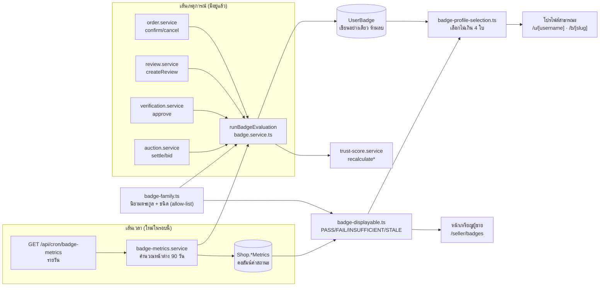
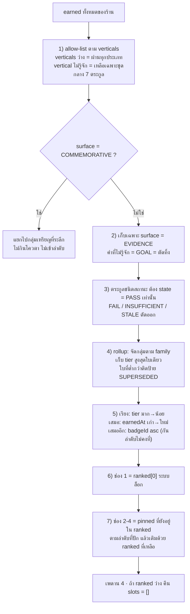
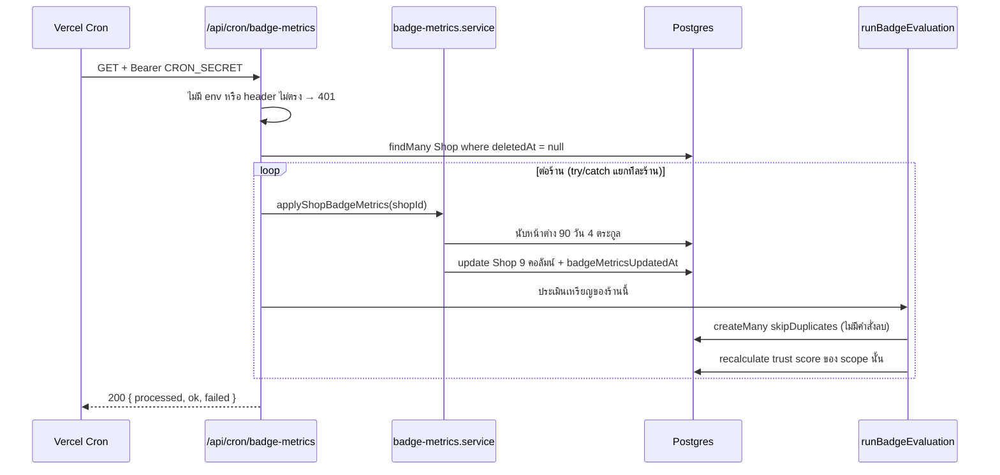
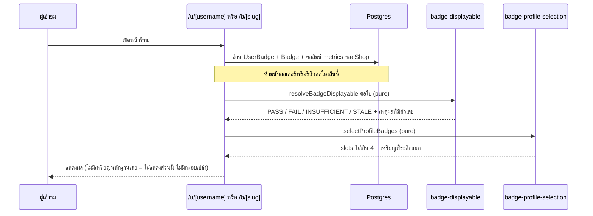
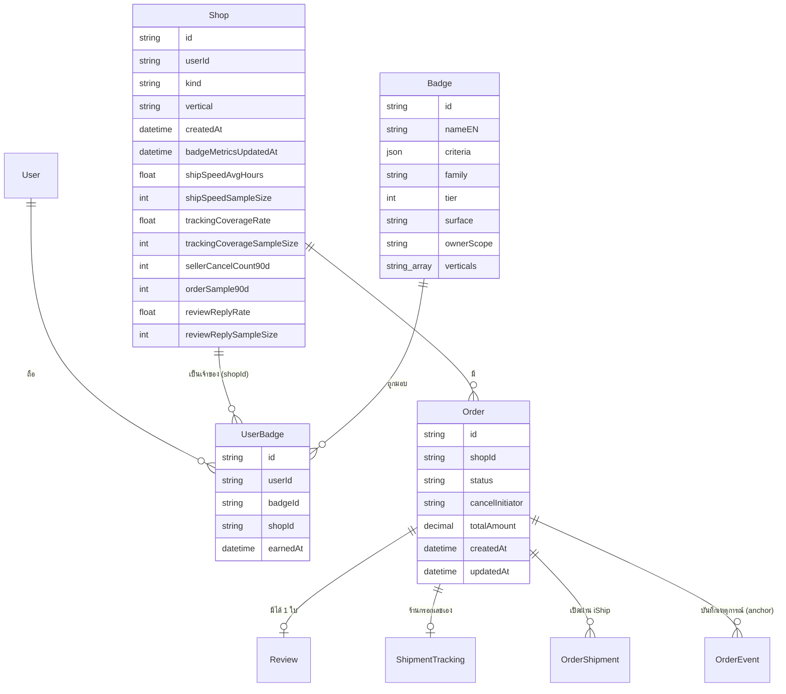
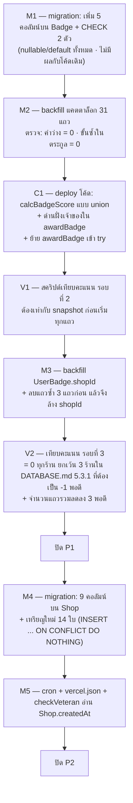

> **โมดูล:** 00052 - Badge & Achievement v2
> **ประเภทเอกสาร:** Software Requirements Specification (SRS) - TECHNICAL
> **เวอร์ชัน:** 1.1
> **วันที่จัดทำ:** 2026-08-21
> **สถานะ:** Draft
> **เจ้าของเอกสาร:** SA (ดู [[Feature-Docs-Ownership]])

# SRS: ระบบเหรียญตราและความสำเร็จ รุ่นที่ 2 (Software Requirements Specification — Technical)

---

## 1. บทนำ (Introduction)

### 1.1 วัตถุประสงค์ของเอกสาร

เอกสารนี้แปลง Functional Requirements ใน [[BRD]] (FR-BDG-01..27, BR-BDG-01..22) ให้เป็นข้อกำหนดเชิงเทคนิคที่ DEV เขียนโค้ดตามได้โดยไม่ต้องเดา และ QA เขียนเคสทดสอบได้โดยไม่ต้องถาม ผู้อ่านคือ DEV / QA / DevOps

เอกสารนี้กำหนด 6 เรื่องที่ BRD ตั้งใจไม่ตอบ:

1. **สถาปัตยกรรมการประเมิน 2 ทาง** — เส้นเหตุการณ์ (มีอยู่แล้ว) กับเส้นเวลา (cron ใหม่) แบ่งหน้าที่กันอย่างไร และทำไมขาดเส้นใดเส้นหนึ่งไม่ได้
2. **สูตรของทุกตระกูลในระดับที่เขียนคิวรีได้** — หน้าต่างเวลานับจากคอลัมน์ไหน ตัวตั้ง/ตัวหารมาจากแถวชุดไหน ใบไหนถูกหักออก
3. **อัลกอริทึมเลือกเหรียญขึ้นโปรไฟล์** เป็นฟังก์ชันบริสุทธิ์ที่เทสจับได้
4. **การเปลี่ยน `calcBadgeScore` ตามมติ D-BDG-1** โดยคะแนนของทุกร้านต้องไม่ขยับ (ยกเว้น 3 ร้านที่ระบุชื่อไว้ล่วงหน้า) และวิธีพิสูจน์ว่าไม่ขยับจริง
5. **ลำดับ migration/backfill ที่ปลอดภัย** — ลำดับไหนทำให้มีช่วงเวลาที่คะแนนเป็น 0 และลำดับไหนไม่มี
6. **cross-file error mapping** — error ตัวใหม่ทุกตัวมี route ไหนจับและตอบ HTTP อะไร

🛑 **ข้อความในเอกสารนี้ที่อ้างพฤติกรรมของโค้ด อ้างอิงไฟล์+บรรทัดที่เปิดอ่านแล้วเสมอ** ข้อไหนยังไม่ได้ยืนยันเขียนกำกับไว้ว่า "ต้อง Explore" ห้ามนำไปใช้เป็นข้อเท็จจริง (Hard Rule 16 ทิศกลับ — `docs/conventions/value-fate-decided-at-write-site.md`)

### 1.2 ขอบเขตเชิงระบบ (System Scope)

**อยู่ในขอบเขต:**

| ส่วน | ไฟล์/เส้นทาง |
|---|---|
| นิยามตระกูลเหรียญ (ใหม่) | `src/lib/badge-family.ts` |
| ตัวตัดสินสิทธิ์ขึ้นโปรไฟล์ (ใหม่) | `src/lib/badge-displayable.ts` |
| ตัวเลือกเหรียญ 4 ช่อง (ใหม่) | `src/lib/badge-profile-selection.ts` |
| ตัวคำนวณค่าสถานะ (ใหม่) | `src/services/badge-metrics.service.ts` |
| งานเบื้องหลังรายวัน (ใหม่) | `src/app/api/cron/badge-metrics/route.ts` + `vercel.json` |
| ค่าคงที่สูตรเงินตัวใหม่ | `src/lib/format-money.ts` (วางติดกับอีก 3 ตัวที่มีอยู่) |
| แคตตาล็อกและตัวประเมินเดิม | `src/services/badge.service.ts` |
| ตัวนับเหรียญของ Trust Score | `src/services/trust-score.service.ts` (`calcBadgeScore`) |
| schema + migration + seed | `prisma/schema.prisma`, `prisma/migrations/`, `prisma/seed-badges.ts` |
| หน้าเหรียญผู้ขาย / โปรไฟล์สาธารณะ | ดู §10.4 (รายการ surface ครบ) |

**นอกขอบเขตเชิงเทคนิค:**

- ไม่แก้สูตร Trust Score และไม่แตะ `src/lib/badge-score-rule.ts` (`BADGE_SCORE_PER_BADGE = 1`, `BADGE_SCORE_MAX = 10` — ยืนยันแล้วที่ไฟล์นั้นบรรทัด 17/20)
- ไม่แก้โครงตาราง `UserBadge` (คอลัมน์เดิม + partial unique index 2 ตัว — `schema.prisma:576-601`)
- ไม่เพิ่มเหรียญประมูลใบใหม่ และไม่แตะ handler ประมูลทั้ง 8 ตัวใน `runBadgeEvaluation`
- ไม่ทำฝั่งผู้ซื้อ (buyer badge / `getUserBadgeRarityMap`)
- ไม่ทำ UI ใหม่ของหน้าเหรียญ (Design Spec เป็นของ `safepay-ux` — ดู §7.1)
- **ไม่เขียนแผน migration ระดับ SQL ซ้ำ** — อยู่ใน `DATABASE.md` v1.1 ของฟีเจอร์นี้แล้ว เอกสารนี้กำหนดเฉพาะ *ลำดับ* และ *เงื่อนไขที่ต้องเป็นจริง*

### 1.3 เอกสารอ้างอิง (References)

| เอกสาร | ความสัมพันธ์ |
|--------|-------------|
| [[PRD]] ของโมดูลนี้ | เป้าหมายธุรกิจ · personas · KPI · ลำดับ 4 เฟส (§3.10) |
| [[BRD]] ของโมดูลนี้ | ที่มาของทุก TFR (FR-BDG-01..27 · BR-BDG-01..22 · ตารางแมป 31 ใบ §2.4.1 · **ภาคผนวก ก = ไอคอนที่เคาะแล้ว 32 ใบ**) |
| [[DATABASE]] ของฟีเจอร์นี้ (v1.1) | **แผน migration/backfill ระดับ SQL + ด่านตรวจในทรานแซกชัน + §5.3.1 รายชื่อ 3 ร้านที่คะแนนลด** |
| `CONTEXT.md` ของฟีเจอร์นี้ | กลอสซารีร่วม — คำที่ใช้ในเอกสารนี้และบนหน้าจอต้องตรงกับที่นั่น |
| `docs/SRS.md` (เอกสารระบบ) | ต้อง sync ตาม §11 — ไม่ใช่ทางเลือก (Hard Rule 11) |
| `docs/20 - Features/00039 …` | นิยาม "ยกเลิกที่เป็นความรับผิดชอบของร้าน" (`src/lib/order-stats.ts`) |
| `docs/20 - Features/00040 …` | Trust Score v2 — FR-TS2-07 "เหรียญไม่ถูกริบ" |
| `docs/20 - Features/00035 …` | `ShopPageBlock` แบบ `BADGE_HIGHLIGHT` = ที่เก็บ "เหรียญที่ร้านปัก" ที่มีอยู่แล้ว |
| `docs/conventions/partial-data-must-be-labeled-or-filled.md` | ที่มาของสถานะ 4 ค่าใน TFR-014 |
| `docs/conventions/rule-must-be-enforced-not-described.md` | ทุก TFR ต้องมี "บังคับที่" + mutation |
| `docs/conventions/one-value-many-entry-points.md` | เลขพัสดุมี 2 ทางเข้า — ใช้ทั้งใน TFR-011 และ TFR-012 |

### 1.4 นิยามและตัวย่อ (Definitions & Acronyms)

| คำ/ตัวย่อ | ความหมายเชิงเทคนิค |
|-----------|----------|
| **ตระกูล (`Badge.family`)** | คีย์สตริงคงที่ที่ประกาศใน `BADGE_FAMILY_REGISTRY` — เหรียญที่วัดเรื่องเดียวกันมี `family` เดียวกัน |
| **ขั้น (`Badge.tier`)** | จำนวนเต็ม ≥1 ไม่ซ้ำภายในตระกูลเดียวกัน ยิ่งมากยิ่งยาก |
| **`Badge.surface`** | `EVIDENCE` \| `GOAL` \| `COMMEMORATIVE` — สิทธิ์การแสดงผลฝั่งสาธารณะ |
| **`Badge.ownerScope`** | `SHOP` \| `USER` — ฝั่งเจ้าของที่ถูกต้องของแถว `UserBadge` |
| **`Badge.verticals`** | allow-list ประเภทร้านที่เห็นเหรียญใบนี้ · **อาเรย์ว่าง = ทุกประเภท (ชุดกลาง)** |
| **`FamilyDef.nature`** | `EVENT` \| `STATUS` — เหรียญเหตุการณ์ / เหรียญสถานะ · **อยู่ในโค้ดเท่านั้น ไม่ใช่คอลัมน์ในฐานข้อมูล** (ดู §1.4.1) |
| **หน้าต่าง 90 วัน** | `[now − 90d, now]` โดย `now` = เวลาที่ cron เริ่มรอบนั้น |
| **anchor ของออเดอร์** | คอลัมน์เวลาที่ใช้ตัดสินว่าออเดอร์ใบหนึ่งอยู่ในหน้าต่างหรือไม่ — ดู D-SRS-1 (TFR-009) |
| **สถานะการประเมิน** | `PASS` \| `FAIL` \| `INSUFFICIENT` \| `STALE` (4 ค่า ไม่ใช่ boolean) |
| **ค่าสถานะ (metrics)** | ตัวเลขที่ cron คำนวณแล้วเขียนลงคอลัมน์บน `Shop` พร้อมตัวหารและเวลาที่คำนวณ |
| **เส้นเหตุการณ์** | `evaluateBadges` / `evaluateSellerBadgesForShop` ที่ถูกเรียกหลัง commit ของ order/review/verification/auction |
| **เส้นเวลา** | `GET /api/cron/badge-metrics` รายวัน |

#### 1.4.1 🛑 ชนิดของเหรียญอยู่ในโค้ด ไม่ใช่ในฐานข้อมูล (มติที่แก้ contract เดิม)

`Badge` เพิ่ม **5 คอลัมน์** ไม่ใช่ 6 — **ไม่มีคอลัมน์ `nature`**

เหตุผล: FR-BDG-01 AC ข้อสุดท้ายเขียนตรงตัวว่าชนิดเหรียญ "อ่านจาก **นิยามตระกูลชุดเดียวในโค้ด** … และ **ไม่ใช่คอลัมน์ใหม่ใน `Badge`**" — งานที่ต้องรู้ชนิดทั้งหมด (cron, ตัวตัดสินสิทธิ์แสดงผล, ตัวเลือกเหรียญ) เป็น TypeScript ที่ `import` map ตระกูล → ชนิด ได้ตรง ๆ อยู่แล้ว **ไม่มีคิวรีไหนจำเป็นต้องกรองด้วยชนิดที่ระดับฐานข้อมูล** การมีคอลัมน์ซ้ำจึงเป็นสำเนาที่หลุดจากต้นฉบับได้โดยไม่มีอะไรฟ้อง (Hard Rule 16)

- SSOT ของชนิด = `FamilyDef.nature` ใน `src/lib/badge-family.ts`
- **ข้อกำหนดที่มาแทนคอลัมน์:** เทส `[blocker]` ที่อ่าน map ตระกูลในโค้ด แล้วยืนยันว่า **ตระกูลที่ประกาศเป็น `STATUS` มีได้เฉพาะตระกูลที่มีคู่คอลัมน์ "ค่า + ตัวหาร" อยู่บน `Shop` จริง** — วันนี้มี **4 ตระกูล**: `NO_SELLER_CANCEL` · `REVIEW_REPLY` · `SHIP_SPEED` · `TRACKING_COVERAGE`
  **mutation ที่ต้องแดง:** ประกาศตระกูลใหม่เป็น `STATUS` โดยไม่เพิ่มคู่คอลัมน์บน `Shop` → เทสต้องแดงทันที
  เหตุผลที่ด่านนี้จำเป็น: เหรียญสถานะที่ไม่มีคอลัมน์รองรับจะได้ `metrics = undefined` ตลอดกาล ⇒ ตกเป็น `STALE`/`INSUFFICIENT` ทุกวัน **โดยหน้าตาเหมือน "ยังไม่มีร้านไหนผ่านเกณฑ์"** ทุกประการ ไม่มี error ไม่มีใครรายงาน

---

## 2. ภาพรวมสถาปัตยกรรม (Architecture Overview)

### 2.1 บริบทระบบ (System Context)



### 2.2 องค์ประกอบหลัก (Components)

| Component | หน้าที่ | Stack / ตำแหน่ง |
|-----------|---------|-------------------|
| **`badge-family.ts`** (ใหม่) | allow-list ตระกูล → **ชนิด**/ขั้น/ขนาดตัวอย่างขั้นต่ำ/ประเภทร้าน · fail-closed · **ไม่มี dependency** (client import ได้ ไม่ลาก prisma) | `src/lib/` — pure TS |
| **`badge-displayable.ts`** (ใหม่) | รับ metrics snapshot + นิยามขั้น → คืนสถานะ 4 ค่า **พร้อมเหตุผลที่มีตัวเลข** ในก้อนเดียว | `src/lib/` — pure TS |
| **`badge-profile-selection.ts`** (ใหม่) | อัลกอริทึม allow-list → EVIDENCE → ตัด STATUS ที่ไม่ PASS → rollup → เรียง → เพดาน 4 | `src/lib/` — pure TS |
| **`badge-metrics.service.ts`** (ใหม่) | คิวรีหน้าต่าง 90 วัน แล้วเขียนลง `Shop` (คู่ขนานกับ `chat-metrics.service.ts`) | `src/services/` — Prisma |
| **`badge.service.ts`** (แก้) | เพิ่มด่านฝั่งเจ้าของใน `awardBadge` · `checkVeteran` อ่าน `Shop.createdAt` · `getBadgeRarity` ได้ด่านฐานขั้นต่ำ | `src/services/` |
| **`trust-score.service.ts`** (แก้ 1 จุด) | `calcBadgeScore` เส้น personal นับ union (D-BDG-1) | `src/services/` |
| **`format-money.ts`** (แก้ — เพิ่มค่าคงที่) | สูตร "ยอดที่ลูกค้าจ่ายสะสม" วางติดกับอีก 3 สูตรที่มีอยู่ | `src/lib/` |
| **cron route** (ใหม่) | Bearer `CRON_SECRET` · loop ร้าน · per-shop try/catch | `src/app/api/cron/badge-metrics/route.ts` |

### 2.3 มุมมองการ Deploy (Deployment View)

- ทุกอย่างรันบน Vercel serverless เดิม ไม่มี worker/queue ใหม่ ไม่มี framework ใหม่
- cron ลงทะเบียนใน `vercel.json` → `"crons"` (ยืนยันโครงไฟล์แล้ว: `vercel.json:12-22`)
  **ช่องเวลาที่ว่างจริง:** slot ที่ถูกใช้แล้วคือ 17,18,19(×2),20,21,22,23 UTC และ `*/5` ของ iship ⇒ ตั้ง `"0 16 * * *"` (23:00 น. ไทย) เป็นช่องที่ไม่ชนใคร
- `export const maxDuration = 60` แบบเดียวกับ `chat-response-metrics/route.ts:6` (Hobby default 10s ไม่พอเมื่อร้านโตขึ้น)
- 🛑 **`vercel.json:4` `buildCommand` = `prisma migrate deploy && prisma generate && next build`** — มี `migrate deploy` แต่ **ไม่มี seed** ⇒ แถวเหรียญใบใหม่จะไม่เกิดบน prod เองเด็ดขาด (ดู §5.3 และ §10.5)

---

## 3. ข้อกำหนดเชิงฟังก์ชันเชิงเทคนิค (Technical Functional Requirements)

### TFR-001: นิยามตระกูลรวมศูนย์ (allow-list, fail-closed)

- **Trace to:** FR-BDG-01, FR-BDG-16, BR-BDG-19, BR-BDG-20
- **คำอธิบายเชิงเทคนิค:**
  `src/lib/badge-family.ts` ประกาศ `BADGE_FAMILY_REGISTRY: Record<BadgeFamilyKey, FamilyDef>` โดย
  ```
  FamilyDef = {
    nature: 'EVENT' | 'STATUS'                // SSOT ของชนิด (ไม่มีคอลัมน์คู่ในฐานข้อมูล)
    ownerScope: 'SHOP' | 'USER'
    surfaceByTier: Record<number, 'EVIDENCE' | 'GOAL' | 'COMMEMORATIVE'>
    minSampleByTier: Record<number, number>   // เฉพาะ STATUS
    verticals: string[]                       // [] = ชุดกลาง (ทุกประเภท)
    thresholdByTier: Record<number, number>
  }
  ```
  - `resolveSurface(raw: string | null): Surface` — ค่าที่ไม่รู้จักหรือ `null` **คืน `GOAL`** (BR-BDG-20) ห้ามคืน `EVIDENCE`
  - `familiesForVertical(vertical: string): BadgeFamilyKey[]` — คืนตระกูลที่ `verticals` ว่าง (ชุดกลาง) รวมกับตระกูลที่ระบุ `vertical` นั้นตรง ๆ
  🛑 **โครงเลียนแบบ `VERTICAL_VISIBLE_SLUGS` (`src/lib/seller-menu.ts:342-346`) แต่ห้ามลอก fallback ของมัน** — บรรทัด 361 ของไฟล์นั้นคือ `?? VERTICAL_VISIBLE_SLUGS.ONLINE_SALES` ซึ่งถูกสำหรับเมนู แต่ **ผิดสำหรับเหรียญ**: BR-BDG-19 สั่งให้ค่าที่ไม่รู้จักตกไป **ชุดกลาง** ไม่ใช่ชุดของประเภทใดประเภทหนึ่ง ถ้าก็อปมาทั้งบรรทัด ร้านที่ข้อมูล vertical เพี้ยนจะเห็นตระกูล "ส่งไว"/"ตามพัสดุได้ทุกใบ" ที่ไม่มีวันได้

- **จำนวนตระกูลที่แต่ละประเภทร้านเห็น (มติ 2026-08-21 — แก้ตัวเลขใน BRD):**

| ประเภทร้าน | จำนวนตระกูล | รายการ |
|---|---|---|
| **ชุดกลาง** (`SERVICE_QUEUE`, `LODGING`, ค่าที่ไม่รู้จัก) | **7** | ออเดอร์สะสม · อยู่มานานและยังขายอยู่ · ไม่ทิ้งลูกค้า · ตอบทุกรีวิว · ยอดที่ลูกค้าจ่ายสะสม · คะแนนรีวิว · จำนวนผู้รีวิว |
| **`ONLINE_SALES`** | **9** | ชุดกลาง 7 + ส่งไว + ตามพัสดุได้ทุกใบ |

  🛑 ตัวเลข **5/7 ที่เขียนอยู่ใน BRD FR-BDG-16 ผิด** — มาจากการนับตอนที่ตระกูลคะแนนรีวิวและจำนวนผู้รีวิวยังไม่ถูกยุบเข้ามา (ยุบทีหลังด้วย D-BDG-2) **เจตนาไม่เปลี่ยน** (ร้านบริการมีน้อยกว่าร้านขายของอยู่ **2 ตระกูล** เท่าเดิม และยังคง "ยอมรับโดยตั้งใจ ห้ามเติมให้เท่ากัน") เปลี่ยนแค่ตัวเลขสัมบูรณ์ ⇒ **BRD FR-BDG-16 ต้องถูกแก้เป็น 7/9 ในคอมมิตเดียวกับที่เขียนเทส** (ดู §11.1)

- **Precondition:** ไม่มี (pure)
- **Postcondition:** เหรียญทุกใบในแคตตาล็อกแมปเข้าตระกูลได้ 1 ตระกูลเสมอ
- **Error / Edge cases:** ตระกูลที่ไม่มีใน registry → ฟังก์ชันอ่านคืนค่าปลอดภัย (surface=GOAL, ไม่อยู่ในชุดของ vertical ใดเลย) ไม่ throw กลาง evaluation loop
- **บังคับที่ / mutation:**
  1. เทส `[blocker]` อ่านแคตตาล็อกจริงจาก `prisma/badge-seed-data.ts` แล้วยืนยันว่าทุกใบมี family/tier/surface/ownerScope ครบ — **mutation: ลบ 1 ตระกูลออกจาก registry แล้วต้องแดง**
  2. เทส `[blocker]` ส่ง `vertical = 'ไม่รู้จัก'` แล้วต้องได้ชุดกลาง **7 ตระกูล** — **mutation: เปลี่ยน fallback เป็น `ONLINE_SALES` แล้วต้องแดง**
  3. เทส `[blocker]` ตาม §1.4.1: ตระกูลที่ `nature === 'STATUS'` ต้องมีคู่คอลัมน์บน `Shop` ครบ — **mutation: ประกาศตระกูลใหม่เป็น `STATUS` โดยไม่เพิ่มคอลัมน์ แล้วต้องแดง**

### TFR-002: คอลัมน์ใหม่บน `Badge` (5 คอลัมน์) + backfill แคตตาล็อก

- **Trace to:** FR-BDG-01, FR-BDG-13, FR-BDG-17, FR-BDG-18
- **คำอธิบายเชิงเทคนิค:** เพิ่ม 5 คอลัมน์ตาม §5.1 แบบ additive มี default ทั้งหมด ⇒ แถวเดิม 31 ใบยังอ่านได้ระหว่างที่ยังไม่ backfill · จากนั้น backfill ค่าตามตารางแมป BRD §2.4.1 (31 แถว ครบทุกใบ)
  - `surface` บังคับด้วย CHECK constraint `Badge_surface_check` = `('EVIDENCE','GOAL','COMMEMORATIVE')`
  - `ownerScope` บังคับด้วย CHECK constraint `Badge_ownerScope_check` = `('SHOP','USER')`
  - 🛑 CHECK ทั้งสองตัวเป็น unmanaged SQL ⇒ **migration ที่แก้ CHECK ในอนาคตต้องอ่านของเดิมมาต่อท้าย ห้าม hardcode รายชื่อใหม่ทับ** (`docs/conventions/migration-check-constraint-additive.md` — เคสจริง 2026-08-06 ที่ migration 2 ไฟล์ลบค่าของกันเองเงียบ ๆ โดย migrate สำเร็จทุกไฟล์)
- **Precondition:** migration M1 apply แล้ว
- **Postcondition:**
  - `SELECT count(*) FROM "Badge" WHERE family IS NULL OR tier IS NULL` = **0**
  - `SELECT family, tier, count(*) FROM "Badge" GROUP BY 1,2 HAVING count(*) > 1` = **0 แถว**
  - `SELECT count(*) FROM "Badge" WHERE family = 'REVENUE_MILESTONE' AND surface = 'EVIDENCE'` = **0** (FR-BDG-13)
- **Error / Edge cases:** รันสคริปต์ซ้ำต้องได้ผลเดิม (UPDATE ตาม `nameEN` ซึ่ง `@unique` — `schema.prisma:565`)
- **บังคับที่:** เทส snapshot รายชื่อ 13 ใบที่ถูกปลดจากโปรไฟล์ (FR-BDG-18) — ใครตั้งใบใดใบหนึ่งกลับเป็น `EVIDENCE` แล้วแดง

### TFR-003: ด่านฝั่งเจ้าของใน `awardBadge`

- **Trace to:** FR-BDG-02, BR-BDG-01, BR-BDG-02, BR-BDG-21
- **คำอธิบายเชิงเทคนิค:**
  `awardBadge(userId, badgeId, opts, shopId)` (ปัจจุบัน `badge.service.ts:488-503` เขียนแถวด้วย `createMany({ skipDuplicates: true })` แล้วถือว่า `count === 1` คือการมอบครั้งแรก) ต้องอ่าน `ownerScope` ของเหรียญใบนั้นก่อนเขียน แล้ว:
  - `ownerScope === 'SHOP'` แต่ `shopId == null` → `throw new Error('BADGE_OWNER_SCOPE_MISMATCH')`
  - `ownerScope === 'USER'` แต่ `shopId != null` → `throw` ตัวเดียวกัน
  - ตรวจ vertical: เหรียญที่ `verticals` ไม่ว่างและไม่ครอบ vertical ของร้านนั้น → `throw new Error('BADGE_VERTICAL_NOT_ALLOWED')` (BR-BDG-21 "การซ่อนไม่ใช่การควบคุมสิทธิ์")
- **Precondition:** TFR-001 และ TFR-002 เสร็จ (ไม่มีด่านถ้าไม่มีค่าให้อ่าน)
- **Postcondition:** ไม่มีแถว `UserBadge` ผิดฝั่งเกิดใหม่ได้อีก ไม่ว่าผู้เรียกจะเป็นใคร
- **Error / Edge cases (สำคัญที่สุดของ TFR นี้):**
  ปัจจุบัน `await awardBadge(...)` อยู่ที่ `badge.service.ts:679` ซึ่ง **อยู่นอก `try/catch` ต่อเหรียญ** (try ครอบเฉพาะ switch ที่บรรทัด 572-676) ⇒ ถ้า `awardBadge` เริ่ม throw error จะทะลุออกจาก `runBadgeEvaluation` ทั้งก้อน
  ⇒ **ต้องย้ายการเรียก `awardBadge` เข้าไปใน try เดียวกัน (หรือครอบ try ของตัวเอง) ในคอมมิตเดียวกับที่เพิ่ม throw** ไม่งั้นเหรียญใบเดียวที่ตั้งค่าผิดจะทำให้เหรียญใบที่เหลือทั้งชุดไม่ถูกประเมินเลย
  ผู้เรียกที่ยืนยันแล้วว่าเป็น best-effort: `order.service.ts:991-1004` (try/catch ครอบ log อย่างเดียว) · `api/auctions/[id]/watch/route.ts:31` และ `api/app/auctions/[id]/watch/route.ts:26` (`void … .catch()`) · `auction.service.ts:606-616, 873`
  **ต้องเปิดยืนยันก่อนลงมือ (ยังไม่ได้อ่านในรอบนี้):** `review.service.ts:43-45` และ `verification.service.ts:85-88` ครอบ try/catch หรือไม่ — ถ้าไม่ครอบ ต้องครอบในคอมมิตเดียวกัน มิฉะนั้นเหรียญที่ตั้งค่าผิดจะทำให้ "สร้างรีวิว/อนุมัติเอกสาร" ล้มทั้งคำขอ
- **บังคับที่ / mutation:** เทส `[blocker]` 2 เคส (มอบเหรียญร้านโดยไม่ส่งร้าน / มอบเหรียญบุคคลพร้อมร้าน) + 1 เคส vertical · ถอดด่านออกแล้วต้องแดงทั้ง 3

### TFR-004: backfill เจ้าของเหรียญ + ล้าง 3 แถวที่ระลึก

- **Trace to:** FR-BDG-02, FR-BDG-03, BR-BDG-03, BR-BDG-04
- **ข้อเท็จจริงจากฐาน prod ณ 2026-08-21 (คิวรีจริง — ไม่ใช่สมมติฐานอีกต่อไป):**

| คำถาม | ผลจริง | ผลต่อสคริปต์ |
|---|---|---|
| เหรียญร้านที่เจ้าของ **ไม่มีร้านส่วนตัว** | **0 แถว** | กิ่ง "หยุด ห้ามลบ ห้ามเดา" ยังต้องมีอยู่ในโค้ด แต่จะไม่ถูกเดินในรอบนี้ |
| แถวที่ย้ายแล้วจะชน `UserBadge_shopId_badgeId_key` | **0 แถว** | การเขียน `shopId` ลงไปไม่ทำให้ migration ตาย |
| เหรียญบุคคลที่มี `shopId` ค้าง | **3 แถว ทั้งหมดเป็น `2026_BADGE`** | ตรงกับ FR-BDG-03 |
| 3 แถวนั้นมีแถว `shopId IS NULL` ของคนเดียวกันอยู่แล้วหรือไม่ | **มีครบทั้ง 3** | 🛑 **ถ้า `UPDATE … SET shopId = NULL` ตรง ๆ migration จะตายที่ `UserBadge_userId_badgeId_personal_key` ทันที** ⇒ ต้อง **ลบแถวซ้ำก่อน** ไม่ใช่ล้างก่อน |

- **คำอธิบายเชิงเทคนิค:** สคริปต์ backfill (รันครั้งเดียว idempotent · SQL เต็มอยู่ใน `DATABASE.md` §5.3) ตาม flow BRD §4.3
  1. **เหรียญ `ownerScope='SHOP'` ที่ `shopId IS NULL`** → เขียน `shopId` = ร้าน **PERSONAL** ของ `userId` นั้น
     ที่มาของ "ร้านส่วนตัวของ user": unique partial index `Shop_userId_personal_key` (อ้างถึงใน `schema.prisma:599`) ⇒ ร้านส่วนตัวมีได้ใบเดียวต่อ user
     🛑 เหตุผลที่แถวกลุ่มนี้มีอยู่จริง: `evaluateSellerBadgesForShop` (`badge.service.ts:729`) ตั้ง `shopIdForAward = shop.kind === 'BUSINESS' ? shop.id : null` ⇒ **ร้าน PERSONAL ทุกร้านเขียน `shopId = null` มาตลอด** นี่ไม่ใช่ข้อมูลเสีย แต่เป็นพฤติกรรมเดิมที่ออกแบบไว้ (zero-regression ของ 00008)
  2. **เหรียญ `ownerScope='USER'` ที่ `shopId IS NOT NULL` (3 แถว)** → ลำดับที่ถูกต้องคือ
     - เทียบ `earnedAt` ของคู่แถวเดียวกัน (แถวที่มี shop กับแถวที่ `shopId IS NULL`)
     - **เก็บแถวที่ได้รับก่อน ลบอีกแถว** แล้วถ้าแถวที่เก็บไว้ยังมี `shopId` ให้ล้างเป็น `NULL`
     - **บันทึกทุกแถวที่ลบลงรายงานของสคริปต์** (จำนวน · `userId` · `earnedAt` ทั้งคู่)
     ⇒ สถานะปลายทาง: 1 แถวต่อคน `shopId IS NULL`
  3. แถวที่แมปไม่ได้ → **หยุดทั้งสคริปต์ ห้ามลบ ห้ามเดา** พิมพ์รายการออกมา
- **Postcondition:**
  - แถวผิดฝั่ง (join `Badge.ownerScope`) = 0 ทั้ง 2 ทิศ
  - เหรียญที่ระลึก: `count(distinct "userId") = count(*)` สำหรับ `2026_BADGE`
  - `count(*) FROM "UserBadge"` ก่อน/หลัง ต่างกัน **−3 พอดี** (แถวซ้ำที่รายงานไว้) ตัวเลขอื่น = ผิด ต้องหยุด
- **Error / Edge cases:** ต้องรันในทรานแซกชันเดียวพร้อมด่านตรวจ (ดู `DATABASE.md` §5.3) · ห้ามมีคำสั่งลบที่ไม่มี `WHERE` (เจตนาเดียวกับ Hard Rule 13/14)

### TFR-005: `checkVeteran` อ่านวันเปิดร้าน

- **Trace to:** FR-BDG-04, FR-BDG-10
- **คำอธิบายเชิงเทคนิค:**
  ปัจจุบัน `badge.service.ts:202-220` คำนวณ `daysOld` จาก `prisma.user.findUnique(...).createdAt` (บรรทัด 208-210) แล้วค่อยเช็คว่ามีออเดอร์สถานะปลายทางใน 30 วันล่าสุด (บรรทัด 215-218 ใช้ `updatedAt: { gte: thirtyDaysAgo }`)
  เปลี่ยนเป็น: `daysOld` คำนวณจาก `shop.createdAt` · `shop == null` → คืน `{ met: false, daysOld: 0 }` **ทันทีตั้งแต่ต้นฟังก์ชัน**
  ⚠️ `BadgeShopContext` ปัจจุบันมีแค่ `{ id, userId, kind }` (เห็นจากผู้เรียกที่ `order.service.ts:995`) ⇒ **ต้องเพิ่ม `createdAt` เข้า type และเข้าทุกผู้เรียก** — `tsc` จะบังคับให้ครบเอง ซึ่งเป็นเหตุผลที่ต้องใส่เป็น field ไม่ใช่ query ซ้ำในฟังก์ชัน
  - พารามิเตอร์ `userId` **ยังคงไว้** (ไม่ถอด) เพราะ signature ถูกใช้จาก `getBadgeProgress` (`badge.service.ts:942`) ด้วย
- **Postcondition:** เกณฑ์อายุ = อายุร้าน ไม่ใช่อายุบัญชี
- **Error / Edge cases:** ต้องตรวจก่อนแก้ว่า **ไม่มีผู้ถือเหรียญตระกูลนี้เลย** (FR-BDG-04 AC ข้อ 4) ถ้าพบผู้ถือ → หยุดและรายงาน
- **บังคับที่ / mutation:** เทส `[blocker]` บัญชีอายุ 400 วัน + ร้านอายุ 10 วัน → ต้อง `met=false` (คืนไปอ่าน `user.createdAt` แล้วต้องแดง)

### TFR-006: `calcBadgeScore` เส้น personal นับ union (D-BDG-1) 🛑

- **Trace to:** FR-BDG-05, BR-BDG-05
- **สภาพปัจจุบัน (ยืนยันแล้ว):** `src/services/trust-score.service.ts:106-114`
  ```
  const where = scope.kind === "personal" ? { userId: scope.userId, shopId: null } : { shopId: scope.shopId };
  const count = await prisma.userBadge.count({ where });
  return Math.min(BADGE_SCORE_MAX, count * BADGE_SCORE_PER_BADGE);
  ```
- **คำอธิบายเชิงเทคนิค:** เปลี่ยน **เฉพาะ `where` ของเส้น personal** เป็น union
  ```
  { OR: [ { userId, shopId: null }, ...(personalShopId ? [{ shopId: personalShopId }] : []) ] }
  ```
  - `personalShopId` resolve ด้วยคิวรีตรงในไฟล์เดียวกัน (`prisma.shop.findFirst({ where: { userId, kind: 'PERSONAL', deletedAt: null }, select: { id: true } })`)
    🛑 **ห้าม import `getShopForUser` จาก `badge.service.ts`** — `badge.service.ts` import `recalculateShopTrustScore`/`recalculateTrustScore` จาก `trust-score.service.ts` อยู่แล้ว (`badge.service.ts:686-689`) การ import กลับจะสร้าง import cycle
  - `BADGE_SCORE_PER_BADGE` / `BADGE_SCORE_MAX` / `Math.min(...)` / `src/lib/badge-score-rule.ts` **ไม่ถูกแตะแม้แต่ตัวอักษรเดียว**
  - เส้น business (`{ shopId }`) ไม่เปลี่ยน
- **Precondition:** ไม่มี — **โค้ดนี้ถูกต้องทั้งก่อนและหลัง backfill** (ก่อน backfill ไม่มีแถวที่ `shopId = personalShopId` เลย ⇒ union คืนจำนวนเท่าเดิมเป๊ะ) นี่คือเหตุผลที่ deploy โค้ดก่อนข้อมูลได้อย่างปลอดภัย (§5.3)
- **Postcondition:** คะแนนช่องเหรียญของทุก user/ทุกร้าน ก่อน/หลัง ต่างกัน **0** ยกเว้น 3 ร้านใน §3.6.3

#### 3.6.1 ทำไมบั๊กนี้จะไม่มีอะไรฟ้อง (ต้องเขียนไว้ให้คนรุ่นถัดไปอ่าน)

ถ้าไม่ทำ TFR นี้ วินาทีที่ backfill รัน `calcBadgeScore` เส้น personal จะเห็น **0** ทันที (แถวทั้งหมดย้ายไปมี `shopId` แล้ว) และ `recalculateShopTrustScore` รับช่วงแทนไม่ได้ เพราะบรรทัด `trust-score.service.ts:162` คือ `if (shop.kind !== "BUSINESS") return 0;`

แต่ **หน้าจอจะไม่เปลี่ยนเลย** เพราะ:

- `trust-score.service.ts:134` — `const persisted = Math.max(user.trustScore, computed);` แล้วบรรทัด 136 เขียน `persisted` ลง `User.trustScore` ⇒ ค่าที่โผล่บนจอ **ค้างที่เลขเก่าตลอดไป**
- `trust-score.service.ts:137-141` — `prisma.trustScoreHistory.create({ data: { score: computed, ... } })` ⇒ **ประวัติบันทึกเลขที่ตกลงจริง** พร้อม breakdown

⇒ ระบบจะอยู่ในสถานะ "จอบอกเลขหนึ่ง ประวัติบอกอีกเลขหนึ่ง" โดยไม่มี `tsc`/build/เทส/grep ตัวไหนแดง เพราะทุกบรรทัด "ถูก" ในตัวเอง สิ่งที่ผิดคือ *ข้อสมมติว่าตัวนับยังหาเหรียญเจอ* — คลาสเดียวกับ Hard Rule 16 และเป็นคลาสที่ 00040 ตั้งใจกำจัด

#### 3.6.2 วิธีพิสูจน์ว่าคะแนนก่อน/หลังต่างกัน 0

🛑 **ห้ามพิสูจน์ด้วยการเทียบ `User.trustScore` / `Shop.trustScore`** — `Math.max` ทำให้สองค่านี้เท่ากันเสมอไม่ว่าตัวนับจะพังหรือไม่ = การพิสูจน์ที่ผ่านตลอดกาลโดยไม่ได้พิสูจน์อะไรเลย

ขั้นตอนที่ใช้ได้จริง (`scripts/verify-badge-score-parity.ts`):

1. **ก่อน migration** — สแกนทุก `User` ที่มีร้าน และทุก `Shop` แล้วเขียนไฟล์ snapshot `{ subjectKey, badgeCount, badgeScore }`
2. **หลัง deploy โค้ด union แต่ก่อน backfill** — รันซ้ำ ต้องได้ **เท่าเดิมทุกแถว** (ยืนยันว่า union ไม่เปลี่ยนผลในสภาพข้อมูลเดิม)
3. **หลัง backfill** — รันซ้ำ ต้องได้เท่าเดิมทุกแถว **ยกเว้นรายการใน §3.6.3**
4. รายงานทั้ง 3 รอบแนบใน `TestCase.md` ของฟีเจอร์ (FR-BDG-05 AC ข้อ 3)
5. เทส `[blocker]` ใน `trust-score.service.test.ts`: user มีร้านส่วนตัว + เหรียญ 3 ใบผูกร้านนั้น → `calcBadgeScore` ต้องได้ **3** · **mutation: คืน `where` เป็น `{ userId, shopId: null }` แล้วต้องแดง**

#### 3.6.3 🛑 ข้อยกเว้นที่รู้ล่วงหน้า: 3 ร้านที่คะแนนส่วนเหรียญลดลง 1 แต้ม

**กลไก:** 3 แถว `2026_BADGE` ที่มี `shopId` ค้าง ผูกอยู่กับร้าน **BUSINESS 3 ร้าน** ⇒ ปัจจุบันแถวเหล่านั้นถูกนับโดย `calcBadgeScore` เส้น business (`{ shopId }`) เป็น +1 ของแต่ละร้าน เมื่อ TFR-004 ลบแถวซ้ำทิ้ง ร้านทั้งสามจะมีเหรียญน้อยลงร้านละ 1 ใบ และเพราะทั้ง 3 ร้านถือเหรียญอยู่ **2 / 7 / 6 ใบ — ต่ำกว่าเพดาน 10 ทุกร้าน** `Math.min(BADGE_SCORE_MAX, …)` จึงไม่กลบ ⇒ **คะแนนส่วนเหรียญลดลงจริงร้านละ 1 แต้ม**

**มติ:** ยอมรับในฐานะ **การแก้ข้อมูลผิด ไม่ใช่การเปลี่ยนสูตร** — เหรียญที่ระลึกไม่เคยควรเป็นของร้าน (BR-BDG-02) การที่ร้านเคยได้ +1 จากมันคือคะแนนที่ไม่ควรมีตั้งแต่แรก

**เกณฑ์ตรวจที่ต้องเขียนลงสคริปต์ (ไม่ใช่ตรวจด้วยตา):**

- ผลต่างต้องเป็น **0 ทุกร้าน ยกเว้น 3 ร้านที่ระบุชื่อไว้ล่วงหน้าใน `DATABASE.md` §5.3.1** ซึ่งต้องเป็น **−1 พอดี** ไม่ใช่ −2 ไม่ใช่ 0
- 🛑 **ร้านที่สี่ที่โผล่มาในผลต่าง = ความผิดพลาด ต้องหยุดและสืบสวน ห้าม "ปรับความคาดหวัง" ให้รับร้านนั้นเพิ่ม** — รายชื่อถูกปักหมุดไว้ก่อนรัน จึงเป็นด่านจริง ถ้าแก้รายชื่อทีหลังให้ตรงกับผลที่ได้ ด่านนี้จะกลายเป็นกระจกส่องตัวเอง

### TFR-007: สถาปัตยกรรมการประเมิน 2 ทาง 🛑

- **Trace to:** FR-BDG-06, FR-BDG-20, BR-BDG-06, BR-BDG-07
- **คำอธิบายเชิงเทคนิค:** ระบบมีตัวประเมิน 2 เส้นที่ **ทำงานคนละหน้าที่ ทดแทนกันไม่ได้**

| | เส้นเหตุการณ์ (มีอยู่แล้ว) | เส้นเวลา (ใหม่) |
|---|---|---|
| ทริกเกอร์ | หลัง commit ของ order/review/verification/auction | Vercel Cron รายวัน |
| จุดเข้า | `evaluateBadges` (`badge.service.ts:707`) · `evaluateSellerBadgesForShop` (:725) | `GET /api/cron/badge-metrics` |
| ความน่าเชื่อถือ | **best-effort** — `order.service.ts:991-1004` จับ error แล้ว log เท่านั้น | per-shop try/catch + ตัวนับ `ok`/`failed` |
| ทำอะไรได้ | มอบเหรียญเมื่อ "มีอะไรเกิดขึ้น" | เขียนค่าสถานะ + มอบเหรียญ **เมื่อไม่มีอะไรเกิดขึ้นด้วย** |
| ขอบเขต | ร้านที่เพิ่งมีเหตุการณ์ | ร้าน active ทุกร้าน (`where: { deletedAt: null }`) |

  🛑 **ประโยคที่เป็นเหตุผลทั้งหมดของ cron:** เหรียญสถานะที่ควรหลุดเพราะ **ร้านหยุดขาย** จะไม่มีวันหลุดถ้าไม่มี cron — เพราะ "ร้านหยุดขาย" แปลว่า *ไม่มีออเดอร์ ไม่มีรีวิว ไม่มีอะไรถูก commit* ⇒ เส้นเหตุการณ์ไม่ถูกเรียกเลยแม้แต่ครั้งเดียว ค่าสถานะจึงค้างที่ค่าที่คำนวณครั้งสุดท้ายตอนร้านยังขายดี และผู้ซื้อจะเห็นเหรียญ "ส่งไว"/"ไม่ทิ้งลูกค้า" ของร้านที่เลิกทำมาครึ่งปีแล้ว
  ⇒ **ห้ามยุบ cron ทิ้งแล้วหวังว่าเส้นเหตุการณ์จะครอบ** ไม่ว่าจะด้วยเหตุผลเรื่องต้นทุนหรือความเรียบง่าย
- **Postcondition:** ค่าสถานะของทุกร้าน active มี `badgeMetricsUpdatedAt` ไม่เก่ากว่า 24 ชม. ในสภาวะปกติ
- **Error / Edge cases:** ร้านเดียวล้ม → ร้านอื่นต้องไม่ล้มตาม (pattern `chat-response-metrics/route.ts:44-53`) · ร้านที่ล้มจะมี `badgeMetricsUpdatedAt` เก่า ⇒ ตกเข้าสถานะ `STALE` เอง (TFR-014) ไม่ใช่หายเงียบ

### TFR-008: คอลัมน์ค่าสถานะบน `Shop` + `applyShopBadgeMetrics`

- **Trace to:** FR-BDG-20, BR-BDG-16, BR-BDG-15
- **คำอธิบายเชิงเทคนิค:** ทำตามแบบของ `chat-metrics.service.ts` เป๊ะ (`applyShopChatMetrics` :123-141) — compute แล้ว `prisma.shop.update` ครั้งเดียวต่อร้าน
  - `computeShopBadgeMetrics(shopId, now)` → คืนก้อนค่าทั้ง 4 ตระกูลสถานะ
  - `applyShopBadgeMetrics(shopId)` → เขียน 9 คอลัมน์ + `badgeMetricsUpdatedAt = new Date()`
  - **ตัวหารเขียนเสมอ ค่าที่เป็นสัดส่วน/ค่าเฉลี่ยเขียน `null` เมื่อไม่ถึงขนาดตัวอย่างขั้นต่ำ** — ตรงกับที่ `applyShopChatMetrics:133-135` ทำ (`passesGate ? value : null` แต่ `sampleSize` เขียนจริงเสมอ)
  - 🛑 **ห้ามใช้ `0` แทน "ยังไม่รู้"** (BR-BDG-15) — `sellerCancelCount90d = 0` **แปลว่า "ไม่มีใบที่ร้านยกเลิกเอง" ซึ่งเป็นข่าวดี** ไม่ใช่ "ยังไม่ได้คำนวณ" ⇒ ตัวที่บอกว่า "ยังไม่รู้" คือ `orderSample90d IS NULL` และ `badgeMetricsUpdatedAt IS NULL` เท่านั้น
- **Postcondition:** ทุกคอลัมน์สัดส่วน/ค่าเฉลี่ยมีคอลัมน์ตัวหารคู่กันครบ
- **บังคับที่:** เทส `[blocker]` ที่อ่าน `schema.prisma` แล้วยืนยันว่าคอลัมน์ในรายการ metrics ของเหรียญทุกตัวที่ลงท้ายด้วย `Rate`/`AvgHours` มีคู่ `SampleSize`/`Sample90d` — **เพิ่มคอลัมน์สัดส่วนใหม่โดยไม่เพิ่มตัวหาร แล้วต้องแดง** (ท่าเดียวกับด่านที่ผูกกับสคีมาจริงใน `oauth-signup-unique-collisions.md`) · เทสตัวนี้ทำงานคู่กับด่านใน §1.4.1 (ตระกูล `STATUS` ↔ คู่คอลัมน์)

### TFR-009: สูตรตระกูล "ไม่ทิ้งลูกค้า" (`NO_SELLER_CANCEL`, STATUS)

- **Trace to:** FR-BDG-11, BR-BDG-17
- **หน้าต่าง:** 90 วัน · **ขนาดตัวอย่างขั้นต่ำตามขั้น:** ขั้น 1 = 20 · ขั้น 2 = 100 · ขั้น 3 = 300
- **ตัวหาร (`orderSample90d`):** จำนวนออเดอร์ของร้านนี้ที่ `status ∈ DEFAULT_TERMINAL_STATUSES` และ anchor อยู่ในหน้าต่าง
  (`DEFAULT_TERMINAL_STATUSES = ['CONFIRMED']` — `badge.service.ts:54`)
- **ตัวตั้ง (`sellerCancelCount90d`):** จำนวนออเดอร์ของ **ร้านเดียวกัน หน้าต่างเดียวกัน anchor เดียวกัน** ที่ `status = 'CANCELLED'` และ `cancelInitiator = 'seller'` และ **ไม่เข้าข้อยกเว้นของ 00039**
  - ต้องเรียก `isRateExcludedCancellation(evidence)` จาก `src/lib/order-stats.ts:134` (ยืนยัน export แล้ว) — **ห้ามเขียนเงื่อนไขยกเลิกซ้ำในไฟล์เหรียญ** (BR-BDG-17)
  - `CancellationEvidence` (`order-stats.ts:117`) ต้องการฟิลด์อะไรบ้าง ให้ดึงตามชนิดนั้นตรง ๆ **ห้าม cast ให้ผ่าน**
  - เหตุผลข้อความที่ร้านพิมพ์เอง **ห้ามถูก select ขึ้นมาเลย** (กันไม่ให้ใครหยิบไปใช้ทีหลัง)
- **เกณฑ์ผ่าน:** `sellerCancelCount90d === 0` (ทุกขั้นใช้เกณฑ์เดียวกัน ต่างกันที่ขนาดตัวอย่าง)
- **ความสัมพันธ์ของสองตัวเลข (ต้องเขียนบนหน้าจอให้ตรง):** ใบที่ถูกยกเลิก **ไม่ได้อยู่ในตัวหาร** โดยนิยาม (คนละ `status`) ⇒ คู่นี้ไม่ใช่ "เศษส่วน" แต่เป็น "จำนวนเหตุไม่ดี เทียบกับปริมาณงาน" ⇒ ข้อความต้องเป็น **"90 วันล่าสุดมีใบที่ร้านยกเลิกเอง 2 ใบ จาก 41 ใบที่ปิดจบ · เกณฑ์คือ 0 ใบ"** ห้ามเขียนเป็น `2/41` ที่ชวนอ่านว่าเป็นเปอร์เซ็นต์
- 🛑 **D-SRS-1 — anchor ของหน้าต่างเวลา ห้ามใช้ `Order.createdAt`**
  ตั้งแต่ feature 00033 `Order.createdAt` มีความหมายว่า **"วันที่ลูกค้าสั่ง" ซึ่งผู้ขายกรอกเองได้ ย้อนหลัง 90 วัน / ล่วงหน้า 7 วัน** ⇒ ถ้าใช้เป็นขอบหน้าต่าง ร้านจะ **เลื่อนใบที่ยกเลิกเองออกนอกหน้าต่างได้ด้วยการแก้วันที่** = เกณฑ์ที่ปลอมได้ด้วยการกรอกฟอร์ม
  **anchor ที่ต้องใช้:** เวลาที่ระบบบันทึกเหตุการณ์ปลายทางของใบนั้น — `OrderEvent.occurredAt` ของเหตุการณ์ที่ทำให้ใบเข้าสถานะสุดท้าย (00033 กำหนดว่า `occurredAt` = เวลาจริงที่กดเสมอ ห้ามย้อน) และถ้าไม่มีแถว `OrderEvent` (ข้อมูลเก่า) ให้ถอยไป `Order.updatedAt`
  หมายเหตุ: `checkVeteran` เดิมใช้ `updatedAt` อยู่แล้ว (`badge.service.ts:217`) ⇒ การถอยไป `updatedAt` ไม่ใช่ของใหม่ในระบบนี้
  **anchor ตัวเดียวกันนี้ใช้กับ TFR-011 และ TFR-012 ด้วย** — ประกาศเป็นฟังก์ชันเดียวใน `badge-metrics.service.ts` ห้ามเขียนซ้ำ 3 ที่
- **บังคับที่ / mutation:** เทส `[blocker]` ใส่ใบที่ผู้ซื้อยกเลิก 3 ใบ → ต้องยังผ่าน (แดงทันทีถ้ามีคนเขียนตัวนับเอง) · เทสใบที่ `createdAt` ย้อนออกนอกหน้าต่างแต่ `occurredAt` อยู่ในหน้าต่าง → **ต้องถูกนับ** (mutation: เปลี่ยน anchor เป็น `createdAt` แล้วต้องแดง)

### TFR-010: สูตรตระกูล "ตอบทุกรีวิว" (`REVIEW_REPLY`, STATUS)

- **Trace to:** FR-BDG-12
- **ขั้น:** ขั้น 1 = ตอบ ≥90% จากรีวิว ≥5 ใบ · ขั้น 2 = 100% จากรีวิว ≥20 ใบ
- **ตัวหาร (`reviewReplySampleSize`):** `Review` ที่ `order.shopId = shop.id` **และ `deletedAt IS NULL`** และ `Review.createdAt` อยู่ในหน้าต่าง 90 วัน
  - คอลัมน์ยืนยันแล้วที่ `schema.prisma:973-1007`: `rating`, `shopReplyComment`, `shopRepliedAt`, `shopRepliedByUserId`, `deletedAt`
  - `Review.createdAt` ใช้เป็น anchor ได้โดยตรง (ต่างจากออเดอร์) เพราะรีวิวถูกสร้างโดยผู้ซื้อ ผู้ขายตั้งวันเองไม่ได้
- **ตัวตั้ง:** แถวชุดเดียวกันที่ `shopRepliedAt IS NOT NULL`
- **`reviewReplyRate`:** `ตัวตั้ง / ตัวหาร × 100` เก็บเป็น % 0–100 (รูปแบบเดียวกับ `chatResponseRate` — `schema.prisma:240`)
- **กติกาเวลาตอบ:** นับว่า "ตอบแล้ว" จากการมีค่า `shopRepliedAt` ณ เวลาที่คำนวณ **ไม่สนว่าตอบภายในหน้าต่างหรือหลังจากนั้น** (ร้านที่กลับมาไล่ตอบรีวิวเก่าต้องได้ผลทันทีในรอบถัดไป — เป็นเจตนาของ Scenario 2 ใน BRD §5)
- **การแสดงผล:** ต้องแสดง **"ตอบแล้ว 17 จาก 18 ใบ"** เสมอ ห้ามแสดงเปอร์เซ็นต์ลอย ๆ (FR-BDG-12 AC ข้อ 5)
- **บังคับที่ / mutation:** เทส `[blocker]` (ก) รีวิวที่ `deletedAt` ไม่ null ต้องไม่ถูกนับทั้งตัวตั้งและตัวหาร (ข) รีวิว 4 ใบ → ต้องได้ `INSUFFICIENT` ไม่ใช่ `0%`

### TFR-011: สูตรตระกูล "ส่งไว" (`SHIP_SPEED`, STATUS, ONLINE_SALES)

- **Trace to:** FR-BDG-14
- **ขั้น:** เฉลี่ย ≤24 / ≤12 / ≤6 ชม. · ขนาดตัวอย่างขั้นต่ำ 20 ทุกขั้น
- **คำอธิบายเชิงเทคนิค:** ใช้ `computeShippingSpeed(rows)` จาก `src/lib/shipping-speed.ts:109` **ตัวเดิมทั้งดุ้น** เปลี่ยนเฉพาะ "ชั้นดึงข้อมูล" ให้กรองหน้าต่าง 90 วันด้วย anchor ตาม D-SRS-1
  การแมป row ยกมาจาก `checkFastShipping` (`badge.service.ts:268-280`) ตรง ๆ:
  - `orderCreatedAt` = `Order.createdAt`
  - `keyedInAt` = `OrderEvent` ชนิด `ORDER_CREATED` ใบแรก (เรียง `seq asc`)
  - `ishipShipmentEventAt` = `OrderEvent` ชนิด `SHIPMENT_CREATED` ใบ **ล่าสุด**
  - `ishipShipmentRowAt` = `OrderShipment` ที่ `status='CREATED' AND isDryRun=false` ใบแรก
  - `manualShipmentAt` = `ShipmentTracking.createdAt` (`schema.prisma:960-971` — `orderId @unique`)
  🛑 **สองทางเข้าของพัสดุต้องอ่านทั้งคู่เสมอ** — บั๊กที่แก้ไปแล้วเมื่อ 2026-08-10 คือการกรอง `shipmentTracking: { isNot: null }` ที่ชั้น query ซึ่งตัดใบ iShip ทิ้งทั้งหมด (คอมเมนต์เตือนอยู่ที่ `badge.service.ts:229-231`)
- **`shipSpeedSampleSize`:** ใช้ `sampleSize` ที่ `computeShippingSpeed` คืน = **จำนวนใบที่คำนวณเวลาได้จริง** ไม่ใช่จำนวนใบที่ query มา (ใบที่คำนวณได้ติดลบถูกตัดทิ้ง ไม่ใช่ปัดเป็น 0)
  ⇒ ข้อความ "มาบางส่วน" ต้องพูดถึงตัวเลขนี้: **"มีพัสดุที่นับได้ 7 จาก 20 ใบที่ต้องใช้"** (FR-BDG-23)
- **เพดานคิวรี:** คง `take: 10_000` (`badge.service.ts:265`)
- **บังคับที่ / mutation:** เทส `[blocker]` (ก) ใบที่เวลาติดลบต้องไม่ถูกนับ (ข) ใบที่ anchor อยู่นอกหน้าต่างต้องไม่ถูกนับ (mutation: ถอดตัวกรองหน้าต่างแล้วต้องแดง)

### TFR-012: สูตรตระกูล "ตามพัสดุได้ทุกใบ" (`TRACKING_COVERAGE`, STATUS, ONLINE_SALES)

- **Trace to:** FR-BDG-15
- **ขั้น:** ขั้น 1 = ≥95% จาก ≥20 ใบ · ขั้น 2 = 100% จาก ≥100 ใบ
- **ตัวหาร (`trackingCoverageSampleSize`):** ออเดอร์ของร้าน `status ∈ ['CONFIRMED']` anchor ในหน้าต่าง **และ "ต้องจัดส่งจริง"**
  🛑 **ต้อง Explore: ชื่อฟังก์ชันที่เป็น SSOT ของ "ออเดอร์ใบนี้ต้องจัดส่งไหม"** — จากบันทึกวันที่ 2026-08-07 เกณฑ์นี้เป็น **OR ของสองเงื่อนไข** (รายการที่พิมพ์เอง ∧ ประเภท PHYSICAL) ∨ (มีสินค้าที่ `Product.fulfillmentMode = 'SHIPPED'`) และมีตัวตัดสินอยู่ในเส้น `createOrder`/`updateOrder` แล้ว **ห้ามเขียนเงื่อนไขนี้ขึ้นใหม่ในไฟล์เหรียญ** (จะกลายเป็นนิยามคู่ขนานทันที — Hard Rule 16) ให้ผู้ลงมือ grep หาชื่อจริงแล้วเติมลง SDS ก่อนเขียนคิวรี
  ⚠️ พึงระวังตามบทเรียนเดียวกัน: `Product.fulfillmentMode` เป็น **ธงที่เก็บไว้** ไม่ใช่ความจริงปัจจุบันของร้าน — ร้านที่เปลี่ยน `vertical` ทีหลังมีธงค้างได้ (มี migration ล้างไปแล้ว 1 แถวบน prod) การกรองด้วย `verticals: ['ONLINE_SALES']` ที่ระดับตระกูลจึงเป็นด่านที่สองที่จำเป็น
- **ตัวตั้ง:** แถวชุดเดียวกันที่ **"มีพัสดุแล้ว"** = มี `OrderShipment` ที่ `status='CREATED' AND isDryRun=false` **หรือ** มี `ShipmentTracking`
  🛑 นิยามนี้มีอยู่แล้วในระบบและเคยผิดมาแล้ว 2 ที่ (2026-08-06 นับใบ `FAILED` ด้วย · 2026-08-07 `hasIshipShipment={Boolean(shipment)}`) ⇒ ต้องเรียกจากจุดเดียวกับที่ระบบใช้ ห้ามเขียน `status` ซ้ำในไฟล์นี้
- **`trackingCoverageRate`:** ตัวตั้ง/ตัวหาร × 100 (% 0–100)
- **บังคับที่ / mutation:** เทส `[blocker]` ใบที่มี `OrderShipment` สถานะ `FAILED` อย่างเดียว → ต้องนับว่า **ไม่มีพัสดุ** (mutation: เปลี่ยนเงื่อนไขเป็น `status <> 'CANCELLED'` แล้วต้องแดง) · เทสออเดอร์ที่ไม่ต้องจัดส่ง → ต้องไม่อยู่ในตัวหาร

### TFR-013: สูตรตระกูลเหรียญเหตุการณ์ 3 ตระกูล

- **Trace to:** FR-BDG-09, FR-BDG-10, FR-BDG-13, BR-BDG-06

| ตระกูล | ขั้น | ตัวนับ | หมายเหตุ |
|---|---|---|---|
| `ORDER_MILESTONE` | 1·10·25·50·100·250·500 | `count(Order WHERE shopId AND status ∈ ['CONFIRMED'])` **ตลอดชีพ ไม่มีหน้าต่าง** | ขั้น ≥5 (100 ใบ) เท่านั้นที่ `surface=EVIDENCE` |
| `TENURE_ACTIVE` | 90·180·365·730 วัน | `now − Shop.createdAt` **และ** มีออเดอร์ปิดจบ ≥1 ใบใน 30 วันล่าสุด | ตรวจ "ยังขายอยู่" เฉพาะตอนมอบ (BR-BDG-06) ขั้น ≥3 = EVIDENCE |
| `REVENUE_MILESTONE` | ฿50k·฿250k·฿1M·฿5M | `sum(Order.totalAmount)` ของออเดอร์ปิดจบ **ตลอดชีพ** | **ทุกขั้น `GOAL` เท่านั้น** ห้ามเป็น EVIDENCE ไม่ว่ากรณีใด |

#### 3.13.1 นิยามเงินของ `REVENUE_MILESTONE` (มติ — ปิด OQ เดิม)

- **คอลัมน์:** `Order.totalAmount` ชนิด `Decimal @db.Decimal(12,2)` (ตรวจกับสคีมาแล้วว่ามีจริง)
- **ความหมาย:** **ยอดที่ลูกค้าจ่ายจริง — รวม VAT (ถ้าออเดอร์นั้นมี) และเป็นยอดหลังหักส่วนลดแล้ว** ตรงกับที่ `GROSS_PROFIT_FORMULA` ใน `src/lib/format-money.ts` นิยามไว้ว่า "ยอดที่ลูกค้าจ่าย (ถ้าออเดอร์มี VAT ก็รวมอยู่ในนั้น)"
- 🛑 **ห้ามเรียกมันว่า "ยอดขาย" เฉย ๆ บนหน้าจอ** — คำนั้นถูกใช้ไปแล้วโดย `NET_PROFIT_FORMULA` / `SALES_PROFIT_FORMULA` ในความหมาย "ยอดขายที่ยืนยันแล้ว" ที่ยังถูกหักต่ออีก ⇒ ร้านที่บวกเลขจากสองหน้าจอแล้วไม่ตรงจะสรุปว่าระบบคำนวณผิด (Hard Rule 16 — เคสจริง 2026-08-08)
  **คำบนหน้าจอ = "ยอดที่ลูกค้าจ่ายสะสม"**
- **ที่วางค่าคงที่:** เพิ่มสูตรตัวที่ 4 ไว้ **ในไฟล์ `src/lib/format-money.ts` วางติดกับอีก 3 ตัว** (ไม่ใช่ไฟล์ใหม่) พร้อมคอมเมนต์ที่เขียนให้ชัดว่าผลรวมของมันจะ **ไม่เท่ากับ** อีก 3 ตัวเพราะอะไร — รูปแบบเดียวกับที่ 3 ตัวนั้นทำอยู่แล้ว
- **BRD sync:** คำว่าตระกูล "ยอดขายสะสม" ใน BRD §2.3 FR-BDG-13 และตาราง §2.4.1 ต้องแก้เป็น **"ยอดที่ลูกค้าจ่ายสะสม"** ในคอมมิตเดียวกัน (คีย์ในโค้ดยังเป็น `REVENUE_MILESTONE` เพื่อคง traceability)

- **บังคับที่:** เทส snapshot ค่าคงที่ทั้ง 7+4+4 ขั้น — เปลี่ยนตัวเลขใดตัวเลขหนึ่งแล้วเทสแดง บังคับให้ต้องแก้เอกสารพร้อมกัน (BR-BDG-09 "ห้ามแก้ตัวเลขหลังปล่อย")

### TFR-014: ตัวตัดสินสิทธิ์ขึ้นโปรไฟล์ + เหตุผล (สถานะ 4 ค่า)

- **Trace to:** FR-BDG-06, FR-BDG-07, FR-BDG-22, FR-BDG-23, BR-BDG-15
- **คำอธิบายเชิงเทคนิค:** `resolveBadgeDisplayable(input): BadgeDisplayResult` ใน `src/lib/badge-displayable.ts` — **ฟังก์ชันบริสุทธิ์ ไม่ยิง DB**
  ```
  input  = { family, tier, surface, metrics, metricsUpdatedAt, now }
           // ชนิด (nature) อ่านจาก BADGE_FAMILY_REGISTRY[family] ไม่ได้รับเป็นพารามิเตอร์
  output = {
    state: 'PASS' | 'FAIL' | 'INSUFFICIENT' | 'STALE'
    displayable: boolean
    reason: {
      kind: 'BY_DESIGN' | 'WINDOW_FAILED' | 'NOT_ENOUGH_DATA' | 'STALE' | 'SUPERSEDED'
      measured: number | null
      sample: number | null
      required: number
      minSample: number
    }
  }
  ```
  **กติกาการตัดสิน (เรียงตามลำดับ):**
  1. `nature === 'EVENT'` → `PASS` เสมอ (BR-BDG-06)
  2. `metricsUpdatedAt == null` หรือเก่ากว่า **48 ชม.** → `STALE`
  3. ตัวหาร `< minSampleByTier[tier]` → `INSUFFICIENT`
  4. ผ่านเกณฑ์ → `PASS` · ไม่ผ่าน → `FAIL`
  🛑 **`INSUFFICIENT` และ `STALE` ไม่ใช่ `FAIL`** — ทั้งคู่ทำให้เหรียญไม่ขึ้นโปรไฟล์เหมือนกัน แต่ **คำที่แสดงต่างกันคนละชุด** และ `INSUFFICIENT` ห้ามถูกนับเป็น "ร้านทำไม่ได้" (FR-BDG-23 AC ข้อ 4)
  - `STALE` = **ความผิดของระบบ ไม่ใช่ของร้าน** ⇒ ข้อความบนหน้าเหรียญผู้ขายต้องเป็นแนว "ระบบยังไม่ได้คำนวณรอบล่าสุด" ห้ามเขียนว่าร้านไม่ผ่านเกณฑ์
  - `SUPERSEDED` มาจาก TFR-015 ตอน rollup — ประกอบเข้าด้วยกันที่ชั้นเดียวก่อนส่งให้หน้าจอ
- **Postcondition:** ผลกับเหตุผลออกมาจากฟังก์ชันเดียวกันเป็นก้อนเดียว ⇒ หน้าจอ **ห้ามประกอบประโยคเอง** ห้ามคำนวณ `measured/sample` ซ้ำ
- **บังคับที่ / mutation:** เทส `[blocker]` ครบ 5 `kind` · **mutation 3 แบบต้องแดงทุกแบบ:** (ก) กลับด้านเงื่อนไขหน้าต่างเวลา (ข) เปลี่ยน `INSUFFICIENT` ให้คืน `FAIL` (ค) คืน `reason` ว่าง/ไม่มีตัวเลข
  🛑 เขียนด่านนี้เป็นฟังก์ชันใน `src/lib/` เท่านั้น **ห้ามเป็นเทอร์นารีกลาง JSX** ไม่ว่าจะสั้นแค่ไหน (`docs/conventions/ui-boolean-needs-a-testable-home.md` — เคสจริง 2026-08-09 guard ที่เขียนกลับด้านแล้วผ่านทุก gate)

### TFR-015: อัลกอริทึมเลือกเหรียญขึ้นโปรไฟล์ (ฟังก์ชันบริสุทธิ์) 🛑

- **Trace to:** FR-BDG-24, FR-BDG-25, BR-BDG-10, BR-BDG-12, BR-BDG-13
- **คำอธิบายเชิงเทคนิค:** `selectProfileBadges(input): ProfileBadgeSelection` ใน `src/lib/badge-profile-selection.ts` — **ไม่ยิง DB เลย**
  ```
  input = {
    earned: Array<{ userBadgeId, badgeId, family, tier, surface, verticals, earnedAt }>
    shopVertical: string
    display: Map<badgeId, BadgeDisplayResult>   // จาก TFR-014
    pinnedUserBadgeIds: string[]                // ที่ร้านปักไว้ (ช่อง 2-4)
  }
  output = { slots: Array<Selected> /* ≤4 */, commemoratives: Selected[], ranked: Selected[] }
  ```



- **รายละเอียดที่พลาดง่ายและต้องเขียนไว้:**
  - **ตัวตัดสินเสมอต้องมี 3 ชั้น** — `tier` แล้ว `earnedAt` (เก่าก่อน — ยืนยันแล้วตาม FR-BDG-25) แล้ว `badgeId` เรียงตัวอักษร ถ้าไม่มีชั้นที่ 3 เหรียญ 2 ใบที่ `tier` และ `earnedAt` เท่ากันเป๊ะ (**เกิดได้จริงเมื่อ cron มอบ 2 ใบในทรานแซกชันเดียวกัน**) จะสลับลำดับกันเองระหว่างการ render สองครั้ง = ผิด AC "ผลการเรียงต้องคงที่"
  - **`pinnedUserBadgeIds` เก็บ `UserBadge.id` ไม่ใช่ `Badge.id`** — ตามที่ `shop-page-layout.service.ts:119` เขียนไว้ ⇒ จับคู่ผ่าน `userBadgeId`
  - **ปักไว้แล้วแสดงไม่ได้ = ซ่อนชั่วคราว ห้ามลบการตั้งค่า** (FR-BDG-24 AC ข้อ 5) ⇒ ฟังก์ชันนี้ **ไม่มีสิทธิ์เขียนอะไรกลับ** เป็นเหตุผลที่มันต้องบริสุทธิ์
  - เหรียญที่ระลึกไม่ผ่านขั้น 2-7 เลย (แยกตั้งแต่ขั้น 1)
- **บังคับที่ / mutation:** เทส `[blocker]` และ **mutation 5 แบบต้องแดงครบ:** (ก) ปลดล็อกช่อง 1 ให้ pinned ทับได้ (ข) คืนเกิน 4 ใบ (ค) ถอด rollup ให้ตระกูลเดียวส่งได้หลายใบ (ง) สลับทิศ `earnedAt` (จ) ปล่อยเหรียญ `GOAL` หลุดเข้า `slots`

### TFR-016: ที่เก็บ "เหรียญที่ร้านปัก" — ต่อยอดของเดิม ไม่สร้างตารางใหม่

- **Trace to:** FR-BDG-24
- **สภาพปัจจุบัน (ยืนยันแล้ว):**
  - `ShopPageBlock` แบบ `BADGE_HIGHLIGHT` เก็บ `badgeIds: string[]` = `UserBadge.id` (`shop-page-layout.service.ts:96, 119`)
  - Valibot จำกัด `v.maxLength(4)` + ต้องเป็น uuid (`src/lib/validations.ts:1810-1811`)
  - ด่านความเป็นเจ้าของอยู่ที่ `shop-page-layout.service.ts:410-420` — คิวรี `where: { id: { in: badgeIds }, ...badgeOwnerWhere, badge: { type: 'ACHIEVEMENT' } }` แล้ว `throw new Error('BADGE_NOT_OWNED')`
  - มีได้ **1 บล็อกต่อหน้า** (`TOO_MANY_BADGE_BLOCKS`)
- **สิ่งที่ต้องเปลี่ยน:**
  1. เพิ่มด่าน `surface === 'EVIDENCE'` ในคิวรีเดียวกัน → `throw new Error('BADGE_NOT_EVIDENCE')`
  2. **จำนวนที่ร้านเลือกได้จริงคือ 3 ไม่ใช่ 4** (ช่อง 1 ระบบล็อก) — 🛑 **แต่ห้ามลด `v.maxLength(4)` เป็น `maxLength(3)`** (มติ 2026-08-21 · ร่างแรกของ SRS เสนอให้ลด ซึ่งขัดกับ `API.md` §3.1 B-4 และ `SDS.md` TD-006 และทั้งสองฉบับนั้นถูก)
     เหตุผล: **ร้านที่เคยบันทึกไว้ 4 ใบก่อนหน้านี้ เปิดตัวจัดหน้าร้านแล้วกด "บันทึก" โดยไม่แก้อะไรเลย จะได้ `400 VALIDATION_ERROR` ทันที** และค่าที่เกินมา **ไม่ใช่สิ่งที่เขาเพิ่งพิมพ์** ⇒ ไม่มีทางออกในจอ (คลาสเดียวกับ `setError` ที่ไม่มีใคร render เมื่อ 2026-08-02 — ผู้ใช้ถูกบล็อกโดยไม่รู้ว่าเพราะอะไร)
     **ทางที่ถูก:** คง `maxLength(4)` ที่ Valibot · **service ตัดเหลือ 3 ใบแรกตามลำดับที่ร้านจัดไว้ แล้วคืนค่าที่บันทึกจริงกลับมา** (route คืนค่าจากฐานข้อมูลอยู่แล้ว ไม่ echo request ดิบ) · หน้าจอต้อง sync ร่างจาก response ไม่ใช่เชื่อ state ของตัวเอง · ตัวเลือกในตัวจัดหน้าร้านตั้ง `MAX_BADGES = 3` และบอกผู้ใช้ว่าช่องแรกเป็นของระบบ ⇒ **ผู้ใช้รู้ล่วงหน้า ไม่ใช่รู้ตอนถูกปฏิเสธ**
     ⇒ นี่ไม่ใช่ "รับ 4 แล้วทิ้งเงียบ ๆ" เพราะค่าที่บันทึกจริงถูกส่งกลับและแสดงบนจอทันที
  3. เหรียญที่ระลึกปักไม่ได้ (ไม่ใช่ `EVIDENCE` อยู่แล้ว ⇒ ข้อ 1 ครอบให้)
- **Error / Edge cases + mapping:** ดู §4.5 — **error ตัวใหม่ทั้ง 2 ตัวต้องเพิ่มใน `handleBuilderError` ในคอมมิตเดียวกัน** ไม่งั้นตกไป `INTERNAL_ERROR` 500 (ไฟล์นั้นเขียนเหตุผลข้อนี้ไว้เองที่บรรทัด 5-6 อ้าง `feedback_service_error_route_mapping`)

### TFR-017: ซ่อนเหรียญหมวดประมูลทั้งหมวด

- **Trace to:** FR-BDG-19, BR-BDG-22
- **คำอธิบายเชิงเทคนิค:** ด่านเดียวครอบทั้งหมวด (ไม่ใช่ซ่อนทีละใบ): คำนวณ `hasAuctionActivity` ครั้งเดียว (ฝั่งร้าน: เคยเปิดประมูล ≥1 · ฝั่งบุคคล: เคยเสนอราคา ≥1) ถ้า `false` → ตัดทุกตระกูลที่ขึ้นต้นด้วย `AUCTION_` ออกทั้งชุด
- **Postcondition:** ณ วันเปิดใช้ ไม่มีร้านใดเห็นหมวดนี้ (ระบบมีรายการประมูล 0 รายการ ณ 2026-08-21)
- **Error / Edge cases:** ผู้ที่ **ถือ** เหรียญประมูลอยู่แล้วต้องยังเห็นตามปกติ (ไม่ริบ ไม่ปลดระวาง) ⇒ ด่านนี้กรอง "รายการที่ยังไม่ได้" เท่านั้น
- **บังคับที่:** เทส `[blocker]` ร้านที่ไม่มีประมูล → รายการต้องไม่มีใบหมวดประมูลเลยสักใบ

### TFR-018: ย้ายด่านฐานขั้นต่ำของความหายากลงไปที่ตัวคำนวณ 🛑

- **Trace to:** FR-BDG-27, BR-BDG-18
- **สภาพปัจจุบัน (ยืนยันแล้ว):** `getBadgeRarity` (`badge.service.ts:1141-1150`)
  ```
  const [earnedCount, shopCount] = await Promise.all([
    prisma.userBadge.count({ where: { badgeId } }),
    prisma.shop.count(),                       // ← ร้านทั้งหมด ไม่กรอง deletedAt ไม่กรอง "ขายจริง"
  ])
  const pct = shopCount > 0 ? (earnedCount / shopCount) * 100 : 0
  return { pct, tier: tierFromPct(pct), earnedCount, shopCount }
  ```
  **ไม่มีด่านฐานขั้นต่ำในฟังก์ชันนี้เลย** (ด่าน `shopCount >= 20` อยู่ที่คอมโพเนนต์หน้าจอ) ⇒ ผู้เรียกรายอื่นได้ชั้นความหายากมาโดยไม่มีด่าน
- **สิ่งที่ต้องเปลี่ยน:**
  1. ตัวหาร = **"ร้านที่ขายจริง"** = จำนวนร้านที่มีออเดอร์สถานะปิดจบ ≥1 ใบ · ประกาศเป็นฟังก์ชันเดียว `countSellingShops()` ใช้ร่วมทุกที่
  2. `sellingShopCount < 20` → **คืน `null`**
  3. ตัวตั้งของเหรียญร้านต้องนับเฉพาะแถวที่ `shopId IS NOT NULL` — ไม่งั้นแถวเหรียญบุคคลจะไปเพิ่มตัวตั้งของเหรียญร้านหลัง P1
- 🛑 **กับดัก cross-file ที่ต้องแก้พร้อมกัน (ไม่งั้นพังกว่าเดิม):**
  `src/app/api/badges/[badgeId]/rarity/route.ts:30-32` เขียนไว้ว่า
  ```
  const rarity = await getBadgeRarity(badgeId)
  if (!rarity) return NextResponse.json({ error: 'Badge not found' }, { status: 404 })
  ```
  ปัจจุบัน `null` มีความหมายเดียวคือ "ไม่มีเหรียญใบนี้" ⇒ พอเพิ่มด่านฐาน ทุกคำขอจะกลายเป็น **404 "ไม่พบเหรียญ"** ตราบใดที่ร้านที่ขายจริงยังไม่ถึง 20 ร้าน (คือ **ทุกใบ ณ วันนี้** เพราะมี 2 ร้าน) = แจ้งผู้ใช้ว่าเหรียญไม่มีอยู่จริงทั้งที่มี
  ⇒ ต้องแยกผลลัพธ์เป็น 2 กรณี: เหรียญไม่มีจริง → 404 · ฐานไม่พอ → **200 พร้อม `{ rarity: null }`** (§4.5)
- **บังคับที่ / mutation:** เทส `[blocker]` เรียกตัวคำนวณตรงด้วยฐาน 19 ร้าน → ต้องได้ค่าว่าง (**mutation: ย้ายด่านกลับไปหน้าจอ แล้วต้องแดง**) + เทสฝั่ง route ที่ยืนยันว่าฐานไม่พอไม่ใช่ 404

### TFR-019: แจ้งเตือนเฉพาะการได้รับครั้งแรก

- **Trace to:** FR-BDG-08, BR-BDG-08
- **คำอธิบายเชิงเทคนิค:** พฤติกรรมนี้ **มีอยู่แล้วและถูกต้องแล้ว** — `awardBadge` (`badge.service.ts:494-502`) ใช้ `createMany({ skipDuplicates: true })` แล้ว `created = result.count === 1` จึงเรียก `notifyBadgeEarned` เฉพาะตอนแถวถูกเขียนจริง
  ⇒ งานของรอบนี้คือ **ห้ามทำลายมัน**: cron ต้องเรียก `awardBadge` ผ่านเส้นเดิม ห้ามเขียน `upsert`/`create` เอง และ **ต้องไม่มีการแจ้งเตือนที่ผูกกับการเปลี่ยนสถานะ `PASS → FAIL`** ที่ใดเลย
- **บังคับที่:** เทส `[blocker]` รัน cron 3 รอบกับร้านที่หลุดเกณฑ์ → จำนวนแถวแจ้งเตือนคงที่ · เทสสแกนซอร์สของ cron/metrics service ห้ามพบการเรียกตัวส่งแจ้งเตือนนอกเส้น `awardBadge`

### TFR-020: โปรไฟล์สาธารณะอ่านจากคอลัมน์ ไม่คำนวณสด

- **Trace to:** FR-BDG-20, FR-BDG-26, NFR §6
- **คำอธิบายเชิงเทคนิค:** เส้นอ่านของ `/u/[username]` และ `/b/[slug]` ต้องได้ค่าสถานะจากคอลัมน์บน `Shop` เท่านั้น ห้ามมีการ `count`/`aggregate` ออเดอร์หรือรีวิวเพื่อคำนวณเหรียญในเส้นทางนี้
- 🛑 **ข้อเท็จจริงที่ยืนยันแล้วและต้องตรวจต่อ:** `user.service.ts:23-32` (`findByUsername`) include
  `userBadges: { include: { badge: true }, orderBy: { earnedAt: "desc" } }`
  **โดยไม่กรอง `shopId` เลย** ⇒ คิวรีนี้คืนแถว `UserBadge` **ทุกแถวของ user คนนั้น รวมเหรียญของร้าน BUSINESS ของเขาด้วย**
  หลัง P1 รูปร่างข้อมูลไม่เปลี่ยน แต่ **ความหมายเปลี่ยน**: ต่อจากนี้ทุกแถวมีเจ้าของที่ชัดเจนแล้ว ⇒ เส้นแสดงผลต้องกรองด้วย "ร้านที่กำลังแสดงอยู่"
  **สิ่งที่ต้องทำก่อนเขียนโค้ด:** เปิดอ่านปลายทาง (`ShopProfile.tsx` / `BadgeShowcase.tsx` / `EvidencePanel.tsx`) เพื่อยืนยันว่าปัจจุบันกรอง `shopId` หรือไม่ — **ห้ามสรุปจากเอกสารนี้ว่ามันกรองหรือไม่กรอง** เอกสารนี้ยืนยันได้แค่ว่า *คิวรีต้นทางไม่กรอง*
- **Postcondition:** ไม่มีเหรียญ `GOAL` และไม่มีเหรียญตระกูลยอดที่ลูกค้าจ่ายอยู่ใน payload ฝั่งสาธารณะ **แม้ในรูปของจำนวนรวม**
- **บังคับที่:** เทส `[blocker]` ยิงเส้นสาธารณะของร้านที่ถือเหรียญตระกูลนั้น แล้วยืนยันว่า payload ไม่มี (ทั้ง 2 เส้น `/u/` และ `/b/` — บทเรียน 00028 ว่าโปรไฟล์สาธารณะมี 2 ทางเข้าเสมอ แก้เส้นเดียวไม่พอ)

### TFR-021: หน้าเหรียญผู้ขายต้อง resolve ขอบเขตร้านผ่าน `toBadgeScope`

- **Trace to:** FR-BDG-21
- **คำอธิบายเชิงเทคนิค:** ใช้ `toBadgeScope(active, fallbackUserId)` (`badge.service.ts:798-809`) ตัวเดิม — ฟังก์ชันบริสุทธิ์ที่ไม่ยิง DB และ `ownerUserId` ยึด `shop.userId` ไม่ใช่ session user (คอมเมนต์บรรทัด 794-796 อธิบายว่าพนักงานที่ถูกเชิญต้องเห็นเกณฑ์ของ *เจ้าของร้าน* ให้ตรงกับที่ระบบใช้ตัดสิน)
  **surface ใหม่ทุกจุดที่อ่านเหรียญต้องผ่านตัวนี้ ห้าม derive scope เองซ้ำ** (บั๊ก prod 2026-08-09 ที่คอมเมนต์เดียวกันบันทึกไว้)
- **บังคับที่:** เทส `[blocker]` ผู้ใช้ที่มีทั้งร้านส่วนตัวและร้านธุรกิจ → ต้องได้เหรียญของร้านที่เปิดอยู่

### TFR-022: cron endpoint

- **Trace to:** FR-BDG-20
- **คำอธิบายเชิงเทคนิค:** `src/app/api/cron/badge-metrics/route.ts` คัดโครงจาก `chat-response-metrics/route.ts` แล้วเปลี่ยนเนื้อ:
  - `export const maxDuration = 60`
  - อ่าน `process.env.CRON_SECRET` → **ว่าง = 401 ทันที** (ห้ามปล่อยให้เทียบกับ `Bearer undefined` แล้วผ่าน — คอมเมนต์ security บรรทัด 18-20 ของไฟล์ต้นแบบ)
  - เทียบ header แบบ exact string เต็ม
  - loop `prisma.shop.findMany({ where: { deletedAt: null }, select: { id: true } })`
  - **per-shop try/catch** → `ok`/`failed` + `console.error` ต่อร้าน
  - หลังเขียน metrics ของร้านหนึ่งเสร็จ เรียกประเมินเหรียญของร้านนั้นต่อในลูปเดียวกัน
  - คืน `{ processed, ok, failed }`
- **Error / Edge cases:**
  - รันซ้ำในวันเดียวกัน → ผลเท่าเดิม ไม่มอบซ้ำ (partial unique index + `skipDuplicates`) ไม่แจ้งเตือนซ้ำ (TFR-019)
  - จำนวนร้านโตจนเกิน 60 วินาที → **ต้องแตกเป็น batch ด้วย cursor ไม่ใช่ขยาย `maxDuration`**
  - 🛑 **cron ล้ม = fail-closed** — ไม่ใช่ "แสดงค่าเก่าเงียบ ๆ" ⇒ กลไกคือ `badgeMetricsUpdatedAt` ไม่ถูกอัปเดต → TFR-014 คืน `STALE` → เหรียญสถานะหายจากโปรไฟล์เอง โดยหน้าเหรียญผู้ขายบอกว่าเป็นเรื่องของระบบ
- **บังคับที่:** เทส `[blocker]` สแกนซอร์สของ cron + `badge-metrics.service.ts` **ห้ามพบคำสั่งลบบนตาราง `UserBadge`** — mutation: ใส่ `deleteMany` เข้าไปแล้วต้องแดง
  ⚠️ เทสตัวนี้ต้อง **ตัดคอมเมนต์ทิ้งก่อนสแกน** ไม่งั้นจะไปแดงกับคอมเมนต์ที่อธิบายกฎของตัวเอง (เกิดมาแล้ว 2 ครั้ง: grep gate ของ HR9 เมื่อ 2026-08-02 และด่าน component-in-render เมื่อ 2026-08-12)

### TFR-023: ฟอร์มแอดมินแสดง `family`/`tier`/`surface` แบบอ่านอย่างเดียว (มติ — ปิด OQ เดิม)

- **Trace to:** FR-BDG-01, BR-BDG-21
- **คำอธิบายเชิงเทคนิค:** หน้า `/admin/badges` (`BadgeFormDialog.tsx`) ต้อง **แสดงค่าทั้งสามแบบอ่านอย่างเดียว** และ endpoint ฝั่งแอดมินที่รับข้อมูลเหรียญ **ต้องปฏิเสธคำขอที่พยายามเปลี่ยนสามค่านี้** ไม่ใช่แค่ไม่มีปุ่มบนจอ (BR-BDG-21 "การซ่อนไม่ใช่การควบคุมสิทธิ์")
- **เหตุผล:** ทั้งสามค่าเป็น **สำเนาของ allow-list ในโค้ด** — ถ้าแอดมินแก้ได้ ฐานข้อมูลกับโค้ดจะหลุดจากกันทันทีโดยไม่มีอะไรฟ้อง (เทสอ่าน registry ในโค้ดจะยังเขียว ขณะที่แถวจริงในฐานเปลี่ยนไปแล้ว) — คลาสเดียวกับที่ §1.4.1 ตัดคอลัมน์ `nature` ทิ้งเพื่อหลีกเลี่ยง
- **บังคับที่:** เทส `[blocker]` ยิง endpoint ด้วย body ที่มี `family`/`tier`/`surface` → ต้องถูกปฏิเสธ (mutation: ถอดด่านแล้วต้องแดง)

---

## 4. ข้อกำหนดส่วนต่อประสาน (Interface / API Specification)

### 4.1 API Endpoints

| Method | Path | คำอธิบาย | Auth |
|--------|------|----------|------|
| GET | `/api/cron/badge-metrics` | **ใหม่** — งานเบื้องหลังรายวัน | `Authorization: Bearer {CRON_SECRET}` เท่านั้น |
| GET | `/api/account/badge-progress` | เดิม — ความคืบหน้าเหรียญของ scope ที่เปิดอยู่ | NextAuth session |
| GET | `/api/badges/[badgeId]/rarity` | เดิม — **เปลี่ยนความหมายของ `null`** (§4.5) | NextAuth session |
| GET | `/api/badges/[badgeId]/estimate` | เดิม — ไม่เปลี่ยน contract | NextAuth session |
| PUT | `/api/shops/current/page-builder` | เดิม — เพิ่ม error 2 ตัวจาก TFR-016 | session + `requireActiveShop` |
| (แอดมิน) | endpoint จัดการแคตตาล็อกเหรียญ | เดิม — เพิ่มด่านปฏิเสธการแก้ 3 ค่า (TFR-023) | admin |

### 4.2 รายละเอียดต่อ Endpoint

#### GET `/api/cron/badge-metrics`

- **Request:** ไม่มี body · header `Authorization: Bearer {CRON_SECRET}`
- **Response (success):**
```json
{ "processed": "number — จำนวนร้าน active ที่วนถึง",
  "ok": "number — ร้านที่คำนวณและเขียนสำเร็จ",
  "failed": "number — ร้านที่ล้ม (ดูรายละเอียดใน log)" }
```
- **Error codes:** `401` (ไม่มี/ไม่ตรง `CRON_SECRET` **หรือ env ไม่ได้ตั้ง**) · `500` เฉพาะกรณีล้มก่อนเข้าลูป (error ระดับร้านไม่ทำให้ทั้งคำขอ 500)
- **Idempotency:** รันซ้ำในวันเดียวกันปลอดภัย · ไม่มี rate limit (server-to-server; `/api/cron/*` ถูกยกเว้นจาก CSRF Origin-check ตามที่ระบุในคอมเมนต์ของ cron เดิม)

#### GET `/api/badges/[badgeId]/rarity` (เปลี่ยนความหมายของผลลัพธ์)

- **Response (success, ฐานพอ):** โครงเดิม `{ pct, tier, earnedCount, shopCount }`
  ⚠️ ความหมายของ `shopCount` เปลี่ยนจาก "ร้านทั้งหมด" เป็น **"ร้านที่ขายจริง"** ⇒ ถ้าฝั่ง client เขียนคำว่า "จากร้านทั้งหมด N ร้าน" ต้องแก้คำพร้อมกัน (Hard Rule 16)
- **Response (success, ฐานไม่ถึง 20 ร้าน):** `200` + `{ "rarity": null }`
- **Error codes:** `401` ไม่ได้ล็อกอิน · `400` badgeId ว่าง · `404` **เฉพาะกรณีไม่มีเหรียญใบนั้นจริง ๆ** · `500` อื่น ๆ

### 4.3 Events / Messaging

| Event / Queue | Producer | Consumer | Payload |
|---------------|----------|----------|---------|
| Vercel Cron (HTTP GET) | Vercel scheduler | `/api/cron/badge-metrics` | — (auth ผ่าน header) |
| แจ้งเตือน "ได้รับเหรียญใหม่" | `awardBadge` → `notifyBadgeEarned(userId, badgeId)` | ระบบแจ้งเตือนเดิม | เดิม ไม่เปลี่ยน · **ยิงเฉพาะการได้รับครั้งแรก** |

### 4.4 Sequence ของ flow สำคัญ





### 4.5 🛑 Cross-file error mapping (บังคับ — enumerate ครบทุกตัว)

> `throw` ที่ service **ไม่จบในตัวเอง** — ถ้า route ที่ครอบมันไม่มี branch ให้ error ชนิดใหม่ ผู้ใช้จะได้ 500 แทนสถานะที่ถูกต้อง (บทเรียน `OutOfStockError` ของ 00003 · `feedback_service_error_route_mapping`)

| Error ที่โยน | ไฟล์ที่โยน | จุดที่จับ (คนละไฟล์) | HTTP / ผลลัพธ์ | ต้องเพิ่มใหม่ไหม |
|---|---|---|---|---|
| `BADGE_OWNER_SCOPE_MISMATCH` | `badge.service.ts` `awardBadge` (TFR-003) | `runBadgeEvaluation` (ย้าย `awardBadge` เข้า try) → log แล้วข้ามใบนั้น · cron นับเข้า `failed` | **ไม่มี HTTP ที่ผู้ใช้เห็น** (ทุกเส้นเรียกเป็น best-effort) | **ใช่** — ต้องย้าย try ในคอมมิตเดียวกัน |
| `BADGE_VERTICAL_NOT_ALLOWED` | เดียวกัน | เดียวกัน | เดียวกัน | **ใช่** |
| `BADGE_NOT_EVIDENCE` | `shop-page-layout.service.ts` (TFR-016) | `handleBuilderError` (`api/shops/current/page-builder/_shared.ts:62-88`) | `400` code `VALIDATION_ERROR` — "เหรียญนี้ยังไม่มีสิทธิ์ขึ้นหน้าร้าน" | **ใช่ — ปัจจุบันไม่มี branch นี้ ⇒ ตกไป 500** |
| `BADGE_SLOT_LOCKED` | เดียวกัน | เดียวกัน | `400` code `VALIDATION_ERROR` — "ช่องแรกเป็นเหรียญที่ระบบเลือก" | **ใช่** |
| `BADGE_NOT_OWNED` | เดียวกัน (มีอยู่แล้ว) | `handleBuilderError:71-73` | `403` code `NOT_OWNED` | ไม่ (มีแล้ว) |
| `TOO_MANY_BADGE_BLOCKS` | เดียวกัน (มีอยู่แล้ว) | `handleBuilderError:74-76` | `400` | ไม่ |
| `getBadgeRarity` คืน `null` เพราะ **ฐานไม่พอ** | `badge.service.ts` (TFR-018) | `api/badges/[badgeId]/rarity/route.ts:30-32` | **ต้องเป็น `200 { rarity: null }`** | **ใช่ — ปัจจุบันบรรทัดนี้แปล `null` เป็น 404 "Badge not found" ทุกกรณี** |
| `getBadgeRarity` คืน `null` เพราะ **ไม่มีเหรียญใบนั้น** | เดียวกัน | เดียวกัน | `404` (คงเดิม) | ต้องแยกออกจากกรณีบน |
| ความพยายามแก้ `family`/`tier`/`surface` จากฝั่งแอดมิน (TFR-023) | endpoint แคตตาล็อกฝั่งแอดมิน | route เดียวกัน | `400` (ค่าที่ระบบเป็นเจ้าของ แก้ไม่ได้) | **ใช่** |
| `CRON_SECRET` ว่าง / header ไม่ตรง | `api/cron/badge-metrics/route.ts` | ในไฟล์ตัวเอง | `401` (ข้อความเหมือนกันทั้งสองกรณี ไม่ leak) | ใช่ (ไฟล์ใหม่) |

**ต้อง Explore:** ถ้ามี endpoint ฝั่งแอดมินที่ **มอบเหรียญด้วยมือ** (เรียก `awardBadge` ตรงจาก route) ต้องเพิ่ม mapping `BADGE_OWNER_SCOPE_MISMATCH → 422` ให้ route นั้นด้วย — ยืนยันด้วยการ grep ก่อนลงมือ

---

## 5. ข้อกำหนดด้านข้อมูล (Data Requirements)

### 5.1 Data Model / Entities

**`Badge` — additive 5 คอลัมน์ (P1)** (ของเดิม `schema.prisma:562-574`: `id, name, nameEN @unique, icon, imageUrl, type, criteria Json, audience @default("SELLER"), createdAt`)

| คอลัมน์ | ชนิด | ความหมาย |
|---|---|---|
| `family` | `String?` | คีย์ตระกูล — ว่างชั่วคราวได้เฉพาะระหว่าง M1→M2 เท่านั้น |
| `tier` | `Int?` | ขั้นภายในตระกูล เริ่มที่ 1 ห้ามซ้ำในตระกูลเดียวกัน |
| `surface` | `String @default("GOAL")` | `EVIDENCE` \| `GOAL` \| `COMMEMORATIVE` (CHECK `Badge_surface_check`) — **default = `GOAL` คือ fail-closed** ค่าใหม่ที่ยังไม่ได้ตั้งจะไม่หลุดขึ้นโปรไฟล์ |
| `ownerScope` | `String @default("SHOP")` | `SHOP` \| `USER` (CHECK `Badge_ownerScope_check`) |
| `verticals` | `String[] @default([])` | allow-list ประเภทร้าน · **ว่าง = ทุกประเภท** |

🛑 **ไม่มีคอลัมน์ `nature`** — ชนิดเหรียญอยู่ใน `FamilyDef.nature` ในโค้ดเท่านั้น (§1.4.1)

**`Shop` — additive 9 คอลัมน์ nullable (P2)** ตามแบบ `chatResponseRate` (`schema.prisma:240-243`)

| คอลัมน์ | ชนิด | ความหมาย |
|---|---|---|
| `badgeMetricsUpdatedAt` | `DateTime?` | เวลาที่ cron เขียนล่าสุด — **ตัวเดียวที่บอกว่า "รู้หรือยัง"** |
| `shipSpeedAvgHours` | `Float?` | ค่าเฉลี่ยชั่วโมงจนพัสดุออก (null = ตัวอย่างไม่พอ) |
| `shipSpeedSampleSize` | `Int?` | จำนวนใบที่ **คำนวณได้จริง** (ไม่ใช่จำนวนใบที่ query) |
| `trackingCoverageRate` | `Float?` | % 0–100 |
| `trackingCoverageSampleSize` | `Int?` | จำนวนใบที่ต้องจัดส่งจริงในหน้าต่าง |
| `sellerCancelCount90d` | `Int?` | **จำนวนใบ ไม่ใช่สัดส่วน** · `0` = ข่าวดี ไม่ใช่ "ยังไม่รู้" |
| `orderSample90d` | `Int?` | จำนวนใบปิดจบในหน้าต่างเดียวกัน anchor เดียวกัน |
| `reviewReplyRate` | `Float?` | % 0–100 |
| `reviewReplySampleSize` | `Int?` | จำนวนรีวิวที่ไม่ถูกลบในหน้าต่าง |

**`UserBadge` — ไม่แก้โครงสร้างแม้แต่บรรทัดเดียว** (`schema.prisma:576-601`)
- คอลัมน์เดิมครบ · `@@index([shopId])` เดิม
- **partial unique index 2 ตัวยังอยู่ครบ** (unmanaged SQL ใน `20260703000100_add_userbadge_shopid`):
  `UserBadge_userId_badgeId_personal_key` WHERE `shopId IS NULL` · `UserBadge_shopId_badgeId_key` WHERE `shopId IS NOT NULL`
- 🛑 **ห้าม `prisma db pull` / `prisma migrate dev`** — introspect ไม่เห็น unmanaged SQL แล้วจะพยายามลบทิ้ง (Hard Rule 14/15)

### 5.2 ความสัมพันธ์ (ERD)



### 5.3 Migration / Data Lifecycle 🛑

> SQL เต็มพร้อมด่านตรวจในทรานแซกชันอยู่ใน `DATABASE.md` v1.1 §5 — หัวข้อนี้กำหนดเฉพาะ **ลำดับ** และ **เงื่อนไขที่ต้องเป็นจริง**



**ทำไม C1 ต้องมาก่อน M3 (หัวใจของลำดับนี้):**
`where` แบบ union ให้ผลถูกต้อง **ทั้งสองสภาพข้อมูล** — ก่อน backfill ไม่มีแถวที่ `shopId = personalShopId` อยู่เลย union จึงคืนจำนวนเท่าเดิมเป๊ะ · หลัง backfill union เก็บแถวที่ย้ายไปได้ครบ
⇒ **deploy โค้ดก่อน ย้ายข้อมูลทีหลัง = ไม่มีหน้าต่างเวลาที่ตัวนับเห็น 0 เลยแม้แต่วินาทีเดียว**
ถ้าสลับลำดับ จะมีช่วงที่คะแนนที่คำนวณตกลง แล้วถูก `Math.max` กลบบนจอ ขณะที่ `TrustScoreHistory` บันทึกเลขที่ตกไปแล้ว — ซึ่งย้อนกลับไม่ได้เพราะประวัติเป็นแถวใหม่ ไม่ใช่การเขียนทับ

**ทำไม "ลบก่อน ล้างทีหลัง" ใน M3:**
ทั้ง 3 แถวที่ระลึกมีคู่แฝดที่ `shopId IS NULL` อยู่แล้ว ⇒ `UPDATE … SET shopId = NULL` ตรง ๆ จะชน `UserBadge_userId_badgeId_personal_key` **ทันทีที่แถวแรก** และทั้งทรานแซกชันจะ rollback

**ทำไม P1 ต้องจบก่อนเฟสอื่นเริ่ม:**
1. P2/P3/P4 อ่าน `family`/`tier`/`surface`/`ownerScope` ทุกจุด — ถ้าค่ายังว่าง ทุกตัวจะตกไป fallback (`GOAL`, ไม่มีตระกูล) แล้วทดสอบอะไรไม่ได้เลย
2. ถ้า cron เริ่มทำงานระหว่าง backfill ยังไม่จบ มันจะ **มอบเหรียญใบใหม่ผิดฝั่งเจ้าของ** ระหว่างที่สคริปต์กำลังนับแถว ⇒ ตัวตรวจ "จำนวนแถวเปลี่ยน −3 พอดี" จะพังโดยไม่มีทางแยกได้ว่าแถวเกินมาจาก cron หรือจากบั๊กของ backfill

**การนำเหรียญใหม่ 14 ใบขึ้น prod (ข้อเท็จจริงที่ตรวจแล้ว):**

- `vercel.json:4` รัน `prisma migrate deploy` แต่ **ไม่รัน seed** ⇒ push ขึ้น main **ไม่ทำให้เหรียญใบใหม่เกิดบน prod**
- `package.json:22` = `"seed:badges": "dotenv -e .env.local -- npx tsx prisma/seed-badges.ts"` และ **`.env.local` ชี้ `postgresql://***@localhost:5434/safepay`** ⇒ **สคริปต์นี้ไปไม่ถึง prod แน่นอน** มันจะรายงานว่าสำเร็จอย่างสวยงาม แล้วเขียนลงฐาน local
- 🛑 **`PRD.md` และ `BRD.md` ยังเขียนแนะนำให้รัน `npm run seed:badges` เพื่อนำเหรียญขึ้นระบบ ซึ่งเป็นคำแนะนำที่ตกยุคตั้งแต่แยกฐาน dev/prod (2026-08)** — ทำตามแล้วจะได้ผลลัพธ์ "สำเร็จ" ที่ไม่มีอะไรเกิดขึ้นบน prod และไม่มี error ให้ใครเห็น ⇒ **ต้องแก้ข้อความในเอกสารทั้งสองในคอมมิตเดียวกัน** (ดู §11.1)
- **ข้อกำหนด:** แถวเหรียญใหม่ต้องถูกใส่เป็น **SQL ในไฟล์ migration** (`INSERT INTO "Badge" (...) VALUES (...) ON CONFLICT ("nameEN") DO NOTHING`) เพราะ `nameEN` เป็น `@unique` (ยืนยันแล้ว `schema.prisma:565`) ⇒ idempotent และ **ขึ้น prod เองพร้อม deploy ไม่มีทางลืม**
  `prisma/seed-badges.ts` ต้องถูกอัปเดตให้ตรงกันในคอมมิตเดียวกัน (สำหรับฐาน local) แต่ **ไม่ใช่ทางหลักของ prod อีกต่อไป**
- **Retention:** ไม่มีการลบข้อมูลใด ๆ ในฟีเจอร์นี้ ยกเว้นแถวซ้ำ 3 แถวที่ FR-BDG-03 ระบุ ซึ่งต้องถูกรายงานเป็นรายการก่อนลบ

---

## 6. ข้อกำหนดที่ไม่ใช่ฟังก์ชัน (Non-Functional Requirements)

| ด้าน | ข้อกำหนด | เป้าหมายที่วัดได้ |
|------|----------|-------------------|
| **Performance (โปรไฟล์สาธารณะ)** | ห้ามคำนวณสด — อ่านจากคอลัมน์ที่ cron เขียนเท่านั้น | จำนวนคิวรีที่ `count`/`aggregate` บน `Order`/`Review` ในเส้นเหรียญของ `/u/` และ `/b/` = **0** |
| **Performance (หน้าเหรียญผู้ขาย)** | จำนวนคิวรีต่อการเปิดหน้า **ต้องไม่โตตามจำนวนเหรียญ** แม้แคตตาล็อกโตจาก 31 → 45 ใบ | คิวรีคงที่ (O(1)) — เทียบก่อน/หลังด้วยตัวนับคิวรีในโหมด dev |
| **ความสดของข้อมูล** | ค่าที่ `badgeMetricsUpdatedAt` **เก่ากว่า 48 ชม.** (= พลาด 2 รอบ cron) ถือว่า **ไม่น่าเชื่อถือ** → สถานะ `STALE` | เหรียญสถานะทุกใบของร้านที่ค่าเก่ากว่า 48 ชม. ต้อง **ไม่ปรากฏบนโปรไฟล์** |
| **Availability / fail-closed** | cron ล้ม → **ห้ามแสดงค่าเก่าเงียบ ๆ** ต้องตกเข้า `STALE` เอง โดยไม่ต้องมีคนไปกดอะไร | ทดสอบด้วยการตั้ง `badgeMetricsUpdatedAt` ย้อน 3 วัน แล้วยืนยันว่าเหรียญสถานะหายจากโปรไฟล์ และหน้าเหรียญผู้ขายขึ้นข้อความชนิด "ระบบยังไม่ได้คำนวณ" ไม่ใช่ "ร้านไม่ผ่านเกณฑ์" |
| **ความคงทนของข้อมูล** | เหรียญที่ได้รับแล้ว **ห้ามหายจากฐานข้อมูลไม่ว่ากรณีใด** รวมกรณี cron ผิดพลาด | เทสสแกนซอร์ส: ไม่มีคำสั่งลบบน `UserBadge` ใน cron/metrics service · จำนวนแถวก่อน/หลังทุก deploy ตรงกัน |
| **Security** | เหรียญ `GOAL`/ตระกูลยอดเงินห้ามรั่วออกฝั่งสาธารณะ **แม้ในรูปจำนวนรวม** · หน้าเหรียญผู้ขายเปิดได้เฉพาะคนในร้านนั้น | เทสยิงเส้นสาธารณะทั้ง 2 URL ของร้านที่ถือเหรียญตระกูลนั้น → payload ไม่มี |
| **Security (การมอบ)** | การซ่อนตระกูลตาม vertical **ไม่ใช่การควบคุมสิทธิ์** ต้องมีด่านฝั่งเซิร์ฟเวอร์ทุกครั้ง | เทส `[blocker]` มอบเหรียญ `SHIP_SPEED` ให้ร้าน `SERVICE_QUEUE` → ต้องถูกปฏิเสธที่ `awardBadge` |
| **Security (แคตตาล็อก)** | `family`/`tier`/`surface` เป็นค่าที่ระบบเป็นเจ้าของ — แอดมินแก้ไม่ได้ทั้งบนจอและผ่าน API | เทส `[blocker]` ยิง endpoint ด้วยค่าเหล่านี้ → ถูกปฏิเสธ |
| **Observability** | cron คืน `{processed, ok, failed}` และ log ต่อร้านที่ล้ม · ร้านที่ตกรอบระบุได้จาก `badgeMetricsUpdatedAt` | หา "ร้านที่ตกรอบล่าสุด" ได้ด้วยคิวรีเดียว |
| **Maintainability** | ทุกตัวตัดสิน (family / displayable / selection) เป็นฟังก์ชันบริสุทธิ์ใน `src/lib/` + เทส `[blocker]` + **พิสูจน์ด้วย mutation** | ทุก mutation ที่ระบุใน §3 ต้องแดงจริง — เขียวหลัง mutation = เทสนั้นใช้ไม่ได้ ต้องเขียนใหม่ |
| **A11y / UI** | ห้าม emoji ทุกจุด ใช้ไอคอนจริงตาม **BRD ภาคผนวก ก (32 ใบที่เคาะแล้ว)** | grep emoji บนไฟล์ UI ที่แตะ = 0 (Hard Rule 12) · ไม่มีเหรียญใบไหนใช้ไอคอนนอกรายการภาคผนวก ก |

---

## 7. ข้อจำกัดทางเทคนิคและการพึ่งพา (Technical Constraints & Dependencies)

### 7.1 ข้อจำกัดทางเทคนิค

- **ไม่มีประวัติย้อนหลังของค่าสถานะ** — cron เขียนทับคอลัมน์เดิมทุกวัน (แบบเดียวกับ `chatResponseRate`) ⇒ **ห้ามตั้งเกณฑ์ชนิด "ทำได้ต่อเนื่อง N เดือน"** ทุกเกณฑ์สถานะต้องตัดสินได้จากหน้าต่างล่าสุดอย่างเดียว (BR-BDG-14)
- **โครง `UserBadge` แก้ไม่ได้** และ partial unique index 2 ตัวเป็น unmanaged SQL ⇒ ห้าม `prisma db pull`/`migrate dev`
- **สูตร Trust Score แตะไม่ได้** — `src/lib/badge-score-rule.ts` ห้ามแก้ (แก้ได้เฉพาะ `where` ของ `calcBadgeScore`)
- **`recalculateShopTrustScore` no-op เมื่อ `kind !== 'BUSINESS'`** (`trust-score.service.ts:162`) ⇒ ร้านส่วนตัวยังคงคิดคะแนนผ่าน `recalculateTrustScore(userId)` เส้นเดิมเสมอ **ห้ามพยายามให้ร้านส่วนตัวไปใช้เส้น business**
- **`Order.createdAt` ปลอมได้โดยผู้ขาย** (00033) ⇒ ห้ามใช้เป็น anchor ของหน้าต่างเวลา (D-SRS-1)
- **ชนิดเหรียญไม่มีคอลัมน์ในฐานข้อมูล** ⇒ คิวรีใด ๆ ที่อยากกรอง "เฉพาะเหรียญสถานะ" ต้องแปลงเป็นรายชื่อ `family` จาก registry ในโค้ดก่อนแล้วส่งเข้า `where: { family: { in: [...] } }` (§1.4.1)
- **Vercel Hobby: 1 concurrent build · cron function timeout** ⇒ `maxDuration = 60` และแตกเป็น batch เมื่อโตเกิน ไม่ใช่ขยายเวลา
- 🛑 **งาน UI ทุกชิ้นของ P3/P4 ต้องผ่าน `safepay-ux` ก่อนลงมือ (Hard Rule 8)** และรัน `/impeccable critique` + `/impeccable clarify` เป็น gate ก่อน mark complete — เอกสารนี้ไม่ใช่ Design Spec และไม่แทน ux gate
- **หน้า `(paces)/**` ต้องประกอบจาก Paces primitive** (Hard Rule 7) · toast ใช้ `pacesToast` เท่านั้น (Hard Rule 9)
- **`DATABASE.md` v1.1 ของฟีเจอร์นี้เขียนเสร็จแล้ว** และมีแผน migration/backfill ระดับ SQL พร้อมด่านตรวจในทรานแซกชัน + §5.3.1 รายชื่อ 3 ร้านที่คะแนนลด ⇒ **SRS อ้างอิงไปที่นั่น ห้ามเขียน SQL ซ้ำในเอกสารนี้** (สองที่ = สองนิยามที่หลุดจากกันได้)

### 7.2 การพึ่งพาภายนอก/ภายใน

| Dependency | ประเภท | ความเสี่ยงถ้าล่ม/เปลี่ยน |
|------------|--------|------------|
| **Vercel Cron** | external | ไม่ยิง = ค่าสถานะทั้งระบบค้าง → ทุกร้านตกเป็น `STALE` ภายใน 48 ชม. → เหรียญสถานะหายจากโปรไฟล์ทั้งแพลตฟอร์มพร้อมกัน (พฤติกรรมที่ถูกต้อง แต่ต้องมีคนเห็น ⇒ ต้องมีวิธีตรวจ `badgeMetricsUpdatedAt` เก่าสุดในระบบ) |
| **`src/lib/order-stats.ts`** (00039) | internal | ถ้านิยาม "ยกเลิกโดยร้าน" เปลี่ยน เกณฑ์เหรียญเปลี่ยนตามทันทีโดยไม่มีใครแก้ไฟล์เหรียญ — **นี่คือเจตนา** (SSOT เดียว) แต่ต้องบันทึกไว้ให้คนแก้ 00039 รู้ว่ามีผู้ใช้เพิ่ม |
| **`src/lib/shipping-speed.ts`** | internal | ตัวคำนวณเดียวกับ `checkFastShipping` เดิม |
| **`src/lib/format-money.ts`** | internal | ถือนิยามเงิน 4 ตัววางติดกัน — เพิ่มตัวที่ 5 ต้องวางในไฟล์เดียวกันเสมอ (Hard Rule 16) |
| **`shop-page-layout.service.ts`** (00035) | internal | ที่เก็บ "เหรียญที่ร้านปัก" · ถ้าบล็อกถูกลบ การปักหายทั้งชุด |
| **`prisma/badge-seed-data.ts`** | internal | SSOT ของแคตตาล็อกตามที่ `docs/SRS.md` ประกาศไว้ — ต้องอัปเดตพร้อม migration เสมอ |
| **`CRON_SECRET`** | env | ไม่ได้ตั้ง = cron ตอบ 401 ทุกครั้ง = ค่าสถานะไม่เคยถูกเขียนเลย **โดยไม่มี error ฝั่งไหนดัง** ⇒ ต้องตรวจหลัง deploy ครั้งแรกด้วยการยิงมือ 1 ครั้งแล้วดู `{processed, ok, failed}` |

### 7.3 สมมติฐานทางเทคนิค (Assumptions)

- ข้อมูล prod ณ 2026-08-21 ที่ใช้ตั้งด่าน: เหรียญร้านกำพร้า **0 แถว** · การชน `UserBadge_shopId_badgeId_key` **0 แถว** · เหรียญบุคคลติดร้าน **3 แถว (2026_BADGE) ทั้งหมดมีคู่แฝด `shopId IS NULL`** · 3 ร้านที่กระทบถือเหรียญ **2/7/6 ใบ ต่ำกว่าเพดาน 10 ทุกร้าน**
- ร้านที่ขายจริง = **2 ร้าน** · ร้านทั้งหมด = **14 ร้าน** · รายการประมูล = **0** · ร้าน `LODGING` = **0** ⇒ ป้ายความหายากจะเงียบทั้งระบบในวันเปิดใช้ **นี่คือพฤติกรรมที่ถูกต้อง ไม่ใช่บั๊ก**
- user หนึ่งคนมีร้าน PERSONAL ได้ไม่เกิน 1 ร้าน (บังคับด้วย `Shop_userId_personal_key`)
- ปริมาณข้อมูลปัจจุบันทำให้ cron จบใน 60 วินาทีสบาย ๆ — สมมติฐานนี้จะหมดอายุเมื่อร้านหลักร้อย

---

## 8. ความเสี่ยงเชิงสถาปัตยกรรม (Architectural Risks)

| ความเสี่ยง | ผลกระทบเชิงระบบ | แนวทางลด |
|-----------|---------|----------|
| **ตัวนับ Trust Score เห็น 0 หลัง backfill** | คะแนนเน่าเงียบ: จอค้างเลขเก่า (`Math.max`) ประวัติบันทึกเลขที่ตก — ไม่มี gate ไหนแดง | ลำดับ C1 ก่อน M3 (§5.3) + สคริปต์เทียบ 3 รอบ + เทส `[blocker]` ที่ mutation ได้ |
| **M3 ตายกลางทางเพราะชน unique ของแถวที่ระลึก** | ทรานแซกชัน rollback ทั้งก้อน P1 ค้าง | ลบแถวซ้ำก่อน แล้วจึงล้าง `shopId` (§5.3) — SQL ใน `DATABASE.md` §5.3 |
| **ร้านที่สี่โผล่ในผลต่างคะแนน** | มีบางอย่างที่เราไม่เข้าใจในข้อมูล | ปักหมุดรายชื่อ 3 ร้านไว้ก่อนรัน · **ร้านที่สี่ = หยุด สืบสวน ห้ามปรับความคาดหวัง** (§3.6.3) |
| **cron ไม่เคยทำงานเพราะ `CRON_SECRET` ไม่ได้ตั้ง** | ค่าสถานะเป็น `null` ตลอดกาล → เหรียญสถานะไม่มีวันขึ้นโปรไฟล์ และ **หน้าตาเหมือน "ยังไม่มีร้านไหนผ่านเกณฑ์"** ทุกประการ | ยิง cron ด้วยมือ 1 ครั้งหลัง deploy แล้วอ่าน `{processed, ok, failed}` · บันทึกขั้นตอนนี้ใน `TestCase.md` |
| **เหรียญใหม่ 14 ใบไม่เกิดบน prod** | ร้านไม่มีวันได้รับ ไม่มี error ไม่มีใครรายงาน (เคยเกิดกับเหรียญประมูล 6 ใบ) และ **เอกสารยังชี้ให้รันสคริปต์ที่ชี้ localhost** | SQL ใน migration + `ON CONFLICT DO NOTHING` + แก้ข้อความใน PRD/BRD (§5.3, §11.1) |
| **`getBadgeRarity` คืน null แล้ว route ตอบ 404** | ผู้ใช้เห็น "ไม่พบเหรียญ" บนเหรียญที่ถืออยู่ในมือ — **ทุกใบ ณ วันนี้** | แยก 2 กรณีใน route (§4.5) + เทสฝั่ง route |
| **ด่านฝั่งเจ้าของ throw แล้วทะลุออกจาก loop** | เหรียญใบเดียวที่ตั้งค่าผิด ทำให้เหรียญทั้งชุดไม่ถูกประเมิน และอาจล้มถึงเส้น createReview/approve | ย้าย `awardBadge` เข้า try ในคอมมิตเดียวกัน + ยืนยัน try/catch ของ `review.service`/`verification.service` |
| **ตระกูลสถานะที่ไม่มีคอลัมน์รองรับ** | เหรียญนั้นตกเป็น `STALE`/`INSUFFICIENT` ตลอดกาล **โดยดูเหมือน "ไม่มีร้านไหนผ่าน"** | ด่านใน §1.4.1 (registry ↔ คอลัมน์บน `Shop`) + mutation |
| **นิยามคู่ขนานของ "ยกเลิกโดยร้าน" / "มีพัสดุแล้ว" / "ต้องจัดส่งไหม" / "ยอดขาย"** | เลขบนหน้าเหรียญไม่ตรงกับเลขบนหน้าอื่น — ทั้งคู่ "ถูก" ในตัวเอง ไม่มี gate ใดจับได้ (Hard Rule 16) | บังคับเรียก SSOT เดิมทั้ง 4 ตัว + เทสที่แดงถ้ามีคนเขียนตัวนับเอง + คำบนจอ "ยอดที่ลูกค้าจ่ายสะสม" |
| **anchor ของหน้าต่างเวลาเป็น `Order.createdAt`** | ร้านเลื่อนใบที่ยกเลิกเองออกนอกหน้าต่างได้ด้วยการแก้วันที่ = เกณฑ์ปลอมได้จากฟอร์ม | D-SRS-1 + เทสที่ mutation ได้ |
| **`verticals` fallback ลอกมาจาก `seller-menu.ts` ทั้งบรรทัด** | ร้านข้อมูลเพี้ยนเห็นตระกูลของร้านขายของ ขัด BR-BDG-19 | เทสส่ง vertical มั่ว → ต้องได้ชุดกลาง 7 ตระกูล |
| **`/u/` แก้แล้วแต่ `/b/` ไม่ได้แก้** | เหรียญ `GOAL`/ยอดเงินหลุดออกทางเส้นที่สอง | เทสยิงทั้ง 2 URL (บทเรียน 00028) |
| **เส้นทาง `LODGING` ไม่มีข้อมูลจริงให้ทดสอบเลย** | เส้นทั้งเส้นไม่เคยเจอของจริงจนกว่าจะมีร้านประเภทนี้ | ทดสอบด้วยข้อมูลจำลอง + **บันทึกไว้ตรง ๆ ว่ายังไม่เคยเจอของจริง** ห้ามเขียนว่า "ทดสอบแล้ว" |

---

## 9. Traceability Matrix

| BRD FR-ID | SRS TFR-ID | Component | สถานะ |
|-----------|------------|-----------|-------|
| FR-BDG-01 | TFR-001, TFR-002, TFR-023 | `badge-family.ts`, `Badge` schema, admin form | Draft |
| FR-BDG-02 | TFR-003, TFR-004 | `awardBadge`, backfill script | Draft |
| FR-BDG-03 | TFR-004 | backfill script | Draft |
| FR-BDG-04 | TFR-005 | `checkVeteran` | Draft |
| FR-BDG-05 | TFR-006 | `calcBadgeScore` | Draft |
| FR-BDG-06 | TFR-007, TFR-014 | cron + `badge-displayable.ts` | Draft |
| FR-BDG-07 | TFR-014 | `badge-displayable.ts` | Draft |
| FR-BDG-08 | TFR-019 | `awardBadge` (คงพฤติกรรมเดิม) | Draft |
| FR-BDG-09 | TFR-013 | `badge-family.ts` + handler เดิม | Draft |
| FR-BDG-10 | TFR-005, TFR-013 | `checkVeteran` | Draft |
| FR-BDG-11 | TFR-009 | `badge-metrics.service.ts` + `order-stats.ts` | Draft |
| FR-BDG-12 | TFR-010 | `badge-metrics.service.ts` | Draft |
| FR-BDG-13 | TFR-013, TFR-020 | registry + `format-money.ts` + เส้นสาธารณะ | Draft |
| FR-BDG-14 | TFR-011 | `shipping-speed.ts` + metrics | Draft |
| FR-BDG-15 | TFR-012 | `badge-metrics.service.ts` | Draft |
| FR-BDG-16 | TFR-001 | `badge-family.ts` (**ตัวเลขต้องแก้เป็น 7/9 ใน BRD**) | Draft |
| FR-BDG-17 | TFR-002 | backfill แคตตาล็อก | Draft |
| FR-BDG-18 | TFR-002 | backfill แคตตาล็อก | Draft |
| FR-BDG-19 | TFR-017 | ด่านหมวดประมูล | Draft |
| FR-BDG-20 | TFR-008, TFR-022 | metrics service + cron | Draft |
| FR-BDG-21 | TFR-021 | `toBadgeScope` | Draft |
| FR-BDG-22 | TFR-014 | `badge-displayable.ts` | Draft |
| FR-BDG-23 | TFR-014 | `badge-displayable.ts` | Draft |
| FR-BDG-24 | TFR-015, TFR-016 | selection + page-builder | Draft |
| FR-BDG-25 | TFR-015 | `badge-profile-selection.ts` | Draft |
| FR-BDG-26 | TFR-020 | `/u/` + `/b/` | Draft |
| FR-BDG-27 | TFR-018 | `getBadgeRarity` + rarity route | Draft |
| BR-BDG-01..04 | TFR-003, TFR-004 | — | Draft |
| BR-BDG-05..09 | TFR-013, TFR-019, TFR-022 | — | Draft |
| BR-BDG-10..13 | TFR-015, TFR-016, TFR-020 | — | Draft |
| BR-BDG-14..18 | TFR-008..TFR-012, TFR-018 | — | Draft |
| BR-BDG-19..22 | TFR-001, TFR-003, TFR-017, TFR-023 | — | Draft |

---

## 10. § zero-regression (สิ่งที่ต้องเหมือนเดิมเป๊ะหลังจบทุกเฟส)

> ทุกข้อในหมวดนี้คือ "ของที่ทำงานอยู่แล้ว" — ถ้าข้อใดข้อหนึ่งเปลี่ยน แปลว่าฟีเจอร์นี้ทำลายของเดิม ไม่ใช่ต่อยอด

### 10.1 ข้อมูลที่มีอยู่

| รายการ | เกณฑ์ตรวจ |
|---|---|
| แถว `UserBadge` ที่ถืออยู่ (**63 แถว** — นับซ้ำจากฐานจริงก่อนเริ่ม M3 และใช้ตัวเลขที่นับได้จริงเป็นฐาน) | จำนวนแถวหลัง = ก่อน **− 3 พอดี** (แถวซ้ำที่ FR-BDG-03 สั่งลบ) ตัวเลขอื่น = ผิด |
| ไม่มีใครเสียเหรียญ | ชุดคู่ `(userId, badgeId)` ก่อน/หลัง ต้องเหมือนเดิมทุกคู่ (การลบ 3 แถวไม่ทำให้คู่ใดหายไป เพราะเป็นแถวซ้ำของคู่ที่ยังอยู่) |
| คะแนนช่องเหรียญของทุก subject | ผลต่าง = **0 ทุกร้าน ยกเว้น 3 ร้านใน `DATABASE.md` §5.3.1 ที่เป็น −1 พอดี** (วิธีพิสูจน์ที่ถูกต้อง §3.6.2 — **ห้ามพิสูจน์ด้วย `User.trustScore`**) |
| partial unique index 2 ตัวของ `UserBadge` | ยังอยู่ครบทั้งคู่หลัง migration ทุกไฟล์ |

### 10.2 การมอบเหรียญตามเหตุการณ์ — ทุกเส้นต้องยังทำงานเหมือนเดิม

ผู้เรียกที่ยืนยันด้วย grep แล้ว (ห้ามตกหล่นเส้นใดเส้นหนึ่ง):

| ไฟล์:บรรทัด | เส้น |
|---|---|
| `src/services/order.service.ts:995, 997` | หลังยืนยันออเดอร์ (BUSINESS / PERSONAL) — อยู่ใน try/catch ที่บรรทัด 991-1004 ✅ |
| `src/services/order.service.ts:1013` | buyer badge (auction) — try/catch แยกที่ 1012-1019 ✅ |
| `src/services/order.service.ts:1426, 1428, 1438` | เส้นที่สอง — **ต้องเปิดยืนยัน try/catch ก่อนเพิ่ม throw** |
| `src/services/review.service.ts:43, 45` | หลังสร้างรีวิว — **ต้องเปิดยืนยัน try/catch** |
| `src/services/verification.service.ts:85, 88` | หลังอนุมัติเอกสาร — **ต้องเปิดยืนยัน try/catch** |
| `src/services/auction.service.ts:352, 606, 608, 614, 873` | ประมูล — ใช้ `void … .catch()` / try/catch ✅ |
| `src/app/api/auctions/[id]/watch/route.ts:31` · `src/app/api/app/auctions/[id]/watch/route.ts:26` | ติดตามประมูล — `void … .catch()` ✅ |

### 10.3 ฟังก์ชันอ่านที่ห้ามเปลี่ยน contract

| ฟังก์ชัน | ตำแหน่ง | สิ่งที่ต้องคงไว้ |
|---|---|---|
| `getBadgeProgress` | `badge.service.ts:824` | signature เดิม (`userId, audience, shopOverride?`) · การ scope ด้วย `shopIdForAward` เดิม · `Promise.all` เดิม (เคยแก้ปัญหาหน้า dashboard โหลด ~17 วิ — **ห้ามเปลี่ยนกลับเป็น for-loop**) |
| `getBadgeRarity` | `badge.service.ts:1141` | signature เดิม คืน `BadgeRarity \| null` เหมือนเดิม · เปลี่ยนเฉพาะ **ตัวหาร** และ **เพิ่มด่านฐาน** · `tierFromPct` (:1156) ไม่แตะ |
| `getUserBadgeRarityMap` | `badge.service.ts:1174` | **ไม่แตะเลย** (ฝั่ง buyer นอกขอบเขต) — gate `userCount < 5` คงเดิม |
| `getBadgePaceEstimate` | `badge.service.ts:1219` | ไม่แตะ contract · `shopOverride` เดิม |
| `toBadgeScope` | `badge.service.ts:798` | ยังบริสุทธิ์ (ไม่ยิง DB) · `ownerUserId = shop.userId` เดิม |
| `awardBadge` | `badge.service.ts:488` | ลำดับพารามิเตอร์เดิม (`shopId` เป็นตัวที่ 4) · `createMany + skipDuplicates` · `created = count === 1` · notify เฉพาะครั้งแรก |

### 10.4 หน้าจอ/เส้นทางที่ต้องยังทำงานได้ (ยืนยันด้วย grep)

| # | Surface | ไฟล์ |
|---|---|---|
| 1 | หน้าเหรียญผู้ขาย | `src/app/(paces)/seller/(dashboard)/badges/page.tsx` |
| 2 | แดชบอร์ดผู้ขาย (การ์ดเหรียญ) | `src/app/(paces)/seller/(dashboard)/dashboard/page.tsx` |
| 3 | หน้าเหรียญผู้ซื้อ | `src/app/(marketing)/(buyer-app)/badges/page.tsx` |
| 4 | หน้าเหรียญ (m) | `src/app/(marketing)/m/badges/page.tsx` |
| 5 | โปรไฟล์สาธารณะ เส้น username | `src/app/(marketing)/u/[username]/page.tsx` → `views/pages/user-profile/v2/ShopProfile.tsx`, `BadgeShowcase.tsx`, `EvidencePanel.tsx` |
| 6 | โปรไฟล์สาธารณะ เส้น slug | `src/app/(marketing)/b/[slug]/page.tsx` (ใช้คอมโพเนนต์ชุดเดียวกัน) |
| 7 | ตัวจัดหน้าร้าน (บล็อกเหรียญเด่น) | `src/app/(paces)/seller/(fullscreen)/public-profile/builder/**` + `views/pages/user-profile/v2/PageBlocksSection.tsx` |
| 8 | API 3 เส้น | `api/account/badge-progress`, `api/badges/[badgeId]/rarity`, `api/badges/[badgeId]/estimate` |
| 9 | แอดมินจัดการแคตตาล็อก | `src/app/(paces)/admin/(dashboard)/badges/**` — เพิ่มคอลัมน์ใหม่แล้วฟอร์มต้องไม่พัง และ 3 ค่าเป็นอ่านอย่างเดียว (TFR-023) |

### 10.5 🛑 deploy ไม่ auto-seed

- `vercel.json:4` = `prisma migrate deploy && prisma generate && next build` — **ไม่มีคำสั่ง seed**
- `npm run seed:badges` (`package.json:22`) ผูกกับ `.env.local` ซึ่ง **ชี้ `localhost:5434`** ⇒ ไปไม่ถึง prod แน่นอน และรายงานว่า "สำเร็จ"
- ⇒ **ถ้าเหรียญใบใหม่ไม่ได้ถูกใส่เป็น SQL ในไฟล์ migration มันจะไม่มีอยู่บน prod และจะไม่มีอะไรฟ้องเลย** — ไม่มี error, ไม่มี log, ไม่มีคนได้รับ, `tsc`/build/เทสเขียวหมด (เคยเกิดกับเหรียญประมูล 6 ใบ)
- ข้อกำหนด: **SQL ใน migration เป็นทางหลัก · `seed-badges.ts` sync ตามในคอมมิตเดียวกัน · ข้อความใน PRD/BRD ที่แนะนำให้รันสคริปต์ต้องถูกแก้**

---

## 11. § จุดที่ต้อง sync เอกสารอื่น

> Hard Rule 11: **"ครบ 7 ไฟล์ ≠ เอกสารเสร็จ"** — งานที่แตะ data model / API / enum / validation ต้อง sync `docs/SRS.md` ด้วยเสมอ เพราะ CLAUDE.md ประกาศเองว่า SRS คือที่ที่งานกลุ่มนี้ "ต้องอ่านก่อน" ⇒ SRS ที่ค้างคือกับดักที่วางไว้รอคนถัดไป (บทเรียน 00033)

### 11.1 เอกสารของฟีเจอร์นี้ (ต้องแก้ในคอมมิตเดียวกับโค้ดที่เกี่ยวข้อง)

| # | ไฟล์ | สิ่งที่ต้องแก้ |
|---|---|---|
| ก | `BRD.md` FR-BDG-16 | จำนวนตระกูล **5/7 → 7/9** (เจตนาไม่เปลี่ยน: ร้านบริการน้อยกว่าร้านขายของ 2 ตระกูลเท่าเดิม) |
| ข | `BRD.md` FR-BDG-01 | ตัดข้อความที่สื่อว่า `surface` มี 3 ค่าโดยมีคอลัมน์ชนิดเหรียญคู่กัน — ยืนยันว่าชนิดอยู่ในโค้ด (ข้อความ AC เดิมถูกอยู่แล้ว เพียงแต่ต้องไม่มีใครไปเพิ่มคอลัมน์ทีหลัง) |
| ค | `BRD.md` §2.3 FR-BDG-13 + ตาราง §2.4.1 | ชื่อตระกูลบนหน้าจอ "ยอดขายสะสม" → **"ยอดที่ลูกค้าจ่ายสะสม"** |
| ง | `PRD.md` + `BRD.md` | **ลบ/แก้คำแนะนำให้รัน `npm run seed:badges` เพื่อนำเหรียญขึ้นระบบ** — ตกยุคตั้งแต่แยกฐาน dev/prod (2026-08) ทำตามแล้วไม่มีอะไรเกิดขึ้นบน prod |

### 11.2 `docs/SRS.md` (เอกสารระบบ)

| # | หัวข้อ | สิ่งที่ต้องแก้ | เฟส |
|---|---|---|---|
| 1 | §Data model → **Badge** (หัวข้อเขียนว่า `prisma/schema.prisma:85`) | เพิ่ม 5 คอลัมน์ใหม่ + **แก้เลขบรรทัดที่อ้างถึง (ของจริงคือ `schema.prisma:562`)** | P1 |
| 2 | §Data model → **UserBadge** (เขียนว่า `prisma/schema.prisma:99`) | 🛑 บรรทัด **"Unique constraint: `[userId, badgeId]` — sticky (ไม่ revoke)"** **ผิดมาตั้งแต่ 00008** — ของจริงคือ partial unique 2 ตัว (`schema.prisma:591-599`) · เพิ่มกติกาใหม่ว่าเหรียญร้านต้องมี `shopId` เสมอ · แก้เลขบรรทัด (ของจริง 576) | P1 |
| 3 | §Data model → **Shop** | เพิ่ม 9 คอลัมน์ metrics ของเหรียญ (คู่ขนานกับ `chatResponseRate` 4 ตัวที่มีอยู่) | P2 |
| 4 | §Trust Score → ตาราง `Badges` = `min(10, badgeCount)` | เติมนิยามว่า "เส้น personal นับเหรียญบุคคล **รวมกับ** เหรียญของร้านส่วนตัวของ user นั้น" · ย้ำว่าค่าคงที่ไม่เปลี่ยน | P1 |
| 5 | §FR-4.4 "**Badge ติดตัวถาวร** — ได้แล้วไม่ revoke" | เติมความหมาย 2 ชั้น: **แถวไม่ถูกลบ (เหมือนเดิม)** แต่ **เหรียญสถานะหยุดขึ้นโปรไฟล์เมื่อหน้าต่าง 90 วันไม่ผ่าน** — ถ้าไม่เติม ประโยคเดิมจะถูกอ่านว่า "ขึ้นโปรไฟล์ตลอดไป" ซึ่งขัดฟีเจอร์นี้ตรง ๆ | P2 |
| 6 | §FR-4.8 "Public profile แสดงเฉพาะ badge ที่ได้แล้ว…" | เปลี่ยนเป็น: เฉพาะ `surface=EVIDENCE` ที่ผ่าน ณ ปัจจุบัน · ไม่เกิน 4 ใบ · ช่องแรกระบบล็อก · เหรียญที่ระลึกแสดงแยกไม่กินโควตา | P4 |
| 7 | §Achievement Badges — ตาราง core seller | จำนวนเหรียญ 31 → 45 ใบ · ย้ำว่า SSOT = `prisma/badge-seed-data.ts` · เพิ่มคอลัมน์ตระกูล/ขั้น/กลุ่มแสดงผล | P2 |
| 8 | §API reference / รายการ cron | เพิ่ม `GET /api/cron/badge-metrics` (auth `Bearer CRON_SECRET`, รายวัน) · หมายเหตุที่ `/api/badges/[badgeId]/rarity` ว่า `null` มี 2 ความหมายแล้ว | P2/P4 |
| 9 | §Routing table (`/badges`) | เพิ่มปลายทางหน้าเหรียญเต็มฝั่งสาธารณะ **ทั้ง 2 เส้น** (`/u/[username]/...` และ `/b/[slug]/...`) | P4 |
| 10 | §`ShopPageBlock.badgeIds` (เขียนว่าเก็บ `UserBadge.id` + `Badge.type='ACHIEVEMENT'`) | เพิ่มเงื่อนไข `surface = EVIDENCE` และเพดานที่ร้านเลือกได้จริง = **3 ช่อง** (ช่องแรกระบบล็อก) | P4 |
| 11 | §FR-9.2 (โปรไฟล์สาธารณะแสดง badges seller-context) | ปรับให้ตรงกับกติกาใหม่ (EVIDENCE + rollup ตระกูล) | P4 |
| 12 | §Admin → Badge management (FR-10.5 "criteria มีผล runtime") | เติมว่า `family`/`tier`/`surface` **แอดมินแก้ไม่ได้** (อ่านอย่างเดียว + endpoint ปฏิเสธ) — ต่างจาก `criteria` ที่ยังแก้ได้ | P1 |

**ตรวจความครบของ feature docs ด้วยชื่อไฟล์ ไม่ใช่จำนวนไฟล์** (บทเรียน 00028 ที่ `TestCase.md` หายไปโดยจำนวนยังครบ):
```
diff <(ls "docs/99 - Rules/Feature-Templates/") <(ls "docs/20 - Features/00052 - Badge & Achievement v2/")
```

---

## 12. สรุป (Summary)

เอกสาร SRS นี้กำหนดข้อกำหนดเชิงเทคนิคของ **ระบบเหรียญตราและความสำเร็จ รุ่นที่ 2** เพื่อให้ DEV/QA/DevOps นำไป implement และทดสอบได้ตรงกับเจตนาธุรกิจใน [[PRD]] และ [[BRD]]

**ขอบเขตที่ครอบคลุม:**

- **สถาปัตยกรรม 2 เส้น** — เส้นเหตุการณ์เดิม (best-effort) + เส้นเวลาใหม่ (cron รายวัน) โดย **cron เป็นตัวเดียวที่ทำงานตอนไม่มีอะไรเกิดขึ้น** ซึ่งเป็นเหตุผลทั้งหมดที่เหรียญสถานะหลุดได้จริงเมื่อร้านหยุดขาย
- **`Badge` เพิ่ม 5 คอลัมน์ ไม่ใช่ 6** — ชนิดเหรียญอยู่ใน `FamilyDef.nature` ในโค้ด พร้อมด่านที่ผูกตระกูลสถานะเข้ากับคู่คอลัมน์จริงบน `Shop`
- **สูตรครบทุกตระกูล** ระดับที่เขียนคิวรีได้ · **anchor ห้ามเป็น `Order.createdAt`** (D-SRS-1) · นิยามเงินของตระกูลยอดที่ลูกค้าจ่ายวางไว้ในไฟล์เดียวกับอีก 3 สูตร
- **อัลกอริทึม 7 ขั้น** เลือกเหรียญขึ้นโปรไฟล์เป็นฟังก์ชันบริสุทธิ์พร้อม mutation 5 แบบ
- **D-BDG-1** — `calcBadgeScore` นับ union โดยไม่แตะ `badge-score-rule.ts` พร้อมคำอธิบายว่าทำไมบั๊กนี้เงียบ วิธีพิสูจน์ที่ **ไม่ใช่** การเทียบ `User.trustScore` และ **ข้อยกเว้น 3 ร้านที่ลดลง 1 แต้มซึ่งถูกปักหมุดไว้ล่วงหน้า**
- **NFR ที่บังคับได้:** โปรไฟล์อ่านจากคอลัมน์ · 48 ชม. = `STALE` · cron ล้ม = fail-closed
- **ลำดับ migration ที่ปลอดภัย** โค้ดก่อนข้อมูล · ลบแถวซ้ำก่อนล้าง · เหรียญใหม่ขึ้น prod ด้วย SQL ใน migration เท่านั้น
- **cross-file error mapping ครบ 10 รายการ** รวมกับดัก 404 ของ rarity route
- **zero-regression 5 หมวด** และ **จุด sync เอกสาร 4 + 12 รายการ**

**รายการที่ต้องยืนยันกับโค้ดก่อนลงมือ (ไม่ใช่การตัดสินใจเชิงธุรกิจ — ห้ามเดา):**

1. **ชื่อฟังก์ชันที่เป็น SSOT ของ "ออเดอร์ใบนี้ต้องจัดส่งไหม"** (TFR-012) — เกณฑ์เป็น OR สองเงื่อนไข มีตัวตัดสินอยู่แล้วในเส้น `createOrder`/`updateOrder` ห้ามเขียนใหม่
2. **`review.service.ts:43-45` และ `verification.service.ts:85-88` ครอบ try/catch หรือไม่** (TFR-003) — ถ้าไม่ครอบ ต้องครอบในคอมมิตเดียวกับที่เพิ่ม throw
3. **เส้นแสดงผลของโปรไฟล์กรอง `shopId` หรือไม่** (TFR-020) — ยืนยันได้แล้วว่า `user.service.ts:30` *ไม่กรอง* แต่ยังไม่ได้อ่านปลายทาง
4. **มี endpoint ฝั่งแอดมินที่มอบเหรียญด้วยมือหรือไม่** (§4.5) — ถ้ามี ต้องเพิ่ม mapping `BADGE_OWNER_SCOPE_MISMATCH → 422`
