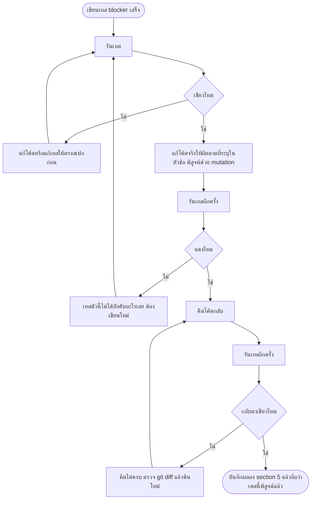
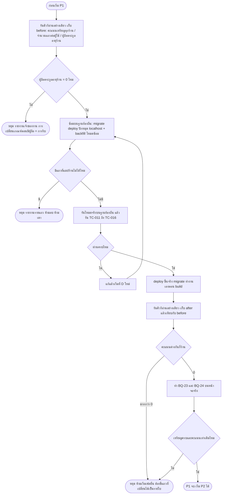

> **โมดูล:** 00052 — Badge & Achievement v2
> **ประเภทเอกสาร:** Test Case
> **เวอร์ชัน:** 1.0
> **วันที่จัดทำ:** 2026-08-21
> **สถานะ:** Draft
> **เจ้าของเอกสาร:** QA (ดู [[Feature-Docs-Ownership]])

# Test Case: ระบบเหรียญตราและความสำเร็จ รุ่นที่ 2

---

## 1. Overview

เอกสารนี้คือชุดเคสทดสอบของฟีเจอร์ 00052 ทั้ง 4 เฟส (P1 โครงกระดูกและข้อมูล · P2 เกณฑ์ใหม่และงานเบื้องหลัง · P3 หน้าเหรียญของผู้ขาย · P4 โปรไฟล์สาธารณะ) ทุกเคสอ้างกลับ `FR-BDG-*` / `BR-BDG-*` / Acceptance Criteria สรุปใน [[00052 - Badge & Achievement v2/BRD]] และเคสที่ติดป้าย **[blocker]** ทุกตัวมาพร้อม **ขั้นตอนพิสูจน์ด้วย mutation** — ระบุชัดว่าถ้าคืนโค้ดผิดกลับไป **เทสตัวไหนต้องแดง** ตาม `docs/conventions/rule-must-be-enforced-not-described.md` ("กฎที่เขียนไว้ ยังไม่ใช่กฎที่บังคับได้" — เทสที่เขียวอย่างเดียวไม่พิสูจน์อะไร)

- **เอกสารต้นทาง:** [[00052 - Badge & Achievement v2/BRD]] (FR-BDG-01 ถึง FR-BDG-27 · BR-BDG-01 ถึง BR-BDG-22 · AC สรุป §3.1–3.4) และ [[00052 - Badge & Achievement v2/PRD]] (ตัวชี้วัด §1.2 · §8) — คำศัพท์ทุกคำยึด `CONTEXT.md`

- **ขอบเขตชุดทดสอบ (In-scope):**
  - เทสหน่วยและเทสสแกนซอร์สใน `src/**` ที่รันด้วย Vitest
  - เคสของสคริปต์ migration/backfill ของ P1 (รันบนฐานท้องถิ่นก่อน แล้วจึงยืนยันผลบนฐานจริงด้วยคิวรีอ่านอย่างเดียว)
  - เคสของงานเบื้องหลังรายวัน (ความสด · การรันซ้ำ · การล้มกลางทาง)
  - เช็กลิสต์ Browser QA (§2.8) ที่คนกดทดสอบเองได้ทันที

- **ขอบเขตที่อยู่นอกชุดทดสอบ (Out-of-scope):**
  - **เทสระดับ DOM/คอมโพเนนต์** — `vitest.config.ts` ตั้ง `environment: "node"` และรีโปนี้ไม่มี jsdom/testing-library ⇒ สิ่งที่พิสูจน์ได้มีแค่ **ฟังก์ชันบริสุทธิ์** กับ **การสแกนซอร์ส** เท่านั้น ทุกอย่างที่ต้องเห็นด้วยตา (ลำดับการ์ด · ป้ายบนจอ · ปุ่มปักเหรียญ · กรอบเปล่า) ถูกย้ายไป §2.8 Browser QA ทั้งหมด ไม่แกล้งเขียนเป็นเทสอัตโนมัติ
  - เหรียญฝั่งผู้ซื้อและเหรียญประมูลใบใหม่ (BRD §7.1 ตัดออกทั้งชุด)
  - สูตร Trust Score (ห้ามแตะ — เทสในเอกสารนี้พิสูจน์เฉพาะว่า *ผลลัพธ์เท่าเดิม*)

- **สภาพแวดล้อม:**
  - **เทสอัตโนมัติ:** Postgres บนเครื่องตัวเอง (`.env` → `localhost:5434`) — `tests/setup.ts` เป็น allowlist fail-closed ที่ throw ทันทีถ้า `DATABASE_URL` ไม่ใช่ localhost
  - **คำสั่งรัน:** `npx dotenv -e .env -- npx vitest run src/` (`vitest.config.ts` ตัด `e2e/**` ออกให้แล้ว การ scope `src/` ไว้อีกชั้นทำให้รอบเทสเร็วขึ้นและกันไฟล์นอก `src/` หลุดเข้ามา)
  - **ฐานจริง:** ใช้เพื่อ **ยืนยันผลด้วยคิวรีอ่านอย่างเดียว** เท่านั้น (SELECT ผ่าน Supabase PAT) — ไม่มีเคสใดในเอกสารนี้สั่งเขียน/ลบบนฐานจริงนอกจากตัวสคริปต์ backfill ของ P1 ที่รันโดยเจ้าของงาน
  - **Browser QA:** `http://deepth.local:4000` (ผู้ซื้อ/โปรไฟล์สาธารณะ) · `http://seller.deepth.local:4000` (ผู้ขาย) · `http://admin.deepth.local:4000` (แอดมิน) — ห้ามใช้ `localhost` เพราะ `src/proxy.ts` แยกเส้นทางตาม subdomain และคุกกี้ผูกกับโฮสต์

- **กติกาความปลอดภัยของข้อมูลที่ทุกเคสต้องทำตาม (Hard Rule 13):**
  - เคสที่แตะฐานข้อมูล **ต้องเก็บ id ที่ตัวเองสร้าง** แล้วล้างด้วย `deleteTestData({ userIds, shopIds })` จาก `tests/setup.ts` ใน `finally` เสมอ
  - **ห้ามมี** `deleteMany()` ที่ไม่มี `where` · `TRUNCATE` · `DELETE FROM` ที่ไม่มี `WHERE` · `migrate reset` · `db push --force-reset` · `prisma db pull` ในไฟล์เทสใด ๆ ของฟีเจอร์นี้ — `cleanDatabase()` ถูกถอดออกแล้วและ throw ทันทีที่ถูกเรียก
  - `prisma db pull` ห้ามใช้ตลอดกาลกับฟีเจอร์นี้ เพราะ **ดัชนี unique บางส่วน 2 ตัวของ `UserBadge` เป็น SQL นอกการจัดการของ ORM** (ดู `prisma/schema.prisma` บรรทัดคอมเมนต์เหนือ `@@index([shopId])`) — introspect แล้วจะพยายามลบทิ้ง = เหรียญซ้ำได้ทันทีโดยไม่มีอะไรฟ้อง

- **ชื่อไฟล์เทสที่เสนอ** (SDS เคาะชื่อสุดท้ายได้ แต่ **จำนวนจุดบังคับและเงื่อนไขที่ต้องแดง ห้ามลด** ตาม BRD §2 หมายเหตุการบังคับใช้):

| กลุ่ม | ไฟล์ที่เสนอ |
|---|---|
| นิยามตระกูล/ขั้น/พื้นที่แสดงผล | `src/lib/__tests__/badge-family.test.ts` |
| ด่านเจ้าของเหรียญตอนมอบ | `src/services/__tests__/badge-owner-guard.test.ts` |
| ตัวนับคะแนนเหรียญของ Trust Score | `src/services/__tests__/trust-score-badge-scope.test.ts` |
| เกณฑ์สถานะ + หน้าต่าง 90 วัน + เหตุผล | `src/services/__tests__/badge-status-window.test.ts` |
| งานเบื้องหลังรายวัน | `src/services/__tests__/badge-daily-job.test.ts` |
| การเลือก/เรียงเหรียญบนโปรไฟล์ | `src/lib/__tests__/badge-profile-selection.test.ts` |
| ความหายาก | `src/services/__tests__/badge-rarity-base.test.ts` |
| สคริปต์ backfill (โหมดซ้อม) | `scripts/__tests__/backfill-badge-owner.test.ts` |
| ของเดิมที่ห้ามพัง | `src/services/badge.service.test.ts` · `src/services/badge-fast-shipping.test.ts` · `src/services/__tests__/badge-progress-exhaustive.test.ts` |

---

## 2. Test Scenarios

> **วิธีอ่าน:** เคส **[blocker]** = แดงเมื่อไหร่ห้าม merge · ทุกเคส [blocker] มีหัวข้อ **พิสูจน์ด้วย mutation** ซึ่งต้องรันจริงหนึ่งครั้งตอนเขียนเทสเสร็จ (แก้โค้ดให้ผิด → ยืนยันว่าแดง → คืนกลับ → ยืนยันว่าเขียว) ถ้าแก้ให้ผิดแล้วเทสยังเขียว แปลว่าเทสตัวนั้นยังไม่ได้บังคับอะไรเลย ต้องเขียนใหม่

### 2.1 กลุ่ม A — P1 โครงกระดูก เจ้าของเหรียญ และตัวนับคะแนน

#### TC-001: [blocker] ตัวนับคะแนนเหรียญของร้านส่วนตัว ต้องตามแถวที่ย้ายไป

- **Linked to:** FR-BDG-05 · AC §3.1 ("คะแนนเหรียญใน Trust Score ของทุกร้านเท่ากันก่อนและหลัง migration") · มติ D-BDG-1
- **Precondition:** ผู้ใช้ 1 ราย มีร้านส่วนตัว (`Shop.kind = 'PERSONAL'`) 1 ร้าน และมีแถว `UserBadge` ของเหรียญร้าน 3 ใบที่ **ผูก `shopId` ของร้านส่วนตัวนั้นแล้ว** (สภาพหลัง backfill) — ไม่มีแถวที่ `shopId = null` เหลืออยู่เลย
- **Steps:**
  1. สร้างผู้ใช้ + ร้านส่วนตัว + เหรียญ 3 ใบผูกร้าน เก็บ `userId`/`shopId` ไว้
  2. เรียกเส้นทางคำนวณคะแนนของบุคคล (`recalculateTrustScore(userId)`) แล้วอ่านค่า `badges` จาก breakdown ที่ถูกบันทึกลง `TrustScoreHistory`
  3. ล้างข้อมูลด้วย `deleteTestData({ userIds, shopIds })` ใน `finally`
- **Expected Result:** ค่า `badges` = **3** (1 เหรียญ = 1 คะแนน) · ค่าคงที่ `BADGE_SCORE_PER_BADGE` และ `BADGE_SCORE_MAX` ไม่ถูกแก้
- **พิสูจน์ด้วย mutation:** คืนเงื่อนไขเดิมใน `calcBadgeScore` (`src/services/trust-score.service.ts:109`) กลับเป็น `{ userId: scope.userId, shopId: null }` → **TC-001 ต้องแดงทันที** (ได้ 0 แทน 3) · คืนกลับแล้วต้องเขียว

#### TC-002: [blocker] เส้นร้านธุรกิจของตัวนับต้องไม่ถูกกระทบ (zero-regression)

- **Linked to:** FR-BDG-05 · BR-BDG-03
- **Precondition:** ร้านธุรกิจ 1 ร้าน มีเหรียญผูก `shopId` 4 ใบ และเจ้าของร้านมีเหรียญบุคคล (`shopId = null`) อีก 2 ใบ
- **Steps:**
  1. เรียกเส้นทางคำนวณคะแนนของร้าน (`recalculateShopTrustScore(shopId)`) อ่านค่า `badges`
  2. เรียกเส้นทางคำนวณคะแนนของบุคคล (`recalculateTrustScore(ownerUserId)`) อ่านค่า `badges`
  3. ล้างข้อมูลตาม id ที่สร้าง
- **Expected Result:** ร้านธุรกิจได้ **4** · บุคคลได้ **2** (เหรียญของร้านธุรกิจต้องไม่ไหลเข้าคะแนนของบุคคล — เจตนาเดิมของ 00008 P5-2)
- **พิสูจน์ด้วย mutation:** ทำให้เส้น personal นับเหรียญของ **ทุกร้าน** ของ user (ไม่จำกัดเฉพาะร้านส่วนตัว) → **TC-002 ต้องแดง** (บุคคลได้ 6)

#### TC-003: [blocker] ค่าคงที่ราคาต่อเหรียญและเพดานคะแนนต้องไม่ถูกแตะ

- **Linked to:** FR-BDG-05 · BRD §7.2 ("สูตร Trust Score ห้ามแตะ")
- **Precondition:** ไฟล์ที่ถือค่าคงที่ (`src/lib/badge-score-rule.ts`) อยู่ในรีโป
- **Steps:**
  1. เทสอ่านค่าคงที่ทั้งสองตัวเข้ามาตรง ๆ แล้ว assert ค่า (1 และ 10)
  2. เทสสแกนซอร์ส `src/services/trust-score.service.ts` ยืนยันว่าบรรทัดคืนค่าของ `calcBadgeScore` ยังใช้ `Math.min(BADGE_SCORE_MAX, count * BADGE_SCORE_PER_BADGE)` (ไม่มีตัวเลขดิบแทรก)
- **Expected Result:** ค่าคงที่ = 1 และ 10 · ไม่มีตัวเลขดิบในสูตร
- **พิสูจน์ด้วย mutation:** เปลี่ยน `BADGE_SCORE_PER_BADGE` เป็น 2 → **TC-003 ต้องแดง** · เขียนสูตรเป็น `count * 1` แทนค่าคงที่ → **TC-003 ต้องแดง**

#### TC-004: สคริปต์เทียบคะแนนเหรียญของทุกร้านบนฐานจริง ก่อน/หลัง migration

- **Linked to:** FR-BDG-05 (AC "ผลต่างที่ยอมรับได้ = 0") · AC §3.1
- **Precondition:** ก่อนรัน migration ของ P1 บนฐานจริง
- **Steps:**
  1. **ก่อนรัน:** รันคิวรีอ่านอย่างเดียว เก็บผลลง `before.json`

     ```sql
     -- คะแนนส่วนเหรียญของทุกร้าน (สูตรเดิม: 1 คะแนน/ใบ เพดาน 10)
     SELECT s.id AS shop_id, s.kind,
            LEAST(10, COUNT(ub.id)) AS badge_score
     FROM "Shop" s
     LEFT JOIN "UserBadge" ub
       ON (s.kind = 'BUSINESS' AND ub."shopId" = s.id)
       OR (s.kind = 'PERSONAL' AND ub."userId" = s."userId" AND ub."shopId" IS NULL)
     WHERE s."deletedAt" IS NULL
     GROUP BY s.id, s.kind
     ORDER BY s.id;
     ```
  2. รัน migration + backfill (คำสั่ง migrate ต้องปักหมุด URL localhost ตรง ๆ ตอนซ้อมบนเครื่อง และบน prod ใช้เส้นทาง deploy ปกติซึ่งรัน `prisma migrate deploy` ให้เองอยู่แล้ว — Hard Rule 15)
  3. **หลังรัน:** รันคิวรีเดิมที่ปรับให้เข้ากับกติกาใหม่ (ร้านส่วนตัวนับจาก `ub."shopId" = s.id` เช่นเดียวกับร้านธุรกิจ) เก็บลง `after.json`
  4. `diff` สองไฟล์
- **Expected Result:** ผลต่าง = **0 ร้าน** ทุกแถว · รายงาน diff แนบไว้ในหัวข้อ §5 ของเอกสารนี้ในรอบที่รันจริง
- **หมายเหตุ:** ถ้ามีร้านใดผลต่างไม่เป็นศูนย์ **ห้าม merge** และห้ามอธิบายด้วยคำว่า "น่าจะเป็นเพราะ" — ต้องชี้แถวที่เปลี่ยนได้เป็นรายใบ

#### TC-005: [blocker] มอบเหรียญร้านโดยไม่ส่งร้าน → ต้องถูกปฏิเสธที่จุดมอบ

- **Linked to:** FR-BDG-02 · BR-BDG-01
- **Precondition:** เหรียญที่นิยามตระกูลระบุว่าเป็น **เหรียญร้าน** (เช่นตระกูลออเดอร์สะสม)
- **Steps:**
  1. เรียก `awardBadge(userId, badgeId)` โดยไม่ส่งพารามิเตอร์ร้าน (ค่าตั้งต้นปัจจุบันคือ `null`)
  2. ดักผลลัพธ์
- **Expected Result:** โยน error ที่ระบุชัดว่าเหรียญร้านต้องมีร้านกำกับ · **ไม่มีแถวถูกเขียนลง `UserBadge`** (ตรวจด้วยการนับแถวหลังเรียก)
- **พิสูจน์ด้วย mutation:** ลบด่านออกจาก `awardBadge()` → **TC-005 ต้องแดง** (แถวถูกเขียนสำเร็จโดยไม่มีใครค้าน)

#### TC-006: [blocker] มอบเหรียญบุคคลพร้อมร้าน → ต้องถูกปฏิเสธ

- **Linked to:** FR-BDG-02 · BR-BDG-02 · FR-BDG-03
- **Precondition:** เหรียญที่นิยามตระกูลระบุว่าเป็น **เหรียญบุคคล** (`2026_BADGE` · `Fully Verified` · เหรียญประมูลฝั่งผู้ซื้อ)
- **Steps:**
  1. เรียก `awardBadge(userId, badgeId, undefined, shopId)` พร้อม `shopId` จริง
  2. ดักผลลัพธ์
- **Expected Result:** โยน error · ไม่มีแถวถูกเขียน — นี่คือด่านที่กันไม่ให้เกิดแถวค้างชนิดเดียวกับ 3 แถวของ `2026_BADGE` ซ้ำอีก
- **พิสูจน์ด้วย mutation:** ทำให้ด่านเช็คเฉพาะทิศเดียว (เหรียญร้านไม่มีร้าน) แล้วปล่อยทิศนี้ผ่าน → **TC-006 ต้องแดง** — ทิศนี้คือทิศที่พลาดมาแล้วบนข้อมูลจริง จึงห้ามฝากไว้กับ "ไม่มีใครเรียกให้ผิด"

#### TC-007: [blocker] เหรียญทุกใบในแคตตาล็อกต้องแมปเข้านิยามตระกูลได้

- **Linked to:** FR-BDG-01 · BR-BDG-19
- **Precondition:** นิยามตระกูลรวมศูนย์ (เสนอ `src/lib/badge-family.ts`) และ `prisma/badge-seed-data.ts`
- **Steps:**
  1. เทสอ่าน `defaultBadges` ทั้งหมด (45 ใบหลังรอบนี้)
  2. สำหรับทุกใบ ค้นหา `family` / `tier` / `surface` จากนิยามตระกูล
  3. เก็บรายชื่อใบที่หาไม่เจอ
- **Expected Result:** รายชื่อที่หาไม่เจอ = **[]** · จำนวนใบในแคตตาล็อก = 45 · ทุกใบมีค่าครบทั้ง 3 ช่อง
- **พิสูจน์ด้วย mutation:** ลบแถวใดแถวหนึ่งออกจาก allow-list → **TC-007 ต้องแดงพร้อมชื่อใบที่หาย** (เทสต้องพิมพ์ชื่อออกมา ไม่ใช่แค่บอกว่าไม่เท่ากัน)

#### TC-008: ขั้นห้ามซ้ำกันภายในตระกูลเดียวกัน

- **Linked to:** FR-BDG-01
- **Precondition:** นิยามตระกูลตาม TC-007
- **Steps:**
  1. จัดกลุ่มทุกใบด้วยคู่ (`family`, `tier`)
  2. นับสมาชิกในแต่ละกลุ่ม
- **Expected Result:** ไม่มีกลุ่มใดนับได้มากกว่า 1 · ภายในตระกูลเดียวกัน `tier` เรียงต่อเนื่องเริ่มที่ 1 ไม่มีเลขข้าม

#### TC-009: [blocker] ค่าพื้นที่แสดงผลที่ระบบไม่รู้จัก ต้องตกไปเป็นเหรียญเป้าหมาย

- **Linked to:** FR-BDG-01 · BR-BDG-20
- **Precondition:** ฟังก์ชันแปลงค่า `surface` จากฐานเป็นชนิดภายใน
- **Steps:**
  1. ส่งค่า `'EVIDENCE'` · `'GOAL'` · `'COMMEMORATIVE'` → ตรวจว่าได้ค่าตรงตัว
  2. ส่งค่ามั่ว `'SHOWCASE'` · `''` · `null` · `undefined` → ตรวจผลลัพธ์
- **Expected Result:** ทั้ง 4 ค่าที่ไม่รู้จักได้ **`GOAL`** (ไม่ขึ้นโปรไฟล์) — ไม่ใช่ `EVIDENCE` และไม่ใช่โยน error
- **พิสูจน์ด้วย mutation:** เปลี่ยนค่าถอยกลับเป็น `EVIDENCE` → **TC-009 ต้องแดง** · ค่าที่ไม่รู้จักหลุดขึ้นหน้าสาธารณะคือความเสียหายที่คนนอกเห็น จึงต้อง fail-closed

#### TC-010: ชนิดเหรียญ (เหตุการณ์/สถานะ) ต้องอ่านจากนิยามตระกูล ไม่ใช่เดาจากรูปแบบเกณฑ์

- **Linked to:** FR-BDG-01 (AC ข้อสุดท้าย)
- **Precondition:** นิยามตระกูลประกาศชนิดไว้ต่อตระกูล
- **Steps:**
  1. เทสสแกนซอร์สของตัวตัดสิน หา pattern ที่เดาชนิดจากคีย์ของเกณฑ์ (เช่น ตรวจว่ามี `maxHours` แล้วสรุปว่าเป็นเหรียญสถานะ)
  2. ยืนยันว่าทุกจุดที่ถามว่า "ใบนี้เป็นเหรียญสถานะไหม" เรียกฟังก์ชันตัวเดียวจากนิยามตระกูล
- **Expected Result:** ไม่พบการเดาจากคีย์ของเกณฑ์ · มีผู้เรียกฟังก์ชันเดียวทุกจุด · ไม่มีคอลัมน์ใหม่ใน `Badge` ที่เก็บชนิดซ้ำ

#### TC-011: migration ต้องไม่แตะโครง `UserBadge` และดัชนี unique บางส่วนต้องอยู่ครบ

- **Linked to:** FR-BDG-01 (AC "โครงตาราง `UserBadge` ไม่ถูกแก้") · BRD §7.2 · PRD §6.2
- **Precondition:** ฐานท้องถิ่นที่ apply migration ของ P1 แล้ว (`prisma migrate deploy` โดยปักหมุด URL localhost ตรง ๆ ในคำสั่ง — ห้ามอ่านจากตัวแปรหรือ `.env.local`)
- **Steps:**
  1. รันคิวรีอ่านดัชนี

     ```sql
     SELECT indexname, indexdef FROM pg_indexes
     WHERE tablename = 'UserBadge' ORDER BY indexname;
     ```
  2. รันคิวรีอ่านคอลัมน์

     ```sql
     SELECT column_name, data_type, is_nullable FROM information_schema.columns
     WHERE table_name = 'UserBadge' ORDER BY ordinal_position;
     ```
  3. อ่านไฟล์ migration ของรอบนี้ ตรวจว่าเป็นการเพิ่มของล้วน
- **Expected Result:**
  - พบ `UserBadge_userId_badgeId_personal_key` (WHERE `"shopId" IS NULL`) และ `UserBadge_shopId_badgeId_key` (WHERE `"shopId" IS NOT NULL`) **ครบทั้งสองตัวและเงื่อนไข WHERE ตรงเดิม**
  - คอลัมน์ยังเป็น `id · userId · badgeId · earnedAt · shopId` ไม่มีคอลัมน์ใหม่
  - ไฟล์ migration ไม่มี `DROP INDEX` / `DROP COLUMN` / `ALTER ... DROP`
- **หมายเหตุ:** ถ้าดัชนีหายไปตัวใดตัวหนึ่ง เหรียญซ้ำได้ทันทีโดยไม่มี error ใด ๆ ⇒ ถือเป็น blocker ของทั้งเฟส

#### TC-012: [blocker] backfill แล้วจำนวนเหรียญต่อผู้ใช้ต้องไม่ลดลงสักราย

- **Linked to:** FR-BDG-02 (AC ข้อสุดท้าย) · AC §3.1 · PRD §8 ("จำนวนเหรียญที่ผู้ใช้เดิมถืออยู่ไม่ลดลง")
- **Precondition:** ฐานท้องถิ่นที่ถูกเติมด้วยสภาพจำลองของฐานจริง (63 แถว · 52 ผู้ใช้ · 14 ร้าน · `2026_BADGE` 3 แถวที่มี `shopId` ค้าง)
- **Steps:**
  1. ก่อนรัน: `SELECT "userId", COUNT(*) FROM "UserBadge" GROUP BY "userId" ORDER BY "userId";` → เก็บเป็น before
  2. รันสคริปต์ backfill
  3. หลังรัน: คิวรีเดิม → เก็บเป็น after
  4. เทียบรายผู้ใช้
- **Expected Result:** ไม่มีผู้ใช้รายใดที่ after < before **ยกเว้น** ผู้ใช้ที่ถูกลบแถวซ้ำตามกติกาของ TC-015 ซึ่งต้องปรากฏชื่ออยู่ในรายงานของสคริปต์เป็นรายแถว (id · badgeId · earnedAt ของแถวที่ลบ)
- **พิสูจน์ด้วย mutation:** ทำให้สคริปต์ลบแถวที่แมปร้านไม่ได้แทนที่จะหยุด → **TC-012 ต้องแดง** พร้อมชี้ผู้ใช้ที่เหรียญหาย

#### TC-013: backfill ต้องรันซ้ำได้โดยผลไม่เปลี่ยน (idempotent)

- **Linked to:** FR-BDG-02 (AC "รันได้ซ้ำโดยผลไม่เปลี่ยน")
- **Precondition:** ฐานท้องถิ่นที่รัน backfill ไปแล้ว 1 รอบ
- **Steps:**
  1. เก็บ snapshot ทุกแถวของ `UserBadge` (`id`, `userId`, `badgeId`, `shopId`, `earnedAt`)
  2. รันสคริปต์ซ้ำรอบที่ 2 และรอบที่ 3
  3. เก็บ snapshot ใหม่แล้วเทียบทั้งก้อน
- **Expected Result:** snapshot เหมือนกันทุกฟิลด์ทุกแถว · รายงานของสคริปต์รอบที่ 2/3 ระบุว่า "ไม่มีอะไรต้องแก้" · ไม่มีการแจ้งเตือนถูกสร้างเพิ่ม

#### TC-014: [blocker] แถวที่แมปเข้าร้านไม่ได้ ต้องหยุดและรายงาน ห้ามลบห้ามเดา

- **Linked to:** FR-BDG-02 (AC ข้อ 5) · BR-BDG-04
- **Precondition:** สร้างผู้ใช้ 1 ราย **ที่ไม่มีร้านเลยสักร้าน** (ทั้ง PERSONAL และ BUSINESS) แล้วให้ถือเหรียญร้าน 1 ใบที่ `shopId = null`
- **Steps:**
  1. รันสคริปต์ backfill ในโหมดซ้อม (dry-run)
  2. อ่านรายงานที่สคริปต์คืน
  3. รันโหมดจริง
- **Expected Result:**
  - โหมดซ้อมรายงานแถวนั้นเป็น "แมปไม่ได้" พร้อม `userId` และ `badgeId`
  - โหมดจริง **หยุดก่อนเขียนอะไรทั้งสิ้น** (exit code ไม่เป็น 0) ไม่ใช่ข้ามแถวนั้นแล้วทำที่เหลือต่อ — เพราะการทำครึ่งเดียวแล้วรายงานทีหลัง แปลว่าฐานอยู่ในสภาพที่ไม่มีใครรู้ว่าจบหรือยัง
  - แถวนั้นยังอยู่ครบในฐาน `shopId` ยังเป็น `null`
- **พิสูจน์ด้วย mutation:** เปลี่ยนสคริปต์ให้ `continue` ข้ามแถวที่แมปไม่ได้ → **TC-014 ต้องแดง**

#### TC-015: [blocker] backfill ชนดัชนี unique บางส่วน — ผู้ใช้ที่มีเหรียญใบเดียวกันทั้งสองฝั่ง

- **Linked to:** FR-BDG-03 (AC ข้อ 2) · FR-BDG-02 · PRD §6.2
- **Precondition:** สร้างผู้ใช้ 1 ราย + ร้านธุรกิจ 1 ร้าน แล้วสร้าง 2 แถวของ **เหรียญใบเดียวกัน**:
  - แถว A: `shopId = null` · `earnedAt = 2026-01-10`
  - แถว B: `shopId = <ร้านธุรกิจ>` · `earnedAt = 2026-03-05`
  (สภาพนี้ผ่านดัชนีทั้งสองตัวได้อย่างถูกต้อง เพราะดัชนีแยกกันด้วยเงื่อนไข `shopId IS NULL`)
- **Steps:**
  1. รันสคริปต์ backfill ในเคสของเหรียญที่ระลึก (ต้องล้าง `shopId` ของแถว B เป็น `null` ⇒ จะชนกับแถว A ที่ดัชนี `UserBadge_userId_badgeId_personal_key`)
  2. อ่านผลลัพธ์และรายงาน
- **Expected Result:**
  - สคริปต์ **ไม่ล้มด้วย P2002 ที่ไม่ถูกดัก** — ต้องดักแล้วตัดสินตามกติกา: **เก็บแถวที่ได้รับก่อน (แถว A)** และลบแถว B ทิ้ง
  - การลบต้องผูกกับ `id` ของแถวนั้นตรง ๆ (`where: { id: <ids ที่เก็บมา> }`) ไม่ใช่ลบด้วยเงื่อนไขกว้าง
  - รายงานระบุแถวที่ลบครบทุกฟิลด์
  - หลังรัน: `SELECT COUNT(*) FROM "UserBadge" WHERE "userId"=$1 AND "badgeId"=$2;` = **1** และ `earnedAt` = ของแถว A
- **พิสูจน์ด้วย mutation:** เปลี่ยนกติกาให้เก็บแถวที่ได้รับทีหลัง → **TC-015 ต้องแดง** (วันที่ได้รับเพี้ยน = ประวัติของผู้ใช้ถูกเขียนใหม่โดยไม่มีใครขอ)

#### TC-016: เหรียญที่ระลึกที่ผูกร้านค้างไว้ ต้องถูกล้างครบและจำนวนผู้ถือ = จำนวนคน

- **Linked to:** FR-BDG-03 · PRD §8
- **Precondition:** สภาพจำลองของฐานจริง (มี 3 แถวของ `2026_BADGE` ที่ `shopId` ไม่เป็น null)
- **Steps:**
  1. รัน backfill
  2. รันคิวรีตรวจ

     ```sql
     -- ต้องได้ 0
     SELECT COUNT(*) FROM "UserBadge" ub
     JOIN "Badge" b ON b.id = ub."badgeId"
     WHERE b."nameEN" = '2026_BADGE' AND ub."shopId" IS NOT NULL;

     -- สองค่านี้ต้องเท่ากัน
     SELECT COUNT(*) AS rows, COUNT(DISTINCT ub."userId") AS people
     FROM "UserBadge" ub JOIN "Badge" b ON b.id = ub."badgeId"
     WHERE b."nameEN" = '2026_BADGE';
     ```
- **Expected Result:** คิวรีแรกได้ **0** · คิวรีที่สองได้ `rows = people` · รันซ้ำบนฐานจริงหลัง deploy แล้วต้องได้ผลเดียวกัน

#### TC-017: [blocker] เกณฑ์อายุร้านต้องอ่านวันเปิดร้าน ไม่ใช่วันสมัครบัญชี

- **Linked to:** FR-BDG-04 · FR-BDG-10
- **Precondition:** ผู้ใช้ที่ `createdAt` เก่า **400 วัน** + ร้านที่ `Shop.createdAt` เก่าเพียง **10 วัน** + มีออเดอร์สถานะปิดจบ 1 ใบใน 30 วันล่าสุด (เงื่อนไข "ยังขายอยู่" ผ่าน)
- **Steps:**
  1. เรียกตัวตรวจเกณฑ์อายุด้วยเกณฑ์ขั้น 90 วัน
  2. อ่านผล `met` และค่าจำนวนวันที่คืนมา
- **Expected Result:** `met = false` · จำนวนวันที่คืนมา = **10** (ไม่ใช่ 400)
- **พิสูจน์ด้วย mutation:** คืนบรรทัดเดิมใน `checkVeteran` (`src/services/badge.service.ts:209`) ให้กลับไปอ่าน `user.createdAt` → **TC-017 ต้องแดง** · เคสนี้คือเหตุผลทั้งหมดที่ FR-BDG-04 มีอยู่ — เจ้าของที่เปิดร้านที่สองจะได้เหรียญอายุร้านทันทีทั้งที่ร้านเพิ่งเปิด

#### TC-018: ไม่มีร้าน → เกณฑ์อายุต้องไม่ผ่าน ไม่ใช่ถอยไปคำนวณจากบัญชี

- **Linked to:** FR-BDG-04 (AC ข้อ 3)
- **Precondition:** ผู้ใช้ที่บัญชีอายุ 400 วัน แต่ไม่มีร้านเลย
- **Steps:** เรียกตัวตรวจเกณฑ์อายุโดยส่ง shop context = `null`
- **Expected Result:** `met = false` และค่าจำนวนวันต้อง **ไม่ใช่ 400** (ห้ามถอยไปใช้อายุบัญชีเงียบ ๆ)

#### TC-019: ยืนยันว่าไม่มีผู้ถือเหรียญตระกูลอายุร้านก่อนเปลี่ยนเกณฑ์

- **Linked to:** FR-BDG-04 (AC ข้อ 4 — "การเปลี่ยนนี้ต้องไม่ริบเหรียญของใคร") · BR-BDG-05
- **Precondition:** ก่อนเริ่มงาน P1 บนฐานจริง
- **Steps:**
  1. รันคิวรีอ่านอย่างเดียวบนฐานจริง

     ```sql
     SELECT b."nameEN", COUNT(ub.id) AS holders
     FROM "Badge" b LEFT JOIN "UserBadge" ub ON ub."badgeId" = b.id
     WHERE b."nameEN" IN ('Veteran', '3 Months Strong')
     GROUP BY b."nameEN";
     ```
  2. บันทึกผลลงหัวข้อ §5 ของเอกสารนี้
- **Expected Result:** `holders = 0` ทั้งสองใบ ⇒ เปลี่ยนเกณฑ์ได้อย่างปลอดภัย · **ถ้าพบผู้ถือแม้รายเดียว ต้องหยุดแล้วรายงานให้เจ้าของงานตัดสิน** เพราะการเปลี่ยนเกณฑ์ตอนมีคนถือแล้วมีค่าเท่ากับการริบ ซึ่งขัด BR-BDG-05

#### TC-020: เหรียญของร้านไม่ติดตัวเจ้าของไปร้านอื่น

- **Linked to:** BR-BDG-03 · FR-BDG-02
- **Precondition:** เจ้าของ 1 คนที่มี 2 ร้าน (ร้านส่วนตัว 1 + ร้านธุรกิจ 1) · ร้านธุรกิจถือเหรียญออเดอร์สะสมขั้น 5
- **Steps:**
  1. อ่านรายการเหรียญของร้านส่วนตัว
  2. อ่านรายการเหรียญของร้านธุรกิจ
- **Expected Result:** ร้านส่วนตัว **ไม่มี** เหรียญออเดอร์สะสมขั้น 5 · ร้านธุรกิจมี · ทั้งสองชุดไม่ทับกันเลย

---

### 2.2 กลุ่ม B — P2 แคตตาล็อกตามประเภทร้าน และด่านฝั่งเซิร์ฟเวอร์

#### TC-021: [blocker] ประเภทร้านที่ระบบไม่รู้จัก ต้องได้ชุดกลาง 7 ตระกูล (fail-closed)

- **Linked to:** FR-BDG-16 · BR-BDG-19 · Scenario 4 ใน BRD §5
- **Precondition:** ตาราง allow-list ต่อประเภทร้าน (โครงเดียวกับ `VERTICAL_VISIBLE_SLUGS` ใน `src/lib/seller-menu.ts`)
- **Steps:**
  1. เรียกตัวแปลงด้วยค่า `'ONLINE_SALES'` · `'SERVICE_QUEUE'` · `'LODGING'`
  2. เรียกด้วยค่ามั่ว `'GENERAL'` (ค่าที่ถูกลบไปแล้วตั้งแต่ 00028) · `'RENTAL'` · `''` · `null` · `undefined`
- **Expected Result:**
  - `ONLINE_SALES` → **9 ตระกูล** (ชุดกลาง 7 + ส่งไว + ตามพัสดุได้ทุกใบ)
  - `SERVICE_QUEUE` และ `LODGING` → **7 ตระกูล** (ชุดกลางอย่างเดียว)
  - ค่าที่ไม่รู้จักทั้ง 5 ค่า → **7 ตระกูล (ชุดกลาง)** ไม่ใช่ 9 และไม่ใช่รายการว่าง
- **พิสูจน์ด้วย mutation:**
  1. เปลี่ยน fallback เป็นชุดของ `ONLINE_SALES` → **TC-021 ต้องแดง**
  2. เปลี่ยนโครงจาก allow-list เป็น deny-list (ประกาศว่าประเภทไหนห้ามเห็นอะไร) → **TC-021 ต้องแดงกับค่าที่ไม่รู้จัก** เพราะ deny-list ปล่อยค่าที่ไม่มีในรายการหลุดทั้งหมด

#### TC-022: [blocker] ด่านฝั่งเซิร์ฟเวอร์ต้องกันการมอบเหรียญข้ามประเภทร้าน

- **Linked to:** FR-BDG-16 (AC ข้อสุดท้าย) · BR-BDG-21 · BRD §6.4
- **Precondition:** ร้าน `SERVICE_QUEUE` ที่ข้อมูลจำลองเข้าเกณฑ์ "ส่งไว" ทุกประการ (ถ้าเผลอประเมิน จะผ่าน)
- **Steps:**
  1. เรียกตัวประเมินของร้านนั้นตรง ๆ โดยบังคับให้ประเมินเหรียญตระกูลส่งไว (จำลองผู้เรียกที่ยิงคำขอตรงโดยไม่ผ่านหน้าจอ)
  2. ตรวจว่ามีแถวถูกเขียนหรือไม่
- **Expected Result:** ไม่มีแถวถูกเขียน · ตัวประเมินคืนผลว่าเหรียญนี้อยู่นอกแคตตาล็อกของร้านประเภทนี้
- **พิสูจน์ด้วย mutation:** ถอดด่านฝั่งเซิร์ฟเวอร์ออก เหลือแค่การซ่อนในหน้าจอ → **TC-022 ต้องแดง** — "การซ่อนไม่ใช่การควบคุมสิทธิ์" ต้องมีโค้ดบังคับ ไม่ใช่มีแค่ประโยคในเอกสาร

#### TC-023: เหรียญที่อยู่นอกแคตตาล็อกของร้าน ต้องไม่โผล่เป็นเป้าหมายที่ล็อกอยู่

- **Linked to:** FR-BDG-16 · FR-BDG-21 (AC ข้อ 2) · PRD BR-BDG2-11
- **Precondition:** ร้าน `SERVICE_QUEUE`
- **Steps:** อ่านรายการเหรียญที่หน้าเหรียญของผู้ขายจะได้รับ (ชั้นข้อมูล ไม่ใช่ชั้นหน้าจอ)
- **Expected Result:** ไม่มีสมาชิกของตระกูล "ส่งไว" และ "ตามพัสดุได้ทุกใบ" อยู่ในรายการเลย **แม้ในสถานะจาง/ล็อก** · จำนวนตระกูลในรายการ = 5

---

### 2.3 กลุ่ม C — P2 เกณฑ์รายตระกูล

#### TC-024: ตระกูลออเดอร์สะสม — ค่าคงที่ 7 ขั้น (snapshot)

- **Linked to:** FR-BDG-09 · BR-BDG-09
- **Steps:** เทสอ่านนิยามตระกูลออเดอร์สะสมแล้ว assert ลิสต์เกณฑ์ทั้งชุด
- **Expected Result:** ได้ `[1, 10, 25, 50, 100, 250, 500]` เรียงตามขั้น 1–7 · ขั้น 1–4 = `GOAL` · **ขั้น 5–7 = `EVIDENCE`**
- **หมายเหตุ:** เทสตัวนี้คือด่านที่บังคับ "ห้ามขยับเกณฑ์หลังปล่อย" — ใครแก้ตัวเลขต้องมาแก้เทสและเอกสารพร้อมกัน ไม่ใช่แก้เงียบ ๆ ในโค้ด

#### TC-025: ตระกูลออเดอร์สะสม — ผู้ถือเดิม 5 ใบต้องไม่เสียเหรียญและไม่ถูกมอบซ้ำ

- **Linked to:** FR-BDG-09 (AC ข้อ 3–4) · BR-BDG-05
- **Precondition:** ร้านที่ถือเหรียญเดิมครบ 5 ใบ (First Sale · Getting Started · Rising Seller · Trusted Seller 50 · Century Club)
- **Steps:**
  1. นับแถวก่อนรันตัวประเมินรอบใหม่
  2. รันตัวประเมิน
  3. นับแถวหลังรัน + ตรวจจำนวนแถวแจ้งเตือน
- **Expected Result:** จำนวนแถวเท่าเดิม (5) · `earnedAt` เดิมทุกใบ · ไม่มีแถวแจ้งเตือนใหม่

#### TC-026: ตระกูลอยู่มานาน — 4 ขั้น + เงื่อนไขร่วม "ยังขายอยู่"

- **Linked to:** FR-BDG-10 · FR-BDG-04
- **Precondition:** สร้าง 3 ร้าน: (ก) ร้านอายุ 100 วัน มีออเดอร์ปิดจบใน 30 วันล่าสุด · (ข) ร้านอายุ 400 วัน **ไม่มี** ออเดอร์ใน 30 วันล่าสุด · (ค) ร้านอายุ 800 วัน มีออเดอร์ใน 30 วันล่าสุด
- **Steps:** รันตัวประเมินกับทั้ง 3 ร้าน
- **Expected Result:**
  - (ก) ได้ขั้น 1 (90 วัน) เท่านั้น
  - (ข) **ไม่ได้ขั้นใดเลย** (อายุถึงแต่ไม่ได้ขายอยู่)
  - (ค) ได้ครบทั้ง 4 ขั้น · ขั้น 3 และ 4 เป็น `EVIDENCE` · ขั้น 1 และ 2 เป็น `GOAL`
- **หมายเหตุ:** ค่าคงที่ต้องเป็น `[90, 180, 365, 730]` วัน (snapshot เช่นเดียวกับ TC-024)

#### TC-027: [blocker] ตระกูลไม่ทิ้งลูกค้า — การยกเลิกที่ไม่ใช่ความผิดร้าน ต้องไม่ถูกนับ

- **Linked to:** FR-BDG-11 (AC ข้อ 3) · BR-BDG-17 · Hard Rule 16
- **Precondition:** ร้านที่มีออเดอร์ปิดจบ 25 ใบในหน้าต่าง 90 วัน และมีใบยกเลิก 3 ใบซึ่งทั้ง 3 ใบเข้าเงื่อนไข "ไม่ใช่ความรับผิดชอบของร้าน" ตาม `isRateExcludedCancellation` ของ 00039 (ผู้ซื้อยกเลิกเอง / พัสดุถูกตีกลับ)
- **Steps:**
  1. รันตัวคำนวณของตระกูลไม่ทิ้งลูกค้า
  2. อ่านผลและตัวเลขที่คืนมา (จำนวนใบที่ร้านยกเลิกเอง · ตัวหาร)
- **Expected Result:** **ผ่านขั้น 1** · จำนวนใบที่ร้านยกเลิกเอง = 0 · ตัวหาร = 25
- **พิสูจน์ด้วย mutation:**
  1. เปลี่ยนตัวคำนวณให้เขียนเงื่อนไขนับการยกเลิกเองใหม่ (แทนที่จะเรียก `isRateExcludedCancellation` จาก `src/lib/order-stats.ts`) → **TC-027 ต้องแดง** (นับได้ 3 ใบ ⇒ ตก)
  2. เทสสแกนซอร์สอีกตัวยืนยันว่าตัวคำนวณของเหรียญ **เรียกฟังก์ชันของ 00039 จริง** (ค้นหา `isRateExcludedCancellation(` ที่เป็นการเรียก ไม่ใช่แค่บรรทัด import และไม่นับบรรทัดคอมเมนต์) → ถอดการเรียกออกแล้วต้องแดง

#### TC-028: ตระกูลไม่ทิ้งลูกค้า — ขั้นแบ่งด้วยขนาดตัวอย่าง และผูกกับหน้าต่าง 90 วัน

- **Linked to:** FR-BDG-11 (AC ข้อ 1–2) · BR-BDG-07 · BR-BDG-14
- **Precondition:** สร้าง 3 ชุดข้อมูล — 25 ใบ / 120 ใบ / 320 ใบ ปิดจบในหน้าต่าง 90 วัน โดยทุกชุดมีใบที่ร้านยกเลิกเอง = 0 และแต่ละชุดมีใบที่ร้านยกเลิกเอง 5 ใบที่ **เก่ากว่า 90 วัน**
- **Steps:** รันตัวคำนวณกับทั้ง 3 ชุด
- **Expected Result:** ชุดแรกผ่านขั้น 1 · ชุดที่สองผ่านขั้น 1–2 · ชุดที่สามผ่านครบ 3 ขั้น · **ใบที่เก่ากว่า 90 วันไม่ถูกนับเลยทั้งตัวตั้งและตัวหารในทุกชุด** (นี่คือความต่างทั้งหมดจากเกณฑ์เดิมที่นับตลอดชีพ)

#### TC-029: ตระกูลไม่ทิ้งลูกค้า — เหตุผลที่ร้านพิมพ์เองต้องไม่ถูกอ่าน

- **Linked to:** FR-BDG-11 (AC ข้อ 4) · BR-BDG-17
- **Steps:** เทสสแกนซอร์สของตัวคำนวณตระกูลนี้ (ตัดคอมเมนต์ออกก่อนสแกน) หาการอ่านฟิลด์ข้อความเหตุผลการยกเลิกที่ร้านกรอกเอง
- **Expected Result:** ไม่พบการอ่านฟิลด์นั้นเลย
- **หมายเหตุ:** ต้องตัดคอมเมนต์ก่อนสแกนเสมอ ไม่งั้นด่านจะแดงค้างเพราะไปเจอคอมเมนต์ที่อธิบายกฎของตัวเอง (เคยเกิดกับ grep gate ของ Hard Rule 9 มาแล้ว)

#### TC-030: [blocker] ตระกูลตอบทุกรีวิว — รีวิวที่ถูกลบต้องไม่ถูกนับทั้งตัวตั้งและตัวหาร

- **Linked to:** FR-BDG-12 (AC ข้อ 3) · BR-BDG-16
- **Precondition:** ร้านที่มีรีวิว 10 ใบ — ตอบแล้ว 9 ใบ · ในจำนวนนั้นมีรีวิวที่ถูกลบแบบ soft delete 2 ใบ (ใบที่ตอบแล้ว 1 · ใบที่ยังไม่ตอบ 1)
- **Steps:** รันตัวคำนวณสัดส่วนการตอบรีวิว
- **Expected Result:** ตัวหาร = **8** (ไม่ใช่ 10) · ตัวตั้ง = **8** (ไม่ใช่ 9) · สัดส่วน = 100% ⇒ ผ่านขั้น 1 (เกณฑ์ 90% จาก ≥5 ใบ)
- **พิสูจน์ด้วย mutation:** ถอดตัวกรอง soft delete ออกจากฝั่งตัวหารอย่างเดียว → **TC-030 ต้องแดง** (ได้ 9/10 = 90% ซึ่งบังเอิญยังผ่านขั้น 1 แต่ตัวเลขที่แสดงผิด — เทสต้อง assert **ตัวเลขทั้งคู่** ไม่ใช่แค่ผ่าน/ไม่ผ่าน)

#### TC-031: [blocker] ตระกูลตอบทุกรีวิว — รีวิว 4 ใบต้องได้ "ข้อมูลไม่พอ" ไม่ใช่ 0%

- **Linked to:** FR-BDG-12 (AC ข้อ 4) · FR-BDG-23 · BR-BDG-15
- **Precondition:** ร้านที่มีรีวิว 4 ใบ ตอบแล้ว 0 ใบ
- **Steps:** รันตัวคำนวณแล้วอ่าน **สถานะ** ที่คืนมา
- **Expected Result:** สถานะ = **"ข้อมูลมาบางส่วน"** (ไม่ใช่ "ไม่ผ่าน") · คำอธิบายมีตัวเลขว่าขาดอีกกี่ใบ ("มีรีวิว 4 จาก 5 ใบที่ต้องใช้") · **ห้ามคืน 0%**
- **พิสูจน์ด้วย mutation:** เปลี่ยนตัวคืนค่าให้ยุบสถานะ "ข้อมูลไม่พอ" ลงเป็น "ไม่ผ่าน" → **TC-031 ต้องแดง** · เปลี่ยนชนิดค่าที่คืนจาก 3 สถานะเป็น boolean → **TC-031 และ TC-041 ต้องแดงพร้อมกัน** (ต้องเป็น type error ที่ `tsc` จับได้ด้วย)

#### TC-032: ตระกูลตอบทุกรีวิว — สัดส่วนต้องมาคู่ตัวหารเสมอ

- **Linked to:** FR-BDG-12 (AC ข้อ 5) · BR-BDG-16 · BRD §6.1
- **Precondition:** ร้านที่มีรีวิว 17 ใบ ตอบแล้ว 1 ใบ (ตัวเลขจริงของร้าน BT Premium ณ 2026-08-21)
- **Steps:** อ่านผลลัพธ์ที่ตัวคำนวณคืน
- **Expected Result:** ผลลัพธ์มีทั้ง `answered = 1` และ `total = 17` และเกณฑ์ `90` อยู่ในก้อนเดียวกัน · ข้อความที่ประกอบจากก้อนนี้อ่านว่า "ตอบแล้ว 1 จาก 17 ใบ · เกณฑ์คือ 90%" · **ไม่มีทางประกอบข้อความที่มีแต่เปอร์เซ็นต์ลอย ๆ ได้** เพราะตัวคำนวณไม่ได้คืนเปอร์เซ็นต์มาเดี่ยว ๆ

#### TC-033: [blocker] ตระกูลยอดขายสะสม — ห้ามมีใบใดเป็นเหรียญหลักฐาน

- **Linked to:** FR-BDG-13 (AC ข้อ 2) · BR-BDG-11
- **Steps:** เทสอ่านแคตตาล็อกจริง กรองเฉพาะใบที่ `family` = ตระกูลยอดขายสะสม แล้วตรวจค่า `surface` ของทุกใบ
- **Expected Result:** ทั้ง 4 ใบเป็น `GOAL` · ค่าคงที่ขั้น = `[50000, 250000, 1000000, 5000000]`
- **พิสูจน์ด้วย mutation:** ตั้งใบใดใบหนึ่งเป็น `EVIDENCE` → **TC-033 ต้องแดง**

#### TC-034: [blocker] ตระกูลยอดขายสะสม ต้องไม่หลุดออกทางข้อมูลฝั่งสาธารณะ

- **Linked to:** FR-BDG-13 (AC ข้อ 3) · FR-BDG-26 · BRD §6.4
- **Precondition:** ร้านที่ถือเหรียญยอดขายสะสมขั้น 1 แล้ว และมีเหรียญหลักฐานอื่นอีก 2 ใบ
- **Steps:**
  1. เรียกตัวประกอบข้อมูลของโปรไฟล์สาธารณะของร้านนั้น (ชั้นเซิร์ฟเวอร์)
  2. แปลง payload ทั้งก้อนเป็นสตริงแล้วค้นหา `family` ของตระกูลยอดขาย · ชื่อไทยของทั้ง 4 ใบ · และตัวเลขยอดเงิน
- **Expected Result:** ไม่พบทั้ง 3 อย่างใน payload · จำนวนเหรียญใน payload = 2
- **พิสูจน์ด้วย mutation:** ถอดตัวกรองตระกูลยอดเงินออกจากชั้นประกอบข้อมูล → **TC-034 ต้องแดง** — เคสนี้ต้องตรวจที่ **payload ทั้งก้อน** ไม่ใช่แค่รายการที่ตั้งใจแสดง เพราะข้อมูลรั่วผ่านฟิลด์ที่ไม่มีใครเรนเดอร์ได้เหมือนกัน

#### TC-035: [blocker] ตระกูลส่งไว — ใบที่คำนวณเวลาได้ติดลบต้องถูกตัดทิ้ง

- **Linked to:** FR-BDG-14 (AC ข้อ 3)
- **Precondition:** ชุดออเดอร์ 21 ใบในหน้าต่าง 90 วัน — 20 ใบเวลา 2 ชั่วโมง · 1 ใบเวลาติดลบ (เปิดพัสดุก่อนเวลาที่ระบุว่าลูกค้าสั่ง ซึ่งเกิดได้จริงตั้งแต่ 00033 เปิดให้ผู้ขายเลือกวันที่ย้อนหลัง)
- **Steps:** รันตัวคำนวณความเร็ว
- **Expected Result:** จำนวนใบที่นับได้ = **20** · ค่าเฉลี่ย = **2** ชั่วโมง (ใบติดลบถูกตัดทิ้ง ไม่ใช่ปัดเป็น 0 ซึ่งจะดึงค่าเฉลี่ยลงเป็น 1.90)
- **พิสูจน์ด้วย mutation:** เปลี่ยนการตัดทิ้งเป็นการปัดขึ้นเป็น 0 → **TC-035 ต้องแดง** ทั้งจำนวนใบและค่าเฉลี่ย

#### TC-036: [blocker] ตระกูลส่งไว — ใบนอกหน้าต่าง 90 วันต้องไม่ถูกนับ

- **Linked to:** FR-BDG-14 (AC ข้อ 1) · BR-BDG-07
- **Precondition:** ชุดออเดอร์ 40 ใบ — 20 ใบในหน้าต่าง 90 วันเฉลี่ย 20 ชั่วโมง · 20 ใบเก่ากว่า 90 วันเฉลี่ย 2 ชั่วโมง
- **Steps:** รันตัวคำนวณด้วยเกณฑ์ขั้น 2 (ไม่เกิน 12 ชั่วโมง)
- **Expected Result:** จำนวนใบที่นับได้ = **20** · ค่าเฉลี่ย = **20** ชั่วโมง ⇒ **ไม่ผ่านขั้น 2** (ถ้านับรวมใบเก่าจะได้ 11 ชั่วโมงแล้วผ่าน ซึ่งคือพฤติกรรมเดิมที่รอบนี้กำลังแก้)
- **พิสูจน์ด้วย mutation:** ถอดตัวกรองหน้าต่างเวลาที่ชั้นดึงข้อมูลออก → **TC-036 ต้องแดง**

#### TC-037: ตระกูลส่งไว — ต้องอ่านพัสดุทั้งสองทางเข้า และให้ iShip ชนะเมื่อมีพร้อมกัน

- **Linked to:** FR-BDG-14 (AC ข้อ 2) · `docs/conventions/one-value-many-entry-points.md`
- **Precondition:** ใช้เคสของ `src/services/badge-fast-shipping.test.ts` ที่มีอยู่แล้ว (ทุกแหล่งเวลาตั้งค่าให้ต่างกันชัดเจน) แล้วเพิ่มเงื่อนไขหน้าต่าง 90 วันเข้าไป
- **Steps:** รันชุดเทสเดิมทั้งไฟล์หลังเปลี่ยนเกณฑ์
- **Expected Result:** เคสเดิมทุกตัวยังเขียว — โดยเฉพาะ "หยิบครบถูกคู่ทั้ง 4 field" และ "เปิดพัสดุใหม่หลังยกเลิกใบเก่า → ใช้ใบล่าสุด" · ถ้าเคสใดแดง แปลว่าการเพิ่มหน้าต่างเวลาไปทำลายการแมปฟิลด์ ซึ่งเป็นบั๊กคนละตัวกับที่กำลังทำ

#### TC-038: [blocker] ตระกูลตามพัสดุได้ทุกใบ — ใบพัสดุที่ล้มเหลว/ทดลอง ต้องนับว่าไม่มีพัสดุ

- **Linked to:** FR-BDG-15 (AC ข้อ 3) · นิยาม "ออเดอร์นี้มีพัสดุแล้ว" ที่ระบบใช้อยู่
- **Precondition:** ออเดอร์ที่ต้องจัดส่ง 20 ใบในหน้าต่าง 90 วัน — 19 ใบมีพัสดุสถานะสำเร็จ · 1 ใบมีแถวพัสดุสถานะล้มเหลว (และอีกกรณีคือแถวที่เป็นการทดลอง)
- **Steps:** รันตัวคำนวณสัดส่วนการมีเลขพัสดุ
- **Expected Result:** ตัวตั้ง = **19** · ตัวหาร = **20** · สัดส่วน 95% ⇒ ผ่านขั้น 1 พอดี · **ใบล้มเหลวต้องไม่ถูกนับว่ามีพัสดุ**
- **พิสูจน์ด้วย mutation:** เปลี่ยนเงื่อนไขเป็น "มีแถวพัสดุก็พอ" (ไม่ดูสถานะ) → **TC-038 ต้องแดง** (ได้ 20/20 = 100% แล้วผ่านขั้น 2 ทั้งที่ลูกค้าใบนั้นตามของไม่ได้จริง) · เคสนี้เป็นคลาสเดียวกับบั๊ก `hasIshipShipment` ที่นับใบล้มเหลวเมื่อ 2026-08-06/07

#### TC-039: ตระกูลตามพัสดุได้ทุกใบ — ตัวหารต้องนับเฉพาะออเดอร์ที่ต้องจัดส่งจริง

- **Linked to:** FR-BDG-15 (AC ข้อ 2) · BR-BDG-16
- **Precondition:** ออเดอร์ 30 ใบในหน้าต่าง — 20 ใบเป็นสินค้าที่ต้องส่ง (มีพัสดุครบ 20) · 10 ใบเป็นสินค้าที่ไม่ต้องส่ง
- **Steps:** รันตัวคำนวณ
- **Expected Result:** ตัวหาร = **20** ไม่ใช่ 30 · สัดส่วน = 100% · ผลลัพธ์ต้องบอกด้วยว่ามีใบที่ถูกหักออกจากตัวหาร **10 ใบ** (BR-BDG-16 บังคับให้บอกจำนวนที่หัก)

#### TC-040: [blocker] เหรียญสถานะที่หน้าต่าง 90 วันไม่ผ่าน ต้องไม่ขึ้นโปรไฟล์ แต่แถวยังอยู่ครบ

- **Linked to:** FR-BDG-06 · BR-BDG-05 · BR-BDG-07 · AC §3.2
- **Precondition:** ร้านที่ได้เหรียญ "ส่งไว" ขั้น 2 ไปแล้ว (แถวอยู่ในฐาน) แต่ค่าล่าสุดที่งานเบื้องหลังเขียนไว้คือเฉลี่ย 15 ชั่วโมงจาก 33 ใบ (ไม่ผ่านขั้น 2 แต่ยังผ่านขั้น 1)
- **Steps:**
  1. เรียกฟังก์ชันตัวเดียวที่ตอบว่า "เหรียญใบนี้ขึ้นโปรไฟล์ได้ไหม" (เสนอ `resolveBadgeDisplayable()`) กับใบขั้น 2 และใบขั้น 1
  2. นับแถว `UserBadge` ของร้านก่อนและหลัง
- **Expected Result:** ใบขั้น 2 → แสดงไม่ได้ พร้อมเหตุผลที่มีตัวเลข · ใบขั้น 1 → แสดงได้ · จำนวนแถวก่อน/หลังเท่ากันทุกใบ
- **พิสูจน์ด้วย mutation:** กลับด้านเงื่อนไขหน้าต่างเวลาในตัวตัดสิน (ให้ผ่านเมื่อค่าเกินเกณฑ์) → **TC-040 ต้องแดง**

#### TC-041: [blocker] เหตุผลที่คืนมาต้องมีตัวเลขครบทั้งค่าที่วัดได้ ตัวหาร และเกณฑ์

- **Linked to:** FR-BDG-07 · FR-BDG-22 · BR-BDG-15 · PRD §8 ("คำอธิบายเมื่อหลักฐานหมดอายุครบทุกใบ 100%")
- **Precondition:** ชุดเคสครอบทุกตระกูลของเหรียญสถานะ (ไม่ทิ้งลูกค้า · ตอบทุกรีวิว · ส่งไว · ตามพัสดุได้ทุกใบ) ที่อยู่ในสถานะ "ข้อมูลพอแต่ไม่ผ่าน"
- **Steps:**
  1. วนทุกเคส เรียกตัวตัดสินตัวเดียวกับที่โปรไฟล์ใช้
  2. ตรวจโครงของเหตุผลที่คืนมา
- **Expected Result:** ทุกเคสคืนก้อนเหตุผลที่มีครบ 3 ตัวเลข (ค่าที่วัดได้ · ตัวหาร · เกณฑ์) · **ไม่มีเคสใดคืนเหตุผลว่างหรือคืนเฉพาะข้อความ** · ข้อความที่ประกอบได้ต้องมีตัวเลขปรากฏจริง (เทส assert ว่ามีอักขระตัวเลขในสตริง)
- **พิสูจน์ด้วย mutation:**
  1. ทำให้ตัวตัดสินคืนเหตุผลเป็นสตริงว่างในเคสใดเคสหนึ่ง → **TC-041 ต้องแดง**
  2. แยกการประกอบข้อความออกไปให้หน้าจอทำเอง (คืนแค่ผลผ่าน/ไม่ผ่าน) → **TC-041 ต้องแดง** เพราะโครงข้อมูลหายทั้งก้อน — นี่คือด่านที่กัน "คำบนจอกับผลการตัดสินหลุดคนละทาง"

#### TC-042: [blocker] เหตุผล 3 แบบต้องครบ และห้ามใช้คำที่สื่อว่าเหรียญถูกริบ

- **Linked to:** FR-BDG-22 · BR-BDG-05 · BRD §6.1 กลอสซารี
- **Precondition:** ร้านที่มีเหรียญครบทั้ง 3 กรณี — (ก) เหรียญเป้าหมายโดยการออกแบบ · (ข) เหรียญสถานะที่หน้าต่างล่าสุดไม่ผ่าน · (ค) เหรียญขั้นต่ำที่ถูกแทนที่ด้วยขั้นสูงกว่าในตระกูลเดียวกัน
- **Steps:**
  1. อ่านผลของทั้ง 3 ใบ
  2. เทสสแกนคำต้องห้ามในชุดข้อความทั้งหมดของฟีเจอร์ (`ริบ` · `ยึด` · `ถูกถอด` · `หมดอายุ` เดี่ยว ๆ) — ยกเว้นคำที่กลอสซารีอนุญาต ("หลักฐานหมดอายุ" เป็นวลีเต็มเท่านั้น)
- **Expected Result:** ทั้ง 3 ใบได้ป้ายและเหตุผลคนละแบบตรงตามกรณี · ไม่พบคำต้องห้ามในชุดข้อความ · ทุกข้อความสื่อว่าเหรียญยังอยู่
- **พิสูจน์ด้วย mutation:** ยุบกรณี (ค) ให้ใช้ข้อความเดียวกับ (ข) → **TC-042 ต้องแดง** (ผู้ขายจะอ่านว่า "ไม่ผ่านเกณฑ์" ทั้งที่ความจริงคือได้ขั้นสูงกว่าไปแล้ว = ข่าวร้ายปลอม)

#### TC-043: [blocker] สถานะข้อมูลต้องมี 3 ค่า และ "ข้อมูลไม่พอ" ต้องไม่ทำให้เหรียญเดิมหลุด

- **Linked to:** FR-BDG-23 · BR-BDG-15 · `docs/conventions/partial-data-must-be-labeled-or-filled.md`
- **Precondition:** ร้านที่เคยได้เหรียญ "ส่งไว" ขั้น 1 แล้ว แต่ 90 วันล่าสุดมีใบที่นับได้เพียง 7 ใบ (ต่ำกว่าขนาดตัวอย่างขั้นต่ำ 20)
- **Steps:**
  1. รันตัวคำนวณ อ่านสถานะและคำอธิบาย
  2. เรียกตัวตัดสินการขึ้นโปรไฟล์กับเหรียญใบนั้น
- **Expected Result:**
  - สถานะ = **"ข้อมูลมาบางส่วน"** · คำอธิบาย = "มีพัสดุที่นับได้ 7 จาก 20 ใบที่ต้องใช้"
  - เหรียญ **ไม่ถูกตัดสินว่าไม่ผ่าน** ด้วยเหตุนี้อย่างเดียว (AC ข้อสุดท้ายของ FR-BDG-23)
  - ไม่มีที่ใดแสดงเลข 0 หรือขีดกลางโดยไม่มีคำอธิบาย
- **พิสูจน์ด้วย mutation:**
  1. ยุบ 3 สถานะเหลือ boolean → **TC-043 ต้องแดง** และ `tsc` ต้องแดงด้วย
  2. ทำให้สถานะ "ข้อมูลไม่พอ" ถูกตีเป็น "ไม่ผ่าน" ในตัวตัดสินการขึ้นโปรไฟล์ → **TC-043 ต้องแดง** (ร้านที่เข้าช่วงเงียบจะเสียเหรียญหน้าร้านทั้งที่ไม่ได้ทำอะไรแย่ลง)

#### TC-044: [blocker] ห้ามแจ้งเตือนตอนเหรียญหลุดและตอนกลับมา

- **Linked to:** FR-BDG-08 · BR-BDG-08 · AC §3.2
- **Precondition:** ร้านที่ได้เหรียญสถานะไปแล้ว 1 ใบ (มีแถวแจ้งเตือนของการได้รับครั้งแรกอยู่ 1 แถว)
- **Steps:**
  1. นับแถวแจ้งเตือนของผู้ใช้รายนั้น
  2. ตั้งค่าให้ร้านหลุดเกณฑ์ แล้วรันงานเบื้องหลัง **3 รอบ**
  3. นับแถวแจ้งเตือนอีกครั้ง
  4. ตั้งค่าให้กลับมาผ่านเกณฑ์ แล้วรันงานเบื้องหลังอีก **3 รอบ**
  5. นับแถวแจ้งเตือนครั้งสุดท้าย
- **Expected Result:** จำนวนแถวแจ้งเตือน = **1 เท่าเดิมทุกครั้ง** · ไม่มีการเรียกตัวส่ง push เพิ่มเลย
- **พิสูจน์ด้วย mutation:** เพิ่มการแจ้งเตือนตอนสถานะเปลี่ยนจากแสดงเป็นไม่แสดง → **TC-044 ต้องแดง** · พฤติกรรม "แจ้งเฉพาะตอนเขียนแถวสำเร็จครั้งแรก" มีอยู่แล้วในโค้ดปัจจุบัน (`awardBadge` เช็ค `result.count === 1`) เทสนี้คือด่านที่กันไม่ให้ใครทำลายมันโดยไม่ตั้งใจ

---

### 2.4 กลุ่ม D — P2 การยุบตระกูลและการซ่อนของเดิม

#### TC-045: เหรียญที่ผูกกับรีวิว 5 ใบ ต้องเป็น 2 ตระกูล และเป็นเหรียญเป้าหมายทั้งหมด

- **Linked to:** FR-BDG-17 · มติ D-BDG-2
- **Steps:** เทสอ่านนิยามตระกูลของทั้ง 5 ใบ (Well Rated · Highly Rated · Perfect Rating · Getting Noticed · Community Favorite)
- **Expected Result:**
  - ตระกูล **คะแนนรีวิว**: Well Rated ขั้น 1 · Highly Rated ขั้น 2 · Perfect Rating ขั้น 3
  - ตระกูล **จำนวนผู้รีวิว**: Getting Noticed ขั้น 1 · Community Favorite ขั้น 2
  - ทั้ง 5 ใบ `surface = GOAL`
  - ตัวเลขเกณฑ์ของทั้ง 5 ใบตรงกับของเดิมทุกตัว (ไม่มีการแก้ตัวเลขในรอบนี้ — เทียบกับ `prisma/badge-seed-data.ts`)
  - ใบที่เกณฑ์เป็น `HIGH_RATING`/`PERFECT_RATING` ต้องอยู่ตระกูลคะแนนรีวิว และใบที่เกณฑ์เป็น `UNIQUE_REVIEWERS` ต้องอยู่ตระกูลจำนวนผู้รีวิว — **ห้ามข้ามตระกูล**
- **หมายเหตุ:** ปลายทางของ "ขวัญใจชุมชน" เป็น 1 ใน 2 จุดที่ BRD §7.1 ระบุว่าเจ้าของงานต้องเคาะ ⇒ ถ้ามติเปลี่ยน ต้องกลับมาแก้เคสนี้ก่อนรัน

#### TC-046: snapshot รายชื่อ 13 ใบที่ถูกปลดจากโปรไฟล์

- **Linked to:** FR-BDG-18 · BR-BDG-10
- **Steps:**
  1. เทสอ่านแคตตาล็อกจริง แล้วดึงรายชื่อใบที่ `surface = EVIDENCE`
  2. เทียบกับรายชื่อที่คาดไว้ตามตารางแมป BRD §2.4.1
- **Expected Result:** ทั้ง 13 ใบในรายการของ FR-BDG-18 ต้อง **ไม่อยู่** ในชุด `EVIDENCE` · จำนวนใบที่เป็น `EVIDENCE` ตรงกับที่นับได้จากตารางแมป · ไม่มีใบใดหายไปจากแคตตาล็อก (จำนวนรวมยังเป็น 45)
- **พิสูจน์ด้วย mutation:** ตั้ง "เปิดหน้าร้าน (First Sale)" กลับเป็น `EVIDENCE` → **TC-046 ต้องแดงพร้อมชื่อใบ**

#### TC-047: [blocker] ซ่อนเหรียญหมวดประมูลทั้งหมวดจนกว่าจะเคยประมูล

- **Linked to:** FR-BDG-19 · BR-BDG-22
- **Precondition:** ร้านที่ไม่เคยเปิดประมูลเลย และผู้ใช้ที่ไม่เคยเสนอราคาเลย
- **Steps:**
  1. อ่านรายการเหรียญของร้าน → ตรวจว่ามีใบของหมวดประมูลหรือไม่
  2. อ่านรายการเหรียญของบุคคล → ตรวจเช่นกัน
  3. สร้างรายการประมูล 1 รายการให้ร้าน แล้วอ่านรายการอีกครั้ง
- **Expected Result:**
  - ก่อน: ไม่มีใบของหมวดประมูลเลยทั้ง 2 ฝั่ง (ทั้ง 13 ใบหายทั้งหมวด ไม่ใช่หายทีละใบ)
  - หลัง: หมวดประมูลฝั่งร้านปรากฏครบ
  - ไม่มีใบใดถูกลบจากแคตตาล็อกในทุกกรณี
- **พิสูจน์ด้วย mutation:** เปลี่ยนจากด่านเดียวที่ครอบทั้งหมวดเป็นการซ่อนทีละใบ แล้วลืมใบใดใบหนึ่ง → **TC-047 ต้องแดง** (เทสตรวจ "ไม่มีใบไหนเลยของหมวดนี้" ไม่ใช่ตรวจทีละใบตามรายชื่อ)

#### TC-048: ยืนยันบนฐานจริงว่าวันเปิดใช้ต้องไม่มีร้านใดเห็นหมวดประมูล

- **Linked to:** FR-BDG-19 (AC ข้อ 4)
- **Steps:** รันคิวรีอ่านอย่างเดียวบนฐานจริง

  ```sql
  SELECT COUNT(*) AS auctions FROM "Auction";
  ```
- **Expected Result:** `auctions = 0` ⇒ จำนวนร้านที่เข้าเงื่อนไขเปิดหมวด = 0 · บันทึกผลลง §5 ในวันที่รันจริง

---

### 2.5 กลุ่ม E — P2 งานเบื้องหลังรายวัน

#### TC-049: [blocker] งานเบื้องหลังต้องไม่มีคำสั่งลบแถวเหรียญที่ได้รับ

- **Linked to:** FR-BDG-06 · FR-BDG-20 · BR-BDG-05 · BRD §6.3
- **Steps:**
  1. เทสอ่านซอร์สของไฟล์งานเบื้องหลัง (ตัดคอมเมนต์ก่อนสแกน) แล้วค้นหาการเรียก `userBadge.delete` · `userBadge.deleteMany` · `$executeRaw` ที่มีคำว่า `UserBadge` คู่กับ `DELETE`
  2. ทำเช่นเดียวกันกับไฟล์บริการทั้งหมดที่งานเบื้องหลังเรียก
- **Expected Result:** ไม่พบเลยสักจุด
- **พิสูจน์ด้วย mutation:** แทรก `prisma.userBadge.deleteMany({ where: { id: 'x' } })` ลงในงานเบื้องหลัง → **TC-049 ต้องแดง** · ต้องตัดคอมเมนต์ก่อนสแกน มิฉะนั้นด่านจะแดงค้างจากคอมเมนต์ที่อธิบายกฎข้อนี้เอง

#### TC-050: [blocker] ทุกคอลัมน์สัดส่วนต้องมีคอลัมน์ตัวหารและเวลาคำนวณคู่กัน

- **Linked to:** FR-BDG-20 (AC ข้อ 2) · BR-BDG-16
- **Steps:**
  1. เทสอ่านนิยามคอลัมน์ค่าสถานะจาก `prisma/schema.prisma` (ส่วนของ `Shop`)
  2. สำหรับทุกคอลัมน์ที่เป็นสัดส่วนหรือค่าเฉลี่ย ตรวจว่ามีคอลัมน์ตัวหารชื่อคู่กัน และมีคอลัมน์เวลาคำนวณล่าสุดของกลุ่มนั้น
- **Expected Result:** จับคู่ได้ครบทุกตัว · ทุกคอลัมน์เป็น nullable (เพื่อให้เก็บ "ยังไม่รู้" ได้)
- **พิสูจน์ด้วย mutation:** เพิ่มคอลัมน์สัดส่วนใหม่โดยไม่เพิ่มตัวหาร → **TC-050 ต้องแดง** — ด่านนี้ผูกกับสคีมาจริง ไม่ใช่รายชื่อคอลัมน์ที่ hardcode ไว้ จึงแดงเองเมื่อมีคนเพิ่มของใหม่

#### TC-051: ค่าที่ยังไม่พอตัวอย่างหรือยังไม่เคยรัน ต้องเก็บเป็นค่าว่าง ห้ามใช้ 0

- **Linked to:** FR-BDG-20 (AC ข้อ 3) · BR-BDG-15
- **Precondition:** ร้านใหม่ที่ไม่มีออเดอร์เลย + ร้านที่มีตัวอย่าง 7 ใบ (ต่ำกว่าขั้นต่ำ 20)
- **Steps:** รันงานเบื้องหลัง 1 รอบ แล้วอ่านค่าที่เขียนลงร้านทั้งสอง
- **Expected Result:** ทุกคอลัมน์สัดส่วน/ค่าเฉลี่ยของร้านแรก = `null` (ไม่ใช่ 0) · ร้านที่สองเก็บตัวหาร = 7 แต่ค่าสัดส่วน = `null` พร้อมเวลาคำนวณที่ไม่เป็น null · ทั้งสองร้านต้องมีเวลาคำนวณล่าสุดถูกเขียนเสมอ (เพื่อให้รู้ว่ารันแล้วจริง ไม่ใช่ตกรอบ)

#### TC-052: งานเบื้องหลังรันซ้ำในวันเดียวกัน ผลต้องเท่าเดิม

- **Linked to:** FR-BDG-20 (AC ข้อสุดท้าย) · AC §3.2
- **Steps:**
  1. รันงานเบื้องหลังรอบที่ 1 เก็บ snapshot ของค่าสถานะทุกคอลัมน์ + จำนวนแถว `UserBadge` + จำนวนแถวแจ้งเตือน
  2. รันรอบที่ 2 และ 3 ในวันเดียวกัน
  3. เทียบ snapshot
- **Expected Result:** ค่าสถานะเหมือนเดิม (ยกเว้นเวลาคำนวณล่าสุดที่ต้องขยับ) · จำนวนแถวเหรียญเท่าเดิม · จำนวนแถวแจ้งเตือนเท่าเดิม

#### TC-053: [blocker] งานเบื้องหลังล้มกลางทาง แล้วรันซ้ำต้องได้ผลเดิม

- **Linked to:** FR-BDG-20 · BRD §6.3
- **Precondition:** ชุดร้าน 10 ร้าน
- **Steps:**
  1. บังคับให้งานเบื้องหลังโยน error ตอนประมวลผลร้านลำดับที่ 6 (ฉีด error ผ่าน mock)
  2. อ่านสถานะ: ร้าน 1–5 ต้องมีเวลาคำนวณของรอบนี้ · ร้าน 6–10 ต้องยังเป็นค่าของรอบก่อน (หรือ null ถ้ายังไม่เคยรัน)
  3. ถอด error ออกแล้วรันซ้ำเต็มรอบ
  4. เทียบผลกับการรันเต็มรอบเดียวจบบนข้อมูลชุดเดียวกัน
- **Expected Result:**
  - ร้านที่ตกรอบระบุได้จากเวลาคำนวณล่าสุดที่ค้างอยู่ (ไม่มีร้านไหนหายไปเงียบ ๆ)
  - หลังรันซ้ำ ผลลัพธ์ทุกร้านตรงกับการรันเต็มรอบเดียวจบทุกฟิลด์
  - จำนวนแถวเหรียญและแจ้งเตือนไม่โตขึ้นจากการรันซ้ำ
- **พิสูจน์ด้วย mutation:** ห่อทั้งงานไว้ในทรานแซกชันเดียวแล้วให้ล้มทั้งก้อน (ไม่มีเวลาคำนวณรายร้าน) → **TC-053 ต้องแดงที่ขั้นตอนที่ 2** เพราะจะแยกไม่ออกว่าร้านไหนตกรอบ

#### TC-054: cron ไม่รัน 2 วัน — ค่าเก่ากว่า 48 ชั่วโมงต้องถูกจับได้และถือว่า "ยังไม่รู้"

- **Linked to:** FR-BDG-20 · BRD §6.3 · PRD §1.2 KPI "ความสดของผลประเมินเหรียญสถานะ" · PRD §6.2 (ความเสี่ยง "ตัวประเมินตาย แต่ทุกอย่างดูปกติ")
- **Precondition:** ร้าน 3 ร้านที่มีค่าสถานะครบ โดยตั้งเวลาคำนวณล่าสุดเป็น 12 ชั่วโมง · 47 ชั่วโมง · 50 ชั่วโมงที่แล้ว
- **Steps:**
  1. เรียกตัวชี้วัดความสด (ฟังก์ชันที่นับร้านที่ค่าเก่ากว่าเกณฑ์) — วิธีเดียวกับที่ระบบใช้กับตัวชี้วัดการตอบแชท
  2. เรียกตัวตัดสินการขึ้นโปรไฟล์กับเหรียญสถานะของร้านที่ค่าเก่า 50 ชั่วโมง
- **Expected Result:**
  - ตัวชี้วัดคืน **1 ร้าน** (เฉพาะร้าน 50 ชั่วโมง) — ร้าน 47 ชั่วโมงยังไม่นับ
  - เหรียญของร้านที่ค่าเก่าเกินเกณฑ์ ต้องถูกปฏิบัติเป็น **"ยังไม่รู้"** (ข้อมูลมาบางส่วน) ไม่ใช่ใช้ค่าค้างต่อไป และ **ไม่ใช่ตัดสินว่าไม่ผ่าน** — เพราะร้านไม่ได้ทำอะไรผิด ระบบต่างหากที่ไม่ได้รัน
- **หมายเหตุ:** เกณฑ์จำนวนชั่วโมงต้องเป็นค่าคงที่ที่ประกาศจุดเดียว (SRS เคาะตัวเลขสุดท้าย เอกสารนี้ยึด 48 ชั่วโมงตาม KPI ของ PRD) · ถ้า SRS เคาะเป็นค่าอื่น ต้องกลับมาแก้เคสนี้ในรอบเดียวกัน

#### TC-055: หน้าโปรไฟล์สาธารณะต้องไม่คำนวณสด

- **Linked to:** FR-BDG-20 (AC ข้อ 4) · BRD §6.2
- **Steps:**
  1. เทสสแกนซอร์สของชั้นประกอบข้อมูลโปรไฟล์สาธารณะ ตรวจว่าไม่มีการเรียกตัวคำนวณของเหรียญสถานะโดยตรง
  2. นับจำนวนคำขอฐานข้อมูลต่อการประกอบหน้าหนึ่งครั้ง ด้วย mock ที่นับการเรียก แล้วเทียบระหว่างร้านที่มีเหรียญ 3 ใบกับร้านที่มีเหรียญ 20 ใบ
- **Expected Result:** ไม่พบการเรียกตัวคำนวณสด · จำนวนคำขอฐานข้อมูล **ไม่โตตามจำนวนเหรียญ** (ค่าเท่ากันทั้งสองร้าน)

---

### 2.6 กลุ่ม F — P3/P4 หน้าเหรียญผู้ขายและโปรไฟล์สาธารณะ (ชั้นที่เทสอัตโนมัติเข้าถึงได้)

#### TC-056: [blocker] หน้าเหรียญต้องผูกกับร้านที่เปิดอยู่ ไม่ใช่ผู้ใช้ที่ล็อกอิน

- **Linked to:** FR-BDG-21 (AC ข้อ 4) · BR-BDG-24 (PRD 3.6)
- **Precondition:** ผู้ใช้ที่มีทั้งร้านส่วนตัวและร้านธุรกิจ โดยเหรียญของสองร้านต่างชุดกัน
- **Steps:**
  1. เรียก `toBadgeScope` ด้วยบริบทร้านธุรกิจ แล้วส่งผลเข้า `getBadgeProgress`
  2. ตรวจ `where` ที่ยิงออกไปจริง (ไม่ใช่แค่ผลลัพธ์)
  3. ทำซ้ำด้วยบริบทร้านส่วนตัว
- **Expected Result:** บริบทร้านธุรกิจ → `where: { shopId: 'shopB' }` และ **ต้องไม่มีการ resolve ร้านส่วนตัวมาทับ** · บริบทร้านส่วนตัวหลัง P1 → `where: { shopId: 'shopP' }` (เปลี่ยนจากเดิมที่เป็น `{ userId, shopId: null }` ตามการย้ายเจ้าของ)
- **พิสูจน์ด้วย mutation:** ทำให้ตัวอ่าน resolve ร้านส่วนตัวเสมอ (บั๊ก prod 2026-08-09) → **TC-056 ต้องแดง** · เคสนี้ต้อง assert **`where` ที่ยิงออกไป** เพราะบั๊กเดิมคืนอาร์เรย์ว่างซึ่งเป็นคำตอบที่ถูกชนิดทุกประการ

#### TC-057: สิทธิ์เข้าหน้าเหรียญของผู้ขาย

- **Linked to:** FR-BDG-21 (AC ข้อ 3) · BRD §6.4
- **Precondition:** ร้าน A (เจ้าของ + พนักงานที่ถูกเชิญ) และร้าน B (คนละเจ้าของ)
- **Steps:**
  1. เรียกชั้นดึงข้อมูลของหน้าเหรียญด้วย session ของเจ้าของร้าน A → คาดว่าได้ข้อมูลร้าน A
  2. ด้วย session ของพนักงานร้าน A → คาดว่าได้ข้อมูลร้าน A
  3. ด้วย session ของเจ้าของร้าน B ที่พยายามระบุร้าน A → คาดว่าถูกปฏิเสธ
  4. ไม่มี session เลย → คาดว่าถูกปฏิเสธ
- **Expected Result:** ข้อ 1–2 ได้ข้อมูล · ข้อ 3–4 ถูกปฏิเสธ (ไม่ใช่คืนรายการว่าง ซึ่งอ่านไม่ออกว่าเป็นการปฏิเสธหรือไม่มีข้อมูล)
- **หมายเหตุ:** ต้องใช้ `sessionUserId()` จาก `@/lib/session-user` ตาม `docs/conventions/session-exists-is-not-identity.md` — "มี session" ไม่เท่ากับ "รู้ว่าเป็นใคร"

#### TC-058: [blocker] เลือกเหรียญขึ้นโปรไฟล์ได้ไม่เกิน 4 ใบ และช่องแรกระบบล็อก

- **Linked to:** FR-BDG-24 · BR-BDG-12
- **Precondition:** ร้านที่มีเหรียญหลักฐานที่แสดงได้ 6 ใบ และมีการตั้งค่าปักเหรียญของร้านที่พยายามยึดช่องที่ 1
- **Steps:**
  1. เรียกฟังก์ชันเลือกเหรียญ (ฟังก์ชันบริสุทธิ์ รับรายการ + การตั้งค่าของร้าน)
  2. ตรวจจำนวนที่คืนมาและตัวที่อยู่ช่องแรก
- **Expected Result:** คืน **4 ใบพอดี** · ช่องที่ 1 = เหรียญหลักฐานอันดับ 1 ตามลำดับของระบบ **ไม่ใช่ใบที่ร้านเลือก** · ช่อง 2–4 มาจากการตั้งค่าของร้านตามลำดับ
- **พิสูจน์ด้วย mutation:**
  1. ปลดล็อกช่องที่ 1 ให้ร้านเลือกได้ → **TC-058 ต้องแดง**
  2. เอาเพดาน 4 ออก (คืน 6 ใบ) → **TC-058 ต้องแดง**

#### TC-059: [blocker] ตระกูลเดียวกันขึ้นโปรไฟล์ได้ใบเดียว = ขั้นสูงสุดที่แสดงได้

- **Linked to:** FR-BDG-25 · BR-BDG-06 · BR-BDG-12 · PRD §8
- **Precondition:** ร้านที่ถือเหรียญตระกูลออเดอร์สะสมขั้น 3 · 4 · 5 พร้อมกัน และตระกูลอื่นอีก 2 ตระกูลอย่างละ 1 ใบ
- **Steps:** เรียกฟังก์ชันเลือกเหรียญ แล้วจัดกลุ่มผลลัพธ์ตามตระกูล
- **Expected Result:** ตระกูลออเดอร์สะสมปรากฏ **1 ใบ = ขั้น 5** · ผลลัพธ์รวมมี 3 ตระกูลไม่ซ้ำกัน · ขั้น 3 และ 4 ยังอยู่ในรายการประวัติที่หน้าเหรียญของผู้ขายเห็น
- **พิสูจน์ด้วย mutation:** ถอดขั้นตอนยุบตระกูลออก → **TC-059 ต้องแดง** (จะได้ 5 ใบจาก 3 ตระกูล ซึ่งกินโควตาไปกับเรื่องเดียวกัน)

#### TC-060: [blocker] เหรียญที่ระลึกต้องไม่กินโควตา 4 ช่องและไม่เข้าลำดับ

- **Linked to:** FR-BDG-24 (AC ข้อ 6) · BR-BDG-13 · BR-BDG-34 (PRD 3.9) · PRD §8
- **Precondition:** ร้านที่มีเหรียญหลักฐานที่แสดงได้ 4 ใบพอดี **และ** เจ้าของถือ `2026_BADGE`
- **Steps:** เรียกฟังก์ชันเลือกเหรียญ แล้วอ่านทั้งรายการหลักและรายการที่ระลึก
- **Expected Result:** รายการหลัก = **4 ใบ ทั้งหมดเป็นเหรียญผลงาน** · `2026_BADGE` อยู่ในรายการที่ระลึกแยกต่างหาก · จำนวนช่องที่เหรียญที่ระลึกยึดไว้ = **0** (KPI ของ PRD)
- **พิสูจน์ด้วย mutation:** ปล่อยให้เหรียญที่ระลึกเข้าไปเรียงรวมกับเหรียญผลงาน → **TC-060 ต้องแดง** (จะได้ 4 ใบที่มีของที่ระลึกปนและเหรียญผลงานหลุดออกไป 1 ใบ) · เหรียญนี้ 51 จาก 52 คนมีเหมือนกัน การให้มันกินช่องคือการเอาพื้นที่จำกัดไปให้ข้อมูลที่ไม่มีข้อมูล

#### TC-061: [blocker] ลำดับต้องคงที่ — ขั้นสูงมาก่อน ขั้นเท่ากันตัดสินด้วยวันที่ได้รับ

- **Linked to:** FR-BDG-25 (AC ข้อ 2 และ 4) · BR-BDG-12
- **Precondition:** เหรียญหลักฐาน 4 ใบจาก 4 ตระกูล — ขั้น 3 · ขั้น 2 (ได้รับ 2026-03-01) · ขั้น 2 (ได้รับ 2026-01-15) · ขั้น 1
- **Steps:**
  1. เรียกฟังก์ชันเรียงลำดับ 3 ครั้งด้วยรายการที่สลับลำดับขาเข้าคนละแบบ
  2. เทียบผลทั้ง 3 ครั้ง
- **Expected Result:** ทั้ง 3 ครั้งได้ลำดับเดียวกัน: ขั้น 3 → ขั้น 2 (2026-01-15) → ขั้น 2 (2026-03-01) → ขั้น 1 (ตามสมมติฐานของ BRD: ได้รับก่อนอยู่ก่อน)
- **พิสูจน์ด้วย mutation:** ถอดตัวตัดสินรองด้วยวันที่ออก (เรียงด้วยขั้นอย่างเดียว) → **TC-061 ต้องแดงเพราะผลไม่คงที่** ระหว่างสามครั้ง
- **หมายเหตุ:** ทิศทางของตัวตัดสินรองเป็น **สมมติฐานที่ BRD ระบุเองว่าแก้ได้ที่จุดเดียว** ⇒ ถ้าเจ้าของงานเลือกทิศตรงข้าม ให้แก้ที่เคสนี้และที่ฟังก์ชันเรียงเท่านั้น

#### TC-062: เหรียญที่ร้านปักไว้แล้วไม่ผ่านเกณฑ์ ต้องซ่อนชั่วคราวโดยไม่ลบการตั้งค่า

- **Linked to:** FR-BDG-24 (AC ข้อ 5) · FR-BDG-06
- **Precondition:** ร้านที่ปักเหรียญสถานะไว้ที่ช่องที่ 2
- **Steps:**
  1. ตั้งค่าให้เหรียญนั้นไม่ผ่านเกณฑ์ แล้วเรียกฟังก์ชันเลือกเหรียญ
  2. อ่านการตั้งค่าที่เก็บไว้ของร้าน
  3. ตั้งค่าให้กลับมาผ่าน แล้วเรียกอีกครั้ง
- **Expected Result:** รอบแรกช่องที่ 2 ถูกเติมด้วยอันดับถัดไปโดยอัตโนมัติ · **การตั้งค่าของร้านยังอยู่ครบไม่ถูกเขียนทับ** · รอบสามเหรียญเดิมกลับมาอยู่ช่องที่ 2 เอง

#### TC-063: ร้านที่ยังไม่มีเหรียญหลักฐานเลย ต้องไม่คืนกรอบเปล่า

- **Linked to:** FR-BDG-24 (AC ข้อสุดท้าย)
- **Precondition:** ร้านเปิดใหม่ที่ไม่มีเหรียญหลักฐานเลย (12 จาก 14 ร้านบนระบบอยู่ในกลุ่มนี้)
- **Steps:** เรียกฟังก์ชันเลือกเหรียญ
- **Expected Result:** คืนรายการว่าง (ความยาว 0) **ไม่ใช่อาร์เรย์ที่มีช่องว่าง 4 ช่อง** — ชั้นข้อมูลต้องไม่ผลิตกรอบเปล่าให้หน้าจอเรนเดอร์

#### TC-064: [blocker] ตัวคำนวณความหายากต้องคืนค่าว่างเมื่อฐานต่ำกว่า 20 ร้าน

- **Linked to:** FR-BDG-27 · BR-BDG-18
- **Precondition:** จำลองฐาน "ร้านที่ขายจริง" = 19 ร้าน และ 20 ร้าน
- **Steps:**
  1. เรียก `getBadgeRarity(badgeId)` **โดยตรง** (ไม่ผ่านคอมโพเนนต์) ด้วยฐาน 19
  2. เรียกด้วยฐาน 20
- **Expected Result:** ฐาน 19 → คืน **ค่าว่าง (null)** ไม่ใช่คืนอ็อบเจกต์ที่มี tier แล้วให้หน้าจอไปซ่อนเอง · ฐาน 20 → คืนชั้นความหายากตามปกติ
- **พิสูจน์ด้วย mutation:** ย้ายด่านฐานขั้นต่ำกลับไปไว้ที่คอมโพเนนต์ `BadgeDetailModal.tsx` (สภาพปัจจุบัน) → **TC-064 ต้องแดง** · เหตุผลที่ด่านต้องอยู่ที่ตัวคำนวณ: ปัจจุบันมีผู้เรียกรายอื่นที่ได้ชั้นความหายากมาโดยไม่มีด่านเลย

#### TC-065: ตัวหารของความหายากต้องเป็น "ร้านที่ขายจริง"

- **Linked to:** FR-BDG-27 (AC ข้อ 1) · BR-BDG-18 · Hard Rule 16
- **Precondition:** 14 ร้าน โดยมีเพียง 2 ร้านที่มีออเดอร์นับได้อย่างน้อย 1 ใบ
- **Steps:**
  1. เรียกตัวคำนวณ อ่านค่าตัวหารที่ใช้จริง
  2. เทสสแกนซอร์ส ยืนยันว่าไม่มีการเรียก `prisma.shop.count()` แบบไม่มีเงื่อนไขในเส้นทางนี้อีก
  3. ยืนยันว่านิยาม "ร้านที่ขายจริง" ประกาศไว้จุดเดียวและมีผู้เรียกทุกจุดที่พูดถึงความหายาก
- **Expected Result:** ตัวหาร = **2** ไม่ใช่ 14 · ไม่พบ `shop.count()` แบบไม่มีเงื่อนไข · นิยามมีที่อยู่เดียว
- **หมายเหตุ:** ค่าตัวหาร 2 ต่ำกว่าเกณฑ์ 20 ⇒ TC-064 จะทำให้ไม่มีป้ายปรากฏที่ใดเลย ซึ่งเป็นพฤติกรรมที่ถูกต้องตาม BRD §7.2 ไม่ใช่บั๊ก

#### TC-066: เหรียญที่ยังไม่มีผู้ถือ ต้องไม่ถูกตีเป็น "หายากที่สุด" อัตโนมัติเมื่อฐานไม่พอ

- **Linked to:** FR-BDG-27 (AC ข้อสุดท้าย)
- **Precondition:** เหรียญใหม่ 14 ใบที่ยังไม่มีผู้ถือ + ฐานร้านที่ขายจริง = 2
- **Steps:** เรียกตัวคำนวณกับทั้ง 14 ใบ
- **Expected Result:** ทุกใบคืนค่าว่าง · **ไม่มีใบใดคืนชั้น "ตำนาน"** (ตรรกะเดิมคำนวณ 0% แล้วตกเป็นชั้นหายากที่สุดทันที ซึ่งเป็นการอ้างสถิติจากตัวอย่างที่ไม่มีอยู่จริง)

#### TC-067: [blocker] หน้าเหรียญเต็มฝั่งสาธารณะ ต้องไม่มีเหรียญเป้าหมายหลุดออกมา

- **Linked to:** FR-BDG-26 (AC ข้อ 2) · BR-BDG-10 · BR-BDG-11 · AC §3.4
- **Precondition:** ร้านที่ถือเหรียญครบทุกกลุ่ม — หลักฐาน 3 ใบ · เป้าหมาย 8 ใบ (รวมยอดขาย 1 ใบ) · ที่ระลึก 1 ใบ
- **Steps:**
  1. เรียกชั้นประกอบข้อมูลของหน้าเหรียญเต็ม **ทั้งสองเส้น** (เส้น `/u/[username]` และเส้น `/b/[slug]`)
  2. ตรวจ payload ทั้งก้อนของทั้งสองเส้น
- **Expected Result:** ทั้งสองเส้นได้ **หลักฐาน 3 + ที่ระลึก 1 = 4 รายการ** เท่ากันเป๊ะ · ไม่มีเหรียญเป้าหมายและเหรียญยอดเงินใน payload เลยแม้ในฟิลด์ที่ไม่ถูกเรนเดอร์
- **พิสูจน์ด้วย mutation:** แก้ตัวกรองเฉพาะเส้น `/u/` แล้วปล่อยเส้น `/b/` ไว้ → **TC-067 ต้องแดงที่เส้น `/b/`** · โปรไฟล์สาธารณะมี 2 URL เสมอ แก้เส้นเดียวไม่พอ (บทเรียนจาก 00028)

#### TC-068: หน้าเหรียญเต็มต้องเป็น route จริงทั้งสองเส้น

- **Linked to:** FR-BDG-26 (AC ข้อ 1)
- **Steps:** เทสสแกนโครงไฟล์ ยืนยันว่ามี route จริงของหน้าเหรียญเต็มใต้ทั้ง `/u/[username]` และ `/b/[slug]`
- **Expected Result:** พบไฟล์ route ทั้งสองเส้น · การกดปุ่มย้อนกลับจากหน้านี้ต้องพากลับไปหน้าโปรไฟล์ ไม่ใช่ออกจากเว็บ (ยืนยันจริงที่ BQ-14 ใน §2.8)

#### TC-069: ห้ามอีโมจิในชุดข้อความและไอคอนของเหรียญใหม่

- **Linked to:** FR-BDG-26 (AC ข้อสุดท้าย) · Hard Rule 12 · BRD §6.5
- **Steps:**
  1. รัน grep บนไฟล์ที่ฟีเจอร์นี้แตะ: `grep -rnP '[\x{1F000}-\x{1FAFF}\x{2600}-\x{27BF}\x{2B00}-\x{2BFF}]'` (ตัดบรรทัดคอมเมนต์ออกก่อน)
  2. ตรวจฟิลด์ `icon` ของเหรียญใหม่ 14 ใบใน `prisma/badge-seed-data.ts`
- **Expected Result:** ไม่พบอีโมจิในชุดข้อความและใน `icon` ของเหรียญใหม่ทั้ง 14 ใบ (ต้องเป็นชื่อไอคอน tabler หรือ `null` เพื่อใช้ภาพสำรอง)
- **หมายเหตุที่ต้องทำก่อนเริ่ม P2:** แคตตาล็อกเดิม **มีอีโมจิอยู่จริงในฟิลด์ `icon` ของ 18 ใบแรก** (`🏪 ⭐ 💯 💎 🌟 🛡️ 🏆 ⚡ ✅ ❤️ 🌱 📈 👍 👀 ✨ 📅 🚀`) — เป็นหนี้ที่มีอยู่ก่อนรอบนี้ **ไม่ใช่ของที่รอบนี้สร้าง** และการเปลี่ยนไอคอนของเหรียญเดิมยังไม่มีมติ ⇒ เคสนี้บังคับเฉพาะเหรียญใหม่ 14 ใบ · จุดที่ควรมีไอคอนแต่ยังไม่ระบุตัว **ต้องถาม user ก่อน ห้ามเดา** (บันทึกเป็นคำถามเปิดใน §6)

---

### 2.7 กลุ่ม G — เคสข้อมูลจริง และเคสถดถอยของเดิม

#### TC-070: จำลองร้านขายออนไลน์ที่ขายจริง แล้วยืนยันชุดเหรียญที่ควรได้

- **Linked to:** FR-BDG-09 · FR-BDG-11 · FR-BDG-14 · FR-BDG-15 · FR-BDG-16 · FR-BDG-24 · Scenario 1 ใน BRD §5
- **Precondition:** สร้างร้าน `ONLINE_SALES` บนฐานท้องถิ่นด้วยตัวเลขจริงของร้าน "ธนภัทร์ อะไหล่มอเตอร์ไซค์" ณ 2026-08-21: ออเดอร์ปิดจบ **227 ใบ** · ร้านยกเลิกเอง **9 ใบ** · รีวิว **0 ใบ** · เปิดพัสดุผ่านระบบขนส่งเกือบทุกใบ · ร้านเปิดมา **20 วัน**
  - ตัวแปรที่ต้องกำหนดให้ชัดในชุดข้อมูล เพราะ BRD ยังไม่ได้ตรวจ: ใบยกเลิกเอง 9 ใบ **อยู่นอกหน้าต่าง 90 วัน** (กรณี ก) และอีกชุดหนึ่งที่ **มี 2 ใบอยู่ในหน้าต่าง** (กรณี ข)
- **Steps:**
  1. รันตัวประเมินทั้งชุดกับกรณี ก และกรณี ข
  2. อ่านรายการเหรียญที่ได้ และรายการที่ขึ้นโปรไฟล์
- **Expected Result:**
  - **แคตตาล็อกที่เห็น = 9 ตระกูล**
  - **ออเดอร์สะสม:** ได้ครบขั้น 1–5 · ขั้น 6 (250) ยังไม่ได้ เหลืออีก **23 ใบ** · บนโปรไฟล์เห็นใบเดียว = ขั้น 5
  - **อยู่มานาน:** ไม่ได้ขั้นใดเลย (ร้านอายุ 20 วัน) — เป็นเรื่องของเวลา ไม่ใช่ความผิดพลาด
  - **ตอบทุกรีวิว:** สถานะ **"ข้อมูลมาบางส่วน"** พร้อมข้อความ "มีรีวิว 0 จาก 5 ใบที่ต้องใช้" — **ห้ามแสดง 0%**
  - **ไม่ทิ้งลูกค้า:** กรณี ก → ผ่านขั้น 1–2 (ตัวอย่าง 227 ใบ ≥ 100) · กรณี ข → ไม่ผ่าน พร้อมเหตุผล "90 วันล่าสุดมีใบที่ร้านยกเลิกเอง 2 ใบ จาก N ใบ · เกณฑ์คือ 0 ใบ"
  - **ส่งไว / ตามพัสดุได้ทุกใบ:** ผลตามข้อมูลพัสดุที่ป้อน — ต้องคำนวณจากหน้าต่าง 90 วันเท่านั้น
  - **ยอดขายสะสม:** ได้ตามยอดที่ป้อน แต่ **ไม่ปรากฏบนโปรไฟล์** ทุกกรณี
  - **โปรไฟล์:** ไม่เกิน 4 ใบ · ช่องแรก = ออเดอร์สะสมขั้น 5 · **ไม่มีป้ายความหายากปรากฏ**
  - เข้าเป้า KPI ของ PRD ("ร้าน `ONLINE_SALES` ได้เหรียญขึ้นหน้าร้านไม่น้อยกว่า 3 ใบ")
- **Cleanup:** `deleteTestData({ userIds, shopIds })` ใน `finally`
- **หมายเหตุบังคับก่อนเริ่ม P2:** ต้องรันคิวรีอ่านอย่างเดียวบนฐานจริงเพื่อตอบว่าใบยกเลิกเอง 9 ใบอยู่ในหน้าต่าง 90 วันหรือไม่ แล้วบันทึกคำตอบลง §5 — BRD ระบุไว้เองว่า "ยังไม่ได้ตรวจ" และคำตอบนี้เปลี่ยนผลของเคสทั้งเคส

  ```sql
  SELECT COUNT(*) FROM "Order"
  WHERE "shopId" = $1 AND status = 'CANCELLED'
    AND "updatedAt" >= NOW() - INTERVAL '90 days';
  ```

#### TC-071: จำลองร้านบริการที่มีรีวิวเยอะแต่ไม่มีพัสดุ

- **Linked to:** FR-BDG-12 · FR-BDG-16 · Scenario 2 ใน BRD §5 · KPI ของ PRD
- **Precondition:** ร้าน `SERVICE_QUEUE` ด้วยตัวเลขจริงของ "BT Premium - คลอง 4 ธัญบุรี": ออเดอร์ปิดจบ **25 ใบ** · รีวิว **17 ใบ** ตอบแล้ว **1 ใบ** · ร้านยกเลิกเอง **2 ใบ** · **ไม่มีพัสดุเลยแม้แต่ใบเดียว**
- **Steps:**
  1. รันตัวประเมินทั้งชุด
  2. อ่านแคตตาล็อกที่ร้านเห็น รายการเหรียญ และเหตุผลของใบที่ยังไม่ผ่าน
  3. เพิ่มการตอบรีวิวจนครบ 17 ใบ แล้วรันงานเบื้องหลังรอบถัดไป
- **Expected Result:**
  - **แคตตาล็อกที่เห็น = 7 ตระกูล** · ตระกูล "ส่งไว" และ "ตามพัสดุได้ทุกใบ" **ไม่ปรากฏเลย** แม้ในสถานะจาง
  - **ตอบทุกรีวิว (ก่อนตอบเพิ่ม):** 1/17 → ไม่ผ่านขั้น 1 · ข้อความ "ตอบแล้ว 1 จาก 17 ใบ · เกณฑ์คือ 90%"
  - **ตอบทุกรีวิว (หลังตอบครบ):** ผ่านขั้น 1 · **ยังไม่ผ่านขั้น 2** เพราะรีวิว 17 ใบยังไม่ถึงขนาดตัวอย่าง 20 ใบ ⇒ ขั้น 2 ต้องขึ้นสถานะ "ข้อมูลมาบางส่วน" ไม่ใช่ "ไม่ผ่าน"
  - มอบเหรียญ + แจ้งเตือน **หนึ่งครั้ง** สำหรับขั้น 1 · รันงานเบื้องหลังซ้ำแล้วจำนวนแจ้งเตือนไม่เพิ่ม
  - **ออเดอร์สะสม:** ได้ขั้น 1–3 (25 ใบ) · ไม่มีใบใดขึ้นโปรไฟล์เพราะยังไม่ถึงขั้น 100
  - เข้าเป้า KPI ("ร้าน `SERVICE_QUEUE` ได้เหรียญขึ้นหน้าร้านไม่น้อยกว่า 2 ใบ") — ถ้าไม่ถึง 2 ใบ ต้องรายงานเป็นช่องว่างของเกณฑ์ ไม่ใช่แก้เกณฑ์ให้ผ่าน

#### TC-072: ร้านบ้านพักและประเภทร้านที่ไม่รู้จัก ต้องไม่พัง

- **Linked to:** FR-BDG-16 · Scenario 4 ใน BRD §5
- **Precondition:** ร้าน `LODGING` จำลอง (บนระบบจริงมี **0 ร้าน**) + ร้านที่ค่า `vertical` เป็นค่ามั่ว
- **Steps:** รันตัวประเมินทั้งชุดกับทั้งสองร้าน แล้วอ่านแคตตาล็อก รายการเหรียญ และหน้าเหรียญ (ชั้นข้อมูล)
- **Expected Result:** ทั้งสองได้ **ชุดกลาง 7 ตระกูล** · ไม่มีตระกูลของร้านขายของหลุดเข้ามา · ไม่มี error/exception ในทุกเส้นทาง
- **ข้อจำกัดที่ต้องบันทึก:** เส้นทาง `LODGING` **ทั้งเส้นยังไม่เคยถูกทดสอบกับข้อมูลจริง** และจะยังไม่ถูกทดสอบจนกว่าจะมีร้านประเภทนี้เกิดขึ้นจริง — ข้อนี้ต้องอยู่ในรายงานทุกครั้งที่ปิดเฟส ไม่ใช่หายไปเพราะเทสจำลองเขียว

#### TC-073: เคสถดถอย — การมอบเหรียญตามเหตุการณ์ทุกเส้นต้องยังทำงาน

- **Linked to:** BR-BDG-06 · PRD §9.1 ("เหตุการณ์ที่กระตุ้นการประเมิน") · FR-BDG-02
- **Precondition:** ชุดเทสของแต่ละเส้นทางเรียก
- **Steps:** วนทดสอบทุกเส้นทางที่เรียกตัวประเมินในระบบปัจจุบัน แล้วยืนยันว่าแต่ละเส้นยังมอบเหรียญได้และเขียน `shopId` ตามกติกาใหม่
  1. ผู้ซื้อยืนยันรับของ → `src/services/order.service.ts` (2 จุด)
  2. มีรีวิวใหม่ → `src/services/review.service.ts`
  3. เอกสารยืนยันตัวตนผ่าน → `src/services/verification.service.ts`
  4. สมัครสมาชิกใหม่ (เหรียญปี) → `src/lib/auth.ts` (2 จุด: OAuth และ phone OTP)
  5. กิจกรรมประมูล → `src/services/auction.service.ts` และ route ของการติดตามประมูล
- **Expected Result:** ทุกเส้นยังมอบเหรียญได้ · เหรียญร้านทุกเส้นเขียน `shopId` เสมอ (รวมร้านส่วนตัว) · เหรียญบุคคลทุกเส้นเขียน `shopId = null` · ทุกจุดยังเป็นแบบ "ล้มได้ไม่กระทบงานหลัก" (เรียกหลังบันทึกข้อมูลหลักเสร็จ และเขียน error log แล้วผ่านไป)
- **หมายเหตุ:** เส้นที่ 4 เป็นเหรียญบุคคลล้วน ⇒ ถ้าด่านของ TC-006 เขียนผิดทิศ เส้นนี้จะพังทั้งเส้นตั้งแต่คนสมัครใหม่คนแรก

#### TC-074: เคสถดถอย — ชุดเทสเดิมของโดเมนเหรียญต้องยังเขียวครบ

- **Linked to:** BR-BDG-05 · BR-BDG-06 · BRD §6.1
- **Steps:** รัน `npx dotenv -e .env -- npx vitest run src/services/badge.service.test.ts src/services/badge-fast-shipping.test.ts src/services/__tests__/badge-progress-exhaustive.test.ts`
- **Expected Result:** เขียวทั้งหมด โดยเฉพาะ
  - `[blocker] toBadgeScope + getBadgeProgress — scope ตามร้านที่เปิดอยู่` (4 เคส) — **เคส PERSONAL ต้องถูกแก้ให้ตรงกับกติกาใหม่ในคอมมิตเดียวกับ P1** เพราะเดิม assert `where { userId, shopId: null }` ซึ่งจะไม่จริงอีกต่อไปหลังย้ายเจ้าของ · ห้ามลบเคสนี้ทิ้ง ให้แก้ค่าที่คาดหวังพร้อมคอมเมนต์อธิบายว่าทำไมเปลี่ยน
  - `[blocker] progress: แถบกับป้ายต้องไม่ขัดกันเอง` (2 เคส)
  - `[blocker] displayProgressPct` (4 เคส) — cap ต้องอยู่ชั้นแสดงผล ไม่ใช่ชั้นข้อมูล
  - `[blocker] badge criteria — ทุกชนิดต้องมีทั้ง "ตัดสิน" และ "ความคืบหน้า"` — **จำนวนชนิดเกณฑ์จะเพิ่มขึ้นจากเกณฑ์ใหม่ของ P2** ⇒ ทุกชนิดใหม่ต้องมีสาขาครบทั้งสองสวิตช์ และ `const unhandled: never = criteria` ต้องยังอยู่

#### TC-075: เคสถดถอย — ตัวประเมินความคืบหน้าและตัวประมาณเวลา ต้องรองรับเกณฑ์ใหม่

- **Linked to:** FR-BDG-21 · BR-BDG-15
- **Precondition:** เกณฑ์ใหม่ทุกชนิดที่ P2 เพิ่ม
- **Steps:**
  1. เรียก `getBadgeProgress` กับเหรียญของเกณฑ์ใหม่ทุกชนิด
  2. เรียก `getBadgePaceEstimate` กับเหรียญเดียวกัน
- **Expected Result:**
  - `getBadgeProgress` คืนแถบความคืบหน้าและป้ายที่ไม่ขัดกันเอง (ครบเงื่อนไข → มีป้าย · ยังไม่ครบ → สัดส่วนคิดจากมิติที่ห่างที่สุด)
  - `getBadgePaceEstimate` **ไม่โยน error** กับชนิดใหม่ทุกตัว และคืนเหตุผลที่ถูกต้อง (`non_countable` สำหรับเกณฑ์สถานะที่ประมาณเวลาไม่ได้ · ไม่ใช่ `no_data` ซึ่งอ่านว่า "ไม่มีข้อมูล" คนละความหมาย)
  - เหรียญที่ได้แล้วคืน `reason = 'earned'` เสมอ

#### TC-076: จำนวนเหรียญในฐานต้องเท่ากับจำนวนในแคตตาล็อกก่อนปิดเฟส

- **Linked to:** PRD §6.2 (ความเสี่ยง "การ deploy ไม่นำเหรียญขึ้นฐานให้อัตโนมัติ") · PRD §9.1
- **Steps:**
  1. รันสคริปต์ seed เหรียญ (`prisma/seed-badges.ts` — idempotent upsert ด้วย `nameEN` ไม่แตะ `UserBadge`)
  2. รันคิวรี `SELECT COUNT(*) FROM "Badge";`
  3. เทียบกับความยาวของ `defaultBadges`
- **Expected Result:** สองค่าเท่ากัน (**45** หลังรอบนี้) · **ถ้าไม่เท่า ถือว่าเฟสยังไม่จบ** — เคยเกิดแล้วกับเหรียญประมูลชุดหลังที่อยู่ในโค้ดก่อนขึ้นฐานจริง โดยไม่มี error ใด ๆ ฟ้อง
- **หมายเหตุความปลอดภัย:** ต้องรัน `seed-badges.ts` เท่านั้น **ห้ามรัน `prisma/seed.ts` ทั้งไฟล์** เพราะ `main()` ของไฟล์นั้น seed บัญชีทดสอบและข้อมูลจำลองต่อจากเหรียญ

---

### 2.8 กลุ่ม H — Browser QA (ต้องเปิดดูจริง เทสอัตโนมัติแทนไม่ได้)

> **ทำไมต้องมีหัวข้อนี้:** `vitest.config.ts` ตั้ง `environment: "node"` และรีโปนี้ไม่มี jsdom ⇒ ทุกอย่างในหัวข้อนี้ **พิสูจน์ด้วยเทสอัตโนมัติไม่ได้เลย** ไม่ใช่ "ยังไม่ได้ทำ" แต่เป็นข้อจำกัดของเครื่องมือ · เขียนเป็นขั้นตอนที่กดตามได้ทันที
>
> **ก่อนเริ่ม:** เปิดเว็บที่ `http://seller.deepth.local:4000` (ห้ามใช้ `localhost`) · ถ้าเปิดไม่ขึ้นแปลว่าเซิร์ฟเวอร์ยังไม่รัน ให้แจ้งกลับ **ห้ามสรุปว่าผ่าน** · เปิดหน้าต่างเครื่องมือนักพัฒนาแท็บ Console ค้างไว้ทุกข้อ ถ้ามีข้อความสีแดงขึ้นระหว่างทดสอบ ให้ถ่ายภาพหน้าจอเก็บไว้แล้วนับว่าข้อนั้นไม่ผ่าน

**หน้าเหรียญของผู้ขาย** (`/badges` บน `seller.deepth.local:4000`)

- [ ] **BQ-01** เปิดหน้าเหรียญด้วยร้านที่ขายจริง แล้วนับว่าเหรียญถูกจัดเป็น **กลุ่มเรื่อง** (ตระกูล) ไม่ใช่การ์ดเรียงยาวเป็นพรืด · แต่ละกลุ่มบอกว่า "ตอนนี้อยู่ขั้นไหน" และ "ขั้นถัดไปเหลืออีกเท่าไร" เป็นตัวเลข
- [ ] **BQ-02** สลับไปร้านบริการ (`SERVICE_QUEUE`) แล้วยืนยันว่า **ไม่เห็นกลุ่ม "ส่งไว" และ "ตามพัสดุได้ทุกใบ" เลย** — ไม่ใช่เห็นแบบสีจาง ไม่ใช่เห็นแล้วกดไม่ได้ แต่ต้องไม่มีอยู่บนหน้า
- [ ] **BQ-03** หาเหรียญที่ยังไม่ขึ้นหน้าร้าน แล้วอ่านเหตุผลที่เขียนอยู่ข้าง ๆ — ต้อง **มีตัวเลขจริง** (เช่น "90 วันล่าสุดเฉลี่ย 15 ชั่วโมง จาก 33 ใบ · เกณฑ์คือไม่เกิน 12 ชั่วโมง") ถ้าเจอข้อความลอย ๆ อย่าง "ยังไม่ผ่านเกณฑ์" เฉย ๆ = ไม่ผ่าน
- [ ] **BQ-04** อ่านข้อความทั้งหน้าแล้วยืนยันว่า **ไม่มีคำที่ทำให้เข้าใจว่าเหรียญถูกยึดหรือถูกริบ** — ต้องอ่านแล้วรู้ว่าเหรียญยังอยู่ แค่ยังไม่ขึ้นหน้าร้าน
- [ ] **BQ-05** หาเหรียญที่ข้อมูลยังไม่พอ แล้วยืนยันว่าขึ้นว่า "ขาดอีกเท่าไร" (เช่น "มีพัสดุที่นับได้ 7 จาก 20 ใบที่ต้องใช้") — **ถ้าเห็นเลข 0 หรือขีดกลางโดยไม่มีคำอธิบาย = ไม่ผ่าน**
- [ ] **BQ-06** เหรียญที่ระลึก (สมาชิกผู้ก่อตั้ง 2026) ต้องอยู่ **แยกส่วน** จากเหรียญผลงาน และมีข้อความบอกว่าไม่นับเป็นหลักฐานความน่าเชื่อถือ
- [ ] **BQ-07** ยืนยันว่า **ไม่มีเหรียญของหมวดประมูลโผล่มาเลยสักใบ** (ระบบยังไม่มีการประมูลจริง)
- [ ] **BQ-08** เปิดบนมือถือ (หรือย่อหน้าต่างให้กว้าง 320px) แล้วเลื่อนดูทั้งหน้า — ตัวหนังสือต้องไม่ล้นออกนอกจอ · หน้าต้องเลื่อนซ้ายขวาไม่ได้ · ไม่มีการ์ดใบไหนถูกดันหลุดขอบ

**โปรไฟล์สาธารณะ** (`/u/{username}` และ `/b/{slug}` บน `deepth.local:4000`)

- [ ] **BQ-09** เปิดหน้าร้านของร้านที่ขายจริง **แบบไม่ล็อกอิน** (ใช้หน้าต่างไม่ระบุตัวตน) แล้วนับเหรียญผลงานที่เห็น — **ต้องไม่เกิน 4 ใบ**
- [ ] **BQ-10** ยืนยันว่าเหรียญ 4 ใบนั้น **พูดคนละเรื่องกัน** ไม่มีเรื่องเดียวกันซ้ำสองใบ (เช่นไม่มีทั้ง "ร้อยออเดอร์" และ "ขายได้ 50 ใบ" พร้อมกัน)
- [ ] **BQ-11** ยืนยันว่า **ไม่มีเหรียญที่พูดถึงยอดเงิน** โผล่บนหน้านี้เลย
- [ ] **BQ-12** ยืนยันว่า **ไม่มีป้ายบอกความหายาก** (ทั่วไป/ไม่ค่อยพบ/หายาก/ตำนาน) ปรากฏที่ใดเลยบนทุกหน้า — ตอนนี้ระบบมีร้านที่ขายจริง 2 ร้าน ซึ่งต่ำกว่าเกณฑ์ 20 ร้าน ป้ายจึงต้องเงียบทั้งระบบ **นี่คือพฤติกรรมที่ถูก ไม่ใช่ของหาย**
- [ ] **BQ-13** เปิดหน้าร้านเดียวกัน **ทั้งสอง URL** (`/u/...` และ `/b/...`) แล้วเทียบว่าเห็นเหรียญชุดเดียวกันเป๊ะ — ถ้าสองหน้าไม่เหมือนกันแปลว่ามีเส้นเดียวที่ถูกแก้
- [ ] **BQ-14** กดที่แถวเหรียญเพื่อดูทั้งหมด → ต้องไปหน้าใหม่ที่ **คัดลอกลิงก์แล้วส่งให้คนอื่นเปิดได้** · กดปุ่มย้อนกลับของเบราว์เซอร์แล้วต้องกลับมาหน้าร้าน **ไม่ใช่ออกจากเว็บไปเลย**
- [ ] **BQ-15** เปิดหน้าร้านของร้านเปิดใหม่ที่ยังไม่มีเหรียญ — ต้อง **ไม่เห็นกรอบว่าง 4 ช่อง** (ต้องไม่มีอะไรตรงนั้นเลย หรือมีข้อความที่อ่านรู้เรื่อง)
- [ ] **BQ-16** ตรวจว่าไม่มีอีโมจิบนหน้าจอในส่วนของเหรียญ — ต้องเป็นภาพหรือไอคอนจริงเท่านั้น
- [ ] **BQ-17** เปิดบนมือถือจริง แล้วดูว่าเหรียญ 4 ใบเรียงอ่านง่าย ไม่มีใบไหนถูกตัดครึ่ง

**การปักเหรียญและตัวจัดหน้าร้าน**

- [ ] **BQ-18** เข้าหน้าตั้งค่าการปักเหรียญ → ลองลากหรือเลือกเหรียญมาใส่ช่องที่ 1 → **ต้องทำไม่ได้** (ช่องแรกเป็นของระบบ) และต้องมีคำอธิบายว่าทำไม
- [ ] **BQ-19** ปักเหรียญที่ช่อง 2 แล้วกดบันทึก → เปิดหน้าร้านสาธารณะ ยืนยันว่าขึ้นตามที่ปัก
- [ ] **BQ-20** ปล่อยช่อง 3–4 ว่างไว้ → หน้าร้านต้องเติมเหรียญอันดับถัดไปให้เอง ไม่ใช่โชว์ช่องว่าง
- [ ] **BQ-21** เปิด **ตัวจัดหน้าร้าน** (`/public-profile/builder`) แล้วเช็กว่าบล็อกเหรียญเด่นที่มีอยู่เดิมยังใช้งานได้ปกติและไม่ขัดกับกติกา 4 ช่องใหม่

**หน้าแอดมิน**

- [ ] **BQ-22** เปิด `http://admin.deepth.local:4000` หน้าจัดการเหรียญ → ต้องเห็นเหรียญครบ **45 ใบ** และจำนวนผู้ถือของแต่ละใบ · ถ้าเห็น 31 ใบแปลว่ายังไม่ได้รันสคริปต์นำเหรียญขึ้นฐาน (ดู TC-076)

**หลังรัน P1 บนฐานจริง (ทำทันทีหลัง deploy)**

- [ ] **BQ-23** เปิดหน้าเหรียญของร้านที่ขายจริงทั้ง 2 ร้าน แล้วนับว่าเหรียญ **ยังอยู่ครบเท่าเดิม** เทียบกับภาพหน้าจอที่ถ่ายไว้ก่อน deploy (ถ่ายเก็บไว้ก่อนเสมอ)
- [ ] **BQ-24** เปิดหน้าที่แสดงคะแนนความน่าเชื่อถือของทั้ง 2 ร้าน แล้วยืนยันว่า **ตัวเลขเท่าเดิม** — ถ้าขยับแม้แต่หน่วยเดียวโดยไม่มีเหรียญใบใหม่ ให้แจ้งทันที (นี่คืออาการของบั๊กที่ TC-001 กันไว้ และมันจะไม่ฟ้องอะไรเลยด้วยตัวเอง)

---

## 3. Traceability Matrix

### 3.1 Functional Requirements

| FR ใน [[BRD]] | Test Case | ครอบคลุมหรือไม่ |
|---|---|---|
| FR-BDG-01 แยกตระกูล/ขั้น/กลุ่มแสดงผล | TC-007, TC-008, TC-009, TC-010, TC-011 | Yes |
| FR-BDG-02 เหรียญผลสัมฤทธิ์เป็นของร้านเสมอ | TC-005, TC-006, TC-012, TC-013, TC-014, TC-020, TC-073 | Yes |
| FR-BDG-03 ล้างเหรียญที่ระลึกที่ผูกร้านค้าง | TC-015, TC-016, TC-006 | Yes |
| FR-BDG-04 เกณฑ์อายุอ่านวันเปิดร้าน | TC-017, TC-018, TC-019 | Yes |
| FR-BDG-05 ตัวนับ Trust Score ตามเจ้าของใหม่ | TC-001, TC-002, TC-003, TC-004 | Yes |
| FR-BDG-06 เหรียญสถานะไม่ถูกริบ แต่หยุดขึ้นโปรไฟล์ | TC-040, TC-049, TC-025, TC-062 | Yes |
| FR-BDG-07 เหตุผลพร้อมตัวเลขที่ขาด | TC-041, TC-031, TC-043 | Yes |
| FR-BDG-08 ห้ามแจ้งเตือนตอนหลุด | TC-044 | Yes |
| FR-BDG-09 ตระกูลออเดอร์สะสม 7 ขั้น | TC-024, TC-025, TC-070 | Yes |
| FR-BDG-10 ตระกูลอยู่มานาน 4 ขั้น | TC-026, TC-017, TC-070 | Yes |
| FR-BDG-11 ตระกูลไม่ทิ้งลูกค้า 3 ขั้น | TC-027, TC-028, TC-029, TC-070 | Yes |
| FR-BDG-12 ตระกูลตอบทุกรีวิว 2 ขั้น | TC-030, TC-031, TC-032, TC-071 | Yes |
| FR-BDG-13 ตระกูลยอดขายสะสม หลังบ้านล้วน | TC-033, TC-034 | Yes |
| FR-BDG-14 ตระกูลส่งไว 3 ขั้น | TC-035, TC-036, TC-037, TC-022 | Yes |
| FR-BDG-15 ตระกูลตามพัสดุได้ทุกใบ 2 ขั้น | TC-038, TC-039 | Yes |
| FR-BDG-16 แคตตาล็อกผันตามประเภทร้าน (allow-list) | TC-021, TC-022, TC-023, TC-071, TC-072 | Yes |
| FR-BDG-17 เหรียญรีวิว 5 ใบ → 2 ตระกูล | TC-045 | Yes (แต่ปลายทางของ "ขวัญใจชุมชน" ยังรอมติ — ดู §6) |
| FR-BDG-18 ปลด 13 ใบที่พูดซ้ำแถวตัวเลข | TC-046 | Yes |
| FR-BDG-19 ซ่อนหมวดประมูลทั้งหมวด | TC-047, TC-048 | Yes (ฝั่งบุคคลทดสอบด้วยข้อมูลจำลองเท่านั้น) |
| FR-BDG-20 งานเบื้องหลังรายวัน + ตัวหารเสมอ | TC-049, TC-050, TC-051, TC-052, TC-053, TC-054, TC-055 | Yes |
| FR-BDG-21 หน้าเหรียญเป็นตระกูลและขั้น | TC-056, TC-057, TC-023, TC-075, BQ-01, BQ-02, BQ-06 | Yes (ส่วนที่เป็นภาพอยู่ใน §2.8) |
| FR-BDG-22 บอกเหตุผลที่เดียวกับตัวเหรียญ | TC-041, TC-042, BQ-03, BQ-04 | Yes |
| FR-BDG-23 ข้อมูลไม่พอต้องบอก | TC-043, TC-031, TC-051, BQ-05 | Yes |
| FR-BDG-24 โปรไฟล์ 4 ช่อง ช่องแรกล็อก | TC-058, TC-060, TC-062, TC-063, BQ-09, BQ-18, BQ-19, BQ-20 | Yes |
| FR-BDG-25 ลำดับด้วยขั้นสูงสุด + ยุบตระกูล | TC-059, TC-061, BQ-10 | Yes (ทิศของตัวตัดสินรองเป็นสมมติฐาน — ดู §6) |
| FR-BDG-26 หน้าเหรียญเต็มเป็นปลายทางจริง | TC-067, TC-068, TC-069, BQ-13, BQ-14, BQ-16 | Yes |
| FR-BDG-27 ความหายากต้องมีฐานที่ถูกต้อง | TC-064, TC-065, TC-066, BQ-12 | Yes |

### 3.2 Business Rules

| BR ใน [[BRD]] | Test Case | ครอบคลุมหรือไม่ |
|---|---|---|
| BR-BDG-01 เหรียญผลสัมฤทธิ์ผูกร้านเสมอ | TC-005, TC-012 | Yes |
| BR-BDG-02 เหรียญบุคคล 3 กลุ่ม ห้ามผูกร้าน | TC-006, TC-016 | Yes |
| BR-BDG-03 เหรียญร้านไม่ติดตัวเจ้าของ | TC-020, TC-002 | Yes |
| BR-BDG-04 แถวที่แมปไม่ได้ ห้ามลบห้ามเดา | TC-014 | Yes |
| BR-BDG-05 เหรียญที่ได้แล้วไม่ถูกลบจากฐาน | TC-040, TC-049, TC-019, TC-025 | Yes |
| BR-BDG-06 เหรียญเหตุการณ์ไม่ถูกประเมินซ้ำ | TC-025, TC-073 | Yes |
| BR-BDG-07 เหรียญสถานะประเมินใหม่ทุกวัน หน้าต่าง 90 วัน | TC-028, TC-036, TC-040, TC-052 | Yes |
| BR-BDG-08 แจ้งเตือนเฉพาะการได้รับครั้งแรก | TC-044 | Yes |
| BR-BDG-09 ห้ามแก้ตัวเลขเกณฑ์หลังปล่อย | TC-024, TC-026, TC-033, TC-045 | Partial — snapshot ทำให้การแก้ตัวเลข "แดงและต้องแก้เอกสารพร้อมกัน" แต่ห้ามคนแก้จริงไม่ได้ (เป็นกฎกระบวนการ) |
| BR-BDG-10 โปรไฟล์รับเฉพาะเหรียญหลักฐาน | TC-046, TC-067 | Yes |
| BR-BDG-11 เหรียญยอดเงินอยู่หลังบ้านเท่านั้น | TC-033, TC-034, TC-067, BQ-11 | Yes |
| BR-BDG-12 ไม่เกิน 4 ใบ · ช่องแรกล็อก · ตระกูลละใบ · เรียงด้วยขั้น | TC-058, TC-059, TC-061 | Yes |
| BR-BDG-13 เหรียญที่ระลึกไม่กินโควตาและไม่เข้าลำดับ | TC-060, BQ-06 | Yes |
| BR-BDG-14 เกณฑ์สถานะตัดสินจากหน้าต่างล่าสุดเท่านั้น | TC-028, TC-036, TC-053 | Yes |
| BR-BDG-15 ข้อมูลไม่พอ ≠ ไม่ผ่าน · ห้ามใช้ 0 แทน "ยังไม่รู้" | TC-031, TC-043, TC-051, TC-054 | Yes |
| BR-BDG-16 ทุกสัดส่วนมาคู่ตัวหาร + บอกจำนวนที่หัก | TC-032, TC-039, TC-050 | Yes |
| BR-BDG-17 นิยาม "ยกเลิกโดยร้าน" ยืมจาก 00039 | TC-027, TC-029 | Yes |
| BR-BDG-18 ตัวหาร = ร้านที่ขายจริง · เงียบเมื่อ < 20 ร้าน | TC-064, TC-065, TC-066 | Yes |
| BR-BDG-19 allow-list ต่อประเภทร้าน · ไม่รู้จัก → ชุดกลาง | TC-021, TC-072 | Yes |
| BR-BDG-20 `surface` ที่ไม่รู้จัก → เหรียญเป้าหมาย | TC-009 | Yes |
| BR-BDG-21 การซ่อนไม่ใช่การควบคุมสิทธิ์ | TC-022, TC-057 | Yes |
| BR-BDG-22 ซ่อนหมวดประมูลจนกว่าจะมีกิจกรรม · ไม่ปลดระวางไม่ริบ | TC-047, TC-048 | Yes |

### 3.3 Acceptance Criteria สรุป (BRD §3)

| AC สรุป | Test Case | ครอบคลุมหรือไม่ |
|---|---|---|
| §3.1 เหรียญ 31 ใบมีตระกูล/ขั้น/กลุ่มครบ ไม่มีค่าว่าง | TC-007, TC-008 | Yes |
| §3.1 แถวผิดฝั่ง = 0 ทั้งสองทิศ | TC-005, TC-006, TC-016 | Yes |
| §3.1 เหรียญที่ระลึก 3 แถวถูกล้าง · ผู้ถือ = จำนวนคน | TC-015, TC-016 | Yes |
| §3.1 เกณฑ์อายุอ่านวันเปิดร้าน · ไม่มีใครเสียเหรียญ | TC-017, TC-019 | Yes |
| §3.1 คะแนนเหรียญเท่ากันทุกร้านก่อน/หลัง | TC-001, TC-004, BQ-24 | Yes |
| §3.1 จำนวนแถวรวมก่อน/หลังตรงกัน | TC-012, TC-013 | Yes |
| §3.2 เหรียญสถานะหายจากโปรไฟล์แต่แถวอยู่ครบ | TC-040, TC-049 | Yes |
| §3.2 ไม่มีแจ้งเตือนตอนหลุดและตอนกลับมา | TC-044 | Yes |
| §3.2 9/7/7 ตระกูลตามประเภทต่อ | TC-021, TC-071, TC-072 | Yes |
| §3.2 ไม่มีร้านใดเห็นหมวดประมูล | TC-047, TC-048 | Yes |
| §3.2 เหรียญยอดขายไม่อยู่ในข้อมูลฝั่งสาธารณะ | TC-034, TC-067 | Yes |
| §3.2 งานเบื้องหลังรันซ้ำแล้วผลและจำนวนแจ้งเตือนไม่เปลี่ยน | TC-052, TC-044 | Yes |
| §3.3 เห็นเหรียญของร้านที่เปิดอยู่ จัดเป็นตระกูล+ขั้น | TC-056, BQ-01 | Yes |
| §3.3 เหตุผลชนิด "ยังไม่ผ่าน" มีตัวเลขครบ 3 ตัว | TC-041, BQ-03 | Yes |
| §3.3 ข้อมูลไม่พอขึ้นป้าย "มาบางส่วน" ไม่แสดง 0 | TC-043, TC-031, BQ-05 | Yes |
| §3.3 ไม่มีตระกูลของประเภทร้านอื่นโผล่แม้แบบจาง | TC-023, BQ-02 | Yes |
| §3.4 ไม่เกิน 4 ใบ · ช่องแรกระบบเลือก · ไม่มีตระกูลซ้ำ | TC-058, TC-059, BQ-09, BQ-10 | Yes |
| §3.4 เหรียญที่ระลึกแยกและไม่กินโควตา | TC-060, BQ-06 | Yes |
| §3.4 ไม่มีป้ายความหายากจนกว่าจะถึง 20 ร้าน | TC-064, TC-065, BQ-12 | Yes |
| §3.4 กดดูทั้งหมดแล้วถึงหน้าจริงทั้ง 2 เส้น | TC-068, BQ-13, BQ-14 | Yes |
| §3.4 ไม่มีเหรียญเป้าหมาย/ยอดเงินหลุดสู่สาธารณะ | TC-034, TC-067, BQ-11 | Yes |

### 3.4 คุณภาพและข้อจำกัด (BRD §6–§7)

| ข้อกำหนด | Test Case | ครอบคลุมหรือไม่ |
|---|---|---|
| §6.1 ตัวเลขบนจอกับตัวเลขที่ใช้ตัดสินมาจากการคำนวณชุดเดียว | TC-041, TC-032 | Yes |
| §6.2 โปรไฟล์ไม่คำนวณสด · จำนวนคำขอไม่โตตามจำนวนเหรียญ | TC-055 | Yes |
| §6.2 หน้าเหรียญผู้ขายเปิดได้เร็วใกล้เคียงเดิม | TC-055, BQ-01 | Partial — นับจำนวนคำขอได้ แต่ **เวลาเปิดจริงวัดด้วยเทสอัตโนมัติไม่ได้** ต้องจับเวลาเองตอน BQ-01 |
| §6.3 งานล้มกลางทางต้องมีร่องรอย · ค่าค้างเกินกำหนด = "ยังไม่รู้" | TC-053, TC-054 | Yes |
| §6.4 หน้าเหรียญเป็นข้อมูลเฉพาะร้าน · ร้าน A ไม่เห็นร้าน B | TC-057 | Yes |
| §6.5 ทุกข้อความ "ยังไม่ได้" ต้องบอก "ขาดอีกเท่าไร" | TC-041, TC-043, BQ-05 | Yes |
| §6.5 ห้ามอีโมจิ · จุดที่ยังไม่ระบุไอคอนต้องถาม user | TC-069, BQ-16 | Partial — บังคับได้เฉพาะเหรียญใหม่ 14 ใบ (ดู §3.5 ข้อ 6) |
| §7.2 โครง `UserBadge` ห้ามแก้ · ดัชนี 2 ตัวอยู่ครบ | TC-011 | Yes |
| §7.2 สูตร Trust Score ห้ามแตะ | TC-003 | Yes |
| PRD §6.2 การ deploy ไม่ seed เหรียญให้ | TC-076, BQ-22 | Yes |
| PRD §1.2 KPI ความสดของผลประเมิน (48 ชม.) | TC-054 | Yes |
| PRD §1.2 KPI ร้านที่ขายจริงมีเหรียญขึ้นหน้าร้าน | TC-070, TC-071 | Yes |

### 3.5 ข้อที่ยังไม่มีเคสคุม หรือคุมได้ไม่เต็ม (ประกาศไว้ชัด ไม่ปล่อยเงียบ)

1. **สิทธิ์การปักเหรียญของพนักงานที่ถูกเชิญ** (FR-BDG-21 ตาราง §1.3 เขียนว่า "ให้ SDS เคาะตามสิทธิ์เดิมของหน้าตั้งค่าร้าน") — **ยังไม่มีเคสคุม** เพราะยังไม่มีมติว่าพนักงานปักได้หรือไม่ · TC-057 คุมได้แค่ "เห็นได้" ไม่ใช่ "ปักได้" ⇒ เมื่อ SDS เคาะ ต้องเพิ่มเคสในรอบเดียวกับที่เขียนโค้ด
2. **ปลายทางของเหรียญ "ขวัญใจชุมชน"** (BRD §7.1 ระบุเองว่าเป็น 1 ใน 2 จุดที่เจ้าของงานต้องเคาะ) — TC-045 เขียนตามตารางแมป §2.4.1 ไว้ก่อน · **ถ้ามติเปลี่ยน เคสนี้ผิดทันที** ต้องแก้ก่อนรัน
3. **ทิศทางการเรียงเมื่อขั้นเท่ากัน** (FR-BDG-25 ระบุเองว่าเป็นสมมติฐาน "ได้รับก่อนอยู่ก่อน") — TC-061 ยึดสมมติฐานนี้ · ถ้าเจ้าของงานเลือกทิศตรงข้าม ให้แก้ที่ TC-061 และฟังก์ชันเรียงเท่านั้น
4. **เส้นทางร้านบ้านพัก (`LODGING`) กับข้อมูลจริง** — TC-072 ทดสอบด้วยร้านจำลองเท่านั้น เพราะระบบมีร้านประเภทนี้ **0 ร้าน** · ข้อจำกัดนี้ต้องปรากฏในรายงานปิดเฟสทุกครั้ง ห้ามหายไปเพราะเทสจำลองเขียว
5. **เหรียญหมวดประมูลฝั่งบุคคล** (FR-BDG-19 เกณฑ์ "เคยเสนอราคา") — ทดสอบด้วยข้อมูลจำลองเท่านั้น เพราะระบบมีรายการประมูล **0 รายการ** และฝั่งผู้ซื้ออยู่นอกขอบเขตรอบนี้
6. **อีโมจิในฟิลด์ `icon` ของเหรียญเดิม 18 ใบ** — เป็นหนี้ที่มีอยู่ก่อนรอบนี้ (`prisma/badge-seed-data.ts`) และการเปลี่ยนไอคอนของเหรียญเดิมยังไม่มีมติ ⇒ TC-069 บังคับเฉพาะเหรียญใหม่ 14 ใบ · **ไม่ใช่ว่าตรวจไม่ได้ แต่คือของที่อยู่นอกขอบเขตที่ตกลงกันไว้** ต้องถาม user ว่าจะเก็บในรอบนี้หรือแยกรอบ
7. **BR-BDG-09 "ห้ามแก้ตัวเลขเกณฑ์หลังปล่อย"** — เทส snapshot (TC-024/026/033/045) ทำได้แค่บังคับให้การแก้ตัวเลข **แดงและต้องมาแก้เอกสารพร้อมกัน** แต่ห้ามคนแก้จริงไม่ได้ เพราะเป็นกฎกระบวนการไม่ใช่กฎที่โค้ดบังคับได้
8. **เวลาเปิดหน้าเหรียญของผู้ขาย** (BRD §6.2) — วัดจำนวนคำขอฐานข้อมูลได้ (TC-055) แต่เวลาที่ผู้ใช้รู้สึกจริงต้องจับเวลาเองตอน BQ-01
9. **ทุกเคสในกลุ่ม H (§2.8)** — เป็นข้อจำกัดของเครื่องมือ (ไม่มี jsdom) ไม่ใช่งานที่ยังไม่ได้ทำ · เคสเหล่านี้ **ต้องมีคนกดจริง** ก่อนปิดเฟส และผลต้องถูกบันทึกลง §5

---

## 4. Flow

### 4.1 ขั้นตอนพิสูจน์เคส [blocker] ด้วย mutation (ใช้กับทุกเคสที่ติดป้าย [blocker])



### 4.2 ขั้นตอนตรวจ P1 บนข้อมูลจริง (เฟสเดียวที่แตะข้อมูลจริง)



---

## 5. ผลล่าสุด

| Run | วันที่ | ผล (Pass/Fail/Blocked) | ผู้ทดสอบ (Tester) |
|-----|--------|--------------------------|---------------------|
| — | — | ยังไม่เคยรัน — เอกสารนี้จัดทำก่อนเริ่มเขียนโค้ด (Documentation-First ตาม Hard Rule 11) | — |

**สิ่งที่ต้องบันทึกเพิ่มในตารางนี้ทุกครั้งที่รัน:**

- ผลของ **TC-004** (diff คะแนนเหรียญก่อน/หลังบนฐานจริง) — ต้องแนบตัวเลขจริง ไม่ใช่คำว่า "เท่ากัน"
- ผลของ **TC-019** (จำนวนผู้ถือ `Veteran` และ `3 Months Strong` บนฐานจริง ณ วันที่รัน)
- ผลของ **TC-048** (จำนวนรายการประมูลบนฐานจริง ณ วันที่รัน)
- คำตอบของคำถามใน **TC-070** (ใบยกเลิกเอง 9 ใบของร้าน `ONLINE_SALES` อยู่ในหน้าต่าง 90 วันกี่ใบ)
- รายชื่อเคส **[blocker]** ที่ผ่านการพิสูจน์ด้วย mutation แล้ว พร้อมวันที่ — เคสที่ยังไม่พิสูจน์ถือว่ายังไม่เสร็จ
- ผลของเช็กลิสต์ **§2.8 Browser QA** เป็นรายข้อ (BQ-01 ถึง BQ-24) พร้อมชื่อผู้กดทดสอบ

---

## 6. สรุป (Summary)

เอกสาร Test Case นี้กำหนด **ชุดเคสทดสอบ 76 เคสอัตโนมัติ + 24 ข้อ Browser QA** ของ **ระบบเหรียญตราและความสำเร็จ รุ่นที่ 2** ที่ trace กลับ Acceptance Criteria ใน [[00052 - Badge & Achievement v2/BRD]] ครบทุก FR-BDG-01..27 และ BR-BDG-01..22 พร้อมประกาศไว้ชัดใน §3.5 ว่า **9 ข้อใดที่ยังไม่มีเคสคุมหรือคุมได้ไม่เต็ม และเพราะอะไร**

หลักที่ยึดตลอดทั้งเอกสาร:

1. **เทสที่เขียวเฉย ๆ ไม่พิสูจน์อะไร** — เคส [blocker] ทุกตัวมาพร้อมขั้นตอน mutation ที่ระบุว่า "คืนโค้ดผิดกลับไปแล้วเทสตัวไหนต้องแดง" ตาม `docs/conventions/rule-must-be-enforced-not-described.md`
2. **ไม่แกล้งว่าทดสอบได้ในสิ่งที่ทดสอบไม่ได้** — vitest ตั้ง `environment: "node"` และไม่มี jsdom ⇒ ทุกอย่างที่ต้องเห็นด้วยตาถูกย้ายไป §2.8 เป็นเช็กลิสต์ที่คนกดตามได้ทันที ไม่ใช่ถูกเขียนเป็นเทสหลอก ๆ
3. **ห้ามลบข้อมูลแบบไม่ scope** — ทุกเคสที่แตะฐานล้างด้วย `deleteTestData({ userIds, shopIds })` เท่านั้น · ไม่มีเคสใดใช้ `deleteMany()` ที่ไม่มี `where` · `TRUNCATE` · `migrate reset` · `db push --force-reset` · `prisma db pull` (Hard Rule 13 และ 14)
4. **ตัวเลขที่มาไม่ครบต้องติดป้าย** — มีเคสเฉพาะสำหรับสถานะ "ข้อมูลมาบางส่วน" ทุกตระกูล เพราะการแสดง 0 แทน "ยังไม่รู้" คือความเสียหายที่ผู้ใช้มองไม่ออกว่าเป็นความเสียหาย
5. **P1 คือเฟสเดียวที่ย้อนกลับยาก** — §4.2 กำหนดจุดหยุดไว้ 3 จุด และทุกจุดหยุดคือ "หยุดแล้วรายงาน" ไม่ใช่ "ข้ามแล้วทำต่อ"

**Open Questions:**

- **สิทธิ์การปักเหรียญของพนักงานที่ถูกเชิญ** — BRD §1.3 ส่งเรื่องให้ SDS เคาะ ⇒ ยังเขียนเคสไม่ได้ (§3.5 ข้อ 1)
- **ปลายทางของเหรียญ "ขวัญใจชุมชน"** — 1 ใน 2 จุดที่ BRD §7.1 ระบุว่าต้องให้เจ้าของงานเคาะก่อนเริ่มลงมือ ⇒ TC-045 อาจต้องแก้
- **ทิศทางตัวตัดสินรองเมื่อขั้นเท่ากัน** — BRD §FR-BDG-25 ระบุเองว่าเป็นสมมติฐาน ("ได้รับก่อนอยู่ก่อน") ⇒ ยืนยันก่อนเขียน TC-061 จริง
- **เกณฑ์จำนวนชั่วโมงของ "ค่าเก่าเกินไป"** — PRD ใช้ 48 ชั่วโมงเป็น KPI แต่ BRD §6.3 เขียนว่า "เกณฑ์จำนวนวันให้ SRS เคาะ" ⇒ TC-054 ยึด 48 ชั่วโมงไว้ก่อน ถ้า SRS เคาะเป็นค่าอื่นต้องแก้ในรอบเดียวกัน
- **ไอคอนของเหรียญใหม่ 14 ใบ** — Hard Rule 12 ห้ามอีโมจิ และจุดที่ยังไม่ระบุไอคอน **ต้องถาม user ก่อน ห้ามเดา** ⇒ ต้องได้รายชื่อไอคอน tabler ของทั้ง 14 ใบก่อนปิด P2 มิฉะนั้นต้องใช้ภาพสำรองทั้งหมด
- **อีโมจิใน `icon` ของเหรียญเดิม 18 ใบ** — เป็นหนี้ที่มีอยู่ก่อนรอบนี้ ⇒ ถามว่าจะเก็บในรอบนี้หรือแยกรอบ (§3.5 ข้อ 6)
