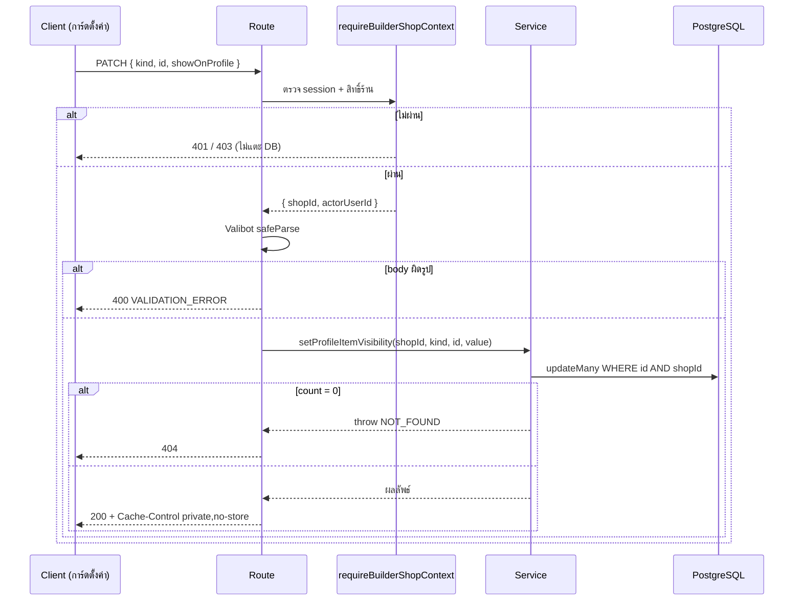

> **โมดูล:** M53-PublicProfileDisplayControls
> **ประเภทเอกสาร:** API Contract
> **เวอร์ชัน:** 1.0
> **วันที่จัดทำ:** 2026-08-23

# API Contract: ตัวควบคุมการแสดงผลหน้าร้านสาธารณะ

---

## 1. Overview

- **Base:** `/api/shops/current/page-builder`
- **รูปแบบ:** JSON เท่านั้น
- **Runtime:** Node.js (`export const dynamic = "force-dynamic"` ทุก route — ข้อมูลผูกกับผู้ใช้และร้าน ห้าม cache)
- **Header ตอบกลับ:** `Cache-Control: private, no-store`
- **ทำไมอยู่ใต้ `page-builder`:** เป็นชุดเดียวกับ `PATCH .../publish` ที่หน้า `/public-profile` เรียกอยู่แล้ว — context สิทธิ์ (`requireBuilderShopContext`) และตัวจับ error (`handleBuilderError`) ใช้ร่วมกันได้ทั้งหมด

---

## 2. Authentication

| ชั้น | กลไก |
|------|------|
| ตัวตน | NextAuth session cookie (แยกตาม subdomain) |
| ร้านที่ทำงานอยู่ | `activeShopId` ใน session |
| สิทธิ์ | `requireBuilderShopContext()` — ผ่านเฉพาะ OWNER หรือ `ShopMember.role = 'ADMIN'` |
| ขอบเขตข้อมูล | ทุกคำสั่งเขียน scope ด้วย `shopId` ใน `WHERE` ตั้งแต่คำสั่งแรก ไม่ใช่ดึงมาแล้วเทียบทีหลัง |

ไม่ผ่าน → route คืน response ที่ `requireBuilderShopContext` สร้างให้ (401/403) โดยไม่แตะฐานข้อมูลเลย

---

## 3. Endpoint List

| # | Method | Path | คำอธิบาย |
|---|--------|------|----------|
| 1 | PATCH | `/api/shops/current/page-builder/prices` | เปิด/ปิดการแสดงราคาบนหน้าร้าน |
| 2 | PATCH | `/api/shops/current/page-builder/item-visibility` | เปิด/ปิดการแสดงรายการหนึ่งรายการ |

---

## 4. Endpoint Detail

### 4.1 `PATCH /api/shops/current/page-builder/prices`

**Request**

```json
{ "showPrices": true }
```

| ฟิลด์ | ชนิด | บังคับ | หมายเหตุ |
|-------|------|--------|----------|
| `showPrices` | boolean | ใช่ | ไม่รับ string `"true"` — Valibot `v.boolean()` |

**Response 200**

```json
{ "showPrices": true }
```

**พฤติกรรม**

- `upsert` แถว `ShopPageLayout` ตาม `shopId` (ร้านที่ยังไม่มีแถวจะได้แถวใหม่พร้อม `isPublished` ค่าตั้งต้น `true`)
- ไม่แตะ `tabOrder` และ `isPublished` (endpoint แยกกันโดยตั้งใจ — เหตุผลเดียวกับที่ `publish` แยกจาก `PUT /page-builder`)

**Error**

| HTTP | code | เมื่อไร |
|------|------|---------|
| 400 | `VALIDATION_ERROR` | body ไม่ใช่ JSON หรือ `showPrices` ไม่ใช่ boolean |
| 401/403 | ตาม `requireBuilderShopContext` | ไม่ได้ล็อกอิน / ไม่มีสิทธิ์ในร้านนี้ |
| 500 | `INTERNAL_ERROR` | อื่น ๆ (ผ่าน `handleBuilderError`) |

---

### 4.2 `PATCH /api/shops/current/page-builder/item-visibility`

**Request**

```json
{ "kind": "PRODUCT", "id": "0f1c...", "showOnProfile": false }
```

| ฟิลด์ | ชนิด | บังคับ | หมายเหตุ |
|-------|------|--------|----------|
| `kind` | `"PRODUCT" \| "ROOM" \| "SERVICE"` | ใช่ | allow-list (`v.picklist`) — ค่านี้เลือกว่าจะไปเขียนตารางไหน จึงห้ามเป็น string อิสระ |
| `id` | string (uuid) | ใช่ | id ของรายการ |
| `showOnProfile` | boolean | ใช่ | |

**Response 200**

```json
{ "kind": "PRODUCT", "id": "0f1c...", "showOnProfile": false }
```

**พฤติกรรม**

- `updateMany({ where: { id, shopId }, data: { showOnProfile } })`
- `count === 0` → รายการไม่มีอยู่ **หรือ** ไม่ใช่ของร้านนี้ → ตอบ `404 NOT_FOUND` เหมือนกันทั้งสองกรณี (ไม่บอกว่ามีอยู่จริงแต่เป็นของร้านอื่น)
- ไม่แตะ `isActive` / `pinnedAt` เด็ดขาด

**Error**

| HTTP | code | เมื่อไร |
|------|------|---------|
| 400 | `VALIDATION_ERROR` | body ผิดรูป / `kind` ไม่อยู่ใน allow-list / `id` ไม่ใช่ uuid |
| 401/403 | ตาม `requireBuilderShopContext` | ไม่มีสิทธิ์ |
| 404 | `NOT_FOUND` | ไม่พบรายการในร้านนี้ |
| 500 | `INTERNAL_ERROR` | อื่น ๆ |

---

## 5. Error Code Table

| code | HTTP | ความหมาย | สิ่งที่ UI ทำ |
|------|------|----------|---------------|
| `VALIDATION_ERROR` | 400 | body ไม่ถูกรูป | revert สวิตช์ + toast แดง (ข้อความทั่วไป — ผู้ใช้ไม่ได้พิมพ์อะไร เป็นบั๊กฝั่งเรา) |
| `FORBIDDEN` | 403 | ไม่มีสิทธิ์ในร้าน | revert + toast แดง |
| `NOT_FOUND` | 404 | ไม่พบรายการในร้านนี้ | revert + toast แดง + ควรรีเฟรชรายการ |
| `INTERNAL_ERROR` | 500 | ผิดพลาดฝั่งเซิร์ฟเวอร์ | revert + toast แดง |

🛑 ทุกกรณีที่ไม่ใช่ 2xx **ต้อง revert สวิตช์** — สถานะที่หน้าจอบอกว่าบันทึกแล้วแต่ฐานข้อมูลไม่เปลี่ยน คือสิ่งเดียวที่ผู้ใช้จับไม่ได้จนกว่าจะเปิดหน้าร้านจริง

---

## 6. Sequence



---

## 7. Traceability

| TFR | Endpoint |
|-----|----------|
| TFR-009 / FR-PPD-01 | `PATCH .../prices` |
| TFR-009 / FR-PPD-07 | `PATCH .../item-visibility` |

---

## 8. สรุป

2 endpoint ที่ทั้งคู่มิเรอร์ `PATCH .../publish` ของ feature 00035 ทุกด้าน (context สิทธิ์ · การจับ error · header · รูปแบบ response) จุดที่ต่างมีข้อเดียวคือ `item-visibility` ต้องตัดสินจาก `kind` ว่าจะเขียนตารางไหน — จึงเป็น allow-list ไม่ใช่ string อิสระ
