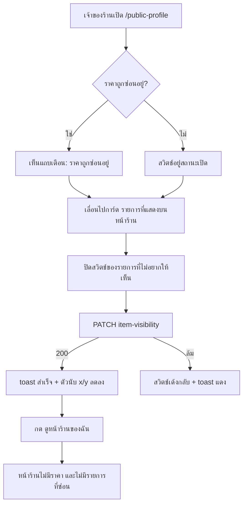

> **โมดูล:** M53-PublicProfileDisplayControls
> **ประเภทเอกสาร:** Business Requirements Document (BRD)
> **เวอร์ชัน:** 1.0
> **วันที่จัดทำ:** 2026-08-23
> **สถานะ:** Draft

# BRD: ตัวควบคุมการแสดงผลหน้าร้านสาธารณะ

---

## 1. บทนำ

### 1.1 วัตถุประสงค์ของเอกสาร

แปลงความต้องการใน [[PRD]] เป็นข้อกำหนดที่ทดสอบได้ — ทุกข้อมี Acceptance Criteria ที่ QA กดตามได้จริงโดยไม่ต้องเดา และเป็นสัญญาที่ผู้พัฒนายึดว่า "เสร็จ" แปลว่าอะไร

### 1.2 ขอบเขตของระบบ

**อยู่ในขอบเขต**

- หน้าร้านสาธารณะ `/u/[username]`, `/b/[slug]` (และ `/m/u/[username]` ที่ re-export หน้าเดียวกัน)
- หน้าตั้งค่า `/public-profile` (ฝั่งผู้ขาย, Paces)
- ตาราง `ShopPageLayout`, `Product`, `Room`, `ServiceResource`
- API ใต้ `/api/shops/current/page-builder/*`

**นอกขอบเขต**

- ทุก surface หลังร้าน (POS, แชท, ออเดอร์, รายงาน) — ราคาและรายการที่ซ่อนต้องทำงานเหมือนเดิมทุกประการ
- หน้าจอง/หน้ารายละเอียดห้องพักฝั่งผู้ซื้อที่ไม่ได้อยู่บนหน้าโปรไฟล์
- ตัวจัดหน้าร้าน (`/public-profile/builder`) — ไม่เพิ่มบล็อกใหม่ในเฟสนี้

### 1.3 กลุ่มผู้ใช้งาน

| กลุ่ม | สิทธิ์ |
|-------|--------|
| OWNER ของร้าน | ตั้งค่าได้ทุกอย่างในฟีเจอร์นี้ |
| ShopMember role = ADMIN | ตั้งค่าได้ทุกอย่างในฟีเจอร์นี้ (เท่ากับ `requireBuilderShopContext` เดิม) |
| ShopMember role อื่น | เข้าหน้า `/public-profile` ไม่ได้ (กติกาเดิมของหน้า ไม่เปลี่ยน) |
| ผู้ซื้อ / ผู้เยี่ยมชม | อ่านผลลัพธ์อย่างเดียว + กดชิปเรียงลำดับได้ |

---

## 2. ความต้องการหลัก (Functional Requirements)

### 2.1 สวิตช์ราคาระดับร้าน

| ID | ความต้องการ | Acceptance Criteria |
|----|-------------|---------------------|
| **FR-PPD-01** | ร้านเปิด/ปิด "แสดงราคาบนหน้าร้าน" ได้ที่ `/public-profile` | AC-01-1 การ์ด "ราคาบนหน้าร้าน" ปรากฏบนหน้า `/public-profile` เสมอ · AC-01-2 สวิตช์สะท้อนค่าปัจจุบันตอนโหลดหน้า · AC-01-3 กดแล้วบันทึกทันที (ไม่มีปุ่มบันทึกแยก) และขึ้น toast ยืนยัน · AC-01-4 บันทึกล้ม → สวิตช์เด้งกลับค่าเดิม + toast แดง |
| **FR-PPD-02** | ค่าตั้งต้นของทุกร้านคือ "ปิด" | AC-02-1 ร้านที่ไม่มีแถว `ShopPageLayout` อ่านได้ `showPrices = false` · AC-02-2 ร้านที่มีแถวอยู่แล้ว (เคยใช้ตัวจัดหน้าร้าน) ได้ `false` หลัง migration · AC-02-3 ไม่มีสคริปต์ backfill ใดตั้งค่าเป็น `true` |
| **FR-PPD-03** | ปิดราคา = ไม่มีตัวเลขราคาบนหน้าร้านเลย และไม่มีข้อความมาแทน | AC-03-1 การ์ดสินค้าในกริด ไม่มีบรรทัดราคา · AC-03-2 ป๊อปอัปรายละเอียดสินค้า ไม่มีบรรทัดราคา · AC-03-3 การ์ดห้องพัก ไม่มี "฿x/คืน" · AC-03-4 การ์ดบริการ ไม่มีบล็อก "มัดจำ" · AC-03-5 ไม่มีข้อความ เช่น "สอบถามราคา" โผล่แทนที่ · AC-03-6 การ์ดไม่มีช่องว่างค้างในตำแหน่งที่ราคาเคยอยู่ |
| **FR-PPD-04** | บรรทัดยอดสะสมไม่ผูกกับสวิตช์ราคา | AC-04-1 สินค้าที่มียอดสะสม > 0 ยังแสดงบรรทัดยอดสะสมเมื่อราคาถูกซ่อน · AC-04-2 ตำแหน่งบรรทัดยังเกาะก้นการ์ดเหมือนเดิม (ไม่ลอยขึ้นไปชิดชื่อ) เมื่อบรรทัดราคาหายไป |
| **FR-PPD-05** | คำเรียกยอดสะสมผันตามประเภทกิจการ | AC-05-1 ONLINE_SALES → "ขายแล้ว {n} ชิ้น" · AC-05-2 SERVICE_QUEUE → "ใช้บริการแล้ว {n} ครั้ง" · AC-05-3 LODGING (แท็บสินค้า) → "ขายแล้ว {n} ชิ้น"; การ์ดห้องพัก → "เข้าพักแล้ว {n} ครั้ง" · AC-05-4 คำทั้งชุดมาจาก SSOT เดียว ไม่มีการพิมพ์ซ้ำที่ component |
| **FR-PPD-06** | การซ่อนราคาไม่ลามออกนอกหน้าร้าน | AC-06-1 ราคาในแชท/การ์ดสินค้าที่ส่งเข้าแชท ไม่เปลี่ยน · AC-06-2 ราคาในหน้าออเดอร์สาธารณะ `/o/[token]` ไม่เปลี่ยน · AC-06-3 ทุกหน้าหลังร้านไม่เปลี่ยน |

### 2.2 การซ่อน/แสดงรายการรายตัว

| ID | ความต้องการ | Acceptance Criteria |
|----|-------------|---------------------|
| **FR-PPD-07** | ร้านเลือกได้ว่ารายการไหนขึ้นหน้าร้าน (สินค้า/บริการ/ห้องพัก) | AC-07-1 การ์ด "รายการที่แสดงบนหน้าร้าน" บน `/public-profile` แสดงรายการทั้งหมดที่ยังเปิดขาย · AC-07-2 มีสวิตช์ต่อแถว · AC-07-3 กดแล้วบันทึกทันที + toast · AC-07-4 ล้มแล้วเด้งกลับ |
| **FR-PPD-08** | ค่าตั้งต้นคือแสดงทุกรายการ | AC-08-1 ทุกแถวที่มีอยู่ก่อน migration ได้ `showOnProfile = true` · AC-08-2 รายการที่สร้างใหม่หลังจากนี้ได้ `true` โดยไม่ต้องส่งค่า |
| **FR-PPD-09** | ซ่อนแล้วหายจากหน้าร้านทุกจุด | AC-09-1 ไม่อยู่ในกริด "สินค้าทั้งหมด" · AC-09-2 ไม่อยู่ในชุด "สินค้าปักหมุด" แม้ยังปักหมุดอยู่ · AC-09-3 ไม่ถูกนับในตัวเลขบนแท็บ · AC-09-4 แท็บที่เหลือ 0 รายการหลังกรอง ต้องไม่ถูก render (กติกาเดิมของ `computeVisibleTabKeys`) · AC-09-5 ลิงก์ตรงไปสินค้าที่ซ่อน (`?p={id}`) ต้องไม่เปิดป๊อปอัป และถอดพารามิเตอร์ทิ้งเงียบ ๆ ตามพฤติกรรมเดิมของสินค้าที่ไม่มีอยู่ |
| **FR-PPD-10** | ซ่อนแล้วยังขายได้ตามปกติ | AC-10-1 ยังเลือกได้ในหน้าสร้าง/แก้ไขออเดอร์ · AC-10-2 ยังเลือกได้ในแผงเลือกสินค้าของแชท · AC-10-3 ยังเลือกได้ในหน้าสร้างการประมูล · AC-10-4 ยังอยู่ในหน้า `/products`, `/rooms`, `/queues` ตามเดิม |
| **FR-PPD-11** | ซ่อนไม่แตะสถานะอื่นของรายการ | AC-11-1 `pinnedAt` ไม่เปลี่ยน · AC-11-2 `isActive` ไม่เปลี่ยน · AC-11-3 เปิดสวิตช์กลับ → กลับไปอยู่ชุดปักหมุดเหมือนเดิม |
| **FR-PPD-12** | หน้าตั้งค่าบอกภาพรวมได้ในบรรทัดเดียว | AC-12-1 หัวการ์ดมีตัวนับ "แสดงอยู่ x จาก y" ต่อชนิดรายการ · AC-12-2 มีช่องค้นหาชื่อเมื่อรายการเกิน 8 แถว · AC-12-3 ชนิดที่ร้านไม่มีเลย (เช่น ร้านค้าออนไลน์ไม่มีห้องพัก) ไม่แสดงกลุ่มนั้น |

### 2.3 ชิปเรียงลำดับบนแท็บสินค้า

| ID | ความต้องการ | Acceptance Criteria |
|----|-------------|---------------------|
| **FR-PPD-13** | มีชิป "ขายดี" และ "ยอดนิยม" เหนือกริดสินค้าทั้งหมด | AC-13-1 ชิป 2 ตัวปรากฏบนแท็บสินค้า · AC-13-2 ชิปที่เลือกอยู่มีสถานะต่างจากที่ไม่ได้เลือกด้วยมากกว่าสี (น้ำหนักตัวอักษร/พื้น) |
| **FR-PPD-14** | เลือกทีละชิป กดซ้ำ = กลับค่าตั้งต้น | AC-14-1 กด "ขายดี" → เรียงตามยอดขาย · AC-14-2 กด "ยอดนิยม" ต่อ → "ขายดี" หลุดการเลือกเอง · AC-14-3 กดชิปที่เลือกอยู่ซ้ำ → ไม่มีชิปถูกเลือก ลำดับกลับไปเป็นค่าตั้งต้น |
| **FR-PPD-15** | ชิปมีผลกับกริด "สินค้าทั้งหมด" เท่านั้น | AC-15-1 ชุด "สินค้าปักหมุด" คงลำดับ `pinnedAt desc` เสมอ · AC-15-2 หัวข้อทั้งสองส่วนไม่เปลี่ยน |
| **FR-PPD-16** | การเรียงครอบชุดข้อมูลเดียวกับที่แสดง | AC-16-1 กริดสินค้าทั้งหมดดึงได้ถึง 48 รายการ · AC-16-2 การเรียงเกิดบนชุดเดียวกับที่ render ไม่ใช่ชุดย่อย · AC-16-3 ถ้าร้านมีสินค้าที่แสดงได้มากกว่า 48 ต้องมีข้อความบอกว่ากำลังแสดงบางส่วน |
| **FR-PPD-17** | ชิปไม่ขึ้นเมื่อไม่มีอะไรให้เรียง | AC-17-1 กริดมี ≤ 1 รายการ → ไม่มีแถบชิป |

---

## 3. Acceptance Criteria สรุป

### 3.1 ฝั่งผู้ขาย (`/public-profile`)

- [ ] การ์ด "ราคาบนหน้าร้าน" + สวิตช์ + แถบเตือนเมื่อซ่อนอยู่
- [ ] การ์ด "รายการที่แสดงบนหน้าร้าน" + ตัวนับ + ค้นหา + สวิตช์รายแถว แยกกลุ่มตามชนิด
- [ ] ทุกสวิตช์บันทึกทันที ล้มแล้วเด้งกลับ ไม่มีสถานะค้างกลางทาง
- [ ] ข้อความใหม่ทุกบรรทัดมีทั้งไทยและอังกฤษ

### 3.2 ฝั่งผู้ซื้อ (หน้าร้านสาธารณะ)

- [ ] ราคาหายครบ 4 จุดเมื่อสวิตช์ปิด และกลับมาครบเมื่อเปิด
- [ ] ยอดสะสมยังอยู่ + คำตรงประเภทกิจการ
- [ ] รายการที่ซ่อนไม่โผล่ทุกจุด รวมชุดปักหมุดและตัวนับแท็บ
- [ ] ชิปเรียงลำดับทำงานถูกและไม่ทำให้หน้าโหลดใหม่

### 3.3 ไม่ถดถอย

- [ ] สวิตช์เผยแพร่เดิมยังทำงานเหมือนเดิม
- [ ] POS / แชท / ประมูล / ออเดอร์ ยังเห็นรายการครบทุกชิ้น
- [ ] ปุ่ม ‹ › ของป๊อปอัปสินค้าไม่กลายเป็นการโหลดหน้าใหม่

---

## 4. Business Flows (กระบวนการทำงาน)

### 4.1 Flow หลัก: ร้านซ่อนราคาและซ่อนสินค้าบางชิ้น

### 4.2 Flow ย่อย: ผู้ซื้อเรียงสินค้าใหม่

---

## 5. Use Case Scenarios (สถานการณ์การใช้งานจริง)

### Scenario 1: ร้านบริการที่ไม่ประกาศราคา (Best Case)

- **ผู้ใช้:** เจ้าของร้าน SERVICE_QUEUE มีสินค้า/บริการรวม 15 รายการ
- **ก่อนหน้า:** ไม่เคยส่งลิงก์หน้าร้านให้ลูกค้าเพราะไม่อยากให้เห็นราคา
- **ขั้นตอน:** เปิด `/public-profile` → ราคาถูกซ่อนอยู่แล้วตั้งแต่ต้น → ปิดสวิตช์รายการภายใน 3 รายการ → เปิดหน้าร้านตรวจ
- **ผลที่คาดหวัง:** การ์ดสินค้า 12 ใบ ไม่มีราคา แต่มี "ใช้บริการแล้ว N ครั้ง" ครบ
- **เกณฑ์ผ่าน:** ส่งลิงก์ได้โดยไม่ต้องอธิบายเรื่องราคาก่อน

### Scenario 2: ร้านที่ต้องการราคากลับ (Recovery)

- **ผู้ใช้:** ร้าน ONLINE_SALES ที่ลูกค้าถามว่า "ราคาหายไปไหน"
- **ขั้นตอน:** เจ้าของเปิด `/public-profile` → เห็นแถบเตือน → เปิดสวิตช์
- **ผลที่คาดหวัง:** ราคากลับมาครบทุกใบทันทีที่รีเฟรชหน้าร้าน ไม่ต้องแก้อะไรเป็นรายชิ้น
- **เกณฑ์ผ่าน:** ไม่มีรายการไหนราคาหายค้าง

### Scenario 3: ร้านที่มีสินค้าเกินเพดาน (Edge)

- **ผู้ใช้:** ร้านที่มีสินค้าแสดงได้ 60 ชิ้น
- **ผลที่คาดหวัง:** กริดแสดง 48 ชิ้น + ข้อความบอกว่าแสดงบางส่วน และชิป "ขายดี" เรียงบน 48 ชิ้นนั้น
- **เกณฑ์ผ่าน:** ไม่มีจุดใดที่อ้างว่าเป็น "ขายดีทั้งร้าน" โดยไม่บอกว่าเป็นชุดย่อย

### Scenario 4: ร้านซ่อนสินค้าที่ปักหมุดไว้ (Edge)

- **ผู้ใช้:** ร้านที่ปักหมุดสินค้า 3 ชิ้น แล้วปิดสวิตช์แสดงของชิ้นที่ 2
- **ผลที่คาดหวัง:** หน้าร้านเหลือชุดปักหมุด 2 ชิ้น · หน้า `/products` ยังแสดงหมุดของชิ้นที่ 2 อยู่ · เปิดสวิตช์กลับ → กลับมา 3 ชิ้นเรียงเหมือนเดิม
- **เกณฑ์ผ่าน:** `pinnedAt` ไม่ถูกเขียนเลยตลอด flow

---

## 6. ความต้องการด้านคุณภาพ (Quality Requirements)

### 6.1 ความถูกต้องของข้อมูล
ยอดสะสมและยอดถูกใจที่ใช้เรียงลำดับต้องเป็นชุดเดียวกับที่แสดงบนการ์ด — ห้ามเรียงด้วยตัวเลขชุดหนึ่งแล้วแสดงอีกชุดหนึ่ง

### 6.2 ความรวดเร็ว
การกดชิปเรียงลำดับต้องไม่ยิง request ใด ๆ · การเพิ่มตัวกรอง `showOnProfile` ต้องไม่เพิ่มจำนวน query ของหน้าร้าน (เป็นเงื่อนไขใน `WHERE` เดิม)

### 6.3 ความน่าเชื่อถือ
สวิตช์ทุกตัวเป็น optimistic + revert เมื่อล้ม — ห้ามมีสถานะที่หน้าจอบอกว่าบันทึกแล้วแต่ฐานข้อมูลไม่เปลี่ยน

### 6.4 ความปลอดภัย
ทุก endpoint ตรวจสิทธิ์ที่ server ด้วย context เดิมของตัวจัดหน้าร้าน · id ที่ส่งมาต้องถูก scope ด้วย `shopId` ใน `WHERE` ตั้งแต่ query แรก ไม่ใช่ดึงมาแล้วเทียบทีหลัง

### 6.5 ความสะดวกในการใช้งาน (Usability)
สวิตช์ทุกตัวมีพื้นที่กดอย่างน้อย 44px · การ์ดตั้งค่าอ่านรู้เรื่องบนจอ 320px · ทุกข้อความมี 2 ภาษา

---

## 7. ข้อจำกัด (Constraints)

### 7.1 ข้อจำกัดทางธุรกิจ
- สวิตช์ราคาเป็นค่าเดียวทั้งร้าน ไม่มีรายชิ้น
- แท็บบริการไม่มีชิปเรียงลำดับและไม่มียอดสะสมในเฟสนี้

### 7.2 ข้อจำกัดทางเทคนิค
- หน้า `/u`,`/b` ต้องไม่อ่าน `searchParams` ที่ server (จะทำให้ปุ่ม ‹ › ของป๊อปอัปกลายเป็นการดึงหน้าใหม่ทั้งหน้า) → ชิปต้องทำฝั่ง client
- `getProductsByShop` มีผู้เรียก 10+ จุดทั่วระบบ ตัวกรองใหม่ต้องเป็น opt-in
- เพดานการดึงสินค้าของแท็บสินค้า = 48 (ค่าคงที่ SSOT เดียว)

---

## 8. กฎทางธุรกิจ (Business Rules)

### 8.1 ค่าตั้งต้นและการอ่านค่า
- **BR-PPD-01** ไม่มีแถว `ShopPageLayout` → `showPrices = false` (กลับทิศกับ `isPublished` ที่ fallback `true` ในฟังก์ชันเดียวกัน)
- **BR-PPD-02** `showOnProfile` ค่าตั้งต้น `true` ทุกชนิดรายการ

### 8.2 ขอบเขตของผล
- **BR-PPD-03** ผลของทั้งสองสวิตช์จำกัดอยู่ที่หน้าร้านสาธารณะเท่านั้น
- **BR-PPD-04** การซ่อนไม่แตะ `pinnedAt` / `isActive`
- **BR-PPD-05** กรองตั้งแต่ query ไม่ใช่ตอน render
- **BR-PPD-06** ตัวนับแท็บและกติกาแท็บว่าง นับหลังกรองเสมอ

### 8.3 สิทธิ์
- **BR-PPD-07** แก้ได้เฉพาะ OWNER/ADMIN ของร้านที่ active — บังคับที่ server
- **BR-PPD-08** id ของรายการต้องอยู่ในร้านนั้นจริง ตรวจใน `WHERE` ของคำสั่งอัปเดต ไม่ใช่ตรวจแยกก่อน

---

## 9. อภิธานศัพท์ (Glossary)

ใช้ร่วมกับ [[PRD]] §7 — ไม่มีคำเพิ่ม

---

## 10. สรุป

ฟีเจอร์นี้ให้ร้านคุมสามอย่างบนหน้าร้านของตัวเอง: **ราคาโชว์ไหม · รายการไหนโชว์ · ผู้ซื้อเรียงยังไงได้บ้าง** โดยไม่แตะการขายจริงเลยสักเส้นทางเดียว จุดที่ต้องระวังที่สุดคือค่าตั้งต้นที่กลับทิศกันสองแบบ (ราคา = ปิด, รายการ = แสดง) และการที่ราคาบนหน้าร้านกระจายอยู่ 4 จุดคนละไฟล์ — พลาดจุดใดจุดหนึ่งแปลว่าฟีเจอร์ "ซ่อนราคา" ยังโชว์ราคา ซึ่งแย่กว่าไม่มีฟีเจอร์
