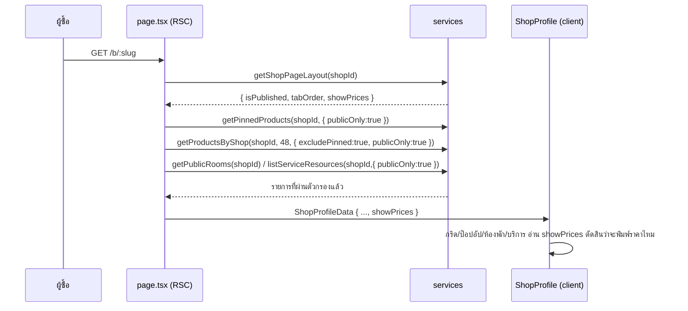

> **โมดูล:** M53-PublicProfileDisplayControls
> **ประเภทเอกสาร:** System Design Spec (SDS)
> **เวอร์ชัน:** 1.0
> **วันที่จัดทำ:** 2026-08-23

# SDS: ตัวควบคุมการแสดงผลหน้าร้านสาธารณะ

---

## 1. บทนำ & References

### 1.1 วัตถุประสงค์
บอกว่าจะวางโค้ดไว้ตรงไหน แต่ละชิ้นรับผิดชอบอะไร และทางเลือกที่ถูกปฏิเสธถูกปฏิเสธเพราะอะไร

### 1.2 ขอบเขตการออกแบบ
service layer + API route + component ฝั่งหน้าร้านและฝั่งตั้งค่า + ฟังก์ชันบริสุทธิ์ใน `src/lib/`

### 1.3 เอกสารอ้างอิง
[[PRD]] · [[BRD]] · [[SRS]] · [[DATABASE]] · [[API]] · [[TestCase]] · feature 00035 SDS

---

## 2. Architecture Overview

### 2.1 มุมมองสถาปัตยกรรม

```mermaid
flowchart TD
    subgraph lib[src/lib]
        SORT[profile-sort.ts<br/>sortProfileProducts · MAX_PROFILE_PRODUCTS]
        VOCAB[shop-stat-vocab.ts<br/>+ soldLine]
        VAL[validations.ts<br/>+ 2 schema]
    end
    subgraph svc[src/services]
        LAYOUT[shop-page-layout.service<br/>+ showPrices · setShopPageShowPrices]
        VIS[profile-visibility.service<br/>list · set]
        PROD[product.service · pin.service<br/>+ opts.publicOnly]
        ROOM[room.service · service-resource.service<br/>+ กรอง publicOnly]
    end
    subgraph api[src/app/api/shops/current/page-builder]
        P[prices/route.ts]
        IV[item-visibility/route.ts]
    end
    subgraph seller[/public-profile]
        PT[PriceVisibilityToggleClient]
        IVC[ProfileItemVisibilityClient]
    end
    subgraph public[หน้าร้าน]
        SP[ShopProfile]
        GRID[ProfileRightContent + ProductCard]
        LB[ProductLightbox]
        RL[PublicRoomList]
        SL[PublicServiceList]
    end

    PT --> P --> LAYOUT
    IVC --> IV --> VIS
    SP --> GRID --> SORT
    GRID --> VOCAB
    GRID --> LB
    SP --> RL
    SP --> SL
    LAYOUT --> SP
    PROD --> SP
    ROOM --> SP
```

### 2.2 มุมมองการ Deploy
ไม่มีอะไรพิเศษ — Vercel เดิม, migration รันตอน build (HR15)

---

## 3. Component Design

| ชิ้น | ไฟล์ | หน้าที่ | หมายเหตุ |
|------|------|---------|----------|
| `sortProfileProducts` | `src/lib/profile-sort.ts` (ใหม่) | เรียงกริดสินค้าตามโหมด (stable) | ฟังก์ชันบริสุทธิ์ + เทส `[blocker]` |
| `MAX_PROFILE_PRODUCTS` | ไฟล์เดียวกัน | เพดาน 48 | SSOT — หน้าร้านทั้งสองไฟล์ import ไปใช้ |
| `soldLine` | `src/lib/shop-stat-vocab.ts` | ประโยคยอดสะสมต่อ vertical | HR16 — ห้ามพิมพ์คำนี้ที่ component |
| `setShopPageShowPrices` | `src/services/shop-page-layout.service.ts` | upsert สวิตช์ราคา | มิเรอร์ `setShopPagePublished` ทั้งดุ้น |
| `listProfileVisibilityItems` | `src/services/profile-visibility.service.ts` (ใหม่) | คืนสินค้า/ห้องพัก/บริการ + สถานะแสดงผล | ใช้เฉพาะหน้าตั้งค่า (มี guard) |
| `setProfileItemVisibility` | ไฟล์เดียวกัน | เขียนค่าทีละรายการ | `updateMany` scope `shopId` |
| `PriceVisibilityToggleClient` | `.../public-profile/components/` | การ์ดสวิตช์ราคา | Base: `PublishToggleClient.tsx` |
| `ProfileItemVisibilityClient` | `.../public-profile/components/` | การ์ดรายการ + ค้นหา + สวิตช์ | Base: `PublishToggleClient.tsx` + `ShopVideosClient.tsx` |
| `ProfileSortChips` | `src/views/pages/user-profile/profile/` | ชิป 2 ตัวเหนือกริด | Base: `StageChips` แนวคิดเดียวกันฝั่ง Vuexy |

---

## 4. Data Flow

### 4.1 Flow หลัก: render หน้าร้าน



### 4.2 Flow กรณีล้มเหลว
สวิตช์ทุกตัว optimistic → PATCH ล้ม (non-2xx หรือ network) → คืนค่าเดิม + `pacesToast.error` — ไม่มี retry อัตโนมัติ (ผู้ใช้กดใหม่ได้ทันทีและรู้ผลทันที)

---

## 5. Integration Points

| จุดเชื่อม | ทิศทาง | สัญญา |
|-----------|--------|-------|
| feature 00035 `requireBuilderShopContext` | เรียกใช้ | คืน `{ shopId, actorUserId }` หรือ response 401/403 |
| feature 00013 pin | อ่าน | `getPinnedProducts` ต้องรับ `publicOnly` โดยไม่เปลี่ยนพฤติกรรมของผู้เรียกเดิม (builder) |
| feature 00047 i18n | เขียน | คีย์ใหม่ใต้ `publicProfile.prices` และ `publicProfile.itemVisibility` ครบทั้ง th/en |
| `computeVisibleTabKeys` | อ่าน | รับจำนวนรายการ **หลังกรอง** เท่านั้น |

---

## 6. Technical Decisions

### TD-001: `showPrices` อยู่บน `ShopPageLayout` ไม่ใช่ `Shop`
`Shop` ถูกอ่านแทบทุก request ทั้งระบบ การพกค่าที่ใช้เฉพาะตอนเปิดหน้าร้านไปด้วยทุก query คือการจ่ายฟรี — เหตุผลเดียวกับที่ 00035 แยกตารางนี้ออกมาตั้งแต่แรก

### TD-002: fallback `showPrices = false` เมื่อไม่มีแถว
ค่าตั้งต้นที่ผู้ใช้เลือกคือ "ซ่อน" ถ้า fallback เป็น `true` ร้านที่ไม่เคยเปิดตัวจัดหน้าร้าน (ส่วนใหญ่) จะยังโชว์ราคาต่อไป = ฟีเจอร์ไม่มีผลกับคนกลุ่มใหญ่ที่สุด
🛑 บรรทัดนี้อยู่ติดกับ `isPublished: true` ที่ fallback คนละทาง — ต้องมีคอมเมนต์ กัน "แก้ให้เหมือนกัน" ในอนาคต

### TD-003: `showOnProfile` เป็นคอลัมน์บนแต่ละตาราง ไม่ใช่ตารางกลาง
ตารางกลาง (`ProfileHiddenItem(shopId, kind, itemId)`) จะบังคับให้ทุก query ที่อ่านรายการต้อง join หรือยิงเพิ่มอีกหนึ่งครั้ง ขณะที่คอลัมน์ boolean เข้าไปอยู่ใน `WHERE` เดิมได้ฟรี และไม่มีเคส "รายการเดียวถูกซ่อนหลายบริบท" ที่ต้องรองรับ

### TD-004: ตัวกรองเป็น opt-in (`publicOnly`)
`getProductsByShop` มีผู้เรียก 10+ จุด (POS · แชท · ประมูล · `/products` · `/categories` · หน้าแก้ไขออเดอร์) ถ้ากรองโดยปริยาย ร้านจะขายของที่ซ่อนไม่ได้ทั้งที่ตั้งใจแค่ไม่โชว์หน้าร้าน
ค่าตั้งต้น = ไม่กรอง ให้ผู้เรียกฝั่งสาธารณะเป็นคนขอเอง

### TD-005: ชิปเรียงลำดับทำฝั่ง client ไม่ผ่าน URL
คอมเมนต์ใน `ShopProfile.tsx` เตือนไว้แล้วว่าถ้าหน้าเริ่มอ่าน `searchParams` ที่ server Next จะเปลี่ยน navigation เป็น server refetch เต็มรูป **ทุกครั้งที่กด ‹ ›** ของป๊อปอัปสินค้า — ราคาที่ต้องจ่ายเพื่อให้ชิปเป็น shareable URL สูงกว่าประโยชน์มาก
ผลข้างเคียงที่ยอมรับ: การเรียงไม่ติดไปกับลิงก์ที่แชร์ และหายเมื่อรีเฟรช

### TD-006: เพดาน 48 พร้อมป้ายกำกับ
เรียง "ขายดี" บน 12 ใบล่าสุดให้ผลที่ถูกทางเลขแต่ผิดทางความหมาย ยกเพดานเป็น 48 แล้วเรียงบนชุดเดียวกับที่แสดง ถ้าชนเพดานต้องมีข้อความบอก ไม่ใช่เงียบ (`partial-data-must-be-labeled-or-filled.md`)

### TD-007: รายการที่ซ่อนถูกซ่อนจากเจ้าของร้านด้วย
ไม่ทำโหมดพรีวิว — ที่ที่เจ้าของเห็นภาพรวมคือหน้าตั้งค่าซึ่งมีตัวนับ "แสดงอยู่ x จาก y" อยู่แล้ว การให้เจ้าของเห็นของที่ซ่อนบนหน้าร้าน = เจ้าของกับลูกค้าเห็นหน้าคนละหน้าโดยไม่มีอะไรบอก

---

## 7. Traceability

| TFR | ชิ้นงาน |
|-----|---------|
| TFR-001 | `schema.prisma`, `getShopPageLayout`, `setShopPageShowPrices` |
| TFR-002 | `schema.prisma` × 3 ตาราง + migration |
| TFR-003 | `product.service`, `pin.service`, `room.service`, `service-resource.service` |
| TFR-004 | `u/[username]/page.tsx`, `b/[slug]/page.tsx`, `ShopProfile.tsx` + 4 component ที่พิมพ์ราคา |
| TFR-005 | `shop-stat-vocab.ts`, `ProductCard` |
| TFR-006 | `profile-sort.ts`, `ProfileSortChips`, `ProfileRightContent` |
| TFR-007 | `profile-sort.ts` (ค่าคงที่) + หน้าร้านทั้งสองไฟล์ |
| TFR-008 | การ์ดใหม่ 2 ใบใน `/public-profile` |
| TFR-009 | 2 route ใหม่ + 2 schema ใน `validations.ts` |

---

## 8. สรุป
ออกแบบให้ทุกอย่างเป็นส่วนเสริมของโครงที่มีอยู่: คอลัมน์เข้า `WHERE` เดิม · endpoint มิเรอร์ `publish` เดิม · การ์ดตั้งค่ายกโครงจาก `PublishToggleClient` · การเรียงเป็นฟังก์ชันบริสุทธิ์ที่เทสจับได้ ไม่มีชิ้นไหนต้องรื้อของเดิม
