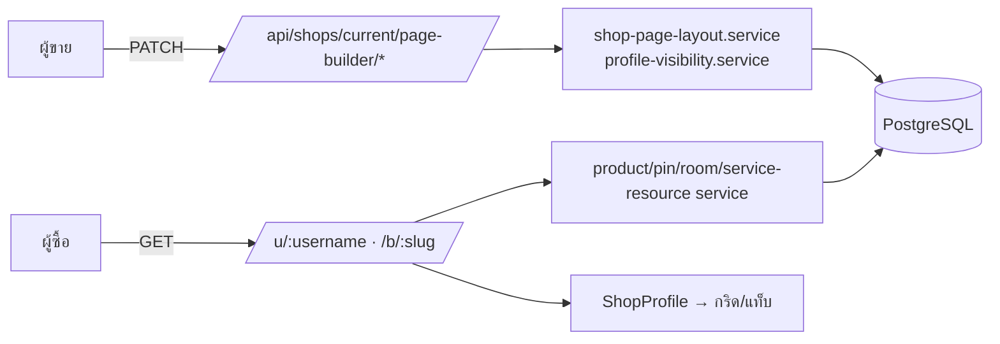
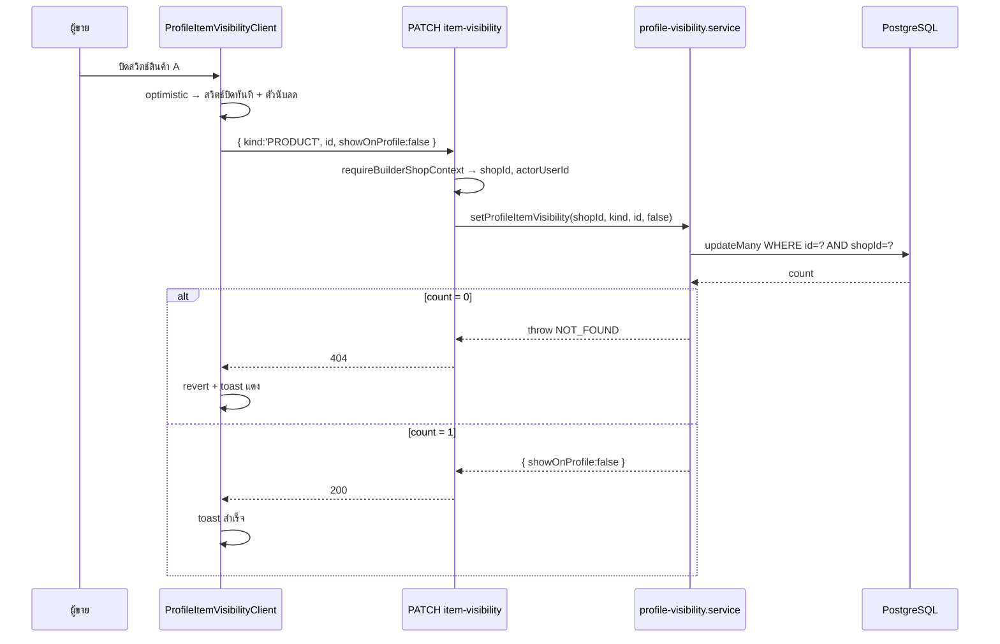
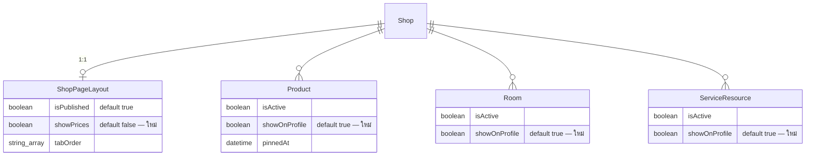

> **โมดูล:** M53-PublicProfileDisplayControls
> **ประเภทเอกสาร:** Software Requirements Specification (SRS — Technical)
> **เวอร์ชัน:** 1.0
> **วันที่จัดทำ:** 2026-08-23

# SRS: ตัวควบคุมการแสดงผลหน้าร้านสาธารณะ

---

## 1. บทนำ (Introduction)

### 1.1 วัตถุประสงค์ของเอกสาร

ระบุข้อกำหนดเชิงเทคนิคที่ผู้พัฒนาใช้สร้างฟีเจอร์ได้โดยไม่ต้องตีความ — โครงสร้างข้อมูล, สัญญาของ API, จุดที่ต้องแก้ในโค้ดเดิม, และเงื่อนไขที่ต้องไม่พัง

### 1.2 ขอบเขตเชิงระบบ (System Scope)

Next.js App Router · Prisma/PostgreSQL · ไม่มีบริการภายนอกเกี่ยวข้อง · ไม่มี background job · ไม่มีการเปลี่ยน schema ที่ทำลายข้อมูล (additive ล้วน)

### 1.3 เอกสารอ้างอิง (References)

- [[PRD]], [[BRD]], [[SDS]], [[DATABASE]], [[API]], [[TestCase]]
- feature 00035 — `docs/20 - Features/00035 - Shop Page Builder/`
- `docs/conventions/partial-data-must-be-labeled-or-filled.md`
- `docs/conventions/domain-term-single-definition.md` (HR16)
- `docs/conventions/rsc-mui-navigation.md`

### 1.4 นิยามและตัวย่อ

| คำ | ความหมาย |
|----|-----------|
| หน้าร้าน | `src/app/(marketing)/u/[username]/page.tsx` และ `src/app/(marketing)/b/[slug]/page.tsx` |
| ตัวเรนเดอร์กลาง | `src/views/pages/user-profile/v2/ShopProfile.tsx` (client component) |
| กริดสินค้า | `ProfileRightContent` ใน `src/views/pages/user-profile/profile/index.tsx` |
| ตัวตั้งค่า | หน้า `src/app/(paces)/seller/(dashboard)/public-profile/page.tsx` |

---

## 2. ภาพรวมสถาปัตยกรรม (Architecture Overview)

### 2.1 บริบทระบบ



### 2.2 องค์ประกอบหลัก

| องค์ประกอบ | หน้าที่ | ใหม่/เดิม |
|-----------|---------|-----------|
| `ShopPageLayout.showPrices` | ค่าเดียวต่อร้าน | ใหม่ (คอลัมน์) |
| `Product/Room/ServiceResource.showOnProfile` | ค่าต่อรายการ | ใหม่ (คอลัมน์) |
| `getShopPageLayout()` | คืน `{ isPublished, tabOrder, showPrices }` | แก้ของเดิม |
| `setShopPageShowPrices()` | เขียนสวิตช์ราคา | ใหม่ |
| `setProfileItemVisibility()` | เขียนสวิตช์รายตัว 3 ชนิด | ใหม่ |
| `listProfileVisibilityItems()` | อ่านรายการทั้งหมดสำหรับหน้าตั้งค่า | ใหม่ |
| `shop-stat-vocab.ts` | เพิ่ม `soldLine(n)` เป็น SSOT ของบรรทัดยอดสะสม | แก้ของเดิม |
| `profile-sort.ts` | ตัวเรียงกริดสินค้า (ฟังก์ชันบริสุทธิ์) | ใหม่ |

### 2.3 มุมมองการ Deploy

Vercel เดิม · migration รันอัตโนมัติตอน build (Hard Rule 15) · ไม่มี env ใหม่ · ไม่ต้องปล่อยแอปมือถือใหม่

---

## 3. ข้อกำหนดเชิงฟังก์ชันเชิงเทคนิค (TFR)

### TFR-001: คอลัมน์ `ShopPageLayout.showPrices`

`Boolean @default(false)` — อ่านผ่าน `getShopPageLayout()` เท่านั้น
🛑 เมื่อ `findUnique` คืน `null` ต้อง fallback `showPrices: false` **บรรทัดเดียวกับที่ `isPublished` fallback เป็น `true`** พร้อมคอมเมนต์อธิบายว่าทำไมสองค่านี้ fallback คนละทาง (ไม่ใช่ความพลั้งเผลอ)

### TFR-002: คอลัมน์ `showOnProfile` บน 3 ตาราง

`Boolean @default(true)` บน `Product`, `Room`, `ServiceResource` — additive, ไม่มี backfill (DB default ครอบแถวเดิมทั้งหมดตอน `ADD COLUMN ... DEFAULT true NOT NULL`)

### TFR-003: ตัวกรองฝั่งอ่านต้องเป็น opt-in

- `getProductsByShop(shopId, take?, opts?)` → เพิ่ม `opts.publicOnly?: boolean` (ค่าตั้งต้น = ไม่กรอง)
- `getPinnedProducts(shopId, opts?)` → เพิ่ม `opts.publicOnly?: boolean`
- `getPublicRooms(shopId)` → กรองเสมอ (ชื่อฟังก์ชันประกาศตัวเองว่า public แล้ว และผู้เรียกทั้งหมดเป็นหน้าสาธารณะ — ต้องยืนยันด้วย grep ก่อนแก้)
- `listServiceResources(shopId, opts?)` → เพิ่ม `opts.publicOnly?: boolean`

🛑 ห้ามกรองแบบบังคับใน `getProductsByShop`/`listServiceResources` เด็ดขาด — ผู้เรียกรวม POS, แผงเลือกสินค้าในแชท, หน้าสร้างการประมูล, หน้า `/products`, หน้า `/categories`, หน้าคิวงาน

### TFR-004: การส่งค่าลงหน้าร้าน

`ShopProfileData` เพิ่มฟิลด์ `showPrices: boolean` แล้วส่งต่อไปยัง:
1. `ProfileRightContent` → การ์ดสินค้า (`ProductCard`)
2. `ProductLightbox` (ผ่าน `ProfileRightContent`)
3. `PublicRoomList`
4. `PublicServiceList`

ทั้งหมดเป็น component ฝั่ง client อยู่ในซับทรีเดียวกันแล้ว — ส่งเป็น prop ไม่ต้องมี context

### TFR-005: บรรทัดยอดสะสม

- ย้ายคำเรียกไปที่ `src/lib/shop-stat-vocab.ts` เป็น `soldLine(count: string): string` ผันตาม vertical
- ONLINE_SALES → `ขายแล้ว {n} ชิ้น` · SERVICE_QUEUE → `ใช้บริการแล้ว {n} ครั้ง` · LODGING(ห้องพัก) → `เข้าพักแล้ว {n} ครั้ง`
- 🛑 การ์ดสินค้าใน **ร้าน LODGING** ที่ไม่ใช่ห้องพัก ยังใช้คำของสินค้า — ตัวแปรที่ตัดสินคือ "การ์ดนี้เป็นห้องพักหรือสินค้า" ไม่ใช่ "ร้านนี้ประเภทอะไร" อย่างเดียว
- เมื่อ `showPrices = false` บรรทัดนี้ต้องรับ `marginBlockStart: 'auto'` แทนบรรทัดราคาที่หายไป มิฉะนั้นการ์ดจะเสียการจัดแนวก้นการ์ดที่มีอยู่เดิม

### TFR-006: ชิปเรียงลำดับ

- ฟังก์ชันบริสุทธิ์ `sortProfileProducts(items, mode)` ใน `src/lib/profile-sort.ts` — `mode: 'DEFAULT' | 'BEST_SELLING' | 'POPULAR'`
- `BEST_SELLING` → `soldCount desc` · `POPULAR` → `likeCount desc` · ทั้งคู่ tie-break ด้วยลำดับเดิม (stable) เพื่อไม่ให้ลำดับสลับเองระหว่าง render
- state อยู่ที่ `ProfileRightContent` (client) เท่านั้น — **ห้ามผูกกับ URL/searchParams** (ดู SDS TD-005)
- แถบชิปไม่ render เมื่อกริด "สินค้าทั้งหมด" มี ≤ 1 รายการ

### TFR-007: เพดานการดึงสินค้า

`MAX_PROFILE_PRODUCTS = 48` ประกาศที่เดียวใน `src/lib/profile-sort.ts` แล้วให้หน้าร้านทั้งสองไฟล์ import ไปใช้
เมื่อจำนวนที่ดึงได้ = เพดานพอดี ให้ถือว่า "อาจมีมากกว่านี้" และแสดงข้อความกำกับใต้กริด (ตาม `partial-data-must-be-labeled-or-filled.md`)

### TFR-008: หน้าตั้งค่า

- การ์ดใหม่ 2 ใบใน `/public-profile`: `PriceVisibilityToggleClient` และ `ProfileItemVisibilityClient`
- ทั้งคู่ยกโครงจาก `PublishToggleClient.tsx` (Base: line ในคอมมิต)
- `ProfileItemVisibilityClient` รับรายการทั้งหมดจาก server (SSR) แล้วจัดการ optimistic state เอง

### TFR-009: API

| Endpoint | Body | ผล |
|----------|------|-----|
| `PATCH /api/shops/current/page-builder/prices` | `{ showPrices: boolean }` | upsert `ShopPageLayout` |
| `PATCH /api/shops/current/page-builder/item-visibility` | `{ kind: 'PRODUCT'\|'ROOM'\|'SERVICE', id: string, showOnProfile: boolean }` | `updateMany` scope ด้วย `shopId` |

ทั้งคู่ผ่าน `requireBuilderShopContext()` เดิม · `Cache-Control: private, no-store` · `export const dynamic = 'force-dynamic'`

---

## 4. ข้อกำหนดส่วนต่อประสาน (Interface / API Specification)

รายละเอียดเต็มอยู่ใน [[API]] — สรุปที่นี่:

### 4.1 API Endpoints

| Method | Path | Auth | คำอธิบาย |
|--------|------|------|----------|
| PATCH | `/api/shops/current/page-builder/prices` | session + OWNER/ADMIN | สลับสวิตช์ราคา |
| PATCH | `/api/shops/current/page-builder/item-visibility` | session + OWNER/ADMIN | สลับการแสดงรายการหนึ่งรายการ |

### 4.2 Validation

เพิ่มใน `src/lib/validations.ts`:

```ts
export const SetShopPageShowPricesSchema = v.object({ showPrices: v.boolean() })

export const SetProfileItemVisibilitySchema = v.object({
  kind: v.picklist(['PRODUCT', 'ROOM', 'SERVICE']),
  id: v.pipe(v.string(), v.uuid()),
  showOnProfile: v.boolean(),
})
```

🛑 `kind` ต้องเป็น picklist (allow-list) ไม่ใช่ string ลอย ๆ — ตัวมันคือสิ่งที่เลือกว่าจะไปเขียนตารางไหน

### 4.3 Events / Messaging

ไม่มี

### 4.4 Sequence ของ flow สำคัญ



---

## 5. ข้อกำหนดด้านข้อมูล (Data Requirements)

### 5.1 Data Model / Entities

ดู [[DATABASE]] — สรุป: 4 คอลัมน์ใหม่ ไม่มีตารางใหม่ ไม่มี FK ใหม่

### 5.2 ความสัมพันธ์ (ERD)



### 5.3 Migration / Data Lifecycle

- migration เดียว additive: `ALTER TABLE ... ADD COLUMN ... NOT NULL DEFAULT ...` × 4
- ไม่มี backfill script — DB default ครอบแถวเดิมทั้งหมด
- rollback = `DROP COLUMN` (ข้อมูลที่หายคือค่าที่ร้านตั้งไว้เอง ไม่ใช่ข้อมูลธุรกิจ)

---

## 6. ข้อกำหนดที่ไม่ใช่ฟังก์ชัน (NFR)

| # | ข้อกำหนด | เกณฑ์ |
|---|----------|-------|
| NFR-1 | จำนวน query ของหน้าร้านต้องไม่เพิ่ม | ตัวกรองใหม่อยู่ใน `WHERE` ของ query เดิม |
| NFR-2 | การกดชิปไม่ยิง network | ตรวจด้วย Network tab / เทสฟังก์ชันบริสุทธิ์ |
| NFR-3 | ทุกสวิตช์มีพื้นที่กด ≥ 44px | ตรวจด้วยตาบนจอ 320px |
| NFR-4 | ข้อความใหม่ครบ 2 ภาษา | คีย์ใน `th.ts` และ `en.ts` เท่ากัน |
| NFR-5 | สิทธิ์บังคับที่ server ทุก endpoint | ยิงด้วย session ของร้านอื่นต้องได้ 403/404 |
| NFR-6 | ไม่มีข้อมูลของรายการที่ซ่อนไหลเข้า RSC payload | กรองใน query ไม่ใช่ตอน render |

---

## 7. ข้อจำกัดทางเทคนิคและการพึ่งพา

### 7.1 ข้อจำกัดทางเทคนิค
- ชิปต้องทำฝั่ง client (ห้ามหน้า `/u`,`/b` อ่าน `searchParams` ที่ server)
- `getProductsByShop` เป็นฟังก์ชันร่วมของทั้งระบบ — ตัวกรองต้อง opt-in

### 7.2 การพึ่งพา
- ตาราง/หน้า/บริบท API ของ feature 00035
- `src/lib/profile-tab-keys.ts` (`computeVisibleTabKeys`) สำหรับกติกาแท็บว่าง

### 7.3 สมมติฐานทางเทคนิค
- ร้านมีสินค้าที่แสดงได้ไม่เกิน 48 ชิ้นเป็นส่วนใหญ่ (มีป้ายกำกับเมื่อเกิน)
- `soldCount`/`likeCount` ที่ serialize อยู่แล้วเพียงพอต่อการเรียง ไม่ต้อง query เพิ่ม

---

## 8. ความเสี่ยงเชิงสถาปัตยกรรม

| # | ความเสี่ยง | การรับมือ |
|---|-----------|-----------|
| AR-1 | ราคาหลุดที่จุดที่ลืมไล่ | เทสสแกนซอร์ส: ไฟล์ในหน้าร้านที่พิมพ์ `฿` ต้องอยู่ใต้เงื่อนไข `showPrices` |
| AR-2 | ตัวกรองใหม่ลามไปหลังร้าน | เทสยืนยันว่า `getProductsByShop` ไม่กรองเมื่อไม่ส่ง `publicOnly` (พิสูจน์ด้วย mutation) |
| AR-3 | เรียงบนชุดย่อยแล้วเรียกว่า "ขายดี" | เพดาน 48 + ป้ายบอกเมื่อเกิน |
| AR-4 | คำเรียกยอดสะสมแตกเป็นสองชุด | ย้ายเข้า `shop-stat-vocab.ts` ที่เดียว (HR16) |

---

## 9. Traceability Matrix

| BRD | TFR | ไฟล์หลัก |
|-----|-----|----------|
| FR-PPD-01/02 | TFR-001, TFR-008, TFR-009 | `shop-page-layout.service.ts`, `PriceVisibilityToggleClient.tsx`, `prices/route.ts` |
| FR-PPD-03 | TFR-004 | `profile/index.tsx`, `ProductLightbox.tsx`, `PublicRoomList.tsx`, `PublicServiceList.tsx` |
| FR-PPD-04/05 | TFR-005 | `shop-stat-vocab.ts`, `profile/index.tsx` |
| FR-PPD-06 | TFR-003 | ไม่มีการแก้ฝั่งแชท/ออเดอร์ (ยืนยันด้วยเทส) |
| FR-PPD-07..12 | TFR-002, TFR-003, TFR-008, TFR-009 | `profile-visibility.service.ts`, `ProfileItemVisibilityClient.tsx`, `item-visibility/route.ts` |
| FR-PPD-13..17 | TFR-006, TFR-007 | `profile-sort.ts`, `profile/index.tsx` |

---

## 10. สรุป

งานทั้งหมดเป็น additive: 4 คอลัมน์ · 2 endpoint · 2 การ์ดตั้งค่า · 1 ฟังก์ชันเรียง · 1 คำใหม่ใน SSOT ของถ้อยคำ จุดที่ต้องระวังที่สุดสามข้อคือ **fallback ที่กลับทิศกัน**, **ตัวกรองที่ต้อง opt-in**, และ **การเรียงที่ต้องครอบชุดข้อมูลเดียวกับที่แสดง**
